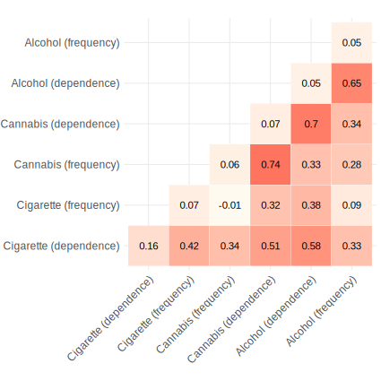
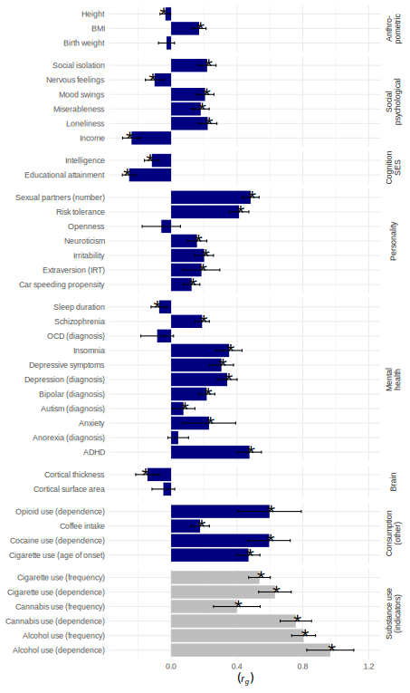

```{r, results='hide', echo=FALSE, message=FALSE, warning = FALSE}

.libPaths("~/Dropbox/progs/R/library")
library(knitr)
library(kableExtra)
HOME=getwd()
setwd(HOME)

```


</br></br></br></br></br>

## Table of Contents
1. [Description](#description)
2. [Estimate genetic correlations](#estimate-correlations)
3. [Specify the structural mode](#specify-structural-modell)
4. [Gene annotation](#functional)
5. [Gene-set enrichment](#enrichment)
6. [LD score regression](#ldsc)
    
    
</br></br>

#### *The documentation below provides a brief overview of all steps involved in the analysis. All scripts and detailed documentations can be found in [ANALYSIS](https://github.com/TabeaSchoeler/TS2021_CommonLiabAddiction/tree/master/analysis)*

#### *The scripts have to be executed in the following order:*
##### *Script 1: `CommonLiabAddiction.sh` (used on a HPC cluster)*
##### *Script 2: `CommonLiabAddiction.R` (used on a desctop computer)*


</br></br>


    
# [Getting started](#description)

</br>


**Getting started with GenomicSEM**

- Read the [wiki and tutorial](https://github.com/GenomicSEM/GenomicSEM/wiki) for the R-package `GenomicSEM`

**Install R packages**

- See [here](https://github.com/TabeaSchoeler/TS2021_CommonLiabAddiction/tree/master/analysis#install-r-packages) for the list packages to be installed


**Download the required software tools, including**

- [PLINK](https://www.cog-genomics.org/plink/) 
- [DEPICT](https://data.broadinstitute.org/mpg/depict/)
- [PASCAL](https://www2.unil.ch/cbg/index.php?title=Pascal)


**Download summary statistic files**

- See [here](https://github.com/TabeaSchoeler/TS2021_CommonLiabAddiction/tree/master/analysis#download-summary-statistic-files) for the list of summary statistic files included in this analysis


</br></br></br>


# [Pre-processing of the summary statistic files](https://github.com/TabeaSchoeler/TS2021_CommonLiabAddiction/tree/master/analysis#pre-processing-of-the-summary-statistic-files)

- includes formatting of the summary statistic files
- running the `munge()` function to prepare the data for LD score regression analysis


</br></br></br>


# [Estimate genetic correlations](https://github.com/TabeaSchoeler/TS2021_CommonLiabAddiction/tree/master/analysis#estimate-genetic-correlations)

- The script can be found [here](https://github.com/TabeaSchoeler/TS2021_CommonLiabAddiction/tree/master/analysis#estimate-genetic-correlations)

[](#estimate-correlations)


</br></br>


# [Specify the structural model](https://github.com/TabeaSchoeler/TS2021_CommonLiabAddiction/tree/master/analysis#specify-the-structural-model)

- The script can be found [here](https://github.com/TabeaSchoeler/TS2021_CommonLiabAddiction/tree/master/analysis#specify-the-structural-model)

[](#specify-structural-model)


</br></br>

# [Run the multivariate genome-wide association study](https://github.com/TabeaSchoeler/TS2021_CommonLiabAddiction/tree/master/analysis#run-the-multivariate-genome-wide-association-study)


</br></br>

# [Clumping and gene mapping](https://github.com/TabeaSchoeler/TS2021_CommonLiabAddiction/tree/master/analysis#clumping-and-gene-mapping)


</br></br>


# [Pasthway analysis in PASCAL and DEPICT](https://github.com/TabeaSchoeler/TS2021_CommonLiabAddiction/tree/master/analysis#pasthway-analysis-in-PASCAL-and-DEPICT)


</br></br>


## [LD score regression analysis including other traits](https://github.com/TabeaSchoeler/TS2021_CommonLiabAddiction/tree/master/analysis#ld-score-regression-analysis-including-other-traits)



</br></br>

# [Mendelian Randomization analysis](https://github.com/TabeaSchoeler/TS2021_CommonLiabAddiction/tree/master/analysis#mendelian-randomization-analysis)

- the script can be found [here](https://github.com/TabeaSchoeler/TS2021_CommonLiabAddiction/tree/master/analysis#mendelian-randomization-analysis)

</br></br>


</br></br>

# [Create Supplementary tables](https://github.com/TabeaSchoeler/TS2021_CommonLiabAddiction/tree/master/analysis#create-supplementary-tables)

- includes script used to derived all supplementary tables included in [CommomLiabAddiction_Tables.xlsx](https://github.com/TabeaSchoeler/TS2021_CommonLiabAddiction/tree/master/results/tables)

- the script can be found [here](https://github.com/TabeaSchoeler/TS2021_CommonLiabAddiction/tree/master/analysis#create-supplementary-tables)


```{r, echo=FALSE, results='asis', warning = FALSE, eval=T}
# Specify by percent
TableSum=readRDS(paste0(HOME,"/results/tables/TableSum.rds"))

listKable=list()

kableFunc=function(df){
tableList=df
headerInput=tableList[["title"]]
dataInput=tableList[["data"]]
rownames(dataInput)=NULL

knitr::kable(as.data.frame(dataInput),
             "html",
             caption = headerInput, 
             digits=2) %>%
  kable_styling() %>%
    scroll_box(width = "900px", height = "300px") %>%
      kable_material_dark() 


}

descFunc=function(df){
  tableList=df
  descInput=tableList[["description"]]
  cat(paste0(descInput))
}

```

### sTable 1

```{r, echo=FALSE, results='asis', warning = FALSE}
kableFunc(TableSum[[1]])
descFunc(TableSum[[1]])

```


</br>

### sTable 2

```{r, echo=FALSE, results='asis', warning = FALSE}
kableFunc(TableSum[[2]])
descFunc(TableSum[[2]])
```


</br>

### sTable 3

```{r, echo=FALSE, results='asis', warning = FALSE}
kableFunc(TableSum[[3]])
descFunc(TableSum[[3]])
```


</br>

### sTable 4

```{r, echo=FALSE, results='asis', warning = FALSE}
kableFunc(TableSum[[4]])
descFunc(TableSum[[4]])
```

</br>

### sTable 5


```{r, echo=FALSE, results='asis', warning = FALSE}
kableFunc(TableSum[[5]])
descFunc(TableSum[[5]])
```


</br>

### sTable 6


```{r, echo=FALSE, results='asis', warning = FALSE}
kableFunc(TableSum[[6]])
descFunc(TableSum[[6]])
```


</br>

### sTable 7


```{r, echo=FALSE, results='asis', warning = FALSE}
kableFunc(TableSum[[7]])
descFunc(TableSum[[7]])
```


</br>

### sTable 8


```{r, echo=FALSE, results='asis', warning = FALSE}
kableFunc(TableSum[[8]])
descFunc(TableSum[[8]])
```


</br>

### sTable 9


```{r, echo=FALSE, results='asis', warning = FALSE}
kableFunc(TableSum[[9]])
descFunc(TableSum[[9]])
```

</br>

### sTable 10


```{r, echo=FALSE, results='asis', warning = FALSE}
kableFunc(TableSum[[10]])
descFunc(TableSum[[10]])
```

</br>

### sTable 11


```{r, echo=FALSE, results='asis', warning = FALSE}
kableFunc(TableSum[[11]])
descFunc(TableSum[[11]])
```


</br>

### sTable 12


```{r, echo=FALSE, results='asis', warning = FALSE}
kableFunc(TableSum[[12]])
descFunc(TableSum[[12]])
```


</br>

### sTable 13


```{r, echo=FALSE, results='asis', warning = FALSE}
kableFunc(TableSum[[13]])
descFunc(TableSum[[13]])
```


