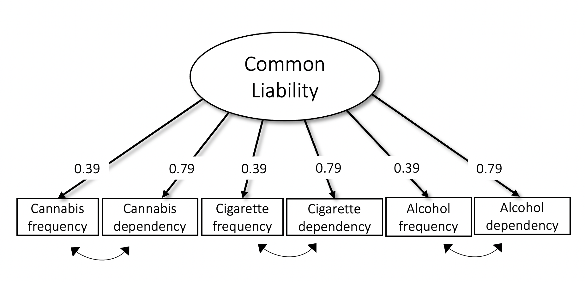

Genome-wide association study on the common liability to addiction
================

## Table of Contents

1.  [Description](#description)
2.  [Model without SNP effects](#model)
3.  [Model with SNP effects](#modelSNP)
4.  [Gene annotation](#functional)
5.  [Gene-set enrichment](#enrichment)
6.  [LD score regression](#ldsc)

# [Description](#description)

  

The following documentation provides a description for all analytical
steps involved in the multivariate genome-wide association study on the
common liability to addiction.

1.  Getting started with GenomicSEM

-   Read the [wiki and
    tutorial](https://github.com/GenomicSEM/GenomicSEM/wiki) for the
    R-package `GenomicSEM`

1.  Install R packages

2.  Download all required software tool, including

-   plink
-   DEPICT
-   PASCAL

  

# [Model without SNP effects](#model)

   

## Estimate genetic correlations

  

  

## Specify the structural model

    

# [Run the multivariate genome-wide association study](#modelSNP)

  

# [Functional follow-up](#functional)

# [LD score regression](#ldsc)
