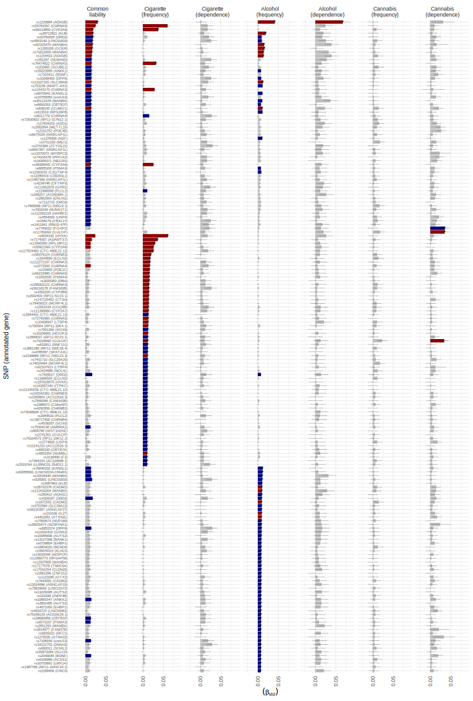

Genome-wide association study on the common liability to addiction
================

     

#### *The documentation below provides a brief overview of all steps involved in the analysis. All scripts and detailed documentations can be found in [ANALYSIS](https://github.com/TabeaSchoeler/TS2021_CommonLiabAddiction/tree/master/analysis)*

#### *The scripts have to be executed in the following order:*

##### *Script 1: `CommonLiabAddiction.sh` (used on a HPC cluster)*

##### *Script 2: `CommonLiabAddiction.R` (used on a desctop computer)*

  

# [Getting started](#description)

**Getting started with GenomicSEM**

-   Read the [wiki and
    tutorial](https://github.com/GenomicSEM/GenomicSEM/wiki) for the
    R-package `GenomicSEM`

**Install R packages**

-   See
    [here](https://github.com/TabeaSchoeler/TS2021_CommonLiabAddiction/tree/master/analysis#install-r-packages)
    for the list packages to be installed

**Download the required software tools, including**

-   [PLINK](https://www.cog-genomics.org/plink/)
-   [DEPICT](https://data.broadinstitute.org/mpg/depict/)
-   [PASCAL](https://www2.unil.ch/cbg/index.php?title=Pascal)

**Download summary statistic files**

-   See
    [here](https://github.com/TabeaSchoeler/TS2021_CommonLiabAddiction/tree/master/analysis#download-summary-statistic-files)
    for the list of summary statistic files included in this analysis

   

# [Pre-processing of the summary statistic files](https://github.com/TabeaSchoeler/TS2021_CommonLiabAddiction/tree/master/analysis#pre-processing-of-the-summary-statistic-files)

-   includes formatting of the summary statistic files
-   running the `munge()` function to prepare the data for LD score
    regression analysis
-   he script can be found
    [here](https://github.com/TabeaSchoeler/TS2021_CommonLiabAddiction/tree/master/analysis#pre-processing-of-the-summary-statistic-files)

   

# [Estimate genetic correlations](https://github.com/TabeaSchoeler/TS2021_CommonLiabAddiction/tree/master/analysis#estimate-genetic-correlations)

-   the script can be found
    [here](https://github.com/TabeaSchoeler/TS2021_CommonLiabAddiction/tree/master/analysis#estimate-genetic-correlations)

    

# [Specify the structural model](https://github.com/TabeaSchoeler/TS2021_CommonLiabAddiction/tree/master/analysis#specify-the-structural-model)

-   the script can be found
    [here](https://github.com/TabeaSchoeler/TS2021_CommonLiabAddiction/tree/master/analysis#specify-the-structural-model)

   

# [Run the multivariate genome-wide association study](https://github.com/TabeaSchoeler/TS2021_CommonLiabAddiction/tree/master/analysis#run-the-multivariate-genome-wide-association-study)

-   the script can be found
    [here](https://github.com/TabeaSchoeler/TS2021_CommonLiabAddiction/tree/master/analysis#run-the-multivariate-genome-wide-association-study)

   

# [Clumping and gene mapping](https://github.com/TabeaSchoeler/TS2021_CommonLiabAddiction/tree/master/analysis#clumping-and-gene-mapping)

-   the script can be found
    [here](https://github.com/TabeaSchoeler/TS2021_CommonLiabAddiction/tree/master/analysis#clumping-and-gene-mapping)

   

# [Pasthway analysis in PASCAL and DEPICT](https://github.com/TabeaSchoeler/TS2021_CommonLiabAddiction/tree/master/analysis#pasthway-analysis-in-PASCAL-and-DEPICT)

-   the script can be found
    [here](https://github.com/TabeaSchoeler/TS2021_CommonLiabAddiction/tree/master/analysis#pasthway-analysis-in-PASCAL-and-DEPICT)

   

## [LD score regression analysis including other traits](https://github.com/TabeaSchoeler/TS2021_CommonLiabAddiction/tree/master/analysis#ld-score-regression-analysis-including-other-traits)

-   the script can be found
    [here](https://github.com/TabeaSchoeler/TS2021_CommonLiabAddiction/tree/master/analysis#ld-score-regression-analysis-including-other-traits)

   

# [Mendelian Randomization analysis](https://github.com/TabeaSchoeler/TS2021_CommonLiabAddiction/tree/master/analysis#mendelian-randomization-analysis)

-   the script can be found
    [here](https://github.com/TabeaSchoeler/TS2021_CommonLiabAddiction/tree/master/analysis#mendelian-randomization-analysis)

   

# [Create Supplementary tables](https://github.com/TabeaSchoeler/TS2021_CommonLiabAddiction/tree/master/analysis#create-supplementary-tables)

-   includes script used to derived all supplementary tables included in
    [CommomLiabAddiction\_Tables.xlsx](https://github.com/TabeaSchoeler/TS2021_CommonLiabAddiction/tree/master/results/tables)

-   the script can be found
    [here](https://github.com/TabeaSchoeler/TS2021_CommonLiabAddiction/tree/master/analysis#create-supplementary-tables)

### sTable 1

<table class="table" style="margin-left: auto; margin-right: auto;">
<caption>
sTable 1. Overview of summary statistic files used in the multivariate
genome-wide association study
</caption>
<thead>
<tr>
<th style="text-align:left;position: sticky; top:0; background-color: #FFFFFF;">
Summary statistic file
</th>
<th style="text-align:right;position: sticky; top:0; background-color: #FFFFFF;">
Sample size
</th>
<th style="text-align:right;position: sticky; top:0; background-color: #FFFFFF;">
SNP-based heritability (h2 estimate)
</th>
<th style="text-align:right;position: sticky; top:0; background-color: #FFFFFF;">
SNP-based heritability (h2 standard error)
</th>
<th style="text-align:right;position: sticky; top:0; background-color: #FFFFFF;">
Intercept
</th>
<th style="text-align:left;position: sticky; top:0; background-color: #FFFFFF;">
Link to summary statistics file
</th>
<th style="text-align:left;position: sticky; top:0; background-color: #FFFFFF;">
Link to study
</th>
</tr>
</thead>
<tbody>
<tr>
<td style="text-align:left;">
ADHD
</td>
<td style="text-align:right;">
53293
</td>
<td style="text-align:right;">
0.18
</td>
<td style="text-align:right;">
0.01
</td>
<td style="text-align:right;">
1.03
</td>
<td style="text-align:left;">
<https://www.med.unc.edu/pgc/download-results/>
</td>
<td style="text-align:left;">
<https://doi.org/10.1038/s41588-018-0269-7>
</td>
</tr>
<tr>
<td style="text-align:left;">
Alcohol use (dependence)
</td>
<td style="text-align:right;">
28757
</td>
<td style="text-align:right;">
0.07
</td>
<td style="text-align:right;">
0.01
</td>
<td style="text-align:right;">
1.01
</td>
<td style="text-align:left;">
<https://www.med.unc.edu/pgc/download-results/sud>
</td>
<td style="text-align:left;">
<https://doi.org/10.1038/s41593-018-0275-1>
</td>
</tr>
<tr>
<td style="text-align:left;">
Anorexia (diagnosis)
</td>
<td style="text-align:right;">
72517
</td>
<td style="text-align:right;">
0.16
</td>
<td style="text-align:right;">
0.01
</td>
<td style="text-align:right;">
1.02
</td>
<td style="text-align:left;">
<https://www.med.unc.edu/pgc/download-results/>
</td>
<td style="text-align:left;">
<https://doi.org/10.1038/s41588-019-0439-2>
</td>
</tr>
<tr>
<td style="text-align:left;">
Anxiety
</td>
<td style="text-align:right;">
18186
</td>
<td style="text-align:right;">
0.12
</td>
<td style="text-align:right;">
0.05
</td>
<td style="text-align:right;">
1.00
</td>
<td style="text-align:left;">
<https://www.med.unc.edu/pgc/download-results/>
</td>
<td style="text-align:left;">
<https://doi.org/10.1038/mp.2015.197>
</td>
</tr>
<tr>
<td style="text-align:left;">
Autism (diagnosis)
</td>
<td style="text-align:right;">
46350
</td>
<td style="text-align:right;">
0.20
</td>
<td style="text-align:right;">
0.02
</td>
<td style="text-align:right;">
1.00
</td>
<td style="text-align:left;">
<https://ipsych.dk/en/research/downloads/>
</td>
<td style="text-align:left;">
<https://doi.org/10.1038/s41588-019-0344-8>
</td>
</tr>
<tr>
<td style="text-align:left;">
Bipolar (diagnosis)
</td>
<td style="text-align:right;">
392324
</td>
<td style="text-align:right;">
0.11
</td>
<td style="text-align:right;">
0.00
</td>
<td style="text-align:right;">
1.02
</td>
<td style="text-align:left;">
<https://figshare.com/s/53af8c444bb949be273c>
</td>
<td style="text-align:left;">
<https://doi.org/10.1101/2020.09.17.20187054>
</td>
</tr>
<tr>
<td style="text-align:left;">
Birth weight
</td>
<td style="text-align:right;">
205475
</td>
<td style="text-align:right;">
0.11
</td>
<td style="text-align:right;">
0.01
</td>
<td style="text-align:right;">
1.05
</td>
<td style="text-align:left;">
<http://www.nealelab.is/uk-biobank>
</td>
<td style="text-align:left;">
<http://www.nealelab.is/uk-biobank>
</td>
</tr>
<tr>
<td style="text-align:left;">
BMI
</td>
<td style="text-align:right;">
681275
</td>
<td style="text-align:right;">
0.21
</td>
<td style="text-align:right;">
0.01
</td>
<td style="text-align:right;">
1.02
</td>
<td style="text-align:left;">
<https://portals.broadinstitute.org/collaboration/giant/index.php/GIANT_consortium_data_files#GIANT_Consortium_2016_Exome_Array_Data_is_Available_Here_for_Download>
</td>
<td style="text-align:left;">
<https://doi.org/10.1093/hmg/ddy271>
</td>
</tr>
<tr>
<td style="text-align:left;">
Cannabis use (dependence)
</td>
<td style="text-align:right;">
358534
</td>
<td style="text-align:right;">
0.07
</td>
<td style="text-align:right;">
0.01
</td>
<td style="text-align:right;">
0.99
</td>
<td style="text-align:left;">
<https://www.med.unc.edu/pgc/download-results/sud>
</td>
<td style="text-align:left;">
<https://doi.org/10.1016/S2215-0366(20)30339-4>
</td>
</tr>
<tr>
<td style="text-align:left;">
Cannabis use (frequency)
</td>
<td style="text-align:right;">
24798
</td>
<td style="text-align:right;">
0.06
</td>
<td style="text-align:right;">
0.02
</td>
<td style="text-align:right;">
0.99
</td>
<td style="text-align:left;">
<http://www.nealelab.is/uk-biobank>
</td>
<td style="text-align:left;">
<http://www.nealelab.is/uk-biobank>
</td>
</tr>
<tr>
<td style="text-align:left;">
Car speeding propensity
</td>
<td style="text-align:right;">
404291
</td>
<td style="text-align:right;">
0.06
</td>
<td style="text-align:right;">
0.00
</td>
<td style="text-align:right;">
1.01
</td>
<td style="text-align:left;">
<https://www.thessgac.org/data>
</td>
<td style="text-align:left;">
<https://doi.org/10.1038/s41588-018-0309-3>
</td>
</tr>
<tr>
<td style="text-align:left;">
Cigarette use (age of onset)
</td>
<td style="text-align:right;">
246692
</td>
<td style="text-align:right;">
0.05
</td>
<td style="text-align:right;">
0.00
</td>
<td style="text-align:right;">
0.98
</td>
<td style="text-align:left;">
<https://conservancy.umn.edu/handle/11299/201564>
</td>
<td style="text-align:left;">
<https://www.nature.com/articles/s41588-018-0307-5>
</td>
</tr>
<tr>
<td style="text-align:left;">
Cigarette use (dependence)
</td>
<td style="text-align:right;">
244890
</td>
<td style="text-align:right;">
0.16
</td>
<td style="text-align:right;">
0.02
</td>
<td style="text-align:right;">
1.00
</td>
<td style="text-align:left;">
<https://atlas.ctglab.nl/traitDB/3689>
</td>
<td style="text-align:left;">
<https://doi.org/10.1038/s41588-018-0248-z>
</td>
</tr>
<tr>
<td style="text-align:left;">
Cigarette use (frequency)
</td>
<td style="text-align:right;">
245876
</td>
<td style="text-align:right;">
0.07
</td>
<td style="text-align:right;">
0.00
</td>
<td style="text-align:right;">
0.96
</td>
<td style="text-align:left;">
<https://conservancy.umn.edu/handle/1129+O38+N38+M3+C38>
</td>
<td style="text-align:left;">
<https://www.nature.com/articles/s41588-018-0307-5>
</td>
</tr>
<tr>
<td style="text-align:left;">
Cocaine use (dependence)
</td>
<td style="text-align:right;">
6378
</td>
<td style="text-align:right;">
0.27
</td>
<td style="text-align:right;">
0.05
</td>
<td style="text-align:right;">
1.02
</td>
<td style="text-align:left;">
personal correspondence
</td>
<td style="text-align:left;">
<https://doi.org/10.1016/j.pnpbp.2019.109667>
</td>
</tr>
<tr>
<td style="text-align:left;">
Coffee intake
</td>
<td style="text-align:right;">
334659
</td>
<td style="text-align:right;">
0.05
</td>
<td style="text-align:right;">
0.00
</td>
<td style="text-align:right;">
1.00
</td>
<td style="text-align:left;">
<http://www.nealelab.is/uk-biobank>
</td>
<td style="text-align:left;">
<http://www.nealelab.is/uk-biobank>
</td>
</tr>
<tr>
<td style="text-align:left;">
Common liability
</td>
<td style="text-align:right;">
187062
</td>
<td style="text-align:right;">
NA
</td>
<td style="text-align:right;">
NA
</td>
<td style="text-align:right;">
NA
</td>
<td style="text-align:left;">
NA
</td>
<td style="text-align:left;">
NA
</td>
</tr>
<tr>
<td style="text-align:left;">
Cortical surface area
</td>
<td style="text-align:right;">
28157
</td>
<td style="text-align:right;">
0.39
</td>
<td style="text-align:right;">
0.03
</td>
<td style="text-align:right;">
1.01
</td>
<td style="text-align:left;">
<http://enigma.ini.usc.edu/protocols/genetics-protocols/>
</td>
<td style="text-align:left;">
<https://doi.org/10.1126/science.aay6690>
</td>
</tr>
<tr>
<td style="text-align:left;">
Cortical thickness
</td>
<td style="text-align:right;">
28853
</td>
<td style="text-align:right;">
0.30
</td>
<td style="text-align:right;">
0.02
</td>
<td style="text-align:right;">
1.01
</td>
<td style="text-align:left;">
<http://enigma.ini.usc.edu/protocols/genetics-protocols/>
</td>
<td style="text-align:left;">
<https://doi.org/10.1126/science.aay6690>
</td>
</tr>
<tr>
<td style="text-align:left;">
Depression (diagnosis)
</td>
<td style="text-align:right;">
173005
</td>
<td style="text-align:right;">
0.10
</td>
<td style="text-align:right;">
0.01
</td>
<td style="text-align:right;">
0.99
</td>
<td style="text-align:left;">
<https://www.med.unc.edu/pgc/download-results/>
</td>
<td style="text-align:left;">
<https://doi.org/10.1038/s41588-018-0090-3>
</td>
</tr>
<tr>
<td style="text-align:left;">
Depressive symptoms
</td>
<td style="text-align:right;">
161460
</td>
<td style="text-align:right;">
0.05
</td>
<td style="text-align:right;">
0.00
</td>
<td style="text-align:right;">
1.00
</td>
<td style="text-align:left;">
<https://www.thessgac.org/data>
</td>
<td style="text-align:left;">
<https://doi.org/10.1038/ng.3552>
</td>
</tr>
<tr>
<td style="text-align:left;">
Alcohol use (frequency)
</td>
<td style="text-align:right;">
513208
</td>
<td style="text-align:right;">
0.05
</td>
<td style="text-align:right;">
0.00
</td>
<td style="text-align:right;">
0.92
</td>
<td style="text-align:left;">
<https://conservancy.umn.edu/handle/11299/201564>
</td>
<td style="text-align:left;">
<https://www.nature.com/articles/s41588-018-0307-5>
</td>
</tr>
<tr>
<td style="text-align:left;">
Educational attainment
</td>
<td style="text-align:right;">
766345
</td>
<td style="text-align:right;">
0.11
</td>
<td style="text-align:right;">
0.00
</td>
<td style="text-align:right;">
0.98
</td>
<td style="text-align:left;">
<https://www.thessgac.org/data>
</td>
<td style="text-align:left;">
<https://doi.org/10.1038/s41588-018-0147-3>
</td>
</tr>
<tr>
<td style="text-align:left;">
Extraversion (IRT)
</td>
<td style="text-align:right;">
63030
</td>
<td style="text-align:right;">
0.05
</td>
<td style="text-align:right;">
0.01
</td>
<td style="text-align:right;">
1.00
</td>
<td style="text-align:left;">
<https://tweelingenregister.vu.nl/gpc>
</td>
<td style="text-align:left;">
<https://doi.org/10.1007/s10519-014-9654-x>
</td>
</tr>
<tr>
<td style="text-align:left;">
Height
</td>
<td style="text-align:right;">
693529
</td>
<td style="text-align:right;">
0.49
</td>
<td style="text-align:right;">
0.02
</td>
<td style="text-align:right;">
1.50
</td>
<td style="text-align:left;">
<https://portals.broadinstitute.org/collaboration/giant/index.php/GIANT_consortium_data_files>
</td>
<td style="text-align:left;">
<https://doi.org/10.1093/hmg/ddy271>
</td>
</tr>
<tr>
<td style="text-align:left;">
Income
</td>
<td style="text-align:right;">
286301
</td>
<td style="text-align:right;">
0.07
</td>
<td style="text-align:right;">
0.00
</td>
<td style="text-align:right;">
1.03
</td>
<td style="text-align:left;">
<ftp://ftp.ebi.ac.uk/pub/databases/gwas/summary_statistics/HillWD_31844048_GCST009524>
</td>
<td style="text-align:left;">
doi.org/10.1038/s41467-019-13585-5
</td>
</tr>
<tr>
<td style="text-align:left;">
Insomnia
</td>
<td style="text-align:right;">
113006
</td>
<td style="text-align:right;">
0.07
</td>
<td style="text-align:right;">
0.01
</td>
<td style="text-align:right;">
1.00
</td>
<td style="text-align:left;">
<http://ctg.cncr.nl/software/summary_statistics>
</td>
<td style="text-align:left;">
<https://doi.org/10.1038/ng.3888>
</td>
</tr>
<tr>
<td style="text-align:left;">
Intelligence
</td>
<td style="text-align:right;">
269867
</td>
<td style="text-align:right;">
0.19
</td>
<td style="text-align:right;">
0.01
</td>
<td style="text-align:right;">
1.03
</td>
<td style="text-align:left;">
<https://ctg.cncr.nl/software/summary_statistics>
</td>
<td style="text-align:left;">
<https://doi.org/10.1038/s41588-018-0152-6>
</td>
</tr>
<tr>
<td style="text-align:left;">
Irritability
</td>
<td style="text-align:right;">
114422
</td>
<td style="text-align:right;">
0.37
</td>
<td style="text-align:right;">
0.02
</td>
<td style="text-align:right;">
1.00
</td>
<td style="text-align:left;">
<http://www.nealelab.is/uk-biobank>
</td>
<td style="text-align:left;">
<http://www.nealelab.is/uk-biobank>
</td>
</tr>
<tr>
<td style="text-align:left;">
Loneliness
</td>
<td style="text-align:right;">
445024
</td>
<td style="text-align:right;">
0.04
</td>
<td style="text-align:right;">
0.00
</td>
<td style="text-align:right;">
1.03
</td>
<td style="text-align:left;">
<https://www.repository.cam.ac.uk/handle/1810/277812>
</td>
<td style="text-align:left;">
doi.org/10.17863/CAM.23511
</td>
</tr>
<tr>
<td style="text-align:left;">
Miserableness
</td>
<td style="text-align:right;">
355182
</td>
<td style="text-align:right;">
0.10
</td>
<td style="text-align:right;">
0.01
</td>
<td style="text-align:right;">
1.01
</td>
<td style="text-align:left;">
<http://www.nealelab.is/uk-biobank>
</td>
<td style="text-align:left;">
<http://www.nealelab.is/uk-biobank>
</td>
</tr>
<tr>
<td style="text-align:left;">
Mood swings
</td>
<td style="text-align:right;">
352604
</td>
<td style="text-align:right;">
0.11
</td>
<td style="text-align:right;">
0.01
</td>
<td style="text-align:right;">
1.02
</td>
<td style="text-align:left;">
<http://www.nealelab.is/uk-biobank>
</td>
<td style="text-align:left;">
<http://www.nealelab.is/uk-biobank>
</td>
</tr>
<tr>
<td style="text-align:left;">
Nervous feelings
</td>
<td style="text-align:right;">
351829
</td>
<td style="text-align:right;">
0.12
</td>
<td style="text-align:right;">
0.01
</td>
<td style="text-align:right;">
1.02
</td>
<td style="text-align:left;">
<http://www.nealelab.is/uk-biobank>
</td>
<td style="text-align:left;">
<http://www.nealelab.is/uk-biobank>
</td>
</tr>
<tr>
<td style="text-align:left;">
Neuroticism
</td>
<td style="text-align:right;">
168105
</td>
<td style="text-align:right;">
0.10
</td>
<td style="text-align:right;">
0.01
</td>
<td style="text-align:right;">
0.98
</td>
<td style="text-align:left;">
<https://ctg.cncr.nl/software/summary_statistics>
</td>
<td style="text-align:left;">
<https://doi.org/10.1038/s41588-018-0151-7>
</td>
</tr>
<tr>
<td style="text-align:left;">
OCD (diagnosis)
</td>
<td style="text-align:right;">
9725
</td>
<td style="text-align:right;">
0.28
</td>
<td style="text-align:right;">
0.04
</td>
<td style="text-align:right;">
0.99
</td>
<td style="text-align:left;">
<https://www.med.unc.edu/pgc/download-results/>
</td>
<td style="text-align:left;">
<https://doi.org/10.1038/mp.2017.154>
</td>
</tr>
<tr>
<td style="text-align:left;">
Openness
</td>
<td style="text-align:right;">
17375
</td>
<td style="text-align:right;">
0.11
</td>
<td style="text-align:right;">
0.03
</td>
<td style="text-align:right;">
0.99
</td>
<td style="text-align:left;">
<https://tweelingenregister.vu.nl/gpc>
</td>
<td style="text-align:left;">
<https://doi.org/10.1038/mp.2010.128>
</td>
</tr>
<tr>
<td style="text-align:left;">
Opioid use (dependence)
</td>
<td style="text-align:right;">
11415
</td>
<td style="text-align:right;">
0.09
</td>
<td style="text-align:right;">
0.03
</td>
<td style="text-align:right;">
1.03
</td>
<td style="text-align:left;">
<https://www.med.unc.edu/pgc/download-results/sud>
</td>
<td style="text-align:left;">
NA
</td>
</tr>
<tr>
<td style="text-align:left;">
Risk tolerance
</td>
<td style="text-align:right;">
466571
</td>
<td style="text-align:right;">
0.05
</td>
<td style="text-align:right;">
0.00
</td>
<td style="text-align:right;">
1.01
</td>
<td style="text-align:left;">
<https://www.thessgac.org/data>
</td>
<td style="text-align:left;">
<https://doi.org/10.1038/s41588-018-0309-3>
</td>
</tr>
<tr>
<td style="text-align:left;">
Schizophrenia
</td>
<td style="text-align:right;">
161405
</td>
<td style="text-align:right;">
0.19
</td>
<td style="text-align:right;">
0.01
</td>
<td style="text-align:right;">
1.05
</td>
<td style="text-align:left;">
<https://www.med.unc.edu/pgc/download-results/>
</td>
<td style="text-align:left;">
<https://doi.org/10.1101/2020.09.12.20192922>
</td>
</tr>
<tr>
<td style="text-align:left;">
Sexual partners (number)
</td>
<td style="text-align:right;">
370711
</td>
<td style="text-align:right;">
0.10
</td>
<td style="text-align:right;">
0.00
</td>
<td style="text-align:right;">
1.01
</td>
<td style="text-align:left;">
<https://www.thessgac.org/data>
</td>
<td style="text-align:left;">
<https://doi.org/10.1038/s41588-018-0309-3>
</td>
</tr>
<tr>
<td style="text-align:left;">
Sleep duration
</td>
<td style="text-align:right;">
384317
</td>
<td style="text-align:right;">
0.07
</td>
<td style="text-align:right;">
0.00
</td>
<td style="text-align:right;">
1.01
</td>
<td style="text-align:left;">
<http://ctg.cncr.nl/software/summary_statistics>
</td>
<td style="text-align:left;">
<https://doi.org/10.1038/ng.3888>
</td>
</tr>
<tr>
<td style="text-align:left;">
Social isolation
</td>
<td style="text-align:right;">
487647
</td>
<td style="text-align:right;">
0.04
</td>
<td style="text-align:right;">
0.00
</td>
<td style="text-align:right;">
0.99
</td>
<td style="text-align:left;">
<https://www.repository.cam.ac.uk/handle/1810/277812>
</td>
<td style="text-align:left;">
doi.org/10.17863/CAM.23511
</td>
</tr>
</tbody>
</table>

List of summary statistic files used to derive the common hertiable
liability to addiction, as well as all summary statistic files used in
LD score regression analysis assessing the genetic correlations between
the common liability and other traits. Heritability (h2) estimates and
the intercepts were estimated using univariate LD score regression
implemented in GenomicSEM

 

### sTable 2

<table class="table" style="margin-left: auto; margin-right: auto;">
<caption>
sTable 2. Genetic correlations between the individual substance use
phenotypes
</caption>
<thead>
<tr>
<th style="text-align:left;position: sticky; top:0; background-color: #FFFFFF;">
Phenotype
</th>
<th style="text-align:left;position: sticky; top:0; background-color: #FFFFFF;">
Cannabis (frequency)
</th>
<th style="text-align:left;position: sticky; top:0; background-color: #FFFFFF;">
Cannabis (dependence)
</th>
<th style="text-align:left;position: sticky; top:0; background-color: #FFFFFF;">
Cigarette (dependence)
</th>
<th style="text-align:left;position: sticky; top:0; background-color: #FFFFFF;">
Alcohol (dependence)
</th>
<th style="text-align:left;position: sticky; top:0; background-color: #FFFFFF;">
Cigarette (frequency)
</th>
<th style="text-align:left;position: sticky; top:0; background-color: #FFFFFF;">
Alcohol (frequency)
</th>
</tr>
</thead>
<tbody>
<tr>
<td style="text-align:left;">
Cannabis (frequency)
</td>
<td style="text-align:left;">
0.056
</td>
<td style="text-align:left;">
0.743
</td>
<td style="text-align:left;">
0.345
</td>
<td style="text-align:left;">
0.329
</td>
<td style="text-align:left;">
-0.014
</td>
<td style="text-align:left;">
0.28
</td>
</tr>
<tr>
<td style="text-align:left;">
Cannabis (dependence)
</td>
<td style="text-align:left;">
0.743
</td>
<td style="text-align:left;">
0.07
</td>
<td style="text-align:left;">
0.509
</td>
<td style="text-align:left;">
0.702
</td>
<td style="text-align:left;">
0.321
</td>
<td style="text-align:left;">
0.345
</td>
</tr>
<tr>
<td style="text-align:left;">
Cigarette (dependence)
</td>
<td style="text-align:left;">
0.345
</td>
<td style="text-align:left;">
0.509
</td>
<td style="text-align:left;">
0.164
</td>
<td style="text-align:left;">
0.576
</td>
<td style="text-align:left;">
0.421
</td>
<td style="text-align:left;">
0.334
</td>
</tr>
<tr>
<td style="text-align:left;">
Alcohol (dependence)
</td>
<td style="text-align:left;">
0.329
</td>
<td style="text-align:left;">
0.702
</td>
<td style="text-align:left;">
0.576
</td>
<td style="text-align:left;">
0.053
</td>
<td style="text-align:left;">
0.381
</td>
<td style="text-align:left;">
0.652
</td>
</tr>
<tr>
<td style="text-align:left;">
Cigarette (frequency)
</td>
<td style="text-align:left;">
-0.014
</td>
<td style="text-align:left;">
0.321
</td>
<td style="text-align:left;">
0.421
</td>
<td style="text-align:left;">
0.381
</td>
<td style="text-align:left;">
0.068
</td>
<td style="text-align:left;">
0.093
</td>
</tr>
<tr>
<td style="text-align:left;">
Alcohol (frequency)
</td>
<td style="text-align:left;">
0.28
</td>
<td style="text-align:left;">
0.345
</td>
<td style="text-align:left;">
0.334
</td>
<td style="text-align:left;">
0.652
</td>
<td style="text-align:left;">
0.093
</td>
<td style="text-align:left;">
0.049
</td>
</tr>
</tbody>
</table>

Shown are the genetic correlations between each of the cigarette,
alcohol and cannabis use phenotypes, with heritability estimates
displayed down the diagonal. The mean genetic correlation is rg=0.4
\[sd=0.21, median=0.34 and range (-0.01-0.74)\]

 

### sTable 3

<table class="table" style="margin-left: auto; margin-right: auto;">
<caption>
sTable 3. Estimates of the genomic factor model
</caption>
<thead>
<tr>
<th style="text-align:left;position: sticky; top:0; background-color: #FFFFFF;">
Indicator
</th>
<th style="text-align:right;position: sticky; top:0; background-color: #FFFFFF;">
Estimate (standardized)
</th>
<th style="text-align:right;position: sticky; top:0; background-color: #FFFFFF;">
Variance (common liability)
</th>
<th style="text-align:right;position: sticky; top:0; background-color: #FFFFFF;">
Variance (specific)
</th>
</tr>
</thead>
<tbody>
<tr>
<td style="text-align:left;">
Common liability \~ Alcohol (frequency)
</td>
<td style="text-align:right;">
0.39
</td>
<td style="text-align:right;">
0.15
</td>
<td style="text-align:right;">
0.85
</td>
</tr>
<tr>
<td style="text-align:left;">
Common liability \~ Cigarette (frequency)
</td>
<td style="text-align:right;">
0.39
</td>
<td style="text-align:right;">
0.15
</td>
<td style="text-align:right;">
0.85
</td>
</tr>
<tr>
<td style="text-align:left;">
Common liability \~ Cannabis (frequency)
</td>
<td style="text-align:right;">
0.39
</td>
<td style="text-align:right;">
0.15
</td>
<td style="text-align:right;">
0.85
</td>
</tr>
<tr>
<td style="text-align:left;">
Common liability \~ Cigarette (dependence)
</td>
<td style="text-align:right;">
0.79
</td>
<td style="text-align:right;">
0.62
</td>
<td style="text-align:right;">
0.38
</td>
</tr>
<tr>
<td style="text-align:left;">
Common liability \~ Alcohol (dependence)
</td>
<td style="text-align:right;">
0.79
</td>
<td style="text-align:right;">
0.62
</td>
<td style="text-align:right;">
0.38
</td>
</tr>
<tr>
<td style="text-align:left;">
Common liability \~ Cannabis (dependence)
</td>
<td style="text-align:right;">
0.79
</td>
<td style="text-align:right;">
0.62
</td>
<td style="text-align:right;">
0.38
</td>
</tr>
</tbody>
</table>

All substance use phenotypes are scaled so that higher scores indicate
more problematic substance use, such as higher frequency of use and the
presence of substance use dependence. Estimate (standardized) = the
standardized linear relationship between the factor and each of the
individual substance use phenotypes. Variance (common liability) =
variance per phenotype explained by the common liability. Variance
(specific) = variance per phenotype not explained by the common
liability. On average, the common liability factor accounted for 38.81%
(range 15.21%-62.41%) of the genetic variance in the six substance use
phenotypes.

 

### sTable 4

<table class="table" style="margin-left: auto; margin-right: auto;">
<caption>
sTable 4. Fit indicies of the factor model representing the common
heritable liability to addiction
</caption>
<thead>
<tr>
<th style="text-align:right;position: sticky; top:0; background-color: #FFFFFF;">
chisq
</th>
<th style="text-align:right;position: sticky; top:0; background-color: #FFFFFF;">
df
</th>
<th style="text-align:left;position: sticky; top:0; background-color: #FFFFFF;">
p\_chisq
</th>
<th style="text-align:right;position: sticky; top:0; background-color: #FFFFFF;">
CFI
</th>
<th style="text-align:right;position: sticky; top:0; background-color: #FFFFFF;">
SRMR
</th>
</tr>
</thead>
<tbody>
<tr>
<td style="text-align:right;">
24.79
</td>
<td style="text-align:right;">
10
</td>
<td style="text-align:left;">
0.00575
</td>
<td style="text-align:right;">
0.97
</td>
<td style="text-align:right;">
0.07
</td>
</tr>
</tbody>
</table>

chisq = chi-square statistic; CFI = the comparative fit index; SRMR =
the standardized root mean square residual

 

### sTable 5

<table class="table" style="margin-left: auto; margin-right: auto;">
<caption>
sTable 5. Overview of the results from the multi- and univariate
genome-wide association analyses
</caption>
<thead>
<tr>
<th style="text-align:left;position: sticky; top:0; background-color: #FFFFFF;">
GWAS
</th>
<th style="text-align:right;position: sticky; top:0; background-color: #FFFFFF;">
N (sample)
</th>
<th style="text-align:right;position: sticky; top:0; background-color: #FFFFFF;">
included SNPs
</th>
<th style="text-align:right;position: sticky; top:0; background-color: #FFFFFF;">
number of LD-independent genome-wide SNPs
</th>
<th style="text-align:left;position: sticky; top:0; background-color: #FFFFFF;">
smallest p-value
</th>
<th style="text-align:right;position: sticky; top:0; background-color: #FFFFFF;">
SNPs (shared)
</th>
<th style="text-align:right;position: sticky; top:0; background-color: #FFFFFF;">
SNPs (non-shared)
</th>
</tr>
</thead>
<tbody>
<tr>
<td style="text-align:left;">
Common liability
</td>
<td style="text-align:right;">
187062
</td>
<td style="text-align:right;">
6500152
</td>
<td style="text-align:right;">
55
</td>
<td style="text-align:left;">
6.1e-39
</td>
<td style="text-align:right;">
42
</td>
<td style="text-align:right;">
13
</td>
</tr>
<tr>
<td style="text-align:left;">
Cannabis (frequency)
</td>
<td style="text-align:right;">
24798
</td>
<td style="text-align:right;">
6500152
</td>
<td style="text-align:right;">
0
</td>
<td style="text-align:left;">
NA
</td>
<td style="text-align:right;">
0
</td>
<td style="text-align:right;">
0
</td>
</tr>
<tr>
<td style="text-align:left;">
Cannabis (dependence)
</td>
<td style="text-align:right;">
339909
</td>
<td style="text-align:right;">
6500152
</td>
<td style="text-align:right;">
2
</td>
<td style="text-align:left;">
1.8e-09
</td>
<td style="text-align:right;">
1
</td>
<td style="text-align:right;">
1
</td>
</tr>
<tr>
<td style="text-align:left;">
Cigarette (dependence)
</td>
<td style="text-align:right;">
243441
</td>
<td style="text-align:right;">
6500152
</td>
<td style="text-align:right;">
0
</td>
<td style="text-align:left;">
NA
</td>
<td style="text-align:right;">
0
</td>
<td style="text-align:right;">
0
</td>
</tr>
<tr>
<td style="text-align:left;">
Alcohol (dependence)
</td>
<td style="text-align:right;">
28757
</td>
<td style="text-align:right;">
6500152
</td>
<td style="text-align:right;">
1
</td>
<td style="text-align:left;">
2e-13
</td>
<td style="text-align:right;">
0
</td>
<td style="text-align:right;">
1
</td>
</tr>
<tr>
<td style="text-align:left;">
Cigarette (frequency)
</td>
<td style="text-align:right;">
261357
</td>
<td style="text-align:right;">
6500152
</td>
<td style="text-align:right;">
64
</td>
<td style="text-align:left;">
4.8e-211
</td>
<td style="text-align:right;">
34
</td>
<td style="text-align:right;">
30
</td>
</tr>
<tr>
<td style="text-align:left;">
Alcohol (frequency)
</td>
<td style="text-align:right;">
536329
</td>
<td style="text-align:right;">
6500152
</td>
<td style="text-align:right;">
64
</td>
<td style="text-align:left;">
1.6e-203
</td>
<td style="text-align:right;">
51
</td>
<td style="text-align:right;">
13
</td>
</tr>
</tbody>
</table>

SNP = single nucleotide polymorphism. The effective sample size of the
common liability genome-wide association study (GWAS) was calculated
using the formula described in the sMethods (Supplement). SNPs (shared)
represent SNPs that operate via the common liability (i.e., with Qsnp
p&gt;5×10−8) versus SNPs (non-shared) that show heterogeneous effects
across the individual cigarette, alcohol and cannabis use phenotyes
(i.e., Qsnp p&lt;5×10−8)

 

### sTable 6

<table class="table" style="margin-left: auto; margin-right: auto;">
<caption>
sTable 6. Summary of lead genetic variants associated with the commmon
liability to addiction
</caption>
<thead>
<tr>
<th style="text-align:left;position: sticky; top:0; background-color: #FFFFFF;">
GWA data
</th>
<th style="text-align:left;position: sticky; top:0; background-color: #FFFFFF;">
SNP (annotated gene)
</th>
<th style="text-align:right;position: sticky; top:0; background-color: #FFFFFF;">
Position
</th>
<th style="text-align:right;position: sticky; top:0; background-color: #FFFFFF;">
Chromosome
</th>
<th style="text-align:left;position: sticky; top:0; background-color: #FFFFFF;">
A1
</th>
<th style="text-align:left;position: sticky; top:0; background-color: #FFFFFF;">
A2
</th>
<th style="text-align:right;position: sticky; top:0; background-color: #FFFFFF;">
BETA
</th>
<th style="text-align:right;position: sticky; top:0; background-color: #FFFFFF;">
SE
</th>
<th style="text-align:right;position: sticky; top:0; background-color: #FFFFFF;">
P (GWA)
</th>
<th style="text-align:right;position: sticky; top:0; background-color: #FFFFFF;">
P (chi-square)
</th>
<th style="text-align:left;position: sticky; top:0; background-color: #FFFFFF;">
P (chi-square, dichotomized)
</th>
<th style="text-align:left;position: sticky; top:0; background-color: #FFFFFF;">
consequence
</th>
<th style="text-align:left;position: sticky; top:0; background-color: #FFFFFF;">
description
</th>
</tr>
</thead>
<tbody>
<tr>
<td style="text-align:left;">
Common liability
</td>
<td style="text-align:left;">
rs1229984 (ADH1B)
</td>
<td style="text-align:right;">
100239319
</td>
<td style="text-align:right;">
4
</td>
<td style="text-align:left;">
T
</td>
<td style="text-align:left;">
C
</td>
<td style="text-align:right;">
-0.17
</td>
<td style="text-align:right;">
0.01
</td>
<td style="text-align:right;">
0
</td>
<td style="text-align:right;">
0.00
</td>
<td style="text-align:left;">
Q\_sig
</td>
<td style="text-align:left;">
missense
</td>
<td style="text-align:left;">
alcohol dehydrogenase 1B (class I), beta polypeptide \[Source:HGNC
Symbol;Acc:HGNC:250\]
</td>
</tr>
<tr>
<td style="text-align:left;">
</td>
<td style="text-align:left;">
rs55781567 (CHRNA5)
</td>
<td style="text-align:right;">
78857986
</td>
<td style="text-align:right;">
15
</td>
<td style="text-align:left;">
C
</td>
<td style="text-align:left;">
G
</td>
<td style="text-align:right;">
-0.04
</td>
<td style="text-align:right;">
0.00
</td>
<td style="text-align:right;">
0
</td>
<td style="text-align:right;">
0.00
</td>
<td style="text-align:left;">
Q\_sig
</td>
<td style="text-align:left;">
5\_prime\_UTR
</td>
<td style="text-align:left;">
cholinergic receptor nicotinic alpha 5 subunit \[Source:HGNC
Symbol;Acc:HGNC:1959\]
</td>
</tr>
<tr>
<td style="text-align:left;">
</td>
<td style="text-align:left;">
rs56113850 (CYP2A6)
</td>
<td style="text-align:right;">
41353107
</td>
<td style="text-align:right;">
19
</td>
<td style="text-align:left;">
T
</td>
<td style="text-align:left;">
C
</td>
<td style="text-align:right;">
-0.03
</td>
<td style="text-align:right;">
0.00
</td>
<td style="text-align:right;">
0
</td>
<td style="text-align:right;">
0.00
</td>
<td style="text-align:left;">
Q\_sig
</td>
<td style="text-align:left;">
intron
</td>
<td style="text-align:left;">
cytochrome P450 family 2 subfamily A member 6 \[Source:HGNC
Symbol;Acc:HGNC:2610\]
</td>
</tr>
<tr>
<td style="text-align:left;">
</td>
<td style="text-align:left;">
rs28712821 (KLB)
</td>
<td style="text-align:right;">
39413780
</td>
<td style="text-align:right;">
4
</td>
<td style="text-align:left;">
G
</td>
<td style="text-align:left;">
A
</td>
<td style="text-align:right;">
-0.03
</td>
<td style="text-align:right;">
0.00
</td>
<td style="text-align:right;">
0
</td>
<td style="text-align:right;">
0.00
</td>
<td style="text-align:left;">
Q\_sig
</td>
<td style="text-align:left;">
intron
</td>
<td style="text-align:left;">
klotho beta \[Source:HGNC Symbol;Acc:HGNC:15527\]
</td>
</tr>
<tr>
<td style="text-align:left;">
</td>
<td style="text-align:left;">
rs10750025 (DRD2)
</td>
<td style="text-align:right;">
113424042
</td>
<td style="text-align:right;">
11
</td>
<td style="text-align:left;">
C
</td>
<td style="text-align:left;">
T
</td>
<td style="text-align:right;">
-0.03
</td>
<td style="text-align:right;">
0.00
</td>
<td style="text-align:right;">
0
</td>
<td style="text-align:right;">
0.43
</td>
<td style="text-align:left;">
Q\_ns
</td>
<td style="text-align:left;">
intergenic
</td>
<td style="text-align:left;">
dopamine receptor D2 \[Source:HGNC Symbol;Acc:HGNC:3023\]
</td>
</tr>
<tr>
<td style="text-align:left;">
</td>
<td style="text-align:left;">
rs4953149 (LINC01833)
</td>
<td style="text-align:right;">
45157307
</td>
<td style="text-align:right;">
2
</td>
<td style="text-align:left;">
T
</td>
<td style="text-align:left;">
C
</td>
<td style="text-align:right;">
-0.03
</td>
<td style="text-align:right;">
0.00
</td>
<td style="text-align:right;">
0
</td>
<td style="text-align:right;">
0.09
</td>
<td style="text-align:left;">
Q\_ns
</td>
<td style="text-align:left;">
non\_coding\_transcript\_exon
</td>
<td style="text-align:left;">
long intergenic non-protein coding RNA 1833 \[Source:HGNC
Symbol;Acc:HGNC:52644\]
</td>
</tr>
<tr>
<td style="text-align:left;">
</td>
<td style="text-align:left;">
rs62325470 (MANBA)
</td>
<td style="text-align:right;">
99644166
</td>
<td style="text-align:right;">
4
</td>
<td style="text-align:left;">
C
</td>
<td style="text-align:left;">
T
</td>
<td style="text-align:right;">
0.13
</td>
<td style="text-align:right;">
0.02
</td>
<td style="text-align:right;">
0
</td>
<td style="text-align:right;">
0.00
</td>
<td style="text-align:left;">
Q\_sig
</td>
<td style="text-align:left;">
intergenic
</td>
<td style="text-align:left;">
mannosidase beta \[Source:HGNC Symbol;Acc:HGNC:6831\]
</td>
</tr>
<tr>
<td style="text-align:left;">
</td>
<td style="text-align:left;">
rs1260326 (GCKR)
</td>
<td style="text-align:right;">
27730940
</td>
<td style="text-align:right;">
2
</td>
<td style="text-align:left;">
T
</td>
<td style="text-align:left;">
C
</td>
<td style="text-align:right;">
-0.03
</td>
<td style="text-align:right;">
0.00
</td>
<td style="text-align:right;">
0
</td>
<td style="text-align:right;">
0.00
</td>
<td style="text-align:left;">
Q\_sig
</td>
<td style="text-align:left;">
missense
</td>
<td style="text-align:left;">
glucokinase regulator \[Source:HGNC Symbol;Acc:HGNC:4196\]
</td>
</tr>
<tr>
<td style="text-align:left;">
</td>
<td style="text-align:left;">
rs71612659 (MANBA)
</td>
<td style="text-align:right;">
99691047
</td>
<td style="text-align:right;">
4
</td>
<td style="text-align:left;">
G
</td>
<td style="text-align:left;">
A
</td>
<td style="text-align:right;">
0.05
</td>
<td style="text-align:right;">
0.01
</td>
<td style="text-align:right;">
0
</td>
<td style="text-align:right;">
0.00
</td>
<td style="text-align:left;">
Q\_sig
</td>
<td style="text-align:left;">
intergenic
</td>
<td style="text-align:left;">
mannosidase beta \[Source:HGNC Symbol;Acc:HGNC:6831\]
</td>
</tr>
<tr>
<td style="text-align:left;">
</td>
<td style="text-align:left;">
rs1154433 (ADH1B)
</td>
<td style="text-align:right;">
100253708
</td>
<td style="text-align:right;">
4
</td>
<td style="text-align:left;">
A
</td>
<td style="text-align:left;">
G
</td>
<td style="text-align:right;">
-0.02
</td>
<td style="text-align:right;">
0.00
</td>
<td style="text-align:right;">
0
</td>
<td style="text-align:right;">
0.00
</td>
<td style="text-align:left;">
Q\_sig
</td>
<td style="text-align:left;">
intron
</td>
<td style="text-align:left;">
alcohol dehydrogenase 1B (class I), beta polypeptide \[Source:HGNC
Symbol;Acc:HGNC:250\]
</td>
</tr>
<tr>
<td style="text-align:left;">
</td>
<td style="text-align:left;">
rs281287 (SEMA6D)
</td>
<td style="text-align:right;">
47681552
</td>
<td style="text-align:right;">
15
</td>
<td style="text-align:left;">
A
</td>
<td style="text-align:left;">
G
</td>
<td style="text-align:right;">
-0.02
</td>
<td style="text-align:right;">
0.00
</td>
<td style="text-align:right;">
0
</td>
<td style="text-align:right;">
0.38
</td>
<td style="text-align:left;">
Q\_ns
</td>
<td style="text-align:left;">
intron
</td>
<td style="text-align:left;">
semaphorin 6D \[Source:HGNC Symbol;Acc:HGNC:16770\]
</td>
</tr>
<tr>
<td style="text-align:left;">
</td>
<td style="text-align:left;">
rs76474922 (CHRNA5)
</td>
<td style="text-align:right;">
78884553
</td>
<td style="text-align:right;">
15
</td>
<td style="text-align:left;">
A
</td>
<td style="text-align:left;">
C
</td>
<td style="text-align:right;">
0.04
</td>
<td style="text-align:right;">
0.01
</td>
<td style="text-align:right;">
0
</td>
<td style="text-align:right;">
0.00
</td>
<td style="text-align:left;">
Q\_sig
</td>
<td style="text-align:left;">
intron
</td>
<td style="text-align:left;">
cholinergic receptor nicotinic alpha 5 subunit \[Source:HGNC
Symbol;Acc:HGNC:1959\]
</td>
</tr>
<tr>
<td style="text-align:left;">
</td>
<td style="text-align:left;">
rs202665 (SCUBE1)
</td>
<td style="text-align:right;">
41814401
</td>
<td style="text-align:right;">
22
</td>
<td style="text-align:left;">
A
</td>
<td style="text-align:left;">
G
</td>
<td style="text-align:right;">
-0.03
</td>
<td style="text-align:right;">
0.00
</td>
<td style="text-align:right;">
0
</td>
<td style="text-align:right;">
0.73
</td>
<td style="text-align:left;">
Q\_ns
</td>
<td style="text-align:left;">
intergenic
</td>
<td style="text-align:left;">
signal peptide, CUB domain and EGF like domain containing 1
\[Source:HGNC Symbol;Acc:HGNC:13441\]
</td>
</tr>
<tr>
<td style="text-align:left;">
</td>
<td style="text-align:left;">
rs35023999 (ANKK1)
</td>
<td style="text-align:right;">
113266411
</td>
<td style="text-align:right;">
11
</td>
<td style="text-align:left;">
A
</td>
<td style="text-align:left;">
C
</td>
<td style="text-align:right;">
0.02
</td>
<td style="text-align:right;">
0.00
</td>
<td style="text-align:right;">
0
</td>
<td style="text-align:right;">
0.33
</td>
<td style="text-align:left;">
Q\_ns
</td>
<td style="text-align:left;">
intron
</td>
<td style="text-align:left;">
ankyrin repeat and kinase domain containing 1 \[Source:HGNC
Symbol;Acc:HGNC:21027\]
</td>
</tr>
<tr>
<td style="text-align:left;">
</td>
<td style="text-align:left;">
rs7103411 (BDNF)
</td>
<td style="text-align:right;">
27700125
</td>
<td style="text-align:right;">
11
</td>
<td style="text-align:left;">
C
</td>
<td style="text-align:left;">
T
</td>
<td style="text-align:right;">
-0.03
</td>
<td style="text-align:right;">
0.00
</td>
<td style="text-align:right;">
0
</td>
<td style="text-align:right;">
0.54
</td>
<td style="text-align:left;">
Q\_ns
</td>
<td style="text-align:left;">
intron
</td>
<td style="text-align:left;">
brain derived neurotrophic factor \[Source:HGNC Symbol;Acc:HGNC:1033\]
</td>
</tr>
<tr>
<td style="text-align:left;">
</td>
<td style="text-align:left;">
rs10268402 (DPP6)
</td>
<td style="text-align:right;">
153485627
</td>
<td style="text-align:right;">
7
</td>
<td style="text-align:left;">
T
</td>
<td style="text-align:left;">
C
</td>
<td style="text-align:right;">
-0.02
</td>
<td style="text-align:right;">
0.00
</td>
<td style="text-align:right;">
0
</td>
<td style="text-align:right;">
0.02
</td>
<td style="text-align:left;">
Q\_ns
</td>
<td style="text-align:left;">
intergenic
</td>
<td style="text-align:left;">
dipeptidyl peptidase like 6 \[Source:HGNC Symbol;Acc:HGNC:3010\]
</td>
</tr>
<tr>
<td style="text-align:left;">
</td>
<td style="text-align:left;">
rs13107325 (SLC39A8)
</td>
<td style="text-align:right;">
103188709
</td>
<td style="text-align:right;">
4
</td>
<td style="text-align:left;">
C
</td>
<td style="text-align:left;">
T
</td>
<td style="text-align:right;">
0.04
</td>
<td style="text-align:right;">
0.01
</td>
<td style="text-align:right;">
0
</td>
<td style="text-align:right;">
0.00
</td>
<td style="text-align:left;">
Q\_sig
</td>
<td style="text-align:left;">
missense
</td>
<td style="text-align:left;">
solute carrier family 39 member 8 \[Source:HGNC Symbol;Acc:HGNC:20862\]
</td>
</tr>
<tr>
<td style="text-align:left;">
</td>
<td style="text-align:left;">
rs753236 (MAPT-AS1)
</td>
<td style="text-align:right;">
43946318
</td>
<td style="text-align:right;">
17
</td>
<td style="text-align:left;">
T
</td>
<td style="text-align:left;">
C
</td>
<td style="text-align:right;">
0.02
</td>
<td style="text-align:right;">
0.00
</td>
<td style="text-align:right;">
0
</td>
<td style="text-align:right;">
0.00
</td>
<td style="text-align:left;">
Q\_ns
</td>
<td style="text-align:left;">
intron
</td>
<td style="text-align:left;">
MAPT antisense RNA 1 \[Source:HGNC Symbol;Acc:HGNC:43738\]
</td>
</tr>
<tr>
<td style="text-align:left;">
</td>
<td style="text-align:left;">
rs12443170 (CHRNA3)
</td>
<td style="text-align:right;">
78907736
</td>
<td style="text-align:right;">
15
</td>
<td style="text-align:left;">
G
</td>
<td style="text-align:left;">
A
</td>
<td style="text-align:right;">
0.03
</td>
<td style="text-align:right;">
0.01
</td>
<td style="text-align:right;">
0
</td>
<td style="text-align:right;">
0.00
</td>
<td style="text-align:left;">
Q\_sig
</td>
<td style="text-align:left;">
intron
</td>
<td style="text-align:left;">
cholinergic receptor nicotinic alpha 3 subunit \[Source:HGNC
Symbol;Acc:HGNC:1957\]
</td>
</tr>
<tr>
<td style="text-align:left;">
</td>
<td style="text-align:left;">
rs8070942 (KANSL1)
</td>
<td style="text-align:right;">
44208674
</td>
<td style="text-align:right;">
17
</td>
<td style="text-align:left;">
G
</td>
<td style="text-align:left;">
T
</td>
<td style="text-align:right;">
0.02
</td>
<td style="text-align:right;">
0.00
</td>
<td style="text-align:right;">
0
</td>
<td style="text-align:right;">
0.00
</td>
<td style="text-align:left;">
Q\_ns
</td>
<td style="text-align:left;">
intron
</td>
<td style="text-align:left;">
KAT8 regulatory NSL complex subunit 1 \[Source:HGNC
Symbol;Acc:HGNC:24565\]
</td>
</tr>
<tr>
<td style="text-align:left;">
</td>
<td style="text-align:left;">
rs10750083 (snoU13)
</td>
<td style="text-align:right;">
116094178
</td>
<td style="text-align:right;">
11
</td>
<td style="text-align:left;">
A
</td>
<td style="text-align:left;">
G
</td>
<td style="text-align:right;">
-0.03
</td>
<td style="text-align:right;">
0.00
</td>
<td style="text-align:right;">
0
</td>
<td style="text-align:right;">
0.68
</td>
<td style="text-align:left;">
Q\_ns
</td>
<td style="text-align:left;">
intergenic
</td>
<td style="text-align:left;">
NA
</td>
</tr>
<tr>
<td style="text-align:left;">
</td>
<td style="text-align:left;">
rs35111578 (MANBA)
</td>
<td style="text-align:right;">
100293308
</td>
<td style="text-align:right;">
4
</td>
<td style="text-align:left;">
T
</td>
<td style="text-align:left;">
A
</td>
<td style="text-align:right;">
-0.03
</td>
<td style="text-align:right;">
0.01
</td>
<td style="text-align:right;">
0
</td>
<td style="text-align:right;">
0.00
</td>
<td style="text-align:left;">
Q\_ns
</td>
<td style="text-align:left;">
intergenic
</td>
<td style="text-align:left;">
mannosidase beta \[Source:HGNC Symbol;Acc:HGNC:6831\]
</td>
</tr>
<tr>
<td style="text-align:left;">
</td>
<td style="text-align:left;">
rs6691053 (ZBTB37)
</td>
<td style="text-align:right;">
173868955
</td>
<td style="text-align:right;">
1
</td>
<td style="text-align:left;">
C
</td>
<td style="text-align:left;">
T
</td>
<td style="text-align:right;">
0.03
</td>
<td style="text-align:right;">
0.00
</td>
<td style="text-align:right;">
0
</td>
<td style="text-align:right;">
0.37
</td>
<td style="text-align:left;">
Q\_ns
</td>
<td style="text-align:left;">
3\_prime\_UTR
</td>
<td style="text-align:left;">
zinc finger and BTB domain containing 37 \[Source:HGNC
Symbol;Acc:HGNC:28365\]
</td>
</tr>
<tr>
<td style="text-align:left;">
</td>
<td style="text-align:left;">
rs838145 (IZUMO1)
</td>
<td style="text-align:right;">
49248730
</td>
<td style="text-align:right;">
19
</td>
<td style="text-align:left;">
G
</td>
<td style="text-align:left;">
A
</td>
<td style="text-align:right;">
0.02
</td>
<td style="text-align:right;">
0.00
</td>
<td style="text-align:right;">
0
</td>
<td style="text-align:right;">
0.00
</td>
<td style="text-align:left;">
Q\_sig
</td>
<td style="text-align:left;">
intron
</td>
<td style="text-align:left;">
izumo sperm-egg fusion 1 \[Source:HGNC Symbol;Acc:HGNC:28539\]
</td>
</tr>
<tr>
<td style="text-align:left;">
</td>
<td style="text-align:left;">
rs413519 (RPS26P8)
</td>
<td style="text-align:right;">
43685826
</td>
<td style="text-align:right;">
17
</td>
<td style="text-align:left;">
A
</td>
<td style="text-align:left;">
G
</td>
<td style="text-align:right;">
0.02
</td>
<td style="text-align:right;">
0.00
</td>
<td style="text-align:right;">
0
</td>
<td style="text-align:right;">
0.00
</td>
<td style="text-align:left;">
Q\_ns
</td>
<td style="text-align:left;">
upstream
</td>
<td style="text-align:left;">
ribosomal protein S26 pseudogene 8 \[Source:HGNC Symbol;Acc:HGNC:31329\]
</td>
</tr>
<tr>
<td style="text-align:left;">
</td>
<td style="text-align:left;">
rs6011779 (CHRNA4)
</td>
<td style="text-align:right;">
61984317
</td>
<td style="text-align:right;">
20
</td>
<td style="text-align:left;">
C
</td>
<td style="text-align:left;">
T
</td>
<td style="text-align:right;">
0.03
</td>
<td style="text-align:right;">
0.00
</td>
<td style="text-align:right;">
0
</td>
<td style="text-align:right;">
0.00
</td>
<td style="text-align:left;">
Q\_ns
</td>
<td style="text-align:left;">
intron
</td>
<td style="text-align:left;">
cholinergic receptor nicotinic alpha 4 subunit \[Source:HGNC
Symbol;Acc:HGNC:1958\]
</td>
</tr>
<tr>
<td style="text-align:left;">
</td>
<td style="text-align:left;">
rs72630922 (RP11-317N12.1)
</td>
<td style="text-align:right;">
33662401
</td>
<td style="text-align:right;">
8
</td>
<td style="text-align:left;">
G
</td>
<td style="text-align:left;">
A
</td>
<td style="text-align:right;">
0.02
</td>
<td style="text-align:right;">
0.00
</td>
<td style="text-align:right;">
0
</td>
<td style="text-align:right;">
0.67
</td>
<td style="text-align:left;">
Q\_ns
</td>
<td style="text-align:left;">
intron
</td>
<td style="text-align:left;">
NA
</td>
</tr>
<tr>
<td style="text-align:left;">
</td>
<td style="text-align:left;">
rs17834203 (ADD1)
</td>
<td style="text-align:right;">
2913651
</td>
<td style="text-align:right;">
4
</td>
<td style="text-align:left;">
G
</td>
<td style="text-align:left;">
A
</td>
<td style="text-align:right;">
0.02
</td>
<td style="text-align:right;">
0.00
</td>
<td style="text-align:right;">
0
</td>
<td style="text-align:right;">
0.05
</td>
<td style="text-align:left;">
Q\_ns
</td>
<td style="text-align:left;">
intron
</td>
<td style="text-align:left;">
adducin 1 \[Source:HGNC Symbol;Acc:HGNC:243\]
</td>
</tr>
<tr>
<td style="text-align:left;">
</td>
<td style="text-align:left;">
rs2582894 (METTL15)
</td>
<td style="text-align:right;">
28576261
</td>
<td style="text-align:right;">
11
</td>
<td style="text-align:left;">
G
</td>
<td style="text-align:left;">
T
</td>
<td style="text-align:right;">
-0.03
</td>
<td style="text-align:right;">
0.00
</td>
<td style="text-align:right;">
0
</td>
<td style="text-align:right;">
0.04
</td>
<td style="text-align:left;">
Q\_ns
</td>
<td style="text-align:left;">
intergenic
</td>
<td style="text-align:left;">
methyltransferase like 15 \[Source:HGNC Symbol;Acc:HGNC:26606\]
</td>
</tr>
<tr>
<td style="text-align:left;">
</td>
<td style="text-align:left;">
rs2310752 (PDE4B)
</td>
<td style="text-align:right;">
66392405
</td>
<td style="text-align:right;">
1
</td>
<td style="text-align:left;">
G
</td>
<td style="text-align:left;">
A
</td>
<td style="text-align:right;">
0.02
</td>
<td style="text-align:right;">
0.00
</td>
<td style="text-align:right;">
0
</td>
<td style="text-align:right;">
0.07
</td>
<td style="text-align:left;">
Q\_ns
</td>
<td style="text-align:left;">
intron
</td>
<td style="text-align:left;">
phosphodiesterase 4B \[Source:HGNC Symbol;Acc:HGNC:8781\]
</td>
</tr>
<tr>
<td style="text-align:left;">
</td>
<td style="text-align:left;">
rs6675528 (RABGAP1L)
</td>
<td style="text-align:right;">
174896299
</td>
<td style="text-align:right;">
1
</td>
<td style="text-align:left;">
A
</td>
<td style="text-align:left;">
G
</td>
<td style="text-align:right;">
0.02
</td>
<td style="text-align:right;">
0.00
</td>
<td style="text-align:right;">
0
</td>
<td style="text-align:right;">
0.78
</td>
<td style="text-align:left;">
Q\_ns
</td>
<td style="text-align:left;">
intron
</td>
<td style="text-align:left;">
RAB GTPase activating protein 1 like \[Source:HGNC
Symbol;Acc:HGNC:24663\]
</td>
</tr>
<tr>
<td style="text-align:left;">
</td>
<td style="text-align:left;">
rs1378358 (NSF)
</td>
<td style="text-align:right;">
44787312
</td>
<td style="text-align:right;">
17
</td>
<td style="text-align:left;">
C
</td>
<td style="text-align:left;">
T
</td>
<td style="text-align:right;">
0.02
</td>
<td style="text-align:right;">
0.00
</td>
<td style="text-align:right;">
0
</td>
<td style="text-align:right;">
0.00
</td>
<td style="text-align:left;">
Q\_ns
</td>
<td style="text-align:left;">
intron
</td>
<td style="text-align:left;">
N-ethylmaleimide sensitive factor, vesicle fusing ATPase \[Source:HGNC
Symbol;Acc:HGNC:8016\]
</td>
</tr>
<tr>
<td style="text-align:left;">
</td>
<td style="text-align:left;">
rs5751150 (MEI1)
</td>
<td style="text-align:right;">
42153292
</td>
<td style="text-align:right;">
22
</td>
<td style="text-align:left;">
T
</td>
<td style="text-align:left;">
G
</td>
<td style="text-align:right;">
-0.02
</td>
<td style="text-align:right;">
0.00
</td>
<td style="text-align:right;">
0
</td>
<td style="text-align:right;">
0.22
</td>
<td style="text-align:left;">
Q\_ns
</td>
<td style="text-align:left;">
intron
</td>
<td style="text-align:left;">
meiotic double-stranded break formation protein 1 \[Source:HGNC
Symbol;Acc:HGNC:28613\]
</td>
</tr>
<tr>
<td style="text-align:left;">
</td>
<td style="text-align:left;">
rs3742366 (ZFYVE21)
</td>
<td style="text-align:right;">
104198351
</td>
<td style="text-align:right;">
14
</td>
<td style="text-align:left;">
T
</td>
<td style="text-align:left;">
C
</td>
<td style="text-align:right;">
-0.02
</td>
<td style="text-align:right;">
0.00
</td>
<td style="text-align:right;">
0
</td>
<td style="text-align:right;">
0.19
</td>
<td style="text-align:left;">
Q\_ns
</td>
<td style="text-align:left;">
intron
</td>
<td style="text-align:left;">
zinc finger FYVE-type containing 21 \[Source:HGNC
Symbol;Acc:HGNC:20760\]
</td>
</tr>
<tr>
<td style="text-align:left;">
</td>
<td style="text-align:left;">
rs6667267 (RABGAP1L)
</td>
<td style="text-align:right;">
174212761
</td>
<td style="text-align:right;">
1
</td>
<td style="text-align:left;">
G
</td>
<td style="text-align:left;">
A
</td>
<td style="text-align:right;">
0.02
</td>
<td style="text-align:right;">
0.00
</td>
<td style="text-align:right;">
0
</td>
<td style="text-align:right;">
0.22
</td>
<td style="text-align:left;">
Q\_ns
</td>
<td style="text-align:left;">
intron
</td>
<td style="text-align:left;">
RAB GTPase activating protein 1 like \[Source:HGNC
Symbol;Acc:HGNC:24663\]
</td>
</tr>
<tr>
<td style="text-align:left;">
</td>
<td style="text-align:left;">
rs11570072 (MYBPC3)
</td>
<td style="text-align:right;">
47365276
</td>
<td style="text-align:right;">
11
</td>
<td style="text-align:left;">
A
</td>
<td style="text-align:left;">
G
</td>
<td style="text-align:right;">
-0.03
</td>
<td style="text-align:right;">
0.00
</td>
<td style="text-align:right;">
0
</td>
<td style="text-align:right;">
0.04
</td>
<td style="text-align:left;">
Q\_ns
</td>
<td style="text-align:left;">
intron
</td>
<td style="text-align:left;">
myosin binding protein C3 \[Source:HGNC Symbol;Acc:HGNC:7551\]
</td>
</tr>
<tr>
<td style="text-align:left;">
</td>
<td style="text-align:left;">
rs74104278 (PPFIA2)
</td>
<td style="text-align:right;">
81840653
</td>
<td style="text-align:right;">
12
</td>
<td style="text-align:left;">
G
</td>
<td style="text-align:left;">
T
</td>
<td style="text-align:right;">
-0.05
</td>
<td style="text-align:right;">
0.01
</td>
<td style="text-align:right;">
0
</td>
<td style="text-align:right;">
0.14
</td>
<td style="text-align:left;">
Q\_ns
</td>
<td style="text-align:left;">
intron
</td>
<td style="text-align:left;">
PTPRF interacting protein alpha 2 \[Source:HGNC Symbol;Acc:HGNC:9246\]
</td>
</tr>
<tr>
<td style="text-align:left;">
</td>
<td style="text-align:left;">
rs34305371 (NEGR1)
</td>
<td style="text-align:right;">
72733610
</td>
<td style="text-align:right;">
1
</td>
<td style="text-align:left;">
G
</td>
<td style="text-align:left;">
A
</td>
<td style="text-align:right;">
0.03
</td>
<td style="text-align:right;">
0.01
</td>
<td style="text-align:right;">
0
</td>
<td style="text-align:right;">
0.27
</td>
<td style="text-align:left;">
Q\_ns
</td>
<td style="text-align:left;">
intron
</td>
<td style="text-align:left;">
neuronal growth regulator 1 \[Source:HGNC Symbol;Acc:HGNC:17302\]
</td>
</tr>
<tr>
<td style="text-align:left;">
</td>
<td style="text-align:left;">
rs28399442 (CYP2A6)
</td>
<td style="text-align:right;">
41354458
</td>
<td style="text-align:right;">
19
</td>
<td style="text-align:left;">
C
</td>
<td style="text-align:left;">
A
</td>
<td style="text-align:right;">
0.07
</td>
<td style="text-align:right;">
0.01
</td>
<td style="text-align:right;">
0
</td>
<td style="text-align:right;">
0.00
</td>
<td style="text-align:left;">
Q\_sig
</td>
<td style="text-align:left;">
intron
</td>
<td style="text-align:left;">
cytochrome P450 family 2 subfamily A member 6 \[Source:HGNC
Symbol;Acc:HGNC:2610\]
</td>
</tr>
<tr>
<td style="text-align:left;">
</td>
<td style="text-align:left;">
rs8005100 (PSMA3)
</td>
<td style="text-align:right;">
58737766
</td>
<td style="text-align:right;">
14
</td>
<td style="text-align:left;">
A
</td>
<td style="text-align:left;">
T
</td>
<td style="text-align:right;">
0.02
</td>
<td style="text-align:right;">
0.00
</td>
<td style="text-align:right;">
0
</td>
<td style="text-align:right;">
0.43
</td>
<td style="text-align:left;">
Q\_ns
</td>
<td style="text-align:left;">
intron
</td>
<td style="text-align:left;">
proteasome 20S subunit alpha 3 \[Source:HGNC Symbol;Acc:HGNC:9532\]
</td>
</tr>
<tr>
<td style="text-align:left;">
</td>
<td style="text-align:left;">
rs12363232 (C1QTNF4)
</td>
<td style="text-align:right;">
47623890
</td>
<td style="text-align:right;">
11
</td>
<td style="text-align:left;">
C
</td>
<td style="text-align:left;">
T
</td>
<td style="text-align:right;">
0.02
</td>
<td style="text-align:right;">
0.00
</td>
<td style="text-align:right;">
0
</td>
<td style="text-align:right;">
0.03
</td>
<td style="text-align:left;">
Q\_ns
</td>
<td style="text-align:left;">
intergenic
</td>
<td style="text-align:left;">
C1q and TNF related 4 \[Source:HGNC Symbol;Acc:HGNC:14346\]
</td>
</tr>
<tr>
<td style="text-align:left;">
</td>
<td style="text-align:left;">
rs12285419 (CREB3L1)
</td>
<td style="text-align:right;">
46343189
</td>
<td style="text-align:right;">
11
</td>
<td style="text-align:left;">
C
</td>
<td style="text-align:left;">
A
</td>
<td style="text-align:right;">
-0.02
</td>
<td style="text-align:right;">
0.00
</td>
<td style="text-align:right;">
0
</td>
<td style="text-align:right;">
0.16
</td>
<td style="text-align:left;">
Q\_ns
</td>
<td style="text-align:left;">
downstream
</td>
<td style="text-align:left;">
cAMP responsive element binding protein 3 like 1 \[Source:HGNC
Symbol;Acc:HGNC:18856\]
</td>
</tr>
<tr>
<td style="text-align:left;">
</td>
<td style="text-align:left;">
rs11487399 (RABGAP1L)
</td>
<td style="text-align:right;">
174496267
</td>
<td style="text-align:right;">
1
</td>
<td style="text-align:left;">
C
</td>
<td style="text-align:left;">
T
</td>
<td style="text-align:right;">
0.02
</td>
<td style="text-align:right;">
0.00
</td>
<td style="text-align:right;">
0
</td>
<td style="text-align:right;">
0.65
</td>
<td style="text-align:left;">
Q\_ns
</td>
<td style="text-align:left;">
intron
</td>
<td style="text-align:left;">
RAB GTPase activating protein 1 like \[Source:HGNC
Symbol;Acc:HGNC:24663\]
</td>
</tr>
<tr>
<td style="text-align:left;">
</td>
<td style="text-align:left;">
rs4239748 (CFTRP3)
</td>
<td style="text-align:right;">
24716456
</td>
<td style="text-align:right;">
20
</td>
<td style="text-align:left;">
A
</td>
<td style="text-align:left;">
G
</td>
<td style="text-align:right;">
0.02
</td>
<td style="text-align:right;">
0.00
</td>
<td style="text-align:right;">
0
</td>
<td style="text-align:right;">
0.20
</td>
<td style="text-align:left;">
Q\_ns
</td>
<td style="text-align:left;">
intergenic
</td>
<td style="text-align:left;">
CFTR pseudogene 3 \[Source:HGNC Symbol;Acc:HGNC:51352\]
</td>
</tr>
<tr>
<td style="text-align:left;">
</td>
<td style="text-align:left;">
rs111652878 (GPR1)
</td>
<td style="text-align:right;">
207067457
</td>
<td style="text-align:right;">
2
</td>
<td style="text-align:left;">
A
</td>
<td style="text-align:left;">
C
</td>
<td style="text-align:right;">
0.03
</td>
<td style="text-align:right;">
0.01
</td>
<td style="text-align:right;">
0
</td>
<td style="text-align:right;">
0.61
</td>
<td style="text-align:left;">
Q\_ns
</td>
<td style="text-align:left;">
intron
</td>
<td style="text-align:left;">
G protein-coupled receptor 1 \[Source:HGNC Symbol;Acc:HGNC:4463\]
</td>
</tr>
<tr>
<td style="text-align:left;">
</td>
<td style="text-align:left;">
rs12486599 (PLCL2)
</td>
<td style="text-align:right;">
16876121
</td>
<td style="text-align:right;">
3
</td>
<td style="text-align:left;">
C
</td>
<td style="text-align:left;">
T
</td>
<td style="text-align:right;">
-0.02
</td>
<td style="text-align:right;">
0.00
</td>
<td style="text-align:right;">
0
</td>
<td style="text-align:right;">
0.07
</td>
<td style="text-align:left;">
Q\_ns
</td>
<td style="text-align:left;">
intron
</td>
<td style="text-align:left;">
phospholipase C like 2 \[Source:HGNC Symbol;Acc:HGNC:9064\]
</td>
</tr>
<tr>
<td style="text-align:left;">
</td>
<td style="text-align:left;">
rs268257 (AC092684.1)
</td>
<td style="text-align:right;">
164906685
</td>
<td style="text-align:right;">
2
</td>
<td style="text-align:left;">
T
</td>
<td style="text-align:left;">
C
</td>
<td style="text-align:right;">
-0.02
</td>
<td style="text-align:right;">
0.00
</td>
<td style="text-align:right;">
0
</td>
<td style="text-align:right;">
0.41
</td>
<td style="text-align:left;">
Q\_ns
</td>
<td style="text-align:left;">
intron
</td>
<td style="text-align:left;">
NA
</td>
</tr>
<tr>
<td style="text-align:left;">
</td>
<td style="text-align:left;">
rs2862954 (ERLIN1)
</td>
<td style="text-align:right;">
101912064
</td>
<td style="text-align:right;">
10
</td>
<td style="text-align:left;">
T
</td>
<td style="text-align:left;">
C
</td>
<td style="text-align:right;">
0.02
</td>
<td style="text-align:right;">
0.00
</td>
<td style="text-align:right;">
0
</td>
<td style="text-align:right;">
0.72
</td>
<td style="text-align:left;">
Q\_ns
</td>
<td style="text-align:left;">
missense
</td>
<td style="text-align:left;">
ER lipid raft associated 1 \[Source:HGNC Symbol;Acc:HGNC:16947\]
</td>
</tr>
<tr>
<td style="text-align:left;">
</td>
<td style="text-align:left;">
rs7112715 (DRD2)
</td>
<td style="text-align:right;">
113402775
</td>
<td style="text-align:right;">
11
</td>
<td style="text-align:left;">
G
</td>
<td style="text-align:left;">
A
</td>
<td style="text-align:right;">
-0.02
</td>
<td style="text-align:right;">
0.00
</td>
<td style="text-align:right;">
0
</td>
<td style="text-align:right;">
0.23
</td>
<td style="text-align:left;">
Q\_ns
</td>
<td style="text-align:left;">
intergenic
</td>
<td style="text-align:left;">
dopamine receptor D2 \[Source:HGNC Symbol;Acc:HGNC:3023\]
</td>
</tr>
<tr>
<td style="text-align:left;">
</td>
<td style="text-align:left;">
rs7669599 (RP11-500G9.1)
</td>
<td style="text-align:right;">
42173199
</td>
<td style="text-align:right;">
4
</td>
<td style="text-align:left;">
T
</td>
<td style="text-align:left;">
C
</td>
<td style="text-align:right;">
-0.02
</td>
<td style="text-align:right;">
0.00
</td>
<td style="text-align:right;">
0
</td>
<td style="text-align:right;">
0.00
</td>
<td style="text-align:left;">
Q\_ns
</td>
<td style="text-align:left;">
intergenic
</td>
<td style="text-align:left;">
NA
</td>
</tr>
<tr>
<td style="text-align:left;">
</td>
<td style="text-align:left;">
rs7002049 (RUNX1T1)
</td>
<td style="text-align:right;">
93114414
</td>
<td style="text-align:right;">
8
</td>
<td style="text-align:left;">
T
</td>
<td style="text-align:left;">
C
</td>
<td style="text-align:right;">
-0.02
</td>
<td style="text-align:right;">
0.00
</td>
<td style="text-align:right;">
0
</td>
<td style="text-align:right;">
0.54
</td>
<td style="text-align:left;">
Q\_ns
</td>
<td style="text-align:left;">
intron
</td>
<td style="text-align:left;">
RUNX1 partner transcriptional co-repressor 1 \[Source:HGNC
Symbol;Acc:HGNC:1535\]
</td>
</tr>
<tr>
<td style="text-align:left;">
</td>
<td style="text-align:left;">
rs112282219 (HARBI1)
</td>
<td style="text-align:right;">
46632809
</td>
<td style="text-align:right;">
11
</td>
<td style="text-align:left;">
G
</td>
<td style="text-align:left;">
A
</td>
<td style="text-align:right;">
-0.05
</td>
<td style="text-align:right;">
0.01
</td>
<td style="text-align:right;">
0
</td>
<td style="text-align:right;">
0.14
</td>
<td style="text-align:left;">
Q\_ns
</td>
<td style="text-align:left;">
intron
</td>
<td style="text-align:left;">
harbinger transposase derived 1 \[Source:HGNC Symbol;Acc:HGNC:26522\]
</td>
</tr>
<tr>
<td style="text-align:left;">
</td>
<td style="text-align:left;">
rs4554002 (USP4)
</td>
<td style="text-align:right;">
49337120
</td>
<td style="text-align:right;">
3
</td>
<td style="text-align:left;">
C
</td>
<td style="text-align:left;">
T
</td>
<td style="text-align:right;">
0.02
</td>
<td style="text-align:right;">
0.00
</td>
<td style="text-align:right;">
0
</td>
<td style="text-align:right;">
0.06
</td>
<td style="text-align:left;">
Q\_ns
</td>
<td style="text-align:left;">
intron
</td>
<td style="text-align:left;">
ubiquitin specific peptidase 4 \[Source:HGNC Symbol;Acc:HGNC:12627\]
</td>
</tr>
<tr>
<td style="text-align:left;">
</td>
<td style="text-align:left;">
rs158179 (FBXL17)
</td>
<td style="text-align:right;">
107444808
</td>
<td style="text-align:right;">
5
</td>
<td style="text-align:left;">
T
</td>
<td style="text-align:left;">
A
</td>
<td style="text-align:right;">
0.02
</td>
<td style="text-align:right;">
0.00
</td>
<td style="text-align:right;">
0
</td>
<td style="text-align:right;">
0.33
</td>
<td style="text-align:left;">
Q\_ns
</td>
<td style="text-align:left;">
intron
</td>
<td style="text-align:left;">
F-box and leucine rich repeat protein 17 \[Source:HGNC
Symbol;Acc:HGNC:13615\]
</td>
</tr>
<tr>
<td style="text-align:left;">
</td>
<td style="text-align:left;">
rs1411941 (RNU2-47P)
</td>
<td style="text-align:right;">
12385280
</td>
<td style="text-align:right;">
9
</td>
<td style="text-align:left;">
G
</td>
<td style="text-align:left;">
T
</td>
<td style="text-align:right;">
-0.02
</td>
<td style="text-align:right;">
0.00
</td>
<td style="text-align:right;">
0
</td>
<td style="text-align:right;">
0.92
</td>
<td style="text-align:left;">
Q\_ns
</td>
<td style="text-align:left;">
intergenic
</td>
<td style="text-align:left;">
RNA, U2 small nuclear 47, pseudogene \[Source:HGNC
Symbol;Acc:HGNC:48540\]
</td>
</tr>
<tr>
<td style="text-align:left;">
Cannabis (frequency)
</td>
<td style="text-align:left;">
NA (NA)
</td>
<td style="text-align:right;">
NA
</td>
<td style="text-align:right;">
NA
</td>
<td style="text-align:left;">
NA
</td>
<td style="text-align:left;">
NA
</td>
<td style="text-align:right;">
NA
</td>
<td style="text-align:right;">
NA
</td>
<td style="text-align:right;">
NA
</td>
<td style="text-align:right;">
NA
</td>
<td style="text-align:left;">
NA
</td>
<td style="text-align:left;">
NA
</td>
<td style="text-align:left;">
NA
</td>
</tr>
<tr>
<td style="text-align:left;">
Cannabis (dependence)
</td>
<td style="text-align:left;">
rs7783012 (FOXP2)
</td>
<td style="text-align:right;">
114116881
</td>
<td style="text-align:right;">
7
</td>
<td style="text-align:left;">
A
</td>
<td style="text-align:left;">
G
</td>
<td style="text-align:right;">
0.10
</td>
<td style="text-align:right;">
0.02
</td>
<td style="text-align:right;">
0
</td>
<td style="text-align:right;">
0.00
</td>
<td style="text-align:left;">
Q\_ns
</td>
<td style="text-align:left;">
intron
</td>
<td style="text-align:left;">
forkhead box P2 \[Source:HGNC Symbol;Acc:HGNC:13875\]
</td>
</tr>
<tr>
<td style="text-align:left;">
</td>
<td style="text-align:left;">
rs11783093 (GULOP)
</td>
<td style="text-align:right;">
27425349
</td>
<td style="text-align:right;">
8
</td>
<td style="text-align:left;">
T
</td>
<td style="text-align:left;">
C
</td>
<td style="text-align:right;">
-0.14
</td>
<td style="text-align:right;">
0.02
</td>
<td style="text-align:right;">
0
</td>
<td style="text-align:right;">
0.00
</td>
<td style="text-align:left;">
Q\_sig
</td>
<td style="text-align:left;">
intron
</td>
<td style="text-align:left;">
gulonolactone (L-) oxidase, pseudogene \[Source:HGNC
Symbol;Acc:HGNC:4695\]
</td>
</tr>
<tr>
<td style="text-align:left;">
Cigarette (dependence)
</td>
<td style="text-align:left;">
NA (NA)
</td>
<td style="text-align:right;">
NA
</td>
<td style="text-align:right;">
NA
</td>
<td style="text-align:left;">
NA
</td>
<td style="text-align:left;">
NA
</td>
<td style="text-align:right;">
NA
</td>
<td style="text-align:right;">
NA
</td>
<td style="text-align:right;">
NA
</td>
<td style="text-align:right;">
NA
</td>
<td style="text-align:left;">
NA
</td>
<td style="text-align:left;">
NA
</td>
<td style="text-align:left;">
NA
</td>
</tr>
<tr>
<td style="text-align:left;">
Alcohol (dependence)
</td>
<td style="text-align:left;">
rs1229984 (ADH1B)
</td>
<td style="text-align:right;">
100239319
</td>
<td style="text-align:right;">
4
</td>
<td style="text-align:left;">
T
</td>
<td style="text-align:left;">
C
</td>
<td style="text-align:right;">
-0.72
</td>
<td style="text-align:right;">
0.10
</td>
<td style="text-align:right;">
0
</td>
<td style="text-align:right;">
0.00
</td>
<td style="text-align:left;">
Q\_sig
</td>
<td style="text-align:left;">
missense
</td>
<td style="text-align:left;">
alcohol dehydrogenase 1B (class I), beta polypeptide \[Source:HGNC
Symbol;Acc:HGNC:250\]
</td>
</tr>
<tr>
<td style="text-align:left;">
Cigarette (frequency)
</td>
<td style="text-align:left;">
rs8034191 (HYKK)
</td>
<td style="text-align:right;">
78806023
</td>
<td style="text-align:right;">
15
</td>
<td style="text-align:left;">
C
</td>
<td style="text-align:left;">
T
</td>
<td style="text-align:right;">
0.18
</td>
<td style="text-align:right;">
0.01
</td>
<td style="text-align:right;">
0
</td>
<td style="text-align:right;">
0.00
</td>
<td style="text-align:left;">
Q\_sig
</td>
<td style="text-align:left;">
intron
</td>
<td style="text-align:left;">
hydroxylysine kinase \[Source:HGNC Symbol;Acc:HGNC:34403\]
</td>
</tr>
<tr>
<td style="text-align:left;">
</td>
<td style="text-align:left;">
rs56113850 (CYP2A6)
</td>
<td style="text-align:right;">
41353107
</td>
<td style="text-align:right;">
19
</td>
<td style="text-align:left;">
C
</td>
<td style="text-align:left;">
T
</td>
<td style="text-align:right;">
0.11
</td>
<td style="text-align:right;">
0.01
</td>
<td style="text-align:right;">
0
</td>
<td style="text-align:right;">
0.00
</td>
<td style="text-align:left;">
Q\_sig
</td>
<td style="text-align:left;">
intron
</td>
<td style="text-align:left;">
cytochrome P450 family 2 subfamily A member 6 \[Source:HGNC
Symbol;Acc:HGNC:2610\]
</td>
</tr>
<tr>
<td style="text-align:left;">
</td>
<td style="text-align:left;">
rs7174367 (ADAMTS7)
</td>
<td style="text-align:right;">
79064667
</td>
<td style="text-align:right;">
15
</td>
<td style="text-align:left;">
G
</td>
<td style="text-align:left;">
A
</td>
<td style="text-align:right;">
0.10
</td>
<td style="text-align:right;">
0.01
</td>
<td style="text-align:right;">
0
</td>
<td style="text-align:right;">
0.00
</td>
<td style="text-align:left;">
Q\_sig
</td>
<td style="text-align:left;">
intron
</td>
<td style="text-align:left;">
ADAM metallopeptidase with thrombospondin type 1 motif 7 \[Source:HGNC
Symbol;Acc:HGNC:223\]
</td>
</tr>
<tr>
<td style="text-align:left;">
</td>
<td style="text-align:left;">
rs76474922 (CHRNA5)
</td>
<td style="text-align:right;">
78884553
</td>
<td style="text-align:right;">
15
</td>
<td style="text-align:left;">
C
</td>
<td style="text-align:left;">
A
</td>
<td style="text-align:right;">
-0.17
</td>
<td style="text-align:right;">
0.01
</td>
<td style="text-align:right;">
0
</td>
<td style="text-align:right;">
0.00
</td>
<td style="text-align:left;">
Q\_sig
</td>
<td style="text-align:left;">
intron
</td>
<td style="text-align:left;">
cholinergic receptor nicotinic alpha 5 subunit \[Source:HGNC
Symbol;Acc:HGNC:1959\]
</td>
</tr>
<tr>
<td style="text-align:left;">
</td>
<td style="text-align:left;">
rs12595350 (RPL18P11)
</td>
<td style="text-align:right;">
78953464
</td>
<td style="text-align:right;">
15
</td>
<td style="text-align:left;">
A
</td>
<td style="text-align:left;">
G
</td>
<td style="text-align:right;">
-0.12
</td>
<td style="text-align:right;">
0.01
</td>
<td style="text-align:right;">
0
</td>
<td style="text-align:right;">
0.00
</td>
<td style="text-align:left;">
Q\_sig
</td>
<td style="text-align:left;">
non\_coding\_transcript\_exon
</td>
<td style="text-align:left;">
ribosomal protein L18 pseudogene 11 \[Source:HGNC
Symbol;Acc:HGNC:35742\]
</td>
</tr>
<tr>
<td style="text-align:left;">
</td>
<td style="text-align:left;">
rs55921593 (CYP2A6)
</td>
<td style="text-align:right;">
41353897
</td>
<td style="text-align:right;">
19
</td>
<td style="text-align:left;">
T
</td>
<td style="text-align:left;">
G
</td>
<td style="text-align:right;">
-0.23
</td>
<td style="text-align:right;">
0.02
</td>
<td style="text-align:right;">
0
</td>
<td style="text-align:right;">
0.00
</td>
<td style="text-align:left;">
Q\_sig
</td>
<td style="text-align:left;">
intron
</td>
<td style="text-align:left;">
cytochrome P450 family 2 subfamily A member 6 \[Source:HGNC
Symbol;Acc:HGNC:2610\]
</td>
</tr>
<tr>
<td style="text-align:left;">
</td>
<td style="text-align:left;">
rs117824460 (CTC-490E21.12)
</td>
<td style="text-align:right;">
41371480
</td>
<td style="text-align:right;">
19
</td>
<td style="text-align:left;">
G
</td>
<td style="text-align:left;">
A
</td>
<td style="text-align:right;">
-0.23
</td>
<td style="text-align:right;">
0.02
</td>
<td style="text-align:right;">
0
</td>
<td style="text-align:right;">
0.00
</td>
<td style="text-align:left;">
Q\_sig
</td>
<td style="text-align:left;">
intron
</td>
<td style="text-align:left;">
NA
</td>
</tr>
<tr>
<td style="text-align:left;">
</td>
<td style="text-align:left;">
rs58379124 (CHRNB3)
</td>
<td style="text-align:right;">
42579203
</td>
<td style="text-align:right;">
8
</td>
<td style="text-align:left;">
C
</td>
<td style="text-align:left;">
T
</td>
<td style="text-align:right;">
0.07
</td>
<td style="text-align:right;">
0.01
</td>
<td style="text-align:right;">
0
</td>
<td style="text-align:right;">
0.00
</td>
<td style="text-align:left;">
Q\_sig
</td>
<td style="text-align:left;">
intron
</td>
<td style="text-align:left;">
cholinergic receptor nicotinic beta 3 subunit \[Source:HGNC
Symbol;Acc:HGNC:1963\]
</td>
</tr>
<tr>
<td style="text-align:left;">
</td>
<td style="text-align:left;">
rs2644899 (EGLN2)
</td>
<td style="text-align:right;">
41302949
</td>
<td style="text-align:right;">
19
</td>
<td style="text-align:left;">
T
</td>
<td style="text-align:left;">
G
</td>
<td style="text-align:right;">
0.06
</td>
<td style="text-align:right;">
0.01
</td>
<td style="text-align:right;">
0
</td>
<td style="text-align:right;">
0.00
</td>
<td style="text-align:left;">
Q\_sig
</td>
<td style="text-align:left;">
upstream
</td>
<td style="text-align:left;">
egl-9 family hypoxia inducible factor 2 \[Source:HGNC
Symbol;Acc:HGNC:14660\]
</td>
</tr>
<tr>
<td style="text-align:left;">
</td>
<td style="text-align:left;">
rs112272197 (CHRNA3)
</td>
<td style="text-align:right;">
78892513
</td>
<td style="text-align:right;">
15
</td>
<td style="text-align:left;">
T
</td>
<td style="text-align:left;">
C
</td>
<td style="text-align:right;">
0.13
</td>
<td style="text-align:right;">
0.01
</td>
<td style="text-align:right;">
0
</td>
<td style="text-align:right;">
0.00
</td>
<td style="text-align:left;">
Q\_sig
</td>
<td style="text-align:left;">
intron
</td>
<td style="text-align:left;">
cholinergic receptor nicotinic alpha 3 subunit \[Source:HGNC
Symbol;Acc:HGNC:1957\]
</td>
</tr>
<tr>
<td style="text-align:left;">
</td>
<td style="text-align:left;">
rs2273500 (CHRNA4)
</td>
<td style="text-align:right;">
61986949
</td>
<td style="text-align:right;">
20
</td>
<td style="text-align:left;">
C
</td>
<td style="text-align:left;">
T
</td>
<td style="text-align:right;">
0.07
</td>
<td style="text-align:right;">
0.01
</td>
<td style="text-align:right;">
0
</td>
<td style="text-align:right;">
0.00
</td>
<td style="text-align:left;">
Q\_sig
</td>
<td style="text-align:left;">
splice\_acceptor
</td>
<td style="text-align:left;">
cholinergic receptor nicotinic alpha 4 subunit \[Source:HGNC
Symbol;Acc:HGNC:1958\]
</td>
</tr>
<tr>
<td style="text-align:left;">
</td>
<td style="text-align:left;">
rs215600 (PDE1C)
</td>
<td style="text-align:right;">
32333642
</td>
<td style="text-align:right;">
7
</td>
<td style="text-align:left;">
A
</td>
<td style="text-align:left;">
G
</td>
<td style="text-align:right;">
-0.05
</td>
<td style="text-align:right;">
0.01
</td>
<td style="text-align:right;">
0
</td>
<td style="text-align:right;">
0.00
</td>
<td style="text-align:left;">
Q\_sig
</td>
<td style="text-align:left;">
intron
</td>
<td style="text-align:left;">
phosphodiesterase 1C \[Source:HGNC Symbol;Acc:HGNC:8776\]
</td>
</tr>
<tr>
<td style="text-align:left;">
</td>
<td style="text-align:left;">
rs3025383 (DBH)
</td>
<td style="text-align:right;">
136502369
</td>
<td style="text-align:right;">
9
</td>
<td style="text-align:left;">
C
</td>
<td style="text-align:left;">
T
</td>
<td style="text-align:right;">
-0.06
</td>
<td style="text-align:right;">
0.01
</td>
<td style="text-align:right;">
0
</td>
<td style="text-align:right;">
0.00
</td>
<td style="text-align:left;">
Q\_sig
</td>
<td style="text-align:left;">
intron
</td>
<td style="text-align:left;">
dopamine beta-hydroxylase \[Source:HGNC Symbol;Acc:HGNC:2689\]
</td>
</tr>
<tr>
<td style="text-align:left;">
</td>
<td style="text-align:left;">
rs56219480 (CHRNA5)
</td>
<td style="text-align:right;">
78864024
</td>
<td style="text-align:right;">
15
</td>
<td style="text-align:left;">
T
</td>
<td style="text-align:left;">
C
</td>
<td style="text-align:right;">
-0.12
</td>
<td style="text-align:right;">
0.01
</td>
<td style="text-align:right;">
0
</td>
<td style="text-align:right;">
0.00
</td>
<td style="text-align:left;">
Q\_sig
</td>
<td style="text-align:left;">
intron
</td>
<td style="text-align:left;">
cholinergic receptor nicotinic alpha 5 subunit \[Source:HGNC
Symbol;Acc:HGNC:1959\]
</td>
</tr>
<tr>
<td style="text-align:left;">
</td>
<td style="text-align:left;">
rs1052035 (PSMA4)
</td>
<td style="text-align:right;">
78841353
</td>
<td style="text-align:right;">
15
</td>
<td style="text-align:left;">
C
</td>
<td style="text-align:left;">
T
</td>
<td style="text-align:right;">
0.11
</td>
<td style="text-align:right;">
0.01
</td>
<td style="text-align:right;">
0
</td>
<td style="text-align:right;">
0.00
</td>
<td style="text-align:left;">
Q\_sig
</td>
<td style="text-align:left;">
3\_prime\_UTR
</td>
<td style="text-align:left;">
proteasome 20S subunit alpha 4 \[Source:HGNC Symbol;Acc:HGNC:9533\]
</td>
</tr>
<tr>
<td style="text-align:left;">
</td>
<td style="text-align:left;">
rs56116178 (FAM163B)
</td>
<td style="text-align:right;">
136460224
</td>
<td style="text-align:right;">
9
</td>
<td style="text-align:left;">
G
</td>
<td style="text-align:left;">
A
</td>
<td style="text-align:right;">
0.07
</td>
<td style="text-align:right;">
0.01
</td>
<td style="text-align:right;">
0
</td>
<td style="text-align:right;">
0.00
</td>
<td style="text-align:left;">
Q\_sig
</td>
<td style="text-align:left;">
intergenic
</td>
<td style="text-align:left;">
family with sequence similarity 163 member B \[Source:HGNC
Symbol;Acc:HGNC:33277\]
</td>
</tr>
<tr>
<td style="text-align:left;">
</td>
<td style="text-align:left;">
rs189302121 (CHRNA3)
</td>
<td style="text-align:right;">
78892421
</td>
<td style="text-align:right;">
15
</td>
<td style="text-align:left;">
T
</td>
<td style="text-align:left;">
A
</td>
<td style="text-align:right;">
0.13
</td>
<td style="text-align:right;">
0.02
</td>
<td style="text-align:right;">
0
</td>
<td style="text-align:right;">
0.00
</td>
<td style="text-align:left;">
Q\_sig
</td>
<td style="text-align:left;">
intron
</td>
<td style="text-align:left;">
cholinergic receptor nicotinic alpha 3 subunit \[Source:HGNC
Symbol;Acc:HGNC:1957\]
</td>
</tr>
<tr>
<td style="text-align:left;">
</td>
<td style="text-align:left;">
rs1552220 (CYP2B6)
</td>
<td style="text-align:right;">
41525655
</td>
<td style="text-align:right;">
19
</td>
<td style="text-align:left;">
A
</td>
<td style="text-align:left;">
G
</td>
<td style="text-align:right;">
-0.05
</td>
<td style="text-align:right;">
0.01
</td>
<td style="text-align:right;">
0
</td>
<td style="text-align:right;">
0.00
</td>
<td style="text-align:left;">
Q\_sig
</td>
<td style="text-align:left;">
downstream
</td>
<td style="text-align:left;">
cytochrome P450 family 2 subfamily B member 6 \[Source:HGNC
Symbol;Acc:HGNC:2615\]
</td>
</tr>
<tr>
<td style="text-align:left;">
</td>
<td style="text-align:left;">
rs2002403 (RP11-5O23.1)
</td>
<td style="text-align:right;">
78681002
</td>
<td style="text-align:right;">
15
</td>
<td style="text-align:left;">
A
</td>
<td style="text-align:left;">
G
</td>
<td style="text-align:right;">
-0.16
</td>
<td style="text-align:right;">
0.02
</td>
<td style="text-align:right;">
0
</td>
<td style="text-align:right;">
0.00
</td>
<td style="text-align:left;">
Q\_sig
</td>
<td style="text-align:left;">
intergenic
</td>
<td style="text-align:left;">
NA
</td>
</tr>
<tr>
<td style="text-align:left;">
</td>
<td style="text-align:left;">
rs147125452 (CTSH)
</td>
<td style="text-align:right;">
79211424
</td>
<td style="text-align:right;">
15
</td>
<td style="text-align:left;">
C
</td>
<td style="text-align:left;">
T
</td>
<td style="text-align:right;">
-0.13
</td>
<td style="text-align:right;">
0.02
</td>
<td style="text-align:right;">
0
</td>
<td style="text-align:right;">
0.00
</td>
<td style="text-align:left;">
Q\_sig
</td>
<td style="text-align:left;">
downstream
</td>
<td style="text-align:left;">
cathepsin H \[Source:HGNC Symbol;Acc:HGNC:2535\]
</td>
</tr>
<tr>
<td style="text-align:left;">
</td>
<td style="text-align:left;">
rs79409323 (MORF4L1)
</td>
<td style="text-align:right;">
79164636
</td>
<td style="text-align:right;">
15
</td>
<td style="text-align:left;">
C
</td>
<td style="text-align:left;">
T
</td>
<td style="text-align:right;">
-0.12
</td>
<td style="text-align:right;">
0.02
</td>
<td style="text-align:right;">
0
</td>
<td style="text-align:right;">
0.00
</td>
<td style="text-align:left;">
Q\_sig
</td>
<td style="text-align:left;">
intron
</td>
<td style="text-align:left;">
mortality factor 4 like 1 \[Source:HGNC Symbol;Acc:HGNC:16989\]
</td>
</tr>
<tr>
<td style="text-align:left;">
</td>
<td style="text-align:left;">
rs2561534 (COQ8B)
</td>
<td style="text-align:right;">
41208128
</td>
<td style="text-align:right;">
19
</td>
<td style="text-align:left;">
C
</td>
<td style="text-align:left;">
T
</td>
<td style="text-align:right;">
-0.05
</td>
<td style="text-align:right;">
0.01
</td>
<td style="text-align:right;">
0
</td>
<td style="text-align:right;">
0.00
</td>
<td style="text-align:left;">
Q\_sig
</td>
<td style="text-align:left;">
intron
</td>
<td style="text-align:left;">
coenzyme Q8B \[Source:HGNC Symbol;Acc:HGNC:19041\]
</td>
</tr>
<tr>
<td style="text-align:left;">
</td>
<td style="text-align:left;">
rs111390860 (CYP2A7)
</td>
<td style="text-align:right;">
41383115
</td>
<td style="text-align:right;">
19
</td>
<td style="text-align:left;">
A
</td>
<td style="text-align:left;">
G
</td>
<td style="text-align:right;">
-0.11
</td>
<td style="text-align:right;">
0.02
</td>
<td style="text-align:right;">
0
</td>
<td style="text-align:right;">
0.00
</td>
<td style="text-align:left;">
Q\_sig
</td>
<td style="text-align:left;">
missense
</td>
<td style="text-align:left;">
cytochrome P450 family 2 subfamily A member 7 \[Source:HGNC
Symbol;Acc:HGNC:2611\]
</td>
</tr>
<tr>
<td style="text-align:left;">
</td>
<td style="text-align:left;">
rs3844442 (CTC-490E21.13)
</td>
<td style="text-align:right;">
41415112
</td>
<td style="text-align:right;">
19
</td>
<td style="text-align:left;">
A
</td>
<td style="text-align:left;">
T
</td>
<td style="text-align:right;">
0.04
</td>
<td style="text-align:right;">
0.01
</td>
<td style="text-align:right;">
0
</td>
<td style="text-align:right;">
0.00
</td>
<td style="text-align:left;">
Q\_ns
</td>
<td style="text-align:left;">
intron
</td>
<td style="text-align:left;">
NA
</td>
</tr>
<tr>
<td style="text-align:left;">
</td>
<td style="text-align:left;">
rs10408947 (LTBP4)
</td>
<td style="text-align:right;">
41148797
</td>
<td style="text-align:right;">
19
</td>
<td style="text-align:left;">
C
</td>
<td style="text-align:left;">
G
</td>
<td style="text-align:right;">
-0.04
</td>
<td style="text-align:right;">
0.01
</td>
<td style="text-align:right;">
0
</td>
<td style="text-align:right;">
0.00
</td>
<td style="text-align:left;">
Q\_sig
</td>
<td style="text-align:left;">
intergenic
</td>
<td style="text-align:left;">
latent transforming growth factor beta binding protein 4 \[Source:HGNC
Symbol;Acc:HGNC:6717\]
</td>
</tr>
<tr>
<td style="text-align:left;">
</td>
<td style="text-align:left;">
rs72740960 (CHRNA5)
</td>
<td style="text-align:right;">
78851724
</td>
<td style="text-align:right;">
15
</td>
<td style="text-align:left;">
G
</td>
<td style="text-align:left;">
A
</td>
<td style="text-align:right;">
0.13
</td>
<td style="text-align:right;">
0.02
</td>
<td style="text-align:right;">
0
</td>
<td style="text-align:right;">
0.00
</td>
<td style="text-align:left;">
Q\_sig
</td>
<td style="text-align:left;">
intergenic
</td>
<td style="text-align:left;">
cholinergic receptor nicotinic alpha 5 subunit \[Source:HGNC
Symbol;Acc:HGNC:1959\]
</td>
</tr>
<tr>
<td style="text-align:left;">
</td>
<td style="text-align:left;">
rs790564 (RP11-32K4.1)
</td>
<td style="text-align:right;">
64604218
</td>
<td style="text-align:right;">
8
</td>
<td style="text-align:left;">
C
</td>
<td style="text-align:left;">
A
</td>
<td style="text-align:right;">
-0.04
</td>
<td style="text-align:right;">
0.01
</td>
<td style="text-align:right;">
0
</td>
<td style="text-align:right;">
0.00
</td>
<td style="text-align:left;">
Q\_sig
</td>
<td style="text-align:left;">
intron
</td>
<td style="text-align:left;">
NA
</td>
</tr>
<tr>
<td style="text-align:left;">
</td>
<td style="text-align:left;">
rs7951365 (SOX6)
</td>
<td style="text-align:right;">
16377044
</td>
<td style="text-align:right;">
11
</td>
<td style="text-align:left;">
C
</td>
<td style="text-align:left;">
T
</td>
<td style="text-align:right;">
0.04
</td>
<td style="text-align:right;">
0.01
</td>
<td style="text-align:right;">
0
</td>
<td style="text-align:right;">
0.00
</td>
<td style="text-align:left;">
Q\_ns
</td>
<td style="text-align:left;">
intron
</td>
<td style="text-align:left;">
SRY-box transcription factor 6 \[Source:HGNC Symbol;Acc:HGNC:16421\]
</td>
</tr>
<tr>
<td style="text-align:left;">
</td>
<td style="text-align:left;">
rs10106661 (HOOK3)
</td>
<td style="text-align:right;">
42853714
</td>
<td style="text-align:right;">
8
</td>
<td style="text-align:left;">
A
</td>
<td style="text-align:left;">
G
</td>
<td style="text-align:right;">
-0.05
</td>
<td style="text-align:right;">
0.01
</td>
<td style="text-align:right;">
0
</td>
<td style="text-align:right;">
0.00
</td>
<td style="text-align:left;">
Q\_sig
</td>
<td style="text-align:left;">
intron
</td>
<td style="text-align:left;">
hook microtubule tethering protein 3 \[Source:HGNC
Symbol;Acc:HGNC:23576\]
</td>
</tr>
<tr>
<td style="text-align:left;">
</td>
<td style="text-align:left;">
rs73229090 (GULOP)
</td>
<td style="text-align:right;">
27442127
</td>
<td style="text-align:right;">
8
</td>
<td style="text-align:left;">
A
</td>
<td style="text-align:left;">
C
</td>
<td style="text-align:right;">
0.06
</td>
<td style="text-align:right;">
0.01
</td>
<td style="text-align:right;">
0
</td>
<td style="text-align:right;">
0.00
</td>
<td style="text-align:left;">
Q\_sig
</td>
<td style="text-align:left;">
intron
</td>
<td style="text-align:left;">
gulonolactone (L-) oxidase, pseudogene \[Source:HGNC
Symbol;Acc:HGNC:4695\]
</td>
</tr>
<tr>
<td style="text-align:left;">
</td>
<td style="text-align:left;">
rs2869037 (RP11-5O23.1)
</td>
<td style="text-align:right;">
78674015
</td>
<td style="text-align:right;">
15
</td>
<td style="text-align:left;">
G
</td>
<td style="text-align:left;">
A
</td>
<td style="text-align:right;">
-0.04
</td>
<td style="text-align:right;">
0.01
</td>
<td style="text-align:right;">
0
</td>
<td style="text-align:right;">
0.00
</td>
<td style="text-align:left;">
Q\_ns
</td>
<td style="text-align:left;">
upstream
</td>
<td style="text-align:left;">
NA
</td>
</tr>
<tr>
<td style="text-align:left;">
</td>
<td style="text-align:left;">
rs3861180 (RP11-160C18.4)
</td>
<td style="text-align:right;">
79043393
</td>
<td style="text-align:right;">
15
</td>
<td style="text-align:left;">
G
</td>
<td style="text-align:left;">
A
</td>
<td style="text-align:right;">
0.08
</td>
<td style="text-align:right;">
0.01
</td>
<td style="text-align:right;">
0
</td>
<td style="text-align:right;">
0.00
</td>
<td style="text-align:left;">
Q\_ns
</td>
<td style="text-align:left;">
upstream
</td>
<td style="text-align:left;">
NA
</td>
</tr>
<tr>
<td style="text-align:left;">
</td>
<td style="text-align:left;">
rs4785587 (SPATA2L)
</td>
<td style="text-align:right;">
89772619
</td>
<td style="text-align:right;">
16
</td>
<td style="text-align:left;">
A
</td>
<td style="text-align:left;">
G
</td>
<td style="text-align:right;">
-0.03
</td>
<td style="text-align:right;">
0.01
</td>
<td style="text-align:right;">
0
</td>
<td style="text-align:right;">
0.00
</td>
<td style="text-align:left;">
Q\_ns
</td>
<td style="text-align:left;">
upstream
</td>
<td style="text-align:left;">
spermatogenesis associated 2 like \[Source:HGNC Symbol;Acc:HGNC:28393\]
</td>
</tr>
<tr>
<td style="text-align:left;">
</td>
<td style="text-align:left;">
rs2199889 (RP11-726G23.3)
</td>
<td style="text-align:right;">
43112935
</td>
<td style="text-align:right;">
8
</td>
<td style="text-align:left;">
C
</td>
<td style="text-align:left;">
G
</td>
<td style="text-align:right;">
-0.05
</td>
<td style="text-align:right;">
0.01
</td>
<td style="text-align:right;">
0
</td>
<td style="text-align:right;">
0.00
</td>
<td style="text-align:left;">
Q\_sig
</td>
<td style="text-align:left;">
downstream
</td>
<td style="text-align:left;">
NA
</td>
</tr>
<tr>
<td style="text-align:left;">
</td>
<td style="text-align:left;">
rs62107913 (LTBP4)
</td>
<td style="text-align:right;">
41127036
</td>
<td style="text-align:right;">
19
</td>
<td style="text-align:left;">
T
</td>
<td style="text-align:left;">
C
</td>
<td style="text-align:right;">
-0.04
</td>
<td style="text-align:right;">
0.01
</td>
<td style="text-align:right;">
0
</td>
<td style="text-align:right;">
0.00
</td>
<td style="text-align:left;">
Q\_ns
</td>
<td style="text-align:left;">
intron
</td>
<td style="text-align:left;">
latent transforming growth factor beta binding protein 4 \[Source:HGNC
Symbol;Acc:HGNC:6717\]
</td>
</tr>
<tr>
<td style="text-align:left;">
</td>
<td style="text-align:left;">
rs7431710 (SLC25A20)
</td>
<td style="text-align:right;">
48935583
</td>
<td style="text-align:right;">
3
</td>
<td style="text-align:left;">
A
</td>
<td style="text-align:left;">
G
</td>
<td style="text-align:right;">
-0.03
</td>
<td style="text-align:right;">
0.01
</td>
<td style="text-align:right;">
0
</td>
<td style="text-align:right;">
0.00
</td>
<td style="text-align:left;">
Q\_ns
</td>
<td style="text-align:left;">
intron
</td>
<td style="text-align:left;">
solute carrier family 25 member 20 \[Source:HGNC Symbol;Acc:HGNC:1421\]
</td>
</tr>
<tr>
<td style="text-align:left;">
</td>
<td style="text-align:left;">
rs74024464 (MORF4L1)
</td>
<td style="text-align:right;">
79125155
</td>
<td style="text-align:right;">
15
</td>
<td style="text-align:left;">
A
</td>
<td style="text-align:left;">
G
</td>
<td style="text-align:right;">
-0.07
</td>
<td style="text-align:right;">
0.01
</td>
<td style="text-align:right;">
0
</td>
<td style="text-align:right;">
0.00
</td>
<td style="text-align:left;">
Q\_ns
</td>
<td style="text-align:left;">
intron
</td>
<td style="text-align:left;">
mortality factor 4 like 1 \[Source:HGNC Symbol;Acc:HGNC:16989\]
</td>
</tr>
<tr>
<td style="text-align:left;">
</td>
<td style="text-align:left;">
rs2424888 (NOL4L)
</td>
<td style="text-align:right;">
31047533
</td>
<td style="text-align:right;">
20
</td>
<td style="text-align:left;">
A
</td>
<td style="text-align:left;">
G
</td>
<td style="text-align:right;">
0.03
</td>
<td style="text-align:right;">
0.01
</td>
<td style="text-align:right;">
0
</td>
<td style="text-align:right;">
0.00
</td>
<td style="text-align:left;">
Q\_ns
</td>
<td style="text-align:left;">
intron
</td>
<td style="text-align:left;">
nucleolar protein 4 like \[Source:HGNC Symbol;Acc:HGNC:16106\]
</td>
</tr>
<tr>
<td style="text-align:left;">
</td>
<td style="text-align:left;">
rs7928017 (DRD2)
</td>
<td style="text-align:right;">
113448762
</td>
<td style="text-align:right;">
11
</td>
<td style="text-align:left;">
A
</td>
<td style="text-align:left;">
C
</td>
<td style="text-align:right;">
-0.03
</td>
<td style="text-align:right;">
0.01
</td>
<td style="text-align:right;">
0
</td>
<td style="text-align:right;">
0.10
</td>
<td style="text-align:left;">
Q\_ns
</td>
<td style="text-align:left;">
intergenic
</td>
<td style="text-align:left;">
dopamine receptor D2 \[Source:HGNC Symbol;Acc:HGNC:3023\]
</td>
</tr>
<tr>
<td style="text-align:left;">
</td>
<td style="text-align:left;">
rs11666504 (EGLN2)
</td>
<td style="text-align:right;">
41309240
</td>
<td style="text-align:right;">
19
</td>
<td style="text-align:left;">
T
</td>
<td style="text-align:left;">
C
</td>
<td style="text-align:right;">
0.04
</td>
<td style="text-align:right;">
0.01
</td>
<td style="text-align:right;">
0
</td>
<td style="text-align:right;">
0.00
</td>
<td style="text-align:left;">
Q\_ns
</td>
<td style="text-align:left;">
intron
</td>
<td style="text-align:left;">
egl-9 family hypoxia inducible factor 2 \[Source:HGNC
Symbol;Acc:HGNC:14660\]
</td>
</tr>
<tr>
<td style="text-align:left;">
</td>
<td style="text-align:left;">
rs2350804 (AC112518.3)
</td>
<td style="text-align:right;">
67075938
</td>
<td style="text-align:right;">
4
</td>
<td style="text-align:left;">
T
</td>
<td style="text-align:left;">
C
</td>
<td style="text-align:right;">
-0.04
</td>
<td style="text-align:right;">
0.01
</td>
<td style="text-align:right;">
0
</td>
<td style="text-align:right;">
0.00
</td>
<td style="text-align:left;">
Q\_ns
</td>
<td style="text-align:left;">
intergenic
</td>
<td style="text-align:left;">
NA
</td>
</tr>
<tr>
<td style="text-align:left;">
</td>
<td style="text-align:left;">
rs187618975 (HYKK)
</td>
<td style="text-align:right;">
78818072
</td>
<td style="text-align:right;">
15
</td>
<td style="text-align:left;">
T
</td>
<td style="text-align:left;">
C
</td>
<td style="text-align:right;">
0.14
</td>
<td style="text-align:right;">
0.02
</td>
<td style="text-align:right;">
0
</td>
<td style="text-align:right;">
0.00
</td>
<td style="text-align:left;">
Q\_ns
</td>
<td style="text-align:left;">
intron
</td>
<td style="text-align:left;">
hydroxylysine kinase \[Source:HGNC Symbol;Acc:HGNC:34403\]
</td>
</tr>
<tr>
<td style="text-align:left;">
</td>
<td style="text-align:left;">
rs143342381 (CHRNB3)
</td>
<td style="text-align:right;">
42524772
</td>
<td style="text-align:right;">
8
</td>
<td style="text-align:left;">
T
</td>
<td style="text-align:left;">
C
</td>
<td style="text-align:right;">
-0.10
</td>
<td style="text-align:right;">
0.02
</td>
<td style="text-align:right;">
0
</td>
<td style="text-align:right;">
0.00
</td>
<td style="text-align:left;">
Q\_ns
</td>
<td style="text-align:left;">
intergenic
</td>
<td style="text-align:left;">
cholinergic receptor nicotinic beta 3 subunit \[Source:HGNC
Symbol;Acc:HGNC:1963\]
</td>
</tr>
<tr>
<td style="text-align:left;">
</td>
<td style="text-align:left;">
rs143697240 (ITPKC)
</td>
<td style="text-align:right;">
41230611
</td>
<td style="text-align:right;">
19
</td>
<td style="text-align:left;">
C
</td>
<td style="text-align:left;">
T
</td>
<td style="text-align:right;">
-0.13
</td>
<td style="text-align:right;">
0.02
</td>
<td style="text-align:right;">
0
</td>
<td style="text-align:right;">
0.00
</td>
<td style="text-align:left;">
Q\_ns
</td>
<td style="text-align:left;">
intron
</td>
<td style="text-align:left;">
inositol-trisphosphate 3-kinase C \[Source:HGNC Symbol;Acc:HGNC:14897\]
</td>
</tr>
<tr>
<td style="text-align:left;">
</td>
<td style="text-align:left;">
rs7848286 (FAM163B)
</td>
<td style="text-align:right;">
136462124
</td>
<td style="text-align:right;">
9
</td>
<td style="text-align:left;">
T
</td>
<td style="text-align:left;">
C
</td>
<td style="text-align:right;">
0.03
</td>
<td style="text-align:right;">
0.01
</td>
<td style="text-align:right;">
0
</td>
<td style="text-align:right;">
0.00
</td>
<td style="text-align:left;">
Q\_ns
</td>
<td style="text-align:left;">
intergenic
</td>
<td style="text-align:left;">
family with sequence similarity 163 member B \[Source:HGNC
Symbol;Acc:HGNC:33277\]
</td>
</tr>
<tr>
<td style="text-align:left;">
</td>
<td style="text-align:left;">
rs111240159 (CTC-490E21.12)
</td>
<td style="text-align:right;">
41371458
</td>
<td style="text-align:right;">
19
</td>
<td style="text-align:left;">
T
</td>
<td style="text-align:left;">
C
</td>
<td style="text-align:right;">
0.14
</td>
<td style="text-align:right;">
0.02
</td>
<td style="text-align:right;">
0
</td>
<td style="text-align:right;">
0.00
</td>
<td style="text-align:left;">
Q\_ns
</td>
<td style="text-align:left;">
intron
</td>
<td style="text-align:left;">
NA
</td>
</tr>
<tr>
<td style="text-align:left;">
</td>
<td style="text-align:left;">
rs2386571 (C16orf97)
</td>
<td style="text-align:right;">
52074123
</td>
<td style="text-align:right;">
16
</td>
<td style="text-align:left;">
C
</td>
<td style="text-align:left;">
A
</td>
<td style="text-align:right;">
-0.03
</td>
<td style="text-align:right;">
0.01
</td>
<td style="text-align:right;">
0
</td>
<td style="text-align:right;">
0.00
</td>
<td style="text-align:left;">
Q\_ns
</td>
<td style="text-align:left;">
intron
</td>
<td style="text-align:left;">
chromosome 16 putative open reading frame 97 \[Source:HGNC
Symbol;Acc:HGNC:44658\]
</td>
</tr>
<tr>
<td style="text-align:left;">
</td>
<td style="text-align:left;">
rs632811 (RNF111)
</td>
<td style="text-align:right;">
59155050
</td>
<td style="text-align:right;">
15
</td>
<td style="text-align:left;">
G
</td>
<td style="text-align:left;">
A
</td>
<td style="text-align:right;">
-0.04
</td>
<td style="text-align:right;">
0.01
</td>
<td style="text-align:right;">
0
</td>
<td style="text-align:right;">
0.00
</td>
<td style="text-align:left;">
Q\_ns
</td>
<td style="text-align:left;">
upstream
</td>
<td style="text-align:left;">
ring finger protein 111 \[Source:HGNC Symbol;Acc:HGNC:17384\]
</td>
</tr>
<tr>
<td style="text-align:left;">
</td>
<td style="text-align:left;">
rs4292956 (CHRNB2)
</td>
<td style="text-align:right;">
154548946
</td>
<td style="text-align:right;">
1
</td>
<td style="text-align:left;">
T
</td>
<td style="text-align:left;">
C
</td>
<td style="text-align:right;">
-0.06
</td>
<td style="text-align:right;">
0.01
</td>
<td style="text-align:right;">
0
</td>
<td style="text-align:right;">
0.00
</td>
<td style="text-align:left;">
Q\_ns
</td>
<td style="text-align:left;">
3\_prime\_UTR
</td>
<td style="text-align:left;">
cholinergic receptor nicotinic beta 2 subunit \[Source:HGNC
Symbol;Acc:HGNC:1962\]
</td>
</tr>
<tr>
<td style="text-align:left;">
</td>
<td style="text-align:left;">
rs2084533 (PLCL2)
</td>
<td style="text-align:right;">
16872929
</td>
<td style="text-align:right;">
3
</td>
<td style="text-align:left;">
T
</td>
<td style="text-align:left;">
C
</td>
<td style="text-align:right;">
0.03
</td>
<td style="text-align:right;">
0.01
</td>
<td style="text-align:right;">
0
</td>
<td style="text-align:right;">
0.03
</td>
<td style="text-align:left;">
Q\_ns
</td>
<td style="text-align:left;">
intron
</td>
<td style="text-align:left;">
phospholipase C like 2 \[Source:HGNC Symbol;Acc:HGNC:9064\]
</td>
</tr>
<tr>
<td style="text-align:left;">
</td>
<td style="text-align:left;">
rs75494138 (AMBRA1)
</td>
<td style="text-align:right;">
46465361
</td>
<td style="text-align:right;">
11
</td>
<td style="text-align:left;">
T
</td>
<td style="text-align:left;">
C
</td>
<td style="text-align:right;">
0.06
</td>
<td style="text-align:right;">
0.01
</td>
<td style="text-align:right;">
0
</td>
<td style="text-align:right;">
0.01
</td>
<td style="text-align:left;">
Q\_ns
</td>
<td style="text-align:left;">
intron
</td>
<td style="text-align:left;">
autophagy and beclin 1 regulator 1 \[Source:HGNC Symbol;Acc:HGNC:25990\]
</td>
</tr>
<tr>
<td style="text-align:left;">
</td>
<td style="text-align:left;">
rs4539287 (SOX6)
</td>
<td style="text-align:right;">
15993057
</td>
<td style="text-align:right;">
11
</td>
<td style="text-align:left;">
G
</td>
<td style="text-align:left;">
A
</td>
<td style="text-align:right;">
-0.03
</td>
<td style="text-align:right;">
0.01
</td>
<td style="text-align:right;">
0
</td>
<td style="text-align:right;">
0.00
</td>
<td style="text-align:left;">
Q\_ns
</td>
<td style="text-align:left;">
3\_prime\_UTR
</td>
<td style="text-align:left;">
SRY-box transcription factor 6 \[Source:HGNC Symbol;Acc:HGNC:16421\]
</td>
</tr>
<tr>
<td style="text-align:left;">
</td>
<td style="text-align:left;">
rs73048928 (CTC-490E21.12)
</td>
<td style="text-align:right;">
41323793
</td>
<td style="text-align:right;">
19
</td>
<td style="text-align:left;">
T
</td>
<td style="text-align:left;">
G
</td>
<td style="text-align:right;">
0.03
</td>
<td style="text-align:right;">
0.01
</td>
<td style="text-align:right;">
0
</td>
<td style="text-align:right;">
0.00
</td>
<td style="text-align:left;">
Q\_ns
</td>
<td style="text-align:left;">
intron
</td>
<td style="text-align:left;">
NA
</td>
</tr>
<tr>
<td style="text-align:left;">
</td>
<td style="text-align:left;">
rs138717458 (CHRNB4)
</td>
<td style="text-align:right;">
78947306
</td>
<td style="text-align:right;">
15
</td>
<td style="text-align:left;">
C
</td>
<td style="text-align:left;">
T
</td>
<td style="text-align:right;">
0.11
</td>
<td style="text-align:right;">
0.02
</td>
<td style="text-align:right;">
0
</td>
<td style="text-align:right;">
0.00
</td>
<td style="text-align:left;">
Q\_ns
</td>
<td style="text-align:left;">
intron
</td>
<td style="text-align:left;">
cholinergic receptor nicotinic beta 4 subunit \[Source:HGNC
Symbol;Acc:HGNC:1964\]
</td>
</tr>
<tr>
<td style="text-align:left;">
</td>
<td style="text-align:left;">
rs2741351 (GULOP)
</td>
<td style="text-align:right;">
27418040
</td>
<td style="text-align:right;">
8
</td>
<td style="text-align:left;">
C
</td>
<td style="text-align:left;">
A
</td>
<td style="text-align:right;">
0.04
</td>
<td style="text-align:right;">
0.01
</td>
<td style="text-align:right;">
0
</td>
<td style="text-align:right;">
0.00
</td>
<td style="text-align:left;">
Q\_ns
</td>
<td style="text-align:left;">
intron
</td>
<td style="text-align:left;">
gulonolactone (L-) oxidase, pseudogene \[Source:HGNC
Symbol;Acc:HGNC:4695\]
</td>
</tr>
<tr>
<td style="text-align:left;">
</td>
<td style="text-align:left;">
rs806798 (HIST1H2AE)
</td>
<td style="text-align:right;">
26214473
</td>
<td style="text-align:right;">
6
</td>
<td style="text-align:left;">
C
</td>
<td style="text-align:left;">
T
</td>
<td style="text-align:right;">
-0.03
</td>
<td style="text-align:right;">
0.01
</td>
<td style="text-align:right;">
0
</td>
<td style="text-align:right;">
0.00
</td>
<td style="text-align:left;">
Q\_ns
</td>
<td style="text-align:left;">
upstream
</td>
<td style="text-align:left;">
NA
</td>
</tr>
<tr>
<td style="text-align:left;">
</td>
<td style="text-align:left;">
rs3774800 (USP4)
</td>
<td style="text-align:right;">
49334768
</td>
<td style="text-align:right;">
3
</td>
<td style="text-align:left;">
A
</td>
<td style="text-align:left;">
G
</td>
<td style="text-align:right;">
-0.03
</td>
<td style="text-align:right;">
0.01
</td>
<td style="text-align:right;">
0
</td>
<td style="text-align:right;">
0.00
</td>
<td style="text-align:left;">
Q\_ns
</td>
<td style="text-align:left;">
intron
</td>
<td style="text-align:left;">
ubiquitin specific peptidase 4 \[Source:HGNC Symbol;Acc:HGNC:12627\]
</td>
</tr>
<tr>
<td style="text-align:left;">
</td>
<td style="text-align:left;">
rs895330 (ZBTB7A)
</td>
<td style="text-align:right;">
4060707
</td>
<td style="text-align:right;">
19
</td>
<td style="text-align:left;">
G
</td>
<td style="text-align:left;">
C
</td>
<td style="text-align:right;">
-0.04
</td>
<td style="text-align:right;">
0.01
</td>
<td style="text-align:right;">
0
</td>
<td style="text-align:right;">
0.00
</td>
<td style="text-align:left;">
Q\_ns
</td>
<td style="text-align:left;">
intron
</td>
<td style="text-align:left;">
zinc finger and BTB domain containing 7A \[Source:HGNC
Symbol;Acc:HGNC:18078\]
</td>
</tr>
<tr>
<td style="text-align:left;">
</td>
<td style="text-align:left;">
rs13141210 (AC112518.3)
</td>
<td style="text-align:right;">
67891641
</td>
<td style="text-align:right;">
4
</td>
<td style="text-align:left;">
T
</td>
<td style="text-align:left;">
C
</td>
<td style="text-align:right;">
-0.03
</td>
<td style="text-align:right;">
0.01
</td>
<td style="text-align:right;">
0
</td>
<td style="text-align:right;">
0.00
</td>
<td style="text-align:left;">
Q\_ns
</td>
<td style="text-align:left;">
intergenic
</td>
<td style="text-align:left;">
NA
</td>
</tr>
<tr>
<td style="text-align:left;">
</td>
<td style="text-align:left;">
rs76164573 (RP11-16K12.2)
</td>
<td style="text-align:right;">
79198760
</td>
<td style="text-align:right;">
15
</td>
<td style="text-align:left;">
G
</td>
<td style="text-align:left;">
T
</td>
<td style="text-align:right;">
-0.07
</td>
<td style="text-align:right;">
0.01
</td>
<td style="text-align:right;">
0
</td>
<td style="text-align:right;">
0.00
</td>
<td style="text-align:left;">
Q\_ns
</td>
<td style="text-align:left;">
non\_coding\_transcript\_exon
</td>
<td style="text-align:left;">
NA
</td>
</tr>
<tr>
<td style="text-align:left;">
</td>
<td style="text-align:left;">
rs3136490 (F2)
</td>
<td style="text-align:right;">
46755794
</td>
<td style="text-align:right;">
11
</td>
<td style="text-align:left;">
T
</td>
<td style="text-align:left;">
C
</td>
<td style="text-align:right;">
0.06
</td>
<td style="text-align:right;">
0.01
</td>
<td style="text-align:right;">
0
</td>
<td style="text-align:right;">
0.03
</td>
<td style="text-align:left;">
Q\_ns
</td>
<td style="text-align:left;">
intron
</td>
<td style="text-align:left;">
coagulation factor II, thrombin \[Source:HGNC Symbol;Acc:HGNC:3535\]
</td>
</tr>
<tr>
<td style="text-align:left;">
</td>
<td style="text-align:left;">
rs4803354 (NUMBL)
</td>
<td style="text-align:right;">
41163679
</td>
<td style="text-align:right;">
19
</td>
<td style="text-align:left;">
T
</td>
<td style="text-align:left;">
C
</td>
<td style="text-align:right;">
-0.05
</td>
<td style="text-align:right;">
0.01
</td>
<td style="text-align:right;">
0
</td>
<td style="text-align:right;">
0.00
</td>
<td style="text-align:left;">
Q\_sig
</td>
<td style="text-align:left;">
intergenic
</td>
<td style="text-align:left;">
NUMB like endocytic adaptor protein \[Source:HGNC Symbol;Acc:HGNC:8061\]
</td>
</tr>
<tr>
<td style="text-align:left;">
</td>
<td style="text-align:left;">
rs2519764 (LL09NC01-254D11.1)
</td>
<td style="text-align:right;">
136493182
</td>
<td style="text-align:right;">
9
</td>
<td style="text-align:left;">
A
</td>
<td style="text-align:left;">
C
</td>
<td style="text-align:right;">
-0.03
</td>
<td style="text-align:right;">
0.01
</td>
<td style="text-align:right;">
0
</td>
<td style="text-align:right;">
0.00
</td>
<td style="text-align:left;">
Q\_ns
</td>
<td style="text-align:left;">
intron
</td>
<td style="text-align:left;">
NA
</td>
</tr>
<tr>
<td style="text-align:left;">
</td>
<td style="text-align:left;">
rs7464154 (AC134698.1)
</td>
<td style="text-align:right;">
43451229
</td>
<td style="text-align:right;">
8
</td>
<td style="text-align:left;">
C
</td>
<td style="text-align:left;">
A
</td>
<td style="text-align:right;">
-0.05
</td>
<td style="text-align:right;">
0.01
</td>
<td style="text-align:right;">
0
</td>
<td style="text-align:right;">
0.00
</td>
<td style="text-align:left;">
Q\_ns
</td>
<td style="text-align:left;">
intergenic
</td>
<td style="text-align:left;">
NA
</td>
</tr>
<tr>
<td style="text-align:left;">
Alcohol (frequency)
</td>
<td style="text-align:left;">
rs1229984 (ADH1B)
</td>
<td style="text-align:right;">
100239319
</td>
<td style="text-align:right;">
4
</td>
<td style="text-align:left;">
C
</td>
<td style="text-align:left;">
T
</td>
<td style="text-align:right;">
0.19
</td>
<td style="text-align:right;">
0.01
</td>
<td style="text-align:right;">
0
</td>
<td style="text-align:right;">
0.00
</td>
<td style="text-align:left;">
Q\_sig
</td>
<td style="text-align:left;">
missense
</td>
<td style="text-align:left;">
alcohol dehydrogenase 1B (class I), beta polypeptide \[Source:HGNC
Symbol;Acc:HGNC:250\]
</td>
</tr>
<tr>
<td style="text-align:left;">
</td>
<td style="text-align:left;">
rs28712821 (KLB)
</td>
<td style="text-align:right;">
39413780
</td>
<td style="text-align:right;">
4
</td>
<td style="text-align:left;">
A
</td>
<td style="text-align:left;">
G
</td>
<td style="text-align:right;">
0.03
</td>
<td style="text-align:right;">
0.00
</td>
<td style="text-align:right;">
0
</td>
<td style="text-align:right;">
0.00
</td>
<td style="text-align:left;">
Q\_sig
</td>
<td style="text-align:left;">
intron
</td>
<td style="text-align:left;">
klotho beta \[Source:HGNC Symbol;Acc:HGNC:15527\]
</td>
</tr>
<tr>
<td style="text-align:left;">
</td>
<td style="text-align:left;">
rs1260326 (GCKR)
</td>
<td style="text-align:right;">
27730940
</td>
<td style="text-align:right;">
2
</td>
<td style="text-align:left;">
C
</td>
<td style="text-align:left;">
T
</td>
<td style="text-align:right;">
0.02
</td>
<td style="text-align:right;">
0.00
</td>
<td style="text-align:right;">
0
</td>
<td style="text-align:right;">
0.00
</td>
<td style="text-align:left;">
Q\_sig
</td>
<td style="text-align:left;">
missense
</td>
<td style="text-align:left;">
glucokinase regulator \[Source:HGNC Symbol;Acc:HGNC:4196\]
</td>
</tr>
<tr>
<td style="text-align:left;">
</td>
<td style="text-align:left;">
rs62325470 (MANBA)
</td>
<td style="text-align:right;">
99644166
</td>
<td style="text-align:right;">
4
</td>
<td style="text-align:left;">
T
</td>
<td style="text-align:left;">
C
</td>
<td style="text-align:right;">
-0.12
</td>
<td style="text-align:right;">
0.01
</td>
<td style="text-align:right;">
0
</td>
<td style="text-align:right;">
0.00
</td>
<td style="text-align:left;">
Q\_sig
</td>
<td style="text-align:left;">
intergenic
</td>
<td style="text-align:left;">
mannosidase beta \[Source:HGNC Symbol;Acc:HGNC:6831\]
</td>
</tr>
<tr>
<td style="text-align:left;">
</td>
<td style="text-align:left;">
rs71612659 (MANBA)
</td>
<td style="text-align:right;">
99691047
</td>
<td style="text-align:right;">
4
</td>
<td style="text-align:left;">
A
</td>
<td style="text-align:left;">
G
</td>
<td style="text-align:right;">
-0.04
</td>
<td style="text-align:right;">
0.00
</td>
<td style="text-align:right;">
0
</td>
<td style="text-align:right;">
0.00
</td>
<td style="text-align:left;">
Q\_sig
</td>
<td style="text-align:left;">
intergenic
</td>
<td style="text-align:left;">
mannosidase beta \[Source:HGNC Symbol;Acc:HGNC:6831\]
</td>
</tr>
<tr>
<td style="text-align:left;">
</td>
<td style="text-align:left;">
rs1154433 (ADH1B)
</td>
<td style="text-align:right;">
100253708
</td>
<td style="text-align:right;">
4
</td>
<td style="text-align:left;">
G
</td>
<td style="text-align:left;">
A
</td>
<td style="text-align:right;">
0.02
</td>
<td style="text-align:right;">
0.00
</td>
<td style="text-align:right;">
0
</td>
<td style="text-align:right;">
0.00
</td>
<td style="text-align:left;">
Q\_sig
</td>
<td style="text-align:left;">
intron
</td>
<td style="text-align:left;">
alcohol dehydrogenase 1B (class I), beta polypeptide \[Source:HGNC
Symbol;Acc:HGNC:250\]
</td>
</tr>
<tr>
<td style="text-align:left;">
</td>
<td style="text-align:left;">
rs13107325 (SLC39A8)
</td>
<td style="text-align:right;">
103188709
</td>
<td style="text-align:right;">
4
</td>
<td style="text-align:left;">
T
</td>
<td style="text-align:left;">
C
</td>
<td style="text-align:right;">
-0.04
</td>
<td style="text-align:right;">
0.00
</td>
<td style="text-align:right;">
0
</td>
<td style="text-align:right;">
0.00
</td>
<td style="text-align:left;">
Q\_sig
</td>
<td style="text-align:left;">
missense
</td>
<td style="text-align:left;">
solute carrier family 39 member 8 \[Source:HGNC Symbol;Acc:HGNC:20862\]
</td>
</tr>
<tr>
<td style="text-align:left;">
</td>
<td style="text-align:left;">
rs76640332 (KANSL1)
</td>
<td style="text-align:right;">
44189858
</td>
<td style="text-align:right;">
17
</td>
<td style="text-align:left;">
A
</td>
<td style="text-align:left;">
G
</td>
<td style="text-align:right;">
-0.02
</td>
<td style="text-align:right;">
0.00
</td>
<td style="text-align:right;">
0
</td>
<td style="text-align:right;">
0.00
</td>
<td style="text-align:left;">
Q\_ns
</td>
<td style="text-align:left;">
intron
</td>
<td style="text-align:left;">
KAT8 regulatory NSL complex subunit 1 \[Source:HGNC
Symbol;Acc:HGNC:24565\]
</td>
</tr>
<tr>
<td style="text-align:left;">
</td>
<td style="text-align:left;">
rs62055691 (LINC02210-CRHR1)
</td>
<td style="text-align:right;">
43754850
</td>
<td style="text-align:right;">
17
</td>
<td style="text-align:left;">
C
</td>
<td style="text-align:left;">
T
</td>
<td style="text-align:right;">
-0.02
</td>
<td style="text-align:right;">
0.00
</td>
<td style="text-align:right;">
0
</td>
<td style="text-align:right;">
0.00
</td>
<td style="text-align:left;">
Q\_ns
</td>
<td style="text-align:left;">
intron
</td>
<td style="text-align:left;">
LINC02210-CRHR1 readthrough \[Source:HGNC Symbol;Acc:HGNC:51483\]
</td>
</tr>
<tr>
<td style="text-align:left;">
</td>
<td style="text-align:left;">
rs10516440 (MANBA)
</td>
<td style="text-align:right;">
100305393
</td>
<td style="text-align:right;">
4
</td>
<td style="text-align:left;">
G
</td>
<td style="text-align:left;">
A
</td>
<td style="text-align:right;">
0.02
</td>
<td style="text-align:right;">
0.00
</td>
<td style="text-align:right;">
0
</td>
<td style="text-align:right;">
0.00
</td>
<td style="text-align:left;">
Q\_ns
</td>
<td style="text-align:left;">
intergenic
</td>
<td style="text-align:left;">
mannosidase beta \[Source:HGNC Symbol;Acc:HGNC:6831\]
</td>
</tr>
<tr>
<td style="text-align:left;">
</td>
<td style="text-align:left;">
rs838145 (IZUMO1)
</td>
<td style="text-align:right;">
49248730
</td>
<td style="text-align:right;">
19
</td>
<td style="text-align:left;">
A
</td>
<td style="text-align:left;">
G
</td>
<td style="text-align:right;">
-0.02
</td>
<td style="text-align:right;">
0.00
</td>
<td style="text-align:right;">
0
</td>
<td style="text-align:right;">
0.00
</td>
<td style="text-align:left;">
Q\_sig
</td>
<td style="text-align:left;">
intron
</td>
<td style="text-align:left;">
izumo sperm-egg fusion 1 \[Source:HGNC Symbol;Acc:HGNC:28539\]
</td>
</tr>
<tr>
<td style="text-align:left;">
</td>
<td style="text-align:left;">
rs528301 (LINC01833)
</td>
<td style="text-align:right;">
45154908
</td>
<td style="text-align:right;">
2
</td>
<td style="text-align:left;">
A
</td>
<td style="text-align:left;">
G
</td>
<td style="text-align:right;">
0.02
</td>
<td style="text-align:right;">
0.00
</td>
<td style="text-align:right;">
0
</td>
<td style="text-align:right;">
0.00
</td>
<td style="text-align:left;">
Q\_ns
</td>
<td style="text-align:left;">
intron
</td>
<td style="text-align:left;">
long intergenic non-protein coding RNA 1833 \[Source:HGNC
Symbol;Acc:HGNC:52644\]
</td>
</tr>
<tr>
<td style="text-align:left;">
</td>
<td style="text-align:left;">
rs1378358 (NSF)
</td>
<td style="text-align:right;">
44787312
</td>
<td style="text-align:right;">
17
</td>
<td style="text-align:left;">
T
</td>
<td style="text-align:left;">
C
</td>
<td style="text-align:right;">
-0.02
</td>
<td style="text-align:right;">
0.00
</td>
<td style="text-align:right;">
0
</td>
<td style="text-align:right;">
0.00
</td>
<td style="text-align:left;">
Q\_ns
</td>
<td style="text-align:left;">
intron
</td>
<td style="text-align:left;">
N-ethylmaleimide sensitive factor, vesicle fusing ATPase \[Source:HGNC
Symbol;Acc:HGNC:8016\]
</td>
</tr>
<tr>
<td style="text-align:left;">
</td>
<td style="text-align:left;">
rs2687963 (KLB)
</td>
<td style="text-align:right;">
39438149
</td>
<td style="text-align:right;">
4
</td>
<td style="text-align:left;">
A
</td>
<td style="text-align:left;">
G
</td>
<td style="text-align:right;">
-0.02
</td>
<td style="text-align:right;">
0.00
</td>
<td style="text-align:right;">
0
</td>
<td style="text-align:right;">
0.00
</td>
<td style="text-align:left;">
Q\_ns
</td>
<td style="text-align:left;">
intron
</td>
<td style="text-align:left;">
klotho beta \[Source:HGNC Symbol;Acc:HGNC:15527\]
</td>
</tr>
<tr>
<td style="text-align:left;">
</td>
<td style="text-align:left;">
rs28732378 (CADM2)
</td>
<td style="text-align:right;">
85403892
</td>
<td style="text-align:right;">
3
</td>
<td style="text-align:left;">
G
</td>
<td style="text-align:left;">
A
</td>
<td style="text-align:right;">
-0.02
</td>
<td style="text-align:right;">
0.00
</td>
<td style="text-align:right;">
0
</td>
<td style="text-align:right;">
0.00
</td>
<td style="text-align:left;">
Q\_sig
</td>
<td style="text-align:left;">
intron
</td>
<td style="text-align:left;">
cell adhesion molecule 2 \[Source:HGNC Symbol;Acc:HGNC:29849\]
</td>
</tr>
<tr>
<td style="text-align:left;">
</td>
<td style="text-align:left;">
rs112416204 (MANBA)
</td>
<td style="text-align:right;">
100593541
</td>
<td style="text-align:right;">
4
</td>
<td style="text-align:left;">
A
</td>
<td style="text-align:left;">
G
</td>
<td style="text-align:right;">
-0.05
</td>
<td style="text-align:right;">
0.01
</td>
<td style="text-align:right;">
0
</td>
<td style="text-align:right;">
0.00
</td>
<td style="text-align:left;">
Q\_sig
</td>
<td style="text-align:left;">
intergenic
</td>
<td style="text-align:left;">
mannosidase beta \[Source:HGNC Symbol;Acc:HGNC:6831\]
</td>
</tr>
<tr>
<td style="text-align:left;">
</td>
<td style="text-align:left;">
rs283412 (ADH1C)
</td>
<td style="text-align:right;">
100267672
</td>
<td style="text-align:right;">
4
</td>
<td style="text-align:left;">
G
</td>
<td style="text-align:left;">
A
</td>
<td style="text-align:right;">
0.05
</td>
<td style="text-align:right;">
0.01
</td>
<td style="text-align:right;">
0
</td>
<td style="text-align:right;">
0.00
</td>
<td style="text-align:left;">
Q\_ns
</td>
<td style="text-align:left;">
intron
</td>
<td style="text-align:left;">
alcohol dehydrogenase 1C (class I), gamma polypeptide \[Source:HGNC
Symbol;Acc:HGNC:251\]
</td>
</tr>
<tr>
<td style="text-align:left;">
</td>
<td style="text-align:left;">
rs4309187 (DRD2)
</td>
<td style="text-align:right;">
113412443
</td>
<td style="text-align:right;">
11
</td>
<td style="text-align:left;">
C
</td>
<td style="text-align:left;">
A
</td>
<td style="text-align:right;">
0.01
</td>
<td style="text-align:right;">
0.00
</td>
<td style="text-align:right;">
0
</td>
<td style="text-align:right;">
0.42
</td>
<td style="text-align:left;">
Q\_ns
</td>
<td style="text-align:left;">
intergenic
</td>
<td style="text-align:left;">
dopamine receptor D2 \[Source:HGNC Symbol;Acc:HGNC:3023\]
</td>
</tr>
<tr>
<td style="text-align:left;">
</td>
<td style="text-align:left;">
rs1872552 (CADM2)
</td>
<td style="text-align:right;">
85049088
</td>
<td style="text-align:right;">
3
</td>
<td style="text-align:left;">
A
</td>
<td style="text-align:left;">
G
</td>
<td style="text-align:right;">
0.01
</td>
<td style="text-align:right;">
0.00
</td>
<td style="text-align:right;">
0
</td>
<td style="text-align:right;">
0.00
</td>
<td style="text-align:left;">
Q\_sig
</td>
<td style="text-align:left;">
intron
</td>
<td style="text-align:left;">
cell adhesion molecule 2 \[Source:HGNC Symbol;Acc:HGNC:29849\]
</td>
</tr>
<tr>
<td style="text-align:left;">
</td>
<td style="text-align:left;">
rs4752999 (SLC39A13)
</td>
<td style="text-align:right;">
47428565
</td>
<td style="text-align:right;">
11
</td>
<td style="text-align:left;">
T
</td>
<td style="text-align:left;">
C
</td>
<td style="text-align:right;">
-0.01
</td>
<td style="text-align:right;">
0.00
</td>
<td style="text-align:right;">
0
</td>
<td style="text-align:right;">
0.00
</td>
<td style="text-align:left;">
Q\_ns
</td>
<td style="text-align:left;">
upstream
</td>
<td style="text-align:left;">
solute carrier family 39 member 13 \[Source:HGNC Symbol;Acc:HGNC:20859\]
</td>
</tr>
<tr>
<td style="text-align:left;">
</td>
<td style="text-align:left;">
rs56220387 (ARHGAP27)
</td>
<td style="text-align:right;">
43476807
</td>
<td style="text-align:right;">
17
</td>
<td style="text-align:left;">
G
</td>
<td style="text-align:left;">
A
</td>
<td style="text-align:right;">
-0.02
</td>
<td style="text-align:right;">
0.00
</td>
<td style="text-align:right;">
0
</td>
<td style="text-align:right;">
0.00
</td>
<td style="text-align:left;">
Q\_ns
</td>
<td style="text-align:left;">
intron
</td>
<td style="text-align:left;">
Rho GTPase activating protein 27 \[Source:HGNC Symbol;Acc:HGNC:31813\]
</td>
</tr>
<tr>
<td style="text-align:left;">
</td>
<td style="text-align:left;">
rs153106 (IL27)
</td>
<td style="text-align:right;">
28526897
</td>
<td style="text-align:right;">
16
</td>
<td style="text-align:left;">
C
</td>
<td style="text-align:left;">
T
</td>
<td style="text-align:right;">
-0.01
</td>
<td style="text-align:right;">
0.00
</td>
<td style="text-align:right;">
0
</td>
<td style="text-align:right;">
0.00
</td>
<td style="text-align:left;">
Q\_sig
</td>
<td style="text-align:left;">
upstream
</td>
<td style="text-align:left;">
interleukin 27 \[Source:HGNC Symbol;Acc:HGNC:19157\]
</td>
</tr>
<tr>
<td style="text-align:left;">
</td>
<td style="text-align:left;">
rs4451951 (ATXN2L)
</td>
<td style="text-align:right;">
28836205
</td>
<td style="text-align:right;">
16
</td>
<td style="text-align:left;">
C
</td>
<td style="text-align:left;">
T
</td>
<td style="text-align:right;">
-0.01
</td>
<td style="text-align:right;">
0.00
</td>
<td style="text-align:right;">
0
</td>
<td style="text-align:right;">
0.00
</td>
<td style="text-align:left;">
Q\_sig
</td>
<td style="text-align:left;">
intron
</td>
<td style="text-align:left;">
ataxin 2 like \[Source:HGNC Symbol;Acc:HGNC:31326\]
</td>
</tr>
<tr>
<td style="text-align:left;">
</td>
<td style="text-align:left;">
rs28929474 (SERPINA1)
</td>
<td style="text-align:right;">
94844947
</td>
<td style="text-align:right;">
14
</td>
<td style="text-align:left;">
T
</td>
<td style="text-align:left;">
C
</td>
<td style="text-align:right;">
-0.05
</td>
<td style="text-align:right;">
0.01
</td>
<td style="text-align:right;">
0
</td>
<td style="text-align:right;">
0.00
</td>
<td style="text-align:left;">
Q\_ns
</td>
<td style="text-align:left;">
missense
</td>
<td style="text-align:left;">
serpin family A member 1 \[Source:HGNC Symbol;Acc:HGNC:8941\]
</td>
</tr>
<tr>
<td style="text-align:left;">
</td>
<td style="text-align:left;">
rs7950674 (NUP160)
</td>
<td style="text-align:right;">
47871017
</td>
<td style="text-align:right;">
11
</td>
<td style="text-align:left;">
C
</td>
<td style="text-align:left;">
T
</td>
<td style="text-align:right;">
0.01
</td>
<td style="text-align:right;">
0.00
</td>
<td style="text-align:right;">
0
</td>
<td style="text-align:right;">
0.00
</td>
<td style="text-align:left;">
Q\_ns
</td>
<td style="text-align:left;">
upstream
</td>
<td style="text-align:left;">
nucleoporin 160 \[Source:HGNC Symbol;Acc:HGNC:18017\]
</td>
</tr>
<tr>
<td style="text-align:left;">
</td>
<td style="text-align:left;">
rs6951574 (DPP6)
</td>
<td style="text-align:right;">
153489744
</td>
<td style="text-align:right;">
7
</td>
<td style="text-align:left;">
C
</td>
<td style="text-align:left;">
T
</td>
<td style="text-align:right;">
0.01
</td>
<td style="text-align:right;">
0.00
</td>
<td style="text-align:right;">
0
</td>
<td style="text-align:right;">
0.00
</td>
<td style="text-align:left;">
Q\_ns
</td>
<td style="text-align:left;">
intergenic
</td>
<td style="text-align:left;">
dipeptidyl peptidase like 6 \[Source:HGNC Symbol;Acc:HGNC:3010\]
</td>
</tr>
<tr>
<td style="text-align:left;">
</td>
<td style="text-align:left;">
rs13332432 (GINS2)
</td>
<td style="text-align:right;">
85721809
</td>
<td style="text-align:right;">
16
</td>
<td style="text-align:left;">
G
</td>
<td style="text-align:left;">
C
</td>
<td style="text-align:right;">
0.01
</td>
<td style="text-align:right;">
0.00
</td>
<td style="text-align:right;">
0
</td>
<td style="text-align:right;">
0.00
</td>
<td style="text-align:left;">
Q\_ns
</td>
<td style="text-align:left;">
intron
</td>
<td style="text-align:left;">
GINS complex subunit 2 \[Source:HGNC Symbol;Acc:HGNC:24575\]
</td>
</tr>
<tr>
<td style="text-align:left;">
</td>
<td style="text-align:left;">
rs10085696 (AUTS2)
</td>
<td style="text-align:right;">
69783020
</td>
<td style="text-align:right;">
7
</td>
<td style="text-align:left;">
G
</td>
<td style="text-align:left;">
A
</td>
<td style="text-align:right;">
-0.02
</td>
<td style="text-align:right;">
0.00
</td>
<td style="text-align:right;">
0
</td>
<td style="text-align:right;">
0.00
</td>
<td style="text-align:left;">
Q\_ns
</td>
<td style="text-align:left;">
intron
</td>
<td style="text-align:left;">
activator of transcription and developmental regulator AUTS2
\[Source:HGNC Symbol;Acc:HGNC:14262\]
</td>
</tr>
<tr>
<td style="text-align:left;">
</td>
<td style="text-align:left;">
rs13127398 (BANK1)
</td>
<td style="text-align:right;">
102921704
</td>
<td style="text-align:right;">
4
</td>
<td style="text-align:left;">
A
</td>
<td style="text-align:left;">
T
</td>
<td style="text-align:right;">
-0.02
</td>
<td style="text-align:right;">
0.00
</td>
<td style="text-align:right;">
0
</td>
<td style="text-align:right;">
0.00
</td>
<td style="text-align:left;">
Q\_ns
</td>
<td style="text-align:left;">
intron
</td>
<td style="text-align:left;">
B cell scaffold protein with ankyrin repeats 1 \[Source:HGNC
Symbol;Acc:HGNC:18233\]
</td>
</tr>
<tr>
<td style="text-align:left;">
</td>
<td style="text-align:left;">
rs6739804 (EHBP1)
</td>
<td style="text-align:right;">
63269604
</td>
<td style="text-align:right;">
2
</td>
<td style="text-align:left;">
C
</td>
<td style="text-align:left;">
T
</td>
<td style="text-align:right;">
-0.01
</td>
<td style="text-align:right;">
0.00
</td>
<td style="text-align:right;">
0
</td>
<td style="text-align:right;">
0.00
</td>
<td style="text-align:left;">
Q\_ns
</td>
<td style="text-align:left;">
intron
</td>
<td style="text-align:left;">
EH domain binding protein 1 \[Source:HGNC Symbol;Acc:HGNC:29144\]
</td>
</tr>
<tr>
<td style="text-align:left;">
</td>
<td style="text-align:left;">
rs16854020 (BEND4)
</td>
<td style="text-align:right;">
42117559
</td>
<td style="text-align:right;">
4
</td>
<td style="text-align:left;">
A
</td>
<td style="text-align:left;">
G
</td>
<td style="text-align:right;">
0.02
</td>
<td style="text-align:right;">
0.00
</td>
<td style="text-align:right;">
0
</td>
<td style="text-align:right;">
0.00
</td>
<td style="text-align:left;">
Q\_ns
</td>
<td style="text-align:left;">
3\_prime\_UTR
</td>
<td style="text-align:left;">
BEN domain containing 4 \[Source:HGNC Symbol;Acc:HGNC:23815\]
</td>
</tr>
<tr>
<td style="text-align:left;">
</td>
<td style="text-align:left;">
rs35676314 (KLHL5)
</td>
<td style="text-align:right;">
39080572
</td>
<td style="text-align:right;">
4
</td>
<td style="text-align:left;">
A
</td>
<td style="text-align:left;">
G
</td>
<td style="text-align:right;">
-0.02
</td>
<td style="text-align:right;">
0.00
</td>
<td style="text-align:right;">
0
</td>
<td style="text-align:right;">
0.00
</td>
<td style="text-align:left;">
Q\_ns
</td>
<td style="text-align:left;">
intron
</td>
<td style="text-align:left;">
kelch like family member 5 \[Source:HGNC Symbol;Acc:HGNC:6356\]
</td>
</tr>
<tr>
<td style="text-align:left;">
</td>
<td style="text-align:left;">
rs13032049 (WDPCP)
</td>
<td style="text-align:right;">
63581507
</td>
<td style="text-align:right;">
2
</td>
<td style="text-align:left;">
G
</td>
<td style="text-align:left;">
A
</td>
<td style="text-align:right;">
0.01
</td>
<td style="text-align:right;">
0.00
</td>
<td style="text-align:right;">
0
</td>
<td style="text-align:right;">
0.00
</td>
<td style="text-align:left;">
Q\_ns
</td>
<td style="text-align:left;">
intron
</td>
<td style="text-align:left;">
WD repeat containing planar cell polarity effector \[Source:HGNC
Symbol;Acc:HGNC:28027\]
</td>
</tr>
<tr>
<td style="text-align:left;">
</td>
<td style="text-align:left;">
rs11860773 (RPSAP56)
</td>
<td style="text-align:right;">
73912503
</td>
<td style="text-align:right;">
16
</td>
<td style="text-align:left;">
C
</td>
<td style="text-align:left;">
T
</td>
<td style="text-align:right;">
-0.02
</td>
<td style="text-align:right;">
0.00
</td>
<td style="text-align:right;">
0
</td>
<td style="text-align:right;">
0.00
</td>
<td style="text-align:left;">
Q\_ns
</td>
<td style="text-align:left;">
intergenic
</td>
<td style="text-align:left;">
ribosomal protein SA pseudogene 56 \[Source:HGNC Symbol;Acc:HGNC:36018\]
</td>
</tr>
<tr>
<td style="text-align:left;">
</td>
<td style="text-align:left;">
rs12507806 (MANBA)
</td>
<td style="text-align:right;">
99619357
</td>
<td style="text-align:right;">
4
</td>
<td style="text-align:left;">
T
</td>
<td style="text-align:left;">
C
</td>
<td style="text-align:right;">
0.01
</td>
<td style="text-align:right;">
0.00
</td>
<td style="text-align:right;">
0
</td>
<td style="text-align:right;">
0.00
</td>
<td style="text-align:left;">
Q\_ns
</td>
<td style="text-align:left;">
intergenic
</td>
<td style="text-align:left;">
mannosidase beta \[Source:HGNC Symbol;Acc:HGNC:6831\]
</td>
</tr>
<tr>
<td style="text-align:left;">
</td>
<td style="text-align:left;">
rs17542254 (CLDN25)
</td>
<td style="text-align:right;">
113655696
</td>
<td style="text-align:right;">
11
</td>
<td style="text-align:left;">
G
</td>
<td style="text-align:left;">
A
</td>
<td style="text-align:right;">
0.01
</td>
<td style="text-align:right;">
0.00
</td>
<td style="text-align:right;">
0
</td>
<td style="text-align:right;">
0.01
</td>
<td style="text-align:left;">
Q\_ns
</td>
<td style="text-align:left;">
downstream
</td>
<td style="text-align:left;">
claudin 25 \[Source:HGNC Symbol;Acc:HGNC:37218\]
</td>
</tr>
<tr>
<td style="text-align:left;">
</td>
<td style="text-align:left;">
rs1881396 (ZNF512)
</td>
<td style="text-align:right;">
27844601
</td>
<td style="text-align:right;">
2
</td>
<td style="text-align:left;">
G
</td>
<td style="text-align:left;">
T
</td>
<td style="text-align:right;">
0.01
</td>
<td style="text-align:right;">
0.00
</td>
<td style="text-align:right;">
0
</td>
<td style="text-align:right;">
0.00
</td>
<td style="text-align:left;">
Q\_ns
</td>
<td style="text-align:left;">
3\_prime\_UTR
</td>
<td style="text-align:left;">
zinc finger protein 512 \[Source:HGNC Symbol;Acc:HGNC:29380\]
</td>
</tr>
<tr>
<td style="text-align:left;">
</td>
<td style="text-align:left;">
rs17177078 (TNRC6A)
</td>
<td style="text-align:right;">
24810681
</td>
<td style="text-align:right;">
16
</td>
<td style="text-align:left;">
T
</td>
<td style="text-align:left;">
C
</td>
<td style="text-align:right;">
-0.02
</td>
<td style="text-align:right;">
0.00
</td>
<td style="text-align:right;">
0
</td>
<td style="text-align:right;">
0.00
</td>
<td style="text-align:left;">
Q\_ns
</td>
<td style="text-align:left;">
intron
</td>
<td style="text-align:left;">
trinucleotide repeat containing adaptor 6A \[Source:HGNC
Symbol;Acc:HGNC:11969\]
</td>
</tr>
<tr>
<td style="text-align:left;">
</td>
<td style="text-align:left;">
rs1123285 (OTX2)
</td>
<td style="text-align:right;">
57274519
</td>
<td style="text-align:right;">
14
</td>
<td style="text-align:left;">
G
</td>
<td style="text-align:left;">
C
</td>
<td style="text-align:right;">
-0.01
</td>
<td style="text-align:right;">
0.00
</td>
<td style="text-align:right;">
0
</td>
<td style="text-align:right;">
0.06
</td>
<td style="text-align:left;">
Q\_ns
</td>
<td style="text-align:left;">
intron
</td>
<td style="text-align:left;">
orthodenticle homeobox 2 \[Source:HGNC Symbol;Acc:HGNC:8522\]
</td>
</tr>
<tr>
<td style="text-align:left;">
</td>
<td style="text-align:left;">
rs7643091 (CADM2)
</td>
<td style="text-align:right;">
85674372
</td>
<td style="text-align:right;">
3
</td>
<td style="text-align:left;">
A
</td>
<td style="text-align:left;">
G
</td>
<td style="text-align:right;">
0.01
</td>
<td style="text-align:right;">
0.00
</td>
<td style="text-align:right;">
0
</td>
<td style="text-align:right;">
0.00
</td>
<td style="text-align:left;">
Q\_ns
</td>
<td style="text-align:left;">
intron
</td>
<td style="text-align:left;">
cell adhesion molecule 2 \[Source:HGNC Symbol;Acc:HGNC:29849\]
</td>
</tr>
<tr>
<td style="text-align:left;">
</td>
<td style="text-align:left;">
rs13024996 (ARHGAP15)
</td>
<td style="text-align:right;">
144225215
</td>
<td style="text-align:right;">
2
</td>
<td style="text-align:left;">
A
</td>
<td style="text-align:left;">
C
</td>
<td style="text-align:right;">
-0.01
</td>
<td style="text-align:right;">
0.00
</td>
<td style="text-align:right;">
0
</td>
<td style="text-align:right;">
0.00
</td>
<td style="text-align:left;">
Q\_ns
</td>
<td style="text-align:left;">
intron
</td>
<td style="text-align:left;">
Rho GTPase activating protein 15 \[Source:HGNC Symbol;Acc:HGNC:21030\]
</td>
</tr>
<tr>
<td style="text-align:left;">
</td>
<td style="text-align:left;">
rs79616692 (LINC01572)
</td>
<td style="text-align:right;">
72338507
</td>
<td style="text-align:right;">
16
</td>
<td style="text-align:left;">
C
</td>
<td style="text-align:left;">
G
</td>
<td style="text-align:right;">
0.02
</td>
<td style="text-align:right;">
0.00
</td>
<td style="text-align:right;">
0
</td>
<td style="text-align:right;">
0.00
</td>
<td style="text-align:left;">
Q\_ns
</td>
<td style="text-align:left;">
intron
</td>
<td style="text-align:left;">
long intergenic non-protein coding RNA 1572 \[Source:HGNC
Symbol;Acc:HGNC:51385\]
</td>
</tr>
<tr>
<td style="text-align:left;">
</td>
<td style="text-align:left;">
rs13229395 (AUTS2)
</td>
<td style="text-align:right;">
69499944
</td>
<td style="text-align:right;">
7
</td>
<td style="text-align:left;">
C
</td>
<td style="text-align:left;">
T
</td>
<td style="text-align:right;">
-0.01
</td>
<td style="text-align:right;">
0.00
</td>
<td style="text-align:right;">
0
</td>
<td style="text-align:right;">
0.00
</td>
<td style="text-align:left;">
Q\_ns
</td>
<td style="text-align:left;">
intron
</td>
<td style="text-align:left;">
activator of transcription and developmental regulator AUTS2
\[Source:HGNC Symbol;Acc:HGNC:14262\]
</td>
</tr>
<tr>
<td style="text-align:left;">
</td>
<td style="text-align:left;">
rs331939 (INPP4B)
</td>
<td style="text-align:right;">
143654889
</td>
<td style="text-align:right;">
4
</td>
<td style="text-align:left;">
A
</td>
<td style="text-align:left;">
G
</td>
<td style="text-align:right;">
-0.01
</td>
<td style="text-align:right;">
0.00
</td>
<td style="text-align:right;">
0
</td>
<td style="text-align:right;">
0.02
</td>
<td style="text-align:left;">
Q\_ns
</td>
<td style="text-align:left;">
intron
</td>
<td style="text-align:left;">
inositol polyphosphate-4-phosphatase type II B \[Source:HGNC
Symbol;Acc:HGNC:6075\]
</td>
</tr>
<tr>
<td style="text-align:left;">
</td>
<td style="text-align:left;">
rs10891547 (ANKK1)
</td>
<td style="text-align:right;">
113267218
</td>
<td style="text-align:right;">
11
</td>
<td style="text-align:left;">
A
</td>
<td style="text-align:left;">
C
</td>
<td style="text-align:right;">
-0.01
</td>
<td style="text-align:right;">
0.00
</td>
<td style="text-align:right;">
0
</td>
<td style="text-align:right;">
0.30
</td>
<td style="text-align:left;">
Q\_ns
</td>
<td style="text-align:left;">
intron
</td>
<td style="text-align:left;">
ankyrin repeat and kinase domain containing 1 \[Source:HGNC
Symbol;Acc:HGNC:21027\]
</td>
</tr>
<tr>
<td style="text-align:left;">
</td>
<td style="text-align:left;">
rs2851485 (AUTS2)
</td>
<td style="text-align:right;">
69074768
</td>
<td style="text-align:right;">
7
</td>
<td style="text-align:left;">
C
</td>
<td style="text-align:left;">
T
</td>
<td style="text-align:right;">
0.01
</td>
<td style="text-align:right;">
0.00
</td>
<td style="text-align:right;">
0
</td>
<td style="text-align:right;">
0.00
</td>
<td style="text-align:left;">
Q\_ns
</td>
<td style="text-align:left;">
intron
</td>
<td style="text-align:left;">
activator of transcription and developmental regulator AUTS2
\[Source:HGNC Symbol;Acc:HGNC:14262\]
</td>
</tr>
<tr>
<td style="text-align:left;">
</td>
<td style="text-align:left;">
rs4671050 (EHBP1)
</td>
<td style="text-align:right;">
62988169
</td>
<td style="text-align:right;">
2
</td>
<td style="text-align:left;">
T
</td>
<td style="text-align:left;">
G
</td>
<td style="text-align:right;">
0.01
</td>
<td style="text-align:right;">
0.00
</td>
<td style="text-align:right;">
0
</td>
<td style="text-align:right;">
0.00
</td>
<td style="text-align:left;">
Q\_ns
</td>
<td style="text-align:left;">
intron
</td>
<td style="text-align:left;">
EH domain binding protein 1 \[Source:HGNC Symbol;Acc:HGNC:29144\]
</td>
</tr>
<tr>
<td style="text-align:left;">
</td>
<td style="text-align:left;">
rs4916723 (LINC00461)
</td>
<td style="text-align:right;">
87854395
</td>
<td style="text-align:right;">
5
</td>
<td style="text-align:left;">
C
</td>
<td style="text-align:left;">
A
</td>
<td style="text-align:right;">
-0.01
</td>
<td style="text-align:right;">
0.00
</td>
<td style="text-align:right;">
0
</td>
<td style="text-align:right;">
0.00
</td>
<td style="text-align:left;">
Q\_ns
</td>
<td style="text-align:left;">
intron
</td>
<td style="text-align:left;">
long intergenic non-protein coding RNA 461 \[Source:HGNC
Symbol;Acc:HGNC:42810\]
</td>
</tr>
<tr>
<td style="text-align:left;">
</td>
<td style="text-align:left;">
rs75199129 (AC019129.1)
</td>
<td style="text-align:right;">
44298775
</td>
<td style="text-align:right;">
2
</td>
<td style="text-align:left;">
T
</td>
<td style="text-align:left;">
A
</td>
<td style="text-align:right;">
-0.03
</td>
<td style="text-align:right;">
0.00
</td>
<td style="text-align:right;">
0
</td>
<td style="text-align:right;">
0.03
</td>
<td style="text-align:left;">
Q\_ns
</td>
<td style="text-align:left;">
intergenic
</td>
<td style="text-align:left;">
NA
</td>
</tr>
<tr>
<td style="text-align:left;">
</td>
<td style="text-align:left;">
rs2851293 (MANBA)
</td>
<td style="text-align:right;">
100307378
</td>
<td style="text-align:right;">
4
</td>
<td style="text-align:left;">
T
</td>
<td style="text-align:left;">
C
</td>
<td style="text-align:right;">
0.02
</td>
<td style="text-align:right;">
0.00
</td>
<td style="text-align:right;">
0
</td>
<td style="text-align:right;">
0.00
</td>
<td style="text-align:left;">
Q\_ns
</td>
<td style="text-align:left;">
intergenic
</td>
<td style="text-align:left;">
mannosidase beta \[Source:HGNC Symbol;Acc:HGNC:6831\]
</td>
</tr>
<tr>
<td style="text-align:left;">
</td>
<td style="text-align:left;">
rs6573197 (PSMA3)
</td>
<td style="text-align:right;">
58724208
</td>
<td style="text-align:right;">
14
</td>
<td style="text-align:left;">
T
</td>
<td style="text-align:left;">
C
</td>
<td style="text-align:right;">
-0.01
</td>
<td style="text-align:right;">
0.00
</td>
<td style="text-align:right;">
0
</td>
<td style="text-align:right;">
0.28
</td>
<td style="text-align:left;">
Q\_ns
</td>
<td style="text-align:left;">
intron
</td>
<td style="text-align:left;">
proteasome 20S subunit alpha 3 \[Source:HGNC Symbol;Acc:HGNC:9532\]
</td>
</tr>
<tr>
<td style="text-align:left;">
</td>
<td style="text-align:left;">
rs28680958 (ZBTB37)
</td>
<td style="text-align:right;">
173848808
</td>
<td style="text-align:right;">
1
</td>
<td style="text-align:left;">
A
</td>
<td style="text-align:left;">
G
</td>
<td style="text-align:right;">
-0.01
</td>
<td style="text-align:right;">
0.00
</td>
<td style="text-align:right;">
0
</td>
<td style="text-align:right;">
0.26
</td>
<td style="text-align:left;">
Q\_ns
</td>
<td style="text-align:left;">
intron
</td>
<td style="text-align:left;">
zinc finger and BTB domain containing 37 \[Source:HGNC
Symbol;Acc:HGNC:28365\]
</td>
</tr>
<tr>
<td style="text-align:left;">
</td>
<td style="text-align:left;">
rs6835022 (RFC1)
</td>
<td style="text-align:right;">
39353826
</td>
<td style="text-align:right;">
4
</td>
<td style="text-align:left;">
T
</td>
<td style="text-align:left;">
A
</td>
<td style="text-align:right;">
0.01
</td>
<td style="text-align:right;">
0.00
</td>
<td style="text-align:right;">
0
</td>
<td style="text-align:right;">
0.00
</td>
<td style="text-align:left;">
Q\_ns
</td>
<td style="text-align:left;">
intron
</td>
<td style="text-align:left;">
replication factor C subunit 1 \[Source:HGNC Symbol;Acc:HGNC:9969\]
</td>
</tr>
<tr>
<td style="text-align:left;">
</td>
<td style="text-align:left;">
rs3814877 (FAM57B)
</td>
<td style="text-align:right;">
30042677
</td>
<td style="text-align:right;">
16
</td>
<td style="text-align:left;">
T
</td>
<td style="text-align:left;">
G
</td>
<td style="text-align:right;">
-0.01
</td>
<td style="text-align:right;">
0.00
</td>
<td style="text-align:right;">
0
</td>
<td style="text-align:right;">
0.00
</td>
<td style="text-align:left;">
Q\_ns
</td>
<td style="text-align:left;">
intron
</td>
<td style="text-align:left;">
NA
</td>
</tr>
<tr>
<td style="text-align:left;">
</td>
<td style="text-align:left;">
rs7106546 (snoU13)
</td>
<td style="text-align:right;">
116079170
</td>
<td style="text-align:right;">
11
</td>
<td style="text-align:left;">
T
</td>
<td style="text-align:left;">
G
</td>
<td style="text-align:right;">
0.01
</td>
<td style="text-align:right;">
0.00
</td>
<td style="text-align:right;">
0
</td>
<td style="text-align:right;">
0.38
</td>
<td style="text-align:left;">
Q\_ns
</td>
<td style="text-align:left;">
intergenic
</td>
<td style="text-align:left;">
NA
</td>
</tr>
<tr>
<td style="text-align:left;">
</td>
<td style="text-align:left;">
rs34121753 (DNAH2)
</td>
<td style="text-align:right;">
7733833
</td>
<td style="text-align:right;">
17
</td>
<td style="text-align:left;">
G
</td>
<td style="text-align:left;">
A
</td>
<td style="text-align:right;">
0.01
</td>
<td style="text-align:right;">
0.00
</td>
<td style="text-align:right;">
0
</td>
<td style="text-align:right;">
0.00
</td>
<td style="text-align:left;">
Q\_ns
</td>
<td style="text-align:left;">
intron
</td>
<td style="text-align:left;">
dynein axonemal heavy chain 2 \[Source:HGNC Symbol;Acc:HGNC:2948\]
</td>
</tr>
<tr>
<td style="text-align:left;">
</td>
<td style="text-align:left;">
rs682011 (SORL1)
</td>
<td style="text-align:right;">
121544285
</td>
<td style="text-align:right;">
11
</td>
<td style="text-align:left;">
C
</td>
<td style="text-align:left;">
T
</td>
<td style="text-align:right;">
0.01
</td>
<td style="text-align:right;">
0.00
</td>
<td style="text-align:right;">
0
</td>
<td style="text-align:right;">
0.00
</td>
<td style="text-align:left;">
Q\_ns
</td>
<td style="text-align:left;">
intergenic
</td>
<td style="text-align:left;">
sortilin related receptor 1 \[Source:HGNC Symbol;Acc:HGNC:11185\]
</td>
</tr>
<tr>
<td style="text-align:left;">
</td>
<td style="text-align:left;">
rs55872084 (SGCD)
</td>
<td style="text-align:right;">
155902003
</td>
<td style="text-align:right;">
5
</td>
<td style="text-align:left;">
T
</td>
<td style="text-align:left;">
G
</td>
<td style="text-align:right;">
0.01
</td>
<td style="text-align:right;">
0.00
</td>
<td style="text-align:right;">
0
</td>
<td style="text-align:right;">
0.00
</td>
<td style="text-align:left;">
Q\_ns
</td>
<td style="text-align:left;">
intron
</td>
<td style="text-align:left;">
sarcoglycan delta \[Source:HGNC Symbol;Acc:HGNC:10807\]
</td>
</tr>
<tr>
<td style="text-align:left;">
</td>
<td style="text-align:left;">
rs1275535 (ATRAID)
</td>
<td style="text-align:right;">
27437496
</td>
<td style="text-align:right;">
2
</td>
<td style="text-align:left;">
T
</td>
<td style="text-align:left;">
C
</td>
<td style="text-align:right;">
-0.01
</td>
<td style="text-align:right;">
0.00
</td>
<td style="text-align:right;">
0
</td>
<td style="text-align:right;">
0.00
</td>
<td style="text-align:left;">
Q\_ns
</td>
<td style="text-align:left;">
intron
</td>
<td style="text-align:left;">
all-trans retinoic acid induced differentiation factor \[Source:HGNC
Symbol;Acc:HGNC:24090\]
</td>
</tr>
<tr>
<td style="text-align:left;">
</td>
<td style="text-align:left;">
rs6106989 (ACSS1)
</td>
<td style="text-align:right;">
25027630
</td>
<td style="text-align:right;">
20
</td>
<td style="text-align:left;">
A
</td>
<td style="text-align:left;">
G
</td>
<td style="text-align:right;">
0.01
</td>
<td style="text-align:right;">
0.00
</td>
<td style="text-align:right;">
0
</td>
<td style="text-align:right;">
0.00
</td>
<td style="text-align:left;">
Q\_ns
</td>
<td style="text-align:left;">
intron
</td>
<td style="text-align:left;">
acyl-CoA synthetase short chain family member 1 \[Source:HGNC
Symbol;Acc:HGNC:16091\]
</td>
</tr>
<tr>
<td style="text-align:left;">
</td>
<td style="text-align:left;">
rs2049045 (BDNF)
</td>
<td style="text-align:right;">
27694241
</td>
<td style="text-align:right;">
11
</td>
<td style="text-align:left;">
C
</td>
<td style="text-align:left;">
G
</td>
<td style="text-align:right;">
-0.01
</td>
<td style="text-align:right;">
0.00
</td>
<td style="text-align:right;">
0
</td>
<td style="text-align:right;">
0.31
</td>
<td style="text-align:left;">
Q\_ns
</td>
<td style="text-align:left;">
intron
</td>
<td style="text-align:left;">
brain derived neurotrophic factor \[Source:HGNC Symbol;Acc:HGNC:1033\]
</td>
</tr>
<tr>
<td style="text-align:left;">
</td>
<td style="text-align:left;">
rs10753661 (LMX1A)
</td>
<td style="text-align:right;">
165119792
</td>
<td style="text-align:right;">
1
</td>
<td style="text-align:left;">
A
</td>
<td style="text-align:left;">
G
</td>
<td style="text-align:right;">
-0.01
</td>
<td style="text-align:right;">
0.00
</td>
<td style="text-align:right;">
0
</td>
<td style="text-align:right;">
0.00
</td>
<td style="text-align:left;">
Q\_ns
</td>
<td style="text-align:left;">

-   </td>
    <td style="text-align:left;">
    LIM homeobox transcription factor 1 alpha \[Source:HGNC
    Symbol;Acc:HGNC:6653\]
    </td>
    </tr>
    <tr>
    <td style="text-align:left;">
    </td>
    <td style="text-align:left;">
    rs1387766 (RP11-1041F24.1)
    </td>
    <td style="text-align:right;">
    92081800
    </td>
    <td style="text-align:right;">
    12
    </td>
    <td style="text-align:left;">
    A
    </td>
    <td style="text-align:left;">
    G
    </td>
    <td style="text-align:right;">
    -0.01
    </td>
    <td style="text-align:right;">
    0.00
    </td>
    <td style="text-align:right;">
    0
    </td>
    <td style="text-align:right;">
    0.00
    </td>
    <td style="text-align:left;">
    Q\_ns
    </td>
    <td style="text-align:left;">
    intergenic
    </td>
    <td style="text-align:left;">
    NA
    </td>
    </tr>
    <tr>
    <td style="text-align:left;">
    </td>
    <td style="text-align:left;">
    rs2299409 (ORC5)
    </td>
    <td style="text-align:right;">
    103812171
    </td>
    <td style="text-align:right;">
    7
    </td>
    <td style="text-align:left;">
    A
    </td>
    <td style="text-align:left;">
    G
    </td>
    <td style="text-align:right;">
    -0.01
    </td>
    <td style="text-align:right;">
    0.00
    </td>
    <td style="text-align:right;">
    0
    </td>
    <td style="text-align:right;">
    0.01
    </td>
    <td style="text-align:left;">
    Q\_ns
    </td>
    <td style="text-align:left;">
    intron
    </td>
    <td style="text-align:left;">
    origin recognition complex subunit 5 \[Source:HGNC
    Symbol;Acc:HGNC:8491\]
    </td>
    </tr>
    </tbody>
    </table>
    

Shown are only lead single nucleotide polymorphisms (SNPs), defined as
LD-independent genome-wide significant variants. The columns ‘P
(chi-square, dichotomized)’ indicates whether the genetic variant is
likely to operate via the common liability (Q\_ns = Qsnp p&gt;5×10−8) or
shows heterogeneous effects across the individual substance use
phenotyes (Q\_sig = Qsnp p&lt;5×10−8)

 

### sTable 7

<table class="table" style="margin-left: auto; margin-right: auto;">
<caption>
sTable 7. Associations of genetic variants with the common liability to
addiction and the individual substance use phenotypes
</caption>
<thead>
<tr>
<th style="text-align:left;position: sticky; top:0; background-color: #FFFFFF;">
SNP
</th>
<th style="text-align:right;position: sticky; top:0; background-color: #FFFFFF;">
BETA
</th>
<th style="text-align:right;position: sticky; top:0; background-color: #FFFFFF;">
P
</th>
<th style="text-align:right;position: sticky; top:0; background-color: #FFFFFF;">
Q\_chisq\_pval
</th>
<th style="text-align:left;position: sticky; top:0; background-color: #FFFFFF;">
ID\_GENE
</th>
<th style="text-align:left;position: sticky; top:0; background-color: #FFFFFF;">
Label
</th>
</tr>
</thead>
<tbody>
<tr>
<td style="text-align:left;">
rs1229984
</td>
<td style="text-align:right;">
-0.17
</td>
<td style="text-align:right;">
0.00
</td>
<td style="text-align:right;">
0.00
</td>
<td style="text-align:left;">
rs1229984 (ADH1B)
</td>
<td style="text-align:left;">
Common liability
</td>
</tr>
<tr>
<td style="text-align:left;">
rs1229984
</td>
<td style="text-align:right;">
-0.01
</td>
<td style="text-align:right;">
0.82
</td>
<td style="text-align:right;">
0.00
</td>
<td style="text-align:left;">
rs1229984 (ADH1B)
</td>
<td style="text-align:left;">
Cannabis (frequency)
</td>
</tr>
<tr>
<td style="text-align:left;">
rs1229984
</td>
<td style="text-align:right;">
0.17
</td>
<td style="text-align:right;">
0.03
</td>
<td style="text-align:right;">
0.00
</td>
<td style="text-align:left;">
rs1229984 (ADH1B)
</td>
<td style="text-align:left;">
Cannabis (dependence)
</td>
</tr>
<tr>
<td style="text-align:left;">
rs1229984
</td>
<td style="text-align:right;">
0.02
</td>
<td style="text-align:right;">
0.72
</td>
<td style="text-align:right;">
0.00
</td>
<td style="text-align:left;">
rs1229984 (ADH1B)
</td>
<td style="text-align:left;">
Cigarette (dependence)
</td>
</tr>
<tr>
<td style="text-align:left;">
rs1229984
</td>
<td style="text-align:right;">
-0.72
</td>
<td style="text-align:right;">
0.00
</td>
<td style="text-align:right;">
0.00
</td>
<td style="text-align:left;">
rs1229984 (ADH1B)
</td>
<td style="text-align:left;">
Alcohol (dependence)
</td>
</tr>
<tr>
<td style="text-align:left;">
rs1229984
</td>
<td style="text-align:right;">
0.00
</td>
<td style="text-align:right;">
0.96
</td>
<td style="text-align:right;">
0.00
</td>
<td style="text-align:left;">
rs1229984 (ADH1B)
</td>
<td style="text-align:left;">
Cigarette (frequency)
</td>
</tr>
<tr>
<td style="text-align:left;">
rs1229984
</td>
<td style="text-align:right;">
0.19
</td>
<td style="text-align:right;">
0.00
</td>
<td style="text-align:right;">
0.00
</td>
<td style="text-align:left;">
rs1229984 (ADH1B)
</td>
<td style="text-align:left;">
Alcohol (frequency)
</td>
</tr>
<tr>
<td style="text-align:left;">
rs55781567
</td>
<td style="text-align:right;">
-0.04
</td>
<td style="text-align:right;">
0.00
</td>
<td style="text-align:right;">
0.00
</td>
<td style="text-align:left;">
rs55781567 (CHRNA5)
</td>
<td style="text-align:left;">
Common liability
</td>
</tr>
<tr>
<td style="text-align:left;">
rs55781567
</td>
<td style="text-align:right;">
0.00
</td>
<td style="text-align:right;">
0.83
</td>
<td style="text-align:right;">
0.00
</td>
<td style="text-align:left;">
rs55781567 (CHRNA5)
</td>
<td style="text-align:left;">
Cannabis (frequency)
</td>
</tr>
<tr>
<td style="text-align:left;">
rs55781567
</td>
<td style="text-align:right;">
0.03
</td>
<td style="text-align:right;">
0.07
</td>
<td style="text-align:right;">
0.00
</td>
<td style="text-align:left;">
rs55781567 (CHRNA5)
</td>
<td style="text-align:left;">
Cannabis (dependence)
</td>
</tr>
<tr>
<td style="text-align:left;">
rs55781567
</td>
<td style="text-align:right;">
0.04
</td>
<td style="text-align:right;">
0.01
</td>
<td style="text-align:right;">
0.00
</td>
<td style="text-align:left;">
rs55781567 (CHRNA5)
</td>
<td style="text-align:left;">
Cigarette (dependence)
</td>
</tr>
<tr>
<td style="text-align:left;">
rs55781567
</td>
<td style="text-align:right;">
-0.07
</td>
<td style="text-align:right;">
0.01
</td>
<td style="text-align:right;">
0.00
</td>
<td style="text-align:left;">
rs55781567 (CHRNA5)
</td>
<td style="text-align:left;">
Alcohol (dependence)
</td>
</tr>
<tr>
<td style="text-align:left;">
rs55781567
</td>
<td style="text-align:right;">
0.18
</td>
<td style="text-align:right;">
0.00
</td>
<td style="text-align:right;">
0.00
</td>
<td style="text-align:left;">
rs55781567 (CHRNA5)
</td>
<td style="text-align:left;">
Cigarette (frequency)
</td>
</tr>
<tr>
<td style="text-align:left;">
rs55781567
</td>
<td style="text-align:right;">
0.00
</td>
<td style="text-align:right;">
0.49
</td>
<td style="text-align:right;">
0.00
</td>
<td style="text-align:left;">
rs55781567 (CHRNA5)
</td>
<td style="text-align:left;">
Alcohol (frequency)
</td>
</tr>
<tr>
<td style="text-align:left;">
rs56113850
</td>
<td style="text-align:right;">
-0.03
</td>
<td style="text-align:right;">
0.00
</td>
<td style="text-align:right;">
0.00
</td>
<td style="text-align:left;">
rs56113850 (CYP2A6)
</td>
<td style="text-align:left;">
Common liability
</td>
</tr>
<tr>
<td style="text-align:left;">
rs56113850
</td>
<td style="text-align:right;">
-0.01
</td>
<td style="text-align:right;">
0.13
</td>
<td style="text-align:right;">
0.00
</td>
<td style="text-align:left;">
rs56113850 (CYP2A6)
</td>
<td style="text-align:left;">
Cannabis (frequency)
</td>
</tr>
<tr>
<td style="text-align:left;">
rs56113850
</td>
<td style="text-align:right;">
-0.03
</td>
<td style="text-align:right;">
0.11
</td>
<td style="text-align:right;">
0.00
</td>
<td style="text-align:left;">
rs56113850 (CYP2A6)
</td>
<td style="text-align:left;">
Cannabis (dependence)
</td>
</tr>
<tr>
<td style="text-align:left;">
rs56113850
</td>
<td style="text-align:right;">
0.04
</td>
<td style="text-align:right;">
0.01
</td>
<td style="text-align:right;">
0.00
</td>
<td style="text-align:left;">
rs56113850 (CYP2A6)
</td>
<td style="text-align:left;">
Cigarette (dependence)
</td>
</tr>
<tr>
<td style="text-align:left;">
rs56113850
</td>
<td style="text-align:right;">
-0.04
</td>
<td style="text-align:right;">
0.21
</td>
<td style="text-align:right;">
0.00
</td>
<td style="text-align:left;">
rs56113850 (CYP2A6)
</td>
<td style="text-align:left;">
Alcohol (dependence)
</td>
</tr>
<tr>
<td style="text-align:left;">
rs56113850
</td>
<td style="text-align:right;">
0.11
</td>
<td style="text-align:right;">
0.00
</td>
<td style="text-align:right;">
0.00
</td>
<td style="text-align:left;">
rs56113850 (CYP2A6)
</td>
<td style="text-align:left;">
Cigarette (frequency)
</td>
</tr>
<tr>
<td style="text-align:left;">
rs56113850
</td>
<td style="text-align:right;">
0.00
</td>
<td style="text-align:right;">
0.21
</td>
<td style="text-align:right;">
0.00
</td>
<td style="text-align:left;">
rs56113850 (CYP2A6)
</td>
<td style="text-align:left;">
Alcohol (frequency)
</td>
</tr>
<tr>
<td style="text-align:left;">
rs28712821
</td>
<td style="text-align:right;">
-0.03
</td>
<td style="text-align:right;">
0.00
</td>
<td style="text-align:right;">
0.00
</td>
<td style="text-align:left;">
rs28712821 (KLB)
</td>
<td style="text-align:left;">
Common liability
</td>
</tr>
<tr>
<td style="text-align:left;">
rs28712821
</td>
<td style="text-align:right;">
0.00
</td>
<td style="text-align:right;">
0.85
</td>
<td style="text-align:right;">
0.00
</td>
<td style="text-align:left;">
rs28712821 (KLB)
</td>
<td style="text-align:left;">
Cannabis (frequency)
</td>
</tr>
<tr>
<td style="text-align:left;">
rs28712821
</td>
<td style="text-align:right;">
-0.02
</td>
<td style="text-align:right;">
0.35
</td>
<td style="text-align:right;">
0.00
</td>
<td style="text-align:left;">
rs28712821 (KLB)
</td>
<td style="text-align:left;">
Cannabis (dependence)
</td>
</tr>
<tr>
<td style="text-align:left;">
rs28712821
</td>
<td style="text-align:right;">
-0.02
</td>
<td style="text-align:right;">
0.20
</td>
<td style="text-align:right;">
0.00
</td>
<td style="text-align:left;">
rs28712821 (KLB)
</td>
<td style="text-align:left;">
Cigarette (dependence)
</td>
</tr>
<tr>
<td style="text-align:left;">
rs28712821
</td>
<td style="text-align:right;">
-0.06
</td>
<td style="text-align:right;">
0.03
</td>
<td style="text-align:right;">
0.00
</td>
<td style="text-align:left;">
rs28712821 (KLB)
</td>
<td style="text-align:left;">
Alcohol (dependence)
</td>
</tr>
<tr>
<td style="text-align:left;">
rs28712821
</td>
<td style="text-align:right;">
-0.01
</td>
<td style="text-align:right;">
0.07
</td>
<td style="text-align:right;">
0.00
</td>
<td style="text-align:left;">
rs28712821 (KLB)
</td>
<td style="text-align:left;">
Cigarette (frequency)
</td>
</tr>
<tr>
<td style="text-align:left;">
rs28712821
</td>
<td style="text-align:right;">
0.03
</td>
<td style="text-align:right;">
0.00
</td>
<td style="text-align:right;">
0.00
</td>
<td style="text-align:left;">
rs28712821 (KLB)
</td>
<td style="text-align:left;">
Alcohol (frequency)
</td>
</tr>
<tr>
<td style="text-align:left;">
rs10750025
</td>
<td style="text-align:right;">
-0.03
</td>
<td style="text-align:right;">
0.00
</td>
<td style="text-align:right;">
0.43
</td>
<td style="text-align:left;">
rs10750025 (DRD2)
</td>
<td style="text-align:left;">
Common liability
</td>
</tr>
<tr>
<td style="text-align:left;">
rs10750025
</td>
<td style="text-align:right;">
0.00
</td>
<td style="text-align:right;">
0.81
</td>
<td style="text-align:right;">
0.43
</td>
<td style="text-align:left;">
rs10750025 (DRD2)
</td>
<td style="text-align:left;">
Cannabis (frequency)
</td>
</tr>
<tr>
<td style="text-align:left;">
rs10750025
</td>
<td style="text-align:right;">
0.04
</td>
<td style="text-align:right;">
0.01
</td>
<td style="text-align:right;">
0.43
</td>
<td style="text-align:left;">
rs10750025 (DRD2)
</td>
<td style="text-align:left;">
Cannabis (dependence)
</td>
</tr>
<tr>
<td style="text-align:left;">
rs10750025
</td>
<td style="text-align:right;">
-0.05
</td>
<td style="text-align:right;">
0.00
</td>
<td style="text-align:right;">
0.43
</td>
<td style="text-align:left;">
rs10750025 (DRD2)
</td>
<td style="text-align:left;">
Cigarette (dependence)
</td>
</tr>
<tr>
<td style="text-align:left;">
rs10750025
</td>
<td style="text-align:right;">
-0.05
</td>
<td style="text-align:right;">
0.06
</td>
<td style="text-align:right;">
0.43
</td>
<td style="text-align:left;">
rs10750025 (DRD2)
</td>
<td style="text-align:left;">
Alcohol (dependence)
</td>
</tr>
<tr>
<td style="text-align:left;">
rs10750025
</td>
<td style="text-align:right;">
0.03
</td>
<td style="text-align:right;">
0.00
</td>
<td style="text-align:right;">
0.43
</td>
<td style="text-align:left;">
rs10750025 (DRD2)
</td>
<td style="text-align:left;">
Cigarette (frequency)
</td>
</tr>
<tr>
<td style="text-align:left;">
rs10750025
</td>
<td style="text-align:right;">
0.01
</td>
<td style="text-align:right;">
0.00
</td>
<td style="text-align:right;">
0.43
</td>
<td style="text-align:left;">
rs10750025 (DRD2)
</td>
<td style="text-align:left;">
Alcohol (frequency)
</td>
</tr>
<tr>
<td style="text-align:left;">
rs4953149
</td>
<td style="text-align:right;">
-0.03
</td>
<td style="text-align:right;">
0.00
</td>
<td style="text-align:right;">
0.09
</td>
<td style="text-align:left;">
rs4953149 (LINC01833)
</td>
<td style="text-align:left;">
Common liability
</td>
</tr>
<tr>
<td style="text-align:left;">
rs4953149
</td>
<td style="text-align:right;">
0.02
</td>
<td style="text-align:right;">
0.09
</td>
<td style="text-align:right;">
0.09
</td>
<td style="text-align:left;">
rs4953149 (LINC01833)
</td>
<td style="text-align:left;">
Cannabis (frequency)
</td>
</tr>
<tr>
<td style="text-align:left;">
rs4953149
</td>
<td style="text-align:right;">
-0.03
</td>
<td style="text-align:right;">
0.07
</td>
<td style="text-align:right;">
0.09
</td>
<td style="text-align:left;">
rs4953149 (LINC01833)
</td>
<td style="text-align:left;">
Cannabis (dependence)
</td>
</tr>
<tr>
<td style="text-align:left;">
rs4953149
</td>
<td style="text-align:right;">
0.06
</td>
<td style="text-align:right;">
0.00
</td>
<td style="text-align:right;">
0.09
</td>
<td style="text-align:left;">
rs4953149 (LINC01833)
</td>
<td style="text-align:left;">
Cigarette (dependence)
</td>
</tr>
<tr>
<td style="text-align:left;">
rs4953149
</td>
<td style="text-align:right;">
-0.09
</td>
<td style="text-align:right;">
0.00
</td>
<td style="text-align:right;">
0.09
</td>
<td style="text-align:left;">
rs4953149 (LINC01833)
</td>
<td style="text-align:left;">
Alcohol (dependence)
</td>
</tr>
<tr>
<td style="text-align:left;">
rs4953149
</td>
<td style="text-align:right;">
0.01
</td>
<td style="text-align:right;">
0.05
</td>
<td style="text-align:right;">
0.09
</td>
<td style="text-align:left;">
rs4953149 (LINC01833)
</td>
<td style="text-align:left;">
Cigarette (frequency)
</td>
</tr>
<tr>
<td style="text-align:left;">
rs4953149
</td>
<td style="text-align:right;">
0.01
</td>
<td style="text-align:right;">
0.00
</td>
<td style="text-align:right;">
0.09
</td>
<td style="text-align:left;">
rs4953149 (LINC01833)
</td>
<td style="text-align:left;">
Alcohol (frequency)
</td>
</tr>
<tr>
<td style="text-align:left;">
rs62325470
</td>
<td style="text-align:right;">
0.13
</td>
<td style="text-align:right;">
0.00
</td>
<td style="text-align:right;">
0.00
</td>
<td style="text-align:left;">
rs62325470 (MANBA)
</td>
<td style="text-align:left;">
Common liability
</td>
</tr>
<tr>
<td style="text-align:left;">
rs62325470
</td>
<td style="text-align:right;">
-0.05
</td>
<td style="text-align:right;">
0.29
</td>
<td style="text-align:right;">
0.00
</td>
<td style="text-align:left;">
rs62325470 (MANBA)
</td>
<td style="text-align:left;">
Cannabis (frequency)
</td>
</tr>
<tr>
<td style="text-align:left;">
rs62325470
</td>
<td style="text-align:right;">
0.12
</td>
<td style="text-align:right;">
0.27
</td>
<td style="text-align:right;">
0.00
</td>
<td style="text-align:left;">
rs62325470 (MANBA)
</td>
<td style="text-align:left;">
Cannabis (dependence)
</td>
</tr>
<tr>
<td style="text-align:left;">
rs62325470
</td>
<td style="text-align:right;">
-0.02
</td>
<td style="text-align:right;">
0.82
</td>
<td style="text-align:right;">
0.00
</td>
<td style="text-align:left;">
rs62325470 (MANBA)
</td>
<td style="text-align:left;">
Cigarette (dependence)
</td>
</tr>
<tr>
<td style="text-align:left;">
rs62325470
</td>
<td style="text-align:right;">
-0.83
</td>
<td style="text-align:right;">
0.00
</td>
<td style="text-align:right;">
0.00
</td>
<td style="text-align:left;">
rs62325470 (MANBA)
</td>
<td style="text-align:left;">
Alcohol (dependence)
</td>
</tr>
<tr>
<td style="text-align:left;">
rs62325470
</td>
<td style="text-align:right;">
-0.02
</td>
<td style="text-align:right;">
0.51
</td>
<td style="text-align:right;">
0.00
</td>
<td style="text-align:left;">
rs62325470 (MANBA)
</td>
<td style="text-align:left;">
Cigarette (frequency)
</td>
</tr>
<tr>
<td style="text-align:left;">
rs62325470
</td>
<td style="text-align:right;">
-0.12
</td>
<td style="text-align:right;">
0.00
</td>
<td style="text-align:right;">
0.00
</td>
<td style="text-align:left;">
rs62325470 (MANBA)
</td>
<td style="text-align:left;">
Alcohol (frequency)
</td>
</tr>
<tr>
<td style="text-align:left;">
rs1260326
</td>
<td style="text-align:right;">
-0.03
</td>
<td style="text-align:right;">
0.00
</td>
<td style="text-align:right;">
0.00
</td>
<td style="text-align:left;">
rs1260326 (GCKR)
</td>
<td style="text-align:left;">
Common liability
</td>
</tr>
<tr>
<td style="text-align:left;">
rs1260326
</td>
<td style="text-align:right;">
-0.01
</td>
<td style="text-align:right;">
0.54
</td>
<td style="text-align:right;">
0.00
</td>
<td style="text-align:left;">
rs1260326 (GCKR)
</td>
<td style="text-align:left;">
Cannabis (frequency)
</td>
</tr>
<tr>
<td style="text-align:left;">
rs1260326
</td>
<td style="text-align:right;">
-0.02
</td>
<td style="text-align:right;">
0.25
</td>
<td style="text-align:right;">
0.00
</td>
<td style="text-align:left;">
rs1260326 (GCKR)
</td>
<td style="text-align:left;">
Cannabis (dependence)
</td>
</tr>
<tr>
<td style="text-align:left;">
rs1260326
</td>
<td style="text-align:right;">
-0.01
</td>
<td style="text-align:right;">
0.47
</td>
<td style="text-align:right;">
0.00
</td>
<td style="text-align:left;">
rs1260326 (GCKR)
</td>
<td style="text-align:left;">
Cigarette (dependence)
</td>
</tr>
<tr>
<td style="text-align:left;">
rs1260326
</td>
<td style="text-align:right;">
-0.01
</td>
<td style="text-align:right;">
0.76
</td>
<td style="text-align:right;">
0.00
</td>
<td style="text-align:left;">
rs1260326 (GCKR)
</td>
<td style="text-align:left;">
Alcohol (dependence)
</td>
</tr>
<tr>
<td style="text-align:left;">
rs1260326
</td>
<td style="text-align:right;">
0.00
</td>
<td style="text-align:right;">
0.54
</td>
<td style="text-align:right;">
0.00
</td>
<td style="text-align:left;">
rs1260326 (GCKR)
</td>
<td style="text-align:left;">
Cigarette (frequency)
</td>
</tr>
<tr>
<td style="text-align:left;">
rs1260326
</td>
<td style="text-align:right;">
0.02
</td>
<td style="text-align:right;">
0.00
</td>
<td style="text-align:right;">
0.00
</td>
<td style="text-align:left;">
rs1260326 (GCKR)
</td>
<td style="text-align:left;">
Alcohol (frequency)
</td>
</tr>
<tr>
<td style="text-align:left;">
rs71612659
</td>
<td style="text-align:right;">
0.05
</td>
<td style="text-align:right;">
0.00
</td>
<td style="text-align:right;">
0.00
</td>
<td style="text-align:left;">
rs71612659 (MANBA)
</td>
<td style="text-align:left;">
Common liability
</td>
</tr>
<tr>
<td style="text-align:left;">
rs71612659
</td>
<td style="text-align:right;">
-0.02
</td>
<td style="text-align:right;">
0.34
</td>
<td style="text-align:right;">
0.00
</td>
<td style="text-align:left;">
rs71612659 (MANBA)
</td>
<td style="text-align:left;">
Cannabis (frequency)
</td>
</tr>
<tr>
<td style="text-align:left;">
rs71612659
</td>
<td style="text-align:right;">
0.04
</td>
<td style="text-align:right;">
0.55
</td>
<td style="text-align:right;">
0.00
</td>
<td style="text-align:left;">
rs71612659 (MANBA)
</td>
<td style="text-align:left;">
Cannabis (dependence)
</td>
</tr>
<tr>
<td style="text-align:left;">
rs71612659
</td>
<td style="text-align:right;">
-0.03
</td>
<td style="text-align:right;">
0.30
</td>
<td style="text-align:right;">
0.00
</td>
<td style="text-align:left;">
rs71612659 (MANBA)
</td>
<td style="text-align:left;">
Cigarette (dependence)
</td>
</tr>
<tr>
<td style="text-align:left;">
rs71612659
</td>
<td style="text-align:right;">
-0.36
</td>
<td style="text-align:right;">
0.00
</td>
<td style="text-align:right;">
0.00
</td>
<td style="text-align:left;">
rs71612659 (MANBA)
</td>
<td style="text-align:left;">
Alcohol (dependence)
</td>
</tr>
<tr>
<td style="text-align:left;">
rs71612659
</td>
<td style="text-align:right;">
0.00
</td>
<td style="text-align:right;">
0.78
</td>
<td style="text-align:right;">
0.00
</td>
<td style="text-align:left;">
rs71612659 (MANBA)
</td>
<td style="text-align:left;">
Cigarette (frequency)
</td>
</tr>
<tr>
<td style="text-align:left;">
rs71612659
</td>
<td style="text-align:right;">
-0.04
</td>
<td style="text-align:right;">
0.00
</td>
<td style="text-align:right;">
0.00
</td>
<td style="text-align:left;">
rs71612659 (MANBA)
</td>
<td style="text-align:left;">
Alcohol (frequency)
</td>
</tr>
<tr>
<td style="text-align:left;">
rs1154433
</td>
<td style="text-align:right;">
-0.02
</td>
<td style="text-align:right;">
0.00
</td>
<td style="text-align:right;">
0.00
</td>
<td style="text-align:left;">
rs1154433 (ADH1B)
</td>
<td style="text-align:left;">
Common liability
</td>
</tr>
<tr>
<td style="text-align:left;">
rs1154433
</td>
<td style="text-align:right;">
-0.02
</td>
<td style="text-align:right;">
0.04
</td>
<td style="text-align:right;">
0.00
</td>
<td style="text-align:left;">
rs1154433 (ADH1B)
</td>
<td style="text-align:left;">
Cannabis (frequency)
</td>
</tr>
<tr>
<td style="text-align:left;">
rs1154433
</td>
<td style="text-align:right;">
0.03
</td>
<td style="text-align:right;">
0.04
</td>
<td style="text-align:right;">
0.00
</td>
<td style="text-align:left;">
rs1154433 (ADH1B)
</td>
<td style="text-align:left;">
Cannabis (dependence)
</td>
</tr>
<tr>
<td style="text-align:left;">
rs1154433
</td>
<td style="text-align:right;">
0.00
</td>
<td style="text-align:right;">
0.74
</td>
<td style="text-align:right;">
0.00
</td>
<td style="text-align:left;">
rs1154433 (ADH1B)
</td>
<td style="text-align:left;">
Cigarette (dependence)
</td>
</tr>
<tr>
<td style="text-align:left;">
rs1154433
</td>
<td style="text-align:right;">
0.10
</td>
<td style="text-align:right;">
0.00
</td>
<td style="text-align:right;">
0.00
</td>
<td style="text-align:left;">
rs1154433 (ADH1B)
</td>
<td style="text-align:left;">
Alcohol (dependence)
</td>
</tr>
<tr>
<td style="text-align:left;">
rs1154433
</td>
<td style="text-align:right;">
0.01
</td>
<td style="text-align:right;">
0.30
</td>
<td style="text-align:right;">
0.00
</td>
<td style="text-align:left;">
rs1154433 (ADH1B)
</td>
<td style="text-align:left;">
Cigarette (frequency)
</td>
</tr>
<tr>
<td style="text-align:left;">
rs1154433
</td>
<td style="text-align:right;">
0.02
</td>
<td style="text-align:right;">
0.00
</td>
<td style="text-align:right;">
0.00
</td>
<td style="text-align:left;">
rs1154433 (ADH1B)
</td>
<td style="text-align:left;">
Alcohol (frequency)
</td>
</tr>
<tr>
<td style="text-align:left;">
rs281287
</td>
<td style="text-align:right;">
-0.02
</td>
<td style="text-align:right;">
0.00
</td>
<td style="text-align:right;">
0.38
</td>
<td style="text-align:left;">
rs281287 (SEMA6D)
</td>
<td style="text-align:left;">
Common liability
</td>
</tr>
<tr>
<td style="text-align:left;">
rs281287
</td>
<td style="text-align:right;">
0.00
</td>
<td style="text-align:right;">
0.65
</td>
<td style="text-align:right;">
0.38
</td>
<td style="text-align:left;">
rs281287 (SEMA6D)
</td>
<td style="text-align:left;">
Cannabis (frequency)
</td>
</tr>
<tr>
<td style="text-align:left;">
rs281287
</td>
<td style="text-align:right;">
-0.04
</td>
<td style="text-align:right;">
0.01
</td>
<td style="text-align:right;">
0.38
</td>
<td style="text-align:left;">
rs281287 (SEMA6D)
</td>
<td style="text-align:left;">
Cannabis (dependence)
</td>
</tr>
<tr>
<td style="text-align:left;">
rs281287
</td>
<td style="text-align:right;">
0.06
</td>
<td style="text-align:right;">
0.00
</td>
<td style="text-align:right;">
0.38
</td>
<td style="text-align:left;">
rs281287 (SEMA6D)
</td>
<td style="text-align:left;">
Cigarette (dependence)
</td>
</tr>
<tr>
<td style="text-align:left;">
rs281287
</td>
<td style="text-align:right;">
0.07
</td>
<td style="text-align:right;">
0.00
</td>
<td style="text-align:right;">
0.38
</td>
<td style="text-align:left;">
rs281287 (SEMA6D)
</td>
<td style="text-align:left;">
Alcohol (dependence)
</td>
</tr>
<tr>
<td style="text-align:left;">
rs281287
</td>
<td style="text-align:right;">
0.01
</td>
<td style="text-align:right;">
0.02
</td>
<td style="text-align:right;">
0.38
</td>
<td style="text-align:left;">
rs281287 (SEMA6D)
</td>
<td style="text-align:left;">
Cigarette (frequency)
</td>
</tr>
<tr>
<td style="text-align:left;">
rs281287
</td>
<td style="text-align:right;">
0.01
</td>
<td style="text-align:right;">
0.00
</td>
<td style="text-align:right;">
0.38
</td>
<td style="text-align:left;">
rs281287 (SEMA6D)
</td>
<td style="text-align:left;">
Alcohol (frequency)
</td>
</tr>
<tr>
<td style="text-align:left;">
rs76474922
</td>
<td style="text-align:right;">
0.04
</td>
<td style="text-align:right;">
0.00
</td>
<td style="text-align:right;">
0.00
</td>
<td style="text-align:left;">
rs76474922 (CHRNA5)
</td>
<td style="text-align:left;">
Common liability
</td>
</tr>
<tr>
<td style="text-align:left;">
rs76474922
</td>
<td style="text-align:right;">
-0.01
</td>
<td style="text-align:right;">
0.53
</td>
<td style="text-align:right;">
0.00
</td>
<td style="text-align:left;">
rs76474922 (CHRNA5)
</td>
<td style="text-align:left;">
Cannabis (frequency)
</td>
</tr>
<tr>
<td style="text-align:left;">
rs76474922
</td>
<td style="text-align:right;">
0.00
</td>
<td style="text-align:right;">
0.88
</td>
<td style="text-align:right;">
0.00
</td>
<td style="text-align:left;">
rs76474922 (CHRNA5)
</td>
<td style="text-align:left;">
Cannabis (dependence)
</td>
</tr>
<tr>
<td style="text-align:left;">
rs76474922
</td>
<td style="text-align:right;">
-0.04
</td>
<td style="text-align:right;">
0.10
</td>
<td style="text-align:right;">
0.00
</td>
<td style="text-align:left;">
rs76474922 (CHRNA5)
</td>
<td style="text-align:left;">
Cigarette (dependence)
</td>
</tr>
<tr>
<td style="text-align:left;">
rs76474922
</td>
<td style="text-align:right;">
0.09
</td>
<td style="text-align:right;">
0.09
</td>
<td style="text-align:right;">
0.00
</td>
<td style="text-align:left;">
rs76474922 (CHRNA5)
</td>
<td style="text-align:left;">
Alcohol (dependence)
</td>
</tr>
<tr>
<td style="text-align:left;">
rs76474922
</td>
<td style="text-align:right;">
-0.17
</td>
<td style="text-align:right;">
0.00
</td>
<td style="text-align:right;">
0.00
</td>
<td style="text-align:left;">
rs76474922 (CHRNA5)
</td>
<td style="text-align:left;">
Cigarette (frequency)
</td>
</tr>
<tr>
<td style="text-align:left;">
rs76474922
</td>
<td style="text-align:right;">
0.01
</td>
<td style="text-align:right;">
0.11
</td>
<td style="text-align:right;">
0.00
</td>
<td style="text-align:left;">
rs76474922 (CHRNA5)
</td>
<td style="text-align:left;">
Alcohol (frequency)
</td>
</tr>
<tr>
<td style="text-align:left;">
rs202665
</td>
<td style="text-align:right;">
-0.03
</td>
<td style="text-align:right;">
0.00
</td>
<td style="text-align:right;">
0.73
</td>
<td style="text-align:left;">
rs202665 (SCUBE1)
</td>
<td style="text-align:left;">
Common liability
</td>
</tr>
<tr>
<td style="text-align:left;">
rs202665
</td>
<td style="text-align:right;">
0.02
</td>
<td style="text-align:right;">
0.03
</td>
<td style="text-align:right;">
0.73
</td>
<td style="text-align:left;">
rs202665 (SCUBE1)
</td>
<td style="text-align:left;">
Cannabis (frequency)
</td>
</tr>
<tr>
<td style="text-align:left;">
rs202665
</td>
<td style="text-align:right;">
-0.06
</td>
<td style="text-align:right;">
0.01
</td>
<td style="text-align:right;">
0.73
</td>
<td style="text-align:left;">
rs202665 (SCUBE1)
</td>
<td style="text-align:left;">
Cannabis (dependence)
</td>
</tr>
<tr>
<td style="text-align:left;">
rs202665
</td>
<td style="text-align:right;">
-0.05
</td>
<td style="text-align:right;">
0.00
</td>
<td style="text-align:right;">
0.73
</td>
<td style="text-align:left;">
rs202665 (SCUBE1)
</td>
<td style="text-align:left;">
Cigarette (dependence)
</td>
</tr>
<tr>
<td style="text-align:left;">
rs202665
</td>
<td style="text-align:right;">
-0.02
</td>
<td style="text-align:right;">
0.40
</td>
<td style="text-align:right;">
0.73
</td>
<td style="text-align:left;">
rs202665 (SCUBE1)
</td>
<td style="text-align:left;">
Alcohol (dependence)
</td>
</tr>
<tr>
<td style="text-align:left;">
rs202665
</td>
<td style="text-align:right;">
0.02
</td>
<td style="text-align:right;">
0.00
</td>
<td style="text-align:right;">
0.73
</td>
<td style="text-align:left;">
rs202665 (SCUBE1)
</td>
<td style="text-align:left;">
Cigarette (frequency)
</td>
</tr>
<tr>
<td style="text-align:left;">
rs202665
</td>
<td style="text-align:right;">
0.01
</td>
<td style="text-align:right;">
0.00
</td>
<td style="text-align:right;">
0.73
</td>
<td style="text-align:left;">
rs202665 (SCUBE1)
</td>
<td style="text-align:left;">
Alcohol (frequency)
</td>
</tr>
<tr>
<td style="text-align:left;">
rs35023999
</td>
<td style="text-align:right;">
0.02
</td>
<td style="text-align:right;">
0.00
</td>
<td style="text-align:right;">
0.33
</td>
<td style="text-align:left;">
rs35023999 (ANKK1)
</td>
<td style="text-align:left;">
Common liability
</td>
</tr>
<tr>
<td style="text-align:left;">
rs35023999
</td>
<td style="text-align:right;">
0.01
</td>
<td style="text-align:right;">
0.40
</td>
<td style="text-align:right;">
0.33
</td>
<td style="text-align:left;">
rs35023999 (ANKK1)
</td>
<td style="text-align:left;">
Cannabis (frequency)
</td>
</tr>
<tr>
<td style="text-align:left;">
rs35023999
</td>
<td style="text-align:right;">
0.04
</td>
<td style="text-align:right;">
0.02
</td>
<td style="text-align:right;">
0.33
</td>
<td style="text-align:left;">
rs35023999 (ANKK1)
</td>
<td style="text-align:left;">
Cannabis (dependence)
</td>
</tr>
<tr>
<td style="text-align:left;">
rs35023999
</td>
<td style="text-align:right;">
0.03
</td>
<td style="text-align:right;">
0.08
</td>
<td style="text-align:right;">
0.33
</td>
<td style="text-align:left;">
rs35023999 (ANKK1)
</td>
<td style="text-align:left;">
Cigarette (dependence)
</td>
</tr>
<tr>
<td style="text-align:left;">
rs35023999
</td>
<td style="text-align:right;">
0.04
</td>
<td style="text-align:right;">
0.08
</td>
<td style="text-align:right;">
0.33
</td>
<td style="text-align:left;">
rs35023999 (ANKK1)
</td>
<td style="text-align:left;">
Alcohol (dependence)
</td>
</tr>
<tr>
<td style="text-align:left;">
rs35023999
</td>
<td style="text-align:right;">
-0.02
</td>
<td style="text-align:right;">
0.00
</td>
<td style="text-align:right;">
0.33
</td>
<td style="text-align:left;">
rs35023999 (ANKK1)
</td>
<td style="text-align:left;">
Cigarette (frequency)
</td>
</tr>
<tr>
<td style="text-align:left;">
rs35023999
</td>
<td style="text-align:right;">
-0.01
</td>
<td style="text-align:right;">
0.00
</td>
<td style="text-align:right;">
0.33
</td>
<td style="text-align:left;">
rs35023999 (ANKK1)
</td>
<td style="text-align:left;">
Alcohol (frequency)
</td>
</tr>
<tr>
<td style="text-align:left;">
rs7103411
</td>
<td style="text-align:right;">
-0.03
</td>
<td style="text-align:right;">
0.00
</td>
<td style="text-align:right;">
0.54
</td>
<td style="text-align:left;">
rs7103411 (BDNF)
</td>
<td style="text-align:left;">
Common liability
</td>
</tr>
<tr>
<td style="text-align:left;">
rs7103411
</td>
<td style="text-align:right;">
0.01
</td>
<td style="text-align:right;">
0.29
</td>
<td style="text-align:right;">
0.54
</td>
<td style="text-align:left;">
rs7103411 (BDNF)
</td>
<td style="text-align:left;">
Cannabis (frequency)
</td>
</tr>
<tr>
<td style="text-align:left;">
rs7103411
</td>
<td style="text-align:right;">
0.07
</td>
<td style="text-align:right;">
0.00
</td>
<td style="text-align:right;">
0.54
</td>
<td style="text-align:left;">
rs7103411 (BDNF)
</td>
<td style="text-align:left;">
Cannabis (dependence)
</td>
</tr>
<tr>
<td style="text-align:left;">
rs7103411
</td>
<td style="text-align:right;">
-0.02
</td>
<td style="text-align:right;">
0.27
</td>
<td style="text-align:right;">
0.54
</td>
<td style="text-align:left;">
rs7103411 (BDNF)
</td>
<td style="text-align:left;">
Cigarette (dependence)
</td>
</tr>
<tr>
<td style="text-align:left;">
rs7103411
</td>
<td style="text-align:right;">
-0.04
</td>
<td style="text-align:right;">
0.14
</td>
<td style="text-align:right;">
0.54
</td>
<td style="text-align:left;">
rs7103411 (BDNF)
</td>
<td style="text-align:left;">
Alcohol (dependence)
</td>
</tr>
<tr>
<td style="text-align:left;">
rs7103411
</td>
<td style="text-align:right;">
0.02
</td>
<td style="text-align:right;">
0.00
</td>
<td style="text-align:right;">
0.54
</td>
<td style="text-align:left;">
rs7103411 (BDNF)
</td>
<td style="text-align:left;">
Cigarette (frequency)
</td>
</tr>
<tr>
<td style="text-align:left;">
rs7103411
</td>
<td style="text-align:right;">
0.01
</td>
<td style="text-align:right;">
0.00
</td>
<td style="text-align:right;">
0.54
</td>
<td style="text-align:left;">
rs7103411 (BDNF)
</td>
<td style="text-align:left;">
Alcohol (frequency)
</td>
</tr>
<tr>
<td style="text-align:left;">
rs10268402
</td>
<td style="text-align:right;">
-0.02
</td>
<td style="text-align:right;">
0.00
</td>
<td style="text-align:right;">
0.02
</td>
<td style="text-align:left;">
rs10268402 (DPP6)
</td>
<td style="text-align:left;">
Common liability
</td>
</tr>
<tr>
<td style="text-align:left;">
rs10268402
</td>
<td style="text-align:right;">
-0.01
</td>
<td style="text-align:right;">
0.51
</td>
<td style="text-align:right;">
0.02
</td>
<td style="text-align:left;">
rs10268402 (DPP6)
</td>
<td style="text-align:left;">
Cannabis (frequency)
</td>
</tr>
<tr>
<td style="text-align:left;">
rs10268402
</td>
<td style="text-align:right;">
-0.03
</td>
<td style="text-align:right;">
0.05
</td>
<td style="text-align:right;">
0.02
</td>
<td style="text-align:left;">
rs10268402 (DPP6)
</td>
<td style="text-align:left;">
Cannabis (dependence)
</td>
</tr>
<tr>
<td style="text-align:left;">
rs10268402
</td>
<td style="text-align:right;">
0.05
</td>
<td style="text-align:right;">
0.00
</td>
<td style="text-align:right;">
0.02
</td>
<td style="text-align:left;">
rs10268402 (DPP6)
</td>
<td style="text-align:left;">
Cigarette (dependence)
</td>
</tr>
<tr>
<td style="text-align:left;">
rs10268402
</td>
<td style="text-align:right;">
0.07
</td>
<td style="text-align:right;">
0.03
</td>
<td style="text-align:right;">
0.02
</td>
<td style="text-align:left;">
rs10268402 (DPP6)
</td>
<td style="text-align:left;">
Alcohol (dependence)
</td>
</tr>
<tr>
<td style="text-align:left;">
rs10268402
</td>
<td style="text-align:right;">
0.00
</td>
<td style="text-align:right;">
0.50
</td>
<td style="text-align:right;">
0.02
</td>
<td style="text-align:left;">
rs10268402 (DPP6)
</td>
<td style="text-align:left;">
Cigarette (frequency)
</td>
</tr>
<tr>
<td style="text-align:left;">
rs10268402
</td>
<td style="text-align:right;">
0.01
</td>
<td style="text-align:right;">
0.00
</td>
<td style="text-align:right;">
0.02
</td>
<td style="text-align:left;">
rs10268402 (DPP6)
</td>
<td style="text-align:left;">
Alcohol (frequency)
</td>
</tr>
<tr>
<td style="text-align:left;">
rs13107325
</td>
<td style="text-align:right;">
0.04
</td>
<td style="text-align:right;">
0.00
</td>
<td style="text-align:right;">
0.00
</td>
<td style="text-align:left;">
rs13107325 (SLC39A8)
</td>
<td style="text-align:left;">
Common liability
</td>
</tr>
<tr>
<td style="text-align:left;">
rs13107325
</td>
<td style="text-align:right;">
-0.01
</td>
<td style="text-align:right;">
0.64
</td>
<td style="text-align:right;">
0.00
</td>
<td style="text-align:left;">
rs13107325 (SLC39A8)
</td>
<td style="text-align:left;">
Cannabis (frequency)
</td>
</tr>
<tr>
<td style="text-align:left;">
rs13107325
</td>
<td style="text-align:right;">
0.02
</td>
<td style="text-align:right;">
0.62
</td>
<td style="text-align:right;">
0.00
</td>
<td style="text-align:left;">
rs13107325 (SLC39A8)
</td>
<td style="text-align:left;">
Cannabis (dependence)
</td>
</tr>
<tr>
<td style="text-align:left;">
rs13107325
</td>
<td style="text-align:right;">
-0.08
</td>
<td style="text-align:right;">
0.01
</td>
<td style="text-align:right;">
0.00
</td>
<td style="text-align:left;">
rs13107325 (SLC39A8)
</td>
<td style="text-align:left;">
Cigarette (dependence)
</td>
</tr>
<tr>
<td style="text-align:left;">
rs13107325
</td>
<td style="text-align:right;">
-0.04
</td>
<td style="text-align:right;">
0.42
</td>
<td style="text-align:right;">
0.00
</td>
<td style="text-align:left;">
rs13107325 (SLC39A8)
</td>
<td style="text-align:left;">
Alcohol (dependence)
</td>
</tr>
<tr>
<td style="text-align:left;">
rs13107325
</td>
<td style="text-align:right;">
0.01
</td>
<td style="text-align:right;">
0.21
</td>
<td style="text-align:right;">
0.00
</td>
<td style="text-align:left;">
rs13107325 (SLC39A8)
</td>
<td style="text-align:left;">
Cigarette (frequency)
</td>
</tr>
<tr>
<td style="text-align:left;">
rs13107325
</td>
<td style="text-align:right;">
-0.04
</td>
<td style="text-align:right;">
0.00
</td>
<td style="text-align:right;">
0.00
</td>
<td style="text-align:left;">
rs13107325 (SLC39A8)
</td>
<td style="text-align:left;">
Alcohol (frequency)
</td>
</tr>
<tr>
<td style="text-align:left;">
rs753236
</td>
<td style="text-align:right;">
0.02
</td>
<td style="text-align:right;">
0.00
</td>
<td style="text-align:right;">
0.00
</td>
<td style="text-align:left;">
rs753236 (MAPT-AS1)
</td>
<td style="text-align:left;">
Common liability
</td>
</tr>
<tr>
<td style="text-align:left;">
rs753236
</td>
<td style="text-align:right;">
-0.01
</td>
<td style="text-align:right;">
0.62
</td>
<td style="text-align:right;">
0.00
</td>
<td style="text-align:left;">
rs753236 (MAPT-AS1)
</td>
<td style="text-align:left;">
Cannabis (frequency)
</td>
</tr>
<tr>
<td style="text-align:left;">
rs753236
</td>
<td style="text-align:right;">
-0.01
</td>
<td style="text-align:right;">
0.61
</td>
<td style="text-align:right;">
0.00
</td>
<td style="text-align:left;">
rs753236 (MAPT-AS1)
</td>
<td style="text-align:left;">
Cannabis (dependence)
</td>
</tr>
<tr>
<td style="text-align:left;">
rs753236
</td>
<td style="text-align:right;">
-0.01
</td>
<td style="text-align:right;">
0.50
</td>
<td style="text-align:right;">
0.00
</td>
<td style="text-align:left;">
rs753236 (MAPT-AS1)
</td>
<td style="text-align:left;">
Cigarette (dependence)
</td>
</tr>
<tr>
<td style="text-align:left;">
rs753236
</td>
<td style="text-align:right;">
-0.03
</td>
<td style="text-align:right;">
0.35
</td>
<td style="text-align:right;">
0.00
</td>
<td style="text-align:left;">
rs753236 (MAPT-AS1)
</td>
<td style="text-align:left;">
Alcohol (dependence)
</td>
</tr>
<tr>
<td style="text-align:left;">
rs753236
</td>
<td style="text-align:right;">
-0.01
</td>
<td style="text-align:right;">
0.17
</td>
<td style="text-align:right;">
0.00
</td>
<td style="text-align:left;">
rs753236 (MAPT-AS1)
</td>
<td style="text-align:left;">
Cigarette (frequency)
</td>
</tr>
<tr>
<td style="text-align:left;">
rs753236
</td>
<td style="text-align:right;">
-0.02
</td>
<td style="text-align:right;">
0.00
</td>
<td style="text-align:right;">
0.00
</td>
<td style="text-align:left;">
rs753236 (MAPT-AS1)
</td>
<td style="text-align:left;">
Alcohol (frequency)
</td>
</tr>
<tr>
<td style="text-align:left;">
rs12443170
</td>
<td style="text-align:right;">
0.03
</td>
<td style="text-align:right;">
0.00
</td>
<td style="text-align:right;">
0.00
</td>
<td style="text-align:left;">
rs12443170 (CHRNA3)
</td>
<td style="text-align:left;">
Common liability
</td>
</tr>
<tr>
<td style="text-align:left;">
rs12443170
</td>
<td style="text-align:right;">
0.00
</td>
<td style="text-align:right;">
0.81
</td>
<td style="text-align:right;">
0.00
</td>
<td style="text-align:left;">
rs12443170 (CHRNA3)
</td>
<td style="text-align:left;">
Cannabis (frequency)
</td>
</tr>
<tr>
<td style="text-align:left;">
rs12443170
</td>
<td style="text-align:right;">
0.02
</td>
<td style="text-align:right;">
0.60
</td>
<td style="text-align:right;">
0.00
</td>
<td style="text-align:left;">
rs12443170 (CHRNA3)
</td>
<td style="text-align:left;">
Cannabis (dependence)
</td>
</tr>
<tr>
<td style="text-align:left;">
rs12443170
</td>
<td style="text-align:right;">
-0.04
</td>
<td style="text-align:right;">
0.06
</td>
<td style="text-align:right;">
0.00
</td>
<td style="text-align:left;">
rs12443170 (CHRNA3)
</td>
<td style="text-align:left;">
Cigarette (dependence)
</td>
</tr>
<tr>
<td style="text-align:left;">
rs12443170
</td>
<td style="text-align:right;">
0.05
</td>
<td style="text-align:right;">
0.26
</td>
<td style="text-align:right;">
0.00
</td>
<td style="text-align:left;">
rs12443170 (CHRNA3)
</td>
<td style="text-align:left;">
Alcohol (dependence)
</td>
</tr>
<tr>
<td style="text-align:left;">
rs12443170
</td>
<td style="text-align:right;">
-0.12
</td>
<td style="text-align:right;">
0.00
</td>
<td style="text-align:right;">
0.00
</td>
<td style="text-align:left;">
rs12443170 (CHRNA3)
</td>
<td style="text-align:left;">
Cigarette (frequency)
</td>
</tr>
<tr>
<td style="text-align:left;">
rs12443170
</td>
<td style="text-align:right;">
0.00
</td>
<td style="text-align:right;">
0.38
</td>
<td style="text-align:right;">
0.00
</td>
<td style="text-align:left;">
rs12443170 (CHRNA3)
</td>
<td style="text-align:left;">
Alcohol (frequency)
</td>
</tr>
<tr>
<td style="text-align:left;">
rs8070942
</td>
<td style="text-align:right;">
0.02
</td>
<td style="text-align:right;">
0.00
</td>
<td style="text-align:right;">
0.00
</td>
<td style="text-align:left;">
rs8070942 (KANSL1)
</td>
<td style="text-align:left;">
Common liability
</td>
</tr>
<tr>
<td style="text-align:left;">
rs8070942
</td>
<td style="text-align:right;">
0.00
</td>
<td style="text-align:right;">
0.92
</td>
<td style="text-align:right;">
0.00
</td>
<td style="text-align:left;">
rs8070942 (KANSL1)
</td>
<td style="text-align:left;">
Cannabis (frequency)
</td>
</tr>
<tr>
<td style="text-align:left;">
rs8070942
</td>
<td style="text-align:right;">
0.01
</td>
<td style="text-align:right;">
0.53
</td>
<td style="text-align:right;">
0.00
</td>
<td style="text-align:left;">
rs8070942 (KANSL1)
</td>
<td style="text-align:left;">
Cannabis (dependence)
</td>
</tr>
<tr>
<td style="text-align:left;">
rs8070942
</td>
<td style="text-align:right;">
-0.01
</td>
<td style="text-align:right;">
0.62
</td>
<td style="text-align:right;">
0.00
</td>
<td style="text-align:left;">
rs8070942 (KANSL1)
</td>
<td style="text-align:left;">
Cigarette (dependence)
</td>
</tr>
<tr>
<td style="text-align:left;">
rs8070942
</td>
<td style="text-align:right;">
-0.03
</td>
<td style="text-align:right;">
0.33
</td>
<td style="text-align:right;">
0.00
</td>
<td style="text-align:left;">
rs8070942 (KANSL1)
</td>
<td style="text-align:left;">
Alcohol (dependence)
</td>
</tr>
<tr>
<td style="text-align:left;">
rs8070942
</td>
<td style="text-align:right;">
-0.01
</td>
<td style="text-align:right;">
0.08
</td>
<td style="text-align:right;">
0.00
</td>
<td style="text-align:left;">
rs8070942 (KANSL1)
</td>
<td style="text-align:left;">
Cigarette (frequency)
</td>
</tr>
<tr>
<td style="text-align:left;">
rs8070942
</td>
<td style="text-align:right;">
-0.02
</td>
<td style="text-align:right;">
0.00
</td>
<td style="text-align:right;">
0.00
</td>
<td style="text-align:left;">
rs8070942 (KANSL1)
</td>
<td style="text-align:left;">
Alcohol (frequency)
</td>
</tr>
<tr>
<td style="text-align:left;">
rs10750083
</td>
<td style="text-align:right;">
-0.03
</td>
<td style="text-align:right;">
0.00
</td>
<td style="text-align:right;">
0.68
</td>
<td style="text-align:left;">
rs10750083 (snoU13)
</td>
<td style="text-align:left;">
Common liability
</td>
</tr>
<tr>
<td style="text-align:left;">
rs10750083
</td>
<td style="text-align:right;">
0.00
</td>
<td style="text-align:right;">
0.70
</td>
<td style="text-align:right;">
0.68
</td>
<td style="text-align:left;">
rs10750083 (snoU13)
</td>
<td style="text-align:left;">
Cannabis (frequency)
</td>
</tr>
<tr>
<td style="text-align:left;">
rs10750083
</td>
<td style="text-align:right;">
-0.05
</td>
<td style="text-align:right;">
0.02
</td>
<td style="text-align:right;">
0.68
</td>
<td style="text-align:left;">
rs10750083 (snoU13)
</td>
<td style="text-align:left;">
Cannabis (dependence)
</td>
</tr>
<tr>
<td style="text-align:left;">
rs10750083
</td>
<td style="text-align:right;">
-0.05
</td>
<td style="text-align:right;">
0.01
</td>
<td style="text-align:right;">
0.68
</td>
<td style="text-align:left;">
rs10750083 (snoU13)
</td>
<td style="text-align:left;">
Cigarette (dependence)
</td>
</tr>
<tr>
<td style="text-align:left;">
rs10750083
</td>
<td style="text-align:right;">
-0.04
</td>
<td style="text-align:right;">
0.10
</td>
<td style="text-align:right;">
0.68
</td>
<td style="text-align:left;">
rs10750083 (snoU13)
</td>
<td style="text-align:left;">
Alcohol (dependence)
</td>
</tr>
<tr>
<td style="text-align:left;">
rs10750083
</td>
<td style="text-align:right;">
0.01
</td>
<td style="text-align:right;">
0.07
</td>
<td style="text-align:right;">
0.68
</td>
<td style="text-align:left;">
rs10750083 (snoU13)
</td>
<td style="text-align:left;">
Cigarette (frequency)
</td>
</tr>
<tr>
<td style="text-align:left;">
rs10750083
</td>
<td style="text-align:right;">
0.01
</td>
<td style="text-align:right;">
0.00
</td>
<td style="text-align:right;">
0.68
</td>
<td style="text-align:left;">
rs10750083 (snoU13)
</td>
<td style="text-align:left;">
Alcohol (frequency)
</td>
</tr>
<tr>
<td style="text-align:left;">
rs35111578
</td>
<td style="text-align:right;">
-0.03
</td>
<td style="text-align:right;">
0.00
</td>
<td style="text-align:right;">
0.00
</td>
<td style="text-align:left;">
rs35111578 (MANBA)
</td>
<td style="text-align:left;">
Common liability
</td>
</tr>
<tr>
<td style="text-align:left;">
rs35111578
</td>
<td style="text-align:right;">
-0.01
</td>
<td style="text-align:right;">
0.57
</td>
<td style="text-align:right;">
0.00
</td>
<td style="text-align:left;">
rs35111578 (MANBA)
</td>
<td style="text-align:left;">
Cannabis (frequency)
</td>
</tr>
<tr>
<td style="text-align:left;">
rs35111578
</td>
<td style="text-align:right;">
0.00
</td>
<td style="text-align:right;">
0.95
</td>
<td style="text-align:right;">
0.00
</td>
<td style="text-align:left;">
rs35111578 (MANBA)
</td>
<td style="text-align:left;">
Cannabis (dependence)
</td>
</tr>
<tr>
<td style="text-align:left;">
rs35111578
</td>
<td style="text-align:right;">
0.01
</td>
<td style="text-align:right;">
0.54
</td>
<td style="text-align:right;">
0.00
</td>
<td style="text-align:left;">
rs35111578 (MANBA)
</td>
<td style="text-align:left;">
Cigarette (dependence)
</td>
</tr>
<tr>
<td style="text-align:left;">
rs35111578
</td>
<td style="text-align:right;">
0.18
</td>
<td style="text-align:right;">
0.00
</td>
<td style="text-align:right;">
0.00
</td>
<td style="text-align:left;">
rs35111578 (MANBA)
</td>
<td style="text-align:left;">
Alcohol (dependence)
</td>
</tr>
<tr>
<td style="text-align:left;">
rs35111578
</td>
<td style="text-align:right;">
0.01
</td>
<td style="text-align:right;">
0.52
</td>
<td style="text-align:right;">
0.00
</td>
<td style="text-align:left;">
rs35111578 (MANBA)
</td>
<td style="text-align:left;">
Cigarette (frequency)
</td>
</tr>
<tr>
<td style="text-align:left;">
rs35111578
</td>
<td style="text-align:right;">
0.02
</td>
<td style="text-align:right;">
0.00
</td>
<td style="text-align:right;">
0.00
</td>
<td style="text-align:left;">
rs35111578 (MANBA)
</td>
<td style="text-align:left;">
Alcohol (frequency)
</td>
</tr>
<tr>
<td style="text-align:left;">
rs6691053
</td>
<td style="text-align:right;">
0.03
</td>
<td style="text-align:right;">
0.00
</td>
<td style="text-align:right;">
0.37
</td>
<td style="text-align:left;">
rs6691053 (ZBTB37)
</td>
<td style="text-align:left;">
Common liability
</td>
</tr>
<tr>
<td style="text-align:left;">
rs6691053
</td>
<td style="text-align:right;">
-0.01
</td>
<td style="text-align:right;">
0.60
</td>
<td style="text-align:right;">
0.37
</td>
<td style="text-align:left;">
rs6691053 (ZBTB37)
</td>
<td style="text-align:left;">
Cannabis (frequency)
</td>
</tr>
<tr>
<td style="text-align:left;">
rs6691053
</td>
<td style="text-align:right;">
-0.02
</td>
<td style="text-align:right;">
0.25
</td>
<td style="text-align:right;">
0.37
</td>
<td style="text-align:left;">
rs6691053 (ZBTB37)
</td>
<td style="text-align:left;">
Cannabis (dependence)
</td>
</tr>
<tr>
<td style="text-align:left;">
rs6691053
</td>
<td style="text-align:right;">
-0.03
</td>
<td style="text-align:right;">
0.06
</td>
<td style="text-align:right;">
0.37
</td>
<td style="text-align:left;">
rs6691053 (ZBTB37)
</td>
<td style="text-align:left;">
Cigarette (dependence)
</td>
</tr>
<tr>
<td style="text-align:left;">
rs6691053
</td>
<td style="text-align:right;">
-0.01
</td>
<td style="text-align:right;">
0.75
</td>
<td style="text-align:right;">
0.37
</td>
<td style="text-align:left;">
rs6691053 (ZBTB37)
</td>
<td style="text-align:left;">
Alcohol (dependence)
</td>
</tr>
<tr>
<td style="text-align:left;">
rs6691053
</td>
<td style="text-align:right;">
-0.02
</td>
<td style="text-align:right;">
0.00
</td>
<td style="text-align:right;">
0.37
</td>
<td style="text-align:left;">
rs6691053 (ZBTB37)
</td>
<td style="text-align:left;">
Cigarette (frequency)
</td>
</tr>
<tr>
<td style="text-align:left;">
rs6691053
</td>
<td style="text-align:right;">
-0.01
</td>
<td style="text-align:right;">
0.00
</td>
<td style="text-align:right;">
0.37
</td>
<td style="text-align:left;">
rs6691053 (ZBTB37)
</td>
<td style="text-align:left;">
Alcohol (frequency)
</td>
</tr>
<tr>
<td style="text-align:left;">
rs838145
</td>
<td style="text-align:right;">
0.02
</td>
<td style="text-align:right;">
0.00
</td>
<td style="text-align:right;">
0.00
</td>
<td style="text-align:left;">
rs838145 (IZUMO1)
</td>
<td style="text-align:left;">
Common liability
</td>
</tr>
<tr>
<td style="text-align:left;">
rs838145
</td>
<td style="text-align:right;">
0.02
</td>
<td style="text-align:right;">
0.02
</td>
<td style="text-align:right;">
0.00
</td>
<td style="text-align:left;">
rs838145 (IZUMO1)
</td>
<td style="text-align:left;">
Cannabis (frequency)
</td>
</tr>
<tr>
<td style="text-align:left;">
rs838145
</td>
<td style="text-align:right;">
-0.06
</td>
<td style="text-align:right;">
0.00
</td>
<td style="text-align:right;">
0.00
</td>
<td style="text-align:left;">
rs838145 (IZUMO1)
</td>
<td style="text-align:left;">
Cannabis (dependence)
</td>
</tr>
<tr>
<td style="text-align:left;">
rs838145
</td>
<td style="text-align:right;">
0.01
</td>
<td style="text-align:right;">
0.69
</td>
<td style="text-align:right;">
0.00
</td>
<td style="text-align:left;">
rs838145 (IZUMO1)
</td>
<td style="text-align:left;">
Cigarette (dependence)
</td>
</tr>
<tr>
<td style="text-align:left;">
rs838145
</td>
<td style="text-align:right;">
0.07
</td>
<td style="text-align:right;">
0.01
</td>
<td style="text-align:right;">
0.00
</td>
<td style="text-align:left;">
rs838145 (IZUMO1)
</td>
<td style="text-align:left;">
Alcohol (dependence)
</td>
</tr>
<tr>
<td style="text-align:left;">
rs838145
</td>
<td style="text-align:right;">
0.00
</td>
<td style="text-align:right;">
0.51
</td>
<td style="text-align:right;">
0.00
</td>
<td style="text-align:left;">
rs838145 (IZUMO1)
</td>
<td style="text-align:left;">
Cigarette (frequency)
</td>
</tr>
<tr>
<td style="text-align:left;">
rs838145
</td>
<td style="text-align:right;">
-0.02
</td>
<td style="text-align:right;">
0.00
</td>
<td style="text-align:right;">
0.00
</td>
<td style="text-align:left;">
rs838145 (IZUMO1)
</td>
<td style="text-align:left;">
Alcohol (frequency)
</td>
</tr>
<tr>
<td style="text-align:left;">
rs413519
</td>
<td style="text-align:right;">
0.02
</td>
<td style="text-align:right;">
0.00
</td>
<td style="text-align:right;">
0.00
</td>
<td style="text-align:left;">
rs413519 (RPS26P8)
</td>
<td style="text-align:left;">
Common liability
</td>
</tr>
<tr>
<td style="text-align:left;">
rs413519
</td>
<td style="text-align:right;">
-0.01
</td>
<td style="text-align:right;">
0.62
</td>
<td style="text-align:right;">
0.00
</td>
<td style="text-align:left;">
rs413519 (RPS26P8)
</td>
<td style="text-align:left;">
Cannabis (frequency)
</td>
</tr>
<tr>
<td style="text-align:left;">
rs413519
</td>
<td style="text-align:right;">
-0.01
</td>
<td style="text-align:right;">
0.53
</td>
<td style="text-align:right;">
0.00
</td>
<td style="text-align:left;">
rs413519 (RPS26P8)
</td>
<td style="text-align:left;">
Cannabis (dependence)
</td>
</tr>
<tr>
<td style="text-align:left;">
rs413519
</td>
<td style="text-align:right;">
-0.01
</td>
<td style="text-align:right;">
0.41
</td>
<td style="text-align:right;">
0.00
</td>
<td style="text-align:left;">
rs413519 (RPS26P8)
</td>
<td style="text-align:left;">
Cigarette (dependence)
</td>
</tr>
<tr>
<td style="text-align:left;">
rs413519
</td>
<td style="text-align:right;">
-0.02
</td>
<td style="text-align:right;">
0.38
</td>
<td style="text-align:right;">
0.00
</td>
<td style="text-align:left;">
rs413519 (RPS26P8)
</td>
<td style="text-align:left;">
Alcohol (dependence)
</td>
</tr>
<tr>
<td style="text-align:left;">
rs413519
</td>
<td style="text-align:right;">
-0.01
</td>
<td style="text-align:right;">
0.24
</td>
<td style="text-align:right;">
0.00
</td>
<td style="text-align:left;">
rs413519 (RPS26P8)
</td>
<td style="text-align:left;">
Cigarette (frequency)
</td>
</tr>
<tr>
<td style="text-align:left;">
rs413519
</td>
<td style="text-align:right;">
-0.02
</td>
<td style="text-align:right;">
0.00
</td>
<td style="text-align:right;">
0.00
</td>
<td style="text-align:left;">
rs413519 (RPS26P8)
</td>
<td style="text-align:left;">
Alcohol (frequency)
</td>
</tr>
<tr>
<td style="text-align:left;">
rs6011779
</td>
<td style="text-align:right;">
0.03
</td>
<td style="text-align:right;">
0.00
</td>
<td style="text-align:right;">
0.00
</td>
<td style="text-align:left;">
rs6011779 (CHRNA4)
</td>
<td style="text-align:left;">
Common liability
</td>
</tr>
<tr>
<td style="text-align:left;">
rs6011779
</td>
<td style="text-align:right;">
-0.01
</td>
<td style="text-align:right;">
0.29
</td>
<td style="text-align:right;">
0.00
</td>
<td style="text-align:left;">
rs6011779 (CHRNA4)
</td>
<td style="text-align:left;">
Cannabis (frequency)
</td>
</tr>
<tr>
<td style="text-align:left;">
rs6011779
</td>
<td style="text-align:right;">
-0.04
</td>
<td style="text-align:right;">
0.24
</td>
<td style="text-align:right;">
0.00
</td>
<td style="text-align:left;">
rs6011779 (CHRNA4)
</td>
<td style="text-align:left;">
Cannabis (dependence)
</td>
</tr>
<tr>
<td style="text-align:left;">
rs6011779
</td>
<td style="text-align:right;">
0.07
</td>
<td style="text-align:right;">
0.00
</td>
<td style="text-align:right;">
0.00
</td>
<td style="text-align:left;">
rs6011779 (CHRNA4)
</td>
<td style="text-align:left;">
Cigarette (dependence)
</td>
</tr>
<tr>
<td style="text-align:left;">
rs6011779
</td>
<td style="text-align:right;">
-0.03
</td>
<td style="text-align:right;">
0.43
</td>
<td style="text-align:right;">
0.00
</td>
<td style="text-align:left;">
rs6011779 (CHRNA4)
</td>
<td style="text-align:left;">
Alcohol (dependence)
</td>
</tr>
<tr>
<td style="text-align:left;">
rs6011779
</td>
<td style="text-align:right;">
-0.06
</td>
<td style="text-align:right;">
0.00
</td>
<td style="text-align:right;">
0.00
</td>
<td style="text-align:left;">
rs6011779 (CHRNA4)
</td>
<td style="text-align:left;">
Cigarette (frequency)
</td>
</tr>
<tr>
<td style="text-align:left;">
rs6011779
</td>
<td style="text-align:right;">
0.00
</td>
<td style="text-align:right;">
0.18
</td>
<td style="text-align:right;">
0.00
</td>
<td style="text-align:left;">
rs6011779 (CHRNA4)
</td>
<td style="text-align:left;">
Alcohol (frequency)
</td>
</tr>
<tr>
<td style="text-align:left;">
rs72630922
</td>
<td style="text-align:right;">
0.02
</td>
<td style="text-align:right;">
0.00
</td>
<td style="text-align:right;">
0.67
</td>
<td style="text-align:left;">
rs72630922 (RP11-317N12.1)
</td>
<td style="text-align:left;">
Common liability
</td>
</tr>
<tr>
<td style="text-align:left;">
rs72630922
</td>
<td style="text-align:right;">
-0.02
</td>
<td style="text-align:right;">
0.05
</td>
<td style="text-align:right;">
0.67
</td>
<td style="text-align:left;">
rs72630922 (RP11-317N12.1)
</td>
<td style="text-align:left;">
Cannabis (frequency)
</td>
</tr>
<tr>
<td style="text-align:left;">
rs72630922
</td>
<td style="text-align:right;">
-0.02
</td>
<td style="text-align:right;">
0.18
</td>
<td style="text-align:right;">
0.67
</td>
<td style="text-align:left;">
rs72630922 (RP11-317N12.1)
</td>
<td style="text-align:left;">
Cannabis (dependence)
</td>
</tr>
<tr>
<td style="text-align:left;">
rs72630922
</td>
<td style="text-align:right;">
-0.03
</td>
<td style="text-align:right;">
0.06
</td>
<td style="text-align:right;">
0.67
</td>
<td style="text-align:left;">
rs72630922 (RP11-317N12.1)
</td>
<td style="text-align:left;">
Cigarette (dependence)
</td>
</tr>
<tr>
<td style="text-align:left;">
rs72630922
</td>
<td style="text-align:right;">
-0.03
</td>
<td style="text-align:right;">
0.16
</td>
<td style="text-align:right;">
0.67
</td>
<td style="text-align:left;">
rs72630922 (RP11-317N12.1)
</td>
<td style="text-align:left;">
Alcohol (dependence)
</td>
</tr>
<tr>
<td style="text-align:left;">
rs72630922
</td>
<td style="text-align:right;">
-0.02
</td>
<td style="text-align:right;">
0.01
</td>
<td style="text-align:right;">
0.67
</td>
<td style="text-align:left;">
rs72630922 (RP11-317N12.1)
</td>
<td style="text-align:left;">
Cigarette (frequency)
</td>
</tr>
<tr>
<td style="text-align:left;">
rs72630922
</td>
<td style="text-align:right;">
-0.01
</td>
<td style="text-align:right;">
0.00
</td>
<td style="text-align:right;">
0.67
</td>
<td style="text-align:left;">
rs72630922 (RP11-317N12.1)
</td>
<td style="text-align:left;">
Alcohol (frequency)
</td>
</tr>
<tr>
<td style="text-align:left;">
rs17834203
</td>
<td style="text-align:right;">
0.02
</td>
<td style="text-align:right;">
0.00
</td>
<td style="text-align:right;">
0.05
</td>
<td style="text-align:left;">
rs17834203 (ADD1)
</td>
<td style="text-align:left;">
Common liability
</td>
</tr>
<tr>
<td style="text-align:left;">
rs17834203
</td>
<td style="text-align:right;">
-0.02
</td>
<td style="text-align:right;">
0.01
</td>
<td style="text-align:right;">
0.05
</td>
<td style="text-align:left;">
rs17834203 (ADD1)
</td>
<td style="text-align:left;">
Cannabis (frequency)
</td>
</tr>
<tr>
<td style="text-align:left;">
rs17834203
</td>
<td style="text-align:right;">
-0.05
</td>
<td style="text-align:right;">
0.01
</td>
<td style="text-align:right;">
0.05
</td>
<td style="text-align:left;">
rs17834203 (ADD1)
</td>
<td style="text-align:left;">
Cannabis (dependence)
</td>
</tr>
<tr>
<td style="text-align:left;">
rs17834203
</td>
<td style="text-align:right;">
-0.01
</td>
<td style="text-align:right;">
0.53
</td>
<td style="text-align:right;">
0.05
</td>
<td style="text-align:left;">
rs17834203 (ADD1)
</td>
<td style="text-align:left;">
Cigarette (dependence)
</td>
</tr>
<tr>
<td style="text-align:left;">
rs17834203
</td>
<td style="text-align:right;">
-0.06
</td>
<td style="text-align:right;">
0.01
</td>
<td style="text-align:right;">
0.05
</td>
<td style="text-align:left;">
rs17834203 (ADD1)
</td>
<td style="text-align:left;">
Alcohol (dependence)
</td>
</tr>
<tr>
<td style="text-align:left;">
rs17834203
</td>
<td style="text-align:right;">
-0.03
</td>
<td style="text-align:right;">
0.00
</td>
<td style="text-align:right;">
0.05
</td>
<td style="text-align:left;">
rs17834203 (ADD1)
</td>
<td style="text-align:left;">
Cigarette (frequency)
</td>
</tr>
<tr>
<td style="text-align:left;">
rs17834203
</td>
<td style="text-align:right;">
-0.01
</td>
<td style="text-align:right;">
0.00
</td>
<td style="text-align:right;">
0.05
</td>
<td style="text-align:left;">
rs17834203 (ADD1)
</td>
<td style="text-align:left;">
Alcohol (frequency)
</td>
</tr>
<tr>
<td style="text-align:left;">
rs2582894
</td>
<td style="text-align:right;">
-0.03
</td>
<td style="text-align:right;">
0.00
</td>
<td style="text-align:right;">
0.04
</td>
<td style="text-align:left;">
rs2582894 (METTL15)
</td>
<td style="text-align:left;">
Common liability
</td>
</tr>
<tr>
<td style="text-align:left;">
rs2582894
</td>
<td style="text-align:right;">
0.02
</td>
<td style="text-align:right;">
0.10
</td>
<td style="text-align:right;">
0.04
</td>
<td style="text-align:left;">
rs2582894 (METTL15)
</td>
<td style="text-align:left;">
Cannabis (frequency)
</td>
</tr>
<tr>
<td style="text-align:left;">
rs2582894
</td>
<td style="text-align:right;">
0.10
</td>
<td style="text-align:right;">
0.00
</td>
<td style="text-align:right;">
0.04
</td>
<td style="text-align:left;">
rs2582894 (METTL15)
</td>
<td style="text-align:left;">
Cannabis (dependence)
</td>
</tr>
<tr>
<td style="text-align:left;">
rs2582894
</td>
<td style="text-align:right;">
-0.01
</td>
<td style="text-align:right;">
0.45
</td>
<td style="text-align:right;">
0.04
</td>
<td style="text-align:left;">
rs2582894 (METTL15)
</td>
<td style="text-align:left;">
Cigarette (dependence)
</td>
</tr>
<tr>
<td style="text-align:left;">
rs2582894
</td>
<td style="text-align:right;">
-0.06
</td>
<td style="text-align:right;">
0.05
</td>
<td style="text-align:right;">
0.04
</td>
<td style="text-align:left;">
rs2582894 (METTL15)
</td>
<td style="text-align:left;">
Alcohol (dependence)
</td>
</tr>
<tr>
<td style="text-align:left;">
rs2582894
</td>
<td style="text-align:right;">
0.01
</td>
<td style="text-align:right;">
0.21
</td>
<td style="text-align:right;">
0.04
</td>
<td style="text-align:left;">
rs2582894 (METTL15)
</td>
<td style="text-align:left;">
Cigarette (frequency)
</td>
</tr>
<tr>
<td style="text-align:left;">
rs2582894
</td>
<td style="text-align:right;">
0.01
</td>
<td style="text-align:right;">
0.00
</td>
<td style="text-align:right;">
0.04
</td>
<td style="text-align:left;">
rs2582894 (METTL15)
</td>
<td style="text-align:left;">
Alcohol (frequency)
</td>
</tr>
<tr>
<td style="text-align:left;">
rs2310752
</td>
<td style="text-align:right;">
0.02
</td>
<td style="text-align:right;">
0.00
</td>
<td style="text-align:right;">
0.07
</td>
<td style="text-align:left;">
rs2310752 (PDE4B)
</td>
<td style="text-align:left;">
Common liability
</td>
</tr>
<tr>
<td style="text-align:left;">
rs2310752
</td>
<td style="text-align:right;">
0.01
</td>
<td style="text-align:right;">
0.56
</td>
<td style="text-align:right;">
0.07
</td>
<td style="text-align:left;">
rs2310752 (PDE4B)
</td>
<td style="text-align:left;">
Cannabis (frequency)
</td>
</tr>
<tr>
<td style="text-align:left;">
rs2310752
</td>
<td style="text-align:right;">
-0.08
</td>
<td style="text-align:right;">
0.00
</td>
<td style="text-align:right;">
0.07
</td>
<td style="text-align:left;">
rs2310752 (PDE4B)
</td>
<td style="text-align:left;">
Cannabis (dependence)
</td>
</tr>
<tr>
<td style="text-align:left;">
rs2310752
</td>
<td style="text-align:right;">
-0.02
</td>
<td style="text-align:right;">
0.14
</td>
<td style="text-align:right;">
0.07
</td>
<td style="text-align:left;">
rs2310752 (PDE4B)
</td>
<td style="text-align:left;">
Cigarette (dependence)
</td>
</tr>
<tr>
<td style="text-align:left;">
rs2310752
</td>
<td style="text-align:right;">
-0.02
</td>
<td style="text-align:right;">
0.52
</td>
<td style="text-align:right;">
0.07
</td>
<td style="text-align:left;">
rs2310752 (PDE4B)
</td>
<td style="text-align:left;">
Alcohol (dependence)
</td>
</tr>
<tr>
<td style="text-align:left;">
rs2310752
</td>
<td style="text-align:right;">
-0.02
</td>
<td style="text-align:right;">
0.00
</td>
<td style="text-align:right;">
0.07
</td>
<td style="text-align:left;">
rs2310752 (PDE4B)
</td>
<td style="text-align:left;">
Cigarette (frequency)
</td>
</tr>
<tr>
<td style="text-align:left;">
rs2310752
</td>
<td style="text-align:right;">
-0.01
</td>
<td style="text-align:right;">
0.00
</td>
<td style="text-align:right;">
0.07
</td>
<td style="text-align:left;">
rs2310752 (PDE4B)
</td>
<td style="text-align:left;">
Alcohol (frequency)
</td>
</tr>
<tr>
<td style="text-align:left;">
rs6675528
</td>
<td style="text-align:right;">
0.02
</td>
<td style="text-align:right;">
0.00
</td>
<td style="text-align:right;">
0.78
</td>
<td style="text-align:left;">
rs6675528 (RABGAP1L)
</td>
<td style="text-align:left;">
Common liability
</td>
</tr>
<tr>
<td style="text-align:left;">
rs6675528
</td>
<td style="text-align:right;">
-0.02
</td>
<td style="text-align:right;">
0.10
</td>
<td style="text-align:right;">
0.78
</td>
<td style="text-align:left;">
rs6675528 (RABGAP1L)
</td>
<td style="text-align:left;">
Cannabis (frequency)
</td>
</tr>
<tr>
<td style="text-align:left;">
rs6675528
</td>
<td style="text-align:right;">
0.02
</td>
<td style="text-align:right;">
0.30
</td>
<td style="text-align:right;">
0.78
</td>
<td style="text-align:left;">
rs6675528 (RABGAP1L)
</td>
<td style="text-align:left;">
Cannabis (dependence)
</td>
</tr>
<tr>
<td style="text-align:left;">
rs6675528
</td>
<td style="text-align:right;">
-0.04
</td>
<td style="text-align:right;">
0.03
</td>
<td style="text-align:right;">
0.78
</td>
<td style="text-align:left;">
rs6675528 (RABGAP1L)
</td>
<td style="text-align:left;">
Cigarette (dependence)
</td>
</tr>
<tr>
<td style="text-align:left;">
rs6675528
</td>
<td style="text-align:right;">
-0.03
</td>
<td style="text-align:right;">
0.22
</td>
<td style="text-align:right;">
0.78
</td>
<td style="text-align:left;">
rs6675528 (RABGAP1L)
</td>
<td style="text-align:left;">
Alcohol (dependence)
</td>
</tr>
<tr>
<td style="text-align:left;">
rs6675528
</td>
<td style="text-align:right;">
-0.02
</td>
<td style="text-align:right;">
0.00
</td>
<td style="text-align:right;">
0.78
</td>
<td style="text-align:left;">
rs6675528 (RABGAP1L)
</td>
<td style="text-align:left;">
Cigarette (frequency)
</td>
</tr>
<tr>
<td style="text-align:left;">
rs6675528
</td>
<td style="text-align:right;">
-0.01
</td>
<td style="text-align:right;">
0.00
</td>
<td style="text-align:right;">
0.78
</td>
<td style="text-align:left;">
rs6675528 (RABGAP1L)
</td>
<td style="text-align:left;">
Alcohol (frequency)
</td>
</tr>
<tr>
<td style="text-align:left;">
rs1378358
</td>
<td style="text-align:right;">
0.02
</td>
<td style="text-align:right;">
0.00
</td>
<td style="text-align:right;">
0.00
</td>
<td style="text-align:left;">
rs1378358 (NSF)
</td>
<td style="text-align:left;">
Common liability
</td>
</tr>
<tr>
<td style="text-align:left;">
rs1378358
</td>
<td style="text-align:right;">
-0.01
</td>
<td style="text-align:right;">
0.53
</td>
<td style="text-align:right;">
0.00
</td>
<td style="text-align:left;">
rs1378358 (NSF)
</td>
<td style="text-align:left;">
Cannabis (frequency)
</td>
</tr>
<tr>
<td style="text-align:left;">
rs1378358
</td>
<td style="text-align:right;">
0.01
</td>
<td style="text-align:right;">
0.78
</td>
<td style="text-align:right;">
0.00
</td>
<td style="text-align:left;">
rs1378358 (NSF)
</td>
<td style="text-align:left;">
Cannabis (dependence)
</td>
</tr>
<tr>
<td style="text-align:left;">
rs1378358
</td>
<td style="text-align:right;">
0.00
</td>
<td style="text-align:right;">
0.82
</td>
<td style="text-align:right;">
0.00
</td>
<td style="text-align:left;">
rs1378358 (NSF)
</td>
<td style="text-align:left;">
Cigarette (dependence)
</td>
</tr>
<tr>
<td style="text-align:left;">
rs1378358
</td>
<td style="text-align:right;">
-0.02
</td>
<td style="text-align:right;">
0.50
</td>
<td style="text-align:right;">
0.00
</td>
<td style="text-align:left;">
rs1378358 (NSF)
</td>
<td style="text-align:left;">
Alcohol (dependence)
</td>
</tr>
<tr>
<td style="text-align:left;">
rs1378358
</td>
<td style="text-align:right;">
-0.01
</td>
<td style="text-align:right;">
0.11
</td>
<td style="text-align:right;">
0.00
</td>
<td style="text-align:left;">
rs1378358 (NSF)
</td>
<td style="text-align:left;">
Cigarette (frequency)
</td>
</tr>
<tr>
<td style="text-align:left;">
rs1378358
</td>
<td style="text-align:right;">
-0.02
</td>
<td style="text-align:right;">
0.00
</td>
<td style="text-align:right;">
0.00
</td>
<td style="text-align:left;">
rs1378358 (NSF)
</td>
<td style="text-align:left;">
Alcohol (frequency)
</td>
</tr>
<tr>
<td style="text-align:left;">
rs5751150
</td>
<td style="text-align:right;">
-0.02
</td>
<td style="text-align:right;">
0.00
</td>
<td style="text-align:right;">
0.22
</td>
<td style="text-align:left;">
rs5751150 (MEI1)
</td>
<td style="text-align:left;">
Common liability
</td>
</tr>
<tr>
<td style="text-align:left;">
rs5751150
</td>
<td style="text-align:right;">
0.03
</td>
<td style="text-align:right;">
0.00
</td>
<td style="text-align:right;">
0.22
</td>
<td style="text-align:left;">
rs5751150 (MEI1)
</td>
<td style="text-align:left;">
Cannabis (frequency)
</td>
</tr>
<tr>
<td style="text-align:left;">
rs5751150
</td>
<td style="text-align:right;">
-0.05
</td>
<td style="text-align:right;">
0.01
</td>
<td style="text-align:right;">
0.22
</td>
<td style="text-align:left;">
rs5751150 (MEI1)
</td>
<td style="text-align:left;">
Cannabis (dependence)
</td>
</tr>
<tr>
<td style="text-align:left;">
rs5751150
</td>
<td style="text-align:right;">
-0.04
</td>
<td style="text-align:right;">
0.02
</td>
<td style="text-align:right;">
0.22
</td>
<td style="text-align:left;">
rs5751150 (MEI1)
</td>
<td style="text-align:left;">
Cigarette (dependence)
</td>
</tr>
<tr>
<td style="text-align:left;">
rs5751150
</td>
<td style="text-align:right;">
0.00
</td>
<td style="text-align:right;">
0.95
</td>
<td style="text-align:right;">
0.22
</td>
<td style="text-align:left;">
rs5751150 (MEI1)
</td>
<td style="text-align:left;">
Alcohol (dependence)
</td>
</tr>
<tr>
<td style="text-align:left;">
rs5751150
</td>
<td style="text-align:right;">
0.02
</td>
<td style="text-align:right;">
0.00
</td>
<td style="text-align:right;">
0.22
</td>
<td style="text-align:left;">
rs5751150 (MEI1)
</td>
<td style="text-align:left;">
Cigarette (frequency)
</td>
</tr>
<tr>
<td style="text-align:left;">
rs5751150
</td>
<td style="text-align:right;">
0.01
</td>
<td style="text-align:right;">
0.00
</td>
<td style="text-align:right;">
0.22
</td>
<td style="text-align:left;">
rs5751150 (MEI1)
</td>
<td style="text-align:left;">
Alcohol (frequency)
</td>
</tr>
<tr>
<td style="text-align:left;">
rs3742366
</td>
<td style="text-align:right;">
-0.02
</td>
<td style="text-align:right;">
0.00
</td>
<td style="text-align:right;">
0.19
</td>
<td style="text-align:left;">
rs3742366 (ZFYVE21)
</td>
<td style="text-align:left;">
Common liability
</td>
</tr>
<tr>
<td style="text-align:left;">
rs3742366
</td>
<td style="text-align:right;">
0.00
</td>
<td style="text-align:right;">
0.94
</td>
<td style="text-align:right;">
0.19
</td>
<td style="text-align:left;">
rs3742366 (ZFYVE21)
</td>
<td style="text-align:left;">
Cannabis (frequency)
</td>
</tr>
<tr>
<td style="text-align:left;">
rs3742366
</td>
<td style="text-align:right;">
-0.02
</td>
<td style="text-align:right;">
0.27
</td>
<td style="text-align:right;">
0.19
</td>
<td style="text-align:left;">
rs3742366 (ZFYVE21)
</td>
<td style="text-align:left;">
Cannabis (dependence)
</td>
</tr>
<tr>
<td style="text-align:left;">
rs3742366
</td>
<td style="text-align:right;">
0.06
</td>
<td style="text-align:right;">
0.00
</td>
<td style="text-align:right;">
0.19
</td>
<td style="text-align:left;">
rs3742366 (ZFYVE21)
</td>
<td style="text-align:left;">
Cigarette (dependence)
</td>
</tr>
<tr>
<td style="text-align:left;">
rs3742366
</td>
<td style="text-align:right;">
0.05
</td>
<td style="text-align:right;">
0.04
</td>
<td style="text-align:right;">
0.19
</td>
<td style="text-align:left;">
rs3742366 (ZFYVE21)
</td>
<td style="text-align:left;">
Alcohol (dependence)
</td>
</tr>
<tr>
<td style="text-align:left;">
rs3742366
</td>
<td style="text-align:right;">
0.02
</td>
<td style="text-align:right;">
0.00
</td>
<td style="text-align:right;">
0.19
</td>
<td style="text-align:left;">
rs3742366 (ZFYVE21)
</td>
<td style="text-align:left;">
Cigarette (frequency)
</td>
</tr>
<tr>
<td style="text-align:left;">
rs3742366
</td>
<td style="text-align:right;">
0.01
</td>
<td style="text-align:right;">
0.00
</td>
<td style="text-align:right;">
0.19
</td>
<td style="text-align:left;">
rs3742366 (ZFYVE21)
</td>
<td style="text-align:left;">
Alcohol (frequency)
</td>
</tr>
<tr>
<td style="text-align:left;">
rs6667267
</td>
<td style="text-align:right;">
0.02
</td>
<td style="text-align:right;">
0.00
</td>
<td style="text-align:right;">
0.22
</td>
<td style="text-align:left;">
rs6667267 (RABGAP1L)
</td>
<td style="text-align:left;">
Common liability
</td>
</tr>
<tr>
<td style="text-align:left;">
rs6667267
</td>
<td style="text-align:right;">
-0.01
</td>
<td style="text-align:right;">
0.32
</td>
<td style="text-align:right;">
0.22
</td>
<td style="text-align:left;">
rs6667267 (RABGAP1L)
</td>
<td style="text-align:left;">
Cannabis (frequency)
</td>
</tr>
<tr>
<td style="text-align:left;">
rs6667267
</td>
<td style="text-align:right;">
-0.01
</td>
<td style="text-align:right;">
0.49
</td>
<td style="text-align:right;">
0.22
</td>
<td style="text-align:left;">
rs6667267 (RABGAP1L)
</td>
<td style="text-align:left;">
Cannabis (dependence)
</td>
</tr>
<tr>
<td style="text-align:left;">
rs6667267
</td>
<td style="text-align:right;">
-0.02
</td>
<td style="text-align:right;">
0.18
</td>
<td style="text-align:right;">
0.22
</td>
<td style="text-align:left;">
rs6667267 (RABGAP1L)
</td>
<td style="text-align:left;">
Cigarette (dependence)
</td>
</tr>
<tr>
<td style="text-align:left;">
rs6667267
</td>
<td style="text-align:right;">
-0.04
</td>
<td style="text-align:right;">
0.09
</td>
<td style="text-align:right;">
0.22
</td>
<td style="text-align:left;">
rs6667267 (RABGAP1L)
</td>
<td style="text-align:left;">
Alcohol (dependence)
</td>
</tr>
<tr>
<td style="text-align:left;">
rs6667267
</td>
<td style="text-align:right;">
-0.03
</td>
<td style="text-align:right;">
0.00
</td>
<td style="text-align:right;">
0.22
</td>
<td style="text-align:left;">
rs6667267 (RABGAP1L)
</td>
<td style="text-align:left;">
Cigarette (frequency)
</td>
</tr>
<tr>
<td style="text-align:left;">
rs6667267
</td>
<td style="text-align:right;">
-0.01
</td>
<td style="text-align:right;">
0.00
</td>
<td style="text-align:right;">
0.22
</td>
<td style="text-align:left;">
rs6667267 (RABGAP1L)
</td>
<td style="text-align:left;">
Alcohol (frequency)
</td>
</tr>
<tr>
<td style="text-align:left;">
rs11570072
</td>
<td style="text-align:right;">
-0.03
</td>
<td style="text-align:right;">
0.00
</td>
<td style="text-align:right;">
0.04
</td>
<td style="text-align:left;">
rs11570072 (MYBPC3)
</td>
<td style="text-align:left;">
Common liability
</td>
</tr>
<tr>
<td style="text-align:left;">
rs11570072
</td>
<td style="text-align:right;">
-0.01
</td>
<td style="text-align:right;">
0.23
</td>
<td style="text-align:right;">
0.04
</td>
<td style="text-align:left;">
rs11570072 (MYBPC3)
</td>
<td style="text-align:left;">
Cannabis (frequency)
</td>
</tr>
<tr>
<td style="text-align:left;">
rs11570072
</td>
<td style="text-align:right;">
-0.05
</td>
<td style="text-align:right;">
0.08
</td>
<td style="text-align:right;">
0.04
</td>
<td style="text-align:left;">
rs11570072 (MYBPC3)
</td>
<td style="text-align:left;">
Cannabis (dependence)
</td>
</tr>
<tr>
<td style="text-align:left;">
rs11570072
</td>
<td style="text-align:right;">
0.01
</td>
<td style="text-align:right;">
0.70
</td>
<td style="text-align:right;">
0.04
</td>
<td style="text-align:left;">
rs11570072 (MYBPC3)
</td>
<td style="text-align:left;">
Cigarette (dependence)
</td>
</tr>
<tr>
<td style="text-align:left;">
rs11570072
</td>
<td style="text-align:right;">
0.06
</td>
<td style="text-align:right;">
0.04
</td>
<td style="text-align:right;">
0.04
</td>
<td style="text-align:left;">
rs11570072 (MYBPC3)
</td>
<td style="text-align:left;">
Alcohol (dependence)
</td>
</tr>
<tr>
<td style="text-align:left;">
rs11570072
</td>
<td style="text-align:right;">
0.03
</td>
<td style="text-align:right;">
0.00
</td>
<td style="text-align:right;">
0.04
</td>
<td style="text-align:left;">
rs11570072 (MYBPC3)
</td>
<td style="text-align:left;">
Cigarette (frequency)
</td>
</tr>
<tr>
<td style="text-align:left;">
rs11570072
</td>
<td style="text-align:right;">
0.01
</td>
<td style="text-align:right;">
0.00
</td>
<td style="text-align:right;">
0.04
</td>
<td style="text-align:left;">
rs11570072 (MYBPC3)
</td>
<td style="text-align:left;">
Alcohol (frequency)
</td>
</tr>
<tr>
<td style="text-align:left;">
rs74104278
</td>
<td style="text-align:right;">
-0.05
</td>
<td style="text-align:right;">
0.00
</td>
<td style="text-align:right;">
0.14
</td>
<td style="text-align:left;">
rs74104278 (PPFIA2)
</td>
<td style="text-align:left;">
Common liability
</td>
</tr>
<tr>
<td style="text-align:left;">
rs74104278
</td>
<td style="text-align:right;">
0.00
</td>
<td style="text-align:right;">
0.98
</td>
<td style="text-align:right;">
0.14
</td>
<td style="text-align:left;">
rs74104278 (PPFIA2)
</td>
<td style="text-align:left;">
Cannabis (frequency)
</td>
</tr>
<tr>
<td style="text-align:left;">
rs74104278
</td>
<td style="text-align:right;">
0.16
</td>
<td style="text-align:right;">
0.00
</td>
<td style="text-align:right;">
0.14
</td>
<td style="text-align:left;">
rs74104278 (PPFIA2)
</td>
<td style="text-align:left;">
Cannabis (dependence)
</td>
</tr>
<tr>
<td style="text-align:left;">
rs74104278
</td>
<td style="text-align:right;">
0.09
</td>
<td style="text-align:right;">
0.02
</td>
<td style="text-align:right;">
0.14
</td>
<td style="text-align:left;">
rs74104278 (PPFIA2)
</td>
<td style="text-align:left;">
Cigarette (dependence)
</td>
</tr>
<tr>
<td style="text-align:left;">
rs74104278
</td>
<td style="text-align:right;">
0.03
</td>
<td style="text-align:right;">
0.58
</td>
<td style="text-align:right;">
0.14
</td>
<td style="text-align:left;">
rs74104278 (PPFIA2)
</td>
<td style="text-align:left;">
Alcohol (dependence)
</td>
</tr>
<tr>
<td style="text-align:left;">
rs74104278
</td>
<td style="text-align:right;">
0.02
</td>
<td style="text-align:right;">
0.18
</td>
<td style="text-align:right;">
0.14
</td>
<td style="text-align:left;">
rs74104278 (PPFIA2)
</td>
<td style="text-align:left;">
Cigarette (frequency)
</td>
</tr>
<tr>
<td style="text-align:left;">
rs74104278
</td>
<td style="text-align:right;">
0.03
</td>
<td style="text-align:right;">
0.00
</td>
<td style="text-align:right;">
0.14
</td>
<td style="text-align:left;">
rs74104278 (PPFIA2)
</td>
<td style="text-align:left;">
Alcohol (frequency)
</td>
</tr>
<tr>
<td style="text-align:left;">
rs34305371
</td>
<td style="text-align:right;">
0.03
</td>
<td style="text-align:right;">
0.00
</td>
<td style="text-align:right;">
0.27
</td>
<td style="text-align:left;">
rs34305371 (NEGR1)
</td>
<td style="text-align:left;">
Common liability
</td>
</tr>
<tr>
<td style="text-align:left;">
rs34305371
</td>
<td style="text-align:right;">
-0.02
</td>
<td style="text-align:right;">
0.26
</td>
<td style="text-align:right;">
0.27
</td>
<td style="text-align:left;">
rs34305371 (NEGR1)
</td>
<td style="text-align:left;">
Cannabis (frequency)
</td>
</tr>
<tr>
<td style="text-align:left;">
rs34305371
</td>
<td style="text-align:right;">
-0.09
</td>
<td style="text-align:right;">
0.00
</td>
<td style="text-align:right;">
0.27
</td>
<td style="text-align:left;">
rs34305371 (NEGR1)
</td>
<td style="text-align:left;">
Cannabis (dependence)
</td>
</tr>
<tr>
<td style="text-align:left;">
rs34305371
</td>
<td style="text-align:right;">
-0.06
</td>
<td style="text-align:right;">
0.02
</td>
<td style="text-align:right;">
0.27
</td>
<td style="text-align:left;">
rs34305371 (NEGR1)
</td>
<td style="text-align:left;">
Cigarette (dependence)
</td>
</tr>
<tr>
<td style="text-align:left;">
rs34305371
</td>
<td style="text-align:right;">
0.00
</td>
<td style="text-align:right;">
0.98
</td>
<td style="text-align:right;">
0.27
</td>
<td style="text-align:left;">
rs34305371 (NEGR1)
</td>
<td style="text-align:left;">
Alcohol (dependence)
</td>
</tr>
<tr>
<td style="text-align:left;">
rs34305371
</td>
<td style="text-align:right;">
-0.02
</td>
<td style="text-align:right;">
0.10
</td>
<td style="text-align:right;">
0.27
</td>
<td style="text-align:left;">
rs34305371 (NEGR1)
</td>
<td style="text-align:left;">
Cigarette (frequency)
</td>
</tr>
<tr>
<td style="text-align:left;">
rs34305371
</td>
<td style="text-align:right;">
-0.02
</td>
<td style="text-align:right;">
0.00
</td>
<td style="text-align:right;">
0.27
</td>
<td style="text-align:left;">
rs34305371 (NEGR1)
</td>
<td style="text-align:left;">
Alcohol (frequency)
</td>
</tr>
<tr>
<td style="text-align:left;">
rs28399442
</td>
<td style="text-align:right;">
0.07
</td>
<td style="text-align:right;">
0.00
</td>
<td style="text-align:right;">
0.00
</td>
<td style="text-align:left;">
rs28399442 (CYP2A6)
</td>
<td style="text-align:left;">
Common liability
</td>
</tr>
<tr>
<td style="text-align:left;">
rs28399442
</td>
<td style="text-align:right;">
-0.02
</td>
<td style="text-align:right;">
0.59
</td>
<td style="text-align:right;">
0.00
</td>
<td style="text-align:left;">
rs28399442 (CYP2A6)
</td>
<td style="text-align:left;">
Cannabis (frequency)
</td>
</tr>
<tr>
<td style="text-align:left;">
rs28399442
</td>
<td style="text-align:right;">
-0.01
</td>
<td style="text-align:right;">
0.85
</td>
<td style="text-align:right;">
0.00
</td>
<td style="text-align:left;">
rs28399442 (CYP2A6)
</td>
<td style="text-align:left;">
Cannabis (dependence)
</td>
</tr>
<tr>
<td style="text-align:left;">
rs28399442
</td>
<td style="text-align:right;">
0.05
</td>
<td style="text-align:right;">
0.31
</td>
<td style="text-align:right;">
0.00
</td>
<td style="text-align:left;">
rs28399442 (CYP2A6)
</td>
<td style="text-align:left;">
Cigarette (dependence)
</td>
</tr>
<tr>
<td style="text-align:left;">
rs28399442
</td>
<td style="text-align:right;">
-0.18
</td>
<td style="text-align:right;">
0.09
</td>
<td style="text-align:right;">
0.00
</td>
<td style="text-align:left;">
rs28399442 (CYP2A6)
</td>
<td style="text-align:left;">
Alcohol (dependence)
</td>
</tr>
<tr>
<td style="text-align:left;">
rs28399442
</td>
<td style="text-align:right;">
-0.23
</td>
<td style="text-align:right;">
0.00
</td>
<td style="text-align:right;">
0.00
</td>
<td style="text-align:left;">
rs28399442 (CYP2A6)
</td>
<td style="text-align:left;">
Cigarette (frequency)
</td>
</tr>
<tr>
<td style="text-align:left;">
rs28399442
</td>
<td style="text-align:right;">
0.00
</td>
<td style="text-align:right;">
0.90
</td>
<td style="text-align:right;">
0.00
</td>
<td style="text-align:left;">
rs28399442 (CYP2A6)
</td>
<td style="text-align:left;">
Alcohol (frequency)
</td>
</tr>
<tr>
<td style="text-align:left;">
rs8005100
</td>
<td style="text-align:right;">
0.02
</td>
<td style="text-align:right;">
0.00
</td>
<td style="text-align:right;">
0.43
</td>
<td style="text-align:left;">
rs8005100 (PSMA3)
</td>
<td style="text-align:left;">
Common liability
</td>
</tr>
<tr>
<td style="text-align:left;">
rs8005100
</td>
<td style="text-align:right;">
-0.01
</td>
<td style="text-align:right;">
0.36
</td>
<td style="text-align:right;">
0.43
</td>
<td style="text-align:left;">
rs8005100 (PSMA3)
</td>
<td style="text-align:left;">
Cannabis (frequency)
</td>
</tr>
<tr>
<td style="text-align:left;">
rs8005100
</td>
<td style="text-align:right;">
0.03
</td>
<td style="text-align:right;">
0.06
</td>
<td style="text-align:right;">
0.43
</td>
<td style="text-align:left;">
rs8005100 (PSMA3)
</td>
<td style="text-align:left;">
Cannabis (dependence)
</td>
</tr>
<tr>
<td style="text-align:left;">
rs8005100
</td>
<td style="text-align:right;">
0.03
</td>
<td style="text-align:right;">
0.09
</td>
<td style="text-align:right;">
0.43
</td>
<td style="text-align:left;">
rs8005100 (PSMA3)
</td>
<td style="text-align:left;">
Cigarette (dependence)
</td>
</tr>
<tr>
<td style="text-align:left;">
rs8005100
</td>
<td style="text-align:right;">
0.03
</td>
<td style="text-align:right;">
0.25
</td>
<td style="text-align:right;">
0.43
</td>
<td style="text-align:left;">
rs8005100 (PSMA3)
</td>
<td style="text-align:left;">
Alcohol (dependence)
</td>
</tr>
<tr>
<td style="text-align:left;">
rs8005100
</td>
<td style="text-align:right;">
-0.01
</td>
<td style="text-align:right;">
0.11
</td>
<td style="text-align:right;">
0.43
</td>
<td style="text-align:left;">
rs8005100 (PSMA3)
</td>
<td style="text-align:left;">
Cigarette (frequency)
</td>
</tr>
<tr>
<td style="text-align:left;">
rs8005100
</td>
<td style="text-align:right;">
-0.01
</td>
<td style="text-align:right;">
0.00
</td>
<td style="text-align:right;">
0.43
</td>
<td style="text-align:left;">
rs8005100 (PSMA3)
</td>
<td style="text-align:left;">
Alcohol (frequency)
</td>
</tr>
<tr>
<td style="text-align:left;">
rs12363232
</td>
<td style="text-align:right;">
0.02
</td>
<td style="text-align:right;">
0.00
</td>
<td style="text-align:right;">
0.03
</td>
<td style="text-align:left;">
rs12363232 (C1QTNF4)
</td>
<td style="text-align:left;">
Common liability
</td>
</tr>
<tr>
<td style="text-align:left;">
rs12363232
</td>
<td style="text-align:right;">
0.01
</td>
<td style="text-align:right;">
0.53
</td>
<td style="text-align:right;">
0.03
</td>
<td style="text-align:left;">
rs12363232 (C1QTNF4)
</td>
<td style="text-align:left;">
Cannabis (frequency)
</td>
</tr>
<tr>
<td style="text-align:left;">
rs12363232
</td>
<td style="text-align:right;">
-0.03
</td>
<td style="text-align:right;">
0.08
</td>
<td style="text-align:right;">
0.03
</td>
<td style="text-align:left;">
rs12363232 (C1QTNF4)
</td>
<td style="text-align:left;">
Cannabis (dependence)
</td>
</tr>
<tr>
<td style="text-align:left;">
rs12363232
</td>
<td style="text-align:right;">
0.00
</td>
<td style="text-align:right;">
0.87
</td>
<td style="text-align:right;">
0.03
</td>
<td style="text-align:left;">
rs12363232 (C1QTNF4)
</td>
<td style="text-align:left;">
Cigarette (dependence)
</td>
</tr>
<tr>
<td style="text-align:left;">
rs12363232
</td>
<td style="text-align:right;">
-0.03
</td>
<td style="text-align:right;">
0.13
</td>
<td style="text-align:right;">
0.03
</td>
<td style="text-align:left;">
rs12363232 (C1QTNF4)
</td>
<td style="text-align:left;">
Alcohol (dependence)
</td>
</tr>
<tr>
<td style="text-align:left;">
rs12363232
</td>
<td style="text-align:right;">
-0.01
</td>
<td style="text-align:right;">
0.02
</td>
<td style="text-align:right;">
0.03
</td>
<td style="text-align:left;">
rs12363232 (C1QTNF4)
</td>
<td style="text-align:left;">
Cigarette (frequency)
</td>
</tr>
<tr>
<td style="text-align:left;">
rs12363232
</td>
<td style="text-align:right;">
-0.01
</td>
<td style="text-align:right;">
0.00
</td>
<td style="text-align:right;">
0.03
</td>
<td style="text-align:left;">
rs12363232 (C1QTNF4)
</td>
<td style="text-align:left;">
Alcohol (frequency)
</td>
</tr>
<tr>
<td style="text-align:left;">
rs12285419
</td>
<td style="text-align:right;">
-0.02
</td>
<td style="text-align:right;">
0.00
</td>
<td style="text-align:right;">
0.16
</td>
<td style="text-align:left;">
rs12285419 (CREB3L1)
</td>
<td style="text-align:left;">
Common liability
</td>
</tr>
<tr>
<td style="text-align:left;">
rs12285419
</td>
<td style="text-align:right;">
-0.01
</td>
<td style="text-align:right;">
0.33
</td>
<td style="text-align:right;">
0.16
</td>
<td style="text-align:left;">
rs12285419 (CREB3L1)
</td>
<td style="text-align:left;">
Cannabis (frequency)
</td>
</tr>
<tr>
<td style="text-align:left;">
rs12285419
</td>
<td style="text-align:right;">
0.02
</td>
<td style="text-align:right;">
0.25
</td>
<td style="text-align:right;">
0.16
</td>
<td style="text-align:left;">
rs12285419 (CREB3L1)
</td>
<td style="text-align:left;">
Cannabis (dependence)
</td>
</tr>
<tr>
<td style="text-align:left;">
rs12285419
</td>
<td style="text-align:right;">
0.03
</td>
<td style="text-align:right;">
0.13
</td>
<td style="text-align:right;">
0.16
</td>
<td style="text-align:left;">
rs12285419 (CREB3L1)
</td>
<td style="text-align:left;">
Cigarette (dependence)
</td>
</tr>
<tr>
<td style="text-align:left;">
rs12285419
</td>
<td style="text-align:right;">
0.02
</td>
<td style="text-align:right;">
0.53
</td>
<td style="text-align:right;">
0.16
</td>
<td style="text-align:left;">
rs12285419 (CREB3L1)
</td>
<td style="text-align:left;">
Alcohol (dependence)
</td>
</tr>
<tr>
<td style="text-align:left;">
rs12285419
</td>
<td style="text-align:right;">
0.03
</td>
<td style="text-align:right;">
0.00
</td>
<td style="text-align:right;">
0.16
</td>
<td style="text-align:left;">
rs12285419 (CREB3L1)
</td>
<td style="text-align:left;">
Cigarette (frequency)
</td>
</tr>
<tr>
<td style="text-align:left;">
rs12285419
</td>
<td style="text-align:right;">
0.01
</td>
<td style="text-align:right;">
0.00
</td>
<td style="text-align:right;">
0.16
</td>
<td style="text-align:left;">
rs12285419 (CREB3L1)
</td>
<td style="text-align:left;">
Alcohol (frequency)
</td>
</tr>
<tr>
<td style="text-align:left;">
rs11487399
</td>
<td style="text-align:right;">
0.02
</td>
<td style="text-align:right;">
0.00
</td>
<td style="text-align:right;">
0.65
</td>
<td style="text-align:left;">
rs11487399 (RABGAP1L)
</td>
<td style="text-align:left;">
Common liability
</td>
</tr>
<tr>
<td style="text-align:left;">
rs11487399
</td>
<td style="text-align:right;">
-0.01
</td>
<td style="text-align:right;">
0.12
</td>
<td style="text-align:right;">
0.65
</td>
<td style="text-align:left;">
rs11487399 (RABGAP1L)
</td>
<td style="text-align:left;">
Cannabis (frequency)
</td>
</tr>
<tr>
<td style="text-align:left;">
rs11487399
</td>
<td style="text-align:right;">
-0.01
</td>
<td style="text-align:right;">
0.57
</td>
<td style="text-align:right;">
0.65
</td>
<td style="text-align:left;">
rs11487399 (RABGAP1L)
</td>
<td style="text-align:left;">
Cannabis (dependence)
</td>
</tr>
<tr>
<td style="text-align:left;">
rs11487399
</td>
<td style="text-align:right;">
-0.04
</td>
<td style="text-align:right;">
0.02
</td>
<td style="text-align:right;">
0.65
</td>
<td style="text-align:left;">
rs11487399 (RABGAP1L)
</td>
<td style="text-align:left;">
Cigarette (dependence)
</td>
</tr>
<tr>
<td style="text-align:left;">
rs11487399
</td>
<td style="text-align:right;">
-0.03
</td>
<td style="text-align:right;">
0.24
</td>
<td style="text-align:right;">
0.65
</td>
<td style="text-align:left;">
rs11487399 (RABGAP1L)
</td>
<td style="text-align:left;">
Alcohol (dependence)
</td>
</tr>
<tr>
<td style="text-align:left;">
rs11487399
</td>
<td style="text-align:right;">
-0.02
</td>
<td style="text-align:right;">
0.00
</td>
<td style="text-align:right;">
0.65
</td>
<td style="text-align:left;">
rs11487399 (RABGAP1L)
</td>
<td style="text-align:left;">
Cigarette (frequency)
</td>
</tr>
<tr>
<td style="text-align:left;">
rs11487399
</td>
<td style="text-align:right;">
-0.01
</td>
<td style="text-align:right;">
0.00
</td>
<td style="text-align:right;">
0.65
</td>
<td style="text-align:left;">
rs11487399 (RABGAP1L)
</td>
<td style="text-align:left;">
Alcohol (frequency)
</td>
</tr>
<tr>
<td style="text-align:left;">
rs4239748
</td>
<td style="text-align:right;">
0.02
</td>
<td style="text-align:right;">
0.00
</td>
<td style="text-align:right;">
0.20
</td>
<td style="text-align:left;">
rs4239748 (CFTRP3)
</td>
<td style="text-align:left;">
Common liability
</td>
</tr>
<tr>
<td style="text-align:left;">
rs4239748
</td>
<td style="text-align:right;">
0.00
</td>
<td style="text-align:right;">
0.60
</td>
<td style="text-align:right;">
0.20
</td>
<td style="text-align:left;">
rs4239748 (CFTRP3)
</td>
<td style="text-align:left;">
Cannabis (frequency)
</td>
</tr>
<tr>
<td style="text-align:left;">
rs4239748
</td>
<td style="text-align:right;">
0.03
</td>
<td style="text-align:right;">
0.08
</td>
<td style="text-align:right;">
0.20
</td>
<td style="text-align:left;">
rs4239748 (CFTRP3)
</td>
<td style="text-align:left;">
Cannabis (dependence)
</td>
</tr>
<tr>
<td style="text-align:left;">
rs4239748
</td>
<td style="text-align:right;">
0.01
</td>
<td style="text-align:right;">
0.38
</td>
<td style="text-align:right;">
0.20
</td>
<td style="text-align:left;">
rs4239748 (CFTRP3)
</td>
<td style="text-align:left;">
Cigarette (dependence)
</td>
</tr>
<tr>
<td style="text-align:left;">
rs4239748
</td>
<td style="text-align:right;">
0.05
</td>
<td style="text-align:right;">
0.02
</td>
<td style="text-align:right;">
0.20
</td>
<td style="text-align:left;">
rs4239748 (CFTRP3)
</td>
<td style="text-align:left;">
Alcohol (dependence)
</td>
</tr>
<tr>
<td style="text-align:left;">
rs4239748
</td>
<td style="text-align:right;">
-0.02
</td>
<td style="text-align:right;">
0.00
</td>
<td style="text-align:right;">
0.20
</td>
<td style="text-align:left;">
rs4239748 (CFTRP3)
</td>
<td style="text-align:left;">
Cigarette (frequency)
</td>
</tr>
<tr>
<td style="text-align:left;">
rs4239748
</td>
<td style="text-align:right;">
-0.01
</td>
<td style="text-align:right;">
0.00
</td>
<td style="text-align:right;">
0.20
</td>
<td style="text-align:left;">
rs4239748 (CFTRP3)
</td>
<td style="text-align:left;">
Alcohol (frequency)
</td>
</tr>
<tr>
<td style="text-align:left;">
rs111652878
</td>
<td style="text-align:right;">
0.03
</td>
<td style="text-align:right;">
0.00
</td>
<td style="text-align:right;">
0.61
</td>
<td style="text-align:left;">
rs111652878 (GPR1)
</td>
<td style="text-align:left;">
Common liability
</td>
</tr>
<tr>
<td style="text-align:left;">
rs111652878
</td>
<td style="text-align:right;">
0.00
</td>
<td style="text-align:right;">
0.79
</td>
<td style="text-align:right;">
0.61
</td>
<td style="text-align:left;">
rs111652878 (GPR1)
</td>
<td style="text-align:left;">
Cannabis (frequency)
</td>
</tr>
<tr>
<td style="text-align:left;">
rs111652878
</td>
<td style="text-align:right;">
0.05
</td>
<td style="text-align:right;">
0.11
</td>
<td style="text-align:right;">
0.61
</td>
<td style="text-align:left;">
rs111652878 (GPR1)
</td>
<td style="text-align:left;">
Cannabis (dependence)
</td>
</tr>
<tr>
<td style="text-align:left;">
rs111652878
</td>
<td style="text-align:right;">
-0.09
</td>
<td style="text-align:right;">
0.00
</td>
<td style="text-align:right;">
0.61
</td>
<td style="text-align:left;">
rs111652878 (GPR1)
</td>
<td style="text-align:left;">
Cigarette (dependence)
</td>
</tr>
<tr>
<td style="text-align:left;">
rs111652878
</td>
<td style="text-align:right;">
-0.08
</td>
<td style="text-align:right;">
0.04
</td>
<td style="text-align:right;">
0.61
</td>
<td style="text-align:left;">
rs111652878 (GPR1)
</td>
<td style="text-align:left;">
Alcohol (dependence)
</td>
</tr>
<tr>
<td style="text-align:left;">
rs111652878
</td>
<td style="text-align:right;">
-0.02
</td>
<td style="text-align:right;">
0.03
</td>
<td style="text-align:right;">
0.61
</td>
<td style="text-align:left;">
rs111652878 (GPR1)
</td>
<td style="text-align:left;">
Cigarette (frequency)
</td>
</tr>
<tr>
<td style="text-align:left;">
rs111652878
</td>
<td style="text-align:right;">
-0.02
</td>
<td style="text-align:right;">
0.00
</td>
<td style="text-align:right;">
0.61
</td>
<td style="text-align:left;">
rs111652878 (GPR1)
</td>
<td style="text-align:left;">
Alcohol (frequency)
</td>
</tr>
<tr>
<td style="text-align:left;">
rs12486599
</td>
<td style="text-align:right;">
-0.02
</td>
<td style="text-align:right;">
0.00
</td>
<td style="text-align:right;">
0.07
</td>
<td style="text-align:left;">
rs12486599 (PLCL2)
</td>
<td style="text-align:left;">
Common liability
</td>
</tr>
<tr>
<td style="text-align:left;">
rs12486599
</td>
<td style="text-align:right;">
0.01
</td>
<td style="text-align:right;">
0.43
</td>
<td style="text-align:right;">
0.07
</td>
<td style="text-align:left;">
rs12486599 (PLCL2)
</td>
<td style="text-align:left;">
Cannabis (frequency)
</td>
</tr>
<tr>
<td style="text-align:left;">
rs12486599
</td>
<td style="text-align:right;">
0.02
</td>
<td style="text-align:right;">
0.31
</td>
<td style="text-align:right;">
0.07
</td>
<td style="text-align:left;">
rs12486599 (PLCL2)
</td>
<td style="text-align:left;">
Cannabis (dependence)
</td>
</tr>
<tr>
<td style="text-align:left;">
rs12486599
</td>
<td style="text-align:right;">
0.03
</td>
<td style="text-align:right;">
0.05
</td>
<td style="text-align:right;">
0.07
</td>
<td style="text-align:left;">
rs12486599 (PLCL2)
</td>
<td style="text-align:left;">
Cigarette (dependence)
</td>
</tr>
<tr>
<td style="text-align:left;">
rs12486599
</td>
<td style="text-align:right;">
0.03
</td>
<td style="text-align:right;">
0.18
</td>
<td style="text-align:right;">
0.07
</td>
<td style="text-align:left;">
rs12486599 (PLCL2)
</td>
<td style="text-align:left;">
Alcohol (dependence)
</td>
</tr>
<tr>
<td style="text-align:left;">
rs12486599
</td>
<td style="text-align:right;">
0.03
</td>
<td style="text-align:right;">
0.00
</td>
<td style="text-align:right;">
0.07
</td>
<td style="text-align:left;">
rs12486599 (PLCL2)
</td>
<td style="text-align:left;">
Cigarette (frequency)
</td>
</tr>
<tr>
<td style="text-align:left;">
rs12486599
</td>
<td style="text-align:right;">
0.01
</td>
<td style="text-align:right;">
0.00
</td>
<td style="text-align:right;">
0.07
</td>
<td style="text-align:left;">
rs12486599 (PLCL2)
</td>
<td style="text-align:left;">
Alcohol (frequency)
</td>
</tr>
<tr>
<td style="text-align:left;">
rs268257
</td>
<td style="text-align:right;">
-0.02
</td>
<td style="text-align:right;">
0.00
</td>
<td style="text-align:right;">
0.41
</td>
<td style="text-align:left;">
rs268257 (AC092684.1)
</td>
<td style="text-align:left;">
Common liability
</td>
</tr>
<tr>
<td style="text-align:left;">
rs268257
</td>
<td style="text-align:right;">
0.00
</td>
<td style="text-align:right;">
0.64
</td>
<td style="text-align:right;">
0.41
</td>
<td style="text-align:left;">
rs268257 (AC092684.1)
</td>
<td style="text-align:left;">
Cannabis (frequency)
</td>
</tr>
<tr>
<td style="text-align:left;">
rs268257
</td>
<td style="text-align:right;">
-0.04
</td>
<td style="text-align:right;">
0.02
</td>
<td style="text-align:right;">
0.41
</td>
<td style="text-align:left;">
rs268257 (AC092684.1)
</td>
<td style="text-align:left;">
Cannabis (dependence)
</td>
</tr>
<tr>
<td style="text-align:left;">
rs268257
</td>
<td style="text-align:right;">
-0.02
</td>
<td style="text-align:right;">
0.25
</td>
<td style="text-align:right;">
0.41
</td>
<td style="text-align:left;">
rs268257 (AC092684.1)
</td>
<td style="text-align:left;">
Cigarette (dependence)
</td>
</tr>
<tr>
<td style="text-align:left;">
rs268257
</td>
<td style="text-align:right;">
-0.07
</td>
<td style="text-align:right;">
0.00
</td>
<td style="text-align:right;">
0.41
</td>
<td style="text-align:left;">
rs268257 (AC092684.1)
</td>
<td style="text-align:left;">
Alcohol (dependence)
</td>
</tr>
<tr>
<td style="text-align:left;">
rs268257
</td>
<td style="text-align:right;">
0.02
</td>
<td style="text-align:right;">
0.00
</td>
<td style="text-align:right;">
0.41
</td>
<td style="text-align:left;">
rs268257 (AC092684.1)
</td>
<td style="text-align:left;">
Cigarette (frequency)
</td>
</tr>
<tr>
<td style="text-align:left;">
rs268257
</td>
<td style="text-align:right;">
0.01
</td>
<td style="text-align:right;">
0.00
</td>
<td style="text-align:right;">
0.41
</td>
<td style="text-align:left;">
rs268257 (AC092684.1)
</td>
<td style="text-align:left;">
Alcohol (frequency)
</td>
</tr>
<tr>
<td style="text-align:left;">
rs2862954
</td>
<td style="text-align:right;">
0.02
</td>
<td style="text-align:right;">
0.00
</td>
<td style="text-align:right;">
0.72
</td>
<td style="text-align:left;">
rs2862954 (ERLIN1)
</td>
<td style="text-align:left;">
Common liability
</td>
</tr>
<tr>
<td style="text-align:left;">
rs2862954
</td>
<td style="text-align:right;">
-0.01
</td>
<td style="text-align:right;">
0.31
</td>
<td style="text-align:right;">
0.72
</td>
<td style="text-align:left;">
rs2862954 (ERLIN1)
</td>
<td style="text-align:left;">
Cannabis (frequency)
</td>
</tr>
<tr>
<td style="text-align:left;">
rs2862954
</td>
<td style="text-align:right;">
0.03
</td>
<td style="text-align:right;">
0.05
</td>
<td style="text-align:right;">
0.72
</td>
<td style="text-align:left;">
rs2862954 (ERLIN1)
</td>
<td style="text-align:left;">
Cannabis (dependence)
</td>
</tr>
<tr>
<td style="text-align:left;">
rs2862954
</td>
<td style="text-align:right;">
-0.02
</td>
<td style="text-align:right;">
0.19
</td>
<td style="text-align:right;">
0.72
</td>
<td style="text-align:left;">
rs2862954 (ERLIN1)
</td>
<td style="text-align:left;">
Cigarette (dependence)
</td>
</tr>
<tr>
<td style="text-align:left;">
rs2862954
</td>
<td style="text-align:right;">
-0.01
</td>
<td style="text-align:right;">
0.53
</td>
<td style="text-align:right;">
0.72
</td>
<td style="text-align:left;">
rs2862954 (ERLIN1)
</td>
<td style="text-align:left;">
Alcohol (dependence)
</td>
</tr>
<tr>
<td style="text-align:left;">
rs2862954
</td>
<td style="text-align:right;">
-0.02
</td>
<td style="text-align:right;">
0.00
</td>
<td style="text-align:right;">
0.72
</td>
<td style="text-align:left;">
rs2862954 (ERLIN1)
</td>
<td style="text-align:left;">
Cigarette (frequency)
</td>
</tr>
<tr>
<td style="text-align:left;">
rs2862954
</td>
<td style="text-align:right;">
-0.01
</td>
<td style="text-align:right;">
0.00
</td>
<td style="text-align:right;">
0.72
</td>
<td style="text-align:left;">
rs2862954 (ERLIN1)
</td>
<td style="text-align:left;">
Alcohol (frequency)
</td>
</tr>
<tr>
<td style="text-align:left;">
rs7112715
</td>
<td style="text-align:right;">
-0.02
</td>
<td style="text-align:right;">
0.00
</td>
<td style="text-align:right;">
0.23
</td>
<td style="text-align:left;">
rs7112715 (DRD2)
</td>
<td style="text-align:left;">
Common liability
</td>
</tr>
<tr>
<td style="text-align:left;">
rs7112715
</td>
<td style="text-align:right;">
0.01
</td>
<td style="text-align:right;">
0.27
</td>
<td style="text-align:right;">
0.23
</td>
<td style="text-align:left;">
rs7112715 (DRD2)
</td>
<td style="text-align:left;">
Cannabis (frequency)
</td>
</tr>
<tr>
<td style="text-align:left;">
rs7112715
</td>
<td style="text-align:right;">
0.00
</td>
<td style="text-align:right;">
0.98
</td>
<td style="text-align:right;">
0.23
</td>
<td style="text-align:left;">
rs7112715 (DRD2)
</td>
<td style="text-align:left;">
Cannabis (dependence)
</td>
</tr>
<tr>
<td style="text-align:left;">
rs7112715
</td>
<td style="text-align:right;">
0.04
</td>
<td style="text-align:right;">
0.03
</td>
<td style="text-align:right;">
0.23
</td>
<td style="text-align:left;">
rs7112715 (DRD2)
</td>
<td style="text-align:left;">
Cigarette (dependence)
</td>
</tr>
<tr>
<td style="text-align:left;">
rs7112715
</td>
<td style="text-align:right;">
0.02
</td>
<td style="text-align:right;">
0.39
</td>
<td style="text-align:right;">
0.23
</td>
<td style="text-align:left;">
rs7112715 (DRD2)
</td>
<td style="text-align:left;">
Alcohol (dependence)
</td>
</tr>
<tr>
<td style="text-align:left;">
rs7112715
</td>
<td style="text-align:right;">
0.02
</td>
<td style="text-align:right;">
0.01
</td>
<td style="text-align:right;">
0.23
</td>
<td style="text-align:left;">
rs7112715 (DRD2)
</td>
<td style="text-align:left;">
Cigarette (frequency)
</td>
</tr>
<tr>
<td style="text-align:left;">
rs7112715
</td>
<td style="text-align:right;">
0.01
</td>
<td style="text-align:right;">
0.00
</td>
<td style="text-align:right;">
0.23
</td>
<td style="text-align:left;">
rs7112715 (DRD2)
</td>
<td style="text-align:left;">
Alcohol (frequency)
</td>
</tr>
<tr>
<td style="text-align:left;">
rs7669599
</td>
<td style="text-align:right;">
-0.02
</td>
<td style="text-align:right;">
0.00
</td>
<td style="text-align:right;">
0.00
</td>
<td style="text-align:left;">
rs7669599 (RP11-500G9.1)
</td>
<td style="text-align:left;">
Common liability
</td>
</tr>
<tr>
<td style="text-align:left;">
rs7669599
</td>
<td style="text-align:right;">
-0.03
</td>
<td style="text-align:right;">
0.01
</td>
<td style="text-align:right;">
0.00
</td>
<td style="text-align:left;">
rs7669599 (RP11-500G9.1)
</td>
<td style="text-align:left;">
Cannabis (frequency)
</td>
</tr>
<tr>
<td style="text-align:left;">
rs7669599
</td>
<td style="text-align:right;">
-0.01
</td>
<td style="text-align:right;">
0.46
</td>
<td style="text-align:right;">
0.00
</td>
<td style="text-align:left;">
rs7669599 (RP11-500G9.1)
</td>
<td style="text-align:left;">
Cannabis (dependence)
</td>
</tr>
<tr>
<td style="text-align:left;">
rs7669599
</td>
<td style="text-align:right;">
0.02
</td>
<td style="text-align:right;">
0.29
</td>
<td style="text-align:right;">
0.00
</td>
<td style="text-align:left;">
rs7669599 (RP11-500G9.1)
</td>
<td style="text-align:left;">
Cigarette (dependence)
</td>
</tr>
<tr>
<td style="text-align:left;">
rs7669599
</td>
<td style="text-align:right;">
0.04
</td>
<td style="text-align:right;">
0.11
</td>
<td style="text-align:right;">
0.00
</td>
<td style="text-align:left;">
rs7669599 (RP11-500G9.1)
</td>
<td style="text-align:left;">
Alcohol (dependence)
</td>
</tr>
<tr>
<td style="text-align:left;">
rs7669599
</td>
<td style="text-align:right;">
0.02
</td>
<td style="text-align:right;">
0.00
</td>
<td style="text-align:right;">
0.00
</td>
<td style="text-align:left;">
rs7669599 (RP11-500G9.1)
</td>
<td style="text-align:left;">
Cigarette (frequency)
</td>
</tr>
<tr>
<td style="text-align:left;">
rs7669599
</td>
<td style="text-align:right;">
0.01
</td>
<td style="text-align:right;">
0.00
</td>
<td style="text-align:right;">
0.00
</td>
<td style="text-align:left;">
rs7669599 (RP11-500G9.1)
</td>
<td style="text-align:left;">
Alcohol (frequency)
</td>
</tr>
<tr>
<td style="text-align:left;">
rs7002049
</td>
<td style="text-align:right;">
-0.02
</td>
<td style="text-align:right;">
0.00
</td>
<td style="text-align:right;">
0.54
</td>
<td style="text-align:left;">
rs7002049 (RUNX1T1)
</td>
<td style="text-align:left;">
Common liability
</td>
</tr>
<tr>
<td style="text-align:left;">
rs7002049
</td>
<td style="text-align:right;">
0.01
</td>
<td style="text-align:right;">
0.17
</td>
<td style="text-align:right;">
0.54
</td>
<td style="text-align:left;">
rs7002049 (RUNX1T1)
</td>
<td style="text-align:left;">
Cannabis (frequency)
</td>
</tr>
<tr>
<td style="text-align:left;">
rs7002049
</td>
<td style="text-align:right;">
-0.05
</td>
<td style="text-align:right;">
0.01
</td>
<td style="text-align:right;">
0.54
</td>
<td style="text-align:left;">
rs7002049 (RUNX1T1)
</td>
<td style="text-align:left;">
Cannabis (dependence)
</td>
</tr>
<tr>
<td style="text-align:left;">
rs7002049
</td>
<td style="text-align:right;">
-0.04
</td>
<td style="text-align:right;">
0.01
</td>
<td style="text-align:right;">
0.54
</td>
<td style="text-align:left;">
rs7002049 (RUNX1T1)
</td>
<td style="text-align:left;">
Cigarette (dependence)
</td>
</tr>
<tr>
<td style="text-align:left;">
rs7002049
</td>
<td style="text-align:right;">
-0.05
</td>
<td style="text-align:right;">
0.05
</td>
<td style="text-align:right;">
0.54
</td>
<td style="text-align:left;">
rs7002049 (RUNX1T1)
</td>
<td style="text-align:left;">
Alcohol (dependence)
</td>
</tr>
<tr>
<td style="text-align:left;">
rs7002049
</td>
<td style="text-align:right;">
0.01
</td>
<td style="text-align:right;">
0.29
</td>
<td style="text-align:right;">
0.54
</td>
<td style="text-align:left;">
rs7002049 (RUNX1T1)
</td>
<td style="text-align:left;">
Cigarette (frequency)
</td>
</tr>
<tr>
<td style="text-align:left;">
rs7002049
</td>
<td style="text-align:right;">
0.01
</td>
<td style="text-align:right;">
0.00
</td>
<td style="text-align:right;">
0.54
</td>
<td style="text-align:left;">
rs7002049 (RUNX1T1)
</td>
<td style="text-align:left;">
Alcohol (frequency)
</td>
</tr>
<tr>
<td style="text-align:left;">
rs112282219
</td>
<td style="text-align:right;">
-0.05
</td>
<td style="text-align:right;">
0.00
</td>
<td style="text-align:right;">
0.14
</td>
<td style="text-align:left;">
rs112282219 (HARBI1)
</td>
<td style="text-align:left;">
Common liability
</td>
</tr>
<tr>
<td style="text-align:left;">
rs112282219
</td>
<td style="text-align:right;">
0.01
</td>
<td style="text-align:right;">
0.64
</td>
<td style="text-align:right;">
0.14
</td>
<td style="text-align:left;">
rs112282219 (HARBI1)
</td>
<td style="text-align:left;">
Cannabis (frequency)
</td>
</tr>
<tr>
<td style="text-align:left;">
rs112282219
</td>
<td style="text-align:right;">
0.02
</td>
<td style="text-align:right;">
0.64
</td>
<td style="text-align:right;">
0.14
</td>
<td style="text-align:left;">
rs112282219 (HARBI1)
</td>
<td style="text-align:left;">
Cannabis (dependence)
</td>
</tr>
<tr>
<td style="text-align:left;">
rs112282219
</td>
<td style="text-align:right;">
0.08
</td>
<td style="text-align:right;">
0.02
</td>
<td style="text-align:right;">
0.14
</td>
<td style="text-align:left;">
rs112282219 (HARBI1)
</td>
<td style="text-align:left;">
Cigarette (dependence)
</td>
</tr>
<tr>
<td style="text-align:left;">
rs112282219
</td>
<td style="text-align:right;">
0.07
</td>
<td style="text-align:right;">
0.31
</td>
<td style="text-align:right;">
0.14
</td>
<td style="text-align:left;">
rs112282219 (HARBI1)
</td>
<td style="text-align:left;">
Alcohol (dependence)
</td>
</tr>
<tr>
<td style="text-align:left;">
rs112282219
</td>
<td style="text-align:right;">
0.07
</td>
<td style="text-align:right;">
0.00
</td>
<td style="text-align:right;">
0.14
</td>
<td style="text-align:left;">
rs112282219 (HARBI1)
</td>
<td style="text-align:left;">
Cigarette (frequency)
</td>
</tr>
<tr>
<td style="text-align:left;">
rs112282219
</td>
<td style="text-align:right;">
0.02
</td>
<td style="text-align:right;">
0.00
</td>
<td style="text-align:right;">
0.14
</td>
<td style="text-align:left;">
rs112282219 (HARBI1)
</td>
<td style="text-align:left;">
Alcohol (frequency)
</td>
</tr>
<tr>
<td style="text-align:left;">
rs4554002
</td>
<td style="text-align:right;">
0.02
</td>
<td style="text-align:right;">
0.00
</td>
<td style="text-align:right;">
0.06
</td>
<td style="text-align:left;">
rs4554002 (USP4)
</td>
<td style="text-align:left;">
Common liability
</td>
</tr>
<tr>
<td style="text-align:left;">
rs4554002
</td>
<td style="text-align:right;">
-0.01
</td>
<td style="text-align:right;">
0.10
</td>
<td style="text-align:right;">
0.06
</td>
<td style="text-align:left;">
rs4554002 (USP4)
</td>
<td style="text-align:left;">
Cannabis (frequency)
</td>
</tr>
<tr>
<td style="text-align:left;">
rs4554002
</td>
<td style="text-align:right;">
-0.06
</td>
<td style="text-align:right;">
0.00
</td>
<td style="text-align:right;">
0.06
</td>
<td style="text-align:left;">
rs4554002 (USP4)
</td>
<td style="text-align:left;">
Cannabis (dependence)
</td>
</tr>
<tr>
<td style="text-align:left;">
rs4554002
</td>
<td style="text-align:right;">
0.01
</td>
<td style="text-align:right;">
0.53
</td>
<td style="text-align:right;">
0.06
</td>
<td style="text-align:left;">
rs4554002 (USP4)
</td>
<td style="text-align:left;">
Cigarette (dependence)
</td>
</tr>
<tr>
<td style="text-align:left;">
rs4554002
</td>
<td style="text-align:right;">
0.03
</td>
<td style="text-align:right;">
0.21
</td>
<td style="text-align:right;">
0.06
</td>
<td style="text-align:left;">
rs4554002 (USP4)
</td>
<td style="text-align:left;">
Alcohol (dependence)
</td>
</tr>
<tr>
<td style="text-align:left;">
rs4554002
</td>
<td style="text-align:right;">
-0.03
</td>
<td style="text-align:right;">
0.00
</td>
<td style="text-align:right;">
0.06
</td>
<td style="text-align:left;">
rs4554002 (USP4)
</td>
<td style="text-align:left;">
Cigarette (frequency)
</td>
</tr>
<tr>
<td style="text-align:left;">
rs4554002
</td>
<td style="text-align:right;">
-0.01
</td>
<td style="text-align:right;">
0.01
</td>
<td style="text-align:right;">
0.06
</td>
<td style="text-align:left;">
rs4554002 (USP4)
</td>
<td style="text-align:left;">
Alcohol (frequency)
</td>
</tr>
<tr>
<td style="text-align:left;">
rs158179
</td>
<td style="text-align:right;">
0.02
</td>
<td style="text-align:right;">
0.00
</td>
<td style="text-align:right;">
0.33
</td>
<td style="text-align:left;">
rs158179 (FBXL17)
</td>
<td style="text-align:left;">
Common liability
</td>
</tr>
<tr>
<td style="text-align:left;">
rs158179
</td>
<td style="text-align:right;">
-0.02
</td>
<td style="text-align:right;">
0.05
</td>
<td style="text-align:right;">
0.33
</td>
<td style="text-align:left;">
rs158179 (FBXL17)
</td>
<td style="text-align:left;">
Cannabis (frequency)
</td>
</tr>
<tr>
<td style="text-align:left;">
rs158179
</td>
<td style="text-align:right;">
-0.05
</td>
<td style="text-align:right;">
0.01
</td>
<td style="text-align:right;">
0.33
</td>
<td style="text-align:left;">
rs158179 (FBXL17)
</td>
<td style="text-align:left;">
Cannabis (dependence)
</td>
</tr>
<tr>
<td style="text-align:left;">
rs158179
</td>
<td style="text-align:right;">
-0.06
</td>
<td style="text-align:right;">
0.00
</td>
<td style="text-align:right;">
0.33
</td>
<td style="text-align:left;">
rs158179 (FBXL17)
</td>
<td style="text-align:left;">
Cigarette (dependence)
</td>
</tr>
<tr>
<td style="text-align:left;">
rs158179
</td>
<td style="text-align:right;">
-0.01
</td>
<td style="text-align:right;">
0.63
</td>
<td style="text-align:right;">
0.33
</td>
<td style="text-align:left;">
rs158179 (FBXL17)
</td>
<td style="text-align:left;">
Alcohol (dependence)
</td>
</tr>
<tr>
<td style="text-align:left;">
rs158179
</td>
<td style="text-align:right;">
-0.02
</td>
<td style="text-align:right;">
0.01
</td>
<td style="text-align:right;">
0.33
</td>
<td style="text-align:left;">
rs158179 (FBXL17)
</td>
<td style="text-align:left;">
Cigarette (frequency)
</td>
</tr>
<tr>
<td style="text-align:left;">
rs158179
</td>
<td style="text-align:right;">
-0.01
</td>
<td style="text-align:right;">
0.00
</td>
<td style="text-align:right;">
0.33
</td>
<td style="text-align:left;">
rs158179 (FBXL17)
</td>
<td style="text-align:left;">
Alcohol (frequency)
</td>
</tr>
<tr>
<td style="text-align:left;">
rs1411941
</td>
<td style="text-align:right;">
-0.02
</td>
<td style="text-align:right;">
0.00
</td>
<td style="text-align:right;">
0.92
</td>
<td style="text-align:left;">
rs1411941 (RNU2-47P)
</td>
<td style="text-align:left;">
Common liability
</td>
</tr>
<tr>
<td style="text-align:left;">
rs1411941
</td>
<td style="text-align:right;">
0.01
</td>
<td style="text-align:right;">
0.27
</td>
<td style="text-align:right;">
0.92
</td>
<td style="text-align:left;">
rs1411941 (RNU2-47P)
</td>
<td style="text-align:left;">
Cannabis (frequency)
</td>
</tr>
<tr>
<td style="text-align:left;">
rs1411941
</td>
<td style="text-align:right;">
0.04
</td>
<td style="text-align:right;">
0.03
</td>
<td style="text-align:right;">
0.92
</td>
<td style="text-align:left;">
rs1411941 (RNU2-47P)
</td>
<td style="text-align:left;">
Cannabis (dependence)
</td>
</tr>
<tr>
<td style="text-align:left;">
rs1411941
</td>
<td style="text-align:right;">
0.04
</td>
<td style="text-align:right;">
0.00
</td>
<td style="text-align:right;">
0.92
</td>
<td style="text-align:left;">
rs1411941 (RNU2-47P)
</td>
<td style="text-align:left;">
Cigarette (dependence)
</td>
</tr>
<tr>
<td style="text-align:left;">
rs1411941
</td>
<td style="text-align:right;">
0.04
</td>
<td style="text-align:right;">
0.06
</td>
<td style="text-align:right;">
0.92
</td>
<td style="text-align:left;">
rs1411941 (RNU2-47P)
</td>
<td style="text-align:left;">
Alcohol (dependence)
</td>
</tr>
<tr>
<td style="text-align:left;">
rs1411941
</td>
<td style="text-align:right;">
0.01
</td>
<td style="text-align:right;">
0.08
</td>
<td style="text-align:right;">
0.92
</td>
<td style="text-align:left;">
rs1411941 (RNU2-47P)
</td>
<td style="text-align:left;">
Cigarette (frequency)
</td>
</tr>
<tr>
<td style="text-align:left;">
rs1411941
</td>
<td style="text-align:right;">
0.01
</td>
<td style="text-align:right;">
0.00
</td>
<td style="text-align:right;">
0.92
</td>
<td style="text-align:left;">
rs1411941 (RNU2-47P)
</td>
<td style="text-align:left;">
Alcohol (frequency)
</td>
</tr>
<tr>
<td style="text-align:left;">
rs7783012
</td>
<td style="text-align:right;">
-0.02
</td>
<td style="text-align:right;">
0.00
</td>
<td style="text-align:right;">
0.00
</td>
<td style="text-align:left;">
rs7783012 (FOXP2)
</td>
<td style="text-align:left;">
Common liability
</td>
</tr>
<tr>
<td style="text-align:left;">
rs7783012
</td>
<td style="text-align:right;">
0.00
</td>
<td style="text-align:right;">
0.97
</td>
<td style="text-align:right;">
0.00
</td>
<td style="text-align:left;">
rs7783012 (FOXP2)
</td>
<td style="text-align:left;">
Cannabis (frequency)
</td>
</tr>
<tr>
<td style="text-align:left;">
rs7783012
</td>
<td style="text-align:right;">
0.10
</td>
<td style="text-align:right;">
0.00
</td>
<td style="text-align:right;">
0.00
</td>
<td style="text-align:left;">
rs7783012 (FOXP2)
</td>
<td style="text-align:left;">
Cannabis (dependence)
</td>
</tr>
<tr>
<td style="text-align:left;">
rs7783012
</td>
<td style="text-align:right;">
-0.05
</td>
<td style="text-align:right;">
0.00
</td>
<td style="text-align:right;">
0.00
</td>
<td style="text-align:left;">
rs7783012 (FOXP2)
</td>
<td style="text-align:left;">
Cigarette (dependence)
</td>
</tr>
<tr>
<td style="text-align:left;">
rs7783012
</td>
<td style="text-align:right;">
-0.03
</td>
<td style="text-align:right;">
0.13
</td>
<td style="text-align:right;">
0.00
</td>
<td style="text-align:left;">
rs7783012 (FOXP2)
</td>
<td style="text-align:left;">
Alcohol (dependence)
</td>
</tr>
<tr>
<td style="text-align:left;">
rs7783012
</td>
<td style="text-align:right;">
0.00
</td>
<td style="text-align:right;">
0.50
</td>
<td style="text-align:right;">
0.00
</td>
<td style="text-align:left;">
rs7783012 (FOXP2)
</td>
<td style="text-align:left;">
Cigarette (frequency)
</td>
</tr>
<tr>
<td style="text-align:left;">
rs7783012
</td>
<td style="text-align:right;">
0.00
</td>
<td style="text-align:right;">
0.03
</td>
<td style="text-align:right;">
0.00
</td>
<td style="text-align:left;">
rs7783012 (FOXP2)
</td>
<td style="text-align:left;">
Alcohol (frequency)
</td>
</tr>
<tr>
<td style="text-align:left;">
rs11783093
</td>
<td style="text-align:right;">
0.00
</td>
<td style="text-align:right;">
0.74
</td>
<td style="text-align:right;">
0.00
</td>
<td style="text-align:left;">
rs11783093 (GULOP)
</td>
<td style="text-align:left;">
Common liability
</td>
</tr>
<tr>
<td style="text-align:left;">
rs11783093
</td>
<td style="text-align:right;">
-0.03
</td>
<td style="text-align:right;">
0.00
</td>
<td style="text-align:right;">
0.00
</td>
<td style="text-align:left;">
rs11783093 (GULOP)
</td>
<td style="text-align:left;">
Cannabis (frequency)
</td>
</tr>
<tr>
<td style="text-align:left;">
rs11783093
</td>
<td style="text-align:right;">
-0.14
</td>
<td style="text-align:right;">
0.00
</td>
<td style="text-align:right;">
0.00
</td>
<td style="text-align:left;">
rs11783093 (GULOP)
</td>
<td style="text-align:left;">
Cannabis (dependence)
</td>
</tr>
<tr>
<td style="text-align:left;">
rs11783093
</td>
<td style="text-align:right;">
-0.03
</td>
<td style="text-align:right;">
0.10
</td>
<td style="text-align:right;">
0.00
</td>
<td style="text-align:left;">
rs11783093 (GULOP)
</td>
<td style="text-align:left;">
Cigarette (dependence)
</td>
</tr>
<tr>
<td style="text-align:left;">
rs11783093
</td>
<td style="text-align:right;">
-0.07
</td>
<td style="text-align:right;">
0.03
</td>
<td style="text-align:right;">
0.00
</td>
<td style="text-align:left;">
rs11783093 (GULOP)
</td>
<td style="text-align:left;">
Alcohol (dependence)
</td>
</tr>
<tr>
<td style="text-align:left;">
rs11783093
</td>
<td style="text-align:right;">
0.04
</td>
<td style="text-align:right;">
0.00
</td>
<td style="text-align:right;">
0.00
</td>
<td style="text-align:left;">
rs11783093 (GULOP)
</td>
<td style="text-align:left;">
Cigarette (frequency)
</td>
</tr>
<tr>
<td style="text-align:left;">
rs11783093
</td>
<td style="text-align:right;">
0.00
</td>
<td style="text-align:right;">
0.20
</td>
<td style="text-align:right;">
0.00
</td>
<td style="text-align:left;">
rs11783093 (GULOP)
</td>
<td style="text-align:left;">
Alcohol (frequency)
</td>
</tr>
<tr>
<td style="text-align:left;">
rs8034191
</td>
<td style="text-align:right;">
-0.04
</td>
<td style="text-align:right;">
0.00
</td>
<td style="text-align:right;">
0.00
</td>
<td style="text-align:left;">
rs8034191 (HYKK)
</td>
<td style="text-align:left;">
Common liability
</td>
</tr>
<tr>
<td style="text-align:left;">
rs8034191
</td>
<td style="text-align:right;">
0.00
</td>
<td style="text-align:right;">
0.84
</td>
<td style="text-align:right;">
0.00
</td>
<td style="text-align:left;">
rs8034191 (HYKK)
</td>
<td style="text-align:left;">
Cannabis (frequency)
</td>
</tr>
<tr>
<td style="text-align:left;">
rs8034191
</td>
<td style="text-align:right;">
0.03
</td>
<td style="text-align:right;">
0.14
</td>
<td style="text-align:right;">
0.00
</td>
<td style="text-align:left;">
rs8034191 (HYKK)
</td>
<td style="text-align:left;">
Cannabis (dependence)
</td>
</tr>
<tr>
<td style="text-align:left;">
rs8034191
</td>
<td style="text-align:right;">
0.04
</td>
<td style="text-align:right;">
0.01
</td>
<td style="text-align:right;">
0.00
</td>
<td style="text-align:left;">
rs8034191 (HYKK)
</td>
<td style="text-align:left;">
Cigarette (dependence)
</td>
</tr>
<tr>
<td style="text-align:left;">
rs8034191
</td>
<td style="text-align:right;">
-0.07
</td>
<td style="text-align:right;">
0.00
</td>
<td style="text-align:right;">
0.00
</td>
<td style="text-align:left;">
rs8034191 (HYKK)
</td>
<td style="text-align:left;">
Alcohol (dependence)
</td>
</tr>
<tr>
<td style="text-align:left;">
rs8034191
</td>
<td style="text-align:right;">
0.18
</td>
<td style="text-align:right;">
0.00
</td>
<td style="text-align:right;">
0.00
</td>
<td style="text-align:left;">
rs8034191 (HYKK)
</td>
<td style="text-align:left;">
Cigarette (frequency)
</td>
</tr>
<tr>
<td style="text-align:left;">
rs8034191
</td>
<td style="text-align:right;">
0.00
</td>
<td style="text-align:right;">
0.19
</td>
<td style="text-align:right;">
0.00
</td>
<td style="text-align:left;">
rs8034191 (HYKK)
</td>
<td style="text-align:left;">
Alcohol (frequency)
</td>
</tr>
<tr>
<td style="text-align:left;">
rs7174367
</td>
<td style="text-align:right;">
-0.02
</td>
<td style="text-align:right;">
0.00
</td>
<td style="text-align:right;">
0.00
</td>
<td style="text-align:left;">
rs7174367 (ADAMTS7)
</td>
<td style="text-align:left;">
Common liability
</td>
</tr>
<tr>
<td style="text-align:left;">
rs7174367
</td>
<td style="text-align:right;">
-0.01
</td>
<td style="text-align:right;">
0.29
</td>
<td style="text-align:right;">
0.00
</td>
<td style="text-align:left;">
rs7174367 (ADAMTS7)
</td>
<td style="text-align:left;">
Cannabis (frequency)
</td>
</tr>
<tr>
<td style="text-align:left;">
rs7174367
</td>
<td style="text-align:right;">
0.01
</td>
<td style="text-align:right;">
0.44
</td>
<td style="text-align:right;">
0.00
</td>
<td style="text-align:left;">
rs7174367 (ADAMTS7)
</td>
<td style="text-align:left;">
Cannabis (dependence)
</td>
</tr>
<tr>
<td style="text-align:left;">
rs7174367
</td>
<td style="text-align:right;">
0.01
</td>
<td style="text-align:right;">
0.70
</td>
<td style="text-align:right;">
0.00
</td>
<td style="text-align:left;">
rs7174367 (ADAMTS7)
</td>
<td style="text-align:left;">
Cigarette (dependence)
</td>
</tr>
<tr>
<td style="text-align:left;">
rs7174367
</td>
<td style="text-align:right;">
-0.02
</td>
<td style="text-align:right;">
0.44
</td>
<td style="text-align:right;">
0.00
</td>
<td style="text-align:left;">
rs7174367 (ADAMTS7)
</td>
<td style="text-align:left;">
Alcohol (dependence)
</td>
</tr>
<tr>
<td style="text-align:left;">
rs7174367
</td>
<td style="text-align:right;">
0.10
</td>
<td style="text-align:right;">
0.00
</td>
<td style="text-align:right;">
0.00
</td>
<td style="text-align:left;">
rs7174367 (ADAMTS7)
</td>
<td style="text-align:left;">
Cigarette (frequency)
</td>
</tr>
<tr>
<td style="text-align:left;">
rs7174367
</td>
<td style="text-align:right;">
0.00
</td>
<td style="text-align:right;">
0.36
</td>
<td style="text-align:right;">
0.00
</td>
<td style="text-align:left;">
rs7174367 (ADAMTS7)
</td>
<td style="text-align:left;">
Alcohol (frequency)
</td>
</tr>
<tr>
<td style="text-align:left;">
rs12595350
</td>
<td style="text-align:right;">
0.03
</td>
<td style="text-align:right;">
0.00
</td>
<td style="text-align:right;">
0.00
</td>
<td style="text-align:left;">
rs12595350 (RPL18P11)
</td>
<td style="text-align:left;">
Common liability
</td>
</tr>
<tr>
<td style="text-align:left;">
rs12595350
</td>
<td style="text-align:right;">
0.01
</td>
<td style="text-align:right;">
0.67
</td>
<td style="text-align:right;">
0.00
</td>
<td style="text-align:left;">
rs12595350 (RPL18P11)
</td>
<td style="text-align:left;">
Cannabis (frequency)
</td>
</tr>
<tr>
<td style="text-align:left;">
rs12595350
</td>
<td style="text-align:right;">
-0.01
</td>
<td style="text-align:right;">
0.71
</td>
<td style="text-align:right;">
0.00
</td>
<td style="text-align:left;">
rs12595350 (RPL18P11)
</td>
<td style="text-align:left;">
Cannabis (dependence)
</td>
</tr>
<tr>
<td style="text-align:left;">
rs12595350
</td>
<td style="text-align:right;">
-0.01
</td>
<td style="text-align:right;">
0.67
</td>
<td style="text-align:right;">
0.00
</td>
<td style="text-align:left;">
rs12595350 (RPL18P11)
</td>
<td style="text-align:left;">
Cigarette (dependence)
</td>
</tr>
<tr>
<td style="text-align:left;">
rs12595350
</td>
<td style="text-align:right;">
0.04
</td>
<td style="text-align:right;">
0.18
</td>
<td style="text-align:right;">
0.00
</td>
<td style="text-align:left;">
rs12595350 (RPL18P11)
</td>
<td style="text-align:left;">
Alcohol (dependence)
</td>
</tr>
<tr>
<td style="text-align:left;">
rs12595350
</td>
<td style="text-align:right;">
-0.12
</td>
<td style="text-align:right;">
0.00
</td>
<td style="text-align:right;">
0.00
</td>
<td style="text-align:left;">
rs12595350 (RPL18P11)
</td>
<td style="text-align:left;">
Cigarette (frequency)
</td>
</tr>
<tr>
<td style="text-align:left;">
rs12595350
</td>
<td style="text-align:right;">
0.00
</td>
<td style="text-align:right;">
0.27
</td>
<td style="text-align:right;">
0.00
</td>
<td style="text-align:left;">
rs12595350 (RPL18P11)
</td>
<td style="text-align:left;">
Alcohol (frequency)
</td>
</tr>
<tr>
<td style="text-align:left;">
rs55921593
</td>
<td style="text-align:right;">
0.06
</td>
<td style="text-align:right;">
0.00
</td>
<td style="text-align:right;">
0.00
</td>
<td style="text-align:left;">
rs55921593 (CYP2A6)
</td>
<td style="text-align:left;">
Common liability
</td>
</tr>
<tr>
<td style="text-align:left;">
rs55921593
</td>
<td style="text-align:right;">
-0.02
</td>
<td style="text-align:right;">
0.58
</td>
<td style="text-align:right;">
0.00
</td>
<td style="text-align:left;">
rs55921593 (CYP2A6)
</td>
<td style="text-align:left;">
Cannabis (frequency)
</td>
</tr>
<tr>
<td style="text-align:left;">
rs55921593
</td>
<td style="text-align:right;">
0.00
</td>
<td style="text-align:right;">
0.97
</td>
<td style="text-align:right;">
0.00
</td>
<td style="text-align:left;">
rs55921593 (CYP2A6)
</td>
<td style="text-align:left;">
Cannabis (dependence)
</td>
</tr>
<tr>
<td style="text-align:left;">
rs55921593
</td>
<td style="text-align:right;">
0.05
</td>
<td style="text-align:right;">
0.29
</td>
<td style="text-align:right;">
0.00
</td>
<td style="text-align:left;">
rs55921593 (CYP2A6)
</td>
<td style="text-align:left;">
Cigarette (dependence)
</td>
</tr>
<tr>
<td style="text-align:left;">
rs55921593
</td>
<td style="text-align:right;">
-0.18
</td>
<td style="text-align:right;">
0.09
</td>
<td style="text-align:right;">
0.00
</td>
<td style="text-align:left;">
rs55921593 (CYP2A6)
</td>
<td style="text-align:left;">
Alcohol (dependence)
</td>
</tr>
<tr>
<td style="text-align:left;">
rs55921593
</td>
<td style="text-align:right;">
-0.23
</td>
<td style="text-align:right;">
0.00
</td>
<td style="text-align:right;">
0.00
</td>
<td style="text-align:left;">
rs55921593 (CYP2A6)
</td>
<td style="text-align:left;">
Cigarette (frequency)
</td>
</tr>
<tr>
<td style="text-align:left;">
rs55921593
</td>
<td style="text-align:right;">
0.00
</td>
<td style="text-align:right;">
0.89
</td>
<td style="text-align:right;">
0.00
</td>
<td style="text-align:left;">
rs55921593 (CYP2A6)
</td>
<td style="text-align:left;">
Alcohol (frequency)
</td>
</tr>
<tr>
<td style="text-align:left;">
rs117824460
</td>
<td style="text-align:right;">
0.05
</td>
<td style="text-align:right;">
0.00
</td>
<td style="text-align:right;">
0.00
</td>
<td style="text-align:left;">
rs117824460 (CTC-490E21.12)
</td>
<td style="text-align:left;">
Common liability
</td>
</tr>
<tr>
<td style="text-align:left;">
rs117824460
</td>
<td style="text-align:right;">
0.01
</td>
<td style="text-align:right;">
0.80
</td>
<td style="text-align:right;">
0.00
</td>
<td style="text-align:left;">
rs117824460 (CTC-490E21.12)
</td>
<td style="text-align:left;">
Cannabis (frequency)
</td>
</tr>
<tr>
<td style="text-align:left;">
rs117824460
</td>
<td style="text-align:right;">
-0.08
</td>
<td style="text-align:right;">
0.18
</td>
<td style="text-align:right;">
0.00
</td>
<td style="text-align:left;">
rs117824460 (CTC-490E21.12)
</td>
<td style="text-align:left;">
Cannabis (dependence)
</td>
</tr>
<tr>
<td style="text-align:left;">
rs117824460
</td>
<td style="text-align:right;">
0.12
</td>
<td style="text-align:right;">
0.01
</td>
<td style="text-align:right;">
0.00
</td>
<td style="text-align:left;">
rs117824460 (CTC-490E21.12)
</td>
<td style="text-align:left;">
Cigarette (dependence)
</td>
</tr>
<tr>
<td style="text-align:left;">
rs117824460
</td>
<td style="text-align:right;">
0.15
</td>
<td style="text-align:right;">
0.20
</td>
<td style="text-align:right;">
0.00
</td>
<td style="text-align:left;">
rs117824460 (CTC-490E21.12)
</td>
<td style="text-align:left;">
Alcohol (dependence)
</td>
</tr>
<tr>
<td style="text-align:left;">
rs117824460
</td>
<td style="text-align:right;">
-0.23
</td>
<td style="text-align:right;">
0.00
</td>
<td style="text-align:right;">
0.00
</td>
<td style="text-align:left;">
rs117824460 (CTC-490E21.12)
</td>
<td style="text-align:left;">
Cigarette (frequency)
</td>
</tr>
<tr>
<td style="text-align:left;">
rs117824460
</td>
<td style="text-align:right;">
-0.01
</td>
<td style="text-align:right;">
0.32
</td>
<td style="text-align:right;">
0.00
</td>
<td style="text-align:left;">
rs117824460 (CTC-490E21.12)
</td>
<td style="text-align:left;">
Alcohol (frequency)
</td>
</tr>
<tr>
<td style="text-align:left;">
rs58379124
</td>
<td style="text-align:right;">
-0.02
</td>
<td style="text-align:right;">
0.00
</td>
<td style="text-align:right;">
0.00
</td>
<td style="text-align:left;">
rs58379124 (CHRNB3)
</td>
<td style="text-align:left;">
Common liability
</td>
</tr>
<tr>
<td style="text-align:left;">
rs58379124
</td>
<td style="text-align:right;">
-0.02
</td>
<td style="text-align:right;">
0.09
</td>
<td style="text-align:right;">
0.00
</td>
<td style="text-align:left;">
rs58379124 (CHRNB3)
</td>
<td style="text-align:left;">
Cannabis (frequency)
</td>
</tr>
<tr>
<td style="text-align:left;">
rs58379124
</td>
<td style="text-align:right;">
-0.02
</td>
<td style="text-align:right;">
0.33
</td>
<td style="text-align:right;">
0.00
</td>
<td style="text-align:left;">
rs58379124 (CHRNB3)
</td>
<td style="text-align:left;">
Cannabis (dependence)
</td>
</tr>
<tr>
<td style="text-align:left;">
rs58379124
</td>
<td style="text-align:right;">
0.00
</td>
<td style="text-align:right;">
0.78
</td>
<td style="text-align:right;">
0.00
</td>
<td style="text-align:left;">
rs58379124 (CHRNB3)
</td>
<td style="text-align:left;">
Cigarette (dependence)
</td>
</tr>
<tr>
<td style="text-align:left;">
rs58379124
</td>
<td style="text-align:right;">
-0.03
</td>
<td style="text-align:right;">
0.21
</td>
<td style="text-align:right;">
0.00
</td>
<td style="text-align:left;">
rs58379124 (CHRNB3)
</td>
<td style="text-align:left;">
Alcohol (dependence)
</td>
</tr>
<tr>
<td style="text-align:left;">
rs58379124
</td>
<td style="text-align:right;">
0.07
</td>
<td style="text-align:right;">
0.00
</td>
<td style="text-align:right;">
0.00
</td>
<td style="text-align:left;">
rs58379124 (CHRNB3)
</td>
<td style="text-align:left;">
Cigarette (frequency)
</td>
</tr>
<tr>
<td style="text-align:left;">
rs58379124
</td>
<td style="text-align:right;">
0.00
</td>
<td style="text-align:right;">
0.94
</td>
<td style="text-align:right;">
0.00
</td>
<td style="text-align:left;">
rs58379124 (CHRNB3)
</td>
<td style="text-align:left;">
Alcohol (frequency)
</td>
</tr>
<tr>
<td style="text-align:left;">
rs2644899
</td>
<td style="text-align:right;">
-0.02
</td>
<td style="text-align:right;">
0.00
</td>
<td style="text-align:right;">
0.00
</td>
<td style="text-align:left;">
rs2644899 (EGLN2)
</td>
<td style="text-align:left;">
Common liability
</td>
</tr>
<tr>
<td style="text-align:left;">
rs2644899
</td>
<td style="text-align:right;">
-0.02
</td>
<td style="text-align:right;">
0.03
</td>
<td style="text-align:right;">
0.00
</td>
<td style="text-align:left;">
rs2644899 (EGLN2)
</td>
<td style="text-align:left;">
Cannabis (frequency)
</td>
</tr>
<tr>
<td style="text-align:left;">
rs2644899
</td>
<td style="text-align:right;">
0.02
</td>
<td style="text-align:right;">
0.23
</td>
<td style="text-align:right;">
0.00
</td>
<td style="text-align:left;">
rs2644899 (EGLN2)
</td>
<td style="text-align:left;">
Cannabis (dependence)
</td>
</tr>
<tr>
<td style="text-align:left;">
rs2644899
</td>
<td style="text-align:right;">
0.00
</td>
<td style="text-align:right;">
0.98
</td>
<td style="text-align:right;">
0.00
</td>
<td style="text-align:left;">
rs2644899 (EGLN2)
</td>
<td style="text-align:left;">
Cigarette (dependence)
</td>
</tr>
<tr>
<td style="text-align:left;">
rs2644899
</td>
<td style="text-align:right;">
-0.01
</td>
<td style="text-align:right;">
0.62
</td>
<td style="text-align:right;">
0.00
</td>
<td style="text-align:left;">
rs2644899 (EGLN2)
</td>
<td style="text-align:left;">
Alcohol (dependence)
</td>
</tr>
<tr>
<td style="text-align:left;">
rs2644899
</td>
<td style="text-align:right;">
0.06
</td>
<td style="text-align:right;">
0.00
</td>
<td style="text-align:right;">
0.00
</td>
<td style="text-align:left;">
rs2644899 (EGLN2)
</td>
<td style="text-align:left;">
Cigarette (frequency)
</td>
</tr>
<tr>
<td style="text-align:left;">
rs2644899
</td>
<td style="text-align:right;">
0.00
</td>
<td style="text-align:right;">
0.03
</td>
<td style="text-align:right;">
0.00
</td>
<td style="text-align:left;">
rs2644899 (EGLN2)
</td>
<td style="text-align:left;">
Alcohol (frequency)
</td>
</tr>
<tr>
<td style="text-align:left;">
rs112272197
</td>
<td style="text-align:right;">
-0.03
</td>
<td style="text-align:right;">
0.00
</td>
<td style="text-align:right;">
0.00
</td>
<td style="text-align:left;">
rs112272197 (CHRNA3)
</td>
<td style="text-align:left;">
Common liability
</td>
</tr>
<tr>
<td style="text-align:left;">
rs112272197
</td>
<td style="text-align:right;">
0.01
</td>
<td style="text-align:right;">
0.81
</td>
<td style="text-align:right;">
0.00
</td>
<td style="text-align:left;">
rs112272197 (CHRNA3)
</td>
<td style="text-align:left;">
Cannabis (frequency)
</td>
</tr>
<tr>
<td style="text-align:left;">
rs112272197
</td>
<td style="text-align:right;">
-0.09
</td>
<td style="text-align:right;">
0.06
</td>
<td style="text-align:right;">
0.00
</td>
<td style="text-align:left;">
rs112272197 (CHRNA3)
</td>
<td style="text-align:left;">
Cannabis (dependence)
</td>
</tr>
<tr>
<td style="text-align:left;">
rs112272197
</td>
<td style="text-align:right;">
0.08
</td>
<td style="text-align:right;">
0.05
</td>
<td style="text-align:right;">
0.00
</td>
<td style="text-align:left;">
rs112272197 (CHRNA3)
</td>
<td style="text-align:left;">
Cigarette (dependence)
</td>
</tr>
<tr>
<td style="text-align:left;">
rs112272197
</td>
<td style="text-align:right;">
-0.09
</td>
<td style="text-align:right;">
0.21
</td>
<td style="text-align:right;">
0.00
</td>
<td style="text-align:left;">
rs112272197 (CHRNA3)
</td>
<td style="text-align:left;">
Alcohol (dependence)
</td>
</tr>
<tr>
<td style="text-align:left;">
rs112272197
</td>
<td style="text-align:right;">
0.13
</td>
<td style="text-align:right;">
0.00
</td>
<td style="text-align:right;">
0.00
</td>
<td style="text-align:left;">
rs112272197 (CHRNA3)
</td>
<td style="text-align:left;">
Cigarette (frequency)
</td>
</tr>
<tr>
<td style="text-align:left;">
rs112272197
</td>
<td style="text-align:right;">
0.00
</td>
<td style="text-align:right;">
0.57
</td>
<td style="text-align:right;">
0.00
</td>
<td style="text-align:left;">
rs112272197 (CHRNA3)
</td>
<td style="text-align:left;">
Alcohol (frequency)
</td>
</tr>
<tr>
<td style="text-align:left;">
rs2273500
</td>
<td style="text-align:right;">
-0.03
</td>
<td style="text-align:right;">
0.00
</td>
<td style="text-align:right;">
0.00
</td>
<td style="text-align:left;">
rs2273500 (CHRNA4)
</td>
<td style="text-align:left;">
Common liability
</td>
</tr>
<tr>
<td style="text-align:left;">
rs2273500
</td>
<td style="text-align:right;">
0.02
</td>
<td style="text-align:right;">
0.13
</td>
<td style="text-align:right;">
0.00
</td>
<td style="text-align:left;">
rs2273500 (CHRNA4)
</td>
<td style="text-align:left;">
Cannabis (frequency)
</td>
</tr>
<tr>
<td style="text-align:left;">
rs2273500
</td>
<td style="text-align:right;">
-0.06
</td>
<td style="text-align:right;">
0.11
</td>
<td style="text-align:right;">
0.00
</td>
<td style="text-align:left;">
rs2273500 (CHRNA4)
</td>
<td style="text-align:left;">
Cannabis (dependence)
</td>
</tr>
<tr>
<td style="text-align:left;">
rs2273500
</td>
<td style="text-align:right;">
0.06
</td>
<td style="text-align:right;">
0.00
</td>
<td style="text-align:right;">
0.00
</td>
<td style="text-align:left;">
rs2273500 (CHRNA4)
</td>
<td style="text-align:left;">
Cigarette (dependence)
</td>
</tr>
<tr>
<td style="text-align:left;">
rs2273500
</td>
<td style="text-align:right;">
-0.03
</td>
<td style="text-align:right;">
0.55
</td>
<td style="text-align:right;">
0.00
</td>
<td style="text-align:left;">
rs2273500 (CHRNA4)
</td>
<td style="text-align:left;">
Alcohol (dependence)
</td>
</tr>
<tr>
<td style="text-align:left;">
rs2273500
</td>
<td style="text-align:right;">
0.07
</td>
<td style="text-align:right;">
0.00
</td>
<td style="text-align:right;">
0.00
</td>
<td style="text-align:left;">
rs2273500 (CHRNA4)
</td>
<td style="text-align:left;">
Cigarette (frequency)
</td>
</tr>
<tr>
<td style="text-align:left;">
rs2273500
</td>
<td style="text-align:right;">
0.00
</td>
<td style="text-align:right;">
0.65
</td>
<td style="text-align:right;">
0.00
</td>
<td style="text-align:left;">
rs2273500 (CHRNA4)
</td>
<td style="text-align:left;">
Alcohol (frequency)
</td>
</tr>
<tr>
<td style="text-align:left;">
rs215600
</td>
<td style="text-align:right;">
0.02
</td>
<td style="text-align:right;">
0.00
</td>
<td style="text-align:right;">
0.00
</td>
<td style="text-align:left;">
rs215600 (PDE1C)
</td>
<td style="text-align:left;">
Common liability
</td>
</tr>
<tr>
<td style="text-align:left;">
rs215600
</td>
<td style="text-align:right;">
0.01
</td>
<td style="text-align:right;">
0.56
</td>
<td style="text-align:right;">
0.00
</td>
<td style="text-align:left;">
rs215600 (PDE1C)
</td>
<td style="text-align:left;">
Cannabis (frequency)
</td>
</tr>
<tr>
<td style="text-align:left;">
rs215600
</td>
<td style="text-align:right;">
-0.03
</td>
<td style="text-align:right;">
0.09
</td>
<td style="text-align:right;">
0.00
</td>
<td style="text-align:left;">
rs215600 (PDE1C)
</td>
<td style="text-align:left;">
Cannabis (dependence)
</td>
</tr>
<tr>
<td style="text-align:left;">
rs215600
</td>
<td style="text-align:right;">
0.01
</td>
<td style="text-align:right;">
0.38
</td>
<td style="text-align:right;">
0.00
</td>
<td style="text-align:left;">
rs215600 (PDE1C)
</td>
<td style="text-align:left;">
Cigarette (dependence)
</td>
</tr>
<tr>
<td style="text-align:left;">
rs215600
</td>
<td style="text-align:right;">
0.02
</td>
<td style="text-align:right;">
0.39
</td>
<td style="text-align:right;">
0.00
</td>
<td style="text-align:left;">
rs215600 (PDE1C)
</td>
<td style="text-align:left;">
Alcohol (dependence)
</td>
</tr>
<tr>
<td style="text-align:left;">
rs215600
</td>
<td style="text-align:right;">
-0.05
</td>
<td style="text-align:right;">
0.00
</td>
<td style="text-align:right;">
0.00
</td>
<td style="text-align:left;">
rs215600 (PDE1C)
</td>
<td style="text-align:left;">
Cigarette (frequency)
</td>
</tr>
<tr>
<td style="text-align:left;">
rs215600
</td>
<td style="text-align:right;">
0.00
</td>
<td style="text-align:right;">
0.74
</td>
<td style="text-align:right;">
0.00
</td>
<td style="text-align:left;">
rs215600 (PDE1C)
</td>
<td style="text-align:left;">
Alcohol (frequency)
</td>
</tr>
<tr>
<td style="text-align:left;">
rs56219480
</td>
<td style="text-align:right;">
0.02
</td>
<td style="text-align:right;">
0.01
</td>
<td style="text-align:right;">
0.00
</td>
<td style="text-align:left;">
rs56219480 (CHRNA5)
</td>
<td style="text-align:left;">
Common liability
</td>
</tr>
<tr>
<td style="text-align:left;">
rs56219480
</td>
<td style="text-align:right;">
0.00
</td>
<td style="text-align:right;">
0.86
</td>
<td style="text-align:right;">
0.00
</td>
<td style="text-align:left;">
rs56219480 (CHRNA5)
</td>
<td style="text-align:left;">
Cannabis (frequency)
</td>
</tr>
<tr>
<td style="text-align:left;">
rs56219480
</td>
<td style="text-align:right;">
0.13
</td>
<td style="text-align:right;">
0.00
</td>
<td style="text-align:right;">
0.00
</td>
<td style="text-align:left;">
rs56219480 (CHRNA5)
</td>
<td style="text-align:left;">
Cannabis (dependence)
</td>
</tr>
<tr>
<td style="text-align:left;">
rs56219480
</td>
<td style="text-align:right;">
-0.04
</td>
<td style="text-align:right;">
0.24
</td>
<td style="text-align:right;">
0.00
</td>
<td style="text-align:left;">
rs56219480 (CHRNA5)
</td>
<td style="text-align:left;">
Cigarette (dependence)
</td>
</tr>
<tr>
<td style="text-align:left;">
rs56219480
</td>
<td style="text-align:right;">
0.07
</td>
<td style="text-align:right;">
0.32
</td>
<td style="text-align:right;">
0.00
</td>
<td style="text-align:left;">
rs56219480 (CHRNA5)
</td>
<td style="text-align:left;">
Alcohol (dependence)
</td>
</tr>
<tr>
<td style="text-align:left;">
rs56219480
</td>
<td style="text-align:right;">
-0.12
</td>
<td style="text-align:right;">
0.00
</td>
<td style="text-align:right;">
0.00
</td>
<td style="text-align:left;">
rs56219480 (CHRNA5)
</td>
<td style="text-align:left;">
Cigarette (frequency)
</td>
</tr>
<tr>
<td style="text-align:left;">
rs56219480
</td>
<td style="text-align:right;">
0.00
</td>
<td style="text-align:right;">
0.49
</td>
<td style="text-align:right;">
0.00
</td>
<td style="text-align:left;">
rs56219480 (CHRNA5)
</td>
<td style="text-align:left;">
Alcohol (frequency)
</td>
</tr>
<tr>
<td style="text-align:left;">
rs1052035
</td>
<td style="text-align:right;">
-0.02
</td>
<td style="text-align:right;">
0.02
</td>
<td style="text-align:right;">
0.00
</td>
<td style="text-align:left;">
rs1052035 (PSMA4)
</td>
<td style="text-align:left;">
Common liability
</td>
</tr>
<tr>
<td style="text-align:left;">
rs1052035
</td>
<td style="text-align:right;">
0.01
</td>
<td style="text-align:right;">
0.51
</td>
<td style="text-align:right;">
0.00
</td>
<td style="text-align:left;">
rs1052035 (PSMA4)
</td>
<td style="text-align:left;">
Cannabis (frequency)
</td>
</tr>
<tr>
<td style="text-align:left;">
rs1052035
</td>
<td style="text-align:right;">
0.01
</td>
<td style="text-align:right;">
0.76
</td>
<td style="text-align:right;">
0.00
</td>
<td style="text-align:left;">
rs1052035 (PSMA4)
</td>
<td style="text-align:left;">
Cannabis (dependence)
</td>
</tr>
<tr>
<td style="text-align:left;">
rs1052035
</td>
<td style="text-align:right;">
-0.01
</td>
<td style="text-align:right;">
0.76
</td>
<td style="text-align:right;">
0.00
</td>
<td style="text-align:left;">
rs1052035 (PSMA4)
</td>
<td style="text-align:left;">
Cigarette (dependence)
</td>
</tr>
<tr>
<td style="text-align:left;">
rs1052035
</td>
<td style="text-align:right;">
-0.09
</td>
<td style="text-align:right;">
0.19
</td>
<td style="text-align:right;">
0.00
</td>
<td style="text-align:left;">
rs1052035 (PSMA4)
</td>
<td style="text-align:left;">
Alcohol (dependence)
</td>
</tr>
<tr>
<td style="text-align:left;">
rs1052035
</td>
<td style="text-align:right;">
0.11
</td>
<td style="text-align:right;">
0.00
</td>
<td style="text-align:right;">
0.00
</td>
<td style="text-align:left;">
rs1052035 (PSMA4)
</td>
<td style="text-align:left;">
Cigarette (frequency)
</td>
</tr>
<tr>
<td style="text-align:left;">
rs1052035
</td>
<td style="text-align:right;">
-0.01
</td>
<td style="text-align:right;">
0.16
</td>
<td style="text-align:right;">
0.00
</td>
<td style="text-align:left;">
rs1052035 (PSMA4)
</td>
<td style="text-align:left;">
Alcohol (frequency)
</td>
</tr>
<tr>
<td style="text-align:left;">
rs3025383
</td>
<td style="text-align:right;">
0.02
</td>
<td style="text-align:right;">
0.00
</td>
<td style="text-align:right;">
0.00
</td>
<td style="text-align:left;">
rs3025383 (DBH)
</td>
<td style="text-align:left;">
Common liability
</td>
</tr>
<tr>
<td style="text-align:left;">
rs3025383
</td>
<td style="text-align:right;">
-0.01
</td>
<td style="text-align:right;">
0.41
</td>
<td style="text-align:right;">
0.00
</td>
<td style="text-align:left;">
rs3025383 (DBH)
</td>
<td style="text-align:left;">
Cannabis (frequency)
</td>
</tr>
<tr>
<td style="text-align:left;">
rs3025383
</td>
<td style="text-align:right;">
0.00
</td>
<td style="text-align:right;">
0.82
</td>
<td style="text-align:right;">
0.00
</td>
<td style="text-align:left;">
rs3025383 (DBH)
</td>
<td style="text-align:left;">
Cannabis (dependence)
</td>
</tr>
<tr>
<td style="text-align:left;">
rs3025383
</td>
<td style="text-align:right;">
-0.03
</td>
<td style="text-align:right;">
0.07
</td>
<td style="text-align:right;">
0.00
</td>
<td style="text-align:left;">
rs3025383 (DBH)
</td>
<td style="text-align:left;">
Cigarette (dependence)
</td>
</tr>
<tr>
<td style="text-align:left;">
rs3025383
</td>
<td style="text-align:right;">
0.01
</td>
<td style="text-align:right;">
0.84
</td>
<td style="text-align:right;">
0.00
</td>
<td style="text-align:left;">
rs3025383 (DBH)
</td>
<td style="text-align:left;">
Alcohol (dependence)
</td>
</tr>
<tr>
<td style="text-align:left;">
rs3025383
</td>
<td style="text-align:right;">
-0.06
</td>
<td style="text-align:right;">
0.00
</td>
<td style="text-align:right;">
0.00
</td>
<td style="text-align:left;">
rs3025383 (DBH)
</td>
<td style="text-align:left;">
Cigarette (frequency)
</td>
</tr>
<tr>
<td style="text-align:left;">
rs3025383
</td>
<td style="text-align:right;">
0.00
</td>
<td style="text-align:right;">
0.99
</td>
<td style="text-align:right;">
0.00
</td>
<td style="text-align:left;">
rs3025383 (DBH)
</td>
<td style="text-align:left;">
Alcohol (frequency)
</td>
</tr>
<tr>
<td style="text-align:left;">
rs189302121
</td>
<td style="text-align:right;">
-0.04
</td>
<td style="text-align:right;">
0.00
</td>
<td style="text-align:right;">
0.00
</td>
<td style="text-align:left;">
rs189302121 (CHRNA3)
</td>
<td style="text-align:left;">
Common liability
</td>
</tr>
<tr>
<td style="text-align:left;">
rs189302121
</td>
<td style="text-align:right;">
-0.06
</td>
<td style="text-align:right;">
0.06
</td>
<td style="text-align:right;">
0.00
</td>
<td style="text-align:left;">
rs189302121 (CHRNA3)
</td>
<td style="text-align:left;">
Cannabis (frequency)
</td>
</tr>
<tr>
<td style="text-align:left;">
rs189302121
</td>
<td style="text-align:right;">
-0.03
</td>
<td style="text-align:right;">
0.49
</td>
<td style="text-align:right;">
0.00
</td>
<td style="text-align:left;">
rs189302121 (CHRNA3)
</td>
<td style="text-align:left;">
Cannabis (dependence)
</td>
</tr>
<tr>
<td style="text-align:left;">
rs189302121
</td>
<td style="text-align:right;">
0.08
</td>
<td style="text-align:right;">
0.08
</td>
<td style="text-align:right;">
0.00
</td>
<td style="text-align:left;">
rs189302121 (CHRNA3)
</td>
<td style="text-align:left;">
Cigarette (dependence)
</td>
</tr>
<tr>
<td style="text-align:left;">
rs189302121
</td>
<td style="text-align:right;">
0.09
</td>
<td style="text-align:right;">
0.39
</td>
<td style="text-align:right;">
0.00
</td>
<td style="text-align:left;">
rs189302121 (CHRNA3)
</td>
<td style="text-align:left;">
Alcohol (dependence)
</td>
</tr>
<tr>
<td style="text-align:left;">
rs189302121
</td>
<td style="text-align:right;">
0.13
</td>
<td style="text-align:right;">
0.00
</td>
<td style="text-align:right;">
0.00
</td>
<td style="text-align:left;">
rs189302121 (CHRNA3)
</td>
<td style="text-align:left;">
Cigarette (frequency)
</td>
</tr>
<tr>
<td style="text-align:left;">
rs189302121
</td>
<td style="text-align:right;">
0.00
</td>
<td style="text-align:right;">
0.58
</td>
<td style="text-align:right;">
0.00
</td>
<td style="text-align:left;">
rs189302121 (CHRNA3)
</td>
<td style="text-align:left;">
Alcohol (frequency)
</td>
</tr>
<tr>
<td style="text-align:left;">
rs56116178
</td>
<td style="text-align:right;">
-0.02
</td>
<td style="text-align:right;">
0.00
</td>
<td style="text-align:right;">
0.00
</td>
<td style="text-align:left;">
rs56116178 (FAM163B)
</td>
<td style="text-align:left;">
Common liability
</td>
</tr>
<tr>
<td style="text-align:left;">
rs56116178
</td>
<td style="text-align:right;">
-0.02
</td>
<td style="text-align:right;">
0.10
</td>
<td style="text-align:right;">
0.00
</td>
<td style="text-align:left;">
rs56116178 (FAM163B)
</td>
<td style="text-align:left;">
Cannabis (frequency)
</td>
</tr>
<tr>
<td style="text-align:left;">
rs56116178
</td>
<td style="text-align:right;">
0.01
</td>
<td style="text-align:right;">
0.69
</td>
<td style="text-align:right;">
0.00
</td>
<td style="text-align:left;">
rs56116178 (FAM163B)
</td>
<td style="text-align:left;">
Cannabis (dependence)
</td>
</tr>
<tr>
<td style="text-align:left;">
rs56116178
</td>
<td style="text-align:right;">
0.09
</td>
<td style="text-align:right;">
0.00
</td>
<td style="text-align:right;">
0.00
</td>
<td style="text-align:left;">
rs56116178 (FAM163B)
</td>
<td style="text-align:left;">
Cigarette (dependence)
</td>
</tr>
<tr>
<td style="text-align:left;">
rs56116178
</td>
<td style="text-align:right;">
-0.02
</td>
<td style="text-align:right;">
0.58
</td>
<td style="text-align:right;">
0.00
</td>
<td style="text-align:left;">
rs56116178 (FAM163B)
</td>
<td style="text-align:left;">
Alcohol (dependence)
</td>
</tr>
<tr>
<td style="text-align:left;">
rs56116178
</td>
<td style="text-align:right;">
0.07
</td>
<td style="text-align:right;">
0.00
</td>
<td style="text-align:right;">
0.00
</td>
<td style="text-align:left;">
rs56116178 (FAM163B)
</td>
<td style="text-align:left;">
Cigarette (frequency)
</td>
</tr>
<tr>
<td style="text-align:left;">
rs56116178
</td>
<td style="text-align:right;">
0.00
</td>
<td style="text-align:right;">
0.14
</td>
<td style="text-align:right;">
0.00
</td>
<td style="text-align:left;">
rs56116178 (FAM163B)
</td>
<td style="text-align:left;">
Alcohol (frequency)
</td>
</tr>
<tr>
<td style="text-align:left;">
rs1552220
</td>
<td style="text-align:right;">
0.01
</td>
<td style="text-align:right;">
0.00
</td>
<td style="text-align:right;">
0.00
</td>
<td style="text-align:left;">
rs1552220 (CYP2B6)
</td>
<td style="text-align:left;">
Common liability
</td>
</tr>
<tr>
<td style="text-align:left;">
rs1552220
</td>
<td style="text-align:right;">
-0.01
</td>
<td style="text-align:right;">
0.43
</td>
<td style="text-align:right;">
0.00
</td>
<td style="text-align:left;">
rs1552220 (CYP2B6)
</td>
<td style="text-align:left;">
Cannabis (frequency)
</td>
</tr>
<tr>
<td style="text-align:left;">
rs1552220
</td>
<td style="text-align:right;">
-0.02
</td>
<td style="text-align:right;">
0.30
</td>
<td style="text-align:right;">
0.00
</td>
<td style="text-align:left;">
rs1552220 (CYP2B6)
</td>
<td style="text-align:left;">
Cannabis (dependence)
</td>
</tr>
<tr>
<td style="text-align:left;">
rs1552220
</td>
<td style="text-align:right;">
0.01
</td>
<td style="text-align:right;">
0.45
</td>
<td style="text-align:right;">
0.00
</td>
<td style="text-align:left;">
rs1552220 (CYP2B6)
</td>
<td style="text-align:left;">
Cigarette (dependence)
</td>
</tr>
<tr>
<td style="text-align:left;">
rs1552220
</td>
<td style="text-align:right;">
-0.01
</td>
<td style="text-align:right;">
0.61
</td>
<td style="text-align:right;">
0.00
</td>
<td style="text-align:left;">
rs1552220 (CYP2B6)
</td>
<td style="text-align:left;">
Alcohol (dependence)
</td>
</tr>
<tr>
<td style="text-align:left;">
rs1552220
</td>
<td style="text-align:right;">
-0.05
</td>
<td style="text-align:right;">
0.00
</td>
<td style="text-align:right;">
0.00
</td>
<td style="text-align:left;">
rs1552220 (CYP2B6)
</td>
<td style="text-align:left;">
Cigarette (frequency)
</td>
</tr>
<tr>
<td style="text-align:left;">
rs1552220
</td>
<td style="text-align:right;">
0.00
</td>
<td style="text-align:right;">
0.81
</td>
<td style="text-align:right;">
0.00
</td>
<td style="text-align:left;">
rs1552220 (CYP2B6)
</td>
<td style="text-align:left;">
Alcohol (frequency)
</td>
</tr>
<tr>
<td style="text-align:left;">
rs2002403
</td>
<td style="text-align:right;">
0.03
</td>
<td style="text-align:right;">
0.03
</td>
<td style="text-align:right;">
0.00
</td>
<td style="text-align:left;">
rs2002403 (RP11-5O23.1)
</td>
<td style="text-align:left;">
Common liability
</td>
</tr>
<tr>
<td style="text-align:left;">
rs2002403
</td>
<td style="text-align:right;">
-0.01
</td>
<td style="text-align:right;">
0.76
</td>
<td style="text-align:right;">
0.00
</td>
<td style="text-align:left;">
rs2002403 (RP11-5O23.1)
</td>
<td style="text-align:left;">
Cannabis (frequency)
</td>
</tr>
<tr>
<td style="text-align:left;">
rs2002403
</td>
<td style="text-align:right;">
0.00
</td>
<td style="text-align:right;">
0.97
</td>
<td style="text-align:right;">
0.00
</td>
<td style="text-align:left;">
rs2002403 (RP11-5O23.1)
</td>
<td style="text-align:left;">
Cannabis (dependence)
</td>
</tr>
<tr>
<td style="text-align:left;">
rs2002403
</td>
<td style="text-align:right;">
0.04
</td>
<td style="text-align:right;">
0.47
</td>
<td style="text-align:right;">
0.00
</td>
<td style="text-align:left;">
rs2002403 (RP11-5O23.1)
</td>
<td style="text-align:left;">
Cigarette (dependence)
</td>
</tr>
<tr>
<td style="text-align:left;">
rs2002403
</td>
<td style="text-align:right;">
0.04
</td>
<td style="text-align:right;">
0.70
</td>
<td style="text-align:right;">
0.00
</td>
<td style="text-align:left;">
rs2002403 (RP11-5O23.1)
</td>
<td style="text-align:left;">
Alcohol (dependence)
</td>
</tr>
<tr>
<td style="text-align:left;">
rs2002403
</td>
<td style="text-align:right;">
-0.16
</td>
<td style="text-align:right;">
0.00
</td>
<td style="text-align:right;">
0.00
</td>
<td style="text-align:left;">
rs2002403 (RP11-5O23.1)
</td>
<td style="text-align:left;">
Cigarette (frequency)
</td>
</tr>
<tr>
<td style="text-align:left;">
rs2002403
</td>
<td style="text-align:right;">
0.01
</td>
<td style="text-align:right;">
0.30
</td>
<td style="text-align:right;">
0.00
</td>
<td style="text-align:left;">
rs2002403 (RP11-5O23.1)
</td>
<td style="text-align:left;">
Alcohol (frequency)
</td>
</tr>
<tr>
<td style="text-align:left;">
rs147125452
</td>
<td style="text-align:right;">
0.04
</td>
<td style="text-align:right;">
0.00
</td>
<td style="text-align:right;">
0.00
</td>
<td style="text-align:left;">
rs147125452 (CTSH)
</td>
<td style="text-align:left;">
Common liability
</td>
</tr>
<tr>
<td style="text-align:left;">
rs147125452
</td>
<td style="text-align:right;">
0.02
</td>
<td style="text-align:right;">
0.57
</td>
<td style="text-align:right;">
0.00
</td>
<td style="text-align:left;">
rs147125452 (CTSH)
</td>
<td style="text-align:left;">
Cannabis (frequency)
</td>
</tr>
<tr>
<td style="text-align:left;">
rs147125452
</td>
<td style="text-align:right;">
0.13
</td>
<td style="text-align:right;">
0.03
</td>
<td style="text-align:right;">
0.00
</td>
<td style="text-align:left;">
rs147125452 (CTSH)
</td>
<td style="text-align:left;">
Cannabis (dependence)
</td>
</tr>
<tr>
<td style="text-align:left;">
rs147125452
</td>
<td style="text-align:right;">
-0.04
</td>
<td style="text-align:right;">
0.41
</td>
<td style="text-align:right;">
0.00
</td>
<td style="text-align:left;">
rs147125452 (CTSH)
</td>
<td style="text-align:left;">
Cigarette (dependence)
</td>
</tr>
<tr>
<td style="text-align:left;">
rs147125452
</td>
<td style="text-align:right;">
0.08
</td>
<td style="text-align:right;">
0.40
</td>
<td style="text-align:right;">
0.00
</td>
<td style="text-align:left;">
rs147125452 (CTSH)
</td>
<td style="text-align:left;">
Alcohol (dependence)
</td>
</tr>
<tr>
<td style="text-align:left;">
rs147125452
</td>
<td style="text-align:right;">
-0.13
</td>
<td style="text-align:right;">
0.00
</td>
<td style="text-align:right;">
0.00
</td>
<td style="text-align:left;">
rs147125452 (CTSH)
</td>
<td style="text-align:left;">
Cigarette (frequency)
</td>
</tr>
<tr>
<td style="text-align:left;">
rs147125452
</td>
<td style="text-align:right;">
0.00
</td>
<td style="text-align:right;">
0.74
</td>
<td style="text-align:right;">
0.00
</td>
<td style="text-align:left;">
rs147125452 (CTSH)
</td>
<td style="text-align:left;">
Alcohol (frequency)
</td>
</tr>
<tr>
<td style="text-align:left;">
rs79409323
</td>
<td style="text-align:right;">
0.04
</td>
<td style="text-align:right;">
0.00
</td>
<td style="text-align:right;">
0.00
</td>
<td style="text-align:left;">
rs79409323 (MORF4L1)
</td>
<td style="text-align:left;">
Common liability
</td>
</tr>
<tr>
<td style="text-align:left;">
rs79409323
</td>
<td style="text-align:right;">
-0.04
</td>
<td style="text-align:right;">
0.12
</td>
<td style="text-align:right;">
0.00
</td>
<td style="text-align:left;">
rs79409323 (MORF4L1)
</td>
<td style="text-align:left;">
Cannabis (frequency)
</td>
</tr>
<tr>
<td style="text-align:left;">
rs79409323
</td>
<td style="text-align:right;">
-0.02
</td>
<td style="text-align:right;">
0.72
</td>
<td style="text-align:right;">
0.00
</td>
<td style="text-align:left;">
rs79409323 (MORF4L1)
</td>
<td style="text-align:left;">
Cannabis (dependence)
</td>
</tr>
<tr>
<td style="text-align:left;">
rs79409323
</td>
<td style="text-align:right;">
0.05
</td>
<td style="text-align:right;">
0.29
</td>
<td style="text-align:right;">
0.00
</td>
<td style="text-align:left;">
rs79409323 (MORF4L1)
</td>
<td style="text-align:left;">
Cigarette (dependence)
</td>
</tr>
<tr>
<td style="text-align:left;">
rs79409323
</td>
<td style="text-align:right;">
-0.06
</td>
<td style="text-align:right;">
0.54
</td>
<td style="text-align:right;">
0.00
</td>
<td style="text-align:left;">
rs79409323 (MORF4L1)
</td>
<td style="text-align:left;">
Alcohol (dependence)
</td>
</tr>
<tr>
<td style="text-align:left;">
rs79409323
</td>
<td style="text-align:right;">
-0.12
</td>
<td style="text-align:right;">
0.00
</td>
<td style="text-align:right;">
0.00
</td>
<td style="text-align:left;">
rs79409323 (MORF4L1)
</td>
<td style="text-align:left;">
Cigarette (frequency)
</td>
</tr>
<tr>
<td style="text-align:left;">
rs79409323
</td>
<td style="text-align:right;">
0.00
</td>
<td style="text-align:right;">
0.41
</td>
<td style="text-align:right;">
0.00
</td>
<td style="text-align:left;">
rs79409323 (MORF4L1)
</td>
<td style="text-align:left;">
Alcohol (frequency)
</td>
</tr>
<tr>
<td style="text-align:left;">
rs2561534
</td>
<td style="text-align:right;">
0.02
</td>
<td style="text-align:right;">
0.00
</td>
<td style="text-align:right;">
0.00
</td>
<td style="text-align:left;">
rs2561534 (COQ8B)
</td>
<td style="text-align:left;">
Common liability
</td>
</tr>
<tr>
<td style="text-align:left;">
rs2561534
</td>
<td style="text-align:right;">
0.02
</td>
<td style="text-align:right;">
0.14
</td>
<td style="text-align:right;">
0.00
</td>
<td style="text-align:left;">
rs2561534 (COQ8B)
</td>
<td style="text-align:left;">
Cannabis (frequency)
</td>
</tr>
<tr>
<td style="text-align:left;">
rs2561534
</td>
<td style="text-align:right;">
-0.02
</td>
<td style="text-align:right;">
0.41
</td>
<td style="text-align:right;">
0.00
</td>
<td style="text-align:left;">
rs2561534 (COQ8B)
</td>
<td style="text-align:left;">
Cannabis (dependence)
</td>
</tr>
<tr>
<td style="text-align:left;">
rs2561534
</td>
<td style="text-align:right;">
0.05
</td>
<td style="text-align:right;">
0.00
</td>
<td style="text-align:right;">
0.00
</td>
<td style="text-align:left;">
rs2561534 (COQ8B)
</td>
<td style="text-align:left;">
Cigarette (dependence)
</td>
</tr>
<tr>
<td style="text-align:left;">
rs2561534
</td>
<td style="text-align:right;">
-0.05
</td>
<td style="text-align:right;">
0.15
</td>
<td style="text-align:right;">
0.00
</td>
<td style="text-align:left;">
rs2561534 (COQ8B)
</td>
<td style="text-align:left;">
Alcohol (dependence)
</td>
</tr>
<tr>
<td style="text-align:left;">
rs2561534
</td>
<td style="text-align:right;">
-0.05
</td>
<td style="text-align:right;">
0.00
</td>
<td style="text-align:right;">
0.00
</td>
<td style="text-align:left;">
rs2561534 (COQ8B)
</td>
<td style="text-align:left;">
Cigarette (frequency)
</td>
</tr>
<tr>
<td style="text-align:left;">
rs2561534
</td>
<td style="text-align:right;">
-0.01
</td>
<td style="text-align:right;">
0.01
</td>
<td style="text-align:right;">
0.00
</td>
<td style="text-align:left;">
rs2561534 (COQ8B)
</td>
<td style="text-align:left;">
Alcohol (frequency)
</td>
</tr>
<tr>
<td style="text-align:left;">
rs111390860
</td>
<td style="text-align:right;">
0.00
</td>
<td style="text-align:right;">
0.67
</td>
<td style="text-align:right;">
0.00
</td>
<td style="text-align:left;">
rs111390860 (CYP2A7)
</td>
<td style="text-align:left;">
Common liability
</td>
</tr>
<tr>
<td style="text-align:left;">
rs111390860
</td>
<td style="text-align:right;">
-0.03
</td>
<td style="text-align:right;">
0.16
</td>
<td style="text-align:right;">
0.00
</td>
<td style="text-align:left;">
rs111390860 (CYP2A7)
</td>
<td style="text-align:left;">
Cannabis (frequency)
</td>
</tr>
<tr>
<td style="text-align:left;">
rs111390860
</td>
<td style="text-align:right;">
0.02
</td>
<td style="text-align:right;">
0.64
</td>
<td style="text-align:right;">
0.00
</td>
<td style="text-align:left;">
rs111390860 (CYP2A7)
</td>
<td style="text-align:left;">
Cannabis (dependence)
</td>
</tr>
<tr>
<td style="text-align:left;">
rs111390860
</td>
<td style="text-align:right;">
0.10
</td>
<td style="text-align:right;">
0.02
</td>
<td style="text-align:right;">
0.00
</td>
<td style="text-align:left;">
rs111390860 (CYP2A7)
</td>
<td style="text-align:left;">
Cigarette (dependence)
</td>
</tr>
<tr>
<td style="text-align:left;">
rs111390860
</td>
<td style="text-align:right;">
0.11
</td>
<td style="text-align:right;">
0.16
</td>
<td style="text-align:right;">
0.00
</td>
<td style="text-align:left;">
rs111390860 (CYP2A7)
</td>
<td style="text-align:left;">
Alcohol (dependence)
</td>
</tr>
<tr>
<td style="text-align:left;">
rs111390860
</td>
<td style="text-align:right;">
-0.11
</td>
<td style="text-align:right;">
0.00
</td>
<td style="text-align:right;">
0.00
</td>
<td style="text-align:left;">
rs111390860 (CYP2A7)
</td>
<td style="text-align:left;">
Cigarette (frequency)
</td>
</tr>
<tr>
<td style="text-align:left;">
rs111390860
</td>
<td style="text-align:right;">
0.01
</td>
<td style="text-align:right;">
0.05
</td>
<td style="text-align:right;">
0.00
</td>
<td style="text-align:left;">
rs111390860 (CYP2A7)
</td>
<td style="text-align:left;">
Alcohol (frequency)
</td>
</tr>
<tr>
<td style="text-align:left;">
rs3844442
</td>
<td style="text-align:right;">
-0.01
</td>
<td style="text-align:right;">
0.00
</td>
<td style="text-align:right;">
0.00
</td>
<td style="text-align:left;">
rs3844442 (CTC-490E21.13)
</td>
<td style="text-align:left;">
Common liability
</td>
</tr>
<tr>
<td style="text-align:left;">
rs3844442
</td>
<td style="text-align:right;">
-0.01
</td>
<td style="text-align:right;">
0.55
</td>
<td style="text-align:right;">
0.00
</td>
<td style="text-align:left;">
rs3844442 (CTC-490E21.13)
</td>
<td style="text-align:left;">
Cannabis (frequency)
</td>
</tr>
<tr>
<td style="text-align:left;">
rs3844442
</td>
<td style="text-align:right;">
0.01
</td>
<td style="text-align:right;">
0.50
</td>
<td style="text-align:right;">
0.00
</td>
<td style="text-align:left;">
rs3844442 (CTC-490E21.13)
</td>
<td style="text-align:left;">
Cannabis (dependence)
</td>
</tr>
<tr>
<td style="text-align:left;">
rs3844442
</td>
<td style="text-align:right;">
0.00
</td>
<td style="text-align:right;">
0.99
</td>
<td style="text-align:right;">
0.00
</td>
<td style="text-align:left;">
rs3844442 (CTC-490E21.13)
</td>
<td style="text-align:left;">
Cigarette (dependence)
</td>
</tr>
<tr>
<td style="text-align:left;">
rs3844442
</td>
<td style="text-align:right;">
0.02
</td>
<td style="text-align:right;">
0.58
</td>
<td style="text-align:right;">
0.00
</td>
<td style="text-align:left;">
rs3844442 (CTC-490E21.13)
</td>
<td style="text-align:left;">
Alcohol (dependence)
</td>
</tr>
<tr>
<td style="text-align:left;">
rs3844442
</td>
<td style="text-align:right;">
0.04
</td>
<td style="text-align:right;">
0.00
</td>
<td style="text-align:right;">
0.00
</td>
<td style="text-align:left;">
rs3844442 (CTC-490E21.13)
</td>
<td style="text-align:left;">
Cigarette (frequency)
</td>
</tr>
<tr>
<td style="text-align:left;">
rs3844442
</td>
<td style="text-align:right;">
0.00
</td>
<td style="text-align:right;">
0.41
</td>
<td style="text-align:right;">
0.00
</td>
<td style="text-align:left;">
rs3844442 (CTC-490E21.13)
</td>
<td style="text-align:left;">
Alcohol (frequency)
</td>
</tr>
<tr>
<td style="text-align:left;">
rs72740960
</td>
<td style="text-align:right;">
-0.03
</td>
<td style="text-align:right;">
0.01
</td>
<td style="text-align:right;">
0.00
</td>
<td style="text-align:left;">
rs72740960 (CHRNA5)
</td>
<td style="text-align:left;">
Common liability
</td>
</tr>
<tr>
<td style="text-align:left;">
rs72740960
</td>
<td style="text-align:right;">
0.00
</td>
<td style="text-align:right;">
0.94
</td>
<td style="text-align:right;">
0.00
</td>
<td style="text-align:left;">
rs72740960 (CHRNA5)
</td>
<td style="text-align:left;">
Cannabis (frequency)
</td>
</tr>
<tr>
<td style="text-align:left;">
rs72740960
</td>
<td style="text-align:right;">
-0.04
</td>
<td style="text-align:right;">
0.49
</td>
<td style="text-align:right;">
0.00
</td>
<td style="text-align:left;">
rs72740960 (CHRNA5)
</td>
<td style="text-align:left;">
Cannabis (dependence)
</td>
</tr>
<tr>
<td style="text-align:left;">
rs72740960
</td>
<td style="text-align:right;">
-0.04
</td>
<td style="text-align:right;">
0.43
</td>
<td style="text-align:right;">
0.00
</td>
<td style="text-align:left;">
rs72740960 (CHRNA5)
</td>
<td style="text-align:left;">
Cigarette (dependence)
</td>
</tr>
<tr>
<td style="text-align:left;">
rs72740960
</td>
<td style="text-align:right;">
-0.09
</td>
<td style="text-align:right;">
0.31
</td>
<td style="text-align:right;">
0.00
</td>
<td style="text-align:left;">
rs72740960 (CHRNA5)
</td>
<td style="text-align:left;">
Alcohol (dependence)
</td>
</tr>
<tr>
<td style="text-align:left;">
rs72740960
</td>
<td style="text-align:right;">
0.13
</td>
<td style="text-align:right;">
0.00
</td>
<td style="text-align:right;">
0.00
</td>
<td style="text-align:left;">
rs72740960 (CHRNA5)
</td>
<td style="text-align:left;">
Cigarette (frequency)
</td>
</tr>
<tr>
<td style="text-align:left;">
rs72740960
</td>
<td style="text-align:right;">
0.00
</td>
<td style="text-align:right;">
0.72
</td>
<td style="text-align:right;">
0.00
</td>
<td style="text-align:left;">
rs72740960 (CHRNA5)
</td>
<td style="text-align:left;">
Alcohol (frequency)
</td>
</tr>
<tr>
<td style="text-align:left;">
rs10408947
</td>
<td style="text-align:right;">
0.01
</td>
<td style="text-align:right;">
0.00
</td>
<td style="text-align:right;">
0.00
</td>
<td style="text-align:left;">
rs10408947 (LTBP4)
</td>
<td style="text-align:left;">
Common liability
</td>
</tr>
<tr>
<td style="text-align:left;">
rs10408947
</td>
<td style="text-align:right;">
0.02
</td>
<td style="text-align:right;">
0.09
</td>
<td style="text-align:right;">
0.00
</td>
<td style="text-align:left;">
rs10408947 (LTBP4)
</td>
<td style="text-align:left;">
Cannabis (frequency)
</td>
</tr>
<tr>
<td style="text-align:left;">
rs10408947
</td>
<td style="text-align:right;">
-0.02
</td>
<td style="text-align:right;">
0.41
</td>
<td style="text-align:right;">
0.00
</td>
<td style="text-align:left;">
rs10408947 (LTBP4)
</td>
<td style="text-align:left;">
Cannabis (dependence)
</td>
</tr>
<tr>
<td style="text-align:left;">
rs10408947
</td>
<td style="text-align:right;">
0.02
</td>
<td style="text-align:right;">
0.21
</td>
<td style="text-align:right;">
0.00
</td>
<td style="text-align:left;">
rs10408947 (LTBP4)
</td>
<td style="text-align:left;">
Cigarette (dependence)
</td>
</tr>
<tr>
<td style="text-align:left;">
rs10408947
</td>
<td style="text-align:right;">
-0.08
</td>
<td style="text-align:right;">
0.02
</td>
<td style="text-align:right;">
0.00
</td>
<td style="text-align:left;">
rs10408947 (LTBP4)
</td>
<td style="text-align:left;">
Alcohol (dependence)
</td>
</tr>
<tr>
<td style="text-align:left;">
rs10408947
</td>
<td style="text-align:right;">
-0.04
</td>
<td style="text-align:right;">
0.00
</td>
<td style="text-align:right;">
0.00
</td>
<td style="text-align:left;">
rs10408947 (LTBP4)
</td>
<td style="text-align:left;">
Cigarette (frequency)
</td>
</tr>
<tr>
<td style="text-align:left;">
rs10408947
</td>
<td style="text-align:right;">
0.00
</td>
<td style="text-align:right;">
0.95
</td>
<td style="text-align:right;">
0.00
</td>
<td style="text-align:left;">
rs10408947 (LTBP4)
</td>
<td style="text-align:left;">
Alcohol (frequency)
</td>
</tr>
<tr>
<td style="text-align:left;">
rs790564
</td>
<td style="text-align:right;">
0.00
</td>
<td style="text-align:right;">
0.96
</td>
<td style="text-align:right;">
0.00
</td>
<td style="text-align:left;">
rs790564 (RP11-32K4.1)
</td>
<td style="text-align:left;">
Common liability
</td>
</tr>
<tr>
<td style="text-align:left;">
rs790564
</td>
<td style="text-align:right;">
-0.01
</td>
<td style="text-align:right;">
0.15
</td>
<td style="text-align:right;">
0.00
</td>
<td style="text-align:left;">
rs790564 (RP11-32K4.1)
</td>
<td style="text-align:left;">
Cannabis (frequency)
</td>
</tr>
<tr>
<td style="text-align:left;">
rs790564
</td>
<td style="text-align:right;">
0.00
</td>
<td style="text-align:right;">
0.81
</td>
<td style="text-align:right;">
0.00
</td>
<td style="text-align:left;">
rs790564 (RP11-32K4.1)
</td>
<td style="text-align:left;">
Cannabis (dependence)
</td>
</tr>
<tr>
<td style="text-align:left;">
rs790564
</td>
<td style="text-align:right;">
-0.03
</td>
<td style="text-align:right;">
0.04
</td>
<td style="text-align:right;">
0.00
</td>
<td style="text-align:left;">
rs790564 (RP11-32K4.1)
</td>
<td style="text-align:left;">
Cigarette (dependence)
</td>
</tr>
<tr>
<td style="text-align:left;">
rs790564
</td>
<td style="text-align:right;">
-0.01
</td>
<td style="text-align:right;">
0.69
</td>
<td style="text-align:right;">
0.00
</td>
<td style="text-align:left;">
rs790564 (RP11-32K4.1)
</td>
<td style="text-align:left;">
Alcohol (dependence)
</td>
</tr>
<tr>
<td style="text-align:left;">
rs790564
</td>
<td style="text-align:right;">
-0.04
</td>
<td style="text-align:right;">
0.00
</td>
<td style="text-align:right;">
0.00
</td>
<td style="text-align:left;">
rs790564 (RP11-32K4.1)
</td>
<td style="text-align:left;">
Cigarette (frequency)
</td>
</tr>
<tr>
<td style="text-align:left;">
rs790564
</td>
<td style="text-align:right;">
0.01
</td>
<td style="text-align:right;">
0.00
</td>
<td style="text-align:right;">
0.00
</td>
<td style="text-align:left;">
rs790564 (RP11-32K4.1)
</td>
<td style="text-align:left;">
Alcohol (frequency)
</td>
</tr>
<tr>
<td style="text-align:left;">
rs7951365
</td>
<td style="text-align:right;">
-0.01
</td>
<td style="text-align:right;">
0.00
</td>
<td style="text-align:right;">
0.00
</td>
<td style="text-align:left;">
rs7951365 (SOX6)
</td>
<td style="text-align:left;">
Common liability
</td>
</tr>
<tr>
<td style="text-align:left;">
rs7951365
</td>
<td style="text-align:right;">
-0.01
</td>
<td style="text-align:right;">
0.58
</td>
<td style="text-align:right;">
0.00
</td>
<td style="text-align:left;">
rs7951365 (SOX6)
</td>
<td style="text-align:left;">
Cannabis (frequency)
</td>
</tr>
<tr>
<td style="text-align:left;">
rs7951365
</td>
<td style="text-align:right;">
-0.01
</td>
<td style="text-align:right;">
0.51
</td>
<td style="text-align:right;">
0.00
</td>
<td style="text-align:left;">
rs7951365 (SOX6)
</td>
<td style="text-align:left;">
Cannabis (dependence)
</td>
</tr>
<tr>
<td style="text-align:left;">
rs7951365
</td>
<td style="text-align:right;">
0.03
</td>
<td style="text-align:right;">
0.10
</td>
<td style="text-align:right;">
0.00
</td>
<td style="text-align:left;">
rs7951365 (SOX6)
</td>
<td style="text-align:left;">
Cigarette (dependence)
</td>
</tr>
<tr>
<td style="text-align:left;">
rs7951365
</td>
<td style="text-align:right;">
0.00
</td>
<td style="text-align:right;">
1.00
</td>
<td style="text-align:right;">
0.00
</td>
<td style="text-align:left;">
rs7951365 (SOX6)
</td>
<td style="text-align:left;">
Alcohol (dependence)
</td>
</tr>
<tr>
<td style="text-align:left;">
rs7951365
</td>
<td style="text-align:right;">
0.04
</td>
<td style="text-align:right;">
0.00
</td>
<td style="text-align:right;">
0.00
</td>
<td style="text-align:left;">
rs7951365 (SOX6)
</td>
<td style="text-align:left;">
Cigarette (frequency)
</td>
</tr>
<tr>
<td style="text-align:left;">
rs7951365
</td>
<td style="text-align:right;">
0.00
</td>
<td style="text-align:right;">
0.82
</td>
<td style="text-align:right;">
0.00
</td>
<td style="text-align:left;">
rs7951365 (SOX6)
</td>
<td style="text-align:left;">
Alcohol (frequency)
</td>
</tr>
<tr>
<td style="text-align:left;">
rs10106661
</td>
<td style="text-align:right;">
0.01
</td>
<td style="text-align:right;">
0.23
</td>
<td style="text-align:right;">
0.00
</td>
<td style="text-align:left;">
rs10106661 (HOOK3)
</td>
<td style="text-align:left;">
Common liability
</td>
</tr>
<tr>
<td style="text-align:left;">
rs10106661
</td>
<td style="text-align:right;">
0.01
</td>
<td style="text-align:right;">
0.46
</td>
<td style="text-align:right;">
0.00
</td>
<td style="text-align:left;">
rs10106661 (HOOK3)
</td>
<td style="text-align:left;">
Cannabis (frequency)
</td>
</tr>
<tr>
<td style="text-align:left;">
rs10106661
</td>
<td style="text-align:right;">
0.01
</td>
<td style="text-align:right;">
0.74
</td>
<td style="text-align:right;">
0.00
</td>
<td style="text-align:left;">
rs10106661 (HOOK3)
</td>
<td style="text-align:left;">
Cannabis (dependence)
</td>
</tr>
<tr>
<td style="text-align:left;">
rs10106661
</td>
<td style="text-align:right;">
0.01
</td>
<td style="text-align:right;">
0.61
</td>
<td style="text-align:right;">
0.00
</td>
<td style="text-align:left;">
rs10106661 (HOOK3)
</td>
<td style="text-align:left;">
Cigarette (dependence)
</td>
</tr>
<tr>
<td style="text-align:left;">
rs10106661
</td>
<td style="text-align:right;">
0.03
</td>
<td style="text-align:right;">
0.40
</td>
<td style="text-align:right;">
0.00
</td>
<td style="text-align:left;">
rs10106661 (HOOK3)
</td>
<td style="text-align:left;">
Alcohol (dependence)
</td>
</tr>
<tr>
<td style="text-align:left;">
rs10106661
</td>
<td style="text-align:right;">
-0.05
</td>
<td style="text-align:right;">
0.00
</td>
<td style="text-align:right;">
0.00
</td>
<td style="text-align:left;">
rs10106661 (HOOK3)
</td>
<td style="text-align:left;">
Cigarette (frequency)
</td>
</tr>
<tr>
<td style="text-align:left;">
rs10106661
</td>
<td style="text-align:right;">
0.00
</td>
<td style="text-align:right;">
0.10
</td>
<td style="text-align:right;">
0.00
</td>
<td style="text-align:left;">
rs10106661 (HOOK3)
</td>
<td style="text-align:left;">
Alcohol (frequency)
</td>
</tr>
<tr>
<td style="text-align:left;">
rs2869037
</td>
<td style="text-align:right;">
0.01
</td>
<td style="text-align:right;">
0.00
</td>
<td style="text-align:right;">
0.00
</td>
<td style="text-align:left;">
rs2869037 (RP11-5O23.1)
</td>
<td style="text-align:left;">
Common liability
</td>
</tr>
<tr>
<td style="text-align:left;">
rs2869037
</td>
<td style="text-align:right;">
0.00
</td>
<td style="text-align:right;">
0.74
</td>
<td style="text-align:right;">
0.00
</td>
<td style="text-align:left;">
rs2869037 (RP11-5O23.1)
</td>
<td style="text-align:left;">
Cannabis (frequency)
</td>
</tr>
<tr>
<td style="text-align:left;">
rs2869037
</td>
<td style="text-align:right;">
-0.04
</td>
<td style="text-align:right;">
0.07
</td>
<td style="text-align:right;">
0.00
</td>
<td style="text-align:left;">
rs2869037 (RP11-5O23.1)
</td>
<td style="text-align:left;">
Cannabis (dependence)
</td>
</tr>
<tr>
<td style="text-align:left;">
rs2869037
</td>
<td style="text-align:right;">
-0.03
</td>
<td style="text-align:right;">
0.10
</td>
<td style="text-align:right;">
0.00
</td>
<td style="text-align:left;">
rs2869037 (RP11-5O23.1)
</td>
<td style="text-align:left;">
Cigarette (dependence)
</td>
</tr>
<tr>
<td style="text-align:left;">
rs2869037
</td>
<td style="text-align:right;">
0.00
</td>
<td style="text-align:right;">
0.97
</td>
<td style="text-align:right;">
0.00
</td>
<td style="text-align:left;">
rs2869037 (RP11-5O23.1)
</td>
<td style="text-align:left;">
Alcohol (dependence)
</td>
</tr>
<tr>
<td style="text-align:left;">
rs2869037
</td>
<td style="text-align:right;">
-0.04
</td>
<td style="text-align:right;">
0.00
</td>
<td style="text-align:right;">
0.00
</td>
<td style="text-align:left;">
rs2869037 (RP11-5O23.1)
</td>
<td style="text-align:left;">
Cigarette (frequency)
</td>
</tr>
<tr>
<td style="text-align:left;">
rs2869037
</td>
<td style="text-align:right;">
0.00
</td>
<td style="text-align:right;">
0.03
</td>
<td style="text-align:right;">
0.00
</td>
<td style="text-align:left;">
rs2869037 (RP11-5O23.1)
</td>
<td style="text-align:left;">
Alcohol (frequency)
</td>
</tr>
<tr>
<td style="text-align:left;">
rs73229090
</td>
<td style="text-align:right;">
-0.01
</td>
<td style="text-align:right;">
0.20
</td>
<td style="text-align:right;">
0.00
</td>
<td style="text-align:left;">
rs73229090 (GULOP)
</td>
<td style="text-align:left;">
Common liability
</td>
</tr>
<tr>
<td style="text-align:left;">
rs73229090
</td>
<td style="text-align:right;">
-0.05
</td>
<td style="text-align:right;">
0.00
</td>
<td style="text-align:right;">
0.00
</td>
<td style="text-align:left;">
rs73229090 (GULOP)
</td>
<td style="text-align:left;">
Cannabis (frequency)
</td>
</tr>
<tr>
<td style="text-align:left;">
rs73229090
</td>
<td style="text-align:right;">
-0.18
</td>
<td style="text-align:right;">
0.00
</td>
<td style="text-align:right;">
0.00
</td>
<td style="text-align:left;">
rs73229090 (GULOP)
</td>
<td style="text-align:left;">
Cannabis (dependence)
</td>
</tr>
<tr>
<td style="text-align:left;">
rs73229090
</td>
<td style="text-align:right;">
-0.03
</td>
<td style="text-align:right;">
0.14
</td>
<td style="text-align:right;">
0.00
</td>
<td style="text-align:left;">
rs73229090 (GULOP)
</td>
<td style="text-align:left;">
Cigarette (dependence)
</td>
</tr>
<tr>
<td style="text-align:left;">
rs73229090
</td>
<td style="text-align:right;">
-0.07
</td>
<td style="text-align:right;">
0.15
</td>
<td style="text-align:right;">
0.00
</td>
<td style="text-align:left;">
rs73229090 (GULOP)
</td>
<td style="text-align:left;">
Alcohol (dependence)
</td>
</tr>
<tr>
<td style="text-align:left;">
rs73229090
</td>
<td style="text-align:right;">
0.06
</td>
<td style="text-align:right;">
0.00
</td>
<td style="text-align:right;">
0.00
</td>
<td style="text-align:left;">
rs73229090 (GULOP)
</td>
<td style="text-align:left;">
Cigarette (frequency)
</td>
</tr>
<tr>
<td style="text-align:left;">
rs73229090
</td>
<td style="text-align:right;">
0.01
</td>
<td style="text-align:right;">
0.05
</td>
<td style="text-align:right;">
0.00
</td>
<td style="text-align:left;">
rs73229090 (GULOP)
</td>
<td style="text-align:left;">
Alcohol (frequency)
</td>
</tr>
<tr>
<td style="text-align:left;">
rs632811
</td>
<td style="text-align:right;">
0.01
</td>
<td style="text-align:right;">
0.00
</td>
<td style="text-align:right;">
0.00
</td>
<td style="text-align:left;">
rs632811 (RNF111)
</td>
<td style="text-align:left;">
Common liability
</td>
</tr>
<tr>
<td style="text-align:left;">
rs632811
</td>
<td style="text-align:right;">
0.00
</td>
<td style="text-align:right;">
0.87
</td>
<td style="text-align:right;">
0.00
</td>
<td style="text-align:left;">
rs632811 (RNF111)
</td>
<td style="text-align:left;">
Cannabis (frequency)
</td>
</tr>
<tr>
<td style="text-align:left;">
rs632811
</td>
<td style="text-align:right;">
0.01
</td>
<td style="text-align:right;">
0.73
</td>
<td style="text-align:right;">
0.00
</td>
<td style="text-align:left;">
rs632811 (RNF111)
</td>
<td style="text-align:left;">
Cannabis (dependence)
</td>
</tr>
<tr>
<td style="text-align:left;">
rs632811
</td>
<td style="text-align:right;">
-0.03
</td>
<td style="text-align:right;">
0.05
</td>
<td style="text-align:right;">
0.00
</td>
<td style="text-align:left;">
rs632811 (RNF111)
</td>
<td style="text-align:left;">
Cigarette (dependence)
</td>
</tr>
<tr>
<td style="text-align:left;">
rs632811
</td>
<td style="text-align:right;">
-0.02
</td>
<td style="text-align:right;">
0.38
</td>
<td style="text-align:right;">
0.00
</td>
<td style="text-align:left;">
rs632811 (RNF111)
</td>
<td style="text-align:left;">
Alcohol (dependence)
</td>
</tr>
<tr>
<td style="text-align:left;">
rs632811
</td>
<td style="text-align:right;">
-0.04
</td>
<td style="text-align:right;">
0.00
</td>
<td style="text-align:right;">
0.00
</td>
<td style="text-align:left;">
rs632811 (RNF111)
</td>
<td style="text-align:left;">
Cigarette (frequency)
</td>
</tr>
<tr>
<td style="text-align:left;">
rs632811
</td>
<td style="text-align:right;">
0.00
</td>
<td style="text-align:right;">
0.36
</td>
<td style="text-align:right;">
0.00
</td>
<td style="text-align:left;">
rs632811 (RNF111)
</td>
<td style="text-align:left;">
Alcohol (frequency)
</td>
</tr>
<tr>
<td style="text-align:left;">
rs3861180
</td>
<td style="text-align:right;">
-0.01
</td>
<td style="text-align:right;">
0.10
</td>
<td style="text-align:right;">
0.00
</td>
<td style="text-align:left;">
rs3861180 (RP11-160C18.4)
</td>
<td style="text-align:left;">
Common liability
</td>
</tr>
<tr>
<td style="text-align:left;">
rs3861180
</td>
<td style="text-align:right;">
-0.03
</td>
<td style="text-align:right;">
0.11
</td>
<td style="text-align:right;">
0.00
</td>
<td style="text-align:left;">
rs3861180 (RP11-160C18.4)
</td>
<td style="text-align:left;">
Cannabis (frequency)
</td>
</tr>
<tr>
<td style="text-align:left;">
rs3861180
</td>
<td style="text-align:right;">
0.01
</td>
<td style="text-align:right;">
0.82
</td>
<td style="text-align:right;">
0.00
</td>
<td style="text-align:left;">
rs3861180 (RP11-160C18.4)
</td>
<td style="text-align:left;">
Cannabis (dependence)
</td>
</tr>
<tr>
<td style="text-align:left;">
rs3861180
</td>
<td style="text-align:right;">
0.03
</td>
<td style="text-align:right;">
0.38
</td>
<td style="text-align:right;">
0.00
</td>
<td style="text-align:left;">
rs3861180 (RP11-160C18.4)
</td>
<td style="text-align:left;">
Cigarette (dependence)
</td>
</tr>
<tr>
<td style="text-align:left;">
rs3861180
</td>
<td style="text-align:right;">
-0.03
</td>
<td style="text-align:right;">
0.66
</td>
<td style="text-align:right;">
0.00
</td>
<td style="text-align:left;">
rs3861180 (RP11-160C18.4)
</td>
<td style="text-align:left;">
Alcohol (dependence)
</td>
</tr>
<tr>
<td style="text-align:left;">
rs3861180
</td>
<td style="text-align:right;">
0.08
</td>
<td style="text-align:right;">
0.00
</td>
<td style="text-align:right;">
0.00
</td>
<td style="text-align:left;">
rs3861180 (RP11-160C18.4)
</td>
<td style="text-align:left;">
Cigarette (frequency)
</td>
</tr>
<tr>
<td style="text-align:left;">
rs3861180
</td>
<td style="text-align:right;">
0.00
</td>
<td style="text-align:right;">
0.33
</td>
<td style="text-align:right;">
0.00
</td>
<td style="text-align:left;">
rs3861180 (RP11-160C18.4)
</td>
<td style="text-align:left;">
Alcohol (frequency)
</td>
</tr>
<tr>
<td style="text-align:left;">
rs4785587
</td>
<td style="text-align:right;">
0.01
</td>
<td style="text-align:right;">
0.00
</td>
<td style="text-align:right;">
0.00
</td>
<td style="text-align:left;">
rs4785587 (SPATA2L)
</td>
<td style="text-align:left;">
Common liability
</td>
</tr>
<tr>
<td style="text-align:left;">
rs4785587
</td>
<td style="text-align:right;">
0.00
</td>
<td style="text-align:right;">
0.68
</td>
<td style="text-align:right;">
0.00
</td>
<td style="text-align:left;">
rs4785587 (SPATA2L)
</td>
<td style="text-align:left;">
Cannabis (frequency)
</td>
</tr>
<tr>
<td style="text-align:left;">
rs4785587
</td>
<td style="text-align:right;">
-0.01
</td>
<td style="text-align:right;">
0.57
</td>
<td style="text-align:right;">
0.00
</td>
<td style="text-align:left;">
rs4785587 (SPATA2L)
</td>
<td style="text-align:left;">
Cannabis (dependence)
</td>
</tr>
<tr>
<td style="text-align:left;">
rs4785587
</td>
<td style="text-align:right;">
0.01
</td>
<td style="text-align:right;">
0.60
</td>
<td style="text-align:right;">
0.00
</td>
<td style="text-align:left;">
rs4785587 (SPATA2L)
</td>
<td style="text-align:left;">
Cigarette (dependence)
</td>
</tr>
<tr>
<td style="text-align:left;">
rs4785587
</td>
<td style="text-align:right;">
0.00
</td>
<td style="text-align:right;">
0.90
</td>
<td style="text-align:right;">
0.00
</td>
<td style="text-align:left;">
rs4785587 (SPATA2L)
</td>
<td style="text-align:left;">
Alcohol (dependence)
</td>
</tr>
<tr>
<td style="text-align:left;">
rs4785587
</td>
<td style="text-align:right;">
-0.03
</td>
<td style="text-align:right;">
0.00
</td>
<td style="text-align:right;">
0.00
</td>
<td style="text-align:left;">
rs4785587 (SPATA2L)
</td>
<td style="text-align:left;">
Cigarette (frequency)
</td>
</tr>
<tr>
<td style="text-align:left;">
rs4785587
</td>
<td style="text-align:right;">
0.00
</td>
<td style="text-align:right;">
0.29
</td>
<td style="text-align:right;">
0.00
</td>
<td style="text-align:left;">
rs4785587 (SPATA2L)
</td>
<td style="text-align:left;">
Alcohol (frequency)
</td>
</tr>
<tr>
<td style="text-align:left;">
rs2199889
</td>
<td style="text-align:right;">
0.00
</td>
<td style="text-align:right;">
0.49
</td>
<td style="text-align:right;">
0.00
</td>
<td style="text-align:left;">
rs2199889 (RP11-726G23.3)
</td>
<td style="text-align:left;">
Common liability
</td>
</tr>
<tr>
<td style="text-align:left;">
rs2199889
</td>
<td style="text-align:right;">
0.01
</td>
<td style="text-align:right;">
0.36
</td>
<td style="text-align:right;">
0.00
</td>
<td style="text-align:left;">
rs2199889 (RP11-726G23.3)
</td>
<td style="text-align:left;">
Cannabis (frequency)
</td>
</tr>
<tr>
<td style="text-align:left;">
rs2199889
</td>
<td style="text-align:right;">
0.02
</td>
<td style="text-align:right;">
0.44
</td>
<td style="text-align:right;">
0.00
</td>
<td style="text-align:left;">
rs2199889 (RP11-726G23.3)
</td>
<td style="text-align:left;">
Cannabis (dependence)
</td>
</tr>
<tr>
<td style="text-align:left;">
rs2199889
</td>
<td style="text-align:right;">
0.03
</td>
<td style="text-align:right;">
0.12
</td>
<td style="text-align:right;">
0.00
</td>
<td style="text-align:left;">
rs2199889 (RP11-726G23.3)
</td>
<td style="text-align:left;">
Cigarette (dependence)
</td>
</tr>
<tr>
<td style="text-align:left;">
rs2199889
</td>
<td style="text-align:right;">
0.03
</td>
<td style="text-align:right;">
0.41
</td>
<td style="text-align:right;">
0.00
</td>
<td style="text-align:left;">
rs2199889 (RP11-726G23.3)
</td>
<td style="text-align:left;">
Alcohol (dependence)
</td>
</tr>
<tr>
<td style="text-align:left;">
rs2199889
</td>
<td style="text-align:right;">
-0.05
</td>
<td style="text-align:right;">
0.00
</td>
<td style="text-align:right;">
0.00
</td>
<td style="text-align:left;">
rs2199889 (RP11-726G23.3)
</td>
<td style="text-align:left;">
Cigarette (frequency)
</td>
</tr>
<tr>
<td style="text-align:left;">
rs2199889
</td>
<td style="text-align:right;">
0.00
</td>
<td style="text-align:right;">
0.17
</td>
<td style="text-align:right;">
0.00
</td>
<td style="text-align:left;">
rs2199889 (RP11-726G23.3)
</td>
<td style="text-align:left;">
Alcohol (frequency)
</td>
</tr>
<tr>
<td style="text-align:left;">
rs7431710
</td>
<td style="text-align:right;">
0.02
</td>
<td style="text-align:right;">
0.00
</td>
<td style="text-align:right;">
0.00
</td>
<td style="text-align:left;">
rs7431710 (SLC25A20)
</td>
<td style="text-align:left;">
Common liability
</td>
</tr>
<tr>
<td style="text-align:left;">
rs7431710
</td>
<td style="text-align:right;">
-0.01
</td>
<td style="text-align:right;">
0.23
</td>
<td style="text-align:right;">
0.00
</td>
<td style="text-align:left;">
rs7431710 (SLC25A20)
</td>
<td style="text-align:left;">
Cannabis (frequency)
</td>
</tr>
<tr>
<td style="text-align:left;">
rs7431710
</td>
<td style="text-align:right;">
-0.04
</td>
<td style="text-align:right;">
0.01
</td>
<td style="text-align:right;">
0.00
</td>
<td style="text-align:left;">
rs7431710 (SLC25A20)
</td>
<td style="text-align:left;">
Cannabis (dependence)
</td>
</tr>
<tr>
<td style="text-align:left;">
rs7431710
</td>
<td style="text-align:right;">
0.02
</td>
<td style="text-align:right;">
0.30
</td>
<td style="text-align:right;">
0.00
</td>
<td style="text-align:left;">
rs7431710 (SLC25A20)
</td>
<td style="text-align:left;">
Cigarette (dependence)
</td>
</tr>
<tr>
<td style="text-align:left;">
rs7431710
</td>
<td style="text-align:right;">
0.01
</td>
<td style="text-align:right;">
0.54
</td>
<td style="text-align:right;">
0.00
</td>
<td style="text-align:left;">
rs7431710 (SLC25A20)
</td>
<td style="text-align:left;">
Alcohol (dependence)
</td>
</tr>
<tr>
<td style="text-align:left;">
rs7431710
</td>
<td style="text-align:right;">
-0.03
</td>
<td style="text-align:right;">
0.00
</td>
<td style="text-align:right;">
0.00
</td>
<td style="text-align:left;">
rs7431710 (SLC25A20)
</td>
<td style="text-align:left;">
Cigarette (frequency)
</td>
</tr>
<tr>
<td style="text-align:left;">
rs7431710
</td>
<td style="text-align:right;">
0.00
</td>
<td style="text-align:right;">
0.59
</td>
<td style="text-align:right;">
0.00
</td>
<td style="text-align:left;">
rs7431710 (SLC25A20)
</td>
<td style="text-align:left;">
Alcohol (frequency)
</td>
</tr>
<tr>
<td style="text-align:left;">
rs74024464
</td>
<td style="text-align:right;">
0.02
</td>
<td style="text-align:right;">
0.01
</td>
<td style="text-align:right;">
0.00
</td>
<td style="text-align:left;">
rs74024464 (MORF4L1)
</td>
<td style="text-align:left;">
Common liability
</td>
</tr>
<tr>
<td style="text-align:left;">
rs74024464
</td>
<td style="text-align:right;">
0.05
</td>
<td style="text-align:right;">
0.01
</td>
<td style="text-align:right;">
0.00
</td>
<td style="text-align:left;">
rs74024464 (MORF4L1)
</td>
<td style="text-align:left;">
Cannabis (frequency)
</td>
</tr>
<tr>
<td style="text-align:left;">
rs74024464
</td>
<td style="text-align:right;">
-0.01
</td>
<td style="text-align:right;">
0.75
</td>
<td style="text-align:right;">
0.00
</td>
<td style="text-align:left;">
rs74024464 (MORF4L1)
</td>
<td style="text-align:left;">
Cannabis (dependence)
</td>
</tr>
<tr>
<td style="text-align:left;">
rs74024464
</td>
<td style="text-align:right;">
-0.04
</td>
<td style="text-align:right;">
0.21
</td>
<td style="text-align:right;">
0.00
</td>
<td style="text-align:left;">
rs74024464 (MORF4L1)
</td>
<td style="text-align:left;">
Cigarette (dependence)
</td>
</tr>
<tr>
<td style="text-align:left;">
rs74024464
</td>
<td style="text-align:right;">
0.03
</td>
<td style="text-align:right;">
0.69
</td>
<td style="text-align:right;">
0.00
</td>
<td style="text-align:left;">
rs74024464 (MORF4L1)
</td>
<td style="text-align:left;">
Alcohol (dependence)
</td>
</tr>
<tr>
<td style="text-align:left;">
rs74024464
</td>
<td style="text-align:right;">
-0.07
</td>
<td style="text-align:right;">
0.00
</td>
<td style="text-align:right;">
0.00
</td>
<td style="text-align:left;">
rs74024464 (MORF4L1)
</td>
<td style="text-align:left;">
Cigarette (frequency)
</td>
</tr>
<tr>
<td style="text-align:left;">
rs74024464
</td>
<td style="text-align:right;">
0.00
</td>
<td style="text-align:right;">
0.76
</td>
<td style="text-align:right;">
0.00
</td>
<td style="text-align:left;">
rs74024464 (MORF4L1)
</td>
<td style="text-align:left;">
Alcohol (frequency)
</td>
</tr>
<tr>
<td style="text-align:left;">
rs62107913
</td>
<td style="text-align:right;">
0.01
</td>
<td style="text-align:right;">
0.00
</td>
<td style="text-align:right;">
0.00
</td>
<td style="text-align:left;">
rs62107913 (LTBP4)
</td>
<td style="text-align:left;">
Common liability
</td>
</tr>
<tr>
<td style="text-align:left;">
rs62107913
</td>
<td style="text-align:right;">
-0.01
</td>
<td style="text-align:right;">
0.49
</td>
<td style="text-align:right;">
0.00
</td>
<td style="text-align:left;">
rs62107913 (LTBP4)
</td>
<td style="text-align:left;">
Cannabis (frequency)
</td>
</tr>
<tr>
<td style="text-align:left;">
rs62107913
</td>
<td style="text-align:right;">
-0.03
</td>
<td style="text-align:right;">
0.33
</td>
<td style="text-align:right;">
0.00
</td>
<td style="text-align:left;">
rs62107913 (LTBP4)
</td>
<td style="text-align:left;">
Cannabis (dependence)
</td>
</tr>
<tr>
<td style="text-align:left;">
rs62107913
</td>
<td style="text-align:right;">
-0.01
</td>
<td style="text-align:right;">
0.69
</td>
<td style="text-align:right;">
0.00
</td>
<td style="text-align:left;">
rs62107913 (LTBP4)
</td>
<td style="text-align:left;">
Cigarette (dependence)
</td>
</tr>
<tr>
<td style="text-align:left;">
rs62107913
</td>
<td style="text-align:right;">
-0.03
</td>
<td style="text-align:right;">
0.35
</td>
<td style="text-align:right;">
0.00
</td>
<td style="text-align:left;">
rs62107913 (LTBP4)
</td>
<td style="text-align:left;">
Alcohol (dependence)
</td>
</tr>
<tr>
<td style="text-align:left;">
rs62107913
</td>
<td style="text-align:right;">
-0.04
</td>
<td style="text-align:right;">
0.00
</td>
<td style="text-align:right;">
0.00
</td>
<td style="text-align:left;">
rs62107913 (LTBP4)
</td>
<td style="text-align:left;">
Cigarette (frequency)
</td>
</tr>
<tr>
<td style="text-align:left;">
rs62107913
</td>
<td style="text-align:right;">
0.00
</td>
<td style="text-align:right;">
0.34
</td>
<td style="text-align:right;">
0.00
</td>
<td style="text-align:left;">
rs62107913 (LTBP4)
</td>
<td style="text-align:left;">
Alcohol (frequency)
</td>
</tr>
<tr>
<td style="text-align:left;">
rs2424888
</td>
<td style="text-align:right;">
-0.02
</td>
<td style="text-align:right;">
0.00
</td>
<td style="text-align:right;">
0.00
</td>
<td style="text-align:left;">
rs2424888 (NOL4L)
</td>
<td style="text-align:left;">
Common liability
</td>
</tr>
<tr>
<td style="text-align:left;">
rs2424888
</td>
<td style="text-align:right;">
0.02
</td>
<td style="text-align:right;">
0.06
</td>
<td style="text-align:right;">
0.00
</td>
<td style="text-align:left;">
rs2424888 (NOL4L)
</td>
<td style="text-align:left;">
Cannabis (frequency)
</td>
</tr>
<tr>
<td style="text-align:left;">
rs2424888
</td>
<td style="text-align:right;">
0.04
</td>
<td style="text-align:right;">
0.02
</td>
<td style="text-align:right;">
0.00
</td>
<td style="text-align:left;">
rs2424888 (NOL4L)
</td>
<td style="text-align:left;">
Cannabis (dependence)
</td>
</tr>
<tr>
<td style="text-align:left;">
rs2424888
</td>
<td style="text-align:right;">
0.00
</td>
<td style="text-align:right;">
0.78
</td>
<td style="text-align:right;">
0.00
</td>
<td style="text-align:left;">
rs2424888 (NOL4L)
</td>
<td style="text-align:left;">
Cigarette (dependence)
</td>
</tr>
<tr>
<td style="text-align:left;">
rs2424888
</td>
<td style="text-align:right;">
0.00
</td>
<td style="text-align:right;">
0.94
</td>
<td style="text-align:right;">
0.00
</td>
<td style="text-align:left;">
rs2424888 (NOL4L)
</td>
<td style="text-align:left;">
Alcohol (dependence)
</td>
</tr>
<tr>
<td style="text-align:left;">
rs2424888
</td>
<td style="text-align:right;">
0.03
</td>
<td style="text-align:right;">
0.00
</td>
<td style="text-align:right;">
0.00
</td>
<td style="text-align:left;">
rs2424888 (NOL4L)
</td>
<td style="text-align:left;">
Cigarette (frequency)
</td>
</tr>
<tr>
<td style="text-align:left;">
rs2424888
</td>
<td style="text-align:right;">
0.00
</td>
<td style="text-align:right;">
0.01
</td>
<td style="text-align:right;">
0.00
</td>
<td style="text-align:left;">
rs2424888 (NOL4L)
</td>
<td style="text-align:left;">
Alcohol (frequency)
</td>
</tr>
<tr>
<td style="text-align:left;">
rs7928017
</td>
<td style="text-align:right;">
0.03
</td>
<td style="text-align:right;">
0.00
</td>
<td style="text-align:right;">
0.10
</td>
<td style="text-align:left;">
rs7928017 (DRD2)
</td>
<td style="text-align:left;">
Common liability
</td>
</tr>
<tr>
<td style="text-align:left;">
rs7928017
</td>
<td style="text-align:right;">
0.00
</td>
<td style="text-align:right;">
0.64
</td>
<td style="text-align:right;">
0.10
</td>
<td style="text-align:left;">
rs7928017 (DRD2)
</td>
<td style="text-align:left;">
Cannabis (frequency)
</td>
</tr>
<tr>
<td style="text-align:left;">
rs7928017
</td>
<td style="text-align:right;">
-0.02
</td>
<td style="text-align:right;">
0.21
</td>
<td style="text-align:right;">
0.10
</td>
<td style="text-align:left;">
rs7928017 (DRD2)
</td>
<td style="text-align:left;">
Cannabis (dependence)
</td>
</tr>
<tr>
<td style="text-align:left;">
rs7928017
</td>
<td style="text-align:right;">
-0.03
</td>
<td style="text-align:right;">
0.04
</td>
<td style="text-align:right;">
0.10
</td>
<td style="text-align:left;">
rs7928017 (DRD2)
</td>
<td style="text-align:left;">
Cigarette (dependence)
</td>
</tr>
<tr>
<td style="text-align:left;">
rs7928017
</td>
<td style="text-align:right;">
-0.04
</td>
<td style="text-align:right;">
0.12
</td>
<td style="text-align:right;">
0.10
</td>
<td style="text-align:left;">
rs7928017 (DRD2)
</td>
<td style="text-align:left;">
Alcohol (dependence)
</td>
</tr>
<tr>
<td style="text-align:left;">
rs7928017
</td>
<td style="text-align:right;">
-0.03
</td>
<td style="text-align:right;">
0.00
</td>
<td style="text-align:right;">
0.10
</td>
<td style="text-align:left;">
rs7928017 (DRD2)
</td>
<td style="text-align:left;">
Cigarette (frequency)
</td>
</tr>
<tr>
<td style="text-align:left;">
rs7928017
</td>
<td style="text-align:right;">
-0.01
</td>
<td style="text-align:right;">
0.00
</td>
<td style="text-align:right;">
0.10
</td>
<td style="text-align:left;">
rs7928017 (DRD2)
</td>
<td style="text-align:left;">
Alcohol (frequency)
</td>
</tr>
<tr>
<td style="text-align:left;">
rs11666504
</td>
<td style="text-align:right;">
0.00
</td>
<td style="text-align:right;">
0.40
</td>
<td style="text-align:right;">
0.00
</td>
<td style="text-align:left;">
rs11666504 (EGLN2)
</td>
<td style="text-align:left;">
Common liability
</td>
</tr>
<tr>
<td style="text-align:left;">
rs11666504
</td>
<td style="text-align:right;">
-0.02
</td>
<td style="text-align:right;">
0.06
</td>
<td style="text-align:right;">
0.00
</td>
<td style="text-align:left;">
rs11666504 (EGLN2)
</td>
<td style="text-align:left;">
Cannabis (frequency)
</td>
</tr>
<tr>
<td style="text-align:left;">
rs11666504
</td>
<td style="text-align:right;">
0.00
</td>
<td style="text-align:right;">
0.90
</td>
<td style="text-align:right;">
0.00
</td>
<td style="text-align:left;">
rs11666504 (EGLN2)
</td>
<td style="text-align:left;">
Cannabis (dependence)
</td>
</tr>
<tr>
<td style="text-align:left;">
rs11666504
</td>
<td style="text-align:right;">
-0.02
</td>
<td style="text-align:right;">
0.26
</td>
<td style="text-align:right;">
0.00
</td>
<td style="text-align:left;">
rs11666504 (EGLN2)
</td>
<td style="text-align:left;">
Cigarette (dependence)
</td>
</tr>
<tr>
<td style="text-align:left;">
rs11666504
</td>
<td style="text-align:right;">
0.00
</td>
<td style="text-align:right;">
0.92
</td>
<td style="text-align:right;">
0.00
</td>
<td style="text-align:left;">
rs11666504 (EGLN2)
</td>
<td style="text-align:left;">
Alcohol (dependence)
</td>
</tr>
<tr>
<td style="text-align:left;">
rs11666504
</td>
<td style="text-align:right;">
0.04
</td>
<td style="text-align:right;">
0.00
</td>
<td style="text-align:right;">
0.00
</td>
<td style="text-align:left;">
rs11666504 (EGLN2)
</td>
<td style="text-align:left;">
Cigarette (frequency)
</td>
</tr>
<tr>
<td style="text-align:left;">
rs11666504
</td>
<td style="text-align:right;">
0.00
</td>
<td style="text-align:right;">
0.12
</td>
<td style="text-align:right;">
0.00
</td>
<td style="text-align:left;">
rs11666504 (EGLN2)
</td>
<td style="text-align:left;">
Alcohol (frequency)
</td>
</tr>
<tr>
<td style="text-align:left;">
rs187618975
</td>
<td style="text-align:right;">
-0.04
</td>
<td style="text-align:right;">
0.00
</td>
<td style="text-align:right;">
0.00
</td>
<td style="text-align:left;">
rs187618975 (HYKK)
</td>
<td style="text-align:left;">
Common liability
</td>
</tr>
<tr>
<td style="text-align:left;">
rs187618975
</td>
<td style="text-align:right;">
-0.01
</td>
<td style="text-align:right;">
0.88
</td>
<td style="text-align:right;">
0.00
</td>
<td style="text-align:left;">
rs187618975 (HYKK)
</td>
<td style="text-align:left;">
Cannabis (frequency)
</td>
</tr>
<tr>
<td style="text-align:left;">
rs187618975
</td>
<td style="text-align:right;">
-0.01
</td>
<td style="text-align:right;">
0.93
</td>
<td style="text-align:right;">
0.00
</td>
<td style="text-align:left;">
rs187618975 (HYKK)
</td>
<td style="text-align:left;">
Cannabis (dependence)
</td>
</tr>
<tr>
<td style="text-align:left;">
rs187618975
</td>
<td style="text-align:right;">
0.05
</td>
<td style="text-align:right;">
0.43
</td>
<td style="text-align:right;">
0.00
</td>
<td style="text-align:left;">
rs187618975 (HYKK)
</td>
<td style="text-align:left;">
Cigarette (dependence)
</td>
</tr>
<tr>
<td style="text-align:left;">
rs187618975
</td>
<td style="text-align:right;">
-0.05
</td>
<td style="text-align:right;">
0.80
</td>
<td style="text-align:right;">
0.00
</td>
<td style="text-align:left;">
rs187618975 (HYKK)
</td>
<td style="text-align:left;">
Alcohol (dependence)
</td>
</tr>
<tr>
<td style="text-align:left;">
rs187618975
</td>
<td style="text-align:right;">
0.14
</td>
<td style="text-align:right;">
0.00
</td>
<td style="text-align:right;">
0.00
</td>
<td style="text-align:left;">
rs187618975 (HYKK)
</td>
<td style="text-align:left;">
Cigarette (frequency)
</td>
</tr>
<tr>
<td style="text-align:left;">
rs187618975
</td>
<td style="text-align:right;">
0.00
</td>
<td style="text-align:right;">
0.92
</td>
<td style="text-align:right;">
0.00
</td>
<td style="text-align:left;">
rs187618975 (HYKK)
</td>
<td style="text-align:left;">
Alcohol (frequency)
</td>
</tr>
<tr>
<td style="text-align:left;">
rs143697240
</td>
<td style="text-align:right;">
0.07
</td>
<td style="text-align:right;">
0.00
</td>
<td style="text-align:right;">
0.00
</td>
<td style="text-align:left;">
rs143697240 (ITPKC)
</td>
<td style="text-align:left;">
Common liability
</td>
</tr>
<tr>
<td style="text-align:left;">
rs143697240
</td>
<td style="text-align:right;">
0.00
</td>
<td style="text-align:right;">
0.96
</td>
<td style="text-align:right;">
0.00
</td>
<td style="text-align:left;">
rs143697240 (ITPKC)
</td>
<td style="text-align:left;">
Cannabis (frequency)
</td>
</tr>
<tr>
<td style="text-align:left;">
rs143697240
</td>
<td style="text-align:right;">
-0.03
</td>
<td style="text-align:right;">
0.70
</td>
<td style="text-align:right;">
0.00
</td>
<td style="text-align:left;">
rs143697240 (ITPKC)
</td>
<td style="text-align:left;">
Cannabis (dependence)
</td>
</tr>
<tr>
<td style="text-align:left;">
rs143697240
</td>
<td style="text-align:right;">
-0.08
</td>
<td style="text-align:right;">
0.22
</td>
<td style="text-align:right;">
0.00
</td>
<td style="text-align:left;">
rs143697240 (ITPKC)
</td>
<td style="text-align:left;">
Cigarette (dependence)
</td>
</tr>
<tr>
<td style="text-align:left;">
rs143697240
</td>
<td style="text-align:right;">
-0.15
</td>
<td style="text-align:right;">
0.24
</td>
<td style="text-align:right;">
0.00
</td>
<td style="text-align:left;">
rs143697240 (ITPKC)
</td>
<td style="text-align:left;">
Alcohol (dependence)
</td>
</tr>
<tr>
<td style="text-align:left;">
rs143697240
</td>
<td style="text-align:right;">
-0.13
</td>
<td style="text-align:right;">
0.00
</td>
<td style="text-align:right;">
0.00
</td>
<td style="text-align:left;">
rs143697240 (ITPKC)
</td>
<td style="text-align:left;">
Cigarette (frequency)
</td>
</tr>
<tr>
<td style="text-align:left;">
rs143697240
</td>
<td style="text-align:right;">
-0.01
</td>
<td style="text-align:right;">
0.11
</td>
<td style="text-align:right;">
0.00
</td>
<td style="text-align:left;">
rs143697240 (ITPKC)
</td>
<td style="text-align:left;">
Alcohol (frequency)
</td>
</tr>
<tr>
<td style="text-align:left;">
rs111240159
</td>
<td style="text-align:right;">
-0.04
</td>
<td style="text-align:right;">
0.01
</td>
<td style="text-align:right;">
0.00
</td>
<td style="text-align:left;">
rs111240159 (CTC-490E21.12)
</td>
<td style="text-align:left;">
Common liability
</td>
</tr>
<tr>
<td style="text-align:left;">
rs111240159
</td>
<td style="text-align:right;">
-0.01
</td>
<td style="text-align:right;">
0.71
</td>
<td style="text-align:right;">
0.00
</td>
<td style="text-align:left;">
rs111240159 (CTC-490E21.12)
</td>
<td style="text-align:left;">
Cannabis (frequency)
</td>
</tr>
<tr>
<td style="text-align:left;">
rs111240159
</td>
<td style="text-align:right;">
0.01
</td>
<td style="text-align:right;">
0.86
</td>
<td style="text-align:right;">
0.00
</td>
<td style="text-align:left;">
rs111240159 (CTC-490E21.12)
</td>
<td style="text-align:left;">
Cannabis (dependence)
</td>
</tr>
<tr>
<td style="text-align:left;">
rs111240159
</td>
<td style="text-align:right;">
0.01
</td>
<td style="text-align:right;">
0.92
</td>
<td style="text-align:right;">
0.00
</td>
<td style="text-align:left;">
rs111240159 (CTC-490E21.12)
</td>
<td style="text-align:left;">
Cigarette (dependence)
</td>
</tr>
<tr>
<td style="text-align:left;">
rs111240159
</td>
<td style="text-align:right;">
0.14
</td>
<td style="text-align:right;">
0.36
</td>
<td style="text-align:right;">
0.00
</td>
<td style="text-align:left;">
rs111240159 (CTC-490E21.12)
</td>
<td style="text-align:left;">
Alcohol (dependence)
</td>
</tr>
<tr>
<td style="text-align:left;">
rs111240159
</td>
<td style="text-align:right;">
0.14
</td>
<td style="text-align:right;">
0.00
</td>
<td style="text-align:right;">
0.00
</td>
<td style="text-align:left;">
rs111240159 (CTC-490E21.12)
</td>
<td style="text-align:left;">
Cigarette (frequency)
</td>
</tr>
<tr>
<td style="text-align:left;">
rs111240159
</td>
<td style="text-align:right;">
0.00
</td>
<td style="text-align:right;">
0.59
</td>
<td style="text-align:right;">
0.00
</td>
<td style="text-align:left;">
rs111240159 (CTC-490E21.12)
</td>
<td style="text-align:left;">
Alcohol (frequency)
</td>
</tr>
<tr>
<td style="text-align:left;">
rs143342381
</td>
<td style="text-align:right;">
0.03
</td>
<td style="text-align:right;">
0.00
</td>
<td style="text-align:right;">
0.00
</td>
<td style="text-align:left;">
rs143342381 (CHRNB3)
</td>
<td style="text-align:left;">
Common liability
</td>
</tr>
<tr>
<td style="text-align:left;">
rs143342381
</td>
<td style="text-align:right;">
0.03
</td>
<td style="text-align:right;">
0.26
</td>
<td style="text-align:right;">
0.00
</td>
<td style="text-align:left;">
rs143342381 (CHRNB3)
</td>
<td style="text-align:left;">
Cannabis (frequency)
</td>
</tr>
<tr>
<td style="text-align:left;">
rs143342381
</td>
<td style="text-align:right;">
-0.08
</td>
<td style="text-align:right;">
0.19
</td>
<td style="text-align:right;">
0.00
</td>
<td style="text-align:left;">
rs143342381 (CHRNB3)
</td>
<td style="text-align:left;">
Cannabis (dependence)
</td>
</tr>
<tr>
<td style="text-align:left;">
rs143342381
</td>
<td style="text-align:right;">
-0.02
</td>
<td style="text-align:right;">
0.61
</td>
<td style="text-align:right;">
0.00
</td>
<td style="text-align:left;">
rs143342381 (CHRNB3)
</td>
<td style="text-align:left;">
Cigarette (dependence)
</td>
</tr>
<tr>
<td style="text-align:left;">
rs143342381
</td>
<td style="text-align:right;">
-0.09
</td>
<td style="text-align:right;">
0.36
</td>
<td style="text-align:right;">
0.00
</td>
<td style="text-align:left;">
rs143342381 (CHRNB3)
</td>
<td style="text-align:left;">
Alcohol (dependence)
</td>
</tr>
<tr>
<td style="text-align:left;">
rs143342381
</td>
<td style="text-align:right;">
-0.10
</td>
<td style="text-align:right;">
0.00
</td>
<td style="text-align:right;">
0.00
</td>
<td style="text-align:left;">
rs143342381 (CHRNB3)
</td>
<td style="text-align:left;">
Cigarette (frequency)
</td>
</tr>
<tr>
<td style="text-align:left;">
rs143342381
</td>
<td style="text-align:right;">
0.00
</td>
<td style="text-align:right;">
0.58
</td>
<td style="text-align:right;">
0.00
</td>
<td style="text-align:left;">
rs143342381 (CHRNB3)
</td>
<td style="text-align:left;">
Alcohol (frequency)
</td>
</tr>
<tr>
<td style="text-align:left;">
rs2350804
</td>
<td style="text-align:right;">
0.01
</td>
<td style="text-align:right;">
0.00
</td>
<td style="text-align:right;">
0.00
</td>
<td style="text-align:left;">
rs2350804 (AC112518.3)
</td>
<td style="text-align:left;">
Common liability
</td>
</tr>
<tr>
<td style="text-align:left;">
rs2350804
</td>
<td style="text-align:right;">
0.01
</td>
<td style="text-align:right;">
0.34
</td>
<td style="text-align:right;">
0.00
</td>
<td style="text-align:left;">
rs2350804 (AC112518.3)
</td>
<td style="text-align:left;">
Cannabis (frequency)
</td>
</tr>
<tr>
<td style="text-align:left;">
rs2350804
</td>
<td style="text-align:right;">
-0.02
</td>
<td style="text-align:right;">
0.17
</td>
<td style="text-align:right;">
0.00
</td>
<td style="text-align:left;">
rs2350804 (AC112518.3)
</td>
<td style="text-align:left;">
Cannabis (dependence)
</td>
</tr>
<tr>
<td style="text-align:left;">
rs2350804
</td>
<td style="text-align:right;">
0.02
</td>
<td style="text-align:right;">
0.32
</td>
<td style="text-align:right;">
0.00
</td>
<td style="text-align:left;">
rs2350804 (AC112518.3)
</td>
<td style="text-align:left;">
Cigarette (dependence)
</td>
</tr>
<tr>
<td style="text-align:left;">
rs2350804
</td>
<td style="text-align:right;">
0.00
</td>
<td style="text-align:right;">
0.85
</td>
<td style="text-align:right;">
0.00
</td>
<td style="text-align:left;">
rs2350804 (AC112518.3)
</td>
<td style="text-align:left;">
Alcohol (dependence)
</td>
</tr>
<tr>
<td style="text-align:left;">
rs2350804
</td>
<td style="text-align:right;">
-0.04
</td>
<td style="text-align:right;">
0.00
</td>
<td style="text-align:right;">
0.00
</td>
<td style="text-align:left;">
rs2350804 (AC112518.3)
</td>
<td style="text-align:left;">
Cigarette (frequency)
</td>
</tr>
<tr>
<td style="text-align:left;">
rs2350804
</td>
<td style="text-align:right;">
0.00
</td>
<td style="text-align:right;">
0.90
</td>
<td style="text-align:right;">
0.00
</td>
<td style="text-align:left;">
rs2350804 (AC112518.3)
</td>
<td style="text-align:left;">
Alcohol (frequency)
</td>
</tr>
<tr>
<td style="text-align:left;">
rs7848286
</td>
<td style="text-align:right;">
-0.01
</td>
<td style="text-align:right;">
0.07
</td>
<td style="text-align:right;">
0.00
</td>
<td style="text-align:left;">
rs7848286 (FAM163B)
</td>
<td style="text-align:left;">
Common liability
</td>
</tr>
<tr>
<td style="text-align:left;">
rs7848286
</td>
<td style="text-align:right;">
0.00
</td>
<td style="text-align:right;">
0.75
</td>
<td style="text-align:right;">
0.00
</td>
<td style="text-align:left;">
rs7848286 (FAM163B)
</td>
<td style="text-align:left;">
Cannabis (frequency)
</td>
</tr>
<tr>
<td style="text-align:left;">
rs7848286
</td>
<td style="text-align:right;">
0.01
</td>
<td style="text-align:right;">
0.73
</td>
<td style="text-align:right;">
0.00
</td>
<td style="text-align:left;">
rs7848286 (FAM163B)
</td>
<td style="text-align:left;">
Cannabis (dependence)
</td>
</tr>
<tr>
<td style="text-align:left;">
rs7848286
</td>
<td style="text-align:right;">
-0.02
</td>
<td style="text-align:right;">
0.09
</td>
<td style="text-align:right;">
0.00
</td>
<td style="text-align:left;">
rs7848286 (FAM163B)
</td>
<td style="text-align:left;">
Cigarette (dependence)
</td>
</tr>
<tr>
<td style="text-align:left;">
rs7848286
</td>
<td style="text-align:right;">
0.00
</td>
<td style="text-align:right;">
0.91
</td>
<td style="text-align:right;">
0.00
</td>
<td style="text-align:left;">
rs7848286 (FAM163B)
</td>
<td style="text-align:left;">
Alcohol (dependence)
</td>
</tr>
<tr>
<td style="text-align:left;">
rs7848286
</td>
<td style="text-align:right;">
0.03
</td>
<td style="text-align:right;">
0.00
</td>
<td style="text-align:right;">
0.00
</td>
<td style="text-align:left;">
rs7848286 (FAM163B)
</td>
<td style="text-align:left;">
Cigarette (frequency)
</td>
</tr>
<tr>
<td style="text-align:left;">
rs7848286
</td>
<td style="text-align:right;">
0.00
</td>
<td style="text-align:right;">
0.02
</td>
<td style="text-align:right;">
0.00
</td>
<td style="text-align:left;">
rs7848286 (FAM163B)
</td>
<td style="text-align:left;">
Alcohol (frequency)
</td>
</tr>
<tr>
<td style="text-align:left;">
rs2386571
</td>
<td style="text-align:right;">
0.01
</td>
<td style="text-align:right;">
0.01
</td>
<td style="text-align:right;">
0.00
</td>
<td style="text-align:left;">
rs2386571 (C16orf97)
</td>
<td style="text-align:left;">
Common liability
</td>
</tr>
<tr>
<td style="text-align:left;">
rs2386571
</td>
<td style="text-align:right;">
0.01
</td>
<td style="text-align:right;">
0.26
</td>
<td style="text-align:right;">
0.00
</td>
<td style="text-align:left;">
rs2386571 (C16orf97)
</td>
<td style="text-align:left;">
Cannabis (frequency)
</td>
</tr>
<tr>
<td style="text-align:left;">
rs2386571
</td>
<td style="text-align:right;">
0.04
</td>
<td style="text-align:right;">
0.02
</td>
<td style="text-align:right;">
0.00
</td>
<td style="text-align:left;">
rs2386571 (C16orf97)
</td>
<td style="text-align:left;">
Cannabis (dependence)
</td>
</tr>
<tr>
<td style="text-align:left;">
rs2386571
</td>
<td style="text-align:right;">
-0.01
</td>
<td style="text-align:right;">
0.67
</td>
<td style="text-align:right;">
0.00
</td>
<td style="text-align:left;">
rs2386571 (C16orf97)
</td>
<td style="text-align:left;">
Cigarette (dependence)
</td>
</tr>
<tr>
<td style="text-align:left;">
rs2386571
</td>
<td style="text-align:right;">
-0.02
</td>
<td style="text-align:right;">
0.48
</td>
<td style="text-align:right;">
0.00
</td>
<td style="text-align:left;">
rs2386571 (C16orf97)
</td>
<td style="text-align:left;">
Alcohol (dependence)
</td>
</tr>
<tr>
<td style="text-align:left;">
rs2386571
</td>
<td style="text-align:right;">
-0.03
</td>
<td style="text-align:right;">
0.00
</td>
<td style="text-align:right;">
0.00
</td>
<td style="text-align:left;">
rs2386571 (C16orf97)
</td>
<td style="text-align:left;">
Cigarette (frequency)
</td>
</tr>
<tr>
<td style="text-align:left;">
rs2386571
</td>
<td style="text-align:right;">
0.00
</td>
<td style="text-align:right;">
0.58
</td>
<td style="text-align:right;">
0.00
</td>
<td style="text-align:left;">
rs2386571 (C16orf97)
</td>
<td style="text-align:left;">
Alcohol (frequency)
</td>
</tr>
<tr>
<td style="text-align:left;">
rs4292956
</td>
<td style="text-align:right;">
0.02
</td>
<td style="text-align:right;">
0.00
</td>
<td style="text-align:right;">
0.00
</td>
<td style="text-align:left;">
rs4292956 (CHRNB2)
</td>
<td style="text-align:left;">
Common liability
</td>
</tr>
<tr>
<td style="text-align:left;">
rs4292956
</td>
<td style="text-align:right;">
0.00
</td>
<td style="text-align:right;">
1.00
</td>
<td style="text-align:right;">
0.00
</td>
<td style="text-align:left;">
rs4292956 (CHRNB2)
</td>
<td style="text-align:left;">
Cannabis (frequency)
</td>
</tr>
<tr>
<td style="text-align:left;">
rs4292956
</td>
<td style="text-align:right;">
-0.03
</td>
<td style="text-align:right;">
0.35
</td>
<td style="text-align:right;">
0.00
</td>
<td style="text-align:left;">
rs4292956 (CHRNB2)
</td>
<td style="text-align:left;">
Cannabis (dependence)
</td>
</tr>
<tr>
<td style="text-align:left;">
rs4292956
</td>
<td style="text-align:right;">
-0.03
</td>
<td style="text-align:right;">
0.30
</td>
<td style="text-align:right;">
0.00
</td>
<td style="text-align:left;">
rs4292956 (CHRNB2)
</td>
<td style="text-align:left;">
Cigarette (dependence)
</td>
</tr>
<tr>
<td style="text-align:left;">
rs4292956
</td>
<td style="text-align:right;">
-0.01
</td>
<td style="text-align:right;">
0.79
</td>
<td style="text-align:right;">
0.00
</td>
<td style="text-align:left;">
rs4292956 (CHRNB2)
</td>
<td style="text-align:left;">
Alcohol (dependence)
</td>
</tr>
<tr>
<td style="text-align:left;">
rs4292956
</td>
<td style="text-align:right;">
-0.06
</td>
<td style="text-align:right;">
0.00
</td>
<td style="text-align:right;">
0.00
</td>
<td style="text-align:left;">
rs4292956 (CHRNB2)
</td>
<td style="text-align:left;">
Cigarette (frequency)
</td>
</tr>
<tr>
<td style="text-align:left;">
rs4292956
</td>
<td style="text-align:right;">
0.00
</td>
<td style="text-align:right;">
0.81
</td>
<td style="text-align:right;">
0.00
</td>
<td style="text-align:left;">
rs4292956 (CHRNB2)
</td>
<td style="text-align:left;">
Alcohol (frequency)
</td>
</tr>
<tr>
<td style="text-align:left;">
rs73048928
</td>
<td style="text-align:right;">
-0.01
</td>
<td style="text-align:right;">
0.00
</td>
<td style="text-align:right;">
0.00
</td>
<td style="text-align:left;">
rs73048928 (CTC-490E21.12)
</td>
<td style="text-align:left;">
Common liability
</td>
</tr>
<tr>
<td style="text-align:left;">
rs73048928
</td>
<td style="text-align:right;">
0.00
</td>
<td style="text-align:right;">
0.75
</td>
<td style="text-align:right;">
0.00
</td>
<td style="text-align:left;">
rs73048928 (CTC-490E21.12)
</td>
<td style="text-align:left;">
Cannabis (frequency)
</td>
</tr>
<tr>
<td style="text-align:left;">
rs73048928
</td>
<td style="text-align:right;">
0.01
</td>
<td style="text-align:right;">
0.60
</td>
<td style="text-align:right;">
0.00
</td>
<td style="text-align:left;">
rs73048928 (CTC-490E21.12)
</td>
<td style="text-align:left;">
Cannabis (dependence)
</td>
</tr>
<tr>
<td style="text-align:left;">
rs73048928
</td>
<td style="text-align:right;">
0.00
</td>
<td style="text-align:right;">
0.96
</td>
<td style="text-align:right;">
0.00
</td>
<td style="text-align:left;">
rs73048928 (CTC-490E21.12)
</td>
<td style="text-align:left;">
Cigarette (dependence)
</td>
</tr>
<tr>
<td style="text-align:left;">
rs73048928
</td>
<td style="text-align:right;">
0.04
</td>
<td style="text-align:right;">
0.16
</td>
<td style="text-align:right;">
0.00
</td>
<td style="text-align:left;">
rs73048928 (CTC-490E21.12)
</td>
<td style="text-align:left;">
Alcohol (dependence)
</td>
</tr>
<tr>
<td style="text-align:left;">
rs73048928
</td>
<td style="text-align:right;">
0.03
</td>
<td style="text-align:right;">
0.00
</td>
<td style="text-align:right;">
0.00
</td>
<td style="text-align:left;">
rs73048928 (CTC-490E21.12)
</td>
<td style="text-align:left;">
Cigarette (frequency)
</td>
</tr>
<tr>
<td style="text-align:left;">
rs73048928
</td>
<td style="text-align:right;">
0.00
</td>
<td style="text-align:right;">
0.33
</td>
<td style="text-align:right;">
0.00
</td>
<td style="text-align:left;">
rs73048928 (CTC-490E21.12)
</td>
<td style="text-align:left;">
Alcohol (frequency)
</td>
</tr>
<tr>
<td style="text-align:left;">
rs2084533
</td>
<td style="text-align:right;">
-0.02
</td>
<td style="text-align:right;">
0.00
</td>
<td style="text-align:right;">
0.03
</td>
<td style="text-align:left;">
rs2084533 (PLCL2)
</td>
<td style="text-align:left;">
Common liability
</td>
</tr>
<tr>
<td style="text-align:left;">
rs2084533
</td>
<td style="text-align:right;">
0.01
</td>
<td style="text-align:right;">
0.44
</td>
<td style="text-align:right;">
0.03
</td>
<td style="text-align:left;">
rs2084533 (PLCL2)
</td>
<td style="text-align:left;">
Cannabis (frequency)
</td>
</tr>
<tr>
<td style="text-align:left;">
rs2084533
</td>
<td style="text-align:right;">
0.01
</td>
<td style="text-align:right;">
0.41
</td>
<td style="text-align:right;">
0.03
</td>
<td style="text-align:left;">
rs2084533 (PLCL2)
</td>
<td style="text-align:left;">
Cannabis (dependence)
</td>
</tr>
<tr>
<td style="text-align:left;">
rs2084533
</td>
<td style="text-align:right;">
0.03
</td>
<td style="text-align:right;">
0.06
</td>
<td style="text-align:right;">
0.03
</td>
<td style="text-align:left;">
rs2084533 (PLCL2)
</td>
<td style="text-align:left;">
Cigarette (dependence)
</td>
</tr>
<tr>
<td style="text-align:left;">
rs2084533
</td>
<td style="text-align:right;">
0.03
</td>
<td style="text-align:right;">
0.21
</td>
<td style="text-align:right;">
0.03
</td>
<td style="text-align:left;">
rs2084533 (PLCL2)
</td>
<td style="text-align:left;">
Alcohol (dependence)
</td>
</tr>
<tr>
<td style="text-align:left;">
rs2084533
</td>
<td style="text-align:right;">
0.03
</td>
<td style="text-align:right;">
0.00
</td>
<td style="text-align:right;">
0.03
</td>
<td style="text-align:left;">
rs2084533 (PLCL2)
</td>
<td style="text-align:left;">
Cigarette (frequency)
</td>
</tr>
<tr>
<td style="text-align:left;">
rs2084533
</td>
<td style="text-align:right;">
0.01
</td>
<td style="text-align:right;">
0.00
</td>
<td style="text-align:right;">
0.03
</td>
<td style="text-align:left;">
rs2084533 (PLCL2)
</td>
<td style="text-align:left;">
Alcohol (frequency)
</td>
</tr>
<tr>
<td style="text-align:left;">
rs138717458
</td>
<td style="text-align:right;">
-0.03
</td>
<td style="text-align:right;">
0.01
</td>
<td style="text-align:right;">
0.00
</td>
<td style="text-align:left;">
rs138717458 (CHRNB4)
</td>
<td style="text-align:left;">
Common liability
</td>
</tr>
<tr>
<td style="text-align:left;">
rs138717458
</td>
<td style="text-align:right;">
-0.03
</td>
<td style="text-align:right;">
0.34
</td>
<td style="text-align:right;">
0.00
</td>
<td style="text-align:left;">
rs138717458 (CHRNB4)
</td>
<td style="text-align:left;">
Cannabis (frequency)
</td>
</tr>
<tr>
<td style="text-align:left;">
rs138717458
</td>
<td style="text-align:right;">
0.08
</td>
<td style="text-align:right;">
0.32
</td>
<td style="text-align:right;">
0.00
</td>
<td style="text-align:left;">
rs138717458 (CHRNB4)
</td>
<td style="text-align:left;">
Cannabis (dependence)
</td>
</tr>
<tr>
<td style="text-align:left;">
rs138717458
</td>
<td style="text-align:right;">
0.00
</td>
<td style="text-align:right;">
0.98
</td>
<td style="text-align:right;">
0.00
</td>
<td style="text-align:left;">
rs138717458 (CHRNB4)
</td>
<td style="text-align:left;">
Cigarette (dependence)
</td>
</tr>
<tr>
<td style="text-align:left;">
rs138717458
</td>
<td style="text-align:right;">
-0.13
</td>
<td style="text-align:right;">
0.31
</td>
<td style="text-align:right;">
0.00
</td>
<td style="text-align:left;">
rs138717458 (CHRNB4)
</td>
<td style="text-align:left;">
Alcohol (dependence)
</td>
</tr>
<tr>
<td style="text-align:left;">
rs138717458
</td>
<td style="text-align:right;">
0.11
</td>
<td style="text-align:right;">
0.00
</td>
<td style="text-align:right;">
0.00
</td>
<td style="text-align:left;">
rs138717458 (CHRNB4)
</td>
<td style="text-align:left;">
Cigarette (frequency)
</td>
</tr>
<tr>
<td style="text-align:left;">
rs138717458
</td>
<td style="text-align:right;">
0.01
</td>
<td style="text-align:right;">
0.31
</td>
<td style="text-align:right;">
0.00
</td>
<td style="text-align:left;">
rs138717458 (CHRNB4)
</td>
<td style="text-align:left;">
Alcohol (frequency)
</td>
</tr>
<tr>
<td style="text-align:left;">
rs4539287
</td>
<td style="text-align:right;">
0.01
</td>
<td style="text-align:right;">
0.00
</td>
<td style="text-align:right;">
0.00
</td>
<td style="text-align:left;">
rs4539287 (SOX6)
</td>
<td style="text-align:left;">
Common liability
</td>
</tr>
<tr>
<td style="text-align:left;">
rs4539287
</td>
<td style="text-align:right;">
-0.01
</td>
<td style="text-align:right;">
0.55
</td>
<td style="text-align:right;">
0.00
</td>
<td style="text-align:left;">
rs4539287 (SOX6)
</td>
<td style="text-align:left;">
Cannabis (frequency)
</td>
</tr>
<tr>
<td style="text-align:left;">
rs4539287
</td>
<td style="text-align:right;">
0.01
</td>
<td style="text-align:right;">
0.46
</td>
<td style="text-align:right;">
0.00
</td>
<td style="text-align:left;">
rs4539287 (SOX6)
</td>
<td style="text-align:left;">
Cannabis (dependence)
</td>
</tr>
<tr>
<td style="text-align:left;">
rs4539287
</td>
<td style="text-align:right;">
0.00
</td>
<td style="text-align:right;">
0.86
</td>
<td style="text-align:right;">
0.00
</td>
<td style="text-align:left;">
rs4539287 (SOX6)
</td>
<td style="text-align:left;">
Cigarette (dependence)
</td>
</tr>
<tr>
<td style="text-align:left;">
rs4539287
</td>
<td style="text-align:right;">
0.00
</td>
<td style="text-align:right;">
0.86
</td>
<td style="text-align:right;">
0.00
</td>
<td style="text-align:left;">
rs4539287 (SOX6)
</td>
<td style="text-align:left;">
Alcohol (dependence)
</td>
</tr>
<tr>
<td style="text-align:left;">
rs4539287
</td>
<td style="text-align:right;">
-0.03
</td>
<td style="text-align:right;">
0.00
</td>
<td style="text-align:right;">
0.00
</td>
<td style="text-align:left;">
rs4539287 (SOX6)
</td>
<td style="text-align:left;">
Cigarette (frequency)
</td>
</tr>
<tr>
<td style="text-align:left;">
rs4539287
</td>
<td style="text-align:right;">
0.00
</td>
<td style="text-align:right;">
0.12
</td>
<td style="text-align:right;">
0.00
</td>
<td style="text-align:left;">
rs4539287 (SOX6)
</td>
<td style="text-align:left;">
Alcohol (frequency)
</td>
</tr>
<tr>
<td style="text-align:left;">
rs75494138
</td>
<td style="text-align:right;">
-0.04
</td>
<td style="text-align:right;">
0.00
</td>
<td style="text-align:right;">
0.01
</td>
<td style="text-align:left;">
rs75494138 (AMBRA1)
</td>
<td style="text-align:left;">
Common liability
</td>
</tr>
<tr>
<td style="text-align:left;">
rs75494138
</td>
<td style="text-align:right;">
-0.02
</td>
<td style="text-align:right;">
0.31
</td>
<td style="text-align:right;">
0.01
</td>
<td style="text-align:left;">
rs75494138 (AMBRA1)
</td>
<td style="text-align:left;">
Cannabis (frequency)
</td>
</tr>
<tr>
<td style="text-align:left;">
rs75494138
</td>
<td style="text-align:right;">
0.05
</td>
<td style="text-align:right;">
0.09
</td>
<td style="text-align:right;">
0.01
</td>
<td style="text-align:left;">
rs75494138 (AMBRA1)
</td>
<td style="text-align:left;">
Cannabis (dependence)
</td>
</tr>
<tr>
<td style="text-align:left;">
rs75494138
</td>
<td style="text-align:right;">
0.04
</td>
<td style="text-align:right;">
0.15
</td>
<td style="text-align:right;">
0.01
</td>
<td style="text-align:left;">
rs75494138 (AMBRA1)
</td>
<td style="text-align:left;">
Cigarette (dependence)
</td>
</tr>
<tr>
<td style="text-align:left;">
rs75494138
</td>
<td style="text-align:right;">
0.02
</td>
<td style="text-align:right;">
0.66
</td>
<td style="text-align:right;">
0.01
</td>
<td style="text-align:left;">
rs75494138 (AMBRA1)
</td>
<td style="text-align:left;">
Alcohol (dependence)
</td>
</tr>
<tr>
<td style="text-align:left;">
rs75494138
</td>
<td style="text-align:right;">
0.06
</td>
<td style="text-align:right;">
0.00
</td>
<td style="text-align:right;">
0.01
</td>
<td style="text-align:left;">
rs75494138 (AMBRA1)
</td>
<td style="text-align:left;">
Cigarette (frequency)
</td>
</tr>
<tr>
<td style="text-align:left;">
rs75494138
</td>
<td style="text-align:right;">
0.01
</td>
<td style="text-align:right;">
0.00
</td>
<td style="text-align:right;">
0.01
</td>
<td style="text-align:left;">
rs75494138 (AMBRA1)
</td>
<td style="text-align:left;">
Alcohol (frequency)
</td>
</tr>
<tr>
<td style="text-align:left;">
rs806798
</td>
<td style="text-align:right;">
0.01
</td>
<td style="text-align:right;">
0.00
</td>
<td style="text-align:right;">
0.00
</td>
<td style="text-align:left;">
rs806798 (HIST1H2AE)
</td>
<td style="text-align:left;">
Common liability
</td>
</tr>
<tr>
<td style="text-align:left;">
rs806798
</td>
<td style="text-align:right;">
0.00
</td>
<td style="text-align:right;">
0.95
</td>
<td style="text-align:right;">
0.00
</td>
<td style="text-align:left;">
rs806798 (HIST1H2AE)
</td>
<td style="text-align:left;">
Cannabis (frequency)
</td>
</tr>
<tr>
<td style="text-align:left;">
rs806798
</td>
<td style="text-align:right;">
0.02
</td>
<td style="text-align:right;">
0.16
</td>
<td style="text-align:right;">
0.00
</td>
<td style="text-align:left;">
rs806798 (HIST1H2AE)
</td>
<td style="text-align:left;">
Cannabis (dependence)
</td>
</tr>
<tr>
<td style="text-align:left;">
rs806798
</td>
<td style="text-align:right;">
-0.03
</td>
<td style="text-align:right;">
0.02
</td>
<td style="text-align:right;">
0.00
</td>
<td style="text-align:left;">
rs806798 (HIST1H2AE)
</td>
<td style="text-align:left;">
Cigarette (dependence)
</td>
</tr>
<tr>
<td style="text-align:left;">
rs806798
</td>
<td style="text-align:right;">
-0.02
</td>
<td style="text-align:right;">
0.47
</td>
<td style="text-align:right;">
0.00
</td>
<td style="text-align:left;">
rs806798 (HIST1H2AE)
</td>
<td style="text-align:left;">
Alcohol (dependence)
</td>
</tr>
<tr>
<td style="text-align:left;">
rs806798
</td>
<td style="text-align:right;">
-0.03
</td>
<td style="text-align:right;">
0.00
</td>
<td style="text-align:right;">
0.00
</td>
<td style="text-align:left;">
rs806798 (HIST1H2AE)
</td>
<td style="text-align:left;">
Cigarette (frequency)
</td>
</tr>
<tr>
<td style="text-align:left;">
rs806798
</td>
<td style="text-align:right;">
0.00
</td>
<td style="text-align:right;">
0.58
</td>
<td style="text-align:right;">
0.00
</td>
<td style="text-align:left;">
rs806798 (HIST1H2AE)
</td>
<td style="text-align:left;">
Alcohol (frequency)
</td>
</tr>
<tr>
<td style="text-align:left;">
rs2741351
</td>
<td style="text-align:right;">
-0.01
</td>
<td style="text-align:right;">
0.00
</td>
<td style="text-align:right;">
0.00
</td>
<td style="text-align:left;">
rs2741351 (GULOP)
</td>
<td style="text-align:left;">
Common liability
</td>
</tr>
<tr>
<td style="text-align:left;">
rs2741351
</td>
<td style="text-align:right;">
-0.01
</td>
<td style="text-align:right;">
0.42
</td>
<td style="text-align:right;">
0.00
</td>
<td style="text-align:left;">
rs2741351 (GULOP)
</td>
<td style="text-align:left;">
Cannabis (frequency)
</td>
</tr>
<tr>
<td style="text-align:left;">
rs2741351
</td>
<td style="text-align:right;">
0.00
</td>
<td style="text-align:right;">
0.91
</td>
<td style="text-align:right;">
0.00
</td>
<td style="text-align:left;">
rs2741351 (GULOP)
</td>
<td style="text-align:left;">
Cannabis (dependence)
</td>
</tr>
<tr>
<td style="text-align:left;">
rs2741351
</td>
<td style="text-align:right;">
-0.02
</td>
<td style="text-align:right;">
0.22
</td>
<td style="text-align:right;">
0.00
</td>
<td style="text-align:left;">
rs2741351 (GULOP)
</td>
<td style="text-align:left;">
Cigarette (dependence)
</td>
</tr>
<tr>
<td style="text-align:left;">
rs2741351
</td>
<td style="text-align:right;">
0.00
</td>
<td style="text-align:right;">
0.94
</td>
<td style="text-align:right;">
0.00
</td>
<td style="text-align:left;">
rs2741351 (GULOP)
</td>
<td style="text-align:left;">
Alcohol (dependence)
</td>
</tr>
<tr>
<td style="text-align:left;">
rs2741351
</td>
<td style="text-align:right;">
0.04
</td>
<td style="text-align:right;">
0.00
</td>
<td style="text-align:right;">
0.00
</td>
<td style="text-align:left;">
rs2741351 (GULOP)
</td>
<td style="text-align:left;">
Cigarette (frequency)
</td>
</tr>
<tr>
<td style="text-align:left;">
rs2741351
</td>
<td style="text-align:right;">
0.00
</td>
<td style="text-align:right;">
0.30
</td>
<td style="text-align:right;">
0.00
</td>
<td style="text-align:left;">
rs2741351 (GULOP)
</td>
<td style="text-align:left;">
Alcohol (frequency)
</td>
</tr>
<tr>
<td style="text-align:left;">
rs76164573
</td>
<td style="text-align:right;">
0.01
</td>
<td style="text-align:right;">
0.11
</td>
<td style="text-align:right;">
0.00
</td>
<td style="text-align:left;">
rs76164573 (RP11-16K12.2)
</td>
<td style="text-align:left;">
Common liability
</td>
</tr>
<tr>
<td style="text-align:left;">
rs76164573
</td>
<td style="text-align:right;">
0.01
</td>
<td style="text-align:right;">
0.58
</td>
<td style="text-align:right;">
0.00
</td>
<td style="text-align:left;">
rs76164573 (RP11-16K12.2)
</td>
<td style="text-align:left;">
Cannabis (frequency)
</td>
</tr>
<tr>
<td style="text-align:left;">
rs76164573
</td>
<td style="text-align:right;">
0.05
</td>
<td style="text-align:right;">
0.25
</td>
<td style="text-align:right;">
0.00
</td>
<td style="text-align:left;">
rs76164573 (RP11-16K12.2)
</td>
<td style="text-align:left;">
Cannabis (dependence)
</td>
</tr>
<tr>
<td style="text-align:left;">
rs76164573
</td>
<td style="text-align:right;">
0.01
</td>
<td style="text-align:right;">
0.83
</td>
<td style="text-align:right;">
0.00
</td>
<td style="text-align:left;">
rs76164573 (RP11-16K12.2)
</td>
<td style="text-align:left;">
Cigarette (dependence)
</td>
</tr>
<tr>
<td style="text-align:left;">
rs76164573
</td>
<td style="text-align:right;">
-0.01
</td>
<td style="text-align:right;">
0.90
</td>
<td style="text-align:right;">
0.00
</td>
<td style="text-align:left;">
rs76164573 (RP11-16K12.2)
</td>
<td style="text-align:left;">
Alcohol (dependence)
</td>
</tr>
<tr>
<td style="text-align:left;">
rs76164573
</td>
<td style="text-align:right;">
-0.07
</td>
<td style="text-align:right;">
0.00
</td>
<td style="text-align:right;">
0.00
</td>
<td style="text-align:left;">
rs76164573 (RP11-16K12.2)
</td>
<td style="text-align:left;">
Cigarette (frequency)
</td>
</tr>
<tr>
<td style="text-align:left;">
rs76164573
</td>
<td style="text-align:right;">
0.01
</td>
<td style="text-align:right;">
0.10
</td>
<td style="text-align:right;">
0.00
</td>
<td style="text-align:left;">
rs76164573 (RP11-16K12.2)
</td>
<td style="text-align:left;">
Alcohol (frequency)
</td>
</tr>
<tr>
<td style="text-align:left;">
rs3774800
</td>
<td style="text-align:right;">
0.02
</td>
<td style="text-align:right;">
0.00
</td>
<td style="text-align:right;">
0.00
</td>
<td style="text-align:left;">
rs3774800 (USP4)
</td>
<td style="text-align:left;">
Common liability
</td>
</tr>
<tr>
<td style="text-align:left;">
rs3774800
</td>
<td style="text-align:right;">
-0.02
</td>
<td style="text-align:right;">
0.08
</td>
<td style="text-align:right;">
0.00
</td>
<td style="text-align:left;">
rs3774800 (USP4)
</td>
<td style="text-align:left;">
Cannabis (frequency)
</td>
</tr>
<tr>
<td style="text-align:left;">
rs3774800
</td>
<td style="text-align:right;">
-0.05
</td>
<td style="text-align:right;">
0.00
</td>
<td style="text-align:right;">
0.00
</td>
<td style="text-align:left;">
rs3774800 (USP4)
</td>
<td style="text-align:left;">
Cannabis (dependence)
</td>
</tr>
<tr>
<td style="text-align:left;">
rs3774800
</td>
<td style="text-align:right;">
0.01
</td>
<td style="text-align:right;">
0.31
</td>
<td style="text-align:right;">
0.00
</td>
<td style="text-align:left;">
rs3774800 (USP4)
</td>
<td style="text-align:left;">
Cigarette (dependence)
</td>
</tr>
<tr>
<td style="text-align:left;">
rs3774800
</td>
<td style="text-align:right;">
0.01
</td>
<td style="text-align:right;">
0.52
</td>
<td style="text-align:right;">
0.00
</td>
<td style="text-align:left;">
rs3774800 (USP4)
</td>
<td style="text-align:left;">
Alcohol (dependence)
</td>
</tr>
<tr>
<td style="text-align:left;">
rs3774800
</td>
<td style="text-align:right;">
-0.03
</td>
<td style="text-align:right;">
0.00
</td>
<td style="text-align:right;">
0.00
</td>
<td style="text-align:left;">
rs3774800 (USP4)
</td>
<td style="text-align:left;">
Cigarette (frequency)
</td>
</tr>
<tr>
<td style="text-align:left;">
rs3774800
</td>
<td style="text-align:right;">
0.00
</td>
<td style="text-align:right;">
0.29
</td>
<td style="text-align:right;">
0.00
</td>
<td style="text-align:left;">
rs3774800 (USP4)
</td>
<td style="text-align:left;">
Alcohol (frequency)
</td>
</tr>
<tr>
<td style="text-align:left;">
rs13141210
</td>
<td style="text-align:right;">
0.01
</td>
<td style="text-align:right;">
0.02
</td>
<td style="text-align:right;">
0.00
</td>
<td style="text-align:left;">
rs13141210 (AC112518.3)
</td>
<td style="text-align:left;">
Common liability
</td>
</tr>
<tr>
<td style="text-align:left;">
rs13141210
</td>
<td style="text-align:right;">
0.00
</td>
<td style="text-align:right;">
0.86
</td>
<td style="text-align:right;">
0.00
</td>
<td style="text-align:left;">
rs13141210 (AC112518.3)
</td>
<td style="text-align:left;">
Cannabis (frequency)
</td>
</tr>
<tr>
<td style="text-align:left;">
rs13141210
</td>
<td style="text-align:right;">
0.00
</td>
<td style="text-align:right;">
0.88
</td>
<td style="text-align:right;">
0.00
</td>
<td style="text-align:left;">
rs13141210 (AC112518.3)
</td>
<td style="text-align:left;">
Cannabis (dependence)
</td>
</tr>
<tr>
<td style="text-align:left;">
rs13141210
</td>
<td style="text-align:right;">
0.01
</td>
<td style="text-align:right;">
0.45
</td>
<td style="text-align:right;">
0.00
</td>
<td style="text-align:left;">
rs13141210 (AC112518.3)
</td>
<td style="text-align:left;">
Cigarette (dependence)
</td>
</tr>
<tr>
<td style="text-align:left;">
rs13141210
</td>
<td style="text-align:right;">
-0.02
</td>
<td style="text-align:right;">
0.50
</td>
<td style="text-align:right;">
0.00
</td>
<td style="text-align:left;">
rs13141210 (AC112518.3)
</td>
<td style="text-align:left;">
Alcohol (dependence)
</td>
</tr>
<tr>
<td style="text-align:left;">
rs13141210
</td>
<td style="text-align:right;">
-0.03
</td>
<td style="text-align:right;">
0.00
</td>
<td style="text-align:right;">
0.00
</td>
<td style="text-align:left;">
rs13141210 (AC112518.3)
</td>
<td style="text-align:left;">
Cigarette (frequency)
</td>
</tr>
<tr>
<td style="text-align:left;">
rs13141210
</td>
<td style="text-align:right;">
0.00
</td>
<td style="text-align:right;">
0.66
</td>
<td style="text-align:right;">
0.00
</td>
<td style="text-align:left;">
rs13141210 (AC112518.3)
</td>
<td style="text-align:left;">
Alcohol (frequency)
</td>
</tr>
<tr>
<td style="text-align:left;">
rs895330
</td>
<td style="text-align:right;">
0.02
</td>
<td style="text-align:right;">
0.00
</td>
<td style="text-align:right;">
0.00
</td>
<td style="text-align:left;">
rs895330 (ZBTB7A)
</td>
<td style="text-align:left;">
Common liability
</td>
</tr>
<tr>
<td style="text-align:left;">
rs895330
</td>
<td style="text-align:right;">
-0.01
</td>
<td style="text-align:right;">
0.32
</td>
<td style="text-align:right;">
0.00
</td>
<td style="text-align:left;">
rs895330 (ZBTB7A)
</td>
<td style="text-align:left;">
Cannabis (frequency)
</td>
</tr>
<tr>
<td style="text-align:left;">
rs895330
</td>
<td style="text-align:right;">
0.02
</td>
<td style="text-align:right;">
0.40
</td>
<td style="text-align:right;">
0.00
</td>
<td style="text-align:left;">
rs895330 (ZBTB7A)
</td>
<td style="text-align:left;">
Cannabis (dependence)
</td>
</tr>
<tr>
<td style="text-align:left;">
rs895330
</td>
<td style="text-align:right;">
-0.01
</td>
<td style="text-align:right;">
0.60
</td>
<td style="text-align:right;">
0.00
</td>
<td style="text-align:left;">
rs895330 (ZBTB7A)
</td>
<td style="text-align:left;">
Cigarette (dependence)
</td>
</tr>
<tr>
<td style="text-align:left;">
rs895330
</td>
<td style="text-align:right;">
0.04
</td>
<td style="text-align:right;">
0.28
</td>
<td style="text-align:right;">
0.00
</td>
<td style="text-align:left;">
rs895330 (ZBTB7A)
</td>
<td style="text-align:left;">
Alcohol (dependence)
</td>
</tr>
<tr>
<td style="text-align:left;">
rs895330
</td>
<td style="text-align:right;">
-0.04
</td>
<td style="text-align:right;">
0.00
</td>
<td style="text-align:right;">
0.00
</td>
<td style="text-align:left;">
rs895330 (ZBTB7A)
</td>
<td style="text-align:left;">
Cigarette (frequency)
</td>
</tr>
<tr>
<td style="text-align:left;">
rs895330
</td>
<td style="text-align:right;">
0.00
</td>
<td style="text-align:right;">
0.30
</td>
<td style="text-align:right;">
0.00
</td>
<td style="text-align:left;">
rs895330 (ZBTB7A)
</td>
<td style="text-align:left;">
Alcohol (frequency)
</td>
</tr>
<tr>
<td style="text-align:left;">
rs4803354
</td>
<td style="text-align:right;">
0.00
</td>
<td style="text-align:right;">
0.93
</td>
<td style="text-align:right;">
0.00
</td>
<td style="text-align:left;">
rs4803354 (NUMBL)
</td>
<td style="text-align:left;">
Common liability
</td>
</tr>
<tr>
<td style="text-align:left;">
rs4803354
</td>
<td style="text-align:right;">
0.01
</td>
<td style="text-align:right;">
0.55
</td>
<td style="text-align:right;">
0.00
</td>
<td style="text-align:left;">
rs4803354 (NUMBL)
</td>
<td style="text-align:left;">
Cannabis (frequency)
</td>
</tr>
<tr>
<td style="text-align:left;">
rs4803354
</td>
<td style="text-align:right;">
0.02
</td>
<td style="text-align:right;">
0.40
</td>
<td style="text-align:right;">
0.00
</td>
<td style="text-align:left;">
rs4803354 (NUMBL)
</td>
<td style="text-align:left;">
Cannabis (dependence)
</td>
</tr>
<tr>
<td style="text-align:left;">
rs4803354
</td>
<td style="text-align:right;">
0.03
</td>
<td style="text-align:right;">
0.22
</td>
<td style="text-align:right;">
0.00
</td>
<td style="text-align:left;">
rs4803354 (NUMBL)
</td>
<td style="text-align:left;">
Cigarette (dependence)
</td>
</tr>
<tr>
<td style="text-align:left;">
rs4803354
</td>
<td style="text-align:right;">
-0.06
</td>
<td style="text-align:right;">
0.18
</td>
<td style="text-align:right;">
0.00
</td>
<td style="text-align:left;">
rs4803354 (NUMBL)
</td>
<td style="text-align:left;">
Alcohol (dependence)
</td>
</tr>
<tr>
<td style="text-align:left;">
rs4803354
</td>
<td style="text-align:right;">
-0.05
</td>
<td style="text-align:right;">
0.00
</td>
<td style="text-align:right;">
0.00
</td>
<td style="text-align:left;">
rs4803354 (NUMBL)
</td>
<td style="text-align:left;">
Cigarette (frequency)
</td>
</tr>
<tr>
<td style="text-align:left;">
rs4803354
</td>
<td style="text-align:right;">
0.01
</td>
<td style="text-align:right;">
0.00
</td>
<td style="text-align:right;">
0.00
</td>
<td style="text-align:left;">
rs4803354 (NUMBL)
</td>
<td style="text-align:left;">
Alcohol (frequency)
</td>
</tr>
<tr>
<td style="text-align:left;">
rs3136490
</td>
<td style="text-align:right;">
-0.03
</td>
<td style="text-align:right;">
0.00
</td>
<td style="text-align:right;">
0.03
</td>
<td style="text-align:left;">
rs3136490 (F2)
</td>
<td style="text-align:left;">
Common liability
</td>
</tr>
<tr>
<td style="text-align:left;">
rs3136490
</td>
<td style="text-align:right;">
-0.01
</td>
<td style="text-align:right;">
0.53
</td>
<td style="text-align:right;">
0.03
</td>
<td style="text-align:left;">
rs3136490 (F2)
</td>
<td style="text-align:left;">
Cannabis (frequency)
</td>
</tr>
<tr>
<td style="text-align:left;">
rs3136490
</td>
<td style="text-align:right;">
0.04
</td>
<td style="text-align:right;">
0.18
</td>
<td style="text-align:right;">
0.03
</td>
<td style="text-align:left;">
rs3136490 (F2)
</td>
<td style="text-align:left;">
Cannabis (dependence)
</td>
</tr>
<tr>
<td style="text-align:left;">
rs3136490
</td>
<td style="text-align:right;">
0.04
</td>
<td style="text-align:right;">
0.19
</td>
<td style="text-align:right;">
0.03
</td>
<td style="text-align:left;">
rs3136490 (F2)
</td>
<td style="text-align:left;">
Cigarette (dependence)
</td>
</tr>
<tr>
<td style="text-align:left;">
rs3136490
</td>
<td style="text-align:right;">
0.03
</td>
<td style="text-align:right;">
0.56
</td>
<td style="text-align:right;">
0.03
</td>
<td style="text-align:left;">
rs3136490 (F2)
</td>
<td style="text-align:left;">
Alcohol (dependence)
</td>
</tr>
<tr>
<td style="text-align:left;">
rs3136490
</td>
<td style="text-align:right;">
0.06
</td>
<td style="text-align:right;">
0.00
</td>
<td style="text-align:right;">
0.03
</td>
<td style="text-align:left;">
rs3136490 (F2)
</td>
<td style="text-align:left;">
Cigarette (frequency)
</td>
</tr>
<tr>
<td style="text-align:left;">
rs3136490
</td>
<td style="text-align:right;">
0.01
</td>
<td style="text-align:right;">
0.00
</td>
<td style="text-align:right;">
0.03
</td>
<td style="text-align:left;">
rs3136490 (F2)
</td>
<td style="text-align:left;">
Alcohol (frequency)
</td>
</tr>
<tr>
<td style="text-align:left;">
rs7464154
</td>
<td style="text-align:right;">
0.01
</td>
<td style="text-align:right;">
0.26
</td>
<td style="text-align:right;">
0.00
</td>
<td style="text-align:left;">
rs7464154 (AC134698.1)
</td>
<td style="text-align:left;">
Common liability
</td>
</tr>
<tr>
<td style="text-align:left;">
rs7464154
</td>
<td style="text-align:right;">
0.02
</td>
<td style="text-align:right;">
0.12
</td>
<td style="text-align:right;">
0.00
</td>
<td style="text-align:left;">
rs7464154 (AC134698.1)
</td>
<td style="text-align:left;">
Cannabis (frequency)
</td>
</tr>
<tr>
<td style="text-align:left;">
rs7464154
</td>
<td style="text-align:right;">
-0.03
</td>
<td style="text-align:right;">
0.42
</td>
<td style="text-align:right;">
0.00
</td>
<td style="text-align:left;">
rs7464154 (AC134698.1)
</td>
<td style="text-align:left;">
Cannabis (dependence)
</td>
</tr>
<tr>
<td style="text-align:left;">
rs7464154
</td>
<td style="text-align:right;">
0.03
</td>
<td style="text-align:right;">
0.24
</td>
<td style="text-align:right;">
0.00
</td>
<td style="text-align:left;">
rs7464154 (AC134698.1)
</td>
<td style="text-align:left;">
Cigarette (dependence)
</td>
</tr>
<tr>
<td style="text-align:left;">
rs7464154
</td>
<td style="text-align:right;">
0.01
</td>
<td style="text-align:right;">
0.89
</td>
<td style="text-align:right;">
0.00
</td>
<td style="text-align:left;">
rs7464154 (AC134698.1)
</td>
<td style="text-align:left;">
Alcohol (dependence)
</td>
</tr>
<tr>
<td style="text-align:left;">
rs7464154
</td>
<td style="text-align:right;">
-0.05
</td>
<td style="text-align:right;">
0.00
</td>
<td style="text-align:right;">
0.00
</td>
<td style="text-align:left;">
rs7464154 (AC134698.1)
</td>
<td style="text-align:left;">
Cigarette (frequency)
</td>
</tr>
<tr>
<td style="text-align:left;">
rs7464154
</td>
<td style="text-align:right;">
0.00
</td>
<td style="text-align:right;">
0.45
</td>
<td style="text-align:right;">
0.00
</td>
<td style="text-align:left;">
rs7464154 (AC134698.1)
</td>
<td style="text-align:left;">
Alcohol (frequency)
</td>
</tr>
<tr>
<td style="text-align:left;">
rs2519764
</td>
<td style="text-align:right;">
0.01
</td>
<td style="text-align:right;">
0.00
</td>
<td style="text-align:right;">
0.00
</td>
<td style="text-align:left;">
rs2519764 (LL09NC01-254D11.1)
</td>
<td style="text-align:left;">
Common liability
</td>
</tr>
<tr>
<td style="text-align:left;">
rs2519764
</td>
<td style="text-align:right;">
-0.01
</td>
<td style="text-align:right;">
0.32
</td>
<td style="text-align:right;">
0.00
</td>
<td style="text-align:left;">
rs2519764 (LL09NC01-254D11.1)
</td>
<td style="text-align:left;">
Cannabis (frequency)
</td>
</tr>
<tr>
<td style="text-align:left;">
rs2519764
</td>
<td style="text-align:right;">
-0.02
</td>
<td style="text-align:right;">
0.36
</td>
<td style="text-align:right;">
0.00
</td>
<td style="text-align:left;">
rs2519764 (LL09NC01-254D11.1)
</td>
<td style="text-align:left;">
Cannabis (dependence)
</td>
</tr>
<tr>
<td style="text-align:left;">
rs2519764
</td>
<td style="text-align:right;">
0.05
</td>
<td style="text-align:right;">
0.00
</td>
<td style="text-align:right;">
0.00
</td>
<td style="text-align:left;">
rs2519764 (LL09NC01-254D11.1)
</td>
<td style="text-align:left;">
Cigarette (dependence)
</td>
</tr>
<tr>
<td style="text-align:left;">
rs2519764
</td>
<td style="text-align:right;">
-0.02
</td>
<td style="text-align:right;">
0.45
</td>
<td style="text-align:right;">
0.00
</td>
<td style="text-align:left;">
rs2519764 (LL09NC01-254D11.1)
</td>
<td style="text-align:left;">
Alcohol (dependence)
</td>
</tr>
<tr>
<td style="text-align:left;">
rs2519764
</td>
<td style="text-align:right;">
-0.03
</td>
<td style="text-align:right;">
0.00
</td>
<td style="text-align:right;">
0.00
</td>
<td style="text-align:left;">
rs2519764 (LL09NC01-254D11.1)
</td>
<td style="text-align:left;">
Cigarette (frequency)
</td>
</tr>
<tr>
<td style="text-align:left;">
rs2519764
</td>
<td style="text-align:right;">
0.00
</td>
<td style="text-align:right;">
0.86
</td>
<td style="text-align:right;">
0.00
</td>
<td style="text-align:left;">
rs2519764 (LL09NC01-254D11.1)
</td>
<td style="text-align:left;">
Alcohol (frequency)
</td>
</tr>
<tr>
<td style="text-align:left;">
rs76640332
</td>
<td style="text-align:right;">
0.02
</td>
<td style="text-align:right;">
0.00
</td>
<td style="text-align:right;">
0.00
</td>
<td style="text-align:left;">
rs76640332 (KANSL1)
</td>
<td style="text-align:left;">
Common liability
</td>
</tr>
<tr>
<td style="text-align:left;">
rs76640332
</td>
<td style="text-align:right;">
0.00
</td>
<td style="text-align:right;">
0.80
</td>
<td style="text-align:right;">
0.00
</td>
<td style="text-align:left;">
rs76640332 (KANSL1)
</td>
<td style="text-align:left;">
Cannabis (frequency)
</td>
</tr>
<tr>
<td style="text-align:left;">
rs76640332
</td>
<td style="text-align:right;">
0.03
</td>
<td style="text-align:right;">
0.20
</td>
<td style="text-align:right;">
0.00
</td>
<td style="text-align:left;">
rs76640332 (KANSL1)
</td>
<td style="text-align:left;">
Cannabis (dependence)
</td>
</tr>
<tr>
<td style="text-align:left;">
rs76640332
</td>
<td style="text-align:right;">
-0.01
</td>
<td style="text-align:right;">
0.54
</td>
<td style="text-align:right;">
0.00
</td>
<td style="text-align:left;">
rs76640332 (KANSL1)
</td>
<td style="text-align:left;">
Cigarette (dependence)
</td>
</tr>
<tr>
<td style="text-align:left;">
rs76640332
</td>
<td style="text-align:right;">
0.01
</td>
<td style="text-align:right;">
0.88
</td>
<td style="text-align:right;">
0.00
</td>
<td style="text-align:left;">
rs76640332 (KANSL1)
</td>
<td style="text-align:left;">
Alcohol (dependence)
</td>
</tr>
<tr>
<td style="text-align:left;">
rs76640332
</td>
<td style="text-align:right;">
-0.01
</td>
<td style="text-align:right;">
0.16
</td>
<td style="text-align:right;">
0.00
</td>
<td style="text-align:left;">
rs76640332 (KANSL1)
</td>
<td style="text-align:left;">
Cigarette (frequency)
</td>
</tr>
<tr>
<td style="text-align:left;">
rs76640332
</td>
<td style="text-align:right;">
-0.02
</td>
<td style="text-align:right;">
0.00
</td>
<td style="text-align:right;">
0.00
</td>
<td style="text-align:left;">
rs76640332 (KANSL1)
</td>
<td style="text-align:left;">
Alcohol (frequency)
</td>
</tr>
<tr>
<td style="text-align:left;">
rs62055691
</td>
<td style="text-align:right;">
0.02
</td>
<td style="text-align:right;">
0.00
</td>
<td style="text-align:right;">
0.00
</td>
<td style="text-align:left;">
rs62055691 (LINC02210-CRHR1)
</td>
<td style="text-align:left;">
Common liability
</td>
</tr>
<tr>
<td style="text-align:left;">
rs62055691
</td>
<td style="text-align:right;">
0.00
</td>
<td style="text-align:right;">
0.65
</td>
<td style="text-align:right;">
0.00
</td>
<td style="text-align:left;">
rs62055691 (LINC02210-CRHR1)
</td>
<td style="text-align:left;">
Cannabis (frequency)
</td>
</tr>
<tr>
<td style="text-align:left;">
rs62055691
</td>
<td style="text-align:right;">
-0.01
</td>
<td style="text-align:right;">
0.49
</td>
<td style="text-align:right;">
0.00
</td>
<td style="text-align:left;">
rs62055691 (LINC02210-CRHR1)
</td>
<td style="text-align:left;">
Cannabis (dependence)
</td>
</tr>
<tr>
<td style="text-align:left;">
rs62055691
</td>
<td style="text-align:right;">
-0.01
</td>
<td style="text-align:right;">
0.54
</td>
<td style="text-align:right;">
0.00
</td>
<td style="text-align:left;">
rs62055691 (LINC02210-CRHR1)
</td>
<td style="text-align:left;">
Cigarette (dependence)
</td>
</tr>
<tr>
<td style="text-align:left;">
rs62055691
</td>
<td style="text-align:right;">
-0.02
</td>
<td style="text-align:right;">
0.40
</td>
<td style="text-align:right;">
0.00
</td>
<td style="text-align:left;">
rs62055691 (LINC02210-CRHR1)
</td>
<td style="text-align:left;">
Alcohol (dependence)
</td>
</tr>
<tr>
<td style="text-align:left;">
rs62055691
</td>
<td style="text-align:right;">
-0.01
</td>
<td style="text-align:right;">
0.21
</td>
<td style="text-align:right;">
0.00
</td>
<td style="text-align:left;">
rs62055691 (LINC02210-CRHR1)
</td>
<td style="text-align:left;">
Cigarette (frequency)
</td>
</tr>
<tr>
<td style="text-align:left;">
rs62055691
</td>
<td style="text-align:right;">
-0.02
</td>
<td style="text-align:right;">
0.00
</td>
<td style="text-align:right;">
0.00
</td>
<td style="text-align:left;">
rs62055691 (LINC02210-CRHR1)
</td>
<td style="text-align:left;">
Alcohol (frequency)
</td>
</tr>
<tr>
<td style="text-align:left;">
rs10516440
</td>
<td style="text-align:right;">
-0.03
</td>
<td style="text-align:right;">
0.00
</td>
<td style="text-align:right;">
0.00
</td>
<td style="text-align:left;">
rs10516440 (MANBA)
</td>
<td style="text-align:left;">
Common liability
</td>
</tr>
<tr>
<td style="text-align:left;">
rs10516440
</td>
<td style="text-align:right;">
-0.01
</td>
<td style="text-align:right;">
0.63
</td>
<td style="text-align:right;">
0.00
</td>
<td style="text-align:left;">
rs10516440 (MANBA)
</td>
<td style="text-align:left;">
Cannabis (frequency)
</td>
</tr>
<tr>
<td style="text-align:left;">
rs10516440
</td>
<td style="text-align:right;">
0.01
</td>
<td style="text-align:right;">
0.62
</td>
<td style="text-align:right;">
0.00
</td>
<td style="text-align:left;">
rs10516440 (MANBA)
</td>
<td style="text-align:left;">
Cannabis (dependence)
</td>
</tr>
<tr>
<td style="text-align:left;">
rs10516440
</td>
<td style="text-align:right;">
0.02
</td>
<td style="text-align:right;">
0.42
</td>
<td style="text-align:right;">
0.00
</td>
<td style="text-align:left;">
rs10516440 (MANBA)
</td>
<td style="text-align:left;">
Cigarette (dependence)
</td>
</tr>
<tr>
<td style="text-align:left;">
rs10516440
</td>
<td style="text-align:right;">
0.12
</td>
<td style="text-align:right;">
0.00
</td>
<td style="text-align:right;">
0.00
</td>
<td style="text-align:left;">
rs10516440 (MANBA)
</td>
<td style="text-align:left;">
Alcohol (dependence)
</td>
</tr>
<tr>
<td style="text-align:left;">
rs10516440
</td>
<td style="text-align:right;">
0.01
</td>
<td style="text-align:right;">
0.50
</td>
<td style="text-align:right;">
0.00
</td>
<td style="text-align:left;">
rs10516440 (MANBA)
</td>
<td style="text-align:left;">
Cigarette (frequency)
</td>
</tr>
<tr>
<td style="text-align:left;">
rs10516440
</td>
<td style="text-align:right;">
0.02
</td>
<td style="text-align:right;">
0.00
</td>
<td style="text-align:right;">
0.00
</td>
<td style="text-align:left;">
rs10516440 (MANBA)
</td>
<td style="text-align:left;">
Alcohol (frequency)
</td>
</tr>
<tr>
<td style="text-align:left;">
rs528301
</td>
<td style="text-align:right;">
-0.03
</td>
<td style="text-align:right;">
0.00
</td>
<td style="text-align:right;">
0.00
</td>
<td style="text-align:left;">
rs528301 (LINC01833)
</td>
<td style="text-align:left;">
Common liability
</td>
</tr>
<tr>
<td style="text-align:left;">
rs528301
</td>
<td style="text-align:right;">
0.01
</td>
<td style="text-align:right;">
0.33
</td>
<td style="text-align:right;">
0.00
</td>
<td style="text-align:left;">
rs528301 (LINC01833)
</td>
<td style="text-align:left;">
Cannabis (frequency)
</td>
</tr>
<tr>
<td style="text-align:left;">
rs528301
</td>
<td style="text-align:right;">
0.01
</td>
<td style="text-align:right;">
0.51
</td>
<td style="text-align:right;">
0.00
</td>
<td style="text-align:left;">
rs528301 (LINC01833)
</td>
<td style="text-align:left;">
Cannabis (dependence)
</td>
</tr>
<tr>
<td style="text-align:left;">
rs528301
</td>
<td style="text-align:right;">
-0.06
</td>
<td style="text-align:right;">
0.00
</td>
<td style="text-align:right;">
0.00
</td>
<td style="text-align:left;">
rs528301 (LINC01833)
</td>
<td style="text-align:left;">
Cigarette (dependence)
</td>
</tr>
<tr>
<td style="text-align:left;">
rs528301
</td>
<td style="text-align:right;">
-0.04
</td>
<td style="text-align:right;">
0.16
</td>
<td style="text-align:right;">
0.00
</td>
<td style="text-align:left;">
rs528301 (LINC01833)
</td>
<td style="text-align:left;">
Alcohol (dependence)
</td>
</tr>
<tr>
<td style="text-align:left;">
rs528301
</td>
<td style="text-align:right;">
0.01
</td>
<td style="text-align:right;">
0.36
</td>
<td style="text-align:right;">
0.00
</td>
<td style="text-align:left;">
rs528301 (LINC01833)
</td>
<td style="text-align:left;">
Cigarette (frequency)
</td>
</tr>
<tr>
<td style="text-align:left;">
rs528301
</td>
<td style="text-align:right;">
0.02
</td>
<td style="text-align:right;">
0.00
</td>
<td style="text-align:right;">
0.00
</td>
<td style="text-align:left;">
rs528301 (LINC01833)
</td>
<td style="text-align:left;">
Alcohol (frequency)
</td>
</tr>
<tr>
<td style="text-align:left;">
rs2687963
</td>
<td style="text-align:right;">
0.02
</td>
<td style="text-align:right;">
0.00
</td>
<td style="text-align:right;">
0.00
</td>
<td style="text-align:left;">
rs2687963 (KLB)
</td>
<td style="text-align:left;">
Common liability
</td>
</tr>
<tr>
<td style="text-align:left;">
rs2687963
</td>
<td style="text-align:right;">
0.00
</td>
<td style="text-align:right;">
0.62
</td>
<td style="text-align:right;">
0.00
</td>
<td style="text-align:left;">
rs2687963 (KLB)
</td>
<td style="text-align:left;">
Cannabis (frequency)
</td>
</tr>
<tr>
<td style="text-align:left;">
rs2687963
</td>
<td style="text-align:right;">
-0.01
</td>
<td style="text-align:right;">
0.65
</td>
<td style="text-align:right;">
0.00
</td>
<td style="text-align:left;">
rs2687963 (KLB)
</td>
<td style="text-align:left;">
Cannabis (dependence)
</td>
</tr>
<tr>
<td style="text-align:left;">
rs2687963
</td>
<td style="text-align:right;">
0.01
</td>
<td style="text-align:right;">
0.38
</td>
<td style="text-align:right;">
0.00
</td>
<td style="text-align:left;">
rs2687963 (KLB)
</td>
<td style="text-align:left;">
Cigarette (dependence)
</td>
</tr>
<tr>
<td style="text-align:left;">
rs2687963
</td>
<td style="text-align:right;">
0.04
</td>
<td style="text-align:right;">
0.15
</td>
<td style="text-align:right;">
0.00
</td>
<td style="text-align:left;">
rs2687963 (KLB)
</td>
<td style="text-align:left;">
Alcohol (dependence)
</td>
</tr>
<tr>
<td style="text-align:left;">
rs2687963
</td>
<td style="text-align:right;">
0.00
</td>
<td style="text-align:right;">
0.48
</td>
<td style="text-align:right;">
0.00
</td>
<td style="text-align:left;">
rs2687963 (KLB)
</td>
<td style="text-align:left;">
Cigarette (frequency)
</td>
</tr>
<tr>
<td style="text-align:left;">
rs2687963
</td>
<td style="text-align:right;">
-0.02
</td>
<td style="text-align:right;">
0.00
</td>
<td style="text-align:right;">
0.00
</td>
<td style="text-align:left;">
rs2687963 (KLB)
</td>
<td style="text-align:left;">
Alcohol (frequency)
</td>
</tr>
<tr>
<td style="text-align:left;">
rs28732378
</td>
<td style="text-align:right;">
0.02
</td>
<td style="text-align:right;">
0.00
</td>
<td style="text-align:right;">
0.00
</td>
<td style="text-align:left;">
rs28732378 (CADM2)
</td>
<td style="text-align:left;">
Common liability
</td>
</tr>
<tr>
<td style="text-align:left;">
rs28732378
</td>
<td style="text-align:right;">
-0.02
</td>
<td style="text-align:right;">
0.08
</td>
<td style="text-align:right;">
0.00
</td>
<td style="text-align:left;">
rs28732378 (CADM2)
</td>
<td style="text-align:left;">
Cannabis (frequency)
</td>
</tr>
<tr>
<td style="text-align:left;">
rs28732378
</td>
<td style="text-align:right;">
0.05
</td>
<td style="text-align:right;">
0.01
</td>
<td style="text-align:right;">
0.00
</td>
<td style="text-align:left;">
rs28732378 (CADM2)
</td>
<td style="text-align:left;">
Cannabis (dependence)
</td>
</tr>
<tr>
<td style="text-align:left;">
rs28732378
</td>
<td style="text-align:right;">
0.02
</td>
<td style="text-align:right;">
0.34
</td>
<td style="text-align:right;">
0.00
</td>
<td style="text-align:left;">
rs28732378 (CADM2)
</td>
<td style="text-align:left;">
Cigarette (dependence)
</td>
</tr>
<tr>
<td style="text-align:left;">
rs28732378
</td>
<td style="text-align:right;">
0.02
</td>
<td style="text-align:right;">
0.49
</td>
<td style="text-align:right;">
0.00
</td>
<td style="text-align:left;">
rs28732378 (CADM2)
</td>
<td style="text-align:left;">
Alcohol (dependence)
</td>
</tr>
<tr>
<td style="text-align:left;">
rs28732378
</td>
<td style="text-align:right;">
0.02
</td>
<td style="text-align:right;">
0.01
</td>
<td style="text-align:right;">
0.00
</td>
<td style="text-align:left;">
rs28732378 (CADM2)
</td>
<td style="text-align:left;">
Cigarette (frequency)
</td>
</tr>
<tr>
<td style="text-align:left;">
rs28732378
</td>
<td style="text-align:right;">
-0.02
</td>
<td style="text-align:right;">
0.00
</td>
<td style="text-align:right;">
0.00
</td>
<td style="text-align:left;">
rs28732378 (CADM2)
</td>
<td style="text-align:left;">
Alcohol (frequency)
</td>
</tr>
<tr>
<td style="text-align:left;">
rs112416204
</td>
<td style="text-align:right;">
0.04
</td>
<td style="text-align:right;">
0.00
</td>
<td style="text-align:right;">
0.00
</td>
<td style="text-align:left;">
rs112416204 (MANBA)
</td>
<td style="text-align:left;">
Common liability
</td>
</tr>
<tr>
<td style="text-align:left;">
rs112416204
</td>
<td style="text-align:right;">
0.04
</td>
<td style="text-align:right;">
0.15
</td>
<td style="text-align:right;">
0.00
</td>
<td style="text-align:left;">
rs112416204 (MANBA)
</td>
<td style="text-align:left;">
Cannabis (frequency)
</td>
</tr>
<tr>
<td style="text-align:left;">
rs112416204
</td>
<td style="text-align:right;">
0.14
</td>
<td style="text-align:right;">
0.02
</td>
<td style="text-align:right;">
0.00
</td>
<td style="text-align:left;">
rs112416204 (MANBA)
</td>
<td style="text-align:left;">
Cannabis (dependence)
</td>
</tr>
<tr>
<td style="text-align:left;">
rs112416204
</td>
<td style="text-align:right;">
0.09
</td>
<td style="text-align:right;">
0.06
</td>
<td style="text-align:right;">
0.00
</td>
<td style="text-align:left;">
rs112416204 (MANBA)
</td>
<td style="text-align:left;">
Cigarette (dependence)
</td>
</tr>
<tr>
<td style="text-align:left;">
rs112416204
</td>
<td style="text-align:right;">
-0.25
</td>
<td style="text-align:right;">
0.00
</td>
<td style="text-align:right;">
0.00
</td>
<td style="text-align:left;">
rs112416204 (MANBA)
</td>
<td style="text-align:left;">
Alcohol (dependence)
</td>
</tr>
<tr>
<td style="text-align:left;">
rs112416204
</td>
<td style="text-align:right;">
0.00
</td>
<td style="text-align:right;">
0.88
</td>
<td style="text-align:right;">
0.00
</td>
<td style="text-align:left;">
rs112416204 (MANBA)
</td>
<td style="text-align:left;">
Cigarette (frequency)
</td>
</tr>
<tr>
<td style="text-align:left;">
rs112416204
</td>
<td style="text-align:right;">
-0.05
</td>
<td style="text-align:right;">
0.00
</td>
<td style="text-align:right;">
0.00
</td>
<td style="text-align:left;">
rs112416204 (MANBA)
</td>
<td style="text-align:left;">
Alcohol (frequency)
</td>
</tr>
<tr>
<td style="text-align:left;">
rs283412
</td>
<td style="text-align:right;">
-0.05
</td>
<td style="text-align:right;">
0.00
</td>
<td style="text-align:right;">
0.00
</td>
<td style="text-align:left;">
rs283412 (ADH1C)
</td>
<td style="text-align:left;">
Common liability
</td>
</tr>
<tr>
<td style="text-align:left;">
rs283412
</td>
<td style="text-align:right;">
0.00
</td>
<td style="text-align:right;">
0.92
</td>
<td style="text-align:right;">
0.00
</td>
<td style="text-align:left;">
rs283412 (ADH1C)
</td>
<td style="text-align:left;">
Cannabis (frequency)
</td>
</tr>
<tr>
<td style="text-align:left;">
rs283412
</td>
<td style="text-align:right;">
0.11
</td>
<td style="text-align:right;">
0.06
</td>
<td style="text-align:right;">
0.00
</td>
<td style="text-align:left;">
rs283412 (ADH1C)
</td>
<td style="text-align:left;">
Cannabis (dependence)
</td>
</tr>
<tr>
<td style="text-align:left;">
rs283412
</td>
<td style="text-align:right;">
0.00
</td>
<td style="text-align:right;">
0.94
</td>
<td style="text-align:right;">
0.00
</td>
<td style="text-align:left;">
rs283412 (ADH1C)
</td>
<td style="text-align:left;">
Cigarette (dependence)
</td>
</tr>
<tr>
<td style="text-align:left;">
rs283412
</td>
<td style="text-align:right;">
-0.14
</td>
<td style="text-align:right;">
0.05
</td>
<td style="text-align:right;">
0.00
</td>
<td style="text-align:left;">
rs283412 (ADH1C)
</td>
<td style="text-align:left;">
Alcohol (dependence)
</td>
</tr>
<tr>
<td style="text-align:left;">
rs283412
</td>
<td style="text-align:right;">
0.02
</td>
<td style="text-align:right;">
0.37
</td>
<td style="text-align:right;">
0.00
</td>
<td style="text-align:left;">
rs283412 (ADH1C)
</td>
<td style="text-align:left;">
Cigarette (frequency)
</td>
</tr>
<tr>
<td style="text-align:left;">
rs283412
</td>
<td style="text-align:right;">
0.05
</td>
<td style="text-align:right;">
0.00
</td>
<td style="text-align:right;">
0.00
</td>
<td style="text-align:left;">
rs283412 (ADH1C)
</td>
<td style="text-align:left;">
Alcohol (frequency)
</td>
</tr>
<tr>
<td style="text-align:left;">
rs4309187
</td>
<td style="text-align:right;">
-0.03
</td>
<td style="text-align:right;">
0.00
</td>
<td style="text-align:right;">
0.42
</td>
<td style="text-align:left;">
rs4309187 (DRD2)
</td>
<td style="text-align:left;">
Common liability
</td>
</tr>
<tr>
<td style="text-align:left;">
rs4309187
</td>
<td style="text-align:right;">
0.00
</td>
<td style="text-align:right;">
0.85
</td>
<td style="text-align:right;">
0.42
</td>
<td style="text-align:left;">
rs4309187 (DRD2)
</td>
<td style="text-align:left;">
Cannabis (frequency)
</td>
</tr>
<tr>
<td style="text-align:left;">
rs4309187
</td>
<td style="text-align:right;">
-0.05
</td>
<td style="text-align:right;">
0.01
</td>
<td style="text-align:right;">
0.42
</td>
<td style="text-align:left;">
rs4309187 (DRD2)
</td>
<td style="text-align:left;">
Cannabis (dependence)
</td>
</tr>
<tr>
<td style="text-align:left;">
rs4309187
</td>
<td style="text-align:right;">
-0.04
</td>
<td style="text-align:right;">
0.01
</td>
<td style="text-align:right;">
0.42
</td>
<td style="text-align:left;">
rs4309187 (DRD2)
</td>
<td style="text-align:left;">
Cigarette (dependence)
</td>
</tr>
<tr>
<td style="text-align:left;">
rs4309187
</td>
<td style="text-align:right;">
-0.03
</td>
<td style="text-align:right;">
0.36
</td>
<td style="text-align:right;">
0.42
</td>
<td style="text-align:left;">
rs4309187 (DRD2)
</td>
<td style="text-align:left;">
Alcohol (dependence)
</td>
</tr>
<tr>
<td style="text-align:left;">
rs4309187
</td>
<td style="text-align:right;">
0.03
</td>
<td style="text-align:right;">
0.00
</td>
<td style="text-align:right;">
0.42
</td>
<td style="text-align:left;">
rs4309187 (DRD2)
</td>
<td style="text-align:left;">
Cigarette (frequency)
</td>
</tr>
<tr>
<td style="text-align:left;">
rs4309187
</td>
<td style="text-align:right;">
0.01
</td>
<td style="text-align:right;">
0.00
</td>
<td style="text-align:right;">
0.42
</td>
<td style="text-align:left;">
rs4309187 (DRD2)
</td>
<td style="text-align:left;">
Alcohol (frequency)
</td>
</tr>
<tr>
<td style="text-align:left;">
rs1872552
</td>
<td style="text-align:right;">
-0.01
</td>
<td style="text-align:right;">
0.00
</td>
<td style="text-align:right;">
0.00
</td>
<td style="text-align:left;">
rs1872552 (CADM2)
</td>
<td style="text-align:left;">
Common liability
</td>
</tr>
<tr>
<td style="text-align:left;">
rs1872552
</td>
<td style="text-align:right;">
0.02
</td>
<td style="text-align:right;">
0.02
</td>
<td style="text-align:right;">
0.00
</td>
<td style="text-align:left;">
rs1872552 (CADM2)
</td>
<td style="text-align:left;">
Cannabis (frequency)
</td>
</tr>
<tr>
<td style="text-align:left;">
rs1872552
</td>
<td style="text-align:right;">
0.03
</td>
<td style="text-align:right;">
0.07
</td>
<td style="text-align:right;">
0.00
</td>
<td style="text-align:left;">
rs1872552 (CADM2)
</td>
<td style="text-align:left;">
Cannabis (dependence)
</td>
</tr>
<tr>
<td style="text-align:left;">
rs1872552
</td>
<td style="text-align:right;">
0.00
</td>
<td style="text-align:right;">
0.78
</td>
<td style="text-align:right;">
0.00
</td>
<td style="text-align:left;">
rs1872552 (CADM2)
</td>
<td style="text-align:left;">
Cigarette (dependence)
</td>
</tr>
<tr>
<td style="text-align:left;">
rs1872552
</td>
<td style="text-align:right;">
0.01
</td>
<td style="text-align:right;">
0.63
</td>
<td style="text-align:right;">
0.00
</td>
<td style="text-align:left;">
rs1872552 (CADM2)
</td>
<td style="text-align:left;">
Alcohol (dependence)
</td>
</tr>
<tr>
<td style="text-align:left;">
rs1872552
</td>
<td style="text-align:right;">
-0.02
</td>
<td style="text-align:right;">
0.01
</td>
<td style="text-align:right;">
0.00
</td>
<td style="text-align:left;">
rs1872552 (CADM2)
</td>
<td style="text-align:left;">
Cigarette (frequency)
</td>
</tr>
<tr>
<td style="text-align:left;">
rs1872552
</td>
<td style="text-align:right;">
0.01
</td>
<td style="text-align:right;">
0.00
</td>
<td style="text-align:right;">
0.00
</td>
<td style="text-align:left;">
rs1872552 (CADM2)
</td>
<td style="text-align:left;">
Alcohol (frequency)
</td>
</tr>
<tr>
<td style="text-align:left;">
rs4752999
</td>
<td style="text-align:right;">
0.02
</td>
<td style="text-align:right;">
0.00
</td>
<td style="text-align:right;">
0.00
</td>
<td style="text-align:left;">
rs4752999 (SLC39A13)
</td>
<td style="text-align:left;">
Common liability
</td>
</tr>
<tr>
<td style="text-align:left;">
rs4752999
</td>
<td style="text-align:right;">
0.01
</td>
<td style="text-align:right;">
0.39
</td>
<td style="text-align:right;">
0.00
</td>
<td style="text-align:left;">
rs4752999 (SLC39A13)
</td>
<td style="text-align:left;">
Cannabis (frequency)
</td>
</tr>
<tr>
<td style="text-align:left;">
rs4752999
</td>
<td style="text-align:right;">
-0.02
</td>
<td style="text-align:right;">
0.30
</td>
<td style="text-align:right;">
0.00
</td>
<td style="text-align:left;">
rs4752999 (SLC39A13)
</td>
<td style="text-align:left;">
Cannabis (dependence)
</td>
</tr>
<tr>
<td style="text-align:left;">
rs4752999
</td>
<td style="text-align:right;">
0.00
</td>
<td style="text-align:right;">
0.90
</td>
<td style="text-align:right;">
0.00
</td>
<td style="text-align:left;">
rs4752999 (SLC39A13)
</td>
<td style="text-align:left;">
Cigarette (dependence)
</td>
</tr>
<tr>
<td style="text-align:left;">
rs4752999
</td>
<td style="text-align:right;">
-0.02
</td>
<td style="text-align:right;">
0.31
</td>
<td style="text-align:right;">
0.00
</td>
<td style="text-align:left;">
rs4752999 (SLC39A13)
</td>
<td style="text-align:left;">
Alcohol (dependence)
</td>
</tr>
<tr>
<td style="text-align:left;">
rs4752999
</td>
<td style="text-align:right;">
-0.01
</td>
<td style="text-align:right;">
0.09
</td>
<td style="text-align:right;">
0.00
</td>
<td style="text-align:left;">
rs4752999 (SLC39A13)
</td>
<td style="text-align:left;">
Cigarette (frequency)
</td>
</tr>
<tr>
<td style="text-align:left;">
rs4752999
</td>
<td style="text-align:right;">
-0.01
</td>
<td style="text-align:right;">
0.00
</td>
<td style="text-align:right;">
0.00
</td>
<td style="text-align:left;">
rs4752999 (SLC39A13)
</td>
<td style="text-align:left;">
Alcohol (frequency)
</td>
</tr>
<tr>
<td style="text-align:left;">
rs56220387
</td>
<td style="text-align:right;">
0.02
</td>
<td style="text-align:right;">
0.00
</td>
<td style="text-align:right;">
0.00
</td>
<td style="text-align:left;">
rs56220387 (ARHGAP27)
</td>
<td style="text-align:left;">
Common liability
</td>
</tr>
<tr>
<td style="text-align:left;">
rs56220387
</td>
<td style="text-align:right;">
-0.01
</td>
<td style="text-align:right;">
0.52
</td>
<td style="text-align:right;">
0.00
</td>
<td style="text-align:left;">
rs56220387 (ARHGAP27)
</td>
<td style="text-align:left;">
Cannabis (frequency)
</td>
</tr>
<tr>
<td style="text-align:left;">
rs56220387
</td>
<td style="text-align:right;">
-0.02
</td>
<td style="text-align:right;">
0.38
</td>
<td style="text-align:right;">
0.00
</td>
<td style="text-align:left;">
rs56220387 (ARHGAP27)
</td>
<td style="text-align:left;">
Cannabis (dependence)
</td>
</tr>
<tr>
<td style="text-align:left;">
rs56220387
</td>
<td style="text-align:right;">
0.00
</td>
<td style="text-align:right;">
0.92
</td>
<td style="text-align:right;">
0.00
</td>
<td style="text-align:left;">
rs56220387 (ARHGAP27)
</td>
<td style="text-align:left;">
Cigarette (dependence)
</td>
</tr>
<tr>
<td style="text-align:left;">
rs56220387
</td>
<td style="text-align:right;">
-0.02
</td>
<td style="text-align:right;">
0.54
</td>
<td style="text-align:right;">
0.00
</td>
<td style="text-align:left;">
rs56220387 (ARHGAP27)
</td>
<td style="text-align:left;">
Alcohol (dependence)
</td>
</tr>
<tr>
<td style="text-align:left;">
rs56220387
</td>
<td style="text-align:right;">
0.00
</td>
<td style="text-align:right;">
0.62
</td>
<td style="text-align:right;">
0.00
</td>
<td style="text-align:left;">
rs56220387 (ARHGAP27)
</td>
<td style="text-align:left;">
Cigarette (frequency)
</td>
</tr>
<tr>
<td style="text-align:left;">
rs56220387
</td>
<td style="text-align:right;">
-0.02
</td>
<td style="text-align:right;">
0.00
</td>
<td style="text-align:right;">
0.00
</td>
<td style="text-align:left;">
rs56220387 (ARHGAP27)
</td>
<td style="text-align:left;">
Alcohol (frequency)
</td>
</tr>
<tr>
<td style="text-align:left;">
rs153106
</td>
<td style="text-align:right;">
0.01
</td>
<td style="text-align:right;">
0.00
</td>
<td style="text-align:right;">
0.00
</td>
<td style="text-align:left;">
rs153106 (IL27)
</td>
<td style="text-align:left;">
Common liability
</td>
</tr>
<tr>
<td style="text-align:left;">
rs153106
</td>
<td style="text-align:right;">
-0.01
</td>
<td style="text-align:right;">
0.33
</td>
<td style="text-align:right;">
0.00
</td>
<td style="text-align:left;">
rs153106 (IL27)
</td>
<td style="text-align:left;">
Cannabis (frequency)
</td>
</tr>
<tr>
<td style="text-align:left;">
rs153106
</td>
<td style="text-align:right;">
0.03
</td>
<td style="text-align:right;">
0.05
</td>
<td style="text-align:right;">
0.00
</td>
<td style="text-align:left;">
rs153106 (IL27)
</td>
<td style="text-align:left;">
Cannabis (dependence)
</td>
</tr>
<tr>
<td style="text-align:left;">
rs153106
</td>
<td style="text-align:right;">
-0.01
</td>
<td style="text-align:right;">
0.67
</td>
<td style="text-align:right;">
0.00
</td>
<td style="text-align:left;">
rs153106 (IL27)
</td>
<td style="text-align:left;">
Cigarette (dependence)
</td>
</tr>
<tr>
<td style="text-align:left;">
rs153106
</td>
<td style="text-align:right;">
-0.03
</td>
<td style="text-align:right;">
0.22
</td>
<td style="text-align:right;">
0.00
</td>
<td style="text-align:left;">
rs153106 (IL27)
</td>
<td style="text-align:left;">
Alcohol (dependence)
</td>
</tr>
<tr>
<td style="text-align:left;">
rs153106
</td>
<td style="text-align:right;">
0.02
</td>
<td style="text-align:right;">
0.01
</td>
<td style="text-align:right;">
0.00
</td>
<td style="text-align:left;">
rs153106 (IL27)
</td>
<td style="text-align:left;">
Cigarette (frequency)
</td>
</tr>
<tr>
<td style="text-align:left;">
rs153106
</td>
<td style="text-align:right;">
-0.01
</td>
<td style="text-align:right;">
0.00
</td>
<td style="text-align:right;">
0.00
</td>
<td style="text-align:left;">
rs153106 (IL27)
</td>
<td style="text-align:left;">
Alcohol (frequency)
</td>
</tr>
<tr>
<td style="text-align:left;">
rs4451951
</td>
<td style="text-align:right;">
0.01
</td>
<td style="text-align:right;">
0.00
</td>
<td style="text-align:right;">
0.00
</td>
<td style="text-align:left;">
rs4451951 (ATXN2L)
</td>
<td style="text-align:left;">
Common liability
</td>
</tr>
<tr>
<td style="text-align:left;">
rs4451951
</td>
<td style="text-align:right;">
0.00
</td>
<td style="text-align:right;">
0.69
</td>
<td style="text-align:right;">
0.00
</td>
<td style="text-align:left;">
rs4451951 (ATXN2L)
</td>
<td style="text-align:left;">
Cannabis (frequency)
</td>
</tr>
<tr>
<td style="text-align:left;">
rs4451951
</td>
<td style="text-align:right;">
0.05
</td>
<td style="text-align:right;">
0.00
</td>
<td style="text-align:right;">
0.00
</td>
<td style="text-align:left;">
rs4451951 (ATXN2L)
</td>
<td style="text-align:left;">
Cannabis (dependence)
</td>
</tr>
<tr>
<td style="text-align:left;">
rs4451951
</td>
<td style="text-align:right;">
0.00
</td>
<td style="text-align:right;">
0.94
</td>
<td style="text-align:right;">
0.00
</td>
<td style="text-align:left;">
rs4451951 (ATXN2L)
</td>
<td style="text-align:left;">
Cigarette (dependence)
</td>
</tr>
<tr>
<td style="text-align:left;">
rs4451951
</td>
<td style="text-align:right;">
-0.03
</td>
<td style="text-align:right;">
0.25
</td>
<td style="text-align:right;">
0.00
</td>
<td style="text-align:left;">
rs4451951 (ATXN2L)
</td>
<td style="text-align:left;">
Alcohol (dependence)
</td>
</tr>
<tr>
<td style="text-align:left;">
rs4451951
</td>
<td style="text-align:right;">
0.02
</td>
<td style="text-align:right;">
0.01
</td>
<td style="text-align:right;">
0.00
</td>
<td style="text-align:left;">
rs4451951 (ATXN2L)
</td>
<td style="text-align:left;">
Cigarette (frequency)
</td>
</tr>
<tr>
<td style="text-align:left;">
rs4451951
</td>
<td style="text-align:right;">
-0.01
</td>
<td style="text-align:right;">
0.00
</td>
<td style="text-align:right;">
0.00
</td>
<td style="text-align:left;">
rs4451951 (ATXN2L)
</td>
<td style="text-align:left;">
Alcohol (frequency)
</td>
</tr>
<tr>
<td style="text-align:left;">
rs7950674
</td>
<td style="text-align:right;">
-0.02
</td>
<td style="text-align:right;">
0.00
</td>
<td style="text-align:right;">
0.00
</td>
<td style="text-align:left;">
rs7950674 (NUP160)
</td>
<td style="text-align:left;">
Common liability
</td>
</tr>
<tr>
<td style="text-align:left;">
rs7950674
</td>
<td style="text-align:right;">
-0.01
</td>
<td style="text-align:right;">
0.25
</td>
<td style="text-align:right;">
0.00
</td>
<td style="text-align:left;">
rs7950674 (NUP160)
</td>
<td style="text-align:left;">
Cannabis (frequency)
</td>
</tr>
<tr>
<td style="text-align:left;">
rs7950674
</td>
<td style="text-align:right;">
0.00
</td>
<td style="text-align:right;">
0.96
</td>
<td style="text-align:right;">
0.00
</td>
<td style="text-align:left;">
rs7950674 (NUP160)
</td>
<td style="text-align:left;">
Cannabis (dependence)
</td>
</tr>
<tr>
<td style="text-align:left;">
rs7950674
</td>
<td style="text-align:right;">
-0.01
</td>
<td style="text-align:right;">
0.45
</td>
<td style="text-align:right;">
0.00
</td>
<td style="text-align:left;">
rs7950674 (NUP160)
</td>
<td style="text-align:left;">
Cigarette (dependence)
</td>
</tr>
<tr>
<td style="text-align:left;">
rs7950674
</td>
<td style="text-align:right;">
0.03
</td>
<td style="text-align:right;">
0.12
</td>
<td style="text-align:right;">
0.00
</td>
<td style="text-align:left;">
rs7950674 (NUP160)
</td>
<td style="text-align:left;">
Alcohol (dependence)
</td>
</tr>
<tr>
<td style="text-align:left;">
rs7950674
</td>
<td style="text-align:right;">
0.01
</td>
<td style="text-align:right;">
0.22
</td>
<td style="text-align:right;">
0.00
</td>
<td style="text-align:left;">
rs7950674 (NUP160)
</td>
<td style="text-align:left;">
Cigarette (frequency)
</td>
</tr>
<tr>
<td style="text-align:left;">
rs7950674
</td>
<td style="text-align:right;">
0.01
</td>
<td style="text-align:right;">
0.00
</td>
<td style="text-align:right;">
0.00
</td>
<td style="text-align:left;">
rs7950674 (NUP160)
</td>
<td style="text-align:left;">
Alcohol (frequency)
</td>
</tr>
<tr>
<td style="text-align:left;">
rs28929474
</td>
<td style="text-align:right;">
0.06
</td>
<td style="text-align:right;">
0.00
</td>
<td style="text-align:right;">
0.00
</td>
<td style="text-align:left;">
rs28929474 (SERPINA1)
</td>
<td style="text-align:left;">
Common liability
</td>
</tr>
<tr>
<td style="text-align:left;">
rs28929474
</td>
<td style="text-align:right;">
0.01
</td>
<td style="text-align:right;">
0.76
</td>
<td style="text-align:right;">
0.00
</td>
<td style="text-align:left;">
rs28929474 (SERPINA1)
</td>
<td style="text-align:left;">
Cannabis (frequency)
</td>
</tr>
<tr>
<td style="text-align:left;">
rs28929474
</td>
<td style="text-align:right;">
-0.13
</td>
<td style="text-align:right;">
0.07
</td>
<td style="text-align:right;">
0.00
</td>
<td style="text-align:left;">
rs28929474 (SERPINA1)
</td>
<td style="text-align:left;">
Cannabis (dependence)
</td>
</tr>
<tr>
<td style="text-align:left;">
rs28929474
</td>
<td style="text-align:right;">
-0.06
</td>
<td style="text-align:right;">
0.28
</td>
<td style="text-align:right;">
0.00
</td>
<td style="text-align:left;">
rs28929474 (SERPINA1)
</td>
<td style="text-align:left;">
Cigarette (dependence)
</td>
</tr>
<tr>
<td style="text-align:left;">
rs28929474
</td>
<td style="text-align:right;">
-0.14
</td>
<td style="text-align:right;">
0.09
</td>
<td style="text-align:right;">
0.00
</td>
<td style="text-align:left;">
rs28929474 (SERPINA1)
</td>
<td style="text-align:left;">
Alcohol (dependence)
</td>
</tr>
<tr>
<td style="text-align:left;">
rs28929474
</td>
<td style="text-align:right;">
0.04
</td>
<td style="text-align:right;">
0.07
</td>
<td style="text-align:right;">
0.00
</td>
<td style="text-align:left;">
rs28929474 (SERPINA1)
</td>
<td style="text-align:left;">
Cigarette (frequency)
</td>
</tr>
<tr>
<td style="text-align:left;">
rs28929474
</td>
<td style="text-align:right;">
-0.05
</td>
<td style="text-align:right;">
0.00
</td>
<td style="text-align:right;">
0.00
</td>
<td style="text-align:left;">
rs28929474 (SERPINA1)
</td>
<td style="text-align:left;">
Alcohol (frequency)
</td>
</tr>
<tr>
<td style="text-align:left;">
rs6951574
</td>
<td style="text-align:right;">
-0.02
</td>
<td style="text-align:right;">
0.00
</td>
<td style="text-align:right;">
0.00
</td>
<td style="text-align:left;">
rs6951574 (DPP6)
</td>
<td style="text-align:left;">
Common liability
</td>
</tr>
<tr>
<td style="text-align:left;">
rs6951574
</td>
<td style="text-align:right;">
-0.01
</td>
<td style="text-align:right;">
0.56
</td>
<td style="text-align:right;">
0.00
</td>
<td style="text-align:left;">
rs6951574 (DPP6)
</td>
<td style="text-align:left;">
Cannabis (frequency)
</td>
</tr>
<tr>
<td style="text-align:left;">
rs6951574
</td>
<td style="text-align:right;">
-0.02
</td>
<td style="text-align:right;">
0.21
</td>
<td style="text-align:right;">
0.00
</td>
<td style="text-align:left;">
rs6951574 (DPP6)
</td>
<td style="text-align:left;">
Cannabis (dependence)
</td>
</tr>
<tr>
<td style="text-align:left;">
rs6951574
</td>
<td style="text-align:right;">
0.06
</td>
<td style="text-align:right;">
0.00
</td>
<td style="text-align:right;">
0.00
</td>
<td style="text-align:left;">
rs6951574 (DPP6)
</td>
<td style="text-align:left;">
Cigarette (dependence)
</td>
</tr>
<tr>
<td style="text-align:left;">
rs6951574
</td>
<td style="text-align:right;">
-0.08
</td>
<td style="text-align:right;">
0.05
</td>
<td style="text-align:right;">
0.00
</td>
<td style="text-align:left;">
rs6951574 (DPP6)
</td>
<td style="text-align:left;">
Alcohol (dependence)
</td>
</tr>
<tr>
<td style="text-align:left;">
rs6951574
</td>
<td style="text-align:right;">
0.00
</td>
<td style="text-align:right;">
0.67
</td>
<td style="text-align:right;">
0.00
</td>
<td style="text-align:left;">
rs6951574 (DPP6)
</td>
<td style="text-align:left;">
Cigarette (frequency)
</td>
</tr>
<tr>
<td style="text-align:left;">
rs6951574
</td>
<td style="text-align:right;">
0.01
</td>
<td style="text-align:right;">
0.00
</td>
<td style="text-align:right;">
0.00
</td>
<td style="text-align:left;">
rs6951574 (DPP6)
</td>
<td style="text-align:left;">
Alcohol (frequency)
</td>
</tr>
<tr>
<td style="text-align:left;">
rs13332432
</td>
<td style="text-align:right;">
-0.01
</td>
<td style="text-align:right;">
0.00
</td>
<td style="text-align:right;">
0.00
</td>
<td style="text-align:left;">
rs13332432 (GINS2)
</td>
<td style="text-align:left;">
Common liability
</td>
</tr>
<tr>
<td style="text-align:left;">
rs13332432
</td>
<td style="text-align:right;">
0.01
</td>
<td style="text-align:right;">
0.48
</td>
<td style="text-align:right;">
0.00
</td>
<td style="text-align:left;">
rs13332432 (GINS2)
</td>
<td style="text-align:left;">
Cannabis (frequency)
</td>
</tr>
<tr>
<td style="text-align:left;">
rs13332432
</td>
<td style="text-align:right;">
-0.01
</td>
<td style="text-align:right;">
0.53
</td>
<td style="text-align:right;">
0.00
</td>
<td style="text-align:left;">
rs13332432 (GINS2)
</td>
<td style="text-align:left;">
Cannabis (dependence)
</td>
</tr>
<tr>
<td style="text-align:left;">
rs13332432
</td>
<td style="text-align:right;">
-0.04
</td>
<td style="text-align:right;">
0.01
</td>
<td style="text-align:right;">
0.00
</td>
<td style="text-align:left;">
rs13332432 (GINS2)
</td>
<td style="text-align:left;">
Cigarette (dependence)
</td>
</tr>
<tr>
<td style="text-align:left;">
rs13332432
</td>
<td style="text-align:right;">
-0.05
</td>
<td style="text-align:right;">
0.09
</td>
<td style="text-align:right;">
0.00
</td>
<td style="text-align:left;">
rs13332432 (GINS2)
</td>
<td style="text-align:left;">
Alcohol (dependence)
</td>
</tr>
<tr>
<td style="text-align:left;">
rs13332432
</td>
<td style="text-align:right;">
0.00
</td>
<td style="text-align:right;">
0.90
</td>
<td style="text-align:right;">
0.00
</td>
<td style="text-align:left;">
rs13332432 (GINS2)
</td>
<td style="text-align:left;">
Cigarette (frequency)
</td>
</tr>
<tr>
<td style="text-align:left;">
rs13332432
</td>
<td style="text-align:right;">
0.01
</td>
<td style="text-align:right;">
0.00
</td>
<td style="text-align:right;">
0.00
</td>
<td style="text-align:left;">
rs13332432 (GINS2)
</td>
<td style="text-align:left;">
Alcohol (frequency)
</td>
</tr>
<tr>
<td style="text-align:left;">
rs10085696
</td>
<td style="text-align:right;">
0.02
</td>
<td style="text-align:right;">
0.00
</td>
<td style="text-align:right;">
0.00
</td>
<td style="text-align:left;">
rs10085696 (AUTS2)
</td>
<td style="text-align:left;">
Common liability
</td>
</tr>
<tr>
<td style="text-align:left;">
rs10085696
</td>
<td style="text-align:right;">
0.01
</td>
<td style="text-align:right;">
0.39
</td>
<td style="text-align:right;">
0.00
</td>
<td style="text-align:left;">
rs10085696 (AUTS2)
</td>
<td style="text-align:left;">
Cannabis (frequency)
</td>
</tr>
<tr>
<td style="text-align:left;">
rs10085696
</td>
<td style="text-align:right;">
-0.02
</td>
<td style="text-align:right;">
0.30
</td>
<td style="text-align:right;">
0.00
</td>
<td style="text-align:left;">
rs10085696 (AUTS2)
</td>
<td style="text-align:left;">
Cannabis (dependence)
</td>
</tr>
<tr>
<td style="text-align:left;">
rs10085696
</td>
<td style="text-align:right;">
0.00
</td>
<td style="text-align:right;">
0.82
</td>
<td style="text-align:right;">
0.00
</td>
<td style="text-align:left;">
rs10085696 (AUTS2)
</td>
<td style="text-align:left;">
Cigarette (dependence)
</td>
</tr>
<tr>
<td style="text-align:left;">
rs10085696
</td>
<td style="text-align:right;">
0.04
</td>
<td style="text-align:right;">
0.15
</td>
<td style="text-align:right;">
0.00
</td>
<td style="text-align:left;">
rs10085696 (AUTS2)
</td>
<td style="text-align:left;">
Alcohol (dependence)
</td>
</tr>
<tr>
<td style="text-align:left;">
rs10085696
</td>
<td style="text-align:right;">
-0.02
</td>
<td style="text-align:right;">
0.00
</td>
<td style="text-align:right;">
0.00
</td>
<td style="text-align:left;">
rs10085696 (AUTS2)
</td>
<td style="text-align:left;">
Cigarette (frequency)
</td>
</tr>
<tr>
<td style="text-align:left;">
rs10085696
</td>
<td style="text-align:right;">
-0.02
</td>
<td style="text-align:right;">
0.00
</td>
<td style="text-align:right;">
0.00
</td>
<td style="text-align:left;">
rs10085696 (AUTS2)
</td>
<td style="text-align:left;">
Alcohol (frequency)
</td>
</tr>
<tr>
<td style="text-align:left;">
rs13127398
</td>
<td style="text-align:right;">
0.04
</td>
<td style="text-align:right;">
0.00
</td>
<td style="text-align:right;">
0.00
</td>
<td style="text-align:left;">
rs13127398 (BANK1)
</td>
<td style="text-align:left;">
Common liability
</td>
</tr>
<tr>
<td style="text-align:left;">
rs13127398
</td>
<td style="text-align:right;">
-0.01
</td>
<td style="text-align:right;">
0.73
</td>
<td style="text-align:right;">
0.00
</td>
<td style="text-align:left;">
rs13127398 (BANK1)
</td>
<td style="text-align:left;">
Cannabis (frequency)
</td>
</tr>
<tr>
<td style="text-align:left;">
rs13127398
</td>
<td style="text-align:right;">
-0.03
</td>
<td style="text-align:right;">
0.43
</td>
<td style="text-align:right;">
0.00
</td>
<td style="text-align:left;">
rs13127398 (BANK1)
</td>
<td style="text-align:left;">
Cannabis (dependence)
</td>
</tr>
<tr>
<td style="text-align:left;">
rs13127398
</td>
<td style="text-align:right;">
-0.07
</td>
<td style="text-align:right;">
0.01
</td>
<td style="text-align:right;">
0.00
</td>
<td style="text-align:left;">
rs13127398 (BANK1)
</td>
<td style="text-align:left;">
Cigarette (dependence)
</td>
</tr>
<tr>
<td style="text-align:left;">
rs13127398
</td>
<td style="text-align:right;">
-0.08
</td>
<td style="text-align:right;">
0.12
</td>
<td style="text-align:right;">
0.00
</td>
<td style="text-align:left;">
rs13127398 (BANK1)
</td>
<td style="text-align:left;">
Alcohol (dependence)
</td>
</tr>
<tr>
<td style="text-align:left;">
rs13127398
</td>
<td style="text-align:right;">
0.01
</td>
<td style="text-align:right;">
0.37
</td>
<td style="text-align:right;">
0.00
</td>
<td style="text-align:left;">
rs13127398 (BANK1)
</td>
<td style="text-align:left;">
Cigarette (frequency)
</td>
</tr>
<tr>
<td style="text-align:left;">
rs13127398
</td>
<td style="text-align:right;">
-0.02
</td>
<td style="text-align:right;">
0.00
</td>
<td style="text-align:right;">
0.00
</td>
<td style="text-align:left;">
rs13127398 (BANK1)
</td>
<td style="text-align:left;">
Alcohol (frequency)
</td>
</tr>
<tr>
<td style="text-align:left;">
rs6739804
</td>
<td style="text-align:right;">
0.02
</td>
<td style="text-align:right;">
0.00
</td>
<td style="text-align:right;">
0.00
</td>
<td style="text-align:left;">
rs6739804 (EHBP1)
</td>
<td style="text-align:left;">
Common liability
</td>
</tr>
<tr>
<td style="text-align:left;">
rs6739804
</td>
<td style="text-align:right;">
-0.01
</td>
<td style="text-align:right;">
0.59
</td>
<td style="text-align:right;">
0.00
</td>
<td style="text-align:left;">
rs6739804 (EHBP1)
</td>
<td style="text-align:left;">
Cannabis (frequency)
</td>
</tr>
<tr>
<td style="text-align:left;">
rs6739804
</td>
<td style="text-align:right;">
0.03
</td>
<td style="text-align:right;">
0.06
</td>
<td style="text-align:right;">
0.00
</td>
<td style="text-align:left;">
rs6739804 (EHBP1)
</td>
<td style="text-align:left;">
Cannabis (dependence)
</td>
</tr>
<tr>
<td style="text-align:left;">
rs6739804
</td>
<td style="text-align:right;">
0.01
</td>
<td style="text-align:right;">
0.56
</td>
<td style="text-align:right;">
0.00
</td>
<td style="text-align:left;">
rs6739804 (EHBP1)
</td>
<td style="text-align:left;">
Cigarette (dependence)
</td>
</tr>
<tr>
<td style="text-align:left;">
rs6739804
</td>
<td style="text-align:right;">
0.03
</td>
<td style="text-align:right;">
0.20
</td>
<td style="text-align:right;">
0.00
</td>
<td style="text-align:left;">
rs6739804 (EHBP1)
</td>
<td style="text-align:left;">
Alcohol (dependence)
</td>
</tr>
<tr>
<td style="text-align:left;">
rs6739804
</td>
<td style="text-align:right;">
0.00
</td>
<td style="text-align:right;">
0.49
</td>
<td style="text-align:right;">
0.00
</td>
<td style="text-align:left;">
rs6739804 (EHBP1)
</td>
<td style="text-align:left;">
Cigarette (frequency)
</td>
</tr>
<tr>
<td style="text-align:left;">
rs6739804
</td>
<td style="text-align:right;">
-0.01
</td>
<td style="text-align:right;">
0.00
</td>
<td style="text-align:right;">
0.00
</td>
<td style="text-align:left;">
rs6739804 (EHBP1)
</td>
<td style="text-align:left;">
Alcohol (frequency)
</td>
</tr>
<tr>
<td style="text-align:left;">
rs16854020
</td>
<td style="text-align:right;">
-0.03
</td>
<td style="text-align:right;">
0.00
</td>
<td style="text-align:right;">
0.00
</td>
<td style="text-align:left;">
rs16854020 (BEND4)
</td>
<td style="text-align:left;">
Common liability
</td>
</tr>
<tr>
<td style="text-align:left;">
rs16854020
</td>
<td style="text-align:right;">
-0.03
</td>
<td style="text-align:right;">
0.05
</td>
<td style="text-align:right;">
0.00
</td>
<td style="text-align:left;">
rs16854020 (BEND4)
</td>
<td style="text-align:left;">
Cannabis (frequency)
</td>
</tr>
<tr>
<td style="text-align:left;">
rs16854020
</td>
<td style="text-align:right;">
0.00
</td>
<td style="text-align:right;">
0.97
</td>
<td style="text-align:right;">
0.00
</td>
<td style="text-align:left;">
rs16854020 (BEND4)
</td>
<td style="text-align:left;">
Cannabis (dependence)
</td>
</tr>
<tr>
<td style="text-align:left;">
rs16854020
</td>
<td style="text-align:right;">
0.04
</td>
<td style="text-align:right;">
0.09
</td>
<td style="text-align:right;">
0.00
</td>
<td style="text-align:left;">
rs16854020 (BEND4)
</td>
<td style="text-align:left;">
Cigarette (dependence)
</td>
</tr>
<tr>
<td style="text-align:left;">
rs16854020
</td>
<td style="text-align:right;">
0.03
</td>
<td style="text-align:right;">
0.45
</td>
<td style="text-align:right;">
0.00
</td>
<td style="text-align:left;">
rs16854020 (BEND4)
</td>
<td style="text-align:left;">
Alcohol (dependence)
</td>
</tr>
<tr>
<td style="text-align:left;">
rs16854020
</td>
<td style="text-align:right;">
0.02
</td>
<td style="text-align:right;">
0.04
</td>
<td style="text-align:right;">
0.00
</td>
<td style="text-align:left;">
rs16854020 (BEND4)
</td>
<td style="text-align:left;">
Cigarette (frequency)
</td>
</tr>
<tr>
<td style="text-align:left;">
rs16854020
</td>
<td style="text-align:right;">
0.02
</td>
<td style="text-align:right;">
0.00
</td>
<td style="text-align:right;">
0.00
</td>
<td style="text-align:left;">
rs16854020 (BEND4)
</td>
<td style="text-align:left;">
Alcohol (frequency)
</td>
</tr>
<tr>
<td style="text-align:left;">
rs35676314
</td>
<td style="text-align:right;">
0.02
</td>
<td style="text-align:right;">
0.00
</td>
<td style="text-align:right;">
0.00
</td>
<td style="text-align:left;">
rs35676314 (KLHL5)
</td>
<td style="text-align:left;">
Common liability
</td>
</tr>
<tr>
<td style="text-align:left;">
rs35676314
</td>
<td style="text-align:right;">
0.01
</td>
<td style="text-align:right;">
0.49
</td>
<td style="text-align:right;">
0.00
</td>
<td style="text-align:left;">
rs35676314 (KLHL5)
</td>
<td style="text-align:left;">
Cannabis (frequency)
</td>
</tr>
<tr>
<td style="text-align:left;">
rs35676314
</td>
<td style="text-align:right;">
0.00
</td>
<td style="text-align:right;">
0.88
</td>
<td style="text-align:right;">
0.00
</td>
<td style="text-align:left;">
rs35676314 (KLHL5)
</td>
<td style="text-align:left;">
Cannabis (dependence)
</td>
</tr>
<tr>
<td style="text-align:left;">
rs35676314
</td>
<td style="text-align:right;">
-0.04
</td>
<td style="text-align:right;">
0.03
</td>
<td style="text-align:right;">
0.00
</td>
<td style="text-align:left;">
rs35676314 (KLHL5)
</td>
<td style="text-align:left;">
Cigarette (dependence)
</td>
</tr>
<tr>
<td style="text-align:left;">
rs35676314
</td>
<td style="text-align:right;">
-0.02
</td>
<td style="text-align:right;">
0.59
</td>
<td style="text-align:right;">
0.00
</td>
<td style="text-align:left;">
rs35676314 (KLHL5)
</td>
<td style="text-align:left;">
Alcohol (dependence)
</td>
</tr>
<tr>
<td style="text-align:left;">
rs35676314
</td>
<td style="text-align:right;">
0.00
</td>
<td style="text-align:right;">
0.55
</td>
<td style="text-align:right;">
0.00
</td>
<td style="text-align:left;">
rs35676314 (KLHL5)
</td>
<td style="text-align:left;">
Cigarette (frequency)
</td>
</tr>
<tr>
<td style="text-align:left;">
rs35676314
</td>
<td style="text-align:right;">
-0.02
</td>
<td style="text-align:right;">
0.00
</td>
<td style="text-align:right;">
0.00
</td>
<td style="text-align:left;">
rs35676314 (KLHL5)
</td>
<td style="text-align:left;">
Alcohol (frequency)
</td>
</tr>
<tr>
<td style="text-align:left;">
rs13032049
</td>
<td style="text-align:right;">
-0.02
</td>
<td style="text-align:right;">
0.00
</td>
<td style="text-align:right;">
0.00
</td>
<td style="text-align:left;">
rs13032049 (WDPCP)
</td>
<td style="text-align:left;">
Common liability
</td>
</tr>
<tr>
<td style="text-align:left;">
rs13032049
</td>
<td style="text-align:right;">
0.00
</td>
<td style="text-align:right;">
0.79
</td>
<td style="text-align:right;">
0.00
</td>
<td style="text-align:left;">
rs13032049 (WDPCP)
</td>
<td style="text-align:left;">
Cannabis (frequency)
</td>
</tr>
<tr>
<td style="text-align:left;">
rs13032049
</td>
<td style="text-align:right;">
-0.02
</td>
<td style="text-align:right;">
0.20
</td>
<td style="text-align:right;">
0.00
</td>
<td style="text-align:left;">
rs13032049 (WDPCP)
</td>
<td style="text-align:left;">
Cannabis (dependence)
</td>
</tr>
<tr>
<td style="text-align:left;">
rs13032049
</td>
<td style="text-align:right;">
0.01
</td>
<td style="text-align:right;">
0.55
</td>
<td style="text-align:right;">
0.00
</td>
<td style="text-align:left;">
rs13032049 (WDPCP)
</td>
<td style="text-align:left;">
Cigarette (dependence)
</td>
</tr>
<tr>
<td style="text-align:left;">
rs13032049
</td>
<td style="text-align:right;">
0.02
</td>
<td style="text-align:right;">
0.46
</td>
<td style="text-align:right;">
0.00
</td>
<td style="text-align:left;">
rs13032049 (WDPCP)
</td>
<td style="text-align:left;">
Alcohol (dependence)
</td>
</tr>
<tr>
<td style="text-align:left;">
rs13032049
</td>
<td style="text-align:right;">
0.00
</td>
<td style="text-align:right;">
0.69
</td>
<td style="text-align:right;">
0.00
</td>
<td style="text-align:left;">
rs13032049 (WDPCP)
</td>
<td style="text-align:left;">
Cigarette (frequency)
</td>
</tr>
<tr>
<td style="text-align:left;">
rs13032049
</td>
<td style="text-align:right;">
0.01
</td>
<td style="text-align:right;">
0.00
</td>
<td style="text-align:right;">
0.00
</td>
<td style="text-align:left;">
rs13032049 (WDPCP)
</td>
<td style="text-align:left;">
Alcohol (frequency)
</td>
</tr>
<tr>
<td style="text-align:left;">
rs11860773
</td>
<td style="text-align:right;">
0.02
</td>
<td style="text-align:right;">
0.00
</td>
<td style="text-align:right;">
0.00
</td>
<td style="text-align:left;">
rs11860773 (RPSAP56)
</td>
<td style="text-align:left;">
Common liability
</td>
</tr>
<tr>
<td style="text-align:left;">
rs11860773
</td>
<td style="text-align:right;">
0.00
</td>
<td style="text-align:right;">
0.70
</td>
<td style="text-align:right;">
0.00
</td>
<td style="text-align:left;">
rs11860773 (RPSAP56)
</td>
<td style="text-align:left;">
Cannabis (frequency)
</td>
</tr>
<tr>
<td style="text-align:left;">
rs11860773
</td>
<td style="text-align:right;">
0.01
</td>
<td style="text-align:right;">
0.66
</td>
<td style="text-align:right;">
0.00
</td>
<td style="text-align:left;">
rs11860773 (RPSAP56)
</td>
<td style="text-align:left;">
Cannabis (dependence)
</td>
</tr>
<tr>
<td style="text-align:left;">
rs11860773
</td>
<td style="text-align:right;">
-0.01
</td>
<td style="text-align:right;">
0.48
</td>
<td style="text-align:right;">
0.00
</td>
<td style="text-align:left;">
rs11860773 (RPSAP56)
</td>
<td style="text-align:left;">
Cigarette (dependence)
</td>
</tr>
<tr>
<td style="text-align:left;">
rs11860773
</td>
<td style="text-align:right;">
0.04
</td>
<td style="text-align:right;">
0.33
</td>
<td style="text-align:right;">
0.00
</td>
<td style="text-align:left;">
rs11860773 (RPSAP56)
</td>
<td style="text-align:left;">
Alcohol (dependence)
</td>
</tr>
<tr>
<td style="text-align:left;">
rs11860773
</td>
<td style="text-align:right;">
0.00
</td>
<td style="text-align:right;">
0.69
</td>
<td style="text-align:right;">
0.00
</td>
<td style="text-align:left;">
rs11860773 (RPSAP56)
</td>
<td style="text-align:left;">
Cigarette (frequency)
</td>
</tr>
<tr>
<td style="text-align:left;">
rs11860773
</td>
<td style="text-align:right;">
-0.02
</td>
<td style="text-align:right;">
0.00
</td>
<td style="text-align:right;">
0.00
</td>
<td style="text-align:left;">
rs11860773 (RPSAP56)
</td>
<td style="text-align:left;">
Alcohol (frequency)
</td>
</tr>
<tr>
<td style="text-align:left;">
rs12507806
</td>
<td style="text-align:right;">
-0.01
</td>
<td style="text-align:right;">
0.00
</td>
<td style="text-align:right;">
0.00
</td>
<td style="text-align:left;">
rs12507806 (MANBA)
</td>
<td style="text-align:left;">
Common liability
</td>
</tr>
<tr>
<td style="text-align:left;">
rs12507806
</td>
<td style="text-align:right;">
0.00
</td>
<td style="text-align:right;">
0.99
</td>
<td style="text-align:right;">
0.00
</td>
<td style="text-align:left;">
rs12507806 (MANBA)
</td>
<td style="text-align:left;">
Cannabis (frequency)
</td>
</tr>
<tr>
<td style="text-align:left;">
rs12507806
</td>
<td style="text-align:right;">
0.00
</td>
<td style="text-align:right;">
0.90
</td>
<td style="text-align:right;">
0.00
</td>
<td style="text-align:left;">
rs12507806 (MANBA)
</td>
<td style="text-align:left;">
Cannabis (dependence)
</td>
</tr>
<tr>
<td style="text-align:left;">
rs12507806
</td>
<td style="text-align:right;">
0.00
</td>
<td style="text-align:right;">
0.80
</td>
<td style="text-align:right;">
0.00
</td>
<td style="text-align:left;">
rs12507806 (MANBA)
</td>
<td style="text-align:left;">
Cigarette (dependence)
</td>
</tr>
<tr>
<td style="text-align:left;">
rs12507806
</td>
<td style="text-align:right;">
0.02
</td>
<td style="text-align:right;">
0.34
</td>
<td style="text-align:right;">
0.00
</td>
<td style="text-align:left;">
rs12507806 (MANBA)
</td>
<td style="text-align:left;">
Alcohol (dependence)
</td>
</tr>
<tr>
<td style="text-align:left;">
rs12507806
</td>
<td style="text-align:right;">
0.00
</td>
<td style="text-align:right;">
0.81
</td>
<td style="text-align:right;">
0.00
</td>
<td style="text-align:left;">
rs12507806 (MANBA)
</td>
<td style="text-align:left;">
Cigarette (frequency)
</td>
</tr>
<tr>
<td style="text-align:left;">
rs12507806
</td>
<td style="text-align:right;">
0.01
</td>
<td style="text-align:right;">
0.00
</td>
<td style="text-align:right;">
0.00
</td>
<td style="text-align:left;">
rs12507806 (MANBA)
</td>
<td style="text-align:left;">
Alcohol (frequency)
</td>
</tr>
<tr>
<td style="text-align:left;">
rs17177078
</td>
<td style="text-align:right;">
0.03
</td>
<td style="text-align:right;">
0.00
</td>
<td style="text-align:right;">
0.00
</td>
<td style="text-align:left;">
rs17177078 (TNRC6A)
</td>
<td style="text-align:left;">
Common liability
</td>
</tr>
<tr>
<td style="text-align:left;">
rs17177078
</td>
<td style="text-align:right;">
0.01
</td>
<td style="text-align:right;">
0.61
</td>
<td style="text-align:right;">
0.00
</td>
<td style="text-align:left;">
rs17177078 (TNRC6A)
</td>
<td style="text-align:left;">
Cannabis (frequency)
</td>
</tr>
<tr>
<td style="text-align:left;">
rs17177078
</td>
<td style="text-align:right;">
0.03
</td>
<td style="text-align:right;">
0.42
</td>
<td style="text-align:right;">
0.00
</td>
<td style="text-align:left;">
rs17177078 (TNRC6A)
</td>
<td style="text-align:left;">
Cannabis (dependence)
</td>
</tr>
<tr>
<td style="text-align:left;">
rs17177078
</td>
<td style="text-align:right;">
-0.03
</td>
<td style="text-align:right;">
0.35
</td>
<td style="text-align:right;">
0.00
</td>
<td style="text-align:left;">
rs17177078 (TNRC6A)
</td>
<td style="text-align:left;">
Cigarette (dependence)
</td>
</tr>
<tr>
<td style="text-align:left;">
rs17177078
</td>
<td style="text-align:right;">
-0.07
</td>
<td style="text-align:right;">
0.16
</td>
<td style="text-align:right;">
0.00
</td>
<td style="text-align:left;">
rs17177078 (TNRC6A)
</td>
<td style="text-align:left;">
Alcohol (dependence)
</td>
</tr>
<tr>
<td style="text-align:left;">
rs17177078
</td>
<td style="text-align:right;">
0.00
</td>
<td style="text-align:right;">
0.69
</td>
<td style="text-align:right;">
0.00
</td>
<td style="text-align:left;">
rs17177078 (TNRC6A)
</td>
<td style="text-align:left;">
Cigarette (frequency)
</td>
</tr>
<tr>
<td style="text-align:left;">
rs17177078
</td>
<td style="text-align:right;">
-0.02
</td>
<td style="text-align:right;">
0.00
</td>
<td style="text-align:right;">
0.00
</td>
<td style="text-align:left;">
rs17177078 (TNRC6A)
</td>
<td style="text-align:left;">
Alcohol (frequency)
</td>
</tr>
<tr>
<td style="text-align:left;">
rs17542254
</td>
<td style="text-align:right;">
-0.02
</td>
<td style="text-align:right;">
0.00
</td>
<td style="text-align:right;">
0.01
</td>
<td style="text-align:left;">
rs17542254 (CLDN25)
</td>
<td style="text-align:left;">
Common liability
</td>
</tr>
<tr>
<td style="text-align:left;">
rs17542254
</td>
<td style="text-align:right;">
-0.01
</td>
<td style="text-align:right;">
0.55
</td>
<td style="text-align:right;">
0.01
</td>
<td style="text-align:left;">
rs17542254 (CLDN25)
</td>
<td style="text-align:left;">
Cannabis (frequency)
</td>
</tr>
<tr>
<td style="text-align:left;">
rs17542254
</td>
<td style="text-align:right;">
-0.03
</td>
<td style="text-align:right;">
0.13
</td>
<td style="text-align:right;">
0.01
</td>
<td style="text-align:left;">
rs17542254 (CLDN25)
</td>
<td style="text-align:left;">
Cannabis (dependence)
</td>
</tr>
<tr>
<td style="text-align:left;">
rs17542254
</td>
<td style="text-align:right;">
0.01
</td>
<td style="text-align:right;">
0.71
</td>
<td style="text-align:right;">
0.01
</td>
<td style="text-align:left;">
rs17542254 (CLDN25)
</td>
<td style="text-align:left;">
Cigarette (dependence)
</td>
</tr>
<tr>
<td style="text-align:left;">
rs17542254
</td>
<td style="text-align:right;">
0.05
</td>
<td style="text-align:right;">
0.07
</td>
<td style="text-align:right;">
0.01
</td>
<td style="text-align:left;">
rs17542254 (CLDN25)
</td>
<td style="text-align:left;">
Alcohol (dependence)
</td>
</tr>
<tr>
<td style="text-align:left;">
rs17542254
</td>
<td style="text-align:right;">
0.01
</td>
<td style="text-align:right;">
0.30
</td>
<td style="text-align:right;">
0.01
</td>
<td style="text-align:left;">
rs17542254 (CLDN25)
</td>
<td style="text-align:left;">
Cigarette (frequency)
</td>
</tr>
<tr>
<td style="text-align:left;">
rs17542254
</td>
<td style="text-align:right;">
0.01
</td>
<td style="text-align:right;">
0.00
</td>
<td style="text-align:right;">
0.01
</td>
<td style="text-align:left;">
rs17542254 (CLDN25)
</td>
<td style="text-align:left;">
Alcohol (frequency)
</td>
</tr>
<tr>
<td style="text-align:left;">
rs1881396
</td>
<td style="text-align:right;">
-0.01
</td>
<td style="text-align:right;">
0.00
</td>
<td style="text-align:right;">
0.00
</td>
<td style="text-align:left;">
rs1881396 (ZNF512)
</td>
<td style="text-align:left;">
Common liability
</td>
</tr>
<tr>
<td style="text-align:left;">
rs1881396
</td>
<td style="text-align:right;">
0.00
</td>
<td style="text-align:right;">
0.97
</td>
<td style="text-align:right;">
0.00
</td>
<td style="text-align:left;">
rs1881396 (ZNF512)
</td>
<td style="text-align:left;">
Cannabis (frequency)
</td>
</tr>
<tr>
<td style="text-align:left;">
rs1881396
</td>
<td style="text-align:right;">
0.00
</td>
<td style="text-align:right;">
0.94
</td>
<td style="text-align:right;">
0.00
</td>
<td style="text-align:left;">
rs1881396 (ZNF512)
</td>
<td style="text-align:left;">
Cannabis (dependence)
</td>
</tr>
<tr>
<td style="text-align:left;">
rs1881396
</td>
<td style="text-align:right;">
0.00
</td>
<td style="text-align:right;">
0.80
</td>
<td style="text-align:right;">
0.00
</td>
<td style="text-align:left;">
rs1881396 (ZNF512)
</td>
<td style="text-align:left;">
Cigarette (dependence)
</td>
</tr>
<tr>
<td style="text-align:left;">
rs1881396
</td>
<td style="text-align:right;">
0.00
</td>
<td style="text-align:right;">
0.95
</td>
<td style="text-align:right;">
0.00
</td>
<td style="text-align:left;">
rs1881396 (ZNF512)
</td>
<td style="text-align:left;">
Alcohol (dependence)
</td>
</tr>
<tr>
<td style="text-align:left;">
rs1881396
</td>
<td style="text-align:right;">
-0.01
</td>
<td style="text-align:right;">
0.38
</td>
<td style="text-align:right;">
0.00
</td>
<td style="text-align:left;">
rs1881396 (ZNF512)
</td>
<td style="text-align:left;">
Cigarette (frequency)
</td>
</tr>
<tr>
<td style="text-align:left;">
rs1881396
</td>
<td style="text-align:right;">
0.01
</td>
<td style="text-align:right;">
0.00
</td>
<td style="text-align:right;">
0.00
</td>
<td style="text-align:left;">
rs1881396 (ZNF512)
</td>
<td style="text-align:left;">
Alcohol (frequency)
</td>
</tr>
<tr>
<td style="text-align:left;">
rs1123285
</td>
<td style="text-align:right;">
0.02
</td>
<td style="text-align:right;">
0.00
</td>
<td style="text-align:right;">
0.06
</td>
<td style="text-align:left;">
rs1123285 (OTX2)
</td>
<td style="text-align:left;">
Common liability
</td>
</tr>
<tr>
<td style="text-align:left;">
rs1123285
</td>
<td style="text-align:right;">
0.00
</td>
<td style="text-align:right;">
0.74
</td>
<td style="text-align:right;">
0.06
</td>
<td style="text-align:left;">
rs1123285 (OTX2)
</td>
<td style="text-align:left;">
Cannabis (frequency)
</td>
</tr>
<tr>
<td style="text-align:left;">
rs1123285
</td>
<td style="text-align:right;">
0.03
</td>
<td style="text-align:right;">
0.19
</td>
<td style="text-align:right;">
0.06
</td>
<td style="text-align:left;">
rs1123285 (OTX2)
</td>
<td style="text-align:left;">
Cannabis (dependence)
</td>
</tr>
<tr>
<td style="text-align:left;">
rs1123285
</td>
<td style="text-align:right;">
-0.02
</td>
<td style="text-align:right;">
0.14
</td>
<td style="text-align:right;">
0.06
</td>
<td style="text-align:left;">
rs1123285 (OTX2)
</td>
<td style="text-align:left;">
Cigarette (dependence)
</td>
</tr>
<tr>
<td style="text-align:left;">
rs1123285
</td>
<td style="text-align:right;">
-0.02
</td>
<td style="text-align:right;">
0.54
</td>
<td style="text-align:right;">
0.06
</td>
<td style="text-align:left;">
rs1123285 (OTX2)
</td>
<td style="text-align:left;">
Alcohol (dependence)
</td>
</tr>
<tr>
<td style="text-align:left;">
rs1123285
</td>
<td style="text-align:right;">
0.00
</td>
<td style="text-align:right;">
0.49
</td>
<td style="text-align:right;">
0.06
</td>
<td style="text-align:left;">
rs1123285 (OTX2)
</td>
<td style="text-align:left;">
Cigarette (frequency)
</td>
</tr>
<tr>
<td style="text-align:left;">
rs1123285
</td>
<td style="text-align:right;">
-0.01
</td>
<td style="text-align:right;">
0.00
</td>
<td style="text-align:right;">
0.06
</td>
<td style="text-align:left;">
rs1123285 (OTX2)
</td>
<td style="text-align:left;">
Alcohol (frequency)
</td>
</tr>
<tr>
<td style="text-align:left;">
rs7643091
</td>
<td style="text-align:right;">
-0.02
</td>
<td style="text-align:right;">
0.00
</td>
<td style="text-align:right;">
0.00
</td>
<td style="text-align:left;">
rs7643091 (CADM2)
</td>
<td style="text-align:left;">
Common liability
</td>
</tr>
<tr>
<td style="text-align:left;">
rs7643091
</td>
<td style="text-align:right;">
0.01
</td>
<td style="text-align:right;">
0.19
</td>
<td style="text-align:right;">
0.00
</td>
<td style="text-align:left;">
rs7643091 (CADM2)
</td>
<td style="text-align:left;">
Cannabis (frequency)
</td>
</tr>
<tr>
<td style="text-align:left;">
rs7643091
</td>
<td style="text-align:right;">
0.04
</td>
<td style="text-align:right;">
0.06
</td>
<td style="text-align:right;">
0.00
</td>
<td style="text-align:left;">
rs7643091 (CADM2)
</td>
<td style="text-align:left;">
Cannabis (dependence)
</td>
</tr>
<tr>
<td style="text-align:left;">
rs7643091
</td>
<td style="text-align:right;">
0.01
</td>
<td style="text-align:right;">
0.43
</td>
<td style="text-align:right;">
0.00
</td>
<td style="text-align:left;">
rs7643091 (CADM2)
</td>
<td style="text-align:left;">
Cigarette (dependence)
</td>
</tr>
<tr>
<td style="text-align:left;">
rs7643091
</td>
<td style="text-align:right;">
0.03
</td>
<td style="text-align:right;">
0.25
</td>
<td style="text-align:right;">
0.00
</td>
<td style="text-align:left;">
rs7643091 (CADM2)
</td>
<td style="text-align:left;">
Alcohol (dependence)
</td>
</tr>
<tr>
<td style="text-align:left;">
rs7643091
</td>
<td style="text-align:right;">
-0.01
</td>
<td style="text-align:right;">
0.05
</td>
<td style="text-align:right;">
0.00
</td>
<td style="text-align:left;">
rs7643091 (CADM2)
</td>
<td style="text-align:left;">
Cigarette (frequency)
</td>
</tr>
<tr>
<td style="text-align:left;">
rs7643091
</td>
<td style="text-align:right;">
0.01
</td>
<td style="text-align:right;">
0.00
</td>
<td style="text-align:right;">
0.00
</td>
<td style="text-align:left;">
rs7643091 (CADM2)
</td>
<td style="text-align:left;">
Alcohol (frequency)
</td>
</tr>
<tr>
<td style="text-align:left;">
rs13024996
</td>
<td style="text-align:right;">
0.01
</td>
<td style="text-align:right;">
0.00
</td>
<td style="text-align:right;">
0.00
</td>
<td style="text-align:left;">
rs13024996 (ARHGAP15)
</td>
<td style="text-align:left;">
Common liability
</td>
</tr>
<tr>
<td style="text-align:left;">
rs13024996
</td>
<td style="text-align:right;">
0.00
</td>
<td style="text-align:right;">
0.92
</td>
<td style="text-align:right;">
0.00
</td>
<td style="text-align:left;">
rs13024996 (ARHGAP15)
</td>
<td style="text-align:left;">
Cannabis (frequency)
</td>
</tr>
<tr>
<td style="text-align:left;">
rs13024996
</td>
<td style="text-align:right;">
0.02
</td>
<td style="text-align:right;">
0.35
</td>
<td style="text-align:right;">
0.00
</td>
<td style="text-align:left;">
rs13024996 (ARHGAP15)
</td>
<td style="text-align:left;">
Cannabis (dependence)
</td>
</tr>
<tr>
<td style="text-align:left;">
rs13024996
</td>
<td style="text-align:right;">
-0.02
</td>
<td style="text-align:right;">
0.29
</td>
<td style="text-align:right;">
0.00
</td>
<td style="text-align:left;">
rs13024996 (ARHGAP15)
</td>
<td style="text-align:left;">
Cigarette (dependence)
</td>
</tr>
<tr>
<td style="text-align:left;">
rs13024996
</td>
<td style="text-align:right;">
-0.04
</td>
<td style="text-align:right;">
0.09
</td>
<td style="text-align:right;">
0.00
</td>
<td style="text-align:left;">
rs13024996 (ARHGAP15)
</td>
<td style="text-align:left;">
Alcohol (dependence)
</td>
</tr>
<tr>
<td style="text-align:left;">
rs13024996
</td>
<td style="text-align:right;">
0.01
</td>
<td style="text-align:right;">
0.04
</td>
<td style="text-align:right;">
0.00
</td>
<td style="text-align:left;">
rs13024996 (ARHGAP15)
</td>
<td style="text-align:left;">
Cigarette (frequency)
</td>
</tr>
<tr>
<td style="text-align:left;">
rs13024996
</td>
<td style="text-align:right;">
-0.01
</td>
<td style="text-align:right;">
0.00
</td>
<td style="text-align:right;">
0.00
</td>
<td style="text-align:left;">
rs13024996 (ARHGAP15)
</td>
<td style="text-align:left;">
Alcohol (frequency)
</td>
</tr>
<tr>
<td style="text-align:left;">
rs79616692
</td>
<td style="text-align:right;">
-0.02
</td>
<td style="text-align:right;">
0.00
</td>
<td style="text-align:right;">
0.00
</td>
<td style="text-align:left;">
rs79616692 (LINC01572)
</td>
<td style="text-align:left;">
Common liability
</td>
</tr>
<tr>
<td style="text-align:left;">
rs79616692
</td>
<td style="text-align:right;">
-0.02
</td>
<td style="text-align:right;">
0.28
</td>
<td style="text-align:right;">
0.00
</td>
<td style="text-align:left;">
rs79616692 (LINC01572)
</td>
<td style="text-align:left;">
Cannabis (frequency)
</td>
</tr>
<tr>
<td style="text-align:left;">
rs79616692
</td>
<td style="text-align:right;">
0.01
</td>
<td style="text-align:right;">
0.85
</td>
<td style="text-align:right;">
0.00
</td>
<td style="text-align:left;">
rs79616692 (LINC01572)
</td>
<td style="text-align:left;">
Cannabis (dependence)
</td>
</tr>
<tr>
<td style="text-align:left;">
rs79616692
</td>
<td style="text-align:right;">
-0.02
</td>
<td style="text-align:right;">
0.42
</td>
<td style="text-align:right;">
0.00
</td>
<td style="text-align:left;">
rs79616692 (LINC01572)
</td>
<td style="text-align:left;">
Cigarette (dependence)
</td>
</tr>
<tr>
<td style="text-align:left;">
rs79616692
</td>
<td style="text-align:right;">
0.01
</td>
<td style="text-align:right;">
0.87
</td>
<td style="text-align:right;">
0.00
</td>
<td style="text-align:left;">
rs79616692 (LINC01572)
</td>
<td style="text-align:left;">
Alcohol (dependence)
</td>
</tr>
<tr>
<td style="text-align:left;">
rs79616692
</td>
<td style="text-align:right;">
0.01
</td>
<td style="text-align:right;">
0.46
</td>
<td style="text-align:right;">
0.00
</td>
<td style="text-align:left;">
rs79616692 (LINC01572)
</td>
<td style="text-align:left;">
Cigarette (frequency)
</td>
</tr>
<tr>
<td style="text-align:left;">
rs79616692
</td>
<td style="text-align:right;">
0.02
</td>
<td style="text-align:right;">
0.00
</td>
<td style="text-align:right;">
0.00
</td>
<td style="text-align:left;">
rs79616692 (LINC01572)
</td>
<td style="text-align:left;">
Alcohol (frequency)
</td>
</tr>
<tr>
<td style="text-align:left;">
rs13229395
</td>
<td style="text-align:right;">
0.02
</td>
<td style="text-align:right;">
0.00
</td>
<td style="text-align:right;">
0.00
</td>
<td style="text-align:left;">
rs13229395 (AUTS2)
</td>
<td style="text-align:left;">
Common liability
</td>
</tr>
<tr>
<td style="text-align:left;">
rs13229395
</td>
<td style="text-align:right;">
0.00
</td>
<td style="text-align:right;">
0.64
</td>
<td style="text-align:right;">
0.00
</td>
<td style="text-align:left;">
rs13229395 (AUTS2)
</td>
<td style="text-align:left;">
Cannabis (frequency)
</td>
</tr>
<tr>
<td style="text-align:left;">
rs13229395
</td>
<td style="text-align:right;">
0.00
</td>
<td style="text-align:right;">
0.87
</td>
<td style="text-align:right;">
0.00
</td>
<td style="text-align:left;">
rs13229395 (AUTS2)
</td>
<td style="text-align:left;">
Cannabis (dependence)
</td>
</tr>
<tr>
<td style="text-align:left;">
rs13229395
</td>
<td style="text-align:right;">
-0.02
</td>
<td style="text-align:right;">
0.17
</td>
<td style="text-align:right;">
0.00
</td>
<td style="text-align:left;">
rs13229395 (AUTS2)
</td>
<td style="text-align:left;">
Cigarette (dependence)
</td>
</tr>
<tr>
<td style="text-align:left;">
rs13229395
</td>
<td style="text-align:right;">
0.05
</td>
<td style="text-align:right;">
0.07
</td>
<td style="text-align:right;">
0.00
</td>
<td style="text-align:left;">
rs13229395 (AUTS2)
</td>
<td style="text-align:left;">
Alcohol (dependence)
</td>
</tr>
<tr>
<td style="text-align:left;">
rs13229395
</td>
<td style="text-align:right;">
-0.02
</td>
<td style="text-align:right;">
0.00
</td>
<td style="text-align:right;">
0.00
</td>
<td style="text-align:left;">
rs13229395 (AUTS2)
</td>
<td style="text-align:left;">
Cigarette (frequency)
</td>
</tr>
<tr>
<td style="text-align:left;">
rs13229395
</td>
<td style="text-align:right;">
-0.01
</td>
<td style="text-align:right;">
0.00
</td>
<td style="text-align:right;">
0.00
</td>
<td style="text-align:left;">
rs13229395 (AUTS2)
</td>
<td style="text-align:left;">
Alcohol (frequency)
</td>
</tr>
<tr>
<td style="text-align:left;">
rs331939
</td>
<td style="text-align:right;">
0.02
</td>
<td style="text-align:right;">
0.00
</td>
<td style="text-align:right;">
0.02
</td>
<td style="text-align:left;">
rs331939 (INPP4B)
</td>
<td style="text-align:left;">
Common liability
</td>
</tr>
<tr>
<td style="text-align:left;">
rs331939
</td>
<td style="text-align:right;">
-0.01
</td>
<td style="text-align:right;">
0.24
</td>
<td style="text-align:right;">
0.02
</td>
<td style="text-align:left;">
rs331939 (INPP4B)
</td>
<td style="text-align:left;">
Cannabis (frequency)
</td>
</tr>
<tr>
<td style="text-align:left;">
rs331939
</td>
<td style="text-align:right;">
-0.02
</td>
<td style="text-align:right;">
0.21
</td>
<td style="text-align:right;">
0.02
</td>
<td style="text-align:left;">
rs331939 (INPP4B)
</td>
<td style="text-align:left;">
Cannabis (dependence)
</td>
</tr>
<tr>
<td style="text-align:left;">
rs331939
</td>
<td style="text-align:right;">
-0.02
</td>
<td style="text-align:right;">
0.11
</td>
<td style="text-align:right;">
0.02
</td>
<td style="text-align:left;">
rs331939 (INPP4B)
</td>
<td style="text-align:left;">
Cigarette (dependence)
</td>
</tr>
<tr>
<td style="text-align:left;">
rs331939
</td>
<td style="text-align:right;">
-0.01
</td>
<td style="text-align:right;">
0.66
</td>
<td style="text-align:right;">
0.02
</td>
<td style="text-align:left;">
rs331939 (INPP4B)
</td>
<td style="text-align:left;">
Alcohol (dependence)
</td>
</tr>
<tr>
<td style="text-align:left;">
rs331939
</td>
<td style="text-align:right;">
0.00
</td>
<td style="text-align:right;">
0.95
</td>
<td style="text-align:right;">
0.02
</td>
<td style="text-align:left;">
rs331939 (INPP4B)
</td>
<td style="text-align:left;">
Cigarette (frequency)
</td>
</tr>
<tr>
<td style="text-align:left;">
rs331939
</td>
<td style="text-align:right;">
-0.01
</td>
<td style="text-align:right;">
0.00
</td>
<td style="text-align:right;">
0.02
</td>
<td style="text-align:left;">
rs331939 (INPP4B)
</td>
<td style="text-align:left;">
Alcohol (frequency)
</td>
</tr>
<tr>
<td style="text-align:left;">
rs10891547
</td>
<td style="text-align:right;">
0.02
</td>
<td style="text-align:right;">
0.00
</td>
<td style="text-align:right;">
0.30
</td>
<td style="text-align:left;">
rs10891547 (ANKK1)
</td>
<td style="text-align:left;">
Common liability
</td>
</tr>
<tr>
<td style="text-align:left;">
rs10891547
</td>
<td style="text-align:right;">
0.01
</td>
<td style="text-align:right;">
0.38
</td>
<td style="text-align:right;">
0.30
</td>
<td style="text-align:left;">
rs10891547 (ANKK1)
</td>
<td style="text-align:left;">
Cannabis (frequency)
</td>
</tr>
<tr>
<td style="text-align:left;">
rs10891547
</td>
<td style="text-align:right;">
-0.04
</td>
<td style="text-align:right;">
0.02
</td>
<td style="text-align:right;">
0.30
</td>
<td style="text-align:left;">
rs10891547 (ANKK1)
</td>
<td style="text-align:left;">
Cannabis (dependence)
</td>
</tr>
<tr>
<td style="text-align:left;">
rs10891547
</td>
<td style="text-align:right;">
0.03
</td>
<td style="text-align:right;">
0.08
</td>
<td style="text-align:right;">
0.30
</td>
<td style="text-align:left;">
rs10891547 (ANKK1)
</td>
<td style="text-align:left;">
Cigarette (dependence)
</td>
</tr>
<tr>
<td style="text-align:left;">
rs10891547
</td>
<td style="text-align:right;">
0.03
</td>
<td style="text-align:right;">
0.12
</td>
<td style="text-align:right;">
0.30
</td>
<td style="text-align:left;">
rs10891547 (ANKK1)
</td>
<td style="text-align:left;">
Alcohol (dependence)
</td>
</tr>
<tr>
<td style="text-align:left;">
rs10891547
</td>
<td style="text-align:right;">
-0.02
</td>
<td style="text-align:right;">
0.00
</td>
<td style="text-align:right;">
0.30
</td>
<td style="text-align:left;">
rs10891547 (ANKK1)
</td>
<td style="text-align:left;">
Cigarette (frequency)
</td>
</tr>
<tr>
<td style="text-align:left;">
rs10891547
</td>
<td style="text-align:right;">
-0.01
</td>
<td style="text-align:right;">
0.00
</td>
<td style="text-align:right;">
0.30
</td>
<td style="text-align:left;">
rs10891547 (ANKK1)
</td>
<td style="text-align:left;">
Alcohol (frequency)
</td>
</tr>
<tr>
<td style="text-align:left;">
rs2851485
</td>
<td style="text-align:right;">
-0.02
</td>
<td style="text-align:right;">
0.00
</td>
<td style="text-align:right;">
0.00
</td>
<td style="text-align:left;">
rs2851485 (AUTS2)
</td>
<td style="text-align:left;">
Common liability
</td>
</tr>
<tr>
<td style="text-align:left;">
rs2851485
</td>
<td style="text-align:right;">
0.00
</td>
<td style="text-align:right;">
0.97
</td>
<td style="text-align:right;">
0.00
</td>
<td style="text-align:left;">
rs2851485 (AUTS2)
</td>
<td style="text-align:left;">
Cannabis (frequency)
</td>
</tr>
<tr>
<td style="text-align:left;">
rs2851485
</td>
<td style="text-align:right;">
0.00
</td>
<td style="text-align:right;">
0.88
</td>
<td style="text-align:right;">
0.00
</td>
<td style="text-align:left;">
rs2851485 (AUTS2)
</td>
<td style="text-align:left;">
Cannabis (dependence)
</td>
</tr>
<tr>
<td style="text-align:left;">
rs2851485
</td>
<td style="text-align:right;">
-0.03
</td>
<td style="text-align:right;">
0.07
</td>
<td style="text-align:right;">
0.00
</td>
<td style="text-align:left;">
rs2851485 (AUTS2)
</td>
<td style="text-align:left;">
Cigarette (dependence)
</td>
</tr>
<tr>
<td style="text-align:left;">
rs2851485
</td>
<td style="text-align:right;">
0.04
</td>
<td style="text-align:right;">
0.09
</td>
<td style="text-align:right;">
0.00
</td>
<td style="text-align:left;">
rs2851485 (AUTS2)
</td>
<td style="text-align:left;">
Alcohol (dependence)
</td>
</tr>
<tr>
<td style="text-align:left;">
rs2851485
</td>
<td style="text-align:right;">
0.02
</td>
<td style="text-align:right;">
0.00
</td>
<td style="text-align:right;">
0.00
</td>
<td style="text-align:left;">
rs2851485 (AUTS2)
</td>
<td style="text-align:left;">
Cigarette (frequency)
</td>
</tr>
<tr>
<td style="text-align:left;">
rs2851485
</td>
<td style="text-align:right;">
0.01
</td>
<td style="text-align:right;">
0.00
</td>
<td style="text-align:right;">
0.00
</td>
<td style="text-align:left;">
rs2851485 (AUTS2)
</td>
<td style="text-align:left;">
Alcohol (frequency)
</td>
</tr>
<tr>
<td style="text-align:left;">
rs4671050
</td>
<td style="text-align:right;">
-0.02
</td>
<td style="text-align:right;">
0.00
</td>
<td style="text-align:right;">
0.00
</td>
<td style="text-align:left;">
rs4671050 (EHBP1)
</td>
<td style="text-align:left;">
Common liability
</td>
</tr>
<tr>
<td style="text-align:left;">
rs4671050
</td>
<td style="text-align:right;">
0.00
</td>
<td style="text-align:right;">
0.63
</td>
<td style="text-align:right;">
0.00
</td>
<td style="text-align:left;">
rs4671050 (EHBP1)
</td>
<td style="text-align:left;">
Cannabis (frequency)
</td>
</tr>
<tr>
<td style="text-align:left;">
rs4671050
</td>
<td style="text-align:right;">
0.03
</td>
<td style="text-align:right;">
0.09
</td>
<td style="text-align:right;">
0.00
</td>
<td style="text-align:left;">
rs4671050 (EHBP1)
</td>
<td style="text-align:left;">
Cannabis (dependence)
</td>
</tr>
<tr>
<td style="text-align:left;">
rs4671050
</td>
<td style="text-align:right;">
0.00
</td>
<td style="text-align:right;">
0.83
</td>
<td style="text-align:right;">
0.00
</td>
<td style="text-align:left;">
rs4671050 (EHBP1)
</td>
<td style="text-align:left;">
Cigarette (dependence)
</td>
</tr>
<tr>
<td style="text-align:left;">
rs4671050
</td>
<td style="text-align:right;">
0.03
</td>
<td style="text-align:right;">
0.15
</td>
<td style="text-align:right;">
0.00
</td>
<td style="text-align:left;">
rs4671050 (EHBP1)
</td>
<td style="text-align:left;">
Alcohol (dependence)
</td>
</tr>
<tr>
<td style="text-align:left;">
rs4671050
</td>
<td style="text-align:right;">
0.00
</td>
<td style="text-align:right;">
0.64
</td>
<td style="text-align:right;">
0.00
</td>
<td style="text-align:left;">
rs4671050 (EHBP1)
</td>
<td style="text-align:left;">
Cigarette (frequency)
</td>
</tr>
<tr>
<td style="text-align:left;">
rs4671050
</td>
<td style="text-align:right;">
0.01
</td>
<td style="text-align:right;">
0.00
</td>
<td style="text-align:right;">
0.00
</td>
<td style="text-align:left;">
rs4671050 (EHBP1)
</td>
<td style="text-align:left;">
Alcohol (frequency)
</td>
</tr>
<tr>
<td style="text-align:left;">
rs4916723
</td>
<td style="text-align:right;">
0.01
</td>
<td style="text-align:right;">
0.04
</td>
<td style="text-align:right;">
0.00
</td>
<td style="text-align:left;">
rs4916723 (LINC00461)
</td>
<td style="text-align:left;">
Common liability
</td>
</tr>
<tr>
<td style="text-align:left;">
rs4916723
</td>
<td style="text-align:right;">
0.01
</td>
<td style="text-align:right;">
0.32
</td>
<td style="text-align:right;">
0.00
</td>
<td style="text-align:left;">
rs4916723 (LINC00461)
</td>
<td style="text-align:left;">
Cannabis (frequency)
</td>
</tr>
<tr>
<td style="text-align:left;">
rs4916723
</td>
<td style="text-align:right;">
-0.05
</td>
<td style="text-align:right;">
0.00
</td>
<td style="text-align:right;">
0.00
</td>
<td style="text-align:left;">
rs4916723 (LINC00461)
</td>
<td style="text-align:left;">
Cannabis (dependence)
</td>
</tr>
<tr>
<td style="text-align:left;">
rs4916723
</td>
<td style="text-align:right;">
0.02
</td>
<td style="text-align:right;">
0.24
</td>
<td style="text-align:right;">
0.00
</td>
<td style="text-align:left;">
rs4916723 (LINC00461)
</td>
<td style="text-align:left;">
Cigarette (dependence)
</td>
</tr>
<tr>
<td style="text-align:left;">
rs4916723
</td>
<td style="text-align:right;">
0.00
</td>
<td style="text-align:right;">
0.87
</td>
<td style="text-align:right;">
0.00
</td>
<td style="text-align:left;">
rs4916723 (LINC00461)
</td>
<td style="text-align:left;">
Alcohol (dependence)
</td>
</tr>
<tr>
<td style="text-align:left;">
rs4916723
</td>
<td style="text-align:right;">
0.00
</td>
<td style="text-align:right;">
0.99
</td>
<td style="text-align:right;">
0.00
</td>
<td style="text-align:left;">
rs4916723 (LINC00461)
</td>
<td style="text-align:left;">
Cigarette (frequency)
</td>
</tr>
<tr>
<td style="text-align:left;">
rs4916723
</td>
<td style="text-align:right;">
-0.01
</td>
<td style="text-align:right;">
0.00
</td>
<td style="text-align:right;">
0.00
</td>
<td style="text-align:left;">
rs4916723 (LINC00461)
</td>
<td style="text-align:left;">
Alcohol (frequency)
</td>
</tr>
<tr>
<td style="text-align:left;">
rs75199129
</td>
<td style="text-align:right;">
0.04
</td>
<td style="text-align:right;">
0.00
</td>
<td style="text-align:right;">
0.03
</td>
<td style="text-align:left;">
rs75199129 (AC019129.1)
</td>
<td style="text-align:left;">
Common liability
</td>
</tr>
<tr>
<td style="text-align:left;">
rs75199129
</td>
<td style="text-align:right;">
-0.02
</td>
<td style="text-align:right;">
0.30
</td>
<td style="text-align:right;">
0.03
</td>
<td style="text-align:left;">
rs75199129 (AC019129.1)
</td>
<td style="text-align:left;">
Cannabis (frequency)
</td>
</tr>
<tr>
<td style="text-align:left;">
rs75199129
</td>
<td style="text-align:right;">
-0.01
</td>
<td style="text-align:right;">
0.82
</td>
<td style="text-align:right;">
0.03
</td>
<td style="text-align:left;">
rs75199129 (AC019129.1)
</td>
<td style="text-align:left;">
Cannabis (dependence)
</td>
</tr>
<tr>
<td style="text-align:left;">
rs75199129
</td>
<td style="text-align:right;">
-0.07
</td>
<td style="text-align:right;">
0.06
</td>
<td style="text-align:right;">
0.03
</td>
<td style="text-align:left;">
rs75199129 (AC019129.1)
</td>
<td style="text-align:left;">
Cigarette (dependence)
</td>
</tr>
<tr>
<td style="text-align:left;">
rs75199129
</td>
<td style="text-align:right;">
-0.05
</td>
<td style="text-align:right;">
0.49
</td>
<td style="text-align:right;">
0.03
</td>
<td style="text-align:left;">
rs75199129 (AC019129.1)
</td>
<td style="text-align:left;">
Alcohol (dependence)
</td>
</tr>
<tr>
<td style="text-align:left;">
rs75199129
</td>
<td style="text-align:right;">
-0.01
</td>
<td style="text-align:right;">
0.41
</td>
<td style="text-align:right;">
0.03
</td>
<td style="text-align:left;">
rs75199129 (AC019129.1)
</td>
<td style="text-align:left;">
Cigarette (frequency)
</td>
</tr>
<tr>
<td style="text-align:left;">
rs75199129
</td>
<td style="text-align:right;">
-0.03
</td>
<td style="text-align:right;">
0.00
</td>
<td style="text-align:right;">
0.03
</td>
<td style="text-align:left;">
rs75199129 (AC019129.1)
</td>
<td style="text-align:left;">
Alcohol (frequency)
</td>
</tr>
<tr>
<td style="text-align:left;">
rs28680958
</td>
<td style="text-align:right;">
0.02
</td>
<td style="text-align:right;">
0.00
</td>
<td style="text-align:right;">
0.26
</td>
<td style="text-align:left;">
rs28680958 (ZBTB37)
</td>
<td style="text-align:left;">
Common liability
</td>
</tr>
<tr>
<td style="text-align:left;">
rs28680958
</td>
<td style="text-align:right;">
-0.01
</td>
<td style="text-align:right;">
0.59
</td>
<td style="text-align:right;">
0.26
</td>
<td style="text-align:left;">
rs28680958 (ZBTB37)
</td>
<td style="text-align:left;">
Cannabis (frequency)
</td>
</tr>
<tr>
<td style="text-align:left;">
rs28680958
</td>
<td style="text-align:right;">
-0.01
</td>
<td style="text-align:right;">
0.53
</td>
<td style="text-align:right;">
0.26
</td>
<td style="text-align:left;">
rs28680958 (ZBTB37)
</td>
<td style="text-align:left;">
Cannabis (dependence)
</td>
</tr>
<tr>
<td style="text-align:left;">
rs28680958
</td>
<td style="text-align:right;">
-0.03
</td>
<td style="text-align:right;">
0.07
</td>
<td style="text-align:right;">
0.26
</td>
<td style="text-align:left;">
rs28680958 (ZBTB37)
</td>
<td style="text-align:left;">
Cigarette (dependence)
</td>
</tr>
<tr>
<td style="text-align:left;">
rs28680958
</td>
<td style="text-align:right;">
-0.01
</td>
<td style="text-align:right;">
0.65
</td>
<td style="text-align:right;">
0.26
</td>
<td style="text-align:left;">
rs28680958 (ZBTB37)
</td>
<td style="text-align:left;">
Alcohol (dependence)
</td>
</tr>
<tr>
<td style="text-align:left;">
rs28680958
</td>
<td style="text-align:right;">
-0.02
</td>
<td style="text-align:right;">
0.00
</td>
<td style="text-align:right;">
0.26
</td>
<td style="text-align:left;">
rs28680958 (ZBTB37)
</td>
<td style="text-align:left;">
Cigarette (frequency)
</td>
</tr>
<tr>
<td style="text-align:left;">
rs28680958
</td>
<td style="text-align:right;">
-0.01
</td>
<td style="text-align:right;">
0.00
</td>
<td style="text-align:right;">
0.26
</td>
<td style="text-align:left;">
rs28680958 (ZBTB37)
</td>
<td style="text-align:left;">
Alcohol (frequency)
</td>
</tr>
<tr>
<td style="text-align:left;">
rs6573197
</td>
<td style="text-align:right;">
0.02
</td>
<td style="text-align:right;">
0.00
</td>
<td style="text-align:right;">
0.28
</td>
<td style="text-align:left;">
rs6573197 (PSMA3)
</td>
<td style="text-align:left;">
Common liability
</td>
</tr>
<tr>
<td style="text-align:left;">
rs6573197
</td>
<td style="text-align:right;">
-0.01
</td>
<td style="text-align:right;">
0.35
</td>
<td style="text-align:right;">
0.28
</td>
<td style="text-align:left;">
rs6573197 (PSMA3)
</td>
<td style="text-align:left;">
Cannabis (frequency)
</td>
</tr>
<tr>
<td style="text-align:left;">
rs6573197
</td>
<td style="text-align:right;">
-0.02
</td>
<td style="text-align:right;">
0.23
</td>
<td style="text-align:right;">
0.28
</td>
<td style="text-align:left;">
rs6573197 (PSMA3)
</td>
<td style="text-align:left;">
Cannabis (dependence)
</td>
</tr>
<tr>
<td style="text-align:left;">
rs6573197
</td>
<td style="text-align:right;">
0.03
</td>
<td style="text-align:right;">
0.10
</td>
<td style="text-align:right;">
0.28
</td>
<td style="text-align:left;">
rs6573197 (PSMA3)
</td>
<td style="text-align:left;">
Cigarette (dependence)
</td>
</tr>
<tr>
<td style="text-align:left;">
rs6573197
</td>
<td style="text-align:right;">
0.02
</td>
<td style="text-align:right;">
0.32
</td>
<td style="text-align:right;">
0.28
</td>
<td style="text-align:left;">
rs6573197 (PSMA3)
</td>
<td style="text-align:left;">
Alcohol (dependence)
</td>
</tr>
<tr>
<td style="text-align:left;">
rs6573197
</td>
<td style="text-align:right;">
-0.01
</td>
<td style="text-align:right;">
0.09
</td>
<td style="text-align:right;">
0.28
</td>
<td style="text-align:left;">
rs6573197 (PSMA3)
</td>
<td style="text-align:left;">
Cigarette (frequency)
</td>
</tr>
<tr>
<td style="text-align:left;">
rs6573197
</td>
<td style="text-align:right;">
-0.01
</td>
<td style="text-align:right;">
0.00
</td>
<td style="text-align:right;">
0.28
</td>
<td style="text-align:left;">
rs6573197 (PSMA3)
</td>
<td style="text-align:left;">
Alcohol (frequency)
</td>
</tr>
<tr>
<td style="text-align:left;">
rs2851293
</td>
<td style="text-align:right;">
-0.02
</td>
<td style="text-align:right;">
0.00
</td>
<td style="text-align:right;">
0.00
</td>
<td style="text-align:left;">
rs2851293 (MANBA)
</td>
<td style="text-align:left;">
Common liability
</td>
</tr>
<tr>
<td style="text-align:left;">
rs2851293
</td>
<td style="text-align:right;">
-0.01
</td>
<td style="text-align:right;">
0.38
</td>
<td style="text-align:right;">
0.00
</td>
<td style="text-align:left;">
rs2851293 (MANBA)
</td>
<td style="text-align:left;">
Cannabis (frequency)
</td>
</tr>
<tr>
<td style="text-align:left;">
rs2851293
</td>
<td style="text-align:right;">
-0.01
</td>
<td style="text-align:right;">
0.72
</td>
<td style="text-align:right;">
0.00
</td>
<td style="text-align:left;">
rs2851293 (MANBA)
</td>
<td style="text-align:left;">
Cannabis (dependence)
</td>
</tr>
<tr>
<td style="text-align:left;">
rs2851293
</td>
<td style="text-align:right;">
0.00
</td>
<td style="text-align:right;">
0.87
</td>
<td style="text-align:right;">
0.00
</td>
<td style="text-align:left;">
rs2851293 (MANBA)
</td>
<td style="text-align:left;">
Cigarette (dependence)
</td>
</tr>
<tr>
<td style="text-align:left;">
rs2851293
</td>
<td style="text-align:right;">
-0.09
</td>
<td style="text-align:right;">
0.01
</td>
<td style="text-align:right;">
0.00
</td>
<td style="text-align:left;">
rs2851293 (MANBA)
</td>
<td style="text-align:left;">
Alcohol (dependence)
</td>
</tr>
<tr>
<td style="text-align:left;">
rs2851293
</td>
<td style="text-align:right;">
0.02
</td>
<td style="text-align:right;">
0.03
</td>
<td style="text-align:right;">
0.00
</td>
<td style="text-align:left;">
rs2851293 (MANBA)
</td>
<td style="text-align:left;">
Cigarette (frequency)
</td>
</tr>
<tr>
<td style="text-align:left;">
rs2851293
</td>
<td style="text-align:right;">
0.02
</td>
<td style="text-align:right;">
0.00
</td>
<td style="text-align:right;">
0.00
</td>
<td style="text-align:left;">
rs2851293 (MANBA)
</td>
<td style="text-align:left;">
Alcohol (frequency)
</td>
</tr>
<tr>
<td style="text-align:left;">
rs3814877
</td>
<td style="text-align:right;">
0.01
</td>
<td style="text-align:right;">
0.00
</td>
<td style="text-align:right;">
0.00
</td>
<td style="text-align:left;">
rs3814877 (FAM57B)
</td>
<td style="text-align:left;">
Common liability
</td>
</tr>
<tr>
<td style="text-align:left;">
rs3814877
</td>
<td style="text-align:right;">
0.00
</td>
<td style="text-align:right;">
0.69
</td>
<td style="text-align:right;">
0.00
</td>
<td style="text-align:left;">
rs3814877 (FAM57B)
</td>
<td style="text-align:left;">
Cannabis (frequency)
</td>
</tr>
<tr>
<td style="text-align:left;">
rs3814877
</td>
<td style="text-align:right;">
-0.03
</td>
<td style="text-align:right;">
0.11
</td>
<td style="text-align:right;">
0.00
</td>
<td style="text-align:left;">
rs3814877 (FAM57B)
</td>
<td style="text-align:left;">
Cannabis (dependence)
</td>
</tr>
<tr>
<td style="text-align:left;">
rs3814877
</td>
<td style="text-align:right;">
0.01
</td>
<td style="text-align:right;">
0.33
</td>
<td style="text-align:right;">
0.00
</td>
<td style="text-align:left;">
rs3814877 (FAM57B)
</td>
<td style="text-align:left;">
Cigarette (dependence)
</td>
</tr>
<tr>
<td style="text-align:left;">
rs3814877
</td>
<td style="text-align:right;">
0.00
</td>
<td style="text-align:right;">
0.96
</td>
<td style="text-align:right;">
0.00
</td>
<td style="text-align:left;">
rs3814877 (FAM57B)
</td>
<td style="text-align:left;">
Alcohol (dependence)
</td>
</tr>
<tr>
<td style="text-align:left;">
rs3814877
</td>
<td style="text-align:right;">
0.01
</td>
<td style="text-align:right;">
0.36
</td>
<td style="text-align:right;">
0.00
</td>
<td style="text-align:left;">
rs3814877 (FAM57B)
</td>
<td style="text-align:left;">
Cigarette (frequency)
</td>
</tr>
<tr>
<td style="text-align:left;">
rs3814877
</td>
<td style="text-align:right;">
-0.01
</td>
<td style="text-align:right;">
0.00
</td>
<td style="text-align:right;">
0.00
</td>
<td style="text-align:left;">
rs3814877 (FAM57B)
</td>
<td style="text-align:left;">
Alcohol (frequency)
</td>
</tr>
<tr>
<td style="text-align:left;">
rs6835022
</td>
<td style="text-align:right;">
-0.01
</td>
<td style="text-align:right;">
0.00
</td>
<td style="text-align:right;">
0.00
</td>
<td style="text-align:left;">
rs6835022 (RFC1)
</td>
<td style="text-align:left;">
Common liability
</td>
</tr>
<tr>
<td style="text-align:left;">
rs6835022
</td>
<td style="text-align:right;">
-0.01
</td>
<td style="text-align:right;">
0.37
</td>
<td style="text-align:right;">
0.00
</td>
<td style="text-align:left;">
rs6835022 (RFC1)
</td>
<td style="text-align:left;">
Cannabis (frequency)
</td>
</tr>
<tr>
<td style="text-align:left;">
rs6835022
</td>
<td style="text-align:right;">
0.02
</td>
<td style="text-align:right;">
0.27
</td>
<td style="text-align:right;">
0.00
</td>
<td style="text-align:left;">
rs6835022 (RFC1)
</td>
<td style="text-align:left;">
Cannabis (dependence)
</td>
</tr>
<tr>
<td style="text-align:left;">
rs6835022
</td>
<td style="text-align:right;">
0.01
</td>
<td style="text-align:right;">
0.58
</td>
<td style="text-align:right;">
0.00
</td>
<td style="text-align:left;">
rs6835022 (RFC1)
</td>
<td style="text-align:left;">
Cigarette (dependence)
</td>
</tr>
<tr>
<td style="text-align:left;">
rs6835022
</td>
<td style="text-align:right;">
0.05
</td>
<td style="text-align:right;">
0.14
</td>
<td style="text-align:right;">
0.00
</td>
<td style="text-align:left;">
rs6835022 (RFC1)
</td>
<td style="text-align:left;">
Alcohol (dependence)
</td>
</tr>
<tr>
<td style="text-align:left;">
rs6835022
</td>
<td style="text-align:right;">
0.00
</td>
<td style="text-align:right;">
0.87
</td>
<td style="text-align:right;">
0.00
</td>
<td style="text-align:left;">
rs6835022 (RFC1)
</td>
<td style="text-align:left;">
Cigarette (frequency)
</td>
</tr>
<tr>
<td style="text-align:left;">
rs6835022
</td>
<td style="text-align:right;">
0.01
</td>
<td style="text-align:right;">
0.00
</td>
<td style="text-align:right;">
0.00
</td>
<td style="text-align:left;">
rs6835022 (RFC1)
</td>
<td style="text-align:left;">
Alcohol (frequency)
</td>
</tr>
<tr>
<td style="text-align:left;">
rs1275535
</td>
<td style="text-align:right;">
0.01
</td>
<td style="text-align:right;">
0.00
</td>
<td style="text-align:right;">
0.00
</td>
<td style="text-align:left;">
rs1275535 (ATRAID)
</td>
<td style="text-align:left;">
Common liability
</td>
</tr>
<tr>
<td style="text-align:left;">
rs1275535
</td>
<td style="text-align:right;">
-0.01
</td>
<td style="text-align:right;">
0.43
</td>
<td style="text-align:right;">
0.00
</td>
<td style="text-align:left;">
rs1275535 (ATRAID)
</td>
<td style="text-align:left;">
Cannabis (frequency)
</td>
</tr>
<tr>
<td style="text-align:left;">
rs1275535
</td>
<td style="text-align:right;">
-0.05
</td>
<td style="text-align:right;">
0.01
</td>
<td style="text-align:right;">
0.00
</td>
<td style="text-align:left;">
rs1275535 (ATRAID)
</td>
<td style="text-align:left;">
Cannabis (dependence)
</td>
</tr>
<tr>
<td style="text-align:left;">
rs1275535
</td>
<td style="text-align:right;">
0.00
</td>
<td style="text-align:right;">
0.94
</td>
<td style="text-align:right;">
0.00
</td>
<td style="text-align:left;">
rs1275535 (ATRAID)
</td>
<td style="text-align:left;">
Cigarette (dependence)
</td>
</tr>
<tr>
<td style="text-align:left;">
rs1275535
</td>
<td style="text-align:right;">
0.00
</td>
<td style="text-align:right;">
0.97
</td>
<td style="text-align:right;">
0.00
</td>
<td style="text-align:left;">
rs1275535 (ATRAID)
</td>
<td style="text-align:left;">
Alcohol (dependence)
</td>
</tr>
<tr>
<td style="text-align:left;">
rs1275535
</td>
<td style="text-align:right;">
0.01
</td>
<td style="text-align:right;">
0.11
</td>
<td style="text-align:right;">
0.00
</td>
<td style="text-align:left;">
rs1275535 (ATRAID)
</td>
<td style="text-align:left;">
Cigarette (frequency)
</td>
</tr>
<tr>
<td style="text-align:left;">
rs1275535
</td>
<td style="text-align:right;">
-0.01
</td>
<td style="text-align:right;">
0.00
</td>
<td style="text-align:right;">
0.00
</td>
<td style="text-align:left;">
rs1275535 (ATRAID)
</td>
<td style="text-align:left;">
Alcohol (frequency)
</td>
</tr>
<tr>
<td style="text-align:left;">
rs7106546
</td>
<td style="text-align:right;">
-0.02
</td>
<td style="text-align:right;">
0.00
</td>
<td style="text-align:right;">
0.38
</td>
<td style="text-align:left;">
rs7106546 (snoU13)
</td>
<td style="text-align:left;">
Common liability
</td>
</tr>
<tr>
<td style="text-align:left;">
rs7106546
</td>
<td style="text-align:right;">
0.01
</td>
<td style="text-align:right;">
0.56
</td>
<td style="text-align:right;">
0.38
</td>
<td style="text-align:left;">
rs7106546 (snoU13)
</td>
<td style="text-align:left;">
Cannabis (frequency)
</td>
</tr>
<tr>
<td style="text-align:left;">
rs7106546
</td>
<td style="text-align:right;">
0.04
</td>
<td style="text-align:right;">
0.03
</td>
<td style="text-align:right;">
0.38
</td>
<td style="text-align:left;">
rs7106546 (snoU13)
</td>
<td style="text-align:left;">
Cannabis (dependence)
</td>
</tr>
<tr>
<td style="text-align:left;">
rs7106546
</td>
<td style="text-align:right;">
-0.05
</td>
<td style="text-align:right;">
0.01
</td>
<td style="text-align:right;">
0.38
</td>
<td style="text-align:left;">
rs7106546 (snoU13)
</td>
<td style="text-align:left;">
Cigarette (dependence)
</td>
</tr>
<tr>
<td style="text-align:left;">
rs7106546
</td>
<td style="text-align:right;">
-0.03
</td>
<td style="text-align:right;">
0.25
</td>
<td style="text-align:right;">
0.38
</td>
<td style="text-align:left;">
rs7106546 (snoU13)
</td>
<td style="text-align:left;">
Alcohol (dependence)
</td>
</tr>
<tr>
<td style="text-align:left;">
rs7106546
</td>
<td style="text-align:right;">
0.01
</td>
<td style="text-align:right;">
0.17
</td>
<td style="text-align:right;">
0.38
</td>
<td style="text-align:left;">
rs7106546 (snoU13)
</td>
<td style="text-align:left;">
Cigarette (frequency)
</td>
</tr>
<tr>
<td style="text-align:left;">
rs7106546
</td>
<td style="text-align:right;">
0.01
</td>
<td style="text-align:right;">
0.00
</td>
<td style="text-align:right;">
0.38
</td>
<td style="text-align:left;">
rs7106546 (snoU13)
</td>
<td style="text-align:left;">
Alcohol (frequency)
</td>
</tr>
<tr>
<td style="text-align:left;">
rs34121753
</td>
<td style="text-align:right;">
-0.01
</td>
<td style="text-align:right;">
0.00
</td>
<td style="text-align:right;">
0.00
</td>
<td style="text-align:left;">
rs34121753 (DNAH2)
</td>
<td style="text-align:left;">
Common liability
</td>
</tr>
<tr>
<td style="text-align:left;">
rs34121753
</td>
<td style="text-align:right;">
0.01
</td>
<td style="text-align:right;">
0.45
</td>
<td style="text-align:right;">
0.00
</td>
<td style="text-align:left;">
rs34121753 (DNAH2)
</td>
<td style="text-align:left;">
Cannabis (frequency)
</td>
</tr>
<tr>
<td style="text-align:left;">
rs34121753
</td>
<td style="text-align:right;">
0.03
</td>
<td style="text-align:right;">
0.10
</td>
<td style="text-align:right;">
0.00
</td>
<td style="text-align:left;">
rs34121753 (DNAH2)
</td>
<td style="text-align:left;">
Cannabis (dependence)
</td>
</tr>
<tr>
<td style="text-align:left;">
rs34121753
</td>
<td style="text-align:right;">
-0.06
</td>
<td style="text-align:right;">
0.00
</td>
<td style="text-align:right;">
0.00
</td>
<td style="text-align:left;">
rs34121753 (DNAH2)
</td>
<td style="text-align:left;">
Cigarette (dependence)
</td>
</tr>
<tr>
<td style="text-align:left;">
rs34121753
</td>
<td style="text-align:right;">
-0.03
</td>
<td style="text-align:right;">
0.15
</td>
<td style="text-align:right;">
0.00
</td>
<td style="text-align:left;">
rs34121753 (DNAH2)
</td>
<td style="text-align:left;">
Alcohol (dependence)
</td>
</tr>
<tr>
<td style="text-align:left;">
rs34121753
</td>
<td style="text-align:right;">
-0.01
</td>
<td style="text-align:right;">
0.11
</td>
<td style="text-align:right;">
0.00
</td>
<td style="text-align:left;">
rs34121753 (DNAH2)
</td>
<td style="text-align:left;">
Cigarette (frequency)
</td>
</tr>
<tr>
<td style="text-align:left;">
rs34121753
</td>
<td style="text-align:right;">
0.01
</td>
<td style="text-align:right;">
0.00
</td>
<td style="text-align:right;">
0.00
</td>
<td style="text-align:left;">
rs34121753 (DNAH2)
</td>
<td style="text-align:left;">
Alcohol (frequency)
</td>
</tr>
<tr>
<td style="text-align:left;">
rs682011
</td>
<td style="text-align:right;">
-0.02
</td>
<td style="text-align:right;">
0.00
</td>
<td style="text-align:right;">
0.00
</td>
<td style="text-align:left;">
rs682011 (SORL1)
</td>
<td style="text-align:left;">
Common liability
</td>
</tr>
<tr>
<td style="text-align:left;">
rs682011
</td>
<td style="text-align:right;">
0.01
</td>
<td style="text-align:right;">
0.15
</td>
<td style="text-align:right;">
0.00
</td>
<td style="text-align:left;">
rs682011 (SORL1)
</td>
<td style="text-align:left;">
Cannabis (frequency)
</td>
</tr>
<tr>
<td style="text-align:left;">
rs682011
</td>
<td style="text-align:right;">
-0.05
</td>
<td style="text-align:right;">
0.01
</td>
<td style="text-align:right;">
0.00
</td>
<td style="text-align:left;">
rs682011 (SORL1)
</td>
<td style="text-align:left;">
Cannabis (dependence)
</td>
</tr>
<tr>
<td style="text-align:left;">
rs682011
</td>
<td style="text-align:right;">
-0.02
</td>
<td style="text-align:right;">
0.26
</td>
<td style="text-align:right;">
0.00
</td>
<td style="text-align:left;">
rs682011 (SORL1)
</td>
<td style="text-align:left;">
Cigarette (dependence)
</td>
</tr>
<tr>
<td style="text-align:left;">
rs682011
</td>
<td style="text-align:right;">
-0.02
</td>
<td style="text-align:right;">
0.49
</td>
<td style="text-align:right;">
0.00
</td>
<td style="text-align:left;">
rs682011 (SORL1)
</td>
<td style="text-align:left;">
Alcohol (dependence)
</td>
</tr>
<tr>
<td style="text-align:left;">
rs682011
</td>
<td style="text-align:right;">
-0.01
</td>
<td style="text-align:right;">
0.17
</td>
<td style="text-align:right;">
0.00
</td>
<td style="text-align:left;">
rs682011 (SORL1)
</td>
<td style="text-align:left;">
Cigarette (frequency)
</td>
</tr>
<tr>
<td style="text-align:left;">
rs682011
</td>
<td style="text-align:right;">
0.01
</td>
<td style="text-align:right;">
0.00
</td>
<td style="text-align:right;">
0.00
</td>
<td style="text-align:left;">
rs682011 (SORL1)
</td>
<td style="text-align:left;">
Alcohol (frequency)
</td>
</tr>
<tr>
<td style="text-align:left;">
rs55872084
</td>
<td style="text-align:right;">
-0.01
</td>
<td style="text-align:right;">
0.01
</td>
<td style="text-align:right;">
0.00
</td>
<td style="text-align:left;">
rs55872084 (SGCD)
</td>
<td style="text-align:left;">
Common liability
</td>
</tr>
<tr>
<td style="text-align:left;">
rs55872084
</td>
<td style="text-align:right;">
0.00
</td>
<td style="text-align:right;">
0.66
</td>
<td style="text-align:right;">
0.00
</td>
<td style="text-align:left;">
rs55872084 (SGCD)
</td>
<td style="text-align:left;">
Cannabis (frequency)
</td>
</tr>
<tr>
<td style="text-align:left;">
rs55872084
</td>
<td style="text-align:right;">
0.01
</td>
<td style="text-align:right;">
0.67
</td>
<td style="text-align:right;">
0.00
</td>
<td style="text-align:left;">
rs55872084 (SGCD)
</td>
<td style="text-align:left;">
Cannabis (dependence)
</td>
</tr>
<tr>
<td style="text-align:left;">
rs55872084
</td>
<td style="text-align:right;">
-0.03
</td>
<td style="text-align:right;">
0.10
</td>
<td style="text-align:right;">
0.00
</td>
<td style="text-align:left;">
rs55872084 (SGCD)
</td>
<td style="text-align:left;">
Cigarette (dependence)
</td>
</tr>
<tr>
<td style="text-align:left;">
rs55872084
</td>
<td style="text-align:right;">
-0.05
</td>
<td style="text-align:right;">
0.10
</td>
<td style="text-align:right;">
0.00
</td>
<td style="text-align:left;">
rs55872084 (SGCD)
</td>
<td style="text-align:left;">
Alcohol (dependence)
</td>
</tr>
<tr>
<td style="text-align:left;">
rs55872084
</td>
<td style="text-align:right;">
0.00
</td>
<td style="text-align:right;">
0.94
</td>
<td style="text-align:right;">
0.00
</td>
<td style="text-align:left;">
rs55872084 (SGCD)
</td>
<td style="text-align:left;">
Cigarette (frequency)
</td>
</tr>
<tr>
<td style="text-align:left;">
rs55872084
</td>
<td style="text-align:right;">
0.01
</td>
<td style="text-align:right;">
0.00
</td>
<td style="text-align:right;">
0.00
</td>
<td style="text-align:left;">
rs55872084 (SGCD)
</td>
<td style="text-align:left;">
Alcohol (frequency)
</td>
</tr>
<tr>
<td style="text-align:left;">
rs2049045
</td>
<td style="text-align:right;">
0.03
</td>
<td style="text-align:right;">
0.00
</td>
<td style="text-align:right;">
0.31
</td>
<td style="text-align:left;">
rs2049045 (BDNF)
</td>
<td style="text-align:left;">
Common liability
</td>
</tr>
<tr>
<td style="text-align:left;">
rs2049045
</td>
<td style="text-align:right;">
-0.01
</td>
<td style="text-align:right;">
0.64
</td>
<td style="text-align:right;">
0.31
</td>
<td style="text-align:left;">
rs2049045 (BDNF)
</td>
<td style="text-align:left;">
Cannabis (frequency)
</td>
</tr>
<tr>
<td style="text-align:left;">
rs2049045
</td>
<td style="text-align:right;">
-0.08
</td>
<td style="text-align:right;">
0.00
</td>
<td style="text-align:right;">
0.31
</td>
<td style="text-align:left;">
rs2049045 (BDNF)
</td>
<td style="text-align:left;">
Cannabis (dependence)
</td>
</tr>
<tr>
<td style="text-align:left;">
rs2049045
</td>
<td style="text-align:right;">
-0.02
</td>
<td style="text-align:right;">
0.38
</td>
<td style="text-align:right;">
0.31
</td>
<td style="text-align:left;">
rs2049045 (BDNF)
</td>
<td style="text-align:left;">
Cigarette (dependence)
</td>
</tr>
<tr>
<td style="text-align:left;">
rs2049045
</td>
<td style="text-align:right;">
-0.04
</td>
<td style="text-align:right;">
0.26
</td>
<td style="text-align:right;">
0.31
</td>
<td style="text-align:left;">
rs2049045 (BDNF)
</td>
<td style="text-align:left;">
Alcohol (dependence)
</td>
</tr>
<tr>
<td style="text-align:left;">
rs2049045
</td>
<td style="text-align:right;">
-0.02
</td>
<td style="text-align:right;">
0.00
</td>
<td style="text-align:right;">
0.31
</td>
<td style="text-align:left;">
rs2049045 (BDNF)
</td>
<td style="text-align:left;">
Cigarette (frequency)
</td>
</tr>
<tr>
<td style="text-align:left;">
rs2049045
</td>
<td style="text-align:right;">
-0.01
</td>
<td style="text-align:right;">
0.00
</td>
<td style="text-align:right;">
0.31
</td>
<td style="text-align:left;">
rs2049045 (BDNF)
</td>
<td style="text-align:left;">
Alcohol (frequency)
</td>
</tr>
<tr>
<td style="text-align:left;">
rs6106989
</td>
<td style="text-align:right;">
-0.02
</td>
<td style="text-align:right;">
0.00
</td>
<td style="text-align:right;">
0.00
</td>
<td style="text-align:left;">
rs6106989 (ACSS1)
</td>
<td style="text-align:left;">
Common liability
</td>
</tr>
<tr>
<td style="text-align:left;">
rs6106989
</td>
<td style="text-align:right;">
-0.02
</td>
<td style="text-align:right;">
0.08
</td>
<td style="text-align:right;">
0.00
</td>
<td style="text-align:left;">
rs6106989 (ACSS1)
</td>
<td style="text-align:left;">
Cannabis (frequency)
</td>
</tr>
<tr>
<td style="text-align:left;">
rs6106989
</td>
<td style="text-align:right;">
0.01
</td>
<td style="text-align:right;">
0.50
</td>
<td style="text-align:right;">
0.00
</td>
<td style="text-align:left;">
rs6106989 (ACSS1)
</td>
<td style="text-align:left;">
Cannabis (dependence)
</td>
</tr>
<tr>
<td style="text-align:left;">
rs6106989
</td>
<td style="text-align:right;">
-0.03
</td>
<td style="text-align:right;">
0.07
</td>
<td style="text-align:right;">
0.00
</td>
<td style="text-align:left;">
rs6106989 (ACSS1)
</td>
<td style="text-align:left;">
Cigarette (dependence)
</td>
</tr>
<tr>
<td style="text-align:left;">
rs6106989
</td>
<td style="text-align:right;">
0.05
</td>
<td style="text-align:right;">
0.11
</td>
<td style="text-align:right;">
0.00
</td>
<td style="text-align:left;">
rs6106989 (ACSS1)
</td>
<td style="text-align:left;">
Alcohol (dependence)
</td>
</tr>
<tr>
<td style="text-align:left;">
rs6106989
</td>
<td style="text-align:right;">
0.01
</td>
<td style="text-align:right;">
0.04
</td>
<td style="text-align:right;">
0.00
</td>
<td style="text-align:left;">
rs6106989 (ACSS1)
</td>
<td style="text-align:left;">
Cigarette (frequency)
</td>
</tr>
<tr>
<td style="text-align:left;">
rs6106989
</td>
<td style="text-align:right;">
0.01
</td>
<td style="text-align:right;">
0.00
</td>
<td style="text-align:right;">
0.00
</td>
<td style="text-align:left;">
rs6106989 (ACSS1)
</td>
<td style="text-align:left;">
Alcohol (frequency)
</td>
</tr>
<tr>
<td style="text-align:left;">
rs10753661
</td>
<td style="text-align:right;">
0.02
</td>
<td style="text-align:right;">
0.00
</td>
<td style="text-align:right;">
0.00
</td>
<td style="text-align:left;">
rs10753661 (LMX1A)
</td>
<td style="text-align:left;">
Common liability
</td>
</tr>
<tr>
<td style="text-align:left;">
rs10753661
</td>
<td style="text-align:right;">
-0.01
</td>
<td style="text-align:right;">
0.58
</td>
<td style="text-align:right;">
0.00
</td>
<td style="text-align:left;">
rs10753661 (LMX1A)
</td>
<td style="text-align:left;">
Cannabis (frequency)
</td>
</tr>
<tr>
<td style="text-align:left;">
rs10753661
</td>
<td style="text-align:right;">
-0.02
</td>
<td style="text-align:right;">
0.38
</td>
<td style="text-align:right;">
0.00
</td>
<td style="text-align:left;">
rs10753661 (LMX1A)
</td>
<td style="text-align:left;">
Cannabis (dependence)
</td>
</tr>
<tr>
<td style="text-align:left;">
rs10753661
</td>
<td style="text-align:right;">
-0.02
</td>
<td style="text-align:right;">
0.20
</td>
<td style="text-align:right;">
0.00
</td>
<td style="text-align:left;">
rs10753661 (LMX1A)
</td>
<td style="text-align:left;">
Cigarette (dependence)
</td>
</tr>
<tr>
<td style="text-align:left;">
rs10753661
</td>
<td style="text-align:right;">
0.03
</td>
<td style="text-align:right;">
0.15
</td>
<td style="text-align:right;">
0.00
</td>
<td style="text-align:left;">
rs10753661 (LMX1A)
</td>
<td style="text-align:left;">
Alcohol (dependence)
</td>
</tr>
<tr>
<td style="text-align:left;">
rs10753661
</td>
<td style="text-align:right;">
-0.02
</td>
<td style="text-align:right;">
0.01
</td>
<td style="text-align:right;">
0.00
</td>
<td style="text-align:left;">
rs10753661 (LMX1A)
</td>
<td style="text-align:left;">
Cigarette (frequency)
</td>
</tr>
<tr>
<td style="text-align:left;">
rs10753661
</td>
<td style="text-align:right;">
-0.01
</td>
<td style="text-align:right;">
0.00
</td>
<td style="text-align:right;">
0.00
</td>
<td style="text-align:left;">
rs10753661 (LMX1A)
</td>
<td style="text-align:left;">
Alcohol (frequency)
</td>
</tr>
<tr>
<td style="text-align:left;">
rs1387766
</td>
<td style="text-align:right;">
0.01
</td>
<td style="text-align:right;">
0.00
</td>
<td style="text-align:right;">
0.00
</td>
<td style="text-align:left;">
rs1387766 (RP11-1041F24.1)
</td>
<td style="text-align:left;">
Common liability
</td>
</tr>
<tr>
<td style="text-align:left;">
rs1387766
</td>
<td style="text-align:right;">
0.01
</td>
<td style="text-align:right;">
0.26
</td>
<td style="text-align:right;">
0.00
</td>
<td style="text-align:left;">
rs1387766 (RP11-1041F24.1)
</td>
<td style="text-align:left;">
Cannabis (frequency)
</td>
</tr>
<tr>
<td style="text-align:left;">
rs1387766
</td>
<td style="text-align:right;">
-0.01
</td>
<td style="text-align:right;">
0.57
</td>
<td style="text-align:right;">
0.00
</td>
<td style="text-align:left;">
rs1387766 (RP11-1041F24.1)
</td>
<td style="text-align:left;">
Cannabis (dependence)
</td>
</tr>
<tr>
<td style="text-align:left;">
rs1387766
</td>
<td style="text-align:right;">
0.00
</td>
<td style="text-align:right;">
0.87
</td>
<td style="text-align:right;">
0.00
</td>
<td style="text-align:left;">
rs1387766 (RP11-1041F24.1)
</td>
<td style="text-align:left;">
Cigarette (dependence)
</td>
</tr>
<tr>
<td style="text-align:left;">
rs1387766
</td>
<td style="text-align:right;">
0.00
</td>
<td style="text-align:right;">
0.94
</td>
<td style="text-align:right;">
0.00
</td>
<td style="text-align:left;">
rs1387766 (RP11-1041F24.1)
</td>
<td style="text-align:left;">
Alcohol (dependence)
</td>
</tr>
<tr>
<td style="text-align:left;">
rs1387766
</td>
<td style="text-align:right;">
0.00
</td>
<td style="text-align:right;">
0.86
</td>
<td style="text-align:right;">
0.00
</td>
<td style="text-align:left;">
rs1387766 (RP11-1041F24.1)
</td>
<td style="text-align:left;">
Cigarette (frequency)
</td>
</tr>
<tr>
<td style="text-align:left;">
rs1387766
</td>
<td style="text-align:right;">
-0.01
</td>
<td style="text-align:right;">
0.00
</td>
<td style="text-align:right;">
0.00
</td>
<td style="text-align:left;">
rs1387766 (RP11-1041F24.1)
</td>
<td style="text-align:left;">
Alcohol (frequency)
</td>
</tr>
<tr>
<td style="text-align:left;">
rs2299409
</td>
<td style="text-align:right;">
0.02
</td>
<td style="text-align:right;">
0.00
</td>
<td style="text-align:right;">
0.01
</td>
<td style="text-align:left;">
rs2299409 (ORC5)
</td>
<td style="text-align:left;">
Common liability
</td>
</tr>
<tr>
<td style="text-align:left;">
rs2299409
</td>
<td style="text-align:right;">
-0.01
</td>
<td style="text-align:right;">
0.55
</td>
<td style="text-align:right;">
0.01
</td>
<td style="text-align:left;">
rs2299409 (ORC5)
</td>
<td style="text-align:left;">
Cannabis (frequency)
</td>
</tr>
<tr>
<td style="text-align:left;">
rs2299409
</td>
<td style="text-align:right;">
-0.02
</td>
<td style="text-align:right;">
0.15
</td>
<td style="text-align:right;">
0.01
</td>
<td style="text-align:left;">
rs2299409 (ORC5)
</td>
<td style="text-align:left;">
Cannabis (dependence)
</td>
</tr>
<tr>
<td style="text-align:left;">
rs2299409
</td>
<td style="text-align:right;">
0.02
</td>
<td style="text-align:right;">
0.23
</td>
<td style="text-align:right;">
0.01
</td>
<td style="text-align:left;">
rs2299409 (ORC5)
</td>
<td style="text-align:left;">
Cigarette (dependence)
</td>
</tr>
<tr>
<td style="text-align:left;">
rs2299409
</td>
<td style="text-align:right;">
0.05
</td>
<td style="text-align:right;">
0.02
</td>
<td style="text-align:right;">
0.01
</td>
<td style="text-align:left;">
rs2299409 (ORC5)
</td>
<td style="text-align:left;">
Alcohol (dependence)
</td>
</tr>
<tr>
<td style="text-align:left;">
rs2299409
</td>
<td style="text-align:right;">
0.00
</td>
<td style="text-align:right;">
0.60
</td>
<td style="text-align:right;">
0.01
</td>
<td style="text-align:left;">
rs2299409 (ORC5)
</td>
<td style="text-align:left;">
Cigarette (frequency)
</td>
</tr>
<tr>
<td style="text-align:left;">
rs2299409
</td>
<td style="text-align:right;">
-0.01
</td>
<td style="text-align:right;">
0.00
</td>
<td style="text-align:right;">
0.01
</td>
<td style="text-align:left;">
rs2299409 (ORC5)
</td>
<td style="text-align:left;">
Alcohol (frequency)
</td>
</tr>
</tbody>
</table>

Table of the results displayed in Figure 2 of the main manuscript

 

### sTable 8

<table class="table" style="margin-left: auto; margin-right: auto;">
<caption>
sTable 8. Summary of eQTL annotation of lead SNPs associated with the
common liability and the individual substance use phenotypes
</caption>
<thead>
<tr>
<th style="text-align:left;position: sticky; top:0; background-color: #FFFFFF;">
SNP
</th>
<th style="text-align:right;position: sticky; top:0; background-color: #FFFFFF;">
Position
</th>
<th style="text-align:left;position: sticky; top:0; background-color: #FFFFFF;">
Gene name (positional mapping)
</th>
<th style="text-align:left;position: sticky; top:0; background-color: #FFFFFF;">
Gene name (eQTL mapping)
</th>
<th style="text-align:right;position: sticky; top:0; background-color: #FFFFFF;">
Distance (in kilobase)
</th>
<th style="text-align:left;position: sticky; top:0; background-color: #FFFFFF;">
description
</th>
<th style="text-align:left;position: sticky; top:0; background-color: #FFFFFF;">
GWA data
</th>
</tr>
</thead>
<tbody>
<tr>
<td style="text-align:left;">
rs10750025
</td>
<td style="text-align:right;">
113424042
</td>
<td style="text-align:left;">
DRD2
</td>
<td style="text-align:left;">
DRD2
</td>
<td style="text-align:right;">
77.6
</td>
<td style="text-align:left;">
dopamine receptor D2 \[Source:HGNC Symbol;Acc:HGNC:3023\]
</td>
<td style="text-align:left;">
Common liability
</td>
</tr>
<tr>
<td style="text-align:left;">
rs4953149
</td>
<td style="text-align:right;">
45157307
</td>
<td style="text-align:left;">
LINC01833
</td>
<td style="text-align:left;">
SIX3
</td>
<td style="text-align:right;">
11.7
</td>
<td style="text-align:left;">
SIX homeobox 3 \[Source:HGNC Symbol;Acc:HGNC:10889\]
</td>
<td style="text-align:left;">
</td>
</tr>
<tr>
<td style="text-align:left;">
rs4953149
</td>
<td style="text-align:right;">
45157307
</td>
<td style="text-align:left;">
LINC01833
</td>
<td style="text-align:left;">
SIX3-AS1
</td>
<td style="text-align:right;">
10.0
</td>
<td style="text-align:left;">
SIX3 antisense RNA 1 \[Source:HGNC Symbol;Acc:HGNC:40532\]
</td>
<td style="text-align:left;">
</td>
</tr>
<tr>
<td style="text-align:left;">
rs281287
</td>
<td style="text-align:right;">
47681552
</td>
<td style="text-align:left;">
SEMA6D
</td>
<td style="text-align:left;">
SEMA6D
</td>
<td style="text-align:right;">
0.0
</td>
<td style="text-align:left;">
semaphorin 6D \[Source:HGNC Symbol;Acc:HGNC:16770\]
</td>
<td style="text-align:left;">
</td>
</tr>
<tr>
<td style="text-align:left;">
rs202665
</td>
<td style="text-align:right;">
41814401
</td>
<td style="text-align:left;">
SCUBE1
</td>
<td style="text-align:left;">
ACO2
</td>
<td style="text-align:right;">
50.7
</td>
<td style="text-align:left;">
aconitase 2 \[Source:HGNC Symbol;Acc:HGNC:118\]
</td>
<td style="text-align:left;">
</td>
</tr>
<tr>
<td style="text-align:left;">
rs202665
</td>
<td style="text-align:right;">
41814401
</td>
<td style="text-align:left;">
SCUBE1
</td>
<td style="text-align:left;">
CCDC134
</td>
<td style="text-align:right;">
382.3
</td>
<td style="text-align:left;">
coiled-coil domain containing 134 \[Source:HGNC Symbol;Acc:HGNC:26185\]
</td>
<td style="text-align:left;">
</td>
</tr>
<tr>
<td style="text-align:left;">
rs202665
</td>
<td style="text-align:right;">
41814401
</td>
<td style="text-align:left;">
SCUBE1
</td>
<td style="text-align:left;">
CENPM
</td>
<td style="text-align:right;">
520.3
</td>
<td style="text-align:left;">
centromere protein M \[Source:HGNC Symbol;Acc:HGNC:18352\]
</td>
<td style="text-align:left;">
</td>
</tr>
<tr>
<td style="text-align:left;">
rs202665
</td>
<td style="text-align:right;">
41814401
</td>
<td style="text-align:left;">
SCUBE1
</td>
<td style="text-align:left;">
CSDC2
</td>
<td style="text-align:right;">
142.4
</td>
<td style="text-align:left;">
cold shock domain containing C2 \[Source:HGNC Symbol;Acc:HGNC:30359\]
</td>
<td style="text-align:left;">
</td>
</tr>
<tr>
<td style="text-align:left;">
rs202665
</td>
<td style="text-align:right;">
41814401
</td>
<td style="text-align:left;">
SCUBE1
</td>
<td style="text-align:left;">
DESI1
</td>
<td style="text-align:right;">
179.6
</td>
<td style="text-align:left;">
desumoylating isopeptidase 1 \[Source:HGNC Symbol;Acc:HGNC:24577\]
</td>
<td style="text-align:left;">
</td>
</tr>
<tr>
<td style="text-align:left;">
rs202665
</td>
<td style="text-align:right;">
41814401
</td>
<td style="text-align:left;">
SCUBE1
</td>
<td style="text-align:left;">
EP300
</td>
<td style="text-align:right;">
238.3
</td>
<td style="text-align:left;">
E1A binding protein p300 \[Source:HGNC Symbol;Acc:HGNC:3373\]
</td>
<td style="text-align:left;">
</td>
</tr>
<tr>
<td style="text-align:left;">
rs202665
</td>
<td style="text-align:right;">
41814401
</td>
<td style="text-align:left;">
SCUBE1
</td>
<td style="text-align:left;">
L3MBTL2
</td>
<td style="text-align:right;">
187.1
</td>
<td style="text-align:left;">
L3MBTL histone methyl-lysine binding protein 2 \[Source:HGNC
Symbol;Acc:HGNC:18594\]
</td>
<td style="text-align:left;">
</td>
</tr>
<tr>
<td style="text-align:left;">
rs202665
</td>
<td style="text-align:right;">
41814401
</td>
<td style="text-align:left;">
SCUBE1
</td>
<td style="text-align:left;">
MEI1
</td>
<td style="text-align:right;">
281.1
</td>
<td style="text-align:left;">
meiotic double-stranded break formation protein 1 \[Source:HGNC
Symbol;Acc:HGNC:28613\]
</td>
<td style="text-align:left;">
</td>
</tr>
<tr>
<td style="text-align:left;">
rs202665
</td>
<td style="text-align:right;">
41814401
</td>
<td style="text-align:left;">
SCUBE1
</td>
<td style="text-align:left;">
PMM1
</td>
<td style="text-align:right;">
158.5
</td>
<td style="text-align:left;">
phosphomannomutase 1 \[Source:HGNC Symbol;Acc:HGNC:9114\]
</td>
<td style="text-align:left;">
</td>
</tr>
<tr>
<td style="text-align:left;">
rs202665
</td>
<td style="text-align:right;">
41814401
</td>
<td style="text-align:left;">
SCUBE1
</td>
<td style="text-align:left;">
POLR3H
</td>
<td style="text-align:right;">
107.4
</td>
<td style="text-align:left;">
RNA polymerase III subunit H \[Source:HGNC Symbol;Acc:HGNC:30349\]
</td>
<td style="text-align:left;">
</td>
</tr>
<tr>
<td style="text-align:left;">
rs202665
</td>
<td style="text-align:right;">
41814401
</td>
<td style="text-align:left;">
SCUBE1
</td>
<td style="text-align:left;">
RANGAP1
</td>
<td style="text-align:right;">
132.1
</td>
<td style="text-align:left;">
Ran GTPase activating protein 1 \[Source:HGNC Symbol;Acc:HGNC:9854\]
</td>
<td style="text-align:left;">
</td>
</tr>
<tr>
<td style="text-align:left;">
rs202665
</td>
<td style="text-align:right;">
41814401
</td>
<td style="text-align:left;">
SCUBE1
</td>
<td style="text-align:left;">
RP11-12M9.4
</td>
<td style="text-align:right;">
343.2
</td>
<td style="text-align:left;">
ACTB pseudogene 15 \[Source:HGNC Symbol;Acc:HGNC:55065\]
</td>
<td style="text-align:left;">
</td>
</tr>
<tr>
<td style="text-align:left;">
rs202665
</td>
<td style="text-align:right;">
41814401
</td>
<td style="text-align:left;">
SCUBE1
</td>
<td style="text-align:left;">
RP4-756G23.5
</td>
<td style="text-align:right;">
200.8
</td>
<td style="text-align:left;">
L3MBTL2 antisense RNA 1 \[Source:HGNC Symbol;Acc:HGNC:40847\]
</td>
<td style="text-align:left;">
</td>
</tr>
<tr>
<td style="text-align:left;">
rs202665
</td>
<td style="text-align:right;">
41814401
</td>
<td style="text-align:left;">
SCUBE1
</td>
<td style="text-align:left;">
RP5-821D11.7
</td>
<td style="text-align:right;">
412.8
</td>
<td style="text-align:left;">
SREBF2 antisense RNA 1 \[Source:HGNC Symbol;Acc:HGNC:53953\]
</td>
<td style="text-align:left;">
</td>
</tr>
<tr>
<td style="text-align:left;">
rs202665
</td>
<td style="text-align:right;">
41814401
</td>
<td style="text-align:left;">
SCUBE1
</td>
<td style="text-align:left;">
SNU13
</td>
<td style="text-align:right;">
255.5
</td>
<td style="text-align:left;">
small nuclear ribonucleoprotein 13 \[Source:HGNC Symbol;Acc:HGNC:7819\]
</td>
<td style="text-align:left;">
</td>
</tr>
<tr>
<td style="text-align:left;">
rs202665
</td>
<td style="text-align:right;">
41814401
</td>
<td style="text-align:left;">
SCUBE1
</td>
<td style="text-align:left;">
TEF
</td>
<td style="text-align:right;">
19.1
</td>
<td style="text-align:left;">
TEF transcription factor, PAR bZIP family member \[Source:HGNC
Symbol;Acc:HGNC:11722\]
</td>
<td style="text-align:left;">
</td>
</tr>
<tr>
<td style="text-align:left;">
rs202665
</td>
<td style="text-align:right;">
41814401
</td>
<td style="text-align:left;">
SCUBE1
</td>
<td style="text-align:left;">
TNFRSF13C
</td>
<td style="text-align:right;">
503.6
</td>
<td style="text-align:left;">
TNF receptor superfamily member 13C \[Source:HGNC
Symbol;Acc:HGNC:17755\]
</td>
<td style="text-align:left;">
</td>
</tr>
<tr>
<td style="text-align:left;">
rs202665
</td>
<td style="text-align:right;">
41814401
</td>
<td style="text-align:left;">
SCUBE1
</td>
<td style="text-align:left;">
TOB2
</td>
<td style="text-align:right;">
15.1
</td>
<td style="text-align:left;">
transducer of ERBB2, 2 \[Source:HGNC Symbol;Acc:HGNC:11980\]
</td>
<td style="text-align:left;">
</td>
</tr>
<tr>
<td style="text-align:left;">
rs202665
</td>
<td style="text-align:right;">
41814401
</td>
<td style="text-align:left;">
SCUBE1
</td>
<td style="text-align:left;">
XPNPEP3
</td>
<td style="text-align:right;">
485.6
</td>
<td style="text-align:left;">
X-prolyl aminopeptidase 3 \[Source:HGNC Symbol;Acc:HGNC:28052\]
</td>
<td style="text-align:left;">
</td>
</tr>
<tr>
<td style="text-align:left;">
rs202665
</td>
<td style="text-align:right;">
41814401
</td>
<td style="text-align:left;">
SCUBE1
</td>
<td style="text-align:left;">
XRCC6
</td>
<td style="text-align:right;">
202.7
</td>
<td style="text-align:left;">
X-ray repair cross complementing 6 \[Source:HGNC Symbol;Acc:HGNC:4055\]
</td>
<td style="text-align:left;">
</td>
</tr>
<tr>
<td style="text-align:left;">
rs202665
</td>
<td style="text-align:right;">
41814401
</td>
<td style="text-align:left;">
SCUBE1
</td>
<td style="text-align:left;">
ZC3H7B
</td>
<td style="text-align:right;">
58.3
</td>
<td style="text-align:left;">
zinc finger CCCH-type containing 7B \[Source:HGNC
Symbol;Acc:HGNC:30869\]
</td>
<td style="text-align:left;">
</td>
</tr>
<tr>
<td style="text-align:left;">
rs35023999
</td>
<td style="text-align:right;">
113266411
</td>
<td style="text-align:left;">
ANKK1
</td>
<td style="text-align:left;">
ANKK1
</td>
<td style="text-align:right;">
0.0
</td>
<td style="text-align:left;">
ankyrin repeat and kinase domain containing 1 \[Source:HGNC
Symbol;Acc:HGNC:21027\]
</td>
<td style="text-align:left;">
</td>
</tr>
<tr>
<td style="text-align:left;">
rs35023999
</td>
<td style="text-align:right;">
113266411
</td>
<td style="text-align:left;">
ANKK1
</td>
<td style="text-align:left;">
RP11-159N11.4
</td>
<td style="text-align:right;">
26.6
</td>
<td style="text-align:left;">
novel transcript
</td>
<td style="text-align:left;">
</td>
</tr>
<tr>
<td style="text-align:left;">
rs35023999
</td>
<td style="text-align:right;">
113266411
</td>
<td style="text-align:left;">
ANKK1
</td>
<td style="text-align:left;">
TTC12
</td>
<td style="text-align:right;">
12.1
</td>
<td style="text-align:left;">
tetratricopeptide repeat domain 12 \[Source:HGNC Symbol;Acc:HGNC:23700\]
</td>
<td style="text-align:left;">
</td>
</tr>
<tr>
<td style="text-align:left;">
rs7103411
</td>
<td style="text-align:right;">
27700125
</td>
<td style="text-align:left;">
BDNF
</td>
<td style="text-align:left;">
BDNF
</td>
<td style="text-align:right;">
0.0
</td>
<td style="text-align:left;">
brain derived neurotrophic factor \[Source:HGNC Symbol;Acc:HGNC:1033\]
</td>
<td style="text-align:left;">
</td>
</tr>
<tr>
<td style="text-align:left;">
rs7103411
</td>
<td style="text-align:right;">
27700125
</td>
<td style="text-align:left;">
BDNF
</td>
<td style="text-align:left;">
BDNF-AS
</td>
<td style="text-align:right;">
0.0
</td>
<td style="text-align:left;">
BDNF antisense RNA \[Source:HGNC Symbol;Acc:HGNC:20608\]
</td>
<td style="text-align:left;">
</td>
</tr>
<tr>
<td style="text-align:left;">
rs7103411
</td>
<td style="text-align:right;">
27700125
</td>
<td style="text-align:left;">
BDNF
</td>
<td style="text-align:left;">
LIN7C
</td>
<td style="text-align:right;">
171.8
</td>
<td style="text-align:left;">
lin-7 homolog C, crumbs cell polarity complex component \[Source:HGNC
Symbol;Acc:HGNC:17789\]
</td>
<td style="text-align:left;">
</td>
</tr>
<tr>
<td style="text-align:left;">
rs7103411
</td>
<td style="text-align:right;">
27700125
</td>
<td style="text-align:left;">
BDNF
</td>
<td style="text-align:left;">
METTL15
</td>
<td style="text-align:right;">
429.7
</td>
<td style="text-align:left;">
methyltransferase like 15 \[Source:HGNC Symbol;Acc:HGNC:26606\]
</td>
<td style="text-align:left;">
</td>
</tr>
<tr>
<td style="text-align:left;">
rs10268402
</td>
<td style="text-align:right;">
153485627
</td>
<td style="text-align:left;">
DPP6
</td>
<td style="text-align:left;">
NA
</td>
<td style="text-align:right;">
NA
</td>
<td style="text-align:left;">
NA
</td>
<td style="text-align:left;">
</td>
</tr>
<tr>
<td style="text-align:left;">
rs753236
</td>
<td style="text-align:right;">
43946318
</td>
<td style="text-align:left;">
MAPT-AS1
</td>
<td style="text-align:left;">
AC091132.1
</td>
<td style="text-align:right;">
404.9
</td>
<td style="text-align:left;">
novel transcript, antisense to PLEKHM1
</td>
<td style="text-align:left;">
</td>
</tr>
<tr>
<td style="text-align:left;">
rs753236
</td>
<td style="text-align:right;">
43946318
</td>
<td style="text-align:left;">
MAPT-AS1
</td>
<td style="text-align:left;">
ACBD4
</td>
<td style="text-align:right;">
724.8
</td>
<td style="text-align:left;">
acyl-CoA binding domain containing 4 \[Source:HGNC
Symbol;Acc:HGNC:23337\]
</td>
<td style="text-align:left;">
</td>
</tr>
<tr>
<td style="text-align:left;">
rs753236
</td>
<td style="text-align:right;">
43946318
</td>
<td style="text-align:left;">
MAPT-AS1
</td>
<td style="text-align:left;">
ARHGAP27
</td>
<td style="text-align:right;">
434.5
</td>
<td style="text-align:left;">
Rho GTPase activating protein 27 \[Source:HGNC Symbol;Acc:HGNC:31813\]
</td>
<td style="text-align:left;">
</td>
</tr>
<tr>
<td style="text-align:left;">
rs753236
</td>
<td style="text-align:right;">
43946318
</td>
<td style="text-align:left;">
MAPT-AS1
</td>
<td style="text-align:left;">
ARL17A
</td>
<td style="text-align:right;">
647.8
</td>
<td style="text-align:left;">
ADP ribosylation factor like GTPase 17A \[Source:HGNC
Symbol;Acc:HGNC:24096\]
</td>
<td style="text-align:left;">
</td>
</tr>
<tr>
<td style="text-align:left;">
rs753236
</td>
<td style="text-align:right;">
43946318
</td>
<td style="text-align:left;">
MAPT-AS1
</td>
<td style="text-align:left;">
ARL17B
</td>
<td style="text-align:right;">
405.8
</td>
<td style="text-align:left;">
ADP ribosylation factor like GTPase 17B \[Source:HGNC
Symbol;Acc:HGNC:32387\]
</td>
<td style="text-align:left;">
</td>
</tr>
<tr>
<td style="text-align:left;">
rs753236
</td>
<td style="text-align:right;">
43946318
</td>
<td style="text-align:left;">
MAPT-AS1
</td>
<td style="text-align:left;">
CRHR1
</td>
<td style="text-align:right;">
33.1
</td>
<td style="text-align:left;">
corticotropin releasing hormone receptor 1 \[Source:HGNC
Symbol;Acc:HGNC:2357\]
</td>
<td style="text-align:left;">
</td>
</tr>
<tr>
<td style="text-align:left;">
rs753236
</td>
<td style="text-align:right;">
43946318
</td>
<td style="text-align:left;">
MAPT-AS1
</td>
<td style="text-align:left;">
CRHR1-IT1
</td>
<td style="text-align:right;">
213.8
</td>
<td style="text-align:left;">
long intergenic non-protein coding RNA 2210 \[Source:HGNC
Symbol;Acc:HGNC:26327\]
</td>
<td style="text-align:left;">
</td>
</tr>
<tr>
<td style="text-align:left;">
rs753236
</td>
<td style="text-align:right;">
43946318
</td>
<td style="text-align:left;">
MAPT-AS1
</td>
<td style="text-align:left;">
CTB-39G8.3
</td>
<td style="text-align:right;">
471.5
</td>
<td style="text-align:left;">
novel transcript, antisense to ARHGAP27
</td>
<td style="text-align:left;">
</td>
</tr>
<tr>
<td style="text-align:left;">
rs753236
</td>
<td style="text-align:right;">
43946318
</td>
<td style="text-align:left;">
MAPT-AS1
</td>
<td style="text-align:left;">
CTD-2020K17.1
</td>
<td style="text-align:right;">
646.7
</td>
<td style="text-align:left;">
FMNL1 divergent transcript \[Source:HGNC Symbol;Acc:HGNC:55311\]
</td>
<td style="text-align:left;">
</td>
</tr>
<tr>
<td style="text-align:left;">
rs753236
</td>
<td style="text-align:right;">
43946318
</td>
<td style="text-align:left;">
MAPT-AS1
</td>
<td style="text-align:left;">
DCAKD
</td>
<td style="text-align:right;">
807.8
</td>
<td style="text-align:left;">
dephospho-CoA kinase domain containing \[Source:HGNC
Symbol;Acc:HGNC:26238\]
</td>
<td style="text-align:left;">
</td>
</tr>
<tr>
<td style="text-align:left;">
rs753236
</td>
<td style="text-align:right;">
43946318
</td>
<td style="text-align:left;">
MAPT-AS1
</td>
<td style="text-align:left;">
DND1P1
</td>
<td style="text-align:right;">
282.0
</td>
<td style="text-align:left;">
DND microRNA-mediated repression inhibitor 1 pseudogene 1 \[Source:HGNC
Symbol;Acc:HGNC:31444\]
</td>
<td style="text-align:left;">
</td>
</tr>
<tr>
<td style="text-align:left;">
rs753236
</td>
<td style="text-align:right;">
43946318
</td>
<td style="text-align:left;">
MAPT-AS1
</td>
<td style="text-align:left;">
FAM215B
</td>
<td style="text-align:right;">
689.9
</td>
<td style="text-align:left;">
family with sequence similarity 215 member B \[Source:HGNC
Symbol;Acc:HGNC:43639\]
</td>
<td style="text-align:left;">
</td>
</tr>
<tr>
<td style="text-align:left;">
rs753236
</td>
<td style="text-align:right;">
43946318
</td>
<td style="text-align:left;">
MAPT-AS1
</td>
<td style="text-align:left;">
FMNL1
</td>
<td style="text-align:right;">
621.6
</td>
<td style="text-align:left;">
formin like 1 \[Source:HGNC Symbol;Acc:HGNC:1212\]
</td>
<td style="text-align:left;">
</td>
</tr>
<tr>
<td style="text-align:left;">
rs753236
</td>
<td style="text-align:right;">
43946318
</td>
<td style="text-align:left;">
MAPT-AS1
</td>
<td style="text-align:left;">
KANSL1
</td>
<td style="text-align:right;">
161.0
</td>
<td style="text-align:left;">
KAT8 regulatory NSL complex subunit 1 \[Source:HGNC
Symbol;Acc:HGNC:24565\]
</td>
<td style="text-align:left;">
</td>
</tr>
<tr>
<td style="text-align:left;">
rs753236
</td>
<td style="text-align:right;">
43946318
</td>
<td style="text-align:left;">
MAPT-AS1
</td>
<td style="text-align:left;">
KANSL1-AS1
</td>
<td style="text-align:right;">
324.6
</td>
<td style="text-align:left;">
KANSL1 antisense RNA 1 \[Source:HGNC Symbol;Acc:HGNC:43740\]
</td>
<td style="text-align:left;">
</td>
</tr>
<tr>
<td style="text-align:left;">
rs753236
</td>
<td style="text-align:right;">
43946318
</td>
<td style="text-align:left;">
MAPT-AS1
</td>
<td style="text-align:left;">
LRRC37A
</td>
<td style="text-align:right;">
423.8
</td>
<td style="text-align:left;">
leucine rich repeat containing 37A \[Source:HGNC Symbol;Acc:HGNC:29069\]
</td>
<td style="text-align:left;">
</td>
</tr>
<tr>
<td style="text-align:left;">
rs753236
</td>
<td style="text-align:right;">
43946318
</td>
<td style="text-align:left;">
MAPT-AS1
</td>
<td style="text-align:left;">
LRRC37A2
</td>
<td style="text-align:right;">
642.6
</td>
<td style="text-align:left;">
leucine rich repeat containing 37 member A2 \[Source:HGNC
Symbol;Acc:HGNC:32404\]
</td>
<td style="text-align:left;">
</td>
</tr>
<tr>
<td style="text-align:left;">
rs753236
</td>
<td style="text-align:right;">
43946318
</td>
<td style="text-align:left;">
MAPT-AS1
</td>
<td style="text-align:left;">
LRRC37A4P
</td>
<td style="text-align:right;">
318.6
</td>
<td style="text-align:left;">
leucine rich repeat containing 37 member A4, pseudogene \[Source:HGNC
Symbol;Acc:HGNC:25479\]
</td>
<td style="text-align:left;">
</td>
</tr>
<tr>
<td style="text-align:left;">
rs753236
</td>
<td style="text-align:right;">
43946318
</td>
<td style="text-align:left;">
MAPT-AS1
</td>
<td style="text-align:left;">
MAPT
</td>
<td style="text-align:right;">
25.4
</td>
<td style="text-align:left;">
microtubule associated protein tau \[Source:HGNC Symbol;Acc:HGNC:6893\]
</td>
<td style="text-align:left;">
</td>
</tr>
<tr>
<td style="text-align:left;">
rs753236
</td>
<td style="text-align:right;">
43946318
</td>
<td style="text-align:left;">
MAPT-AS1
</td>
<td style="text-align:left;">
MAPT-AS1
</td>
<td style="text-align:right;">
0.0
</td>
<td style="text-align:left;">
MAPT antisense RNA 1 \[Source:HGNC Symbol;Acc:HGNC:43738\]
</td>
<td style="text-align:left;">
</td>
</tr>
<tr>
<td style="text-align:left;">
rs753236
</td>
<td style="text-align:right;">
43946318
</td>
<td style="text-align:left;">
MAPT-AS1
</td>
<td style="text-align:left;">
MAPT-IT1
</td>
<td style="text-align:right;">
26.8
</td>
<td style="text-align:left;">
MAPT intronic transcript 1 \[Source:HGNC Symbol;Acc:HGNC:43741\]
</td>
<td style="text-align:left;">
</td>
</tr>
<tr>
<td style="text-align:left;">
rs753236
</td>
<td style="text-align:right;">
43946318
</td>
<td style="text-align:left;">
MAPT-AS1
</td>
<td style="text-align:left;">
Metazoa\_SRP
</td>
<td style="text-align:right;">
62.9
</td>
<td style="text-align:left;">
Metazoan signal recognition particle RNA \[Source:RFAM;Acc:RF00017\]
</td>
<td style="text-align:left;">
</td>
</tr>
<tr>
<td style="text-align:left;">
rs753236
</td>
<td style="text-align:right;">
43946318
</td>
<td style="text-align:left;">
MAPT-AS1
</td>
<td style="text-align:left;">
NMT1
</td>
<td style="text-align:right;">
759.9
</td>
<td style="text-align:left;">
N-myristoyltransferase 1 \[Source:HGNC Symbol;Acc:HGNC:7857\]
</td>
<td style="text-align:left;">
</td>
</tr>
<tr>
<td style="text-align:left;">
rs753236
</td>
<td style="text-align:right;">
43946318
</td>
<td style="text-align:left;">
MAPT-AS1
</td>
<td style="text-align:left;">
NSF
</td>
<td style="text-align:right;">
721.7
</td>
<td style="text-align:left;">
N-ethylmaleimide sensitive factor, vesicle fusing ATPase \[Source:HGNC
Symbol;Acc:HGNC:8016\]
</td>
<td style="text-align:left;">
</td>
</tr>
<tr>
<td style="text-align:left;">
rs753236
</td>
<td style="text-align:right;">
43946318
</td>
<td style="text-align:left;">
MAPT-AS1
</td>
<td style="text-align:left;">
PLEKHM1
</td>
<td style="text-align:right;">
378.2
</td>
<td style="text-align:left;">
pleckstrin homology and RUN domain containing M1 \[Source:HGNC
Symbol;Acc:HGNC:29017\]
</td>
<td style="text-align:left;">
</td>
</tr>
<tr>
<td style="text-align:left;">
rs753236
</td>
<td style="text-align:right;">
43946318
</td>
<td style="text-align:left;">
MAPT-AS1
</td>
<td style="text-align:left;">
RP11-259G18.1
</td>
<td style="text-align:right;">
398.1
</td>
<td style="text-align:left;">
C17orf58 pseudogene
</td>
<td style="text-align:left;">
</td>
</tr>
<tr>
<td style="text-align:left;">
rs753236
</td>
<td style="text-align:right;">
43946318
</td>
<td style="text-align:left;">
MAPT-AS1
</td>
<td style="text-align:left;">
RP11-259G18.2
</td>
<td style="text-align:right;">
374.7
</td>
<td style="text-align:left;">
mitogen-activated protein kinase 8 interacting protein 1 pseudogene 1
\[Source:HGNC Symbol;Acc:HGNC:6885\]
</td>
<td style="text-align:left;">
</td>
</tr>
<tr>
<td style="text-align:left;">
rs753236
</td>
<td style="text-align:right;">
43946318
</td>
<td style="text-align:left;">
MAPT-AS1
</td>
<td style="text-align:left;">
RP11-259G18.3
</td>
<td style="text-align:right;">
390.6
</td>
<td style="text-align:left;">
dead end homolog 1 (zebrafish) (DND1) pseudogene
</td>
<td style="text-align:left;">
</td>
</tr>
<tr>
<td style="text-align:left;">
rs753236
</td>
<td style="text-align:right;">
43946318
</td>
<td style="text-align:left;">
MAPT-AS1
</td>
<td style="text-align:left;">
RP11-293E1.1
</td>
<td style="text-align:right;">
134.3
</td>
<td style="text-align:left;">
novel transcript
</td>
<td style="text-align:left;">
</td>
</tr>
<tr>
<td style="text-align:left;">
rs753236
</td>
<td style="text-align:right;">
43946318
</td>
<td style="text-align:left;">
MAPT-AS1
</td>
<td style="text-align:left;">
RP11-669E14.4
</td>
<td style="text-align:right;">
38.7
</td>
<td style="text-align:left;">
novel transcript, antisense to MAPT
</td>
<td style="text-align:left;">
</td>
</tr>
<tr>
<td style="text-align:left;">
rs753236
</td>
<td style="text-align:right;">
43946318
</td>
<td style="text-align:left;">
MAPT-AS1
</td>
<td style="text-align:left;">
RP11-669E14.6
</td>
<td style="text-align:right;">
166.4
</td>
<td style="text-align:left;">
novel transcript, antisense to a novel protein
</td>
<td style="text-align:left;">
</td>
</tr>
<tr>
<td style="text-align:left;">
rs753236
</td>
<td style="text-align:right;">
43946318
</td>
<td style="text-align:left;">
MAPT-AS1
</td>
<td style="text-align:left;">
RP11-707O23.1
</td>
<td style="text-align:right;">
275.6
</td>
<td style="text-align:left;">
TEC
</td>
<td style="text-align:left;">
</td>
</tr>
<tr>
<td style="text-align:left;">
rs753236
</td>
<td style="text-align:right;">
43946318
</td>
<td style="text-align:left;">
MAPT-AS1
</td>
<td style="text-align:left;">
RP11-707O23.5
</td>
<td style="text-align:right;">
266.6
</td>
<td style="text-align:left;">
mitogen-activated protein kinase 8 interacting protein 1 pseudogene 2
\[Source:HGNC Symbol;Acc:HGNC:52402\]
</td>
<td style="text-align:left;">
</td>
</tr>
<tr>
<td style="text-align:left;">
rs753236
</td>
<td style="text-align:right;">
43946318
</td>
<td style="text-align:left;">
MAPT-AS1
</td>
<td style="text-align:left;">
RP11-798G7.5
</td>
<td style="text-align:right;">
334.2
</td>
<td style="text-align:left;">
novel transcript
</td>
<td style="text-align:left;">
</td>
</tr>
<tr>
<td style="text-align:left;">
rs753236
</td>
<td style="text-align:right;">
43946318
</td>
<td style="text-align:left;">
MAPT-AS1
</td>
<td style="text-align:left;">
RP11-798G7.6
</td>
<td style="text-align:right;">
305.7
</td>
<td style="text-align:left;">
novel transcript
</td>
<td style="text-align:left;">
</td>
</tr>
<tr>
<td style="text-align:left;">
rs753236
</td>
<td style="text-align:right;">
43946318
</td>
<td style="text-align:left;">
MAPT-AS1
</td>
<td style="text-align:left;">
RP11-798G7.8
</td>
<td style="text-align:right;">
335.1
</td>
<td style="text-align:left;">
TEC
</td>
<td style="text-align:left;">
</td>
</tr>
<tr>
<td style="text-align:left;">
rs753236
</td>
<td style="text-align:right;">
43946318
</td>
<td style="text-align:left;">
MAPT-AS1
</td>
<td style="text-align:left;">
RPS26P8
</td>
<td style="text-align:right;">
260.0
</td>
<td style="text-align:left;">
ribosomal protein S26 pseudogene 8 \[Source:HGNC Symbol;Acc:HGNC:31329\]
</td>
<td style="text-align:left;">
</td>
</tr>
<tr>
<td style="text-align:left;">
rs753236
</td>
<td style="text-align:right;">
43946318
</td>
<td style="text-align:left;">
MAPT-AS1
</td>
<td style="text-align:left;">
SPPL2C
</td>
<td style="text-align:right;">
21.9
</td>
<td style="text-align:left;">
signal peptide peptidase like 2C \[Source:HGNC Symbol;Acc:HGNC:28902\]
</td>
<td style="text-align:left;">
</td>
</tr>
<tr>
<td style="text-align:left;">
rs753236
</td>
<td style="text-align:right;">
43946318
</td>
<td style="text-align:left;">
MAPT-AS1
</td>
<td style="text-align:left;">
WNT3
</td>
<td style="text-align:right;">
893.6
</td>
<td style="text-align:left;">
Wnt family member 3 \[Source:HGNC Symbol;Acc:HGNC:12782\]
</td>
<td style="text-align:left;">
</td>
</tr>
<tr>
<td style="text-align:left;">
rs8070942
</td>
<td style="text-align:right;">
44208674
</td>
<td style="text-align:left;">
KANSL1
</td>
<td style="text-align:left;">
AC091132.1
</td>
<td style="text-align:right;">
667.2
</td>
<td style="text-align:left;">
novel transcript, antisense to PLEKHM1
</td>
<td style="text-align:left;">
</td>
</tr>
<tr>
<td style="text-align:left;">
rs8070942
</td>
<td style="text-align:right;">
44208674
</td>
<td style="text-align:left;">
KANSL1
</td>
<td style="text-align:left;">
ARHGAP27
</td>
<td style="text-align:right;">
696.9
</td>
<td style="text-align:left;">
Rho GTPase activating protein 27 \[Source:HGNC Symbol;Acc:HGNC:31813\]
</td>
<td style="text-align:left;">
</td>
</tr>
<tr>
<td style="text-align:left;">
rs8070942
</td>
<td style="text-align:right;">
44208674
</td>
<td style="text-align:left;">
KANSL1
</td>
<td style="text-align:left;">
ARL17A
</td>
<td style="text-align:right;">
385.4
</td>
<td style="text-align:left;">
ADP ribosylation factor like GTPase 17A \[Source:HGNC
Symbol;Acc:HGNC:24096\]
</td>
<td style="text-align:left;">
</td>
</tr>
<tr>
<td style="text-align:left;">
rs8070942
</td>
<td style="text-align:right;">
44208674
</td>
<td style="text-align:left;">
KANSL1
</td>
<td style="text-align:left;">
ARL17B
</td>
<td style="text-align:right;">
143.5
</td>
<td style="text-align:left;">
ADP ribosylation factor like GTPase 17B \[Source:HGNC
Symbol;Acc:HGNC:32387\]
</td>
<td style="text-align:left;">
</td>
</tr>
<tr>
<td style="text-align:left;">
rs8070942
</td>
<td style="text-align:right;">
44208674
</td>
<td style="text-align:left;">
KANSL1
</td>
<td style="text-align:left;">
CRHR1
</td>
<td style="text-align:right;">
295.5
</td>
<td style="text-align:left;">
corticotropin releasing hormone receptor 1 \[Source:HGNC
Symbol;Acc:HGNC:2357\]
</td>
<td style="text-align:left;">
</td>
</tr>
<tr>
<td style="text-align:left;">
rs8070942
</td>
<td style="text-align:right;">
44208674
</td>
<td style="text-align:left;">
KANSL1
</td>
<td style="text-align:left;">
CRHR1-IT1
</td>
<td style="text-align:right;">
476.2
</td>
<td style="text-align:left;">
long intergenic non-protein coding RNA 2210 \[Source:HGNC
Symbol;Acc:HGNC:26327\]
</td>
<td style="text-align:left;">
</td>
</tr>
<tr>
<td style="text-align:left;">
rs8070942
</td>
<td style="text-align:right;">
44208674
</td>
<td style="text-align:left;">
KANSL1
</td>
<td style="text-align:left;">
CTB-39G8.3
</td>
<td style="text-align:right;">
733.8
</td>
<td style="text-align:left;">
novel transcript, antisense to ARHGAP27
</td>
<td style="text-align:left;">
</td>
</tr>
<tr>
<td style="text-align:left;">
rs8070942
</td>
<td style="text-align:right;">
44208674
</td>
<td style="text-align:left;">
KANSL1
</td>
<td style="text-align:left;">
CTD-2020K17.1
</td>
<td style="text-align:right;">
909.1
</td>
<td style="text-align:left;">
FMNL1 divergent transcript \[Source:HGNC Symbol;Acc:HGNC:55311\]
</td>
<td style="text-align:left;">
</td>
</tr>
<tr>
<td style="text-align:left;">
rs8070942
</td>
<td style="text-align:right;">
44208674
</td>
<td style="text-align:left;">
KANSL1
</td>
<td style="text-align:left;">
DND1P1
</td>
<td style="text-align:right;">
544.4
</td>
<td style="text-align:left;">
DND microRNA-mediated repression inhibitor 1 pseudogene 1 \[Source:HGNC
Symbol;Acc:HGNC:31444\]
</td>
<td style="text-align:left;">
</td>
</tr>
<tr>
<td style="text-align:left;">
rs8070942
</td>
<td style="text-align:right;">
44208674
</td>
<td style="text-align:left;">
KANSL1
</td>
<td style="text-align:left;">
FAM215B
</td>
<td style="text-align:right;">
427.5
</td>
<td style="text-align:left;">
family with sequence similarity 215 member B \[Source:HGNC
Symbol;Acc:HGNC:43639\]
</td>
<td style="text-align:left;">
</td>
</tr>
<tr>
<td style="text-align:left;">
rs8070942
</td>
<td style="text-align:right;">
44208674
</td>
<td style="text-align:left;">
KANSL1
</td>
<td style="text-align:left;">
FMNL1
</td>
<td style="text-align:right;">
884.0
</td>
<td style="text-align:left;">
formin like 1 \[Source:HGNC Symbol;Acc:HGNC:1212\]
</td>
<td style="text-align:left;">
</td>
</tr>
<tr>
<td style="text-align:left;">
rs8070942
</td>
<td style="text-align:right;">
44208674
</td>
<td style="text-align:left;">
KANSL1
</td>
<td style="text-align:left;">
GOSR2
</td>
<td style="text-align:right;">
791.8
</td>
<td style="text-align:left;">
golgi SNAP receptor complex member 2 \[Source:HGNC
Symbol;Acc:HGNC:4431\]
</td>
<td style="text-align:left;">
</td>
</tr>
<tr>
<td style="text-align:left;">
rs8070942
</td>
<td style="text-align:right;">
44208674
</td>
<td style="text-align:left;">
KANSL1
</td>
<td style="text-align:left;">
KANSL1
</td>
<td style="text-align:right;">
0.0
</td>
<td style="text-align:left;">
KAT8 regulatory NSL complex subunit 1 \[Source:HGNC
Symbol;Acc:HGNC:24565\]
</td>
<td style="text-align:left;">
</td>
</tr>
<tr>
<td style="text-align:left;">
rs8070942
</td>
<td style="text-align:right;">
44208674
</td>
<td style="text-align:left;">
KANSL1
</td>
<td style="text-align:left;">
KANSL1-AS1
</td>
<td style="text-align:right;">
62.3
</td>
<td style="text-align:left;">
KANSL1 antisense RNA 1 \[Source:HGNC Symbol;Acc:HGNC:43740\]
</td>
<td style="text-align:left;">
</td>
</tr>
<tr>
<td style="text-align:left;">
rs8070942
</td>
<td style="text-align:right;">
44208674
</td>
<td style="text-align:left;">
KANSL1
</td>
<td style="text-align:left;">
LRRC37A
</td>
<td style="text-align:right;">
161.4
</td>
<td style="text-align:left;">
leucine rich repeat containing 37A \[Source:HGNC Symbol;Acc:HGNC:29069\]
</td>
<td style="text-align:left;">
</td>
</tr>
<tr>
<td style="text-align:left;">
rs8070942
</td>
<td style="text-align:right;">
44208674
</td>
<td style="text-align:left;">
KANSL1
</td>
<td style="text-align:left;">
LRRC37A17P
</td>
<td style="text-align:right;">
847.2
</td>
<td style="text-align:left;">
leucine rich repeat containing 37 member A17, pseudogene \[Source:HGNC
Symbol;Acc:HGNC:48365\]
</td>
<td style="text-align:left;">
</td>
</tr>
<tr>
<td style="text-align:left;">
rs8070942
</td>
<td style="text-align:right;">
44208674
</td>
<td style="text-align:left;">
KANSL1
</td>
<td style="text-align:left;">
LRRC37A2
</td>
<td style="text-align:right;">
380.2
</td>
<td style="text-align:left;">
leucine rich repeat containing 37 member A2 \[Source:HGNC
Symbol;Acc:HGNC:32404\]
</td>
<td style="text-align:left;">
</td>
</tr>
<tr>
<td style="text-align:left;">
rs8070942
</td>
<td style="text-align:right;">
44208674
</td>
<td style="text-align:left;">
KANSL1
</td>
<td style="text-align:left;">
LRRC37A4P
</td>
<td style="text-align:right;">
581.0
</td>
<td style="text-align:left;">
leucine rich repeat containing 37 member A4, pseudogene \[Source:HGNC
Symbol;Acc:HGNC:25479\]
</td>
<td style="text-align:left;">
</td>
</tr>
<tr>
<td style="text-align:left;">
rs8070942
</td>
<td style="text-align:right;">
44208674
</td>
<td style="text-align:left;">
KANSL1
</td>
<td style="text-align:left;">
MAPT
</td>
<td style="text-align:right;">
103.0
</td>
<td style="text-align:left;">
microtubule associated protein tau \[Source:HGNC Symbol;Acc:HGNC:6893\]
</td>
<td style="text-align:left;">
</td>
</tr>
<tr>
<td style="text-align:left;">
rs8070942
</td>
<td style="text-align:right;">
44208674
</td>
<td style="text-align:left;">
KANSL1
</td>
<td style="text-align:left;">
MAPT-AS1
</td>
<td style="text-align:right;">
235.7
</td>
<td style="text-align:left;">
MAPT antisense RNA 1 \[Source:HGNC Symbol;Acc:HGNC:43738\]
</td>
<td style="text-align:left;">
</td>
</tr>
<tr>
<td style="text-align:left;">
rs8070942
</td>
<td style="text-align:right;">
44208674
</td>
<td style="text-align:left;">
KANSL1
</td>
<td style="text-align:left;">
MAPT-IT1
</td>
<td style="text-align:right;">
232.5
</td>
<td style="text-align:left;">
MAPT intronic transcript 1 \[Source:HGNC Symbol;Acc:HGNC:43741\]
</td>
<td style="text-align:left;">
</td>
</tr>
<tr>
<td style="text-align:left;">
rs8070942
</td>
<td style="text-align:right;">
44208674
</td>
<td style="text-align:left;">
KANSL1
</td>
<td style="text-align:left;">
Metazoa\_SRP
</td>
<td style="text-align:right;">
199.2
</td>
<td style="text-align:left;">
Metazoan signal recognition particle RNA \[Source:RFAM;Acc:RF00017\]
</td>
<td style="text-align:left;">
</td>
</tr>
<tr>
<td style="text-align:left;">
rs8070942
</td>
<td style="text-align:right;">
44208674
</td>
<td style="text-align:left;">
KANSL1
</td>
<td style="text-align:left;">
NSF
</td>
<td style="text-align:right;">
459.4
</td>
<td style="text-align:left;">
N-ethylmaleimide sensitive factor, vesicle fusing ATPase \[Source:HGNC
Symbol;Acc:HGNC:8016\]
</td>
<td style="text-align:left;">
</td>
</tr>
<tr>
<td style="text-align:left;">
rs8070942
</td>
<td style="text-align:right;">
44208674
</td>
<td style="text-align:left;">
KANSL1
</td>
<td style="text-align:left;">
PLEKHM1
</td>
<td style="text-align:right;">
640.6
</td>
<td style="text-align:left;">
pleckstrin homology and RUN domain containing M1 \[Source:HGNC
Symbol;Acc:HGNC:29017\]
</td>
<td style="text-align:left;">
</td>
</tr>
<tr>
<td style="text-align:left;">
rs8070942
</td>
<td style="text-align:right;">
44208674
</td>
<td style="text-align:left;">
KANSL1
</td>
<td style="text-align:left;">
RP11-259G18.1
</td>
<td style="text-align:right;">
135.7
</td>
<td style="text-align:left;">
C17orf58 pseudogene
</td>
<td style="text-align:left;">
</td>
</tr>
<tr>
<td style="text-align:left;">
rs8070942
</td>
<td style="text-align:right;">
44208674
</td>
<td style="text-align:left;">
KANSL1
</td>
<td style="text-align:left;">
RP11-259G18.2
</td>
<td style="text-align:right;">
112.3
</td>
<td style="text-align:left;">
mitogen-activated protein kinase 8 interacting protein 1 pseudogene 1
\[Source:HGNC Symbol;Acc:HGNC:6885\]
</td>
<td style="text-align:left;">
</td>
</tr>
<tr>
<td style="text-align:left;">
rs8070942
</td>
<td style="text-align:right;">
44208674
</td>
<td style="text-align:left;">
KANSL1
</td>
<td style="text-align:left;">
RP11-259G18.3
</td>
<td style="text-align:right;">
128.2
</td>
<td style="text-align:left;">
dead end homolog 1 (zebrafish) (DND1) pseudogene
</td>
<td style="text-align:left;">
</td>
</tr>
<tr>
<td style="text-align:left;">
rs8070942
</td>
<td style="text-align:right;">
44208674
</td>
<td style="text-align:left;">
KANSL1
</td>
<td style="text-align:left;">
RP11-293E1.1
</td>
<td style="text-align:right;">
396.6
</td>
<td style="text-align:left;">
novel transcript
</td>
<td style="text-align:left;">
</td>
</tr>
<tr>
<td style="text-align:left;">
rs8070942
</td>
<td style="text-align:right;">
44208674
</td>
<td style="text-align:left;">
KANSL1
</td>
<td style="text-align:left;">
RP11-669E14.4
</td>
<td style="text-align:right;">
220.5
</td>
<td style="text-align:left;">
novel transcript, antisense to MAPT
</td>
<td style="text-align:left;">
</td>
</tr>
<tr>
<td style="text-align:left;">
rs8070942
</td>
<td style="text-align:right;">
44208674
</td>
<td style="text-align:left;">
KANSL1
</td>
<td style="text-align:left;">
RP11-669E14.6
</td>
<td style="text-align:right;">
95.5
</td>
<td style="text-align:left;">
novel transcript, antisense to a novel protein
</td>
<td style="text-align:left;">
</td>
</tr>
<tr>
<td style="text-align:left;">
rs8070942
</td>
<td style="text-align:right;">
44208674
</td>
<td style="text-align:left;">
KANSL1
</td>
<td style="text-align:left;">
RP11-707O23.1
</td>
<td style="text-align:right;">
537.9
</td>
<td style="text-align:left;">
TEC
</td>
<td style="text-align:left;">
</td>
</tr>
<tr>
<td style="text-align:left;">
rs8070942
</td>
<td style="text-align:right;">
44208674
</td>
<td style="text-align:left;">
KANSL1
</td>
<td style="text-align:left;">
RP11-707O23.5
</td>
<td style="text-align:right;">
529.0
</td>
<td style="text-align:left;">
mitogen-activated protein kinase 8 interacting protein 1 pseudogene 2
\[Source:HGNC Symbol;Acc:HGNC:52402\]
</td>
<td style="text-align:left;">
</td>
</tr>
<tr>
<td style="text-align:left;">
rs8070942
</td>
<td style="text-align:right;">
44208674
</td>
<td style="text-align:left;">
KANSL1
</td>
<td style="text-align:left;">
RP11-798G7.5
</td>
<td style="text-align:right;">
596.6
</td>
<td style="text-align:left;">
novel transcript
</td>
<td style="text-align:left;">
</td>
</tr>
<tr>
<td style="text-align:left;">
rs8070942
</td>
<td style="text-align:right;">
44208674
</td>
<td style="text-align:left;">
KANSL1
</td>
<td style="text-align:left;">
RP11-798G7.6
</td>
<td style="text-align:right;">
568.1
</td>
<td style="text-align:left;">
novel transcript
</td>
<td style="text-align:left;">
</td>
</tr>
<tr>
<td style="text-align:left;">
rs8070942
</td>
<td style="text-align:right;">
44208674
</td>
<td style="text-align:left;">
KANSL1
</td>
<td style="text-align:left;">
RP11-798G7.8
</td>
<td style="text-align:right;">
597.5
</td>
<td style="text-align:left;">
TEC
</td>
<td style="text-align:left;">
</td>
</tr>
<tr>
<td style="text-align:left;">
rs8070942
</td>
<td style="text-align:right;">
44208674
</td>
<td style="text-align:left;">
KANSL1
</td>
<td style="text-align:left;">
RPS26P8
</td>
<td style="text-align:right;">
522.4
</td>
<td style="text-align:left;">
ribosomal protein S26 pseudogene 8 \[Source:HGNC Symbol;Acc:HGNC:31329\]
</td>
<td style="text-align:left;">
</td>
</tr>
<tr>
<td style="text-align:left;">
rs8070942
</td>
<td style="text-align:right;">
44208674
</td>
<td style="text-align:left;">
KANSL1
</td>
<td style="text-align:left;">
SPPL2C
</td>
<td style="text-align:right;">
284.2
</td>
<td style="text-align:left;">
signal peptide peptidase like 2C \[Source:HGNC Symbol;Acc:HGNC:28902\]
</td>
<td style="text-align:left;">
</td>
</tr>
<tr>
<td style="text-align:left;">
rs8070942
</td>
<td style="text-align:right;">
44208674
</td>
<td style="text-align:left;">
KANSL1
</td>
<td style="text-align:left;">
WNT3
</td>
<td style="text-align:right;">
631.2
</td>
<td style="text-align:left;">
Wnt family member 3 \[Source:HGNC Symbol;Acc:HGNC:12782\]
</td>
<td style="text-align:left;">
</td>
</tr>
<tr>
<td style="text-align:left;">
rs10750083
</td>
<td style="text-align:right;">
116094178
</td>
<td style="text-align:left;">
snoU13
</td>
<td style="text-align:left;">
APOC3
</td>
<td style="text-align:right;">
606.2
</td>
<td style="text-align:left;">
apolipoprotein C3 \[Source:HGNC Symbol;Acc:HGNC:610\]
</td>
<td style="text-align:left;">
</td>
</tr>
<tr>
<td style="text-align:left;">
rs35111578
</td>
<td style="text-align:right;">
100293308
</td>
<td style="text-align:left;">
MANBA
</td>
<td style="text-align:left;">
ADH1A
</td>
<td style="text-align:right;">
81.1
</td>
<td style="text-align:left;">
alcohol dehydrogenase 1A (class I), alpha polypeptide \[Source:HGNC
Symbol;Acc:HGNC:249\]
</td>
<td style="text-align:left;">
</td>
</tr>
<tr>
<td style="text-align:left;">
rs35111578
</td>
<td style="text-align:right;">
100293308
</td>
<td style="text-align:left;">
MANBA
</td>
<td style="text-align:left;">
ADH1B
</td>
<td style="text-align:right;">
50.8
</td>
<td style="text-align:left;">
alcohol dehydrogenase 1B (class I), beta polypeptide \[Source:HGNC
Symbol;Acc:HGNC:250\]
</td>
<td style="text-align:left;">
</td>
</tr>
<tr>
<td style="text-align:left;">
rs35111578
</td>
<td style="text-align:right;">
100293308
</td>
<td style="text-align:left;">
MANBA
</td>
<td style="text-align:left;">
ADH1C
</td>
<td style="text-align:right;">
19.1
</td>
<td style="text-align:left;">
alcohol dehydrogenase 1C (class I), gamma polypeptide \[Source:HGNC
Symbol;Acc:HGNC:251\]
</td>
<td style="text-align:left;">
</td>
</tr>
<tr>
<td style="text-align:left;">
rs6691053
</td>
<td style="text-align:right;">
173868955
</td>
<td style="text-align:left;">
ZBTB37
</td>
<td style="text-align:left;">
ANKRD45
</td>
<td style="text-align:right;">
230.0
</td>
<td style="text-align:left;">
ankyrin repeat domain 45 \[Source:HGNC Symbol;Acc:HGNC:24786\]
</td>
<td style="text-align:left;">
</td>
</tr>
<tr>
<td style="text-align:left;">
rs6691053
</td>
<td style="text-align:right;">
173868955
</td>
<td style="text-align:left;">
ZBTB37
</td>
<td style="text-align:left;">
DARS2
</td>
<td style="text-align:right;">
41.3
</td>
<td style="text-align:left;">
aspartyl-tRNA synthetase 2, mitochondrial \[Source:HGNC
Symbol;Acc:HGNC:25538\]
</td>
<td style="text-align:left;">
</td>
</tr>
<tr>
<td style="text-align:left;">
rs6691053
</td>
<td style="text-align:right;">
173868955
</td>
<td style="text-align:left;">
ZBTB37
</td>
<td style="text-align:left;">
RABGAP1L
</td>
<td style="text-align:right;">
259.6
</td>
<td style="text-align:left;">
RAB GTPase activating protein 1 like \[Source:HGNC
Symbol;Acc:HGNC:24663\]
</td>
<td style="text-align:left;">
</td>
</tr>
<tr>
<td style="text-align:left;">
rs6691053
</td>
<td style="text-align:right;">
173868955
</td>
<td style="text-align:left;">
ZBTB37
</td>
<td style="text-align:left;">
RP11-160H22.5
</td>
<td style="text-align:right;">
215.5
</td>
<td style="text-align:left;">
RABGAP1L divergent transcript \[Source:HGNC Symbol;Acc:HGNC:54296\]
</td>
<td style="text-align:left;">
</td>
</tr>
<tr>
<td style="text-align:left;">
rs6691053
</td>
<td style="text-align:right;">
173868955
</td>
<td style="text-align:left;">
ZBTB37
</td>
<td style="text-align:left;">
TNFSF18
</td>
<td style="text-align:right;">
848.9
</td>
<td style="text-align:left;">
TNF superfamily member 18 \[Source:HGNC Symbol;Acc:HGNC:11932\]
</td>
<td style="text-align:left;">
</td>
</tr>
<tr>
<td style="text-align:left;">
rs413519
</td>
<td style="text-align:right;">
43685826
</td>
<td style="text-align:left;">
RPS26P8
</td>
<td style="text-align:left;">
AC091132.1
</td>
<td style="text-align:right;">
144.4
</td>
<td style="text-align:left;">
novel transcript, antisense to PLEKHM1
</td>
<td style="text-align:left;">
</td>
</tr>
<tr>
<td style="text-align:left;">
rs413519
</td>
<td style="text-align:right;">
43685826
</td>
<td style="text-align:left;">
RPS26P8
</td>
<td style="text-align:left;">
ACBD4
</td>
<td style="text-align:right;">
464.3
</td>
<td style="text-align:left;">
acyl-CoA binding domain containing 4 \[Source:HGNC
Symbol;Acc:HGNC:23337\]
</td>
<td style="text-align:left;">
</td>
</tr>
<tr>
<td style="text-align:left;">
rs413519
</td>
<td style="text-align:right;">
43685826
</td>
<td style="text-align:left;">
RPS26P8
</td>
<td style="text-align:left;">
ARHGAP27
</td>
<td style="text-align:right;">
174.0
</td>
<td style="text-align:left;">
Rho GTPase activating protein 27 \[Source:HGNC Symbol;Acc:HGNC:31813\]
</td>
<td style="text-align:left;">
</td>
</tr>
<tr>
<td style="text-align:left;">
rs413519
</td>
<td style="text-align:right;">
43685826
</td>
<td style="text-align:left;">
RPS26P8
</td>
<td style="text-align:left;">
ARL17A
</td>
<td style="text-align:right;">
908.2
</td>
<td style="text-align:left;">
ADP ribosylation factor like GTPase 17A \[Source:HGNC
Symbol;Acc:HGNC:24096\]
</td>
<td style="text-align:left;">
</td>
</tr>
<tr>
<td style="text-align:left;">
rs413519
</td>
<td style="text-align:right;">
43685826
</td>
<td style="text-align:left;">
RPS26P8
</td>
<td style="text-align:left;">
ARL17B
</td>
<td style="text-align:right;">
666.3
</td>
<td style="text-align:left;">
ADP ribosylation factor like GTPase 17B \[Source:HGNC
Symbol;Acc:HGNC:32387\]
</td>
<td style="text-align:left;">
</td>
</tr>
<tr>
<td style="text-align:left;">
rs413519
</td>
<td style="text-align:right;">
43685826
</td>
<td style="text-align:left;">
RPS26P8
</td>
<td style="text-align:left;">
CRHR1
</td>
<td style="text-align:right;">
175.8
</td>
<td style="text-align:left;">
corticotropin releasing hormone receptor 1 \[Source:HGNC
Symbol;Acc:HGNC:2357\]
</td>
<td style="text-align:left;">
</td>
</tr>
<tr>
<td style="text-align:left;">
rs413519
</td>
<td style="text-align:right;">
43685826
</td>
<td style="text-align:left;">
RPS26P8
</td>
<td style="text-align:left;">
CRHR1-IT1
</td>
<td style="text-align:right;">
11.9
</td>
<td style="text-align:left;">
long intergenic non-protein coding RNA 2210 \[Source:HGNC
Symbol;Acc:HGNC:26327\]
</td>
<td style="text-align:left;">
</td>
</tr>
<tr>
<td style="text-align:left;">
rs413519
</td>
<td style="text-align:right;">
43685826
</td>
<td style="text-align:left;">
RPS26P8
</td>
<td style="text-align:left;">
CTB-39G8.3
</td>
<td style="text-align:right;">
211.0
</td>
<td style="text-align:left;">
novel transcript, antisense to ARHGAP27
</td>
<td style="text-align:left;">
</td>
</tr>
<tr>
<td style="text-align:left;">
rs413519
</td>
<td style="text-align:right;">
43685826
</td>
<td style="text-align:left;">
RPS26P8
</td>
<td style="text-align:left;">
CTD-2020K17.1
</td>
<td style="text-align:right;">
386.2
</td>
<td style="text-align:left;">
FMNL1 divergent transcript \[Source:HGNC Symbol;Acc:HGNC:55311\]
</td>
<td style="text-align:left;">
</td>
</tr>
<tr>
<td style="text-align:left;">
rs413519
</td>
<td style="text-align:right;">
43685826
</td>
<td style="text-align:left;">
RPS26P8
</td>
<td style="text-align:left;">
DCAKD
</td>
<td style="text-align:right;">
547.4
</td>
<td style="text-align:left;">
dephospho-CoA kinase domain containing \[Source:HGNC
Symbol;Acc:HGNC:26238\]
</td>
<td style="text-align:left;">
</td>
</tr>
<tr>
<td style="text-align:left;">
rs413519
</td>
<td style="text-align:right;">
43685826
</td>
<td style="text-align:left;">
RPS26P8
</td>
<td style="text-align:left;">
DND1P1
</td>
<td style="text-align:right;">
21.5
</td>
<td style="text-align:left;">
DND microRNA-mediated repression inhibitor 1 pseudogene 1 \[Source:HGNC
Symbol;Acc:HGNC:31444\]
</td>
<td style="text-align:left;">
</td>
</tr>
<tr>
<td style="text-align:left;">
rs413519
</td>
<td style="text-align:right;">
43685826
</td>
<td style="text-align:left;">
RPS26P8
</td>
<td style="text-align:left;">
FAM215B
</td>
<td style="text-align:right;">
950.4
</td>
<td style="text-align:left;">
family with sequence similarity 215 member B \[Source:HGNC
Symbol;Acc:HGNC:43639\]
</td>
<td style="text-align:left;">
</td>
</tr>
<tr>
<td style="text-align:left;">
rs413519
</td>
<td style="text-align:right;">
43685826
</td>
<td style="text-align:left;">
RPS26P8
</td>
<td style="text-align:left;">
FMNL1
</td>
<td style="text-align:right;">
361.1
</td>
<td style="text-align:left;">
formin like 1 \[Source:HGNC Symbol;Acc:HGNC:1212\]
</td>
<td style="text-align:left;">
</td>
</tr>
<tr>
<td style="text-align:left;">
rs413519
</td>
<td style="text-align:right;">
43685826
</td>
<td style="text-align:left;">
RPS26P8
</td>
<td style="text-align:left;">
KANSL1
</td>
<td style="text-align:right;">
421.5
</td>
<td style="text-align:left;">
KAT8 regulatory NSL complex subunit 1 \[Source:HGNC
Symbol;Acc:HGNC:24565\]
</td>
<td style="text-align:left;">
</td>
</tr>
<tr>
<td style="text-align:left;">
rs413519
</td>
<td style="text-align:right;">
43685826
</td>
<td style="text-align:left;">
RPS26P8
</td>
<td style="text-align:left;">
KANSL1-AS1
</td>
<td style="text-align:right;">
585.1
</td>
<td style="text-align:left;">
KANSL1 antisense RNA 1 \[Source:HGNC Symbol;Acc:HGNC:43740\]
</td>
<td style="text-align:left;">
</td>
</tr>
<tr>
<td style="text-align:left;">
rs413519
</td>
<td style="text-align:right;">
43685826
</td>
<td style="text-align:left;">
RPS26P8
</td>
<td style="text-align:left;">
LRRC37A
</td>
<td style="text-align:right;">
684.3
</td>
<td style="text-align:left;">
leucine rich repeat containing 37A \[Source:HGNC Symbol;Acc:HGNC:29069\]
</td>
<td style="text-align:left;">
</td>
</tr>
<tr>
<td style="text-align:left;">
rs413519
</td>
<td style="text-align:right;">
43685826
</td>
<td style="text-align:left;">
RPS26P8
</td>
<td style="text-align:left;">
LRRC37A2
</td>
<td style="text-align:right;">
903.1
</td>
<td style="text-align:left;">
leucine rich repeat containing 37 member A2 \[Source:HGNC
Symbol;Acc:HGNC:32404\]
</td>
<td style="text-align:left;">
</td>
</tr>
<tr>
<td style="text-align:left;">
rs413519
</td>
<td style="text-align:right;">
43685826
</td>
<td style="text-align:left;">
RPS26P8
</td>
<td style="text-align:left;">
LRRC37A4P
</td>
<td style="text-align:right;">
58.1
</td>
<td style="text-align:left;">
leucine rich repeat containing 37 member A4, pseudogene \[Source:HGNC
Symbol;Acc:HGNC:25479\]
</td>
<td style="text-align:left;">
</td>
</tr>
<tr>
<td style="text-align:left;">
rs413519
</td>
<td style="text-align:right;">
43685826
</td>
<td style="text-align:left;">
RPS26P8
</td>
<td style="text-align:left;">
MAPT
</td>
<td style="text-align:right;">
285.9
</td>
<td style="text-align:left;">
microtubule associated protein tau \[Source:HGNC Symbol;Acc:HGNC:6893\]
</td>
<td style="text-align:left;">
</td>
</tr>
<tr>
<td style="text-align:left;">
rs413519
</td>
<td style="text-align:right;">
43685826
</td>
<td style="text-align:left;">
RPS26P8
</td>
<td style="text-align:left;">
MAPT-AS1
</td>
<td style="text-align:right;">
190.9
</td>
<td style="text-align:left;">
MAPT antisense RNA 1 \[Source:HGNC Symbol;Acc:HGNC:43738\]
</td>
<td style="text-align:left;">
</td>
</tr>
<tr>
<td style="text-align:left;">
rs413519
</td>
<td style="text-align:right;">
43685826
</td>
<td style="text-align:left;">
RPS26P8
</td>
<td style="text-align:left;">
MAPT-IT1
</td>
<td style="text-align:right;">
287.3
</td>
<td style="text-align:left;">
MAPT intronic transcript 1 \[Source:HGNC Symbol;Acc:HGNC:43741\]
</td>
<td style="text-align:left;">
</td>
</tr>
<tr>
<td style="text-align:left;">
rs413519
</td>
<td style="text-align:right;">
43685826
</td>
<td style="text-align:left;">
RPS26P8
</td>
<td style="text-align:left;">
Metazoa\_SRP
</td>
<td style="text-align:right;">
323.3
</td>
<td style="text-align:left;">
Metazoan signal recognition particle RNA \[Source:RFAM;Acc:RF00017\]
</td>
<td style="text-align:left;">
</td>
</tr>
<tr>
<td style="text-align:left;">
rs413519
</td>
<td style="text-align:right;">
43685826
</td>
<td style="text-align:left;">
RPS26P8
</td>
<td style="text-align:left;">
NMT1
</td>
<td style="text-align:right;">
499.4
</td>
<td style="text-align:left;">
N-myristoyltransferase 1 \[Source:HGNC Symbol;Acc:HGNC:7857\]
</td>
<td style="text-align:left;">
</td>
</tr>
<tr>
<td style="text-align:left;">
rs413519
</td>
<td style="text-align:right;">
43685826
</td>
<td style="text-align:left;">
RPS26P8
</td>
<td style="text-align:left;">
NSF
</td>
<td style="text-align:right;">
982.2
</td>
<td style="text-align:left;">
N-ethylmaleimide sensitive factor, vesicle fusing ATPase \[Source:HGNC
Symbol;Acc:HGNC:8016\]
</td>
<td style="text-align:left;">
</td>
</tr>
<tr>
<td style="text-align:left;">
rs413519
</td>
<td style="text-align:right;">
43685826
</td>
<td style="text-align:left;">
RPS26P8
</td>
<td style="text-align:left;">
PLEKHM1
</td>
<td style="text-align:right;">
117.7
</td>
<td style="text-align:left;">
pleckstrin homology and RUN domain containing M1 \[Source:HGNC
Symbol;Acc:HGNC:29017\]
</td>
<td style="text-align:left;">
</td>
</tr>
<tr>
<td style="text-align:left;">
rs413519
</td>
<td style="text-align:right;">
43685826
</td>
<td style="text-align:left;">
RPS26P8
</td>
<td style="text-align:left;">
RP11-259G18.1
</td>
<td style="text-align:right;">
658.6
</td>
<td style="text-align:left;">
C17orf58 pseudogene
</td>
<td style="text-align:left;">
</td>
</tr>
<tr>
<td style="text-align:left;">
rs413519
</td>
<td style="text-align:right;">
43685826
</td>
<td style="text-align:left;">
RPS26P8
</td>
<td style="text-align:left;">
RP11-259G18.2
</td>
<td style="text-align:right;">
635.1
</td>
<td style="text-align:left;">
mitogen-activated protein kinase 8 interacting protein 1 pseudogene 1
\[Source:HGNC Symbol;Acc:HGNC:6885\]
</td>
<td style="text-align:left;">
</td>
</tr>
<tr>
<td style="text-align:left;">
rs413519
</td>
<td style="text-align:right;">
43685826
</td>
<td style="text-align:left;">
RPS26P8
</td>
<td style="text-align:left;">
RP11-259G18.3
</td>
<td style="text-align:right;">
651.1
</td>
<td style="text-align:left;">
dead end homolog 1 (zebrafish) (DND1) pseudogene
</td>
<td style="text-align:left;">
</td>
</tr>
<tr>
<td style="text-align:left;">
rs413519
</td>
<td style="text-align:right;">
43685826
</td>
<td style="text-align:left;">
RPS26P8
</td>
<td style="text-align:left;">
RP11-293E1.1
</td>
<td style="text-align:right;">
124.9
</td>
<td style="text-align:left;">
novel transcript
</td>
<td style="text-align:left;">
</td>
</tr>
<tr>
<td style="text-align:left;">
rs413519
</td>
<td style="text-align:right;">
43685826
</td>
<td style="text-align:left;">
RPS26P8
</td>
<td style="text-align:left;">
RP11-669E14.4
</td>
<td style="text-align:right;">
299.2
</td>
<td style="text-align:left;">
novel transcript, antisense to MAPT
</td>
<td style="text-align:left;">
</td>
</tr>
<tr>
<td style="text-align:left;">
rs413519
</td>
<td style="text-align:right;">
43685826
</td>
<td style="text-align:left;">
RPS26P8
</td>
<td style="text-align:left;">
RP11-669E14.6
</td>
<td style="text-align:right;">
426.9
</td>
<td style="text-align:left;">
novel transcript, antisense to a novel protein
</td>
<td style="text-align:left;">
</td>
</tr>
<tr>
<td style="text-align:left;">
rs413519
</td>
<td style="text-align:right;">
43685826
</td>
<td style="text-align:left;">
RPS26P8
</td>
<td style="text-align:left;">
RP11-707O23.1
</td>
<td style="text-align:right;">
15.1
</td>
<td style="text-align:left;">
TEC
</td>
<td style="text-align:left;">
</td>
</tr>
<tr>
<td style="text-align:left;">
rs413519
</td>
<td style="text-align:right;">
43685826
</td>
<td style="text-align:left;">
RPS26P8
</td>
<td style="text-align:left;">
RP11-707O23.5
</td>
<td style="text-align:right;">
6.1
</td>
<td style="text-align:left;">
mitogen-activated protein kinase 8 interacting protein 1 pseudogene 2
\[Source:HGNC Symbol;Acc:HGNC:52402\]
</td>
<td style="text-align:left;">
</td>
</tr>
<tr>
<td style="text-align:left;">
rs413519
</td>
<td style="text-align:right;">
43685826
</td>
<td style="text-align:left;">
RPS26P8
</td>
<td style="text-align:left;">
RP11-798G7.5
</td>
<td style="text-align:right;">
73.8
</td>
<td style="text-align:left;">
novel transcript
</td>
<td style="text-align:left;">
</td>
</tr>
<tr>
<td style="text-align:left;">
rs413519
</td>
<td style="text-align:right;">
43685826
</td>
<td style="text-align:left;">
RPS26P8
</td>
<td style="text-align:left;">
RP11-798G7.6
</td>
<td style="text-align:right;">
45.2
</td>
<td style="text-align:left;">
novel transcript
</td>
<td style="text-align:left;">
</td>
</tr>
<tr>
<td style="text-align:left;">
rs413519
</td>
<td style="text-align:right;">
43685826
</td>
<td style="text-align:left;">
RPS26P8
</td>
<td style="text-align:left;">
RP11-798G7.8
</td>
<td style="text-align:right;">
74.6
</td>
<td style="text-align:left;">
TEC
</td>
<td style="text-align:left;">
</td>
</tr>
<tr>
<td style="text-align:left;">
rs413519
</td>
<td style="text-align:right;">
43685826
</td>
<td style="text-align:left;">
RPS26P8
</td>
<td style="text-align:left;">
RPS26P8
</td>
<td style="text-align:right;">
0.1
</td>
<td style="text-align:left;">
ribosomal protein S26 pseudogene 8 \[Source:HGNC Symbol;Acc:HGNC:31329\]
</td>
<td style="text-align:left;">
</td>
</tr>
<tr>
<td style="text-align:left;">
rs413519
</td>
<td style="text-align:right;">
43685826
</td>
<td style="text-align:left;">
RPS26P8
</td>
<td style="text-align:left;">
SPPL2C
</td>
<td style="text-align:right;">
236.4
</td>
<td style="text-align:left;">
signal peptide peptidase like 2C \[Source:HGNC Symbol;Acc:HGNC:28902\]
</td>
<td style="text-align:left;">
</td>
</tr>
<tr>
<td style="text-align:left;">
rs6011779
</td>
<td style="text-align:right;">
61984317
</td>
<td style="text-align:left;">
CHRNA4
</td>
<td style="text-align:left;">
CHRNA4
</td>
<td style="text-align:right;">
0.0
</td>
<td style="text-align:left;">
cholinergic receptor nicotinic alpha 4 subunit \[Source:HGNC
Symbol;Acc:HGNC:1958\]
</td>
<td style="text-align:left;">
</td>
</tr>
<tr>
<td style="text-align:left;">
rs72630922
</td>
<td style="text-align:right;">
33662401
</td>
<td style="text-align:left;">
RP11-317N12.1
</td>
<td style="text-align:left;">
FUT10
</td>
<td style="text-align:right;">
331.5
</td>
<td style="text-align:left;">
fucosyltransferase 10 \[Source:HGNC Symbol;Acc:HGNC:19234\]
</td>
<td style="text-align:left;">
</td>
</tr>
<tr>
<td style="text-align:left;">
rs72630922
</td>
<td style="text-align:right;">
33662401
</td>
<td style="text-align:left;">
RP11-317N12.1
</td>
<td style="text-align:left;">
RP11-722E23.2
</td>
<td style="text-align:right;">
443.5
</td>
<td style="text-align:left;">
novel transcript
</td>
<td style="text-align:left;">
</td>
</tr>
<tr>
<td style="text-align:left;">
rs17834203
</td>
<td style="text-align:right;">
2913651
</td>
<td style="text-align:left;">
ADD1
</td>
<td style="text-align:left;">
ADD1
</td>
<td style="text-align:right;">
0.0
</td>
<td style="text-align:left;">
adducin 1 \[Source:HGNC Symbol;Acc:HGNC:243\]
</td>
<td style="text-align:left;">
</td>
</tr>
<tr>
<td style="text-align:left;">
rs17834203
</td>
<td style="text-align:right;">
2913651
</td>
<td style="text-align:left;">
ADD1
</td>
<td style="text-align:left;">
ADRA2C
</td>
<td style="text-align:right;">
854.4
</td>
<td style="text-align:left;">
adrenoceptor alpha 2C \[Source:HGNC Symbol;Acc:HGNC:283\]
</td>
<td style="text-align:left;">
</td>
</tr>
<tr>
<td style="text-align:left;">
rs17834203
</td>
<td style="text-align:right;">
2913651
</td>
<td style="text-align:left;">
ADD1
</td>
<td style="text-align:left;">
GRK4
</td>
<td style="text-align:right;">
51.7
</td>
<td style="text-align:left;">
G protein-coupled receptor kinase 4 \[Source:HGNC Symbol;Acc:HGNC:4543\]
</td>
<td style="text-align:left;">
</td>
</tr>
<tr>
<td style="text-align:left;">
rs17834203
</td>
<td style="text-align:right;">
2913651
</td>
<td style="text-align:left;">
ADD1
</td>
<td style="text-align:left;">
HTT
</td>
<td style="text-align:right;">
162.8
</td>
<td style="text-align:left;">
huntingtin \[Source:HGNC Symbol;Acc:HGNC:4851\]
</td>
<td style="text-align:left;">
</td>
</tr>
<tr>
<td style="text-align:left;">
rs17834203
</td>
<td style="text-align:right;">
2913651
</td>
<td style="text-align:left;">
ADD1
</td>
<td style="text-align:left;">
LRPAP1
</td>
<td style="text-align:right;">
594.5
</td>
<td style="text-align:left;">
LDL receptor related protein associated protein 1 \[Source:HGNC
Symbol;Acc:HGNC:6701\]
</td>
<td style="text-align:left;">
</td>
</tr>
<tr>
<td style="text-align:left;">
rs17834203
</td>
<td style="text-align:right;">
2913651
</td>
<td style="text-align:left;">
ADD1
</td>
<td style="text-align:left;">
MFSD10
</td>
<td style="text-align:right;">
18.6
</td>
<td style="text-align:left;">
major facilitator superfamily domain containing 10 \[Source:HGNC
Symbol;Acc:HGNC:16894\]
</td>
<td style="text-align:left;">
</td>
</tr>
<tr>
<td style="text-align:left;">
rs17834203
</td>
<td style="text-align:right;">
2913651
</td>
<td style="text-align:left;">
ADD1
</td>
<td style="text-align:left;">
NOP14
</td>
<td style="text-align:right;">
26.0
</td>
<td style="text-align:left;">
NOP14 nucleolar protein \[Source:HGNC Symbol;Acc:HGNC:16821\]
</td>
<td style="text-align:left;">
</td>
</tr>
<tr>
<td style="text-align:left;">
rs17834203
</td>
<td style="text-align:right;">
2913651
</td>
<td style="text-align:left;">
ADD1
</td>
<td style="text-align:left;">
NOP14-AS1
</td>
<td style="text-align:right;">
23.0
</td>
<td style="text-align:left;">
NOP14 antisense RNA 1 \[Source:HGNC Symbol;Acc:HGNC:20205\]
</td>
<td style="text-align:left;">
</td>
</tr>
<tr>
<td style="text-align:left;">
rs17834203
</td>
<td style="text-align:right;">
2913651
</td>
<td style="text-align:left;">
ADD1
</td>
<td style="text-align:left;">
RNF4
</td>
<td style="text-align:right;">
286.6
</td>
<td style="text-align:left;">
ring finger protein 4 \[Source:HGNC Symbol;Acc:HGNC:10067\]
</td>
<td style="text-align:left;">
</td>
</tr>
<tr>
<td style="text-align:left;">
rs2582894
</td>
<td style="text-align:right;">
28576261
</td>
<td style="text-align:left;">
METTL15
</td>
<td style="text-align:left;">
KIF18A
</td>
<td style="text-align:right;">
446.4
</td>
<td style="text-align:left;">
kinesin family member 18A \[Source:HGNC Symbol;Acc:HGNC:29441\]
</td>
<td style="text-align:left;">
</td>
</tr>
<tr>
<td style="text-align:left;">
rs2582894
</td>
<td style="text-align:right;">
28576261
</td>
<td style="text-align:left;">
METTL15
</td>
<td style="text-align:left;">
METTL15
</td>
<td style="text-align:right;">
27.7
</td>
<td style="text-align:left;">
methyltransferase like 15 \[Source:HGNC Symbol;Acc:HGNC:26606\]
</td>
<td style="text-align:left;">
</td>
</tr>
<tr>
<td style="text-align:left;">
rs2310752
</td>
<td style="text-align:right;">
66392405
</td>
<td style="text-align:left;">
PDE4B
</td>
<td style="text-align:left;">
NA
</td>
<td style="text-align:right;">
NA
</td>
<td style="text-align:left;">
NA
</td>
<td style="text-align:left;">
</td>
</tr>
<tr>
<td style="text-align:left;">
rs6675528
</td>
<td style="text-align:right;">
174896299
</td>
<td style="text-align:left;">
RABGAP1L
</td>
<td style="text-align:left;">
GPR52
</td>
<td style="text-align:right;">
478.0
</td>
<td style="text-align:left;">
G protein-coupled receptor 52 \[Source:HGNC Symbol;Acc:HGNC:4508\]
</td>
<td style="text-align:left;">
</td>
</tr>
<tr>
<td style="text-align:left;">
rs6675528
</td>
<td style="text-align:right;">
174896299
</td>
<td style="text-align:left;">
RABGAP1L
</td>
<td style="text-align:left;">
MRPS14
</td>
<td style="text-align:right;">
83.6
</td>
<td style="text-align:left;">
mitochondrial ribosomal protein S14 \[Source:HGNC
Symbol;Acc:HGNC:14049\]
</td>
<td style="text-align:left;">
</td>
</tr>
<tr>
<td style="text-align:left;">
rs6675528
</td>
<td style="text-align:right;">
174896299
</td>
<td style="text-align:left;">
RABGAP1L
</td>
<td style="text-align:left;">
RABGAP1L
</td>
<td style="text-align:right;">
0.0
</td>
<td style="text-align:left;">
RAB GTPase activating protein 1 like \[Source:HGNC
Symbol;Acc:HGNC:24663\]
</td>
<td style="text-align:left;">
</td>
</tr>
<tr>
<td style="text-align:left;">
rs6675528
</td>
<td style="text-align:right;">
174896299
</td>
<td style="text-align:left;">
RABGAP1L
</td>
<td style="text-align:left;">
RC3H1
</td>
<td style="text-align:right;">
904.9
</td>
<td style="text-align:left;">
ring finger and CCCH-type domains 1 \[Source:HGNC
Symbol;Acc:HGNC:29434\]
</td>
<td style="text-align:left;">
</td>
</tr>
<tr>
<td style="text-align:left;">
rs6675528
</td>
<td style="text-align:right;">
174896299
</td>
<td style="text-align:left;">
RABGAP1L
</td>
<td style="text-align:left;">
RP11-160H22.5
</td>
<td style="text-align:right;">
767.2
</td>
<td style="text-align:left;">
RABGAP1L divergent transcript \[Source:HGNC Symbol;Acc:HGNC:54296\]
</td>
<td style="text-align:left;">
</td>
</tr>
<tr>
<td style="text-align:left;">
rs6675528
</td>
<td style="text-align:right;">
174896299
</td>
<td style="text-align:left;">
RABGAP1L
</td>
<td style="text-align:left;">
TNR
</td>
<td style="text-align:right;">
388.0
</td>
<td style="text-align:left;">
tenascin R \[Source:HGNC Symbol;Acc:HGNC:11953\]
</td>
<td style="text-align:left;">
</td>
</tr>
<tr>
<td style="text-align:left;">
rs1378358
</td>
<td style="text-align:right;">
44787312
</td>
<td style="text-align:left;">
NSF
</td>
<td style="text-align:left;">
ARL17A
</td>
<td style="text-align:right;">
130.2
</td>
<td style="text-align:left;">
ADP ribosylation factor like GTPase 17A \[Source:HGNC
Symbol;Acc:HGNC:24096\]
</td>
<td style="text-align:left;">
</td>
</tr>
<tr>
<td style="text-align:left;">
rs1378358
</td>
<td style="text-align:right;">
44787312
</td>
<td style="text-align:left;">
NSF
</td>
<td style="text-align:left;">
ARL17B
</td>
<td style="text-align:right;">
348.1
</td>
<td style="text-align:left;">
ADP ribosylation factor like GTPase 17B \[Source:HGNC
Symbol;Acc:HGNC:32387\]
</td>
<td style="text-align:left;">
</td>
</tr>
<tr>
<td style="text-align:left;">
rs1378358
</td>
<td style="text-align:right;">
44787312
</td>
<td style="text-align:left;">
NSF
</td>
<td style="text-align:left;">
CRHR1
</td>
<td style="text-align:right;">
874.1
</td>
<td style="text-align:left;">
corticotropin releasing hormone receptor 1 \[Source:HGNC
Symbol;Acc:HGNC:2357\]
</td>
<td style="text-align:left;">
</td>
</tr>
<tr>
<td style="text-align:left;">
rs1378358
</td>
<td style="text-align:right;">
44787312
</td>
<td style="text-align:left;">
NSF
</td>
<td style="text-align:left;">
FAM215B
</td>
<td style="text-align:right;">
147.2
</td>
<td style="text-align:left;">
family with sequence similarity 215 member B \[Source:HGNC
Symbol;Acc:HGNC:43639\]
</td>
<td style="text-align:left;">
</td>
</tr>
<tr>
<td style="text-align:left;">
rs1378358
</td>
<td style="text-align:right;">
44787312
</td>
<td style="text-align:left;">
NSF
</td>
<td style="text-align:left;">
GOSR2
</td>
<td style="text-align:right;">
213.2
</td>
<td style="text-align:left;">
golgi SNAP receptor complex member 2 \[Source:HGNC
Symbol;Acc:HGNC:4431\]
</td>
<td style="text-align:left;">
</td>
</tr>
<tr>
<td style="text-align:left;">
rs1378358
</td>
<td style="text-align:right;">
44787312
</td>
<td style="text-align:left;">
NSF
</td>
<td style="text-align:left;">
KANSL1
</td>
<td style="text-align:right;">
484.6
</td>
<td style="text-align:left;">
KAT8 regulatory NSL complex subunit 1 \[Source:HGNC
Symbol;Acc:HGNC:24565\]
</td>
<td style="text-align:left;">
</td>
</tr>
<tr>
<td style="text-align:left;">
rs1378358
</td>
<td style="text-align:right;">
44787312
</td>
<td style="text-align:left;">
NSF
</td>
<td style="text-align:left;">
KANSL1-AS1
</td>
<td style="text-align:right;">
513.2
</td>
<td style="text-align:left;">
KANSL1 antisense RNA 1 \[Source:HGNC Symbol;Acc:HGNC:43740\]
</td>
<td style="text-align:left;">
</td>
</tr>
<tr>
<td style="text-align:left;">
rs1378358
</td>
<td style="text-align:right;">
44787312
</td>
<td style="text-align:left;">
NSF
</td>
<td style="text-align:left;">
LRRC37A
</td>
<td style="text-align:right;">
372.2
</td>
<td style="text-align:left;">
leucine rich repeat containing 37A \[Source:HGNC Symbol;Acc:HGNC:29069\]
</td>
<td style="text-align:left;">
</td>
</tr>
<tr>
<td style="text-align:left;">
rs1378358
</td>
<td style="text-align:right;">
44787312
</td>
<td style="text-align:left;">
NSF
</td>
<td style="text-align:left;">
LRRC37A17P
</td>
<td style="text-align:right;">
268.5
</td>
<td style="text-align:left;">
leucine rich repeat containing 37 member A17, pseudogene \[Source:HGNC
Symbol;Acc:HGNC:48365\]
</td>
<td style="text-align:left;">
</td>
</tr>
<tr>
<td style="text-align:left;">
rs1378358
</td>
<td style="text-align:right;">
44787312
</td>
<td style="text-align:left;">
NSF
</td>
<td style="text-align:left;">
LRRC37A2
</td>
<td style="text-align:right;">
154.3
</td>
<td style="text-align:left;">
leucine rich repeat containing 37 member A2 \[Source:HGNC
Symbol;Acc:HGNC:32404\]
</td>
<td style="text-align:left;">
</td>
</tr>
<tr>
<td style="text-align:left;">
rs1378358
</td>
<td style="text-align:right;">
44787312
</td>
<td style="text-align:left;">
NSF
</td>
<td style="text-align:left;">
MAPT
</td>
<td style="text-align:right;">
681.6
</td>
<td style="text-align:left;">
microtubule associated protein tau \[Source:HGNC Symbol;Acc:HGNC:6893\]
</td>
<td style="text-align:left;">
</td>
</tr>
<tr>
<td style="text-align:left;">
rs1378358
</td>
<td style="text-align:right;">
44787312
</td>
<td style="text-align:left;">
NSF
</td>
<td style="text-align:left;">
MAPT-AS1
</td>
<td style="text-align:right;">
814.3
</td>
<td style="text-align:left;">
MAPT antisense RNA 1 \[Source:HGNC Symbol;Acc:HGNC:43738\]
</td>
<td style="text-align:left;">
</td>
</tr>
<tr>
<td style="text-align:left;">
rs1378358
</td>
<td style="text-align:right;">
44787312
</td>
<td style="text-align:left;">
NSF
</td>
<td style="text-align:left;">
MAPT-IT1
</td>
<td style="text-align:right;">
811.1
</td>
<td style="text-align:left;">
MAPT intronic transcript 1 \[Source:HGNC Symbol;Acc:HGNC:43741\]
</td>
<td style="text-align:left;">
</td>
</tr>
<tr>
<td style="text-align:left;">
rs1378358
</td>
<td style="text-align:right;">
44787312
</td>
<td style="text-align:left;">
NSF
</td>
<td style="text-align:left;">
Metazoa\_SRP
</td>
<td style="text-align:right;">
777.9
</td>
<td style="text-align:left;">
Metazoan signal recognition particle RNA \[Source:RFAM;Acc:RF00017\]
</td>
<td style="text-align:left;">
</td>
</tr>
<tr>
<td style="text-align:left;">
rs1378358
</td>
<td style="text-align:right;">
44787312
</td>
<td style="text-align:left;">
NSF
</td>
<td style="text-align:left;">
NSF
</td>
<td style="text-align:right;">
0.0
</td>
<td style="text-align:left;">
N-ethylmaleimide sensitive factor, vesicle fusing ATPase \[Source:HGNC
Symbol;Acc:HGNC:8016\]
</td>
<td style="text-align:left;">
</td>
</tr>
<tr>
<td style="text-align:left;">
rs1378358
</td>
<td style="text-align:right;">
44787312
</td>
<td style="text-align:left;">
NSF
</td>
<td style="text-align:left;">
RP11-259G18.1
</td>
<td style="text-align:right;">
441.3
</td>
<td style="text-align:left;">
C17orf58 pseudogene
</td>
<td style="text-align:left;">
</td>
</tr>
<tr>
<td style="text-align:left;">
rs1378358
</td>
<td style="text-align:right;">
44787312
</td>
<td style="text-align:left;">
NSF
</td>
<td style="text-align:left;">
RP11-259G18.2
</td>
<td style="text-align:right;">
464.9
</td>
<td style="text-align:left;">
mitogen-activated protein kinase 8 interacting protein 1 pseudogene 1
\[Source:HGNC Symbol;Acc:HGNC:6885\]
</td>
<td style="text-align:left;">
</td>
</tr>
<tr>
<td style="text-align:left;">
rs1378358
</td>
<td style="text-align:right;">
44787312
</td>
<td style="text-align:left;">
NSF
</td>
<td style="text-align:left;">
RP11-259G18.3
</td>
<td style="text-align:right;">
449.3
</td>
<td style="text-align:left;">
dead end homolog 1 (zebrafish) (DND1) pseudogene
</td>
<td style="text-align:left;">
</td>
</tr>
<tr>
<td style="text-align:left;">
rs1378358
</td>
<td style="text-align:right;">
44787312
</td>
<td style="text-align:left;">
NSF
</td>
<td style="text-align:left;">
RP11-293E1.1
</td>
<td style="text-align:right;">
975.3
</td>
<td style="text-align:left;">
novel transcript
</td>
<td style="text-align:left;">
</td>
</tr>
<tr>
<td style="text-align:left;">
rs1378358
</td>
<td style="text-align:right;">
44787312
</td>
<td style="text-align:left;">
NSF
</td>
<td style="text-align:left;">
RP11-669E14.4
</td>
<td style="text-align:right;">
799.2
</td>
<td style="text-align:left;">
novel transcript, antisense to MAPT
</td>
<td style="text-align:left;">
</td>
</tr>
<tr>
<td style="text-align:left;">
rs1378358
</td>
<td style="text-align:right;">
44787312
</td>
<td style="text-align:left;">
NSF
</td>
<td style="text-align:left;">
RP11-669E14.6
</td>
<td style="text-align:right;">
674.2
</td>
<td style="text-align:left;">
novel transcript, antisense to a novel protein
</td>
<td style="text-align:left;">
</td>
</tr>
<tr>
<td style="text-align:left;">
rs1378358
</td>
<td style="text-align:right;">
44787312
</td>
<td style="text-align:left;">
NSF
</td>
<td style="text-align:left;">
SPPL2C
</td>
<td style="text-align:right;">
862.9
</td>
<td style="text-align:left;">
signal peptide peptidase like 2C \[Source:HGNC Symbol;Acc:HGNC:28902\]
</td>
<td style="text-align:left;">
</td>
</tr>
<tr>
<td style="text-align:left;">
rs1378358
</td>
<td style="text-align:right;">
44787312
</td>
<td style="text-align:left;">
NSF
</td>
<td style="text-align:left;">
WNT3
</td>
<td style="text-align:right;">
52.6
</td>
<td style="text-align:left;">
Wnt family member 3 \[Source:HGNC Symbol;Acc:HGNC:12782\]
</td>
<td style="text-align:left;">
</td>
</tr>
<tr>
<td style="text-align:left;">
rs5751150
</td>
<td style="text-align:right;">
42153292
</td>
<td style="text-align:left;">
MEI1
</td>
<td style="text-align:left;">
ACO2
</td>
<td style="text-align:right;">
228.3
</td>
<td style="text-align:left;">
aconitase 2 \[Source:HGNC Symbol;Acc:HGNC:118\]
</td>
<td style="text-align:left;">
</td>
</tr>
<tr>
<td style="text-align:left;">
rs5751150
</td>
<td style="text-align:right;">
42153292
</td>
<td style="text-align:left;">
MEI1
</td>
<td style="text-align:left;">
CCDC134
</td>
<td style="text-align:right;">
43.4
</td>
<td style="text-align:left;">
coiled-coil domain containing 134 \[Source:HGNC Symbol;Acc:HGNC:26185\]
</td>
<td style="text-align:left;">
</td>
</tr>
<tr>
<td style="text-align:left;">
rs5751150
</td>
<td style="text-align:right;">
42153292
</td>
<td style="text-align:left;">
MEI1
</td>
<td style="text-align:left;">
CENPM
</td>
<td style="text-align:right;">
181.4
</td>
<td style="text-align:left;">
centromere protein M \[Source:HGNC Symbol;Acc:HGNC:18352\]
</td>
<td style="text-align:left;">
</td>
</tr>
<tr>
<td style="text-align:left;">
rs5751150
</td>
<td style="text-align:right;">
42153292
</td>
<td style="text-align:left;">
MEI1
</td>
<td style="text-align:left;">
CSDC2
</td>
<td style="text-align:right;">
179.5
</td>
<td style="text-align:left;">
cold shock domain containing C2 \[Source:HGNC Symbol;Acc:HGNC:30359\]
</td>
<td style="text-align:left;">
</td>
</tr>
<tr>
<td style="text-align:left;">
rs5751150
</td>
<td style="text-align:right;">
42153292
</td>
<td style="text-align:left;">
MEI1
</td>
<td style="text-align:left;">
CYP2D7
</td>
<td style="text-align:right;">
382.9
</td>
<td style="text-align:left;">
cytochrome P450 family 2 subfamily D member 7 (gene/pseudogene)
\[Source:HGNC Symbol;Acc:HGNC:2624\]
</td>
<td style="text-align:left;">
</td>
</tr>
<tr>
<td style="text-align:left;">
rs5751150
</td>
<td style="text-align:right;">
42153292
</td>
<td style="text-align:left;">
MEI1
</td>
<td style="text-align:left;">
DESI1
</td>
<td style="text-align:right;">
136.2
</td>
<td style="text-align:left;">
desumoylating isopeptidase 1 \[Source:HGNC Symbol;Acc:HGNC:24577\]
</td>
<td style="text-align:left;">
</td>
</tr>
<tr>
<td style="text-align:left;">
rs5751150
</td>
<td style="text-align:right;">
42153292
</td>
<td style="text-align:left;">
MEI1
</td>
<td style="text-align:left;">
EP300
</td>
<td style="text-align:right;">
577.2
</td>
<td style="text-align:left;">
E1A binding protein p300 \[Source:HGNC Symbol;Acc:HGNC:3373\]
</td>
<td style="text-align:left;">
</td>
</tr>
<tr>
<td style="text-align:left;">
rs5751150
</td>
<td style="text-align:right;">
42153292
</td>
<td style="text-align:left;">
MEI1
</td>
<td style="text-align:left;">
MEI1
</td>
<td style="text-align:right;">
0.0
</td>
<td style="text-align:left;">
meiotic double-stranded break formation protein 1 \[Source:HGNC
Symbol;Acc:HGNC:28613\]
</td>
<td style="text-align:left;">
</td>
</tr>
<tr>
<td style="text-align:left;">
rs5751150
</td>
<td style="text-align:right;">
42153292
</td>
<td style="text-align:left;">
MEI1
</td>
<td style="text-align:left;">
NAGA
</td>
<td style="text-align:right;">
301.1
</td>
<td style="text-align:left;">
alpha-N-acetylgalactosaminidase \[Source:HGNC Symbol;Acc:HGNC:7631\]
</td>
<td style="text-align:left;">
</td>
</tr>
<tr>
<td style="text-align:left;">
rs5751150
</td>
<td style="text-align:right;">
42153292
</td>
<td style="text-align:left;">
MEI1
</td>
<td style="text-align:left;">
PMM1
</td>
<td style="text-align:right;">
167.4
</td>
<td style="text-align:left;">
phosphomannomutase 1 \[Source:HGNC Symbol;Acc:HGNC:9114\]
</td>
<td style="text-align:left;">
</td>
</tr>
<tr>
<td style="text-align:left;">
rs5751150
</td>
<td style="text-align:right;">
42153292
</td>
<td style="text-align:left;">
MEI1
</td>
<td style="text-align:left;">
POLR3H
</td>
<td style="text-align:right;">
212.7
</td>
<td style="text-align:left;">
RNA polymerase III subunit H \[Source:HGNC Symbol;Acc:HGNC:30349\]
</td>
<td style="text-align:left;">
</td>
</tr>
<tr>
<td style="text-align:left;">
rs5751150
</td>
<td style="text-align:right;">
42153292
</td>
<td style="text-align:left;">
MEI1
</td>
<td style="text-align:left;">
RANGAP1
</td>
<td style="text-align:right;">
471.0
</td>
<td style="text-align:left;">
Ran GTPase activating protein 1 \[Source:HGNC Symbol;Acc:HGNC:9854\]
</td>
<td style="text-align:left;">
</td>
</tr>
<tr>
<td style="text-align:left;">
rs5751150
</td>
<td style="text-align:right;">
42153292
</td>
<td style="text-align:left;">
MEI1
</td>
<td style="text-align:left;">
RP4-756G23.5
</td>
<td style="text-align:right;">
539.7
</td>
<td style="text-align:left;">
L3MBTL2 antisense RNA 1 \[Source:HGNC Symbol;Acc:HGNC:40847\]
</td>
<td style="text-align:left;">
</td>
</tr>
<tr>
<td style="text-align:left;">
rs5751150
</td>
<td style="text-align:right;">
42153292
</td>
<td style="text-align:left;">
MEI1
</td>
<td style="text-align:left;">
RP5-821D11.7
</td>
<td style="text-align:right;">
73.9
</td>
<td style="text-align:left;">
SREBF2 antisense RNA 1 \[Source:HGNC Symbol;Acc:HGNC:53953\]
</td>
<td style="text-align:left;">
</td>
</tr>
<tr>
<td style="text-align:left;">
rs5751150
</td>
<td style="text-align:right;">
42153292
</td>
<td style="text-align:left;">
MEI1
</td>
<td style="text-align:left;">
SLC25A17
</td>
<td style="text-align:right;">
937.9
</td>
<td style="text-align:left;">
solute carrier family 25 member 17 \[Source:HGNC Symbol;Acc:HGNC:10987\]
</td>
<td style="text-align:left;">
</td>
</tr>
<tr>
<td style="text-align:left;">
rs5751150
</td>
<td style="text-align:right;">
42153292
</td>
<td style="text-align:left;">
MEI1
</td>
<td style="text-align:left;">
SMDT1
</td>
<td style="text-align:right;">
322.4
</td>
<td style="text-align:left;">
single-pass membrane protein with aspartate rich tail 1 \[Source:HGNC
Symbol;Acc:HGNC:25055\]
</td>
<td style="text-align:left;">
</td>
</tr>
<tr>
<td style="text-align:left;">
rs5751150
</td>
<td style="text-align:right;">
42153292
</td>
<td style="text-align:left;">
MEI1
</td>
<td style="text-align:left;">
SNU13
</td>
<td style="text-align:right;">
66.8
</td>
<td style="text-align:left;">
small nuclear ribonucleoprotein 13 \[Source:HGNC Symbol;Acc:HGNC:7819\]
</td>
<td style="text-align:left;">
</td>
</tr>
<tr>
<td style="text-align:left;">
rs5751150
</td>
<td style="text-align:right;">
42153292
</td>
<td style="text-align:left;">
MEI1
</td>
<td style="text-align:left;">
TEF
</td>
<td style="text-align:right;">
358.0
</td>
<td style="text-align:left;">
TEF transcription factor, PAR bZIP family member \[Source:HGNC
Symbol;Acc:HGNC:11722\]
</td>
<td style="text-align:left;">
</td>
</tr>
<tr>
<td style="text-align:left;">
rs5751150
</td>
<td style="text-align:right;">
42153292
</td>
<td style="text-align:left;">
MEI1
</td>
<td style="text-align:left;">
TNFRSF13C
</td>
<td style="text-align:right;">
164.7
</td>
<td style="text-align:left;">
TNF receptor superfamily member 13C \[Source:HGNC
Symbol;Acc:HGNC:17755\]
</td>
<td style="text-align:left;">
</td>
</tr>
<tr>
<td style="text-align:left;">
rs5751150
</td>
<td style="text-align:right;">
42153292
</td>
<td style="text-align:left;">
MEI1
</td>
<td style="text-align:left;">
TOB2
</td>
<td style="text-align:right;">
310.3
</td>
<td style="text-align:left;">
transducer of ERBB2, 2 \[Source:HGNC Symbol;Acc:HGNC:11980\]
</td>
<td style="text-align:left;">
</td>
</tr>
<tr>
<td style="text-align:left;">
rs5751150
</td>
<td style="text-align:right;">
42153292
</td>
<td style="text-align:left;">
MEI1
</td>
<td style="text-align:left;">
XPNPEP3
</td>
<td style="text-align:right;">
824.5
</td>
<td style="text-align:left;">
X-prolyl aminopeptidase 3 \[Source:HGNC Symbol;Acc:HGNC:28052\]
</td>
<td style="text-align:left;">
</td>
</tr>
<tr>
<td style="text-align:left;">
rs5751150
</td>
<td style="text-align:right;">
42153292
</td>
<td style="text-align:left;">
MEI1
</td>
<td style="text-align:left;">
XRCC6
</td>
<td style="text-align:right;">
93.2
</td>
<td style="text-align:left;">
X-ray repair cross complementing 6 \[Source:HGNC Symbol;Acc:HGNC:4055\]
</td>
<td style="text-align:left;">
</td>
</tr>
<tr>
<td style="text-align:left;">
rs5751150
</td>
<td style="text-align:right;">
42153292
</td>
<td style="text-align:left;">
MEI1
</td>
<td style="text-align:left;">
ZC3H7B
</td>
<td style="text-align:right;">
397.1
</td>
<td style="text-align:left;">
zinc finger CCCH-type containing 7B \[Source:HGNC
Symbol;Acc:HGNC:30869\]
</td>
<td style="text-align:left;">
</td>
</tr>
<tr>
<td style="text-align:left;">
rs3742366
</td>
<td style="text-align:right;">
104198351
</td>
<td style="text-align:left;">
ZFYVE21
</td>
<td style="text-align:left;">
APOPT1
</td>
<td style="text-align:right;">
124.5
</td>
<td style="text-align:left;">
cytochrome c oxidase assembly factor 8 \[Source:HGNC
Symbol;Acc:HGNC:20492\]
</td>
<td style="text-align:left;">
</td>
</tr>
<tr>
<td style="text-align:left;">
rs3742366
</td>
<td style="text-align:right;">
104198351
</td>
<td style="text-align:left;">
ZFYVE21
</td>
<td style="text-align:left;">
BAG5
</td>
<td style="text-align:right;">
169.2
</td>
<td style="text-align:left;">
BAG cochaperone 5 \[Source:HGNC Symbol;Acc:HGNC:941\]
</td>
<td style="text-align:left;">
</td>
</tr>
<tr>
<td style="text-align:left;">
rs3742366
</td>
<td style="text-align:right;">
104198351
</td>
<td style="text-align:left;">
ZFYVE21
</td>
<td style="text-align:left;">
CKB
</td>
<td style="text-align:right;">
208.9
</td>
<td style="text-align:left;">
creatine kinase B \[Source:HGNC Symbol;Acc:HGNC:1991\]
</td>
<td style="text-align:left;">
</td>
</tr>
<tr>
<td style="text-align:left;">
rs3742366
</td>
<td style="text-align:right;">
104198351
</td>
<td style="text-align:left;">
ZFYVE21
</td>
<td style="text-align:left;">
CTD-2134A5.4
</td>
<td style="text-align:right;">
122.4
</td>
<td style="text-align:left;">
novel transcript
</td>
<td style="text-align:left;">
</td>
</tr>
<tr>
<td style="text-align:left;">
rs3742366
</td>
<td style="text-align:right;">
104198351
</td>
<td style="text-align:left;">
ZFYVE21
</td>
<td style="text-align:left;">
KLC1
</td>
<td style="text-align:right;">
17.8
</td>
<td style="text-align:left;">
kinesin light chain 1 \[Source:HGNC Symbol;Acc:HGNC:6387\]
</td>
<td style="text-align:left;">
</td>
</tr>
<tr>
<td style="text-align:left;">
rs3742366
</td>
<td style="text-align:right;">
104198351
</td>
<td style="text-align:left;">
ZFYVE21
</td>
<td style="text-align:left;">
LINC00637
</td>
<td style="text-align:right;">
115.7
</td>
<td style="text-align:left;">
long intergenic non-protein coding RNA 637 \[Source:HGNC
Symbol;Acc:HGNC:27069\]
</td>
<td style="text-align:left;">
</td>
</tr>
<tr>
<td style="text-align:left;">
rs3742366
</td>
<td style="text-align:right;">
104198351
</td>
<td style="text-align:left;">
ZFYVE21
</td>
<td style="text-align:left;">
MARK3
</td>
<td style="text-align:right;">
228.2
</td>
<td style="text-align:left;">
microtubule affinity regulating kinase 3 \[Source:HGNC
Symbol;Acc:HGNC:6897\]
</td>
<td style="text-align:left;">
</td>
</tr>
<tr>
<td style="text-align:left;">
rs3742366
</td>
<td style="text-align:right;">
104198351
</td>
<td style="text-align:left;">
ZFYVE21
</td>
<td style="text-align:left;">
PPP1R13B
</td>
<td style="text-align:right;">
1.7
</td>
<td style="text-align:left;">
protein phosphatase 1 regulatory subunit 13B \[Source:HGNC
Symbol;Acc:HGNC:14950\]
</td>
<td style="text-align:left;">
</td>
</tr>
<tr>
<td style="text-align:left;">
rs3742366
</td>
<td style="text-align:right;">
104198351
</td>
<td style="text-align:left;">
ZFYVE21
</td>
<td style="text-align:left;">
RP11-45P15.4
</td>
<td style="text-align:right;">
399.6
</td>
<td style="text-align:left;">
novel transcript, antisense to EIF5
</td>
<td style="text-align:left;">
</td>
</tr>
<tr>
<td style="text-align:left;">
rs3742366
</td>
<td style="text-align:right;">
104198351
</td>
<td style="text-align:left;">
ZFYVE21
</td>
<td style="text-align:left;">
RP11-73M18.11
</td>
<td style="text-align:right;">
30.8
</td>
<td style="text-align:left;">
protein phosphatase 2, regulatory subunit B’, gamma (PPP2R5C) pseudogene
</td>
<td style="text-align:left;">
</td>
</tr>
<tr>
<td style="text-align:left;">
rs3742366
</td>
<td style="text-align:right;">
104198351
</td>
<td style="text-align:left;">
ZFYVE21
</td>
<td style="text-align:left;">
RP11-73M18.6
</td>
<td style="text-align:right;">
43.9
</td>
<td style="text-align:left;">
novel transcript, sense intronic to KLC1
</td>
<td style="text-align:left;">
</td>
</tr>
<tr>
<td style="text-align:left;">
rs3742366
</td>
<td style="text-align:right;">
104198351
</td>
<td style="text-align:left;">
ZFYVE21
</td>
<td style="text-align:left;">
RP11-73M18.7
</td>
<td style="text-align:right;">
36.8
</td>
<td style="text-align:left;">
novel transcript, sense intronic to KLC1
</td>
<td style="text-align:left;">
</td>
</tr>
<tr>
<td style="text-align:left;">
rs3742366
</td>
<td style="text-align:right;">
104198351
</td>
<td style="text-align:left;">
ZFYVE21
</td>
<td style="text-align:left;">
RP11-73M18.8
</td>
<td style="text-align:right;">
34.9
</td>
<td style="text-align:left;">
novel transcript, sense intronic to KLC1
</td>
<td style="text-align:left;">
</td>
</tr>
<tr>
<td style="text-align:left;">
rs3742366
</td>
<td style="text-align:right;">
104198351
</td>
<td style="text-align:left;">
ZFYVE21
</td>
<td style="text-align:left;">
RP11-894P9.2
</td>
<td style="text-align:right;">
170.1
</td>
<td style="text-align:left;">
novel transcript, antisense to BAG5
</td>
<td style="text-align:left;">
</td>
</tr>
<tr>
<td style="text-align:left;">
rs3742366
</td>
<td style="text-align:right;">
104198351
</td>
<td style="text-align:left;">
ZFYVE21
</td>
<td style="text-align:left;">
TDRD9
</td>
<td style="text-align:right;">
196.4
</td>
<td style="text-align:left;">
tudor domain containing 9 \[Source:HGNC Symbol;Acc:HGNC:20122\]
</td>
<td style="text-align:left;">
</td>
</tr>
<tr>
<td style="text-align:left;">
rs3742366
</td>
<td style="text-align:right;">
104198351
</td>
<td style="text-align:left;">
ZFYVE21
</td>
<td style="text-align:left;">
XRCC3
</td>
<td style="text-align:right;">
16.5
</td>
<td style="text-align:left;">
X-ray repair cross complementing 3 \[Source:HGNC Symbol;Acc:HGNC:12830\]
</td>
<td style="text-align:left;">
</td>
</tr>
<tr>
<td style="text-align:left;">
rs3742366
</td>
<td style="text-align:right;">
104198351
</td>
<td style="text-align:left;">
ZFYVE21
</td>
<td style="text-align:left;">
ZFYVE21
</td>
<td style="text-align:right;">
0.0
</td>
<td style="text-align:left;">
zinc finger FYVE-type containing 21 \[Source:HGNC
Symbol;Acc:HGNC:20760\]
</td>
<td style="text-align:left;">
</td>
</tr>
<tr>
<td style="text-align:left;">
rs6667267
</td>
<td style="text-align:right;">
174212761
</td>
<td style="text-align:left;">
RABGAP1L
</td>
<td style="text-align:left;">
ANKRD45
</td>
<td style="text-align:right;">
573.8
</td>
<td style="text-align:left;">
ankyrin repeat domain 45 \[Source:HGNC Symbol;Acc:HGNC:24786\]
</td>
<td style="text-align:left;">
</td>
</tr>
<tr>
<td style="text-align:left;">
rs6667267
</td>
<td style="text-align:right;">
174212761
</td>
<td style="text-align:left;">
RABGAP1L
</td>
<td style="text-align:left;">
CACYBP
</td>
<td style="text-align:right;">
755.5
</td>
<td style="text-align:left;">
calcyclin binding protein \[Source:HGNC Symbol;Acc:HGNC:30423\]
</td>
<td style="text-align:left;">
</td>
</tr>
<tr>
<td style="text-align:left;">
rs6667267
</td>
<td style="text-align:right;">
174212761
</td>
<td style="text-align:left;">
RABGAP1L
</td>
<td style="text-align:left;">
DARS2
</td>
<td style="text-align:right;">
385.1
</td>
<td style="text-align:left;">
aspartyl-tRNA synthetase 2, mitochondrial \[Source:HGNC
Symbol;Acc:HGNC:25538\]
</td>
<td style="text-align:left;">
</td>
</tr>
<tr>
<td style="text-align:left;">
rs6667267
</td>
<td style="text-align:right;">
174212761
</td>
<td style="text-align:left;">
RABGAP1L
</td>
<td style="text-align:left;">
MRPS14
</td>
<td style="text-align:right;">
767.2
</td>
<td style="text-align:left;">
mitochondrial ribosomal protein S14 \[Source:HGNC
Symbol;Acc:HGNC:14049\]
</td>
<td style="text-align:left;">
</td>
</tr>
<tr>
<td style="text-align:left;">
rs6667267
</td>
<td style="text-align:right;">
174212761
</td>
<td style="text-align:left;">
RABGAP1L
</td>
<td style="text-align:left;">
PRDX6
</td>
<td style="text-align:right;">
754.8
</td>
<td style="text-align:left;">
peroxiredoxin 6 \[Source:HGNC Symbol;Acc:HGNC:16753\]
</td>
<td style="text-align:left;">
</td>
</tr>
<tr>
<td style="text-align:left;">
rs6667267
</td>
<td style="text-align:right;">
174212761
</td>
<td style="text-align:left;">
RABGAP1L
</td>
<td style="text-align:left;">
RABGAP1L
</td>
<td style="text-align:right;">
0.0
</td>
<td style="text-align:left;">
RAB GTPase activating protein 1 like \[Source:HGNC
Symbol;Acc:HGNC:24663\]
</td>
<td style="text-align:left;">
</td>
</tr>
<tr>
<td style="text-align:left;">
rs6667267
</td>
<td style="text-align:right;">
174212761
</td>
<td style="text-align:left;">
RABGAP1L
</td>
<td style="text-align:left;">
RP1-102G20.5
</td>
<td style="text-align:right;">
691.3
</td>
<td style="text-align:left;">
RABGAP1L antisense RNA 1 \[Source:HGNC Symbol;Acc:HGNC:41057\]
</td>
<td style="text-align:left;">
</td>
</tr>
<tr>
<td style="text-align:left;">
rs6667267
</td>
<td style="text-align:right;">
174212761
</td>
<td style="text-align:left;">
RABGAP1L
</td>
<td style="text-align:left;">
RP11-160H22.5
</td>
<td style="text-align:right;">
83.6
</td>
<td style="text-align:left;">
RABGAP1L divergent transcript \[Source:HGNC Symbol;Acc:HGNC:54296\]
</td>
<td style="text-align:left;">
</td>
</tr>
<tr>
<td style="text-align:left;">
rs6667267
</td>
<td style="text-align:right;">
174212761
</td>
<td style="text-align:left;">
RABGAP1L
</td>
<td style="text-align:left;">
SERPINC1
</td>
<td style="text-align:right;">
326.2
</td>
<td style="text-align:left;">
serpin family C member 1 \[Source:HGNC Symbol;Acc:HGNC:775\]
</td>
<td style="text-align:left;">
</td>
</tr>
<tr>
<td style="text-align:left;">
rs6667267
</td>
<td style="text-align:right;">
174212761
</td>
<td style="text-align:left;">
RABGAP1L
</td>
<td style="text-align:left;">
SLC9C2
</td>
<td style="text-align:right;">
640.5
</td>
<td style="text-align:left;">
solute carrier family 9 member C2 (putative) \[Source:HGNC
Symbol;Acc:HGNC:28664\]
</td>
<td style="text-align:left;">
</td>
</tr>
<tr>
<td style="text-align:left;">
rs11570072
</td>
<td style="text-align:right;">
47365276
</td>
<td style="text-align:left;">
MYBPC3
</td>
<td style="text-align:left;">
ACP2
</td>
<td style="text-align:right;">
94.8
</td>
<td style="text-align:left;">
acid phosphatase 2, lysosomal \[Source:HGNC Symbol;Acc:HGNC:123\]
</td>
<td style="text-align:left;">
</td>
</tr>
<tr>
<td style="text-align:left;">
rs11570072
</td>
<td style="text-align:right;">
47365276
</td>
<td style="text-align:left;">
MYBPC3
</td>
<td style="text-align:left;">
ATG13
</td>
<td style="text-align:right;">
668.9
</td>
<td style="text-align:left;">
autophagy related 13 \[Source:HGNC Symbol;Acc:HGNC:29091\]
</td>
<td style="text-align:left;">
</td>
</tr>
<tr>
<td style="text-align:left;">
rs11570072
</td>
<td style="text-align:right;">
47365276
</td>
<td style="text-align:left;">
MYBPC3
</td>
<td style="text-align:left;">
C1QTNF4
</td>
<td style="text-align:right;">
245.9
</td>
<td style="text-align:left;">
C1q and TNF related 4 \[Source:HGNC Symbol;Acc:HGNC:14346\]
</td>
<td style="text-align:left;">
</td>
</tr>
<tr>
<td style="text-align:left;">
rs11570072
</td>
<td style="text-align:right;">
47365276
</td>
<td style="text-align:left;">
MYBPC3
</td>
<td style="text-align:left;">
CELF1
</td>
<td style="text-align:right;">
122.2
</td>
<td style="text-align:left;">
CUGBP Elav-like family member 1 \[Source:HGNC Symbol;Acc:HGNC:2549\]
</td>
<td style="text-align:left;">
</td>
</tr>
<tr>
<td style="text-align:left;">
rs11570072
</td>
<td style="text-align:right;">
47365276
</td>
<td style="text-align:left;">
MYBPC3
</td>
<td style="text-align:left;">
DDB2
</td>
<td style="text-align:right;">
104.5
</td>
<td style="text-align:left;">
damage specific DNA binding protein 2 \[Source:HGNC
Symbol;Acc:HGNC:2718\]
</td>
<td style="text-align:left;">
</td>
</tr>
<tr>
<td style="text-align:left;">
rs11570072
</td>
<td style="text-align:right;">
47365276
</td>
<td style="text-align:left;">
MYBPC3
</td>
<td style="text-align:left;">
FNBP4
</td>
<td style="text-align:right;">
372.8
</td>
<td style="text-align:left;">
formin binding protein 4 \[Source:HGNC Symbol;Acc:HGNC:19752\]
</td>
<td style="text-align:left;">
</td>
</tr>
<tr>
<td style="text-align:left;">
rs11570072
</td>
<td style="text-align:right;">
47365276
</td>
<td style="text-align:left;">
MYBPC3
</td>
<td style="text-align:left;">
MADD
</td>
<td style="text-align:right;">
13.7
</td>
<td style="text-align:left;">
MAP kinase activating death domain \[Source:HGNC Symbol;Acc:HGNC:6766\]
</td>
<td style="text-align:left;">
</td>
</tr>
<tr>
<td style="text-align:left;">
rs11570072
</td>
<td style="text-align:right;">
47365276
</td>
<td style="text-align:left;">
MYBPC3
</td>
<td style="text-align:left;">
MTCH2
</td>
<td style="text-align:right;">
273.6
</td>
<td style="text-align:left;">
mitochondrial carrier 2 \[Source:HGNC Symbol;Acc:HGNC:17587\]
</td>
<td style="text-align:left;">
</td>
</tr>
<tr>
<td style="text-align:left;">
rs11570072
</td>
<td style="text-align:right;">
47365276
</td>
<td style="text-align:left;">
MYBPC3
</td>
<td style="text-align:left;">
MYBPC3
</td>
<td style="text-align:right;">
0.0
</td>
<td style="text-align:left;">
myosin binding protein C3 \[Source:HGNC Symbol;Acc:HGNC:7551\]
</td>
<td style="text-align:left;">
</td>
</tr>
<tr>
<td style="text-align:left;">
rs11570072
</td>
<td style="text-align:right;">
47365276
</td>
<td style="text-align:left;">
MYBPC3
</td>
<td style="text-align:left;">
PACSIN3
</td>
<td style="text-align:right;">
157.3
</td>
<td style="text-align:left;">
protein kinase C and casein kinase substrate in neurons 3 \[Source:HGNC
Symbol;Acc:HGNC:8572\]
</td>
<td style="text-align:left;">
</td>
</tr>
<tr>
<td style="text-align:left;">
rs11570072
</td>
<td style="text-align:right;">
47365276
</td>
<td style="text-align:left;">
MYBPC3
</td>
<td style="text-align:left;">
PSMC3
</td>
<td style="text-align:right;">
75.0
</td>
<td style="text-align:left;">
proteasome 26S subunit, ATPase 3 \[Source:HGNC Symbol;Acc:HGNC:9549\]
</td>
<td style="text-align:left;">
</td>
</tr>
<tr>
<td style="text-align:left;">
rs11570072
</td>
<td style="text-align:right;">
47365276
</td>
<td style="text-align:left;">
MYBPC3
</td>
<td style="text-align:left;">
SLC39A13
</td>
<td style="text-align:right;">
63.4
</td>
<td style="text-align:left;">
solute carrier family 39 member 13 \[Source:HGNC Symbol;Acc:HGNC:20859\]
</td>
<td style="text-align:left;">
</td>
</tr>
<tr>
<td style="text-align:left;">
rs74104278
</td>
<td style="text-align:right;">
81840653
</td>
<td style="text-align:left;">
PPFIA2
</td>
<td style="text-align:left;">
NA
</td>
<td style="text-align:right;">
NA
</td>
<td style="text-align:left;">
NA
</td>
<td style="text-align:left;">
</td>
</tr>
<tr>
<td style="text-align:left;">
rs34305371
</td>
<td style="text-align:right;">
72733610
</td>
<td style="text-align:left;">
NEGR1
</td>
<td style="text-align:left;">
NA
</td>
<td style="text-align:right;">
NA
</td>
<td style="text-align:left;">
NA
</td>
<td style="text-align:left;">
</td>
</tr>
<tr>
<td style="text-align:left;">
rs8005100
</td>
<td style="text-align:right;">
58737766
</td>
<td style="text-align:left;">
PSMA3
</td>
<td style="text-align:left;">
ACTR10
</td>
<td style="text-align:right;">
35.4
</td>
<td style="text-align:left;">
actin related protein 10 \[Source:HGNC Symbol;Acc:HGNC:17372\]
</td>
<td style="text-align:left;">
</td>
</tr>
<tr>
<td style="text-align:left;">
rs8005100
</td>
<td style="text-align:right;">
58737766
</td>
<td style="text-align:left;">
PSMA3
</td>
<td style="text-align:left;">
ARID4A
</td>
<td style="text-align:right;">
27.3
</td>
<td style="text-align:left;">
AT-rich interaction domain 4A \[Source:HGNC Symbol;Acc:HGNC:9885\]
</td>
<td style="text-align:left;">
</td>
</tr>
<tr>
<td style="text-align:left;">
rs8005100
</td>
<td style="text-align:right;">
58737766
</td>
<td style="text-align:left;">
PSMA3
</td>
<td style="text-align:left;">
C14orf37
</td>
<td style="text-align:right;">
0.0
</td>
<td style="text-align:left;">
armadillo like helical domain containing 4 \[Source:HGNC
Symbol;Acc:HGNC:19846\]
</td>
<td style="text-align:left;">
</td>
</tr>
<tr>
<td style="text-align:left;">
rs8005100
</td>
<td style="text-align:right;">
58737766
</td>
<td style="text-align:left;">
PSMA3
</td>
<td style="text-align:left;">
CTD-2002H8.2
</td>
<td style="text-align:right;">
1.4
</td>
<td style="text-align:left;">
novel transcript, sense overlapping PSMA3
</td>
<td style="text-align:left;">
</td>
</tr>
<tr>
<td style="text-align:left;">
rs8005100
</td>
<td style="text-align:right;">
58737766
</td>
<td style="text-align:left;">
PSMA3
</td>
<td style="text-align:left;">
LINC00216
</td>
<td style="text-align:right;">
17.0
</td>
<td style="text-align:left;">
long intergenic non-protein coding RNA 216 \[Source:NCBI gene (formerly
Entrezgene);Acc:55451\]
</td>
<td style="text-align:left;">
</td>
</tr>
<tr>
<td style="text-align:left;">
rs8005100
</td>
<td style="text-align:right;">
58737766
</td>
<td style="text-align:left;">
PSMA3
</td>
<td style="text-align:left;">
PSMA3-AS1
</td>
<td style="text-align:right;">
0.0
</td>
<td style="text-align:left;">
PSMA3 antisense RNA 1 \[Source:HGNC Symbol;Acc:HGNC:26445\]
</td>
<td style="text-align:left;">
</td>
</tr>
<tr>
<td style="text-align:left;">
rs8005100
</td>
<td style="text-align:right;">
58737766
</td>
<td style="text-align:left;">
PSMA3
</td>
<td style="text-align:left;">
TOMM20L
</td>
<td style="text-align:right;">
124.9
</td>
<td style="text-align:left;">
translocase of outer mitochondrial membrane 20 like \[Source:HGNC
Symbol;Acc:HGNC:33752\]
</td>
<td style="text-align:left;">
</td>
</tr>
<tr>
<td style="text-align:left;">
rs12363232
</td>
<td style="text-align:right;">
47623890
</td>
<td style="text-align:left;">
C1QTNF4
</td>
<td style="text-align:left;">
ACP2
</td>
<td style="text-align:right;">
353.4
</td>
<td style="text-align:left;">
acid phosphatase 2, lysosomal \[Source:HGNC Symbol;Acc:HGNC:123\]
</td>
<td style="text-align:left;">
</td>
</tr>
<tr>
<td style="text-align:left;">
rs12363232
</td>
<td style="text-align:right;">
47623890
</td>
<td style="text-align:left;">
C1QTNF4
</td>
<td style="text-align:left;">
C11orf49
</td>
<td style="text-align:right;">
438.0
</td>
<td style="text-align:left;">
chromosome 11 open reading frame 49 \[Source:HGNC
Symbol;Acc:HGNC:28720\]
</td>
<td style="text-align:left;">
</td>
</tr>
<tr>
<td style="text-align:left;">
rs12363232
</td>
<td style="text-align:right;">
47623890
</td>
<td style="text-align:left;">
C1QTNF4
</td>
<td style="text-align:left;">
C1QTNF4
</td>
<td style="text-align:right;">
7.7
</td>
<td style="text-align:left;">
C1q and TNF related 4 \[Source:HGNC Symbol;Acc:HGNC:14346\]
</td>
<td style="text-align:left;">
</td>
</tr>
<tr>
<td style="text-align:left;">
rs12363232
</td>
<td style="text-align:right;">
47623890
</td>
<td style="text-align:left;">
C1QTNF4
</td>
<td style="text-align:left;">
CELF1
</td>
<td style="text-align:right;">
36.8
</td>
<td style="text-align:left;">
CUGBP Elav-like family member 1 \[Source:HGNC Symbol;Acc:HGNC:2549\]
</td>
<td style="text-align:left;">
</td>
</tr>
<tr>
<td style="text-align:left;">
rs12363232
</td>
<td style="text-align:right;">
47623890
</td>
<td style="text-align:left;">
C1QTNF4
</td>
<td style="text-align:left;">
CTD-2384B9.1
</td>
<td style="text-align:right;">
560.4
</td>
<td style="text-align:left;">
arsA arsenite transporter, ATP-binding, homolog 1 (bacterial),
pseudogene
</td>
<td style="text-align:left;">
</td>
</tr>
<tr>
<td style="text-align:left;">
rs12363232
</td>
<td style="text-align:right;">
47623890
</td>
<td style="text-align:left;">
C1QTNF4
</td>
<td style="text-align:left;">
FAM180B
</td>
<td style="text-align:right;">
13.1
</td>
<td style="text-align:left;">
family with sequence similarity 180 member B \[Source:HGNC
Symbol;Acc:HGNC:34451\]
</td>
<td style="text-align:left;">
</td>
</tr>
<tr>
<td style="text-align:left;">
rs12363232
</td>
<td style="text-align:right;">
47623890
</td>
<td style="text-align:left;">
C1QTNF4
</td>
<td style="text-align:left;">
LRP4
</td>
<td style="text-align:right;">
683.7
</td>
<td style="text-align:left;">
LDL receptor related protein 4 \[Source:HGNC Symbol;Acc:HGNC:6696\]
</td>
<td style="text-align:left;">
</td>
</tr>
<tr>
<td style="text-align:left;">
rs12363232
</td>
<td style="text-align:right;">
47623890
</td>
<td style="text-align:left;">
C1QTNF4
</td>
<td style="text-align:left;">
MADD
</td>
<td style="text-align:right;">
272.3
</td>
<td style="text-align:left;">
MAP kinase activating death domain \[Source:HGNC Symbol;Acc:HGNC:6766\]
</td>
<td style="text-align:left;">
</td>
</tr>
<tr>
<td style="text-align:left;">
rs12363232
</td>
<td style="text-align:right;">
47623890
</td>
<td style="text-align:left;">
C1QTNF4
</td>
<td style="text-align:left;">
MTCH2
</td>
<td style="text-align:right;">
15.0
</td>
<td style="text-align:left;">
mitochondrial carrier 2 \[Source:HGNC Symbol;Acc:HGNC:17587\]
</td>
<td style="text-align:left;">
</td>
</tr>
<tr>
<td style="text-align:left;">
rs12363232
</td>
<td style="text-align:right;">
47623890
</td>
<td style="text-align:left;">
C1QTNF4
</td>
<td style="text-align:left;">
MYBPC3
</td>
<td style="text-align:right;">
249.6
</td>
<td style="text-align:left;">
myosin binding protein C3 \[Source:HGNC Symbol;Acc:HGNC:7551\]
</td>
<td style="text-align:left;">
</td>
</tr>
<tr>
<td style="text-align:left;">
rs12363232
</td>
<td style="text-align:right;">
47623890
</td>
<td style="text-align:left;">
C1QTNF4
</td>
<td style="text-align:left;">
NDUFS3
</td>
<td style="text-align:right;">
17.8
</td>
<td style="text-align:left;">
NADH:ubiquinone oxidoreductase core subunit S3 \[Source:HGNC
Symbol;Acc:HGNC:7710\]
</td>
<td style="text-align:left;">
</td>
</tr>
<tr>
<td style="text-align:left;">
rs12363232
</td>
<td style="text-align:right;">
47623890
</td>
<td style="text-align:left;">
C1QTNF4
</td>
<td style="text-align:left;">
NR1H3
</td>
<td style="text-align:right;">
333.3
</td>
<td style="text-align:left;">
nuclear receptor subfamily 1 group H member 3 \[Source:HGNC
Symbol;Acc:HGNC:7966\]
</td>
<td style="text-align:left;">
</td>
</tr>
<tr>
<td style="text-align:left;">
rs12363232
</td>
<td style="text-align:right;">
47623890
</td>
<td style="text-align:left;">
C1QTNF4
</td>
<td style="text-align:left;">
NUP160
</td>
<td style="text-align:right;">
175.7
</td>
<td style="text-align:left;">
nucleoporin 160 \[Source:HGNC Symbol;Acc:HGNC:18017\]
</td>
<td style="text-align:left;">
</td>
</tr>
<tr>
<td style="text-align:left;">
rs12363232
</td>
<td style="text-align:right;">
47623890
</td>
<td style="text-align:left;">
C1QTNF4
</td>
<td style="text-align:left;">
PSMC3
</td>
<td style="text-align:right;">
175.9
</td>
<td style="text-align:left;">
proteasome 26S subunit, ATPase 3 \[Source:HGNC Symbol;Acc:HGNC:9549\]
</td>
<td style="text-align:left;">
</td>
</tr>
<tr>
<td style="text-align:left;">
rs12363232
</td>
<td style="text-align:right;">
47623890
</td>
<td style="text-align:left;">
C1QTNF4
</td>
<td style="text-align:left;">
PTPRJ
</td>
<td style="text-align:right;">
378.2
</td>
<td style="text-align:left;">
protein tyrosine phosphatase receptor type J \[Source:HGNC
Symbol;Acc:HGNC:9673\]
</td>
<td style="text-align:left;">
</td>
</tr>
<tr>
<td style="text-align:left;">
rs12363232
</td>
<td style="text-align:right;">
47623890
</td>
<td style="text-align:left;">
C1QTNF4
</td>
<td style="text-align:left;">
RAPSN
</td>
<td style="text-align:right;">
153.2
</td>
<td style="text-align:left;">
receptor associated protein of the synapse \[Source:HGNC
Symbol;Acc:HGNC:9863\]
</td>
<td style="text-align:left;">
</td>
</tr>
<tr>
<td style="text-align:left;">
rs12363232
</td>
<td style="text-align:right;">
47623890
</td>
<td style="text-align:left;">
C1QTNF4
</td>
<td style="text-align:left;">
SLC39A13
</td>
<td style="text-align:right;">
185.8
</td>
<td style="text-align:left;">
solute carrier family 39 member 13 \[Source:HGNC Symbol;Acc:HGNC:20859\]
</td>
<td style="text-align:left;">
</td>
</tr>
<tr>
<td style="text-align:left;">
rs12363232
</td>
<td style="text-align:right;">
47623890
</td>
<td style="text-align:left;">
C1QTNF4
</td>
<td style="text-align:left;">
SPI1
</td>
<td style="text-align:right;">
223.8
</td>
<td style="text-align:left;">
Spi-1 proto-oncogene \[Source:HGNC Symbol;Acc:HGNC:11241\]
</td>
<td style="text-align:left;">
</td>
</tr>
<tr>
<td style="text-align:left;">
rs12285419
</td>
<td style="text-align:right;">
46343189
</td>
<td style="text-align:left;">
CREB3L1
</td>
<td style="text-align:left;">
ACP2
</td>
<td style="text-align:right;">
917.7
</td>
<td style="text-align:left;">
acid phosphatase 2, lysosomal \[Source:HGNC Symbol;Acc:HGNC:123\]
</td>
<td style="text-align:left;">
</td>
</tr>
<tr>
<td style="text-align:left;">
rs12285419
</td>
<td style="text-align:right;">
46343189
</td>
<td style="text-align:left;">
CREB3L1
</td>
<td style="text-align:left;">
ARHGAP1
</td>
<td style="text-align:right;">
355.4
</td>
<td style="text-align:left;">
Rho GTPase activating protein 1 \[Source:HGNC Symbol;Acc:HGNC:673\]
</td>
<td style="text-align:left;">
</td>
</tr>
<tr>
<td style="text-align:left;">
rs12285419
</td>
<td style="text-align:right;">
46343189
</td>
<td style="text-align:left;">
CREB3L1
</td>
<td style="text-align:left;">
ATG13
</td>
<td style="text-align:right;">
295.9
</td>
<td style="text-align:left;">
autophagy related 13 \[Source:HGNC Symbol;Acc:HGNC:29091\]
</td>
<td style="text-align:left;">
</td>
</tr>
<tr>
<td style="text-align:left;">
rs12285419
</td>
<td style="text-align:right;">
46343189
</td>
<td style="text-align:left;">
CREB3L1
</td>
<td style="text-align:left;">
C11orf49
</td>
<td style="text-align:right;">
615.1
</td>
<td style="text-align:left;">
chromosome 11 open reading frame 49 \[Source:HGNC
Symbol;Acc:HGNC:28720\]
</td>
<td style="text-align:left;">
</td>
</tr>
<tr>
<td style="text-align:left;">
rs12285419
</td>
<td style="text-align:right;">
46343189
</td>
<td style="text-align:left;">
CREB3L1
</td>
<td style="text-align:left;">
CTD-2384B9.1
</td>
<td style="text-align:right;">
719.4
</td>
<td style="text-align:left;">
arsA arsenite transporter, ATP-binding, homolog 1 (bacterial),
pseudogene
</td>
<td style="text-align:left;">
</td>
</tr>
<tr>
<td style="text-align:left;">
rs12285419
</td>
<td style="text-align:right;">
46343189
</td>
<td style="text-align:left;">
CREB3L1
</td>
<td style="text-align:left;">
DDB2
</td>
<td style="text-align:right;">
892.8
</td>
<td style="text-align:left;">
damage specific DNA binding protein 2 \[Source:HGNC
Symbol;Acc:HGNC:2718\]
</td>
<td style="text-align:left;">
</td>
</tr>
<tr>
<td style="text-align:left;">
rs12285419
</td>
<td style="text-align:right;">
46343189
</td>
<td style="text-align:left;">
CREB3L1
</td>
<td style="text-align:left;">
LRP4
</td>
<td style="text-align:right;">
535.2
</td>
<td style="text-align:left;">
LDL receptor related protein 4 \[Source:HGNC Symbol;Acc:HGNC:6696\]
</td>
<td style="text-align:left;">
</td>
</tr>
<tr>
<td style="text-align:left;">
rs12285419
</td>
<td style="text-align:right;">
46343189
</td>
<td style="text-align:left;">
CREB3L1
</td>
<td style="text-align:left;">
LRP4-AS1
</td>
<td style="text-align:right;">
524.8
</td>
<td style="text-align:left;">
LRP4 antisense RNA 1 \[Source:HGNC Symbol;Acc:HGNC:44128\]
</td>
<td style="text-align:left;">
</td>
</tr>
<tr>
<td style="text-align:left;">
rs12285419
</td>
<td style="text-align:right;">
46343189
</td>
<td style="text-align:left;">
CREB3L1
</td>
<td style="text-align:left;">
MDK
</td>
<td style="text-align:right;">
59.1
</td>
<td style="text-align:left;">
midkine \[Source:HGNC Symbol;Acc:HGNC:6972\]
</td>
<td style="text-align:left;">
</td>
</tr>
<tr>
<td style="text-align:left;">
rs12285419
</td>
<td style="text-align:right;">
46343189
</td>
<td style="text-align:left;">
CREB3L1
</td>
<td style="text-align:left;">
PACSIN3
</td>
<td style="text-align:right;">
855.9
</td>
<td style="text-align:left;">
protein kinase C and casein kinase substrate in neurons 3 \[Source:HGNC
Symbol;Acc:HGNC:8572\]
</td>
<td style="text-align:left;">
</td>
</tr>
<tr>
<td style="text-align:left;">
rs11487399
</td>
<td style="text-align:right;">
174496267
</td>
<td style="text-align:left;">
RABGAP1L
</td>
<td style="text-align:left;">
ANKRD45
</td>
<td style="text-align:right;">
857.3
</td>
<td style="text-align:left;">
ankyrin repeat domain 45 \[Source:HGNC Symbol;Acc:HGNC:24786\]
</td>
<td style="text-align:left;">
</td>
</tr>
<tr>
<td style="text-align:left;">
rs11487399
</td>
<td style="text-align:right;">
174496267
</td>
<td style="text-align:left;">
RABGAP1L
</td>
<td style="text-align:left;">
MRPS14
</td>
<td style="text-align:right;">
483.7
</td>
<td style="text-align:left;">
mitochondrial ribosomal protein S14 \[Source:HGNC
Symbol;Acc:HGNC:14049\]
</td>
<td style="text-align:left;">
</td>
</tr>
<tr>
<td style="text-align:left;">
rs11487399
</td>
<td style="text-align:right;">
174496267
</td>
<td style="text-align:left;">
RABGAP1L
</td>
<td style="text-align:left;">
RABGAP1L
</td>
<td style="text-align:right;">
0.0
</td>
<td style="text-align:left;">
RAB GTPase activating protein 1 like \[Source:HGNC
Symbol;Acc:HGNC:24663\]
</td>
<td style="text-align:left;">
</td>
</tr>
<tr>
<td style="text-align:left;">
rs11487399
</td>
<td style="text-align:right;">
174496267
</td>
<td style="text-align:left;">
RABGAP1L
</td>
<td style="text-align:left;">
RC3H1
</td>
<td style="text-align:right;">
504.8
</td>
<td style="text-align:left;">
ring finger and CCCH-type domains 1 \[Source:HGNC
Symbol;Acc:HGNC:29434\]
</td>
<td style="text-align:left;">
</td>
</tr>
<tr>
<td style="text-align:left;">
rs11487399
</td>
<td style="text-align:right;">
174496267
</td>
<td style="text-align:left;">
RABGAP1L
</td>
<td style="text-align:left;">
RP11-160H22.5
</td>
<td style="text-align:right;">
367.1
</td>
<td style="text-align:left;">
RABGAP1L divergent transcript \[Source:HGNC Symbol;Acc:HGNC:54296\]
</td>
<td style="text-align:left;">
</td>
</tr>
<tr>
<td style="text-align:left;">
rs11487399
</td>
<td style="text-align:right;">
174496267
</td>
<td style="text-align:left;">
RABGAP1L
</td>
<td style="text-align:left;">
TNR
</td>
<td style="text-align:right;">
788.1
</td>
<td style="text-align:left;">
tenascin R \[Source:HGNC Symbol;Acc:HGNC:11953\]
</td>
<td style="text-align:left;">
</td>
</tr>
<tr>
<td style="text-align:left;">
rs4239748
</td>
<td style="text-align:right;">
24716456
</td>
<td style="text-align:left;">
CFTRP3
</td>
<td style="text-align:left;">
RP4-568C11.4
</td>
<td style="text-align:right;">
196.0
</td>
<td style="text-align:left;">
novel transcript
</td>
<td style="text-align:left;">
</td>
</tr>
<tr>
<td style="text-align:left;">
rs111652878
</td>
<td style="text-align:right;">
207067457
</td>
<td style="text-align:left;">
GPR1
</td>
<td style="text-align:left;">
GPR1
</td>
<td style="text-align:right;">
0.0
</td>
<td style="text-align:left;">
G protein-coupled receptor 1 \[Source:HGNC Symbol;Acc:HGNC:4463\]
</td>
<td style="text-align:left;">
</td>
</tr>
<tr>
<td style="text-align:left;">
rs111652878
</td>
<td style="text-align:right;">
207067457
</td>
<td style="text-align:left;">
GPR1
</td>
<td style="text-align:left;">
NDUFS1
</td>
<td style="text-align:right;">
43.1
</td>
<td style="text-align:left;">
NADH:ubiquinone oxidoreductase core subunit S1 \[Source:HGNC
Symbol;Acc:HGNC:7707\]
</td>
<td style="text-align:left;">
</td>
</tr>
<tr>
<td style="text-align:left;">
rs12486599
</td>
<td style="text-align:right;">
16876121
</td>
<td style="text-align:left;">
PLCL2
</td>
<td style="text-align:left;">
PLCL2
</td>
<td style="text-align:right;">
0.0
</td>
<td style="text-align:left;">
phospholipase C like 2 \[Source:HGNC Symbol;Acc:HGNC:9064\]
</td>
<td style="text-align:left;">
</td>
</tr>
<tr>
<td style="text-align:left;">
rs268257
</td>
<td style="text-align:right;">
164906685
</td>
<td style="text-align:left;">
AC092684.1
</td>
<td style="text-align:left;">
NA
</td>
<td style="text-align:right;">
NA
</td>
<td style="text-align:left;">
NA
</td>
<td style="text-align:left;">
</td>
</tr>
<tr>
<td style="text-align:left;">
rs2862954
</td>
<td style="text-align:right;">
101912064
</td>
<td style="text-align:left;">
ERLIN1
</td>
<td style="text-align:left;">
BLOC1S2
</td>
<td style="text-align:right;">
121.0
</td>
<td style="text-align:left;">
biogenesis of lysosomal organelles complex 1 subunit 2 \[Source:HGNC
Symbol;Acc:HGNC:20984\]
</td>
<td style="text-align:left;">
</td>
</tr>
<tr>
<td style="text-align:left;">
rs2862954
</td>
<td style="text-align:right;">
101912064
</td>
<td style="text-align:left;">
ERLIN1
</td>
<td style="text-align:left;">
CHUK
</td>
<td style="text-align:right;">
36.0
</td>
<td style="text-align:left;">
component of inhibitor of nuclear factor kappa B kinase complex
\[Source:HGNC Symbol;Acc:HGNC:1974\]
</td>
<td style="text-align:left;">
</td>
</tr>
<tr>
<td style="text-align:left;">
rs2862954
</td>
<td style="text-align:right;">
101912064
</td>
<td style="text-align:left;">
ERLIN1
</td>
<td style="text-align:left;">
CPN1
</td>
<td style="text-align:right;">
70.4
</td>
<td style="text-align:left;">
carboxypeptidase N subunit 1 \[Source:HGNC Symbol;Acc:HGNC:2312\]
</td>
<td style="text-align:left;">
</td>
</tr>
<tr>
<td style="text-align:left;">
rs2862954
</td>
<td style="text-align:right;">
101912064
</td>
<td style="text-align:left;">
ERLIN1
</td>
<td style="text-align:left;">
CWF19L1
</td>
<td style="text-align:right;">
80.0
</td>
<td style="text-align:left;">
CWF19 like cell cycle control factor 1 \[Source:HGNC
Symbol;Acc:HGNC:25613\]
</td>
<td style="text-align:left;">
</td>
</tr>
<tr>
<td style="text-align:left;">
rs2862954
</td>
<td style="text-align:right;">
101912064
</td>
<td style="text-align:left;">
ERLIN1
</td>
<td style="text-align:left;">
DNMBP
</td>
<td style="text-align:right;">
142.4
</td>
<td style="text-align:left;">
dynamin binding protein \[Source:HGNC Symbol;Acc:HGNC:30373\]
</td>
<td style="text-align:left;">
</td>
</tr>
<tr>
<td style="text-align:left;">
rs2862954
</td>
<td style="text-align:right;">
101912064
</td>
<td style="text-align:left;">
ERLIN1
</td>
<td style="text-align:left;">
ERLIN1
</td>
<td style="text-align:right;">
0.0
</td>
<td style="text-align:left;">
ER lipid raft associated 1 \[Source:HGNC Symbol;Acc:HGNC:16947\]
</td>
<td style="text-align:left;">
</td>
</tr>
<tr>
<td style="text-align:left;">
rs2862954
</td>
<td style="text-align:right;">
101912064
</td>
<td style="text-align:left;">
ERLIN1
</td>
<td style="text-align:left;">
PHBP9
</td>
<td style="text-align:right;">
96.0
</td>
<td style="text-align:left;">
prohibitin pseudogene 9 \[Source:HGNC Symbol;Acc:HGNC:39288\]
</td>
<td style="text-align:left;">
</td>
</tr>
<tr>
<td style="text-align:left;">
rs2862954
</td>
<td style="text-align:right;">
101912064
</td>
<td style="text-align:left;">
ERLIN1
</td>
<td style="text-align:left;">
PKD2L1
</td>
<td style="text-align:right;">
135.8
</td>
<td style="text-align:left;">
polycystin 2 like 1, transient receptor potential cation channel
\[Source:HGNC Symbol;Acc:HGNC:9011\]
</td>
<td style="text-align:left;">
</td>
</tr>
<tr>
<td style="text-align:left;">
rs7112715
</td>
<td style="text-align:right;">
113402775
</td>
<td style="text-align:left;">
DRD2
</td>
<td style="text-align:left;">
NA
</td>
<td style="text-align:right;">
NA
</td>
<td style="text-align:left;">
NA
</td>
<td style="text-align:left;">
</td>
</tr>
<tr>
<td style="text-align:left;">
rs7669599
</td>
<td style="text-align:right;">
42173199
</td>
<td style="text-align:left;">
RP11-500G9.1
</td>
<td style="text-align:left;">
NA
</td>
<td style="text-align:right;">
NA
</td>
<td style="text-align:left;">
NA
</td>
<td style="text-align:left;">
</td>
</tr>
<tr>
<td style="text-align:left;">
rs7002049
</td>
<td style="text-align:right;">
93114414
</td>
<td style="text-align:left;">
RUNX1T1
</td>
<td style="text-align:left;">
NA
</td>
<td style="text-align:right;">
NA
</td>
<td style="text-align:left;">
NA
</td>
<td style="text-align:left;">
</td>
</tr>
<tr>
<td style="text-align:left;">
rs112282219
</td>
<td style="text-align:right;">
46632809
</td>
<td style="text-align:left;">
HARBI1
</td>
<td style="text-align:left;">
ACP2
</td>
<td style="text-align:right;">
628.0
</td>
<td style="text-align:left;">
acid phosphatase 2, lysosomal \[Source:HGNC Symbol;Acc:HGNC:123\]
</td>
<td style="text-align:left;">
</td>
</tr>
<tr>
<td style="text-align:left;">
rs112282219
</td>
<td style="text-align:right;">
46632809
</td>
<td style="text-align:left;">
HARBI1
</td>
<td style="text-align:left;">
ATG13
</td>
<td style="text-align:right;">
6.3
</td>
<td style="text-align:left;">
autophagy related 13 \[Source:HGNC Symbol;Acc:HGNC:29091\]
</td>
<td style="text-align:left;">
</td>
</tr>
<tr>
<td style="text-align:left;">
rs112282219
</td>
<td style="text-align:right;">
46632809
</td>
<td style="text-align:left;">
HARBI1
</td>
<td style="text-align:left;">
C11orf49
</td>
<td style="text-align:right;">
325.4
</td>
<td style="text-align:left;">
chromosome 11 open reading frame 49 \[Source:HGNC
Symbol;Acc:HGNC:28720\]
</td>
<td style="text-align:left;">
</td>
</tr>
<tr>
<td style="text-align:left;">
rs112282219
</td>
<td style="text-align:right;">
46632809
</td>
<td style="text-align:left;">
HARBI1
</td>
<td style="text-align:left;">
DDB2
</td>
<td style="text-align:right;">
603.2
</td>
<td style="text-align:left;">
damage specific DNA binding protein 2 \[Source:HGNC
Symbol;Acc:HGNC:2718\]
</td>
<td style="text-align:left;">
</td>
</tr>
<tr>
<td style="text-align:left;">
rs112282219
</td>
<td style="text-align:right;">
46632809
</td>
<td style="text-align:left;">
HARBI1
</td>
<td style="text-align:left;">
LRP4-AS1
</td>
<td style="text-align:right;">
235.2
</td>
<td style="text-align:left;">
LRP4 antisense RNA 1 \[Source:HGNC Symbol;Acc:HGNC:44128\]
</td>
<td style="text-align:left;">
</td>
</tr>
<tr>
<td style="text-align:left;">
rs112282219
</td>
<td style="text-align:right;">
46632809
</td>
<td style="text-align:left;">
HARBI1
</td>
<td style="text-align:left;">
MADD
</td>
<td style="text-align:right;">
657.9
</td>
<td style="text-align:left;">
MAP kinase activating death domain \[Source:HGNC Symbol;Acc:HGNC:6766\]
</td>
<td style="text-align:left;">
</td>
</tr>
<tr>
<td style="text-align:left;">
rs112282219
</td>
<td style="text-align:right;">
46632809
</td>
<td style="text-align:left;">
HARBI1
</td>
<td style="text-align:left;">
MDK
</td>
<td style="text-align:right;">
227.4
</td>
<td style="text-align:left;">
midkine \[Source:HGNC Symbol;Acc:HGNC:6972\]
</td>
<td style="text-align:left;">
</td>
</tr>
<tr>
<td style="text-align:left;">
rs112282219
</td>
<td style="text-align:right;">
46632809
</td>
<td style="text-align:left;">
HARBI1
</td>
<td style="text-align:left;">
PACSIN3
</td>
<td style="text-align:right;">
566.3
</td>
<td style="text-align:left;">
protein kinase C and casein kinase substrate in neurons 3 \[Source:HGNC
Symbol;Acc:HGNC:8572\]
</td>
<td style="text-align:left;">
</td>
</tr>
<tr>
<td style="text-align:left;">
rs112282219
</td>
<td style="text-align:right;">
46632809
</td>
<td style="text-align:left;">
HARBI1
</td>
<td style="text-align:left;">
PSMC3
</td>
<td style="text-align:right;">
807.5
</td>
<td style="text-align:left;">
proteasome 26S subunit, ATPase 3 \[Source:HGNC Symbol;Acc:HGNC:9549\]
</td>
<td style="text-align:left;">
</td>
</tr>
<tr>
<td style="text-align:left;">
rs4554002
</td>
<td style="text-align:right;">
49337120
</td>
<td style="text-align:left;">
USP4
</td>
<td style="text-align:left;">
AMT
</td>
<td style="text-align:right;">
117.1
</td>
<td style="text-align:left;">
aminomethyltransferase \[Source:HGNC Symbol;Acc:HGNC:473\]
</td>
<td style="text-align:left;">
</td>
</tr>
<tr>
<td style="text-align:left;">
rs4554002
</td>
<td style="text-align:right;">
49337120
</td>
<td style="text-align:left;">
USP4
</td>
<td style="text-align:left;">
ARIH2
</td>
<td style="text-align:right;">
313.3
</td>
<td style="text-align:left;">
ariadne RBR E3 ubiquitin protein ligase 2 \[Source:HGNC
Symbol;Acc:HGNC:690\]
</td>
<td style="text-align:left;">
</td>
</tr>
<tr>
<td style="text-align:left;">
rs4554002
</td>
<td style="text-align:right;">
49337120
</td>
<td style="text-align:left;">
USP4
</td>
<td style="text-align:left;">
ATRIP
</td>
<td style="text-align:right;">
834.0
</td>
<td style="text-align:left;">
ATR interacting protein \[Source:HGNC Symbol;Acc:HGNC:33499\]
</td>
<td style="text-align:left;">
</td>
</tr>
<tr>
<td style="text-align:left;">
rs4554002
</td>
<td style="text-align:right;">
49337120
</td>
<td style="text-align:left;">
USP4
</td>
<td style="text-align:left;">
BSN-AS2
</td>
<td style="text-align:right;">
249.6
</td>
<td style="text-align:left;">
BSN divergent transcript \[Source:HGNC Symbol;Acc:HGNC:42445\]
</td>
<td style="text-align:left;">
</td>
</tr>
<tr>
<td style="text-align:left;">
rs4554002
</td>
<td style="text-align:right;">
49337120
</td>
<td style="text-align:left;">
USP4
</td>
<td style="text-align:left;">
C3orf62
</td>
<td style="text-align:right;">
21.8
</td>
<td style="text-align:left;">
chromosome 3 open reading frame 62 \[Source:HGNC Symbol;Acc:HGNC:24771\]
</td>
<td style="text-align:left;">
</td>
</tr>
<tr>
<td style="text-align:left;">
rs4554002
</td>
<td style="text-align:right;">
49337120
</td>
<td style="text-align:left;">
USP4
</td>
<td style="text-align:left;">
CCDC36
</td>
<td style="text-align:right;">
41.6
</td>
<td style="text-align:left;">
interactor of HORMAD1 1 \[Source:HGNC Symbol;Acc:HGNC:27945\]
</td>
<td style="text-align:left;">
</td>
</tr>
<tr>
<td style="text-align:left;">
rs4554002
</td>
<td style="text-align:right;">
49337120
</td>
<td style="text-align:left;">
USP4
</td>
<td style="text-align:left;">
CCDC71
</td>
<td style="text-align:right;">
133.4
</td>
<td style="text-align:left;">
coiled-coil domain containing 71 \[Source:HGNC Symbol;Acc:HGNC:25760\]
</td>
<td style="text-align:left;">
</td>
</tr>
<tr>
<td style="text-align:left;">
rs4554002
</td>
<td style="text-align:right;">
49337120
</td>
<td style="text-align:left;">
USP4
</td>
<td style="text-align:left;">
CDHR4
</td>
<td style="text-align:right;">
491.0
</td>
<td style="text-align:left;">
cadherin related family member 4 \[Source:HGNC Symbol;Acc:HGNC:34527\]
</td>
<td style="text-align:left;">
</td>
</tr>
<tr>
<td style="text-align:left;">
rs4554002
</td>
<td style="text-align:right;">
49337120
</td>
<td style="text-align:left;">
USP4
</td>
<td style="text-align:left;">
CELSR3
</td>
<td style="text-align:right;">
636.8
</td>
<td style="text-align:left;">
cadherin EGF LAG seven-pass G-type receptor 3 \[Source:HGNC
Symbol;Acc:HGNC:3230\]
</td>
<td style="text-align:left;">
</td>
</tr>
<tr>
<td style="text-align:left;">
rs4554002
</td>
<td style="text-align:right;">
49337120
</td>
<td style="text-align:left;">
USP4
</td>
<td style="text-align:left;">
DALRD3
</td>
<td style="text-align:right;">
277.4
</td>
<td style="text-align:left;">
DALR anticodon binding domain containing 3 \[Source:HGNC
Symbol;Acc:HGNC:25536\]
</td>
<td style="text-align:left;">
</td>
</tr>
<tr>
<td style="text-align:left;">
rs4554002
</td>
<td style="text-align:right;">
49337120
</td>
<td style="text-align:left;">
USP4
</td>
<td style="text-align:left;">
GMPPB
</td>
<td style="text-align:right;">
417.2
</td>
<td style="text-align:left;">
GDP-mannose pyrophosphorylase B \[Source:HGNC Symbol;Acc:HGNC:22932\]
</td>
<td style="text-align:left;">
</td>
</tr>
<tr>
<td style="text-align:left;">
rs4554002
</td>
<td style="text-align:right;">
49337120
</td>
<td style="text-align:left;">
USP4
</td>
<td style="text-align:left;">
GPX1
</td>
<td style="text-align:right;">
57.5
</td>
<td style="text-align:left;">
glutathione peroxidase 1 \[Source:HGNC Symbol;Acc:HGNC:4553\]
</td>
<td style="text-align:left;">
</td>
</tr>
<tr>
<td style="text-align:left;">
rs4554002
</td>
<td style="text-align:right;">
49337120
</td>
<td style="text-align:left;">
USP4
</td>
<td style="text-align:left;">
HYAL3
</td>
<td style="text-align:right;">
993.1
</td>
<td style="text-align:left;">
hyaluronidase 3 \[Source:HGNC Symbol;Acc:HGNC:5322\]
</td>
<td style="text-align:left;">
</td>
</tr>
<tr>
<td style="text-align:left;">
rs4554002
</td>
<td style="text-align:right;">
49337120
</td>
<td style="text-align:left;">
USP4
</td>
<td style="text-align:left;">
IP6K2
</td>
<td style="text-align:right;">
559.3
</td>
<td style="text-align:left;">
inositol hexakisphosphate kinase 2 \[Source:HGNC Symbol;Acc:HGNC:17313\]
</td>
<td style="text-align:left;">
</td>
</tr>
<tr>
<td style="text-align:left;">
rs4554002
</td>
<td style="text-align:right;">
49337120
</td>
<td style="text-align:left;">
USP4
</td>
<td style="text-align:left;">
KLHDC8B
</td>
<td style="text-align:right;">
123.2
</td>
<td style="text-align:left;">
kelch domain containing 8B \[Source:HGNC Symbol;Acc:HGNC:28557\]
</td>
<td style="text-align:left;">
</td>
</tr>
<tr>
<td style="text-align:left;">
rs4554002
</td>
<td style="text-align:right;">
49337120
</td>
<td style="text-align:left;">
USP4
</td>
<td style="text-align:left;">
MON1A
</td>
<td style="text-align:right;">
609.2
</td>
<td style="text-align:left;">
MON1 homolog A, secretory trafficking associated \[Source:HGNC
Symbol;Acc:HGNC:28207\]
</td>
<td style="text-align:left;">
</td>
</tr>
<tr>
<td style="text-align:left;">
rs4554002
</td>
<td style="text-align:right;">
49337120
</td>
<td style="text-align:left;">
USP4
</td>
<td style="text-align:left;">
MST1
</td>
<td style="text-align:right;">
384.3
</td>
<td style="text-align:left;">
macrophage stimulating 1 \[Source:HGNC Symbol;Acc:HGNC:7380\]
</td>
<td style="text-align:left;">
</td>
</tr>
<tr>
<td style="text-align:left;">
rs4554002
</td>
<td style="text-align:right;">
49337120
</td>
<td style="text-align:left;">
USP4
</td>
<td style="text-align:left;">
NAT6
</td>
<td style="text-align:right;">
996.7
</td>
<td style="text-align:left;">
N-alpha-acetyltransferase 80, NatH catalytic subunit \[Source:HGNC
Symbol;Acc:HGNC:30252\]
</td>
<td style="text-align:left;">
</td>
</tr>
<tr>
<td style="text-align:left;">
rs4554002
</td>
<td style="text-align:right;">
49337120
</td>
<td style="text-align:left;">
USP4
</td>
<td style="text-align:left;">
NCKIPSD
</td>
<td style="text-align:right;">
613.3
</td>
<td style="text-align:left;">
NCK interacting protein with SH3 domain \[Source:HGNC
Symbol;Acc:HGNC:15486\]
</td>
<td style="text-align:left;">
</td>
</tr>
<tr>
<td style="text-align:left;">
rs4554002
</td>
<td style="text-align:right;">
49337120
</td>
<td style="text-align:left;">
USP4
</td>
<td style="text-align:left;">
NDUFAF3
</td>
<td style="text-align:right;">
276.2
</td>
<td style="text-align:left;">
NADH:ubiquinone oxidoreductase complex assembly factor 3 \[Source:HGNC
Symbol;Acc:HGNC:29918\]
</td>
<td style="text-align:left;">
</td>
</tr>
<tr>
<td style="text-align:left;">
rs4554002
</td>
<td style="text-align:right;">
49337120
</td>
<td style="text-align:left;">
USP4
</td>
<td style="text-align:left;">
NICN1
</td>
<td style="text-align:right;">
123.3
</td>
<td style="text-align:left;">
nicolin 1 \[Source:HGNC Symbol;Acc:HGNC:18317\]
</td>
<td style="text-align:left;">
</td>
</tr>
<tr>
<td style="text-align:left;">
rs4554002
</td>
<td style="text-align:right;">
49337120
</td>
<td style="text-align:left;">
USP4
</td>
<td style="text-align:left;">
P4HTM
</td>
<td style="text-align:right;">
292.5
</td>
<td style="text-align:left;">
prolyl 4-hydroxylase, transmembrane \[Source:HGNC
Symbol;Acc:HGNC:28858\]
</td>
<td style="text-align:left;">
</td>
</tr>
<tr>
<td style="text-align:left;">
rs4554002
</td>
<td style="text-align:right;">
49337120
</td>
<td style="text-align:left;">
USP4
</td>
<td style="text-align:left;">
PRKAR2A
</td>
<td style="text-align:right;">
451.8
</td>
<td style="text-align:left;">
protein kinase cAMP-dependent type II regulatory subunit alpha
\[Source:HGNC Symbol;Acc:HGNC:9391\]
</td>
<td style="text-align:left;">
</td>
</tr>
<tr>
<td style="text-align:left;">
rs4554002
</td>
<td style="text-align:right;">
49337120
</td>
<td style="text-align:left;">
USP4
</td>
<td style="text-align:left;">
QRICH1
</td>
<td style="text-align:right;">
205.3
</td>
<td style="text-align:left;">
glutamine rich 1 \[Source:HGNC Symbol;Acc:HGNC:24713\]
</td>
<td style="text-align:left;">
</td>
</tr>
<tr>
<td style="text-align:left;">
rs4554002
</td>
<td style="text-align:right;">
49337120
</td>
<td style="text-align:left;">
USP4
</td>
<td style="text-align:left;">
RBM6
</td>
<td style="text-align:right;">
640.3
</td>
<td style="text-align:left;">
RNA binding motif protein 6 \[Source:HGNC Symbol;Acc:HGNC:9903\]
</td>
<td style="text-align:left;">
</td>
</tr>
<tr>
<td style="text-align:left;">
rs4554002
</td>
<td style="text-align:right;">
49337120
</td>
<td style="text-align:left;">
USP4
</td>
<td style="text-align:left;">
RHOA
</td>
<td style="text-align:right;">
59.5
</td>
<td style="text-align:left;">
ras homolog family member A \[Source:HGNC Symbol;Acc:HGNC:667\]
</td>
<td style="text-align:left;">
</td>
</tr>
<tr>
<td style="text-align:left;">
rs4554002
</td>
<td style="text-align:right;">
49337120
</td>
<td style="text-align:left;">
USP4
</td>
<td style="text-align:left;">
RHOA-IT1
</td>
<td style="text-align:right;">
65.5
</td>
<td style="text-align:left;">
RHOA intronic transcript 1 \[Source:HGNC Symbol;Acc:HGNC:41308\]
</td>
<td style="text-align:left;">
</td>
</tr>
<tr>
<td style="text-align:left;">
rs4554002
</td>
<td style="text-align:right;">
49337120
</td>
<td style="text-align:left;">
USP4
</td>
<td style="text-align:left;">
RP11-3B7.1
</td>
<td style="text-align:right;">
38.4
</td>
<td style="text-align:left;">
novel transcript
</td>
<td style="text-align:left;">
</td>
</tr>
<tr>
<td style="text-align:left;">
rs4554002
</td>
<td style="text-align:right;">
49337120
</td>
<td style="text-align:left;">
USP4
</td>
<td style="text-align:left;">
RP11-694I15.7
</td>
<td style="text-align:right;">
138.8
</td>
<td style="text-align:left;">
laminin subunit beta 2 pseudogene 1 \[Source:HGNC Symbol;Acc:HGNC:6488\]
</td>
<td style="text-align:left;">
</td>
</tr>
<tr>
<td style="text-align:left;">
rs4554002
</td>
<td style="text-align:right;">
49337120
</td>
<td style="text-align:left;">
USP4
</td>
<td style="text-align:left;">
RP13-131K19.6
</td>
<td style="text-align:right;">
270.0
</td>
<td style="text-align:left;">
novel transcript, antisense to IMPDH2 and QRICH1
</td>
<td style="text-align:left;">
</td>
</tr>
<tr>
<td style="text-align:left;">
rs4554002
</td>
<td style="text-align:right;">
49337120
</td>
<td style="text-align:left;">
USP4
</td>
<td style="text-align:left;">
SEMA3F
</td>
<td style="text-align:right;">
855.4
</td>
<td style="text-align:left;">
semaphorin 3F \[Source:HGNC Symbol;Acc:HGNC:10728\]
</td>
<td style="text-align:left;">
</td>
</tr>
<tr>
<td style="text-align:left;">
rs4554002
</td>
<td style="text-align:right;">
49337120
</td>
<td style="text-align:left;">
USP4
</td>
<td style="text-align:left;">
SLC26A6
</td>
<td style="text-align:right;">
664.2
</td>
<td style="text-align:left;">
solute carrier family 26 member 6 \[Source:HGNC Symbol;Acc:HGNC:14472\]
</td>
<td style="text-align:left;">
</td>
</tr>
<tr>
<td style="text-align:left;">
rs4554002
</td>
<td style="text-align:right;">
49337120
</td>
<td style="text-align:left;">
USP4
</td>
<td style="text-align:left;">
TCTA
</td>
<td style="text-align:right;">
112.5
</td>
<td style="text-align:left;">
T cell leukemia translocation altered \[Source:HGNC
Symbol;Acc:HGNC:11692\]
</td>
<td style="text-align:left;">
</td>
</tr>
<tr>
<td style="text-align:left;">
rs4554002
</td>
<td style="text-align:right;">
49337120
</td>
<td style="text-align:left;">
USP4
</td>
<td style="text-align:left;">
TRAIP
</td>
<td style="text-align:right;">
528.9
</td>
<td style="text-align:left;">
TRAF interacting protein \[Source:HGNC Symbol;Acc:HGNC:30764\]
</td>
<td style="text-align:left;">
</td>
</tr>
<tr>
<td style="text-align:left;">
rs4554002
</td>
<td style="text-align:right;">
49337120
</td>
<td style="text-align:left;">
USP4
</td>
<td style="text-align:left;">
USP4
</td>
<td style="text-align:right;">
0.0
</td>
<td style="text-align:left;">
ubiquitin specific peptidase 4 \[Source:HGNC Symbol;Acc:HGNC:12627\]
</td>
<td style="text-align:left;">
</td>
</tr>
<tr>
<td style="text-align:left;">
rs4554002
</td>
<td style="text-align:right;">
49337120
</td>
<td style="text-align:left;">
USP4
</td>
<td style="text-align:left;">
WDR6
</td>
<td style="text-align:right;">
283.7
</td>
<td style="text-align:left;">
WD repeat domain 6 \[Source:HGNC Symbol;Acc:HGNC:12758\]
</td>
<td style="text-align:left;">
</td>
</tr>
<tr>
<td style="text-align:left;">
rs158179
</td>
<td style="text-align:right;">
107444808
</td>
<td style="text-align:left;">
FBXL17
</td>
<td style="text-align:left;">
FBXL17
</td>
<td style="text-align:right;">
0.0
</td>
<td style="text-align:left;">
F-box and leucine rich repeat protein 17 \[Source:HGNC
Symbol;Acc:HGNC:13615\]
</td>
<td style="text-align:left;">
</td>
</tr>
<tr>
<td style="text-align:left;">
rs1411941
</td>
<td style="text-align:right;">
12385280
</td>
<td style="text-align:left;">
RNU2-47P
</td>
<td style="text-align:left;">
NA
</td>
<td style="text-align:right;">
NA
</td>
<td style="text-align:left;">
NA
</td>
<td style="text-align:left;">
</td>
</tr>
<tr>
<td style="text-align:left;">
rs11783093
</td>
<td style="text-align:right;">
27425349
</td>
<td style="text-align:left;">
GULOP
</td>
<td style="text-align:left;">
CCDC25
</td>
<td style="text-align:right;">
165.5
</td>
<td style="text-align:left;">
coiled-coil domain containing 25 \[Source:HGNC Symbol;Acc:HGNC:25591\]
</td>
<td style="text-align:left;">
Cannabis (dependence)
</td>
</tr>
<tr>
<td style="text-align:left;">
rs11783093
</td>
<td style="text-align:right;">
27425349
</td>
<td style="text-align:left;">
GULOP
</td>
<td style="text-align:left;">
CHRNA2
</td>
<td style="text-align:right;">
87.9
</td>
<td style="text-align:left;">
cholinergic receptor nicotinic alpha 2 subunit \[Source:HGNC
Symbol;Acc:HGNC:1956\]
</td>
<td style="text-align:left;">
</td>
</tr>
<tr>
<td style="text-align:left;">
rs11783093
</td>
<td style="text-align:right;">
27425349
</td>
<td style="text-align:left;">
GULOP
</td>
<td style="text-align:left;">
EPHX2
</td>
<td style="text-align:right;">
22.3
</td>
<td style="text-align:left;">
epoxide hydrolase 2 \[Source:HGNC Symbol;Acc:HGNC:3402\]
</td>
<td style="text-align:left;">
</td>
</tr>
<tr>
<td style="text-align:left;">
rs11783093
</td>
<td style="text-align:right;">
27425349
</td>
<td style="text-align:left;">
GULOP
</td>
<td style="text-align:left;">
GULOP
</td>
<td style="text-align:right;">
0.0
</td>
<td style="text-align:left;">
gulonolactone (L-) oxidase, pseudogene \[Source:HGNC
Symbol;Acc:HGNC:4695\]
</td>
<td style="text-align:left;">
</td>
</tr>
<tr>
<td style="text-align:left;">
rs1229984
</td>
<td style="text-align:right;">
100239319
</td>
<td style="text-align:left;">
ADH1B
</td>
<td style="text-align:left;">
NA
</td>
<td style="text-align:right;">
NA
</td>
<td style="text-align:left;">
NA
</td>
<td style="text-align:left;">
Alcohol (dependence)
</td>
</tr>
<tr>
<td style="text-align:left;">
rs8034191
</td>
<td style="text-align:right;">
78806023
</td>
<td style="text-align:left;">
HYKK
</td>
<td style="text-align:left;">
ADAMTS7
</td>
<td style="text-align:right;">
245.5
</td>
<td style="text-align:left;">
ADAM metallopeptidase with thrombospondin type 1 motif 7 \[Source:HGNC
Symbol;Acc:HGNC:223\]
</td>
<td style="text-align:left;">
Cigarette (frequency)
</td>
</tr>
<tr>
<td style="text-align:left;">
rs8034191
</td>
<td style="text-align:right;">
78806023
</td>
<td style="text-align:left;">
HYKK
</td>
<td style="text-align:left;">
CHRNA3
</td>
<td style="text-align:right;">
79.4
</td>
<td style="text-align:left;">
cholinergic receptor nicotinic alpha 3 subunit \[Source:HGNC
Symbol;Acc:HGNC:1957\]
</td>
<td style="text-align:left;">
</td>
</tr>
<tr>
<td style="text-align:left;">
rs8034191
</td>
<td style="text-align:right;">
78806023
</td>
<td style="text-align:left;">
HYKK
</td>
<td style="text-align:left;">
CHRNA5
</td>
<td style="text-align:right;">
51.8
</td>
<td style="text-align:left;">
cholinergic receptor nicotinic alpha 5 subunit \[Source:HGNC
Symbol;Acc:HGNC:1959\]
</td>
<td style="text-align:left;">
</td>
</tr>
<tr>
<td style="text-align:left;">
rs8034191
</td>
<td style="text-align:right;">
78806023
</td>
<td style="text-align:left;">
HYKK
</td>
<td style="text-align:left;">
CHRNB4
</td>
<td style="text-align:right;">
110.4
</td>
<td style="text-align:left;">
cholinergic receptor nicotinic beta 4 subunit \[Source:HGNC
Symbol;Acc:HGNC:1964\]
</td>
<td style="text-align:left;">
</td>
</tr>
<tr>
<td style="text-align:left;">
rs8034191
</td>
<td style="text-align:right;">
78806023
</td>
<td style="text-align:left;">
HYKK
</td>
<td style="text-align:left;">
HYKK
</td>
<td style="text-align:right;">
0.0
</td>
<td style="text-align:left;">
hydroxylysine kinase \[Source:HGNC Symbol;Acc:HGNC:34403\]
</td>
<td style="text-align:left;">
</td>
</tr>
<tr>
<td style="text-align:left;">
rs8034191
</td>
<td style="text-align:right;">
78806023
</td>
<td style="text-align:left;">
HYKK
</td>
<td style="text-align:left;">
IREB2
</td>
<td style="text-align:right;">
12.2
</td>
<td style="text-align:left;">
iron responsive element binding protein 2 \[Source:HGNC
Symbol;Acc:HGNC:6115\]
</td>
<td style="text-align:left;">
</td>
</tr>
<tr>
<td style="text-align:left;">
rs8034191
</td>
<td style="text-align:right;">
78806023
</td>
<td style="text-align:left;">
HYKK
</td>
<td style="text-align:left;">
PSMA4
</td>
<td style="text-align:right;">
26.7
</td>
<td style="text-align:left;">
proteasome 20S subunit alpha 4 \[Source:HGNC Symbol;Acc:HGNC:9533\]
</td>
<td style="text-align:left;">
</td>
</tr>
<tr>
<td style="text-align:left;">
rs8034191
</td>
<td style="text-align:right;">
78806023
</td>
<td style="text-align:left;">
HYKK
</td>
<td style="text-align:left;">
RP11-160C18.2
</td>
<td style="text-align:right;">
147.0
</td>
<td style="text-align:left;">
Golgin subfamily A pseudogene
</td>
<td style="text-align:left;">
</td>
</tr>
<tr>
<td style="text-align:left;">
rs8034191
</td>
<td style="text-align:right;">
78806023
</td>
<td style="text-align:left;">
HYKK
</td>
<td style="text-align:left;">
RP11-650L12.2
</td>
<td style="text-align:right;">
75.4
</td>
<td style="text-align:left;">
novel transcript, antisense to CHRNA5
</td>
<td style="text-align:left;">
</td>
</tr>
<tr>
<td style="text-align:left;">
rs56113850
</td>
<td style="text-align:right;">
41353107
</td>
<td style="text-align:left;">
CYP2A6
</td>
<td style="text-align:left;">
CTC-490E21.11
</td>
<td style="text-align:right;">
5.2
</td>
<td style="text-align:left;">
TEC
</td>
<td style="text-align:left;">
</td>
</tr>
<tr>
<td style="text-align:left;">
rs56113850
</td>
<td style="text-align:right;">
41353107
</td>
<td style="text-align:left;">
CYP2A6
</td>
<td style="text-align:left;">
CYP2A6
</td>
<td style="text-align:right;">
0.0
</td>
<td style="text-align:left;">
cytochrome P450 family 2 subfamily A member 6 \[Source:HGNC
Symbol;Acc:HGNC:2610\]
</td>
<td style="text-align:left;">
</td>
</tr>
<tr>
<td style="text-align:left;">
rs56113850
</td>
<td style="text-align:right;">
41353107
</td>
<td style="text-align:left;">
CYP2A6
</td>
<td style="text-align:left;">
CYP2A7
</td>
<td style="text-align:right;">
28.2
</td>
<td style="text-align:left;">
cytochrome P450 family 2 subfamily A member 7 \[Source:HGNC
Symbol;Acc:HGNC:2611\]
</td>
<td style="text-align:left;">
</td>
</tr>
<tr>
<td style="text-align:left;">
rs56113850
</td>
<td style="text-align:right;">
41353107
</td>
<td style="text-align:left;">
CYP2A6
</td>
<td style="text-align:left;">
CYP2G1P
</td>
<td style="text-align:right;">
43.6
</td>
<td style="text-align:left;">
cytochrome P450 family 2 subfamily G member 1, pseudogene \[Source:HGNC
Symbol;Acc:HGNC:2633\]
</td>
<td style="text-align:left;">
</td>
</tr>
<tr>
<td style="text-align:left;">
rs56113850
</td>
<td style="text-align:right;">
41353107
</td>
<td style="text-align:left;">
CYP2A6
</td>
<td style="text-align:left;">
CYP2T1P
</td>
<td style="text-align:right;">
35.8
</td>
<td style="text-align:left;">
cytochrome P450 family 2 subfamily T member 1, pseudogene \[Source:HGNC
Symbol;Acc:HGNC:18852\]
</td>
<td style="text-align:left;">
</td>
</tr>
<tr>
<td style="text-align:left;">
rs56113850
</td>
<td style="text-align:right;">
41353107
</td>
<td style="text-align:left;">
CYP2A6
</td>
<td style="text-align:left;">
EGLN2
</td>
<td style="text-align:right;">
38.8
</td>
<td style="text-align:left;">
egl-9 family hypoxia inducible factor 2 \[Source:HGNC
Symbol;Acc:HGNC:14660\]
</td>
<td style="text-align:left;">
</td>
</tr>
<tr>
<td style="text-align:left;">
rs56113850
</td>
<td style="text-align:right;">
41353107
</td>
<td style="text-align:left;">
CYP2A6
</td>
<td style="text-align:left;">
RAB4B
</td>
<td style="text-align:right;">
50.3
</td>
<td style="text-align:left;">
RAB4B, member RAS oncogene family \[Source:HGNC Symbol;Acc:HGNC:9782\]
</td>
<td style="text-align:left;">
</td>
</tr>
<tr>
<td style="text-align:left;">
rs7174367
</td>
<td style="text-align:right;">
79064667
</td>
<td style="text-align:left;">
ADAMTS7
</td>
<td style="text-align:left;">
ADAMTS7
</td>
<td style="text-align:right;">
0.0
</td>
<td style="text-align:left;">
ADAM metallopeptidase with thrombospondin type 1 motif 7 \[Source:HGNC
Symbol;Acc:HGNC:223\]
</td>
<td style="text-align:left;">
</td>
</tr>
<tr>
<td style="text-align:left;">
rs7174367
</td>
<td style="text-align:right;">
79064667
</td>
<td style="text-align:left;">
ADAMTS7
</td>
<td style="text-align:left;">
ADAMTS7P3
</td>
<td style="text-align:right;">
779.3
</td>
<td style="text-align:left;">
ADAMTS7 pseudogene 3 \[Source:HGNC Symbol;Acc:HGNC:49409\]
</td>
<td style="text-align:left;">
</td>
</tr>
<tr>
<td style="text-align:left;">
rs7174367
</td>
<td style="text-align:right;">
79064667
</td>
<td style="text-align:left;">
ADAMTS7
</td>
<td style="text-align:left;">
CHRNA3
</td>
<td style="text-align:right;">
151.0
</td>
<td style="text-align:left;">
cholinergic receptor nicotinic alpha 3 subunit \[Source:HGNC
Symbol;Acc:HGNC:1957\]
</td>
<td style="text-align:left;">
</td>
</tr>
<tr>
<td style="text-align:left;">
rs7174367
</td>
<td style="text-align:right;">
79064667
</td>
<td style="text-align:left;">
ADAMTS7
</td>
<td style="text-align:left;">
CHRNA5
</td>
<td style="text-align:right;">
177.1
</td>
<td style="text-align:left;">
cholinergic receptor nicotinic alpha 5 subunit \[Source:HGNC
Symbol;Acc:HGNC:1959\]
</td>
<td style="text-align:left;">
</td>
</tr>
<tr>
<td style="text-align:left;">
rs7174367
</td>
<td style="text-align:right;">
79064667
</td>
<td style="text-align:left;">
ADAMTS7
</td>
<td style="text-align:left;">
CHRNB4
</td>
<td style="text-align:right;">
44.6
</td>
<td style="text-align:left;">
cholinergic receptor nicotinic beta 4 subunit \[Source:HGNC
Symbol;Acc:HGNC:1964\]
</td>
<td style="text-align:left;">
</td>
</tr>
<tr>
<td style="text-align:left;">
rs7174367
</td>
<td style="text-align:right;">
79064667
</td>
<td style="text-align:left;">
ADAMTS7
</td>
<td style="text-align:left;">
CTSH
</td>
<td style="text-align:right;">
148.7
</td>
<td style="text-align:left;">
cathepsin H \[Source:HGNC Symbol;Acc:HGNC:2535\]
</td>
<td style="text-align:left;">
</td>
</tr>
<tr>
<td style="text-align:left;">
rs7174367
</td>
<td style="text-align:right;">
79064667
</td>
<td style="text-align:left;">
ADAMTS7
</td>
<td style="text-align:left;">
IREB2
</td>
<td style="text-align:right;">
270.9
</td>
<td style="text-align:left;">
iron responsive element binding protein 2 \[Source:HGNC
Symbol;Acc:HGNC:6115\]
</td>
<td style="text-align:left;">
</td>
</tr>
<tr>
<td style="text-align:left;">
rs7174367
</td>
<td style="text-align:right;">
79064667
</td>
<td style="text-align:left;">
ADAMTS7
</td>
<td style="text-align:left;">
MORF4L1
</td>
<td style="text-align:right;">
38.2
</td>
<td style="text-align:left;">
mortality factor 4 like 1 \[Source:HGNC Symbol;Acc:HGNC:16989\]
</td>
<td style="text-align:left;">
</td>
</tr>
<tr>
<td style="text-align:left;">
rs7174367
</td>
<td style="text-align:right;">
79064667
</td>
<td style="text-align:left;">
ADAMTS7
</td>
<td style="text-align:left;">
PSMA4
</td>
<td style="text-align:right;">
219.9
</td>
<td style="text-align:left;">
proteasome 20S subunit alpha 4 \[Source:HGNC Symbol;Acc:HGNC:9533\]
</td>
<td style="text-align:left;">
</td>
</tr>
<tr>
<td style="text-align:left;">
rs7174367
</td>
<td style="text-align:right;">
79064667
</td>
<td style="text-align:left;">
ADAMTS7
</td>
<td style="text-align:left;">
RP11-160C18.2
</td>
<td style="text-align:right;">
36.8
</td>
<td style="text-align:left;">
Golgin subfamily A pseudogene
</td>
<td style="text-align:left;">
</td>
</tr>
<tr>
<td style="text-align:left;">
rs7174367
</td>
<td style="text-align:right;">
79064667
</td>
<td style="text-align:left;">
ADAMTS7
</td>
<td style="text-align:left;">
RP11-160C18.4
</td>
<td style="text-align:right;">
19.0
</td>
<td style="text-align:left;">
TBC1 domain family, member 2B (TBC1D2B) pseudogene
</td>
<td style="text-align:left;">
</td>
</tr>
<tr>
<td style="text-align:left;">
rs7174367
</td>
<td style="text-align:right;">
79064667
</td>
<td style="text-align:left;">
ADAMTS7
</td>
<td style="text-align:left;">
RP11-650L12.2
</td>
<td style="text-align:right;">
181.0
</td>
<td style="text-align:left;">
novel transcript, antisense to CHRNA5
</td>
<td style="text-align:left;">
</td>
</tr>
<tr>
<td style="text-align:left;">
rs76474922
</td>
<td style="text-align:right;">
78884553
</td>
<td style="text-align:left;">
CHRNA5
</td>
<td style="text-align:left;">
CHRNA5
</td>
<td style="text-align:right;">
0.0
</td>
<td style="text-align:left;">
cholinergic receptor nicotinic alpha 5 subunit \[Source:HGNC
Symbol;Acc:HGNC:1959\]
</td>
<td style="text-align:left;">
</td>
</tr>
<tr>
<td style="text-align:left;">
rs76474922
</td>
<td style="text-align:right;">
78884553
</td>
<td style="text-align:left;">
CHRNA5
</td>
<td style="text-align:left;">
IREB2
</td>
<td style="text-align:right;">
90.8
</td>
<td style="text-align:left;">
iron responsive element binding protein 2 \[Source:HGNC
Symbol;Acc:HGNC:6115\]
</td>
<td style="text-align:left;">
</td>
</tr>
<tr>
<td style="text-align:left;">
rs76474922
</td>
<td style="text-align:right;">
78884553
</td>
<td style="text-align:left;">
CHRNA5
</td>
<td style="text-align:left;">
PSMA4
</td>
<td style="text-align:right;">
39.8
</td>
<td style="text-align:left;">
proteasome 20S subunit alpha 4 \[Source:HGNC Symbol;Acc:HGNC:9533\]
</td>
<td style="text-align:left;">
</td>
</tr>
<tr>
<td style="text-align:left;">
rs76474922
</td>
<td style="text-align:right;">
78884553
</td>
<td style="text-align:left;">
CHRNA5
</td>
<td style="text-align:left;">
RP11-650L12.2
</td>
<td style="text-align:right;">
0.9
</td>
<td style="text-align:left;">
novel transcript, antisense to CHRNA5
</td>
<td style="text-align:left;">
</td>
</tr>
<tr>
<td style="text-align:left;">
rs76474922
</td>
<td style="text-align:right;">
78884553
</td>
<td style="text-align:left;">
CHRNA5
</td>
<td style="text-align:left;">
RP11-650L12.4
</td>
<td style="text-align:right;">
53.3
</td>
<td style="text-align:left;">
novel transcript
</td>
<td style="text-align:left;">
</td>
</tr>
<tr>
<td style="text-align:left;">
rs12595350
</td>
<td style="text-align:right;">
78953464
</td>
<td style="text-align:left;">
RPL18P11
</td>
<td style="text-align:left;">
ADAMTS7
</td>
<td style="text-align:right;">
98.1
</td>
<td style="text-align:left;">
ADAM metallopeptidase with thrombospondin type 1 motif 7 \[Source:HGNC
Symbol;Acc:HGNC:223\]
</td>
<td style="text-align:left;">
</td>
</tr>
<tr>
<td style="text-align:left;">
rs12595350
</td>
<td style="text-align:right;">
78953464
</td>
<td style="text-align:left;">
RPL18P11
</td>
<td style="text-align:left;">
ADAMTS7P3
</td>
<td style="text-align:right;">
668.1
</td>
<td style="text-align:left;">
ADAMTS7 pseudogene 3 \[Source:HGNC Symbol;Acc:HGNC:49409\]
</td>
<td style="text-align:left;">
</td>
</tr>
<tr>
<td style="text-align:left;">
rs12595350
</td>
<td style="text-align:right;">
78953464
</td>
<td style="text-align:left;">
RPL18P11
</td>
<td style="text-align:left;">
CHRNA3
</td>
<td style="text-align:right;">
39.8
</td>
<td style="text-align:left;">
cholinergic receptor nicotinic alpha 3 subunit \[Source:HGNC
Symbol;Acc:HGNC:1957\]
</td>
<td style="text-align:left;">
</td>
</tr>
<tr>
<td style="text-align:left;">
rs12595350
</td>
<td style="text-align:right;">
78953464
</td>
<td style="text-align:left;">
RPL18P11
</td>
<td style="text-align:left;">
CHRNA5
</td>
<td style="text-align:right;">
65.9
</td>
<td style="text-align:left;">
cholinergic receptor nicotinic alpha 5 subunit \[Source:HGNC
Symbol;Acc:HGNC:1959\]
</td>
<td style="text-align:left;">
</td>
</tr>
<tr>
<td style="text-align:left;">
rs12595350
</td>
<td style="text-align:right;">
78953464
</td>
<td style="text-align:left;">
RPL18P11
</td>
<td style="text-align:left;">
CHRNB4
</td>
<td style="text-align:right;">
0.0
</td>
<td style="text-align:left;">
cholinergic receptor nicotinic beta 4 subunit \[Source:HGNC
Symbol;Acc:HGNC:1964\]
</td>
<td style="text-align:left;">
</td>
</tr>
<tr>
<td style="text-align:left;">
rs12595350
</td>
<td style="text-align:right;">
78953464
</td>
<td style="text-align:left;">
RPL18P11
</td>
<td style="text-align:left;">
IREB2
</td>
<td style="text-align:right;">
159.7
</td>
<td style="text-align:left;">
iron responsive element binding protein 2 \[Source:HGNC
Symbol;Acc:HGNC:6115\]
</td>
<td style="text-align:left;">
</td>
</tr>
<tr>
<td style="text-align:left;">
rs12595350
</td>
<td style="text-align:right;">
78953464
</td>
<td style="text-align:left;">
RPL18P11
</td>
<td style="text-align:left;">
PSMA4
</td>
<td style="text-align:right;">
108.7
</td>
<td style="text-align:left;">
proteasome 20S subunit alpha 4 \[Source:HGNC Symbol;Acc:HGNC:9533\]
</td>
<td style="text-align:left;">
</td>
</tr>
<tr>
<td style="text-align:left;">
rs12595350
</td>
<td style="text-align:right;">
78953464
</td>
<td style="text-align:left;">
RPL18P11
</td>
<td style="text-align:left;">
RP11-160C18.2
</td>
<td style="text-align:right;">
0.0
</td>
<td style="text-align:left;">
Golgin subfamily A pseudogene
</td>
<td style="text-align:left;">
</td>
</tr>
<tr>
<td style="text-align:left;">
rs12595350
</td>
<td style="text-align:right;">
78953464
</td>
<td style="text-align:left;">
RPL18P11
</td>
<td style="text-align:left;">
RP11-160C18.4
</td>
<td style="text-align:right;">
91.0
</td>
<td style="text-align:left;">
TBC1 domain family, member 2B (TBC1D2B) pseudogene
</td>
<td style="text-align:left;">
</td>
</tr>
<tr>
<td style="text-align:left;">
rs12595350
</td>
<td style="text-align:right;">
78953464
</td>
<td style="text-align:left;">
RPL18P11
</td>
<td style="text-align:left;">
RP11-335K5.2
</td>
<td style="text-align:right;">
32.9
</td>
<td style="text-align:left;">
novel transcript, antisense to CHRNB4
</td>
<td style="text-align:left;">
</td>
</tr>
<tr>
<td style="text-align:left;">
rs12595350
</td>
<td style="text-align:right;">
78953464
</td>
<td style="text-align:left;">
RPL18P11
</td>
<td style="text-align:left;">
RP11-650L12.4
</td>
<td style="text-align:right;">
122.2
</td>
<td style="text-align:left;">
novel transcript
</td>
<td style="text-align:left;">
</td>
</tr>
<tr>
<td style="text-align:left;">
rs55921593
</td>
<td style="text-align:right;">
41353897
</td>
<td style="text-align:left;">
CYP2A6
</td>
<td style="text-align:left;">
CYP2A7
</td>
<td style="text-align:right;">
27.4
</td>
<td style="text-align:left;">
cytochrome P450 family 2 subfamily A member 7 \[Source:HGNC
Symbol;Acc:HGNC:2611\]
</td>
<td style="text-align:left;">
</td>
</tr>
<tr>
<td style="text-align:left;">
rs55921593
</td>
<td style="text-align:right;">
41353897
</td>
<td style="text-align:left;">
CYP2A6
</td>
<td style="text-align:left;">
CYP2B7P
</td>
<td style="text-align:right;">
76.2
</td>
<td style="text-align:left;">
cytochrome P450 family 2 subfamily B member 7, pseudogene \[Source:HGNC
Symbol;Acc:HGNC:2616\]
</td>
<td style="text-align:left;">
</td>
</tr>
<tr>
<td style="text-align:left;">
rs55921593
</td>
<td style="text-align:right;">
41353897
</td>
<td style="text-align:left;">
CYP2A6
</td>
<td style="text-align:left;">
CYP2G1P
</td>
<td style="text-align:right;">
42.8
</td>
<td style="text-align:left;">
cytochrome P450 family 2 subfamily G member 1, pseudogene \[Source:HGNC
Symbol;Acc:HGNC:2633\]
</td>
<td style="text-align:left;">
</td>
</tr>
<tr>
<td style="text-align:left;">
rs117824460
</td>
<td style="text-align:right;">
41371480
</td>
<td style="text-align:left;">
CTC-490E21.12
</td>
<td style="text-align:left;">
CYP2A7
</td>
<td style="text-align:right;">
9.9
</td>
<td style="text-align:left;">
cytochrome P450 family 2 subfamily A member 7 \[Source:HGNC
Symbol;Acc:HGNC:2611\]
</td>
<td style="text-align:left;">
</td>
</tr>
<tr>
<td style="text-align:left;">
rs58379124
</td>
<td style="text-align:right;">
42579203
</td>
<td style="text-align:left;">
CHRNB3
</td>
<td style="text-align:left;">
SLC20A2
</td>
<td style="text-align:right;">
182.1
</td>
<td style="text-align:left;">
solute carrier family 20 member 2 \[Source:HGNC Symbol;Acc:HGNC:10947\]
</td>
<td style="text-align:left;">
</td>
</tr>
<tr>
<td style="text-align:left;">
rs2644899
</td>
<td style="text-align:right;">
41302949
</td>
<td style="text-align:left;">
EGLN2
</td>
<td style="text-align:left;">
ADCK4
</td>
<td style="text-align:right;">
78.8
</td>
<td style="text-align:left;">
coenzyme Q8B \[Source:HGNC Symbol;Acc:HGNC:19041\]
</td>
<td style="text-align:left;">
</td>
</tr>
<tr>
<td style="text-align:left;">
rs2644899
</td>
<td style="text-align:right;">
41302949
</td>
<td style="text-align:left;">
EGLN2
</td>
<td style="text-align:left;">
C19orf54
</td>
<td style="text-align:right;">
45.5
</td>
<td style="text-align:left;">
chromosome 19 open reading frame 54 \[Source:HGNC
Symbol;Acc:HGNC:24758\]
</td>
<td style="text-align:left;">
</td>
</tr>
<tr>
<td style="text-align:left;">
rs2644899
</td>
<td style="text-align:right;">
41302949
</td>
<td style="text-align:left;">
EGLN2
</td>
<td style="text-align:left;">
CTC-490E21.10
</td>
<td style="text-align:right;">
34.2
</td>
<td style="text-align:left;">
novel transcript
</td>
<td style="text-align:left;">
</td>
</tr>
<tr>
<td style="text-align:left;">
rs2644899
</td>
<td style="text-align:right;">
41302949
</td>
<td style="text-align:left;">
EGLN2
</td>
<td style="text-align:left;">
CTC-490E21.11
</td>
<td style="text-align:right;">
43.1
</td>
<td style="text-align:left;">
TEC
</td>
<td style="text-align:left;">
</td>
</tr>
<tr>
<td style="text-align:left;">
rs2644899
</td>
<td style="text-align:right;">
41302949
</td>
<td style="text-align:left;">
EGLN2
</td>
<td style="text-align:left;">
CTC-490E21.14
</td>
<td style="text-align:right;">
0.1
</td>
<td style="text-align:left;">
novel transcript, antisense to RAB4B
</td>
<td style="text-align:left;">
</td>
</tr>
<tr>
<td style="text-align:left;">
rs2644899
</td>
<td style="text-align:right;">
41302949
</td>
<td style="text-align:left;">
EGLN2
</td>
<td style="text-align:left;">
CYP2G1P
</td>
<td style="text-align:right;">
93.8
</td>
<td style="text-align:left;">
cytochrome P450 family 2 subfamily G member 1, pseudogene \[Source:HGNC
Symbol;Acc:HGNC:2633\]
</td>
<td style="text-align:left;">
</td>
</tr>
<tr>
<td style="text-align:left;">
rs2644899
</td>
<td style="text-align:right;">
41302949
</td>
<td style="text-align:left;">
EGLN2
</td>
<td style="text-align:left;">
CYP2T1P
</td>
<td style="text-align:right;">
11.5
</td>
<td style="text-align:left;">
cytochrome P450 family 2 subfamily T member 1, pseudogene \[Source:HGNC
Symbol;Acc:HGNC:18852\]
</td>
<td style="text-align:left;">
</td>
</tr>
<tr>
<td style="text-align:left;">
rs2644899
</td>
<td style="text-align:right;">
41302949
</td>
<td style="text-align:left;">
EGLN2
</td>
<td style="text-align:left;">
EGLN2
</td>
<td style="text-align:right;">
2.0
</td>
<td style="text-align:left;">
egl-9 family hypoxia inducible factor 2 \[Source:HGNC
Symbol;Acc:HGNC:14660\]
</td>
<td style="text-align:left;">
</td>
</tr>
<tr>
<td style="text-align:left;">
rs2644899
</td>
<td style="text-align:right;">
41302949
</td>
<td style="text-align:left;">
EGLN2
</td>
<td style="text-align:left;">
ITPKC
</td>
<td style="text-align:right;">
56.2
</td>
<td style="text-align:left;">
inositol-trisphosphate 3-kinase C \[Source:HGNC Symbol;Acc:HGNC:14897\]
</td>
<td style="text-align:left;">
</td>
</tr>
<tr>
<td style="text-align:left;">
rs2644899
</td>
<td style="text-align:right;">
41302949
</td>
<td style="text-align:left;">
EGLN2
</td>
<td style="text-align:left;">
RAB4B
</td>
<td style="text-align:right;">
0.1
</td>
<td style="text-align:left;">
RAB4B, member RAS oncogene family \[Source:HGNC Symbol;Acc:HGNC:9782\]
</td>
<td style="text-align:left;">
</td>
</tr>
<tr>
<td style="text-align:left;">
rs2644899
</td>
<td style="text-align:right;">
41302949
</td>
<td style="text-align:left;">
EGLN2
</td>
<td style="text-align:left;">
SHKBP1
</td>
<td style="text-align:right;">
205.6
</td>
<td style="text-align:left;">
SH3KBP1 binding protein 1 \[Source:HGNC Symbol;Acc:HGNC:19214\]
</td>
<td style="text-align:left;">
</td>
</tr>
<tr>
<td style="text-align:left;">
rs112272197
</td>
<td style="text-align:right;">
78892513
</td>
<td style="text-align:left;">
CHRNA3
</td>
<td style="text-align:left;">
RP11-160C18.2
</td>
<td style="text-align:right;">
60.5
</td>
<td style="text-align:left;">
Golgin subfamily A pseudogene
</td>
<td style="text-align:left;">
</td>
</tr>
<tr>
<td style="text-align:left;">
rs2273500
</td>
<td style="text-align:right;">
61986949
</td>
<td style="text-align:left;">
CHRNA4
</td>
<td style="text-align:left;">
CHRNA4
</td>
<td style="text-align:right;">
0.0
</td>
<td style="text-align:left;">
cholinergic receptor nicotinic alpha 4 subunit \[Source:HGNC
Symbol;Acc:HGNC:1958\]
</td>
<td style="text-align:left;">
</td>
</tr>
<tr>
<td style="text-align:left;">
rs215600
</td>
<td style="text-align:right;">
32333642
</td>
<td style="text-align:left;">
PDE1C
</td>
<td style="text-align:left;">
PDE1C
</td>
<td style="text-align:right;">
0.0
</td>
<td style="text-align:left;">
phosphodiesterase 1C \[Source:HGNC Symbol;Acc:HGNC:8776\]
</td>
<td style="text-align:left;">
</td>
</tr>
<tr>
<td style="text-align:left;">
rs3025383
</td>
<td style="text-align:right;">
136502369
</td>
<td style="text-align:left;">
DBH
</td>
<td style="text-align:left;">
NA
</td>
<td style="text-align:right;">
NA
</td>
<td style="text-align:left;">
NA
</td>
<td style="text-align:left;">
</td>
</tr>
<tr>
<td style="text-align:left;">
rs56219480
</td>
<td style="text-align:right;">
78864024
</td>
<td style="text-align:left;">
CHRNA5
</td>
<td style="text-align:left;">
NA
</td>
<td style="text-align:right;">
NA
</td>
<td style="text-align:left;">
NA
</td>
<td style="text-align:left;">
</td>
</tr>
<tr>
<td style="text-align:left;">
rs1052035
</td>
<td style="text-align:right;">
78841353
</td>
<td style="text-align:left;">
PSMA4
</td>
<td style="text-align:left;">
CHRNA5
</td>
<td style="text-align:right;">
16.5
</td>
<td style="text-align:left;">
cholinergic receptor nicotinic alpha 5 subunit \[Source:HGNC
Symbol;Acc:HGNC:1959\]
</td>
<td style="text-align:left;">
</td>
</tr>
<tr>
<td style="text-align:left;">
rs1052035
</td>
<td style="text-align:right;">
78841353
</td>
<td style="text-align:left;">
PSMA4
</td>
<td style="text-align:left;">
CTSH
</td>
<td style="text-align:right;">
372.0
</td>
<td style="text-align:left;">
cathepsin H \[Source:HGNC Symbol;Acc:HGNC:2535\]
</td>
<td style="text-align:left;">
</td>
</tr>
<tr>
<td style="text-align:left;">
rs1052035
</td>
<td style="text-align:right;">
78841353
</td>
<td style="text-align:left;">
PSMA4
</td>
<td style="text-align:left;">
PSMA4
</td>
<td style="text-align:right;">
0.0
</td>
<td style="text-align:left;">
proteasome 20S subunit alpha 4 \[Source:HGNC Symbol;Acc:HGNC:9533\]
</td>
<td style="text-align:left;">
</td>
</tr>
<tr>
<td style="text-align:left;">
rs1052035
</td>
<td style="text-align:right;">
78841353
</td>
<td style="text-align:left;">
PSMA4
</td>
<td style="text-align:left;">
RP11-160C18.2
</td>
<td style="text-align:right;">
111.6
</td>
<td style="text-align:left;">
Golgin subfamily A pseudogene
</td>
<td style="text-align:left;">
</td>
</tr>
<tr>
<td style="text-align:left;">
rs1052035
</td>
<td style="text-align:right;">
78841353
</td>
<td style="text-align:left;">
PSMA4
</td>
<td style="text-align:left;">
RP11-650L12.2
</td>
<td style="text-align:right;">
40.1
</td>
<td style="text-align:left;">
novel transcript, antisense to CHRNA5
</td>
<td style="text-align:left;">
</td>
</tr>
<tr>
<td style="text-align:left;">
rs56116178
</td>
<td style="text-align:right;">
136460224
</td>
<td style="text-align:left;">
FAM163B
</td>
<td style="text-align:left;">
BRD3
</td>
<td style="text-align:right;">
435.2
</td>
<td style="text-align:left;">
bromodomain containing 3 \[Source:HGNC Symbol;Acc:HGNC:1104\]
</td>
<td style="text-align:left;">
</td>
</tr>
<tr>
<td style="text-align:left;">
rs56116178
</td>
<td style="text-align:right;">
136460224
</td>
<td style="text-align:left;">
FAM163B
</td>
<td style="text-align:left;">
CEL
</td>
<td style="text-align:right;">
507.7
</td>
<td style="text-align:left;">
carboxyl ester lipase \[Source:HGNC Symbol;Acc:HGNC:1848\]
</td>
<td style="text-align:left;">
</td>
</tr>
<tr>
<td style="text-align:left;">
rs189302121
</td>
<td style="text-align:right;">
78892421
</td>
<td style="text-align:left;">
CHRNA3
</td>
<td style="text-align:left;">
NA
</td>
<td style="text-align:right;">
NA
</td>
<td style="text-align:left;">
NA
</td>
<td style="text-align:left;">
</td>
</tr>
<tr>
<td style="text-align:left;">
rs1552220
</td>
<td style="text-align:right;">
41525655
</td>
<td style="text-align:left;">
CYP2B6
</td>
<td style="text-align:left;">
CYP2B6
</td>
<td style="text-align:right;">
1.4
</td>
<td style="text-align:left;">
cytochrome P450 family 2 subfamily B member 6 \[Source:HGNC
Symbol;Acc:HGNC:2615\]
</td>
<td style="text-align:left;">
</td>
</tr>
<tr>
<td style="text-align:left;">
rs1552220
</td>
<td style="text-align:right;">
41525655
</td>
<td style="text-align:left;">
CYP2B6
</td>
<td style="text-align:left;">
LINC01480
</td>
<td style="text-align:right;">
515.4
</td>
<td style="text-align:left;">
long intergenic non-protein coding RNA 1480 \[Source:HGNC
Symbol;Acc:HGNC:51124\]
</td>
<td style="text-align:left;">
</td>
</tr>
<tr>
<td style="text-align:left;">
rs2002403
</td>
<td style="text-align:right;">
78681002
</td>
<td style="text-align:left;">
RP11-5O23.1
</td>
<td style="text-align:left;">
NA
</td>
<td style="text-align:right;">
NA
</td>
<td style="text-align:left;">
NA
</td>
<td style="text-align:left;">
</td>
</tr>
<tr>
<td style="text-align:left;">
rs147125452
</td>
<td style="text-align:right;">
79211424
</td>
<td style="text-align:left;">
CTSH
</td>
<td style="text-align:left;">
NA
</td>
<td style="text-align:right;">
NA
</td>
<td style="text-align:left;">
NA
</td>
<td style="text-align:left;">
</td>
</tr>
<tr>
<td style="text-align:left;">
rs79409323
</td>
<td style="text-align:right;">
79164636
</td>
<td style="text-align:left;">
MORF4L1
</td>
<td style="text-align:left;">
NA
</td>
<td style="text-align:right;">
NA
</td>
<td style="text-align:left;">
NA
</td>
<td style="text-align:left;">
</td>
</tr>
<tr>
<td style="text-align:left;">
rs2561534
</td>
<td style="text-align:right;">
41208128
</td>
<td style="text-align:left;">
COQ8B
</td>
<td style="text-align:left;">
ADCK4
</td>
<td style="text-align:right;">
0.0
</td>
<td style="text-align:left;">
coenzyme Q8B \[Source:HGNC Symbol;Acc:HGNC:19041\]
</td>
<td style="text-align:left;">
</td>
</tr>
<tr>
<td style="text-align:left;">
rs2561534
</td>
<td style="text-align:right;">
41208128
</td>
<td style="text-align:left;">
COQ8B
</td>
<td style="text-align:left;">
C19orf54
</td>
<td style="text-align:right;">
38.6
</td>
<td style="text-align:left;">
chromosome 19 open reading frame 54 \[Source:HGNC
Symbol;Acc:HGNC:24758\]
</td>
<td style="text-align:left;">
</td>
</tr>
<tr>
<td style="text-align:left;">
rs2561534
</td>
<td style="text-align:right;">
41208128
</td>
<td style="text-align:left;">
COQ8B
</td>
<td style="text-align:left;">
EGLN2
</td>
<td style="text-align:right;">
96.8
</td>
<td style="text-align:left;">
egl-9 family hypoxia inducible factor 2 \[Source:HGNC
Symbol;Acc:HGNC:14660\]
</td>
<td style="text-align:left;">
</td>
</tr>
<tr>
<td style="text-align:left;">
rs2561534
</td>
<td style="text-align:right;">
41208128
</td>
<td style="text-align:left;">
COQ8B
</td>
<td style="text-align:left;">
ITPKC
</td>
<td style="text-align:right;">
14.9
</td>
<td style="text-align:left;">
inositol-trisphosphate 3-kinase C \[Source:HGNC Symbol;Acc:HGNC:14897\]
</td>
<td style="text-align:left;">
</td>
</tr>
<tr>
<td style="text-align:left;">
rs2561534
</td>
<td style="text-align:right;">
41208128
</td>
<td style="text-align:left;">
COQ8B
</td>
<td style="text-align:left;">
MIA
</td>
<td style="text-align:right;">
69.4
</td>
<td style="text-align:left;">
MIA SH3 domain containing \[Source:HGNC Symbol;Acc:HGNC:7076\]
</td>
<td style="text-align:left;">
</td>
</tr>
<tr>
<td style="text-align:left;">
rs2561534
</td>
<td style="text-align:right;">
41208128
</td>
<td style="text-align:left;">
COQ8B
</td>
<td style="text-align:left;">
NUMBL
</td>
<td style="text-align:right;">
11.3
</td>
<td style="text-align:left;">
NUMB like endocytic adaptor protein \[Source:HGNC Symbol;Acc:HGNC:8061\]
</td>
<td style="text-align:left;">
</td>
</tr>
<tr>
<td style="text-align:left;">
rs111390860
</td>
<td style="text-align:right;">
41383115
</td>
<td style="text-align:left;">
CYP2A7
</td>
<td style="text-align:left;">
CYP2A7
</td>
<td style="text-align:right;">
0.0
</td>
<td style="text-align:left;">
cytochrome P450 family 2 subfamily A member 7 \[Source:HGNC
Symbol;Acc:HGNC:2611\]
</td>
<td style="text-align:left;">
</td>
</tr>
<tr>
<td style="text-align:left;">
rs111390860
</td>
<td style="text-align:right;">
41383115
</td>
<td style="text-align:left;">
CYP2A7
</td>
<td style="text-align:left;">
CYP2G1P
</td>
<td style="text-align:right;">
13.6
</td>
<td style="text-align:left;">
cytochrome P450 family 2 subfamily G member 1, pseudogene \[Source:HGNC
Symbol;Acc:HGNC:2633\]
</td>
<td style="text-align:left;">
</td>
</tr>
<tr>
<td style="text-align:left;">
rs10408947
</td>
<td style="text-align:right;">
41148797
</td>
<td style="text-align:left;">
LTBP4
</td>
<td style="text-align:left;">
C19orf54
</td>
<td style="text-align:right;">
98.0
</td>
<td style="text-align:left;">
chromosome 19 open reading frame 54 \[Source:HGNC
Symbol;Acc:HGNC:24758\]
</td>
<td style="text-align:left;">
</td>
</tr>
<tr>
<td style="text-align:left;">
rs10408947
</td>
<td style="text-align:right;">
41148797
</td>
<td style="text-align:left;">
LTBP4
</td>
<td style="text-align:left;">
CYP2T1P
</td>
<td style="text-align:right;">
165.6
</td>
<td style="text-align:left;">
cytochrome P450 family 2 subfamily T member 1, pseudogene \[Source:HGNC
Symbol;Acc:HGNC:18852\]
</td>
<td style="text-align:left;">
</td>
</tr>
<tr>
<td style="text-align:left;">
rs10408947
</td>
<td style="text-align:right;">
41148797
</td>
<td style="text-align:left;">
LTBP4
</td>
<td style="text-align:left;">
SHKBP1
</td>
<td style="text-align:right;">
51.5
</td>
<td style="text-align:left;">
SH3KBP1 binding protein 1 \[Source:HGNC Symbol;Acc:HGNC:19214\]
</td>
<td style="text-align:left;">
</td>
</tr>
<tr>
<td style="text-align:left;">
rs72740960
</td>
<td style="text-align:right;">
78851724
</td>
<td style="text-align:left;">
CHRNA5
</td>
<td style="text-align:left;">
CHRNA5
</td>
<td style="text-align:right;">
6.1
</td>
<td style="text-align:left;">
cholinergic receptor nicotinic alpha 5 subunit \[Source:HGNC
Symbol;Acc:HGNC:1959\]
</td>
<td style="text-align:left;">
</td>
</tr>
<tr>
<td style="text-align:left;">
rs72740960
</td>
<td style="text-align:right;">
78851724
</td>
<td style="text-align:left;">
CHRNA5
</td>
<td style="text-align:left;">
CTSH
</td>
<td style="text-align:right;">
361.7
</td>
<td style="text-align:left;">
cathepsin H \[Source:HGNC Symbol;Acc:HGNC:2535\]
</td>
<td style="text-align:left;">
</td>
</tr>
<tr>
<td style="text-align:left;">
rs790564
</td>
<td style="text-align:right;">
64604218
</td>
<td style="text-align:left;">
RP11-32K4.1
</td>
<td style="text-align:left;">
LINC01289
</td>
<td style="text-align:right;">
77.8
</td>
<td style="text-align:left;">
long intergenic non-protein coding RNA 1289 \[Source:HGNC
Symbol;Acc:HGNC:50354\]
</td>
<td style="text-align:left;">
</td>
</tr>
<tr>
<td style="text-align:left;">
rs790564
</td>
<td style="text-align:right;">
64604218
</td>
<td style="text-align:left;">
RP11-32K4.1
</td>
<td style="text-align:left;">
RP11-579E24.2
</td>
<td style="text-align:right;">
13.1
</td>
<td style="text-align:left;">
novel transcript
</td>
<td style="text-align:left;">
</td>
</tr>
<tr>
<td style="text-align:left;">
rs10106661
</td>
<td style="text-align:right;">
42853714
</td>
<td style="text-align:left;">
HOOK3
</td>
<td style="text-align:left;">
FNTA
</td>
<td style="text-align:right;">
35.6
</td>
<td style="text-align:left;">
farnesyltransferase, CAAX box, alpha \[Source:HGNC
Symbol;Acc:HGNC:3782\]
</td>
<td style="text-align:left;">
</td>
</tr>
<tr>
<td style="text-align:left;">
rs10106661
</td>
<td style="text-align:right;">
42853714
</td>
<td style="text-align:left;">
HOOK3
</td>
<td style="text-align:left;">
HOOK3
</td>
<td style="text-align:right;">
0.0
</td>
<td style="text-align:left;">
hook microtubule tethering protein 3 \[Source:HGNC
Symbol;Acc:HGNC:23576\]
</td>
<td style="text-align:left;">
</td>
</tr>
<tr>
<td style="text-align:left;">
rs73229090
</td>
<td style="text-align:right;">
27442127
</td>
<td style="text-align:left;">
GULOP
</td>
<td style="text-align:left;">
CCDC25
</td>
<td style="text-align:right;">
148.7
</td>
<td style="text-align:left;">
coiled-coil domain containing 25 \[Source:HGNC Symbol;Acc:HGNC:25591\]
</td>
<td style="text-align:left;">
</td>
</tr>
<tr>
<td style="text-align:left;">
rs73229090
</td>
<td style="text-align:right;">
27442127
</td>
<td style="text-align:left;">
GULOP
</td>
<td style="text-align:left;">
CHRNA2
</td>
<td style="text-align:right;">
104.7
</td>
<td style="text-align:left;">
cholinergic receptor nicotinic alpha 2 subunit \[Source:HGNC
Symbol;Acc:HGNC:1956\]
</td>
<td style="text-align:left;">
</td>
</tr>
<tr>
<td style="text-align:left;">
rs73229090
</td>
<td style="text-align:right;">
27442127
</td>
<td style="text-align:left;">
GULOP
</td>
<td style="text-align:left;">
EPHX2
</td>
<td style="text-align:right;">
39.0
</td>
<td style="text-align:left;">
epoxide hydrolase 2 \[Source:HGNC Symbol;Acc:HGNC:3402\]
</td>
<td style="text-align:left;">
</td>
</tr>
<tr>
<td style="text-align:left;">
rs73229090
</td>
<td style="text-align:right;">
27442127
</td>
<td style="text-align:left;">
GULOP
</td>
<td style="text-align:left;">
GULOP
</td>
<td style="text-align:right;">
0.0
</td>
<td style="text-align:left;">
gulonolactone (L-) oxidase, pseudogene \[Source:HGNC
Symbol;Acc:HGNC:4695\]
</td>
<td style="text-align:left;">
</td>
</tr>
<tr>
<td style="text-align:left;">
rs2199889
</td>
<td style="text-align:right;">
43112935
</td>
<td style="text-align:left;">
RP11-726G23.3
</td>
<td style="text-align:left;">
NA
</td>
<td style="text-align:right;">
NA
</td>
<td style="text-align:left;">
NA
</td>
<td style="text-align:left;">
</td>
</tr>
<tr>
<td style="text-align:left;">
rs4803354
</td>
<td style="text-align:right;">
41163679
</td>
<td style="text-align:left;">
NUMBL
</td>
<td style="text-align:left;">
AC006129.2
</td>
<td style="text-align:right;">
887.4
</td>
<td style="text-align:left;">
novel transcript, sense intronic to CEACAM21
</td>
<td style="text-align:left;">
</td>
</tr>
<tr>
<td style="text-align:left;">
rs4803354
</td>
<td style="text-align:right;">
41163679
</td>
<td style="text-align:left;">
NUMBL
</td>
<td style="text-align:left;">
ADCK4
</td>
<td style="text-align:right;">
33.8
</td>
<td style="text-align:left;">
coenzyme Q8B \[Source:HGNC Symbol;Acc:HGNC:19041\]
</td>
<td style="text-align:left;">
</td>
</tr>
<tr>
<td style="text-align:left;">
rs4803354
</td>
<td style="text-align:right;">
41163679
</td>
<td style="text-align:left;">
NUMBL
</td>
<td style="text-align:left;">
C19orf54
</td>
<td style="text-align:right;">
83.1
</td>
<td style="text-align:left;">
chromosome 19 open reading frame 54 \[Source:HGNC
Symbol;Acc:HGNC:24758\]
</td>
<td style="text-align:left;">
</td>
</tr>
<tr>
<td style="text-align:left;">
rs4803354
</td>
<td style="text-align:right;">
41163679
</td>
<td style="text-align:left;">
NUMBL
</td>
<td style="text-align:left;">
CTC-490E21.11
</td>
<td style="text-align:right;">
182.4
</td>
<td style="text-align:left;">
TEC
</td>
<td style="text-align:left;">
</td>
</tr>
<tr>
<td style="text-align:left;">
rs4803354
</td>
<td style="text-align:right;">
41163679
</td>
<td style="text-align:left;">
NUMBL
</td>
<td style="text-align:left;">
EGLN2
</td>
<td style="text-align:right;">
141.2
</td>
<td style="text-align:left;">
egl-9 family hypoxia inducible factor 2 \[Source:HGNC
Symbol;Acc:HGNC:14660\]
</td>
<td style="text-align:left;">
</td>
</tr>
<tr>
<td style="text-align:left;">
rs4803354
</td>
<td style="text-align:right;">
41163679
</td>
<td style="text-align:left;">
NUMBL
</td>
<td style="text-align:left;">
ITPKC
</td>
<td style="text-align:right;">
59.3
</td>
<td style="text-align:left;">
inositol-trisphosphate 3-kinase C \[Source:HGNC Symbol;Acc:HGNC:14897\]
</td>
<td style="text-align:left;">
</td>
</tr>
<tr>
<td style="text-align:left;">
rs4803354
</td>
<td style="text-align:right;">
41163679
</td>
<td style="text-align:left;">
NUMBL
</td>
<td style="text-align:left;">
RAB4B
</td>
<td style="text-align:right;">
120.4
</td>
<td style="text-align:left;">
RAB4B, member RAS oncogene family \[Source:HGNC Symbol;Acc:HGNC:9782\]
</td>
<td style="text-align:left;">
</td>
</tr>
<tr>
<td style="text-align:left;">
rs1229984
</td>
<td style="text-align:right;">
100239319
</td>
<td style="text-align:left;">
ADH1B
</td>
<td style="text-align:left;">
NA
</td>
<td style="text-align:right;">
NA
</td>
<td style="text-align:left;">
NA
</td>
<td style="text-align:left;">
Alcohol (frequency)
</td>
</tr>
<tr>
<td style="text-align:left;">
rs28712821
</td>
<td style="text-align:right;">
39413780
</td>
<td style="text-align:left;">
KLB
</td>
<td style="text-align:left;">
KLB
</td>
<td style="text-align:right;">
0.0
</td>
<td style="text-align:left;">
klotho beta \[Source:HGNC Symbol;Acc:HGNC:15527\]
</td>
<td style="text-align:left;">
</td>
</tr>
<tr>
<td style="text-align:left;">
rs28712821
</td>
<td style="text-align:right;">
39413780
</td>
<td style="text-align:left;">
KLB
</td>
<td style="text-align:left;">
LIAS
</td>
<td style="text-align:right;">
46.8
</td>
<td style="text-align:left;">
lipoic acid synthetase \[Source:HGNC Symbol;Acc:HGNC:16429\]
</td>
<td style="text-align:left;">
</td>
</tr>
<tr>
<td style="text-align:left;">
rs28712821
</td>
<td style="text-align:right;">
39413780
</td>
<td style="text-align:left;">
KLB
</td>
<td style="text-align:left;">
RFC1
</td>
<td style="text-align:right;">
45.8
</td>
<td style="text-align:left;">
replication factor C subunit 1 \[Source:HGNC Symbol;Acc:HGNC:9969\]
</td>
<td style="text-align:left;">
</td>
</tr>
<tr>
<td style="text-align:left;">
rs28712821
</td>
<td style="text-align:right;">
39413780
</td>
<td style="text-align:left;">
KLB
</td>
<td style="text-align:left;">
RP11-360F5.3
</td>
<td style="text-align:right;">
276.6
</td>
<td style="text-align:left;">
novel transcript
</td>
<td style="text-align:left;">
</td>
</tr>
<tr>
<td style="text-align:left;">
rs28712821
</td>
<td style="text-align:right;">
39413780
</td>
<td style="text-align:left;">
KLB
</td>
<td style="text-align:left;">
RP11-472B18.1
</td>
<td style="text-align:right;">
68.1
</td>
<td style="text-align:left;">
WD repeat domain 5 (WDR5) pseudogene
</td>
<td style="text-align:left;">
</td>
</tr>
<tr>
<td style="text-align:left;">
rs28712821
</td>
<td style="text-align:right;">
39413780
</td>
<td style="text-align:left;">
KLB
</td>
<td style="text-align:left;">
RPL9
</td>
<td style="text-align:right;">
42.0
</td>
<td style="text-align:left;">
ribosomal protein L9 \[Source:HGNC Symbol;Acc:HGNC:10369\]
</td>
<td style="text-align:left;">
</td>
</tr>
<tr>
<td style="text-align:left;">
rs28712821
</td>
<td style="text-align:right;">
39413780
</td>
<td style="text-align:left;">
KLB
</td>
<td style="text-align:left;">
UGDH
</td>
<td style="text-align:right;">
86.6
</td>
<td style="text-align:left;">
UDP-glucose 6-dehydrogenase \[Source:HGNC Symbol;Acc:HGNC:12525\]
</td>
<td style="text-align:left;">
</td>
</tr>
<tr>
<td style="text-align:left;">
rs28712821
</td>
<td style="text-align:right;">
39413780
</td>
<td style="text-align:left;">
KLB
</td>
<td style="text-align:left;">
WDR19
</td>
<td style="text-align:right;">
126.4
</td>
<td style="text-align:left;">
WD repeat domain 19 \[Source:HGNC Symbol;Acc:HGNC:18340\]
</td>
<td style="text-align:left;">
</td>
</tr>
<tr>
<td style="text-align:left;">
rs1260326
</td>
<td style="text-align:right;">
27730940
</td>
<td style="text-align:left;">
GCKR
</td>
<td style="text-align:left;">
AC074117.10
</td>
<td style="text-align:right;">
140.5
</td>
<td style="text-align:left;">
novel transcript, antisense to GTF3C2 and EIF2B4
</td>
<td style="text-align:left;">
</td>
</tr>
<tr>
<td style="text-align:left;">
rs1260326
</td>
<td style="text-align:right;">
27730940
</td>
<td style="text-align:left;">
GCKR
</td>
<td style="text-align:left;">
ATRAID
</td>
<td style="text-align:right;">
290.9
</td>
<td style="text-align:left;">
all-trans retinoic acid induced differentiation factor \[Source:HGNC
Symbol;Acc:HGNC:24090\]
</td>
<td style="text-align:left;">
</td>
</tr>
<tr>
<td style="text-align:left;">
rs1260326
</td>
<td style="text-align:right;">
27730940
</td>
<td style="text-align:left;">
GCKR
</td>
<td style="text-align:left;">
C2orf16
</td>
<td style="text-align:right;">
68.4
</td>
<td style="text-align:left;">
chromosome 2 open reading frame 16 \[Source:HGNC Symbol;Acc:HGNC:25275\]
</td>
<td style="text-align:left;">
</td>
</tr>
<tr>
<td style="text-align:left;">
rs1260326
</td>
<td style="text-align:right;">
27730940
</td>
<td style="text-align:left;">
GCKR
</td>
<td style="text-align:left;">
EIF2B4
</td>
<td style="text-align:right;">
137.6
</td>
<td style="text-align:left;">
eukaryotic translation initiation factor 2B subunit delta \[Source:HGNC
Symbol;Acc:HGNC:3260\]
</td>
<td style="text-align:left;">
</td>
</tr>
<tr>
<td style="text-align:left;">
rs1260326
</td>
<td style="text-align:right;">
27730940
</td>
<td style="text-align:left;">
GCKR
</td>
<td style="text-align:left;">
FNDC4
</td>
<td style="text-align:right;">
12.8
</td>
<td style="text-align:left;">
fibronectin type III domain containing 4 \[Source:HGNC
Symbol;Acc:HGNC:20239\]
</td>
<td style="text-align:left;">
</td>
</tr>
<tr>
<td style="text-align:left;">
rs1260326
</td>
<td style="text-align:right;">
27730940
</td>
<td style="text-align:left;">
GCKR
</td>
<td style="text-align:left;">
GCKR
</td>
<td style="text-align:right;">
0.0
</td>
<td style="text-align:left;">
glucokinase regulator \[Source:HGNC Symbol;Acc:HGNC:4196\]
</td>
<td style="text-align:left;">
</td>
</tr>
<tr>
<td style="text-align:left;">
rs1260326
</td>
<td style="text-align:right;">
27730940
</td>
<td style="text-align:left;">
GCKR
</td>
<td style="text-align:left;">
GPN1
</td>
<td style="text-align:right;">
120.2
</td>
<td style="text-align:left;">
GPN-loop GTPase 1 \[Source:HGNC Symbol;Acc:HGNC:17030\]
</td>
<td style="text-align:left;">
</td>
</tr>
<tr>
<td style="text-align:left;">
rs1260326
</td>
<td style="text-align:right;">
27730940
</td>
<td style="text-align:left;">
GCKR
</td>
<td style="text-align:left;">
KRTCAP3
</td>
<td style="text-align:right;">
61.6
</td>
<td style="text-align:left;">
keratinocyte associated protein 3 \[Source:HGNC Symbol;Acc:HGNC:28943\]
</td>
<td style="text-align:left;">
</td>
</tr>
<tr>
<td style="text-align:left;">
rs1260326
</td>
<td style="text-align:right;">
27730940
</td>
<td style="text-align:left;">
GCKR
</td>
<td style="text-align:left;">
NRBP1
</td>
<td style="text-align:right;">
65.8
</td>
<td style="text-align:left;">
nuclear receptor binding protein 1 \[Source:HGNC Symbol;Acc:HGNC:7993\]
</td>
<td style="text-align:left;">
</td>
</tr>
<tr>
<td style="text-align:left;">
rs1260326
</td>
<td style="text-align:right;">
27730940
</td>
<td style="text-align:left;">
GCKR
</td>
<td style="text-align:left;">
PPM1G
</td>
<td style="text-align:right;">
98.4
</td>
<td style="text-align:left;">
protein phosphatase, Mg2+/Mn2+ dependent 1G \[Source:HGNC
Symbol;Acc:HGNC:9278\]
</td>
<td style="text-align:left;">
</td>
</tr>
<tr>
<td style="text-align:left;">
rs1260326
</td>
<td style="text-align:right;">
27730940
</td>
<td style="text-align:left;">
GCKR
</td>
<td style="text-align:left;">
SLC5A6
</td>
<td style="text-align:right;">
295.1
</td>
<td style="text-align:left;">
solute carrier family 5 member 6 \[Source:HGNC Symbol;Acc:HGNC:11041\]
</td>
<td style="text-align:left;">
</td>
</tr>
<tr>
<td style="text-align:left;">
rs1260326
</td>
<td style="text-align:right;">
27730940
</td>
<td style="text-align:left;">
GCKR
</td>
<td style="text-align:left;">
SNX17
</td>
<td style="text-align:right;">
130.5
</td>
<td style="text-align:left;">
sorting nexin 17 \[Source:HGNC Symbol;Acc:HGNC:14979\]
</td>
<td style="text-align:left;">
</td>
</tr>
<tr>
<td style="text-align:left;">
rs62325470
</td>
<td style="text-align:right;">
99644166
</td>
<td style="text-align:left;">
MANBA
</td>
<td style="text-align:left;">
NA
</td>
<td style="text-align:right;">
NA
</td>
<td style="text-align:left;">
NA
</td>
<td style="text-align:left;">
</td>
</tr>
<tr>
<td style="text-align:left;">
rs71612659
</td>
<td style="text-align:right;">
99691047
</td>
<td style="text-align:left;">
MANBA
</td>
<td style="text-align:left;">
NA
</td>
<td style="text-align:right;">
NA
</td>
<td style="text-align:left;">
NA
</td>
<td style="text-align:left;">
</td>
</tr>
<tr>
<td style="text-align:left;">
rs1154433
</td>
<td style="text-align:right;">
100253708
</td>
<td style="text-align:left;">
ADH1B
</td>
<td style="text-align:left;">
ADH1C
</td>
<td style="text-align:right;">
3.9
</td>
<td style="text-align:left;">
alcohol dehydrogenase 1C (class I), gamma polypeptide \[Source:HGNC
Symbol;Acc:HGNC:251\]
</td>
<td style="text-align:left;">
</td>
</tr>
<tr>
<td style="text-align:left;">
rs1154433
</td>
<td style="text-align:right;">
100253708
</td>
<td style="text-align:left;">
ADH1B
</td>
<td style="text-align:left;">
ADH4
</td>
<td style="text-align:right;">
174.8
</td>
<td style="text-align:left;">
alcohol dehydrogenase 4 (class II), pi polypeptide \[Source:HGNC
Symbol;Acc:HGNC:252\]
</td>
<td style="text-align:left;">
</td>
</tr>
<tr>
<td style="text-align:left;">
rs1154433
</td>
<td style="text-align:right;">
100253708
</td>
<td style="text-align:left;">
ADH1B
</td>
<td style="text-align:left;">
MTTP
</td>
<td style="text-align:right;">
231.2
</td>
<td style="text-align:left;">
microsomal triglyceride transfer protein \[Source:HGNC
Symbol;Acc:HGNC:7467\]
</td>
<td style="text-align:left;">
</td>
</tr>
<tr>
<td style="text-align:left;">
rs13107325
</td>
<td style="text-align:right;">
103188709
</td>
<td style="text-align:left;">
SLC39A8
</td>
<td style="text-align:left;">
BANK1
</td>
<td style="text-align:right;">
192.7
</td>
<td style="text-align:left;">
B cell scaffold protein with ankyrin repeats 1 \[Source:HGNC
Symbol;Acc:HGNC:18233\]
</td>
<td style="text-align:left;">
</td>
</tr>
<tr>
<td style="text-align:left;">
rs13107325
</td>
<td style="text-align:right;">
103188709
</td>
<td style="text-align:left;">
SLC39A8
</td>
<td style="text-align:left;">
UBE2D3
</td>
<td style="text-align:right;">
526.8
</td>
<td style="text-align:left;">
ubiquitin conjugating enzyme E2 D3 \[Source:HGNC Symbol;Acc:HGNC:12476\]
</td>
<td style="text-align:left;">
</td>
</tr>
<tr>
<td style="text-align:left;">
rs838145
</td>
<td style="text-align:right;">
49248730
</td>
<td style="text-align:left;">
IZUMO1
</td>
<td style="text-align:left;">
AC022154.7
</td>
<td style="text-align:right;">
121.3
</td>
<td style="text-align:left;">
novel transcript, antisense to SPHK2
</td>
<td style="text-align:left;">
</td>
</tr>
<tr>
<td style="text-align:left;">
rs838145
</td>
<td style="text-align:right;">
49248730
</td>
<td style="text-align:left;">
IZUMO1
</td>
<td style="text-align:left;">
FAM83E
</td>
<td style="text-align:right;">
130.6
</td>
<td style="text-align:left;">
family with sequence similarity 83 member E \[Source:HGNC
Symbol;Acc:HGNC:25972\]
</td>
<td style="text-align:left;">
</td>
</tr>
<tr>
<td style="text-align:left;">
rs838145
</td>
<td style="text-align:right;">
49248730
</td>
<td style="text-align:left;">
IZUMO1
</td>
<td style="text-align:left;">
FUT2
</td>
<td style="text-align:right;">
39.5
</td>
<td style="text-align:left;">
fucosyltransferase 2 \[Source:HGNC Symbol;Acc:HGNC:4013\]
</td>
<td style="text-align:left;">
</td>
</tr>
<tr>
<td style="text-align:left;">
rs838145
</td>
<td style="text-align:right;">
49248730
</td>
<td style="text-align:left;">
IZUMO1
</td>
<td style="text-align:left;">
IZUMO1
</td>
<td style="text-align:right;">
0.0
</td>
<td style="text-align:left;">
izumo sperm-egg fusion 1 \[Source:HGNC Symbol;Acc:HGNC:28539\]
</td>
<td style="text-align:left;">
</td>
</tr>
<tr>
<td style="text-align:left;">
rs838145
</td>
<td style="text-align:right;">
49248730
</td>
<td style="text-align:left;">
IZUMO1
</td>
<td style="text-align:left;">
MAMSTR
</td>
<td style="text-align:right;">
25.8
</td>
<td style="text-align:left;">
MEF2 activating motif and SAP domain containing transcriptional
regulator \[Source:HGNC Symbol;Acc:HGNC:26689\]
</td>
<td style="text-align:left;">
</td>
</tr>
<tr>
<td style="text-align:left;">
rs838145
</td>
<td style="text-align:right;">
49248730
</td>
<td style="text-align:left;">
IZUMO1
</td>
<td style="text-align:left;">
NTN5
</td>
<td style="text-align:right;">
72.4
</td>
<td style="text-align:left;">
netrin 5 \[Source:HGNC Symbol;Acc:HGNC:25208\]
</td>
<td style="text-align:left;">
</td>
</tr>
<tr>
<td style="text-align:left;">
rs838145
</td>
<td style="text-align:right;">
49248730
</td>
<td style="text-align:left;">
IZUMO1
</td>
<td style="text-align:left;">
RASIP1
</td>
<td style="text-align:right;">
4.8
</td>
<td style="text-align:left;">
Ras interacting protein 1 \[Source:HGNC Symbol;Acc:HGNC:24716\]
</td>
<td style="text-align:left;">
</td>
</tr>
<tr>
<td style="text-align:left;">
rs838145
</td>
<td style="text-align:right;">
49248730
</td>
<td style="text-align:left;">
IZUMO1
</td>
<td style="text-align:left;">
SEC1P
</td>
<td style="text-align:right;">
63.2
</td>
<td style="text-align:left;">
secretory blood group 1, pseudogene \[Source:HGNC
Symbol;Acc:HGNC:44149\]
</td>
<td style="text-align:left;">
</td>
</tr>
<tr>
<td style="text-align:left;">
rs838145
</td>
<td style="text-align:right;">
49248730
</td>
<td style="text-align:left;">
IZUMO1
</td>
<td style="text-align:left;">
SPHK2
</td>
<td style="text-align:right;">
114.8
</td>
<td style="text-align:left;">
sphingosine kinase 2 \[Source:HGNC Symbol;Acc:HGNC:18859\]
</td>
<td style="text-align:left;">
</td>
</tr>
<tr>
<td style="text-align:left;">
rs28732378
</td>
<td style="text-align:right;">
85403892
</td>
<td style="text-align:left;">
CADM2
</td>
<td style="text-align:left;">
CADM2
</td>
<td style="text-align:right;">
0.0
</td>
<td style="text-align:left;">
cell adhesion molecule 2 \[Source:HGNC Symbol;Acc:HGNC:29849\]
</td>
<td style="text-align:left;">
</td>
</tr>
<tr>
<td style="text-align:left;">
rs112416204
</td>
<td style="text-align:right;">
100593541
</td>
<td style="text-align:left;">
MANBA
</td>
<td style="text-align:left;">
MTTP
</td>
<td style="text-align:right;">
48.4
</td>
<td style="text-align:left;">
microsomal triglyceride transfer protein \[Source:HGNC
Symbol;Acc:HGNC:7467\]
</td>
<td style="text-align:left;">
</td>
</tr>
<tr>
<td style="text-align:left;">
rs1872552
</td>
<td style="text-align:right;">
85049088
</td>
<td style="text-align:left;">
CADM2
</td>
<td style="text-align:left;">
CADM2
</td>
<td style="text-align:right;">
0.0
</td>
<td style="text-align:left;">
cell adhesion molecule 2 \[Source:HGNC Symbol;Acc:HGNC:29849\]
</td>
<td style="text-align:left;">
</td>
</tr>
<tr>
<td style="text-align:left;">
rs1872552
</td>
<td style="text-align:right;">
85049088
</td>
<td style="text-align:left;">
CADM2
</td>
<td style="text-align:left;">
RP11-735B13.2
</td>
<td style="text-align:right;">
106.6
</td>
<td style="text-align:left;">
long intergenic non-protein coding RNA 2025 \[Source:HGNC
Symbol;Acc:HGNC:52860\]
</td>
<td style="text-align:left;">
</td>
</tr>
<tr>
<td style="text-align:left;">
rs153106
</td>
<td style="text-align:right;">
28526897
</td>
<td style="text-align:left;">
IL27
</td>
<td style="text-align:left;">
APOBR
</td>
<td style="text-align:right;">
16.6
</td>
<td style="text-align:left;">
apolipoprotein B receptor \[Source:HGNC Symbol;Acc:HGNC:24087\]
</td>
<td style="text-align:left;">
</td>
</tr>
<tr>
<td style="text-align:left;">
rs153106
</td>
<td style="text-align:right;">
28526897
</td>
<td style="text-align:left;">
IL27
</td>
<td style="text-align:left;">
ATP2A1
</td>
<td style="text-align:right;">
362.8
</td>
<td style="text-align:left;">
ATPase sarcoplasmic/endoplasmic reticulum Ca2+ transporting 1
\[Source:HGNC Symbol;Acc:HGNC:811\]
</td>
<td style="text-align:left;">
</td>
</tr>
<tr>
<td style="text-align:left;">
rs153106
</td>
<td style="text-align:right;">
28526897
</td>
<td style="text-align:left;">
IL27
</td>
<td style="text-align:left;">
ATP2A1-AS1
</td>
<td style="text-align:right;">
363.4
</td>
<td style="text-align:left;">
ATP2A1 antisense RNA 1 \[Source:HGNC Symbol;Acc:HGNC:51370\]
</td>
<td style="text-align:left;">
</td>
</tr>
<tr>
<td style="text-align:left;">
rs153106
</td>
<td style="text-align:right;">
28526897
</td>
<td style="text-align:left;">
IL27
</td>
<td style="text-align:left;">
ATXN2L
</td>
<td style="text-align:right;">
307.5
</td>
<td style="text-align:left;">
ataxin 2 like \[Source:HGNC Symbol;Acc:HGNC:31326\]
</td>
<td style="text-align:left;">
</td>
</tr>
<tr>
<td style="text-align:left;">
rs153106
</td>
<td style="text-align:right;">
28526897
</td>
<td style="text-align:left;">
IL27
</td>
<td style="text-align:left;">
CDC37P1
</td>
<td style="text-align:right;">
184.7
</td>
<td style="text-align:left;">
cell division cycle 37 pseudogene 1 \[Source:HGNC
Symbol;Acc:HGNC:34406\]
</td>
<td style="text-align:left;">
</td>
</tr>
<tr>
<td style="text-align:left;">
rs153106
</td>
<td style="text-align:right;">
28526897
</td>
<td style="text-align:left;">
IL27
</td>
<td style="text-align:left;">
CLN3
</td>
<td style="text-align:right;">
20.0
</td>
<td style="text-align:left;">
CLN3 lysosomal/endosomal transmembrane protein, battenin \[Source:HGNC
Symbol;Acc:HGNC:2074\]
</td>
<td style="text-align:left;">
</td>
</tr>
<tr>
<td style="text-align:left;">
rs153106
</td>
<td style="text-align:right;">
28526897
</td>
<td style="text-align:left;">
IL27
</td>
<td style="text-align:left;">
EIF3C
</td>
<td style="text-align:right;">
173.0
</td>
<td style="text-align:left;">
eukaryotic translation initiation factor 3 subunit C \[Source:HGNC
Symbol;Acc:HGNC:3279\]
</td>
<td style="text-align:left;">
</td>
</tr>
<tr>
<td style="text-align:left;">
rs153106
</td>
<td style="text-align:right;">
28526897
</td>
<td style="text-align:left;">
IL27
</td>
<td style="text-align:left;">
EIF3CL
</td>
<td style="text-align:right;">
111.7
</td>
<td style="text-align:left;">
eukaryotic translation initiation factor 3 subunit C like \[Source:HGNC
Symbol;Acc:HGNC:26347\]
</td>
<td style="text-align:left;">
</td>
</tr>
<tr>
<td style="text-align:left;">
rs153106
</td>
<td style="text-align:right;">
28526897
</td>
<td style="text-align:left;">
IL27
</td>
<td style="text-align:left;">
GSG1L
</td>
<td style="text-align:right;">
452.1
</td>
<td style="text-align:left;">
GSG1 like \[Source:HGNC Symbol;Acc:HGNC:28283\]
</td>
<td style="text-align:left;">
</td>
</tr>
<tr>
<td style="text-align:left;">
rs153106
</td>
<td style="text-align:right;">
28526897
</td>
<td style="text-align:left;">
IL27
</td>
<td style="text-align:left;">
IL27
</td>
<td style="text-align:right;">
3.5
</td>
<td style="text-align:left;">
interleukin 27 \[Source:HGNC Symbol;Acc:HGNC:19157\]
</td>
<td style="text-align:left;">
</td>
</tr>
<tr>
<td style="text-align:left;">
rs153106
</td>
<td style="text-align:right;">
28526897
</td>
<td style="text-align:left;">
IL27
</td>
<td style="text-align:left;">
LAT
</td>
<td style="text-align:right;">
469.3
</td>
<td style="text-align:left;">
linker for activation of T cells \[Source:HGNC Symbol;Acc:HGNC:18874\]
</td>
<td style="text-align:left;">
</td>
</tr>
<tr>
<td style="text-align:left;">
rs153106
</td>
<td style="text-align:right;">
28526897
</td>
<td style="text-align:left;">
IL27
</td>
<td style="text-align:left;">
NFATC2IP
</td>
<td style="text-align:right;">
435.2
</td>
<td style="text-align:left;">
nuclear factor of activated T cells 2 interacting protein \[Source:HGNC
Symbol;Acc:HGNC:25906\]
</td>
<td style="text-align:left;">
</td>
</tr>
<tr>
<td style="text-align:left;">
rs153106
</td>
<td style="text-align:right;">
28526897
</td>
<td style="text-align:left;">
IL27
</td>
<td style="text-align:left;">
NPIPB6
</td>
<td style="text-align:right;">
152.1
</td>
<td style="text-align:left;">
nuclear pore complex interacting protein family member B6 \[Source:HGNC
Symbol;Acc:HGNC:37454\]
</td>
<td style="text-align:left;">
</td>
</tr>
<tr>
<td style="text-align:left;">
rs153106
</td>
<td style="text-align:right;">
28526897
</td>
<td style="text-align:left;">
IL27
</td>
<td style="text-align:left;">
NPIPB7
</td>
<td style="text-align:right;">
44.4
</td>
<td style="text-align:left;">
nuclear pore complex interacting protein family member B7 \[Source:HGNC
Symbol;Acc:HGNC:33832\]
</td>
<td style="text-align:left;">
</td>
</tr>
<tr>
<td style="text-align:left;">
rs153106
</td>
<td style="text-align:right;">
28526897
</td>
<td style="text-align:left;">
IL27
</td>
<td style="text-align:left;">
NPIPB8
</td>
<td style="text-align:right;">
122.1
</td>
<td style="text-align:left;">
nuclear pore complex interacting protein family member B8 \[Source:HGNC
Symbol;Acc:HGNC:37490\]
</td>
<td style="text-align:left;">
</td>
</tr>
<tr>
<td style="text-align:left;">
rs153106
</td>
<td style="text-align:right;">
28526897
</td>
<td style="text-align:left;">
IL27
</td>
<td style="text-align:left;">
NPIPB9
</td>
<td style="text-align:right;">
236.2
</td>
<td style="text-align:left;">
nuclear pore complex interacting protein family member B9 \[Source:HGNC
Symbol;Acc:HGNC:41987\]
</td>
<td style="text-align:left;">
</td>
</tr>
<tr>
<td style="text-align:left;">
rs153106
</td>
<td style="text-align:right;">
28526897
</td>
<td style="text-align:left;">
IL27
</td>
<td style="text-align:left;">
NUPR1
</td>
<td style="text-align:right;">
17.1
</td>
<td style="text-align:left;">
nuclear protein 1, transcriptional regulator \[Source:HGNC
Symbol;Acc:HGNC:29990\]
</td>
<td style="text-align:left;">
</td>
</tr>
<tr>
<td style="text-align:left;">
rs153106
</td>
<td style="text-align:right;">
28526897
</td>
<td style="text-align:left;">
IL27
</td>
<td style="text-align:left;">
RABEP2
</td>
<td style="text-align:right;">
388.8
</td>
<td style="text-align:left;">
rabaptin, RAB GTPase binding effector protein 2 \[Source:HGNC
Symbol;Acc:HGNC:24817\]
</td>
<td style="text-align:left;">
</td>
</tr>
<tr>
<td style="text-align:left;">
rs153106
</td>
<td style="text-align:right;">
28526897
</td>
<td style="text-align:left;">
IL27
</td>
<td style="text-align:left;">
RP11-1348G14.4
</td>
<td style="text-align:right;">
287.2
</td>
<td style="text-align:left;">
novel transcript
</td>
<td style="text-align:left;">
</td>
</tr>
<tr>
<td style="text-align:left;">
rs153106
</td>
<td style="text-align:right;">
28526897
</td>
<td style="text-align:left;">
IL27
</td>
<td style="text-align:left;">
RP11-1348G14.6
</td>
<td style="text-align:right;">
234.4
</td>
<td style="text-align:left;">
PRKC, apoptosis, WT1, regulator (PAWR) pseudogene
</td>
<td style="text-align:left;">
</td>
</tr>
<tr>
<td style="text-align:left;">
rs153106
</td>
<td style="text-align:right;">
28526897
</td>
<td style="text-align:left;">
IL27
</td>
<td style="text-align:left;">
RP11-22P6.2
</td>
<td style="text-align:right;">
346.6
</td>
<td style="text-align:left;">
novel transcript, antisense to SH2B1
</td>
<td style="text-align:left;">
</td>
</tr>
<tr>
<td style="text-align:left;">
rs153106
</td>
<td style="text-align:right;">
28526897
</td>
<td style="text-align:left;">
IL27
</td>
<td style="text-align:left;">
RP11-231C14.4
</td>
<td style="text-align:right;">
968.1
</td>
<td style="text-align:left;">
nuclear pore complex interacting protein family member B12 \[Source:HGNC
Symbol;Acc:HGNC:37491\]
</td>
<td style="text-align:left;">
</td>
</tr>
<tr>
<td style="text-align:left;">
rs153106
</td>
<td style="text-align:right;">
28526897
</td>
<td style="text-align:left;">
IL27
</td>
<td style="text-align:left;">
RP11-435I10.3
</td>
<td style="text-align:right;">
100.6
</td>
<td style="text-align:left;">
cell division cycle 37 pseudogene 2 \[Source:HGNC
Symbol;Acc:HGNC:35453\]
</td>
<td style="text-align:left;">
</td>
</tr>
<tr>
<td style="text-align:left;">
rs153106
</td>
<td style="text-align:right;">
28526897
</td>
<td style="text-align:left;">
IL27
</td>
<td style="text-align:left;">
RP11-435I10.5
</td>
<td style="text-align:right;">
150.2
</td>
<td style="text-align:left;">
PRKC, apoptosis, WT1, regulator (PAWR) pseudogene
</td>
<td style="text-align:left;">
</td>
</tr>
<tr>
<td style="text-align:left;">
rs153106
</td>
<td style="text-align:right;">
28526897
</td>
<td style="text-align:left;">
IL27
</td>
<td style="text-align:left;">
RP11-666O2.4
</td>
<td style="text-align:right;">
83.7
</td>
<td style="text-align:left;">
SLX1 structure-specific endonuclease subunit homolog A (S. cerevisiae)
(SLX1A) pseudogene
</td>
<td style="text-align:left;">
</td>
</tr>
<tr>
<td style="text-align:left;">
rs153106
</td>
<td style="text-align:right;">
28526897
</td>
<td style="text-align:left;">
IL27
</td>
<td style="text-align:left;">
SBK1
</td>
<td style="text-align:right;">
191.7
</td>
<td style="text-align:left;">
SH3 domain binding kinase 1 \[Source:HGNC Symbol;Acc:HGNC:17699\]
</td>
<td style="text-align:left;">
</td>
</tr>
<tr>
<td style="text-align:left;">
rs153106
</td>
<td style="text-align:right;">
28526897
</td>
<td style="text-align:left;">
IL27
</td>
<td style="text-align:left;">
SGF29
</td>
<td style="text-align:right;">
38.3
</td>
<td style="text-align:left;">
SAGA complex associated factor 29 \[Source:HGNC Symbol;Acc:HGNC:25156\]
</td>
<td style="text-align:left;">
</td>
</tr>
<tr>
<td style="text-align:left;">
rs153106
</td>
<td style="text-align:right;">
28526897
</td>
<td style="text-align:left;">
IL27
</td>
<td style="text-align:left;">
SH2B1
</td>
<td style="text-align:right;">
331.0
</td>
<td style="text-align:left;">
SH2B adaptor protein 1 \[Source:HGNC Symbol;Acc:HGNC:30417\]
</td>
<td style="text-align:left;">
</td>
</tr>
<tr>
<td style="text-align:left;">
rs153106
</td>
<td style="text-align:right;">
28526897
</td>
<td style="text-align:left;">
IL27
</td>
<td style="text-align:left;">
SPNS1
</td>
<td style="text-align:right;">
458.6
</td>
<td style="text-align:left;">
sphingolipid transporter 1 (putative) \[Source:HGNC
Symbol;Acc:HGNC:30621\]
</td>
<td style="text-align:left;">
</td>
</tr>
<tr>
<td style="text-align:left;">
rs153106
</td>
<td style="text-align:right;">
28526897
</td>
<td style="text-align:left;">
IL27
</td>
<td style="text-align:left;">
SULT1A1
</td>
<td style="text-align:right;">
89.6
</td>
<td style="text-align:left;">
sulfotransferase family 1A member 1 \[Source:HGNC
Symbol;Acc:HGNC:11453\]
</td>
<td style="text-align:left;">
</td>
</tr>
<tr>
<td style="text-align:left;">
rs153106
</td>
<td style="text-align:right;">
28526897
</td>
<td style="text-align:left;">
IL27
</td>
<td style="text-align:left;">
SULT1A2
</td>
<td style="text-align:right;">
76.4
</td>
<td style="text-align:left;">
sulfotransferase family 1A member 2 \[Source:HGNC
Symbol;Acc:HGNC:11454\]
</td>
<td style="text-align:left;">
</td>
</tr>
<tr>
<td style="text-align:left;">
rs153106
</td>
<td style="text-align:right;">
28526897
</td>
<td style="text-align:left;">
IL27
</td>
<td style="text-align:left;">
TUFM
</td>
<td style="text-align:right;">
326.8
</td>
<td style="text-align:left;">
Tu translation elongation factor, mitochondrial \[Source:HGNC
Symbol;Acc:HGNC:12420\]
</td>
<td style="text-align:left;">
</td>
</tr>
<tr>
<td style="text-align:left;">
rs4451951
</td>
<td style="text-align:right;">
28836205
</td>
<td style="text-align:left;">
ATXN2L
</td>
<td style="text-align:left;">
APOBR
</td>
<td style="text-align:right;">
325.9
</td>
<td style="text-align:left;">
apolipoprotein B receptor \[Source:HGNC Symbol;Acc:HGNC:24087\]
</td>
<td style="text-align:left;">
</td>
</tr>
<tr>
<td style="text-align:left;">
rs4451951
</td>
<td style="text-align:right;">
28836205
</td>
<td style="text-align:left;">
ATXN2L
</td>
<td style="text-align:left;">
ATP2A1
</td>
<td style="text-align:right;">
53.5
</td>
<td style="text-align:left;">
ATPase sarcoplasmic/endoplasmic reticulum Ca2+ transporting 1
\[Source:HGNC Symbol;Acc:HGNC:811\]
</td>
<td style="text-align:left;">
</td>
</tr>
<tr>
<td style="text-align:left;">
rs4451951
</td>
<td style="text-align:right;">
28836205
</td>
<td style="text-align:left;">
ATXN2L
</td>
<td style="text-align:left;">
ATP2A1-AS1
</td>
<td style="text-align:right;">
54.1
</td>
<td style="text-align:left;">
ATP2A1 antisense RNA 1 \[Source:HGNC Symbol;Acc:HGNC:51370\]
</td>
<td style="text-align:left;">
</td>
</tr>
<tr>
<td style="text-align:left;">
rs4451951
</td>
<td style="text-align:right;">
28836205
</td>
<td style="text-align:left;">
ATXN2L
</td>
<td style="text-align:left;">
ATXN2L
</td>
<td style="text-align:right;">
0.0
</td>
<td style="text-align:left;">
ataxin 2 like \[Source:HGNC Symbol;Acc:HGNC:31326\]
</td>
<td style="text-align:left;">
</td>
</tr>
<tr>
<td style="text-align:left;">
rs4451951
</td>
<td style="text-align:right;">
28836205
</td>
<td style="text-align:left;">
ATXN2L
</td>
<td style="text-align:left;">
CDC37P1
</td>
<td style="text-align:right;">
123.3
</td>
<td style="text-align:left;">
cell division cycle 37 pseudogene 1 \[Source:HGNC
Symbol;Acc:HGNC:34406\]
</td>
<td style="text-align:left;">
</td>
</tr>
<tr>
<td style="text-align:left;">
rs4451951
</td>
<td style="text-align:right;">
28836205
</td>
<td style="text-align:left;">
ATXN2L
</td>
<td style="text-align:left;">
CLN3
</td>
<td style="text-align:right;">
329.3
</td>
<td style="text-align:left;">
CLN3 lysosomal/endosomal transmembrane protein, battenin \[Source:HGNC
Symbol;Acc:HGNC:2074\]
</td>
<td style="text-align:left;">
</td>
</tr>
<tr>
<td style="text-align:left;">
rs4451951
</td>
<td style="text-align:right;">
28836205
</td>
<td style="text-align:left;">
ATXN2L
</td>
<td style="text-align:left;">
EIF3C
</td>
<td style="text-align:right;">
89.2
</td>
<td style="text-align:left;">
eukaryotic translation initiation factor 3 subunit C \[Source:HGNC
Symbol;Acc:HGNC:3279\]
</td>
<td style="text-align:left;">
</td>
</tr>
<tr>
<td style="text-align:left;">
rs4451951
</td>
<td style="text-align:right;">
28836205
</td>
<td style="text-align:left;">
ATXN2L
</td>
<td style="text-align:left;">
EIF3CL
</td>
<td style="text-align:right;">
421.0
</td>
<td style="text-align:left;">
eukaryotic translation initiation factor 3 subunit C like \[Source:HGNC
Symbol;Acc:HGNC:26347\]
</td>
<td style="text-align:left;">
</td>
</tr>
<tr>
<td style="text-align:left;">
rs4451951
</td>
<td style="text-align:right;">
28836205
</td>
<td style="text-align:left;">
ATXN2L
</td>
<td style="text-align:left;">
IL27
</td>
<td style="text-align:right;">
312.8
</td>
<td style="text-align:left;">
interleukin 27 \[Source:HGNC Symbol;Acc:HGNC:19157\]
</td>
<td style="text-align:left;">
</td>
</tr>
<tr>
<td style="text-align:left;">
rs4451951
</td>
<td style="text-align:right;">
28836205
</td>
<td style="text-align:left;">
ATXN2L
</td>
<td style="text-align:left;">
LAT
</td>
<td style="text-align:right;">
159.9
</td>
<td style="text-align:left;">
linker for activation of T cells \[Source:HGNC Symbol;Acc:HGNC:18874\]
</td>
<td style="text-align:left;">
</td>
</tr>
<tr>
<td style="text-align:left;">
rs4451951
</td>
<td style="text-align:right;">
28836205
</td>
<td style="text-align:left;">
ATXN2L
</td>
<td style="text-align:left;">
NFATC2IP
</td>
<td style="text-align:right;">
125.9
</td>
<td style="text-align:left;">
nuclear factor of activated T cells 2 interacting protein \[Source:HGNC
Symbol;Acc:HGNC:25906\]
</td>
<td style="text-align:left;">
</td>
</tr>
<tr>
<td style="text-align:left;">
rs4451951
</td>
<td style="text-align:right;">
28836205
</td>
<td style="text-align:left;">
ATXN2L
</td>
<td style="text-align:left;">
NPIPB6
</td>
<td style="text-align:right;">
461.4
</td>
<td style="text-align:left;">
nuclear pore complex interacting protein family member B6 \[Source:HGNC
Symbol;Acc:HGNC:37454\]
</td>
<td style="text-align:left;">
</td>
</tr>
<tr>
<td style="text-align:left;">
rs4451951
</td>
<td style="text-align:right;">
28836205
</td>
<td style="text-align:left;">
ATXN2L
</td>
<td style="text-align:left;">
NPIPB7
</td>
<td style="text-align:right;">
353.7
</td>
<td style="text-align:left;">
nuclear pore complex interacting protein family member B7 \[Source:HGNC
Symbol;Acc:HGNC:33832\]
</td>
<td style="text-align:left;">
</td>
</tr>
<tr>
<td style="text-align:left;">
rs4451951
</td>
<td style="text-align:right;">
28836205
</td>
<td style="text-align:left;">
ATXN2L
</td>
<td style="text-align:left;">
NPIPB8
</td>
<td style="text-align:right;">
166.2
</td>
<td style="text-align:left;">
nuclear pore complex interacting protein family member B8 \[Source:HGNC
Symbol;Acc:HGNC:37490\]
</td>
<td style="text-align:left;">
</td>
</tr>
<tr>
<td style="text-align:left;">
rs4451951
</td>
<td style="text-align:right;">
28836205
</td>
<td style="text-align:left;">
ATXN2L
</td>
<td style="text-align:left;">
NPIPB9
</td>
<td style="text-align:right;">
52.1
</td>
<td style="text-align:left;">
nuclear pore complex interacting protein family member B9 \[Source:HGNC
Symbol;Acc:HGNC:41987\]
</td>
<td style="text-align:left;">
</td>
</tr>
<tr>
<td style="text-align:left;">
rs4451951
</td>
<td style="text-align:right;">
28836205
</td>
<td style="text-align:left;">
ATXN2L
</td>
<td style="text-align:left;">
NUPR1
</td>
<td style="text-align:right;">
285.7
</td>
<td style="text-align:left;">
nuclear protein 1, transcriptional regulator \[Source:HGNC
Symbol;Acc:HGNC:29990\]
</td>
<td style="text-align:left;">
</td>
</tr>
<tr>
<td style="text-align:left;">
rs4451951
</td>
<td style="text-align:right;">
28836205
</td>
<td style="text-align:left;">
ATXN2L
</td>
<td style="text-align:left;">
RABEP2
</td>
<td style="text-align:right;">
79.5
</td>
<td style="text-align:left;">
rabaptin, RAB GTPase binding effector protein 2 \[Source:HGNC
Symbol;Acc:HGNC:24817\]
</td>
<td style="text-align:left;">
</td>
</tr>
<tr>
<td style="text-align:left;">
rs4451951
</td>
<td style="text-align:right;">
28836205
</td>
<td style="text-align:left;">
ATXN2L
</td>
<td style="text-align:left;">
RP11-1348G14.4
</td>
<td style="text-align:right;">
7.1
</td>
<td style="text-align:left;">
novel transcript
</td>
<td style="text-align:left;">
</td>
</tr>
<tr>
<td style="text-align:left;">
rs4451951
</td>
<td style="text-align:right;">
28836205
</td>
<td style="text-align:left;">
ATXN2L
</td>
<td style="text-align:left;">
RP11-1348G14.6
</td>
<td style="text-align:right;">
74.3
</td>
<td style="text-align:left;">
PRKC, apoptosis, WT1, regulator (PAWR) pseudogene
</td>
<td style="text-align:left;">
</td>
</tr>
<tr>
<td style="text-align:left;">
rs4451951
</td>
<td style="text-align:right;">
28836205
</td>
<td style="text-align:left;">
ATXN2L
</td>
<td style="text-align:left;">
RP11-1348G14.8
</td>
<td style="text-align:right;">
0.9
</td>
<td style="text-align:left;">
novel transcript, antisense to ATXN2L
</td>
<td style="text-align:left;">
</td>
</tr>
<tr>
<td style="text-align:left;">
rs4451951
</td>
<td style="text-align:right;">
28836205
</td>
<td style="text-align:left;">
ATXN2L
</td>
<td style="text-align:left;">
RP11-22P6.2
</td>
<td style="text-align:right;">
37.3
</td>
<td style="text-align:left;">
novel transcript, antisense to SH2B1
</td>
<td style="text-align:left;">
</td>
</tr>
<tr>
<td style="text-align:left;">
rs4451951
</td>
<td style="text-align:right;">
28836205
</td>
<td style="text-align:left;">
ATXN2L
</td>
<td style="text-align:left;">
RP11-426C22.5
</td>
<td style="text-align:right;">
291.2
</td>
<td style="text-align:left;">
novel transcript
</td>
<td style="text-align:left;">
</td>
</tr>
<tr>
<td style="text-align:left;">
rs4451951
</td>
<td style="text-align:right;">
28836205
</td>
<td style="text-align:left;">
ATXN2L
</td>
<td style="text-align:left;">
RP11-435I10.3
</td>
<td style="text-align:right;">
409.9
</td>
<td style="text-align:left;">
cell division cycle 37 pseudogene 2 \[Source:HGNC
Symbol;Acc:HGNC:35453\]
</td>
<td style="text-align:left;">
</td>
</tr>
<tr>
<td style="text-align:left;">
rs4451951
</td>
<td style="text-align:right;">
28836205
</td>
<td style="text-align:left;">
ATXN2L
</td>
<td style="text-align:left;">
RP11-435I10.5
</td>
<td style="text-align:right;">
459.6
</td>
<td style="text-align:left;">
PRKC, apoptosis, WT1, regulator (PAWR) pseudogene
</td>
<td style="text-align:left;">
</td>
</tr>
<tr>
<td style="text-align:left;">
rs4451951
</td>
<td style="text-align:right;">
28836205
</td>
<td style="text-align:left;">
ATXN2L
</td>
<td style="text-align:left;">
RP11-666O2.4
</td>
<td style="text-align:right;">
223.0
</td>
<td style="text-align:left;">
SLX1 structure-specific endonuclease subunit homolog A (S. cerevisiae)
(SLX1A) pseudogene
</td>
<td style="text-align:left;">
</td>
</tr>
<tr>
<td style="text-align:left;">
rs4451951
</td>
<td style="text-align:right;">
28836205
</td>
<td style="text-align:left;">
ATXN2L
</td>
<td style="text-align:left;">
SBK1
</td>
<td style="text-align:right;">
501.0
</td>
<td style="text-align:left;">
SH3 domain binding kinase 1 \[Source:HGNC Symbol;Acc:HGNC:17699\]
</td>
<td style="text-align:left;">
</td>
</tr>
<tr>
<td style="text-align:left;">
rs4451951
</td>
<td style="text-align:right;">
28836205
</td>
<td style="text-align:left;">
ATXN2L
</td>
<td style="text-align:left;">
SGF29
</td>
<td style="text-align:right;">
233.1
</td>
<td style="text-align:left;">
SAGA complex associated factor 29 \[Source:HGNC Symbol;Acc:HGNC:25156\]
</td>
<td style="text-align:left;">
</td>
</tr>
<tr>
<td style="text-align:left;">
rs4451951
</td>
<td style="text-align:right;">
28836205
</td>
<td style="text-align:left;">
ATXN2L
</td>
<td style="text-align:left;">
SH2B1
</td>
<td style="text-align:right;">
21.7
</td>
<td style="text-align:left;">
SH2B adaptor protein 1 \[Source:HGNC Symbol;Acc:HGNC:30417\]
</td>
<td style="text-align:left;">
</td>
</tr>
<tr>
<td style="text-align:left;">
rs4451951
</td>
<td style="text-align:right;">
28836205
</td>
<td style="text-align:left;">
ATXN2L
</td>
<td style="text-align:left;">
SPNS1
</td>
<td style="text-align:right;">
149.3
</td>
<td style="text-align:left;">
sphingolipid transporter 1 (putative) \[Source:HGNC
Symbol;Acc:HGNC:30621\]
</td>
<td style="text-align:left;">
</td>
</tr>
<tr>
<td style="text-align:left;">
rs4451951
</td>
<td style="text-align:right;">
28836205
</td>
<td style="text-align:left;">
ATXN2L
</td>
<td style="text-align:left;">
SULT1A1
</td>
<td style="text-align:right;">
201.3
</td>
<td style="text-align:left;">
sulfotransferase family 1A member 1 \[Source:HGNC
Symbol;Acc:HGNC:11453\]
</td>
<td style="text-align:left;">
</td>
</tr>
<tr>
<td style="text-align:left;">
rs4451951
</td>
<td style="text-align:right;">
28836205
</td>
<td style="text-align:left;">
ATXN2L
</td>
<td style="text-align:left;">
SULT1A2
</td>
<td style="text-align:right;">
227.8
</td>
<td style="text-align:left;">
sulfotransferase family 1A member 2 \[Source:HGNC
Symbol;Acc:HGNC:11454\]
</td>
<td style="text-align:left;">
</td>
</tr>
<tr>
<td style="text-align:left;">
rs4451951
</td>
<td style="text-align:right;">
28836205
</td>
<td style="text-align:left;">
ATXN2L
</td>
<td style="text-align:left;">
TUFM
</td>
<td style="text-align:right;">
17.5
</td>
<td style="text-align:left;">
Tu translation elongation factor, mitochondrial \[Source:HGNC
Symbol;Acc:HGNC:12420\]
</td>
<td style="text-align:left;">
</td>
</tr>
<tr>
<td style="text-align:left;">
rs4451951
</td>
<td style="text-align:right;">
28836205
</td>
<td style="text-align:left;">
ATXN2L
</td>
<td style="text-align:left;">
XPO6
</td>
<td style="text-align:right;">
613.0
</td>
<td style="text-align:left;">
exportin 6 \[Source:HGNC Symbol;Acc:HGNC:19733\]
</td>
<td style="text-align:left;">
</td>
</tr>
</tbody>
</table>

eQTL = expression quantitative trait loci; SNP = single nucleotide
polymorphism. Position = variant position based on GRCh37. Distance =
the distance of the eQTL SNP from the corresponding eQTL gene in
kilobases (according to GRCh37). eQTL mapping was done for lead SNPs
associated with the common liability to addiction and the individual
substance use phenotypes, defined as LD-independent genome-wide
significant variants. SNPs used for eQTL mapping were selected based on
the Qsnp statistic: From the common liability GWA, only SNPs acting via
the common liability were selected (Qsnp p&gt;5×10−8); for the
individual substance use phenotypes, only SNPs with heterogeneous
effects across the individual substance use phenotypes were selected
(Qsnp p&lt;5×10−8). eQTL mapping was done using Qtilizer. Mapped to
genes were only variants acting as cis-eQTL (variants in a +/- 1
megabase window around the transcription start site of a given gene) and
that remained significant (p&lt;0.05) after false discovery rate
(FDR)/family-wise error rate (FWER) correction as implemented in
Qtlizer.

 

### sTable 9

<table class="table" style="margin-left: auto; margin-right: auto;">
<caption>
sTable 9. Summary of PhenoScanner results for lead SNPs
</caption>
<thead>
<tr>
<th style="text-align:left;position: sticky; top:0; background-color: #FFFFFF;">
GWA data
</th>
<th style="text-align:left;position: sticky; top:0; background-color: #FFFFFF;">
SNP (mapped gene)
</th>
<th style="text-align:left;position: sticky; top:0; background-color: #FFFFFF;">
p-value (current GWA)
</th>
<th style="text-align:left;position: sticky; top:0; background-color: #FFFFFF;">
Trait (phenoscanner)
</th>
<th style="text-align:left;position: sticky; top:0; background-color: #FFFFFF;">
p-value (phenoscanner)
</th>
</tr>
</thead>
<tbody>
<tr>
<td style="text-align:left;">
Common liability
</td>
<td style="text-align:left;">
rs10750025 (DRD2)
</td>
<td style="text-align:left;">
5.43e-16
</td>
<td style="text-align:left;">
Mood swings
</td>
<td style="text-align:left;">
7.359e-12
</td>
</tr>
<tr>
<td style="text-align:left;">
</td>
<td style="text-align:left;">
rs10750025 (DRD2)
</td>
<td style="text-align:left;">
5.43e-16
</td>
<td style="text-align:left;">
Neuroticism score
</td>
<td style="text-align:left;">
2.71e-14
</td>
</tr>
<tr>
<td style="text-align:left;">
</td>
<td style="text-align:left;">
rs202665 (SCUBE1)
</td>
<td style="text-align:left;">
1.64e-10
</td>
<td style="text-align:left;">
Allergic disease
</td>
<td style="text-align:left;">
2.984e-11
</td>
</tr>
<tr>
<td style="text-align:left;">
</td>
<td style="text-align:left;">
rs202665 (SCUBE1)
</td>
<td style="text-align:left;">
1.64e-10
</td>
<td style="text-align:left;">
Impedance of arm left
</td>
<td style="text-align:left;">
7.964e-12
</td>
</tr>
<tr>
<td style="text-align:left;">
</td>
<td style="text-align:left;">
rs281287 (SEMA6D)
</td>
<td style="text-align:left;">
1e-10
</td>
<td style="text-align:left;">
Past tobacco smoking
</td>
<td style="text-align:left;">
7.127e-07
</td>
</tr>
<tr>
<td style="text-align:left;">
</td>
<td style="text-align:left;">
rs281287 (SEMA6D)
</td>
<td style="text-align:left;">
1e-10
</td>
<td style="text-align:left;">
Smoking status: current
</td>
<td style="text-align:left;">
7.471e-07
</td>
</tr>
<tr>
<td style="text-align:left;">
</td>
<td style="text-align:left;">
rs35023999 (ANKK1)
</td>
<td style="text-align:left;">
1.71e-10
</td>
<td style="text-align:left;">
Neuroticism score
</td>
<td style="text-align:left;">
2.218e-09
</td>
</tr>
<tr>
<td style="text-align:left;">
</td>
<td style="text-align:left;">
rs35023999 (ANKK1)
</td>
<td style="text-align:left;">
1.71e-10
</td>
<td style="text-align:left;">
Time spent using computer
</td>
<td style="text-align:left;">
1.139e-08
</td>
</tr>
<tr>
<td style="text-align:left;">
</td>
<td style="text-align:left;">
rs4953149 (LINC01833)
</td>
<td style="text-align:left;">
3.25e-14
</td>
<td style="text-align:left;">
Ever smoked
</td>
<td style="text-align:left;">
1.403e-08
</td>
</tr>
<tr>
<td style="text-align:left;">
</td>
<td style="text-align:left;">
rs4953149 (LINC01833)
</td>
<td style="text-align:left;">
3.25e-14
</td>
<td style="text-align:left;">
Irritability
</td>
<td style="text-align:left;">
3.751e-10
</td>
</tr>
<tr>
<td style="text-align:left;">
Cannabis (frequency)
</td>
<td style="text-align:left;">
NA
</td>
<td style="text-align:left;">
NA
</td>
<td style="text-align:left;">
NA
</td>
<td style="text-align:left;">
NA
</td>
</tr>
<tr>
<td style="text-align:left;">
Cannabis (dependence)
</td>
<td style="text-align:left;">
rs11783093 (GULOP)
</td>
<td style="text-align:left;">
2.68e-09
</td>
<td style="text-align:left;">
Alcohol intake versus 10 years previously
</td>
<td style="text-align:left;">
5.781e-09
</td>
</tr>
<tr>
<td style="text-align:left;">
</td>
<td style="text-align:left;">
rs11783093 (GULOP)
</td>
<td style="text-align:left;">
2.68e-09
</td>
<td style="text-align:left;">
Smoking status: current
</td>
<td style="text-align:left;">
6.732e-09
</td>
</tr>
<tr>
<td style="text-align:left;">
Cigarette (dependence)
</td>
<td style="text-align:left;">
NA
</td>
<td style="text-align:left;">
NA
</td>
<td style="text-align:left;">
NA
</td>
<td style="text-align:left;">
NA
</td>
</tr>
<tr>
<td style="text-align:left;">
Alcohol (dependence)
</td>
<td style="text-align:left;">
rs1229984 (ADH1B)
</td>
<td style="text-align:left;">
2.03e-13
</td>
<td style="text-align:left;">
Esophageal squamous cell carcinoma Esophageal cancer
</td>
<td style="text-align:left;">
4.4e-40
</td>
</tr>
<tr>
<td style="text-align:left;">
</td>
<td style="text-align:left;">
rs1229984 (ADH1B)
</td>
<td style="text-align:left;">
2.03e-13
</td>
<td style="text-align:left;">
Alcohol intake frequency
</td>
<td style="text-align:left;">
3.565e-122
</td>
</tr>
<tr>
<td style="text-align:left;">
Cigarette (frequency)
</td>
<td style="text-align:left;">
rs12595350 (RPL18P11)
</td>
<td style="text-align:left;">
6.11e-51
</td>
<td style="text-align:left;">
Number of cigarettes previously smoked daily
</td>
<td style="text-align:left;">
1.409e-25
</td>
</tr>
<tr>
<td style="text-align:left;">
</td>
<td style="text-align:left;">
rs12595350 (RPL18P11)
</td>
<td style="text-align:left;">
6.11e-51
</td>
<td style="text-align:left;">
Pack years adult smoking as proportion of life span exposed to smoking
</td>
<td style="text-align:left;">
4.884e-21
</td>
</tr>
<tr>
<td style="text-align:left;">
</td>
<td style="text-align:left;">
rs56113850 (CYP2A6)
</td>
<td style="text-align:left;">
1.1e-81
</td>
<td style="text-align:left;">
nicotine metabolite ratio in current smokers
</td>
<td style="text-align:left;">
1e-50
</td>
</tr>
<tr>
<td style="text-align:left;">
</td>
<td style="text-align:left;">
rs56113850 (CYP2A6)
</td>
<td style="text-align:left;">
1.1e-81
</td>
<td style="text-align:left;">
Number of cigarettes previously smoked daily
</td>
<td style="text-align:left;">
3.649e-33
</td>
</tr>
<tr>
<td style="text-align:left;">
</td>
<td style="text-align:left;">
rs7174367 (ADAMTS7)
</td>
<td style="text-align:left;">
7.59e-75
</td>
<td style="text-align:left;">
Nicotine dependence smoking cigarettes per day
</td>
<td style="text-align:left;">
1.7e-34
</td>
</tr>
<tr>
<td style="text-align:left;">
</td>
<td style="text-align:left;">
rs7174367 (ADAMTS7)
</td>
<td style="text-align:left;">
7.59e-75
</td>
<td style="text-align:left;">
Nicotine dependence smoking cigarettes per day
</td>
<td style="text-align:left;">
1.05e-33
</td>
</tr>
<tr>
<td style="text-align:left;">
</td>
<td style="text-align:left;">
rs76474922 (CHRNA5)
</td>
<td style="text-align:left;">
5.86e-60
</td>
<td style="text-align:left;">
Number of cigarettes previously smoked daily
</td>
<td style="text-align:left;">
4.971e-29
</td>
</tr>
<tr>
<td style="text-align:left;">
</td>
<td style="text-align:left;">
rs76474922 (CHRNA5)
</td>
<td style="text-align:left;">
5.86e-60
</td>
<td style="text-align:left;">
Pack years adult smoking as proportion of life span exposed to smoking
</td>
<td style="text-align:left;">
3.987e-24
</td>
</tr>
<tr>
<td style="text-align:left;">
</td>
<td style="text-align:left;">
rs8034191 (HYKK)
</td>
<td style="text-align:left;">
4.8e-211
</td>
<td style="text-align:left;">
Number of cigarettes previously smoked daily
</td>
<td style="text-align:left;">
2.726e-76
</td>
</tr>
<tr>
<td style="text-align:left;">
</td>
<td style="text-align:left;">
rs8034191 (HYKK)
</td>
<td style="text-align:left;">
4.8e-211
</td>
<td style="text-align:left;">
Pack years adult smoking as proportion of life span exposed to smoking
</td>
<td style="text-align:left;">
4.394e-74
</td>
</tr>
<tr>
<td style="text-align:left;">
Alcohol (frequency)
</td>
<td style="text-align:left;">
rs1229984 (ADH1B)
</td>
<td style="text-align:left;">
1.6e-203
</td>
<td style="text-align:left;">
Esophageal squamous cell carcinoma Esophageal cancer
</td>
<td style="text-align:left;">
4.4e-40
</td>
</tr>
<tr>
<td style="text-align:left;">
</td>
<td style="text-align:left;">
rs1229984 (ADH1B)
</td>
<td style="text-align:left;">
1.6e-203
</td>
<td style="text-align:left;">
Alcohol intake frequency
</td>
<td style="text-align:left;">
3.565e-122
</td>
</tr>
<tr>
<td style="text-align:left;">
</td>
<td style="text-align:left;">
rs1260326 (GCKR)
</td>
<td style="text-align:left;">
3.33e-33
</td>
<td style="text-align:left;">
Triglyceride levels
</td>
<td style="text-align:left;">
4e-253
</td>
</tr>
<tr>
<td style="text-align:left;">
</td>
<td style="text-align:left;">
rs1260326 (GCKR)
</td>
<td style="text-align:left;">
3.33e-33
</td>
<td style="text-align:left;">
Triglycerides
</td>
<td style="text-align:left;">
2e-239
</td>
</tr>
<tr>
<td style="text-align:left;">
</td>
<td style="text-align:left;">
rs28712821 (KLB)
</td>
<td style="text-align:left;">
1.1e-46
</td>
<td style="text-align:left;">
Alcohol consumption
</td>
<td style="text-align:left;">
7e-11
</td>
</tr>
<tr>
<td style="text-align:left;">
</td>
<td style="text-align:left;">
rs28712821 (KLB)
</td>
<td style="text-align:left;">
1.1e-46
</td>
<td style="text-align:left;">
Alcohol intake frequency
</td>
<td style="text-align:left;">
8.252e-32
</td>
</tr>
<tr>
<td style="text-align:left;">
</td>
<td style="text-align:left;">
rs62325470 (MANBA)
</td>
<td style="text-align:left;">
7.78e-30
</td>
<td style="text-align:left;">
Alcohol intake frequency
</td>
<td style="text-align:left;">
5.219e-26
</td>
</tr>
<tr>
<td style="text-align:left;">
</td>
<td style="text-align:left;">
rs62325470 (MANBA)
</td>
<td style="text-align:left;">
7.78e-30
</td>
<td style="text-align:left;">
Treatment with oilatum emollient bath additive
</td>
<td style="text-align:left;">
1.772e-06
</td>
</tr>
<tr>
<td style="text-align:left;">
</td>
<td style="text-align:left;">
rs71612659 (MANBA)
</td>
<td style="text-align:left;">
8.63e-25
</td>
<td style="text-align:left;">
Alcohol intake frequency
</td>
<td style="text-align:left;">
2.706e-08
</td>
</tr>
<tr>
<td style="text-align:left;">
</td>
<td style="text-align:left;">
rs71612659 (MANBA)
</td>
<td style="text-align:left;">
8.63e-25
</td>
<td style="text-align:left;">
Leg fat percentage right
</td>
<td style="text-align:left;">
5.887e-06
</td>
</tr>
</tbody>
</table>

Phenotypic associations for lead single nucleotide polymorphisms (SNPs)
associated with each of the GWA analysis, defined as the top n=5
LD-independent SNPs associated with the common liability to addiction
and the individual substance use phenotypes. SNPs included in the
phenoscanner search were selected based on the Qsnp statistic: From the
common liability GWA, only SNPs acting via the common liability were
selected (Qsnp p&lt;5×10−8); for the individual substance use
phenotypes, only SNPs with heterogeneous effects across the individual
substance use phenotypes were selected (Qsnp p&lt;5×10−8). Listed are
the 2 most significant genotype-phenotype associations from the
PhenoScanner database

 

### sTable 10

<table class="table" style="margin-left: auto; margin-right: auto;">
<caption>
sTable 10. Results obtained from DEPICT tissue/cell type enrichment
analysis
</caption>
<thead>
<tr>
<th style="text-align:left;position: sticky; top:0; background-color: #FFFFFF;">
PathName
</th>
<th style="text-align:left;position: sticky; top:0; background-color: #FFFFFF;">
PathCat
</th>
<th style="text-align:right;position: sticky; top:0; background-color: #FFFFFF;">
pvalDepict
</th>
<th style="text-align:left;position: sticky; top:0; background-color: #FFFFFF;">
pvalDepict\_fdr
</th>
<th style="text-align:left;position: sticky; top:0; background-color: #FFFFFF;">
Label
</th>
</tr>
</thead>
<tbody>
<tr>
<td style="text-align:left;">
Brain
</td>
<td style="text-align:left;">
Nervous System
</td>
<td style="text-align:right;">
0.00
</td>
<td style="text-align:left;">
Yes
</td>
<td style="text-align:left;">
Common liability
</td>
</tr>
<tr>
<td style="text-align:left;">
Central Nervous System
</td>
<td style="text-align:left;">
Nervous System
</td>
<td style="text-align:right;">
0.00
</td>
<td style="text-align:left;">
Yes
</td>
<td style="text-align:left;">
</td>
</tr>
<tr>
<td style="text-align:left;">
Occipital Lobe
</td>
<td style="text-align:left;">
Nervous System
</td>
<td style="text-align:right;">
0.00
</td>
<td style="text-align:left;">
Yes
</td>
<td style="text-align:left;">
</td>
</tr>
<tr>
<td style="text-align:left;">
Visual Cortex
</td>
<td style="text-align:left;">
Nervous System
</td>
<td style="text-align:right;">
0.00
</td>
<td style="text-align:left;">
Yes
</td>
<td style="text-align:left;">
</td>
</tr>
<tr>
<td style="text-align:left;">
Prosencephalon
</td>
<td style="text-align:left;">
Nervous System
</td>
<td style="text-align:right;">
0.00
</td>
<td style="text-align:left;">
Yes
</td>
<td style="text-align:left;">
</td>
</tr>
<tr>
<td style="text-align:left;">
Telencephalon
</td>
<td style="text-align:left;">
Nervous System
</td>
<td style="text-align:right;">
0.00
</td>
<td style="text-align:left;">
Yes
</td>
<td style="text-align:left;">
</td>
</tr>
<tr>
<td style="text-align:left;">
Cerebrum
</td>
<td style="text-align:left;">
Nervous System
</td>
<td style="text-align:right;">
0.00
</td>
<td style="text-align:left;">
Yes
</td>
<td style="text-align:left;">
</td>
</tr>
<tr>
<td style="text-align:left;">
Cerebral Cortex
</td>
<td style="text-align:left;">
Nervous System
</td>
<td style="text-align:right;">
0.00
</td>
<td style="text-align:left;">
Yes
</td>
<td style="text-align:left;">
</td>
</tr>
<tr>
<td style="text-align:left;">
Limbic System
</td>
<td style="text-align:left;">
Nervous System
</td>
<td style="text-align:right;">
0.00
</td>
<td style="text-align:left;">
Yes
</td>
<td style="text-align:left;">
</td>
</tr>
<tr>
<td style="text-align:left;">
Hippocampus
</td>
<td style="text-align:left;">
Nervous System
</td>
<td style="text-align:right;">
0.00
</td>
<td style="text-align:left;">
Yes
</td>
<td style="text-align:left;">
</td>
</tr>
<tr>
<td style="text-align:left;">
Mesencephalon
</td>
<td style="text-align:left;">
Nervous System
</td>
<td style="text-align:right;">
0.00
</td>
<td style="text-align:left;">
Yes
</td>
<td style="text-align:left;">
</td>
</tr>
<tr>
<td style="text-align:left;">
Parahippocampal Gyrus
</td>
<td style="text-align:left;">
Nervous System
</td>
<td style="text-align:right;">
0.00
</td>
<td style="text-align:left;">
Yes
</td>
<td style="text-align:left;">
</td>
</tr>
<tr>
<td style="text-align:left;">
Entorhinal Cortex
</td>
<td style="text-align:left;">
Nervous System
</td>
<td style="text-align:right;">
0.00
</td>
<td style="text-align:left;">
Yes
</td>
<td style="text-align:left;">
</td>
</tr>
<tr>
<td style="text-align:left;">
Temporal Lobe
</td>
<td style="text-align:left;">
Nervous System
</td>
<td style="text-align:right;">
0.00
</td>
<td style="text-align:left;">
Yes
</td>
<td style="text-align:left;">
</td>
</tr>
<tr>
<td style="text-align:left;">
Diencephalon
</td>
<td style="text-align:left;">
Nervous System
</td>
<td style="text-align:right;">
0.00
</td>
<td style="text-align:left;">
Yes
</td>
<td style="text-align:left;">
</td>
</tr>
<tr>
<td style="text-align:left;">
Frontal Lobe
</td>
<td style="text-align:left;">
Nervous System
</td>
<td style="text-align:right;">
0.01
</td>
<td style="text-align:left;">
Yes
</td>
<td style="text-align:left;">
</td>
</tr>
<tr>
<td style="text-align:left;">
Hypothalamus
</td>
<td style="text-align:left;">
Nervous System
</td>
<td style="text-align:right;">
0.01
</td>
<td style="text-align:left;">
Yes
</td>
<td style="text-align:left;">
</td>
</tr>
<tr>
<td style="text-align:left;">
Basal Ganglia
</td>
<td style="text-align:left;">
Nervous System
</td>
<td style="text-align:right;">
0.01
</td>
<td style="text-align:left;">
Yes
</td>
<td style="text-align:left;">
</td>
</tr>
<tr>
<td style="text-align:left;">
Hypothalamo Hypophyseal System
</td>
<td style="text-align:left;">
Nervous System
</td>
<td style="text-align:right;">
0.01
</td>
<td style="text-align:left;">
Yes
</td>
<td style="text-align:left;">
</td>
</tr>
<tr>
<td style="text-align:left;">
Hypothalamus Middle
</td>
<td style="text-align:left;">
Nervous System
</td>
<td style="text-align:right;">
0.01
</td>
<td style="text-align:left;">
Yes
</td>
<td style="text-align:left;">
</td>
</tr>
<tr>
<td style="text-align:left;">
Neurosecretory Systems
</td>
<td style="text-align:left;">
Nervous System
</td>
<td style="text-align:right;">
0.01
</td>
<td style="text-align:left;">
Yes
</td>
<td style="text-align:left;">
</td>
</tr>
<tr>
<td style="text-align:left;">
Corpus Striatum
</td>
<td style="text-align:left;">
Nervous System
</td>
<td style="text-align:right;">
0.01
</td>
<td style="text-align:left;">
Yes
</td>
<td style="text-align:left;">
</td>
</tr>
<tr>
<td style="text-align:left;">
Parietal Lobe
</td>
<td style="text-align:left;">
Nervous System
</td>
<td style="text-align:right;">
0.02
</td>
<td style="text-align:left;">
No
</td>
<td style="text-align:left;">
</td>
</tr>
<tr>
<td style="text-align:left;">
Brain Stem
</td>
<td style="text-align:left;">
Nervous System
</td>
<td style="text-align:right;">
0.03
</td>
<td style="text-align:left;">
No
</td>
<td style="text-align:left;">
</td>
</tr>
<tr>
<td style="text-align:left;">
Retina
</td>
<td style="text-align:left;">
Sense Organs
</td>
<td style="text-align:right;">
0.06
</td>
<td style="text-align:left;">
No
</td>
<td style="text-align:left;">
</td>
</tr>
<tr>
<td style="text-align:left;">
Thyroid Gland
</td>
<td style="text-align:left;">
Endocrine System
</td>
<td style="text-align:right;">
0.06
</td>
<td style="text-align:left;">
No
</td>
<td style="text-align:left;">
</td>
</tr>
<tr>
<td style="text-align:left;">
Rhombencephalon
</td>
<td style="text-align:left;">
Nervous System
</td>
<td style="text-align:right;">
0.09
</td>
<td style="text-align:left;">
No
</td>
<td style="text-align:left;">
</td>
</tr>
<tr>
<td style="text-align:left;">
Metencephalon
</td>
<td style="text-align:left;">
Nervous System
</td>
<td style="text-align:right;">
0.09
</td>
<td style="text-align:left;">
No
</td>
<td style="text-align:left;">
</td>
</tr>
<tr>
<td style="text-align:left;">
Epidermis
</td>
<td style="text-align:left;">
Tissues
</td>
<td style="text-align:right;">
0.10
</td>
<td style="text-align:left;">
No
</td>
<td style="text-align:left;">
</td>
</tr>
<tr>
<td style="text-align:left;">
Cerebellum
</td>
<td style="text-align:left;">
Nervous System
</td>
<td style="text-align:right;">
0.10
</td>
<td style="text-align:left;">
No
</td>
<td style="text-align:left;">
</td>
</tr>
<tr>
<td style="text-align:left;">
Exocrine Glands
</td>
<td style="text-align:left;">
Tissues
</td>
<td style="text-align:right;">
0.11
</td>
<td style="text-align:left;">
No
</td>
<td style="text-align:left;">
</td>
</tr>
<tr>
<td style="text-align:left;">
Prostate
</td>
<td style="text-align:left;">
Tissues
</td>
<td style="text-align:right;">
0.11
</td>
<td style="text-align:left;">
No
</td>
<td style="text-align:left;">
</td>
</tr>
<tr>
<td style="text-align:left;">
Genitalia Male
</td>
<td style="text-align:left;">
Urogenital System
</td>
<td style="text-align:right;">
0.14
</td>
<td style="text-align:left;">
No
</td>
<td style="text-align:left;">
</td>
</tr>
<tr>
<td style="text-align:left;">
Epithelium
</td>
<td style="text-align:left;">
Tissues
</td>
<td style="text-align:right;">
0.18
</td>
<td style="text-align:left;">
No
</td>
<td style="text-align:left;">
</td>
</tr>
<tr>
<td style="text-align:left;">
Neural Stem Cells
</td>
<td style="text-align:left;">
Cells
</td>
<td style="text-align:right;">
0.18
</td>
<td style="text-align:left;">
No
</td>
<td style="text-align:left;">
</td>
</tr>
<tr>
<td style="text-align:left;">
Ovarian Follicle
</td>
<td style="text-align:left;">
Urogenital System
</td>
<td style="text-align:right;">
0.18
</td>
<td style="text-align:left;">
No
</td>
<td style="text-align:left;">
</td>
</tr>
<tr>
<td style="text-align:left;">
Granulosa Cells
</td>
<td style="text-align:left;">
Cells
</td>
<td style="text-align:right;">
0.18
</td>
<td style="text-align:left;">
No
</td>
<td style="text-align:left;">
</td>
</tr>
<tr>
<td style="text-align:left;">
Cumulus Cells
</td>
<td style="text-align:left;">
Endocrine System
</td>
<td style="text-align:right;">
0.18
</td>
<td style="text-align:left;">
No
</td>
<td style="text-align:left;">
</td>
</tr>
<tr>
<td style="text-align:left;">
Atrial Appendage
</td>
<td style="text-align:left;">
Cardiovascular System
</td>
<td style="text-align:right;">
0.19
</td>
<td style="text-align:left;">
No
</td>
<td style="text-align:left;">
</td>
</tr>
<tr>
<td style="text-align:left;">
Heart Atria
</td>
<td style="text-align:left;">
Cardiovascular System
</td>
<td style="text-align:right;">
0.20
</td>
<td style="text-align:left;">
No
</td>
<td style="text-align:left;">
</td>
</tr>
<tr>
<td style="text-align:left;">
Mouth Mucosa
</td>
<td style="text-align:left;">
Tissues
</td>
<td style="text-align:right;">
0.21
</td>
<td style="text-align:left;">
No
</td>
<td style="text-align:left;">
</td>
</tr>
<tr>
<td style="text-align:left;">
Respiratory Mucosa
</td>
<td style="text-align:left;">
Tissues
</td>
<td style="text-align:right;">
0.21
</td>
<td style="text-align:left;">
No
</td>
<td style="text-align:left;">
</td>
</tr>
<tr>
<td style="text-align:left;">
Nasal Mucosa
</td>
<td style="text-align:left;">
Respiratory System
</td>
<td style="text-align:right;">
0.21
</td>
<td style="text-align:left;">
No
</td>
<td style="text-align:left;">
</td>
</tr>
<tr>
<td style="text-align:left;">
Nose
</td>
<td style="text-align:left;">
Sense Organs
</td>
<td style="text-align:right;">
0.21
</td>
<td style="text-align:left;">
No
</td>
<td style="text-align:left;">
</td>
</tr>
<tr>
<td style="text-align:left;">
Endocrine Cells
</td>
<td style="text-align:left;">
Cells
</td>
<td style="text-align:right;">
0.23
</td>
<td style="text-align:left;">
No
</td>
<td style="text-align:left;">
</td>
</tr>
<tr>
<td style="text-align:left;">
Eye
</td>
<td style="text-align:left;">
Sense Organs
</td>
<td style="text-align:right;">
0.24
</td>
<td style="text-align:left;">
No
</td>
<td style="text-align:left;">
</td>
</tr>
<tr>
<td style="text-align:left;">
Granulocyte Precursor Cells
</td>
<td style="text-align:left;">
Cells
</td>
<td style="text-align:right;">
0.24
</td>
<td style="text-align:left;">
No
</td>
<td style="text-align:left;">
</td>
</tr>
<tr>
<td style="text-align:left;">
Endocrine Glands
</td>
<td style="text-align:left;">
Endocrine System
</td>
<td style="text-align:right;">
0.25
</td>
<td style="text-align:left;">
No
</td>
<td style="text-align:left;">
</td>
</tr>
<tr>
<td style="text-align:left;">
Heart
</td>
<td style="text-align:left;">
Cardiovascular System
</td>
<td style="text-align:right;">
0.28
</td>
<td style="text-align:left;">
No
</td>
<td style="text-align:left;">
</td>
</tr>
<tr>
<td style="text-align:left;">
Heart Ventricles
</td>
<td style="text-align:left;">
Cardiovascular System
</td>
<td style="text-align:right;">
0.29
</td>
<td style="text-align:left;">
No
</td>
<td style="text-align:left;">
</td>
</tr>
<tr>
<td style="text-align:left;">
Mouth
</td>
<td style="text-align:left;">
Stomatognathic System
</td>
<td style="text-align:right;">
0.30
</td>
<td style="text-align:left;">
No
</td>
<td style="text-align:left;">
</td>
</tr>
<tr>
<td style="text-align:left;">
Adrenal Glands
</td>
<td style="text-align:left;">
Endocrine System
</td>
<td style="text-align:right;">
0.31
</td>
<td style="text-align:left;">
No
</td>
<td style="text-align:left;">
</td>
</tr>
<tr>
<td style="text-align:left;">
Stomach
</td>
<td style="text-align:left;">
Digestive System
</td>
<td style="text-align:right;">
0.31
</td>
<td style="text-align:left;">
No
</td>
<td style="text-align:left;">
</td>
</tr>
<tr>
<td style="text-align:left;">
Genitalia
</td>
<td style="text-align:left;">
Urogenital System
</td>
<td style="text-align:right;">
0.32
</td>
<td style="text-align:left;">
No
</td>
<td style="text-align:left;">
</td>
</tr>
<tr>
<td style="text-align:left;">
Ovum
</td>
<td style="text-align:left;">
Urogenital System
</td>
<td style="text-align:right;">
0.33
</td>
<td style="text-align:left;">
No
</td>
<td style="text-align:left;">
</td>
</tr>
<tr>
<td style="text-align:left;">
Oocytes
</td>
<td style="text-align:left;">
Cells
</td>
<td style="text-align:right;">
0.33
</td>
<td style="text-align:left;">
No
</td>
<td style="text-align:left;">
</td>
</tr>
<tr>
<td style="text-align:left;">
Gonads
</td>
<td style="text-align:left;">
Endocrine System
</td>
<td style="text-align:right;">
0.34
</td>
<td style="text-align:left;">
No
</td>
<td style="text-align:left;">
</td>
</tr>
<tr>
<td style="text-align:left;">
Ovary
</td>
<td style="text-align:left;">
Urogenital System
</td>
<td style="text-align:right;">
0.35
</td>
<td style="text-align:left;">
No
</td>
<td style="text-align:left;">
</td>
</tr>
<tr>
<td style="text-align:left;">
Adnexa Uteri
</td>
<td style="text-align:left;">
Urogenital System
</td>
<td style="text-align:right;">
0.35
</td>
<td style="text-align:left;">
No
</td>
<td style="text-align:left;">
</td>
</tr>
<tr>
<td style="text-align:left;">
Upper Gastrointestinal Tract
</td>
<td style="text-align:left;">
Digestive System
</td>
<td style="text-align:right;">
0.38
</td>
<td style="text-align:left;">
No
</td>
<td style="text-align:left;">
</td>
</tr>
<tr>
<td style="text-align:left;">
Germ Cells
</td>
<td style="text-align:left;">
Urogenital System
</td>
<td style="text-align:right;">
0.39
</td>
<td style="text-align:left;">
No
</td>
<td style="text-align:left;">
</td>
</tr>
<tr>
<td style="text-align:left;">
Testis
</td>
<td style="text-align:left;">
Endocrine System
</td>
<td style="text-align:right;">
0.40
</td>
<td style="text-align:left;">
No
</td>
<td style="text-align:left;">
</td>
</tr>
<tr>
<td style="text-align:left;">
Salivary Glands
</td>
<td style="text-align:left;">
Digestive System
</td>
<td style="text-align:right;">
0.40
</td>
<td style="text-align:left;">
No
</td>
<td style="text-align:left;">
</td>
</tr>
<tr>
<td style="text-align:left;">
Nasopharynx
</td>
<td style="text-align:left;">
Stomatognathic System
</td>
<td style="text-align:right;">
0.42
</td>
<td style="text-align:left;">
No
</td>
<td style="text-align:left;">
</td>
</tr>
<tr>
<td style="text-align:left;">
Adipocytes
</td>
<td style="text-align:left;">
Cells
</td>
<td style="text-align:right;">
0.42
</td>
<td style="text-align:left;">
No
</td>
<td style="text-align:left;">
</td>
</tr>
<tr>
<td style="text-align:left;">
Cervix Uteri
</td>
<td style="text-align:left;">
Urogenital System
</td>
<td style="text-align:right;">
0.43
</td>
<td style="text-align:left;">
No
</td>
<td style="text-align:left;">
</td>
</tr>
<tr>
<td style="text-align:left;">
Adrenal Cortex
</td>
<td style="text-align:left;">
Endocrine System
</td>
<td style="text-align:right;">
0.45
</td>
<td style="text-align:left;">
No
</td>
<td style="text-align:left;">
</td>
</tr>
<tr>
<td style="text-align:left;">
Parotid Gland
</td>
<td style="text-align:left;">
Digestive System
</td>
<td style="text-align:right;">
0.47
</td>
<td style="text-align:left;">
No
</td>
<td style="text-align:left;">
</td>
</tr>
<tr>
<td style="text-align:left;">
Pharynx
</td>
<td style="text-align:left;">
Stomatognathic System
</td>
<td style="text-align:right;">
0.48
</td>
<td style="text-align:left;">
No
</td>
<td style="text-align:left;">
</td>
</tr>
<tr>
<td style="text-align:left;">
Genitalia Female
</td>
<td style="text-align:left;">
Urogenital System
</td>
<td style="text-align:right;">
0.50
</td>
<td style="text-align:left;">
No
</td>
<td style="text-align:left;">
</td>
</tr>
<tr>
<td style="text-align:left;">
Esophagus
</td>
<td style="text-align:left;">
Digestive System
</td>
<td style="text-align:right;">
0.51
</td>
<td style="text-align:left;">
No
</td>
<td style="text-align:left;">
</td>
</tr>
<tr>
<td style="text-align:left;">
Adipose Tissue
</td>
<td style="text-align:left;">
Tissues
</td>
<td style="text-align:right;">
0.52
</td>
<td style="text-align:left;">
No
</td>
<td style="text-align:left;">
</td>
</tr>
<tr>
<td style="text-align:left;">
CD4 Positive T Lymphocytes
</td>
<td style="text-align:left;">
Hemic and Immune Systems
</td>
<td style="text-align:right;">
0.53
</td>
<td style="text-align:left;">
No
</td>
<td style="text-align:left;">
</td>
</tr>
<tr>
<td style="text-align:left;">
Tongue
</td>
<td style="text-align:left;">
Stomatognathic System
</td>
<td style="text-align:right;">
0.53
</td>
<td style="text-align:left;">
No
</td>
<td style="text-align:left;">
</td>
</tr>
<tr>
<td style="text-align:left;">
Subcutaneous Fat
</td>
<td style="text-align:left;">
Tissues
</td>
<td style="text-align:right;">
0.54
</td>
<td style="text-align:left;">
No
</td>
<td style="text-align:left;">
</td>
</tr>
<tr>
<td style="text-align:left;">
Adipose Tissue White
</td>
<td style="text-align:left;">
Tissues
</td>
<td style="text-align:right;">
0.54
</td>
<td style="text-align:left;">
No
</td>
<td style="text-align:left;">
</td>
</tr>
<tr>
<td style="text-align:left;">
Glucagon Secreting Cells
</td>
<td style="text-align:left;">
Cells
</td>
<td style="text-align:right;">
0.55
</td>
<td style="text-align:left;">
No
</td>
<td style="text-align:left;">
</td>
</tr>
<tr>
<td style="text-align:left;">
Enteroendocrine Cells
</td>
<td style="text-align:left;">
Cells
</td>
<td style="text-align:right;">
0.55
</td>
<td style="text-align:left;">
No
</td>
<td style="text-align:left;">
</td>
</tr>
<tr>
<td style="text-align:left;">
Periodontium
</td>
<td style="text-align:left;">
Stomatognathic System
</td>
<td style="text-align:right;">
0.55
</td>
<td style="text-align:left;">
No
</td>
<td style="text-align:left;">
</td>
</tr>
<tr>
<td style="text-align:left;">
Embryonic Stem Cells
</td>
<td style="text-align:left;">
Cells
</td>
<td style="text-align:right;">
0.56
</td>
<td style="text-align:left;">
No
</td>
<td style="text-align:left;">
</td>
</tr>
<tr>
<td style="text-align:left;">
Kidney
</td>
<td style="text-align:left;">
Urogenital System
</td>
<td style="text-align:right;">
0.57
</td>
<td style="text-align:left;">
No
</td>
<td style="text-align:left;">
</td>
</tr>
<tr>
<td style="text-align:left;">
Hepatocytes
</td>
<td style="text-align:left;">
Cells
</td>
<td style="text-align:right;">
0.57
</td>
<td style="text-align:left;">
No
</td>
<td style="text-align:left;">
</td>
</tr>
<tr>
<td style="text-align:left;">
Lymph Nodes
</td>
<td style="text-align:left;">
Tissues
</td>
<td style="text-align:right;">
0.59
</td>
<td style="text-align:left;">
No
</td>
<td style="text-align:left;">
</td>
</tr>
<tr>
<td style="text-align:left;">
Subcutaneous Fat Abdominal
</td>
<td style="text-align:left;">
Tissues
</td>
<td style="text-align:right;">
0.60
</td>
<td style="text-align:left;">
No
</td>
<td style="text-align:left;">
</td>
</tr>
<tr>
<td style="text-align:left;">
Abdominal Fat
</td>
<td style="text-align:left;">
Tissues
</td>
<td style="text-align:right;">
0.60
</td>
<td style="text-align:left;">
No
</td>
<td style="text-align:left;">
</td>
</tr>
<tr>
<td style="text-align:left;">
Urinary Tract
</td>
<td style="text-align:left;">
Urogenital System
</td>
<td style="text-align:right;">
0.60
</td>
<td style="text-align:left;">
No
</td>
<td style="text-align:left;">
</td>
</tr>
<tr>
<td style="text-align:left;">
Quadriceps Muscle
</td>
<td style="text-align:left;">
Musculoskeletal System
</td>
<td style="text-align:right;">
0.60
</td>
<td style="text-align:left;">
No
</td>
<td style="text-align:left;">
</td>
</tr>
<tr>
<td style="text-align:left;">
T Lymphocytes Regulatory
</td>
<td style="text-align:left;">
Cells
</td>
<td style="text-align:right;">
0.60
</td>
<td style="text-align:left;">
No
</td>
<td style="text-align:left;">
</td>
</tr>
<tr>
<td style="text-align:left;">
Bone Marrow
</td>
<td style="text-align:left;">
Hemic and Immune Systems
</td>
<td style="text-align:right;">
0.60
</td>
<td style="text-align:left;">
No
</td>
<td style="text-align:left;">
</td>
</tr>
<tr>
<td style="text-align:left;">
Plasma Cells
</td>
<td style="text-align:left;">
Hemic and Immune Systems
</td>
<td style="text-align:right;">
0.60
</td>
<td style="text-align:left;">
No
</td>
<td style="text-align:left;">
</td>
</tr>
<tr>
<td style="text-align:left;">
Plasma
</td>
<td style="text-align:left;">
Hemic and Immune Systems
</td>
<td style="text-align:right;">
0.61
</td>
<td style="text-align:left;">
No
</td>
<td style="text-align:left;">
</td>
</tr>
<tr>
<td style="text-align:left;">
Induced Pluripotent Stem Cells
</td>
<td style="text-align:left;">
Cells
</td>
<td style="text-align:right;">
0.61
</td>
<td style="text-align:left;">
No
</td>
<td style="text-align:left;">
</td>
</tr>
<tr>
<td style="text-align:left;">
Pluripotent Stem Cells
</td>
<td style="text-align:left;">
Cells
</td>
<td style="text-align:right;">
0.61
</td>
<td style="text-align:left;">
No
</td>
<td style="text-align:left;">
</td>
</tr>
<tr>
<td style="text-align:left;">
Liver
</td>
<td style="text-align:left;">
Digestive System
</td>
<td style="text-align:right;">
0.62
</td>
<td style="text-align:left;">
No
</td>
<td style="text-align:left;">
</td>
</tr>
<tr>
<td style="text-align:left;">
Fallopian Tubes
</td>
<td style="text-align:left;">
Urogenital System
</td>
<td style="text-align:right;">
0.62
</td>
<td style="text-align:left;">
No
</td>
<td style="text-align:left;">
</td>
</tr>
<tr>
<td style="text-align:left;">
Skin
</td>
<td style="text-align:left;">
Integumentary System
</td>
<td style="text-align:right;">
0.62
</td>
<td style="text-align:left;">
No
</td>
<td style="text-align:left;">
</td>
</tr>
<tr>
<td style="text-align:left;">
Muscle Striated
</td>
<td style="text-align:left;">
Tissues
</td>
<td style="text-align:right;">
0.63
</td>
<td style="text-align:left;">
No
</td>
<td style="text-align:left;">
</td>
</tr>
<tr>
<td style="text-align:left;">
Muscle Skeletal
</td>
<td style="text-align:left;">
Tissues
</td>
<td style="text-align:right;">
0.63
</td>
<td style="text-align:left;">
No
</td>
<td style="text-align:left;">
</td>
</tr>
<tr>
<td style="text-align:left;">
Bone and Bones
</td>
<td style="text-align:left;">
Musculoskeletal System
</td>
<td style="text-align:right;">
0.64
</td>
<td style="text-align:left;">
No
</td>
<td style="text-align:left;">
</td>
</tr>
<tr>
<td style="text-align:left;">
Mucous Membrane
</td>
<td style="text-align:left;">
Tissues
</td>
<td style="text-align:right;">
0.65
</td>
<td style="text-align:left;">
No
</td>
<td style="text-align:left;">
</td>
</tr>
<tr>
<td style="text-align:left;">
Skeleton
</td>
<td style="text-align:left;">
Musculoskeletal System
</td>
<td style="text-align:right;">
0.65
</td>
<td style="text-align:left;">
No
</td>
<td style="text-align:left;">
</td>
</tr>
<tr>
<td style="text-align:left;">
Pancreas
</td>
<td style="text-align:left;">
Digestive System
</td>
<td style="text-align:right;">
0.66
</td>
<td style="text-align:left;">
No
</td>
<td style="text-align:left;">
</td>
</tr>
<tr>
<td style="text-align:left;">
Connective Tissue
</td>
<td style="text-align:left;">
Tissues
</td>
<td style="text-align:right;">
0.66
</td>
<td style="text-align:left;">
No
</td>
<td style="text-align:left;">
</td>
</tr>
<tr>
<td style="text-align:left;">
Endometrium
</td>
<td style="text-align:left;">
Urogenital System
</td>
<td style="text-align:right;">
0.67
</td>
<td style="text-align:left;">
No
</td>
<td style="text-align:left;">
</td>
</tr>
<tr>
<td style="text-align:left;">
Adult Stem Cells
</td>
<td style="text-align:left;">
Cells
</td>
<td style="text-align:right;">
0.67
</td>
<td style="text-align:left;">
No
</td>
<td style="text-align:left;">
</td>
</tr>
<tr>
<td style="text-align:left;">
Granulocytes
</td>
<td style="text-align:left;">
Cells
</td>
<td style="text-align:right;">
0.67
</td>
<td style="text-align:left;">
No
</td>
<td style="text-align:left;">
</td>
</tr>
<tr>
<td style="text-align:left;">
Lymphocytes Null
</td>
<td style="text-align:left;">
Hemic and Immune Systems
</td>
<td style="text-align:right;">
0.68
</td>
<td style="text-align:left;">
No
</td>
<td style="text-align:left;">
</td>
</tr>
<tr>
<td style="text-align:left;">
Dentition
</td>
<td style="text-align:left;">
Stomatognathic System
</td>
<td style="text-align:right;">
0.68
</td>
<td style="text-align:left;">
No
</td>
<td style="text-align:left;">
</td>
</tr>
<tr>
<td style="text-align:left;">
Uterus
</td>
<td style="text-align:left;">
Urogenital System
</td>
<td style="text-align:right;">
0.68
</td>
<td style="text-align:left;">
No
</td>
<td style="text-align:left;">
</td>
</tr>
<tr>
<td style="text-align:left;">
Epithelial Cells
</td>
<td style="text-align:left;">
Cells
</td>
<td style="text-align:right;">
0.68
</td>
<td style="text-align:left;">
No
</td>
<td style="text-align:left;">
</td>
</tr>
<tr>
<td style="text-align:left;">
Lung
</td>
<td style="text-align:left;">
Respiratory System
</td>
<td style="text-align:right;">
0.68
</td>
<td style="text-align:left;">
No
</td>
<td style="text-align:left;">
</td>
</tr>
<tr>
<td style="text-align:left;">
Neutrophils
</td>
<td style="text-align:left;">
Hemic and Immune Systems
</td>
<td style="text-align:right;">
0.69
</td>
<td style="text-align:left;">
No
</td>
<td style="text-align:left;">
</td>
</tr>
<tr>
<td style="text-align:left;">
Blood Platelets
</td>
<td style="text-align:left;">
Hemic and Immune Systems
</td>
<td style="text-align:right;">
0.70
</td>
<td style="text-align:left;">
No
</td>
<td style="text-align:left;">
</td>
</tr>
<tr>
<td style="text-align:left;">
Cartilage
</td>
<td style="text-align:left;">
Musculoskeletal System
</td>
<td style="text-align:right;">
0.70
</td>
<td style="text-align:left;">
No
</td>
<td style="text-align:left;">
</td>
</tr>
<tr>
<td style="text-align:left;">
B Lymphocytes
</td>
<td style="text-align:left;">
Cells
</td>
<td style="text-align:right;">
0.71
</td>
<td style="text-align:left;">
No
</td>
<td style="text-align:left;">
</td>
</tr>
<tr>
<td style="text-align:left;">
Antibody Producing Cells
</td>
<td style="text-align:left;">
Cells
</td>
<td style="text-align:right;">
0.71
</td>
<td style="text-align:left;">
No
</td>
<td style="text-align:left;">
</td>
</tr>
<tr>
<td style="text-align:left;">
Lymphatic System
</td>
<td style="text-align:left;">
Hemic and Immune Systems
</td>
<td style="text-align:right;">
0.71
</td>
<td style="text-align:left;">
No
</td>
<td style="text-align:left;">
</td>
</tr>
<tr>
<td style="text-align:left;">
Lymphoid Tissue
</td>
<td style="text-align:left;">
Tissues
</td>
<td style="text-align:right;">
0.71
</td>
<td style="text-align:left;">
No
</td>
<td style="text-align:left;">
</td>
</tr>
<tr>
<td style="text-align:left;">
Foreskin
</td>
<td style="text-align:left;">
Urogenital System
</td>
<td style="text-align:right;">
0.72
</td>
<td style="text-align:left;">
No
</td>
<td style="text-align:left;">
</td>
</tr>
<tr>
<td style="text-align:left;">
Palatine Tonsil
</td>
<td style="text-align:left;">
Hemic and Immune Systems
</td>
<td style="text-align:right;">
0.72
</td>
<td style="text-align:left;">
No
</td>
<td style="text-align:left;">
</td>
</tr>
<tr>
<td style="text-align:left;">
Oropharynx
</td>
<td style="text-align:left;">
Respiratory System
</td>
<td style="text-align:right;">
0.72
</td>
<td style="text-align:left;">
No
</td>
<td style="text-align:left;">
</td>
</tr>
<tr>
<td style="text-align:left;">
Vulva
</td>
<td style="text-align:left;">
Urogenital System
</td>
<td style="text-align:right;">
0.73
</td>
<td style="text-align:left;">
No
</td>
<td style="text-align:left;">
</td>
</tr>
<tr>
<td style="text-align:left;">
Islets of Langerhans
</td>
<td style="text-align:left;">
Digestive System
</td>
<td style="text-align:right;">
0.74
</td>
<td style="text-align:left;">
No
</td>
<td style="text-align:left;">
</td>
</tr>
<tr>
<td style="text-align:left;">
Penis
</td>
<td style="text-align:left;">
Urogenital System
</td>
<td style="text-align:right;">
0.74
</td>
<td style="text-align:left;">
No
</td>
<td style="text-align:left;">
</td>
</tr>
<tr>
<td style="text-align:left;">
Cecum
</td>
<td style="text-align:left;">
Digestive System
</td>
<td style="text-align:right;">
0.74
</td>
<td style="text-align:left;">
No
</td>
<td style="text-align:left;">
</td>
</tr>
<tr>
<td style="text-align:left;">
Membranes
</td>
<td style="text-align:left;">
Tissues
</td>
<td style="text-align:right;">
0.74
</td>
<td style="text-align:left;">
No
</td>
<td style="text-align:left;">
</td>
</tr>
<tr>
<td style="text-align:left;">
Spine
</td>
<td style="text-align:left;">
Musculoskeletal System
</td>
<td style="text-align:right;">
0.76
</td>
<td style="text-align:left;">
No
</td>
<td style="text-align:left;">
</td>
</tr>
<tr>
<td style="text-align:left;">
Cervical Vertebrae
</td>
<td style="text-align:left;">
Musculoskeletal System
</td>
<td style="text-align:right;">
0.77
</td>
<td style="text-align:left;">
No
</td>
<td style="text-align:left;">
</td>
</tr>
<tr>
<td style="text-align:left;">
T Lymphocytes
</td>
<td style="text-align:left;">
Cells
</td>
<td style="text-align:right;">
0.78
</td>
<td style="text-align:left;">
No
</td>
<td style="text-align:left;">
</td>
</tr>
<tr>
<td style="text-align:left;">
Precursor Cells B Lymphoid
</td>
<td style="text-align:left;">
Cells
</td>
<td style="text-align:right;">
0.78
</td>
<td style="text-align:left;">
No
</td>
<td style="text-align:left;">
</td>
</tr>
<tr>
<td style="text-align:left;">
Lymphoid Progenitor Cells
</td>
<td style="text-align:left;">
Cells
</td>
<td style="text-align:right;">
0.78
</td>
<td style="text-align:left;">
No
</td>
<td style="text-align:left;">
</td>
</tr>
<tr>
<td style="text-align:left;">
Granulocyte Macrophage Progenitor Cells
</td>
<td style="text-align:left;">
Cells
</td>
<td style="text-align:right;">
0.78
</td>
<td style="text-align:left;">
No
</td>
<td style="text-align:left;">
</td>
</tr>
<tr>
<td style="text-align:left;">
Serous Membrane
</td>
<td style="text-align:left;">
Tissues
</td>
<td style="text-align:right;">
0.78
</td>
<td style="text-align:left;">
No
</td>
<td style="text-align:left;">
</td>
</tr>
<tr>
<td style="text-align:left;">
Heart Valves
</td>
<td style="text-align:left;">
Cardiovascular System
</td>
<td style="text-align:right;">
0.80
</td>
<td style="text-align:left;">
No
</td>
<td style="text-align:left;">
</td>
</tr>
<tr>
<td style="text-align:left;">
Aortic Valve
</td>
<td style="text-align:left;">
Cardiovascular System
</td>
<td style="text-align:right;">
0.80
</td>
<td style="text-align:left;">
No
</td>
<td style="text-align:left;">
</td>
</tr>
<tr>
<td style="text-align:left;">
Eyelids
</td>
<td style="text-align:left;">
Sense Organs
</td>
<td style="text-align:right;">
0.80
</td>
<td style="text-align:left;">
No
</td>
<td style="text-align:left;">
</td>
</tr>
<tr>
<td style="text-align:left;">
Conjunctiva
</td>
<td style="text-align:left;">
Sense Organs
</td>
<td style="text-align:right;">
0.80
</td>
<td style="text-align:left;">
No
</td>
<td style="text-align:left;">
</td>
</tr>
<tr>
<td style="text-align:left;">
Myometrium
</td>
<td style="text-align:left;">
Urogenital System
</td>
<td style="text-align:right;">
0.80
</td>
<td style="text-align:left;">
No
</td>
<td style="text-align:left;">
</td>
</tr>
<tr>
<td style="text-align:left;">
Keratinocytes
</td>
<td style="text-align:left;">
Cells
</td>
<td style="text-align:right;">
0.80
</td>
<td style="text-align:left;">
No
</td>
<td style="text-align:left;">
</td>
</tr>
<tr>
<td style="text-align:left;">
Anterior Eye Segment
</td>
<td style="text-align:left;">
Sense Organs
</td>
<td style="text-align:right;">
0.81
</td>
<td style="text-align:left;">
No
</td>
<td style="text-align:left;">
</td>
</tr>
<tr>
<td style="text-align:left;">
Lymphocytes
</td>
<td style="text-align:left;">
Hemic and Immune Systems
</td>
<td style="text-align:right;">
0.81
</td>
<td style="text-align:left;">
No
</td>
<td style="text-align:left;">
</td>
</tr>
<tr>
<td style="text-align:left;">
Tarsal Bones
</td>
<td style="text-align:left;">
Musculoskeletal System
</td>
<td style="text-align:right;">
0.82
</td>
<td style="text-align:left;">
No
</td>
<td style="text-align:left;">
</td>
</tr>
<tr>
<td style="text-align:left;">
Foot Bones
</td>
<td style="text-align:left;">
Musculoskeletal System
</td>
<td style="text-align:right;">
0.82
</td>
<td style="text-align:left;">
No
</td>
<td style="text-align:left;">
</td>
</tr>
<tr>
<td style="text-align:left;">
Stem Cells
</td>
<td style="text-align:left;">
Cells
</td>
<td style="text-align:right;">
0.82
</td>
<td style="text-align:left;">
No
</td>
<td style="text-align:left;">
</td>
</tr>
<tr>
<td style="text-align:left;">
Immune System
</td>
<td style="text-align:left;">
Hemic and Immune Systems
</td>
<td style="text-align:right;">
0.82
</td>
<td style="text-align:left;">
No
</td>
<td style="text-align:left;">
</td>
</tr>
<tr>
<td style="text-align:left;">
Bones of Lower Extremity
</td>
<td style="text-align:left;">
Musculoskeletal System
</td>
<td style="text-align:right;">
0.82
</td>
<td style="text-align:left;">
No
</td>
<td style="text-align:left;">
</td>
</tr>
<tr>
<td style="text-align:left;">
Muscles
</td>
<td style="text-align:left;">
Tissues
</td>
<td style="text-align:right;">
0.83
</td>
<td style="text-align:left;">
No
</td>
<td style="text-align:left;">
</td>
</tr>
<tr>
<td style="text-align:left;">
Rectum
</td>
<td style="text-align:left;">
Digestive System
</td>
<td style="text-align:right;">
0.84
</td>
<td style="text-align:left;">
No
</td>
<td style="text-align:left;">
</td>
</tr>
<tr>
<td style="text-align:left;">
Synovial Membrane
</td>
<td style="text-align:left;">
Musculoskeletal System
</td>
<td style="text-align:right;">
0.85
</td>
<td style="text-align:left;">
No
</td>
<td style="text-align:left;">
</td>
</tr>
<tr>
<td style="text-align:left;">
Joint Capsule
</td>
<td style="text-align:left;">
Musculoskeletal System
</td>
<td style="text-align:right;">
0.85
</td>
<td style="text-align:left;">
No
</td>
<td style="text-align:left;">
</td>
</tr>
<tr>
<td style="text-align:left;">
Joints
</td>
<td style="text-align:left;">
Musculoskeletal System
</td>
<td style="text-align:right;">
0.85
</td>
<td style="text-align:left;">
No
</td>
<td style="text-align:left;">
</td>
</tr>
<tr>
<td style="text-align:left;">
Macrophages Alveolar
</td>
<td style="text-align:left;">
Cells
</td>
<td style="text-align:right;">
0.86
</td>
<td style="text-align:left;">
No
</td>
<td style="text-align:left;">
</td>
</tr>
<tr>
<td style="text-align:left;">
Chondrocytes
</td>
<td style="text-align:left;">
Cells
</td>
<td style="text-align:right;">
0.87
</td>
<td style="text-align:left;">
No
</td>
<td style="text-align:left;">
</td>
</tr>
<tr>
<td style="text-align:left;">
Intestine Large
</td>
<td style="text-align:left;">
Digestive System
</td>
<td style="text-align:right;">
0.88
</td>
<td style="text-align:left;">
No
</td>
<td style="text-align:left;">
</td>
</tr>
<tr>
<td style="text-align:left;">
Gastrointestinal Tract
</td>
<td style="text-align:left;">
Digestive System
</td>
<td style="text-align:right;">
0.88
</td>
<td style="text-align:left;">
No
</td>
<td style="text-align:left;">
</td>
</tr>
<tr>
<td style="text-align:left;">
Colon
</td>
<td style="text-align:left;">
Digestive System
</td>
<td style="text-align:right;">
0.88
</td>
<td style="text-align:left;">
No
</td>
<td style="text-align:left;">
</td>
</tr>
<tr>
<td style="text-align:left;">
Hematopoietic Stem Cells
</td>
<td style="text-align:left;">
Cells
</td>
<td style="text-align:right;">
0.89
</td>
<td style="text-align:left;">
No
</td>
<td style="text-align:left;">
</td>
</tr>
<tr>
<td style="text-align:left;">
Kidney Cortex
</td>
<td style="text-align:left;">
Urogenital System
</td>
<td style="text-align:right;">
0.89
</td>
<td style="text-align:left;">
No
</td>
<td style="text-align:left;">
</td>
</tr>
<tr>
<td style="text-align:left;">
Serum
</td>
<td style="text-align:left;">
Hemic and Immune Systems
</td>
<td style="text-align:right;">
0.89
</td>
<td style="text-align:left;">
No
</td>
<td style="text-align:left;">
</td>
</tr>
<tr>
<td style="text-align:left;">
Lower Gastrointestinal Tract
</td>
<td style="text-align:left;">
Digestive System
</td>
<td style="text-align:right;">
0.90
</td>
<td style="text-align:left;">
No
</td>
<td style="text-align:left;">
</td>
</tr>
<tr>
<td style="text-align:left;">
Fetal Blood
</td>
<td style="text-align:left;">
Hemic and Immune Systems
</td>
<td style="text-align:right;">
0.90
</td>
<td style="text-align:left;">
No
</td>
<td style="text-align:left;">
</td>
</tr>
<tr>
<td style="text-align:left;">
Fibroblasts
</td>
<td style="text-align:left;">
Cells
</td>
<td style="text-align:right;">
0.90
</td>
<td style="text-align:left;">
No
</td>
<td style="text-align:left;">
</td>
</tr>
<tr>
<td style="text-align:left;">
Monocyte Macrophage Precursor Cells
</td>
<td style="text-align:left;">
Cells
</td>
<td style="text-align:right;">
0.91
</td>
<td style="text-align:left;">
No
</td>
<td style="text-align:left;">
</td>
</tr>
<tr>
<td style="text-align:left;">
Synovial Fluid
</td>
<td style="text-align:left;">
Musculoskeletal System
</td>
<td style="text-align:right;">
0.91
</td>
<td style="text-align:left;">
No
</td>
<td style="text-align:left;">
</td>
</tr>
<tr>
<td style="text-align:left;">
Leukocytes
</td>
<td style="text-align:left;">
Cells
</td>
<td style="text-align:right;">
0.92
</td>
<td style="text-align:left;">
No
</td>
<td style="text-align:left;">
</td>
</tr>
<tr>
<td style="text-align:left;">
Myeloid Progenitor Cells
</td>
<td style="text-align:left;">
Cells
</td>
<td style="text-align:right;">
0.92
</td>
<td style="text-align:left;">
No
</td>
<td style="text-align:left;">
</td>
</tr>
<tr>
<td style="text-align:left;">
Intestines
</td>
<td style="text-align:left;">
Digestive System
</td>
<td style="text-align:right;">
0.92
</td>
<td style="text-align:left;">
No
</td>
<td style="text-align:left;">
</td>
</tr>
<tr>
<td style="text-align:left;">
Blood
</td>
<td style="text-align:left;">
Hemic and Immune Systems
</td>
<td style="text-align:right;">
0.92
</td>
<td style="text-align:left;">
No
</td>
<td style="text-align:left;">
</td>
</tr>
<tr>
<td style="text-align:left;">
Urinary Bladder
</td>
<td style="text-align:left;">
Urogenital System
</td>
<td style="text-align:right;">
0.93
</td>
<td style="text-align:left;">
No
</td>
<td style="text-align:left;">
</td>
</tr>
<tr>
<td style="text-align:left;">
Intestinal Mucosa
</td>
<td style="text-align:left;">
Digestive System
</td>
<td style="text-align:right;">
0.94
</td>
<td style="text-align:left;">
No
</td>
<td style="text-align:left;">
</td>
</tr>
<tr>
<td style="text-align:left;">
Cicatrix
</td>
<td style="text-align:left;">
Tissues
</td>
<td style="text-align:right;">
0.94
</td>
<td style="text-align:left;">
No
</td>
<td style="text-align:left;">
</td>
</tr>
<tr>
<td style="text-align:left;">
Granulation Tissue
</td>
<td style="text-align:left;">
Tissues
</td>
<td style="text-align:right;">
0.94
</td>
<td style="text-align:left;">
No
</td>
<td style="text-align:left;">
</td>
</tr>
<tr>
<td style="text-align:left;">
Spleen
</td>
<td style="text-align:left;">
Hemic and Immune Systems
</td>
<td style="text-align:right;">
0.95
</td>
<td style="text-align:left;">
No
</td>
<td style="text-align:left;">
</td>
</tr>
<tr>
<td style="text-align:left;">
Killer Cells Natural
</td>
<td style="text-align:left;">
Hemic and Immune Systems
</td>
<td style="text-align:right;">
0.95
</td>
<td style="text-align:left;">
No
</td>
<td style="text-align:left;">
</td>
</tr>
<tr>
<td style="text-align:left;">
Mesenchymal Stem Cells
</td>
<td style="text-align:left;">
Cells
</td>
<td style="text-align:right;">
0.95
</td>
<td style="text-align:left;">
No
</td>
<td style="text-align:left;">
</td>
</tr>
<tr>
<td style="text-align:left;">
Leukocytes Mononuclear
</td>
<td style="text-align:left;">
Hemic and Immune Systems
</td>
<td style="text-align:right;">
0.95
</td>
<td style="text-align:left;">
No
</td>
<td style="text-align:left;">
</td>
</tr>
<tr>
<td style="text-align:left;">
Macrophages
</td>
<td style="text-align:left;">
Hemic and Immune Systems
</td>
<td style="text-align:right;">
0.95
</td>
<td style="text-align:left;">
No
</td>
<td style="text-align:left;">
</td>
</tr>
<tr>
<td style="text-align:left;">
Intestine Small
</td>
<td style="text-align:left;">
Digestive System
</td>
<td style="text-align:right;">
0.95
</td>
<td style="text-align:left;">
No
</td>
<td style="text-align:left;">
</td>
</tr>
<tr>
<td style="text-align:left;">
Blood Cells
</td>
<td style="text-align:left;">
Hemic and Immune Systems
</td>
<td style="text-align:right;">
0.96
</td>
<td style="text-align:left;">
No
</td>
<td style="text-align:left;">
</td>
</tr>
<tr>
<td style="text-align:left;">
Phagocytes
</td>
<td style="text-align:left;">
Hemic and Immune Systems
</td>
<td style="text-align:right;">
0.96
</td>
<td style="text-align:left;">
No
</td>
<td style="text-align:left;">
</td>
</tr>
<tr>
<td style="text-align:left;">
Keloid
</td>
<td style="text-align:left;">
Tissues
</td>
<td style="text-align:right;">
0.96
</td>
<td style="text-align:left;">
No
</td>
<td style="text-align:left;">
</td>
</tr>
<tr>
<td style="text-align:left;">
Myeloid Cells
</td>
<td style="text-align:left;">
Cells
</td>
<td style="text-align:right;">
0.97
</td>
<td style="text-align:left;">
No
</td>
<td style="text-align:left;">
</td>
</tr>
<tr>
<td style="text-align:left;">
Embryoid Bodies
</td>
<td style="text-align:left;">
Cells
</td>
<td style="text-align:right;">
0.97
</td>
<td style="text-align:left;">
No
</td>
<td style="text-align:left;">
</td>
</tr>
<tr>
<td style="text-align:left;">
Bone Marrow Cells
</td>
<td style="text-align:left;">
Hemic and Immune Systems
</td>
<td style="text-align:right;">
0.97
</td>
<td style="text-align:left;">
No
</td>
<td style="text-align:left;">
</td>
</tr>
<tr>
<td style="text-align:left;">
Hematopoietic System
</td>
<td style="text-align:left;">
Hemic and Immune Systems
</td>
<td style="text-align:right;">
0.97
</td>
<td style="text-align:left;">
No
</td>
<td style="text-align:left;">
</td>
</tr>
<tr>
<td style="text-align:left;">
Colon Sigmoid
</td>
<td style="text-align:left;">
Digestive System
</td>
<td style="text-align:right;">
0.97
</td>
<td style="text-align:left;">
No
</td>
<td style="text-align:left;">
</td>
</tr>
<tr>
<td style="text-align:left;">
Megakaryocyte Erythroid Progenitor Cells
</td>
<td style="text-align:left;">
Cells
</td>
<td style="text-align:right;">
0.97
</td>
<td style="text-align:left;">
No
</td>
<td style="text-align:left;">
</td>
</tr>
<tr>
<td style="text-align:left;">
Erythroid Precursor Cells
</td>
<td style="text-align:left;">
Hemic and Immune Systems
</td>
<td style="text-align:right;">
0.97
</td>
<td style="text-align:left;">
No
</td>
<td style="text-align:left;">
</td>
</tr>
<tr>
<td style="text-align:left;">
Stromal Cells
</td>
<td style="text-align:left;">
Cells
</td>
<td style="text-align:right;">
0.97
</td>
<td style="text-align:left;">
No
</td>
<td style="text-align:left;">
</td>
</tr>
<tr>
<td style="text-align:left;">
Arteries
</td>
<td style="text-align:left;">
Cardiovascular System
</td>
<td style="text-align:right;">
0.98
</td>
<td style="text-align:left;">
No
</td>
<td style="text-align:left;">
</td>
</tr>
<tr>
<td style="text-align:left;">
Ileum
</td>
<td style="text-align:left;">
Digestive System
</td>
<td style="text-align:right;">
0.98
</td>
<td style="text-align:left;">
No
</td>
<td style="text-align:left;">
</td>
</tr>
<tr>
<td style="text-align:left;">
Portal System
</td>
<td style="text-align:left;">
Cardiovascular System
</td>
<td style="text-align:right;">
0.98
</td>
<td style="text-align:left;">
No
</td>
<td style="text-align:left;">
</td>
</tr>
<tr>
<td style="text-align:left;">
Umbilical Veins
</td>
<td style="text-align:left;">
Cardiovascular System
</td>
<td style="text-align:right;">
0.98
</td>
<td style="text-align:left;">
No
</td>
<td style="text-align:left;">
</td>
</tr>
<tr>
<td style="text-align:left;">
Erythroid Cells
</td>
<td style="text-align:left;">
Cells
</td>
<td style="text-align:right;">
0.98
</td>
<td style="text-align:left;">
No
</td>
<td style="text-align:left;">
</td>
</tr>
<tr>
<td style="text-align:left;">
Erythrocytes
</td>
<td style="text-align:left;">
Hemic and Immune Systems
</td>
<td style="text-align:right;">
0.98
</td>
<td style="text-align:left;">
No
</td>
<td style="text-align:left;">
</td>
</tr>
<tr>
<td style="text-align:left;">
Veins
</td>
<td style="text-align:left;">
Cardiovascular System
</td>
<td style="text-align:right;">
0.98
</td>
<td style="text-align:left;">
No
</td>
<td style="text-align:left;">
</td>
</tr>
<tr>
<td style="text-align:left;">
Chorion
</td>
<td style="text-align:left;">
Tissues
</td>
<td style="text-align:right;">
0.98
</td>
<td style="text-align:left;">
No
</td>
<td style="text-align:left;">
</td>
</tr>
<tr>
<td style="text-align:left;">
Extraembryonic Membranes
</td>
<td style="text-align:left;">
Tissues
</td>
<td style="text-align:right;">
0.98
</td>
<td style="text-align:left;">
No
</td>
<td style="text-align:left;">
</td>
</tr>
<tr>
<td style="text-align:left;">
Connective Tissue Cells
</td>
<td style="text-align:left;">
Cells
</td>
<td style="text-align:right;">
0.99
</td>
<td style="text-align:left;">
No
</td>
<td style="text-align:left;">
</td>
</tr>
<tr>
<td style="text-align:left;">
Osteoblasts
</td>
<td style="text-align:left;">
Cells
</td>
<td style="text-align:right;">
0.99
</td>
<td style="text-align:left;">
No
</td>
<td style="text-align:left;">
</td>
</tr>
<tr>
<td style="text-align:left;">
Mononuclear Phagocyte System
</td>
<td style="text-align:left;">
Hemic and Immune Systems
</td>
<td style="text-align:right;">
0.99
</td>
<td style="text-align:left;">
No
</td>
<td style="text-align:left;">
</td>
</tr>
<tr>
<td style="text-align:left;">
Monocytes
</td>
<td style="text-align:left;">
Hemic and Immune Systems
</td>
<td style="text-align:right;">
0.99
</td>
<td style="text-align:left;">
No
</td>
<td style="text-align:left;">
</td>
</tr>
<tr>
<td style="text-align:left;">
Endothelial Cells
</td>
<td style="text-align:left;">
Cells
</td>
<td style="text-align:right;">
0.99
</td>
<td style="text-align:left;">
No
</td>
<td style="text-align:left;">
</td>
</tr>
<tr>
<td style="text-align:left;">
Myocytes Smooth Muscle
</td>
<td style="text-align:left;">
Cells
</td>
<td style="text-align:right;">
1.00
</td>
<td style="text-align:left;">
No
</td>
<td style="text-align:left;">
</td>
</tr>
<tr>
<td style="text-align:left;">
Muscle Cells
</td>
<td style="text-align:left;">
Cells
</td>
<td style="text-align:right;">
1.00
</td>
<td style="text-align:left;">
No
</td>
<td style="text-align:left;">
</td>
</tr>
<tr>
<td style="text-align:left;">
Muscle Smooth
</td>
<td style="text-align:left;">
Tissues
</td>
<td style="text-align:right;">
1.00
</td>
<td style="text-align:left;">
No
</td>
<td style="text-align:left;">
</td>
</tr>
<tr>
<td style="text-align:left;">
Antigen Presenting Cells
</td>
<td style="text-align:left;">
Cells
</td>
<td style="text-align:right;">
1.00
</td>
<td style="text-align:left;">
No
</td>
<td style="text-align:left;">
</td>
</tr>
<tr>
<td style="text-align:left;">
Dendritic Cells
</td>
<td style="text-align:left;">
Hemic and Immune Systems
</td>
<td style="text-align:right;">
1.00
</td>
<td style="text-align:left;">
No
</td>
<td style="text-align:left;">
</td>
</tr>
<tr>
<td style="text-align:left;">
Blood Vessels
</td>
<td style="text-align:left;">
Cardiovascular System
</td>
<td style="text-align:right;">
1.00
</td>
<td style="text-align:left;">
No
</td>
<td style="text-align:left;">
</td>
</tr>
<tr>
<td style="text-align:left;">
Keloid
</td>
<td style="text-align:left;">
Tissues
</td>
<td style="text-align:right;">
0.00
</td>
<td style="text-align:left;">
Yes
</td>
<td style="text-align:left;">
Cannabis (frequency)
</td>
</tr>
<tr>
<td style="text-align:left;">
Arteries
</td>
<td style="text-align:left;">
Cardiovascular System
</td>
<td style="text-align:right;">
0.01
</td>
<td style="text-align:left;">
No
</td>
<td style="text-align:left;">
</td>
</tr>
<tr>
<td style="text-align:left;">
Embryoid Bodies
</td>
<td style="text-align:left;">
Cells
</td>
<td style="text-align:right;">
0.01
</td>
<td style="text-align:left;">
No
</td>
<td style="text-align:left;">
</td>
</tr>
<tr>
<td style="text-align:left;">
Penis
</td>
<td style="text-align:left;">
Urogenital System
</td>
<td style="text-align:right;">
0.01
</td>
<td style="text-align:left;">
No
</td>
<td style="text-align:left;">
</td>
</tr>
<tr>
<td style="text-align:left;">
Granulation Tissue
</td>
<td style="text-align:left;">
Tissues
</td>
<td style="text-align:right;">
0.01
</td>
<td style="text-align:left;">
No
</td>
<td style="text-align:left;">
</td>
</tr>
<tr>
<td style="text-align:left;">
Cicatrix
</td>
<td style="text-align:left;">
Tissues
</td>
<td style="text-align:right;">
0.01
</td>
<td style="text-align:left;">
No
</td>
<td style="text-align:left;">
</td>
</tr>
<tr>
<td style="text-align:left;">
Foreskin
</td>
<td style="text-align:left;">
Urogenital System
</td>
<td style="text-align:right;">
0.01
</td>
<td style="text-align:left;">
No
</td>
<td style="text-align:left;">
</td>
</tr>
<tr>
<td style="text-align:left;">
Glucagon Secreting Cells
</td>
<td style="text-align:left;">
Cells
</td>
<td style="text-align:right;">
0.02
</td>
<td style="text-align:left;">
No
</td>
<td style="text-align:left;">
</td>
</tr>
<tr>
<td style="text-align:left;">
Enteroendocrine Cells
</td>
<td style="text-align:left;">
Cells
</td>
<td style="text-align:right;">
0.02
</td>
<td style="text-align:left;">
No
</td>
<td style="text-align:left;">
</td>
</tr>
<tr>
<td style="text-align:left;">
Esophagus
</td>
<td style="text-align:left;">
Digestive System
</td>
<td style="text-align:right;">
0.03
</td>
<td style="text-align:left;">
No
</td>
<td style="text-align:left;">
</td>
</tr>
<tr>
<td style="text-align:left;">
Adult Stem Cells
</td>
<td style="text-align:left;">
Cells
</td>
<td style="text-align:right;">
0.03
</td>
<td style="text-align:left;">
No
</td>
<td style="text-align:left;">
</td>
</tr>
<tr>
<td style="text-align:left;">
Keratinocytes
</td>
<td style="text-align:left;">
Cells
</td>
<td style="text-align:right;">
0.04
</td>
<td style="text-align:left;">
No
</td>
<td style="text-align:left;">
</td>
</tr>
<tr>
<td style="text-align:left;">
Islets of Langerhans
</td>
<td style="text-align:left;">
Digestive System
</td>
<td style="text-align:right;">
0.04
</td>
<td style="text-align:left;">
No
</td>
<td style="text-align:left;">
</td>
</tr>
<tr>
<td style="text-align:left;">
Induced Pluripotent Stem Cells
</td>
<td style="text-align:left;">
Cells
</td>
<td style="text-align:right;">
0.05
</td>
<td style="text-align:left;">
No
</td>
<td style="text-align:left;">
</td>
</tr>
<tr>
<td style="text-align:left;">
Pluripotent Stem Cells
</td>
<td style="text-align:left;">
Cells
</td>
<td style="text-align:right;">
0.05
</td>
<td style="text-align:left;">
No
</td>
<td style="text-align:left;">
</td>
</tr>
<tr>
<td style="text-align:left;">
Pancreas
</td>
<td style="text-align:left;">
Digestive System
</td>
<td style="text-align:right;">
0.06
</td>
<td style="text-align:left;">
No
</td>
<td style="text-align:left;">
</td>
</tr>
<tr>
<td style="text-align:left;">
Mesencephalon
</td>
<td style="text-align:left;">
Nervous System
</td>
<td style="text-align:right;">
0.06
</td>
<td style="text-align:left;">
No
</td>
<td style="text-align:left;">
</td>
</tr>
<tr>
<td style="text-align:left;">
Cecum
</td>
<td style="text-align:left;">
Digestive System
</td>
<td style="text-align:right;">
0.06
</td>
<td style="text-align:left;">
No
</td>
<td style="text-align:left;">
</td>
</tr>
<tr>
<td style="text-align:left;">
Uterus
</td>
<td style="text-align:left;">
Urogenital System
</td>
<td style="text-align:right;">
0.06
</td>
<td style="text-align:left;">
No
</td>
<td style="text-align:left;">
</td>
</tr>
<tr>
<td style="text-align:left;">
Upper Gastrointestinal Tract
</td>
<td style="text-align:left;">
Digestive System
</td>
<td style="text-align:right;">
0.07
</td>
<td style="text-align:left;">
No
</td>
<td style="text-align:left;">
</td>
</tr>
<tr>
<td style="text-align:left;">
Heart Ventricles
</td>
<td style="text-align:left;">
Cardiovascular System
</td>
<td style="text-align:right;">
0.07
</td>
<td style="text-align:left;">
No
</td>
<td style="text-align:left;">
</td>
</tr>
<tr>
<td style="text-align:left;">
Endometrium
</td>
<td style="text-align:left;">
Urogenital System
</td>
<td style="text-align:right;">
0.08
</td>
<td style="text-align:left;">
No
</td>
<td style="text-align:left;">
</td>
</tr>
<tr>
<td style="text-align:left;">
Nasopharynx
</td>
<td style="text-align:left;">
Stomatognathic System
</td>
<td style="text-align:right;">
0.08
</td>
<td style="text-align:left;">
No
</td>
<td style="text-align:left;">
</td>
</tr>
<tr>
<td style="text-align:left;">
Central Nervous System
</td>
<td style="text-align:left;">
Nervous System
</td>
<td style="text-align:right;">
0.08
</td>
<td style="text-align:left;">
No
</td>
<td style="text-align:left;">
</td>
</tr>
<tr>
<td style="text-align:left;">
Brain
</td>
<td style="text-align:left;">
Nervous System
</td>
<td style="text-align:right;">
0.08
</td>
<td style="text-align:left;">
No
</td>
<td style="text-align:left;">
</td>
</tr>
<tr>
<td style="text-align:left;">
Heart
</td>
<td style="text-align:left;">
Cardiovascular System
</td>
<td style="text-align:right;">
0.09
</td>
<td style="text-align:left;">
No
</td>
<td style="text-align:left;">
</td>
</tr>
<tr>
<td style="text-align:left;">
Stomach
</td>
<td style="text-align:left;">
Digestive System
</td>
<td style="text-align:right;">
0.09
</td>
<td style="text-align:left;">
No
</td>
<td style="text-align:left;">
</td>
</tr>
<tr>
<td style="text-align:left;">
Lung
</td>
<td style="text-align:left;">
Respiratory System
</td>
<td style="text-align:right;">
0.10
</td>
<td style="text-align:left;">
No
</td>
<td style="text-align:left;">
</td>
</tr>
<tr>
<td style="text-align:left;">
Myometrium
</td>
<td style="text-align:left;">
Urogenital System
</td>
<td style="text-align:right;">
0.10
</td>
<td style="text-align:left;">
No
</td>
<td style="text-align:left;">
</td>
</tr>
<tr>
<td style="text-align:left;">
Muscle Smooth
</td>
<td style="text-align:left;">
Tissues
</td>
<td style="text-align:right;">
0.10
</td>
<td style="text-align:left;">
No
</td>
<td style="text-align:left;">
</td>
</tr>
<tr>
<td style="text-align:left;">
Thyroid Gland
</td>
<td style="text-align:left;">
Endocrine System
</td>
<td style="text-align:right;">
0.11
</td>
<td style="text-align:left;">
No
</td>
<td style="text-align:left;">
</td>
</tr>
<tr>
<td style="text-align:left;">
Embryonic Stem Cells
</td>
<td style="text-align:left;">
Cells
</td>
<td style="text-align:right;">
0.11
</td>
<td style="text-align:left;">
No
</td>
<td style="text-align:left;">
</td>
</tr>
<tr>
<td style="text-align:left;">
Diencephalon
</td>
<td style="text-align:left;">
Nervous System
</td>
<td style="text-align:right;">
0.12
</td>
<td style="text-align:left;">
No
</td>
<td style="text-align:left;">
</td>
</tr>
<tr>
<td style="text-align:left;">
Epithelium
</td>
<td style="text-align:left;">
Tissues
</td>
<td style="text-align:right;">
0.15
</td>
<td style="text-align:left;">
No
</td>
<td style="text-align:left;">
</td>
</tr>
<tr>
<td style="text-align:left;">
Temporal Lobe
</td>
<td style="text-align:left;">
Nervous System
</td>
<td style="text-align:right;">
0.16
</td>
<td style="text-align:left;">
No
</td>
<td style="text-align:left;">
</td>
</tr>
<tr>
<td style="text-align:left;">
Pharynx
</td>
<td style="text-align:left;">
Stomatognathic System
</td>
<td style="text-align:right;">
0.16
</td>
<td style="text-align:left;">
No
</td>
<td style="text-align:left;">
</td>
</tr>
<tr>
<td style="text-align:left;">
Kidney
</td>
<td style="text-align:left;">
Urogenital System
</td>
<td style="text-align:right;">
0.16
</td>
<td style="text-align:left;">
No
</td>
<td style="text-align:left;">
</td>
</tr>
<tr>
<td style="text-align:left;">
Colon Sigmoid
</td>
<td style="text-align:left;">
Digestive System
</td>
<td style="text-align:right;">
0.16
</td>
<td style="text-align:left;">
No
</td>
<td style="text-align:left;">
</td>
</tr>
<tr>
<td style="text-align:left;">
Urinary Tract
</td>
<td style="text-align:left;">
Urogenital System
</td>
<td style="text-align:right;">
0.17
</td>
<td style="text-align:left;">
No
</td>
<td style="text-align:left;">
</td>
</tr>
<tr>
<td style="text-align:left;">
Genitalia Female
</td>
<td style="text-align:left;">
Urogenital System
</td>
<td style="text-align:right;">
0.17
</td>
<td style="text-align:left;">
No
</td>
<td style="text-align:left;">
</td>
</tr>
<tr>
<td style="text-align:left;">
Fibroblasts
</td>
<td style="text-align:left;">
Cells
</td>
<td style="text-align:right;">
0.17
</td>
<td style="text-align:left;">
No
</td>
<td style="text-align:left;">
</td>
</tr>
<tr>
<td style="text-align:left;">
Parietal Lobe
</td>
<td style="text-align:left;">
Nervous System
</td>
<td style="text-align:right;">
0.17
</td>
<td style="text-align:left;">
No
</td>
<td style="text-align:left;">
</td>
</tr>
<tr>
<td style="text-align:left;">
Genitalia
</td>
<td style="text-align:left;">
Urogenital System
</td>
<td style="text-align:right;">
0.18
</td>
<td style="text-align:left;">
No
</td>
<td style="text-align:left;">
</td>
</tr>
<tr>
<td style="text-align:left;">
Colon
</td>
<td style="text-align:left;">
Digestive System
</td>
<td style="text-align:right;">
0.19
</td>
<td style="text-align:left;">
No
</td>
<td style="text-align:left;">
</td>
</tr>
<tr>
<td style="text-align:left;">
Entorhinal Cortex
</td>
<td style="text-align:left;">
Nervous System
</td>
<td style="text-align:right;">
0.19
</td>
<td style="text-align:left;">
No
</td>
<td style="text-align:left;">
</td>
</tr>
<tr>
<td style="text-align:left;">
Parahippocampal Gyrus
</td>
<td style="text-align:left;">
Nervous System
</td>
<td style="text-align:right;">
0.19
</td>
<td style="text-align:left;">
No
</td>
<td style="text-align:left;">
</td>
</tr>
<tr>
<td style="text-align:left;">
Nose
</td>
<td style="text-align:left;">
Sense Organs
</td>
<td style="text-align:right;">
0.19
</td>
<td style="text-align:left;">
No
</td>
<td style="text-align:left;">
</td>
</tr>
<tr>
<td style="text-align:left;">
Nasal Mucosa
</td>
<td style="text-align:left;">
Respiratory System
</td>
<td style="text-align:right;">
0.19
</td>
<td style="text-align:left;">
No
</td>
<td style="text-align:left;">
</td>
</tr>
<tr>
<td style="text-align:left;">
Respiratory Mucosa
</td>
<td style="text-align:left;">
Tissues
</td>
<td style="text-align:right;">
0.19
</td>
<td style="text-align:left;">
No
</td>
<td style="text-align:left;">
</td>
</tr>
<tr>
<td style="text-align:left;">
Cerebral Cortex
</td>
<td style="text-align:left;">
Nervous System
</td>
<td style="text-align:right;">
0.19
</td>
<td style="text-align:left;">
No
</td>
<td style="text-align:left;">
</td>
</tr>
<tr>
<td style="text-align:left;">
Stromal Cells
</td>
<td style="text-align:left;">
Cells
</td>
<td style="text-align:right;">
0.19
</td>
<td style="text-align:left;">
No
</td>
<td style="text-align:left;">
</td>
</tr>
<tr>
<td style="text-align:left;">
Prosencephalon
</td>
<td style="text-align:left;">
Nervous System
</td>
<td style="text-align:right;">
0.19
</td>
<td style="text-align:left;">
No
</td>
<td style="text-align:left;">
</td>
</tr>
<tr>
<td style="text-align:left;">
Intestine Large
</td>
<td style="text-align:left;">
Digestive System
</td>
<td style="text-align:right;">
0.19
</td>
<td style="text-align:left;">
No
</td>
<td style="text-align:left;">
</td>
</tr>
<tr>
<td style="text-align:left;">
Adipose Tissue
</td>
<td style="text-align:left;">
Tissues
</td>
<td style="text-align:right;">
0.19
</td>
<td style="text-align:left;">
No
</td>
<td style="text-align:left;">
</td>
</tr>
<tr>
<td style="text-align:left;">
Subcutaneous Fat Abdominal
</td>
<td style="text-align:left;">
Tissues
</td>
<td style="text-align:right;">
0.20
</td>
<td style="text-align:left;">
No
</td>
<td style="text-align:left;">
</td>
</tr>
<tr>
<td style="text-align:left;">
Abdominal Fat
</td>
<td style="text-align:left;">
Tissues
</td>
<td style="text-align:right;">
0.20
</td>
<td style="text-align:left;">
No
</td>
<td style="text-align:left;">
</td>
</tr>
<tr>
<td style="text-align:left;">
Subcutaneous Fat
</td>
<td style="text-align:left;">
Tissues
</td>
<td style="text-align:right;">
0.20
</td>
<td style="text-align:left;">
No
</td>
<td style="text-align:left;">
</td>
</tr>
<tr>
<td style="text-align:left;">
Adipose Tissue White
</td>
<td style="text-align:left;">
Tissues
</td>
<td style="text-align:right;">
0.20
</td>
<td style="text-align:left;">
No
</td>
<td style="text-align:left;">
</td>
</tr>
<tr>
<td style="text-align:left;">
Muscle Cells
</td>
<td style="text-align:left;">
Cells
</td>
<td style="text-align:right;">
0.20
</td>
<td style="text-align:left;">
No
</td>
<td style="text-align:left;">
</td>
</tr>
<tr>
<td style="text-align:left;">
Myocytes Smooth Muscle
</td>
<td style="text-align:left;">
Cells
</td>
<td style="text-align:right;">
0.20
</td>
<td style="text-align:left;">
No
</td>
<td style="text-align:left;">
</td>
</tr>
<tr>
<td style="text-align:left;">
Limbic System
</td>
<td style="text-align:left;">
Nervous System
</td>
<td style="text-align:right;">
0.20
</td>
<td style="text-align:left;">
No
</td>
<td style="text-align:left;">
</td>
</tr>
<tr>
<td style="text-align:left;">
Telencephalon
</td>
<td style="text-align:left;">
Nervous System
</td>
<td style="text-align:right;">
0.20
</td>
<td style="text-align:left;">
No
</td>
<td style="text-align:left;">
</td>
</tr>
<tr>
<td style="text-align:left;">
Cerebrum
</td>
<td style="text-align:left;">
Nervous System
</td>
<td style="text-align:right;">
0.21
</td>
<td style="text-align:left;">
No
</td>
<td style="text-align:left;">
</td>
</tr>
<tr>
<td style="text-align:left;">
Lower Gastrointestinal Tract
</td>
<td style="text-align:left;">
Digestive System
</td>
<td style="text-align:right;">
0.21
</td>
<td style="text-align:left;">
No
</td>
<td style="text-align:left;">
</td>
</tr>
<tr>
<td style="text-align:left;">
Occipital Lobe
</td>
<td style="text-align:left;">
Nervous System
</td>
<td style="text-align:right;">
0.21
</td>
<td style="text-align:left;">
No
</td>
<td style="text-align:left;">
</td>
</tr>
<tr>
<td style="text-align:left;">
Granulocyte Precursor Cells
</td>
<td style="text-align:left;">
Cells
</td>
<td style="text-align:right;">
0.22
</td>
<td style="text-align:left;">
No
</td>
<td style="text-align:left;">
</td>
</tr>
<tr>
<td style="text-align:left;">
Serum
</td>
<td style="text-align:left;">
Hemic and Immune Systems
</td>
<td style="text-align:right;">
0.22
</td>
<td style="text-align:left;">
No
</td>
<td style="text-align:left;">
</td>
</tr>
<tr>
<td style="text-align:left;">
Frontal Lobe
</td>
<td style="text-align:left;">
Nervous System
</td>
<td style="text-align:right;">
0.22
</td>
<td style="text-align:left;">
No
</td>
<td style="text-align:left;">
</td>
</tr>
<tr>
<td style="text-align:left;">
Chondrocytes
</td>
<td style="text-align:left;">
Cells
</td>
<td style="text-align:right;">
0.23
</td>
<td style="text-align:left;">
No
</td>
<td style="text-align:left;">
</td>
</tr>
<tr>
<td style="text-align:left;">
Blood Vessels
</td>
<td style="text-align:left;">
Cardiovascular System
</td>
<td style="text-align:right;">
0.23
</td>
<td style="text-align:left;">
No
</td>
<td style="text-align:left;">
</td>
</tr>
<tr>
<td style="text-align:left;">
Adipocytes
</td>
<td style="text-align:left;">
Cells
</td>
<td style="text-align:right;">
0.23
</td>
<td style="text-align:left;">
No
</td>
<td style="text-align:left;">
</td>
</tr>
<tr>
<td style="text-align:left;">
Hippocampus
</td>
<td style="text-align:left;">
Nervous System
</td>
<td style="text-align:right;">
0.23
</td>
<td style="text-align:left;">
No
</td>
<td style="text-align:left;">
</td>
</tr>
<tr>
<td style="text-align:left;">
Brain Stem
</td>
<td style="text-align:left;">
Nervous System
</td>
<td style="text-align:right;">
0.25
</td>
<td style="text-align:left;">
No
</td>
<td style="text-align:left;">
</td>
</tr>
<tr>
<td style="text-align:left;">
Veins
</td>
<td style="text-align:left;">
Cardiovascular System
</td>
<td style="text-align:right;">
0.25
</td>
<td style="text-align:left;">
No
</td>
<td style="text-align:left;">
</td>
</tr>
<tr>
<td style="text-align:left;">
Visual Cortex
</td>
<td style="text-align:left;">
Nervous System
</td>
<td style="text-align:right;">
0.25
</td>
<td style="text-align:left;">
No
</td>
<td style="text-align:left;">
</td>
</tr>
<tr>
<td style="text-align:left;">
Cervical Vertebrae
</td>
<td style="text-align:left;">
Musculoskeletal System
</td>
<td style="text-align:right;">
0.26
</td>
<td style="text-align:left;">
No
</td>
<td style="text-align:left;">
</td>
</tr>
<tr>
<td style="text-align:left;">
Spine
</td>
<td style="text-align:left;">
Musculoskeletal System
</td>
<td style="text-align:right;">
0.27
</td>
<td style="text-align:left;">
No
</td>
<td style="text-align:left;">
</td>
</tr>
<tr>
<td style="text-align:left;">
Portal System
</td>
<td style="text-align:left;">
Cardiovascular System
</td>
<td style="text-align:right;">
0.28
</td>
<td style="text-align:left;">
No
</td>
<td style="text-align:left;">
</td>
</tr>
<tr>
<td style="text-align:left;">
Umbilical Veins
</td>
<td style="text-align:left;">
Cardiovascular System
</td>
<td style="text-align:right;">
0.28
</td>
<td style="text-align:left;">
No
</td>
<td style="text-align:left;">
</td>
</tr>
<tr>
<td style="text-align:left;">
Skin
</td>
<td style="text-align:left;">
Integumentary System
</td>
<td style="text-align:right;">
0.29
</td>
<td style="text-align:left;">
No
</td>
<td style="text-align:left;">
</td>
</tr>
<tr>
<td style="text-align:left;">
Hypothalamus
</td>
<td style="text-align:left;">
Nervous System
</td>
<td style="text-align:right;">
0.31
</td>
<td style="text-align:left;">
No
</td>
<td style="text-align:left;">
</td>
</tr>
<tr>
<td style="text-align:left;">
Kidney Cortex
</td>
<td style="text-align:left;">
Urogenital System
</td>
<td style="text-align:right;">
0.31
</td>
<td style="text-align:left;">
No
</td>
<td style="text-align:left;">
</td>
</tr>
<tr>
<td style="text-align:left;">
Endothelial Cells
</td>
<td style="text-align:left;">
Cells
</td>
<td style="text-align:right;">
0.33
</td>
<td style="text-align:left;">
No
</td>
<td style="text-align:left;">
</td>
</tr>
<tr>
<td style="text-align:left;">
Hepatocytes
</td>
<td style="text-align:left;">
Cells
</td>
<td style="text-align:right;">
0.33
</td>
<td style="text-align:left;">
No
</td>
<td style="text-align:left;">
</td>
</tr>
<tr>
<td style="text-align:left;">
Intestines
</td>
<td style="text-align:left;">
Digestive System
</td>
<td style="text-align:right;">
0.34
</td>
<td style="text-align:left;">
No
</td>
<td style="text-align:left;">
</td>
</tr>
<tr>
<td style="text-align:left;">
Genitalia Male
</td>
<td style="text-align:left;">
Urogenital System
</td>
<td style="text-align:right;">
0.34
</td>
<td style="text-align:left;">
No
</td>
<td style="text-align:left;">
</td>
</tr>
<tr>
<td style="text-align:left;">
Endocrine Glands
</td>
<td style="text-align:left;">
Endocrine System
</td>
<td style="text-align:right;">
0.34
</td>
<td style="text-align:left;">
No
</td>
<td style="text-align:left;">
</td>
</tr>
<tr>
<td style="text-align:left;">
Fallopian Tubes
</td>
<td style="text-align:left;">
Urogenital System
</td>
<td style="text-align:right;">
0.35
</td>
<td style="text-align:left;">
No
</td>
<td style="text-align:left;">
</td>
</tr>
<tr>
<td style="text-align:left;">
Ovary
</td>
<td style="text-align:left;">
Urogenital System
</td>
<td style="text-align:right;">
0.36
</td>
<td style="text-align:left;">
No
</td>
<td style="text-align:left;">
</td>
</tr>
<tr>
<td style="text-align:left;">
Adnexa Uteri
</td>
<td style="text-align:left;">
Urogenital System
</td>
<td style="text-align:right;">
0.36
</td>
<td style="text-align:left;">
No
</td>
<td style="text-align:left;">
</td>
</tr>
<tr>
<td style="text-align:left;">
Epidermis
</td>
<td style="text-align:left;">
Tissues
</td>
<td style="text-align:right;">
0.38
</td>
<td style="text-align:left;">
No
</td>
<td style="text-align:left;">
</td>
</tr>
<tr>
<td style="text-align:left;">
Urinary Bladder
</td>
<td style="text-align:left;">
Urogenital System
</td>
<td style="text-align:right;">
0.38
</td>
<td style="text-align:left;">
No
</td>
<td style="text-align:left;">
</td>
</tr>
<tr>
<td style="text-align:left;">
Gonads
</td>
<td style="text-align:left;">
Endocrine System
</td>
<td style="text-align:right;">
0.39
</td>
<td style="text-align:left;">
No
</td>
<td style="text-align:left;">
</td>
</tr>
<tr>
<td style="text-align:left;">
Chorion
</td>
<td style="text-align:left;">
Tissues
</td>
<td style="text-align:right;">
0.40
</td>
<td style="text-align:left;">
No
</td>
<td style="text-align:left;">
</td>
</tr>
<tr>
<td style="text-align:left;">
Extraembryonic Membranes
</td>
<td style="text-align:left;">
Tissues
</td>
<td style="text-align:right;">
0.40
</td>
<td style="text-align:left;">
No
</td>
<td style="text-align:left;">
</td>
</tr>
<tr>
<td style="text-align:left;">
Serous Membrane
</td>
<td style="text-align:left;">
Tissues
</td>
<td style="text-align:right;">
0.40
</td>
<td style="text-align:left;">
No
</td>
<td style="text-align:left;">
</td>
</tr>
<tr>
<td style="text-align:left;">
Prostate
</td>
<td style="text-align:left;">
Tissues
</td>
<td style="text-align:right;">
0.41
</td>
<td style="text-align:left;">
No
</td>
<td style="text-align:left;">
</td>
</tr>
<tr>
<td style="text-align:left;">
Mucous Membrane
</td>
<td style="text-align:left;">
Tissues
</td>
<td style="text-align:right;">
0.41
</td>
<td style="text-align:left;">
No
</td>
<td style="text-align:left;">
</td>
</tr>
<tr>
<td style="text-align:left;">
Vulva
</td>
<td style="text-align:left;">
Urogenital System
</td>
<td style="text-align:right;">
0.42
</td>
<td style="text-align:left;">
No
</td>
<td style="text-align:left;">
</td>
</tr>
<tr>
<td style="text-align:left;">
Basal Ganglia
</td>
<td style="text-align:left;">
Nervous System
</td>
<td style="text-align:right;">
0.42
</td>
<td style="text-align:left;">
No
</td>
<td style="text-align:left;">
</td>
</tr>
<tr>
<td style="text-align:left;">
Metencephalon
</td>
<td style="text-align:left;">
Nervous System
</td>
<td style="text-align:right;">
0.43
</td>
<td style="text-align:left;">
No
</td>
<td style="text-align:left;">
</td>
</tr>
<tr>
<td style="text-align:left;">
Rhombencephalon
</td>
<td style="text-align:left;">
Nervous System
</td>
<td style="text-align:right;">
0.43
</td>
<td style="text-align:left;">
No
</td>
<td style="text-align:left;">
</td>
</tr>
<tr>
<td style="text-align:left;">
Heart Atria
</td>
<td style="text-align:left;">
Cardiovascular System
</td>
<td style="text-align:right;">
0.43
</td>
<td style="text-align:left;">
No
</td>
<td style="text-align:left;">
</td>
</tr>
<tr>
<td style="text-align:left;">
Exocrine Glands
</td>
<td style="text-align:left;">
Tissues
</td>
<td style="text-align:right;">
0.44
</td>
<td style="text-align:left;">
No
</td>
<td style="text-align:left;">
</td>
</tr>
<tr>
<td style="text-align:left;">
Hypothalamo Hypophyseal System
</td>
<td style="text-align:left;">
Nervous System
</td>
<td style="text-align:right;">
0.44
</td>
<td style="text-align:left;">
No
</td>
<td style="text-align:left;">
</td>
</tr>
<tr>
<td style="text-align:left;">
Hypothalamus Middle
</td>
<td style="text-align:left;">
Nervous System
</td>
<td style="text-align:right;">
0.44
</td>
<td style="text-align:left;">
No
</td>
<td style="text-align:left;">
</td>
</tr>
<tr>
<td style="text-align:left;">
Neurosecretory Systems
</td>
<td style="text-align:left;">
Nervous System
</td>
<td style="text-align:right;">
0.44
</td>
<td style="text-align:left;">
No
</td>
<td style="text-align:left;">
</td>
</tr>
<tr>
<td style="text-align:left;">
Gastrointestinal Tract
</td>
<td style="text-align:left;">
Digestive System
</td>
<td style="text-align:right;">
0.44
</td>
<td style="text-align:left;">
No
</td>
<td style="text-align:left;">
</td>
</tr>
<tr>
<td style="text-align:left;">
Rectum
</td>
<td style="text-align:left;">
Digestive System
</td>
<td style="text-align:right;">
0.45
</td>
<td style="text-align:left;">
No
</td>
<td style="text-align:left;">
</td>
</tr>
<tr>
<td style="text-align:left;">
Precursor Cells B Lymphoid
</td>
<td style="text-align:left;">
Cells
</td>
<td style="text-align:right;">
0.45
</td>
<td style="text-align:left;">
No
</td>
<td style="text-align:left;">
</td>
</tr>
<tr>
<td style="text-align:left;">
Lymphoid Progenitor Cells
</td>
<td style="text-align:left;">
Cells
</td>
<td style="text-align:right;">
0.45
</td>
<td style="text-align:left;">
No
</td>
<td style="text-align:left;">
</td>
</tr>
<tr>
<td style="text-align:left;">
Cervix Uteri
</td>
<td style="text-align:left;">
Urogenital System
</td>
<td style="text-align:right;">
0.46
</td>
<td style="text-align:left;">
No
</td>
<td style="text-align:left;">
</td>
</tr>
<tr>
<td style="text-align:left;">
Membranes
</td>
<td style="text-align:left;">
Tissues
</td>
<td style="text-align:right;">
0.46
</td>
<td style="text-align:left;">
No
</td>
<td style="text-align:left;">
</td>
</tr>
<tr>
<td style="text-align:left;">
Endocrine Cells
</td>
<td style="text-align:left;">
Cells
</td>
<td style="text-align:right;">
0.47
</td>
<td style="text-align:left;">
No
</td>
<td style="text-align:left;">
</td>
</tr>
<tr>
<td style="text-align:left;">
Stem Cells
</td>
<td style="text-align:left;">
Cells
</td>
<td style="text-align:right;">
0.47
</td>
<td style="text-align:left;">
No
</td>
<td style="text-align:left;">
</td>
</tr>
<tr>
<td style="text-align:left;">
Dentition
</td>
<td style="text-align:left;">
Stomatognathic System
</td>
<td style="text-align:right;">
0.48
</td>
<td style="text-align:left;">
No
</td>
<td style="text-align:left;">
</td>
</tr>
<tr>
<td style="text-align:left;">
Cerebellum
</td>
<td style="text-align:left;">
Nervous System
</td>
<td style="text-align:right;">
0.49
</td>
<td style="text-align:left;">
No
</td>
<td style="text-align:left;">
</td>
</tr>
<tr>
<td style="text-align:left;">
Corpus Striatum
</td>
<td style="text-align:left;">
Nervous System
</td>
<td style="text-align:right;">
0.50
</td>
<td style="text-align:left;">
No
</td>
<td style="text-align:left;">
</td>
</tr>
<tr>
<td style="text-align:left;">
Atrial Appendage
</td>
<td style="text-align:left;">
Cardiovascular System
</td>
<td style="text-align:right;">
0.52
</td>
<td style="text-align:left;">
No
</td>
<td style="text-align:left;">
</td>
</tr>
<tr>
<td style="text-align:left;">
Mesenchymal Stem Cells
</td>
<td style="text-align:left;">
Cells
</td>
<td style="text-align:right;">
0.52
</td>
<td style="text-align:left;">
No
</td>
<td style="text-align:left;">
</td>
</tr>
<tr>
<td style="text-align:left;">
Aortic Valve
</td>
<td style="text-align:left;">
Cardiovascular System
</td>
<td style="text-align:right;">
0.53
</td>
<td style="text-align:left;">
No
</td>
<td style="text-align:left;">
</td>
</tr>
<tr>
<td style="text-align:left;">
Heart Valves
</td>
<td style="text-align:left;">
Cardiovascular System
</td>
<td style="text-align:right;">
0.53
</td>
<td style="text-align:left;">
No
</td>
<td style="text-align:left;">
</td>
</tr>
<tr>
<td style="text-align:left;">
Retina
</td>
<td style="text-align:left;">
Sense Organs
</td>
<td style="text-align:right;">
0.54
</td>
<td style="text-align:left;">
No
</td>
<td style="text-align:left;">
</td>
</tr>
<tr>
<td style="text-align:left;">
Granulocyte Macrophage Progenitor Cells
</td>
<td style="text-align:left;">
Cells
</td>
<td style="text-align:right;">
0.55
</td>
<td style="text-align:left;">
No
</td>
<td style="text-align:left;">
</td>
</tr>
<tr>
<td style="text-align:left;">
Testis
</td>
<td style="text-align:left;">
Endocrine System
</td>
<td style="text-align:right;">
0.56
</td>
<td style="text-align:left;">
No
</td>
<td style="text-align:left;">
</td>
</tr>
<tr>
<td style="text-align:left;">
Osteoblasts
</td>
<td style="text-align:left;">
Cells
</td>
<td style="text-align:right;">
0.59
</td>
<td style="text-align:left;">
No
</td>
<td style="text-align:left;">
</td>
</tr>
<tr>
<td style="text-align:left;">
Oocytes
</td>
<td style="text-align:left;">
Cells
</td>
<td style="text-align:right;">
0.60
</td>
<td style="text-align:left;">
No
</td>
<td style="text-align:left;">
</td>
</tr>
<tr>
<td style="text-align:left;">
Ovum
</td>
<td style="text-align:left;">
Urogenital System
</td>
<td style="text-align:right;">
0.60
</td>
<td style="text-align:left;">
No
</td>
<td style="text-align:left;">
</td>
</tr>
<tr>
<td style="text-align:left;">
Epithelial Cells
</td>
<td style="text-align:left;">
Cells
</td>
<td style="text-align:right;">
0.60
</td>
<td style="text-align:left;">
No
</td>
<td style="text-align:left;">
</td>
</tr>
<tr>
<td style="text-align:left;">
Mouth Mucosa
</td>
<td style="text-align:left;">
Tissues
</td>
<td style="text-align:right;">
0.61
</td>
<td style="text-align:left;">
No
</td>
<td style="text-align:left;">
</td>
</tr>
<tr>
<td style="text-align:left;">
Myeloid Progenitor Cells
</td>
<td style="text-align:left;">
Cells
</td>
<td style="text-align:right;">
0.63
</td>
<td style="text-align:left;">
No
</td>
<td style="text-align:left;">
</td>
</tr>
<tr>
<td style="text-align:left;">
Lymph Nodes
</td>
<td style="text-align:left;">
Tissues
</td>
<td style="text-align:right;">
0.64
</td>
<td style="text-align:left;">
No
</td>
<td style="text-align:left;">
</td>
</tr>
<tr>
<td style="text-align:left;">
Anterior Eye Segment
</td>
<td style="text-align:left;">
Sense Organs
</td>
<td style="text-align:right;">
0.64
</td>
<td style="text-align:left;">
No
</td>
<td style="text-align:left;">
</td>
</tr>
<tr>
<td style="text-align:left;">
Eyelids
</td>
<td style="text-align:left;">
Sense Organs
</td>
<td style="text-align:right;">
0.65
</td>
<td style="text-align:left;">
No
</td>
<td style="text-align:left;">
</td>
</tr>
<tr>
<td style="text-align:left;">
Conjunctiva
</td>
<td style="text-align:left;">
Sense Organs
</td>
<td style="text-align:right;">
0.65
</td>
<td style="text-align:left;">
No
</td>
<td style="text-align:left;">
</td>
</tr>
<tr>
<td style="text-align:left;">
Hematopoietic Stem Cells
</td>
<td style="text-align:left;">
Cells
</td>
<td style="text-align:right;">
0.65
</td>
<td style="text-align:left;">
No
</td>
<td style="text-align:left;">
</td>
</tr>
<tr>
<td style="text-align:left;">
Granulocytes
</td>
<td style="text-align:left;">
Cells
</td>
<td style="text-align:right;">
0.66
</td>
<td style="text-align:left;">
No
</td>
<td style="text-align:left;">
</td>
</tr>
<tr>
<td style="text-align:left;">
Megakaryocyte Erythroid Progenitor Cells
</td>
<td style="text-align:left;">
Cells
</td>
<td style="text-align:right;">
0.67
</td>
<td style="text-align:left;">
No
</td>
<td style="text-align:left;">
</td>
</tr>
<tr>
<td style="text-align:left;">
Erythroid Precursor Cells
</td>
<td style="text-align:left;">
Hemic and Immune Systems
</td>
<td style="text-align:right;">
0.67
</td>
<td style="text-align:left;">
No
</td>
<td style="text-align:left;">
</td>
</tr>
<tr>
<td style="text-align:left;">
Connective Tissue
</td>
<td style="text-align:left;">
Tissues
</td>
<td style="text-align:right;">
0.67
</td>
<td style="text-align:left;">
No
</td>
<td style="text-align:left;">
</td>
</tr>
<tr>
<td style="text-align:left;">
Germ Cells
</td>
<td style="text-align:left;">
Urogenital System
</td>
<td style="text-align:right;">
0.67
</td>
<td style="text-align:left;">
No
</td>
<td style="text-align:left;">
</td>
</tr>
<tr>
<td style="text-align:left;">
Bones of Lower Extremity
</td>
<td style="text-align:left;">
Musculoskeletal System
</td>
<td style="text-align:right;">
0.68
</td>
<td style="text-align:left;">
No
</td>
<td style="text-align:left;">
</td>
</tr>
<tr>
<td style="text-align:left;">
Neutrophils
</td>
<td style="text-align:left;">
Hemic and Immune Systems
</td>
<td style="text-align:right;">
0.69
</td>
<td style="text-align:left;">
No
</td>
<td style="text-align:left;">
</td>
</tr>
<tr>
<td style="text-align:left;">
Bone and Bones
</td>
<td style="text-align:left;">
Musculoskeletal System
</td>
<td style="text-align:right;">
0.69
</td>
<td style="text-align:left;">
No
</td>
<td style="text-align:left;">
</td>
</tr>
<tr>
<td style="text-align:left;">
Foot Bones
</td>
<td style="text-align:left;">
Musculoskeletal System
</td>
<td style="text-align:right;">
0.69
</td>
<td style="text-align:left;">
No
</td>
<td style="text-align:left;">
</td>
</tr>
<tr>
<td style="text-align:left;">
Tarsal Bones
</td>
<td style="text-align:left;">
Musculoskeletal System
</td>
<td style="text-align:right;">
0.69
</td>
<td style="text-align:left;">
No
</td>
<td style="text-align:left;">
</td>
</tr>
<tr>
<td style="text-align:left;">
Connective Tissue Cells
</td>
<td style="text-align:left;">
Cells
</td>
<td style="text-align:right;">
0.69
</td>
<td style="text-align:left;">
No
</td>
<td style="text-align:left;">
</td>
</tr>
<tr>
<td style="text-align:left;">
Skeleton
</td>
<td style="text-align:left;">
Musculoskeletal System
</td>
<td style="text-align:right;">
0.70
</td>
<td style="text-align:left;">
No
</td>
<td style="text-align:left;">
</td>
</tr>
<tr>
<td style="text-align:left;">
Spleen
</td>
<td style="text-align:left;">
Hemic and Immune Systems
</td>
<td style="text-align:right;">
0.70
</td>
<td style="text-align:left;">
No
</td>
<td style="text-align:left;">
</td>
</tr>
<tr>
<td style="text-align:left;">
Bone Marrow
</td>
<td style="text-align:left;">
Hemic and Immune Systems
</td>
<td style="text-align:right;">
0.71
</td>
<td style="text-align:left;">
No
</td>
<td style="text-align:left;">
</td>
</tr>
<tr>
<td style="text-align:left;">
Monocyte Macrophage Precursor Cells
</td>
<td style="text-align:left;">
Cells
</td>
<td style="text-align:right;">
0.71
</td>
<td style="text-align:left;">
No
</td>
<td style="text-align:left;">
</td>
</tr>
<tr>
<td style="text-align:left;">
Lymphocytes Null
</td>
<td style="text-align:left;">
Hemic and Immune Systems
</td>
<td style="text-align:right;">
0.71
</td>
<td style="text-align:left;">
No
</td>
<td style="text-align:left;">
</td>
</tr>
<tr>
<td style="text-align:left;">
Liver
</td>
<td style="text-align:left;">
Digestive System
</td>
<td style="text-align:right;">
0.72
</td>
<td style="text-align:left;">
No
</td>
<td style="text-align:left;">
</td>
</tr>
<tr>
<td style="text-align:left;">
Intestine Small
</td>
<td style="text-align:left;">
Digestive System
</td>
<td style="text-align:right;">
0.72
</td>
<td style="text-align:left;">
No
</td>
<td style="text-align:left;">
</td>
</tr>
<tr>
<td style="text-align:left;">
Cartilage
</td>
<td style="text-align:left;">
Musculoskeletal System
</td>
<td style="text-align:right;">
0.72
</td>
<td style="text-align:left;">
No
</td>
<td style="text-align:left;">
</td>
</tr>
<tr>
<td style="text-align:left;">
Joints
</td>
<td style="text-align:left;">
Musculoskeletal System
</td>
<td style="text-align:right;">
0.72
</td>
<td style="text-align:left;">
No
</td>
<td style="text-align:left;">
</td>
</tr>
<tr>
<td style="text-align:left;">
Joint Capsule
</td>
<td style="text-align:left;">
Musculoskeletal System
</td>
<td style="text-align:right;">
0.72
</td>
<td style="text-align:left;">
No
</td>
<td style="text-align:left;">
</td>
</tr>
<tr>
<td style="text-align:left;">
Synovial Membrane
</td>
<td style="text-align:left;">
Musculoskeletal System
</td>
<td style="text-align:right;">
0.72
</td>
<td style="text-align:left;">
No
</td>
<td style="text-align:left;">
</td>
</tr>
<tr>
<td style="text-align:left;">
Lymphatic System
</td>
<td style="text-align:left;">
Hemic and Immune Systems
</td>
<td style="text-align:right;">
0.73
</td>
<td style="text-align:left;">
No
</td>
<td style="text-align:left;">
</td>
</tr>
<tr>
<td style="text-align:left;">
Lymphoid Tissue
</td>
<td style="text-align:left;">
Tissues
</td>
<td style="text-align:right;">
0.73
</td>
<td style="text-align:left;">
No
</td>
<td style="text-align:left;">
</td>
</tr>
<tr>
<td style="text-align:left;">
Ileum
</td>
<td style="text-align:left;">
Digestive System
</td>
<td style="text-align:right;">
0.80
</td>
<td style="text-align:left;">
No
</td>
<td style="text-align:left;">
</td>
</tr>
<tr>
<td style="text-align:left;">
Intestinal Mucosa
</td>
<td style="text-align:left;">
Digestive System
</td>
<td style="text-align:right;">
0.84
</td>
<td style="text-align:left;">
No
</td>
<td style="text-align:left;">
</td>
</tr>
<tr>
<td style="text-align:left;">
Palatine Tonsil
</td>
<td style="text-align:left;">
Hemic and Immune Systems
</td>
<td style="text-align:right;">
0.87
</td>
<td style="text-align:left;">
No
</td>
<td style="text-align:left;">
</td>
</tr>
<tr>
<td style="text-align:left;">
Oropharynx
</td>
<td style="text-align:left;">
Respiratory System
</td>
<td style="text-align:right;">
0.87
</td>
<td style="text-align:left;">
No
</td>
<td style="text-align:left;">
</td>
</tr>
<tr>
<td style="text-align:left;">
Killer Cells Natural
</td>
<td style="text-align:left;">
Hemic and Immune Systems
</td>
<td style="text-align:right;">
0.87
</td>
<td style="text-align:left;">
No
</td>
<td style="text-align:left;">
</td>
</tr>
<tr>
<td style="text-align:left;">
Blood
</td>
<td style="text-align:left;">
Hemic and Immune Systems
</td>
<td style="text-align:right;">
0.87
</td>
<td style="text-align:left;">
No
</td>
<td style="text-align:left;">
</td>
</tr>
<tr>
<td style="text-align:left;">
Muscles
</td>
<td style="text-align:left;">
Tissues
</td>
<td style="text-align:right;">
0.88
</td>
<td style="text-align:left;">
No
</td>
<td style="text-align:left;">
</td>
</tr>
<tr>
<td style="text-align:left;">
Mouth
</td>
<td style="text-align:left;">
Stomatognathic System
</td>
<td style="text-align:right;">
0.88
</td>
<td style="text-align:left;">
No
</td>
<td style="text-align:left;">
</td>
</tr>
<tr>
<td style="text-align:left;">
Immune System
</td>
<td style="text-align:left;">
Hemic and Immune Systems
</td>
<td style="text-align:right;">
0.88
</td>
<td style="text-align:left;">
No
</td>
<td style="text-align:left;">
</td>
</tr>
<tr>
<td style="text-align:left;">
Periodontium
</td>
<td style="text-align:left;">
Stomatognathic System
</td>
<td style="text-align:right;">
0.88
</td>
<td style="text-align:left;">
No
</td>
<td style="text-align:left;">
</td>
</tr>
<tr>
<td style="text-align:left;">
Hematopoietic System
</td>
<td style="text-align:left;">
Hemic and Immune Systems
</td>
<td style="text-align:right;">
0.89
</td>
<td style="text-align:left;">
No
</td>
<td style="text-align:left;">
</td>
</tr>
<tr>
<td style="text-align:left;">
Bone Marrow Cells
</td>
<td style="text-align:left;">
Hemic and Immune Systems
</td>
<td style="text-align:right;">
0.89
</td>
<td style="text-align:left;">
No
</td>
<td style="text-align:left;">
</td>
</tr>
<tr>
<td style="text-align:left;">
Adrenal Glands
</td>
<td style="text-align:left;">
Endocrine System
</td>
<td style="text-align:right;">
0.89
</td>
<td style="text-align:left;">
No
</td>
<td style="text-align:left;">
</td>
</tr>
<tr>
<td style="text-align:left;">
Salivary Glands
</td>
<td style="text-align:left;">
Digestive System
</td>
<td style="text-align:right;">
0.90
</td>
<td style="text-align:left;">
No
</td>
<td style="text-align:left;">
</td>
</tr>
<tr>
<td style="text-align:left;">
Neural Stem Cells
</td>
<td style="text-align:left;">
Cells
</td>
<td style="text-align:right;">
0.92
</td>
<td style="text-align:left;">
No
</td>
<td style="text-align:left;">
</td>
</tr>
<tr>
<td style="text-align:left;">
T Lymphocytes Regulatory
</td>
<td style="text-align:left;">
Cells
</td>
<td style="text-align:right;">
0.93
</td>
<td style="text-align:left;">
No
</td>
<td style="text-align:left;">
</td>
</tr>
<tr>
<td style="text-align:left;">
T Lymphocytes
</td>
<td style="text-align:left;">
Cells
</td>
<td style="text-align:right;">
0.93
</td>
<td style="text-align:left;">
No
</td>
<td style="text-align:left;">
</td>
</tr>
<tr>
<td style="text-align:left;">
Phagocytes
</td>
<td style="text-align:left;">
Hemic and Immune Systems
</td>
<td style="text-align:right;">
0.93
</td>
<td style="text-align:left;">
No
</td>
<td style="text-align:left;">
</td>
</tr>
<tr>
<td style="text-align:left;">
Blood Cells
</td>
<td style="text-align:left;">
Hemic and Immune Systems
</td>
<td style="text-align:right;">
0.93
</td>
<td style="text-align:left;">
No
</td>
<td style="text-align:left;">
</td>
</tr>
<tr>
<td style="text-align:left;">
Myeloid Cells
</td>
<td style="text-align:left;">
Cells
</td>
<td style="text-align:right;">
0.93
</td>
<td style="text-align:left;">
No
</td>
<td style="text-align:left;">
</td>
</tr>
<tr>
<td style="text-align:left;">
Synovial Fluid
</td>
<td style="text-align:left;">
Musculoskeletal System
</td>
<td style="text-align:right;">
0.95
</td>
<td style="text-align:left;">
No
</td>
<td style="text-align:left;">
</td>
</tr>
<tr>
<td style="text-align:left;">
Quadriceps Muscle
</td>
<td style="text-align:left;">
Musculoskeletal System
</td>
<td style="text-align:right;">
0.95
</td>
<td style="text-align:left;">
No
</td>
<td style="text-align:left;">
</td>
</tr>
<tr>
<td style="text-align:left;">
Macrophages
</td>
<td style="text-align:left;">
Hemic and Immune Systems
</td>
<td style="text-align:right;">
0.95
</td>
<td style="text-align:left;">
No
</td>
<td style="text-align:left;">
</td>
</tr>
<tr>
<td style="text-align:left;">
Muscle Skeletal
</td>
<td style="text-align:left;">
Tissues
</td>
<td style="text-align:right;">
0.95
</td>
<td style="text-align:left;">
No
</td>
<td style="text-align:left;">
</td>
</tr>
<tr>
<td style="text-align:left;">
Muscle Striated
</td>
<td style="text-align:left;">
Tissues
</td>
<td style="text-align:right;">
0.95
</td>
<td style="text-align:left;">
No
</td>
<td style="text-align:left;">
</td>
</tr>
<tr>
<td style="text-align:left;">
CD4 Positive T Lymphocytes
</td>
<td style="text-align:left;">
Hemic and Immune Systems
</td>
<td style="text-align:right;">
0.95
</td>
<td style="text-align:left;">
No
</td>
<td style="text-align:left;">
</td>
</tr>
<tr>
<td style="text-align:left;">
Granulosa Cells
</td>
<td style="text-align:left;">
Cells
</td>
<td style="text-align:right;">
0.95
</td>
<td style="text-align:left;">
No
</td>
<td style="text-align:left;">
</td>
</tr>
<tr>
<td style="text-align:left;">
Ovarian Follicle
</td>
<td style="text-align:left;">
Urogenital System
</td>
<td style="text-align:right;">
0.95
</td>
<td style="text-align:left;">
No
</td>
<td style="text-align:left;">
</td>
</tr>
<tr>
<td style="text-align:left;">
Cumulus Cells
</td>
<td style="text-align:left;">
Endocrine System
</td>
<td style="text-align:right;">
0.95
</td>
<td style="text-align:left;">
No
</td>
<td style="text-align:left;">
</td>
</tr>
<tr>
<td style="text-align:left;">
Monocytes
</td>
<td style="text-align:left;">
Hemic and Immune Systems
</td>
<td style="text-align:right;">
0.95
</td>
<td style="text-align:left;">
No
</td>
<td style="text-align:left;">
</td>
</tr>
<tr>
<td style="text-align:left;">
Leukocytes
</td>
<td style="text-align:left;">
Cells
</td>
<td style="text-align:right;">
0.96
</td>
<td style="text-align:left;">
No
</td>
<td style="text-align:left;">
</td>
</tr>
<tr>
<td style="text-align:left;">
B Lymphocytes
</td>
<td style="text-align:left;">
Cells
</td>
<td style="text-align:right;">
0.96
</td>
<td style="text-align:left;">
No
</td>
<td style="text-align:left;">
</td>
</tr>
<tr>
<td style="text-align:left;">
Antibody Producing Cells
</td>
<td style="text-align:left;">
Cells
</td>
<td style="text-align:right;">
0.96
</td>
<td style="text-align:left;">
No
</td>
<td style="text-align:left;">
</td>
</tr>
<tr>
<td style="text-align:left;">
Dendritic Cells
</td>
<td style="text-align:left;">
Hemic and Immune Systems
</td>
<td style="text-align:right;">
0.97
</td>
<td style="text-align:left;">
No
</td>
<td style="text-align:left;">
</td>
</tr>
<tr>
<td style="text-align:left;">
Antigen Presenting Cells
</td>
<td style="text-align:left;">
Cells
</td>
<td style="text-align:right;">
0.97
</td>
<td style="text-align:left;">
No
</td>
<td style="text-align:left;">
</td>
</tr>
<tr>
<td style="text-align:left;">
Lymphocytes
</td>
<td style="text-align:left;">
Hemic and Immune Systems
</td>
<td style="text-align:right;">
0.97
</td>
<td style="text-align:left;">
No
</td>
<td style="text-align:left;">
</td>
</tr>
<tr>
<td style="text-align:left;">
Mononuclear Phagocyte System
</td>
<td style="text-align:left;">
Hemic and Immune Systems
</td>
<td style="text-align:right;">
0.97
</td>
<td style="text-align:left;">
No
</td>
<td style="text-align:left;">
</td>
</tr>
<tr>
<td style="text-align:left;">
Plasma Cells
</td>
<td style="text-align:left;">
Hemic and Immune Systems
</td>
<td style="text-align:right;">
0.97
</td>
<td style="text-align:left;">
No
</td>
<td style="text-align:left;">
</td>
</tr>
<tr>
<td style="text-align:left;">
Plasma
</td>
<td style="text-align:left;">
Hemic and Immune Systems
</td>
<td style="text-align:right;">
0.97
</td>
<td style="text-align:left;">
No
</td>
<td style="text-align:left;">
</td>
</tr>
<tr>
<td style="text-align:left;">
Adrenal Cortex
</td>
<td style="text-align:left;">
Endocrine System
</td>
<td style="text-align:right;">
0.98
</td>
<td style="text-align:left;">
No
</td>
<td style="text-align:left;">
</td>
</tr>
<tr>
<td style="text-align:left;">
Eye
</td>
<td style="text-align:left;">
Sense Organs
</td>
<td style="text-align:right;">
0.98
</td>
<td style="text-align:left;">
No
</td>
<td style="text-align:left;">
</td>
</tr>
<tr>
<td style="text-align:left;">
Parotid Gland
</td>
<td style="text-align:left;">
Digestive System
</td>
<td style="text-align:right;">
0.98
</td>
<td style="text-align:left;">
No
</td>
<td style="text-align:left;">
</td>
</tr>
<tr>
<td style="text-align:left;">
Erythrocytes
</td>
<td style="text-align:left;">
Hemic and Immune Systems
</td>
<td style="text-align:right;">
0.98
</td>
<td style="text-align:left;">
No
</td>
<td style="text-align:left;">
</td>
</tr>
<tr>
<td style="text-align:left;">
Macrophages Alveolar
</td>
<td style="text-align:left;">
Cells
</td>
<td style="text-align:right;">
0.98
</td>
<td style="text-align:left;">
No
</td>
<td style="text-align:left;">
</td>
</tr>
<tr>
<td style="text-align:left;">
Erythroid Cells
</td>
<td style="text-align:left;">
Cells
</td>
<td style="text-align:right;">
0.98
</td>
<td style="text-align:left;">
No
</td>
<td style="text-align:left;">
</td>
</tr>
<tr>
<td style="text-align:left;">
Leukocytes Mononuclear
</td>
<td style="text-align:left;">
Hemic and Immune Systems
</td>
<td style="text-align:right;">
0.98
</td>
<td style="text-align:left;">
No
</td>
<td style="text-align:left;">
</td>
</tr>
<tr>
<td style="text-align:left;">
Blood Platelets
</td>
<td style="text-align:left;">
Hemic and Immune Systems
</td>
<td style="text-align:right;">
1.00
</td>
<td style="text-align:left;">
No
</td>
<td style="text-align:left;">
</td>
</tr>
<tr>
<td style="text-align:left;">
Tongue
</td>
<td style="text-align:left;">
Stomatognathic System
</td>
<td style="text-align:right;">
1.00
</td>
<td style="text-align:left;">
No
</td>
<td style="text-align:left;">
</td>
</tr>
<tr>
<td style="text-align:left;">
Fetal Blood
</td>
<td style="text-align:left;">
Hemic and Immune Systems
</td>
<td style="text-align:right;">
1.00
</td>
<td style="text-align:left;">
No
</td>
<td style="text-align:left;">
</td>
</tr>
<tr>
<td style="text-align:left;">
Endocrine Cells
</td>
<td style="text-align:left;">
Cells
</td>
<td style="text-align:right;">
0.03
</td>
<td style="text-align:left;">
No
</td>
<td style="text-align:left;">
Cannabis (dependence)
</td>
</tr>
<tr>
<td style="text-align:left;">
Leukocytes
</td>
<td style="text-align:left;">
Cells
</td>
<td style="text-align:right;">
0.05
</td>
<td style="text-align:left;">
No
</td>
<td style="text-align:left;">
</td>
</tr>
<tr>
<td style="text-align:left;">
Bone Marrow Cells
</td>
<td style="text-align:left;">
Hemic and Immune Systems
</td>
<td style="text-align:right;">
0.05
</td>
<td style="text-align:left;">
No
</td>
<td style="text-align:left;">
</td>
</tr>
<tr>
<td style="text-align:left;">
Hematopoietic System
</td>
<td style="text-align:left;">
Hemic and Immune Systems
</td>
<td style="text-align:right;">
0.05
</td>
<td style="text-align:left;">
No
</td>
<td style="text-align:left;">
</td>
</tr>
<tr>
<td style="text-align:left;">
Neutrophils
</td>
<td style="text-align:left;">
Hemic and Immune Systems
</td>
<td style="text-align:right;">
0.05
</td>
<td style="text-align:left;">
No
</td>
<td style="text-align:left;">
</td>
</tr>
<tr>
<td style="text-align:left;">
Granulocytes
</td>
<td style="text-align:left;">
Cells
</td>
<td style="text-align:right;">
0.05
</td>
<td style="text-align:left;">
No
</td>
<td style="text-align:left;">
</td>
</tr>
<tr>
<td style="text-align:left;">
Immune System
</td>
<td style="text-align:left;">
Hemic and Immune Systems
</td>
<td style="text-align:right;">
0.06
</td>
<td style="text-align:left;">
No
</td>
<td style="text-align:left;">
</td>
</tr>
<tr>
<td style="text-align:left;">
Liver
</td>
<td style="text-align:left;">
Digestive System
</td>
<td style="text-align:right;">
0.06
</td>
<td style="text-align:left;">
No
</td>
<td style="text-align:left;">
</td>
</tr>
<tr>
<td style="text-align:left;">
Myometrium
</td>
<td style="text-align:left;">
Urogenital System
</td>
<td style="text-align:right;">
0.06
</td>
<td style="text-align:left;">
No
</td>
<td style="text-align:left;">
</td>
</tr>
<tr>
<td style="text-align:left;">
Myeloid Cells
</td>
<td style="text-align:left;">
Cells
</td>
<td style="text-align:right;">
0.07
</td>
<td style="text-align:left;">
No
</td>
<td style="text-align:left;">
</td>
</tr>
<tr>
<td style="text-align:left;">
Phagocytes
</td>
<td style="text-align:left;">
Hemic and Immune Systems
</td>
<td style="text-align:right;">
0.07
</td>
<td style="text-align:left;">
No
</td>
<td style="text-align:left;">
</td>
</tr>
<tr>
<td style="text-align:left;">
Epidermis
</td>
<td style="text-align:left;">
Tissues
</td>
<td style="text-align:right;">
0.07
</td>
<td style="text-align:left;">
No
</td>
<td style="text-align:left;">
</td>
</tr>
<tr>
<td style="text-align:left;">
Adrenal Glands
</td>
<td style="text-align:left;">
Endocrine System
</td>
<td style="text-align:right;">
0.08
</td>
<td style="text-align:left;">
No
</td>
<td style="text-align:left;">
</td>
</tr>
<tr>
<td style="text-align:left;">
Blood Cells
</td>
<td style="text-align:left;">
Hemic and Immune Systems
</td>
<td style="text-align:right;">
0.08
</td>
<td style="text-align:left;">
No
</td>
<td style="text-align:left;">
</td>
</tr>
<tr>
<td style="text-align:left;">
Blood
</td>
<td style="text-align:left;">
Hemic and Immune Systems
</td>
<td style="text-align:right;">
0.09
</td>
<td style="text-align:left;">
No
</td>
<td style="text-align:left;">
</td>
</tr>
<tr>
<td style="text-align:left;">
Ovarian Follicle
</td>
<td style="text-align:left;">
Urogenital System
</td>
<td style="text-align:right;">
0.09
</td>
<td style="text-align:left;">
No
</td>
<td style="text-align:left;">
</td>
</tr>
<tr>
<td style="text-align:left;">
Granulosa Cells
</td>
<td style="text-align:left;">
Cells
</td>
<td style="text-align:right;">
0.09
</td>
<td style="text-align:left;">
No
</td>
<td style="text-align:left;">
</td>
</tr>
<tr>
<td style="text-align:left;">
Cumulus Cells
</td>
<td style="text-align:left;">
Endocrine System
</td>
<td style="text-align:right;">
0.09
</td>
<td style="text-align:left;">
No
</td>
<td style="text-align:left;">
</td>
</tr>
<tr>
<td style="text-align:left;">
Adrenal Cortex
</td>
<td style="text-align:left;">
Endocrine System
</td>
<td style="text-align:right;">
0.10
</td>
<td style="text-align:left;">
No
</td>
<td style="text-align:left;">
</td>
</tr>
<tr>
<td style="text-align:left;">
Enteroendocrine Cells
</td>
<td style="text-align:left;">
Cells
</td>
<td style="text-align:right;">
0.10
</td>
<td style="text-align:left;">
No
</td>
<td style="text-align:left;">
</td>
</tr>
<tr>
<td style="text-align:left;">
Glucagon Secreting Cells
</td>
<td style="text-align:left;">
Cells
</td>
<td style="text-align:right;">
0.10
</td>
<td style="text-align:left;">
No
</td>
<td style="text-align:left;">
</td>
</tr>
<tr>
<td style="text-align:left;">
Mesencephalon
</td>
<td style="text-align:left;">
Nervous System
</td>
<td style="text-align:right;">
0.11
</td>
<td style="text-align:left;">
No
</td>
<td style="text-align:left;">
</td>
</tr>
<tr>
<td style="text-align:left;">
Monocytes
</td>
<td style="text-align:left;">
Hemic and Immune Systems
</td>
<td style="text-align:right;">
0.12
</td>
<td style="text-align:left;">
No
</td>
<td style="text-align:left;">
</td>
</tr>
<tr>
<td style="text-align:left;">
Bone Marrow
</td>
<td style="text-align:left;">
Hemic and Immune Systems
</td>
<td style="text-align:right;">
0.12
</td>
<td style="text-align:left;">
No
</td>
<td style="text-align:left;">
</td>
</tr>
<tr>
<td style="text-align:left;">
Mononuclear Phagocyte System
</td>
<td style="text-align:left;">
Hemic and Immune Systems
</td>
<td style="text-align:right;">
0.12
</td>
<td style="text-align:left;">
No
</td>
<td style="text-align:left;">
</td>
</tr>
<tr>
<td style="text-align:left;">
Connective Tissue
</td>
<td style="text-align:left;">
Tissues
</td>
<td style="text-align:right;">
0.12
</td>
<td style="text-align:left;">
No
</td>
<td style="text-align:left;">
</td>
</tr>
<tr>
<td style="text-align:left;">
Adipocytes
</td>
<td style="text-align:left;">
Cells
</td>
<td style="text-align:right;">
0.13
</td>
<td style="text-align:left;">
No
</td>
<td style="text-align:left;">
</td>
</tr>
<tr>
<td style="text-align:left;">
Endometrium
</td>
<td style="text-align:left;">
Urogenital System
</td>
<td style="text-align:right;">
0.13
</td>
<td style="text-align:left;">
No
</td>
<td style="text-align:left;">
</td>
</tr>
<tr>
<td style="text-align:left;">
Bone and Bones
</td>
<td style="text-align:left;">
Musculoskeletal System
</td>
<td style="text-align:right;">
0.13
</td>
<td style="text-align:left;">
No
</td>
<td style="text-align:left;">
</td>
</tr>
<tr>
<td style="text-align:left;">
Skeleton
</td>
<td style="text-align:left;">
Musculoskeletal System
</td>
<td style="text-align:right;">
0.13
</td>
<td style="text-align:left;">
No
</td>
<td style="text-align:left;">
</td>
</tr>
<tr>
<td style="text-align:left;">
Uterus
</td>
<td style="text-align:left;">
Urogenital System
</td>
<td style="text-align:right;">
0.14
</td>
<td style="text-align:left;">
No
</td>
<td style="text-align:left;">
</td>
</tr>
<tr>
<td style="text-align:left;">
Leukocytes Mononuclear
</td>
<td style="text-align:left;">
Hemic and Immune Systems
</td>
<td style="text-align:right;">
0.15
</td>
<td style="text-align:left;">
No
</td>
<td style="text-align:left;">
</td>
</tr>
<tr>
<td style="text-align:left;">
Lymph Nodes
</td>
<td style="text-align:left;">
Tissues
</td>
<td style="text-align:right;">
0.15
</td>
<td style="text-align:left;">
No
</td>
<td style="text-align:left;">
</td>
</tr>
<tr>
<td style="text-align:left;">
Nasopharynx
</td>
<td style="text-align:left;">
Stomatognathic System
</td>
<td style="text-align:right;">
0.16
</td>
<td style="text-align:left;">
No
</td>
<td style="text-align:left;">
</td>
</tr>
<tr>
<td style="text-align:left;">
Killer Cells Natural
</td>
<td style="text-align:left;">
Hemic and Immune Systems
</td>
<td style="text-align:right;">
0.16
</td>
<td style="text-align:left;">
No
</td>
<td style="text-align:left;">
</td>
</tr>
<tr>
<td style="text-align:left;">
Fetal Blood
</td>
<td style="text-align:left;">
Hemic and Immune Systems
</td>
<td style="text-align:right;">
0.16
</td>
<td style="text-align:left;">
No
</td>
<td style="text-align:left;">
</td>
</tr>
<tr>
<td style="text-align:left;">
Synovial Fluid
</td>
<td style="text-align:left;">
Musculoskeletal System
</td>
<td style="text-align:right;">
0.17
</td>
<td style="text-align:left;">
No
</td>
<td style="text-align:left;">
</td>
</tr>
<tr>
<td style="text-align:left;">
T Lymphocytes
</td>
<td style="text-align:left;">
Cells
</td>
<td style="text-align:right;">
0.19
</td>
<td style="text-align:left;">
No
</td>
<td style="text-align:left;">
</td>
</tr>
<tr>
<td style="text-align:left;">
Antigen Presenting Cells
</td>
<td style="text-align:left;">
Cells
</td>
<td style="text-align:right;">
0.19
</td>
<td style="text-align:left;">
No
</td>
<td style="text-align:left;">
</td>
</tr>
<tr>
<td style="text-align:left;">
Dendritic Cells
</td>
<td style="text-align:left;">
Hemic and Immune Systems
</td>
<td style="text-align:right;">
0.19
</td>
<td style="text-align:left;">
No
</td>
<td style="text-align:left;">
</td>
</tr>
<tr>
<td style="text-align:left;">
Pancreas
</td>
<td style="text-align:left;">
Digestive System
</td>
<td style="text-align:right;">
0.20
</td>
<td style="text-align:left;">
No
</td>
<td style="text-align:left;">
</td>
</tr>
<tr>
<td style="text-align:left;">
Lymphoid Progenitor Cells
</td>
<td style="text-align:left;">
Cells
</td>
<td style="text-align:right;">
0.21
</td>
<td style="text-align:left;">
No
</td>
<td style="text-align:left;">
</td>
</tr>
<tr>
<td style="text-align:left;">
Precursor Cells B Lymphoid
</td>
<td style="text-align:left;">
Cells
</td>
<td style="text-align:right;">
0.21
</td>
<td style="text-align:left;">
No
</td>
<td style="text-align:left;">
</td>
</tr>
<tr>
<td style="text-align:left;">
Lymphatic System
</td>
<td style="text-align:left;">
Hemic and Immune Systems
</td>
<td style="text-align:right;">
0.21
</td>
<td style="text-align:left;">
No
</td>
<td style="text-align:left;">
</td>
</tr>
<tr>
<td style="text-align:left;">
Lymphoid Tissue
</td>
<td style="text-align:left;">
Tissues
</td>
<td style="text-align:right;">
0.21
</td>
<td style="text-align:left;">
No
</td>
<td style="text-align:left;">
</td>
</tr>
<tr>
<td style="text-align:left;">
Granulocyte Precursor Cells
</td>
<td style="text-align:left;">
Cells
</td>
<td style="text-align:right;">
0.22
</td>
<td style="text-align:left;">
No
</td>
<td style="text-align:left;">
</td>
</tr>
<tr>
<td style="text-align:left;">
T Lymphocytes Regulatory
</td>
<td style="text-align:left;">
Cells
</td>
<td style="text-align:right;">
0.22
</td>
<td style="text-align:left;">
No
</td>
<td style="text-align:left;">
</td>
</tr>
<tr>
<td style="text-align:left;">
Tarsal Bones
</td>
<td style="text-align:left;">
Musculoskeletal System
</td>
<td style="text-align:right;">
0.22
</td>
<td style="text-align:left;">
No
</td>
<td style="text-align:left;">
</td>
</tr>
<tr>
<td style="text-align:left;">
Foot Bones
</td>
<td style="text-align:left;">
Musculoskeletal System
</td>
<td style="text-align:right;">
0.22
</td>
<td style="text-align:left;">
No
</td>
<td style="text-align:left;">
</td>
</tr>
<tr>
<td style="text-align:left;">
Bones of Lower Extremity
</td>
<td style="text-align:left;">
Musculoskeletal System
</td>
<td style="text-align:right;">
0.23
</td>
<td style="text-align:left;">
No
</td>
<td style="text-align:left;">
</td>
</tr>
<tr>
<td style="text-align:left;">
Blood Platelets
</td>
<td style="text-align:left;">
Hemic and Immune Systems
</td>
<td style="text-align:right;">
0.23
</td>
<td style="text-align:left;">
No
</td>
<td style="text-align:left;">
</td>
</tr>
<tr>
<td style="text-align:left;">
Hepatocytes
</td>
<td style="text-align:left;">
Cells
</td>
<td style="text-align:right;">
0.23
</td>
<td style="text-align:left;">
No
</td>
<td style="text-align:left;">
</td>
</tr>
<tr>
<td style="text-align:left;">
Macrophages
</td>
<td style="text-align:left;">
Hemic and Immune Systems
</td>
<td style="text-align:right;">
0.23
</td>
<td style="text-align:left;">
No
</td>
<td style="text-align:left;">
</td>
</tr>
<tr>
<td style="text-align:left;">
CD4 Positive T Lymphocytes
</td>
<td style="text-align:left;">
Hemic and Immune Systems
</td>
<td style="text-align:right;">
0.23
</td>
<td style="text-align:left;">
No
</td>
<td style="text-align:left;">
</td>
</tr>
<tr>
<td style="text-align:left;">
Eyelids
</td>
<td style="text-align:left;">
Sense Organs
</td>
<td style="text-align:right;">
0.24
</td>
<td style="text-align:left;">
No
</td>
<td style="text-align:left;">
</td>
</tr>
<tr>
<td style="text-align:left;">
Conjunctiva
</td>
<td style="text-align:left;">
Sense Organs
</td>
<td style="text-align:right;">
0.24
</td>
<td style="text-align:left;">
No
</td>
<td style="text-align:left;">
</td>
</tr>
<tr>
<td style="text-align:left;">
Hematopoietic Stem Cells
</td>
<td style="text-align:left;">
Cells
</td>
<td style="text-align:right;">
0.25
</td>
<td style="text-align:left;">
No
</td>
<td style="text-align:left;">
</td>
</tr>
<tr>
<td style="text-align:left;">
Anterior Eye Segment
</td>
<td style="text-align:left;">
Sense Organs
</td>
<td style="text-align:right;">
0.25
</td>
<td style="text-align:left;">
No
</td>
<td style="text-align:left;">
</td>
</tr>
<tr>
<td style="text-align:left;">
Abdominal Fat
</td>
<td style="text-align:left;">
Tissues
</td>
<td style="text-align:right;">
0.25
</td>
<td style="text-align:left;">
No
</td>
<td style="text-align:left;">
</td>
</tr>
<tr>
<td style="text-align:left;">
Subcutaneous Fat Abdominal
</td>
<td style="text-align:left;">
Tissues
</td>
<td style="text-align:right;">
0.25
</td>
<td style="text-align:left;">
No
</td>
<td style="text-align:left;">
</td>
</tr>
<tr>
<td style="text-align:left;">
Lymphocytes Null
</td>
<td style="text-align:left;">
Hemic and Immune Systems
</td>
<td style="text-align:right;">
0.25
</td>
<td style="text-align:left;">
No
</td>
<td style="text-align:left;">
</td>
</tr>
<tr>
<td style="text-align:left;">
Diencephalon
</td>
<td style="text-align:left;">
Nervous System
</td>
<td style="text-align:right;">
0.25
</td>
<td style="text-align:left;">
No
</td>
<td style="text-align:left;">
</td>
</tr>
<tr>
<td style="text-align:left;">
Lymphocytes
</td>
<td style="text-align:left;">
Hemic and Immune Systems
</td>
<td style="text-align:right;">
0.26
</td>
<td style="text-align:left;">
No
</td>
<td style="text-align:left;">
</td>
</tr>
<tr>
<td style="text-align:left;">
Granulocyte Macrophage Progenitor Cells
</td>
<td style="text-align:left;">
Cells
</td>
<td style="text-align:right;">
0.26
</td>
<td style="text-align:left;">
No
</td>
<td style="text-align:left;">
</td>
</tr>
<tr>
<td style="text-align:left;">
Esophagus
</td>
<td style="text-align:left;">
Digestive System
</td>
<td style="text-align:right;">
0.28
</td>
<td style="text-align:left;">
No
</td>
<td style="text-align:left;">
</td>
</tr>
<tr>
<td style="text-align:left;">
Rectum
</td>
<td style="text-align:left;">
Digestive System
</td>
<td style="text-align:right;">
0.28
</td>
<td style="text-align:left;">
No
</td>
<td style="text-align:left;">
</td>
</tr>
<tr>
<td style="text-align:left;">
Macrophages Alveolar
</td>
<td style="text-align:left;">
Cells
</td>
<td style="text-align:right;">
0.28
</td>
<td style="text-align:left;">
No
</td>
<td style="text-align:left;">
</td>
</tr>
<tr>
<td style="text-align:left;">
Subcutaneous Fat
</td>
<td style="text-align:left;">
Tissues
</td>
<td style="text-align:right;">
0.31
</td>
<td style="text-align:left;">
No
</td>
<td style="text-align:left;">
</td>
</tr>
<tr>
<td style="text-align:left;">
Adipose Tissue White
</td>
<td style="text-align:left;">
Tissues
</td>
<td style="text-align:right;">
0.31
</td>
<td style="text-align:left;">
No
</td>
<td style="text-align:left;">
</td>
</tr>
<tr>
<td style="text-align:left;">
Salivary Glands
</td>
<td style="text-align:left;">
Digestive System
</td>
<td style="text-align:right;">
0.32
</td>
<td style="text-align:left;">
No
</td>
<td style="text-align:left;">
</td>
</tr>
<tr>
<td style="text-align:left;">
Myeloid Progenitor Cells
</td>
<td style="text-align:left;">
Cells
</td>
<td style="text-align:right;">
0.32
</td>
<td style="text-align:left;">
No
</td>
<td style="text-align:left;">
</td>
</tr>
<tr>
<td style="text-align:left;">
Pharynx
</td>
<td style="text-align:left;">
Stomatognathic System
</td>
<td style="text-align:right;">
0.32
</td>
<td style="text-align:left;">
No
</td>
<td style="text-align:left;">
</td>
</tr>
<tr>
<td style="text-align:left;">
Plasma Cells
</td>
<td style="text-align:left;">
Hemic and Immune Systems
</td>
<td style="text-align:right;">
0.33
</td>
<td style="text-align:left;">
No
</td>
<td style="text-align:left;">
</td>
</tr>
<tr>
<td style="text-align:left;">
Arteries
</td>
<td style="text-align:left;">
Cardiovascular System
</td>
<td style="text-align:right;">
0.34
</td>
<td style="text-align:left;">
No
</td>
<td style="text-align:left;">
</td>
</tr>
<tr>
<td style="text-align:left;">
Plasma
</td>
<td style="text-align:left;">
Hemic and Immune Systems
</td>
<td style="text-align:right;">
0.34
</td>
<td style="text-align:left;">
No
</td>
<td style="text-align:left;">
</td>
</tr>
<tr>
<td style="text-align:left;">
Aortic Valve
</td>
<td style="text-align:left;">
Cardiovascular System
</td>
<td style="text-align:right;">
0.34
</td>
<td style="text-align:left;">
No
</td>
<td style="text-align:left;">
</td>
</tr>
<tr>
<td style="text-align:left;">
Heart Valves
</td>
<td style="text-align:left;">
Cardiovascular System
</td>
<td style="text-align:right;">
0.34
</td>
<td style="text-align:left;">
No
</td>
<td style="text-align:left;">
</td>
</tr>
<tr>
<td style="text-align:left;">
Monocyte Macrophage Precursor Cells
</td>
<td style="text-align:left;">
Cells
</td>
<td style="text-align:right;">
0.34
</td>
<td style="text-align:left;">
No
</td>
<td style="text-align:left;">
</td>
</tr>
<tr>
<td style="text-align:left;">
Ileum
</td>
<td style="text-align:left;">
Digestive System
</td>
<td style="text-align:right;">
0.35
</td>
<td style="text-align:left;">
No
</td>
<td style="text-align:left;">
</td>
</tr>
<tr>
<td style="text-align:left;">
Antibody Producing Cells
</td>
<td style="text-align:left;">
Cells
</td>
<td style="text-align:right;">
0.35
</td>
<td style="text-align:left;">
No
</td>
<td style="text-align:left;">
</td>
</tr>
<tr>
<td style="text-align:left;">
B Lymphocytes
</td>
<td style="text-align:left;">
Cells
</td>
<td style="text-align:right;">
0.35
</td>
<td style="text-align:left;">
No
</td>
<td style="text-align:left;">
</td>
</tr>
<tr>
<td style="text-align:left;">
Parietal Lobe
</td>
<td style="text-align:left;">
Nervous System
</td>
<td style="text-align:right;">
0.36
</td>
<td style="text-align:left;">
No
</td>
<td style="text-align:left;">
</td>
</tr>
<tr>
<td style="text-align:left;">
Islets of Langerhans
</td>
<td style="text-align:left;">
Digestive System
</td>
<td style="text-align:right;">
0.36
</td>
<td style="text-align:left;">
No
</td>
<td style="text-align:left;">
</td>
</tr>
<tr>
<td style="text-align:left;">
Cervix Uteri
</td>
<td style="text-align:left;">
Urogenital System
</td>
<td style="text-align:right;">
0.37
</td>
<td style="text-align:left;">
No
</td>
<td style="text-align:left;">
</td>
</tr>
<tr>
<td style="text-align:left;">
Intestinal Mucosa
</td>
<td style="text-align:left;">
Digestive System
</td>
<td style="text-align:right;">
0.37
</td>
<td style="text-align:left;">
No
</td>
<td style="text-align:left;">
</td>
</tr>
<tr>
<td style="text-align:left;">
Adipose Tissue
</td>
<td style="text-align:left;">
Tissues
</td>
<td style="text-align:right;">
0.37
</td>
<td style="text-align:left;">
No
</td>
<td style="text-align:left;">
</td>
</tr>
<tr>
<td style="text-align:left;">
Genitalia Female
</td>
<td style="text-align:left;">
Urogenital System
</td>
<td style="text-align:right;">
0.37
</td>
<td style="text-align:left;">
No
</td>
<td style="text-align:left;">
</td>
</tr>
<tr>
<td style="text-align:left;">
Intestine Small
</td>
<td style="text-align:left;">
Digestive System
</td>
<td style="text-align:right;">
0.38
</td>
<td style="text-align:left;">
No
</td>
<td style="text-align:left;">
</td>
</tr>
<tr>
<td style="text-align:left;">
Quadriceps Muscle
</td>
<td style="text-align:left;">
Musculoskeletal System
</td>
<td style="text-align:right;">
0.38
</td>
<td style="text-align:left;">
No
</td>
<td style="text-align:left;">
</td>
</tr>
<tr>
<td style="text-align:left;">
Parotid Gland
</td>
<td style="text-align:left;">
Digestive System
</td>
<td style="text-align:right;">
0.39
</td>
<td style="text-align:left;">
No
</td>
<td style="text-align:left;">
</td>
</tr>
<tr>
<td style="text-align:left;">
Skin
</td>
<td style="text-align:left;">
Integumentary System
</td>
<td style="text-align:right;">
0.39
</td>
<td style="text-align:left;">
No
</td>
<td style="text-align:left;">
</td>
</tr>
<tr>
<td style="text-align:left;">
Erythroid Cells
</td>
<td style="text-align:left;">
Cells
</td>
<td style="text-align:right;">
0.40
</td>
<td style="text-align:left;">
No
</td>
<td style="text-align:left;">
</td>
</tr>
<tr>
<td style="text-align:left;">
Hypothalamus
</td>
<td style="text-align:left;">
Nervous System
</td>
<td style="text-align:right;">
0.40
</td>
<td style="text-align:left;">
No
</td>
<td style="text-align:left;">
</td>
</tr>
<tr>
<td style="text-align:left;">
Erythrocytes
</td>
<td style="text-align:left;">
Hemic and Immune Systems
</td>
<td style="text-align:right;">
0.40
</td>
<td style="text-align:left;">
No
</td>
<td style="text-align:left;">
</td>
</tr>
<tr>
<td style="text-align:left;">
Intestines
</td>
<td style="text-align:left;">
Digestive System
</td>
<td style="text-align:right;">
0.40
</td>
<td style="text-align:left;">
No
</td>
<td style="text-align:left;">
</td>
</tr>
<tr>
<td style="text-align:left;">
Brain Stem
</td>
<td style="text-align:left;">
Nervous System
</td>
<td style="text-align:right;">
0.41
</td>
<td style="text-align:left;">
No
</td>
<td style="text-align:left;">
</td>
</tr>
<tr>
<td style="text-align:left;">
Muscle Skeletal
</td>
<td style="text-align:left;">
Tissues
</td>
<td style="text-align:right;">
0.42
</td>
<td style="text-align:left;">
No
</td>
<td style="text-align:left;">
</td>
</tr>
<tr>
<td style="text-align:left;">
Muscle Striated
</td>
<td style="text-align:left;">
Tissues
</td>
<td style="text-align:right;">
0.42
</td>
<td style="text-align:left;">
No
</td>
<td style="text-align:left;">
</td>
</tr>
<tr>
<td style="text-align:left;">
Lower Gastrointestinal Tract
</td>
<td style="text-align:left;">
Digestive System
</td>
<td style="text-align:right;">
0.42
</td>
<td style="text-align:left;">
No
</td>
<td style="text-align:left;">
</td>
</tr>
<tr>
<td style="text-align:left;">
Mouth Mucosa
</td>
<td style="text-align:left;">
Tissues
</td>
<td style="text-align:right;">
0.42
</td>
<td style="text-align:left;">
No
</td>
<td style="text-align:left;">
</td>
</tr>
<tr>
<td style="text-align:left;">
Spleen
</td>
<td style="text-align:left;">
Hemic and Immune Systems
</td>
<td style="text-align:right;">
0.42
</td>
<td style="text-align:left;">
No
</td>
<td style="text-align:left;">
</td>
</tr>
<tr>
<td style="text-align:left;">
Intestine Large
</td>
<td style="text-align:left;">
Digestive System
</td>
<td style="text-align:right;">
0.43
</td>
<td style="text-align:left;">
No
</td>
<td style="text-align:left;">
</td>
</tr>
<tr>
<td style="text-align:left;">
Colon
</td>
<td style="text-align:left;">
Digestive System
</td>
<td style="text-align:right;">
0.44
</td>
<td style="text-align:left;">
No
</td>
<td style="text-align:left;">
</td>
</tr>
<tr>
<td style="text-align:left;">
Upper Gastrointestinal Tract
</td>
<td style="text-align:left;">
Digestive System
</td>
<td style="text-align:right;">
0.44
</td>
<td style="text-align:left;">
No
</td>
<td style="text-align:left;">
</td>
</tr>
<tr>
<td style="text-align:left;">
Neurosecretory Systems
</td>
<td style="text-align:left;">
Nervous System
</td>
<td style="text-align:right;">
0.45
</td>
<td style="text-align:left;">
No
</td>
<td style="text-align:left;">
</td>
</tr>
<tr>
<td style="text-align:left;">
Hypothalamus Middle
</td>
<td style="text-align:left;">
Nervous System
</td>
<td style="text-align:right;">
0.45
</td>
<td style="text-align:left;">
No
</td>
<td style="text-align:left;">
</td>
</tr>
<tr>
<td style="text-align:left;">
Hypothalamo Hypophyseal System
</td>
<td style="text-align:left;">
Nervous System
</td>
<td style="text-align:right;">
0.45
</td>
<td style="text-align:left;">
No
</td>
<td style="text-align:left;">
</td>
</tr>
<tr>
<td style="text-align:left;">
Gastrointestinal Tract
</td>
<td style="text-align:left;">
Digestive System
</td>
<td style="text-align:right;">
0.46
</td>
<td style="text-align:left;">
No
</td>
<td style="text-align:left;">
</td>
</tr>
<tr>
<td style="text-align:left;">
Oocytes
</td>
<td style="text-align:left;">
Cells
</td>
<td style="text-align:right;">
0.47
</td>
<td style="text-align:left;">
No
</td>
<td style="text-align:left;">
</td>
</tr>
<tr>
<td style="text-align:left;">
Ovum
</td>
<td style="text-align:left;">
Urogenital System
</td>
<td style="text-align:right;">
0.47
</td>
<td style="text-align:left;">
No
</td>
<td style="text-align:left;">
</td>
</tr>
<tr>
<td style="text-align:left;">
Germ Cells
</td>
<td style="text-align:left;">
Urogenital System
</td>
<td style="text-align:right;">
0.48
</td>
<td style="text-align:left;">
No
</td>
<td style="text-align:left;">
</td>
</tr>
<tr>
<td style="text-align:left;">
Endocrine Glands
</td>
<td style="text-align:left;">
Endocrine System
</td>
<td style="text-align:right;">
0.48
</td>
<td style="text-align:left;">
No
</td>
<td style="text-align:left;">
</td>
</tr>
<tr>
<td style="text-align:left;">
Muscles
</td>
<td style="text-align:left;">
Tissues
</td>
<td style="text-align:right;">
0.53
</td>
<td style="text-align:left;">
No
</td>
<td style="text-align:left;">
</td>
</tr>
<tr>
<td style="text-align:left;">
Genitalia
</td>
<td style="text-align:left;">
Urogenital System
</td>
<td style="text-align:right;">
0.53
</td>
<td style="text-align:left;">
No
</td>
<td style="text-align:left;">
</td>
</tr>
<tr>
<td style="text-align:left;">
Mucous Membrane
</td>
<td style="text-align:left;">
Tissues
</td>
<td style="text-align:right;">
0.54
</td>
<td style="text-align:left;">
No
</td>
<td style="text-align:left;">
</td>
</tr>
<tr>
<td style="text-align:left;">
Induced Pluripotent Stem Cells
</td>
<td style="text-align:left;">
Cells
</td>
<td style="text-align:right;">
0.54
</td>
<td style="text-align:left;">
No
</td>
<td style="text-align:left;">
</td>
</tr>
<tr>
<td style="text-align:left;">
Pluripotent Stem Cells
</td>
<td style="text-align:left;">
Cells
</td>
<td style="text-align:right;">
0.54
</td>
<td style="text-align:left;">
No
</td>
<td style="text-align:left;">
</td>
</tr>
<tr>
<td style="text-align:left;">
Cartilage
</td>
<td style="text-align:left;">
Musculoskeletal System
</td>
<td style="text-align:right;">
0.55
</td>
<td style="text-align:left;">
No
</td>
<td style="text-align:left;">
</td>
</tr>
<tr>
<td style="text-align:left;">
Ovary
</td>
<td style="text-align:left;">
Urogenital System
</td>
<td style="text-align:right;">
0.56
</td>
<td style="text-align:left;">
No
</td>
<td style="text-align:left;">
</td>
</tr>
<tr>
<td style="text-align:left;">
Adnexa Uteri
</td>
<td style="text-align:left;">
Urogenital System
</td>
<td style="text-align:right;">
0.56
</td>
<td style="text-align:left;">
No
</td>
<td style="text-align:left;">
</td>
</tr>
<tr>
<td style="text-align:left;">
Stomach
</td>
<td style="text-align:left;">
Digestive System
</td>
<td style="text-align:right;">
0.56
</td>
<td style="text-align:left;">
No
</td>
<td style="text-align:left;">
</td>
</tr>
<tr>
<td style="text-align:left;">
Cecum
</td>
<td style="text-align:left;">
Digestive System
</td>
<td style="text-align:right;">
0.56
</td>
<td style="text-align:left;">
No
</td>
<td style="text-align:left;">
</td>
</tr>
<tr>
<td style="text-align:left;">
Gonads
</td>
<td style="text-align:left;">
Endocrine System
</td>
<td style="text-align:right;">
0.56
</td>
<td style="text-align:left;">
No
</td>
<td style="text-align:left;">
</td>
</tr>
<tr>
<td style="text-align:left;">
Mouth
</td>
<td style="text-align:left;">
Stomatognathic System
</td>
<td style="text-align:right;">
0.59
</td>
<td style="text-align:left;">
No
</td>
<td style="text-align:left;">
</td>
</tr>
<tr>
<td style="text-align:left;">
Heart Atria
</td>
<td style="text-align:left;">
Cardiovascular System
</td>
<td style="text-align:right;">
0.60
</td>
<td style="text-align:left;">
No
</td>
<td style="text-align:left;">
</td>
</tr>
<tr>
<td style="text-align:left;">
Fallopian Tubes
</td>
<td style="text-align:left;">
Urogenital System
</td>
<td style="text-align:right;">
0.60
</td>
<td style="text-align:left;">
No
</td>
<td style="text-align:left;">
</td>
</tr>
<tr>
<td style="text-align:left;">
Atrial Appendage
</td>
<td style="text-align:left;">
Cardiovascular System
</td>
<td style="text-align:right;">
0.61
</td>
<td style="text-align:left;">
No
</td>
<td style="text-align:left;">
</td>
</tr>
<tr>
<td style="text-align:left;">
Eye
</td>
<td style="text-align:left;">
Sense Organs
</td>
<td style="text-align:right;">
0.61
</td>
<td style="text-align:left;">
No
</td>
<td style="text-align:left;">
</td>
</tr>
<tr>
<td style="text-align:left;">
Periodontium
</td>
<td style="text-align:left;">
Stomatognathic System
</td>
<td style="text-align:right;">
0.62
</td>
<td style="text-align:left;">
No
</td>
<td style="text-align:left;">
</td>
</tr>
<tr>
<td style="text-align:left;">
Erythroid Precursor Cells
</td>
<td style="text-align:left;">
Hemic and Immune Systems
</td>
<td style="text-align:right;">
0.62
</td>
<td style="text-align:left;">
No
</td>
<td style="text-align:left;">
</td>
</tr>
<tr>
<td style="text-align:left;">
Megakaryocyte Erythroid Progenitor Cells
</td>
<td style="text-align:left;">
Cells
</td>
<td style="text-align:right;">
0.62
</td>
<td style="text-align:left;">
No
</td>
<td style="text-align:left;">
</td>
</tr>
<tr>
<td style="text-align:left;">
Central Nervous System
</td>
<td style="text-align:left;">
Nervous System
</td>
<td style="text-align:right;">
0.62
</td>
<td style="text-align:left;">
No
</td>
<td style="text-align:left;">
</td>
</tr>
<tr>
<td style="text-align:left;">
Brain
</td>
<td style="text-align:left;">
Nervous System
</td>
<td style="text-align:right;">
0.62
</td>
<td style="text-align:left;">
No
</td>
<td style="text-align:left;">
</td>
</tr>
<tr>
<td style="text-align:left;">
Metencephalon
</td>
<td style="text-align:left;">
Nervous System
</td>
<td style="text-align:right;">
0.62
</td>
<td style="text-align:left;">
No
</td>
<td style="text-align:left;">
</td>
</tr>
<tr>
<td style="text-align:left;">
Rhombencephalon
</td>
<td style="text-align:left;">
Nervous System
</td>
<td style="text-align:right;">
0.62
</td>
<td style="text-align:left;">
No
</td>
<td style="text-align:left;">
</td>
</tr>
<tr>
<td style="text-align:left;">
Membranes
</td>
<td style="text-align:left;">
Tissues
</td>
<td style="text-align:right;">
0.63
</td>
<td style="text-align:left;">
No
</td>
<td style="text-align:left;">
</td>
</tr>
<tr>
<td style="text-align:left;">
Connective Tissue Cells
</td>
<td style="text-align:left;">
Cells
</td>
<td style="text-align:right;">
0.63
</td>
<td style="text-align:left;">
No
</td>
<td style="text-align:left;">
</td>
</tr>
<tr>
<td style="text-align:left;">
Chorion
</td>
<td style="text-align:left;">
Tissues
</td>
<td style="text-align:right;">
0.63
</td>
<td style="text-align:left;">
No
</td>
<td style="text-align:left;">
</td>
</tr>
<tr>
<td style="text-align:left;">
Extraembryonic Membranes
</td>
<td style="text-align:left;">
Tissues
</td>
<td style="text-align:right;">
0.63
</td>
<td style="text-align:left;">
No
</td>
<td style="text-align:left;">
</td>
</tr>
<tr>
<td style="text-align:left;">
Cerebellum
</td>
<td style="text-align:left;">
Nervous System
</td>
<td style="text-align:right;">
0.66
</td>
<td style="text-align:left;">
No
</td>
<td style="text-align:left;">
</td>
</tr>
<tr>
<td style="text-align:left;">
Testis
</td>
<td style="text-align:left;">
Endocrine System
</td>
<td style="text-align:right;">
0.67
</td>
<td style="text-align:left;">
No
</td>
<td style="text-align:left;">
</td>
</tr>
<tr>
<td style="text-align:left;">
Colon Sigmoid
</td>
<td style="text-align:left;">
Digestive System
</td>
<td style="text-align:right;">
0.67
</td>
<td style="text-align:left;">
No
</td>
<td style="text-align:left;">
</td>
</tr>
<tr>
<td style="text-align:left;">
Frontal Lobe
</td>
<td style="text-align:left;">
Nervous System
</td>
<td style="text-align:right;">
0.68
</td>
<td style="text-align:left;">
No
</td>
<td style="text-align:left;">
</td>
</tr>
<tr>
<td style="text-align:left;">
Exocrine Glands
</td>
<td style="text-align:left;">
Tissues
</td>
<td style="text-align:right;">
0.70
</td>
<td style="text-align:left;">
No
</td>
<td style="text-align:left;">
</td>
</tr>
<tr>
<td style="text-align:left;">
Epithelium
</td>
<td style="text-align:left;">
Tissues
</td>
<td style="text-align:right;">
0.70
</td>
<td style="text-align:left;">
No
</td>
<td style="text-align:left;">
</td>
</tr>
<tr>
<td style="text-align:left;">
Prostate
</td>
<td style="text-align:left;">
Tissues
</td>
<td style="text-align:right;">
0.70
</td>
<td style="text-align:left;">
No
</td>
<td style="text-align:left;">
</td>
</tr>
<tr>
<td style="text-align:left;">
Tongue
</td>
<td style="text-align:left;">
Stomatognathic System
</td>
<td style="text-align:right;">
0.71
</td>
<td style="text-align:left;">
No
</td>
<td style="text-align:left;">
</td>
</tr>
<tr>
<td style="text-align:left;">
Joint Capsule
</td>
<td style="text-align:left;">
Musculoskeletal System
</td>
<td style="text-align:right;">
0.71
</td>
<td style="text-align:left;">
No
</td>
<td style="text-align:left;">
</td>
</tr>
<tr>
<td style="text-align:left;">
Joints
</td>
<td style="text-align:left;">
Musculoskeletal System
</td>
<td style="text-align:right;">
0.71
</td>
<td style="text-align:left;">
No
</td>
<td style="text-align:left;">
</td>
</tr>
<tr>
<td style="text-align:left;">
Synovial Membrane
</td>
<td style="text-align:left;">
Musculoskeletal System
</td>
<td style="text-align:right;">
0.71
</td>
<td style="text-align:left;">
No
</td>
<td style="text-align:left;">
</td>
</tr>
<tr>
<td style="text-align:left;">
Chondrocytes
</td>
<td style="text-align:left;">
Cells
</td>
<td style="text-align:right;">
0.71
</td>
<td style="text-align:left;">
No
</td>
<td style="text-align:left;">
</td>
</tr>
<tr>
<td style="text-align:left;">
Heart
</td>
<td style="text-align:left;">
Cardiovascular System
</td>
<td style="text-align:right;">
0.72
</td>
<td style="text-align:left;">
No
</td>
<td style="text-align:left;">
</td>
</tr>
<tr>
<td style="text-align:left;">
Heart Ventricles
</td>
<td style="text-align:left;">
Cardiovascular System
</td>
<td style="text-align:right;">
0.73
</td>
<td style="text-align:left;">
No
</td>
<td style="text-align:left;">
</td>
</tr>
<tr>
<td style="text-align:left;">
Retina
</td>
<td style="text-align:left;">
Sense Organs
</td>
<td style="text-align:right;">
0.73
</td>
<td style="text-align:left;">
No
</td>
<td style="text-align:left;">
</td>
</tr>
<tr>
<td style="text-align:left;">
Neural Stem Cells
</td>
<td style="text-align:left;">
Cells
</td>
<td style="text-align:right;">
0.73
</td>
<td style="text-align:left;">
No
</td>
<td style="text-align:left;">
</td>
</tr>
<tr>
<td style="text-align:left;">
Serum
</td>
<td style="text-align:left;">
Hemic and Immune Systems
</td>
<td style="text-align:right;">
0.73
</td>
<td style="text-align:left;">
No
</td>
<td style="text-align:left;">
</td>
</tr>
<tr>
<td style="text-align:left;">
Urinary Bladder
</td>
<td style="text-align:left;">
Urogenital System
</td>
<td style="text-align:right;">
0.74
</td>
<td style="text-align:left;">
No
</td>
<td style="text-align:left;">
</td>
</tr>
<tr>
<td style="text-align:left;">
Corpus Striatum
</td>
<td style="text-align:left;">
Nervous System
</td>
<td style="text-align:right;">
0.74
</td>
<td style="text-align:left;">
No
</td>
<td style="text-align:left;">
</td>
</tr>
<tr>
<td style="text-align:left;">
Prosencephalon
</td>
<td style="text-align:left;">
Nervous System
</td>
<td style="text-align:right;">
0.74
</td>
<td style="text-align:left;">
No
</td>
<td style="text-align:left;">
</td>
</tr>
<tr>
<td style="text-align:left;">
Vulva
</td>
<td style="text-align:left;">
Urogenital System
</td>
<td style="text-align:right;">
0.75
</td>
<td style="text-align:left;">
No
</td>
<td style="text-align:left;">
</td>
</tr>
<tr>
<td style="text-align:left;">
Epithelial Cells
</td>
<td style="text-align:left;">
Cells
</td>
<td style="text-align:right;">
0.75
</td>
<td style="text-align:left;">
No
</td>
<td style="text-align:left;">
</td>
</tr>
<tr>
<td style="text-align:left;">
Dentition
</td>
<td style="text-align:left;">
Stomatognathic System
</td>
<td style="text-align:right;">
0.76
</td>
<td style="text-align:left;">
No
</td>
<td style="text-align:left;">
</td>
</tr>
<tr>
<td style="text-align:left;">
Occipital Lobe
</td>
<td style="text-align:left;">
Nervous System
</td>
<td style="text-align:right;">
0.77
</td>
<td style="text-align:left;">
No
</td>
<td style="text-align:left;">
</td>
</tr>
<tr>
<td style="text-align:left;">
Genitalia Male
</td>
<td style="text-align:left;">
Urogenital System
</td>
<td style="text-align:right;">
0.77
</td>
<td style="text-align:left;">
No
</td>
<td style="text-align:left;">
</td>
</tr>
<tr>
<td style="text-align:left;">
Oropharynx
</td>
<td style="text-align:left;">
Respiratory System
</td>
<td style="text-align:right;">
0.77
</td>
<td style="text-align:left;">
No
</td>
<td style="text-align:left;">
</td>
</tr>
<tr>
<td style="text-align:left;">
Palatine Tonsil
</td>
<td style="text-align:left;">
Hemic and Immune Systems
</td>
<td style="text-align:right;">
0.77
</td>
<td style="text-align:left;">
No
</td>
<td style="text-align:left;">
</td>
</tr>
<tr>
<td style="text-align:left;">
Embryonic Stem Cells
</td>
<td style="text-align:left;">
Cells
</td>
<td style="text-align:right;">
0.78
</td>
<td style="text-align:left;">
No
</td>
<td style="text-align:left;">
</td>
</tr>
<tr>
<td style="text-align:left;">
Visual Cortex
</td>
<td style="text-align:left;">
Nervous System
</td>
<td style="text-align:right;">
0.78
</td>
<td style="text-align:left;">
No
</td>
<td style="text-align:left;">
</td>
</tr>
<tr>
<td style="text-align:left;">
Telencephalon
</td>
<td style="text-align:left;">
Nervous System
</td>
<td style="text-align:right;">
0.78
</td>
<td style="text-align:left;">
No
</td>
<td style="text-align:left;">
</td>
</tr>
<tr>
<td style="text-align:left;">
Thyroid Gland
</td>
<td style="text-align:left;">
Endocrine System
</td>
<td style="text-align:right;">
0.78
</td>
<td style="text-align:left;">
No
</td>
<td style="text-align:left;">
</td>
</tr>
<tr>
<td style="text-align:left;">
Basal Ganglia
</td>
<td style="text-align:left;">
Nervous System
</td>
<td style="text-align:right;">
0.79
</td>
<td style="text-align:left;">
No
</td>
<td style="text-align:left;">
</td>
</tr>
<tr>
<td style="text-align:left;">
Cerebral Cortex
</td>
<td style="text-align:left;">
Nervous System
</td>
<td style="text-align:right;">
0.79
</td>
<td style="text-align:left;">
No
</td>
<td style="text-align:left;">
</td>
</tr>
<tr>
<td style="text-align:left;">
Adult Stem Cells
</td>
<td style="text-align:left;">
Cells
</td>
<td style="text-align:right;">
0.80
</td>
<td style="text-align:left;">
No
</td>
<td style="text-align:left;">
</td>
</tr>
<tr>
<td style="text-align:left;">
Cerebrum
</td>
<td style="text-align:left;">
Nervous System
</td>
<td style="text-align:right;">
0.80
</td>
<td style="text-align:left;">
No
</td>
<td style="text-align:left;">
</td>
</tr>
<tr>
<td style="text-align:left;">
Temporal Lobe
</td>
<td style="text-align:left;">
Nervous System
</td>
<td style="text-align:right;">
0.80
</td>
<td style="text-align:left;">
No
</td>
<td style="text-align:left;">
</td>
</tr>
<tr>
<td style="text-align:left;">
Stem Cells
</td>
<td style="text-align:left;">
Cells
</td>
<td style="text-align:right;">
0.81
</td>
<td style="text-align:left;">
No
</td>
<td style="text-align:left;">
</td>
</tr>
<tr>
<td style="text-align:left;">
Cicatrix
</td>
<td style="text-align:left;">
Tissues
</td>
<td style="text-align:right;">
0.81
</td>
<td style="text-align:left;">
No
</td>
<td style="text-align:left;">
</td>
</tr>
<tr>
<td style="text-align:left;">
Granulation Tissue
</td>
<td style="text-align:left;">
Tissues
</td>
<td style="text-align:right;">
0.81
</td>
<td style="text-align:left;">
No
</td>
<td style="text-align:left;">
</td>
</tr>
<tr>
<td style="text-align:left;">
Limbic System
</td>
<td style="text-align:left;">
Nervous System
</td>
<td style="text-align:right;">
0.82
</td>
<td style="text-align:left;">
No
</td>
<td style="text-align:left;">
</td>
</tr>
<tr>
<td style="text-align:left;">
Hippocampus
</td>
<td style="text-align:left;">
Nervous System
</td>
<td style="text-align:right;">
0.83
</td>
<td style="text-align:left;">
No
</td>
<td style="text-align:left;">
</td>
</tr>
<tr>
<td style="text-align:left;">
Muscle Smooth
</td>
<td style="text-align:left;">
Tissues
</td>
<td style="text-align:right;">
0.83
</td>
<td style="text-align:left;">
No
</td>
<td style="text-align:left;">
</td>
</tr>
<tr>
<td style="text-align:left;">
Entorhinal Cortex
</td>
<td style="text-align:left;">
Nervous System
</td>
<td style="text-align:right;">
0.83
</td>
<td style="text-align:left;">
No
</td>
<td style="text-align:left;">
</td>
</tr>
<tr>
<td style="text-align:left;">
Parahippocampal Gyrus
</td>
<td style="text-align:left;">
Nervous System
</td>
<td style="text-align:right;">
0.83
</td>
<td style="text-align:left;">
No
</td>
<td style="text-align:left;">
</td>
</tr>
<tr>
<td style="text-align:left;">
Keloid
</td>
<td style="text-align:left;">
Tissues
</td>
<td style="text-align:right;">
0.84
</td>
<td style="text-align:left;">
No
</td>
<td style="text-align:left;">
</td>
</tr>
<tr>
<td style="text-align:left;">
Veins
</td>
<td style="text-align:left;">
Cardiovascular System
</td>
<td style="text-align:right;">
0.86
</td>
<td style="text-align:left;">
No
</td>
<td style="text-align:left;">
</td>
</tr>
<tr>
<td style="text-align:left;">
Serous Membrane
</td>
<td style="text-align:left;">
Tissues
</td>
<td style="text-align:right;">
0.87
</td>
<td style="text-align:left;">
No
</td>
<td style="text-align:left;">
</td>
</tr>
<tr>
<td style="text-align:left;">
Embryoid Bodies
</td>
<td style="text-align:left;">
Cells
</td>
<td style="text-align:right;">
0.88
</td>
<td style="text-align:left;">
No
</td>
<td style="text-align:left;">
</td>
</tr>
<tr>
<td style="text-align:left;">
Endothelial Cells
</td>
<td style="text-align:left;">
Cells
</td>
<td style="text-align:right;">
0.89
</td>
<td style="text-align:left;">
No
</td>
<td style="text-align:left;">
</td>
</tr>
<tr>
<td style="text-align:left;">
Umbilical Veins
</td>
<td style="text-align:left;">
Cardiovascular System
</td>
<td style="text-align:right;">
0.89
</td>
<td style="text-align:left;">
No
</td>
<td style="text-align:left;">
</td>
</tr>
<tr>
<td style="text-align:left;">
Portal System
</td>
<td style="text-align:left;">
Cardiovascular System
</td>
<td style="text-align:right;">
0.89
</td>
<td style="text-align:left;">
No
</td>
<td style="text-align:left;">
</td>
</tr>
<tr>
<td style="text-align:left;">
Nasal Mucosa
</td>
<td style="text-align:left;">
Respiratory System
</td>
<td style="text-align:right;">
0.90
</td>
<td style="text-align:left;">
No
</td>
<td style="text-align:left;">
</td>
</tr>
<tr>
<td style="text-align:left;">
Nose
</td>
<td style="text-align:left;">
Sense Organs
</td>
<td style="text-align:right;">
0.90
</td>
<td style="text-align:left;">
No
</td>
<td style="text-align:left;">
</td>
</tr>
<tr>
<td style="text-align:left;">
Respiratory Mucosa
</td>
<td style="text-align:left;">
Tissues
</td>
<td style="text-align:right;">
0.90
</td>
<td style="text-align:left;">
No
</td>
<td style="text-align:left;">
</td>
</tr>
<tr>
<td style="text-align:left;">
Kidney
</td>
<td style="text-align:left;">
Urogenital System
</td>
<td style="text-align:right;">
0.91
</td>
<td style="text-align:left;">
No
</td>
<td style="text-align:left;">
</td>
</tr>
<tr>
<td style="text-align:left;">
Urinary Tract
</td>
<td style="text-align:left;">
Urogenital System
</td>
<td style="text-align:right;">
0.93
</td>
<td style="text-align:left;">
No
</td>
<td style="text-align:left;">
</td>
</tr>
<tr>
<td style="text-align:left;">
Cervical Vertebrae
</td>
<td style="text-align:left;">
Musculoskeletal System
</td>
<td style="text-align:right;">
0.93
</td>
<td style="text-align:left;">
No
</td>
<td style="text-align:left;">
</td>
</tr>
<tr>
<td style="text-align:left;">
Spine
</td>
<td style="text-align:left;">
Musculoskeletal System
</td>
<td style="text-align:right;">
0.93
</td>
<td style="text-align:left;">
No
</td>
<td style="text-align:left;">
</td>
</tr>
<tr>
<td style="text-align:left;">
Fibroblasts
</td>
<td style="text-align:left;">
Cells
</td>
<td style="text-align:right;">
0.93
</td>
<td style="text-align:left;">
No
</td>
<td style="text-align:left;">
</td>
</tr>
<tr>
<td style="text-align:left;">
Muscle Cells
</td>
<td style="text-align:left;">
Cells
</td>
<td style="text-align:right;">
0.94
</td>
<td style="text-align:left;">
No
</td>
<td style="text-align:left;">
</td>
</tr>
<tr>
<td style="text-align:left;">
Myocytes Smooth Muscle
</td>
<td style="text-align:left;">
Cells
</td>
<td style="text-align:right;">
0.94
</td>
<td style="text-align:left;">
No
</td>
<td style="text-align:left;">
</td>
</tr>
<tr>
<td style="text-align:left;">
Blood Vessels
</td>
<td style="text-align:left;">
Cardiovascular System
</td>
<td style="text-align:right;">
0.94
</td>
<td style="text-align:left;">
No
</td>
<td style="text-align:left;">
</td>
</tr>
<tr>
<td style="text-align:left;">
Penis
</td>
<td style="text-align:left;">
Urogenital System
</td>
<td style="text-align:right;">
0.95
</td>
<td style="text-align:left;">
No
</td>
<td style="text-align:left;">
</td>
</tr>
<tr>
<td style="text-align:left;">
Foreskin
</td>
<td style="text-align:left;">
Urogenital System
</td>
<td style="text-align:right;">
0.95
</td>
<td style="text-align:left;">
No
</td>
<td style="text-align:left;">
</td>
</tr>
<tr>
<td style="text-align:left;">
Osteoblasts
</td>
<td style="text-align:left;">
Cells
</td>
<td style="text-align:right;">
0.97
</td>
<td style="text-align:left;">
No
</td>
<td style="text-align:left;">
</td>
</tr>
<tr>
<td style="text-align:left;">
Keratinocytes
</td>
<td style="text-align:left;">
Cells
</td>
<td style="text-align:right;">
0.97
</td>
<td style="text-align:left;">
No
</td>
<td style="text-align:left;">
</td>
</tr>
<tr>
<td style="text-align:left;">
Mesenchymal Stem Cells
</td>
<td style="text-align:left;">
Cells
</td>
<td style="text-align:right;">
0.97
</td>
<td style="text-align:left;">
No
</td>
<td style="text-align:left;">
</td>
</tr>
<tr>
<td style="text-align:left;">
Lung
</td>
<td style="text-align:left;">
Respiratory System
</td>
<td style="text-align:right;">
0.99
</td>
<td style="text-align:left;">
No
</td>
<td style="text-align:left;">
</td>
</tr>
<tr>
<td style="text-align:left;">
Stromal Cells
</td>
<td style="text-align:left;">
Cells
</td>
<td style="text-align:right;">
0.99
</td>
<td style="text-align:left;">
No
</td>
<td style="text-align:left;">
</td>
</tr>
<tr>
<td style="text-align:left;">
Kidney Cortex
</td>
<td style="text-align:left;">
Urogenital System
</td>
<td style="text-align:right;">
1.00
</td>
<td style="text-align:left;">
No
</td>
<td style="text-align:left;">
</td>
</tr>
<tr>
<td style="text-align:left;">
Neural Stem Cells
</td>
<td style="text-align:left;">
Cells
</td>
<td style="text-align:right;">
0.02
</td>
<td style="text-align:left;">
No
</td>
<td style="text-align:left;">
Cigarette (dependence)
</td>
</tr>
<tr>
<td style="text-align:left;">
Joints
</td>
<td style="text-align:left;">
Musculoskeletal System
</td>
<td style="text-align:right;">
0.02
</td>
<td style="text-align:left;">
No
</td>
<td style="text-align:left;">
</td>
</tr>
<tr>
<td style="text-align:left;">
Joint Capsule
</td>
<td style="text-align:left;">
Musculoskeletal System
</td>
<td style="text-align:right;">
0.02
</td>
<td style="text-align:left;">
No
</td>
<td style="text-align:left;">
</td>
</tr>
<tr>
<td style="text-align:left;">
Synovial Membrane
</td>
<td style="text-align:left;">
Musculoskeletal System
</td>
<td style="text-align:right;">
0.02
</td>
<td style="text-align:left;">
No
</td>
<td style="text-align:left;">
</td>
</tr>
<tr>
<td style="text-align:left;">
Cervix Uteri
</td>
<td style="text-align:left;">
Urogenital System
</td>
<td style="text-align:right;">
0.02
</td>
<td style="text-align:left;">
No
</td>
<td style="text-align:left;">
</td>
</tr>
<tr>
<td style="text-align:left;">
Synovial Fluid
</td>
<td style="text-align:left;">
Musculoskeletal System
</td>
<td style="text-align:right;">
0.03
</td>
<td style="text-align:left;">
No
</td>
<td style="text-align:left;">
</td>
</tr>
<tr>
<td style="text-align:left;">
Chorion
</td>
<td style="text-align:left;">
Tissues
</td>
<td style="text-align:right;">
0.03
</td>
<td style="text-align:left;">
No
</td>
<td style="text-align:left;">
</td>
</tr>
<tr>
<td style="text-align:left;">
Extraembryonic Membranes
</td>
<td style="text-align:left;">
Tissues
</td>
<td style="text-align:right;">
0.03
</td>
<td style="text-align:left;">
No
</td>
<td style="text-align:left;">
</td>
</tr>
<tr>
<td style="text-align:left;">
Osteoblasts
</td>
<td style="text-align:left;">
Cells
</td>
<td style="text-align:right;">
0.03
</td>
<td style="text-align:left;">
No
</td>
<td style="text-align:left;">
</td>
</tr>
<tr>
<td style="text-align:left;">
Fibroblasts
</td>
<td style="text-align:left;">
Cells
</td>
<td style="text-align:right;">
0.04
</td>
<td style="text-align:left;">
No
</td>
<td style="text-align:left;">
</td>
</tr>
<tr>
<td style="text-align:left;">
Spleen
</td>
<td style="text-align:left;">
Hemic and Immune Systems
</td>
<td style="text-align:right;">
0.05
</td>
<td style="text-align:left;">
No
</td>
<td style="text-align:left;">
</td>
</tr>
<tr>
<td style="text-align:left;">
Cervical Vertebrae
</td>
<td style="text-align:left;">
Musculoskeletal System
</td>
<td style="text-align:right;">
0.05
</td>
<td style="text-align:left;">
No
</td>
<td style="text-align:left;">
</td>
</tr>
<tr>
<td style="text-align:left;">
Spine
</td>
<td style="text-align:left;">
Musculoskeletal System
</td>
<td style="text-align:right;">
0.06
</td>
<td style="text-align:left;">
No
</td>
<td style="text-align:left;">
</td>
</tr>
<tr>
<td style="text-align:left;">
Pancreas
</td>
<td style="text-align:left;">
Digestive System
</td>
<td style="text-align:right;">
0.06
</td>
<td style="text-align:left;">
No
</td>
<td style="text-align:left;">
</td>
</tr>
<tr>
<td style="text-align:left;">
Adrenal Glands
</td>
<td style="text-align:left;">
Endocrine System
</td>
<td style="text-align:right;">
0.06
</td>
<td style="text-align:left;">
No
</td>
<td style="text-align:left;">
</td>
</tr>
<tr>
<td style="text-align:left;">
Adult Stem Cells
</td>
<td style="text-align:left;">
Cells
</td>
<td style="text-align:right;">
0.07
</td>
<td style="text-align:left;">
No
</td>
<td style="text-align:left;">
</td>
</tr>
<tr>
<td style="text-align:left;">
Lung
</td>
<td style="text-align:left;">
Respiratory System
</td>
<td style="text-align:right;">
0.08
</td>
<td style="text-align:left;">
No
</td>
<td style="text-align:left;">
</td>
</tr>
<tr>
<td style="text-align:left;">
Lymph Nodes
</td>
<td style="text-align:left;">
Tissues
</td>
<td style="text-align:right;">
0.09
</td>
<td style="text-align:left;">
No
</td>
<td style="text-align:left;">
</td>
</tr>
<tr>
<td style="text-align:left;">
Lymphoid Tissue
</td>
<td style="text-align:left;">
Tissues
</td>
<td style="text-align:right;">
0.09
</td>
<td style="text-align:left;">
No
</td>
<td style="text-align:left;">
</td>
</tr>
<tr>
<td style="text-align:left;">
Lymphatic System
</td>
<td style="text-align:left;">
Hemic and Immune Systems
</td>
<td style="text-align:right;">
0.09
</td>
<td style="text-align:left;">
No
</td>
<td style="text-align:left;">
</td>
</tr>
<tr>
<td style="text-align:left;">
Mesenchymal Stem Cells
</td>
<td style="text-align:left;">
Cells
</td>
<td style="text-align:right;">
0.10
</td>
<td style="text-align:left;">
No
</td>
<td style="text-align:left;">
</td>
</tr>
<tr>
<td style="text-align:left;">
Induced Pluripotent Stem Cells
</td>
<td style="text-align:left;">
Cells
</td>
<td style="text-align:right;">
0.12
</td>
<td style="text-align:left;">
No
</td>
<td style="text-align:left;">
</td>
</tr>
<tr>
<td style="text-align:left;">
Pluripotent Stem Cells
</td>
<td style="text-align:left;">
Cells
</td>
<td style="text-align:right;">
0.12
</td>
<td style="text-align:left;">
No
</td>
<td style="text-align:left;">
</td>
</tr>
<tr>
<td style="text-align:left;">
Foreskin
</td>
<td style="text-align:left;">
Urogenital System
</td>
<td style="text-align:right;">
0.14
</td>
<td style="text-align:left;">
No
</td>
<td style="text-align:left;">
</td>
</tr>
<tr>
<td style="text-align:left;">
Islets of Langerhans
</td>
<td style="text-align:left;">
Digestive System
</td>
<td style="text-align:right;">
0.14
</td>
<td style="text-align:left;">
No
</td>
<td style="text-align:left;">
</td>
</tr>
<tr>
<td style="text-align:left;">
Stromal Cells
</td>
<td style="text-align:left;">
Cells
</td>
<td style="text-align:right;">
0.15
</td>
<td style="text-align:left;">
No
</td>
<td style="text-align:left;">
</td>
</tr>
<tr>
<td style="text-align:left;">
Kidney Cortex
</td>
<td style="text-align:left;">
Urogenital System
</td>
<td style="text-align:right;">
0.15
</td>
<td style="text-align:left;">
No
</td>
<td style="text-align:left;">
</td>
</tr>
<tr>
<td style="text-align:left;">
Adrenal Cortex
</td>
<td style="text-align:left;">
Endocrine System
</td>
<td style="text-align:right;">
0.15
</td>
<td style="text-align:left;">
No
</td>
<td style="text-align:left;">
</td>
</tr>
<tr>
<td style="text-align:left;">
Vulva
</td>
<td style="text-align:left;">
Urogenital System
</td>
<td style="text-align:right;">
0.15
</td>
<td style="text-align:left;">
No
</td>
<td style="text-align:left;">
</td>
</tr>
<tr>
<td style="text-align:left;">
Penis
</td>
<td style="text-align:left;">
Urogenital System
</td>
<td style="text-align:right;">
0.16
</td>
<td style="text-align:left;">
No
</td>
<td style="text-align:left;">
</td>
</tr>
<tr>
<td style="text-align:left;">
Fallopian Tubes
</td>
<td style="text-align:left;">
Urogenital System
</td>
<td style="text-align:right;">
0.16
</td>
<td style="text-align:left;">
No
</td>
<td style="text-align:left;">
</td>
</tr>
<tr>
<td style="text-align:left;">
Endocrine Glands
</td>
<td style="text-align:left;">
Endocrine System
</td>
<td style="text-align:right;">
0.16
</td>
<td style="text-align:left;">
No
</td>
<td style="text-align:left;">
</td>
</tr>
<tr>
<td style="text-align:left;">
Lymphocytes Null
</td>
<td style="text-align:left;">
Hemic and Immune Systems
</td>
<td style="text-align:right;">
0.16
</td>
<td style="text-align:left;">
No
</td>
<td style="text-align:left;">
</td>
</tr>
<tr>
<td style="text-align:left;">
Ovary
</td>
<td style="text-align:left;">
Urogenital System
</td>
<td style="text-align:right;">
0.17
</td>
<td style="text-align:left;">
No
</td>
<td style="text-align:left;">
</td>
</tr>
<tr>
<td style="text-align:left;">
Adnexa Uteri
</td>
<td style="text-align:left;">
Urogenital System
</td>
<td style="text-align:right;">
0.17
</td>
<td style="text-align:left;">
No
</td>
<td style="text-align:left;">
</td>
</tr>
<tr>
<td style="text-align:left;">
Gonads
</td>
<td style="text-align:left;">
Endocrine System
</td>
<td style="text-align:right;">
0.17
</td>
<td style="text-align:left;">
No
</td>
<td style="text-align:left;">
</td>
</tr>
<tr>
<td style="text-align:left;">
Testis
</td>
<td style="text-align:left;">
Endocrine System
</td>
<td style="text-align:right;">
0.18
</td>
<td style="text-align:left;">
No
</td>
<td style="text-align:left;">
</td>
</tr>
<tr>
<td style="text-align:left;">
Stem Cells
</td>
<td style="text-align:left;">
Cells
</td>
<td style="text-align:right;">
0.18
</td>
<td style="text-align:left;">
No
</td>
<td style="text-align:left;">
</td>
</tr>
<tr>
<td style="text-align:left;">
Heart Valves
</td>
<td style="text-align:left;">
Cardiovascular System
</td>
<td style="text-align:right;">
0.20
</td>
<td style="text-align:left;">
No
</td>
<td style="text-align:left;">
</td>
</tr>
<tr>
<td style="text-align:left;">
Aortic Valve
</td>
<td style="text-align:left;">
Cardiovascular System
</td>
<td style="text-align:right;">
0.20
</td>
<td style="text-align:left;">
No
</td>
<td style="text-align:left;">
</td>
</tr>
<tr>
<td style="text-align:left;">
Connective Tissue Cells
</td>
<td style="text-align:left;">
Cells
</td>
<td style="text-align:right;">
0.21
</td>
<td style="text-align:left;">
No
</td>
<td style="text-align:left;">
</td>
</tr>
<tr>
<td style="text-align:left;">
Embryonic Stem Cells
</td>
<td style="text-align:left;">
Cells
</td>
<td style="text-align:right;">
0.21
</td>
<td style="text-align:left;">
No
</td>
<td style="text-align:left;">
</td>
</tr>
<tr>
<td style="text-align:left;">
Genitalia
</td>
<td style="text-align:left;">
Urogenital System
</td>
<td style="text-align:right;">
0.22
</td>
<td style="text-align:left;">
No
</td>
<td style="text-align:left;">
</td>
</tr>
<tr>
<td style="text-align:left;">
Genitalia Male
</td>
<td style="text-align:left;">
Urogenital System
</td>
<td style="text-align:right;">
0.22
</td>
<td style="text-align:left;">
No
</td>
<td style="text-align:left;">
</td>
</tr>
<tr>
<td style="text-align:left;">
Cartilage
</td>
<td style="text-align:left;">
Musculoskeletal System
</td>
<td style="text-align:right;">
0.23
</td>
<td style="text-align:left;">
No
</td>
<td style="text-align:left;">
</td>
</tr>
<tr>
<td style="text-align:left;">
Prostate
</td>
<td style="text-align:left;">
Tissues
</td>
<td style="text-align:right;">
0.24
</td>
<td style="text-align:left;">
No
</td>
<td style="text-align:left;">
</td>
</tr>
<tr>
<td style="text-align:left;">
Exocrine Glands
</td>
<td style="text-align:left;">
Tissues
</td>
<td style="text-align:right;">
0.24
</td>
<td style="text-align:left;">
No
</td>
<td style="text-align:left;">
</td>
</tr>
<tr>
<td style="text-align:left;">
Genitalia Female
</td>
<td style="text-align:left;">
Urogenital System
</td>
<td style="text-align:right;">
0.25
</td>
<td style="text-align:left;">
No
</td>
<td style="text-align:left;">
</td>
</tr>
<tr>
<td style="text-align:left;">
Serous Membrane
</td>
<td style="text-align:left;">
Tissues
</td>
<td style="text-align:right;">
0.28
</td>
<td style="text-align:left;">
No
</td>
<td style="text-align:left;">
</td>
</tr>
<tr>
<td style="text-align:left;">
Killer Cells Natural
</td>
<td style="text-align:left;">
Hemic and Immune Systems
</td>
<td style="text-align:right;">
0.29
</td>
<td style="text-align:left;">
No
</td>
<td style="text-align:left;">
</td>
</tr>
<tr>
<td style="text-align:left;">
Serum
</td>
<td style="text-align:left;">
Hemic and Immune Systems
</td>
<td style="text-align:right;">
0.31
</td>
<td style="text-align:left;">
No
</td>
<td style="text-align:left;">
</td>
</tr>
<tr>
<td style="text-align:left;">
Glucagon Secreting Cells
</td>
<td style="text-align:left;">
Cells
</td>
<td style="text-align:right;">
0.31
</td>
<td style="text-align:left;">
No
</td>
<td style="text-align:left;">
</td>
</tr>
<tr>
<td style="text-align:left;">
Enteroendocrine Cells
</td>
<td style="text-align:left;">
Cells
</td>
<td style="text-align:right;">
0.31
</td>
<td style="text-align:left;">
No
</td>
<td style="text-align:left;">
</td>
</tr>
<tr>
<td style="text-align:left;">
Plasma
</td>
<td style="text-align:left;">
Hemic and Immune Systems
</td>
<td style="text-align:right;">
0.32
</td>
<td style="text-align:left;">
No
</td>
<td style="text-align:left;">
</td>
</tr>
<tr>
<td style="text-align:left;">
Plasma Cells
</td>
<td style="text-align:left;">
Hemic and Immune Systems
</td>
<td style="text-align:right;">
0.32
</td>
<td style="text-align:left;">
No
</td>
<td style="text-align:left;">
</td>
</tr>
<tr>
<td style="text-align:left;">
Endocrine Cells
</td>
<td style="text-align:left;">
Cells
</td>
<td style="text-align:right;">
0.34
</td>
<td style="text-align:left;">
No
</td>
<td style="text-align:left;">
</td>
</tr>
<tr>
<td style="text-align:left;">
Colon
</td>
<td style="text-align:left;">
Digestive System
</td>
<td style="text-align:right;">
0.34
</td>
<td style="text-align:left;">
No
</td>
<td style="text-align:left;">
</td>
</tr>
<tr>
<td style="text-align:left;">
Bones of Lower Extremity
</td>
<td style="text-align:left;">
Musculoskeletal System
</td>
<td style="text-align:right;">
0.34
</td>
<td style="text-align:left;">
No
</td>
<td style="text-align:left;">
</td>
</tr>
<tr>
<td style="text-align:left;">
Metencephalon
</td>
<td style="text-align:left;">
Nervous System
</td>
<td style="text-align:right;">
0.34
</td>
<td style="text-align:left;">
No
</td>
<td style="text-align:left;">
</td>
</tr>
<tr>
<td style="text-align:left;">
Rhombencephalon
</td>
<td style="text-align:left;">
Nervous System
</td>
<td style="text-align:right;">
0.34
</td>
<td style="text-align:left;">
No
</td>
<td style="text-align:left;">
</td>
</tr>
<tr>
<td style="text-align:left;">
Oropharynx
</td>
<td style="text-align:left;">
Respiratory System
</td>
<td style="text-align:right;">
0.35
</td>
<td style="text-align:left;">
No
</td>
<td style="text-align:left;">
</td>
</tr>
<tr>
<td style="text-align:left;">
Palatine Tonsil
</td>
<td style="text-align:left;">
Hemic and Immune Systems
</td>
<td style="text-align:right;">
0.35
</td>
<td style="text-align:left;">
No
</td>
<td style="text-align:left;">
</td>
</tr>
<tr>
<td style="text-align:left;">
Foot Bones
</td>
<td style="text-align:left;">
Musculoskeletal System
</td>
<td style="text-align:right;">
0.36
</td>
<td style="text-align:left;">
No
</td>
<td style="text-align:left;">
</td>
</tr>
<tr>
<td style="text-align:left;">
Tarsal Bones
</td>
<td style="text-align:left;">
Musculoskeletal System
</td>
<td style="text-align:right;">
0.36
</td>
<td style="text-align:left;">
No
</td>
<td style="text-align:left;">
</td>
</tr>
<tr>
<td style="text-align:left;">
Granulation Tissue
</td>
<td style="text-align:left;">
Tissues
</td>
<td style="text-align:right;">
0.36
</td>
<td style="text-align:left;">
No
</td>
<td style="text-align:left;">
</td>
</tr>
<tr>
<td style="text-align:left;">
Cicatrix
</td>
<td style="text-align:left;">
Tissues
</td>
<td style="text-align:right;">
0.36
</td>
<td style="text-align:left;">
No
</td>
<td style="text-align:left;">
</td>
</tr>
<tr>
<td style="text-align:left;">
Lower Gastrointestinal Tract
</td>
<td style="text-align:left;">
Digestive System
</td>
<td style="text-align:right;">
0.36
</td>
<td style="text-align:left;">
No
</td>
<td style="text-align:left;">
</td>
</tr>
<tr>
<td style="text-align:left;">
Intestine Large
</td>
<td style="text-align:left;">
Digestive System
</td>
<td style="text-align:right;">
0.36
</td>
<td style="text-align:left;">
No
</td>
<td style="text-align:left;">
</td>
</tr>
<tr>
<td style="text-align:left;">
Antibody Producing Cells
</td>
<td style="text-align:left;">
Cells
</td>
<td style="text-align:right;">
0.36
</td>
<td style="text-align:left;">
No
</td>
<td style="text-align:left;">
</td>
</tr>
<tr>
<td style="text-align:left;">
B Lymphocytes
</td>
<td style="text-align:left;">
Cells
</td>
<td style="text-align:right;">
0.36
</td>
<td style="text-align:left;">
No
</td>
<td style="text-align:left;">
</td>
</tr>
<tr>
<td style="text-align:left;">
Anterior Eye Segment
</td>
<td style="text-align:left;">
Sense Organs
</td>
<td style="text-align:right;">
0.36
</td>
<td style="text-align:left;">
No
</td>
<td style="text-align:left;">
</td>
</tr>
<tr>
<td style="text-align:left;">
Conjunctiva
</td>
<td style="text-align:left;">
Sense Organs
</td>
<td style="text-align:right;">
0.36
</td>
<td style="text-align:left;">
No
</td>
<td style="text-align:left;">
</td>
</tr>
<tr>
<td style="text-align:left;">
Eyelids
</td>
<td style="text-align:left;">
Sense Organs
</td>
<td style="text-align:right;">
0.36
</td>
<td style="text-align:left;">
No
</td>
<td style="text-align:left;">
</td>
</tr>
<tr>
<td style="text-align:left;">
Cerebellum
</td>
<td style="text-align:left;">
Nervous System
</td>
<td style="text-align:right;">
0.36
</td>
<td style="text-align:left;">
No
</td>
<td style="text-align:left;">
</td>
</tr>
<tr>
<td style="text-align:left;">
Blood Platelets
</td>
<td style="text-align:left;">
Hemic and Immune Systems
</td>
<td style="text-align:right;">
0.36
</td>
<td style="text-align:left;">
No
</td>
<td style="text-align:left;">
</td>
</tr>
<tr>
<td style="text-align:left;">
Cecum
</td>
<td style="text-align:left;">
Digestive System
</td>
<td style="text-align:right;">
0.37
</td>
<td style="text-align:left;">
No
</td>
<td style="text-align:left;">
</td>
</tr>
<tr>
<td style="text-align:left;">
Skin
</td>
<td style="text-align:left;">
Integumentary System
</td>
<td style="text-align:right;">
0.37
</td>
<td style="text-align:left;">
No
</td>
<td style="text-align:left;">
</td>
</tr>
<tr>
<td style="text-align:left;">
Hippocampus
</td>
<td style="text-align:left;">
Nervous System
</td>
<td style="text-align:right;">
0.37
</td>
<td style="text-align:left;">
No
</td>
<td style="text-align:left;">
</td>
</tr>
<tr>
<td style="text-align:left;">
Adipocytes
</td>
<td style="text-align:left;">
Cells
</td>
<td style="text-align:right;">
0.37
</td>
<td style="text-align:left;">
No
</td>
<td style="text-align:left;">
</td>
</tr>
<tr>
<td style="text-align:left;">
Myocytes Smooth Muscle
</td>
<td style="text-align:left;">
Cells
</td>
<td style="text-align:right;">
0.37
</td>
<td style="text-align:left;">
No
</td>
<td style="text-align:left;">
</td>
</tr>
<tr>
<td style="text-align:left;">
Muscle Cells
</td>
<td style="text-align:left;">
Cells
</td>
<td style="text-align:right;">
0.37
</td>
<td style="text-align:left;">
No
</td>
<td style="text-align:left;">
</td>
</tr>
<tr>
<td style="text-align:left;">
Lymphocytes
</td>
<td style="text-align:left;">
Hemic and Immune Systems
</td>
<td style="text-align:right;">
0.39
</td>
<td style="text-align:left;">
No
</td>
<td style="text-align:left;">
</td>
</tr>
<tr>
<td style="text-align:left;">
T Lymphocytes Regulatory
</td>
<td style="text-align:left;">
Cells
</td>
<td style="text-align:right;">
0.39
</td>
<td style="text-align:left;">
No
</td>
<td style="text-align:left;">
</td>
</tr>
<tr>
<td style="text-align:left;">
Endothelial Cells
</td>
<td style="text-align:left;">
Cells
</td>
<td style="text-align:right;">
0.39
</td>
<td style="text-align:left;">
No
</td>
<td style="text-align:left;">
</td>
</tr>
<tr>
<td style="text-align:left;">
Monocyte Macrophage Precursor Cells
</td>
<td style="text-align:left;">
Cells
</td>
<td style="text-align:right;">
0.40
</td>
<td style="text-align:left;">
No
</td>
<td style="text-align:left;">
</td>
</tr>
<tr>
<td style="text-align:left;">
Granulosa Cells
</td>
<td style="text-align:left;">
Cells
</td>
<td style="text-align:right;">
0.41
</td>
<td style="text-align:left;">
No
</td>
<td style="text-align:left;">
</td>
</tr>
<tr>
<td style="text-align:left;">
Ovarian Follicle
</td>
<td style="text-align:left;">
Urogenital System
</td>
<td style="text-align:right;">
0.41
</td>
<td style="text-align:left;">
No
</td>
<td style="text-align:left;">
</td>
</tr>
<tr>
<td style="text-align:left;">
Cumulus Cells
</td>
<td style="text-align:left;">
Endocrine System
</td>
<td style="text-align:right;">
0.41
</td>
<td style="text-align:left;">
No
</td>
<td style="text-align:left;">
</td>
</tr>
<tr>
<td style="text-align:left;">
Intestine Small
</td>
<td style="text-align:left;">
Digestive System
</td>
<td style="text-align:right;">
0.41
</td>
<td style="text-align:left;">
No
</td>
<td style="text-align:left;">
</td>
</tr>
<tr>
<td style="text-align:left;">
Intestines
</td>
<td style="text-align:left;">
Digestive System
</td>
<td style="text-align:right;">
0.41
</td>
<td style="text-align:left;">
No
</td>
<td style="text-align:left;">
</td>
</tr>
<tr>
<td style="text-align:left;">
Eye
</td>
<td style="text-align:left;">
Sense Organs
</td>
<td style="text-align:right;">
0.42
</td>
<td style="text-align:left;">
No
</td>
<td style="text-align:left;">
</td>
</tr>
<tr>
<td style="text-align:left;">
Blood Vessels
</td>
<td style="text-align:left;">
Cardiovascular System
</td>
<td style="text-align:right;">
0.43
</td>
<td style="text-align:left;">
No
</td>
<td style="text-align:left;">
</td>
</tr>
<tr>
<td style="text-align:left;">
Umbilical Veins
</td>
<td style="text-align:left;">
Cardiovascular System
</td>
<td style="text-align:right;">
0.43
</td>
<td style="text-align:left;">
No
</td>
<td style="text-align:left;">
</td>
</tr>
<tr>
<td style="text-align:left;">
Portal System
</td>
<td style="text-align:left;">
Cardiovascular System
</td>
<td style="text-align:right;">
0.43
</td>
<td style="text-align:left;">
No
</td>
<td style="text-align:left;">
</td>
</tr>
<tr>
<td style="text-align:left;">
Brain Stem
</td>
<td style="text-align:left;">
Nervous System
</td>
<td style="text-align:right;">
0.43
</td>
<td style="text-align:left;">
No
</td>
<td style="text-align:left;">
</td>
</tr>
<tr>
<td style="text-align:left;">
Muscle Smooth
</td>
<td style="text-align:left;">
Tissues
</td>
<td style="text-align:right;">
0.43
</td>
<td style="text-align:left;">
No
</td>
<td style="text-align:left;">
</td>
</tr>
<tr>
<td style="text-align:left;">
T Lymphocytes
</td>
<td style="text-align:left;">
Cells
</td>
<td style="text-align:right;">
0.43
</td>
<td style="text-align:left;">
No
</td>
<td style="text-align:left;">
</td>
</tr>
<tr>
<td style="text-align:left;">
Retina
</td>
<td style="text-align:left;">
Sense Organs
</td>
<td style="text-align:right;">
0.44
</td>
<td style="text-align:left;">
No
</td>
<td style="text-align:left;">
</td>
</tr>
<tr>
<td style="text-align:left;">
Gastrointestinal Tract
</td>
<td style="text-align:left;">
Digestive System
</td>
<td style="text-align:right;">
0.44
</td>
<td style="text-align:left;">
No
</td>
<td style="text-align:left;">
</td>
</tr>
<tr>
<td style="text-align:left;">
Urinary Bladder
</td>
<td style="text-align:left;">
Urogenital System
</td>
<td style="text-align:right;">
0.44
</td>
<td style="text-align:left;">
No
</td>
<td style="text-align:left;">
</td>
</tr>
<tr>
<td style="text-align:left;">
Keloid
</td>
<td style="text-align:left;">
Tissues
</td>
<td style="text-align:right;">
0.45
</td>
<td style="text-align:left;">
No
</td>
<td style="text-align:left;">
</td>
</tr>
<tr>
<td style="text-align:left;">
Atrial Appendage
</td>
<td style="text-align:left;">
Cardiovascular System
</td>
<td style="text-align:right;">
0.46
</td>
<td style="text-align:left;">
No
</td>
<td style="text-align:left;">
</td>
</tr>
<tr>
<td style="text-align:left;">
Visual Cortex
</td>
<td style="text-align:left;">
Nervous System
</td>
<td style="text-align:right;">
0.47
</td>
<td style="text-align:left;">
No
</td>
<td style="text-align:left;">
</td>
</tr>
<tr>
<td style="text-align:left;">
Parotid Gland
</td>
<td style="text-align:left;">
Digestive System
</td>
<td style="text-align:right;">
0.47
</td>
<td style="text-align:left;">
No
</td>
<td style="text-align:left;">
</td>
</tr>
<tr>
<td style="text-align:left;">
Precursor Cells B Lymphoid
</td>
<td style="text-align:left;">
Cells
</td>
<td style="text-align:right;">
0.47
</td>
<td style="text-align:left;">
No
</td>
<td style="text-align:left;">
</td>
</tr>
<tr>
<td style="text-align:left;">
Lymphoid Progenitor Cells
</td>
<td style="text-align:left;">
Cells
</td>
<td style="text-align:right;">
0.47
</td>
<td style="text-align:left;">
No
</td>
<td style="text-align:left;">
</td>
</tr>
<tr>
<td style="text-align:left;">
Granulocyte Macrophage Progenitor Cells
</td>
<td style="text-align:left;">
Cells
</td>
<td style="text-align:right;">
0.47
</td>
<td style="text-align:left;">
No
</td>
<td style="text-align:left;">
</td>
</tr>
<tr>
<td style="text-align:left;">
Limbic System
</td>
<td style="text-align:left;">
Nervous System
</td>
<td style="text-align:right;">
0.48
</td>
<td style="text-align:left;">
No
</td>
<td style="text-align:left;">
</td>
</tr>
<tr>
<td style="text-align:left;">
Central Nervous System
</td>
<td style="text-align:left;">
Nervous System
</td>
<td style="text-align:right;">
0.49
</td>
<td style="text-align:left;">
No
</td>
<td style="text-align:left;">
</td>
</tr>
<tr>
<td style="text-align:left;">
Brain
</td>
<td style="text-align:left;">
Nervous System
</td>
<td style="text-align:right;">
0.49
</td>
<td style="text-align:left;">
No
</td>
<td style="text-align:left;">
</td>
</tr>
<tr>
<td style="text-align:left;">
Occipital Lobe
</td>
<td style="text-align:left;">
Nervous System
</td>
<td style="text-align:right;">
0.49
</td>
<td style="text-align:left;">
No
</td>
<td style="text-align:left;">
</td>
</tr>
<tr>
<td style="text-align:left;">
Chondrocytes
</td>
<td style="text-align:left;">
Cells
</td>
<td style="text-align:right;">
0.49
</td>
<td style="text-align:left;">
No
</td>
<td style="text-align:left;">
</td>
</tr>
<tr>
<td style="text-align:left;">
Parahippocampal Gyrus
</td>
<td style="text-align:left;">
Nervous System
</td>
<td style="text-align:right;">
0.50
</td>
<td style="text-align:left;">
No
</td>
<td style="text-align:left;">
</td>
</tr>
<tr>
<td style="text-align:left;">
Entorhinal Cortex
</td>
<td style="text-align:left;">
Nervous System
</td>
<td style="text-align:right;">
0.50
</td>
<td style="text-align:left;">
No
</td>
<td style="text-align:left;">
</td>
</tr>
<tr>
<td style="text-align:left;">
Heart Atria
</td>
<td style="text-align:left;">
Cardiovascular System
</td>
<td style="text-align:right;">
0.50
</td>
<td style="text-align:left;">
No
</td>
<td style="text-align:left;">
</td>
</tr>
<tr>
<td style="text-align:left;">
Veins
</td>
<td style="text-align:left;">
Cardiovascular System
</td>
<td style="text-align:right;">
0.51
</td>
<td style="text-align:left;">
No
</td>
<td style="text-align:left;">
</td>
</tr>
<tr>
<td style="text-align:left;">
Cerebral Cortex
</td>
<td style="text-align:left;">
Nervous System
</td>
<td style="text-align:right;">
0.52
</td>
<td style="text-align:left;">
No
</td>
<td style="text-align:left;">
</td>
</tr>
<tr>
<td style="text-align:left;">
Leukocytes Mononuclear
</td>
<td style="text-align:left;">
Hemic and Immune Systems
</td>
<td style="text-align:right;">
0.52
</td>
<td style="text-align:left;">
No
</td>
<td style="text-align:left;">
</td>
</tr>
<tr>
<td style="text-align:left;">
Stomach
</td>
<td style="text-align:left;">
Digestive System
</td>
<td style="text-align:right;">
0.52
</td>
<td style="text-align:left;">
No
</td>
<td style="text-align:left;">
</td>
</tr>
<tr>
<td style="text-align:left;">
CD4 Positive T Lymphocytes
</td>
<td style="text-align:left;">
Hemic and Immune Systems
</td>
<td style="text-align:right;">
0.52
</td>
<td style="text-align:left;">
No
</td>
<td style="text-align:left;">
</td>
</tr>
<tr>
<td style="text-align:left;">
Uterus
</td>
<td style="text-align:left;">
Urogenital System
</td>
<td style="text-align:right;">
0.54
</td>
<td style="text-align:left;">
No
</td>
<td style="text-align:left;">
</td>
</tr>
<tr>
<td style="text-align:left;">
Mouth Mucosa
</td>
<td style="text-align:left;">
Tissues
</td>
<td style="text-align:right;">
0.54
</td>
<td style="text-align:left;">
No
</td>
<td style="text-align:left;">
</td>
</tr>
<tr>
<td style="text-align:left;">
Salivary Glands
</td>
<td style="text-align:left;">
Digestive System
</td>
<td style="text-align:right;">
0.54
</td>
<td style="text-align:left;">
No
</td>
<td style="text-align:left;">
</td>
</tr>
<tr>
<td style="text-align:left;">
Temporal Lobe
</td>
<td style="text-align:left;">
Nervous System
</td>
<td style="text-align:right;">
0.54
</td>
<td style="text-align:left;">
No
</td>
<td style="text-align:left;">
</td>
</tr>
<tr>
<td style="text-align:left;">
Blood Cells
</td>
<td style="text-align:left;">
Hemic and Immune Systems
</td>
<td style="text-align:right;">
0.55
</td>
<td style="text-align:left;">
No
</td>
<td style="text-align:left;">
</td>
</tr>
<tr>
<td style="text-align:left;">
Cerebrum
</td>
<td style="text-align:left;">
Nervous System
</td>
<td style="text-align:right;">
0.55
</td>
<td style="text-align:left;">
No
</td>
<td style="text-align:left;">
</td>
</tr>
<tr>
<td style="text-align:left;">
Ileum
</td>
<td style="text-align:left;">
Digestive System
</td>
<td style="text-align:right;">
0.56
</td>
<td style="text-align:left;">
No
</td>
<td style="text-align:left;">
</td>
</tr>
<tr>
<td style="text-align:left;">
Esophagus
</td>
<td style="text-align:left;">
Digestive System
</td>
<td style="text-align:right;">
0.56
</td>
<td style="text-align:left;">
No
</td>
<td style="text-align:left;">
</td>
</tr>
<tr>
<td style="text-align:left;">
Telencephalon
</td>
<td style="text-align:left;">
Nervous System
</td>
<td style="text-align:right;">
0.56
</td>
<td style="text-align:left;">
No
</td>
<td style="text-align:left;">
</td>
</tr>
<tr>
<td style="text-align:left;">
Skeleton
</td>
<td style="text-align:left;">
Musculoskeletal System
</td>
<td style="text-align:right;">
0.56
</td>
<td style="text-align:left;">
No
</td>
<td style="text-align:left;">
</td>
</tr>
<tr>
<td style="text-align:left;">
Upper Gastrointestinal Tract
</td>
<td style="text-align:left;">
Digestive System
</td>
<td style="text-align:right;">
0.56
</td>
<td style="text-align:left;">
No
</td>
<td style="text-align:left;">
</td>
</tr>
<tr>
<td style="text-align:left;">
Rectum
</td>
<td style="text-align:left;">
Digestive System
</td>
<td style="text-align:right;">
0.57
</td>
<td style="text-align:left;">
No
</td>
<td style="text-align:left;">
</td>
</tr>
<tr>
<td style="text-align:left;">
Endometrium
</td>
<td style="text-align:left;">
Urogenital System
</td>
<td style="text-align:right;">
0.58
</td>
<td style="text-align:left;">
No
</td>
<td style="text-align:left;">
</td>
</tr>
<tr>
<td style="text-align:left;">
Hematopoietic Stem Cells
</td>
<td style="text-align:left;">
Cells
</td>
<td style="text-align:right;">
0.59
</td>
<td style="text-align:left;">
No
</td>
<td style="text-align:left;">
</td>
</tr>
<tr>
<td style="text-align:left;">
Bone and Bones
</td>
<td style="text-align:left;">
Musculoskeletal System
</td>
<td style="text-align:right;">
0.59
</td>
<td style="text-align:left;">
No
</td>
<td style="text-align:left;">
</td>
</tr>
<tr>
<td style="text-align:left;">
Keratinocytes
</td>
<td style="text-align:left;">
Cells
</td>
<td style="text-align:right;">
0.60
</td>
<td style="text-align:left;">
No
</td>
<td style="text-align:left;">
</td>
</tr>
<tr>
<td style="text-align:left;">
Connective Tissue
</td>
<td style="text-align:left;">
Tissues
</td>
<td style="text-align:right;">
0.60
</td>
<td style="text-align:left;">
No
</td>
<td style="text-align:left;">
</td>
</tr>
<tr>
<td style="text-align:left;">
Myeloid Progenitor Cells
</td>
<td style="text-align:left;">
Cells
</td>
<td style="text-align:right;">
0.61
</td>
<td style="text-align:left;">
No
</td>
<td style="text-align:left;">
</td>
</tr>
<tr>
<td style="text-align:left;">
Mouth
</td>
<td style="text-align:left;">
Stomatognathic System
</td>
<td style="text-align:right;">
0.61
</td>
<td style="text-align:left;">
No
</td>
<td style="text-align:left;">
</td>
</tr>
<tr>
<td style="text-align:left;">
Prosencephalon
</td>
<td style="text-align:left;">
Nervous System
</td>
<td style="text-align:right;">
0.62
</td>
<td style="text-align:left;">
No
</td>
<td style="text-align:left;">
</td>
</tr>
<tr>
<td style="text-align:left;">
Macrophages Alveolar
</td>
<td style="text-align:left;">
Cells
</td>
<td style="text-align:right;">
0.62
</td>
<td style="text-align:left;">
No
</td>
<td style="text-align:left;">
</td>
</tr>
<tr>
<td style="text-align:left;">
Granulocyte Precursor Cells
</td>
<td style="text-align:left;">
Cells
</td>
<td style="text-align:right;">
0.63
</td>
<td style="text-align:left;">
No
</td>
<td style="text-align:left;">
</td>
</tr>
<tr>
<td style="text-align:left;">
Intestinal Mucosa
</td>
<td style="text-align:left;">
Digestive System
</td>
<td style="text-align:right;">
0.64
</td>
<td style="text-align:left;">
No
</td>
<td style="text-align:left;">
</td>
</tr>
<tr>
<td style="text-align:left;">
Myometrium
</td>
<td style="text-align:left;">
Urogenital System
</td>
<td style="text-align:right;">
0.64
</td>
<td style="text-align:left;">
No
</td>
<td style="text-align:left;">
</td>
</tr>
<tr>
<td style="text-align:left;">
Dentition
</td>
<td style="text-align:left;">
Stomatognathic System
</td>
<td style="text-align:right;">
0.65
</td>
<td style="text-align:left;">
No
</td>
<td style="text-align:left;">
</td>
</tr>
<tr>
<td style="text-align:left;">
Oocytes
</td>
<td style="text-align:left;">
Cells
</td>
<td style="text-align:right;">
0.66
</td>
<td style="text-align:left;">
No
</td>
<td style="text-align:left;">
</td>
</tr>
<tr>
<td style="text-align:left;">
Ovum
</td>
<td style="text-align:left;">
Urogenital System
</td>
<td style="text-align:right;">
0.66
</td>
<td style="text-align:left;">
No
</td>
<td style="text-align:left;">
</td>
</tr>
<tr>
<td style="text-align:left;">
Bone Marrow
</td>
<td style="text-align:left;">
Hemic and Immune Systems
</td>
<td style="text-align:right;">
0.66
</td>
<td style="text-align:left;">
No
</td>
<td style="text-align:left;">
</td>
</tr>
<tr>
<td style="text-align:left;">
Adipose Tissue
</td>
<td style="text-align:left;">
Tissues
</td>
<td style="text-align:right;">
0.66
</td>
<td style="text-align:left;">
No
</td>
<td style="text-align:left;">
</td>
</tr>
<tr>
<td style="text-align:left;">
Erythrocytes
</td>
<td style="text-align:left;">
Hemic and Immune Systems
</td>
<td style="text-align:right;">
0.66
</td>
<td style="text-align:left;">
No
</td>
<td style="text-align:left;">
</td>
</tr>
<tr>
<td style="text-align:left;">
Erythroid Precursor Cells
</td>
<td style="text-align:left;">
Hemic and Immune Systems
</td>
<td style="text-align:right;">
0.67
</td>
<td style="text-align:left;">
No
</td>
<td style="text-align:left;">
</td>
</tr>
<tr>
<td style="text-align:left;">
Megakaryocyte Erythroid Progenitor Cells
</td>
<td style="text-align:left;">
Cells
</td>
<td style="text-align:right;">
0.67
</td>
<td style="text-align:left;">
No
</td>
<td style="text-align:left;">
</td>
</tr>
<tr>
<td style="text-align:left;">
Germ Cells
</td>
<td style="text-align:left;">
Urogenital System
</td>
<td style="text-align:right;">
0.67
</td>
<td style="text-align:left;">
No
</td>
<td style="text-align:left;">
</td>
</tr>
<tr>
<td style="text-align:left;">
Parietal Lobe
</td>
<td style="text-align:left;">
Nervous System
</td>
<td style="text-align:right;">
0.68
</td>
<td style="text-align:left;">
No
</td>
<td style="text-align:left;">
</td>
</tr>
<tr>
<td style="text-align:left;">
Erythroid Cells
</td>
<td style="text-align:left;">
Cells
</td>
<td style="text-align:right;">
0.68
</td>
<td style="text-align:left;">
No
</td>
<td style="text-align:left;">
</td>
</tr>
<tr>
<td style="text-align:left;">
Blood
</td>
<td style="text-align:left;">
Hemic and Immune Systems
</td>
<td style="text-align:right;">
0.68
</td>
<td style="text-align:left;">
No
</td>
<td style="text-align:left;">
</td>
</tr>
<tr>
<td style="text-align:left;">
Pharynx
</td>
<td style="text-align:left;">
Stomatognathic System
</td>
<td style="text-align:right;">
0.68
</td>
<td style="text-align:left;">
No
</td>
<td style="text-align:left;">
</td>
</tr>
<tr>
<td style="text-align:left;">
Arteries
</td>
<td style="text-align:left;">
Cardiovascular System
</td>
<td style="text-align:right;">
0.68
</td>
<td style="text-align:left;">
No
</td>
<td style="text-align:left;">
</td>
</tr>
<tr>
<td style="text-align:left;">
Immune System
</td>
<td style="text-align:left;">
Hemic and Immune Systems
</td>
<td style="text-align:right;">
0.68
</td>
<td style="text-align:left;">
No
</td>
<td style="text-align:left;">
</td>
</tr>
<tr>
<td style="text-align:left;">
Tongue
</td>
<td style="text-align:left;">
Stomatognathic System
</td>
<td style="text-align:right;">
0.69
</td>
<td style="text-align:left;">
No
</td>
<td style="text-align:left;">
</td>
</tr>
<tr>
<td style="text-align:left;">
Adipose Tissue White
</td>
<td style="text-align:left;">
Tissues
</td>
<td style="text-align:right;">
0.69
</td>
<td style="text-align:left;">
No
</td>
<td style="text-align:left;">
</td>
</tr>
<tr>
<td style="text-align:left;">
Subcutaneous Fat
</td>
<td style="text-align:left;">
Tissues
</td>
<td style="text-align:right;">
0.69
</td>
<td style="text-align:left;">
No
</td>
<td style="text-align:left;">
</td>
</tr>
<tr>
<td style="text-align:left;">
Corpus Striatum
</td>
<td style="text-align:left;">
Nervous System
</td>
<td style="text-align:right;">
0.69
</td>
<td style="text-align:left;">
No
</td>
<td style="text-align:left;">
</td>
</tr>
<tr>
<td style="text-align:left;">
Periodontium
</td>
<td style="text-align:left;">
Stomatognathic System
</td>
<td style="text-align:right;">
0.70
</td>
<td style="text-align:left;">
No
</td>
<td style="text-align:left;">
</td>
</tr>
<tr>
<td style="text-align:left;">
Abdominal Fat
</td>
<td style="text-align:left;">
Tissues
</td>
<td style="text-align:right;">
0.70
</td>
<td style="text-align:left;">
No
</td>
<td style="text-align:left;">
</td>
</tr>
<tr>
<td style="text-align:left;">
Subcutaneous Fat Abdominal
</td>
<td style="text-align:left;">
Tissues
</td>
<td style="text-align:right;">
0.70
</td>
<td style="text-align:left;">
No
</td>
<td style="text-align:left;">
</td>
</tr>
<tr>
<td style="text-align:left;">
Leukocytes
</td>
<td style="text-align:left;">
Cells
</td>
<td style="text-align:right;">
0.70
</td>
<td style="text-align:left;">
No
</td>
<td style="text-align:left;">
</td>
</tr>
<tr>
<td style="text-align:left;">
Heart
</td>
<td style="text-align:left;">
Cardiovascular System
</td>
<td style="text-align:right;">
0.70
</td>
<td style="text-align:left;">
No
</td>
<td style="text-align:left;">
</td>
</tr>
<tr>
<td style="text-align:left;">
Membranes
</td>
<td style="text-align:left;">
Tissues
</td>
<td style="text-align:right;">
0.71
</td>
<td style="text-align:left;">
No
</td>
<td style="text-align:left;">
</td>
</tr>
<tr>
<td style="text-align:left;">
Mesencephalon
</td>
<td style="text-align:left;">
Nervous System
</td>
<td style="text-align:right;">
0.71
</td>
<td style="text-align:left;">
No
</td>
<td style="text-align:left;">
</td>
</tr>
<tr>
<td style="text-align:left;">
Nasopharynx
</td>
<td style="text-align:left;">
Stomatognathic System
</td>
<td style="text-align:right;">
0.72
</td>
<td style="text-align:left;">
No
</td>
<td style="text-align:left;">
</td>
</tr>
<tr>
<td style="text-align:left;">
Colon Sigmoid
</td>
<td style="text-align:left;">
Digestive System
</td>
<td style="text-align:right;">
0.72
</td>
<td style="text-align:left;">
No
</td>
<td style="text-align:left;">
</td>
</tr>
<tr>
<td style="text-align:left;">
Macrophages
</td>
<td style="text-align:left;">
Hemic and Immune Systems
</td>
<td style="text-align:right;">
0.74
</td>
<td style="text-align:left;">
No
</td>
<td style="text-align:left;">
</td>
</tr>
<tr>
<td style="text-align:left;">
Heart Ventricles
</td>
<td style="text-align:left;">
Cardiovascular System
</td>
<td style="text-align:right;">
0.74
</td>
<td style="text-align:left;">
No
</td>
<td style="text-align:left;">
</td>
</tr>
<tr>
<td style="text-align:left;">
Dendritic Cells
</td>
<td style="text-align:left;">
Hemic and Immune Systems
</td>
<td style="text-align:right;">
0.74
</td>
<td style="text-align:left;">
No
</td>
<td style="text-align:left;">
</td>
</tr>
<tr>
<td style="text-align:left;">
Antigen Presenting Cells
</td>
<td style="text-align:left;">
Cells
</td>
<td style="text-align:right;">
0.74
</td>
<td style="text-align:left;">
No
</td>
<td style="text-align:left;">
</td>
</tr>
<tr>
<td style="text-align:left;">
Liver
</td>
<td style="text-align:left;">
Digestive System
</td>
<td style="text-align:right;">
0.74
</td>
<td style="text-align:left;">
No
</td>
<td style="text-align:left;">
</td>
</tr>
<tr>
<td style="text-align:left;">
Monocytes
</td>
<td style="text-align:left;">
Hemic and Immune Systems
</td>
<td style="text-align:right;">
0.75
</td>
<td style="text-align:left;">
No
</td>
<td style="text-align:left;">
</td>
</tr>
<tr>
<td style="text-align:left;">
Mononuclear Phagocyte System
</td>
<td style="text-align:left;">
Hemic and Immune Systems
</td>
<td style="text-align:right;">
0.76
</td>
<td style="text-align:left;">
No
</td>
<td style="text-align:left;">
</td>
</tr>
<tr>
<td style="text-align:left;">
Basal Ganglia
</td>
<td style="text-align:left;">
Nervous System
</td>
<td style="text-align:right;">
0.79
</td>
<td style="text-align:left;">
No
</td>
<td style="text-align:left;">
</td>
</tr>
<tr>
<td style="text-align:left;">
Embryoid Bodies
</td>
<td style="text-align:left;">
Cells
</td>
<td style="text-align:right;">
0.81
</td>
<td style="text-align:left;">
No
</td>
<td style="text-align:left;">
</td>
</tr>
<tr>
<td style="text-align:left;">
Thyroid Gland
</td>
<td style="text-align:left;">
Endocrine System
</td>
<td style="text-align:right;">
0.81
</td>
<td style="text-align:left;">
No
</td>
<td style="text-align:left;">
</td>
</tr>
<tr>
<td style="text-align:left;">
Fetal Blood
</td>
<td style="text-align:left;">
Hemic and Immune Systems
</td>
<td style="text-align:right;">
0.82
</td>
<td style="text-align:left;">
No
</td>
<td style="text-align:left;">
</td>
</tr>
<tr>
<td style="text-align:left;">
Phagocytes
</td>
<td style="text-align:left;">
Hemic and Immune Systems
</td>
<td style="text-align:right;">
0.84
</td>
<td style="text-align:left;">
No
</td>
<td style="text-align:left;">
</td>
</tr>
<tr>
<td style="text-align:left;">
Granulocytes
</td>
<td style="text-align:left;">
Cells
</td>
<td style="text-align:right;">
0.84
</td>
<td style="text-align:left;">
No
</td>
<td style="text-align:left;">
</td>
</tr>
<tr>
<td style="text-align:left;">
Bone Marrow Cells
</td>
<td style="text-align:left;">
Hemic and Immune Systems
</td>
<td style="text-align:right;">
0.84
</td>
<td style="text-align:left;">
No
</td>
<td style="text-align:left;">
</td>
</tr>
<tr>
<td style="text-align:left;">
Hematopoietic System
</td>
<td style="text-align:left;">
Hemic and Immune Systems
</td>
<td style="text-align:right;">
0.84
</td>
<td style="text-align:left;">
No
</td>
<td style="text-align:left;">
</td>
</tr>
<tr>
<td style="text-align:left;">
Neutrophils
</td>
<td style="text-align:left;">
Hemic and Immune Systems
</td>
<td style="text-align:right;">
0.84
</td>
<td style="text-align:left;">
No
</td>
<td style="text-align:left;">
</td>
</tr>
<tr>
<td style="text-align:left;">
Mucous Membrane
</td>
<td style="text-align:left;">
Tissues
</td>
<td style="text-align:right;">
0.85
</td>
<td style="text-align:left;">
No
</td>
<td style="text-align:left;">
</td>
</tr>
<tr>
<td style="text-align:left;">
Epithelial Cells
</td>
<td style="text-align:left;">
Cells
</td>
<td style="text-align:right;">
0.85
</td>
<td style="text-align:left;">
No
</td>
<td style="text-align:left;">
</td>
</tr>
<tr>
<td style="text-align:left;">
Myeloid Cells
</td>
<td style="text-align:left;">
Cells
</td>
<td style="text-align:right;">
0.85
</td>
<td style="text-align:left;">
No
</td>
<td style="text-align:left;">
</td>
</tr>
<tr>
<td style="text-align:left;">
Urinary Tract
</td>
<td style="text-align:left;">
Urogenital System
</td>
<td style="text-align:right;">
0.88
</td>
<td style="text-align:left;">
No
</td>
<td style="text-align:left;">
</td>
</tr>
<tr>
<td style="text-align:left;">
Kidney
</td>
<td style="text-align:left;">
Urogenital System
</td>
<td style="text-align:right;">
0.89
</td>
<td style="text-align:left;">
No
</td>
<td style="text-align:left;">
</td>
</tr>
<tr>
<td style="text-align:left;">
Hypothalamus
</td>
<td style="text-align:left;">
Nervous System
</td>
<td style="text-align:right;">
0.90
</td>
<td style="text-align:left;">
No
</td>
<td style="text-align:left;">
</td>
</tr>
<tr>
<td style="text-align:left;">
Frontal Lobe
</td>
<td style="text-align:left;">
Nervous System
</td>
<td style="text-align:right;">
0.90
</td>
<td style="text-align:left;">
No
</td>
<td style="text-align:left;">
</td>
</tr>
<tr>
<td style="text-align:left;">
Neurosecretory Systems
</td>
<td style="text-align:left;">
Nervous System
</td>
<td style="text-align:right;">
0.91
</td>
<td style="text-align:left;">
No
</td>
<td style="text-align:left;">
</td>
</tr>
<tr>
<td style="text-align:left;">
Hypothalamus Middle
</td>
<td style="text-align:left;">
Nervous System
</td>
<td style="text-align:right;">
0.91
</td>
<td style="text-align:left;">
No
</td>
<td style="text-align:left;">
</td>
</tr>
<tr>
<td style="text-align:left;">
Hypothalamo Hypophyseal System
</td>
<td style="text-align:left;">
Nervous System
</td>
<td style="text-align:right;">
0.91
</td>
<td style="text-align:left;">
No
</td>
<td style="text-align:left;">
</td>
</tr>
<tr>
<td style="text-align:left;">
Diencephalon
</td>
<td style="text-align:left;">
Nervous System
</td>
<td style="text-align:right;">
0.91
</td>
<td style="text-align:left;">
No
</td>
<td style="text-align:left;">
</td>
</tr>
<tr>
<td style="text-align:left;">
Nasal Mucosa
</td>
<td style="text-align:left;">
Respiratory System
</td>
<td style="text-align:right;">
0.94
</td>
<td style="text-align:left;">
No
</td>
<td style="text-align:left;">
</td>
</tr>
<tr>
<td style="text-align:left;">
Nose
</td>
<td style="text-align:left;">
Sense Organs
</td>
<td style="text-align:right;">
0.94
</td>
<td style="text-align:left;">
No
</td>
<td style="text-align:left;">
</td>
</tr>
<tr>
<td style="text-align:left;">
Respiratory Mucosa
</td>
<td style="text-align:left;">
Tissues
</td>
<td style="text-align:right;">
0.94
</td>
<td style="text-align:left;">
No
</td>
<td style="text-align:left;">
</td>
</tr>
<tr>
<td style="text-align:left;">
Epithelium
</td>
<td style="text-align:left;">
Tissues
</td>
<td style="text-align:right;">
0.95
</td>
<td style="text-align:left;">
No
</td>
<td style="text-align:left;">
</td>
</tr>
<tr>
<td style="text-align:left;">
Epidermis
</td>
<td style="text-align:left;">
Tissues
</td>
<td style="text-align:right;">
0.97
</td>
<td style="text-align:left;">
No
</td>
<td style="text-align:left;">
</td>
</tr>
<tr>
<td style="text-align:left;">
Muscles
</td>
<td style="text-align:left;">
Tissues
</td>
<td style="text-align:right;">
0.97
</td>
<td style="text-align:left;">
No
</td>
<td style="text-align:left;">
</td>
</tr>
<tr>
<td style="text-align:left;">
Muscle Striated
</td>
<td style="text-align:left;">
Tissues
</td>
<td style="text-align:right;">
0.98
</td>
<td style="text-align:left;">
No
</td>
<td style="text-align:left;">
</td>
</tr>
<tr>
<td style="text-align:left;">
Muscle Skeletal
</td>
<td style="text-align:left;">
Tissues
</td>
<td style="text-align:right;">
0.98
</td>
<td style="text-align:left;">
No
</td>
<td style="text-align:left;">
</td>
</tr>
<tr>
<td style="text-align:left;">
Quadriceps Muscle
</td>
<td style="text-align:left;">
Musculoskeletal System
</td>
<td style="text-align:right;">
0.98
</td>
<td style="text-align:left;">
No
</td>
<td style="text-align:left;">
</td>
</tr>
<tr>
<td style="text-align:left;">
Hepatocytes
</td>
<td style="text-align:left;">
Cells
</td>
<td style="text-align:right;">
0.98
</td>
<td style="text-align:left;">
No
</td>
<td style="text-align:left;">
</td>
</tr>
<tr>
<td style="text-align:left;">
Genitalia
</td>
<td style="text-align:left;">
Urogenital System
</td>
<td style="text-align:right;">
0.01
</td>
<td style="text-align:left;">
No
</td>
<td style="text-align:left;">
Alcohol (dependence)
</td>
</tr>
<tr>
<td style="text-align:left;">
Ovary
</td>
<td style="text-align:left;">
Urogenital System
</td>
<td style="text-align:right;">
0.02
</td>
<td style="text-align:left;">
No
</td>
<td style="text-align:left;">
</td>
</tr>
<tr>
<td style="text-align:left;">
Endocrine Glands
</td>
<td style="text-align:left;">
Endocrine System
</td>
<td style="text-align:right;">
0.02
</td>
<td style="text-align:left;">
No
</td>
<td style="text-align:left;">
</td>
</tr>
<tr>
<td style="text-align:left;">
Adnexa Uteri
</td>
<td style="text-align:left;">
Urogenital System
</td>
<td style="text-align:right;">
0.02
</td>
<td style="text-align:left;">
No
</td>
<td style="text-align:left;">
</td>
</tr>
<tr>
<td style="text-align:left;">
Gonads
</td>
<td style="text-align:left;">
Endocrine System
</td>
<td style="text-align:right;">
0.03
</td>
<td style="text-align:left;">
No
</td>
<td style="text-align:left;">
</td>
</tr>
<tr>
<td style="text-align:left;">
Fallopian Tubes
</td>
<td style="text-align:left;">
Urogenital System
</td>
<td style="text-align:right;">
0.03
</td>
<td style="text-align:left;">
No
</td>
<td style="text-align:left;">
</td>
</tr>
<tr>
<td style="text-align:left;">
Adipose Tissue
</td>
<td style="text-align:left;">
Tissues
</td>
<td style="text-align:right;">
0.03
</td>
<td style="text-align:left;">
No
</td>
<td style="text-align:left;">
</td>
</tr>
<tr>
<td style="text-align:left;">
Genitalia Female
</td>
<td style="text-align:left;">
Urogenital System
</td>
<td style="text-align:right;">
0.03
</td>
<td style="text-align:left;">
No
</td>
<td style="text-align:left;">
</td>
</tr>
<tr>
<td style="text-align:left;">
Subcutaneous Fat
</td>
<td style="text-align:left;">
Tissues
</td>
<td style="text-align:right;">
0.03
</td>
<td style="text-align:left;">
No
</td>
<td style="text-align:left;">
</td>
</tr>
<tr>
<td style="text-align:left;">
Adipose Tissue White
</td>
<td style="text-align:left;">
Tissues
</td>
<td style="text-align:right;">
0.03
</td>
<td style="text-align:left;">
No
</td>
<td style="text-align:left;">
</td>
</tr>
<tr>
<td style="text-align:left;">
Heart Atria
</td>
<td style="text-align:left;">
Cardiovascular System
</td>
<td style="text-align:right;">
0.03
</td>
<td style="text-align:left;">
No
</td>
<td style="text-align:left;">
</td>
</tr>
<tr>
<td style="text-align:left;">
Adipocytes
</td>
<td style="text-align:left;">
Cells
</td>
<td style="text-align:right;">
0.04
</td>
<td style="text-align:left;">
No
</td>
<td style="text-align:left;">
</td>
</tr>
<tr>
<td style="text-align:left;">
Subcutaneous Fat Abdominal
</td>
<td style="text-align:left;">
Tissues
</td>
<td style="text-align:right;">
0.04
</td>
<td style="text-align:left;">
No
</td>
<td style="text-align:left;">
</td>
</tr>
<tr>
<td style="text-align:left;">
Abdominal Fat
</td>
<td style="text-align:left;">
Tissues
</td>
<td style="text-align:right;">
0.04
</td>
<td style="text-align:left;">
No
</td>
<td style="text-align:left;">
</td>
</tr>
<tr>
<td style="text-align:left;">
Hypothalamus Middle
</td>
<td style="text-align:left;">
Nervous System
</td>
<td style="text-align:right;">
0.04
</td>
<td style="text-align:left;">
No
</td>
<td style="text-align:left;">
</td>
</tr>
<tr>
<td style="text-align:left;">
Neurosecretory Systems
</td>
<td style="text-align:left;">
Nervous System
</td>
<td style="text-align:right;">
0.04
</td>
<td style="text-align:left;">
No
</td>
<td style="text-align:left;">
</td>
</tr>
<tr>
<td style="text-align:left;">
Hypothalamo Hypophyseal System
</td>
<td style="text-align:left;">
Nervous System
</td>
<td style="text-align:right;">
0.04
</td>
<td style="text-align:left;">
No
</td>
<td style="text-align:left;">
</td>
</tr>
<tr>
<td style="text-align:left;">
Exocrine Glands
</td>
<td style="text-align:left;">
Tissues
</td>
<td style="text-align:right;">
0.04
</td>
<td style="text-align:left;">
No
</td>
<td style="text-align:left;">
</td>
</tr>
<tr>
<td style="text-align:left;">
Atrial Appendage
</td>
<td style="text-align:left;">
Cardiovascular System
</td>
<td style="text-align:right;">
0.04
</td>
<td style="text-align:left;">
No
</td>
<td style="text-align:left;">
</td>
</tr>
<tr>
<td style="text-align:left;">
Metencephalon
</td>
<td style="text-align:left;">
Nervous System
</td>
<td style="text-align:right;">
0.05
</td>
<td style="text-align:left;">
No
</td>
<td style="text-align:left;">
</td>
</tr>
<tr>
<td style="text-align:left;">
Rhombencephalon
</td>
<td style="text-align:left;">
Nervous System
</td>
<td style="text-align:right;">
0.05
</td>
<td style="text-align:left;">
No
</td>
<td style="text-align:left;">
</td>
</tr>
<tr>
<td style="text-align:left;">
Cerebellum
</td>
<td style="text-align:left;">
Nervous System
</td>
<td style="text-align:right;">
0.05
</td>
<td style="text-align:left;">
No
</td>
<td style="text-align:left;">
</td>
</tr>
<tr>
<td style="text-align:left;">
Prostate
</td>
<td style="text-align:left;">
Tissues
</td>
<td style="text-align:right;">
0.05
</td>
<td style="text-align:left;">
No
</td>
<td style="text-align:left;">
</td>
</tr>
<tr>
<td style="text-align:left;">
Heart
</td>
<td style="text-align:left;">
Cardiovascular System
</td>
<td style="text-align:right;">
0.06
</td>
<td style="text-align:left;">
No
</td>
<td style="text-align:left;">
</td>
</tr>
<tr>
<td style="text-align:left;">
Hypothalamus
</td>
<td style="text-align:left;">
Nervous System
</td>
<td style="text-align:right;">
0.06
</td>
<td style="text-align:left;">
No
</td>
<td style="text-align:left;">
</td>
</tr>
<tr>
<td style="text-align:left;">
Brain Stem
</td>
<td style="text-align:left;">
Nervous System
</td>
<td style="text-align:right;">
0.06
</td>
<td style="text-align:left;">
No
</td>
<td style="text-align:left;">
</td>
</tr>
<tr>
<td style="text-align:left;">
Heart Ventricles
</td>
<td style="text-align:left;">
Cardiovascular System
</td>
<td style="text-align:right;">
0.06
</td>
<td style="text-align:left;">
No
</td>
<td style="text-align:left;">
</td>
</tr>
<tr>
<td style="text-align:left;">
Serous Membrane
</td>
<td style="text-align:left;">
Tissues
</td>
<td style="text-align:right;">
0.07
</td>
<td style="text-align:left;">
No
</td>
<td style="text-align:left;">
</td>
</tr>
<tr>
<td style="text-align:left;">
Genitalia Male
</td>
<td style="text-align:left;">
Urogenital System
</td>
<td style="text-align:right;">
0.08
</td>
<td style="text-align:left;">
No
</td>
<td style="text-align:left;">
</td>
</tr>
<tr>
<td style="text-align:left;">
Occipital Lobe
</td>
<td style="text-align:left;">
Nervous System
</td>
<td style="text-align:right;">
0.08
</td>
<td style="text-align:left;">
No
</td>
<td style="text-align:left;">
</td>
</tr>
<tr>
<td style="text-align:left;">
Endometrium
</td>
<td style="text-align:left;">
Urogenital System
</td>
<td style="text-align:right;">
0.08
</td>
<td style="text-align:left;">
No
</td>
<td style="text-align:left;">
</td>
</tr>
<tr>
<td style="text-align:left;">
Visual Cortex
</td>
<td style="text-align:left;">
Nervous System
</td>
<td style="text-align:right;">
0.09
</td>
<td style="text-align:left;">
No
</td>
<td style="text-align:left;">
</td>
</tr>
<tr>
<td style="text-align:left;">
Uterus
</td>
<td style="text-align:left;">
Urogenital System
</td>
<td style="text-align:right;">
0.09
</td>
<td style="text-align:left;">
No
</td>
<td style="text-align:left;">
</td>
</tr>
<tr>
<td style="text-align:left;">
Myometrium
</td>
<td style="text-align:left;">
Urogenital System
</td>
<td style="text-align:right;">
0.10
</td>
<td style="text-align:left;">
No
</td>
<td style="text-align:left;">
</td>
</tr>
<tr>
<td style="text-align:left;">
Diencephalon
</td>
<td style="text-align:left;">
Nervous System
</td>
<td style="text-align:right;">
0.12
</td>
<td style="text-align:left;">
No
</td>
<td style="text-align:left;">
</td>
</tr>
<tr>
<td style="text-align:left;">
Adrenal Glands
</td>
<td style="text-align:left;">
Endocrine System
</td>
<td style="text-align:right;">
0.14
</td>
<td style="text-align:left;">
No
</td>
<td style="text-align:left;">
</td>
</tr>
<tr>
<td style="text-align:left;">
Pancreas
</td>
<td style="text-align:left;">
Digestive System
</td>
<td style="text-align:right;">
0.14
</td>
<td style="text-align:left;">
No
</td>
<td style="text-align:left;">
</td>
</tr>
<tr>
<td style="text-align:left;">
Adrenal Cortex
</td>
<td style="text-align:left;">
Endocrine System
</td>
<td style="text-align:right;">
0.15
</td>
<td style="text-align:left;">
No
</td>
<td style="text-align:left;">
</td>
</tr>
<tr>
<td style="text-align:left;">
Cerebral Cortex
</td>
<td style="text-align:left;">
Nervous System
</td>
<td style="text-align:right;">
0.16
</td>
<td style="text-align:left;">
No
</td>
<td style="text-align:left;">
</td>
</tr>
<tr>
<td style="text-align:left;">
Skin
</td>
<td style="text-align:left;">
Integumentary System
</td>
<td style="text-align:right;">
0.17
</td>
<td style="text-align:left;">
No
</td>
<td style="text-align:left;">
</td>
</tr>
<tr>
<td style="text-align:left;">
Upper Gastrointestinal Tract
</td>
<td style="text-align:left;">
Digestive System
</td>
<td style="text-align:right;">
0.17
</td>
<td style="text-align:left;">
No
</td>
<td style="text-align:left;">
</td>
</tr>
<tr>
<td style="text-align:left;">
Prosencephalon
</td>
<td style="text-align:left;">
Nervous System
</td>
<td style="text-align:right;">
0.17
</td>
<td style="text-align:left;">
No
</td>
<td style="text-align:left;">
</td>
</tr>
<tr>
<td style="text-align:left;">
Telencephalon
</td>
<td style="text-align:left;">
Nervous System
</td>
<td style="text-align:right;">
0.18
</td>
<td style="text-align:left;">
No
</td>
<td style="text-align:left;">
</td>
</tr>
<tr>
<td style="text-align:left;">
Cerebrum
</td>
<td style="text-align:left;">
Nervous System
</td>
<td style="text-align:right;">
0.18
</td>
<td style="text-align:left;">
No
</td>
<td style="text-align:left;">
</td>
</tr>
<tr>
<td style="text-align:left;">
Central Nervous System
</td>
<td style="text-align:left;">
Nervous System
</td>
<td style="text-align:right;">
0.18
</td>
<td style="text-align:left;">
No
</td>
<td style="text-align:left;">
</td>
</tr>
<tr>
<td style="text-align:left;">
Brain
</td>
<td style="text-align:left;">
Nervous System
</td>
<td style="text-align:right;">
0.19
</td>
<td style="text-align:left;">
No
</td>
<td style="text-align:left;">
</td>
</tr>
<tr>
<td style="text-align:left;">
Stomach
</td>
<td style="text-align:left;">
Digestive System
</td>
<td style="text-align:right;">
0.19
</td>
<td style="text-align:left;">
No
</td>
<td style="text-align:left;">
</td>
</tr>
<tr>
<td style="text-align:left;">
Entorhinal Cortex
</td>
<td style="text-align:left;">
Nervous System
</td>
<td style="text-align:right;">
0.19
</td>
<td style="text-align:left;">
No
</td>
<td style="text-align:left;">
</td>
</tr>
<tr>
<td style="text-align:left;">
Parahippocampal Gyrus
</td>
<td style="text-align:left;">
Nervous System
</td>
<td style="text-align:right;">
0.19
</td>
<td style="text-align:left;">
No
</td>
<td style="text-align:left;">
</td>
</tr>
<tr>
<td style="text-align:left;">
Temporal Lobe
</td>
<td style="text-align:left;">
Nervous System
</td>
<td style="text-align:right;">
0.20
</td>
<td style="text-align:left;">
No
</td>
<td style="text-align:left;">
</td>
</tr>
<tr>
<td style="text-align:left;">
Hippocampus
</td>
<td style="text-align:left;">
Nervous System
</td>
<td style="text-align:right;">
0.20
</td>
<td style="text-align:left;">
No
</td>
<td style="text-align:left;">
</td>
</tr>
<tr>
<td style="text-align:left;">
Limbic System
</td>
<td style="text-align:left;">
Nervous System
</td>
<td style="text-align:right;">
0.20
</td>
<td style="text-align:left;">
No
</td>
<td style="text-align:left;">
</td>
</tr>
<tr>
<td style="text-align:left;">
Epidermis
</td>
<td style="text-align:left;">
Tissues
</td>
<td style="text-align:right;">
0.20
</td>
<td style="text-align:left;">
No
</td>
<td style="text-align:left;">
</td>
</tr>
<tr>
<td style="text-align:left;">
Mouth Mucosa
</td>
<td style="text-align:left;">
Tissues
</td>
<td style="text-align:right;">
0.20
</td>
<td style="text-align:left;">
No
</td>
<td style="text-align:left;">
</td>
</tr>
<tr>
<td style="text-align:left;">
Esophagus
</td>
<td style="text-align:left;">
Digestive System
</td>
<td style="text-align:right;">
0.20
</td>
<td style="text-align:left;">
No
</td>
<td style="text-align:left;">
</td>
</tr>
<tr>
<td style="text-align:left;">
Hepatocytes
</td>
<td style="text-align:left;">
Cells
</td>
<td style="text-align:right;">
0.21
</td>
<td style="text-align:left;">
No
</td>
<td style="text-align:left;">
</td>
</tr>
<tr>
<td style="text-align:left;">
Frontal Lobe
</td>
<td style="text-align:left;">
Nervous System
</td>
<td style="text-align:right;">
0.22
</td>
<td style="text-align:left;">
No
</td>
<td style="text-align:left;">
</td>
</tr>
<tr>
<td style="text-align:left;">
Lung
</td>
<td style="text-align:left;">
Respiratory System
</td>
<td style="text-align:right;">
0.22
</td>
<td style="text-align:left;">
No
</td>
<td style="text-align:left;">
</td>
</tr>
<tr>
<td style="text-align:left;">
Colon Sigmoid
</td>
<td style="text-align:left;">
Digestive System
</td>
<td style="text-align:right;">
0.23
</td>
<td style="text-align:left;">
No
</td>
<td style="text-align:left;">
</td>
</tr>
<tr>
<td style="text-align:left;">
Oocytes
</td>
<td style="text-align:left;">
Cells
</td>
<td style="text-align:right;">
0.23
</td>
<td style="text-align:left;">
No
</td>
<td style="text-align:left;">
</td>
</tr>
<tr>
<td style="text-align:left;">
Ovum
</td>
<td style="text-align:left;">
Urogenital System
</td>
<td style="text-align:right;">
0.23
</td>
<td style="text-align:left;">
No
</td>
<td style="text-align:left;">
</td>
</tr>
<tr>
<td style="text-align:left;">
Heart Valves
</td>
<td style="text-align:left;">
Cardiovascular System
</td>
<td style="text-align:right;">
0.24
</td>
<td style="text-align:left;">
No
</td>
<td style="text-align:left;">
</td>
</tr>
<tr>
<td style="text-align:left;">
Aortic Valve
</td>
<td style="text-align:left;">
Cardiovascular System
</td>
<td style="text-align:right;">
0.24
</td>
<td style="text-align:left;">
No
</td>
<td style="text-align:left;">
</td>
</tr>
<tr>
<td style="text-align:left;">
Colon
</td>
<td style="text-align:left;">
Digestive System
</td>
<td style="text-align:right;">
0.24
</td>
<td style="text-align:left;">
No
</td>
<td style="text-align:left;">
</td>
</tr>
<tr>
<td style="text-align:left;">
Granulocyte Precursor Cells
</td>
<td style="text-align:left;">
Cells
</td>
<td style="text-align:right;">
0.24
</td>
<td style="text-align:left;">
No
</td>
<td style="text-align:left;">
</td>
</tr>
<tr>
<td style="text-align:left;">
Killer Cells Natural
</td>
<td style="text-align:left;">
Hemic and Immune Systems
</td>
<td style="text-align:right;">
0.24
</td>
<td style="text-align:left;">
No
</td>
<td style="text-align:left;">
</td>
</tr>
<tr>
<td style="text-align:left;">
Mesencephalon
</td>
<td style="text-align:left;">
Nervous System
</td>
<td style="text-align:right;">
0.24
</td>
<td style="text-align:left;">
No
</td>
<td style="text-align:left;">
</td>
</tr>
<tr>
<td style="text-align:left;">
Granulocyte Macrophage Progenitor Cells
</td>
<td style="text-align:left;">
Cells
</td>
<td style="text-align:right;">
0.25
</td>
<td style="text-align:left;">
No
</td>
<td style="text-align:left;">
</td>
</tr>
<tr>
<td style="text-align:left;">
Parietal Lobe
</td>
<td style="text-align:left;">
Nervous System
</td>
<td style="text-align:right;">
0.26
</td>
<td style="text-align:left;">
No
</td>
<td style="text-align:left;">
</td>
</tr>
<tr>
<td style="text-align:left;">
Intestine Large
</td>
<td style="text-align:left;">
Digestive System
</td>
<td style="text-align:right;">
0.27
</td>
<td style="text-align:left;">
No
</td>
<td style="text-align:left;">
</td>
</tr>
<tr>
<td style="text-align:left;">
Lower Gastrointestinal Tract
</td>
<td style="text-align:left;">
Digestive System
</td>
<td style="text-align:right;">
0.27
</td>
<td style="text-align:left;">
No
</td>
<td style="text-align:left;">
</td>
</tr>
<tr>
<td style="text-align:left;">
Quadriceps Muscle
</td>
<td style="text-align:left;">
Musculoskeletal System
</td>
<td style="text-align:right;">
0.29
</td>
<td style="text-align:left;">
No
</td>
<td style="text-align:left;">
</td>
</tr>
<tr>
<td style="text-align:left;">
Liver
</td>
<td style="text-align:left;">
Digestive System
</td>
<td style="text-align:right;">
0.29
</td>
<td style="text-align:left;">
No
</td>
<td style="text-align:left;">
</td>
</tr>
<tr>
<td style="text-align:left;">
Lymphocytes Null
</td>
<td style="text-align:left;">
Hemic and Immune Systems
</td>
<td style="text-align:right;">
0.29
</td>
<td style="text-align:left;">
No
</td>
<td style="text-align:left;">
</td>
</tr>
<tr>
<td style="text-align:left;">
Muscle Skeletal
</td>
<td style="text-align:left;">
Tissues
</td>
<td style="text-align:right;">
0.29
</td>
<td style="text-align:left;">
No
</td>
<td style="text-align:left;">
</td>
</tr>
<tr>
<td style="text-align:left;">
Muscle Striated
</td>
<td style="text-align:left;">
Tissues
</td>
<td style="text-align:right;">
0.29
</td>
<td style="text-align:left;">
No
</td>
<td style="text-align:left;">
</td>
</tr>
<tr>
<td style="text-align:left;">
Gastrointestinal Tract
</td>
<td style="text-align:left;">
Digestive System
</td>
<td style="text-align:right;">
0.29
</td>
<td style="text-align:left;">
No
</td>
<td style="text-align:left;">
</td>
</tr>
<tr>
<td style="text-align:left;">
Monocyte Macrophage Precursor Cells
</td>
<td style="text-align:left;">
Cells
</td>
<td style="text-align:right;">
0.30
</td>
<td style="text-align:left;">
No
</td>
<td style="text-align:left;">
</td>
</tr>
<tr>
<td style="text-align:left;">
Salivary Glands
</td>
<td style="text-align:left;">
Digestive System
</td>
<td style="text-align:right;">
0.30
</td>
<td style="text-align:left;">
No
</td>
<td style="text-align:left;">
</td>
</tr>
<tr>
<td style="text-align:left;">
Intestines
</td>
<td style="text-align:left;">
Digestive System
</td>
<td style="text-align:right;">
0.31
</td>
<td style="text-align:left;">
No
</td>
<td style="text-align:left;">
</td>
</tr>
<tr>
<td style="text-align:left;">
Myeloid Progenitor Cells
</td>
<td style="text-align:left;">
Cells
</td>
<td style="text-align:right;">
0.31
</td>
<td style="text-align:left;">
No
</td>
<td style="text-align:left;">
</td>
</tr>
<tr>
<td style="text-align:left;">
Spleen
</td>
<td style="text-align:left;">
Hemic and Immune Systems
</td>
<td style="text-align:right;">
0.31
</td>
<td style="text-align:left;">
No
</td>
<td style="text-align:left;">
</td>
</tr>
<tr>
<td style="text-align:left;">
Mouth
</td>
<td style="text-align:left;">
Stomatognathic System
</td>
<td style="text-align:right;">
0.32
</td>
<td style="text-align:left;">
No
</td>
<td style="text-align:left;">
</td>
</tr>
<tr>
<td style="text-align:left;">
Membranes
</td>
<td style="text-align:left;">
Tissues
</td>
<td style="text-align:right;">
0.33
</td>
<td style="text-align:left;">
No
</td>
<td style="text-align:left;">
</td>
</tr>
<tr>
<td style="text-align:left;">
Intestine Small
</td>
<td style="text-align:left;">
Digestive System
</td>
<td style="text-align:right;">
0.35
</td>
<td style="text-align:left;">
No
</td>
<td style="text-align:left;">
</td>
</tr>
<tr>
<td style="text-align:left;">
Hematopoietic Stem Cells
</td>
<td style="text-align:left;">
Cells
</td>
<td style="text-align:right;">
0.35
</td>
<td style="text-align:left;">
No
</td>
<td style="text-align:left;">
</td>
</tr>
<tr>
<td style="text-align:left;">
Synovial Membrane
</td>
<td style="text-align:left;">
Musculoskeletal System
</td>
<td style="text-align:right;">
0.35
</td>
<td style="text-align:left;">
No
</td>
<td style="text-align:left;">
</td>
</tr>
<tr>
<td style="text-align:left;">
Joints
</td>
<td style="text-align:left;">
Musculoskeletal System
</td>
<td style="text-align:right;">
0.35
</td>
<td style="text-align:left;">
No
</td>
<td style="text-align:left;">
</td>
</tr>
<tr>
<td style="text-align:left;">
Joint Capsule
</td>
<td style="text-align:left;">
Musculoskeletal System
</td>
<td style="text-align:right;">
0.35
</td>
<td style="text-align:left;">
No
</td>
<td style="text-align:left;">
</td>
</tr>
<tr>
<td style="text-align:left;">
Vulva
</td>
<td style="text-align:left;">
Urogenital System
</td>
<td style="text-align:right;">
0.36
</td>
<td style="text-align:left;">
No
</td>
<td style="text-align:left;">
</td>
</tr>
<tr>
<td style="text-align:left;">
Mucous Membrane
</td>
<td style="text-align:left;">
Tissues
</td>
<td style="text-align:right;">
0.36
</td>
<td style="text-align:left;">
No
</td>
<td style="text-align:left;">
</td>
</tr>
<tr>
<td style="text-align:left;">
T Lymphocytes
</td>
<td style="text-align:left;">
Cells
</td>
<td style="text-align:right;">
0.36
</td>
<td style="text-align:left;">
No
</td>
<td style="text-align:left;">
</td>
</tr>
<tr>
<td style="text-align:left;">
Epithelium
</td>
<td style="text-align:left;">
Tissues
</td>
<td style="text-align:right;">
0.36
</td>
<td style="text-align:left;">
No
</td>
<td style="text-align:left;">
</td>
</tr>
<tr>
<td style="text-align:left;">
Parotid Gland
</td>
<td style="text-align:left;">
Digestive System
</td>
<td style="text-align:right;">
0.37
</td>
<td style="text-align:left;">
No
</td>
<td style="text-align:left;">
</td>
</tr>
<tr>
<td style="text-align:left;">
Ileum
</td>
<td style="text-align:left;">
Digestive System
</td>
<td style="text-align:right;">
0.38
</td>
<td style="text-align:left;">
No
</td>
<td style="text-align:left;">
</td>
</tr>
<tr>
<td style="text-align:left;">
Germ Cells
</td>
<td style="text-align:left;">
Urogenital System
</td>
<td style="text-align:right;">
0.38
</td>
<td style="text-align:left;">
No
</td>
<td style="text-align:left;">
</td>
</tr>
<tr>
<td style="text-align:left;">
Muscles
</td>
<td style="text-align:left;">
Tissues
</td>
<td style="text-align:right;">
0.39
</td>
<td style="text-align:left;">
No
</td>
<td style="text-align:left;">
</td>
</tr>
<tr>
<td style="text-align:left;">
Testis
</td>
<td style="text-align:left;">
Endocrine System
</td>
<td style="text-align:right;">
0.39
</td>
<td style="text-align:left;">
No
</td>
<td style="text-align:left;">
</td>
</tr>
<tr>
<td style="text-align:left;">
Arteries
</td>
<td style="text-align:left;">
Cardiovascular System
</td>
<td style="text-align:right;">
0.40
</td>
<td style="text-align:left;">
No
</td>
<td style="text-align:left;">
</td>
</tr>
<tr>
<td style="text-align:left;">
Cecum
</td>
<td style="text-align:left;">
Digestive System
</td>
<td style="text-align:right;">
0.41
</td>
<td style="text-align:left;">
No
</td>
<td style="text-align:left;">
</td>
</tr>
<tr>
<td style="text-align:left;">
Retina
</td>
<td style="text-align:left;">
Sense Organs
</td>
<td style="text-align:right;">
0.45
</td>
<td style="text-align:left;">
No
</td>
<td style="text-align:left;">
</td>
</tr>
<tr>
<td style="text-align:left;">
Intestinal Mucosa
</td>
<td style="text-align:left;">
Digestive System
</td>
<td style="text-align:right;">
0.47
</td>
<td style="text-align:left;">
No
</td>
<td style="text-align:left;">
</td>
</tr>
<tr>
<td style="text-align:left;">
Respiratory Mucosa
</td>
<td style="text-align:left;">
Tissues
</td>
<td style="text-align:right;">
0.50
</td>
<td style="text-align:left;">
No
</td>
<td style="text-align:left;">
</td>
</tr>
<tr>
<td style="text-align:left;">
Nasal Mucosa
</td>
<td style="text-align:left;">
Respiratory System
</td>
<td style="text-align:right;">
0.50
</td>
<td style="text-align:left;">
No
</td>
<td style="text-align:left;">
</td>
</tr>
<tr>
<td style="text-align:left;">
Nose
</td>
<td style="text-align:left;">
Sense Organs
</td>
<td style="text-align:right;">
0.50
</td>
<td style="text-align:left;">
No
</td>
<td style="text-align:left;">
</td>
</tr>
<tr>
<td style="text-align:left;">
Basal Ganglia
</td>
<td style="text-align:left;">
Nervous System
</td>
<td style="text-align:right;">
0.50
</td>
<td style="text-align:left;">
No
</td>
<td style="text-align:left;">
</td>
</tr>
<tr>
<td style="text-align:left;">
Enteroendocrine Cells
</td>
<td style="text-align:left;">
Cells
</td>
<td style="text-align:right;">
0.54
</td>
<td style="text-align:left;">
No
</td>
<td style="text-align:left;">
</td>
</tr>
<tr>
<td style="text-align:left;">
Glucagon Secreting Cells
</td>
<td style="text-align:left;">
Cells
</td>
<td style="text-align:right;">
0.54
</td>
<td style="text-align:left;">
No
</td>
<td style="text-align:left;">
</td>
</tr>
<tr>
<td style="text-align:left;">
Corpus Striatum
</td>
<td style="text-align:left;">
Nervous System
</td>
<td style="text-align:right;">
0.56
</td>
<td style="text-align:left;">
No
</td>
<td style="text-align:left;">
</td>
</tr>
<tr>
<td style="text-align:left;">
Megakaryocyte Erythroid Progenitor Cells
</td>
<td style="text-align:left;">
Cells
</td>
<td style="text-align:right;">
0.57
</td>
<td style="text-align:left;">
No
</td>
<td style="text-align:left;">
</td>
</tr>
<tr>
<td style="text-align:left;">
Erythroid Precursor Cells
</td>
<td style="text-align:left;">
Hemic and Immune Systems
</td>
<td style="text-align:right;">
0.57
</td>
<td style="text-align:left;">
No
</td>
<td style="text-align:left;">
</td>
</tr>
<tr>
<td style="text-align:left;">
Thyroid Gland
</td>
<td style="text-align:left;">
Endocrine System
</td>
<td style="text-align:right;">
0.57
</td>
<td style="text-align:left;">
No
</td>
<td style="text-align:left;">
</td>
</tr>
<tr>
<td style="text-align:left;">
Islets of Langerhans
</td>
<td style="text-align:left;">
Digestive System
</td>
<td style="text-align:right;">
0.60
</td>
<td style="text-align:left;">
No
</td>
<td style="text-align:left;">
</td>
</tr>
<tr>
<td style="text-align:left;">
Kidney
</td>
<td style="text-align:left;">
Urogenital System
</td>
<td style="text-align:right;">
0.60
</td>
<td style="text-align:left;">
No
</td>
<td style="text-align:left;">
</td>
</tr>
<tr>
<td style="text-align:left;">
Fetal Blood
</td>
<td style="text-align:left;">
Hemic and Immune Systems
</td>
<td style="text-align:right;">
0.60
</td>
<td style="text-align:left;">
No
</td>
<td style="text-align:left;">
</td>
</tr>
<tr>
<td style="text-align:left;">
Lymph Nodes
</td>
<td style="text-align:left;">
Tissues
</td>
<td style="text-align:right;">
0.62
</td>
<td style="text-align:left;">
No
</td>
<td style="text-align:left;">
</td>
</tr>
<tr>
<td style="text-align:left;">
Urinary Tract
</td>
<td style="text-align:left;">
Urogenital System
</td>
<td style="text-align:right;">
0.63
</td>
<td style="text-align:left;">
No
</td>
<td style="text-align:left;">
</td>
</tr>
<tr>
<td style="text-align:left;">
Tongue
</td>
<td style="text-align:left;">
Stomatognathic System
</td>
<td style="text-align:right;">
0.63
</td>
<td style="text-align:left;">
No
</td>
<td style="text-align:left;">
</td>
</tr>
<tr>
<td style="text-align:left;">
Granulosa Cells
</td>
<td style="text-align:left;">
Cells
</td>
<td style="text-align:right;">
0.63
</td>
<td style="text-align:left;">
No
</td>
<td style="text-align:left;">
</td>
</tr>
<tr>
<td style="text-align:left;">
Ovarian Follicle
</td>
<td style="text-align:left;">
Urogenital System
</td>
<td style="text-align:right;">
0.63
</td>
<td style="text-align:left;">
No
</td>
<td style="text-align:left;">
</td>
</tr>
<tr>
<td style="text-align:left;">
Cumulus Cells
</td>
<td style="text-align:left;">
Endocrine System
</td>
<td style="text-align:right;">
0.63
</td>
<td style="text-align:left;">
No
</td>
<td style="text-align:left;">
</td>
</tr>
<tr>
<td style="text-align:left;">
Lymphatic System
</td>
<td style="text-align:left;">
Hemic and Immune Systems
</td>
<td style="text-align:right;">
0.64
</td>
<td style="text-align:left;">
No
</td>
<td style="text-align:left;">
</td>
</tr>
<tr>
<td style="text-align:left;">
Lymphoid Tissue
</td>
<td style="text-align:left;">
Tissues
</td>
<td style="text-align:right;">
0.64
</td>
<td style="text-align:left;">
No
</td>
<td style="text-align:left;">
</td>
</tr>
<tr>
<td style="text-align:left;">
Granulation Tissue
</td>
<td style="text-align:left;">
Tissues
</td>
<td style="text-align:right;">
0.64
</td>
<td style="text-align:left;">
No
</td>
<td style="text-align:left;">
</td>
</tr>
<tr>
<td style="text-align:left;">
Cicatrix
</td>
<td style="text-align:left;">
Tissues
</td>
<td style="text-align:right;">
0.64
</td>
<td style="text-align:left;">
No
</td>
<td style="text-align:left;">
</td>
</tr>
<tr>
<td style="text-align:left;">
Cervix Uteri
</td>
<td style="text-align:left;">
Urogenital System
</td>
<td style="text-align:right;">
0.66
</td>
<td style="text-align:left;">
No
</td>
<td style="text-align:left;">
</td>
</tr>
<tr>
<td style="text-align:left;">
Lymphocytes
</td>
<td style="text-align:left;">
Hemic and Immune Systems
</td>
<td style="text-align:right;">
0.69
</td>
<td style="text-align:left;">
No
</td>
<td style="text-align:left;">
</td>
</tr>
<tr>
<td style="text-align:left;">
Rectum
</td>
<td style="text-align:left;">
Digestive System
</td>
<td style="text-align:right;">
0.69
</td>
<td style="text-align:left;">
No
</td>
<td style="text-align:left;">
</td>
</tr>
<tr>
<td style="text-align:left;">
Endocrine Cells
</td>
<td style="text-align:left;">
Cells
</td>
<td style="text-align:right;">
0.71
</td>
<td style="text-align:left;">
No
</td>
<td style="text-align:left;">
</td>
</tr>
<tr>
<td style="text-align:left;">
CD4 Positive T Lymphocytes
</td>
<td style="text-align:left;">
Hemic and Immune Systems
</td>
<td style="text-align:right;">
0.71
</td>
<td style="text-align:left;">
No
</td>
<td style="text-align:left;">
</td>
</tr>
<tr>
<td style="text-align:left;">
Urinary Bladder
</td>
<td style="text-align:left;">
Urogenital System
</td>
<td style="text-align:right;">
0.71
</td>
<td style="text-align:left;">
No
</td>
<td style="text-align:left;">
</td>
</tr>
<tr>
<td style="text-align:left;">
Osteoblasts
</td>
<td style="text-align:left;">
Cells
</td>
<td style="text-align:right;">
0.71
</td>
<td style="text-align:left;">
No
</td>
<td style="text-align:left;">
</td>
</tr>
<tr>
<td style="text-align:left;">
Serum
</td>
<td style="text-align:left;">
Hemic and Immune Systems
</td>
<td style="text-align:right;">
0.72
</td>
<td style="text-align:left;">
No
</td>
<td style="text-align:left;">
</td>
</tr>
<tr>
<td style="text-align:left;">
Neural Stem Cells
</td>
<td style="text-align:left;">
Cells
</td>
<td style="text-align:right;">
0.72
</td>
<td style="text-align:left;">
No
</td>
<td style="text-align:left;">
</td>
</tr>
<tr>
<td style="text-align:left;">
T Lymphocytes Regulatory
</td>
<td style="text-align:left;">
Cells
</td>
<td style="text-align:right;">
0.72
</td>
<td style="text-align:left;">
No
</td>
<td style="text-align:left;">
</td>
</tr>
<tr>
<td style="text-align:left;">
Fibroblasts
</td>
<td style="text-align:left;">
Cells
</td>
<td style="text-align:right;">
0.73
</td>
<td style="text-align:left;">
No
</td>
<td style="text-align:left;">
</td>
</tr>
<tr>
<td style="text-align:left;">
Keloid
</td>
<td style="text-align:left;">
Tissues
</td>
<td style="text-align:right;">
0.77
</td>
<td style="text-align:left;">
No
</td>
<td style="text-align:left;">
</td>
</tr>
<tr>
<td style="text-align:left;">
Muscle Smooth
</td>
<td style="text-align:left;">
Tissues
</td>
<td style="text-align:right;">
0.77
</td>
<td style="text-align:left;">
No
</td>
<td style="text-align:left;">
</td>
</tr>
<tr>
<td style="text-align:left;">
Eye
</td>
<td style="text-align:left;">
Sense Organs
</td>
<td style="text-align:right;">
0.79
</td>
<td style="text-align:left;">
No
</td>
<td style="text-align:left;">
</td>
</tr>
<tr>
<td style="text-align:left;">
Palatine Tonsil
</td>
<td style="text-align:left;">
Hemic and Immune Systems
</td>
<td style="text-align:right;">
0.80
</td>
<td style="text-align:left;">
No
</td>
<td style="text-align:left;">
</td>
</tr>
<tr>
<td style="text-align:left;">
Oropharynx
</td>
<td style="text-align:left;">
Respiratory System
</td>
<td style="text-align:right;">
0.80
</td>
<td style="text-align:left;">
No
</td>
<td style="text-align:left;">
</td>
</tr>
<tr>
<td style="text-align:left;">
Erythrocytes
</td>
<td style="text-align:left;">
Hemic and Immune Systems
</td>
<td style="text-align:right;">
0.81
</td>
<td style="text-align:left;">
No
</td>
<td style="text-align:left;">
</td>
</tr>
<tr>
<td style="text-align:left;">
Blood
</td>
<td style="text-align:left;">
Hemic and Immune Systems
</td>
<td style="text-align:right;">
0.81
</td>
<td style="text-align:left;">
No
</td>
<td style="text-align:left;">
</td>
</tr>
<tr>
<td style="text-align:left;">
Extraembryonic Membranes
</td>
<td style="text-align:left;">
Tissues
</td>
<td style="text-align:right;">
0.82
</td>
<td style="text-align:left;">
No
</td>
<td style="text-align:left;">
</td>
</tr>
<tr>
<td style="text-align:left;">
Chorion
</td>
<td style="text-align:left;">
Tissues
</td>
<td style="text-align:right;">
0.82
</td>
<td style="text-align:left;">
No
</td>
<td style="text-align:left;">
</td>
</tr>
<tr>
<td style="text-align:left;">
Periodontium
</td>
<td style="text-align:left;">
Stomatognathic System
</td>
<td style="text-align:right;">
0.82
</td>
<td style="text-align:left;">
No
</td>
<td style="text-align:left;">
</td>
</tr>
<tr>
<td style="text-align:left;">
Erythroid Cells
</td>
<td style="text-align:left;">
Cells
</td>
<td style="text-align:right;">
0.82
</td>
<td style="text-align:left;">
No
</td>
<td style="text-align:left;">
</td>
</tr>
<tr>
<td style="text-align:left;">
Mesenchymal Stem Cells
</td>
<td style="text-align:left;">
Cells
</td>
<td style="text-align:right;">
0.83
</td>
<td style="text-align:left;">
No
</td>
<td style="text-align:left;">
</td>
</tr>
<tr>
<td style="text-align:left;">
Bone Marrow
</td>
<td style="text-align:left;">
Hemic and Immune Systems
</td>
<td style="text-align:right;">
0.83
</td>
<td style="text-align:left;">
No
</td>
<td style="text-align:left;">
</td>
</tr>
<tr>
<td style="text-align:left;">
Connective Tissue
</td>
<td style="text-align:left;">
Tissues
</td>
<td style="text-align:right;">
0.84
</td>
<td style="text-align:left;">
No
</td>
<td style="text-align:left;">
</td>
</tr>
<tr>
<td style="text-align:left;">
Stromal Cells
</td>
<td style="text-align:left;">
Cells
</td>
<td style="text-align:right;">
0.84
</td>
<td style="text-align:left;">
No
</td>
<td style="text-align:left;">
</td>
</tr>
<tr>
<td style="text-align:left;">
Eyelids
</td>
<td style="text-align:left;">
Sense Organs
</td>
<td style="text-align:right;">
0.85
</td>
<td style="text-align:left;">
No
</td>
<td style="text-align:left;">
</td>
</tr>
<tr>
<td style="text-align:left;">
Conjunctiva
</td>
<td style="text-align:left;">
Sense Organs
</td>
<td style="text-align:right;">
0.85
</td>
<td style="text-align:left;">
No
</td>
<td style="text-align:left;">
</td>
</tr>
<tr>
<td style="text-align:left;">
Foot Bones
</td>
<td style="text-align:left;">
Musculoskeletal System
</td>
<td style="text-align:right;">
0.85
</td>
<td style="text-align:left;">
No
</td>
<td style="text-align:left;">
</td>
</tr>
<tr>
<td style="text-align:left;">
Tarsal Bones
</td>
<td style="text-align:left;">
Musculoskeletal System
</td>
<td style="text-align:right;">
0.85
</td>
<td style="text-align:left;">
No
</td>
<td style="text-align:left;">
</td>
</tr>
<tr>
<td style="text-align:left;">
Plasma Cells
</td>
<td style="text-align:left;">
Hemic and Immune Systems
</td>
<td style="text-align:right;">
0.85
</td>
<td style="text-align:left;">
No
</td>
<td style="text-align:left;">
</td>
</tr>
<tr>
<td style="text-align:left;">
Plasma
</td>
<td style="text-align:left;">
Hemic and Immune Systems
</td>
<td style="text-align:right;">
0.85
</td>
<td style="text-align:left;">
No
</td>
<td style="text-align:left;">
</td>
</tr>
<tr>
<td style="text-align:left;">
Blood Platelets
</td>
<td style="text-align:left;">
Hemic and Immune Systems
</td>
<td style="text-align:right;">
0.85
</td>
<td style="text-align:left;">
No
</td>
<td style="text-align:left;">
</td>
</tr>
<tr>
<td style="text-align:left;">
Anterior Eye Segment
</td>
<td style="text-align:left;">
Sense Organs
</td>
<td style="text-align:right;">
0.85
</td>
<td style="text-align:left;">
No
</td>
<td style="text-align:left;">
</td>
</tr>
<tr>
<td style="text-align:left;">
Precursor Cells B Lymphoid
</td>
<td style="text-align:left;">
Cells
</td>
<td style="text-align:right;">
0.85
</td>
<td style="text-align:left;">
No
</td>
<td style="text-align:left;">
</td>
</tr>
<tr>
<td style="text-align:left;">
Lymphoid Progenitor Cells
</td>
<td style="text-align:left;">
Cells
</td>
<td style="text-align:right;">
0.85
</td>
<td style="text-align:left;">
No
</td>
<td style="text-align:left;">
</td>
</tr>
<tr>
<td style="text-align:left;">
Antibody Producing Cells
</td>
<td style="text-align:left;">
Cells
</td>
<td style="text-align:right;">
0.85
</td>
<td style="text-align:left;">
No
</td>
<td style="text-align:left;">
</td>
</tr>
<tr>
<td style="text-align:left;">
B Lymphocytes
</td>
<td style="text-align:left;">
Cells
</td>
<td style="text-align:right;">
0.85
</td>
<td style="text-align:left;">
No
</td>
<td style="text-align:left;">
</td>
</tr>
<tr>
<td style="text-align:left;">
Bones of Lower Extremity
</td>
<td style="text-align:left;">
Musculoskeletal System
</td>
<td style="text-align:right;">
0.85
</td>
<td style="text-align:left;">
No
</td>
<td style="text-align:left;">
</td>
</tr>
<tr>
<td style="text-align:left;">
Synovial Fluid
</td>
<td style="text-align:left;">
Musculoskeletal System
</td>
<td style="text-align:right;">
0.86
</td>
<td style="text-align:left;">
No
</td>
<td style="text-align:left;">
</td>
</tr>
<tr>
<td style="text-align:left;">
Bone and Bones
</td>
<td style="text-align:left;">
Musculoskeletal System
</td>
<td style="text-align:right;">
0.87
</td>
<td style="text-align:left;">
No
</td>
<td style="text-align:left;">
</td>
</tr>
<tr>
<td style="text-align:left;">
Skeleton
</td>
<td style="text-align:left;">
Musculoskeletal System
</td>
<td style="text-align:right;">
0.87
</td>
<td style="text-align:left;">
No
</td>
<td style="text-align:left;">
</td>
</tr>
<tr>
<td style="text-align:left;">
Stem Cells
</td>
<td style="text-align:left;">
Cells
</td>
<td style="text-align:right;">
0.87
</td>
<td style="text-align:left;">
No
</td>
<td style="text-align:left;">
</td>
</tr>
<tr>
<td style="text-align:left;">
Induced Pluripotent Stem Cells
</td>
<td style="text-align:left;">
Cells
</td>
<td style="text-align:right;">
0.87
</td>
<td style="text-align:left;">
No
</td>
<td style="text-align:left;">
</td>
</tr>
<tr>
<td style="text-align:left;">
Pluripotent Stem Cells
</td>
<td style="text-align:left;">
Cells
</td>
<td style="text-align:right;">
0.87
</td>
<td style="text-align:left;">
No
</td>
<td style="text-align:left;">
</td>
</tr>
<tr>
<td style="text-align:left;">
Keratinocytes
</td>
<td style="text-align:left;">
Cells
</td>
<td style="text-align:right;">
0.88
</td>
<td style="text-align:left;">
No
</td>
<td style="text-align:left;">
</td>
</tr>
<tr>
<td style="text-align:left;">
Foreskin
</td>
<td style="text-align:left;">
Urogenital System
</td>
<td style="text-align:right;">
0.88
</td>
<td style="text-align:left;">
No
</td>
<td style="text-align:left;">
</td>
</tr>
<tr>
<td style="text-align:left;">
Umbilical Veins
</td>
<td style="text-align:left;">
Cardiovascular System
</td>
<td style="text-align:right;">
0.88
</td>
<td style="text-align:left;">
No
</td>
<td style="text-align:left;">
</td>
</tr>
<tr>
<td style="text-align:left;">
Portal System
</td>
<td style="text-align:left;">
Cardiovascular System
</td>
<td style="text-align:right;">
0.88
</td>
<td style="text-align:left;">
No
</td>
<td style="text-align:left;">
</td>
</tr>
<tr>
<td style="text-align:left;">
Penis
</td>
<td style="text-align:left;">
Urogenital System
</td>
<td style="text-align:right;">
0.88
</td>
<td style="text-align:left;">
No
</td>
<td style="text-align:left;">
</td>
</tr>
<tr>
<td style="text-align:left;">
Veins
</td>
<td style="text-align:left;">
Cardiovascular System
</td>
<td style="text-align:right;">
0.89
</td>
<td style="text-align:left;">
No
</td>
<td style="text-align:left;">
</td>
</tr>
<tr>
<td style="text-align:left;">
Leukocytes Mononuclear
</td>
<td style="text-align:left;">
Hemic and Immune Systems
</td>
<td style="text-align:right;">
0.89
</td>
<td style="text-align:left;">
No
</td>
<td style="text-align:left;">
</td>
</tr>
<tr>
<td style="text-align:left;">
Embryonic Stem Cells
</td>
<td style="text-align:left;">
Cells
</td>
<td style="text-align:right;">
0.89
</td>
<td style="text-align:left;">
No
</td>
<td style="text-align:left;">
</td>
</tr>
<tr>
<td style="text-align:left;">
Cervical Vertebrae
</td>
<td style="text-align:left;">
Musculoskeletal System
</td>
<td style="text-align:right;">
0.90
</td>
<td style="text-align:left;">
No
</td>
<td style="text-align:left;">
</td>
</tr>
<tr>
<td style="text-align:left;">
Cartilage
</td>
<td style="text-align:left;">
Musculoskeletal System
</td>
<td style="text-align:right;">
0.91
</td>
<td style="text-align:left;">
No
</td>
<td style="text-align:left;">
</td>
</tr>
<tr>
<td style="text-align:left;">
Spine
</td>
<td style="text-align:left;">
Musculoskeletal System
</td>
<td style="text-align:right;">
0.91
</td>
<td style="text-align:left;">
No
</td>
<td style="text-align:left;">
</td>
</tr>
<tr>
<td style="text-align:left;">
Blood Vessels
</td>
<td style="text-align:left;">
Cardiovascular System
</td>
<td style="text-align:right;">
0.91
</td>
<td style="text-align:left;">
No
</td>
<td style="text-align:left;">
</td>
</tr>
<tr>
<td style="text-align:left;">
Blood Cells
</td>
<td style="text-align:left;">
Hemic and Immune Systems
</td>
<td style="text-align:right;">
0.91
</td>
<td style="text-align:left;">
No
</td>
<td style="text-align:left;">
</td>
</tr>
<tr>
<td style="text-align:left;">
Endothelial Cells
</td>
<td style="text-align:left;">
Cells
</td>
<td style="text-align:right;">
0.91
</td>
<td style="text-align:left;">
No
</td>
<td style="text-align:left;">
</td>
</tr>
<tr>
<td style="text-align:left;">
Dentition
</td>
<td style="text-align:left;">
Stomatognathic System
</td>
<td style="text-align:right;">
0.91
</td>
<td style="text-align:left;">
No
</td>
<td style="text-align:left;">
</td>
</tr>
<tr>
<td style="text-align:left;">
Chondrocytes
</td>
<td style="text-align:left;">
Cells
</td>
<td style="text-align:right;">
0.91
</td>
<td style="text-align:left;">
No
</td>
<td style="text-align:left;">
</td>
</tr>
<tr>
<td style="text-align:left;">
Muscle Cells
</td>
<td style="text-align:left;">
Cells
</td>
<td style="text-align:right;">
0.91
</td>
<td style="text-align:left;">
No
</td>
<td style="text-align:left;">
</td>
</tr>
<tr>
<td style="text-align:left;">
Myocytes Smooth Muscle
</td>
<td style="text-align:left;">
Cells
</td>
<td style="text-align:right;">
0.91
</td>
<td style="text-align:left;">
No
</td>
<td style="text-align:left;">
</td>
</tr>
<tr>
<td style="text-align:left;">
Immune System
</td>
<td style="text-align:left;">
Hemic and Immune Systems
</td>
<td style="text-align:right;">
0.92
</td>
<td style="text-align:left;">
No
</td>
<td style="text-align:left;">
</td>
</tr>
<tr>
<td style="text-align:left;">
Connective Tissue Cells
</td>
<td style="text-align:left;">
Cells
</td>
<td style="text-align:right;">
0.94
</td>
<td style="text-align:left;">
No
</td>
<td style="text-align:left;">
</td>
</tr>
<tr>
<td style="text-align:left;">
Leukocytes
</td>
<td style="text-align:left;">
Cells
</td>
<td style="text-align:right;">
0.94
</td>
<td style="text-align:left;">
No
</td>
<td style="text-align:left;">
</td>
</tr>
<tr>
<td style="text-align:left;">
Granulocytes
</td>
<td style="text-align:left;">
Cells
</td>
<td style="text-align:right;">
0.94
</td>
<td style="text-align:left;">
No
</td>
<td style="text-align:left;">
</td>
</tr>
<tr>
<td style="text-align:left;">
Epithelial Cells
</td>
<td style="text-align:left;">
Cells
</td>
<td style="text-align:right;">
0.94
</td>
<td style="text-align:left;">
No
</td>
<td style="text-align:left;">
</td>
</tr>
<tr>
<td style="text-align:left;">
Adult Stem Cells
</td>
<td style="text-align:left;">
Cells
</td>
<td style="text-align:right;">
0.95
</td>
<td style="text-align:left;">
No
</td>
<td style="text-align:left;">
</td>
</tr>
<tr>
<td style="text-align:left;">
Neutrophils
</td>
<td style="text-align:left;">
Hemic and Immune Systems
</td>
<td style="text-align:right;">
0.95
</td>
<td style="text-align:left;">
No
</td>
<td style="text-align:left;">
</td>
</tr>
<tr>
<td style="text-align:left;">
Kidney Cortex
</td>
<td style="text-align:left;">
Urogenital System
</td>
<td style="text-align:right;">
0.97
</td>
<td style="text-align:left;">
No
</td>
<td style="text-align:left;">
</td>
</tr>
<tr>
<td style="text-align:left;">
Nasopharynx
</td>
<td style="text-align:left;">
Stomatognathic System
</td>
<td style="text-align:right;">
0.97
</td>
<td style="text-align:left;">
No
</td>
<td style="text-align:left;">
</td>
</tr>
<tr>
<td style="text-align:left;">
Macrophages Alveolar
</td>
<td style="text-align:left;">
Cells
</td>
<td style="text-align:right;">
0.97
</td>
<td style="text-align:left;">
No
</td>
<td style="text-align:left;">
</td>
</tr>
<tr>
<td style="text-align:left;">
Pharynx
</td>
<td style="text-align:left;">
Stomatognathic System
</td>
<td style="text-align:right;">
0.98
</td>
<td style="text-align:left;">
No
</td>
<td style="text-align:left;">
</td>
</tr>
<tr>
<td style="text-align:left;">
Hematopoietic System
</td>
<td style="text-align:left;">
Hemic and Immune Systems
</td>
<td style="text-align:right;">
0.98
</td>
<td style="text-align:left;">
No
</td>
<td style="text-align:left;">
</td>
</tr>
<tr>
<td style="text-align:left;">
Bone Marrow Cells
</td>
<td style="text-align:left;">
Hemic and Immune Systems
</td>
<td style="text-align:right;">
0.98
</td>
<td style="text-align:left;">
No
</td>
<td style="text-align:left;">
</td>
</tr>
<tr>
<td style="text-align:left;">
Monocytes
</td>
<td style="text-align:left;">
Hemic and Immune Systems
</td>
<td style="text-align:right;">
0.98
</td>
<td style="text-align:left;">
No
</td>
<td style="text-align:left;">
</td>
</tr>
<tr>
<td style="text-align:left;">
Embryoid Bodies
</td>
<td style="text-align:left;">
Cells
</td>
<td style="text-align:right;">
0.98
</td>
<td style="text-align:left;">
No
</td>
<td style="text-align:left;">
</td>
</tr>
<tr>
<td style="text-align:left;">
Macrophages
</td>
<td style="text-align:left;">
Hemic and Immune Systems
</td>
<td style="text-align:right;">
0.98
</td>
<td style="text-align:left;">
No
</td>
<td style="text-align:left;">
</td>
</tr>
<tr>
<td style="text-align:left;">
Myeloid Cells
</td>
<td style="text-align:left;">
Cells
</td>
<td style="text-align:right;">
0.99
</td>
<td style="text-align:left;">
No
</td>
<td style="text-align:left;">
</td>
</tr>
<tr>
<td style="text-align:left;">
Phagocytes
</td>
<td style="text-align:left;">
Hemic and Immune Systems
</td>
<td style="text-align:right;">
0.99
</td>
<td style="text-align:left;">
No
</td>
<td style="text-align:left;">
</td>
</tr>
<tr>
<td style="text-align:left;">
Mononuclear Phagocyte System
</td>
<td style="text-align:left;">
Hemic and Immune Systems
</td>
<td style="text-align:right;">
0.99
</td>
<td style="text-align:left;">
No
</td>
<td style="text-align:left;">
</td>
</tr>
<tr>
<td style="text-align:left;">
Antigen Presenting Cells
</td>
<td style="text-align:left;">
Cells
</td>
<td style="text-align:right;">
1.00
</td>
<td style="text-align:left;">
No
</td>
<td style="text-align:left;">
</td>
</tr>
<tr>
<td style="text-align:left;">
Dendritic Cells
</td>
<td style="text-align:left;">
Hemic and Immune Systems
</td>
<td style="text-align:right;">
1.00
</td>
<td style="text-align:left;">
No
</td>
<td style="text-align:left;">
</td>
</tr>
<tr>
<td style="text-align:left;">
Retina
</td>
<td style="text-align:left;">
Sense Organs
</td>
<td style="text-align:right;">
0.00
</td>
<td style="text-align:left;">
No
</td>
<td style="text-align:left;">
Cigarette (frequency)
</td>
</tr>
<tr>
<td style="text-align:left;">
Visual Cortex
</td>
<td style="text-align:left;">
Nervous System
</td>
<td style="text-align:right;">
0.00
</td>
<td style="text-align:left;">
No
</td>
<td style="text-align:left;">
</td>
</tr>
<tr>
<td style="text-align:left;">
Occipital Lobe
</td>
<td style="text-align:left;">
Nervous System
</td>
<td style="text-align:right;">
0.00
</td>
<td style="text-align:left;">
No
</td>
<td style="text-align:left;">
</td>
</tr>
<tr>
<td style="text-align:left;">
Telencephalon
</td>
<td style="text-align:left;">
Nervous System
</td>
<td style="text-align:right;">
0.01
</td>
<td style="text-align:left;">
No
</td>
<td style="text-align:left;">
</td>
</tr>
<tr>
<td style="text-align:left;">
Cerebrum
</td>
<td style="text-align:left;">
Nervous System
</td>
<td style="text-align:right;">
0.01
</td>
<td style="text-align:left;">
No
</td>
<td style="text-align:left;">
</td>
</tr>
<tr>
<td style="text-align:left;">
Cerebral Cortex
</td>
<td style="text-align:left;">
Nervous System
</td>
<td style="text-align:right;">
0.01
</td>
<td style="text-align:left;">
No
</td>
<td style="text-align:left;">
</td>
</tr>
<tr>
<td style="text-align:left;">
Prosencephalon
</td>
<td style="text-align:left;">
Nervous System
</td>
<td style="text-align:right;">
0.01
</td>
<td style="text-align:left;">
No
</td>
<td style="text-align:left;">
</td>
</tr>
<tr>
<td style="text-align:left;">
Entorhinal Cortex
</td>
<td style="text-align:left;">
Nervous System
</td>
<td style="text-align:right;">
0.01
</td>
<td style="text-align:left;">
No
</td>
<td style="text-align:left;">
</td>
</tr>
<tr>
<td style="text-align:left;">
Parahippocampal Gyrus
</td>
<td style="text-align:left;">
Nervous System
</td>
<td style="text-align:right;">
0.01
</td>
<td style="text-align:left;">
No
</td>
<td style="text-align:left;">
</td>
</tr>
<tr>
<td style="text-align:left;">
Limbic System
</td>
<td style="text-align:left;">
Nervous System
</td>
<td style="text-align:right;">
0.01
</td>
<td style="text-align:left;">
No
</td>
<td style="text-align:left;">
</td>
</tr>
<tr>
<td style="text-align:left;">
Brain
</td>
<td style="text-align:left;">
Nervous System
</td>
<td style="text-align:right;">
0.01
</td>
<td style="text-align:left;">
No
</td>
<td style="text-align:left;">
</td>
</tr>
<tr>
<td style="text-align:left;">
Central Nervous System
</td>
<td style="text-align:left;">
Nervous System
</td>
<td style="text-align:right;">
0.01
</td>
<td style="text-align:left;">
No
</td>
<td style="text-align:left;">
</td>
</tr>
<tr>
<td style="text-align:left;">
Temporal Lobe
</td>
<td style="text-align:left;">
Nervous System
</td>
<td style="text-align:right;">
0.01
</td>
<td style="text-align:left;">
No
</td>
<td style="text-align:left;">
</td>
</tr>
<tr>
<td style="text-align:left;">
Hippocampus
</td>
<td style="text-align:left;">
Nervous System
</td>
<td style="text-align:right;">
0.01
</td>
<td style="text-align:left;">
No
</td>
<td style="text-align:left;">
</td>
</tr>
<tr>
<td style="text-align:left;">
Neural Stem Cells
</td>
<td style="text-align:left;">
Cells
</td>
<td style="text-align:right;">
0.03
</td>
<td style="text-align:left;">
No
</td>
<td style="text-align:left;">
</td>
</tr>
<tr>
<td style="text-align:left;">
Corpus Striatum
</td>
<td style="text-align:left;">
Nervous System
</td>
<td style="text-align:right;">
0.03
</td>
<td style="text-align:left;">
No
</td>
<td style="text-align:left;">
</td>
</tr>
<tr>
<td style="text-align:left;">
Basal Ganglia
</td>
<td style="text-align:left;">
Nervous System
</td>
<td style="text-align:right;">
0.04
</td>
<td style="text-align:left;">
No
</td>
<td style="text-align:left;">
</td>
</tr>
<tr>
<td style="text-align:left;">
Epidermis
</td>
<td style="text-align:left;">
Tissues
</td>
<td style="text-align:right;">
0.05
</td>
<td style="text-align:left;">
No
</td>
<td style="text-align:left;">
</td>
</tr>
<tr>
<td style="text-align:left;">
Parietal Lobe
</td>
<td style="text-align:left;">
Nervous System
</td>
<td style="text-align:right;">
0.05
</td>
<td style="text-align:left;">
No
</td>
<td style="text-align:left;">
</td>
</tr>
<tr>
<td style="text-align:left;">
Eye
</td>
<td style="text-align:left;">
Sense Organs
</td>
<td style="text-align:right;">
0.07
</td>
<td style="text-align:left;">
No
</td>
<td style="text-align:left;">
</td>
</tr>
<tr>
<td style="text-align:left;">
Frontal Lobe
</td>
<td style="text-align:left;">
Nervous System
</td>
<td style="text-align:right;">
0.07
</td>
<td style="text-align:left;">
No
</td>
<td style="text-align:left;">
</td>
</tr>
<tr>
<td style="text-align:left;">
Mesencephalon
</td>
<td style="text-align:left;">
Nervous System
</td>
<td style="text-align:right;">
0.09
</td>
<td style="text-align:left;">
No
</td>
<td style="text-align:left;">
</td>
</tr>
<tr>
<td style="text-align:left;">
Diencephalon
</td>
<td style="text-align:left;">
Nervous System
</td>
<td style="text-align:right;">
0.10
</td>
<td style="text-align:left;">
No
</td>
<td style="text-align:left;">
</td>
</tr>
<tr>
<td style="text-align:left;">
Hypothalamus
</td>
<td style="text-align:left;">
Nervous System
</td>
<td style="text-align:right;">
0.11
</td>
<td style="text-align:left;">
No
</td>
<td style="text-align:left;">
</td>
</tr>
<tr>
<td style="text-align:left;">
Skin
</td>
<td style="text-align:left;">
Integumentary System
</td>
<td style="text-align:right;">
0.11
</td>
<td style="text-align:left;">
No
</td>
<td style="text-align:left;">
</td>
</tr>
<tr>
<td style="text-align:left;">
Brain Stem
</td>
<td style="text-align:left;">
Nervous System
</td>
<td style="text-align:right;">
0.11
</td>
<td style="text-align:left;">
No
</td>
<td style="text-align:left;">
</td>
</tr>
<tr>
<td style="text-align:left;">
Penis
</td>
<td style="text-align:left;">
Urogenital System
</td>
<td style="text-align:right;">
0.12
</td>
<td style="text-align:left;">
No
</td>
<td style="text-align:left;">
</td>
</tr>
<tr>
<td style="text-align:left;">
Foreskin
</td>
<td style="text-align:left;">
Urogenital System
</td>
<td style="text-align:right;">
0.13
</td>
<td style="text-align:left;">
No
</td>
<td style="text-align:left;">
</td>
</tr>
<tr>
<td style="text-align:left;">
Hypothalamo Hypophyseal System
</td>
<td style="text-align:left;">
Nervous System
</td>
<td style="text-align:right;">
0.13
</td>
<td style="text-align:left;">
No
</td>
<td style="text-align:left;">
</td>
</tr>
<tr>
<td style="text-align:left;">
Hypothalamus Middle
</td>
<td style="text-align:left;">
Nervous System
</td>
<td style="text-align:right;">
0.13
</td>
<td style="text-align:left;">
No
</td>
<td style="text-align:left;">
</td>
</tr>
<tr>
<td style="text-align:left;">
Neurosecretory Systems
</td>
<td style="text-align:left;">
Nervous System
</td>
<td style="text-align:right;">
0.13
</td>
<td style="text-align:left;">
No
</td>
<td style="text-align:left;">
</td>
</tr>
<tr>
<td style="text-align:left;">
Atrial Appendage
</td>
<td style="text-align:left;">
Cardiovascular System
</td>
<td style="text-align:right;">
0.14
</td>
<td style="text-align:left;">
No
</td>
<td style="text-align:left;">
</td>
</tr>
<tr>
<td style="text-align:left;">
Aortic Valve
</td>
<td style="text-align:left;">
Cardiovascular System
</td>
<td style="text-align:right;">
0.15
</td>
<td style="text-align:left;">
No
</td>
<td style="text-align:left;">
</td>
</tr>
<tr>
<td style="text-align:left;">
Heart Valves
</td>
<td style="text-align:left;">
Cardiovascular System
</td>
<td style="text-align:right;">
0.15
</td>
<td style="text-align:left;">
No
</td>
<td style="text-align:left;">
</td>
</tr>
<tr>
<td style="text-align:left;">
Heart
</td>
<td style="text-align:left;">
Cardiovascular System
</td>
<td style="text-align:right;">
0.17
</td>
<td style="text-align:left;">
No
</td>
<td style="text-align:left;">
</td>
</tr>
<tr>
<td style="text-align:left;">
Heart Atria
</td>
<td style="text-align:left;">
Cardiovascular System
</td>
<td style="text-align:right;">
0.18
</td>
<td style="text-align:left;">
No
</td>
<td style="text-align:left;">
</td>
</tr>
<tr>
<td style="text-align:left;">
Rhombencephalon
</td>
<td style="text-align:left;">
Nervous System
</td>
<td style="text-align:right;">
0.19
</td>
<td style="text-align:left;">
No
</td>
<td style="text-align:left;">
</td>
</tr>
<tr>
<td style="text-align:left;">
Metencephalon
</td>
<td style="text-align:left;">
Nervous System
</td>
<td style="text-align:right;">
0.19
</td>
<td style="text-align:left;">
No
</td>
<td style="text-align:left;">
</td>
</tr>
<tr>
<td style="text-align:left;">
Epithelium
</td>
<td style="text-align:left;">
Tissues
</td>
<td style="text-align:right;">
0.19
</td>
<td style="text-align:left;">
No
</td>
<td style="text-align:left;">
</td>
</tr>
<tr>
<td style="text-align:left;">
Heart Ventricles
</td>
<td style="text-align:left;">
Cardiovascular System
</td>
<td style="text-align:right;">
0.21
</td>
<td style="text-align:left;">
No
</td>
<td style="text-align:left;">
</td>
</tr>
<tr>
<td style="text-align:left;">
Genitalia Male
</td>
<td style="text-align:left;">
Urogenital System
</td>
<td style="text-align:right;">
0.21
</td>
<td style="text-align:left;">
No
</td>
<td style="text-align:left;">
</td>
</tr>
<tr>
<td style="text-align:left;">
Periodontium
</td>
<td style="text-align:left;">
Stomatognathic System
</td>
<td style="text-align:right;">
0.22
</td>
<td style="text-align:left;">
No
</td>
<td style="text-align:left;">
</td>
</tr>
<tr>
<td style="text-align:left;">
Cerebellum
</td>
<td style="text-align:left;">
Nervous System
</td>
<td style="text-align:right;">
0.22
</td>
<td style="text-align:left;">
No
</td>
<td style="text-align:left;">
</td>
</tr>
<tr>
<td style="text-align:left;">
Nasal Mucosa
</td>
<td style="text-align:left;">
Respiratory System
</td>
<td style="text-align:right;">
0.22
</td>
<td style="text-align:left;">
No
</td>
<td style="text-align:left;">
</td>
</tr>
<tr>
<td style="text-align:left;">
Respiratory Mucosa
</td>
<td style="text-align:left;">
Tissues
</td>
<td style="text-align:right;">
0.22
</td>
<td style="text-align:left;">
No
</td>
<td style="text-align:left;">
</td>
</tr>
<tr>
<td style="text-align:left;">
Nose
</td>
<td style="text-align:left;">
Sense Organs
</td>
<td style="text-align:right;">
0.22
</td>
<td style="text-align:left;">
No
</td>
<td style="text-align:left;">
</td>
</tr>
<tr>
<td style="text-align:left;">
Myometrium
</td>
<td style="text-align:left;">
Urogenital System
</td>
<td style="text-align:right;">
0.25
</td>
<td style="text-align:left;">
No
</td>
<td style="text-align:left;">
</td>
</tr>
<tr>
<td style="text-align:left;">
Blood Platelets
</td>
<td style="text-align:left;">
Hemic and Immune Systems
</td>
<td style="text-align:right;">
0.26
</td>
<td style="text-align:left;">
No
</td>
<td style="text-align:left;">
</td>
</tr>
<tr>
<td style="text-align:left;">
Prostate
</td>
<td style="text-align:left;">
Tissues
</td>
<td style="text-align:right;">
0.26
</td>
<td style="text-align:left;">
No
</td>
<td style="text-align:left;">
</td>
</tr>
<tr>
<td style="text-align:left;">
Eyelids
</td>
<td style="text-align:left;">
Sense Organs
</td>
<td style="text-align:right;">
0.27
</td>
<td style="text-align:left;">
No
</td>
<td style="text-align:left;">
</td>
</tr>
<tr>
<td style="text-align:left;">
Conjunctiva
</td>
<td style="text-align:left;">
Sense Organs
</td>
<td style="text-align:right;">
0.27
</td>
<td style="text-align:left;">
No
</td>
<td style="text-align:left;">
</td>
</tr>
<tr>
<td style="text-align:left;">
Anterior Eye Segment
</td>
<td style="text-align:left;">
Sense Organs
</td>
<td style="text-align:right;">
0.28
</td>
<td style="text-align:left;">
No
</td>
<td style="text-align:left;">
</td>
</tr>
<tr>
<td style="text-align:left;">
Exocrine Glands
</td>
<td style="text-align:left;">
Tissues
</td>
<td style="text-align:right;">
0.29
</td>
<td style="text-align:left;">
No
</td>
<td style="text-align:left;">
</td>
</tr>
<tr>
<td style="text-align:left;">
Foot Bones
</td>
<td style="text-align:left;">
Musculoskeletal System
</td>
<td style="text-align:right;">
0.31
</td>
<td style="text-align:left;">
No
</td>
<td style="text-align:left;">
</td>
</tr>
<tr>
<td style="text-align:left;">
Tarsal Bones
</td>
<td style="text-align:left;">
Musculoskeletal System
</td>
<td style="text-align:right;">
0.31
</td>
<td style="text-align:left;">
No
</td>
<td style="text-align:left;">
</td>
</tr>
<tr>
<td style="text-align:left;">
Bones of Lower Extremity
</td>
<td style="text-align:left;">
Musculoskeletal System
</td>
<td style="text-align:right;">
0.32
</td>
<td style="text-align:left;">
No
</td>
<td style="text-align:left;">
</td>
</tr>
<tr>
<td style="text-align:left;">
Adrenal Glands
</td>
<td style="text-align:left;">
Endocrine System
</td>
<td style="text-align:right;">
0.32
</td>
<td style="text-align:left;">
No
</td>
<td style="text-align:left;">
</td>
</tr>
<tr>
<td style="text-align:left;">
Vulva
</td>
<td style="text-align:left;">
Urogenital System
</td>
<td style="text-align:right;">
0.36
</td>
<td style="text-align:left;">
No
</td>
<td style="text-align:left;">
</td>
</tr>
<tr>
<td style="text-align:left;">
Mouth Mucosa
</td>
<td style="text-align:left;">
Tissues
</td>
<td style="text-align:right;">
0.36
</td>
<td style="text-align:left;">
No
</td>
<td style="text-align:left;">
</td>
</tr>
<tr>
<td style="text-align:left;">
Keratinocytes
</td>
<td style="text-align:left;">
Cells
</td>
<td style="text-align:right;">
0.36
</td>
<td style="text-align:left;">
No
</td>
<td style="text-align:left;">
</td>
</tr>
<tr>
<td style="text-align:left;">
Plasma Cells
</td>
<td style="text-align:left;">
Hemic and Immune Systems
</td>
<td style="text-align:right;">
0.38
</td>
<td style="text-align:left;">
No
</td>
<td style="text-align:left;">
</td>
</tr>
<tr>
<td style="text-align:left;">
Plasma
</td>
<td style="text-align:left;">
Hemic and Immune Systems
</td>
<td style="text-align:right;">
0.38
</td>
<td style="text-align:left;">
No
</td>
<td style="text-align:left;">
</td>
</tr>
<tr>
<td style="text-align:left;">
Cervical Vertebrae
</td>
<td style="text-align:left;">
Musculoskeletal System
</td>
<td style="text-align:right;">
0.39
</td>
<td style="text-align:left;">
No
</td>
<td style="text-align:left;">
</td>
</tr>
<tr>
<td style="text-align:left;">
Antibody Producing Cells
</td>
<td style="text-align:left;">
Cells
</td>
<td style="text-align:right;">
0.39
</td>
<td style="text-align:left;">
No
</td>
<td style="text-align:left;">
</td>
</tr>
<tr>
<td style="text-align:left;">
B Lymphocytes
</td>
<td style="text-align:left;">
Cells
</td>
<td style="text-align:right;">
0.39
</td>
<td style="text-align:left;">
No
</td>
<td style="text-align:left;">
</td>
</tr>
<tr>
<td style="text-align:left;">
Spine
</td>
<td style="text-align:left;">
Musculoskeletal System
</td>
<td style="text-align:right;">
0.39
</td>
<td style="text-align:left;">
No
</td>
<td style="text-align:left;">
</td>
</tr>
<tr>
<td style="text-align:left;">
Precursor Cells B Lymphoid
</td>
<td style="text-align:left;">
Cells
</td>
<td style="text-align:right;">
0.41
</td>
<td style="text-align:left;">
No
</td>
<td style="text-align:left;">
</td>
</tr>
<tr>
<td style="text-align:left;">
Lymphoid Progenitor Cells
</td>
<td style="text-align:left;">
Cells
</td>
<td style="text-align:right;">
0.41
</td>
<td style="text-align:left;">
No
</td>
<td style="text-align:left;">
</td>
</tr>
<tr>
<td style="text-align:left;">
Testis
</td>
<td style="text-align:left;">
Endocrine System
</td>
<td style="text-align:right;">
0.42
</td>
<td style="text-align:left;">
No
</td>
<td style="text-align:left;">
</td>
</tr>
<tr>
<td style="text-align:left;">
Thyroid Gland
</td>
<td style="text-align:left;">
Endocrine System
</td>
<td style="text-align:right;">
0.44
</td>
<td style="text-align:left;">
No
</td>
<td style="text-align:left;">
</td>
</tr>
<tr>
<td style="text-align:left;">
Embryonic Stem Cells
</td>
<td style="text-align:left;">
Cells
</td>
<td style="text-align:right;">
0.44
</td>
<td style="text-align:left;">
No
</td>
<td style="text-align:left;">
</td>
</tr>
<tr>
<td style="text-align:left;">
Osteoblasts
</td>
<td style="text-align:left;">
Cells
</td>
<td style="text-align:right;">
0.44
</td>
<td style="text-align:left;">
No
</td>
<td style="text-align:left;">
</td>
</tr>
<tr>
<td style="text-align:left;">
Mouth
</td>
<td style="text-align:left;">
Stomatognathic System
</td>
<td style="text-align:right;">
0.44
</td>
<td style="text-align:left;">
No
</td>
<td style="text-align:left;">
</td>
</tr>
<tr>
<td style="text-align:left;">
Tongue
</td>
<td style="text-align:left;">
Stomatognathic System
</td>
<td style="text-align:right;">
0.46
</td>
<td style="text-align:left;">
No
</td>
<td style="text-align:left;">
</td>
</tr>
<tr>
<td style="text-align:left;">
Fetal Blood
</td>
<td style="text-align:left;">
Hemic and Immune Systems
</td>
<td style="text-align:right;">
0.47
</td>
<td style="text-align:left;">
No
</td>
<td style="text-align:left;">
</td>
</tr>
<tr>
<td style="text-align:left;">
Stem Cells
</td>
<td style="text-align:left;">
Cells
</td>
<td style="text-align:right;">
0.47
</td>
<td style="text-align:left;">
No
</td>
<td style="text-align:left;">
</td>
</tr>
<tr>
<td style="text-align:left;">
Serum
</td>
<td style="text-align:left;">
Hemic and Immune Systems
</td>
<td style="text-align:right;">
0.47
</td>
<td style="text-align:left;">
No
</td>
<td style="text-align:left;">
</td>
</tr>
<tr>
<td style="text-align:left;">
Dentition
</td>
<td style="text-align:left;">
Stomatognathic System
</td>
<td style="text-align:right;">
0.47
</td>
<td style="text-align:left;">
No
</td>
<td style="text-align:left;">
</td>
</tr>
<tr>
<td style="text-align:left;">
Quadriceps Muscle
</td>
<td style="text-align:left;">
Musculoskeletal System
</td>
<td style="text-align:right;">
0.49
</td>
<td style="text-align:left;">
No
</td>
<td style="text-align:left;">
</td>
</tr>
<tr>
<td style="text-align:left;">
Mesenchymal Stem Cells
</td>
<td style="text-align:left;">
Cells
</td>
<td style="text-align:right;">
0.49
</td>
<td style="text-align:left;">
No
</td>
<td style="text-align:left;">
</td>
</tr>
<tr>
<td style="text-align:left;">
Adrenal Cortex
</td>
<td style="text-align:left;">
Endocrine System
</td>
<td style="text-align:right;">
0.50
</td>
<td style="text-align:left;">
No
</td>
<td style="text-align:left;">
</td>
</tr>
<tr>
<td style="text-align:left;">
Monocyte Macrophage Precursor Cells
</td>
<td style="text-align:left;">
Cells
</td>
<td style="text-align:right;">
0.50
</td>
<td style="text-align:left;">
No
</td>
<td style="text-align:left;">
</td>
</tr>
<tr>
<td style="text-align:left;">
Muscle Skeletal
</td>
<td style="text-align:left;">
Tissues
</td>
<td style="text-align:right;">
0.51
</td>
<td style="text-align:left;">
No
</td>
<td style="text-align:left;">
</td>
</tr>
<tr>
<td style="text-align:left;">
Muscle Striated
</td>
<td style="text-align:left;">
Tissues
</td>
<td style="text-align:right;">
0.51
</td>
<td style="text-align:left;">
No
</td>
<td style="text-align:left;">
</td>
</tr>
<tr>
<td style="text-align:left;">
Embryoid Bodies
</td>
<td style="text-align:left;">
Cells
</td>
<td style="text-align:right;">
0.53
</td>
<td style="text-align:left;">
No
</td>
<td style="text-align:left;">
</td>
</tr>
<tr>
<td style="text-align:left;">
Muscles
</td>
<td style="text-align:left;">
Tissues
</td>
<td style="text-align:right;">
0.54
</td>
<td style="text-align:left;">
No
</td>
<td style="text-align:left;">
</td>
</tr>
<tr>
<td style="text-align:left;">
Epithelial Cells
</td>
<td style="text-align:left;">
Cells
</td>
<td style="text-align:right;">
0.55
</td>
<td style="text-align:left;">
No
</td>
<td style="text-align:left;">
</td>
</tr>
<tr>
<td style="text-align:left;">
Ovarian Follicle
</td>
<td style="text-align:left;">
Urogenital System
</td>
<td style="text-align:right;">
0.55
</td>
<td style="text-align:left;">
No
</td>
<td style="text-align:left;">
</td>
</tr>
<tr>
<td style="text-align:left;">
Cumulus Cells
</td>
<td style="text-align:left;">
Endocrine System
</td>
<td style="text-align:right;">
0.55
</td>
<td style="text-align:left;">
No
</td>
<td style="text-align:left;">
</td>
</tr>
<tr>
<td style="text-align:left;">
Granulosa Cells
</td>
<td style="text-align:left;">
Cells
</td>
<td style="text-align:right;">
0.55
</td>
<td style="text-align:left;">
No
</td>
<td style="text-align:left;">
</td>
</tr>
<tr>
<td style="text-align:left;">
Granulocyte Macrophage Progenitor Cells
</td>
<td style="text-align:left;">
Cells
</td>
<td style="text-align:right;">
0.56
</td>
<td style="text-align:left;">
No
</td>
<td style="text-align:left;">
</td>
</tr>
<tr>
<td style="text-align:left;">
Palatine Tonsil
</td>
<td style="text-align:left;">
Hemic and Immune Systems
</td>
<td style="text-align:right;">
0.57
</td>
<td style="text-align:left;">
No
</td>
<td style="text-align:left;">
</td>
</tr>
<tr>
<td style="text-align:left;">
Oropharynx
</td>
<td style="text-align:left;">
Respiratory System
</td>
<td style="text-align:right;">
0.57
</td>
<td style="text-align:left;">
No
</td>
<td style="text-align:left;">
</td>
</tr>
<tr>
<td style="text-align:left;">
Mucous Membrane
</td>
<td style="text-align:left;">
Tissues
</td>
<td style="text-align:right;">
0.57
</td>
<td style="text-align:left;">
No
</td>
<td style="text-align:left;">
</td>
</tr>
<tr>
<td style="text-align:left;">
Bone and Bones
</td>
<td style="text-align:left;">
Musculoskeletal System
</td>
<td style="text-align:right;">
0.60
</td>
<td style="text-align:left;">
No
</td>
<td style="text-align:left;">
</td>
</tr>
<tr>
<td style="text-align:left;">
Antigen Presenting Cells
</td>
<td style="text-align:left;">
Cells
</td>
<td style="text-align:right;">
0.60
</td>
<td style="text-align:left;">
No
</td>
<td style="text-align:left;">
</td>
</tr>
<tr>
<td style="text-align:left;">
Dendritic Cells
</td>
<td style="text-align:left;">
Hemic and Immune Systems
</td>
<td style="text-align:right;">
0.60
</td>
<td style="text-align:left;">
No
</td>
<td style="text-align:left;">
</td>
</tr>
<tr>
<td style="text-align:left;">
CD4 Positive T Lymphocytes
</td>
<td style="text-align:left;">
Hemic and Immune Systems
</td>
<td style="text-align:right;">
0.61
</td>
<td style="text-align:left;">
No
</td>
<td style="text-align:left;">
</td>
</tr>
<tr>
<td style="text-align:left;">
Bone Marrow
</td>
<td style="text-align:left;">
Hemic and Immune Systems
</td>
<td style="text-align:right;">
0.61
</td>
<td style="text-align:left;">
No
</td>
<td style="text-align:left;">
</td>
</tr>
<tr>
<td style="text-align:left;">
T Lymphocytes Regulatory
</td>
<td style="text-align:left;">
Cells
</td>
<td style="text-align:right;">
0.62
</td>
<td style="text-align:left;">
No
</td>
<td style="text-align:left;">
</td>
</tr>
<tr>
<td style="text-align:left;">
Lymphocytes
</td>
<td style="text-align:left;">
Hemic and Immune Systems
</td>
<td style="text-align:right;">
0.62
</td>
<td style="text-align:left;">
No
</td>
<td style="text-align:left;">
</td>
</tr>
<tr>
<td style="text-align:left;">
Synovial Fluid
</td>
<td style="text-align:left;">
Musculoskeletal System
</td>
<td style="text-align:right;">
0.62
</td>
<td style="text-align:left;">
No
</td>
<td style="text-align:left;">
</td>
</tr>
<tr>
<td style="text-align:left;">
Liver
</td>
<td style="text-align:left;">
Digestive System
</td>
<td style="text-align:right;">
0.63
</td>
<td style="text-align:left;">
No
</td>
<td style="text-align:left;">
</td>
</tr>
<tr>
<td style="text-align:left;">
Skeleton
</td>
<td style="text-align:left;">
Musculoskeletal System
</td>
<td style="text-align:right;">
0.63
</td>
<td style="text-align:left;">
No
</td>
<td style="text-align:left;">
</td>
</tr>
<tr>
<td style="text-align:left;">
Glucagon Secreting Cells
</td>
<td style="text-align:left;">
Cells
</td>
<td style="text-align:right;">
0.63
</td>
<td style="text-align:left;">
No
</td>
<td style="text-align:left;">
</td>
</tr>
<tr>
<td style="text-align:left;">
Enteroendocrine Cells
</td>
<td style="text-align:left;">
Cells
</td>
<td style="text-align:right;">
0.63
</td>
<td style="text-align:left;">
No
</td>
<td style="text-align:left;">
</td>
</tr>
<tr>
<td style="text-align:left;">
Endocrine Cells
</td>
<td style="text-align:left;">
Cells
</td>
<td style="text-align:right;">
0.64
</td>
<td style="text-align:left;">
No
</td>
<td style="text-align:left;">
</td>
</tr>
<tr>
<td style="text-align:left;">
Induced Pluripotent Stem Cells
</td>
<td style="text-align:left;">
Cells
</td>
<td style="text-align:right;">
0.64
</td>
<td style="text-align:left;">
No
</td>
<td style="text-align:left;">
</td>
</tr>
<tr>
<td style="text-align:left;">
Pluripotent Stem Cells
</td>
<td style="text-align:left;">
Cells
</td>
<td style="text-align:right;">
0.64
</td>
<td style="text-align:left;">
No
</td>
<td style="text-align:left;">
</td>
</tr>
<tr>
<td style="text-align:left;">
T Lymphocytes
</td>
<td style="text-align:left;">
Cells
</td>
<td style="text-align:right;">
0.64
</td>
<td style="text-align:left;">
No
</td>
<td style="text-align:left;">
</td>
</tr>
<tr>
<td style="text-align:left;">
Connective Tissue
</td>
<td style="text-align:left;">
Tissues
</td>
<td style="text-align:right;">
0.65
</td>
<td style="text-align:left;">
No
</td>
<td style="text-align:left;">
</td>
</tr>
<tr>
<td style="text-align:left;">
Neutrophils
</td>
<td style="text-align:left;">
Hemic and Immune Systems
</td>
<td style="text-align:right;">
0.65
</td>
<td style="text-align:left;">
No
</td>
<td style="text-align:left;">
</td>
</tr>
<tr>
<td style="text-align:left;">
Hematopoietic Stem Cells
</td>
<td style="text-align:left;">
Cells
</td>
<td style="text-align:right;">
0.65
</td>
<td style="text-align:left;">
No
</td>
<td style="text-align:left;">
</td>
</tr>
<tr>
<td style="text-align:left;">
Granulocytes
</td>
<td style="text-align:left;">
Cells
</td>
<td style="text-align:right;">
0.66
</td>
<td style="text-align:left;">
No
</td>
<td style="text-align:left;">
</td>
</tr>
<tr>
<td style="text-align:left;">
Muscle Smooth
</td>
<td style="text-align:left;">
Tissues
</td>
<td style="text-align:right;">
0.67
</td>
<td style="text-align:left;">
No
</td>
<td style="text-align:left;">
</td>
</tr>
<tr>
<td style="text-align:left;">
Adipocytes
</td>
<td style="text-align:left;">
Cells
</td>
<td style="text-align:right;">
0.68
</td>
<td style="text-align:left;">
No
</td>
<td style="text-align:left;">
</td>
</tr>
<tr>
<td style="text-align:left;">
Blood
</td>
<td style="text-align:left;">
Hemic and Immune Systems
</td>
<td style="text-align:right;">
0.69
</td>
<td style="text-align:left;">
No
</td>
<td style="text-align:left;">
</td>
</tr>
<tr>
<td style="text-align:left;">
Granulocyte Precursor Cells
</td>
<td style="text-align:left;">
Cells
</td>
<td style="text-align:right;">
0.70
</td>
<td style="text-align:left;">
No
</td>
<td style="text-align:left;">
</td>
</tr>
<tr>
<td style="text-align:left;">
Lung
</td>
<td style="text-align:left;">
Respiratory System
</td>
<td style="text-align:right;">
0.70
</td>
<td style="text-align:left;">
No
</td>
<td style="text-align:left;">
</td>
</tr>
<tr>
<td style="text-align:left;">
Umbilical Veins
</td>
<td style="text-align:left;">
Cardiovascular System
</td>
<td style="text-align:right;">
0.71
</td>
<td style="text-align:left;">
No
</td>
<td style="text-align:left;">
</td>
</tr>
<tr>
<td style="text-align:left;">
Portal System
</td>
<td style="text-align:left;">
Cardiovascular System
</td>
<td style="text-align:right;">
0.71
</td>
<td style="text-align:left;">
No
</td>
<td style="text-align:left;">
</td>
</tr>
<tr>
<td style="text-align:left;">
Stromal Cells
</td>
<td style="text-align:left;">
Cells
</td>
<td style="text-align:right;">
0.71
</td>
<td style="text-align:left;">
No
</td>
<td style="text-align:left;">
</td>
</tr>
<tr>
<td style="text-align:left;">
Leukocytes
</td>
<td style="text-align:left;">
Cells
</td>
<td style="text-align:right;">
0.72
</td>
<td style="text-align:left;">
No
</td>
<td style="text-align:left;">
</td>
</tr>
<tr>
<td style="text-align:left;">
Oocytes
</td>
<td style="text-align:left;">
Cells
</td>
<td style="text-align:right;">
0.72
</td>
<td style="text-align:left;">
No
</td>
<td style="text-align:left;">
</td>
</tr>
<tr>
<td style="text-align:left;">
Ovum
</td>
<td style="text-align:left;">
Urogenital System
</td>
<td style="text-align:right;">
0.72
</td>
<td style="text-align:left;">
No
</td>
<td style="text-align:left;">
</td>
</tr>
<tr>
<td style="text-align:left;">
Germ Cells
</td>
<td style="text-align:left;">
Urogenital System
</td>
<td style="text-align:right;">
0.72
</td>
<td style="text-align:left;">
No
</td>
<td style="text-align:left;">
</td>
</tr>
<tr>
<td style="text-align:left;">
Leukocytes Mononuclear
</td>
<td style="text-align:left;">
Hemic and Immune Systems
</td>
<td style="text-align:right;">
0.72
</td>
<td style="text-align:left;">
No
</td>
<td style="text-align:left;">
</td>
</tr>
<tr>
<td style="text-align:left;">
Erythrocytes
</td>
<td style="text-align:left;">
Hemic and Immune Systems
</td>
<td style="text-align:right;">
0.73
</td>
<td style="text-align:left;">
No
</td>
<td style="text-align:left;">
</td>
</tr>
<tr>
<td style="text-align:left;">
Myeloid Progenitor Cells
</td>
<td style="text-align:left;">
Cells
</td>
<td style="text-align:right;">
0.73
</td>
<td style="text-align:left;">
No
</td>
<td style="text-align:left;">
</td>
</tr>
<tr>
<td style="text-align:left;">
Erythroid Cells
</td>
<td style="text-align:left;">
Cells
</td>
<td style="text-align:right;">
0.73
</td>
<td style="text-align:left;">
No
</td>
<td style="text-align:left;">
</td>
</tr>
<tr>
<td style="text-align:left;">
Spleen
</td>
<td style="text-align:left;">
Hemic and Immune Systems
</td>
<td style="text-align:right;">
0.73
</td>
<td style="text-align:left;">
No
</td>
<td style="text-align:left;">
</td>
</tr>
<tr>
<td style="text-align:left;">
Immune System
</td>
<td style="text-align:left;">
Hemic and Immune Systems
</td>
<td style="text-align:right;">
0.73
</td>
<td style="text-align:left;">
No
</td>
<td style="text-align:left;">
</td>
</tr>
<tr>
<td style="text-align:left;">
Veins
</td>
<td style="text-align:left;">
Cardiovascular System
</td>
<td style="text-align:right;">
0.74
</td>
<td style="text-align:left;">
No
</td>
<td style="text-align:left;">
</td>
</tr>
<tr>
<td style="text-align:left;">
Genitalia
</td>
<td style="text-align:left;">
Urogenital System
</td>
<td style="text-align:right;">
0.74
</td>
<td style="text-align:left;">
No
</td>
<td style="text-align:left;">
</td>
</tr>
<tr>
<td style="text-align:left;">
Arteries
</td>
<td style="text-align:left;">
Cardiovascular System
</td>
<td style="text-align:right;">
0.75
</td>
<td style="text-align:left;">
No
</td>
<td style="text-align:left;">
</td>
</tr>
<tr>
<td style="text-align:left;">
Blood Cells
</td>
<td style="text-align:left;">
Hemic and Immune Systems
</td>
<td style="text-align:right;">
0.75
</td>
<td style="text-align:left;">
No
</td>
<td style="text-align:left;">
</td>
</tr>
<tr>
<td style="text-align:left;">
Islets of Langerhans
</td>
<td style="text-align:left;">
Digestive System
</td>
<td style="text-align:right;">
0.75
</td>
<td style="text-align:left;">
No
</td>
<td style="text-align:left;">
</td>
</tr>
<tr>
<td style="text-align:left;">
Endothelial Cells
</td>
<td style="text-align:left;">
Cells
</td>
<td style="text-align:right;">
0.76
</td>
<td style="text-align:left;">
No
</td>
<td style="text-align:left;">
</td>
</tr>
<tr>
<td style="text-align:left;">
Blood Vessels
</td>
<td style="text-align:left;">
Cardiovascular System
</td>
<td style="text-align:right;">
0.76
</td>
<td style="text-align:left;">
No
</td>
<td style="text-align:left;">
</td>
</tr>
<tr>
<td style="text-align:left;">
Bone Marrow Cells
</td>
<td style="text-align:left;">
Hemic and Immune Systems
</td>
<td style="text-align:right;">
0.77
</td>
<td style="text-align:left;">
No
</td>
<td style="text-align:left;">
</td>
</tr>
<tr>
<td style="text-align:left;">
Hematopoietic System
</td>
<td style="text-align:left;">
Hemic and Immune Systems
</td>
<td style="text-align:right;">
0.77
</td>
<td style="text-align:left;">
No
</td>
<td style="text-align:left;">
</td>
</tr>
<tr>
<td style="text-align:left;">
Muscle Cells
</td>
<td style="text-align:left;">
Cells
</td>
<td style="text-align:right;">
0.78
</td>
<td style="text-align:left;">
No
</td>
<td style="text-align:left;">
</td>
</tr>
<tr>
<td style="text-align:left;">
Myocytes Smooth Muscle
</td>
<td style="text-align:left;">
Cells
</td>
<td style="text-align:right;">
0.78
</td>
<td style="text-align:left;">
No
</td>
<td style="text-align:left;">
</td>
</tr>
<tr>
<td style="text-align:left;">
Uterus
</td>
<td style="text-align:left;">
Urogenital System
</td>
<td style="text-align:right;">
0.78
</td>
<td style="text-align:left;">
No
</td>
<td style="text-align:left;">
</td>
</tr>
<tr>
<td style="text-align:left;">
Esophagus
</td>
<td style="text-align:left;">
Digestive System
</td>
<td style="text-align:right;">
0.78
</td>
<td style="text-align:left;">
No
</td>
<td style="text-align:left;">
</td>
</tr>
<tr>
<td style="text-align:left;">
Membranes
</td>
<td style="text-align:left;">
Tissues
</td>
<td style="text-align:right;">
0.78
</td>
<td style="text-align:left;">
No
</td>
<td style="text-align:left;">
</td>
</tr>
<tr>
<td style="text-align:left;">
Adult Stem Cells
</td>
<td style="text-align:left;">
Cells
</td>
<td style="text-align:right;">
0.78
</td>
<td style="text-align:left;">
No
</td>
<td style="text-align:left;">
</td>
</tr>
<tr>
<td style="text-align:left;">
Parotid Gland
</td>
<td style="text-align:left;">
Digestive System
</td>
<td style="text-align:right;">
0.79
</td>
<td style="text-align:left;">
No
</td>
<td style="text-align:left;">
</td>
</tr>
<tr>
<td style="text-align:left;">
Monocytes
</td>
<td style="text-align:left;">
Hemic and Immune Systems
</td>
<td style="text-align:right;">
0.79
</td>
<td style="text-align:left;">
No
</td>
<td style="text-align:left;">
</td>
</tr>
<tr>
<td style="text-align:left;">
Salivary Glands
</td>
<td style="text-align:left;">
Digestive System
</td>
<td style="text-align:right;">
0.79
</td>
<td style="text-align:left;">
No
</td>
<td style="text-align:left;">
</td>
</tr>
<tr>
<td style="text-align:left;">
Fibroblasts
</td>
<td style="text-align:left;">
Cells
</td>
<td style="text-align:right;">
0.79
</td>
<td style="text-align:left;">
No
</td>
<td style="text-align:left;">
</td>
</tr>
<tr>
<td style="text-align:left;">
Endometrium
</td>
<td style="text-align:left;">
Urogenital System
</td>
<td style="text-align:right;">
0.80
</td>
<td style="text-align:left;">
No
</td>
<td style="text-align:left;">
</td>
</tr>
<tr>
<td style="text-align:left;">
Hepatocytes
</td>
<td style="text-align:left;">
Cells
</td>
<td style="text-align:right;">
0.80
</td>
<td style="text-align:left;">
No
</td>
<td style="text-align:left;">
</td>
</tr>
<tr>
<td style="text-align:left;">
Cervix Uteri
</td>
<td style="text-align:left;">
Urogenital System
</td>
<td style="text-align:right;">
0.81
</td>
<td style="text-align:left;">
No
</td>
<td style="text-align:left;">
</td>
</tr>
<tr>
<td style="text-align:left;">
Chondrocytes
</td>
<td style="text-align:left;">
Cells
</td>
<td style="text-align:right;">
0.83
</td>
<td style="text-align:left;">
No
</td>
<td style="text-align:left;">
</td>
</tr>
<tr>
<td style="text-align:left;">
Abdominal Fat
</td>
<td style="text-align:left;">
Tissues
</td>
<td style="text-align:right;">
0.83
</td>
<td style="text-align:left;">
No
</td>
<td style="text-align:left;">
</td>
</tr>
<tr>
<td style="text-align:left;">
Subcutaneous Fat Abdominal
</td>
<td style="text-align:left;">
Tissues
</td>
<td style="text-align:right;">
0.83
</td>
<td style="text-align:left;">
No
</td>
<td style="text-align:left;">
</td>
</tr>
<tr>
<td style="text-align:left;">
Adipose Tissue White
</td>
<td style="text-align:left;">
Tissues
</td>
<td style="text-align:right;">
0.85
</td>
<td style="text-align:left;">
No
</td>
<td style="text-align:left;">
</td>
</tr>
<tr>
<td style="text-align:left;">
Subcutaneous Fat
</td>
<td style="text-align:left;">
Tissues
</td>
<td style="text-align:right;">
0.85
</td>
<td style="text-align:left;">
No
</td>
<td style="text-align:left;">
</td>
</tr>
<tr>
<td style="text-align:left;">
Cecum
</td>
<td style="text-align:left;">
Digestive System
</td>
<td style="text-align:right;">
0.85
</td>
<td style="text-align:left;">
No
</td>
<td style="text-align:left;">
</td>
</tr>
<tr>
<td style="text-align:left;">
Phagocytes
</td>
<td style="text-align:left;">
Hemic and Immune Systems
</td>
<td style="text-align:right;">
0.86
</td>
<td style="text-align:left;">
No
</td>
<td style="text-align:left;">
</td>
</tr>
<tr>
<td style="text-align:left;">
Intestinal Mucosa
</td>
<td style="text-align:left;">
Digestive System
</td>
<td style="text-align:right;">
0.87
</td>
<td style="text-align:left;">
No
</td>
<td style="text-align:left;">
</td>
</tr>
<tr>
<td style="text-align:left;">
Mononuclear Phagocyte System
</td>
<td style="text-align:left;">
Hemic and Immune Systems
</td>
<td style="text-align:right;">
0.87
</td>
<td style="text-align:left;">
No
</td>
<td style="text-align:left;">
</td>
</tr>
<tr>
<td style="text-align:left;">
Myeloid Cells
</td>
<td style="text-align:left;">
Cells
</td>
<td style="text-align:right;">
0.88
</td>
<td style="text-align:left;">
No
</td>
<td style="text-align:left;">
</td>
</tr>
<tr>
<td style="text-align:left;">
Urinary Bladder
</td>
<td style="text-align:left;">
Urogenital System
</td>
<td style="text-align:right;">
0.88
</td>
<td style="text-align:left;">
No
</td>
<td style="text-align:left;">
</td>
</tr>
<tr>
<td style="text-align:left;">
Adipose Tissue
</td>
<td style="text-align:left;">
Tissues
</td>
<td style="text-align:right;">
0.88
</td>
<td style="text-align:left;">
No
</td>
<td style="text-align:left;">
</td>
</tr>
<tr>
<td style="text-align:left;">
Erythroid Precursor Cells
</td>
<td style="text-align:left;">
Hemic and Immune Systems
</td>
<td style="text-align:right;">
0.89
</td>
<td style="text-align:left;">
No
</td>
<td style="text-align:left;">
</td>
</tr>
<tr>
<td style="text-align:left;">
Megakaryocyte Erythroid Progenitor Cells
</td>
<td style="text-align:left;">
Cells
</td>
<td style="text-align:right;">
0.89
</td>
<td style="text-align:left;">
No
</td>
<td style="text-align:left;">
</td>
</tr>
<tr>
<td style="text-align:left;">
Pancreas
</td>
<td style="text-align:left;">
Digestive System
</td>
<td style="text-align:right;">
0.89
</td>
<td style="text-align:left;">
No
</td>
<td style="text-align:left;">
</td>
</tr>
<tr>
<td style="text-align:left;">
Kidney Cortex
</td>
<td style="text-align:left;">
Urogenital System
</td>
<td style="text-align:right;">
0.89
</td>
<td style="text-align:left;">
No
</td>
<td style="text-align:left;">
</td>
</tr>
<tr>
<td style="text-align:left;">
Upper Gastrointestinal Tract
</td>
<td style="text-align:left;">
Digestive System
</td>
<td style="text-align:right;">
0.90
</td>
<td style="text-align:left;">
No
</td>
<td style="text-align:left;">
</td>
</tr>
<tr>
<td style="text-align:left;">
Endocrine Glands
</td>
<td style="text-align:left;">
Endocrine System
</td>
<td style="text-align:right;">
0.91
</td>
<td style="text-align:left;">
No
</td>
<td style="text-align:left;">
</td>
</tr>
<tr>
<td style="text-align:left;">
Ileum
</td>
<td style="text-align:left;">
Digestive System
</td>
<td style="text-align:right;">
0.91
</td>
<td style="text-align:left;">
No
</td>
<td style="text-align:left;">
</td>
</tr>
<tr>
<td style="text-align:left;">
Genitalia Female
</td>
<td style="text-align:left;">
Urogenital System
</td>
<td style="text-align:right;">
0.91
</td>
<td style="text-align:left;">
No
</td>
<td style="text-align:left;">
</td>
</tr>
<tr>
<td style="text-align:left;">
Stomach
</td>
<td style="text-align:left;">
Digestive System
</td>
<td style="text-align:right;">
0.91
</td>
<td style="text-align:left;">
No
</td>
<td style="text-align:left;">
</td>
</tr>
<tr>
<td style="text-align:left;">
Cartilage
</td>
<td style="text-align:left;">
Musculoskeletal System
</td>
<td style="text-align:right;">
0.91
</td>
<td style="text-align:left;">
No
</td>
<td style="text-align:left;">
</td>
</tr>
<tr>
<td style="text-align:left;">
Killer Cells Natural
</td>
<td style="text-align:left;">
Hemic and Immune Systems
</td>
<td style="text-align:right;">
0.93
</td>
<td style="text-align:left;">
No
</td>
<td style="text-align:left;">
</td>
</tr>
<tr>
<td style="text-align:left;">
Pharynx
</td>
<td style="text-align:left;">
Stomatognathic System
</td>
<td style="text-align:right;">
0.93
</td>
<td style="text-align:left;">
No
</td>
<td style="text-align:left;">
</td>
</tr>
<tr>
<td style="text-align:left;">
Intestine Small
</td>
<td style="text-align:left;">
Digestive System
</td>
<td style="text-align:right;">
0.93
</td>
<td style="text-align:left;">
No
</td>
<td style="text-align:left;">
</td>
</tr>
<tr>
<td style="text-align:left;">
Gastrointestinal Tract
</td>
<td style="text-align:left;">
Digestive System
</td>
<td style="text-align:right;">
0.93
</td>
<td style="text-align:left;">
No
</td>
<td style="text-align:left;">
</td>
</tr>
<tr>
<td style="text-align:left;">
Colon
</td>
<td style="text-align:left;">
Digestive System
</td>
<td style="text-align:right;">
0.93
</td>
<td style="text-align:left;">
No
</td>
<td style="text-align:left;">
</td>
</tr>
<tr>
<td style="text-align:left;">
Intestine Large
</td>
<td style="text-align:left;">
Digestive System
</td>
<td style="text-align:right;">
0.93
</td>
<td style="text-align:left;">
No
</td>
<td style="text-align:left;">
</td>
</tr>
<tr>
<td style="text-align:left;">
Gonads
</td>
<td style="text-align:left;">
Endocrine System
</td>
<td style="text-align:right;">
0.93
</td>
<td style="text-align:left;">
No
</td>
<td style="text-align:left;">
</td>
</tr>
<tr>
<td style="text-align:left;">
Lower Gastrointestinal Tract
</td>
<td style="text-align:left;">
Digestive System
</td>
<td style="text-align:right;">
0.94
</td>
<td style="text-align:left;">
No
</td>
<td style="text-align:left;">
</td>
</tr>
<tr>
<td style="text-align:left;">
Fallopian Tubes
</td>
<td style="text-align:left;">
Urogenital System
</td>
<td style="text-align:right;">
0.94
</td>
<td style="text-align:left;">
No
</td>
<td style="text-align:left;">
</td>
</tr>
<tr>
<td style="text-align:left;">
Keloid
</td>
<td style="text-align:left;">
Tissues
</td>
<td style="text-align:right;">
0.94
</td>
<td style="text-align:left;">
No
</td>
<td style="text-align:left;">
</td>
</tr>
<tr>
<td style="text-align:left;">
Rectum
</td>
<td style="text-align:left;">
Digestive System
</td>
<td style="text-align:right;">
0.94
</td>
<td style="text-align:left;">
No
</td>
<td style="text-align:left;">
</td>
</tr>
<tr>
<td style="text-align:left;">
Intestines
</td>
<td style="text-align:left;">
Digestive System
</td>
<td style="text-align:right;">
0.94
</td>
<td style="text-align:left;">
No
</td>
<td style="text-align:left;">
</td>
</tr>
<tr>
<td style="text-align:left;">
Nasopharynx
</td>
<td style="text-align:left;">
Stomatognathic System
</td>
<td style="text-align:right;">
0.94
</td>
<td style="text-align:left;">
No
</td>
<td style="text-align:left;">
</td>
</tr>
<tr>
<td style="text-align:left;">
Lymphocytes Null
</td>
<td style="text-align:left;">
Hemic and Immune Systems
</td>
<td style="text-align:right;">
0.94
</td>
<td style="text-align:left;">
No
</td>
<td style="text-align:left;">
</td>
</tr>
<tr>
<td style="text-align:left;">
Colon Sigmoid
</td>
<td style="text-align:left;">
Digestive System
</td>
<td style="text-align:right;">
0.95
</td>
<td style="text-align:left;">
No
</td>
<td style="text-align:left;">
</td>
</tr>
<tr>
<td style="text-align:left;">
Adnexa Uteri
</td>
<td style="text-align:left;">
Urogenital System
</td>
<td style="text-align:right;">
0.95
</td>
<td style="text-align:left;">
No
</td>
<td style="text-align:left;">
</td>
</tr>
<tr>
<td style="text-align:left;">
Ovary
</td>
<td style="text-align:left;">
Urogenital System
</td>
<td style="text-align:right;">
0.95
</td>
<td style="text-align:left;">
No
</td>
<td style="text-align:left;">
</td>
</tr>
<tr>
<td style="text-align:left;">
Cicatrix
</td>
<td style="text-align:left;">
Tissues
</td>
<td style="text-align:right;">
0.96
</td>
<td style="text-align:left;">
No
</td>
<td style="text-align:left;">
</td>
</tr>
<tr>
<td style="text-align:left;">
Granulation Tissue
</td>
<td style="text-align:left;">
Tissues
</td>
<td style="text-align:right;">
0.96
</td>
<td style="text-align:left;">
No
</td>
<td style="text-align:left;">
</td>
</tr>
<tr>
<td style="text-align:left;">
Macrophages
</td>
<td style="text-align:left;">
Hemic and Immune Systems
</td>
<td style="text-align:right;">
0.96
</td>
<td style="text-align:left;">
No
</td>
<td style="text-align:left;">
</td>
</tr>
<tr>
<td style="text-align:left;">
Joints
</td>
<td style="text-align:left;">
Musculoskeletal System
</td>
<td style="text-align:right;">
0.97
</td>
<td style="text-align:left;">
No
</td>
<td style="text-align:left;">
</td>
</tr>
<tr>
<td style="text-align:left;">
Joint Capsule
</td>
<td style="text-align:left;">
Musculoskeletal System
</td>
<td style="text-align:right;">
0.97
</td>
<td style="text-align:left;">
No
</td>
<td style="text-align:left;">
</td>
</tr>
<tr>
<td style="text-align:left;">
Synovial Membrane
</td>
<td style="text-align:left;">
Musculoskeletal System
</td>
<td style="text-align:right;">
0.97
</td>
<td style="text-align:left;">
No
</td>
<td style="text-align:left;">
</td>
</tr>
<tr>
<td style="text-align:left;">
Lymphatic System
</td>
<td style="text-align:left;">
Hemic and Immune Systems
</td>
<td style="text-align:right;">
0.97
</td>
<td style="text-align:left;">
No
</td>
<td style="text-align:left;">
</td>
</tr>
<tr>
<td style="text-align:left;">
Lymphoid Tissue
</td>
<td style="text-align:left;">
Tissues
</td>
<td style="text-align:right;">
0.97
</td>
<td style="text-align:left;">
No
</td>
<td style="text-align:left;">
</td>
</tr>
<tr>
<td style="text-align:left;">
Connective Tissue Cells
</td>
<td style="text-align:left;">
Cells
</td>
<td style="text-align:right;">
0.97
</td>
<td style="text-align:left;">
No
</td>
<td style="text-align:left;">
</td>
</tr>
<tr>
<td style="text-align:left;">
Kidney
</td>
<td style="text-align:left;">
Urogenital System
</td>
<td style="text-align:right;">
0.99
</td>
<td style="text-align:left;">
No
</td>
<td style="text-align:left;">
</td>
</tr>
<tr>
<td style="text-align:left;">
Lymph Nodes
</td>
<td style="text-align:left;">
Tissues
</td>
<td style="text-align:right;">
0.99
</td>
<td style="text-align:left;">
No
</td>
<td style="text-align:left;">
</td>
</tr>
<tr>
<td style="text-align:left;">
Urinary Tract
</td>
<td style="text-align:left;">
Urogenital System
</td>
<td style="text-align:right;">
0.99
</td>
<td style="text-align:left;">
No
</td>
<td style="text-align:left;">
</td>
</tr>
<tr>
<td style="text-align:left;">
Macrophages Alveolar
</td>
<td style="text-align:left;">
Cells
</td>
<td style="text-align:right;">
0.99
</td>
<td style="text-align:left;">
No
</td>
<td style="text-align:left;">
</td>
</tr>
<tr>
<td style="text-align:left;">
Serous Membrane
</td>
<td style="text-align:left;">
Tissues
</td>
<td style="text-align:right;">
0.99
</td>
<td style="text-align:left;">
No
</td>
<td style="text-align:left;">
</td>
</tr>
<tr>
<td style="text-align:left;">
Extraembryonic Membranes
</td>
<td style="text-align:left;">
Tissues
</td>
<td style="text-align:right;">
1.00
</td>
<td style="text-align:left;">
No
</td>
<td style="text-align:left;">
</td>
</tr>
<tr>
<td style="text-align:left;">
Chorion
</td>
<td style="text-align:left;">
Tissues
</td>
<td style="text-align:right;">
1.00
</td>
<td style="text-align:left;">
No
</td>
<td style="text-align:left;">
</td>
</tr>
<tr>
<td style="text-align:left;">
Hippocampus
</td>
<td style="text-align:left;">
Nervous System
</td>
<td style="text-align:right;">
0.00
</td>
<td style="text-align:left;">
No
</td>
<td style="text-align:left;">
Alcohol (frequency)
</td>
</tr>
<tr>
<td style="text-align:left;">
Occipital Lobe
</td>
<td style="text-align:left;">
Nervous System
</td>
<td style="text-align:right;">
0.00
</td>
<td style="text-align:left;">
No
</td>
<td style="text-align:left;">
</td>
</tr>
<tr>
<td style="text-align:left;">
Visual Cortex
</td>
<td style="text-align:left;">
Nervous System
</td>
<td style="text-align:right;">
0.00
</td>
<td style="text-align:left;">
No
</td>
<td style="text-align:left;">
</td>
</tr>
<tr>
<td style="text-align:left;">
Prosencephalon
</td>
<td style="text-align:left;">
Nervous System
</td>
<td style="text-align:right;">
0.00
</td>
<td style="text-align:left;">
No
</td>
<td style="text-align:left;">
</td>
</tr>
<tr>
<td style="text-align:left;">
Telencephalon
</td>
<td style="text-align:left;">
Nervous System
</td>
<td style="text-align:right;">
0.00
</td>
<td style="text-align:left;">
No
</td>
<td style="text-align:left;">
</td>
</tr>
<tr>
<td style="text-align:left;">
Cerebrum
</td>
<td style="text-align:left;">
Nervous System
</td>
<td style="text-align:right;">
0.00
</td>
<td style="text-align:left;">
No
</td>
<td style="text-align:left;">
</td>
</tr>
<tr>
<td style="text-align:left;">
Cerebral Cortex
</td>
<td style="text-align:left;">
Nervous System
</td>
<td style="text-align:right;">
0.00
</td>
<td style="text-align:left;">
No
</td>
<td style="text-align:left;">
</td>
</tr>
<tr>
<td style="text-align:left;">
Limbic System
</td>
<td style="text-align:left;">
Nervous System
</td>
<td style="text-align:right;">
0.00
</td>
<td style="text-align:left;">
No
</td>
<td style="text-align:left;">
</td>
</tr>
<tr>
<td style="text-align:left;">
Central Nervous System
</td>
<td style="text-align:left;">
Nervous System
</td>
<td style="text-align:right;">
0.00
</td>
<td style="text-align:left;">
No
</td>
<td style="text-align:left;">
</td>
</tr>
<tr>
<td style="text-align:left;">
Brain
</td>
<td style="text-align:left;">
Nervous System
</td>
<td style="text-align:right;">
0.00
</td>
<td style="text-align:left;">
No
</td>
<td style="text-align:left;">
</td>
</tr>
<tr>
<td style="text-align:left;">
Basal Ganglia
</td>
<td style="text-align:left;">
Nervous System
</td>
<td style="text-align:right;">
0.00
</td>
<td style="text-align:left;">
No
</td>
<td style="text-align:left;">
</td>
</tr>
<tr>
<td style="text-align:left;">
Corpus Striatum
</td>
<td style="text-align:left;">
Nervous System
</td>
<td style="text-align:right;">
0.00
</td>
<td style="text-align:left;">
No
</td>
<td style="text-align:left;">
</td>
</tr>
<tr>
<td style="text-align:left;">
Brain Stem
</td>
<td style="text-align:left;">
Nervous System
</td>
<td style="text-align:right;">
0.00
</td>
<td style="text-align:left;">
No
</td>
<td style="text-align:left;">
</td>
</tr>
<tr>
<td style="text-align:left;">
Entorhinal Cortex
</td>
<td style="text-align:left;">
Nervous System
</td>
<td style="text-align:right;">
0.00
</td>
<td style="text-align:left;">
No
</td>
<td style="text-align:left;">
</td>
</tr>
<tr>
<td style="text-align:left;">
Parahippocampal Gyrus
</td>
<td style="text-align:left;">
Nervous System
</td>
<td style="text-align:right;">
0.00
</td>
<td style="text-align:left;">
No
</td>
<td style="text-align:left;">
</td>
</tr>
<tr>
<td style="text-align:left;">
Temporal Lobe
</td>
<td style="text-align:left;">
Nervous System
</td>
<td style="text-align:right;">
0.00
</td>
<td style="text-align:left;">
No
</td>
<td style="text-align:left;">
</td>
</tr>
<tr>
<td style="text-align:left;">
Rhombencephalon
</td>
<td style="text-align:left;">
Nervous System
</td>
<td style="text-align:right;">
0.01
</td>
<td style="text-align:left;">
No
</td>
<td style="text-align:left;">
</td>
</tr>
<tr>
<td style="text-align:left;">
Metencephalon
</td>
<td style="text-align:left;">
Nervous System
</td>
<td style="text-align:right;">
0.01
</td>
<td style="text-align:left;">
No
</td>
<td style="text-align:left;">
</td>
</tr>
<tr>
<td style="text-align:left;">
Cerebellum
</td>
<td style="text-align:left;">
Nervous System
</td>
<td style="text-align:right;">
0.01
</td>
<td style="text-align:left;">
No
</td>
<td style="text-align:left;">
</td>
</tr>
<tr>
<td style="text-align:left;">
Diencephalon
</td>
<td style="text-align:left;">
Nervous System
</td>
<td style="text-align:right;">
0.01
</td>
<td style="text-align:left;">
No
</td>
<td style="text-align:left;">
</td>
</tr>
<tr>
<td style="text-align:left;">
Hypothalamus
</td>
<td style="text-align:left;">
Nervous System
</td>
<td style="text-align:right;">
0.02
</td>
<td style="text-align:left;">
No
</td>
<td style="text-align:left;">
</td>
</tr>
<tr>
<td style="text-align:left;">
Neurosecretory Systems
</td>
<td style="text-align:left;">
Nervous System
</td>
<td style="text-align:right;">
0.03
</td>
<td style="text-align:left;">
No
</td>
<td style="text-align:left;">
</td>
</tr>
<tr>
<td style="text-align:left;">
Hypothalamo Hypophyseal System
</td>
<td style="text-align:left;">
Nervous System
</td>
<td style="text-align:right;">
0.03
</td>
<td style="text-align:left;">
No
</td>
<td style="text-align:left;">
</td>
</tr>
<tr>
<td style="text-align:left;">
Hypothalamus Middle
</td>
<td style="text-align:left;">
Nervous System
</td>
<td style="text-align:right;">
0.03
</td>
<td style="text-align:left;">
No
</td>
<td style="text-align:left;">
</td>
</tr>
<tr>
<td style="text-align:left;">
Retina
</td>
<td style="text-align:left;">
Sense Organs
</td>
<td style="text-align:right;">
0.03
</td>
<td style="text-align:left;">
No
</td>
<td style="text-align:left;">
</td>
</tr>
<tr>
<td style="text-align:left;">
Parietal Lobe
</td>
<td style="text-align:left;">
Nervous System
</td>
<td style="text-align:right;">
0.04
</td>
<td style="text-align:left;">
No
</td>
<td style="text-align:left;">
</td>
</tr>
<tr>
<td style="text-align:left;">
Exocrine Glands
</td>
<td style="text-align:left;">
Tissues
</td>
<td style="text-align:right;">
0.04
</td>
<td style="text-align:left;">
No
</td>
<td style="text-align:left;">
</td>
</tr>
<tr>
<td style="text-align:left;">
Prostate
</td>
<td style="text-align:left;">
Tissues
</td>
<td style="text-align:right;">
0.04
</td>
<td style="text-align:left;">
No
</td>
<td style="text-align:left;">
</td>
</tr>
<tr>
<td style="text-align:left;">
Mesencephalon
</td>
<td style="text-align:left;">
Nervous System
</td>
<td style="text-align:right;">
0.04
</td>
<td style="text-align:left;">
No
</td>
<td style="text-align:left;">
</td>
</tr>
<tr>
<td style="text-align:left;">
Genitalia Male
</td>
<td style="text-align:left;">
Urogenital System
</td>
<td style="text-align:right;">
0.05
</td>
<td style="text-align:left;">
No
</td>
<td style="text-align:left;">
</td>
</tr>
<tr>
<td style="text-align:left;">
Frontal Lobe
</td>
<td style="text-align:left;">
Nervous System
</td>
<td style="text-align:right;">
0.06
</td>
<td style="text-align:left;">
No
</td>
<td style="text-align:left;">
</td>
</tr>
<tr>
<td style="text-align:left;">
Lymphoid Progenitor Cells
</td>
<td style="text-align:left;">
Cells
</td>
<td style="text-align:right;">
0.08
</td>
<td style="text-align:left;">
No
</td>
<td style="text-align:left;">
</td>
</tr>
<tr>
<td style="text-align:left;">
Precursor Cells B Lymphoid
</td>
<td style="text-align:left;">
Cells
</td>
<td style="text-align:right;">
0.08
</td>
<td style="text-align:left;">
No
</td>
<td style="text-align:left;">
</td>
</tr>
<tr>
<td style="text-align:left;">
Neural Stem Cells
</td>
<td style="text-align:left;">
Cells
</td>
<td style="text-align:right;">
0.15
</td>
<td style="text-align:left;">
No
</td>
<td style="text-align:left;">
</td>
</tr>
<tr>
<td style="text-align:left;">
Epidermis
</td>
<td style="text-align:left;">
Tissues
</td>
<td style="text-align:right;">
0.17
</td>
<td style="text-align:left;">
No
</td>
<td style="text-align:left;">
</td>
</tr>
<tr>
<td style="text-align:left;">
T Lymphocytes Regulatory
</td>
<td style="text-align:left;">
Cells
</td>
<td style="text-align:right;">
0.18
</td>
<td style="text-align:left;">
No
</td>
<td style="text-align:left;">
</td>
</tr>
<tr>
<td style="text-align:left;">
Cartilage
</td>
<td style="text-align:left;">
Musculoskeletal System
</td>
<td style="text-align:right;">
0.19
</td>
<td style="text-align:left;">
No
</td>
<td style="text-align:left;">
</td>
</tr>
<tr>
<td style="text-align:left;">
Mouth Mucosa
</td>
<td style="text-align:left;">
Tissues
</td>
<td style="text-align:right;">
0.21
</td>
<td style="text-align:left;">
No
</td>
<td style="text-align:left;">
</td>
</tr>
<tr>
<td style="text-align:left;">
Thyroid Gland
</td>
<td style="text-align:left;">
Endocrine System
</td>
<td style="text-align:right;">
0.22
</td>
<td style="text-align:left;">
No
</td>
<td style="text-align:left;">
</td>
</tr>
<tr>
<td style="text-align:left;">
CD4 Positive T Lymphocytes
</td>
<td style="text-align:left;">
Hemic and Immune Systems
</td>
<td style="text-align:right;">
0.22
</td>
<td style="text-align:left;">
No
</td>
<td style="text-align:left;">
</td>
</tr>
<tr>
<td style="text-align:left;">
Testis
</td>
<td style="text-align:left;">
Endocrine System
</td>
<td style="text-align:right;">
0.29
</td>
<td style="text-align:left;">
No
</td>
<td style="text-align:left;">
</td>
</tr>
<tr>
<td style="text-align:left;">
Lymphoid Tissue
</td>
<td style="text-align:left;">
Tissues
</td>
<td style="text-align:right;">
0.31
</td>
<td style="text-align:left;">
No
</td>
<td style="text-align:left;">
</td>
</tr>
<tr>
<td style="text-align:left;">
Lymphatic System
</td>
<td style="text-align:left;">
Hemic and Immune Systems
</td>
<td style="text-align:right;">
0.31
</td>
<td style="text-align:left;">
No
</td>
<td style="text-align:left;">
</td>
</tr>
<tr>
<td style="text-align:left;">
Lymph Nodes
</td>
<td style="text-align:left;">
Tissues
</td>
<td style="text-align:right;">
0.31
</td>
<td style="text-align:left;">
No
</td>
<td style="text-align:left;">
</td>
</tr>
<tr>
<td style="text-align:left;">
Esophagus
</td>
<td style="text-align:left;">
Digestive System
</td>
<td style="text-align:right;">
0.35
</td>
<td style="text-align:left;">
No
</td>
<td style="text-align:left;">
</td>
</tr>
<tr>
<td style="text-align:left;">
Mouth
</td>
<td style="text-align:left;">
Stomatognathic System
</td>
<td style="text-align:right;">
0.35
</td>
<td style="text-align:left;">
No
</td>
<td style="text-align:left;">
</td>
</tr>
<tr>
<td style="text-align:left;">
Oropharynx
</td>
<td style="text-align:left;">
Respiratory System
</td>
<td style="text-align:right;">
0.36
</td>
<td style="text-align:left;">
No
</td>
<td style="text-align:left;">
</td>
</tr>
<tr>
<td style="text-align:left;">
Palatine Tonsil
</td>
<td style="text-align:left;">
Hemic and Immune Systems
</td>
<td style="text-align:right;">
0.36
</td>
<td style="text-align:left;">
No
</td>
<td style="text-align:left;">
</td>
</tr>
<tr>
<td style="text-align:left;">
Kidney
</td>
<td style="text-align:left;">
Urogenital System
</td>
<td style="text-align:right;">
0.38
</td>
<td style="text-align:left;">
No
</td>
<td style="text-align:left;">
</td>
</tr>
<tr>
<td style="text-align:left;">
Salivary Glands
</td>
<td style="text-align:left;">
Digestive System
</td>
<td style="text-align:right;">
0.38
</td>
<td style="text-align:left;">
No
</td>
<td style="text-align:left;">
</td>
</tr>
<tr>
<td style="text-align:left;">
Urinary Tract
</td>
<td style="text-align:left;">
Urogenital System
</td>
<td style="text-align:right;">
0.38
</td>
<td style="text-align:left;">
No
</td>
<td style="text-align:left;">
</td>
</tr>
<tr>
<td style="text-align:left;">
Parotid Gland
</td>
<td style="text-align:left;">
Digestive System
</td>
<td style="text-align:right;">
0.38
</td>
<td style="text-align:left;">
No
</td>
<td style="text-align:left;">
</td>
</tr>
<tr>
<td style="text-align:left;">
Stromal Cells
</td>
<td style="text-align:left;">
Cells
</td>
<td style="text-align:right;">
0.39
</td>
<td style="text-align:left;">
No
</td>
<td style="text-align:left;">
</td>
</tr>
<tr>
<td style="text-align:left;">
Heart Valves
</td>
<td style="text-align:left;">
Cardiovascular System
</td>
<td style="text-align:right;">
0.39
</td>
<td style="text-align:left;">
No
</td>
<td style="text-align:left;">
</td>
</tr>
<tr>
<td style="text-align:left;">
Aortic Valve
</td>
<td style="text-align:left;">
Cardiovascular System
</td>
<td style="text-align:right;">
0.39
</td>
<td style="text-align:left;">
No
</td>
<td style="text-align:left;">
</td>
</tr>
<tr>
<td style="text-align:left;">
Eye
</td>
<td style="text-align:left;">
Sense Organs
</td>
<td style="text-align:right;">
0.40
</td>
<td style="text-align:left;">
No
</td>
<td style="text-align:left;">
</td>
</tr>
<tr>
<td style="text-align:left;">
Killer Cells Natural
</td>
<td style="text-align:left;">
Hemic and Immune Systems
</td>
<td style="text-align:right;">
0.41
</td>
<td style="text-align:left;">
No
</td>
<td style="text-align:left;">
</td>
</tr>
<tr>
<td style="text-align:left;">
T Lymphocytes
</td>
<td style="text-align:left;">
Cells
</td>
<td style="text-align:right;">
0.41
</td>
<td style="text-align:left;">
No
</td>
<td style="text-align:left;">
</td>
</tr>
<tr>
<td style="text-align:left;">
Blood Platelets
</td>
<td style="text-align:left;">
Hemic and Immune Systems
</td>
<td style="text-align:right;">
0.42
</td>
<td style="text-align:left;">
No
</td>
<td style="text-align:left;">
</td>
</tr>
<tr>
<td style="text-align:left;">
Joints
</td>
<td style="text-align:left;">
Musculoskeletal System
</td>
<td style="text-align:right;">
0.44
</td>
<td style="text-align:left;">
No
</td>
<td style="text-align:left;">
</td>
</tr>
<tr>
<td style="text-align:left;">
Joint Capsule
</td>
<td style="text-align:left;">
Musculoskeletal System
</td>
<td style="text-align:right;">
0.44
</td>
<td style="text-align:left;">
No
</td>
<td style="text-align:left;">
</td>
</tr>
<tr>
<td style="text-align:left;">
Synovial Membrane
</td>
<td style="text-align:left;">
Musculoskeletal System
</td>
<td style="text-align:right;">
0.44
</td>
<td style="text-align:left;">
No
</td>
<td style="text-align:left;">
</td>
</tr>
<tr>
<td style="text-align:left;">
Genitalia
</td>
<td style="text-align:left;">
Urogenital System
</td>
<td style="text-align:right;">
0.44
</td>
<td style="text-align:left;">
No
</td>
<td style="text-align:left;">
</td>
</tr>
<tr>
<td style="text-align:left;">
Fallopian Tubes
</td>
<td style="text-align:left;">
Urogenital System
</td>
<td style="text-align:right;">
0.44
</td>
<td style="text-align:left;">
No
</td>
<td style="text-align:left;">
</td>
</tr>
<tr>
<td style="text-align:left;">
Cervix Uteri
</td>
<td style="text-align:left;">
Urogenital System
</td>
<td style="text-align:right;">
0.44
</td>
<td style="text-align:left;">
No
</td>
<td style="text-align:left;">
</td>
</tr>
<tr>
<td style="text-align:left;">
Endocrine Glands
</td>
<td style="text-align:left;">
Endocrine System
</td>
<td style="text-align:right;">
0.44
</td>
<td style="text-align:left;">
No
</td>
<td style="text-align:left;">
</td>
</tr>
<tr>
<td style="text-align:left;">
Adnexa Uteri
</td>
<td style="text-align:left;">
Urogenital System
</td>
<td style="text-align:right;">
0.45
</td>
<td style="text-align:left;">
No
</td>
<td style="text-align:left;">
</td>
</tr>
<tr>
<td style="text-align:left;">
Ovary
</td>
<td style="text-align:left;">
Urogenital System
</td>
<td style="text-align:right;">
0.45
</td>
<td style="text-align:left;">
No
</td>
<td style="text-align:left;">
</td>
</tr>
<tr>
<td style="text-align:left;">
Gonads
</td>
<td style="text-align:left;">
Endocrine System
</td>
<td style="text-align:right;">
0.47
</td>
<td style="text-align:left;">
No
</td>
<td style="text-align:left;">
</td>
</tr>
<tr>
<td style="text-align:left;">
Nose
</td>
<td style="text-align:left;">
Sense Organs
</td>
<td style="text-align:right;">
0.47
</td>
<td style="text-align:left;">
No
</td>
<td style="text-align:left;">
</td>
</tr>
<tr>
<td style="text-align:left;">
Nasal Mucosa
</td>
<td style="text-align:left;">
Respiratory System
</td>
<td style="text-align:right;">
0.47
</td>
<td style="text-align:left;">
No
</td>
<td style="text-align:left;">
</td>
</tr>
<tr>
<td style="text-align:left;">
Respiratory Mucosa
</td>
<td style="text-align:left;">
Tissues
</td>
<td style="text-align:right;">
0.47
</td>
<td style="text-align:left;">
No
</td>
<td style="text-align:left;">
</td>
</tr>
<tr>
<td style="text-align:left;">
Spleen
</td>
<td style="text-align:left;">
Hemic and Immune Systems
</td>
<td style="text-align:right;">
0.47
</td>
<td style="text-align:left;">
No
</td>
<td style="text-align:left;">
</td>
</tr>
<tr>
<td style="text-align:left;">
Granulocyte Precursor Cells
</td>
<td style="text-align:left;">
Cells
</td>
<td style="text-align:right;">
0.47
</td>
<td style="text-align:left;">
No
</td>
<td style="text-align:left;">
</td>
</tr>
<tr>
<td style="text-align:left;">
Synovial Fluid
</td>
<td style="text-align:left;">
Musculoskeletal System
</td>
<td style="text-align:right;">
0.47
</td>
<td style="text-align:left;">
No
</td>
<td style="text-align:left;">
</td>
</tr>
<tr>
<td style="text-align:left;">
Epithelium
</td>
<td style="text-align:left;">
Tissues
</td>
<td style="text-align:right;">
0.47
</td>
<td style="text-align:left;">
No
</td>
<td style="text-align:left;">
</td>
</tr>
<tr>
<td style="text-align:left;">
Foreskin
</td>
<td style="text-align:left;">
Urogenital System
</td>
<td style="text-align:right;">
0.48
</td>
<td style="text-align:left;">
No
</td>
<td style="text-align:left;">
</td>
</tr>
<tr>
<td style="text-align:left;">
Penis
</td>
<td style="text-align:left;">
Urogenital System
</td>
<td style="text-align:right;">
0.49
</td>
<td style="text-align:left;">
No
</td>
<td style="text-align:left;">
</td>
</tr>
<tr>
<td style="text-align:left;">
Blood
</td>
<td style="text-align:left;">
Hemic and Immune Systems
</td>
<td style="text-align:right;">
0.50
</td>
<td style="text-align:left;">
No
</td>
<td style="text-align:left;">
</td>
</tr>
<tr>
<td style="text-align:left;">
Adipocytes
</td>
<td style="text-align:left;">
Cells
</td>
<td style="text-align:right;">
0.51
</td>
<td style="text-align:left;">
No
</td>
<td style="text-align:left;">
</td>
</tr>
<tr>
<td style="text-align:left;">
Lymphocytes Null
</td>
<td style="text-align:left;">
Hemic and Immune Systems
</td>
<td style="text-align:right;">
0.51
</td>
<td style="text-align:left;">
No
</td>
<td style="text-align:left;">
</td>
</tr>
<tr>
<td style="text-align:left;">
Fibroblasts
</td>
<td style="text-align:left;">
Cells
</td>
<td style="text-align:right;">
0.52
</td>
<td style="text-align:left;">
No
</td>
<td style="text-align:left;">
</td>
</tr>
<tr>
<td style="text-align:left;">
Tarsal Bones
</td>
<td style="text-align:left;">
Musculoskeletal System
</td>
<td style="text-align:right;">
0.53
</td>
<td style="text-align:left;">
No
</td>
<td style="text-align:left;">
</td>
</tr>
<tr>
<td style="text-align:left;">
Foot Bones
</td>
<td style="text-align:left;">
Musculoskeletal System
</td>
<td style="text-align:right;">
0.53
</td>
<td style="text-align:left;">
No
</td>
<td style="text-align:left;">
</td>
</tr>
<tr>
<td style="text-align:left;">
Eyelids
</td>
<td style="text-align:left;">
Sense Organs
</td>
<td style="text-align:right;">
0.53
</td>
<td style="text-align:left;">
No
</td>
<td style="text-align:left;">
</td>
</tr>
<tr>
<td style="text-align:left;">
Conjunctiva
</td>
<td style="text-align:left;">
Sense Organs
</td>
<td style="text-align:right;">
0.53
</td>
<td style="text-align:left;">
No
</td>
<td style="text-align:left;">
</td>
</tr>
<tr>
<td style="text-align:left;">
Bones of Lower Extremity
</td>
<td style="text-align:left;">
Musculoskeletal System
</td>
<td style="text-align:right;">
0.53
</td>
<td style="text-align:left;">
No
</td>
<td style="text-align:left;">
</td>
</tr>
<tr>
<td style="text-align:left;">
Anterior Eye Segment
</td>
<td style="text-align:left;">
Sense Organs
</td>
<td style="text-align:right;">
0.54
</td>
<td style="text-align:left;">
No
</td>
<td style="text-align:left;">
</td>
</tr>
<tr>
<td style="text-align:left;">
Hematopoietic Stem Cells
</td>
<td style="text-align:left;">
Cells
</td>
<td style="text-align:right;">
0.56
</td>
<td style="text-align:left;">
No
</td>
<td style="text-align:left;">
</td>
</tr>
<tr>
<td style="text-align:left;">
Macrophages Alveolar
</td>
<td style="text-align:left;">
Cells
</td>
<td style="text-align:right;">
0.58
</td>
<td style="text-align:left;">
No
</td>
<td style="text-align:left;">
</td>
</tr>
<tr>
<td style="text-align:left;">
Adrenal Glands
</td>
<td style="text-align:left;">
Endocrine System
</td>
<td style="text-align:right;">
0.60
</td>
<td style="text-align:left;">
No
</td>
<td style="text-align:left;">
</td>
</tr>
<tr>
<td style="text-align:left;">
Kidney Cortex
</td>
<td style="text-align:left;">
Urogenital System
</td>
<td style="text-align:right;">
0.61
</td>
<td style="text-align:left;">
No
</td>
<td style="text-align:left;">
</td>
</tr>
<tr>
<td style="text-align:left;">
Lymphocytes
</td>
<td style="text-align:left;">
Hemic and Immune Systems
</td>
<td style="text-align:right;">
0.62
</td>
<td style="text-align:left;">
No
</td>
<td style="text-align:left;">
</td>
</tr>
<tr>
<td style="text-align:left;">
Tongue
</td>
<td style="text-align:left;">
Stomatognathic System
</td>
<td style="text-align:right;">
0.62
</td>
<td style="text-align:left;">
No
</td>
<td style="text-align:left;">
</td>
</tr>
<tr>
<td style="text-align:left;">
Granulocyte Macrophage Progenitor Cells
</td>
<td style="text-align:left;">
Cells
</td>
<td style="text-align:right;">
0.62
</td>
<td style="text-align:left;">
No
</td>
<td style="text-align:left;">
</td>
</tr>
<tr>
<td style="text-align:left;">
Cumulus Cells
</td>
<td style="text-align:left;">
Endocrine System
</td>
<td style="text-align:right;">
0.63
</td>
<td style="text-align:left;">
No
</td>
<td style="text-align:left;">
</td>
</tr>
<tr>
<td style="text-align:left;">
Ovarian Follicle
</td>
<td style="text-align:left;">
Urogenital System
</td>
<td style="text-align:right;">
0.63
</td>
<td style="text-align:left;">
No
</td>
<td style="text-align:left;">
</td>
</tr>
<tr>
<td style="text-align:left;">
Granulosa Cells
</td>
<td style="text-align:left;">
Cells
</td>
<td style="text-align:right;">
0.63
</td>
<td style="text-align:left;">
No
</td>
<td style="text-align:left;">
</td>
</tr>
<tr>
<td style="text-align:left;">
Upper Gastrointestinal Tract
</td>
<td style="text-align:left;">
Digestive System
</td>
<td style="text-align:right;">
0.63
</td>
<td style="text-align:left;">
No
</td>
<td style="text-align:left;">
</td>
</tr>
<tr>
<td style="text-align:left;">
Skin
</td>
<td style="text-align:left;">
Integumentary System
</td>
<td style="text-align:right;">
0.64
</td>
<td style="text-align:left;">
No
</td>
<td style="text-align:left;">
</td>
</tr>
<tr>
<td style="text-align:left;">
Bone Marrow
</td>
<td style="text-align:left;">
Hemic and Immune Systems
</td>
<td style="text-align:right;">
0.66
</td>
<td style="text-align:left;">
No
</td>
<td style="text-align:left;">
</td>
</tr>
<tr>
<td style="text-align:left;">
Genitalia Female
</td>
<td style="text-align:left;">
Urogenital System
</td>
<td style="text-align:right;">
0.66
</td>
<td style="text-align:left;">
No
</td>
<td style="text-align:left;">
</td>
</tr>
<tr>
<td style="text-align:left;">
Adipose Tissue
</td>
<td style="text-align:left;">
Tissues
</td>
<td style="text-align:right;">
0.67
</td>
<td style="text-align:left;">
No
</td>
<td style="text-align:left;">
</td>
</tr>
<tr>
<td style="text-align:left;">
Bone and Bones
</td>
<td style="text-align:left;">
Musculoskeletal System
</td>
<td style="text-align:right;">
0.68
</td>
<td style="text-align:left;">
No
</td>
<td style="text-align:left;">
</td>
</tr>
<tr>
<td style="text-align:left;">
Skeleton
</td>
<td style="text-align:left;">
Musculoskeletal System
</td>
<td style="text-align:right;">
0.68
</td>
<td style="text-align:left;">
No
</td>
<td style="text-align:left;">
</td>
</tr>
<tr>
<td style="text-align:left;">
Chondrocytes
</td>
<td style="text-align:left;">
Cells
</td>
<td style="text-align:right;">
0.69
</td>
<td style="text-align:left;">
No
</td>
<td style="text-align:left;">
</td>
</tr>
<tr>
<td style="text-align:left;">
Mesenchymal Stem Cells
</td>
<td style="text-align:left;">
Cells
</td>
<td style="text-align:right;">
0.69
</td>
<td style="text-align:left;">
No
</td>
<td style="text-align:left;">
</td>
</tr>
<tr>
<td style="text-align:left;">
Monocyte Macrophage Precursor Cells
</td>
<td style="text-align:left;">
Cells
</td>
<td style="text-align:right;">
0.69
</td>
<td style="text-align:left;">
No
</td>
<td style="text-align:left;">
</td>
</tr>
<tr>
<td style="text-align:left;">
Connective Tissue
</td>
<td style="text-align:left;">
Tissues
</td>
<td style="text-align:right;">
0.69
</td>
<td style="text-align:left;">
No
</td>
<td style="text-align:left;">
</td>
</tr>
<tr>
<td style="text-align:left;">
Subcutaneous Fat
</td>
<td style="text-align:left;">
Tissues
</td>
<td style="text-align:right;">
0.70
</td>
<td style="text-align:left;">
No
</td>
<td style="text-align:left;">
</td>
</tr>
<tr>
<td style="text-align:left;">
Adipose Tissue White
</td>
<td style="text-align:left;">
Tissues
</td>
<td style="text-align:right;">
0.70
</td>
<td style="text-align:left;">
No
</td>
<td style="text-align:left;">
</td>
</tr>
<tr>
<td style="text-align:left;">
Blood Cells
</td>
<td style="text-align:left;">
Hemic and Immune Systems
</td>
<td style="text-align:right;">
0.70
</td>
<td style="text-align:left;">
No
</td>
<td style="text-align:left;">
</td>
</tr>
<tr>
<td style="text-align:left;">
Myeloid Progenitor Cells
</td>
<td style="text-align:left;">
Cells
</td>
<td style="text-align:right;">
0.70
</td>
<td style="text-align:left;">
No
</td>
<td style="text-align:left;">
</td>
</tr>
<tr>
<td style="text-align:left;">
Adrenal Cortex
</td>
<td style="text-align:left;">
Endocrine System
</td>
<td style="text-align:right;">
0.71
</td>
<td style="text-align:left;">
No
</td>
<td style="text-align:left;">
</td>
</tr>
<tr>
<td style="text-align:left;">
Serous Membrane
</td>
<td style="text-align:left;">
Tissues
</td>
<td style="text-align:right;">
0.71
</td>
<td style="text-align:left;">
No
</td>
<td style="text-align:left;">
</td>
</tr>
<tr>
<td style="text-align:left;">
Quadriceps Muscle
</td>
<td style="text-align:left;">
Musculoskeletal System
</td>
<td style="text-align:right;">
0.72
</td>
<td style="text-align:left;">
No
</td>
<td style="text-align:left;">
</td>
</tr>
<tr>
<td style="text-align:left;">
Stem Cells
</td>
<td style="text-align:left;">
Cells
</td>
<td style="text-align:right;">
0.72
</td>
<td style="text-align:left;">
No
</td>
<td style="text-align:left;">
</td>
</tr>
<tr>
<td style="text-align:left;">
Immune System
</td>
<td style="text-align:left;">
Hemic and Immune Systems
</td>
<td style="text-align:right;">
0.74
</td>
<td style="text-align:left;">
No
</td>
<td style="text-align:left;">
</td>
</tr>
<tr>
<td style="text-align:left;">
Arteries
</td>
<td style="text-align:left;">
Cardiovascular System
</td>
<td style="text-align:right;">
0.75
</td>
<td style="text-align:left;">
No
</td>
<td style="text-align:left;">
</td>
</tr>
<tr>
<td style="text-align:left;">
Periodontium
</td>
<td style="text-align:left;">
Stomatognathic System
</td>
<td style="text-align:right;">
0.75
</td>
<td style="text-align:left;">
No
</td>
<td style="text-align:left;">
</td>
</tr>
<tr>
<td style="text-align:left;">
Erythroid Cells
</td>
<td style="text-align:left;">
Cells
</td>
<td style="text-align:right;">
0.76
</td>
<td style="text-align:left;">
No
</td>
<td style="text-align:left;">
</td>
</tr>
<tr>
<td style="text-align:left;">
Muscle Skeletal
</td>
<td style="text-align:left;">
Tissues
</td>
<td style="text-align:right;">
0.76
</td>
<td style="text-align:left;">
No
</td>
<td style="text-align:left;">
</td>
</tr>
<tr>
<td style="text-align:left;">
Muscle Striated
</td>
<td style="text-align:left;">
Tissues
</td>
<td style="text-align:right;">
0.76
</td>
<td style="text-align:left;">
No
</td>
<td style="text-align:left;">
</td>
</tr>
<tr>
<td style="text-align:left;">
Endocrine Cells
</td>
<td style="text-align:left;">
Cells
</td>
<td style="text-align:right;">
0.76
</td>
<td style="text-align:left;">
No
</td>
<td style="text-align:left;">
</td>
</tr>
<tr>
<td style="text-align:left;">
Erythrocytes
</td>
<td style="text-align:left;">
Hemic and Immune Systems
</td>
<td style="text-align:right;">
0.76
</td>
<td style="text-align:left;">
No
</td>
<td style="text-align:left;">
</td>
</tr>
<tr>
<td style="text-align:left;">
Lung
</td>
<td style="text-align:left;">
Respiratory System
</td>
<td style="text-align:right;">
0.76
</td>
<td style="text-align:left;">
No
</td>
<td style="text-align:left;">
</td>
</tr>
<tr>
<td style="text-align:left;">
Stomach
</td>
<td style="text-align:left;">
Digestive System
</td>
<td style="text-align:right;">
0.77
</td>
<td style="text-align:left;">
No
</td>
<td style="text-align:left;">
</td>
</tr>
<tr>
<td style="text-align:left;">
Abdominal Fat
</td>
<td style="text-align:left;">
Tissues
</td>
<td style="text-align:right;">
0.77
</td>
<td style="text-align:left;">
No
</td>
<td style="text-align:left;">
</td>
</tr>
<tr>
<td style="text-align:left;">
Subcutaneous Fat Abdominal
</td>
<td style="text-align:left;">
Tissues
</td>
<td style="text-align:right;">
0.77
</td>
<td style="text-align:left;">
No
</td>
<td style="text-align:left;">
</td>
</tr>
<tr>
<td style="text-align:left;">
B Lymphocytes
</td>
<td style="text-align:left;">
Cells
</td>
<td style="text-align:right;">
0.77
</td>
<td style="text-align:left;">
No
</td>
<td style="text-align:left;">
</td>
</tr>
<tr>
<td style="text-align:left;">
Antibody Producing Cells
</td>
<td style="text-align:left;">
Cells
</td>
<td style="text-align:right;">
0.77
</td>
<td style="text-align:left;">
No
</td>
<td style="text-align:left;">
</td>
</tr>
<tr>
<td style="text-align:left;">
Spine
</td>
<td style="text-align:left;">
Musculoskeletal System
</td>
<td style="text-align:right;">
0.77
</td>
<td style="text-align:left;">
No
</td>
<td style="text-align:left;">
</td>
</tr>
<tr>
<td style="text-align:left;">
Myometrium
</td>
<td style="text-align:left;">
Urogenital System
</td>
<td style="text-align:right;">
0.77
</td>
<td style="text-align:left;">
No
</td>
<td style="text-align:left;">
</td>
</tr>
<tr>
<td style="text-align:left;">
Cervical Vertebrae
</td>
<td style="text-align:left;">
Musculoskeletal System
</td>
<td style="text-align:right;">
0.77
</td>
<td style="text-align:left;">
No
</td>
<td style="text-align:left;">
</td>
</tr>
<tr>
<td style="text-align:left;">
Connective Tissue Cells
</td>
<td style="text-align:left;">
Cells
</td>
<td style="text-align:right;">
0.77
</td>
<td style="text-align:left;">
No
</td>
<td style="text-align:left;">
</td>
</tr>
<tr>
<td style="text-align:left;">
Mucous Membrane
</td>
<td style="text-align:left;">
Tissues
</td>
<td style="text-align:right;">
0.77
</td>
<td style="text-align:left;">
No
</td>
<td style="text-align:left;">
</td>
</tr>
<tr>
<td style="text-align:left;">
Enteroendocrine Cells
</td>
<td style="text-align:left;">
Cells
</td>
<td style="text-align:right;">
0.78
</td>
<td style="text-align:left;">
No
</td>
<td style="text-align:left;">
</td>
</tr>
<tr>
<td style="text-align:left;">
Glucagon Secreting Cells
</td>
<td style="text-align:left;">
Cells
</td>
<td style="text-align:right;">
0.78
</td>
<td style="text-align:left;">
No
</td>
<td style="text-align:left;">
</td>
</tr>
<tr>
<td style="text-align:left;">
Leukocytes Mononuclear
</td>
<td style="text-align:left;">
Hemic and Immune Systems
</td>
<td style="text-align:right;">
0.78
</td>
<td style="text-align:left;">
No
</td>
<td style="text-align:left;">
</td>
</tr>
<tr>
<td style="text-align:left;">
Pluripotent Stem Cells
</td>
<td style="text-align:left;">
Cells
</td>
<td style="text-align:right;">
0.78
</td>
<td style="text-align:left;">
No
</td>
<td style="text-align:left;">
</td>
</tr>
<tr>
<td style="text-align:left;">
Induced Pluripotent Stem Cells
</td>
<td style="text-align:left;">
Cells
</td>
<td style="text-align:right;">
0.78
</td>
<td style="text-align:left;">
No
</td>
<td style="text-align:left;">
</td>
</tr>
<tr>
<td style="text-align:left;">
Leukocytes
</td>
<td style="text-align:left;">
Cells
</td>
<td style="text-align:right;">
0.78
</td>
<td style="text-align:left;">
No
</td>
<td style="text-align:left;">
</td>
</tr>
<tr>
<td style="text-align:left;">
Colon Sigmoid
</td>
<td style="text-align:left;">
Digestive System
</td>
<td style="text-align:right;">
0.79
</td>
<td style="text-align:left;">
No
</td>
<td style="text-align:left;">
</td>
</tr>
<tr>
<td style="text-align:left;">
Granulocytes
</td>
<td style="text-align:left;">
Cells
</td>
<td style="text-align:right;">
0.79
</td>
<td style="text-align:left;">
No
</td>
<td style="text-align:left;">
</td>
</tr>
<tr>
<td style="text-align:left;">
Membranes
</td>
<td style="text-align:left;">
Tissues
</td>
<td style="text-align:right;">
0.79
</td>
<td style="text-align:left;">
No
</td>
<td style="text-align:left;">
</td>
</tr>
<tr>
<td style="text-align:left;">
Macrophages
</td>
<td style="text-align:left;">
Hemic and Immune Systems
</td>
<td style="text-align:right;">
0.80
</td>
<td style="text-align:left;">
No
</td>
<td style="text-align:left;">
</td>
</tr>
<tr>
<td style="text-align:left;">
Neutrophils
</td>
<td style="text-align:left;">
Hemic and Immune Systems
</td>
<td style="text-align:right;">
0.80
</td>
<td style="text-align:left;">
No
</td>
<td style="text-align:left;">
</td>
</tr>
<tr>
<td style="text-align:left;">
Fetal Blood
</td>
<td style="text-align:left;">
Hemic and Immune Systems
</td>
<td style="text-align:right;">
0.80
</td>
<td style="text-align:left;">
No
</td>
<td style="text-align:left;">
</td>
</tr>
<tr>
<td style="text-align:left;">
Pharynx
</td>
<td style="text-align:left;">
Stomatognathic System
</td>
<td style="text-align:right;">
0.80
</td>
<td style="text-align:left;">
No
</td>
<td style="text-align:left;">
</td>
</tr>
<tr>
<td style="text-align:left;">
Embryonic Stem Cells
</td>
<td style="text-align:left;">
Cells
</td>
<td style="text-align:right;">
0.81
</td>
<td style="text-align:left;">
No
</td>
<td style="text-align:left;">
</td>
</tr>
<tr>
<td style="text-align:left;">
Erythroid Precursor Cells
</td>
<td style="text-align:left;">
Hemic and Immune Systems
</td>
<td style="text-align:right;">
0.81
</td>
<td style="text-align:left;">
No
</td>
<td style="text-align:left;">
</td>
</tr>
<tr>
<td style="text-align:left;">
Megakaryocyte Erythroid Progenitor Cells
</td>
<td style="text-align:left;">
Cells
</td>
<td style="text-align:right;">
0.81
</td>
<td style="text-align:left;">
No
</td>
<td style="text-align:left;">
</td>
</tr>
<tr>
<td style="text-align:left;">
Cecum
</td>
<td style="text-align:left;">
Digestive System
</td>
<td style="text-align:right;">
0.85
</td>
<td style="text-align:left;">
No
</td>
<td style="text-align:left;">
</td>
</tr>
<tr>
<td style="text-align:left;">
Urinary Bladder
</td>
<td style="text-align:left;">
Urogenital System
</td>
<td style="text-align:right;">
0.85
</td>
<td style="text-align:left;">
No
</td>
<td style="text-align:left;">
</td>
</tr>
<tr>
<td style="text-align:left;">
Islets of Langerhans
</td>
<td style="text-align:left;">
Digestive System
</td>
<td style="text-align:right;">
0.86
</td>
<td style="text-align:left;">
No
</td>
<td style="text-align:left;">
</td>
</tr>
<tr>
<td style="text-align:left;">
Granulation Tissue
</td>
<td style="text-align:left;">
Tissues
</td>
<td style="text-align:right;">
0.89
</td>
<td style="text-align:left;">
No
</td>
<td style="text-align:left;">
</td>
</tr>
<tr>
<td style="text-align:left;">
Cicatrix
</td>
<td style="text-align:left;">
Tissues
</td>
<td style="text-align:right;">
0.89
</td>
<td style="text-align:left;">
No
</td>
<td style="text-align:left;">
</td>
</tr>
<tr>
<td style="text-align:left;">
Phagocytes
</td>
<td style="text-align:left;">
Hemic and Immune Systems
</td>
<td style="text-align:right;">
0.89
</td>
<td style="text-align:left;">
No
</td>
<td style="text-align:left;">
</td>
</tr>
<tr>
<td style="text-align:left;">
Hematopoietic System
</td>
<td style="text-align:left;">
Hemic and Immune Systems
</td>
<td style="text-align:right;">
0.89
</td>
<td style="text-align:left;">
No
</td>
<td style="text-align:left;">
</td>
</tr>
<tr>
<td style="text-align:left;">
Bone Marrow Cells
</td>
<td style="text-align:left;">
Hemic and Immune Systems
</td>
<td style="text-align:right;">
0.89
</td>
<td style="text-align:left;">
No
</td>
<td style="text-align:left;">
</td>
</tr>
<tr>
<td style="text-align:left;">
Myeloid Cells
</td>
<td style="text-align:left;">
Cells
</td>
<td style="text-align:right;">
0.89
</td>
<td style="text-align:left;">
No
</td>
<td style="text-align:left;">
</td>
</tr>
<tr>
<td style="text-align:left;">
Keloid
</td>
<td style="text-align:left;">
Tissues
</td>
<td style="text-align:right;">
0.89
</td>
<td style="text-align:left;">
No
</td>
<td style="text-align:left;">
</td>
</tr>
<tr>
<td style="text-align:left;">
Vulva
</td>
<td style="text-align:left;">
Urogenital System
</td>
<td style="text-align:right;">
0.89
</td>
<td style="text-align:left;">
No
</td>
<td style="text-align:left;">
</td>
</tr>
<tr>
<td style="text-align:left;">
Muscles
</td>
<td style="text-align:left;">
Tissues
</td>
<td style="text-align:right;">
0.90
</td>
<td style="text-align:left;">
No
</td>
<td style="text-align:left;">
</td>
</tr>
<tr>
<td style="text-align:left;">
Mononuclear Phagocyte System
</td>
<td style="text-align:left;">
Hemic and Immune Systems
</td>
<td style="text-align:right;">
0.90
</td>
<td style="text-align:left;">
No
</td>
<td style="text-align:left;">
</td>
</tr>
<tr>
<td style="text-align:left;">
Gastrointestinal Tract
</td>
<td style="text-align:left;">
Digestive System
</td>
<td style="text-align:right;">
0.91
</td>
<td style="text-align:left;">
No
</td>
<td style="text-align:left;">
</td>
</tr>
<tr>
<td style="text-align:left;">
Plasma
</td>
<td style="text-align:left;">
Hemic and Immune Systems
</td>
<td style="text-align:right;">
0.91
</td>
<td style="text-align:left;">
No
</td>
<td style="text-align:left;">
</td>
</tr>
<tr>
<td style="text-align:left;">
Plasma Cells
</td>
<td style="text-align:left;">
Hemic and Immune Systems
</td>
<td style="text-align:right;">
0.91
</td>
<td style="text-align:left;">
No
</td>
<td style="text-align:left;">
</td>
</tr>
<tr>
<td style="text-align:left;">
Nasopharynx
</td>
<td style="text-align:left;">
Stomatognathic System
</td>
<td style="text-align:right;">
0.91
</td>
<td style="text-align:left;">
No
</td>
<td style="text-align:left;">
</td>
</tr>
<tr>
<td style="text-align:left;">
Osteoblasts
</td>
<td style="text-align:left;">
Cells
</td>
<td style="text-align:right;">
0.92
</td>
<td style="text-align:left;">
No
</td>
<td style="text-align:left;">
</td>
</tr>
<tr>
<td style="text-align:left;">
Uterus
</td>
<td style="text-align:left;">
Urogenital System
</td>
<td style="text-align:right;">
0.92
</td>
<td style="text-align:left;">
No
</td>
<td style="text-align:left;">
</td>
</tr>
<tr>
<td style="text-align:left;">
Monocytes
</td>
<td style="text-align:left;">
Hemic and Immune Systems
</td>
<td style="text-align:right;">
0.92
</td>
<td style="text-align:left;">
No
</td>
<td style="text-align:left;">
</td>
</tr>
<tr>
<td style="text-align:left;">
Colon
</td>
<td style="text-align:left;">
Digestive System
</td>
<td style="text-align:right;">
0.93
</td>
<td style="text-align:left;">
No
</td>
<td style="text-align:left;">
</td>
</tr>
<tr>
<td style="text-align:left;">
Intestine Large
</td>
<td style="text-align:left;">
Digestive System
</td>
<td style="text-align:right;">
0.93
</td>
<td style="text-align:left;">
No
</td>
<td style="text-align:left;">
</td>
</tr>
<tr>
<td style="text-align:left;">
Heart Atria
</td>
<td style="text-align:left;">
Cardiovascular System
</td>
<td style="text-align:right;">
0.93
</td>
<td style="text-align:left;">
No
</td>
<td style="text-align:left;">
</td>
</tr>
<tr>
<td style="text-align:left;">
Atrial Appendage
</td>
<td style="text-align:left;">
Cardiovascular System
</td>
<td style="text-align:right;">
0.93
</td>
<td style="text-align:left;">
No
</td>
<td style="text-align:left;">
</td>
</tr>
<tr>
<td style="text-align:left;">
Rectum
</td>
<td style="text-align:left;">
Digestive System
</td>
<td style="text-align:right;">
0.93
</td>
<td style="text-align:left;">
No
</td>
<td style="text-align:left;">
</td>
</tr>
<tr>
<td style="text-align:left;">
Adult Stem Cells
</td>
<td style="text-align:left;">
Cells
</td>
<td style="text-align:right;">
0.93
</td>
<td style="text-align:left;">
No
</td>
<td style="text-align:left;">
</td>
</tr>
<tr>
<td style="text-align:left;">
Ovum
</td>
<td style="text-align:left;">
Urogenital System
</td>
<td style="text-align:right;">
0.93
</td>
<td style="text-align:left;">
No
</td>
<td style="text-align:left;">
</td>
</tr>
<tr>
<td style="text-align:left;">
Oocytes
</td>
<td style="text-align:left;">
Cells
</td>
<td style="text-align:right;">
0.93
</td>
<td style="text-align:left;">
No
</td>
<td style="text-align:left;">
</td>
</tr>
<tr>
<td style="text-align:left;">
Dentition
</td>
<td style="text-align:left;">
Stomatognathic System
</td>
<td style="text-align:right;">
0.94
</td>
<td style="text-align:left;">
No
</td>
<td style="text-align:left;">
</td>
</tr>
<tr>
<td style="text-align:left;">
Liver
</td>
<td style="text-align:left;">
Digestive System
</td>
<td style="text-align:right;">
0.94
</td>
<td style="text-align:left;">
No
</td>
<td style="text-align:left;">
</td>
</tr>
<tr>
<td style="text-align:left;">
Lower Gastrointestinal Tract
</td>
<td style="text-align:left;">
Digestive System
</td>
<td style="text-align:right;">
0.94
</td>
<td style="text-align:left;">
No
</td>
<td style="text-align:left;">
</td>
</tr>
<tr>
<td style="text-align:left;">
Serum
</td>
<td style="text-align:left;">
Hemic and Immune Systems
</td>
<td style="text-align:right;">
0.94
</td>
<td style="text-align:left;">
No
</td>
<td style="text-align:left;">
</td>
</tr>
<tr>
<td style="text-align:left;">
Heart
</td>
<td style="text-align:left;">
Cardiovascular System
</td>
<td style="text-align:right;">
0.95
</td>
<td style="text-align:left;">
No
</td>
<td style="text-align:left;">
</td>
</tr>
<tr>
<td style="text-align:left;">
Antigen Presenting Cells
</td>
<td style="text-align:left;">
Cells
</td>
<td style="text-align:right;">
0.95
</td>
<td style="text-align:left;">
No
</td>
<td style="text-align:left;">
</td>
</tr>
<tr>
<td style="text-align:left;">
Dendritic Cells
</td>
<td style="text-align:left;">
Hemic and Immune Systems
</td>
<td style="text-align:right;">
0.95
</td>
<td style="text-align:left;">
No
</td>
<td style="text-align:left;">
</td>
</tr>
<tr>
<td style="text-align:left;">
Heart Ventricles
</td>
<td style="text-align:left;">
Cardiovascular System
</td>
<td style="text-align:right;">
0.95
</td>
<td style="text-align:left;">
No
</td>
<td style="text-align:left;">
</td>
</tr>
<tr>
<td style="text-align:left;">
Intestines
</td>
<td style="text-align:left;">
Digestive System
</td>
<td style="text-align:right;">
0.95
</td>
<td style="text-align:left;">
No
</td>
<td style="text-align:left;">
</td>
</tr>
<tr>
<td style="text-align:left;">
Intestinal Mucosa
</td>
<td style="text-align:left;">
Digestive System
</td>
<td style="text-align:right;">
0.97
</td>
<td style="text-align:left;">
No
</td>
<td style="text-align:left;">
</td>
</tr>
<tr>
<td style="text-align:left;">
Germ Cells
</td>
<td style="text-align:left;">
Urogenital System
</td>
<td style="text-align:right;">
0.97
</td>
<td style="text-align:left;">
No
</td>
<td style="text-align:left;">
</td>
</tr>
<tr>
<td style="text-align:left;">
Endometrium
</td>
<td style="text-align:left;">
Urogenital System
</td>
<td style="text-align:right;">
0.97
</td>
<td style="text-align:left;">
No
</td>
<td style="text-align:left;">
</td>
</tr>
<tr>
<td style="text-align:left;">
Keratinocytes
</td>
<td style="text-align:left;">
Cells
</td>
<td style="text-align:right;">
0.97
</td>
<td style="text-align:left;">
No
</td>
<td style="text-align:left;">
</td>
</tr>
<tr>
<td style="text-align:left;">
Extraembryonic Membranes
</td>
<td style="text-align:left;">
Tissues
</td>
<td style="text-align:right;">
0.97
</td>
<td style="text-align:left;">
No
</td>
<td style="text-align:left;">
</td>
</tr>
<tr>
<td style="text-align:left;">
Chorion
</td>
<td style="text-align:left;">
Tissues
</td>
<td style="text-align:right;">
0.97
</td>
<td style="text-align:left;">
No
</td>
<td style="text-align:left;">
</td>
</tr>
<tr>
<td style="text-align:left;">
Pancreas
</td>
<td style="text-align:left;">
Digestive System
</td>
<td style="text-align:right;">
0.98
</td>
<td style="text-align:left;">
No
</td>
<td style="text-align:left;">
</td>
</tr>
<tr>
<td style="text-align:left;">
Umbilical Veins
</td>
<td style="text-align:left;">
Cardiovascular System
</td>
<td style="text-align:right;">
0.99
</td>
<td style="text-align:left;">
No
</td>
<td style="text-align:left;">
</td>
</tr>
<tr>
<td style="text-align:left;">
Portal System
</td>
<td style="text-align:left;">
Cardiovascular System
</td>
<td style="text-align:right;">
0.99
</td>
<td style="text-align:left;">
No
</td>
<td style="text-align:left;">
</td>
</tr>
<tr>
<td style="text-align:left;">
Ileum
</td>
<td style="text-align:left;">
Digestive System
</td>
<td style="text-align:right;">
0.99
</td>
<td style="text-align:left;">
No
</td>
<td style="text-align:left;">
</td>
</tr>
<tr>
<td style="text-align:left;">
Veins
</td>
<td style="text-align:left;">
Cardiovascular System
</td>
<td style="text-align:right;">
0.99
</td>
<td style="text-align:left;">
No
</td>
<td style="text-align:left;">
</td>
</tr>
<tr>
<td style="text-align:left;">
Hepatocytes
</td>
<td style="text-align:left;">
Cells
</td>
<td style="text-align:right;">
0.99
</td>
<td style="text-align:left;">
No
</td>
<td style="text-align:left;">
</td>
</tr>
<tr>
<td style="text-align:left;">
Blood Vessels
</td>
<td style="text-align:left;">
Cardiovascular System
</td>
<td style="text-align:right;">
0.99
</td>
<td style="text-align:left;">
No
</td>
<td style="text-align:left;">
</td>
</tr>
<tr>
<td style="text-align:left;">
Muscle Cells
</td>
<td style="text-align:left;">
Cells
</td>
<td style="text-align:right;">
0.99
</td>
<td style="text-align:left;">
No
</td>
<td style="text-align:left;">
</td>
</tr>
<tr>
<td style="text-align:left;">
Myocytes Smooth Muscle
</td>
<td style="text-align:left;">
Cells
</td>
<td style="text-align:right;">
0.99
</td>
<td style="text-align:left;">
No
</td>
<td style="text-align:left;">
</td>
</tr>
<tr>
<td style="text-align:left;">
Epithelial Cells
</td>
<td style="text-align:left;">
Cells
</td>
<td style="text-align:right;">
0.99
</td>
<td style="text-align:left;">
No
</td>
<td style="text-align:left;">
</td>
</tr>
<tr>
<td style="text-align:left;">
Muscle Smooth
</td>
<td style="text-align:left;">
Tissues
</td>
<td style="text-align:right;">
0.99
</td>
<td style="text-align:left;">
No
</td>
<td style="text-align:left;">
</td>
</tr>
<tr>
<td style="text-align:left;">
Intestine Small
</td>
<td style="text-align:left;">
Digestive System
</td>
<td style="text-align:right;">
0.99
</td>
<td style="text-align:left;">
No
</td>
<td style="text-align:left;">
</td>
</tr>
<tr>
<td style="text-align:left;">
Endothelial Cells
</td>
<td style="text-align:left;">
Cells
</td>
<td style="text-align:right;">
0.99
</td>
<td style="text-align:left;">
No
</td>
<td style="text-align:left;">
</td>
</tr>
<tr>
<td style="text-align:left;">
Embryoid Bodies
</td>
<td style="text-align:left;">
Cells
</td>
<td style="text-align:right;">
1.00
</td>
<td style="text-align:left;">
No
</td>
<td style="text-align:left;">
</td>
</tr>
</tbody>
</table>

Tissue/cell type enrichment analysis was conducted for the common
liability GWA (including only SNPs with Qsnp p&gt;5×10−8). For all
summary statistics analysed in DEPICT, included were a set of
LD-independent SNPs (r2&lt;0.05 within 500 kb) outside genome-wide
significance (p&lt;1×10-5).

 

### sTable 11

<table class="table" style="margin-left: auto; margin-right: auto;">
<caption>
sTable 11. Results from Pascal pathway analysis on the common liability
and substance use GWAs
</caption>
<thead>
<tr>
<th style="text-align:left;position: sticky; top:0; background-color: #FFFFFF;">
GWA data
</th>
<th style="text-align:left;position: sticky; top:0; background-color: #FFFFFF;">
Pathway name
</th>
<th style="text-align:left;position: sticky; top:0; background-color: #FFFFFF;">
Pathway name (annotated)
</th>
<th style="text-align:right;position: sticky; top:0; background-color: #FFFFFF;">
p-value
</th>
<th style="text-align:right;position: sticky; top:0; background-color: #FFFFFF;">
p-value (FDR corrected)
</th>
<th style="text-align:right;position: sticky; top:0; background-color: #FFFFFF;">
Number of tests per gene-set
</th>
<th style="text-align:left;position: sticky; top:0; background-color: #FFFFFF;">
Gene-set input
</th>
</tr>
</thead>
<tbody>
<tr>
<td style="text-align:left;">
Common liability
</td>
<td style="text-align:left;">
reactome neuronal system
</td>
<td style="text-align:left;">
reactome neuronal system
</td>
<td style="text-align:right;">
0.00
</td>
<td style="text-align:right;">
0.00
</td>
<td style="text-align:right;">
14462
</td>
<td style="text-align:left;">
DEPICT
</td>
</tr>
<tr>
<td style="text-align:left;">
Common liability
</td>
<td style="text-align:left;">
reactome depolarization of the presynaptic terminal triggers the opening
of calcium channels
</td>
<td style="text-align:left;">
reactome depolarization of the presynaptic terminal triggers the opening
of calcium channels
</td>
<td style="text-align:right;">
0.00
</td>
<td style="text-align:right;">
0.00
</td>
<td style="text-align:right;">
14462
</td>
<td style="text-align:left;">
DEPICT
</td>
</tr>
<tr>
<td style="text-align:left;">
Common liability
</td>
<td style="text-align:left;">
mp:0002910
</td>
<td style="text-align:left;">
abnormal excitatory postsynaptic currents
</td>
<td style="text-align:right;">
0.00
</td>
<td style="text-align:right;">
0.00
</td>
<td style="text-align:right;">
14462
</td>
<td style="text-align:left;">
DEPICT
</td>
</tr>
<tr>
<td style="text-align:left;">
Common liability
</td>
<td style="text-align:left;">
reactome transmission across chemical synapses
</td>
<td style="text-align:left;">
reactome transmission across chemical synapses
</td>
<td style="text-align:right;">
0.00
</td>
<td style="text-align:right;">
0.00
</td>
<td style="text-align:right;">
14462
</td>
<td style="text-align:left;">
DEPICT
</td>
</tr>
<tr>
<td style="text-align:left;">
Common liability
</td>
<td style="text-align:left;">
<go:0042734>
</td>
<td style="text-align:left;">
presynaptic membrane
</td>
<td style="text-align:right;">
0.00
</td>
<td style="text-align:right;">
0.00
</td>
<td style="text-align:right;">
14462
</td>
<td style="text-align:left;">
DEPICT
</td>
</tr>
<tr>
<td style="text-align:left;">
Common liability
</td>
<td style="text-align:left;">
<go:0030425>
</td>
<td style="text-align:left;">
dendrite
</td>
<td style="text-align:right;">
0.00
</td>
<td style="text-align:right;">
0.00
</td>
<td style="text-align:right;">
14462
</td>
<td style="text-align:left;">
DEPICT
</td>
</tr>
<tr>
<td style="text-align:left;">
Common liability
</td>
<td style="text-align:left;">
mp:0002945
</td>
<td style="text-align:left;">
abnormal inhibitory postsynaptic currents
</td>
<td style="text-align:right;">
0.00
</td>
<td style="text-align:right;">
0.00
</td>
<td style="text-align:right;">
14462
</td>
<td style="text-align:left;">
DEPICT
</td>
</tr>
<tr>
<td style="text-align:left;">
Common liability
</td>
<td style="text-align:left;">
<go:0045202>
</td>
<td style="text-align:left;">
synapse
</td>
<td style="text-align:right;">
0.00
</td>
<td style="text-align:right;">
0.00
</td>
<td style="text-align:right;">
14462
</td>
<td style="text-align:left;">
DEPICT
</td>
</tr>
<tr>
<td style="text-align:left;">
Common liability
</td>
<td style="text-align:left;">
mp:0002206
</td>
<td style="text-align:left;">
abnormal CNS synaptic transmission
</td>
<td style="text-align:right;">
0.00
</td>
<td style="text-align:right;">
0.00
</td>
<td style="text-align:right;">
14462
</td>
<td style="text-align:left;">
DEPICT
</td>
</tr>
<tr>
<td style="text-align:left;">
Common liability
</td>
<td style="text-align:left;">
<go:0044456>
</td>
<td style="text-align:left;">
obsolete synapse part
</td>
<td style="text-align:right;">
0.00
</td>
<td style="text-align:right;">
0.00
</td>
<td style="text-align:right;">
14462
</td>
<td style="text-align:left;">
DEPICT
</td>
</tr>
<tr>
<td style="text-align:left;">
Common liability
</td>
<td style="text-align:left;">
<go:0008328>
</td>
<td style="text-align:left;">
ionotropic glutamate receptor complex
</td>
<td style="text-align:right;">
0.00
</td>
<td style="text-align:right;">
0.00
</td>
<td style="text-align:right;">
14462
</td>
<td style="text-align:left;">
DEPICT
</td>
</tr>
<tr>
<td style="text-align:left;">
Common liability
</td>
<td style="text-align:left;">
<go:0014069>
</td>
<td style="text-align:left;">
postsynaptic density
</td>
<td style="text-align:right;">
0.00
</td>
<td style="text-align:right;">
0.00
</td>
<td style="text-align:right;">
14462
</td>
<td style="text-align:left;">
DEPICT
</td>
</tr>
<tr>
<td style="text-align:left;">
Common liability
</td>
<td style="text-align:left;">
<go:0044327>
</td>
<td style="text-align:left;">
dendritic spine head
</td>
<td style="text-align:right;">
0.00
</td>
<td style="text-align:right;">
0.00
</td>
<td style="text-align:right;">
14462
</td>
<td style="text-align:left;">
DEPICT
</td>
</tr>
<tr>
<td style="text-align:left;">
Common liability
</td>
<td style="text-align:left;">
mp:0004753
</td>
<td style="text-align:left;">
abnormal miniature excitatory postsynaptic currents
</td>
<td style="text-align:right;">
0.00
</td>
<td style="text-align:right;">
0.00
</td>
<td style="text-align:right;">
14462
</td>
<td style="text-align:left;">
DEPICT
</td>
</tr>
<tr>
<td style="text-align:left;">
Common liability
</td>
<td style="text-align:left;">
mp:0004859
</td>
<td style="text-align:left;">
abnormal synaptic plasticity
</td>
<td style="text-align:right;">
0.00
</td>
<td style="text-align:right;">
0.00
</td>
<td style="text-align:right;">
14462
</td>
<td style="text-align:left;">
DEPICT
</td>
</tr>
<tr>
<td style="text-align:left;">
Common liability
</td>
<td style="text-align:left;">
<go:0097060>
</td>
<td style="text-align:left;">
synaptic membrane
</td>
<td style="text-align:right;">
0.00
</td>
<td style="text-align:right;">
0.00
</td>
<td style="text-align:right;">
14462
</td>
<td style="text-align:left;">
DEPICT
</td>
</tr>
<tr>
<td style="text-align:left;">
Common liability
</td>
<td style="text-align:left;">
mp:0002912
</td>
<td style="text-align:left;">
abnormal excitatory postsynaptic potential
</td>
<td style="text-align:right;">
0.00
</td>
<td style="text-align:right;">
0.00
</td>
<td style="text-align:right;">
14462
</td>
<td style="text-align:left;">
DEPICT
</td>
</tr>
<tr>
<td style="text-align:left;">
Common liability
</td>
<td style="text-align:left;">
<go:0030672>
</td>
<td style="text-align:left;">
synaptic vesicle membrane
</td>
<td style="text-align:right;">
0.00
</td>
<td style="text-align:right;">
0.00
</td>
<td style="text-align:right;">
14462
</td>
<td style="text-align:left;">
DEPICT
</td>
</tr>
<tr>
<td style="text-align:left;">
Common liability
</td>
<td style="text-align:left;">
ensg00000150672
</td>
<td style="text-align:left;">
DLG2 (discs large MAGUK scaffold protein 2 \[Source:HGNC
Symbol;Acc:HGNC:2901\])
</td>
<td style="text-align:right;">
0.00
</td>
<td style="text-align:right;">
0.00
</td>
<td style="text-align:right;">
14462
</td>
<td style="text-align:left;">
DEPICT
</td>
</tr>
<tr>
<td style="text-align:left;">
Common liability
</td>
<td style="text-align:left;">
<go:0043197>
</td>
<td style="text-align:left;">
dendritic spine
</td>
<td style="text-align:right;">
0.00
</td>
<td style="text-align:right;">
0.00
</td>
<td style="text-align:right;">
14462
</td>
<td style="text-align:left;">
DEPICT
</td>
</tr>
<tr>
<td style="text-align:left;">
Common liability
</td>
<td style="text-align:left;">
<go:0044309>
</td>
<td style="text-align:left;">
neuron spine
</td>
<td style="text-align:right;">
0.00
</td>
<td style="text-align:right;">
0.00
</td>
<td style="text-align:right;">
14462
</td>
<td style="text-align:left;">
DEPICT
</td>
</tr>
<tr>
<td style="text-align:left;">
Common liability
</td>
<td style="text-align:left;">
<go:0005234>
</td>
<td style="text-align:left;">
extracellular-glutamate-gated ion channel activity
</td>
<td style="text-align:right;">
0.00
</td>
<td style="text-align:right;">
0.00
</td>
<td style="text-align:right;">
14462
</td>
<td style="text-align:left;">
DEPICT
</td>
</tr>
<tr>
<td style="text-align:left;">
Common liability
</td>
<td style="text-align:left;">
<go:0032279>
</td>
<td style="text-align:left;">
asymmetric synapse
</td>
<td style="text-align:right;">
0.00
</td>
<td style="text-align:right;">
0.00
</td>
<td style="text-align:right;">
14462
</td>
<td style="text-align:left;">
DEPICT
</td>
</tr>
<tr>
<td style="text-align:left;">
Common liability
</td>
<td style="text-align:left;">
<go:0008066>
</td>
<td style="text-align:left;">
glutamate receptor activity
</td>
<td style="text-align:right;">
0.00
</td>
<td style="text-align:right;">
0.00
</td>
<td style="text-align:right;">
14462
</td>
<td style="text-align:left;">
DEPICT
</td>
</tr>
<tr>
<td style="text-align:left;">
Common liability
</td>
<td style="text-align:left;">
<go:0015276>
</td>
<td style="text-align:left;">
ligand-gated ion channel activity
</td>
<td style="text-align:right;">
0.00
</td>
<td style="text-align:right;">
0.00
</td>
<td style="text-align:right;">
14462
</td>
<td style="text-align:left;">
DEPICT
</td>
</tr>
<tr>
<td style="text-align:left;">
Common liability
</td>
<td style="text-align:left;">
<go:0022834>
</td>
<td style="text-align:left;">
ligand-gated channel activity
</td>
<td style="text-align:right;">
0.00
</td>
<td style="text-align:right;">
0.00
</td>
<td style="text-align:right;">
14462
</td>
<td style="text-align:left;">
DEPICT
</td>
</tr>
<tr>
<td style="text-align:left;">
Common liability
</td>
<td style="text-align:left;">
<go:0022836>
</td>
<td style="text-align:left;">
gated channel activity
</td>
<td style="text-align:right;">
0.00
</td>
<td style="text-align:right;">
0.00
</td>
<td style="text-align:right;">
14462
</td>
<td style="text-align:left;">
DEPICT
</td>
</tr>
<tr>
<td style="text-align:left;">
Common liability
</td>
<td style="text-align:left;">
mp:0003484
</td>
<td style="text-align:left;">
abnormal channel response
</td>
<td style="text-align:right;">
0.00
</td>
<td style="text-align:right;">
0.00
</td>
<td style="text-align:right;">
14462
</td>
<td style="text-align:left;">
DEPICT
</td>
</tr>
<tr>
<td style="text-align:left;">
Common liability
</td>
<td style="text-align:left;">
ensg00000213023
</td>
<td style="text-align:left;">
SYT3 (synaptotagmin 3 \[Source:HGNC Symbol;Acc:HGNC:11511\])
</td>
<td style="text-align:right;">
0.00
</td>
<td style="text-align:right;">
0.00
</td>
<td style="text-align:right;">
14462
</td>
<td style="text-align:left;">
DEPICT
</td>
</tr>
<tr>
<td style="text-align:left;">
Common liability
</td>
<td style="text-align:left;">
reactome neurotransmitter receptor binding and downstream transmission
in the postsynaptic cell
</td>
<td style="text-align:left;">
reactome neurotransmitter receptor binding and downstream transmission
in the postsynaptic cell
</td>
<td style="text-align:right;">
0.00
</td>
<td style="text-align:right;">
0.00
</td>
<td style="text-align:right;">
14462
</td>
<td style="text-align:left;">
DEPICT
</td>
</tr>
<tr>
<td style="text-align:left;">
Common liability
</td>
<td style="text-align:left;">
mp:0001463
</td>
<td style="text-align:left;">
abnormal spatial learning
</td>
<td style="text-align:right;">
0.00
</td>
<td style="text-align:right;">
0.00
</td>
<td style="text-align:right;">
14462
</td>
<td style="text-align:left;">
DEPICT
</td>
</tr>
<tr>
<td style="text-align:left;">
Common liability
</td>
<td style="text-align:left;">
mp:0001392
</td>
<td style="text-align:left;">
abnormal locomotor behavior
</td>
<td style="text-align:right;">
0.00
</td>
<td style="text-align:right;">
0.00
</td>
<td style="text-align:right;">
14462
</td>
<td style="text-align:left;">
DEPICT
</td>
</tr>
<tr>
<td style="text-align:left;">
Common liability
</td>
<td style="text-align:left;">
<go:0007270>
</td>
<td style="text-align:left;">
neuron-neuron synaptic transmission
</td>
<td style="text-align:right;">
0.00
</td>
<td style="text-align:right;">
0.00
</td>
<td style="text-align:right;">
14462
</td>
<td style="text-align:left;">
DEPICT
</td>
</tr>
<tr>
<td style="text-align:left;">
Common liability
</td>
<td style="text-align:left;">
mp:0001399
</td>
<td style="text-align:left;">
hyperactivity
</td>
<td style="text-align:right;">
0.00
</td>
<td style="text-align:right;">
0.00
</td>
<td style="text-align:right;">
14462
</td>
<td style="text-align:left;">
DEPICT
</td>
</tr>
<tr>
<td style="text-align:left;">
Common liability
</td>
<td style="text-align:left;">
<go:0030288>
</td>
<td style="text-align:left;">
outer membrane-bounded periplasmic space
</td>
<td style="text-align:right;">
0.00
</td>
<td style="text-align:right;">
0.00
</td>
<td style="text-align:right;">
14462
</td>
<td style="text-align:left;">
DEPICT
</td>
</tr>
<tr>
<td style="text-align:left;">
Common liability
</td>
<td style="text-align:left;">
<go:0042597>
</td>
<td style="text-align:left;">
periplasmic space
</td>
<td style="text-align:right;">
0.00
</td>
<td style="text-align:right;">
0.00
</td>
<td style="text-align:right;">
14462
</td>
<td style="text-align:left;">
DEPICT
</td>
</tr>
<tr>
<td style="text-align:left;">
Common liability
</td>
<td style="text-align:left;">
<go:0044297>
</td>
<td style="text-align:left;">
cell body
</td>
<td style="text-align:right;">
0.00
</td>
<td style="text-align:right;">
0.00
</td>
<td style="text-align:right;">
14462
</td>
<td style="text-align:left;">
DEPICT
</td>
</tr>
<tr>
<td style="text-align:left;">
Common liability
</td>
<td style="text-align:left;">
<go:0015267>
</td>
<td style="text-align:left;">
channel activity
</td>
<td style="text-align:right;">
0.00
</td>
<td style="text-align:right;">
0.00
</td>
<td style="text-align:right;">
14462
</td>
<td style="text-align:left;">
DEPICT
</td>
</tr>
<tr>
<td style="text-align:left;">
Common liability
</td>
<td style="text-align:left;">
<go:0022803>
</td>
<td style="text-align:left;">
passive transmembrane transporter activity
</td>
<td style="text-align:right;">
0.00
</td>
<td style="text-align:right;">
0.00
</td>
<td style="text-align:right;">
14462
</td>
<td style="text-align:left;">
DEPICT
</td>
</tr>
<tr>
<td style="text-align:left;">
Common liability
</td>
<td style="text-align:left;">
ensg00000179915
</td>
<td style="text-align:left;">
NRXN1 (neurexin 1 \[Source:HGNC Symbol;Acc:HGNC:8008\])
</td>
<td style="text-align:right;">
0.00
</td>
<td style="text-align:right;">
0.00
</td>
<td style="text-align:right;">
14462
</td>
<td style="text-align:left;">
DEPICT
</td>
</tr>
<tr>
<td style="text-align:left;">
Common liability
</td>
<td style="text-align:left;">
<go:0004970>
</td>
<td style="text-align:left;">
ionotropic glutamate receptor activity
</td>
<td style="text-align:right;">
0.00
</td>
<td style="text-align:right;">
0.00
</td>
<td style="text-align:right;">
14462
</td>
<td style="text-align:left;">
DEPICT
</td>
</tr>
<tr>
<td style="text-align:left;">
Common liability
</td>
<td style="text-align:left;">
mp:0003216
</td>
<td style="text-align:left;">
absence seizures
</td>
<td style="text-align:right;">
0.00
</td>
<td style="text-align:right;">
0.00
</td>
<td style="text-align:right;">
14462
</td>
<td style="text-align:left;">
DEPICT
</td>
</tr>
<tr>
<td style="text-align:left;">
Common liability
</td>
<td style="text-align:left;">
mp:0004077
</td>
<td style="text-align:left;">
abnormal striatum morphology
</td>
<td style="text-align:right;">
0.00
</td>
<td style="text-align:right;">
0.00
</td>
<td style="text-align:right;">
14462
</td>
<td style="text-align:left;">
DEPICT
</td>
</tr>
<tr>
<td style="text-align:left;">
Common liability
</td>
<td style="text-align:left;">
reactome glutamate neurotransmitter release cycle
</td>
<td style="text-align:left;">
reactome glutamate neurotransmitter release cycle
</td>
<td style="text-align:right;">
0.00
</td>
<td style="text-align:right;">
0.00
</td>
<td style="text-align:right;">
14462
</td>
<td style="text-align:left;">
DEPICT
</td>
</tr>
<tr>
<td style="text-align:left;">
Common liability
</td>
<td style="text-align:left;">
<go:0034703>
</td>
<td style="text-align:left;">
cation channel complex
</td>
<td style="text-align:right;">
0.00
</td>
<td style="text-align:right;">
0.00
</td>
<td style="text-align:right;">
14462
</td>
<td style="text-align:left;">
DEPICT
</td>
</tr>
<tr>
<td style="text-align:left;">
Common liability
</td>
<td style="text-align:left;">
ensg00000104863
</td>
<td style="text-align:left;">
LIN7B (lin-7 homolog B, crumbs cell polarity complex component
\[Source:HGNC Symbol;Acc:HGNC:17788\])
</td>
<td style="text-align:right;">
0.00
</td>
<td style="text-align:right;">
0.00
</td>
<td style="text-align:right;">
14462
</td>
<td style="text-align:left;">
DEPICT
</td>
</tr>
<tr>
<td style="text-align:left;">
Common liability
</td>
<td style="text-align:left;">
reactome potassium channels
</td>
<td style="text-align:left;">
reactome potassium channels
</td>
<td style="text-align:right;">
0.00
</td>
<td style="text-align:right;">
0.00
</td>
<td style="text-align:right;">
14462
</td>
<td style="text-align:left;">
DEPICT
</td>
</tr>
<tr>
<td style="text-align:left;">
Common liability
</td>
<td style="text-align:left;">
ensg00000166862
</td>
<td style="text-align:left;">
CACNG2 (calcium voltage-gated channel auxiliary subunit gamma 2
\[Source:HGNC Symbol;Acc:HGNC:1406\])
</td>
<td style="text-align:right;">
0.00
</td>
<td style="text-align:right;">
0.00
</td>
<td style="text-align:right;">
14462
</td>
<td style="text-align:left;">
DEPICT
</td>
</tr>
<tr>
<td style="text-align:left;">
Common liability
</td>
<td style="text-align:left;">
<go:0061351>
</td>
<td style="text-align:left;">
neural precursor cell proliferation
</td>
<td style="text-align:right;">
0.00
</td>
<td style="text-align:right;">
0.00
</td>
<td style="text-align:right;">
14462
</td>
<td style="text-align:left;">
DEPICT
</td>
</tr>
<tr>
<td style="text-align:left;">
Common liability
</td>
<td style="text-align:left;">
<go:0016917>
</td>
<td style="text-align:left;">
<go:0016917>
</td>
<td style="text-align:right;">
0.00
</td>
<td style="text-align:right;">
0.00
</td>
<td style="text-align:right;">
14462
</td>
<td style="text-align:left;">
DEPICT
</td>
</tr>
<tr>
<td style="text-align:left;">
Common liability
</td>
<td style="text-align:left;">
ensg00000133083
</td>
<td style="text-align:left;">
DCLK1 (doublecortin like kinase 1 \[Source:HGNC Symbol;Acc:HGNC:2700\])
</td>
<td style="text-align:right;">
0.00
</td>
<td style="text-align:right;">
0.00
</td>
<td style="text-align:right;">
14462
</td>
<td style="text-align:left;">
DEPICT
</td>
</tr>
<tr>
<td style="text-align:left;">
Common liability
</td>
<td style="text-align:left;">
<go:0005891>
</td>
<td style="text-align:left;">
voltage-gated calcium channel complex
</td>
<td style="text-align:right;">
0.00
</td>
<td style="text-align:right;">
0.00
</td>
<td style="text-align:right;">
14462
</td>
<td style="text-align:left;">
DEPICT
</td>
</tr>
<tr>
<td style="text-align:left;">
Common liability
</td>
<td style="text-align:left;">
<go:0034704>
</td>
<td style="text-align:left;">
calcium channel complex
</td>
<td style="text-align:right;">
0.00
</td>
<td style="text-align:right;">
0.00
</td>
<td style="text-align:right;">
14462
</td>
<td style="text-align:left;">
DEPICT
</td>
</tr>
<tr>
<td style="text-align:left;">
Common liability
</td>
<td style="text-align:left;">
<go:0005216>
</td>
<td style="text-align:left;">
ion channel activity
</td>
<td style="text-align:right;">
0.00
</td>
<td style="text-align:right;">
0.00
</td>
<td style="text-align:right;">
14462
</td>
<td style="text-align:left;">
DEPICT
</td>
</tr>
<tr>
<td style="text-align:left;">
Common liability
</td>
<td style="text-align:left;">
reactome voltage gated potassium channels
</td>
<td style="text-align:left;">
reactome voltage gated potassium channels
</td>
<td style="text-align:right;">
0.00
</td>
<td style="text-align:right;">
0.00
</td>
<td style="text-align:right;">
14462
</td>
<td style="text-align:left;">
DEPICT
</td>
</tr>
<tr>
<td style="text-align:left;">
Common liability
</td>
<td style="text-align:left;">
reactome activation of nmda receptor upon glutamate binding and
postsynaptic events
</td>
<td style="text-align:left;">
reactome activation of nmda receptor upon glutamate binding and
postsynaptic events
</td>
<td style="text-align:right;">
0.00
</td>
<td style="text-align:right;">
0.00
</td>
<td style="text-align:right;">
14462
</td>
<td style="text-align:left;">
DEPICT
</td>
</tr>
<tr>
<td style="text-align:left;">
Common liability
</td>
<td style="text-align:left;">
reactome unblocking of nmda receptor glutamate binding and activation
</td>
<td style="text-align:left;">
reactome unblocking of nmda receptor glutamate binding and activation
</td>
<td style="text-align:right;">
0.00
</td>
<td style="text-align:right;">
0.00
</td>
<td style="text-align:right;">
14462
</td>
<td style="text-align:left;">
DEPICT
</td>
</tr>
<tr>
<td style="text-align:left;">
Common liability
</td>
<td style="text-align:left;">
mp:0001393
</td>
<td style="text-align:left;">
mp:0001393
</td>
<td style="text-align:right;">
0.00
</td>
<td style="text-align:right;">
0.00
</td>
<td style="text-align:right;">
14462
</td>
<td style="text-align:left;">
DEPICT
</td>
</tr>
<tr>
<td style="text-align:left;">
Common liability
</td>
<td style="text-align:left;">
ensg00000169992
</td>
<td style="text-align:left;">
NLGN2 (neuroligin 2 \[Source:HGNC Symbol;Acc:HGNC:14290\])
</td>
<td style="text-align:right;">
0.00
</td>
<td style="text-align:right;">
0.00
</td>
<td style="text-align:right;">
14462
</td>
<td style="text-align:left;">
DEPICT
</td>
</tr>
<tr>
<td style="text-align:left;">
Common liability
</td>
<td style="text-align:left;">
mp:0008840
</td>
<td style="text-align:left;">
mp:0008840
</td>
<td style="text-align:right;">
0.00
</td>
<td style="text-align:right;">
0.00
</td>
<td style="text-align:right;">
14462
</td>
<td style="text-align:left;">
DEPICT
</td>
</tr>
<tr>
<td style="text-align:left;">
Common liability
</td>
<td style="text-align:left;">
ensg00000123360
</td>
<td style="text-align:left;">
PDE1B (phosphodiesterase 1B \[Source:HGNC Symbol;Acc:HGNC:8775\])
</td>
<td style="text-align:right;">
0.00
</td>
<td style="text-align:right;">
0.00
</td>
<td style="text-align:right;">
14462
</td>
<td style="text-align:left;">
DEPICT
</td>
</tr>
<tr>
<td style="text-align:left;">
Common liability
</td>
<td style="text-align:left;">
<go:0033267>
</td>
<td style="text-align:left;">
<go:0033267>
</td>
<td style="text-align:right;">
0.00
</td>
<td style="text-align:right;">
0.00
</td>
<td style="text-align:right;">
14462
</td>
<td style="text-align:left;">
DEPICT
</td>
</tr>
<tr>
<td style="text-align:left;">
Common liability
</td>
<td style="text-align:left;">
<go:0045211>
</td>
<td style="text-align:left;">
postsynaptic membrane
</td>
<td style="text-align:right;">
0.00
</td>
<td style="text-align:right;">
0.00
</td>
<td style="text-align:right;">
14462
</td>
<td style="text-align:left;">
DEPICT
</td>
</tr>
<tr>
<td style="text-align:left;">
Common liability
</td>
<td style="text-align:left;">
ensg00000148943
</td>
<td style="text-align:left;">
LIN7C (lin-7 homolog C, crumbs cell polarity complex component
\[Source:HGNC Symbol;Acc:HGNC:17789\])
</td>
<td style="text-align:right;">
0.00
</td>
<td style="text-align:right;">
0.00
</td>
<td style="text-align:right;">
14462
</td>
<td style="text-align:left;">
DEPICT
</td>
</tr>
<tr>
<td style="text-align:left;">
Common liability
</td>
<td style="text-align:left;">
<go:0043025>
</td>
<td style="text-align:left;">
neuronal cell body
</td>
<td style="text-align:right;">
0.00
</td>
<td style="text-align:right;">
0.00
</td>
<td style="text-align:right;">
14462
</td>
<td style="text-align:left;">
DEPICT
</td>
</tr>
<tr>
<td style="text-align:left;">
Common liability
</td>
<td style="text-align:left;">
<go:0022838>
</td>
<td style="text-align:left;">
<go:0022838>
</td>
<td style="text-align:right;">
0.00
</td>
<td style="text-align:right;">
0.00
</td>
<td style="text-align:right;">
14462
</td>
<td style="text-align:left;">
DEPICT
</td>
</tr>
<tr>
<td style="text-align:left;">
Common liability
</td>
<td style="text-align:left;">
mp:0002885
</td>
<td style="text-align:left;">
mp:0002885
</td>
<td style="text-align:right;">
0.00
</td>
<td style="text-align:right;">
0.00
</td>
<td style="text-align:right;">
14462
</td>
<td style="text-align:left;">
DEPICT
</td>
</tr>
<tr>
<td style="text-align:left;">
Common liability
</td>
<td style="text-align:left;">
<go:0022843>
</td>
<td style="text-align:left;">
voltage-gated cation channel activity
</td>
<td style="text-align:right;">
0.00
</td>
<td style="text-align:right;">
0.00
</td>
<td style="text-align:right;">
14462
</td>
<td style="text-align:left;">
DEPICT
</td>
</tr>
<tr>
<td style="text-align:left;">
Common liability
</td>
<td style="text-align:left;">
<go:0008021>
</td>
<td style="text-align:left;">
synaptic vesicle
</td>
<td style="text-align:right;">
0.00
</td>
<td style="text-align:right;">
0.00
</td>
<td style="text-align:right;">
14462
</td>
<td style="text-align:left;">
DEPICT
</td>
</tr>
<tr>
<td style="text-align:left;">
Common liability
</td>
<td style="text-align:left;">
ensg00000136518
</td>
<td style="text-align:left;">
ACTL6A (actin like 6A \[Source:HGNC Symbol;Acc:HGNC:24124\])
</td>
<td style="text-align:right;">
0.00
</td>
<td style="text-align:right;">
0.00
</td>
<td style="text-align:right;">
14462
</td>
<td style="text-align:left;">
DEPICT
</td>
</tr>
<tr>
<td style="text-align:left;">
Common liability
</td>
<td style="text-align:left;">
<go:0035249>
</td>
<td style="text-align:left;">
synaptic transmission, glutamatergic
</td>
<td style="text-align:right;">
0.00
</td>
<td style="text-align:right;">
0.00
</td>
<td style="text-align:right;">
14462
</td>
<td style="text-align:left;">
DEPICT
</td>
</tr>
<tr>
<td style="text-align:left;">
Common liability
</td>
<td style="text-align:left;">
ensg00000108387
</td>
<td style="text-align:left;">
SEPTIN4 (septin 4 \[Source:HGNC Symbol;Acc:HGNC:9165\])
</td>
<td style="text-align:right;">
0.00
</td>
<td style="text-align:right;">
0.00
</td>
<td style="text-align:right;">
14462
</td>
<td style="text-align:left;">
DEPICT
</td>
</tr>
<tr>
<td style="text-align:left;">
Common liability
</td>
<td style="text-align:left;">
reactome interaction between l1 and ankyrins
</td>
<td style="text-align:left;">
reactome interaction between l1 and ankyrins
</td>
<td style="text-align:right;">
0.00
</td>
<td style="text-align:right;">
0.00
</td>
<td style="text-align:right;">
14462
</td>
<td style="text-align:left;">
DEPICT
</td>
</tr>
<tr>
<td style="text-align:left;">
Common liability
</td>
<td style="text-align:left;">
reactome dopamine neurotransmitter release cycle
</td>
<td style="text-align:left;">
reactome dopamine neurotransmitter release cycle
</td>
<td style="text-align:right;">
0.00
</td>
<td style="text-align:right;">
0.00
</td>
<td style="text-align:right;">
14462
</td>
<td style="text-align:left;">
DEPICT
</td>
</tr>
<tr>
<td style="text-align:left;">
Common liability
</td>
<td style="text-align:left;">
reactome serotonin neurotransmitter release cycle
</td>
<td style="text-align:left;">
reactome serotonin neurotransmitter release cycle
</td>
<td style="text-align:right;">
0.00
</td>
<td style="text-align:right;">
0.00
</td>
<td style="text-align:right;">
14462
</td>
<td style="text-align:left;">
DEPICT
</td>
</tr>
<tr>
<td style="text-align:left;">
Common liability
</td>
<td style="text-align:left;">
ensg00000162613
</td>
<td style="text-align:left;">
FUBP1 (far upstream element binding protein 1 \[Source:HGNC
Symbol;Acc:HGNC:4004\])
</td>
<td style="text-align:right;">
0.00
</td>
<td style="text-align:right;">
0.00
</td>
<td style="text-align:right;">
14462
</td>
<td style="text-align:left;">
DEPICT
</td>
</tr>
<tr>
<td style="text-align:left;">
Common liability
</td>
<td style="text-align:left;">
mp:0008283
</td>
<td style="text-align:left;">
mp:0008283
</td>
<td style="text-align:right;">
0.00
</td>
<td style="text-align:right;">
0.00
</td>
<td style="text-align:right;">
14462
</td>
<td style="text-align:left;">
DEPICT
</td>
</tr>
<tr>
<td style="text-align:left;">
Common liability
</td>
<td style="text-align:left;">
mp:0001469
</td>
<td style="text-align:left;">
mp:0001469
</td>
<td style="text-align:right;">
0.00
</td>
<td style="text-align:right;">
0.00
</td>
<td style="text-align:right;">
14462
</td>
<td style="text-align:left;">
DEPICT
</td>
</tr>
<tr>
<td style="text-align:left;">
Common liability
</td>
<td style="text-align:left;">
<go:0005244>
</td>
<td style="text-align:left;">
voltage-gated ion channel activity
</td>
<td style="text-align:right;">
0.00
</td>
<td style="text-align:right;">
0.00
</td>
<td style="text-align:right;">
14462
</td>
<td style="text-align:left;">
DEPICT
</td>
</tr>
<tr>
<td style="text-align:left;">
Common liability
</td>
<td style="text-align:left;">
<go:0022832>
</td>
<td style="text-align:left;">
voltage-gated channel activity
</td>
<td style="text-align:right;">
0.00
</td>
<td style="text-align:right;">
0.00
</td>
<td style="text-align:right;">
14462
</td>
<td style="text-align:left;">
DEPICT
</td>
</tr>
<tr>
<td style="text-align:left;">
Common liability
</td>
<td style="text-align:left;">
ensg00000112379
</td>
<td style="text-align:left;">
ARFGEF3 (ARFGEF family member 3 \[Source:HGNC Symbol;Acc:HGNC:21213\])
</td>
<td style="text-align:right;">
0.00
</td>
<td style="text-align:right;">
0.00
</td>
<td style="text-align:right;">
14462
</td>
<td style="text-align:left;">
DEPICT
</td>
</tr>
<tr>
<td style="text-align:left;">
Common liability
</td>
<td style="text-align:left;">
mp:0004994
</td>
<td style="text-align:left;">
abnormal brain wave pattern
</td>
<td style="text-align:right;">
0.00
</td>
<td style="text-align:right;">
0.00
</td>
<td style="text-align:right;">
14462
</td>
<td style="text-align:left;">
DEPICT
</td>
</tr>
<tr>
<td style="text-align:left;">
Common liability
</td>
<td style="text-align:left;">
mp:0009712
</td>
<td style="text-align:left;">
mp:0009712
</td>
<td style="text-align:right;">
0.00
</td>
<td style="text-align:right;">
0.00
</td>
<td style="text-align:right;">
14462
</td>
<td style="text-align:left;">
DEPICT
</td>
</tr>
<tr>
<td style="text-align:left;">
Common liability
</td>
<td style="text-align:left;">
ensg00000105649
</td>
<td style="text-align:left;">
RAB3A (RAB3A, member RAS oncogene family \[Source:HGNC
Symbol;Acc:HGNC:9777\])
</td>
<td style="text-align:right;">
0.00
</td>
<td style="text-align:right;">
0.00
</td>
<td style="text-align:right;">
14462
</td>
<td style="text-align:left;">
DEPICT
</td>
</tr>
<tr>
<td style="text-align:left;">
Common liability
</td>
<td style="text-align:left;">
ensg00000070961
</td>
<td style="text-align:left;">
ATP2B1 (ATPase plasma membrane Ca2+ transporting 1 \[Source:HGNC
Symbol;Acc:HGNC:814\])
</td>
<td style="text-align:right;">
0.00
</td>
<td style="text-align:right;">
0.00
</td>
<td style="text-align:right;">
14462
</td>
<td style="text-align:left;">
DEPICT
</td>
</tr>
<tr>
<td style="text-align:left;">
Common liability
</td>
<td style="text-align:left;">
ensg00000133812
</td>
<td style="text-align:left;">
SBF2 (SET binding factor 2 \[Source:HGNC Symbol;Acc:HGNC:2135\])
</td>
<td style="text-align:right;">
0.00
</td>
<td style="text-align:right;">
0.00
</td>
<td style="text-align:right;">
14462
</td>
<td style="text-align:left;">
DEPICT
</td>
</tr>
<tr>
<td style="text-align:left;">
Common liability
</td>
<td style="text-align:left;">
ensg00000102893
</td>
<td style="text-align:left;">
PHKB (phosphorylase kinase regulatory subunit beta \[Source:HGNC
Symbol;Acc:HGNC:8927\])
</td>
<td style="text-align:right;">
0.00
</td>
<td style="text-align:right;">
0.00
</td>
<td style="text-align:right;">
14462
</td>
<td style="text-align:left;">
DEPICT
</td>
</tr>
<tr>
<td style="text-align:left;">
Common liability
</td>
<td style="text-align:left;">
<go:0005242>
</td>
<td style="text-align:left;">
inward rectifier potassium channel activity
</td>
<td style="text-align:right;">
0.00
</td>
<td style="text-align:right;">
0.00
</td>
<td style="text-align:right;">
14462
</td>
<td style="text-align:left;">
DEPICT
</td>
</tr>
<tr>
<td style="text-align:left;">
Common liability
</td>
<td style="text-align:left;">
<go:0030313>
</td>
<td style="text-align:left;">
<go:0030313>
</td>
<td style="text-align:right;">
0.00
</td>
<td style="text-align:right;">
0.00
</td>
<td style="text-align:right;">
14462
</td>
<td style="text-align:left;">
DEPICT
</td>
</tr>
<tr>
<td style="text-align:left;">
Common liability
</td>
<td style="text-align:left;">
<go:0044462>
</td>
<td style="text-align:left;">
<go:0044462>
</td>
<td style="text-align:right;">
0.00
</td>
<td style="text-align:right;">
0.00
</td>
<td style="text-align:right;">
14462
</td>
<td style="text-align:left;">
DEPICT
</td>
</tr>
<tr>
<td style="text-align:left;">
Common liability
</td>
<td style="text-align:left;">
ensg00000100241
</td>
<td style="text-align:left;">
SBF1 (SET binding factor 1 \[Source:HGNC Symbol;Acc:HGNC:10542\])
</td>
<td style="text-align:right;">
0.00
</td>
<td style="text-align:right;">
0.00
</td>
<td style="text-align:right;">
14462
</td>
<td style="text-align:left;">
DEPICT
</td>
</tr>
<tr>
<td style="text-align:left;">
Common liability
</td>
<td style="text-align:left;">
<go:0044306>
</td>
<td style="text-align:left;">
neuron projection terminus
</td>
<td style="text-align:right;">
0.00
</td>
<td style="text-align:right;">
0.00
</td>
<td style="text-align:right;">
14462
</td>
<td style="text-align:left;">
DEPICT
</td>
</tr>
<tr>
<td style="text-align:left;">
Common liability
</td>
<td style="text-align:left;">
ensg00000134444
</td>
<td style="text-align:left;">
RELCH (RAB11 binding and LisH domain, coiled-coil and HEAT repeat
containing \[Source:HGNC Symbol;Acc:HGNC:29289\])
</td>
<td style="text-align:right;">
0.00
</td>
<td style="text-align:right;">
0.00
</td>
<td style="text-align:right;">
14462
</td>
<td style="text-align:left;">
DEPICT
</td>
</tr>
<tr>
<td style="text-align:left;">
Common liability
</td>
<td style="text-align:left;">
mp:0009745
</td>
<td style="text-align:left;">
mp:0009745
</td>
<td style="text-align:right;">
0.00
</td>
<td style="text-align:right;">
0.01
</td>
<td style="text-align:right;">
14462
</td>
<td style="text-align:left;">
DEPICT
</td>
</tr>
<tr>
<td style="text-align:left;">
Common liability
</td>
<td style="text-align:left;">
<go:0032281>
</td>
<td style="text-align:left;">
alpha-amino-3-hydroxy-5-methyl-4-isoxazolepropionic acid selective
glutamate receptor complex
</td>
<td style="text-align:right;">
0.00
</td>
<td style="text-align:right;">
0.01
</td>
<td style="text-align:right;">
14462
</td>
<td style="text-align:left;">
DEPICT
</td>
</tr>
<tr>
<td style="text-align:left;">
Common liability
</td>
<td style="text-align:left;">
reactome amine ligand:binding receptors
</td>
<td style="text-align:left;">
reactome amine ligand:binding receptors
</td>
<td style="text-align:right;">
0.00
</td>
<td style="text-align:right;">
0.01
</td>
<td style="text-align:right;">
14462
</td>
<td style="text-align:left;">
DEPICT
</td>
</tr>
<tr>
<td style="text-align:left;">
Common liability
</td>
<td style="text-align:left;">
ensg00000196872
</td>
<td style="text-align:left;">
CRACDL (CRACD like \[Source:HGNC Symbol;Acc:HGNC:33454\])
</td>
<td style="text-align:right;">
0.00
</td>
<td style="text-align:right;">
0.01
</td>
<td style="text-align:right;">
14462
</td>
<td style="text-align:left;">
DEPICT
</td>
</tr>
<tr>
<td style="text-align:left;">
Common liability
</td>
<td style="text-align:left;">
<go:0007158>
</td>
<td style="text-align:left;">
neuron cell-cell adhesion
</td>
<td style="text-align:right;">
0.00
</td>
<td style="text-align:right;">
0.01
</td>
<td style="text-align:right;">
14462
</td>
<td style="text-align:left;">
DEPICT
</td>
</tr>
<tr>
<td style="text-align:left;">
Common liability
</td>
<td style="text-align:left;">
mp:0001362
</td>
<td style="text-align:left;">
mp:0001362
</td>
<td style="text-align:right;">
0.00
</td>
<td style="text-align:right;">
0.01
</td>
<td style="text-align:right;">
14462
</td>
<td style="text-align:left;">
DEPICT
</td>
</tr>
<tr>
<td style="text-align:left;">
Common liability
</td>
<td style="text-align:left;">
ensg00000139433
</td>
<td style="text-align:left;">
GLTP (glycolipid transfer protein \[Source:HGNC Symbol;Acc:HGNC:24867\])
</td>
<td style="text-align:right;">
0.00
</td>
<td style="text-align:right;">
0.01
</td>
<td style="text-align:right;">
14462
</td>
<td style="text-align:left;">
DEPICT
</td>
</tr>
<tr>
<td style="text-align:left;">
Common liability
</td>
<td style="text-align:left;">
<go:0048167>
</td>
<td style="text-align:left;">
regulation of synaptic plasticity
</td>
<td style="text-align:right;">
0.00
</td>
<td style="text-align:right;">
0.01
</td>
<td style="text-align:right;">
14462
</td>
<td style="text-align:left;">
DEPICT
</td>
</tr>
<tr>
<td style="text-align:left;">
Common liability
</td>
<td style="text-align:left;">
mp:0001488
</td>
<td style="text-align:left;">
mp:0001488
</td>
<td style="text-align:right;">
0.00
</td>
<td style="text-align:right;">
0.01
</td>
<td style="text-align:right;">
14462
</td>
<td style="text-align:left;">
DEPICT
</td>
</tr>
<tr>
<td style="text-align:left;">
Common liability
</td>
<td style="text-align:left;">
<go:0007616>
</td>
<td style="text-align:left;">
long-term memory
</td>
<td style="text-align:right;">
0.00
</td>
<td style="text-align:right;">
0.01
</td>
<td style="text-align:right;">
14462
</td>
<td style="text-align:left;">
DEPICT
</td>
</tr>
<tr>
<td style="text-align:left;">
Common liability
</td>
<td style="text-align:left;">
ensg00000165868
</td>
<td style="text-align:left;">
HSPA12A (heat shock protein family A (Hsp70) member 12A \[Source:HGNC
Symbol;Acc:HGNC:19022\])
</td>
<td style="text-align:right;">
0.00
</td>
<td style="text-align:right;">
0.01
</td>
<td style="text-align:right;">
14462
</td>
<td style="text-align:left;">
DEPICT
</td>
</tr>
<tr>
<td style="text-align:left;">
Common liability
</td>
<td style="text-align:left;">
<go:0043204>
</td>
<td style="text-align:left;">
perikaryon
</td>
<td style="text-align:right;">
0.00
</td>
<td style="text-align:right;">
0.01
</td>
<td style="text-align:right;">
14462
</td>
<td style="text-align:left;">
DEPICT
</td>
</tr>
<tr>
<td style="text-align:left;">
Common liability
</td>
<td style="text-align:left;">
<go:0048168>
</td>
<td style="text-align:left;">
regulation of neuronal synaptic plasticity
</td>
<td style="text-align:right;">
0.00
</td>
<td style="text-align:right;">
0.01
</td>
<td style="text-align:right;">
14462
</td>
<td style="text-align:left;">
DEPICT
</td>
</tr>
<tr>
<td style="text-align:left;">
Common liability
</td>
<td style="text-align:left;">
<go:0007632>
</td>
<td style="text-align:left;">
visual behavior
</td>
<td style="text-align:right;">
0.00
</td>
<td style="text-align:right;">
0.01
</td>
<td style="text-align:right;">
14462
</td>
<td style="text-align:left;">
DEPICT
</td>
</tr>
<tr>
<td style="text-align:left;">
Common liability
</td>
<td style="text-align:left;">
<go:0030312>
</td>
<td style="text-align:left;">
<go:0030312>
</td>
<td style="text-align:right;">
0.00
</td>
<td style="text-align:right;">
0.01
</td>
<td style="text-align:right;">
14462
</td>
<td style="text-align:left;">
DEPICT
</td>
</tr>
<tr>
<td style="text-align:left;">
Common liability
</td>
<td style="text-align:left;">
ensg00000137825
</td>
<td style="text-align:left;">
ITPKA (inositol-trisphosphate 3-kinase A \[Source:HGNC
Symbol;Acc:HGNC:6178\])
</td>
<td style="text-align:right;">
0.00
</td>
<td style="text-align:right;">
0.01
</td>
<td style="text-align:right;">
14462
</td>
<td style="text-align:left;">
DEPICT
</td>
</tr>
<tr>
<td style="text-align:left;">
Common liability
</td>
<td style="text-align:left;">
ensg00000116852
</td>
<td style="text-align:left;">
KIF21B (kinesin family member 21B \[Source:HGNC Symbol;Acc:HGNC:29442\])
</td>
<td style="text-align:right;">
0.00
</td>
<td style="text-align:right;">
0.01
</td>
<td style="text-align:right;">
14462
</td>
<td style="text-align:left;">
DEPICT
</td>
</tr>
<tr>
<td style="text-align:left;">
Common liability
</td>
<td style="text-align:left;">
ensg00000105514
</td>
<td style="text-align:left;">
RAB3D (RAB3D, member RAS oncogene family \[Source:HGNC
Symbol;Acc:HGNC:9779\])
</td>
<td style="text-align:right;">
0.00
</td>
<td style="text-align:right;">
0.01
</td>
<td style="text-align:right;">
14462
</td>
<td style="text-align:left;">
DEPICT
</td>
</tr>
<tr>
<td style="text-align:left;">
Common liability
</td>
<td style="text-align:left;">
<go:0030424>
</td>
<td style="text-align:left;">
axon
</td>
<td style="text-align:right;">
0.00
</td>
<td style="text-align:right;">
0.01
</td>
<td style="text-align:right;">
14462
</td>
<td style="text-align:left;">
DEPICT
</td>
</tr>
<tr>
<td style="text-align:left;">
Common liability
</td>
<td style="text-align:left;">
ensg00000134072
</td>
<td style="text-align:left;">
CAMK1 (calcium/calmodulin dependent protein kinase I \[Source:HGNC
Symbol;Acc:HGNC:1459\])
</td>
<td style="text-align:right;">
0.00
</td>
<td style="text-align:right;">
0.01
</td>
<td style="text-align:right;">
14462
</td>
<td style="text-align:left;">
DEPICT
</td>
</tr>
<tr>
<td style="text-align:left;">
Common liability
</td>
<td style="text-align:left;">
ensg00000171724
</td>
<td style="text-align:left;">
VAT1L (vesicle amine transport 1 like \[Source:HGNC
Symbol;Acc:HGNC:29315\])
</td>
<td style="text-align:right;">
0.00
</td>
<td style="text-align:right;">
0.01
</td>
<td style="text-align:right;">
14462
</td>
<td style="text-align:left;">
DEPICT
</td>
</tr>
<tr>
<td style="text-align:left;">
Common liability
</td>
<td style="text-align:left;">
ensg00000139998
</td>
<td style="text-align:left;">
RAB15 (RAB15, member RAS oncogene family \[Source:HGNC
Symbol;Acc:HGNC:20150\])
</td>
<td style="text-align:right;">
0.00
</td>
<td style="text-align:right;">
0.01
</td>
<td style="text-align:right;">
14462
</td>
<td style="text-align:left;">
DEPICT
</td>
</tr>
<tr>
<td style="text-align:left;">
Common liability
</td>
<td style="text-align:left;">
<go:0050804>
</td>
<td style="text-align:left;">
regulation of synaptic transmission
</td>
<td style="text-align:right;">
0.00
</td>
<td style="text-align:right;">
0.01
</td>
<td style="text-align:right;">
14462
</td>
<td style="text-align:left;">
DEPICT
</td>
</tr>
<tr>
<td style="text-align:left;">
Common liability
</td>
<td style="text-align:left;">
<go:0004890>
</td>
<td style="text-align:left;">
GABA-A receptor activity
</td>
<td style="text-align:right;">
0.00
</td>
<td style="text-align:right;">
0.01
</td>
<td style="text-align:right;">
14462
</td>
<td style="text-align:left;">
DEPICT
</td>
</tr>
<tr>
<td style="text-align:left;">
Common liability
</td>
<td style="text-align:left;">
mp:0002919
</td>
<td style="text-align:left;">
enhanced paired-pulse facilitation
</td>
<td style="text-align:right;">
0.00
</td>
<td style="text-align:right;">
0.01
</td>
<td style="text-align:right;">
14462
</td>
<td style="text-align:left;">
DEPICT
</td>
</tr>
<tr>
<td style="text-align:left;">
Common liability
</td>
<td style="text-align:left;">
ensg00000164076
</td>
<td style="text-align:left;">
CAMKV (CaM kinase like vesicle associated \[Source:HGNC
Symbol;Acc:HGNC:28788\])
</td>
<td style="text-align:right;">
0.00
</td>
<td style="text-align:right;">
0.01
</td>
<td style="text-align:right;">
14462
</td>
<td style="text-align:left;">
DEPICT
</td>
</tr>
<tr>
<td style="text-align:left;">
Common liability
</td>
<td style="text-align:left;">
ensg00000169213
</td>
<td style="text-align:left;">
RAB3B (RAB3B, member RAS oncogene family \[Source:HGNC
Symbol;Acc:HGNC:9778\])
</td>
<td style="text-align:right;">
0.00
</td>
<td style="text-align:right;">
0.01
</td>
<td style="text-align:right;">
14462
</td>
<td style="text-align:left;">
DEPICT
</td>
</tr>
<tr>
<td style="text-align:left;">
Common liability
</td>
<td style="text-align:left;">
ensg00000022355
</td>
<td style="text-align:left;">
GABRA1 (gamma-aminobutyric acid type A receptor subunit alpha1
\[Source:HGNC Symbol;Acc:HGNC:4075\])
</td>
<td style="text-align:right;">
0.00
</td>
<td style="text-align:right;">
0.01
</td>
<td style="text-align:right;">
14462
</td>
<td style="text-align:left;">
DEPICT
</td>
</tr>
<tr>
<td style="text-align:left;">
Common liability
</td>
<td style="text-align:left;">
mp:0002916
</td>
<td style="text-align:left;">
increased synaptic depression
</td>
<td style="text-align:right;">
0.00
</td>
<td style="text-align:right;">
0.01
</td>
<td style="text-align:right;">
14462
</td>
<td style="text-align:left;">
DEPICT
</td>
</tr>
<tr>
<td style="text-align:left;">
Common liability
</td>
<td style="text-align:left;">
ensg00000067715
</td>
<td style="text-align:left;">
SYT1 (synaptotagmin 1 \[Source:HGNC Symbol;Acc:HGNC:11509\])
</td>
<td style="text-align:right;">
0.00
</td>
<td style="text-align:right;">
0.01
</td>
<td style="text-align:right;">
14462
</td>
<td style="text-align:left;">
DEPICT
</td>
</tr>
<tr>
<td style="text-align:left;">
Common liability
</td>
<td style="text-align:left;">
ensg00000087302
</td>
<td style="text-align:left;">
RTRAF (RNA transcription, translation and transport factor \[Source:HGNC
Symbol;Acc:HGNC:23169\])
</td>
<td style="text-align:right;">
0.00
</td>
<td style="text-align:right;">
0.01
</td>
<td style="text-align:right;">
14462
</td>
<td style="text-align:left;">
DEPICT
</td>
</tr>
<tr>
<td style="text-align:left;">
Common liability
</td>
<td style="text-align:left;">
ensg00000164402
</td>
<td style="text-align:left;">
SEPTIN8 (septin 8 \[Source:HGNC Symbol;Acc:HGNC:16511\])
</td>
<td style="text-align:right;">
0.00
</td>
<td style="text-align:right;">
0.01
</td>
<td style="text-align:right;">
14462
</td>
<td style="text-align:left;">
DEPICT
</td>
</tr>
<tr>
<td style="text-align:left;">
Common liability
</td>
<td style="text-align:left;">
ensg00000038274
</td>
<td style="text-align:left;">
MAT2B (methionine adenosyltransferase 2B \[Source:HGNC
Symbol;Acc:HGNC:6905\])
</td>
<td style="text-align:right;">
0.00
</td>
<td style="text-align:right;">
0.01
</td>
<td style="text-align:right;">
14462
</td>
<td style="text-align:left;">
DEPICT
</td>
</tr>
<tr>
<td style="text-align:left;">
Common liability
</td>
<td style="text-align:left;">
mp:0001402
</td>
<td style="text-align:left;">
mp:0001402
</td>
<td style="text-align:right;">
0.00
</td>
<td style="text-align:right;">
0.01
</td>
<td style="text-align:right;">
14462
</td>
<td style="text-align:left;">
DEPICT
</td>
</tr>
<tr>
<td style="text-align:left;">
Common liability
</td>
<td style="text-align:left;">
<go:0005261>
</td>
<td style="text-align:left;">
cation channel activity
</td>
<td style="text-align:right;">
0.00
</td>
<td style="text-align:right;">
0.01
</td>
<td style="text-align:right;">
14462
</td>
<td style="text-align:left;">
DEPICT
</td>
</tr>
<tr>
<td style="text-align:left;">
Common liability
</td>
<td style="text-align:left;">
<go:0051969>
</td>
<td style="text-align:left;">
regulation of transmission of nerve impulse
</td>
<td style="text-align:right;">
0.00
</td>
<td style="text-align:right;">
0.01
</td>
<td style="text-align:right;">
14462
</td>
<td style="text-align:left;">
DEPICT
</td>
</tr>
<tr>
<td style="text-align:left;">
Common liability
</td>
<td style="text-align:left;">
reactome neurotransmitter release cycle
</td>
<td style="text-align:left;">
reactome neurotransmitter release cycle
</td>
<td style="text-align:right;">
0.00
</td>
<td style="text-align:right;">
0.01
</td>
<td style="text-align:right;">
14462
</td>
<td style="text-align:left;">
DEPICT
</td>
</tr>
<tr>
<td style="text-align:left;">
Common liability
</td>
<td style="text-align:left;">
ensg00000103740
</td>
<td style="text-align:left;">
ACSBG1 (acyl-CoA synthetase bubblegum family member 1 \[Source:HGNC
Symbol;Acc:HGNC:29567\])
</td>
<td style="text-align:right;">
0.00
</td>
<td style="text-align:right;">
0.01
</td>
<td style="text-align:right;">
14462
</td>
<td style="text-align:left;">
DEPICT
</td>
</tr>
<tr>
<td style="text-align:left;">
Common liability
</td>
<td style="text-align:left;">
reactome activation of ca:permeable kainate receptor
</td>
<td style="text-align:left;">
reactome activation of ca:permeable kainate receptor
</td>
<td style="text-align:right;">
0.00
</td>
<td style="text-align:right;">
0.01
</td>
<td style="text-align:right;">
14462
</td>
<td style="text-align:left;">
DEPICT
</td>
</tr>
<tr>
<td style="text-align:left;">
Common liability
</td>
<td style="text-align:left;">
reactome ionotropic activity of kainate receptors
</td>
<td style="text-align:left;">
reactome ionotropic activity of kainate receptors
</td>
<td style="text-align:right;">
0.00
</td>
<td style="text-align:right;">
0.01
</td>
<td style="text-align:right;">
14462
</td>
<td style="text-align:left;">
DEPICT
</td>
</tr>
<tr>
<td style="text-align:left;">
Common liability
</td>
<td style="text-align:left;">
ensg00000180190
</td>
<td style="text-align:left;">
TDRP (testis development related protein \[Source:HGNC
Symbol;Acc:HGNC:26951\])
</td>
<td style="text-align:right;">
0.00
</td>
<td style="text-align:right;">
0.01
</td>
<td style="text-align:right;">
14462
</td>
<td style="text-align:left;">
DEPICT
</td>
</tr>
<tr>
<td style="text-align:left;">
Common liability
</td>
<td style="text-align:left;">
<go:0008542>
</td>
<td style="text-align:left;">
visual learning
</td>
<td style="text-align:right;">
0.00
</td>
<td style="text-align:right;">
0.01
</td>
<td style="text-align:right;">
14462
</td>
<td style="text-align:left;">
DEPICT
</td>
</tr>
<tr>
<td style="text-align:left;">
Common liability
</td>
<td style="text-align:left;">
<go:0051019>
</td>
<td style="text-align:left;">
mitogen-activated protein kinase binding
</td>
<td style="text-align:right;">
0.00
</td>
<td style="text-align:right;">
0.01
</td>
<td style="text-align:right;">
14462
</td>
<td style="text-align:left;">
DEPICT
</td>
</tr>
<tr>
<td style="text-align:left;">
Common liability
</td>
<td style="text-align:left;">
ensg00000066248
</td>
<td style="text-align:left;">
NGEF (neuronal guanine nucleotide exchange factor \[Source:HGNC
Symbol;Acc:HGNC:7807\])
</td>
<td style="text-align:right;">
0.00
</td>
<td style="text-align:right;">
0.01
</td>
<td style="text-align:right;">
14462
</td>
<td style="text-align:left;">
DEPICT
</td>
</tr>
<tr>
<td style="text-align:left;">
Common liability
</td>
<td style="text-align:left;">
<go:0008306>
</td>
<td style="text-align:left;">
associative learning
</td>
<td style="text-align:right;">
0.00
</td>
<td style="text-align:right;">
0.01
</td>
<td style="text-align:right;">
14462
</td>
<td style="text-align:left;">
DEPICT
</td>
</tr>
<tr>
<td style="text-align:left;">
Common liability
</td>
<td style="text-align:left;">
<go:0007612>
</td>
<td style="text-align:left;">
learning
</td>
<td style="text-align:right;">
0.00
</td>
<td style="text-align:right;">
0.01
</td>
<td style="text-align:right;">
14462
</td>
<td style="text-align:left;">
DEPICT
</td>
</tr>
<tr>
<td style="text-align:left;">
Common liability
</td>
<td style="text-align:left;">
ensg00000092964
</td>
<td style="text-align:left;">
DPYSL2 (dihydropyrimidinase like 2 \[Source:HGNC Symbol;Acc:HGNC:3014\])
</td>
<td style="text-align:right;">
0.00
</td>
<td style="text-align:right;">
0.01
</td>
<td style="text-align:right;">
14462
</td>
<td style="text-align:left;">
DEPICT
</td>
</tr>
<tr>
<td style="text-align:left;">
Common liability
</td>
<td style="text-align:left;">
mp:0003635
</td>
<td style="text-align:left;">
mp:0003635
</td>
<td style="text-align:right;">
0.00
</td>
<td style="text-align:right;">
0.01
</td>
<td style="text-align:right;">
14462
</td>
<td style="text-align:left;">
DEPICT
</td>
</tr>
<tr>
<td style="text-align:left;">
Common liability
</td>
<td style="text-align:left;">
ensg00000102103
</td>
<td style="text-align:left;">
PQBP1 (polyglutamine binding protein 1 \[Source:HGNC
Symbol;Acc:HGNC:9330\])
</td>
<td style="text-align:right;">
0.00
</td>
<td style="text-align:right;">
0.01
</td>
<td style="text-align:right;">
14462
</td>
<td style="text-align:left;">
DEPICT
</td>
</tr>
<tr>
<td style="text-align:left;">
Common liability
</td>
<td style="text-align:left;">
mp:0002064
</td>
<td style="text-align:left;">
seizures
</td>
<td style="text-align:right;">
0.00
</td>
<td style="text-align:right;">
0.01
</td>
<td style="text-align:right;">
14462
</td>
<td style="text-align:left;">
DEPICT
</td>
</tr>
<tr>
<td style="text-align:left;">
Common liability
</td>
<td style="text-align:left;">
mp:0000826
</td>
<td style="text-align:left;">
mp:0000826
</td>
<td style="text-align:right;">
0.00
</td>
<td style="text-align:right;">
0.01
</td>
<td style="text-align:right;">
14462
</td>
<td style="text-align:left;">
DEPICT
</td>
</tr>
<tr>
<td style="text-align:left;">
Common liability
</td>
<td style="text-align:left;">
<go:0043679>
</td>
<td style="text-align:left;">
axon terminus
</td>
<td style="text-align:right;">
0.00
</td>
<td style="text-align:right;">
0.01
</td>
<td style="text-align:right;">
14462
</td>
<td style="text-align:left;">
DEPICT
</td>
</tr>
<tr>
<td style="text-align:left;">
Common liability
</td>
<td style="text-align:left;">
ensg00000159164
</td>
<td style="text-align:left;">
SV2A (synaptic vesicle glycoprotein 2A \[Source:HGNC
Symbol;Acc:HGNC:20566\])
</td>
<td style="text-align:right;">
0.00
</td>
<td style="text-align:right;">
0.01
</td>
<td style="text-align:right;">
14462
</td>
<td style="text-align:left;">
DEPICT
</td>
</tr>
<tr>
<td style="text-align:left;">
Common liability
</td>
<td style="text-align:left;">
ensg00000105610
</td>
<td style="text-align:left;">
KLF1 (Kruppel like factor 1 \[Source:HGNC Symbol;Acc:HGNC:6345\])
</td>
<td style="text-align:right;">
0.00
</td>
<td style="text-align:right;">
0.01
</td>
<td style="text-align:right;">
14462
</td>
<td style="text-align:left;">
DEPICT
</td>
</tr>
<tr>
<td style="text-align:left;">
Common liability
</td>
<td style="text-align:left;">
<go:0031644>
</td>
<td style="text-align:left;">
regulation of nervous system process
</td>
<td style="text-align:right;">
0.00
</td>
<td style="text-align:right;">
0.01
</td>
<td style="text-align:right;">
14462
</td>
<td style="text-align:left;">
DEPICT
</td>
</tr>
<tr>
<td style="text-align:left;">
Common liability
</td>
<td style="text-align:left;">
<go:0030665>
</td>
<td style="text-align:left;">
clathrin-coated vesicle membrane
</td>
<td style="text-align:right;">
0.00
</td>
<td style="text-align:right;">
0.01
</td>
<td style="text-align:right;">
14462
</td>
<td style="text-align:left;">
DEPICT
</td>
</tr>
<tr>
<td style="text-align:left;">
Common liability
</td>
<td style="text-align:left;">
ensg00000179335
</td>
<td style="text-align:left;">
CLK3 (CDC like kinase 3 \[Source:HGNC Symbol;Acc:HGNC:2071\])
</td>
<td style="text-align:right;">
0.00
</td>
<td style="text-align:right;">
0.01
</td>
<td style="text-align:right;">
14462
</td>
<td style="text-align:left;">
DEPICT
</td>
</tr>
<tr>
<td style="text-align:left;">
Common liability
</td>
<td style="text-align:left;">
<go:0006325>
</td>
<td style="text-align:left;">
chromatin organization
</td>
<td style="text-align:right;">
0.00
</td>
<td style="text-align:right;">
0.01
</td>
<td style="text-align:right;">
14462
</td>
<td style="text-align:left;">
DEPICT
</td>
</tr>
<tr>
<td style="text-align:left;">
Common liability
</td>
<td style="text-align:left;">
ensg00000182621
</td>
<td style="text-align:left;">
PLCB1 (phospholipase C beta 1 \[Source:HGNC Symbol;Acc:HGNC:15917\])
</td>
<td style="text-align:right;">
0.00
</td>
<td style="text-align:right;">
0.01
</td>
<td style="text-align:right;">
14462
</td>
<td style="text-align:left;">
DEPICT
</td>
</tr>
<tr>
<td style="text-align:left;">
Common liability
</td>
<td style="text-align:left;">
mp:0001900
</td>
<td style="text-align:left;">
mp:0001900
</td>
<td style="text-align:right;">
0.00
</td>
<td style="text-align:right;">
0.01
</td>
<td style="text-align:right;">
14462
</td>
<td style="text-align:left;">
DEPICT
</td>
</tr>
<tr>
<td style="text-align:left;">
Common liability
</td>
<td style="text-align:left;">
ensg00000108828
</td>
<td style="text-align:left;">
VAT1 (vesicle amine transport 1 \[Source:HGNC Symbol;Acc:HGNC:16919\])
</td>
<td style="text-align:right;">
0.00
</td>
<td style="text-align:right;">
0.01
</td>
<td style="text-align:right;">
14462
</td>
<td style="text-align:left;">
DEPICT
</td>
</tr>
<tr>
<td style="text-align:left;">
Common liability
</td>
<td style="text-align:left;">
ensg00000129990
</td>
<td style="text-align:left;">
SYT5 (synaptotagmin 5 \[Source:HGNC Symbol;Acc:HGNC:11513\])
</td>
<td style="text-align:right;">
0.00
</td>
<td style="text-align:right;">
0.01
</td>
<td style="text-align:right;">
14462
</td>
<td style="text-align:left;">
DEPICT
</td>
</tr>
<tr>
<td style="text-align:left;">
Common liability
</td>
<td style="text-align:left;">
ensg00000169045
</td>
<td style="text-align:left;">
HNRNPH1 (heterogeneous nuclear ribonucleoprotein H1 \[Source:HGNC
Symbol;Acc:HGNC:5041\])
</td>
<td style="text-align:right;">
0.00
</td>
<td style="text-align:right;">
0.01
</td>
<td style="text-align:right;">
14462
</td>
<td style="text-align:left;">
DEPICT
</td>
</tr>
<tr>
<td style="text-align:left;">
Common liability
</td>
<td style="text-align:left;">
ensg00000138758
</td>
<td style="text-align:left;">
SEPTIN11 (septin 11 \[Source:HGNC Symbol;Acc:HGNC:25589\])
</td>
<td style="text-align:right;">
0.00
</td>
<td style="text-align:right;">
0.01
</td>
<td style="text-align:right;">
14462
</td>
<td style="text-align:left;">
DEPICT
</td>
</tr>
<tr>
<td style="text-align:left;">
Common liability
</td>
<td style="text-align:left;">
ensg00000163462
</td>
<td style="text-align:left;">
TRIM46 (tripartite motif containing 46 \[Source:HGNC
Symbol;Acc:HGNC:19019\])
</td>
<td style="text-align:right;">
0.00
</td>
<td style="text-align:right;">
0.01
</td>
<td style="text-align:right;">
14462
</td>
<td style="text-align:left;">
DEPICT
</td>
</tr>
<tr>
<td style="text-align:left;">
Common liability
</td>
<td style="text-align:left;">
reactome gaba receptor activation
</td>
<td style="text-align:left;">
reactome gaba receptor activation
</td>
<td style="text-align:right;">
0.00
</td>
<td style="text-align:right;">
0.01
</td>
<td style="text-align:right;">
14462
</td>
<td style="text-align:left;">
DEPICT
</td>
</tr>
<tr>
<td style="text-align:left;">
Common liability
</td>
<td style="text-align:left;">
mp:0003313
</td>
<td style="text-align:left;">
abnormal locomotor activation
</td>
<td style="text-align:right;">
0.00
</td>
<td style="text-align:right;">
0.01
</td>
<td style="text-align:right;">
14462
</td>
<td style="text-align:left;">
DEPICT
</td>
</tr>
<tr>
<td style="text-align:left;">
Common liability
</td>
<td style="text-align:left;">
ensg00000176444
</td>
<td style="text-align:left;">
CLK2 (CDC like kinase 2 \[Source:HGNC Symbol;Acc:HGNC:2069\])
</td>
<td style="text-align:right;">
0.00
</td>
<td style="text-align:right;">
0.01
</td>
<td style="text-align:right;">
14462
</td>
<td style="text-align:left;">
DEPICT
</td>
</tr>
<tr>
<td style="text-align:left;">
Common liability
</td>
<td style="text-align:left;">
ensg00000008869
</td>
<td style="text-align:left;">
HEATR5B (HEAT repeat containing 5B \[Source:HGNC
Symbol;Acc:HGNC:29273\])
</td>
<td style="text-align:right;">
0.00
</td>
<td style="text-align:right;">
0.01
</td>
<td style="text-align:right;">
14462
</td>
<td style="text-align:left;">
DEPICT
</td>
</tr>
<tr>
<td style="text-align:left;">
Common liability
</td>
<td style="text-align:left;">
ensg00000116030
</td>
<td style="text-align:left;">
SUMO1 (small ubiquitin like modifier 1 \[Source:HGNC
Symbol;Acc:HGNC:12502\])
</td>
<td style="text-align:right;">
0.00
</td>
<td style="text-align:right;">
0.01
</td>
<td style="text-align:right;">
14462
</td>
<td style="text-align:left;">
DEPICT
</td>
</tr>
<tr>
<td style="text-align:left;">
Common liability
</td>
<td style="text-align:left;">
reactome gaba a receptor activation
</td>
<td style="text-align:left;">
reactome gaba a receptor activation
</td>
<td style="text-align:right;">
0.00
</td>
<td style="text-align:right;">
0.01
</td>
<td style="text-align:right;">
14462
</td>
<td style="text-align:left;">
DEPICT
</td>
</tr>
<tr>
<td style="text-align:left;">
Common liability
</td>
<td style="text-align:left;">
ensg00000084733
</td>
<td style="text-align:left;">
RAB10 (RAB10, member RAS oncogene family \[Source:HGNC
Symbol;Acc:HGNC:9759\])
</td>
<td style="text-align:right;">
0.00
</td>
<td style="text-align:right;">
0.01
</td>
<td style="text-align:right;">
14462
</td>
<td style="text-align:left;">
DEPICT
</td>
</tr>
<tr>
<td style="text-align:left;">
Common liability
</td>
<td style="text-align:left;">
ensg00000087274
</td>
<td style="text-align:left;">
ADD1 (adducin 1 \[Source:HGNC Symbol;Acc:HGNC:243\])
</td>
<td style="text-align:right;">
0.00
</td>
<td style="text-align:right;">
0.01
</td>
<td style="text-align:right;">
14462
</td>
<td style="text-align:left;">
DEPICT
</td>
</tr>
<tr>
<td style="text-align:left;">
Common liability
</td>
<td style="text-align:left;">
ensg00000164494
</td>
<td style="text-align:left;">
PDSS2 (decaprenyl diphosphate synthase subunit 2 \[Source:HGNC
Symbol;Acc:HGNC:23041\])
</td>
<td style="text-align:right;">
0.00
</td>
<td style="text-align:right;">
0.01
</td>
<td style="text-align:right;">
14462
</td>
<td style="text-align:left;">
DEPICT
</td>
</tr>
<tr>
<td style="text-align:left;">
Common liability
</td>
<td style="text-align:left;">
ensg00000063601
</td>
<td style="text-align:left;">
MTMR1 (myotubularin related protein 1 \[Source:HGNC
Symbol;Acc:HGNC:7449\])
</td>
<td style="text-align:right;">
0.00
</td>
<td style="text-align:right;">
0.01
</td>
<td style="text-align:right;">
14462
</td>
<td style="text-align:left;">
DEPICT
</td>
</tr>
<tr>
<td style="text-align:left;">
Common liability
</td>
<td style="text-align:left;">
ensg00000162290
</td>
<td style="text-align:left;">
ensg00000162290
</td>
<td style="text-align:right;">
0.00
</td>
<td style="text-align:right;">
0.01
</td>
<td style="text-align:right;">
14462
</td>
<td style="text-align:left;">
DEPICT
</td>
</tr>
<tr>
<td style="text-align:left;">
Common liability
</td>
<td style="text-align:left;">
ensg00000198576
</td>
<td style="text-align:left;">
ARC (activity regulated cytoskeleton associated protein \[Source:HGNC
Symbol;Acc:HGNC:648\])
</td>
<td style="text-align:right;">
0.00
</td>
<td style="text-align:right;">
0.01
</td>
<td style="text-align:right;">
14462
</td>
<td style="text-align:left;">
DEPICT
</td>
</tr>
<tr>
<td style="text-align:left;">
Common liability
</td>
<td style="text-align:left;">
<go:0007611>
</td>
<td style="text-align:left;">
learning or memory
</td>
<td style="text-align:right;">
0.00
</td>
<td style="text-align:right;">
0.01
</td>
<td style="text-align:right;">
14462
</td>
<td style="text-align:left;">
DEPICT
</td>
</tr>
<tr>
<td style="text-align:left;">
Common liability
</td>
<td style="text-align:left;">
ensg00000176788
</td>
<td style="text-align:left;">
BASP1 (brain abundant membrane attached signal protein 1 \[Source:HGNC
Symbol;Acc:HGNC:957\])
</td>
<td style="text-align:right;">
0.00
</td>
<td style="text-align:right;">
0.01
</td>
<td style="text-align:right;">
14462
</td>
<td style="text-align:left;">
DEPICT
</td>
</tr>
<tr>
<td style="text-align:left;">
Common liability
</td>
<td style="text-align:left;">
ensg00000173786
</td>
<td style="text-align:left;">
CNP (2’,3’-cyclic nucleotide 3’ phosphodiesterase \[Source:HGNC
Symbol;Acc:HGNC:2158\])
</td>
<td style="text-align:right;">
0.00
</td>
<td style="text-align:right;">
0.01
</td>
<td style="text-align:right;">
14462
</td>
<td style="text-align:left;">
DEPICT
</td>
</tr>
<tr>
<td style="text-align:left;">
Common liability
</td>
<td style="text-align:left;">
ensg00000165023
</td>
<td style="text-align:left;">
DIRAS2 (DIRAS family GTPase 2 \[Source:HGNC Symbol;Acc:HGNC:19323\])
</td>
<td style="text-align:right;">
0.00
</td>
<td style="text-align:right;">
0.01
</td>
<td style="text-align:right;">
14462
</td>
<td style="text-align:left;">
DEPICT
</td>
</tr>
<tr>
<td style="text-align:left;">
Common liability
</td>
<td style="text-align:left;">
ensg00000114554
</td>
<td style="text-align:left;">
PLXNA1 (plexin A1 \[Source:HGNC Symbol;Acc:HGNC:9099\])
</td>
<td style="text-align:right;">
0.00
</td>
<td style="text-align:right;">
0.01
</td>
<td style="text-align:right;">
14462
</td>
<td style="text-align:left;">
DEPICT
</td>
</tr>
<tr>
<td style="text-align:left;">
Common liability
</td>
<td style="text-align:left;">
reactome acetylcholine neurotransmitter release cycle
</td>
<td style="text-align:left;">
reactome acetylcholine neurotransmitter release cycle
</td>
<td style="text-align:right;">
0.00
</td>
<td style="text-align:right;">
0.01
</td>
<td style="text-align:right;">
14462
</td>
<td style="text-align:left;">
DEPICT
</td>
</tr>
<tr>
<td style="text-align:left;">
Common liability
</td>
<td style="text-align:left;">
mp:0000849
</td>
<td style="text-align:left;">
mp:0000849
</td>
<td style="text-align:right;">
0.00
</td>
<td style="text-align:right;">
0.01
</td>
<td style="text-align:right;">
14462
</td>
<td style="text-align:left;">
DEPICT
</td>
</tr>
<tr>
<td style="text-align:left;">
Common liability
</td>
<td style="text-align:left;">
mp:0001491
</td>
<td style="text-align:left;">
mp:0001491
</td>
<td style="text-align:right;">
0.00
</td>
<td style="text-align:right;">
0.01
</td>
<td style="text-align:right;">
14462
</td>
<td style="text-align:left;">
DEPICT
</td>
</tr>
<tr>
<td style="text-align:left;">
Common liability
</td>
<td style="text-align:left;">
<go:0005230>
</td>
<td style="text-align:left;">
extracellular ligand-gated ion channel activity
</td>
<td style="text-align:right;">
0.00
</td>
<td style="text-align:right;">
0.01
</td>
<td style="text-align:right;">
14462
</td>
<td style="text-align:left;">
DEPICT
</td>
</tr>
<tr>
<td style="text-align:left;">
Common liability
</td>
<td style="text-align:left;">
ensg00000133104
</td>
<td style="text-align:left;">
SPART (spartin \[Source:HGNC Symbol;Acc:HGNC:18514\])
</td>
<td style="text-align:right;">
0.00
</td>
<td style="text-align:right;">
0.01
</td>
<td style="text-align:right;">
14462
</td>
<td style="text-align:left;">
DEPICT
</td>
</tr>
<tr>
<td style="text-align:left;">
Common liability
</td>
<td style="text-align:left;">
<go:0060198>
</td>
<td style="text-align:left;">
clathrin-sculpted vesicle
</td>
<td style="text-align:right;">
0.00
</td>
<td style="text-align:right;">
0.01
</td>
<td style="text-align:right;">
14462
</td>
<td style="text-align:left;">
DEPICT
</td>
</tr>
<tr>
<td style="text-align:left;">
Common liability
</td>
<td style="text-align:left;">
ensg00000137345
</td>
<td style="text-align:left;">
ensg00000137345
</td>
<td style="text-align:right;">
0.00
</td>
<td style="text-align:right;">
0.01
</td>
<td style="text-align:right;">
14462
</td>
<td style="text-align:left;">
DEPICT
</td>
</tr>
<tr>
<td style="text-align:left;">
Common liability
</td>
<td style="text-align:left;">
ensg00000204655
</td>
<td style="text-align:left;">
MOG (myelin oligodendrocyte glycoprotein \[Source:HGNC
Symbol;Acc:HGNC:7197\])
</td>
<td style="text-align:right;">
0.00
</td>
<td style="text-align:right;">
0.01
</td>
<td style="text-align:right;">
14462
</td>
<td style="text-align:left;">
DEPICT
</td>
</tr>
<tr>
<td style="text-align:left;">
Common liability
</td>
<td style="text-align:left;">
ensg00000206456
</td>
<td style="text-align:left;">
ensg00000206456
</td>
<td style="text-align:right;">
0.00
</td>
<td style="text-align:right;">
0.01
</td>
<td style="text-align:right;">
14462
</td>
<td style="text-align:left;">
DEPICT
</td>
</tr>
<tr>
<td style="text-align:left;">
Common liability
</td>
<td style="text-align:left;">
ensg00000181790
</td>
<td style="text-align:left;">
ADGRB1 (adhesion G protein-coupled receptor B1 \[Source:HGNC
Symbol;Acc:HGNC:943\])
</td>
<td style="text-align:right;">
0.00
</td>
<td style="text-align:right;">
0.01
</td>
<td style="text-align:right;">
14462
</td>
<td style="text-align:left;">
DEPICT
</td>
</tr>
<tr>
<td style="text-align:left;">
Common liability
</td>
<td style="text-align:left;">
ensg00000102109
</td>
<td style="text-align:left;">
PCSK1N (proprotein convertase subtilisin/kexin type 1 inhibitor
\[Source:HGNC Symbol;Acc:HGNC:17301\])
</td>
<td style="text-align:right;">
0.00
</td>
<td style="text-align:right;">
0.01
</td>
<td style="text-align:right;">
14462
</td>
<td style="text-align:left;">
DEPICT
</td>
</tr>
<tr>
<td style="text-align:left;">
Common liability
</td>
<td style="text-align:left;">
ensg00000108231
</td>
<td style="text-align:left;">
LGI1 (leucine rich glioma inactivated 1 \[Source:HGNC
Symbol;Acc:HGNC:6572\])
</td>
<td style="text-align:right;">
0.00
</td>
<td style="text-align:right;">
0.01
</td>
<td style="text-align:right;">
14462
</td>
<td style="text-align:left;">
DEPICT
</td>
</tr>
<tr>
<td style="text-align:left;">
Common liability
</td>
<td style="text-align:left;">
ensg00000115252
</td>
<td style="text-align:left;">
PDE1A (phosphodiesterase 1A \[Source:HGNC Symbol;Acc:HGNC:8774\])
</td>
<td style="text-align:right;">
0.00
</td>
<td style="text-align:right;">
0.01
</td>
<td style="text-align:right;">
14462
</td>
<td style="text-align:left;">
DEPICT
</td>
</tr>
<tr>
<td style="text-align:left;">
Common liability
</td>
<td style="text-align:left;">
mp:0003990
</td>
<td style="text-align:left;">
decreased neurotransmitter release
</td>
<td style="text-align:right;">
0.00
</td>
<td style="text-align:right;">
0.01
</td>
<td style="text-align:right;">
14462
</td>
<td style="text-align:left;">
DEPICT
</td>
</tr>
<tr>
<td style="text-align:left;">
Common liability
</td>
<td style="text-align:left;">
ensg00000049618
</td>
<td style="text-align:left;">
ARID1B (AT-rich interaction domain 1B \[Source:HGNC
Symbol;Acc:HGNC:18040\])
</td>
<td style="text-align:right;">
0.00
</td>
<td style="text-align:right;">
0.01
</td>
<td style="text-align:right;">
14462
</td>
<td style="text-align:left;">
DEPICT
</td>
</tr>
<tr>
<td style="text-align:left;">
Common liability
</td>
<td style="text-align:left;">
ensg00000184117
</td>
<td style="text-align:left;">
NIPSNAP1 (nipsnap homolog 1 \[Source:HGNC Symbol;Acc:HGNC:7827\])
</td>
<td style="text-align:right;">
0.00
</td>
<td style="text-align:right;">
0.01
</td>
<td style="text-align:right;">
14462
</td>
<td style="text-align:left;">
DEPICT
</td>
</tr>
<tr>
<td style="text-align:left;">
Common liability
</td>
<td style="text-align:left;">
ensg00000129351
</td>
<td style="text-align:left;">
ILF3 (interleukin enhancer binding factor 3 \[Source:HGNC
Symbol;Acc:HGNC:6038\])
</td>
<td style="text-align:right;">
0.00
</td>
<td style="text-align:right;">
0.01
</td>
<td style="text-align:right;">
14462
</td>
<td style="text-align:left;">
DEPICT
</td>
</tr>
<tr>
<td style="text-align:left;">
Common liability
</td>
<td style="text-align:left;">
<go:0043198>
</td>
<td style="text-align:left;">
dendritic shaft
</td>
<td style="text-align:right;">
0.00
</td>
<td style="text-align:right;">
0.01
</td>
<td style="text-align:right;">
14462
</td>
<td style="text-align:left;">
DEPICT
</td>
</tr>
<tr>
<td style="text-align:left;">
Common liability
</td>
<td style="text-align:left;">
ensg00000067836
</td>
<td style="text-align:left;">
ROGDI (rogdi atypical leucine zipper \[Source:HGNC
Symbol;Acc:HGNC:29478\])
</td>
<td style="text-align:right;">
0.00
</td>
<td style="text-align:right;">
0.01
</td>
<td style="text-align:right;">
14462
</td>
<td style="text-align:left;">
DEPICT
</td>
</tr>
<tr>
<td style="text-align:left;">
Common liability
</td>
<td style="text-align:left;">
ensg00000005882
</td>
<td style="text-align:left;">
PDK2 (pyruvate dehydrogenase kinase 2 \[Source:HGNC
Symbol;Acc:HGNC:8810\])
</td>
<td style="text-align:right;">
0.00
</td>
<td style="text-align:right;">
0.01
</td>
<td style="text-align:right;">
14462
</td>
<td style="text-align:left;">
DEPICT
</td>
</tr>
<tr>
<td style="text-align:left;">
Common liability
</td>
<td style="text-align:left;">
ensg00000137709
</td>
<td style="text-align:left;">
POU2F3 (POU class 2 homeobox 3 \[Source:HGNC Symbol;Acc:HGNC:19864\])
</td>
<td style="text-align:right;">
0.00
</td>
<td style="text-align:right;">
0.01
</td>
<td style="text-align:right;">
14462
</td>
<td style="text-align:left;">
DEPICT
</td>
</tr>
<tr>
<td style="text-align:left;">
Common liability
</td>
<td style="text-align:left;">
ensg00000089169
</td>
<td style="text-align:left;">
RPH3A (rabphilin 3A \[Source:HGNC Symbol;Acc:HGNC:17056\])
</td>
<td style="text-align:right;">
0.00
</td>
<td style="text-align:right;">
0.01
</td>
<td style="text-align:right;">
14462
</td>
<td style="text-align:left;">
DEPICT
</td>
</tr>
<tr>
<td style="text-align:left;">
Common liability
</td>
<td style="text-align:left;">
<go:0004683>
</td>
<td style="text-align:left;">
calmodulin-dependent protein kinase activity
</td>
<td style="text-align:right;">
0.00
</td>
<td style="text-align:right;">
0.01
</td>
<td style="text-align:right;">
14462
</td>
<td style="text-align:left;">
DEPICT
</td>
</tr>
<tr>
<td style="text-align:left;">
Common liability
</td>
<td style="text-align:left;">
ensg00000161681
</td>
<td style="text-align:left;">
SHANK1 (SH3 and multiple ankyrin repeat domains 1 \[Source:HGNC
Symbol;Acc:HGNC:15474\])
</td>
<td style="text-align:right;">
0.00
</td>
<td style="text-align:right;">
0.01
</td>
<td style="text-align:right;">
14462
</td>
<td style="text-align:left;">
DEPICT
</td>
</tr>
<tr>
<td style="text-align:left;">
Common liability
</td>
<td style="text-align:left;">
mp:0001523
</td>
<td style="text-align:left;">
impaired righting response
</td>
<td style="text-align:right;">
0.00
</td>
<td style="text-align:right;">
0.01
</td>
<td style="text-align:right;">
14462
</td>
<td style="text-align:left;">
DEPICT
</td>
</tr>
<tr>
<td style="text-align:left;">
Common liability
</td>
<td style="text-align:left;">
mp:0001475
</td>
<td style="text-align:left;">
mp:0001475
</td>
<td style="text-align:right;">
0.00
</td>
<td style="text-align:right;">
0.01
</td>
<td style="text-align:right;">
14462
</td>
<td style="text-align:left;">
DEPICT
</td>
</tr>
<tr>
<td style="text-align:left;">
Common liability
</td>
<td style="text-align:left;">
<go:0034702>
</td>
<td style="text-align:left;">
ion channel complex
</td>
<td style="text-align:right;">
0.00
</td>
<td style="text-align:right;">
0.01
</td>
<td style="text-align:right;">
14462
</td>
<td style="text-align:left;">
DEPICT
</td>
</tr>
<tr>
<td style="text-align:left;">
Common liability
</td>
<td style="text-align:left;">
ensg00000100167
</td>
<td style="text-align:left;">
SEPTIN3 (septin 3 \[Source:HGNC Symbol;Acc:HGNC:10750\])
</td>
<td style="text-align:right;">
0.00
</td>
<td style="text-align:right;">
0.01
</td>
<td style="text-align:right;">
14462
</td>
<td style="text-align:left;">
DEPICT
</td>
</tr>
<tr>
<td style="text-align:left;">
Common liability
</td>
<td style="text-align:left;">
ensg00000120875
</td>
<td style="text-align:left;">
DUSP4 (dual specificity phosphatase 4 \[Source:HGNC
Symbol;Acc:HGNC:3070\])
</td>
<td style="text-align:right;">
0.00
</td>
<td style="text-align:right;">
0.01
</td>
<td style="text-align:right;">
14462
</td>
<td style="text-align:left;">
DEPICT
</td>
</tr>
<tr>
<td style="text-align:left;">
Common liability
</td>
<td style="text-align:left;">
ensg00000132334
</td>
<td style="text-align:left;">
PTPRE (protein tyrosine phosphatase receptor type E \[Source:HGNC
Symbol;Acc:HGNC:9669\])
</td>
<td style="text-align:right;">
0.00
</td>
<td style="text-align:right;">
0.01
</td>
<td style="text-align:right;">
14462
</td>
<td style="text-align:left;">
DEPICT
</td>
</tr>
<tr>
<td style="text-align:left;">
Common liability
</td>
<td style="text-align:left;">
ensg00000138308
</td>
<td style="text-align:left;">
PLA2G12B (phospholipase A2 group XIIB \[Source:HGNC
Symbol;Acc:HGNC:18555\])
</td>
<td style="text-align:right;">
0.00
</td>
<td style="text-align:right;">
0.02
</td>
<td style="text-align:right;">
14462
</td>
<td style="text-align:left;">
DEPICT
</td>
</tr>
<tr>
<td style="text-align:left;">
Common liability
</td>
<td style="text-align:left;">
ensg00000139116
</td>
<td style="text-align:left;">
KIF21A (kinesin family member 21A \[Source:HGNC Symbol;Acc:HGNC:19349\])
</td>
<td style="text-align:right;">
0.00
</td>
<td style="text-align:right;">
0.02
</td>
<td style="text-align:right;">
14462
</td>
<td style="text-align:left;">
DEPICT
</td>
</tr>
<tr>
<td style="text-align:left;">
Common liability
</td>
<td style="text-align:left;">
ensg00000108100
</td>
<td style="text-align:left;">
CCNY (cyclin Y \[Source:HGNC Symbol;Acc:HGNC:23354\])
</td>
<td style="text-align:right;">
0.00
</td>
<td style="text-align:right;">
0.02
</td>
<td style="text-align:right;">
14462
</td>
<td style="text-align:left;">
DEPICT
</td>
</tr>
<tr>
<td style="text-align:left;">
Common liability
</td>
<td style="text-align:left;">
ensg00000096063
</td>
<td style="text-align:left;">
SRPK1 (SRSF protein kinase 1 \[Source:HGNC Symbol;Acc:HGNC:11305\])
</td>
<td style="text-align:right;">
0.00
</td>
<td style="text-align:right;">
0.02
</td>
<td style="text-align:right;">
14462
</td>
<td style="text-align:left;">
DEPICT
</td>
</tr>
<tr>
<td style="text-align:left;">
Common liability
</td>
<td style="text-align:left;">
<go:0016570>
</td>
<td style="text-align:left;">
histone modification
</td>
<td style="text-align:right;">
0.00
</td>
<td style="text-align:right;">
0.02
</td>
<td style="text-align:right;">
14462
</td>
<td style="text-align:left;">
DEPICT
</td>
</tr>
<tr>
<td style="text-align:left;">
Common liability
</td>
<td style="text-align:left;">
<go:0005245>
</td>
<td style="text-align:left;">
voltage-gated calcium channel activity
</td>
<td style="text-align:right;">
0.00
</td>
<td style="text-align:right;">
0.02
</td>
<td style="text-align:right;">
14462
</td>
<td style="text-align:left;">
DEPICT
</td>
</tr>
<tr>
<td style="text-align:left;">
Common liability
</td>
<td style="text-align:left;">
ensg00000106089
</td>
<td style="text-align:left;">
STX1A (syntaxin 1A \[Source:HGNC Symbol;Acc:HGNC:11433\])
</td>
<td style="text-align:right;">
0.00
</td>
<td style="text-align:right;">
0.02
</td>
<td style="text-align:right;">
14462
</td>
<td style="text-align:left;">
DEPICT
</td>
</tr>
<tr>
<td style="text-align:left;">
Common liability
</td>
<td style="text-align:left;">
ensg00000089250
</td>
<td style="text-align:left;">
NOS1 (nitric oxide synthase 1 \[Source:HGNC Symbol;Acc:HGNC:7872\])
</td>
<td style="text-align:right;">
0.00
</td>
<td style="text-align:right;">
0.02
</td>
<td style="text-align:right;">
14462
</td>
<td style="text-align:left;">
DEPICT
</td>
</tr>
<tr>
<td style="text-align:left;">
Common liability
</td>
<td style="text-align:left;">
ensg00000116350
</td>
<td style="text-align:left;">
SRSF4 (serine and arginine rich splicing factor 4 \[Source:HGNC
Symbol;Acc:HGNC:10786\])
</td>
<td style="text-align:right;">
0.00
</td>
<td style="text-align:right;">
0.02
</td>
<td style="text-align:right;">
14462
</td>
<td style="text-align:left;">
DEPICT
</td>
</tr>
<tr>
<td style="text-align:left;">
Common liability
</td>
<td style="text-align:left;">
ensg00000075711
</td>
<td style="text-align:left;">
DLG1 (discs large MAGUK scaffold protein 1 \[Source:HGNC
Symbol;Acc:HGNC:2900\])
</td>
<td style="text-align:right;">
0.00
</td>
<td style="text-align:right;">
0.02
</td>
<td style="text-align:right;">
14462
</td>
<td style="text-align:left;">
DEPICT
</td>
</tr>
<tr>
<td style="text-align:left;">
Common liability
</td>
<td style="text-align:left;">
ensg00000198929
</td>
<td style="text-align:left;">
NOS1AP (nitric oxide synthase 1 adaptor protein \[Source:HGNC
Symbol;Acc:HGNC:16859\])
</td>
<td style="text-align:right;">
0.00
</td>
<td style="text-align:right;">
0.02
</td>
<td style="text-align:right;">
14462
</td>
<td style="text-align:left;">
DEPICT
</td>
</tr>
<tr>
<td style="text-align:left;">
Common liability
</td>
<td style="text-align:left;">
ensg00000105127
</td>
<td style="text-align:left;">
AKAP8 (A-kinase anchoring protein 8 \[Source:HGNC Symbol;Acc:HGNC:378\])
</td>
<td style="text-align:right;">
0.00
</td>
<td style="text-align:right;">
0.02
</td>
<td style="text-align:right;">
14462
</td>
<td style="text-align:left;">
DEPICT
</td>
</tr>
<tr>
<td style="text-align:left;">
Common liability
</td>
<td style="text-align:left;">
ensg00000165494
</td>
<td style="text-align:left;">
PCF11 (PCF11 cleavage and polyadenylation factor subunit \[Source:HGNC
Symbol;Acc:HGNC:30097\])
</td>
<td style="text-align:right;">
0.00
</td>
<td style="text-align:right;">
0.02
</td>
<td style="text-align:right;">
14462
</td>
<td style="text-align:left;">
DEPICT
</td>
</tr>
<tr>
<td style="text-align:left;">
Common liability
</td>
<td style="text-align:left;">
mp:0000889
</td>
<td style="text-align:left;">
mp:0000889
</td>
<td style="text-align:right;">
0.00
</td>
<td style="text-align:right;">
0.02
</td>
<td style="text-align:right;">
14462
</td>
<td style="text-align:left;">
DEPICT
</td>
</tr>
<tr>
<td style="text-align:left;">
Common liability
</td>
<td style="text-align:left;">
mp:0003997
</td>
<td style="text-align:left;">
mp:0003997
</td>
<td style="text-align:right;">
0.00
</td>
<td style="text-align:right;">
0.02
</td>
<td style="text-align:right;">
14462
</td>
<td style="text-align:left;">
DEPICT
</td>
</tr>
<tr>
<td style="text-align:left;">
Common liability
</td>
<td style="text-align:left;">
ensg00000132535
</td>
<td style="text-align:left;">
DLG4 (discs large MAGUK scaffold protein 4 \[Source:HGNC
Symbol;Acc:HGNC:2903\])
</td>
<td style="text-align:right;">
0.00
</td>
<td style="text-align:right;">
0.02
</td>
<td style="text-align:right;">
14462
</td>
<td style="text-align:left;">
DEPICT
</td>
</tr>
<tr>
<td style="text-align:left;">
Common liability
</td>
<td style="text-align:left;">
<go:0007215>
</td>
<td style="text-align:left;">
glutamate receptor signaling pathway
</td>
<td style="text-align:right;">
0.00
</td>
<td style="text-align:right;">
0.02
</td>
<td style="text-align:right;">
14462
</td>
<td style="text-align:left;">
DEPICT
</td>
</tr>
<tr>
<td style="text-align:left;">
Common liability
</td>
<td style="text-align:left;">
ensg00000125944
</td>
<td style="text-align:left;">
HNRNPR (heterogeneous nuclear ribonucleoprotein R \[Source:HGNC
Symbol;Acc:HGNC:5047\])
</td>
<td style="text-align:right;">
0.00
</td>
<td style="text-align:right;">
0.02
</td>
<td style="text-align:right;">
14462
</td>
<td style="text-align:left;">
DEPICT
</td>
</tr>
<tr>
<td style="text-align:left;">
Common liability
</td>
<td style="text-align:left;">
mp:0009747
</td>
<td style="text-align:left;">
mp:0009747
</td>
<td style="text-align:right;">
0.00
</td>
<td style="text-align:right;">
0.02
</td>
<td style="text-align:right;">
14462
</td>
<td style="text-align:left;">
DEPICT
</td>
</tr>
<tr>
<td style="text-align:left;">
Common liability
</td>
<td style="text-align:left;">
ensg00000187391
</td>
<td style="text-align:left;">
MAGI2 (membrane associated guanylate kinase, WW and PDZ domain
containing 2 \[Source:HGNC Symbol;Acc:HGNC:18957\])
</td>
<td style="text-align:right;">
0.00
</td>
<td style="text-align:right;">
0.02
</td>
<td style="text-align:right;">
14462
</td>
<td style="text-align:left;">
DEPICT
</td>
</tr>
<tr>
<td style="text-align:left;">
Common liability
</td>
<td style="text-align:left;">
<go:0008227>
</td>
<td style="text-align:left;">
G-protein coupled amine receptor activity
</td>
<td style="text-align:right;">
0.00
</td>
<td style="text-align:right;">
0.02
</td>
<td style="text-align:right;">
14462
</td>
<td style="text-align:left;">
DEPICT
</td>
</tr>
<tr>
<td style="text-align:left;">
Common liability
</td>
<td style="text-align:left;">
ensg00000082458
</td>
<td style="text-align:left;">
DLG3 (discs large MAGUK scaffold protein 3 \[Source:HGNC
Symbol;Acc:HGNC:2902\])
</td>
<td style="text-align:right;">
0.00
</td>
<td style="text-align:right;">
0.02
</td>
<td style="text-align:right;">
14462
</td>
<td style="text-align:left;">
DEPICT
</td>
</tr>
<tr>
<td style="text-align:left;">
Common liability
</td>
<td style="text-align:left;">
ensg00000133710
</td>
<td style="text-align:left;">
SPINK5 (serine peptidase inhibitor Kazal type 5 \[Source:HGNC
Symbol;Acc:HGNC:15464\])
</td>
<td style="text-align:right;">
0.00
</td>
<td style="text-align:right;">
0.02
</td>
<td style="text-align:right;">
14462
</td>
<td style="text-align:left;">
DEPICT
</td>
</tr>
<tr>
<td style="text-align:left;">
Common liability
</td>
<td style="text-align:left;">
ensg00000176102
</td>
<td style="text-align:left;">
CSTF3 (cleavage stimulation factor subunit 3 \[Source:HGNC
Symbol;Acc:HGNC:2485\])
</td>
<td style="text-align:right;">
0.00
</td>
<td style="text-align:right;">
0.02
</td>
<td style="text-align:right;">
14462
</td>
<td style="text-align:left;">
DEPICT
</td>
</tr>
<tr>
<td style="text-align:left;">
Common liability
</td>
<td style="text-align:left;">
ensg00000100321
</td>
<td style="text-align:left;">
SYNGR1 (synaptogyrin 1 \[Source:HGNC Symbol;Acc:HGNC:11498\])
</td>
<td style="text-align:right;">
0.00
</td>
<td style="text-align:right;">
0.02
</td>
<td style="text-align:right;">
14462
</td>
<td style="text-align:left;">
DEPICT
</td>
</tr>
<tr>
<td style="text-align:left;">
Common liability
</td>
<td style="text-align:left;">
<go:0016569>
</td>
<td style="text-align:left;">
<go:0016569>
</td>
<td style="text-align:right;">
0.00
</td>
<td style="text-align:right;">
0.02
</td>
<td style="text-align:right;">
14462
</td>
<td style="text-align:left;">
DEPICT
</td>
</tr>
<tr>
<td style="text-align:left;">
Common liability
</td>
<td style="text-align:left;">
mp:0000913
</td>
<td style="text-align:left;">
abnormal brain development
</td>
<td style="text-align:right;">
0.00
</td>
<td style="text-align:right;">
0.02
</td>
<td style="text-align:right;">
14462
</td>
<td style="text-align:left;">
DEPICT
</td>
</tr>
<tr>
<td style="text-align:left;">
Common liability
</td>
<td style="text-align:left;">
ensg00000198010
</td>
<td style="text-align:left;">
DLGAP2 (DLG associated protein 2 \[Source:HGNC Symbol;Acc:HGNC:2906\])
</td>
<td style="text-align:right;">
0.00
</td>
<td style="text-align:right;">
0.02
</td>
<td style="text-align:right;">
14462
</td>
<td style="text-align:left;">
DEPICT
</td>
</tr>
<tr>
<td style="text-align:left;">
Common liability
</td>
<td style="text-align:left;">
mp:0003008
</td>
<td style="text-align:left;">
enhanced long term potentiation
</td>
<td style="text-align:right;">
0.00
</td>
<td style="text-align:right;">
0.02
</td>
<td style="text-align:right;">
14462
</td>
<td style="text-align:left;">
DEPICT
</td>
</tr>
<tr>
<td style="text-align:left;">
Common liability
</td>
<td style="text-align:left;">
ensg00000107282
</td>
<td style="text-align:left;">
APBA1 (amyloid beta precursor protein binding family A member 1
\[Source:HGNC Symbol;Acc:HGNC:578\])
</td>
<td style="text-align:right;">
0.00
</td>
<td style="text-align:right;">
0.02
</td>
<td style="text-align:right;">
14462
</td>
<td style="text-align:left;">
DEPICT
</td>
</tr>
<tr>
<td style="text-align:left;">
Common liability
</td>
<td style="text-align:left;">
mp:0000837
</td>
<td style="text-align:left;">
abnormal hypothalamus morphology
</td>
<td style="text-align:right;">
0.00
</td>
<td style="text-align:right;">
0.02
</td>
<td style="text-align:right;">
14462
</td>
<td style="text-align:left;">
DEPICT
</td>
</tr>
<tr>
<td style="text-align:left;">
Common liability
</td>
<td style="text-align:left;">
ensg00000135486
</td>
<td style="text-align:left;">
HNRNPA1 (heterogeneous nuclear ribonucleoprotein A1 \[Source:HGNC
Symbol;Acc:HGNC:5031\])
</td>
<td style="text-align:right;">
0.00
</td>
<td style="text-align:right;">
0.02
</td>
<td style="text-align:right;">
14462
</td>
<td style="text-align:left;">
DEPICT
</td>
</tr>
<tr>
<td style="text-align:left;">
Common liability
</td>
<td style="text-align:left;">
reactome post nmda receptor activation events
</td>
<td style="text-align:left;">
reactome post nmda receptor activation events
</td>
<td style="text-align:right;">
0.00
</td>
<td style="text-align:right;">
0.02
</td>
<td style="text-align:right;">
14462
</td>
<td style="text-align:left;">
DEPICT
</td>
</tr>
<tr>
<td style="text-align:left;">
Common liability
</td>
<td style="text-align:left;">
mp:0004101
</td>
<td style="text-align:left;">
mp:0004101
</td>
<td style="text-align:right;">
0.00
</td>
<td style="text-align:right;">
0.02
</td>
<td style="text-align:right;">
14462
</td>
<td style="text-align:left;">
DEPICT
</td>
</tr>
<tr>
<td style="text-align:left;">
Common liability
</td>
<td style="text-align:left;">
mp:0001405
</td>
<td style="text-align:left;">
mp:0001405
</td>
<td style="text-align:right;">
0.00
</td>
<td style="text-align:right;">
0.02
</td>
<td style="text-align:right;">
14462
</td>
<td style="text-align:left;">
DEPICT
</td>
</tr>
<tr>
<td style="text-align:left;">
Common liability
</td>
<td style="text-align:left;">
ensg00000105323
</td>
<td style="text-align:left;">
HNRNPUL1 (heterogeneous nuclear ribonucleoprotein U like 1 \[Source:HGNC
Symbol;Acc:HGNC:17011\])
</td>
<td style="text-align:right;">
0.00
</td>
<td style="text-align:right;">
0.02
</td>
<td style="text-align:right;">
14462
</td>
<td style="text-align:left;">
DEPICT
</td>
</tr>
<tr>
<td style="text-align:left;">
Common liability
</td>
<td style="text-align:left;">
ensg00000135338
</td>
<td style="text-align:left;">
LCA5 (lebercilin LCA5 \[Source:HGNC Symbol;Acc:HGNC:31923\])
</td>
<td style="text-align:right;">
0.00
</td>
<td style="text-align:right;">
0.02
</td>
<td style="text-align:right;">
14462
</td>
<td style="text-align:left;">
DEPICT
</td>
</tr>
<tr>
<td style="text-align:left;">
Common liability
</td>
<td style="text-align:left;">
ensg00000167900
</td>
<td style="text-align:left;">
TK1 (thymidine kinase 1 \[Source:HGNC Symbol;Acc:HGNC:11830\])
</td>
<td style="text-align:right;">
0.00
</td>
<td style="text-align:right;">
0.02
</td>
<td style="text-align:right;">
14462
</td>
<td style="text-align:left;">
DEPICT
</td>
</tr>
<tr>
<td style="text-align:left;">
Common liability
</td>
<td style="text-align:left;">
mp:0001363
</td>
<td style="text-align:left;">
mp:0001363
</td>
<td style="text-align:right;">
0.00
</td>
<td style="text-align:right;">
0.02
</td>
<td style="text-align:right;">
14462
</td>
<td style="text-align:left;">
DEPICT
</td>
</tr>
<tr>
<td style="text-align:left;">
Common liability
</td>
<td style="text-align:left;">
mp:0003996
</td>
<td style="text-align:left;">
mp:0003996
</td>
<td style="text-align:right;">
0.00
</td>
<td style="text-align:right;">
0.02
</td>
<td style="text-align:right;">
14462
</td>
<td style="text-align:left;">
DEPICT
</td>
</tr>
<tr>
<td style="text-align:left;">
Common liability
</td>
<td style="text-align:left;">
ensg00000145864
</td>
<td style="text-align:left;">
GABRB2 (gamma-aminobutyric acid type A receptor subunit beta2
\[Source:HGNC Symbol;Acc:HGNC:4082\])
</td>
<td style="text-align:right;">
0.00
</td>
<td style="text-align:right;">
0.02
</td>
<td style="text-align:right;">
14462
</td>
<td style="text-align:left;">
DEPICT
</td>
</tr>
<tr>
<td style="text-align:left;">
Common liability
</td>
<td style="text-align:left;">
ensg00000133318
</td>
<td style="text-align:left;">
RTN3 (reticulon 3 \[Source:HGNC Symbol;Acc:HGNC:10469\])
</td>
<td style="text-align:right;">
0.00
</td>
<td style="text-align:right;">
0.02
</td>
<td style="text-align:right;">
14462
</td>
<td style="text-align:left;">
DEPICT
</td>
</tr>
<tr>
<td style="text-align:left;">
Common liability
</td>
<td style="text-align:left;">
ensg00000081026
</td>
<td style="text-align:left;">
MAGI3 (membrane associated guanylate kinase, WW and PDZ domain
containing 3 \[Source:HGNC Symbol;Acc:HGNC:29647\])
</td>
<td style="text-align:right;">
0.00
</td>
<td style="text-align:right;">
0.02
</td>
<td style="text-align:right;">
14462
</td>
<td style="text-align:left;">
DEPICT
</td>
</tr>
<tr>
<td style="text-align:left;">
Common liability
</td>
<td style="text-align:left;">
reactome bmal1clocknpas2 activates gene expression
</td>
<td style="text-align:left;">
reactome bmal1clocknpas2 activates gene expression
</td>
<td style="text-align:right;">
0.00
</td>
<td style="text-align:right;">
0.02
</td>
<td style="text-align:right;">
14462
</td>
<td style="text-align:left;">
DEPICT
</td>
</tr>
<tr>
<td style="text-align:left;">
Common liability
</td>
<td style="text-align:left;">
ensg00000114127
</td>
<td style="text-align:left;">
XRN1 (5’-3’ exoribonuclease 1 \[Source:HGNC Symbol;Acc:HGNC:30654\])
</td>
<td style="text-align:right;">
0.00
</td>
<td style="text-align:right;">
0.02
</td>
<td style="text-align:right;">
14462
</td>
<td style="text-align:left;">
DEPICT
</td>
</tr>
<tr>
<td style="text-align:left;">
Common liability
</td>
<td style="text-align:left;">
mp:0001473
</td>
<td style="text-align:left;">
mp:0001473
</td>
<td style="text-align:right;">
0.00
</td>
<td style="text-align:right;">
0.02
</td>
<td style="text-align:right;">
14462
</td>
<td style="text-align:left;">
DEPICT
</td>
</tr>
<tr>
<td style="text-align:left;">
Common liability
</td>
<td style="text-align:left;">
ensg00000167658
</td>
<td style="text-align:left;">
EEF2 (eukaryotic translation elongation factor 2 \[Source:HGNC
Symbol;Acc:HGNC:3214\])
</td>
<td style="text-align:right;">
0.00
</td>
<td style="text-align:right;">
0.02
</td>
<td style="text-align:right;">
14462
</td>
<td style="text-align:left;">
DEPICT
</td>
</tr>
<tr>
<td style="text-align:left;">
Common liability
</td>
<td style="text-align:left;">
mp:0003063
</td>
<td style="text-align:left;">
mp:0003063
</td>
<td style="text-align:right;">
0.00
</td>
<td style="text-align:right;">
0.02
</td>
<td style="text-align:right;">
14462
</td>
<td style="text-align:left;">
DEPICT
</td>
</tr>
<tr>
<td style="text-align:left;">
Common liability
</td>
<td style="text-align:left;">
mp:0000864
</td>
<td style="text-align:left;">
mp:0000864
</td>
<td style="text-align:right;">
0.00
</td>
<td style="text-align:right;">
0.02
</td>
<td style="text-align:right;">
14462
</td>
<td style="text-align:left;">
DEPICT
</td>
</tr>
<tr>
<td style="text-align:left;">
Common liability
</td>
<td style="text-align:left;">
ensg00000103994
</td>
<td style="text-align:left;">
ZNF106 (zinc finger protein 106 \[Source:HGNC Symbol;Acc:HGNC:12886\])
</td>
<td style="text-align:right;">
0.00
</td>
<td style="text-align:right;">
0.02
</td>
<td style="text-align:right;">
14462
</td>
<td style="text-align:left;">
DEPICT
</td>
</tr>
<tr>
<td style="text-align:left;">
Common liability
</td>
<td style="text-align:left;">
ensg00000102145
</td>
<td style="text-align:left;">
GATA1 (GATA binding protein 1 \[Source:HGNC Symbol;Acc:HGNC:4170\])
</td>
<td style="text-align:right;">
0.00
</td>
<td style="text-align:right;">
0.02
</td>
<td style="text-align:right;">
14462
</td>
<td style="text-align:left;">
DEPICT
</td>
</tr>
<tr>
<td style="text-align:left;">
Common liability
</td>
<td style="text-align:left;">
mp:0008572
</td>
<td style="text-align:left;">
mp:0008572
</td>
<td style="text-align:right;">
0.00
</td>
<td style="text-align:right;">
0.02
</td>
<td style="text-align:right;">
14462
</td>
<td style="text-align:left;">
DEPICT
</td>
</tr>
<tr>
<td style="text-align:left;">
Common liability
</td>
<td style="text-align:left;">
ensg00000143858
</td>
<td style="text-align:left;">
SYT2 (synaptotagmin 2 \[Source:HGNC Symbol;Acc:HGNC:11510\])
</td>
<td style="text-align:right;">
0.00
</td>
<td style="text-align:right;">
0.02
</td>
<td style="text-align:right;">
14462
</td>
<td style="text-align:left;">
DEPICT
</td>
</tr>
<tr>
<td style="text-align:left;">
Common liability
</td>
<td style="text-align:left;">
ensg00000120254
</td>
<td style="text-align:left;">
MTHFD1L (methylenetetrahydrofolate dehydrogenase (NADP+ dependent) 1
like \[Source:HGNC Symbol;Acc:HGNC:21055\])
</td>
<td style="text-align:right;">
0.00
</td>
<td style="text-align:right;">
0.02
</td>
<td style="text-align:right;">
14462
</td>
<td style="text-align:left;">
DEPICT
</td>
</tr>
<tr>
<td style="text-align:left;">
Common liability
</td>
<td style="text-align:left;">
ensg00000111786
</td>
<td style="text-align:left;">
SRSF9 (serine and arginine rich splicing factor 9 \[Source:HGNC
Symbol;Acc:HGNC:10791\])
</td>
<td style="text-align:right;">
0.00
</td>
<td style="text-align:right;">
0.02
</td>
<td style="text-align:right;">
14462
</td>
<td style="text-align:left;">
DEPICT
</td>
</tr>
<tr>
<td style="text-align:left;">
Common liability
</td>
<td style="text-align:left;">
mp:0002272
</td>
<td style="text-align:left;">
abnormal nervous system electrophysiology
</td>
<td style="text-align:right;">
0.00
</td>
<td style="text-align:right;">
0.02
</td>
<td style="text-align:right;">
14462
</td>
<td style="text-align:left;">
DEPICT
</td>
</tr>
<tr>
<td style="text-align:left;">
Common liability
</td>
<td style="text-align:left;">
ensg00000125814
</td>
<td style="text-align:left;">
NAPB (NSF attachment protein beta \[Source:HGNC Symbol;Acc:HGNC:15751\])
</td>
<td style="text-align:right;">
0.00
</td>
<td style="text-align:right;">
0.02
</td>
<td style="text-align:right;">
14462
</td>
<td style="text-align:left;">
DEPICT
</td>
</tr>
<tr>
<td style="text-align:left;">
Common liability
</td>
<td style="text-align:left;">
mp:0001898
</td>
<td style="text-align:left;">
abnormal long term depression
</td>
<td style="text-align:right;">
0.00
</td>
<td style="text-align:right;">
0.03
</td>
<td style="text-align:right;">
14462
</td>
<td style="text-align:left;">
DEPICT
</td>
</tr>
<tr>
<td style="text-align:left;">
Common liability
</td>
<td style="text-align:left;">
mp:0000846
</td>
<td style="text-align:left;">
abnormal medulla oblongata morphology
</td>
<td style="text-align:right;">
0.00
</td>
<td style="text-align:right;">
0.03
</td>
<td style="text-align:right;">
14462
</td>
<td style="text-align:left;">
DEPICT
</td>
</tr>
<tr>
<td style="text-align:left;">
Common liability
</td>
<td style="text-align:left;">
ensg00000025772
</td>
<td style="text-align:left;">
TOMM34 (translocase of outer mitochondrial membrane 34 \[Source:HGNC
Symbol;Acc:HGNC:15746\])
</td>
<td style="text-align:right;">
0.00
</td>
<td style="text-align:right;">
0.03
</td>
<td style="text-align:right;">
14462
</td>
<td style="text-align:left;">
DEPICT
</td>
</tr>
<tr>
<td style="text-align:left;">
Common liability
</td>
<td style="text-align:left;">
ensg00000115128
</td>
<td style="text-align:left;">
SF3B6 (splicing factor 3b subunit 6 \[Source:HGNC
Symbol;Acc:HGNC:30096\])
</td>
<td style="text-align:right;">
0.00
</td>
<td style="text-align:right;">
0.03
</td>
<td style="text-align:right;">
14462
</td>
<td style="text-align:left;">
DEPICT
</td>
</tr>
<tr>
<td style="text-align:left;">
Common liability
</td>
<td style="text-align:left;">
ensg00000060339
</td>
<td style="text-align:left;">
CCAR1 (cell division cycle and apoptosis regulator 1 \[Source:HGNC
Symbol;Acc:HGNC:24236\])
</td>
<td style="text-align:right;">
0.00
</td>
<td style="text-align:right;">
0.03
</td>
<td style="text-align:right;">
14462
</td>
<td style="text-align:left;">
DEPICT
</td>
</tr>
<tr>
<td style="text-align:left;">
Common liability
</td>
<td style="text-align:left;">
ensg00000115274
</td>
<td style="text-align:left;">
INO80B (INO80 complex subunit B \[Source:HGNC Symbol;Acc:HGNC:13324\])
</td>
<td style="text-align:right;">
0.00
</td>
<td style="text-align:right;">
0.03
</td>
<td style="text-align:right;">
14462
</td>
<td style="text-align:left;">
DEPICT
</td>
</tr>
<tr>
<td style="text-align:left;">
Common liability
</td>
<td style="text-align:left;">
<go:0016568>
</td>
<td style="text-align:left;">
chromatin modification
</td>
<td style="text-align:right;">
0.00
</td>
<td style="text-align:right;">
0.03
</td>
<td style="text-align:right;">
14462
</td>
<td style="text-align:left;">
DEPICT
</td>
</tr>
<tr>
<td style="text-align:left;">
Common liability
</td>
<td style="text-align:left;">
mp:0002207
</td>
<td style="text-align:left;">
mp:0002207
</td>
<td style="text-align:right;">
0.00
</td>
<td style="text-align:right;">
0.03
</td>
<td style="text-align:right;">
14462
</td>
<td style="text-align:left;">
DEPICT
</td>
</tr>
<tr>
<td style="text-align:left;">
Common liability
</td>
<td style="text-align:left;">
ensg00000151834
</td>
<td style="text-align:left;">
GABRA2 (gamma-aminobutyric acid type A receptor subunit alpha2
\[Source:HGNC Symbol;Acc:HGNC:4076\])
</td>
<td style="text-align:right;">
0.00
</td>
<td style="text-align:right;">
0.03
</td>
<td style="text-align:right;">
14462
</td>
<td style="text-align:left;">
DEPICT
</td>
</tr>
<tr>
<td style="text-align:left;">
Common liability
</td>
<td style="text-align:left;">
ensg00000183454
</td>
<td style="text-align:left;">
GRIN2A (glutamate ionotropic receptor NMDA type subunit 2A \[Source:HGNC
Symbol;Acc:HGNC:4585\])
</td>
<td style="text-align:right;">
0.00
</td>
<td style="text-align:right;">
0.03
</td>
<td style="text-align:right;">
14462
</td>
<td style="text-align:left;">
DEPICT
</td>
</tr>
<tr>
<td style="text-align:left;">
Common liability
</td>
<td style="text-align:left;">
ensg00000171862
</td>
<td style="text-align:left;">
PTEN (phosphatase and tensin homolog \[Source:HGNC
Symbol;Acc:HGNC:9588\])
</td>
<td style="text-align:right;">
0.00
</td>
<td style="text-align:right;">
0.03
</td>
<td style="text-align:right;">
14462
</td>
<td style="text-align:left;">
DEPICT
</td>
</tr>
<tr>
<td style="text-align:left;">
Common liability
</td>
<td style="text-align:left;">
mp:0000633
</td>
<td style="text-align:left;">
mp:0000633
</td>
<td style="text-align:right;">
0.00
</td>
<td style="text-align:right;">
0.03
</td>
<td style="text-align:right;">
14462
</td>
<td style="text-align:left;">
DEPICT
</td>
</tr>
<tr>
<td style="text-align:left;">
Common liability
</td>
<td style="text-align:left;">
ensg00000166206
</td>
<td style="text-align:left;">
GABRB3 (gamma-aminobutyric acid type A receptor subunit beta3
\[Source:HGNC Symbol;Acc:HGNC:4083\])
</td>
<td style="text-align:right;">
0.00
</td>
<td style="text-align:right;">
0.03
</td>
<td style="text-align:right;">
14462
</td>
<td style="text-align:left;">
DEPICT
</td>
</tr>
<tr>
<td style="text-align:left;">
Common liability
</td>
<td style="text-align:left;">
mp:0002887
</td>
<td style="text-align:left;">
mp:0002887
</td>
<td style="text-align:right;">
0.00
</td>
<td style="text-align:right;">
0.03
</td>
<td style="text-align:right;">
14462
</td>
<td style="text-align:left;">
DEPICT
</td>
</tr>
<tr>
<td style="text-align:left;">
Common liability
</td>
<td style="text-align:left;">
ensg00000125354
</td>
<td style="text-align:left;">
SEPTIN6 (septin 6 \[Source:HGNC Symbol;Acc:HGNC:15848\])
</td>
<td style="text-align:right;">
0.00
</td>
<td style="text-align:right;">
0.03
</td>
<td style="text-align:right;">
14462
</td>
<td style="text-align:left;">
DEPICT
</td>
</tr>
<tr>
<td style="text-align:left;">
Common liability
</td>
<td style="text-align:left;">
ensg00000079819
</td>
<td style="text-align:left;">
EPB41L2 (erythrocyte membrane protein band 4.1 like 2 \[Source:HGNC
Symbol;Acc:HGNC:3379\])
</td>
<td style="text-align:right;">
0.00
</td>
<td style="text-align:right;">
0.03
</td>
<td style="text-align:right;">
14462
</td>
<td style="text-align:left;">
DEPICT
</td>
</tr>
<tr>
<td style="text-align:left;">
Common liability
</td>
<td style="text-align:left;">
ensg00000099783
</td>
<td style="text-align:left;">
HNRNPM (heterogeneous nuclear ribonucleoprotein M \[Source:HGNC
Symbol;Acc:HGNC:5046\])
</td>
<td style="text-align:right;">
0.00
</td>
<td style="text-align:right;">
0.03
</td>
<td style="text-align:right;">
14462
</td>
<td style="text-align:left;">
DEPICT
</td>
</tr>
<tr>
<td style="text-align:left;">
Common liability
</td>
<td style="text-align:left;">
<go:0030522>
</td>
<td style="text-align:left;">
intracellular receptor signaling pathway
</td>
<td style="text-align:right;">
0.00
</td>
<td style="text-align:right;">
0.03
</td>
<td style="text-align:right;">
14462
</td>
<td style="text-align:left;">
DEPICT
</td>
</tr>
<tr>
<td style="text-align:left;">
Common liability
</td>
<td style="text-align:left;">
ensg00000125249
</td>
<td style="text-align:left;">
RAP2A (RAP2A, member of RAS oncogene family \[Source:HGNC
Symbol;Acc:HGNC:9861\])
</td>
<td style="text-align:right;">
0.00
</td>
<td style="text-align:right;">
0.03
</td>
<td style="text-align:right;">
14462
</td>
<td style="text-align:left;">
DEPICT
</td>
</tr>
<tr>
<td style="text-align:left;">
Common liability
</td>
<td style="text-align:left;">
<go:0050657>
</td>
<td style="text-align:left;">
<go:0050657>
</td>
<td style="text-align:right;">
0.00
</td>
<td style="text-align:right;">
0.03
</td>
<td style="text-align:right;">
14462
</td>
<td style="text-align:left;">
DEPICT
</td>
</tr>
<tr>
<td style="text-align:left;">
Common liability
</td>
<td style="text-align:left;">
<go:0050658>
</td>
<td style="text-align:left;">
RNA transport
</td>
<td style="text-align:right;">
0.00
</td>
<td style="text-align:right;">
0.03
</td>
<td style="text-align:right;">
14462
</td>
<td style="text-align:left;">
DEPICT
</td>
</tr>
<tr>
<td style="text-align:left;">
Common liability
</td>
<td style="text-align:left;">
<go:0051236>
</td>
<td style="text-align:left;">
<go:0051236>
</td>
<td style="text-align:right;">
0.00
</td>
<td style="text-align:right;">
0.03
</td>
<td style="text-align:right;">
14462
</td>
<td style="text-align:left;">
DEPICT
</td>
</tr>
<tr>
<td style="text-align:left;">
Common liability
</td>
<td style="text-align:left;">
ensg00000172409
</td>
<td style="text-align:left;">
CLP1 (cleavage factor polyribonucleotide kinase subunit 1 \[Source:HGNC
Symbol;Acc:HGNC:16999\])
</td>
<td style="text-align:right;">
0.00
</td>
<td style="text-align:right;">
0.03
</td>
<td style="text-align:right;">
14462
</td>
<td style="text-align:left;">
DEPICT
</td>
</tr>
<tr>
<td style="text-align:left;">
Common liability
</td>
<td style="text-align:left;">
<go:0060076>
</td>
<td style="text-align:left;">
excitatory synapse
</td>
<td style="text-align:right;">
0.00
</td>
<td style="text-align:right;">
0.03
</td>
<td style="text-align:right;">
14462
</td>
<td style="text-align:left;">
DEPICT
</td>
</tr>
<tr>
<td style="text-align:left;">
Common liability
</td>
<td style="text-align:left;">
ensg00000155366
</td>
<td style="text-align:left;">
RHOC (ras homolog family member C \[Source:HGNC Symbol;Acc:HGNC:669\])
</td>
<td style="text-align:right;">
0.00
</td>
<td style="text-align:right;">
0.03
</td>
<td style="text-align:right;">
14462
</td>
<td style="text-align:left;">
DEPICT
</td>
</tr>
<tr>
<td style="text-align:left;">
Common liability
</td>
<td style="text-align:left;">
ensg00000165934
</td>
<td style="text-align:left;">
CPSF2 (cleavage and polyadenylation specific factor 2 \[Source:HGNC
Symbol;Acc:HGNC:2325\])
</td>
<td style="text-align:right;">
0.00
</td>
<td style="text-align:right;">
0.03
</td>
<td style="text-align:right;">
14462
</td>
<td style="text-align:left;">
DEPICT
</td>
</tr>
<tr>
<td style="text-align:left;">
Common liability
</td>
<td style="text-align:left;">
ensg00000136573
</td>
<td style="text-align:left;">
BLK (BLK proto-oncogene, Src family tyrosine kinase \[Source:HGNC
Symbol;Acc:HGNC:1057\])
</td>
<td style="text-align:right;">
0.00
</td>
<td style="text-align:right;">
0.03
</td>
<td style="text-align:right;">
14462
</td>
<td style="text-align:left;">
DEPICT
</td>
</tr>
<tr>
<td style="text-align:left;">
Common liability
</td>
<td style="text-align:left;">
reactome ligand:gated ion channel transport
</td>
<td style="text-align:left;">
reactome ligand:gated ion channel transport
</td>
<td style="text-align:right;">
0.00
</td>
<td style="text-align:right;">
0.03
</td>
<td style="text-align:right;">
14462
</td>
<td style="text-align:left;">
DEPICT
</td>
</tr>
<tr>
<td style="text-align:left;">
Common liability
</td>
<td style="text-align:left;">
ensg00000170743
</td>
<td style="text-align:left;">
SYT9 (synaptotagmin 9 \[Source:HGNC Symbol;Acc:HGNC:19265\])
</td>
<td style="text-align:right;">
0.00
</td>
<td style="text-align:right;">
0.03
</td>
<td style="text-align:right;">
14462
</td>
<td style="text-align:left;">
DEPICT
</td>
</tr>
<tr>
<td style="text-align:left;">
Common liability
</td>
<td style="text-align:left;">
ensg00000162231
</td>
<td style="text-align:left;">
NXF1 (nuclear RNA export factor 1 \[Source:HGNC Symbol;Acc:HGNC:8071\])
</td>
<td style="text-align:right;">
0.00
</td>
<td style="text-align:right;">
0.03
</td>
<td style="text-align:right;">
14462
</td>
<td style="text-align:left;">
DEPICT
</td>
</tr>
<tr>
<td style="text-align:left;">
Common liability
</td>
<td style="text-align:left;">
ensg00000162511
</td>
<td style="text-align:left;">
LAPTM5 (lysosomal protein transmembrane 5 \[Source:HGNC
Symbol;Acc:HGNC:29612\])
</td>
<td style="text-align:right;">
0.00
</td>
<td style="text-align:right;">
0.03
</td>
<td style="text-align:right;">
14462
</td>
<td style="text-align:left;">
DEPICT
</td>
</tr>
<tr>
<td style="text-align:left;">
Common liability
</td>
<td style="text-align:left;">
ensg00000160201
</td>
<td style="text-align:left;">
U2AF1 (U2 small nuclear RNA auxiliary factor 1 \[Source:HGNC
Symbol;Acc:HGNC:12453\])
</td>
<td style="text-align:right;">
0.00
</td>
<td style="text-align:right;">
0.03
</td>
<td style="text-align:right;">
14462
</td>
<td style="text-align:left;">
DEPICT
</td>
</tr>
<tr>
<td style="text-align:left;">
Common liability
</td>
<td style="text-align:left;">
mp:0009142
</td>
<td style="text-align:left;">
mp:0009142
</td>
<td style="text-align:right;">
0.00
</td>
<td style="text-align:right;">
0.03
</td>
<td style="text-align:right;">
14462
</td>
<td style="text-align:left;">
DEPICT
</td>
</tr>
<tr>
<td style="text-align:left;">
Common liability
</td>
<td style="text-align:left;">
ensg00000089280
</td>
<td style="text-align:left;">
FUS (FUS RNA binding protein \[Source:HGNC Symbol;Acc:HGNC:4010\])
</td>
<td style="text-align:right;">
0.00
</td>
<td style="text-align:right;">
0.03
</td>
<td style="text-align:right;">
14462
</td>
<td style="text-align:left;">
DEPICT
</td>
</tr>
<tr>
<td style="text-align:left;">
Common liability
</td>
<td style="text-align:left;">
ensg00000170144
</td>
<td style="text-align:left;">
HNRNPA3 (heterogeneous nuclear ribonucleoprotein A3 \[Source:HGNC
Symbol;Acc:HGNC:24941\])
</td>
<td style="text-align:right;">
0.00
</td>
<td style="text-align:right;">
0.03
</td>
<td style="text-align:right;">
14462
</td>
<td style="text-align:left;">
DEPICT
</td>
</tr>
<tr>
<td style="text-align:left;">
Common liability
</td>
<td style="text-align:left;">
ensg00000108256
</td>
<td style="text-align:left;">
NUFIP2 (nuclear FMR1 interacting protein 2 \[Source:HGNC
Symbol;Acc:HGNC:17634\])
</td>
<td style="text-align:right;">
0.00
</td>
<td style="text-align:right;">
0.03
</td>
<td style="text-align:right;">
14462
</td>
<td style="text-align:left;">
DEPICT
</td>
</tr>
<tr>
<td style="text-align:left;">
Common liability
</td>
<td style="text-align:left;">
ensg00000104313
</td>
<td style="text-align:left;">
EYA1 (EYA transcriptional coactivator and phosphatase 1 \[Source:HGNC
Symbol;Acc:HGNC:3519\])
</td>
<td style="text-align:right;">
0.00
</td>
<td style="text-align:right;">
0.03
</td>
<td style="text-align:right;">
14462
</td>
<td style="text-align:left;">
DEPICT
</td>
</tr>
<tr>
<td style="text-align:left;">
Common liability
</td>
<td style="text-align:left;">
ensg00000008056
</td>
<td style="text-align:left;">
SYN1 (synapsin I \[Source:HGNC Symbol;Acc:HGNC:11494\])
</td>
<td style="text-align:right;">
0.00
</td>
<td style="text-align:right;">
0.03
</td>
<td style="text-align:right;">
14462
</td>
<td style="text-align:left;">
DEPICT
</td>
</tr>
<tr>
<td style="text-align:left;">
Common liability
</td>
<td style="text-align:left;">
mp:0002882
</td>
<td style="text-align:left;">
abnormal neuron morphology
</td>
<td style="text-align:right;">
0.00
</td>
<td style="text-align:right;">
0.03
</td>
<td style="text-align:right;">
14462
</td>
<td style="text-align:left;">
DEPICT
</td>
</tr>
<tr>
<td style="text-align:left;">
Common liability
</td>
<td style="text-align:left;">
ensg00000164885
</td>
<td style="text-align:left;">
CDK5 (cyclin dependent kinase 5 \[Source:HGNC Symbol;Acc:HGNC:1774\])
</td>
<td style="text-align:right;">
0.00
</td>
<td style="text-align:right;">
0.03
</td>
<td style="text-align:right;">
14462
</td>
<td style="text-align:left;">
DEPICT
</td>
</tr>
<tr>
<td style="text-align:left;">
Common liability
</td>
<td style="text-align:left;">
ensg00000168172
</td>
<td style="text-align:left;">
HOOK3 (hook microtubule tethering protein 3 \[Source:HGNC
Symbol;Acc:HGNC:23576\])
</td>
<td style="text-align:right;">
0.00
</td>
<td style="text-align:right;">
0.03
</td>
<td style="text-align:right;">
14462
</td>
<td style="text-align:left;">
DEPICT
</td>
</tr>
<tr>
<td style="text-align:left;">
Common liability
</td>
<td style="text-align:left;">
ensg00000169976
</td>
<td style="text-align:left;">
SF3B5 (splicing factor 3b subunit 5 \[Source:HGNC
Symbol;Acc:HGNC:21083\])
</td>
<td style="text-align:right;">
0.00
</td>
<td style="text-align:right;">
0.03
</td>
<td style="text-align:right;">
14462
</td>
<td style="text-align:left;">
DEPICT
</td>
</tr>
<tr>
<td style="text-align:left;">
Common liability
</td>
<td style="text-align:left;">
ensg00000184702
</td>
<td style="text-align:left;">
SEPTIN5 (septin 5 \[Source:HGNC Symbol;Acc:HGNC:9164\])
</td>
<td style="text-align:right;">
0.00
</td>
<td style="text-align:right;">
0.03
</td>
<td style="text-align:right;">
14462
</td>
<td style="text-align:left;">
DEPICT
</td>
</tr>
<tr>
<td style="text-align:left;">
Common liability
</td>
<td style="text-align:left;">
ensg00000171533
</td>
<td style="text-align:left;">
MAP6 (microtubule associated protein 6 \[Source:HGNC
Symbol;Acc:HGNC:6868\])
</td>
<td style="text-align:right;">
0.00
</td>
<td style="text-align:right;">
0.03
</td>
<td style="text-align:right;">
14462
</td>
<td style="text-align:left;">
DEPICT
</td>
</tr>
<tr>
<td style="text-align:left;">
Common liability
</td>
<td style="text-align:left;">
<go:0005249>
</td>
<td style="text-align:left;">
voltage-gated potassium channel activity
</td>
<td style="text-align:right;">
0.00
</td>
<td style="text-align:right;">
0.03
</td>
<td style="text-align:right;">
14462
</td>
<td style="text-align:left;">
DEPICT
</td>
</tr>
<tr>
<td style="text-align:left;">
Common liability
</td>
<td style="text-align:left;">
ensg00000125835
</td>
<td style="text-align:left;">
SNRPB (small nuclear ribonucleoprotein polypeptides B and B1
\[Source:HGNC Symbol;Acc:HGNC:11153\])
</td>
<td style="text-align:right;">
0.00
</td>
<td style="text-align:right;">
0.03
</td>
<td style="text-align:right;">
14462
</td>
<td style="text-align:left;">
DEPICT
</td>
</tr>
<tr>
<td style="text-align:left;">
Common liability
</td>
<td style="text-align:left;">
<go:0016585>
</td>
<td style="text-align:left;">
<go:0016585>
</td>
<td style="text-align:right;">
0.00
</td>
<td style="text-align:right;">
0.03
</td>
<td style="text-align:right;">
14462
</td>
<td style="text-align:left;">
DEPICT
</td>
</tr>
<tr>
<td style="text-align:left;">
Common liability
</td>
<td style="text-align:left;">
<go:0007269>
</td>
<td style="text-align:left;">
neurotransmitter secretion
</td>
<td style="text-align:right;">
0.00
</td>
<td style="text-align:right;">
0.03
</td>
<td style="text-align:right;">
14462
</td>
<td style="text-align:left;">
DEPICT
</td>
</tr>
<tr>
<td style="text-align:left;">
Common liability
</td>
<td style="text-align:left;">
ensg00000111725
</td>
<td style="text-align:left;">
PRKAB1 (protein kinase AMP-activated non-catalytic subunit beta 1
\[Source:HGNC Symbol;Acc:HGNC:9378\])
</td>
<td style="text-align:right;">
0.00
</td>
<td style="text-align:right;">
0.03
</td>
<td style="text-align:right;">
14462
</td>
<td style="text-align:left;">
DEPICT
</td>
</tr>
<tr>
<td style="text-align:left;">
Common liability
</td>
<td style="text-align:left;">
ensg00000164418
</td>
<td style="text-align:left;">
GRIK2 (glutamate ionotropic receptor kainate type subunit 2
\[Source:HGNC Symbol;Acc:HGNC:4580\])
</td>
<td style="text-align:right;">
0.00
</td>
<td style="text-align:right;">
0.03
</td>
<td style="text-align:right;">
14462
</td>
<td style="text-align:left;">
DEPICT
</td>
</tr>
<tr>
<td style="text-align:left;">
Common liability
</td>
<td style="text-align:left;">
<go:0030136>
</td>
<td style="text-align:left;">
clathrin-coated vesicle
</td>
<td style="text-align:right;">
0.00
</td>
<td style="text-align:right;">
0.03
</td>
<td style="text-align:right;">
14462
</td>
<td style="text-align:left;">
DEPICT
</td>
</tr>
<tr>
<td style="text-align:left;">
Common liability
</td>
<td style="text-align:left;">
ensg00000115760
</td>
<td style="text-align:left;">
BIRC6 (baculoviral IAP repeat containing 6 \[Source:HGNC
Symbol;Acc:HGNC:13516\])
</td>
<td style="text-align:right;">
0.00
</td>
<td style="text-align:right;">
0.03
</td>
<td style="text-align:right;">
14462
</td>
<td style="text-align:left;">
DEPICT
</td>
</tr>
<tr>
<td style="text-align:left;">
Common liability
</td>
<td style="text-align:left;">
ensg00000068903
</td>
<td style="text-align:left;">
SIRT2 (sirtuin 2 \[Source:HGNC Symbol;Acc:HGNC:10886\])
</td>
<td style="text-align:right;">
0.00
</td>
<td style="text-align:right;">
0.03
</td>
<td style="text-align:right;">
14462
</td>
<td style="text-align:left;">
DEPICT
</td>
</tr>
<tr>
<td style="text-align:left;">
Common liability
</td>
<td style="text-align:left;">
ensg00000148408
</td>
<td style="text-align:left;">
CACNA1B (calcium voltage-gated channel subunit alpha1 B \[Source:HGNC
Symbol;Acc:HGNC:1389\])
</td>
<td style="text-align:right;">
0.00
</td>
<td style="text-align:right;">
0.03
</td>
<td style="text-align:right;">
14462
</td>
<td style="text-align:left;">
DEPICT
</td>
</tr>
<tr>
<td style="text-align:left;">
Common liability
</td>
<td style="text-align:left;">
<go:0004812>
</td>
<td style="text-align:left;">
aminoacyl-tRNA ligase activity
</td>
<td style="text-align:right;">
0.00
</td>
<td style="text-align:right;">
0.03
</td>
<td style="text-align:right;">
14462
</td>
<td style="text-align:left;">
DEPICT
</td>
</tr>
<tr>
<td style="text-align:left;">
Common liability
</td>
<td style="text-align:left;">
<go:0016875>
</td>
<td style="text-align:left;">
<go:0016875>
</td>
<td style="text-align:right;">
0.00
</td>
<td style="text-align:right;">
0.03
</td>
<td style="text-align:right;">
14462
</td>
<td style="text-align:left;">
DEPICT
</td>
</tr>
<tr>
<td style="text-align:left;">
Common liability
</td>
<td style="text-align:left;">
<go:0016876>
</td>
<td style="text-align:left;">
ligase activity, forming aminoacyl-tRNA and related compounds
</td>
<td style="text-align:right;">
0.00
</td>
<td style="text-align:right;">
0.03
</td>
<td style="text-align:right;">
14462
</td>
<td style="text-align:left;">
DEPICT
</td>
</tr>
<tr>
<td style="text-align:left;">
Common liability
</td>
<td style="text-align:left;">
ensg00000165732
</td>
<td style="text-align:left;">
DDX21 (DExD-box helicase 21 \[Source:HGNC Symbol;Acc:HGNC:2744\])
</td>
<td style="text-align:right;">
0.00
</td>
<td style="text-align:right;">
0.03
</td>
<td style="text-align:right;">
14462
</td>
<td style="text-align:left;">
DEPICT
</td>
</tr>
<tr>
<td style="text-align:left;">
Common liability
</td>
<td style="text-align:left;">
ensg00000153914
</td>
<td style="text-align:left;">
SREK1 (splicing regulatory glutamic acid and lysine rich protein 1
\[Source:HGNC Symbol;Acc:HGNC:17882\])
</td>
<td style="text-align:right;">
0.00
</td>
<td style="text-align:right;">
0.03
</td>
<td style="text-align:right;">
14462
</td>
<td style="text-align:left;">
DEPICT
</td>
</tr>
<tr>
<td style="text-align:left;">
Common liability
</td>
<td style="text-align:left;">
reactome glutamate binding activation of ampa receptors and synaptic
plasticity
</td>
<td style="text-align:left;">
reactome glutamate binding activation of ampa receptors and synaptic
plasticity
</td>
<td style="text-align:right;">
0.00
</td>
<td style="text-align:right;">
0.03
</td>
<td style="text-align:right;">
14462
</td>
<td style="text-align:left;">
DEPICT
</td>
</tr>
<tr>
<td style="text-align:left;">
Common liability
</td>
<td style="text-align:left;">
reactome trafficking of ampa receptors
</td>
<td style="text-align:left;">
reactome trafficking of ampa receptors
</td>
<td style="text-align:right;">
0.00
</td>
<td style="text-align:right;">
0.03
</td>
<td style="text-align:right;">
14462
</td>
<td style="text-align:left;">
DEPICT
</td>
</tr>
<tr>
<td style="text-align:left;">
Common liability
</td>
<td style="text-align:left;">
mp:0004770
</td>
<td style="text-align:left;">
abnormal synaptic vesicle recycling
</td>
<td style="text-align:right;">
0.00
</td>
<td style="text-align:right;">
0.03
</td>
<td style="text-align:right;">
14462
</td>
<td style="text-align:left;">
DEPICT
</td>
</tr>
<tr>
<td style="text-align:left;">
Common liability
</td>
<td style="text-align:left;">
<go:0071565>
</td>
<td style="text-align:left;">
nBAF complex
</td>
<td style="text-align:right;">
0.00
</td>
<td style="text-align:right;">
0.03
</td>
<td style="text-align:right;">
14462
</td>
<td style="text-align:left;">
DEPICT
</td>
</tr>
<tr>
<td style="text-align:left;">
Common liability
</td>
<td style="text-align:left;">
ensg00000162385
</td>
<td style="text-align:left;">
MAGOH (mago homolog, exon junction complex subunit \[Source:HGNC
Symbol;Acc:HGNC:6815\])
</td>
<td style="text-align:right;">
0.00
</td>
<td style="text-align:right;">
0.04
</td>
<td style="text-align:right;">
14462
</td>
<td style="text-align:left;">
DEPICT
</td>
</tr>
<tr>
<td style="text-align:left;">
Common liability
</td>
<td style="text-align:left;">
ensg00000143768
</td>
<td style="text-align:left;">
LEFTY2 (left-right determination factor 2 \[Source:HGNC
Symbol;Acc:HGNC:3122\])
</td>
<td style="text-align:right;">
0.00
</td>
<td style="text-align:right;">
0.04
</td>
<td style="text-align:right;">
14462
</td>
<td style="text-align:left;">
DEPICT
</td>
</tr>
<tr>
<td style="text-align:left;">
Common liability
</td>
<td style="text-align:left;">
ensg00000116329
</td>
<td style="text-align:left;">
OPRD1 (opioid receptor delta 1 \[Source:HGNC Symbol;Acc:HGNC:8153\])
</td>
<td style="text-align:right;">
0.00
</td>
<td style="text-align:right;">
0.04
</td>
<td style="text-align:right;">
14462
</td>
<td style="text-align:left;">
DEPICT
</td>
</tr>
<tr>
<td style="text-align:left;">
Common liability
</td>
<td style="text-align:left;">
ensg00000078328
</td>
<td style="text-align:left;">
RBFOX1 (RNA binding fox-1 homolog 1 \[Source:HGNC
Symbol;Acc:HGNC:18222\])
</td>
<td style="text-align:right;">
0.00
</td>
<td style="text-align:right;">
0.04
</td>
<td style="text-align:right;">
14462
</td>
<td style="text-align:left;">
DEPICT
</td>
</tr>
<tr>
<td style="text-align:left;">
Common liability
</td>
<td style="text-align:left;">
ensg00000128050
</td>
<td style="text-align:left;">
PAICS (phosphoribosylaminoimidazole carboxylase and
phosphoribosylaminoimidazolesuccinocarboxamide synthase \[Source:HGNC
Symbol;Acc:HGNC:8587\])
</td>
<td style="text-align:right;">
0.00
</td>
<td style="text-align:right;">
0.04
</td>
<td style="text-align:right;">
14462
</td>
<td style="text-align:left;">
DEPICT
</td>
</tr>
<tr>
<td style="text-align:left;">
Common liability
</td>
<td style="text-align:left;">
ensg00000011304
</td>
<td style="text-align:left;">
PTBP1 (polypyrimidine tract binding protein 1 \[Source:HGNC
Symbol;Acc:HGNC:9583\])
</td>
<td style="text-align:right;">
0.00
</td>
<td style="text-align:right;">
0.04
</td>
<td style="text-align:right;">
14462
</td>
<td style="text-align:left;">
DEPICT
</td>
</tr>
<tr>
<td style="text-align:left;">
Common liability
</td>
<td style="text-align:left;">
ensg00000108883
</td>
<td style="text-align:left;">
EFTUD2 (elongation factor Tu GTP binding domain containing 2
\[Source:HGNC Symbol;Acc:HGNC:30858\])
</td>
<td style="text-align:right;">
0.00
</td>
<td style="text-align:right;">
0.04
</td>
<td style="text-align:right;">
14462
</td>
<td style="text-align:left;">
DEPICT
</td>
</tr>
<tr>
<td style="text-align:left;">
Common liability
</td>
<td style="text-align:left;">
<go:0034708>
</td>
<td style="text-align:left;">
<go:0034708>
</td>
<td style="text-align:right;">
0.00
</td>
<td style="text-align:right;">
0.04
</td>
<td style="text-align:right;">
14462
</td>
<td style="text-align:left;">
DEPICT
</td>
</tr>
<tr>
<td style="text-align:left;">
Common liability
</td>
<td style="text-align:left;">
<go:0035097>
</td>
<td style="text-align:left;">
histone methyltransferase complex
</td>
<td style="text-align:right;">
0.00
</td>
<td style="text-align:right;">
0.04
</td>
<td style="text-align:right;">
14462
</td>
<td style="text-align:left;">
DEPICT
</td>
</tr>
<tr>
<td style="text-align:left;">
Common liability
</td>
<td style="text-align:left;">
<go:0050890>
</td>
<td style="text-align:left;">
cognition
</td>
<td style="text-align:right;">
0.00
</td>
<td style="text-align:right;">
0.04
</td>
<td style="text-align:right;">
14462
</td>
<td style="text-align:left;">
DEPICT
</td>
</tr>
<tr>
<td style="text-align:left;">
Common liability
</td>
<td style="text-align:left;">
ensg00000135250
</td>
<td style="text-align:left;">
SRPK2 (SRSF protein kinase 2 \[Source:HGNC Symbol;Acc:HGNC:11306\])
</td>
<td style="text-align:right;">
0.00
</td>
<td style="text-align:right;">
0.04
</td>
<td style="text-align:right;">
14462
</td>
<td style="text-align:left;">
DEPICT
</td>
</tr>
<tr>
<td style="text-align:left;">
Common liability
</td>
<td style="text-align:left;">
mp:0002757
</td>
<td style="text-align:left;">
mp:0002757
</td>
<td style="text-align:right;">
0.00
</td>
<td style="text-align:right;">
0.04
</td>
<td style="text-align:right;">
14462
</td>
<td style="text-align:left;">
DEPICT
</td>
</tr>
<tr>
<td style="text-align:left;">
Common liability
</td>
<td style="text-align:left;">
mp:0003864
</td>
<td style="text-align:left;">
abnormal midbrain development
</td>
<td style="text-align:right;">
0.00
</td>
<td style="text-align:right;">
0.04
</td>
<td style="text-align:right;">
14462
</td>
<td style="text-align:left;">
DEPICT
</td>
</tr>
<tr>
<td style="text-align:left;">
Common liability
</td>
<td style="text-align:left;">
ensg00000090060
</td>
<td style="text-align:left;">
PAPOLA (poly(A) polymerase alpha \[Source:HGNC Symbol;Acc:HGNC:14981\])
</td>
<td style="text-align:right;">
0.00
</td>
<td style="text-align:right;">
0.04
</td>
<td style="text-align:right;">
14462
</td>
<td style="text-align:left;">
DEPICT
</td>
</tr>
<tr>
<td style="text-align:left;">
Common liability
</td>
<td style="text-align:left;">
ensg00000162105
</td>
<td style="text-align:left;">
SHANK2 (SH3 and multiple ankyrin repeat domains 2 \[Source:HGNC
Symbol;Acc:HGNC:14295\])
</td>
<td style="text-align:right;">
0.00
</td>
<td style="text-align:right;">
0.04
</td>
<td style="text-align:right;">
14462
</td>
<td style="text-align:left;">
DEPICT
</td>
</tr>
<tr>
<td style="text-align:left;">
Common liability
</td>
<td style="text-align:left;">
ensg00000108604
</td>
<td style="text-align:left;">
SMARCD2 (SWI/SNF related, matrix associated, actin dependent regulator
of chromatin, subfamily d, member 2 \[Source:HGNC
Symbol;Acc:HGNC:11107\])
</td>
<td style="text-align:right;">
0.00
</td>
<td style="text-align:right;">
0.04
</td>
<td style="text-align:right;">
14462
</td>
<td style="text-align:left;">
DEPICT
</td>
</tr>
<tr>
<td style="text-align:left;">
Common liability
</td>
<td style="text-align:left;">
ensg00000197111
</td>
<td style="text-align:left;">
PCBP2 (poly(rC) binding protein 2 \[Source:HGNC Symbol;Acc:HGNC:8648\])
</td>
<td style="text-align:right;">
0.00
</td>
<td style="text-align:right;">
0.04
</td>
<td style="text-align:right;">
14462
</td>
<td style="text-align:left;">
DEPICT
</td>
</tr>
<tr>
<td style="text-align:left;">
Common liability
</td>
<td style="text-align:left;">
mp:0000819
</td>
<td style="text-align:left;">
mp:0000819
</td>
<td style="text-align:right;">
0.00
</td>
<td style="text-align:right;">
0.04
</td>
<td style="text-align:right;">
14462
</td>
<td style="text-align:left;">
DEPICT
</td>
</tr>
<tr>
<td style="text-align:left;">
Common liability
</td>
<td style="text-align:left;">
mp:0000886
</td>
<td style="text-align:left;">
mp:0000886
</td>
<td style="text-align:right;">
0.00
</td>
<td style="text-align:right;">
0.04
</td>
<td style="text-align:right;">
14462
</td>
<td style="text-align:left;">
DEPICT
</td>
</tr>
<tr>
<td style="text-align:left;">
Common liability
</td>
<td style="text-align:left;">
<go:0007405>
</td>
<td style="text-align:left;">
neuroblast proliferation
</td>
<td style="text-align:right;">
0.00
</td>
<td style="text-align:right;">
0.04
</td>
<td style="text-align:right;">
14462
</td>
<td style="text-align:left;">
DEPICT
</td>
</tr>
<tr>
<td style="text-align:left;">
Common liability
</td>
<td style="text-align:left;">
kegg aminoacyl trna biosynthesis
</td>
<td style="text-align:left;">
kegg aminoacyl trna biosynthesis
</td>
<td style="text-align:right;">
0.00
</td>
<td style="text-align:right;">
0.04
</td>
<td style="text-align:right;">
14462
</td>
<td style="text-align:left;">
DEPICT
</td>
</tr>
<tr>
<td style="text-align:left;">
Common liability
</td>
<td style="text-align:left;">
mp:0009754
</td>
<td style="text-align:left;">
mp:0009754
</td>
<td style="text-align:right;">
0.00
</td>
<td style="text-align:right;">
0.04
</td>
<td style="text-align:right;">
14462
</td>
<td style="text-align:left;">
DEPICT
</td>
</tr>
<tr>
<td style="text-align:left;">
Common liability
</td>
<td style="text-align:left;">
ensg00000087460
</td>
<td style="text-align:left;">
GNAS (GNAS complex locus \[Source:HGNC Symbol;Acc:HGNC:4392\])
</td>
<td style="text-align:right;">
0.00
</td>
<td style="text-align:right;">
0.04
</td>
<td style="text-align:right;">
14462
</td>
<td style="text-align:left;">
DEPICT
</td>
</tr>
<tr>
<td style="text-align:left;">
Common liability
</td>
<td style="text-align:left;">
ensg00000178409
</td>
<td style="text-align:left;">
BEND3 (BEN domain containing 3 \[Source:HGNC Symbol;Acc:HGNC:23040\])
</td>
<td style="text-align:right;">
0.00
</td>
<td style="text-align:right;">
0.04
</td>
<td style="text-align:right;">
14462
</td>
<td style="text-align:left;">
DEPICT
</td>
</tr>
<tr>
<td style="text-align:left;">
Common liability
</td>
<td style="text-align:left;">
ensg00000154556
</td>
<td style="text-align:left;">
SORBS2 (sorbin and SH3 domain containing 2 \[Source:HGNC
Symbol;Acc:HGNC:24098\])
</td>
<td style="text-align:right;">
0.00
</td>
<td style="text-align:right;">
0.04
</td>
<td style="text-align:right;">
14462
</td>
<td style="text-align:left;">
DEPICT
</td>
</tr>
<tr>
<td style="text-align:left;">
Common liability
</td>
<td style="text-align:left;">
<go:0031570>
</td>
<td style="text-align:left;">
<go:0031570>
</td>
<td style="text-align:right;">
0.00
</td>
<td style="text-align:right;">
0.04
</td>
<td style="text-align:right;">
14462
</td>
<td style="text-align:left;">
DEPICT
</td>
</tr>
<tr>
<td style="text-align:left;">
Common liability
</td>
<td style="text-align:left;">
ensg00000187098
</td>
<td style="text-align:left;">
MITF (melanocyte inducing transcription factor \[Source:HGNC
Symbol;Acc:HGNC:7105\])
</td>
<td style="text-align:right;">
0.00
</td>
<td style="text-align:right;">
0.04
</td>
<td style="text-align:right;">
14462
</td>
<td style="text-align:left;">
DEPICT
</td>
</tr>
<tr>
<td style="text-align:left;">
Common liability
</td>
<td style="text-align:left;">
<go:0035240>
</td>
<td style="text-align:left;">
dopamine binding
</td>
<td style="text-align:right;">
0.00
</td>
<td style="text-align:right;">
0.04
</td>
<td style="text-align:right;">
14462
</td>
<td style="text-align:left;">
DEPICT
</td>
</tr>
<tr>
<td style="text-align:left;">
Common liability
</td>
<td style="text-align:left;">
mp:0005423
</td>
<td style="text-align:left;">
abnormal somatic nervous system physiology
</td>
<td style="text-align:right;">
0.00
</td>
<td style="text-align:right;">
0.04
</td>
<td style="text-align:right;">
14462
</td>
<td style="text-align:left;">
DEPICT
</td>
</tr>
<tr>
<td style="text-align:left;">
Common liability
</td>
<td style="text-align:left;">
ensg00000166889
</td>
<td style="text-align:left;">
PATL1 (PAT1 homolog 1, processing body mRNA decay factor \[Source:HGNC
Symbol;Acc:HGNC:26721\])
</td>
<td style="text-align:right;">
0.00
</td>
<td style="text-align:right;">
0.04
</td>
<td style="text-align:right;">
14462
</td>
<td style="text-align:left;">
DEPICT
</td>
</tr>
<tr>
<td style="text-align:left;">
Common liability
</td>
<td style="text-align:left;">
mp:0000937
</td>
<td style="text-align:left;">
abnormal motor neuron morphology
</td>
<td style="text-align:right;">
0.00
</td>
<td style="text-align:right;">
0.04
</td>
<td style="text-align:right;">
14462
</td>
<td style="text-align:left;">
DEPICT
</td>
</tr>
<tr>
<td style="text-align:left;">
Common liability
</td>
<td style="text-align:left;">
mp:0008540
</td>
<td style="text-align:left;">
mp:0008540
</td>
<td style="text-align:right;">
0.00
</td>
<td style="text-align:right;">
0.04
</td>
<td style="text-align:right;">
14462
</td>
<td style="text-align:left;">
DEPICT
</td>
</tr>
<tr>
<td style="text-align:left;">
Common liability
</td>
<td style="text-align:left;">
ensg00000125870
</td>
<td style="text-align:left;">
SNRPB2 (small nuclear ribonucleoprotein polypeptide B2 \[Source:HGNC
Symbol;Acc:HGNC:11155\])
</td>
<td style="text-align:right;">
0.00
</td>
<td style="text-align:right;">
0.04
</td>
<td style="text-align:right;">
14462
</td>
<td style="text-align:left;">
DEPICT
</td>
</tr>
<tr>
<td style="text-align:left;">
Common liability
</td>
<td style="text-align:left;">
reactome class c3 metabotropic glutamatepheromone receptors
</td>
<td style="text-align:left;">
reactome class c3 metabotropic glutamatepheromone receptors
</td>
<td style="text-align:right;">
0.00
</td>
<td style="text-align:right;">
0.04
</td>
<td style="text-align:right;">
14462
</td>
<td style="text-align:left;">
DEPICT
</td>
</tr>
<tr>
<td style="text-align:left;">
Common liability
</td>
<td style="text-align:left;">
ensg00000147509
</td>
<td style="text-align:left;">
RGS20 (regulator of G protein signaling 20 \[Source:HGNC
Symbol;Acc:HGNC:14600\])
</td>
<td style="text-align:right;">
0.00
</td>
<td style="text-align:right;">
0.04
</td>
<td style="text-align:right;">
14462
</td>
<td style="text-align:left;">
DEPICT
</td>
</tr>
<tr>
<td style="text-align:left;">
Common liability
</td>
<td style="text-align:left;">
ensg00000161547
</td>
<td style="text-align:left;">
SRSF2 (serine and arginine rich splicing factor 2 \[Source:HGNC
Symbol;Acc:HGNC:10783\])
</td>
<td style="text-align:right;">
0.00
</td>
<td style="text-align:right;">
0.04
</td>
<td style="text-align:right;">
14462
</td>
<td style="text-align:left;">
DEPICT
</td>
</tr>
<tr>
<td style="text-align:left;">
Common liability
</td>
<td style="text-align:left;">
ensg00000163440
</td>
<td style="text-align:left;">
PDCL2 (phosducin like 2 \[Source:HGNC Symbol;Acc:HGNC:29524\])
</td>
<td style="text-align:right;">
0.00
</td>
<td style="text-align:right;">
0.04
</td>
<td style="text-align:right;">
14462
</td>
<td style="text-align:left;">
DEPICT
</td>
</tr>
<tr>
<td style="text-align:left;">
Common liability
</td>
<td style="text-align:left;">
<go:0008076>
</td>
<td style="text-align:left;">
voltage-gated potassium channel complex
</td>
<td style="text-align:right;">
0.00
</td>
<td style="text-align:right;">
0.04
</td>
<td style="text-align:right;">
14462
</td>
<td style="text-align:left;">
DEPICT
</td>
</tr>
<tr>
<td style="text-align:left;">
Common liability
</td>
<td style="text-align:left;">
<go:0034705>
</td>
<td style="text-align:left;">
<go:0034705>
</td>
<td style="text-align:right;">
0.00
</td>
<td style="text-align:right;">
0.04
</td>
<td style="text-align:right;">
14462
</td>
<td style="text-align:left;">
DEPICT
</td>
</tr>
<tr>
<td style="text-align:left;">
Common liability
</td>
<td style="text-align:left;">
<go:0060053>
</td>
<td style="text-align:left;">
neurofilament cytoskeleton
</td>
<td style="text-align:right;">
0.00
</td>
<td style="text-align:right;">
0.04
</td>
<td style="text-align:right;">
14462
</td>
<td style="text-align:left;">
DEPICT
</td>
</tr>
<tr>
<td style="text-align:left;">
Common liability
</td>
<td style="text-align:left;">
ensg00000136450
</td>
<td style="text-align:left;">
SRSF1 (serine and arginine rich splicing factor 1 \[Source:HGNC
Symbol;Acc:HGNC:10780\])
</td>
<td style="text-align:right;">
0.00
</td>
<td style="text-align:right;">
0.04
</td>
<td style="text-align:right;">
14462
</td>
<td style="text-align:left;">
DEPICT
</td>
</tr>
<tr>
<td style="text-align:left;">
Common liability
</td>
<td style="text-align:left;">
<go:0051963>
</td>
<td style="text-align:left;">
regulation of synapse assembly
</td>
<td style="text-align:right;">
0.00
</td>
<td style="text-align:right;">
0.04
</td>
<td style="text-align:right;">
14462
</td>
<td style="text-align:left;">
DEPICT
</td>
</tr>
<tr>
<td style="text-align:left;">
Common liability
</td>
<td style="text-align:left;">
ensg00000183684
</td>
<td style="text-align:left;">
ALYREF (Aly/REF export factor \[Source:HGNC Symbol;Acc:HGNC:19071\])
</td>
<td style="text-align:right;">
0.00
</td>
<td style="text-align:right;">
0.04
</td>
<td style="text-align:right;">
14462
</td>
<td style="text-align:left;">
DEPICT
</td>
</tr>
<tr>
<td style="text-align:left;">
Common liability
</td>
<td style="text-align:left;">
ensg00000155130
</td>
<td style="text-align:left;">
ensg00000155130
</td>
<td style="text-align:right;">
0.00
</td>
<td style="text-align:right;">
0.04
</td>
<td style="text-align:right;">
14462
</td>
<td style="text-align:left;">
DEPICT
</td>
</tr>
<tr>
<td style="text-align:left;">
Common liability
</td>
<td style="text-align:left;">
mp:0000936
</td>
<td style="text-align:left;">
mp:0000936
</td>
<td style="text-align:right;">
0.00
</td>
<td style="text-align:right;">
0.04
</td>
<td style="text-align:right;">
14462
</td>
<td style="text-align:left;">
DEPICT
</td>
</tr>
<tr>
<td style="text-align:left;">
Common liability
</td>
<td style="text-align:left;">
ensg00000169564
</td>
<td style="text-align:left;">
PCBP1 (poly(rC) binding protein 1 \[Source:HGNC Symbol;Acc:HGNC:8647\])
</td>
<td style="text-align:right;">
0.00
</td>
<td style="text-align:right;">
0.04
</td>
<td style="text-align:right;">
14462
</td>
<td style="text-align:left;">
DEPICT
</td>
</tr>
<tr>
<td style="text-align:left;">
Common liability
</td>
<td style="text-align:left;">
ensg00000005249
</td>
<td style="text-align:left;">
PRKAR2B (protein kinase cAMP-dependent type II regulatory subunit beta
\[Source:HGNC Symbol;Acc:HGNC:9392\])
</td>
<td style="text-align:right;">
0.00
</td>
<td style="text-align:right;">
0.04
</td>
<td style="text-align:right;">
14462
</td>
<td style="text-align:left;">
DEPICT
</td>
</tr>
<tr>
<td style="text-align:left;">
Common liability
</td>
<td style="text-align:left;">
mp:0001406
</td>
<td style="text-align:left;">
mp:0001406
</td>
<td style="text-align:right;">
0.00
</td>
<td style="text-align:right;">
0.04
</td>
<td style="text-align:right;">
14462
</td>
<td style="text-align:left;">
DEPICT
</td>
</tr>
<tr>
<td style="text-align:left;">
Common liability
</td>
<td style="text-align:left;">
ensg00000008735
</td>
<td style="text-align:left;">
MAPK8IP2 (mitogen-activated protein kinase 8 interacting protein 2
\[Source:HGNC Symbol;Acc:HGNC:6883\])
</td>
<td style="text-align:right;">
0.00
</td>
<td style="text-align:right;">
0.04
</td>
<td style="text-align:right;">
14462
</td>
<td style="text-align:left;">
DEPICT
</td>
</tr>
<tr>
<td style="text-align:left;">
Common liability
</td>
<td style="text-align:left;">
mp:0003203
</td>
<td style="text-align:left;">
increased neuron apoptosis
</td>
<td style="text-align:right;">
0.00
</td>
<td style="text-align:right;">
0.04
</td>
<td style="text-align:right;">
14462
</td>
<td style="text-align:left;">
DEPICT
</td>
</tr>
<tr>
<td style="text-align:left;">
Common liability
</td>
<td style="text-align:left;">
ensg00000133226
</td>
<td style="text-align:left;">
SRRM1 (serine and arginine repetitive matrix 1 \[Source:HGNC
Symbol;Acc:HGNC:16638\])
</td>
<td style="text-align:right;">
0.00
</td>
<td style="text-align:right;">
0.04
</td>
<td style="text-align:right;">
14462
</td>
<td style="text-align:left;">
DEPICT
</td>
</tr>
<tr>
<td style="text-align:left;">
Common liability
</td>
<td style="text-align:left;">
<go:0032800>
</td>
<td style="text-align:left;">
receptor biosynthetic process
</td>
<td style="text-align:right;">
0.00
</td>
<td style="text-align:right;">
0.04
</td>
<td style="text-align:right;">
14462
</td>
<td style="text-align:left;">
DEPICT
</td>
</tr>
<tr>
<td style="text-align:left;">
Common liability
</td>
<td style="text-align:left;">
mp:0000890
</td>
<td style="text-align:left;">
mp:0000890
</td>
<td style="text-align:right;">
0.00
</td>
<td style="text-align:right;">
0.05
</td>
<td style="text-align:right;">
14462
</td>
<td style="text-align:left;">
DEPICT
</td>
</tr>
<tr>
<td style="text-align:left;">
Common liability
</td>
<td style="text-align:left;">
ensg00000115866
</td>
<td style="text-align:left;">
DARS1 (aspartyl-tRNA synthetase 1 \[Source:HGNC Symbol;Acc:HGNC:2678\])
</td>
<td style="text-align:right;">
0.00
</td>
<td style="text-align:right;">
0.05
</td>
<td style="text-align:right;">
14462
</td>
<td style="text-align:left;">
DEPICT
</td>
</tr>
<tr>
<td style="text-align:left;">
Common liability
</td>
<td style="text-align:left;">
mp:0000934
</td>
<td style="text-align:left;">
mp:0000934
</td>
<td style="text-align:right;">
0.00
</td>
<td style="text-align:right;">
0.05
</td>
<td style="text-align:right;">
14462
</td>
<td style="text-align:left;">
DEPICT
</td>
</tr>
<tr>
<td style="text-align:left;">
Common liability
</td>
<td style="text-align:left;">
ensg00000187239
</td>
<td style="text-align:left;">
FNBP1 (formin binding protein 1 \[Source:HGNC Symbol;Acc:HGNC:17069\])
</td>
<td style="text-align:right;">
0.00
</td>
<td style="text-align:right;">
0.05
</td>
<td style="text-align:right;">
14462
</td>
<td style="text-align:left;">
DEPICT
</td>
</tr>
<tr>
<td style="text-align:left;">
Common liability
</td>
<td style="text-align:left;">
ensg00000139970
</td>
<td style="text-align:left;">
RTN1 (reticulon 1 \[Source:HGNC Symbol;Acc:HGNC:10467\])
</td>
<td style="text-align:right;">
0.00
</td>
<td style="text-align:right;">
0.05
</td>
<td style="text-align:right;">
14462
</td>
<td style="text-align:left;">
DEPICT
</td>
</tr>
<tr>
<td style="text-align:left;">
Common liability
</td>
<td style="text-align:left;">
<go:0005267>
</td>
<td style="text-align:left;">
potassium channel activity
</td>
<td style="text-align:right;">
0.00
</td>
<td style="text-align:right;">
0.05
</td>
<td style="text-align:right;">
14462
</td>
<td style="text-align:left;">
DEPICT
</td>
</tr>
<tr>
<td style="text-align:left;">
Common liability
</td>
<td style="text-align:left;">
mp:0001524
</td>
<td style="text-align:left;">
impaired limb coordination
</td>
<td style="text-align:right;">
0.00
</td>
<td style="text-align:right;">
0.05
</td>
<td style="text-align:right;">
14462
</td>
<td style="text-align:left;">
DEPICT
</td>
</tr>
<tr>
<td style="text-align:left;">
Common liability
</td>
<td style="text-align:left;">
ensg00000114503
</td>
<td style="text-align:left;">
NCBP2 (nuclear cap binding protein subunit 2 \[Source:HGNC
Symbol;Acc:HGNC:7659\])
</td>
<td style="text-align:right;">
0.00
</td>
<td style="text-align:right;">
0.05
</td>
<td style="text-align:right;">
14462
</td>
<td style="text-align:left;">
DEPICT
</td>
</tr>
<tr>
<td style="text-align:left;">
Common liability
</td>
<td style="text-align:left;">
ensg00000076554
</td>
<td style="text-align:left;">
TPD52 (tumor protein D52 \[Source:HGNC Symbol;Acc:HGNC:12005\])
</td>
<td style="text-align:right;">
0.00
</td>
<td style="text-align:right;">
0.05
</td>
<td style="text-align:right;">
14462
</td>
<td style="text-align:left;">
DEPICT
</td>
</tr>
<tr>
<td style="text-align:left;">
Common liability
</td>
<td style="text-align:left;">
ensg00000065978
</td>
<td style="text-align:left;">
YBX1 (Y-box binding protein 1 \[Source:HGNC Symbol;Acc:HGNC:8014\])
</td>
<td style="text-align:right;">
0.00
</td>
<td style="text-align:right;">
0.05
</td>
<td style="text-align:right;">
14462
</td>
<td style="text-align:left;">
DEPICT
</td>
</tr>
<tr>
<td style="text-align:left;">
Common liability
</td>
<td style="text-align:left;">
ensg00000105464
</td>
<td style="text-align:left;">
GRIN2D (glutamate ionotropic receptor NMDA type subunit 2D \[Source:HGNC
Symbol;Acc:HGNC:4588\])
</td>
<td style="text-align:right;">
0.00
</td>
<td style="text-align:right;">
0.05
</td>
<td style="text-align:right;">
14462
</td>
<td style="text-align:left;">
DEPICT
</td>
</tr>
<tr>
<td style="text-align:left;">
Common liability
</td>
<td style="text-align:left;">
ensg00000114742
</td>
<td style="text-align:left;">
WDR48 (WD repeat domain 48 \[Source:HGNC Symbol;Acc:HGNC:30914\])
</td>
<td style="text-align:right;">
0.00
</td>
<td style="text-align:right;">
0.05
</td>
<td style="text-align:right;">
14462
</td>
<td style="text-align:left;">
DEPICT
</td>
</tr>
<tr>
<td style="text-align:left;">
Common liability
</td>
<td style="text-align:left;">
ensg00000150086
</td>
<td style="text-align:left;">
ensg00000150086
</td>
<td style="text-align:right;">
0.00
</td>
<td style="text-align:right;">
0.05
</td>
<td style="text-align:right;">
14462
</td>
<td style="text-align:left;">
DEPICT
</td>
</tr>
<tr>
<td style="text-align:left;">
Common liability
</td>
<td style="text-align:left;">
ensg00000152256
</td>
<td style="text-align:left;">
PDK1 (pyruvate dehydrogenase kinase 1 \[Source:HGNC
Symbol;Acc:HGNC:8809\])
</td>
<td style="text-align:right;">
0.00
</td>
<td style="text-align:right;">
0.05
</td>
<td style="text-align:right;">
14462
</td>
<td style="text-align:left;">
DEPICT
</td>
</tr>
<tr>
<td style="text-align:left;">
Common liability
</td>
<td style="text-align:left;">
ensg00000111450
</td>
<td style="text-align:left;">
STX2 (syntaxin 2 \[Source:HGNC Symbol;Acc:HGNC:3403\])
</td>
<td style="text-align:right;">
0.00
</td>
<td style="text-align:right;">
0.05
</td>
<td style="text-align:right;">
14462
</td>
<td style="text-align:left;">
DEPICT
</td>
</tr>
<tr>
<td style="text-align:left;">
Common liability
</td>
<td style="text-align:left;">
ensg00000006740
</td>
<td style="text-align:left;">
ARHGAP44 (Rho GTPase activating protein 44 \[Source:HGNC
Symbol;Acc:HGNC:29096\])
</td>
<td style="text-align:right;">
0.00
</td>
<td style="text-align:right;">
0.05
</td>
<td style="text-align:right;">
14462
</td>
<td style="text-align:left;">
DEPICT
</td>
</tr>
<tr>
<td style="text-align:left;">
Common liability
</td>
<td style="text-align:left;">
<go:0050780>
</td>
<td style="text-align:left;">
dopamine receptor binding
</td>
<td style="text-align:right;">
0.00
</td>
<td style="text-align:right;">
0.05
</td>
<td style="text-align:right;">
14462
</td>
<td style="text-align:left;">
DEPICT
</td>
</tr>
<tr>
<td style="text-align:left;">
Common liability
</td>
<td style="text-align:left;">
ensg00000132639
</td>
<td style="text-align:left;">
SNAP25 (synaptosome associated protein 25 \[Source:HGNC
Symbol;Acc:HGNC:11132\])
</td>
<td style="text-align:right;">
0.00
</td>
<td style="text-align:right;">
0.05
</td>
<td style="text-align:right;">
14462
</td>
<td style="text-align:left;">
DEPICT
</td>
</tr>
<tr>
<td style="text-align:left;">
Common liability
</td>
<td style="text-align:left;">
ensg00000100294
</td>
<td style="text-align:left;">
MCAT (malonyl-CoA-acyl carrier protein transacylase \[Source:HGNC
Symbol;Acc:HGNC:29622\])
</td>
<td style="text-align:right;">
0.00
</td>
<td style="text-align:right;">
0.05
</td>
<td style="text-align:right;">
14462
</td>
<td style="text-align:left;">
DEPICT
</td>
</tr>
<tr>
<td style="text-align:left;">
Common liability
</td>
<td style="text-align:left;">
<go:0030552>
</td>
<td style="text-align:left;">
cAMP binding
</td>
<td style="text-align:right;">
0.00
</td>
<td style="text-align:right;">
0.05
</td>
<td style="text-align:right;">
14462
</td>
<td style="text-align:left;">
DEPICT
</td>
</tr>
<tr>
<td style="text-align:left;">
Common liability
</td>
<td style="text-align:left;">
ensg00000100503
</td>
<td style="text-align:left;">
NIN (ninein \[Source:HGNC Symbol;Acc:HGNC:14906\])
</td>
<td style="text-align:right;">
0.00
</td>
<td style="text-align:right;">
0.05
</td>
<td style="text-align:right;">
14462
</td>
<td style="text-align:left;">
DEPICT
</td>
</tr>
<tr>
<td style="text-align:left;">
Common liability
</td>
<td style="text-align:left;">
ensg00000124406
</td>
<td style="text-align:left;">
ATP8A1 (ATPase phospholipid transporting 8A1 \[Source:HGNC
Symbol;Acc:HGNC:13531\])
</td>
<td style="text-align:right;">
0.00
</td>
<td style="text-align:right;">
0.05
</td>
<td style="text-align:right;">
14462
</td>
<td style="text-align:left;">
DEPICT
</td>
</tr>
<tr>
<td style="text-align:left;">
Common liability
</td>
<td style="text-align:left;">
ensg00000152208
</td>
<td style="text-align:left;">
GRID2 (glutamate ionotropic receptor delta type subunit 2 \[Source:HGNC
Symbol;Acc:HGNC:4576\])
</td>
<td style="text-align:right;">
0.00
</td>
<td style="text-align:right;">
0.07
</td>
<td style="text-align:right;">
14462
</td>
<td style="text-align:left;">
DEPICT
</td>
</tr>
<tr>
<td style="text-align:left;">
Common liability
</td>
<td style="text-align:left;">
<go:0003682>
</td>
<td style="text-align:left;">
chromatin binding
</td>
<td style="text-align:right;">
0.00
</td>
<td style="text-align:right;">
0.07
</td>
<td style="text-align:right;">
14462
</td>
<td style="text-align:left;">
DEPICT
</td>
</tr>
<tr>
<td style="text-align:left;">
Common liability
</td>
<td style="text-align:left;">
ensg00000140481
</td>
<td style="text-align:left;">
CCDC33 (coiled-coil domain containing 33 \[Source:HGNC
Symbol;Acc:HGNC:26552\])
</td>
<td style="text-align:right;">
0.00
</td>
<td style="text-align:right;">
0.08
</td>
<td style="text-align:right;">
14462
</td>
<td style="text-align:left;">
DEPICT
</td>
</tr>
<tr>
<td style="text-align:left;">
Common liability
</td>
<td style="text-align:left;">
ensg00000130640
</td>
<td style="text-align:left;">
TUBGCP2 (tubulin gamma complex associated protein 2 \[Source:HGNC
Symbol;Acc:HGNC:18599\])
</td>
<td style="text-align:right;">
0.00
</td>
<td style="text-align:right;">
0.08
</td>
<td style="text-align:right;">
14462
</td>
<td style="text-align:left;">
DEPICT
</td>
</tr>
<tr>
<td style="text-align:left;">
Common liability
</td>
<td style="text-align:left;">
ensg00000134318
</td>
<td style="text-align:left;">
ROCK2 (Rho associated coiled-coil containing protein kinase 2
\[Source:HGNC Symbol;Acc:HGNC:10252\])
</td>
<td style="text-align:right;">
0.00
</td>
<td style="text-align:right;">
0.08
</td>
<td style="text-align:right;">
14462
</td>
<td style="text-align:left;">
DEPICT
</td>
</tr>
<tr>
<td style="text-align:left;">
Common liability
</td>
<td style="text-align:left;">
<go:0030659>
</td>
<td style="text-align:left;">
cytoplasmic vesicle membrane
</td>
<td style="text-align:right;">
0.00
</td>
<td style="text-align:right;">
0.09
</td>
<td style="text-align:right;">
14462
</td>
<td style="text-align:left;">
DEPICT
</td>
</tr>
<tr>
<td style="text-align:left;">
Common liability
</td>
<td style="text-align:left;">
ensg00000100888
</td>
<td style="text-align:left;">
CHD8 (chromodomain helicase DNA binding protein 8 \[Source:HGNC
Symbol;Acc:HGNC:20153\])
</td>
<td style="text-align:right;">
0.00
</td>
<td style="text-align:right;">
0.11
</td>
<td style="text-align:right;">
14462
</td>
<td style="text-align:left;">
DEPICT
</td>
</tr>
<tr>
<td style="text-align:left;">
Common liability
</td>
<td style="text-align:left;">
ensg00000111262
</td>
<td style="text-align:left;">
KCNA1 (potassium voltage-gated channel subfamily A member 1
\[Source:HGNC Symbol;Acc:HGNC:6218\])
</td>
<td style="text-align:right;">
0.00
</td>
<td style="text-align:right;">
0.11
</td>
<td style="text-align:right;">
14462
</td>
<td style="text-align:left;">
DEPICT
</td>
</tr>
<tr>
<td style="text-align:left;">
Common liability
</td>
<td style="text-align:left;">
ensg00000170365
</td>
<td style="text-align:left;">
SMAD1 (SMAD family member 1 \[Source:HGNC Symbol;Acc:HGNC:6767\])
</td>
<td style="text-align:right;">
0.01
</td>
<td style="text-align:right;">
0.16
</td>
<td style="text-align:right;">
14462
</td>
<td style="text-align:left;">
DEPICT
</td>
</tr>
<tr>
<td style="text-align:left;">
Common liability
</td>
<td style="text-align:left;">
<go:0004702>
</td>
<td style="text-align:left;">
receptor signaling protein serine/threonine kinase activity
</td>
<td style="text-align:right;">
0.02
</td>
<td style="text-align:right;">
0.28
</td>
<td style="text-align:right;">
14462
</td>
<td style="text-align:left;">
DEPICT
</td>
</tr>
<tr>
<td style="text-align:left;">
Common liability
</td>
<td style="text-align:left;">
reactome highly calcium permeable postsynaptic nicotinic acetylcholine
receptors
</td>
<td style="text-align:left;">
reactome highly calcium permeable postsynaptic nicotinic acetylcholine
receptors
</td>
<td style="text-align:right;">
0.04
</td>
<td style="text-align:right;">
0.37
</td>
<td style="text-align:right;">
1077
</td>
<td style="text-align:left;">
MSigDB
</td>
</tr>
<tr>
<td style="text-align:left;">
Common liability
</td>
<td style="text-align:left;">
reactome presynaptic nicotinic acetylcholine receptors
</td>
<td style="text-align:left;">
reactome presynaptic nicotinic acetylcholine receptors
</td>
<td style="text-align:right;">
0.04
</td>
<td style="text-align:right;">
0.37
</td>
<td style="text-align:right;">
1077
</td>
<td style="text-align:left;">
MSigDB
</td>
</tr>
<tr>
<td style="text-align:left;">
Common liability
</td>
<td style="text-align:left;">
reactome acetylcholine binding and downstream events
</td>
<td style="text-align:left;">
reactome acetylcholine binding and downstream events
</td>
<td style="text-align:right;">
0.09
</td>
<td style="text-align:right;">
0.39
</td>
<td style="text-align:right;">
1077
</td>
<td style="text-align:left;">
MSigDB
</td>
</tr>
<tr>
<td style="text-align:left;">
Common liability
</td>
<td style="text-align:left;">
ensg00000118046
</td>
<td style="text-align:left;">
STK11 (serine/threonine kinase 11 \[Source:HGNC Symbol;Acc:HGNC:11389\])
</td>
<td style="text-align:right;">
0.17
</td>
<td style="text-align:right;">
0.67
</td>
<td style="text-align:right;">
14462
</td>
<td style="text-align:left;">
DEPICT
</td>
</tr>
<tr>
<td style="text-align:left;">
Cigarette (frequency)
</td>
<td style="text-align:left;">
reactome highly calcium permeable postsynaptic nicotinic acetylcholine
receptors
</td>
<td style="text-align:left;">
reactome highly calcium permeable postsynaptic nicotinic acetylcholine
receptors
</td>
<td style="text-align:right;">
0.00
</td>
<td style="text-align:right;">
0.00
</td>
<td style="text-align:right;">
1077
</td>
<td style="text-align:left;">
MSigDB
</td>
</tr>
<tr>
<td style="text-align:left;">
Cigarette (frequency)
</td>
<td style="text-align:left;">
<go:0008328>
</td>
<td style="text-align:left;">
ionotropic glutamate receptor complex
</td>
<td style="text-align:right;">
0.00
</td>
<td style="text-align:right;">
0.01
</td>
<td style="text-align:right;">
14462
</td>
<td style="text-align:left;">
DEPICT
</td>
</tr>
<tr>
<td style="text-align:left;">
Cigarette (frequency)
</td>
<td style="text-align:left;">
<go:0007612>
</td>
<td style="text-align:left;">
learning
</td>
<td style="text-align:right;">
0.00
</td>
<td style="text-align:right;">
0.01
</td>
<td style="text-align:right;">
14462
</td>
<td style="text-align:left;">
DEPICT
</td>
</tr>
<tr>
<td style="text-align:left;">
Cigarette (frequency)
</td>
<td style="text-align:left;">
reactome presynaptic nicotinic acetylcholine receptors
</td>
<td style="text-align:left;">
reactome presynaptic nicotinic acetylcholine receptors
</td>
<td style="text-align:right;">
0.00
</td>
<td style="text-align:right;">
0.00
</td>
<td style="text-align:right;">
1077
</td>
<td style="text-align:left;">
MSigDB
</td>
</tr>
<tr>
<td style="text-align:left;">
Cigarette (frequency)
</td>
<td style="text-align:left;">
<go:0043197>
</td>
<td style="text-align:left;">
dendritic spine
</td>
<td style="text-align:right;">
0.00
</td>
<td style="text-align:right;">
0.01
</td>
<td style="text-align:right;">
14462
</td>
<td style="text-align:left;">
DEPICT
</td>
</tr>
<tr>
<td style="text-align:left;">
Cigarette (frequency)
</td>
<td style="text-align:left;">
<go:0044309>
</td>
<td style="text-align:left;">
neuron spine
</td>
<td style="text-align:right;">
0.00
</td>
<td style="text-align:right;">
0.01
</td>
<td style="text-align:right;">
14462
</td>
<td style="text-align:left;">
DEPICT
</td>
</tr>
<tr>
<td style="text-align:left;">
Cigarette (frequency)
</td>
<td style="text-align:left;">
reactome acetylcholine binding and downstream events
</td>
<td style="text-align:left;">
reactome acetylcholine binding and downstream events
</td>
<td style="text-align:right;">
0.00
</td>
<td style="text-align:right;">
0.00
</td>
<td style="text-align:right;">
1077
</td>
<td style="text-align:left;">
MSigDB
</td>
</tr>
<tr>
<td style="text-align:left;">
Cigarette (frequency)
</td>
<td style="text-align:left;">
<go:0048168>
</td>
<td style="text-align:left;">
regulation of neuronal synaptic plasticity
</td>
<td style="text-align:right;">
0.00
</td>
<td style="text-align:right;">
0.01
</td>
<td style="text-align:right;">
14462
</td>
<td style="text-align:left;">
DEPICT
</td>
</tr>
<tr>
<td style="text-align:left;">
Cigarette (frequency)
</td>
<td style="text-align:left;">
reactome depolarization of the presynaptic terminal triggers the opening
of calcium channels
</td>
<td style="text-align:left;">
reactome depolarization of the presynaptic terminal triggers the opening
of calcium channels
</td>
<td style="text-align:right;">
0.00
</td>
<td style="text-align:right;">
0.01
</td>
<td style="text-align:right;">
14462
</td>
<td style="text-align:left;">
DEPICT
</td>
</tr>
<tr>
<td style="text-align:left;">
Cigarette (frequency)
</td>
<td style="text-align:left;">
ensg00000118046
</td>
<td style="text-align:left;">
STK11 (serine/threonine kinase 11 \[Source:HGNC Symbol;Acc:HGNC:11389\])
</td>
<td style="text-align:right;">
0.00
</td>
<td style="text-align:right;">
0.02
</td>
<td style="text-align:right;">
14462
</td>
<td style="text-align:left;">
DEPICT
</td>
</tr>
<tr>
<td style="text-align:left;">
Cigarette (frequency)
</td>
<td style="text-align:left;">
ensg00000140481
</td>
<td style="text-align:left;">
CCDC33 (coiled-coil domain containing 33 \[Source:HGNC
Symbol;Acc:HGNC:26552\])
</td>
<td style="text-align:right;">
0.00
</td>
<td style="text-align:right;">
0.02
</td>
<td style="text-align:right;">
14462
</td>
<td style="text-align:left;">
DEPICT
</td>
</tr>
<tr>
<td style="text-align:left;">
Cigarette (frequency)
</td>
<td style="text-align:left;">
ensg00000165732
</td>
<td style="text-align:left;">
DDX21 (DExD-box helicase 21 \[Source:HGNC Symbol;Acc:HGNC:2744\])
</td>
<td style="text-align:right;">
0.00
</td>
<td style="text-align:right;">
0.02
</td>
<td style="text-align:right;">
14462
</td>
<td style="text-align:left;">
DEPICT
</td>
</tr>
<tr>
<td style="text-align:left;">
Cigarette (frequency)
</td>
<td style="text-align:left;">
mp:0003484
</td>
<td style="text-align:left;">
abnormal channel response
</td>
<td style="text-align:right;">
0.00
</td>
<td style="text-align:right;">
0.02
</td>
<td style="text-align:right;">
14462
</td>
<td style="text-align:left;">
DEPICT
</td>
</tr>
<tr>
<td style="text-align:left;">
Cigarette (frequency)
</td>
<td style="text-align:left;">
<go:0051969>
</td>
<td style="text-align:left;">
regulation of transmission of nerve impulse
</td>
<td style="text-align:right;">
0.00
</td>
<td style="text-align:right;">
0.02
</td>
<td style="text-align:right;">
14462
</td>
<td style="text-align:left;">
DEPICT
</td>
</tr>
<tr>
<td style="text-align:left;">
Cigarette (frequency)
</td>
<td style="text-align:left;">
mp:0005423
</td>
<td style="text-align:left;">
abnormal somatic nervous system physiology
</td>
<td style="text-align:right;">
0.00
</td>
<td style="text-align:right;">
0.02
</td>
<td style="text-align:right;">
14462
</td>
<td style="text-align:left;">
DEPICT
</td>
</tr>
<tr>
<td style="text-align:left;">
Cigarette (frequency)
</td>
<td style="text-align:left;">
<go:0030425>
</td>
<td style="text-align:left;">
dendrite
</td>
<td style="text-align:right;">
0.00
</td>
<td style="text-align:right;">
0.03
</td>
<td style="text-align:right;">
14462
</td>
<td style="text-align:left;">
DEPICT
</td>
</tr>
<tr>
<td style="text-align:left;">
Cigarette (frequency)
</td>
<td style="text-align:left;">
<go:0008306>
</td>
<td style="text-align:left;">
associative learning
</td>
<td style="text-align:right;">
0.00
</td>
<td style="text-align:right;">
0.06
</td>
<td style="text-align:right;">
14462
</td>
<td style="text-align:left;">
DEPICT
</td>
</tr>
<tr>
<td style="text-align:left;">
Cigarette (frequency)
</td>
<td style="text-align:left;">
<go:0050804>
</td>
<td style="text-align:left;">
regulation of synaptic transmission
</td>
<td style="text-align:right;">
0.00
</td>
<td style="text-align:right;">
0.07
</td>
<td style="text-align:right;">
14462
</td>
<td style="text-align:left;">
DEPICT
</td>
</tr>
<tr>
<td style="text-align:left;">
Cigarette (frequency)
</td>
<td style="text-align:left;">
mp:0002910
</td>
<td style="text-align:left;">
abnormal excitatory postsynaptic currents
</td>
<td style="text-align:right;">
0.00
</td>
<td style="text-align:right;">
0.07
</td>
<td style="text-align:right;">
14462
</td>
<td style="text-align:left;">
DEPICT
</td>
</tr>
<tr>
<td style="text-align:left;">
Cigarette (frequency)
</td>
<td style="text-align:left;">
<go:0032281>
</td>
<td style="text-align:left;">
alpha-amino-3-hydroxy-5-methyl-4-isoxazolepropionic acid selective
glutamate receptor complex
</td>
<td style="text-align:right;">
0.00
</td>
<td style="text-align:right;">
0.07
</td>
<td style="text-align:right;">
14462
</td>
<td style="text-align:left;">
DEPICT
</td>
</tr>
<tr>
<td style="text-align:left;">
Cigarette (frequency)
</td>
<td style="text-align:left;">
ensg00000112379
</td>
<td style="text-align:left;">
ARFGEF3 (ARFGEF family member 3 \[Source:HGNC Symbol;Acc:HGNC:21213\])
</td>
<td style="text-align:right;">
0.00
</td>
<td style="text-align:right;">
0.07
</td>
<td style="text-align:right;">
14462
</td>
<td style="text-align:left;">
DEPICT
</td>
</tr>
<tr>
<td style="text-align:left;">
Cigarette (frequency)
</td>
<td style="text-align:left;">
ensg00000125354
</td>
<td style="text-align:left;">
SEPTIN6 (septin 6 \[Source:HGNC Symbol;Acc:HGNC:15848\])
</td>
<td style="text-align:right;">
0.00
</td>
<td style="text-align:right;">
0.07
</td>
<td style="text-align:right;">
14462
</td>
<td style="text-align:left;">
DEPICT
</td>
</tr>
<tr>
<td style="text-align:left;">
Cigarette (frequency)
</td>
<td style="text-align:left;">
mp:0003990
</td>
<td style="text-align:left;">
decreased neurotransmitter release
</td>
<td style="text-align:right;">
0.00
</td>
<td style="text-align:right;">
0.07
</td>
<td style="text-align:right;">
14462
</td>
<td style="text-align:left;">
DEPICT
</td>
</tr>
<tr>
<td style="text-align:left;">
Cigarette (frequency)
</td>
<td style="text-align:left;">
mp:0001491
</td>
<td style="text-align:left;">
mp:0001491
</td>
<td style="text-align:right;">
0.00
</td>
<td style="text-align:right;">
0.07
</td>
<td style="text-align:right;">
14462
</td>
<td style="text-align:left;">
DEPICT
</td>
</tr>
<tr>
<td style="text-align:left;">
Cigarette (frequency)
</td>
<td style="text-align:left;">
ensg00000108387
</td>
<td style="text-align:left;">
SEPTIN4 (septin 4 \[Source:HGNC Symbol;Acc:HGNC:9165\])
</td>
<td style="text-align:right;">
0.00
</td>
<td style="text-align:right;">
0.08
</td>
<td style="text-align:right;">
14462
</td>
<td style="text-align:left;">
DEPICT
</td>
</tr>
<tr>
<td style="text-align:left;">
Cigarette (frequency)
</td>
<td style="text-align:left;">
<go:0044456>
</td>
<td style="text-align:left;">
obsolete synapse part
</td>
<td style="text-align:right;">
0.00
</td>
<td style="text-align:right;">
0.08
</td>
<td style="text-align:right;">
14462
</td>
<td style="text-align:left;">
DEPICT
</td>
</tr>
<tr>
<td style="text-align:left;">
Cigarette (frequency)
</td>
<td style="text-align:left;">
ensg00000133318
</td>
<td style="text-align:left;">
RTN3 (reticulon 3 \[Source:HGNC Symbol;Acc:HGNC:10469\])
</td>
<td style="text-align:right;">
0.00
</td>
<td style="text-align:right;">
0.08
</td>
<td style="text-align:right;">
14462
</td>
<td style="text-align:left;">
DEPICT
</td>
</tr>
<tr>
<td style="text-align:left;">
Cigarette (frequency)
</td>
<td style="text-align:left;">
ensg00000171724
</td>
<td style="text-align:left;">
VAT1L (vesicle amine transport 1 like \[Source:HGNC
Symbol;Acc:HGNC:29315\])
</td>
<td style="text-align:right;">
0.00
</td>
<td style="text-align:right;">
0.08
</td>
<td style="text-align:right;">
14462
</td>
<td style="text-align:left;">
DEPICT
</td>
</tr>
<tr>
<td style="text-align:left;">
Cigarette (frequency)
</td>
<td style="text-align:left;">
ensg00000138308
</td>
<td style="text-align:left;">
PLA2G12B (phospholipase A2 group XIIB \[Source:HGNC
Symbol;Acc:HGNC:18555\])
</td>
<td style="text-align:right;">
0.00
</td>
<td style="text-align:right;">
0.08
</td>
<td style="text-align:right;">
14462
</td>
<td style="text-align:left;">
DEPICT
</td>
</tr>
<tr>
<td style="text-align:left;">
Cigarette (frequency)
</td>
<td style="text-align:left;">
<go:0014069>
</td>
<td style="text-align:left;">
postsynaptic density
</td>
<td style="text-align:right;">
0.00
</td>
<td style="text-align:right;">
0.08
</td>
<td style="text-align:right;">
14462
</td>
<td style="text-align:left;">
DEPICT
</td>
</tr>
<tr>
<td style="text-align:left;">
Cigarette (frequency)
</td>
<td style="text-align:left;">
<go:0044327>
</td>
<td style="text-align:left;">
dendritic spine head
</td>
<td style="text-align:right;">
0.00
</td>
<td style="text-align:right;">
0.08
</td>
<td style="text-align:right;">
14462
</td>
<td style="text-align:left;">
DEPICT
</td>
</tr>
<tr>
<td style="text-align:left;">
Cigarette (frequency)
</td>
<td style="text-align:left;">
ensg00000105464
</td>
<td style="text-align:left;">
GRIN2D (glutamate ionotropic receptor NMDA type subunit 2D \[Source:HGNC
Symbol;Acc:HGNC:4588\])
</td>
<td style="text-align:right;">
0.00
</td>
<td style="text-align:right;">
0.08
</td>
<td style="text-align:right;">
14462
</td>
<td style="text-align:left;">
DEPICT
</td>
</tr>
<tr>
<td style="text-align:left;">
Cigarette (frequency)
</td>
<td style="text-align:left;">
mp:0001463
</td>
<td style="text-align:left;">
abnormal spatial learning
</td>
<td style="text-align:right;">
0.00
</td>
<td style="text-align:right;">
0.08
</td>
<td style="text-align:right;">
14462
</td>
<td style="text-align:left;">
DEPICT
</td>
</tr>
<tr>
<td style="text-align:left;">
Cigarette (frequency)
</td>
<td style="text-align:left;">
ensg00000213023
</td>
<td style="text-align:left;">
SYT3 (synaptotagmin 3 \[Source:HGNC Symbol;Acc:HGNC:11511\])
</td>
<td style="text-align:right;">
0.00
</td>
<td style="text-align:right;">
0.08
</td>
<td style="text-align:right;">
14462
</td>
<td style="text-align:left;">
DEPICT
</td>
</tr>
<tr>
<td style="text-align:left;">
Cigarette (frequency)
</td>
<td style="text-align:left;">
mp:0002912
</td>
<td style="text-align:left;">
abnormal excitatory postsynaptic potential
</td>
<td style="text-align:right;">
0.00
</td>
<td style="text-align:right;">
0.08
</td>
<td style="text-align:right;">
14462
</td>
<td style="text-align:left;">
DEPICT
</td>
</tr>
<tr>
<td style="text-align:left;">
Cigarette (frequency)
</td>
<td style="text-align:left;">
ensg00000132535
</td>
<td style="text-align:left;">
DLG4 (discs large MAGUK scaffold protein 4 \[Source:HGNC
Symbol;Acc:HGNC:2903\])
</td>
<td style="text-align:right;">
0.00
</td>
<td style="text-align:right;">
0.08
</td>
<td style="text-align:right;">
14462
</td>
<td style="text-align:left;">
DEPICT
</td>
</tr>
<tr>
<td style="text-align:left;">
Cigarette (frequency)
</td>
<td style="text-align:left;">
ensg00000111725
</td>
<td style="text-align:left;">
PRKAB1 (protein kinase AMP-activated non-catalytic subunit beta 1
\[Source:HGNC Symbol;Acc:HGNC:9378\])
</td>
<td style="text-align:right;">
0.00
</td>
<td style="text-align:right;">
0.08
</td>
<td style="text-align:right;">
14462
</td>
<td style="text-align:left;">
DEPICT
</td>
</tr>
<tr>
<td style="text-align:left;">
Cigarette (frequency)
</td>
<td style="text-align:left;">
ensg00000082458
</td>
<td style="text-align:left;">
DLG3 (discs large MAGUK scaffold protein 3 \[Source:HGNC
Symbol;Acc:HGNC:2902\])
</td>
<td style="text-align:right;">
0.00
</td>
<td style="text-align:right;">
0.08
</td>
<td style="text-align:right;">
14462
</td>
<td style="text-align:left;">
DEPICT
</td>
</tr>
<tr>
<td style="text-align:left;">
Cigarette (frequency)
</td>
<td style="text-align:left;">
ensg00000115252
</td>
<td style="text-align:left;">
PDE1A (phosphodiesterase 1A \[Source:HGNC Symbol;Acc:HGNC:8774\])
</td>
<td style="text-align:right;">
0.00
</td>
<td style="text-align:right;">
0.08
</td>
<td style="text-align:right;">
14462
</td>
<td style="text-align:left;">
DEPICT
</td>
</tr>
<tr>
<td style="text-align:left;">
Cigarette (frequency)
</td>
<td style="text-align:left;">
ensg00000133812
</td>
<td style="text-align:left;">
SBF2 (SET binding factor 2 \[Source:HGNC Symbol;Acc:HGNC:2135\])
</td>
<td style="text-align:right;">
0.00
</td>
<td style="text-align:right;">
0.08
</td>
<td style="text-align:right;">
14462
</td>
<td style="text-align:left;">
DEPICT
</td>
</tr>
<tr>
<td style="text-align:left;">
Cigarette (frequency)
</td>
<td style="text-align:left;">
ensg00000008869
</td>
<td style="text-align:left;">
HEATR5B (HEAT repeat containing 5B \[Source:HGNC
Symbol;Acc:HGNC:29273\])
</td>
<td style="text-align:right;">
0.00
</td>
<td style="text-align:right;">
0.08
</td>
<td style="text-align:right;">
14462
</td>
<td style="text-align:left;">
DEPICT
</td>
</tr>
<tr>
<td style="text-align:left;">
Cigarette (frequency)
</td>
<td style="text-align:left;">
ensg00000137825
</td>
<td style="text-align:left;">
ITPKA (inositol-trisphosphate 3-kinase A \[Source:HGNC
Symbol;Acc:HGNC:6178\])
</td>
<td style="text-align:right;">
0.00
</td>
<td style="text-align:right;">
0.08
</td>
<td style="text-align:right;">
14462
</td>
<td style="text-align:left;">
DEPICT
</td>
</tr>
<tr>
<td style="text-align:left;">
Cigarette (frequency)
</td>
<td style="text-align:left;">
reactome post nmda receptor activation events
</td>
<td style="text-align:left;">
reactome post nmda receptor activation events
</td>
<td style="text-align:right;">
0.00
</td>
<td style="text-align:right;">
0.08
</td>
<td style="text-align:right;">
14462
</td>
<td style="text-align:left;">
DEPICT
</td>
</tr>
<tr>
<td style="text-align:left;">
Cigarette (frequency)
</td>
<td style="text-align:left;">
<go:0008542>
</td>
<td style="text-align:left;">
visual learning
</td>
<td style="text-align:right;">
0.00
</td>
<td style="text-align:right;">
0.08
</td>
<td style="text-align:right;">
14462
</td>
<td style="text-align:left;">
DEPICT
</td>
</tr>
<tr>
<td style="text-align:left;">
Cigarette (frequency)
</td>
<td style="text-align:left;">
ensg00000147509
</td>
<td style="text-align:left;">
RGS20 (regulator of G protein signaling 20 \[Source:HGNC
Symbol;Acc:HGNC:14600\])
</td>
<td style="text-align:right;">
0.00
</td>
<td style="text-align:right;">
0.08
</td>
<td style="text-align:right;">
14462
</td>
<td style="text-align:left;">
DEPICT
</td>
</tr>
<tr>
<td style="text-align:left;">
Cigarette (frequency)
</td>
<td style="text-align:left;">
ensg00000070961
</td>
<td style="text-align:left;">
ATP2B1 (ATPase plasma membrane Ca2+ transporting 1 \[Source:HGNC
Symbol;Acc:HGNC:814\])
</td>
<td style="text-align:right;">
0.00
</td>
<td style="text-align:right;">
0.08
</td>
<td style="text-align:right;">
14462
</td>
<td style="text-align:left;">
DEPICT
</td>
</tr>
<tr>
<td style="text-align:left;">
Cigarette (frequency)
</td>
<td style="text-align:left;">
ensg00000132334
</td>
<td style="text-align:left;">
PTPRE (protein tyrosine phosphatase receptor type E \[Source:HGNC
Symbol;Acc:HGNC:9669\])
</td>
<td style="text-align:right;">
0.00
</td>
<td style="text-align:right;">
0.08
</td>
<td style="text-align:right;">
14462
</td>
<td style="text-align:left;">
DEPICT
</td>
</tr>
<tr>
<td style="text-align:left;">
Cigarette (frequency)
</td>
<td style="text-align:left;">
ensg00000134444
</td>
<td style="text-align:left;">
RELCH (RAB11 binding and LisH domain, coiled-coil and HEAT repeat
containing \[Source:HGNC Symbol;Acc:HGNC:29289\])
</td>
<td style="text-align:right;">
0.00
</td>
<td style="text-align:right;">
0.08
</td>
<td style="text-align:right;">
14462
</td>
<td style="text-align:left;">
DEPICT
</td>
</tr>
<tr>
<td style="text-align:left;">
Cigarette (frequency)
</td>
<td style="text-align:left;">
ensg00000100241
</td>
<td style="text-align:left;">
SBF1 (SET binding factor 1 \[Source:HGNC Symbol;Acc:HGNC:10542\])
</td>
<td style="text-align:right;">
0.00
</td>
<td style="text-align:right;">
0.08
</td>
<td style="text-align:right;">
14462
</td>
<td style="text-align:left;">
DEPICT
</td>
</tr>
<tr>
<td style="text-align:left;">
Cigarette (frequency)
</td>
<td style="text-align:left;">
<go:0016569>
</td>
<td style="text-align:left;">
<go:0016569>
</td>
<td style="text-align:right;">
0.00
</td>
<td style="text-align:right;">
0.08
</td>
<td style="text-align:right;">
14462
</td>
<td style="text-align:left;">
DEPICT
</td>
</tr>
<tr>
<td style="text-align:left;">
Cigarette (frequency)
</td>
<td style="text-align:left;">
ensg00000139116
</td>
<td style="text-align:left;">
KIF21A (kinesin family member 21A \[Source:HGNC Symbol;Acc:HGNC:19349\])
</td>
<td style="text-align:right;">
0.00
</td>
<td style="text-align:right;">
0.08
</td>
<td style="text-align:right;">
14462
</td>
<td style="text-align:left;">
DEPICT
</td>
</tr>
<tr>
<td style="text-align:left;">
Cigarette (frequency)
</td>
<td style="text-align:left;">
ensg00000165868
</td>
<td style="text-align:left;">
HSPA12A (heat shock protein family A (Hsp70) member 12A \[Source:HGNC
Symbol;Acc:HGNC:19022\])
</td>
<td style="text-align:right;">
0.00
</td>
<td style="text-align:right;">
0.08
</td>
<td style="text-align:right;">
14462
</td>
<td style="text-align:left;">
DEPICT
</td>
</tr>
<tr>
<td style="text-align:left;">
Cigarette (frequency)
</td>
<td style="text-align:left;">
ensg00000011304
</td>
<td style="text-align:left;">
PTBP1 (polypyrimidine tract binding protein 1 \[Source:HGNC
Symbol;Acc:HGNC:9583\])
</td>
<td style="text-align:right;">
0.00
</td>
<td style="text-align:right;">
0.08
</td>
<td style="text-align:right;">
14462
</td>
<td style="text-align:left;">
DEPICT
</td>
</tr>
<tr>
<td style="text-align:left;">
Cigarette (frequency)
</td>
<td style="text-align:left;">
mp:0001488
</td>
<td style="text-align:left;">
mp:0001488
</td>
<td style="text-align:right;">
0.00
</td>
<td style="text-align:right;">
0.08
</td>
<td style="text-align:right;">
14462
</td>
<td style="text-align:left;">
DEPICT
</td>
</tr>
<tr>
<td style="text-align:left;">
Cigarette (frequency)
</td>
<td style="text-align:left;">
mp:0002206
</td>
<td style="text-align:left;">
abnormal CNS synaptic transmission
</td>
<td style="text-align:right;">
0.00
</td>
<td style="text-align:right;">
0.08
</td>
<td style="text-align:right;">
14462
</td>
<td style="text-align:left;">
DEPICT
</td>
</tr>
<tr>
<td style="text-align:left;">
Cigarette (frequency)
</td>
<td style="text-align:left;">
ensg00000108828
</td>
<td style="text-align:left;">
VAT1 (vesicle amine transport 1 \[Source:HGNC Symbol;Acc:HGNC:16919\])
</td>
<td style="text-align:right;">
0.00
</td>
<td style="text-align:right;">
0.08
</td>
<td style="text-align:right;">
14462
</td>
<td style="text-align:left;">
DEPICT
</td>
</tr>
<tr>
<td style="text-align:left;">
Cigarette (frequency)
</td>
<td style="text-align:left;">
ensg00000196872
</td>
<td style="text-align:left;">
CRACDL (CRACD like \[Source:HGNC Symbol;Acc:HGNC:33454\])
</td>
<td style="text-align:right;">
0.00
</td>
<td style="text-align:right;">
0.08
</td>
<td style="text-align:right;">
14462
</td>
<td style="text-align:left;">
DEPICT
</td>
</tr>
<tr>
<td style="text-align:left;">
Cigarette (frequency)
</td>
<td style="text-align:left;">
ensg00000198576
</td>
<td style="text-align:left;">
ARC (activity regulated cytoskeleton associated protein \[Source:HGNC
Symbol;Acc:HGNC:648\])
</td>
<td style="text-align:right;">
0.00
</td>
<td style="text-align:right;">
0.08
</td>
<td style="text-align:right;">
14462
</td>
<td style="text-align:left;">
DEPICT
</td>
</tr>
<tr>
<td style="text-align:left;">
Cigarette (frequency)
</td>
<td style="text-align:left;">
ensg00000159164
</td>
<td style="text-align:left;">
SV2A (synaptic vesicle glycoprotein 2A \[Source:HGNC
Symbol;Acc:HGNC:20566\])
</td>
<td style="text-align:right;">
0.00
</td>
<td style="text-align:right;">
0.08
</td>
<td style="text-align:right;">
14462
</td>
<td style="text-align:left;">
DEPICT
</td>
</tr>
<tr>
<td style="text-align:left;">
Cigarette (frequency)
</td>
<td style="text-align:left;">
ensg00000143768
</td>
<td style="text-align:left;">
LEFTY2 (left-right determination factor 2 \[Source:HGNC
Symbol;Acc:HGNC:3122\])
</td>
<td style="text-align:right;">
0.00
</td>
<td style="text-align:right;">
0.08
</td>
<td style="text-align:right;">
14462
</td>
<td style="text-align:left;">
DEPICT
</td>
</tr>
<tr>
<td style="text-align:left;">
Cigarette (frequency)
</td>
<td style="text-align:left;">
ensg00000123360
</td>
<td style="text-align:left;">
PDE1B (phosphodiesterase 1B \[Source:HGNC Symbol;Acc:HGNC:8775\])
</td>
<td style="text-align:right;">
0.00
</td>
<td style="text-align:right;">
0.08
</td>
<td style="text-align:right;">
14462
</td>
<td style="text-align:left;">
DEPICT
</td>
</tr>
<tr>
<td style="text-align:left;">
Cigarette (frequency)
</td>
<td style="text-align:left;">
ensg00000163462
</td>
<td style="text-align:left;">
TRIM46 (tripartite motif containing 46 \[Source:HGNC
Symbol;Acc:HGNC:19019\])
</td>
<td style="text-align:right;">
0.00
</td>
<td style="text-align:right;">
0.08
</td>
<td style="text-align:right;">
14462
</td>
<td style="text-align:left;">
DEPICT
</td>
</tr>
<tr>
<td style="text-align:left;">
Cigarette (frequency)
</td>
<td style="text-align:left;">
<go:0007269>
</td>
<td style="text-align:left;">
neurotransmitter secretion
</td>
<td style="text-align:right;">
0.00
</td>
<td style="text-align:right;">
0.08
</td>
<td style="text-align:right;">
14462
</td>
<td style="text-align:left;">
DEPICT
</td>
</tr>
<tr>
<td style="text-align:left;">
Cigarette (frequency)
</td>
<td style="text-align:left;">
ensg00000184702
</td>
<td style="text-align:left;">
SEPTIN5 (septin 5 \[Source:HGNC Symbol;Acc:HGNC:9164\])
</td>
<td style="text-align:right;">
0.00
</td>
<td style="text-align:right;">
0.08
</td>
<td style="text-align:right;">
14462
</td>
<td style="text-align:left;">
DEPICT
</td>
</tr>
<tr>
<td style="text-align:left;">
Cigarette (frequency)
</td>
<td style="text-align:left;">
ensg00000087274
</td>
<td style="text-align:left;">
ADD1 (adducin 1 \[Source:HGNC Symbol;Acc:HGNC:243\])
</td>
<td style="text-align:right;">
0.00
</td>
<td style="text-align:right;">
0.08
</td>
<td style="text-align:right;">
14462
</td>
<td style="text-align:left;">
DEPICT
</td>
</tr>
<tr>
<td style="text-align:left;">
Cigarette (frequency)
</td>
<td style="text-align:left;">
ensg00000180190
</td>
<td style="text-align:left;">
TDRP (testis development related protein \[Source:HGNC
Symbol;Acc:HGNC:26951\])
</td>
<td style="text-align:right;">
0.00
</td>
<td style="text-align:right;">
0.08
</td>
<td style="text-align:right;">
14462
</td>
<td style="text-align:left;">
DEPICT
</td>
</tr>
<tr>
<td style="text-align:left;">
Cigarette (frequency)
</td>
<td style="text-align:left;">
ensg00000067836
</td>
<td style="text-align:left;">
ROGDI (rogdi atypical leucine zipper \[Source:HGNC
Symbol;Acc:HGNC:29478\])
</td>
<td style="text-align:right;">
0.00
</td>
<td style="text-align:right;">
0.08
</td>
<td style="text-align:right;">
14462
</td>
<td style="text-align:left;">
DEPICT
</td>
</tr>
<tr>
<td style="text-align:left;">
Cigarette (frequency)
</td>
<td style="text-align:left;">
mp:0001469
</td>
<td style="text-align:left;">
mp:0001469
</td>
<td style="text-align:right;">
0.00
</td>
<td style="text-align:right;">
0.09
</td>
<td style="text-align:right;">
14462
</td>
<td style="text-align:left;">
DEPICT
</td>
</tr>
<tr>
<td style="text-align:left;">
Cigarette (frequency)
</td>
<td style="text-align:left;">
ensg00000183454
</td>
<td style="text-align:left;">
GRIN2A (glutamate ionotropic receptor NMDA type subunit 2A \[Source:HGNC
Symbol;Acc:HGNC:4585\])
</td>
<td style="text-align:right;">
0.00
</td>
<td style="text-align:right;">
0.09
</td>
<td style="text-align:right;">
14462
</td>
<td style="text-align:left;">
DEPICT
</td>
</tr>
<tr>
<td style="text-align:left;">
Cigarette (frequency)
</td>
<td style="text-align:left;">
ensg00000092964
</td>
<td style="text-align:left;">
DPYSL2 (dihydropyrimidinase like 2 \[Source:HGNC Symbol;Acc:HGNC:3014\])
</td>
<td style="text-align:right;">
0.00
</td>
<td style="text-align:right;">
0.09
</td>
<td style="text-align:right;">
14462
</td>
<td style="text-align:left;">
DEPICT
</td>
</tr>
<tr>
<td style="text-align:left;">
Cigarette (frequency)
</td>
<td style="text-align:left;">
ensg00000063601
</td>
<td style="text-align:left;">
MTMR1 (myotubularin related protein 1 \[Source:HGNC
Symbol;Acc:HGNC:7449\])
</td>
<td style="text-align:right;">
0.00
</td>
<td style="text-align:right;">
0.09
</td>
<td style="text-align:right;">
14462
</td>
<td style="text-align:left;">
DEPICT
</td>
</tr>
<tr>
<td style="text-align:left;">
Cigarette (frequency)
</td>
<td style="text-align:left;">
ensg00000162290
</td>
<td style="text-align:left;">
ensg00000162290
</td>
<td style="text-align:right;">
0.00
</td>
<td style="text-align:right;">
0.09
</td>
<td style="text-align:right;">
14462
</td>
<td style="text-align:left;">
DEPICT
</td>
</tr>
<tr>
<td style="text-align:left;">
Cigarette (frequency)
</td>
<td style="text-align:left;">
ensg00000176788
</td>
<td style="text-align:left;">
BASP1 (brain abundant membrane attached signal protein 1 \[Source:HGNC
Symbol;Acc:HGNC:957\])
</td>
<td style="text-align:right;">
0.00
</td>
<td style="text-align:right;">
0.09
</td>
<td style="text-align:right;">
14462
</td>
<td style="text-align:left;">
DEPICT
</td>
</tr>
<tr>
<td style="text-align:left;">
Cigarette (frequency)
</td>
<td style="text-align:left;">
ensg00000139433
</td>
<td style="text-align:left;">
GLTP (glycolipid transfer protein \[Source:HGNC Symbol;Acc:HGNC:24867\])
</td>
<td style="text-align:right;">
0.00
</td>
<td style="text-align:right;">
0.09
</td>
<td style="text-align:right;">
14462
</td>
<td style="text-align:left;">
DEPICT
</td>
</tr>
<tr>
<td style="text-align:left;">
Cigarette (frequency)
</td>
<td style="text-align:left;">
ensg00000120254
</td>
<td style="text-align:left;">
MTHFD1L (methylenetetrahydrofolate dehydrogenase (NADP+ dependent) 1
like \[Source:HGNC Symbol;Acc:HGNC:21055\])
</td>
<td style="text-align:right;">
0.00
</td>
<td style="text-align:right;">
0.09
</td>
<td style="text-align:right;">
14462
</td>
<td style="text-align:left;">
DEPICT
</td>
</tr>
<tr>
<td style="text-align:left;">
Cigarette (frequency)
</td>
<td style="text-align:left;">
<go:0061351>
</td>
<td style="text-align:left;">
neural precursor cell proliferation
</td>
<td style="text-align:right;">
0.00
</td>
<td style="text-align:right;">
0.09
</td>
<td style="text-align:right;">
14462
</td>
<td style="text-align:left;">
DEPICT
</td>
</tr>
<tr>
<td style="text-align:left;">
Cigarette (frequency)
</td>
<td style="text-align:left;">
<go:0031644>
</td>
<td style="text-align:left;">
regulation of nervous system process
</td>
<td style="text-align:right;">
0.00
</td>
<td style="text-align:right;">
0.09
</td>
<td style="text-align:right;">
14462
</td>
<td style="text-align:left;">
DEPICT
</td>
</tr>
<tr>
<td style="text-align:left;">
Cigarette (frequency)
</td>
<td style="text-align:left;">
ensg00000125249
</td>
<td style="text-align:left;">
RAP2A (RAP2A, member of RAS oncogene family \[Source:HGNC
Symbol;Acc:HGNC:9861\])
</td>
<td style="text-align:right;">
0.00
</td>
<td style="text-align:right;">
0.09
</td>
<td style="text-align:right;">
14462
</td>
<td style="text-align:left;">
DEPICT
</td>
</tr>
<tr>
<td style="text-align:left;">
Cigarette (frequency)
</td>
<td style="text-align:left;">
ensg00000116852
</td>
<td style="text-align:left;">
KIF21B (kinesin family member 21B \[Source:HGNC Symbol;Acc:HGNC:29442\])
</td>
<td style="text-align:right;">
0.00
</td>
<td style="text-align:right;">
0.09
</td>
<td style="text-align:right;">
14462
</td>
<td style="text-align:left;">
DEPICT
</td>
</tr>
<tr>
<td style="text-align:left;">
Cigarette (frequency)
</td>
<td style="text-align:left;">
mp:0004753
</td>
<td style="text-align:left;">
abnormal miniature excitatory postsynaptic currents
</td>
<td style="text-align:right;">
0.00
</td>
<td style="text-align:right;">
0.09
</td>
<td style="text-align:right;">
14462
</td>
<td style="text-align:left;">
DEPICT
</td>
</tr>
<tr>
<td style="text-align:left;">
Cigarette (frequency)
</td>
<td style="text-align:left;">
ensg00000067715
</td>
<td style="text-align:left;">
SYT1 (synaptotagmin 1 \[Source:HGNC Symbol;Acc:HGNC:11509\])
</td>
<td style="text-align:right;">
0.00
</td>
<td style="text-align:right;">
0.09
</td>
<td style="text-align:right;">
14462
</td>
<td style="text-align:left;">
DEPICT
</td>
</tr>
<tr>
<td style="text-align:left;">
Cigarette (frequency)
</td>
<td style="text-align:left;">
ensg00000087302
</td>
<td style="text-align:left;">
RTRAF (RNA transcription, translation and transport factor \[Source:HGNC
Symbol;Acc:HGNC:23169\])
</td>
<td style="text-align:right;">
0.00
</td>
<td style="text-align:right;">
0.09
</td>
<td style="text-align:right;">
14462
</td>
<td style="text-align:left;">
DEPICT
</td>
</tr>
<tr>
<td style="text-align:left;">
Cigarette (frequency)
</td>
<td style="text-align:left;">
ensg00000104863
</td>
<td style="text-align:left;">
LIN7B (lin-7 homolog B, crumbs cell polarity complex component
\[Source:HGNC Symbol;Acc:HGNC:17788\])
</td>
<td style="text-align:right;">
0.00
</td>
<td style="text-align:right;">
0.09
</td>
<td style="text-align:right;">
14462
</td>
<td style="text-align:left;">
DEPICT
</td>
</tr>
<tr>
<td style="text-align:left;">
Cigarette (frequency)
</td>
<td style="text-align:left;">
ensg00000161681
</td>
<td style="text-align:left;">
SHANK1 (SH3 and multiple ankyrin repeat domains 1 \[Source:HGNC
Symbol;Acc:HGNC:15474\])
</td>
<td style="text-align:right;">
0.00
</td>
<td style="text-align:right;">
0.09
</td>
<td style="text-align:right;">
14462
</td>
<td style="text-align:left;">
DEPICT
</td>
</tr>
<tr>
<td style="text-align:left;">
Cigarette (frequency)
</td>
<td style="text-align:left;">
mp:0008840
</td>
<td style="text-align:left;">
mp:0008840
</td>
<td style="text-align:right;">
0.00
</td>
<td style="text-align:right;">
0.09
</td>
<td style="text-align:right;">
14462
</td>
<td style="text-align:left;">
DEPICT
</td>
</tr>
<tr>
<td style="text-align:left;">
Cigarette (frequency)
</td>
<td style="text-align:left;">
<go:0050657>
</td>
<td style="text-align:left;">
<go:0050657>
</td>
<td style="text-align:right;">
0.00
</td>
<td style="text-align:right;">
0.09
</td>
<td style="text-align:right;">
14462
</td>
<td style="text-align:left;">
DEPICT
</td>
</tr>
<tr>
<td style="text-align:left;">
Cigarette (frequency)
</td>
<td style="text-align:left;">
<go:0050658>
</td>
<td style="text-align:left;">
RNA transport
</td>
<td style="text-align:right;">
0.00
</td>
<td style="text-align:right;">
0.09
</td>
<td style="text-align:right;">
14462
</td>
<td style="text-align:left;">
DEPICT
</td>
</tr>
<tr>
<td style="text-align:left;">
Cigarette (frequency)
</td>
<td style="text-align:left;">
<go:0051236>
</td>
<td style="text-align:left;">
<go:0051236>
</td>
<td style="text-align:right;">
0.00
</td>
<td style="text-align:right;">
0.09
</td>
<td style="text-align:right;">
14462
</td>
<td style="text-align:left;">
DEPICT
</td>
</tr>
<tr>
<td style="text-align:left;">
Cigarette (frequency)
</td>
<td style="text-align:left;">
ensg00000187239
</td>
<td style="text-align:left;">
FNBP1 (formin binding protein 1 \[Source:HGNC Symbol;Acc:HGNC:17069\])
</td>
<td style="text-align:right;">
0.00
</td>
<td style="text-align:right;">
0.09
</td>
<td style="text-align:right;">
14462
</td>
<td style="text-align:left;">
DEPICT
</td>
</tr>
<tr>
<td style="text-align:left;">
Cigarette (frequency)
</td>
<td style="text-align:left;">
ensg00000164402
</td>
<td style="text-align:left;">
SEPTIN8 (septin 8 \[Source:HGNC Symbol;Acc:HGNC:16511\])
</td>
<td style="text-align:right;">
0.00
</td>
<td style="text-align:right;">
0.09
</td>
<td style="text-align:right;">
14462
</td>
<td style="text-align:left;">
DEPICT
</td>
</tr>
<tr>
<td style="text-align:left;">
Cigarette (frequency)
</td>
<td style="text-align:left;">
<go:0008021>
</td>
<td style="text-align:left;">
synaptic vesicle
</td>
<td style="text-align:right;">
0.00
</td>
<td style="text-align:right;">
0.09
</td>
<td style="text-align:right;">
14462
</td>
<td style="text-align:left;">
DEPICT
</td>
</tr>
<tr>
<td style="text-align:left;">
Cigarette (frequency)
</td>
<td style="text-align:left;">
<go:0008066>
</td>
<td style="text-align:left;">
glutamate receptor activity
</td>
<td style="text-align:right;">
0.00
</td>
<td style="text-align:right;">
0.09
</td>
<td style="text-align:right;">
14462
</td>
<td style="text-align:left;">
DEPICT
</td>
</tr>
<tr>
<td style="text-align:left;">
Cigarette (frequency)
</td>
<td style="text-align:left;">
ensg00000066248
</td>
<td style="text-align:left;">
NGEF (neuronal guanine nucleotide exchange factor \[Source:HGNC
Symbol;Acc:HGNC:7807\])
</td>
<td style="text-align:right;">
0.00
</td>
<td style="text-align:right;">
0.09
</td>
<td style="text-align:right;">
14462
</td>
<td style="text-align:left;">
DEPICT
</td>
</tr>
<tr>
<td style="text-align:left;">
Cigarette (frequency)
</td>
<td style="text-align:left;">
<go:0016585>
</td>
<td style="text-align:left;">
<go:0016585>
</td>
<td style="text-align:right;">
0.00
</td>
<td style="text-align:right;">
0.09
</td>
<td style="text-align:right;">
14462
</td>
<td style="text-align:left;">
DEPICT
</td>
</tr>
<tr>
<td style="text-align:left;">
Cigarette (frequency)
</td>
<td style="text-align:left;">
<go:0030313>
</td>
<td style="text-align:left;">
<go:0030313>
</td>
<td style="text-align:right;">
0.00
</td>
<td style="text-align:right;">
0.09
</td>
<td style="text-align:right;">
14462
</td>
<td style="text-align:left;">
DEPICT
</td>
</tr>
<tr>
<td style="text-align:left;">
Cigarette (frequency)
</td>
<td style="text-align:left;">
<go:0044462>
</td>
<td style="text-align:left;">
<go:0044462>
</td>
<td style="text-align:right;">
0.00
</td>
<td style="text-align:right;">
0.09
</td>
<td style="text-align:right;">
14462
</td>
<td style="text-align:left;">
DEPICT
</td>
</tr>
<tr>
<td style="text-align:left;">
Cigarette (frequency)
</td>
<td style="text-align:left;">
ensg00000076554
</td>
<td style="text-align:left;">
TPD52 (tumor protein D52 \[Source:HGNC Symbol;Acc:HGNC:12005\])
</td>
<td style="text-align:right;">
0.00
</td>
<td style="text-align:right;">
0.09
</td>
<td style="text-align:right;">
14462
</td>
<td style="text-align:left;">
DEPICT
</td>
</tr>
<tr>
<td style="text-align:left;">
Cigarette (frequency)
</td>
<td style="text-align:left;">
ensg00000100167
</td>
<td style="text-align:left;">
SEPTIN3 (septin 3 \[Source:HGNC Symbol;Acc:HGNC:10750\])
</td>
<td style="text-align:right;">
0.00
</td>
<td style="text-align:right;">
0.09
</td>
<td style="text-align:right;">
14462
</td>
<td style="text-align:left;">
DEPICT
</td>
</tr>
<tr>
<td style="text-align:left;">
Cigarette (frequency)
</td>
<td style="text-align:left;">
ensg00000148943
</td>
<td style="text-align:left;">
LIN7C (lin-7 homolog C, crumbs cell polarity complex component
\[Source:HGNC Symbol;Acc:HGNC:17789\])
</td>
<td style="text-align:right;">
0.00
</td>
<td style="text-align:right;">
0.10
</td>
<td style="text-align:right;">
14462
</td>
<td style="text-align:left;">
DEPICT
</td>
</tr>
<tr>
<td style="text-align:left;">
Cigarette (frequency)
</td>
<td style="text-align:left;">
ensg00000134072
</td>
<td style="text-align:left;">
CAMK1 (calcium/calmodulin dependent protein kinase I \[Source:HGNC
Symbol;Acc:HGNC:1459\])
</td>
<td style="text-align:right;">
0.00
</td>
<td style="text-align:right;">
0.10
</td>
<td style="text-align:right;">
14462
</td>
<td style="text-align:left;">
DEPICT
</td>
</tr>
<tr>
<td style="text-align:left;">
Cigarette (frequency)
</td>
<td style="text-align:left;">
<go:0045202>
</td>
<td style="text-align:left;">
synapse
</td>
<td style="text-align:right;">
0.00
</td>
<td style="text-align:right;">
0.10
</td>
<td style="text-align:right;">
14462
</td>
<td style="text-align:left;">
DEPICT
</td>
</tr>
<tr>
<td style="text-align:left;">
Cigarette (frequency)
</td>
<td style="text-align:left;">
mp:0004859
</td>
<td style="text-align:left;">
abnormal synaptic plasticity
</td>
<td style="text-align:right;">
0.00
</td>
<td style="text-align:right;">
0.10
</td>
<td style="text-align:right;">
14462
</td>
<td style="text-align:left;">
DEPICT
</td>
</tr>
<tr>
<td style="text-align:left;">
Cigarette (frequency)
</td>
<td style="text-align:left;">
reactome neuronal system
</td>
<td style="text-align:left;">
reactome neuronal system
</td>
<td style="text-align:right;">
0.00
</td>
<td style="text-align:right;">
0.10
</td>
<td style="text-align:right;">
14462
</td>
<td style="text-align:left;">
DEPICT
</td>
</tr>
<tr>
<td style="text-align:left;">
Cigarette (frequency)
</td>
<td style="text-align:left;">
ensg00000105514
</td>
<td style="text-align:left;">
RAB3D (RAB3D, member RAS oncogene family \[Source:HGNC
Symbol;Acc:HGNC:9779\])
</td>
<td style="text-align:right;">
0.00
</td>
<td style="text-align:right;">
0.10
</td>
<td style="text-align:right;">
14462
</td>
<td style="text-align:left;">
DEPICT
</td>
</tr>
<tr>
<td style="text-align:left;">
Cigarette (frequency)
</td>
<td style="text-align:left;">
ensg00000103740
</td>
<td style="text-align:left;">
ACSBG1 (acyl-CoA synthetase bubblegum family member 1 \[Source:HGNC
Symbol;Acc:HGNC:29567\])
</td>
<td style="text-align:right;">
0.00
</td>
<td style="text-align:right;">
0.10
</td>
<td style="text-align:right;">
14462
</td>
<td style="text-align:left;">
DEPICT
</td>
</tr>
<tr>
<td style="text-align:left;">
Cigarette (frequency)
</td>
<td style="text-align:left;">
ensg00000162105
</td>
<td style="text-align:left;">
SHANK2 (SH3 and multiple ankyrin repeat domains 2 \[Source:HGNC
Symbol;Acc:HGNC:14295\])
</td>
<td style="text-align:right;">
0.00
</td>
<td style="text-align:right;">
0.10
</td>
<td style="text-align:right;">
14462
</td>
<td style="text-align:left;">
DEPICT
</td>
</tr>
<tr>
<td style="text-align:left;">
Cigarette (frequency)
</td>
<td style="text-align:left;">
<go:0005234>
</td>
<td style="text-align:left;">
extracellular-glutamate-gated ion channel activity
</td>
<td style="text-align:right;">
0.00
</td>
<td style="text-align:right;">
0.10
</td>
<td style="text-align:right;">
14462
</td>
<td style="text-align:left;">
DEPICT
</td>
</tr>
<tr>
<td style="text-align:left;">
Cigarette (frequency)
</td>
<td style="text-align:left;">
reactome unblocking of nmda receptor glutamate binding and activation
</td>
<td style="text-align:left;">
reactome unblocking of nmda receptor glutamate binding and activation
</td>
<td style="text-align:right;">
0.00
</td>
<td style="text-align:right;">
0.10
</td>
<td style="text-align:right;">
14462
</td>
<td style="text-align:left;">
DEPICT
</td>
</tr>
<tr>
<td style="text-align:left;">
Cigarette (frequency)
</td>
<td style="text-align:left;">
<go:0016570>
</td>
<td style="text-align:left;">
histone modification
</td>
<td style="text-align:right;">
0.00
</td>
<td style="text-align:right;">
0.10
</td>
<td style="text-align:right;">
14462
</td>
<td style="text-align:left;">
DEPICT
</td>
</tr>
<tr>
<td style="text-align:left;">
Cigarette (frequency)
</td>
<td style="text-align:left;">
ensg00000102109
</td>
<td style="text-align:left;">
PCSK1N (proprotein convertase subtilisin/kexin type 1 inhibitor
\[Source:HGNC Symbol;Acc:HGNC:17301\])
</td>
<td style="text-align:right;">
0.00
</td>
<td style="text-align:right;">
0.10
</td>
<td style="text-align:right;">
14462
</td>
<td style="text-align:left;">
DEPICT
</td>
</tr>
<tr>
<td style="text-align:left;">
Cigarette (frequency)
</td>
<td style="text-align:left;">
ensg00000138758
</td>
<td style="text-align:left;">
SEPTIN11 (septin 11 \[Source:HGNC Symbol;Acc:HGNC:25589\])
</td>
<td style="text-align:right;">
0.00
</td>
<td style="text-align:right;">
0.10
</td>
<td style="text-align:right;">
14462
</td>
<td style="text-align:left;">
DEPICT
</td>
</tr>
<tr>
<td style="text-align:left;">
Cigarette (frequency)
</td>
<td style="text-align:left;">
<go:0043025>
</td>
<td style="text-align:left;">
neuronal cell body
</td>
<td style="text-align:right;">
0.00
</td>
<td style="text-align:right;">
0.10
</td>
<td style="text-align:right;">
14462
</td>
<td style="text-align:left;">
DEPICT
</td>
</tr>
<tr>
<td style="text-align:left;">
Cigarette (frequency)
</td>
<td style="text-align:left;">
<go:0097060>
</td>
<td style="text-align:left;">
synaptic membrane
</td>
<td style="text-align:right;">
0.00
</td>
<td style="text-align:right;">
0.10
</td>
<td style="text-align:right;">
14462
</td>
<td style="text-align:left;">
DEPICT
</td>
</tr>
<tr>
<td style="text-align:left;">
Cigarette (frequency)
</td>
<td style="text-align:left;">
ensg00000164076
</td>
<td style="text-align:left;">
CAMKV (CaM kinase like vesicle associated \[Source:HGNC
Symbol;Acc:HGNC:28788\])
</td>
<td style="text-align:right;">
0.00
</td>
<td style="text-align:right;">
0.10
</td>
<td style="text-align:right;">
14462
</td>
<td style="text-align:left;">
DEPICT
</td>
</tr>
<tr>
<td style="text-align:left;">
Cigarette (frequency)
</td>
<td style="text-align:left;">
ensg00000155130
</td>
<td style="text-align:left;">
ensg00000155130
</td>
<td style="text-align:right;">
0.00
</td>
<td style="text-align:right;">
0.11
</td>
<td style="text-align:right;">
14462
</td>
<td style="text-align:left;">
DEPICT
</td>
</tr>
<tr>
<td style="text-align:left;">
Cigarette (frequency)
</td>
<td style="text-align:left;">
mp:0002885
</td>
<td style="text-align:left;">
mp:0002885
</td>
<td style="text-align:right;">
0.00
</td>
<td style="text-align:right;">
0.11
</td>
<td style="text-align:right;">
14462
</td>
<td style="text-align:left;">
DEPICT
</td>
</tr>
<tr>
<td style="text-align:left;">
Cigarette (frequency)
</td>
<td style="text-align:left;">
<go:0043204>
</td>
<td style="text-align:left;">
perikaryon
</td>
<td style="text-align:right;">
0.00
</td>
<td style="text-align:right;">
0.11
</td>
<td style="text-align:right;">
14462
</td>
<td style="text-align:left;">
DEPICT
</td>
</tr>
<tr>
<td style="text-align:left;">
Cigarette (frequency)
</td>
<td style="text-align:left;">
ensg00000172409
</td>
<td style="text-align:left;">
CLP1 (cleavage factor polyribonucleotide kinase subunit 1 \[Source:HGNC
Symbol;Acc:HGNC:16999\])
</td>
<td style="text-align:right;">
0.00
</td>
<td style="text-align:right;">
0.11
</td>
<td style="text-align:right;">
14462
</td>
<td style="text-align:left;">
DEPICT
</td>
</tr>
<tr>
<td style="text-align:left;">
Cigarette (frequency)
</td>
<td style="text-align:left;">
ensg00000084733
</td>
<td style="text-align:left;">
RAB10 (RAB10, member RAS oncogene family \[Source:HGNC
Symbol;Acc:HGNC:9759\])
</td>
<td style="text-align:right;">
0.00
</td>
<td style="text-align:right;">
0.11
</td>
<td style="text-align:right;">
14462
</td>
<td style="text-align:left;">
DEPICT
</td>
</tr>
<tr>
<td style="text-align:left;">
Cigarette (frequency)
</td>
<td style="text-align:left;">
ensg00000129990
</td>
<td style="text-align:left;">
SYT5 (synaptotagmin 5 \[Source:HGNC Symbol;Acc:HGNC:11513\])
</td>
<td style="text-align:right;">
0.00
</td>
<td style="text-align:right;">
0.11
</td>
<td style="text-align:right;">
14462
</td>
<td style="text-align:left;">
DEPICT
</td>
</tr>
<tr>
<td style="text-align:left;">
Cigarette (frequency)
</td>
<td style="text-align:left;">
reactome acetylcholine neurotransmitter release cycle
</td>
<td style="text-align:left;">
reactome acetylcholine neurotransmitter release cycle
</td>
<td style="text-align:right;">
0.00
</td>
<td style="text-align:right;">
0.11
</td>
<td style="text-align:right;">
14462
</td>
<td style="text-align:left;">
DEPICT
</td>
</tr>
<tr>
<td style="text-align:left;">
Cigarette (frequency)
</td>
<td style="text-align:left;">
mp:0002882
</td>
<td style="text-align:left;">
abnormal neuron morphology
</td>
<td style="text-align:right;">
0.00
</td>
<td style="text-align:right;">
0.11
</td>
<td style="text-align:right;">
14462
</td>
<td style="text-align:left;">
DEPICT
</td>
</tr>
<tr>
<td style="text-align:left;">
Cigarette (frequency)
</td>
<td style="text-align:left;">
mp:0009712
</td>
<td style="text-align:left;">
mp:0009712
</td>
<td style="text-align:right;">
0.00
</td>
<td style="text-align:right;">
0.11
</td>
<td style="text-align:right;">
14462
</td>
<td style="text-align:left;">
DEPICT
</td>
</tr>
<tr>
<td style="text-align:left;">
Cigarette (frequency)
</td>
<td style="text-align:left;">
ensg00000105649
</td>
<td style="text-align:left;">
RAB3A (RAB3A, member RAS oncogene family \[Source:HGNC
Symbol;Acc:HGNC:9777\])
</td>
<td style="text-align:right;">
0.00
</td>
<td style="text-align:right;">
0.11
</td>
<td style="text-align:right;">
14462
</td>
<td style="text-align:left;">
DEPICT
</td>
</tr>
<tr>
<td style="text-align:left;">
Cigarette (frequency)
</td>
<td style="text-align:left;">
ensg00000169045
</td>
<td style="text-align:left;">
HNRNPH1 (heterogeneous nuclear ribonucleoprotein H1 \[Source:HGNC
Symbol;Acc:HGNC:5041\])
</td>
<td style="text-align:right;">
0.00
</td>
<td style="text-align:right;">
0.11
</td>
<td style="text-align:right;">
14462
</td>
<td style="text-align:left;">
DEPICT
</td>
</tr>
<tr>
<td style="text-align:left;">
Cigarette (frequency)
</td>
<td style="text-align:left;">
reactome neurotransmitter receptor binding and downstream transmission
in the postsynaptic cell
</td>
<td style="text-align:left;">
reactome neurotransmitter receptor binding and downstream transmission
in the postsynaptic cell
</td>
<td style="text-align:right;">
0.00
</td>
<td style="text-align:right;">
0.12
</td>
<td style="text-align:right;">
14462
</td>
<td style="text-align:left;">
DEPICT
</td>
</tr>
<tr>
<td style="text-align:left;">
Cigarette (frequency)
</td>
<td style="text-align:left;">
mp:0002887
</td>
<td style="text-align:left;">
mp:0002887
</td>
<td style="text-align:right;">
0.00
</td>
<td style="text-align:right;">
0.12
</td>
<td style="text-align:right;">
14462
</td>
<td style="text-align:left;">
DEPICT
</td>
</tr>
<tr>
<td style="text-align:left;">
Cigarette (frequency)
</td>
<td style="text-align:left;">
<go:0007632>
</td>
<td style="text-align:left;">
visual behavior
</td>
<td style="text-align:right;">
0.00
</td>
<td style="text-align:right;">
0.12
</td>
<td style="text-align:right;">
14462
</td>
<td style="text-align:left;">
DEPICT
</td>
</tr>
<tr>
<td style="text-align:left;">
Cigarette (frequency)
</td>
<td style="text-align:left;">
<go:0030288>
</td>
<td style="text-align:left;">
outer membrane-bounded periplasmic space
</td>
<td style="text-align:right;">
0.00
</td>
<td style="text-align:right;">
0.12
</td>
<td style="text-align:right;">
14462
</td>
<td style="text-align:left;">
DEPICT
</td>
</tr>
<tr>
<td style="text-align:left;">
Cigarette (frequency)
</td>
<td style="text-align:left;">
<go:0042597>
</td>
<td style="text-align:left;">
periplasmic space
</td>
<td style="text-align:right;">
0.00
</td>
<td style="text-align:right;">
0.12
</td>
<td style="text-align:right;">
14462
</td>
<td style="text-align:left;">
DEPICT
</td>
</tr>
<tr>
<td style="text-align:left;">
Cigarette (frequency)
</td>
<td style="text-align:left;">
ensg00000006740
</td>
<td style="text-align:left;">
ARHGAP44 (Rho GTPase activating protein 44 \[Source:HGNC
Symbol;Acc:HGNC:29096\])
</td>
<td style="text-align:right;">
0.00
</td>
<td style="text-align:right;">
0.12
</td>
<td style="text-align:right;">
14462
</td>
<td style="text-align:left;">
DEPICT
</td>
</tr>
<tr>
<td style="text-align:left;">
Cigarette (frequency)
</td>
<td style="text-align:left;">
ensg00000139998
</td>
<td style="text-align:left;">
RAB15 (RAB15, member RAS oncogene family \[Source:HGNC
Symbol;Acc:HGNC:20150\])
</td>
<td style="text-align:right;">
0.00
</td>
<td style="text-align:right;">
0.12
</td>
<td style="text-align:right;">
14462
</td>
<td style="text-align:left;">
DEPICT
</td>
</tr>
<tr>
<td style="text-align:left;">
Cigarette (frequency)
</td>
<td style="text-align:left;">
ensg00000106089
</td>
<td style="text-align:left;">
STX1A (syntaxin 1A \[Source:HGNC Symbol;Acc:HGNC:11433\])
</td>
<td style="text-align:right;">
0.00
</td>
<td style="text-align:right;">
0.12
</td>
<td style="text-align:right;">
14462
</td>
<td style="text-align:left;">
DEPICT
</td>
</tr>
<tr>
<td style="text-align:left;">
Cigarette (frequency)
</td>
<td style="text-align:left;">
<go:0048167>
</td>
<td style="text-align:left;">
regulation of synaptic plasticity
</td>
<td style="text-align:right;">
0.00
</td>
<td style="text-align:right;">
0.12
</td>
<td style="text-align:right;">
14462
</td>
<td style="text-align:left;">
DEPICT
</td>
</tr>
<tr>
<td style="text-align:left;">
Cigarette (frequency)
</td>
<td style="text-align:left;">
ensg00000169213
</td>
<td style="text-align:left;">
RAB3B (RAB3B, member RAS oncogene family \[Source:HGNC
Symbol;Acc:HGNC:9778\])
</td>
<td style="text-align:right;">
0.00
</td>
<td style="text-align:right;">
0.13
</td>
<td style="text-align:right;">
14462
</td>
<td style="text-align:left;">
DEPICT
</td>
</tr>
<tr>
<td style="text-align:left;">
Cigarette (frequency)
</td>
<td style="text-align:left;">
ensg00000129351
</td>
<td style="text-align:left;">
ILF3 (interleukin enhancer binding factor 3 \[Source:HGNC
Symbol;Acc:HGNC:6038\])
</td>
<td style="text-align:right;">
0.00
</td>
<td style="text-align:right;">
0.13
</td>
<td style="text-align:right;">
14462
</td>
<td style="text-align:left;">
DEPICT
</td>
</tr>
<tr>
<td style="text-align:left;">
Cigarette (frequency)
</td>
<td style="text-align:left;">
mp:0001475
</td>
<td style="text-align:left;">
mp:0001475
</td>
<td style="text-align:right;">
0.00
</td>
<td style="text-align:right;">
0.13
</td>
<td style="text-align:right;">
14462
</td>
<td style="text-align:left;">
DEPICT
</td>
</tr>
<tr>
<td style="text-align:left;">
Cigarette (frequency)
</td>
<td style="text-align:left;">
ensg00000182621
</td>
<td style="text-align:left;">
PLCB1 (phospholipase C beta 1 \[Source:HGNC Symbol;Acc:HGNC:15917\])
</td>
<td style="text-align:right;">
0.00
</td>
<td style="text-align:right;">
0.13
</td>
<td style="text-align:right;">
14462
</td>
<td style="text-align:left;">
DEPICT
</td>
</tr>
<tr>
<td style="text-align:left;">
Cigarette (frequency)
</td>
<td style="text-align:left;">
ensg00000075711
</td>
<td style="text-align:left;">
DLG1 (discs large MAGUK scaffold protein 1 \[Source:HGNC
Symbol;Acc:HGNC:2900\])
</td>
<td style="text-align:right;">
0.00
</td>
<td style="text-align:right;">
0.13
</td>
<td style="text-align:right;">
14462
</td>
<td style="text-align:left;">
DEPICT
</td>
</tr>
<tr>
<td style="text-align:left;">
Cigarette (frequency)
</td>
<td style="text-align:left;">
ensg00000114554
</td>
<td style="text-align:left;">
PLXNA1 (plexin A1 \[Source:HGNC Symbol;Acc:HGNC:9099\])
</td>
<td style="text-align:right;">
0.00
</td>
<td style="text-align:right;">
0.13
</td>
<td style="text-align:right;">
14462
</td>
<td style="text-align:left;">
DEPICT
</td>
</tr>
<tr>
<td style="text-align:left;">
Cigarette (frequency)
</td>
<td style="text-align:left;">
reactome dopamine neurotransmitter release cycle
</td>
<td style="text-align:left;">
reactome dopamine neurotransmitter release cycle
</td>
<td style="text-align:right;">
0.00
</td>
<td style="text-align:right;">
0.13
</td>
<td style="text-align:right;">
14462
</td>
<td style="text-align:left;">
DEPICT
</td>
</tr>
<tr>
<td style="text-align:left;">
Cigarette (frequency)
</td>
<td style="text-align:left;">
reactome serotonin neurotransmitter release cycle
</td>
<td style="text-align:left;">
reactome serotonin neurotransmitter release cycle
</td>
<td style="text-align:right;">
0.00
</td>
<td style="text-align:right;">
0.13
</td>
<td style="text-align:right;">
14462
</td>
<td style="text-align:left;">
DEPICT
</td>
</tr>
<tr>
<td style="text-align:left;">
Cigarette (frequency)
</td>
<td style="text-align:left;">
ensg00000165494
</td>
<td style="text-align:left;">
PCF11 (PCF11 cleavage and polyadenylation factor subunit \[Source:HGNC
Symbol;Acc:HGNC:30097\])
</td>
<td style="text-align:right;">
0.00
</td>
<td style="text-align:right;">
0.13
</td>
<td style="text-align:right;">
14462
</td>
<td style="text-align:left;">
DEPICT
</td>
</tr>
<tr>
<td style="text-align:left;">
Cigarette (frequency)
</td>
<td style="text-align:left;">
<go:0035240>
</td>
<td style="text-align:left;">
dopamine binding
</td>
<td style="text-align:right;">
0.00
</td>
<td style="text-align:right;">
0.13
</td>
<td style="text-align:right;">
14462
</td>
<td style="text-align:left;">
DEPICT
</td>
</tr>
<tr>
<td style="text-align:left;">
Cigarette (frequency)
</td>
<td style="text-align:left;">
<go:0043198>
</td>
<td style="text-align:left;">
dendritic shaft
</td>
<td style="text-align:right;">
0.00
</td>
<td style="text-align:right;">
0.13
</td>
<td style="text-align:right;">
14462
</td>
<td style="text-align:left;">
DEPICT
</td>
</tr>
<tr>
<td style="text-align:left;">
Cigarette (frequency)
</td>
<td style="text-align:left;">
mp:0001473
</td>
<td style="text-align:left;">
mp:0001473
</td>
<td style="text-align:right;">
0.00
</td>
<td style="text-align:right;">
0.13
</td>
<td style="text-align:right;">
14462
</td>
<td style="text-align:left;">
DEPICT
</td>
</tr>
<tr>
<td style="text-align:left;">
Cigarette (frequency)
</td>
<td style="text-align:left;">
reactome activation of nmda receptor upon glutamate binding and
postsynaptic events
</td>
<td style="text-align:left;">
reactome activation of nmda receptor upon glutamate binding and
postsynaptic events
</td>
<td style="text-align:right;">
0.00
</td>
<td style="text-align:right;">
0.13
</td>
<td style="text-align:right;">
14462
</td>
<td style="text-align:left;">
DEPICT
</td>
</tr>
<tr>
<td style="text-align:left;">
Cigarette (frequency)
</td>
<td style="text-align:left;">
<go:0042734>
</td>
<td style="text-align:left;">
presynaptic membrane
</td>
<td style="text-align:right;">
0.00
</td>
<td style="text-align:right;">
0.14
</td>
<td style="text-align:right;">
14462
</td>
<td style="text-align:left;">
DEPICT
</td>
</tr>
<tr>
<td style="text-align:left;">
Cigarette (frequency)
</td>
<td style="text-align:left;">
<go:0030312>
</td>
<td style="text-align:left;">
<go:0030312>
</td>
<td style="text-align:right;">
0.00
</td>
<td style="text-align:right;">
0.14
</td>
<td style="text-align:right;">
14462
</td>
<td style="text-align:left;">
DEPICT
</td>
</tr>
<tr>
<td style="text-align:left;">
Cigarette (frequency)
</td>
<td style="text-align:left;">
ensg00000103994
</td>
<td style="text-align:left;">
ZNF106 (zinc finger protein 106 \[Source:HGNC Symbol;Acc:HGNC:12886\])
</td>
<td style="text-align:right;">
0.00
</td>
<td style="text-align:right;">
0.14
</td>
<td style="text-align:right;">
14462
</td>
<td style="text-align:left;">
DEPICT
</td>
</tr>
<tr>
<td style="text-align:left;">
Cigarette (frequency)
</td>
<td style="text-align:left;">
ensg00000102893
</td>
<td style="text-align:left;">
PHKB (phosphorylase kinase regulatory subunit beta \[Source:HGNC
Symbol;Acc:HGNC:8927\])
</td>
<td style="text-align:right;">
0.00
</td>
<td style="text-align:right;">
0.14
</td>
<td style="text-align:right;">
14462
</td>
<td style="text-align:left;">
DEPICT
</td>
</tr>
<tr>
<td style="text-align:left;">
Cigarette (frequency)
</td>
<td style="text-align:left;">
<go:0007611>
</td>
<td style="text-align:left;">
learning or memory
</td>
<td style="text-align:right;">
0.00
</td>
<td style="text-align:right;">
0.14
</td>
<td style="text-align:right;">
14462
</td>
<td style="text-align:left;">
DEPICT
</td>
</tr>
<tr>
<td style="text-align:left;">
Cigarette (frequency)
</td>
<td style="text-align:left;">
mp:0002945
</td>
<td style="text-align:left;">
abnormal inhibitory postsynaptic currents
</td>
<td style="text-align:right;">
0.00
</td>
<td style="text-align:right;">
0.14
</td>
<td style="text-align:right;">
14462
</td>
<td style="text-align:left;">
DEPICT
</td>
</tr>
<tr>
<td style="text-align:left;">
Cigarette (frequency)
</td>
<td style="text-align:left;">
ensg00000115760
</td>
<td style="text-align:left;">
BIRC6 (baculoviral IAP repeat containing 6 \[Source:HGNC
Symbol;Acc:HGNC:13516\])
</td>
<td style="text-align:right;">
0.00
</td>
<td style="text-align:right;">
0.14
</td>
<td style="text-align:right;">
14462
</td>
<td style="text-align:left;">
DEPICT
</td>
</tr>
<tr>
<td style="text-align:left;">
Cigarette (frequency)
</td>
<td style="text-align:left;">
ensg00000150672
</td>
<td style="text-align:left;">
DLG2 (discs large MAGUK scaffold protein 2 \[Source:HGNC
Symbol;Acc:HGNC:2901\])
</td>
<td style="text-align:right;">
0.00
</td>
<td style="text-align:right;">
0.14
</td>
<td style="text-align:right;">
14462
</td>
<td style="text-align:left;">
DEPICT
</td>
</tr>
<tr>
<td style="text-align:left;">
Cigarette (frequency)
</td>
<td style="text-align:left;">
ensg00000116350
</td>
<td style="text-align:left;">
SRSF4 (serine and arginine rich splicing factor 4 \[Source:HGNC
Symbol;Acc:HGNC:10786\])
</td>
<td style="text-align:right;">
0.00
</td>
<td style="text-align:right;">
0.14
</td>
<td style="text-align:right;">
14462
</td>
<td style="text-align:left;">
DEPICT
</td>
</tr>
<tr>
<td style="text-align:left;">
Cigarette (frequency)
</td>
<td style="text-align:left;">
ensg00000128050
</td>
<td style="text-align:left;">
PAICS (phosphoribosylaminoimidazole carboxylase and
phosphoribosylaminoimidazolesuccinocarboxamide synthase \[Source:HGNC
Symbol;Acc:HGNC:8587\])
</td>
<td style="text-align:right;">
0.00
</td>
<td style="text-align:right;">
0.15
</td>
<td style="text-align:right;">
14462
</td>
<td style="text-align:left;">
DEPICT
</td>
</tr>
<tr>
<td style="text-align:left;">
Cigarette (frequency)
</td>
<td style="text-align:left;">
<go:0033267>
</td>
<td style="text-align:left;">
<go:0033267>
</td>
<td style="text-align:right;">
0.00
</td>
<td style="text-align:right;">
0.15
</td>
<td style="text-align:right;">
14462
</td>
<td style="text-align:left;">
DEPICT
</td>
</tr>
<tr>
<td style="text-align:left;">
Cigarette (frequency)
</td>
<td style="text-align:left;">
ensg00000125835
</td>
<td style="text-align:left;">
SNRPB (small nuclear ribonucleoprotein polypeptides B and B1
\[Source:HGNC Symbol;Acc:HGNC:11153\])
</td>
<td style="text-align:right;">
0.00
</td>
<td style="text-align:right;">
0.15
</td>
<td style="text-align:right;">
14462
</td>
<td style="text-align:left;">
DEPICT
</td>
</tr>
<tr>
<td style="text-align:left;">
Cigarette (frequency)
</td>
<td style="text-align:left;">
ensg00000181790
</td>
<td style="text-align:left;">
ADGRB1 (adhesion G protein-coupled receptor B1 \[Source:HGNC
Symbol;Acc:HGNC:943\])
</td>
<td style="text-align:right;">
0.00
</td>
<td style="text-align:right;">
0.15
</td>
<td style="text-align:right;">
14462
</td>
<td style="text-align:left;">
DEPICT
</td>
</tr>
<tr>
<td style="text-align:left;">
Cigarette (frequency)
</td>
<td style="text-align:left;">
ensg00000025772
</td>
<td style="text-align:left;">
TOMM34 (translocase of outer mitochondrial membrane 34 \[Source:HGNC
Symbol;Acc:HGNC:15746\])
</td>
<td style="text-align:right;">
0.00
</td>
<td style="text-align:right;">
0.15
</td>
<td style="text-align:right;">
14462
</td>
<td style="text-align:left;">
DEPICT
</td>
</tr>
<tr>
<td style="text-align:left;">
Cigarette (frequency)
</td>
<td style="text-align:left;">
<go:0007616>
</td>
<td style="text-align:left;">
long-term memory
</td>
<td style="text-align:right;">
0.00
</td>
<td style="text-align:right;">
0.16
</td>
<td style="text-align:right;">
14462
</td>
<td style="text-align:left;">
DEPICT
</td>
</tr>
<tr>
<td style="text-align:left;">
Cigarette (frequency)
</td>
<td style="text-align:left;">
<go:0044297>
</td>
<td style="text-align:left;">
cell body
</td>
<td style="text-align:right;">
0.00
</td>
<td style="text-align:right;">
0.16
</td>
<td style="text-align:right;">
14462
</td>
<td style="text-align:left;">
DEPICT
</td>
</tr>
<tr>
<td style="text-align:left;">
Cigarette (frequency)
</td>
<td style="text-align:left;">
<go:0044306>
</td>
<td style="text-align:left;">
neuron projection terminus
</td>
<td style="text-align:right;">
0.00
</td>
<td style="text-align:right;">
0.16
</td>
<td style="text-align:right;">
14462
</td>
<td style="text-align:left;">
DEPICT
</td>
</tr>
<tr>
<td style="text-align:left;">
Cigarette (frequency)
</td>
<td style="text-align:left;">
<go:0004970>
</td>
<td style="text-align:left;">
ionotropic glutamate receptor activity
</td>
<td style="text-align:right;">
0.00
</td>
<td style="text-align:right;">
0.16
</td>
<td style="text-align:right;">
14462
</td>
<td style="text-align:left;">
DEPICT
</td>
</tr>
<tr>
<td style="text-align:left;">
Cigarette (frequency)
</td>
<td style="text-align:left;">
mp:0003216
</td>
<td style="text-align:left;">
absence seizures
</td>
<td style="text-align:right;">
0.00
</td>
<td style="text-align:right;">
0.16
</td>
<td style="text-align:right;">
14462
</td>
<td style="text-align:left;">
DEPICT
</td>
</tr>
<tr>
<td style="text-align:left;">
Cigarette (frequency)
</td>
<td style="text-align:left;">
ensg00000162613
</td>
<td style="text-align:left;">
FUBP1 (far upstream element binding protein 1 \[Source:HGNC
Symbol;Acc:HGNC:4004\])
</td>
<td style="text-align:right;">
0.00
</td>
<td style="text-align:right;">
0.16
</td>
<td style="text-align:right;">
14462
</td>
<td style="text-align:left;">
DEPICT
</td>
</tr>
<tr>
<td style="text-align:left;">
Cigarette (frequency)
</td>
<td style="text-align:left;">
ensg00000164494
</td>
<td style="text-align:left;">
PDSS2 (decaprenyl diphosphate synthase subunit 2 \[Source:HGNC
Symbol;Acc:HGNC:23041\])
</td>
<td style="text-align:right;">
0.00
</td>
<td style="text-align:right;">
0.16
</td>
<td style="text-align:right;">
14462
</td>
<td style="text-align:left;">
DEPICT
</td>
</tr>
<tr>
<td style="text-align:left;">
Cigarette (frequency)
</td>
<td style="text-align:left;">
ensg00000171533
</td>
<td style="text-align:left;">
MAP6 (microtubule associated protein 6 \[Source:HGNC
Symbol;Acc:HGNC:6868\])
</td>
<td style="text-align:right;">
0.00
</td>
<td style="text-align:right;">
0.16
</td>
<td style="text-align:right;">
14462
</td>
<td style="text-align:left;">
DEPICT
</td>
</tr>
<tr>
<td style="text-align:left;">
Cigarette (frequency)
</td>
<td style="text-align:left;">
ensg00000089250
</td>
<td style="text-align:left;">
NOS1 (nitric oxide synthase 1 \[Source:HGNC Symbol;Acc:HGNC:7872\])
</td>
<td style="text-align:right;">
0.00
</td>
<td style="text-align:right;">
0.16
</td>
<td style="text-align:right;">
14462
</td>
<td style="text-align:left;">
DEPICT
</td>
</tr>
<tr>
<td style="text-align:left;">
Cigarette (frequency)
</td>
<td style="text-align:left;">
ensg00000089280
</td>
<td style="text-align:left;">
FUS (FUS RNA binding protein \[Source:HGNC Symbol;Acc:HGNC:4010\])
</td>
<td style="text-align:right;">
0.00
</td>
<td style="text-align:right;">
0.17
</td>
<td style="text-align:right;">
14462
</td>
<td style="text-align:left;">
DEPICT
</td>
</tr>
<tr>
<td style="text-align:left;">
Cigarette (frequency)
</td>
<td style="text-align:left;">
<go:0030665>
</td>
<td style="text-align:left;">
clathrin-coated vesicle membrane
</td>
<td style="text-align:right;">
0.00
</td>
<td style="text-align:right;">
0.17
</td>
<td style="text-align:right;">
14462
</td>
<td style="text-align:left;">
DEPICT
</td>
</tr>
<tr>
<td style="text-align:left;">
Cigarette (frequency)
</td>
<td style="text-align:left;">
ensg00000135250
</td>
<td style="text-align:left;">
SRPK2 (SRSF protein kinase 2 \[Source:HGNC Symbol;Acc:HGNC:11306\])
</td>
<td style="text-align:right;">
0.00
</td>
<td style="text-align:right;">
0.17
</td>
<td style="text-align:right;">
14462
</td>
<td style="text-align:left;">
DEPICT
</td>
</tr>
<tr>
<td style="text-align:left;">
Cigarette (frequency)
</td>
<td style="text-align:left;">
ensg00000143858
</td>
<td style="text-align:left;">
SYT2 (synaptotagmin 2 \[Source:HGNC Symbol;Acc:HGNC:11510\])
</td>
<td style="text-align:right;">
0.00
</td>
<td style="text-align:right;">
0.17
</td>
<td style="text-align:right;">
14462
</td>
<td style="text-align:left;">
DEPICT
</td>
</tr>
<tr>
<td style="text-align:left;">
Cigarette (frequency)
</td>
<td style="text-align:left;">
ensg00000184117
</td>
<td style="text-align:left;">
NIPSNAP1 (nipsnap homolog 1 \[Source:HGNC Symbol;Acc:HGNC:7827\])
</td>
<td style="text-align:right;">
0.00
</td>
<td style="text-align:right;">
0.17
</td>
<td style="text-align:right;">
14462
</td>
<td style="text-align:left;">
DEPICT
</td>
</tr>
<tr>
<td style="text-align:left;">
Cigarette (frequency)
</td>
<td style="text-align:left;">
mp:0002919
</td>
<td style="text-align:left;">
enhanced paired-pulse facilitation
</td>
<td style="text-align:right;">
0.00
</td>
<td style="text-align:right;">
0.18
</td>
<td style="text-align:right;">
14462
</td>
<td style="text-align:left;">
DEPICT
</td>
</tr>
<tr>
<td style="text-align:left;">
Cigarette (frequency)
</td>
<td style="text-align:left;">
ensg00000125814
</td>
<td style="text-align:left;">
NAPB (NSF attachment protein beta \[Source:HGNC Symbol;Acc:HGNC:15751\])
</td>
<td style="text-align:right;">
0.00
</td>
<td style="text-align:right;">
0.18
</td>
<td style="text-align:right;">
14462
</td>
<td style="text-align:left;">
DEPICT
</td>
</tr>
<tr>
<td style="text-align:left;">
Cigarette (frequency)
</td>
<td style="text-align:left;">
<go:0030136>
</td>
<td style="text-align:left;">
clathrin-coated vesicle
</td>
<td style="text-align:right;">
0.00
</td>
<td style="text-align:right;">
0.18
</td>
<td style="text-align:right;">
14462
</td>
<td style="text-align:left;">
DEPICT
</td>
</tr>
<tr>
<td style="text-align:left;">
Cigarette (frequency)
</td>
<td style="text-align:left;">
mp:0003008
</td>
<td style="text-align:left;">
enhanced long term potentiation
</td>
<td style="text-align:right;">
0.00
</td>
<td style="text-align:right;">
0.18
</td>
<td style="text-align:right;">
14462
</td>
<td style="text-align:left;">
DEPICT
</td>
</tr>
<tr>
<td style="text-align:left;">
Cigarette (frequency)
</td>
<td style="text-align:left;">
mp:0003635
</td>
<td style="text-align:left;">
mp:0003635
</td>
<td style="text-align:right;">
0.00
</td>
<td style="text-align:right;">
0.19
</td>
<td style="text-align:right;">
14462
</td>
<td style="text-align:left;">
DEPICT
</td>
</tr>
<tr>
<td style="text-align:left;">
Cigarette (frequency)
</td>
<td style="text-align:left;">
ensg00000178409
</td>
<td style="text-align:left;">
BEND3 (BEN domain containing 3 \[Source:HGNC Symbol;Acc:HGNC:23040\])
</td>
<td style="text-align:right;">
0.00
</td>
<td style="text-align:right;">
0.19
</td>
<td style="text-align:right;">
14462
</td>
<td style="text-align:left;">
DEPICT
</td>
</tr>
<tr>
<td style="text-align:left;">
Cigarette (frequency)
</td>
<td style="text-align:left;">
ensg00000038274
</td>
<td style="text-align:left;">
MAT2B (methionine adenosyltransferase 2B \[Source:HGNC
Symbol;Acc:HGNC:6905\])
</td>
<td style="text-align:right;">
0.00
</td>
<td style="text-align:right;">
0.19
</td>
<td style="text-align:right;">
14462
</td>
<td style="text-align:left;">
DEPICT
</td>
</tr>
<tr>
<td style="text-align:left;">
Cigarette (frequency)
</td>
<td style="text-align:left;">
reactome activation of ca:permeable kainate receptor
</td>
<td style="text-align:left;">
reactome activation of ca:permeable kainate receptor
</td>
<td style="text-align:right;">
0.00
</td>
<td style="text-align:right;">
0.19
</td>
<td style="text-align:right;">
14462
</td>
<td style="text-align:left;">
DEPICT
</td>
</tr>
<tr>
<td style="text-align:left;">
Cigarette (frequency)
</td>
<td style="text-align:left;">
reactome ionotropic activity of kainate receptors
</td>
<td style="text-align:left;">
reactome ionotropic activity of kainate receptors
</td>
<td style="text-align:right;">
0.00
</td>
<td style="text-align:right;">
0.19
</td>
<td style="text-align:right;">
14462
</td>
<td style="text-align:left;">
DEPICT
</td>
</tr>
<tr>
<td style="text-align:left;">
Cigarette (frequency)
</td>
<td style="text-align:left;">
ensg00000160201
</td>
<td style="text-align:left;">
U2AF1 (U2 small nuclear RNA auxiliary factor 1 \[Source:HGNC
Symbol;Acc:HGNC:12453\])
</td>
<td style="text-align:right;">
0.00
</td>
<td style="text-align:right;">
0.19
</td>
<td style="text-align:right;">
14462
</td>
<td style="text-align:left;">
DEPICT
</td>
</tr>
<tr>
<td style="text-align:left;">
Cigarette (frequency)
</td>
<td style="text-align:left;">
mp:0001362
</td>
<td style="text-align:left;">
mp:0001362
</td>
<td style="text-align:right;">
0.00
</td>
<td style="text-align:right;">
0.19
</td>
<td style="text-align:right;">
14462
</td>
<td style="text-align:left;">
DEPICT
</td>
</tr>
<tr>
<td style="text-align:left;">
Cigarette (frequency)
</td>
<td style="text-align:left;">
mp:0000633
</td>
<td style="text-align:left;">
mp:0000633
</td>
<td style="text-align:right;">
0.00
</td>
<td style="text-align:right;">
0.19
</td>
<td style="text-align:right;">
14462
</td>
<td style="text-align:left;">
DEPICT
</td>
</tr>
<tr>
<td style="text-align:left;">
Cigarette (frequency)
</td>
<td style="text-align:left;">
mp:0000890
</td>
<td style="text-align:left;">
mp:0000890
</td>
<td style="text-align:right;">
0.00
</td>
<td style="text-align:right;">
0.19
</td>
<td style="text-align:right;">
14462
</td>
<td style="text-align:left;">
DEPICT
</td>
</tr>
<tr>
<td style="text-align:left;">
Cigarette (frequency)
</td>
<td style="text-align:left;">
mp:0001900
</td>
<td style="text-align:left;">
mp:0001900
</td>
<td style="text-align:right;">
0.01
</td>
<td style="text-align:right;">
0.20
</td>
<td style="text-align:right;">
14462
</td>
<td style="text-align:left;">
DEPICT
</td>
</tr>
<tr>
<td style="text-align:left;">
Cigarette (frequency)
</td>
<td style="text-align:left;">
ensg00000115866
</td>
<td style="text-align:left;">
DARS1 (aspartyl-tRNA synthetase 1 \[Source:HGNC Symbol;Acc:HGNC:2678\])
</td>
<td style="text-align:right;">
0.01
</td>
<td style="text-align:right;">
0.20
</td>
<td style="text-align:right;">
14462
</td>
<td style="text-align:left;">
DEPICT
</td>
</tr>
<tr>
<td style="text-align:left;">
Cigarette (frequency)
</td>
<td style="text-align:left;">
ensg00000136518
</td>
<td style="text-align:left;">
ACTL6A (actin like 6A \[Source:HGNC Symbol;Acc:HGNC:24124\])
</td>
<td style="text-align:right;">
0.01
</td>
<td style="text-align:right;">
0.20
</td>
<td style="text-align:right;">
14462
</td>
<td style="text-align:left;">
DEPICT
</td>
</tr>
<tr>
<td style="text-align:left;">
Cigarette (frequency)
</td>
<td style="text-align:left;">
<go:0071565>
</td>
<td style="text-align:left;">
nBAF complex
</td>
<td style="text-align:right;">
0.01
</td>
<td style="text-align:right;">
0.21
</td>
<td style="text-align:right;">
14462
</td>
<td style="text-align:left;">
DEPICT
</td>
</tr>
<tr>
<td style="text-align:left;">
Cigarette (frequency)
</td>
<td style="text-align:left;">
ensg00000176444
</td>
<td style="text-align:left;">
CLK2 (CDC like kinase 2 \[Source:HGNC Symbol;Acc:HGNC:2069\])
</td>
<td style="text-align:right;">
0.01
</td>
<td style="text-align:right;">
0.21
</td>
<td style="text-align:right;">
14462
</td>
<td style="text-align:left;">
DEPICT
</td>
</tr>
<tr>
<td style="text-align:left;">
Cigarette (frequency)
</td>
<td style="text-align:left;">
ensg00000169564
</td>
<td style="text-align:left;">
PCBP1 (poly(rC) binding protein 1 \[Source:HGNC Symbol;Acc:HGNC:8647\])
</td>
<td style="text-align:right;">
0.01
</td>
<td style="text-align:right;">
0.21
</td>
<td style="text-align:right;">
14462
</td>
<td style="text-align:left;">
DEPICT
</td>
</tr>
<tr>
<td style="text-align:left;">
Cigarette (frequency)
</td>
<td style="text-align:left;">
ensg00000168172
</td>
<td style="text-align:left;">
HOOK3 (hook microtubule tethering protein 3 \[Source:HGNC
Symbol;Acc:HGNC:23576\])
</td>
<td style="text-align:right;">
0.01
</td>
<td style="text-align:right;">
0.21
</td>
<td style="text-align:right;">
14462
</td>
<td style="text-align:left;">
DEPICT
</td>
</tr>
<tr>
<td style="text-align:left;">
Cigarette (frequency)
</td>
<td style="text-align:left;">
ensg00000148408
</td>
<td style="text-align:left;">
CACNA1B (calcium voltage-gated channel subunit alpha1 B \[Source:HGNC
Symbol;Acc:HGNC:1389\])
</td>
<td style="text-align:right;">
0.01
</td>
<td style="text-align:right;">
0.21
</td>
<td style="text-align:right;">
14462
</td>
<td style="text-align:left;">
DEPICT
</td>
</tr>
<tr>
<td style="text-align:left;">
Cigarette (frequency)
</td>
<td style="text-align:left;">
ensg00000153914
</td>
<td style="text-align:left;">
SREK1 (splicing regulatory glutamic acid and lysine rich protein 1
\[Source:HGNC Symbol;Acc:HGNC:17882\])
</td>
<td style="text-align:right;">
0.01
</td>
<td style="text-align:right;">
0.21
</td>
<td style="text-align:right;">
14462
</td>
<td style="text-align:left;">
DEPICT
</td>
</tr>
<tr>
<td style="text-align:left;">
Cigarette (frequency)
</td>
<td style="text-align:left;">
ensg00000187391
</td>
<td style="text-align:left;">
MAGI2 (membrane associated guanylate kinase, WW and PDZ domain
containing 2 \[Source:HGNC Symbol;Acc:HGNC:18957\])
</td>
<td style="text-align:right;">
0.01
</td>
<td style="text-align:right;">
0.21
</td>
<td style="text-align:right;">
14462
</td>
<td style="text-align:left;">
DEPICT
</td>
</tr>
<tr>
<td style="text-align:left;">
Cigarette (frequency)
</td>
<td style="text-align:left;">
ensg00000136450
</td>
<td style="text-align:left;">
SRSF1 (serine and arginine rich splicing factor 1 \[Source:HGNC
Symbol;Acc:HGNC:10780\])
</td>
<td style="text-align:right;">
0.01
</td>
<td style="text-align:right;">
0.22
</td>
<td style="text-align:right;">
14462
</td>
<td style="text-align:left;">
DEPICT
</td>
</tr>
<tr>
<td style="text-align:left;">
Cigarette (frequency)
</td>
<td style="text-align:left;">
<go:0043679>
</td>
<td style="text-align:left;">
axon terminus
</td>
<td style="text-align:right;">
0.01
</td>
<td style="text-align:right;">
0.22
</td>
<td style="text-align:right;">
14462
</td>
<td style="text-align:left;">
DEPICT
</td>
</tr>
<tr>
<td style="text-align:left;">
Cigarette (frequency)
</td>
<td style="text-align:left;">
ensg00000079819
</td>
<td style="text-align:left;">
EPB41L2 (erythrocyte membrane protein band 4.1 like 2 \[Source:HGNC
Symbol;Acc:HGNC:3379\])
</td>
<td style="text-align:right;">
0.01
</td>
<td style="text-align:right;">
0.22
</td>
<td style="text-align:right;">
14462
</td>
<td style="text-align:left;">
DEPICT
</td>
</tr>
<tr>
<td style="text-align:left;">
Cigarette (frequency)
</td>
<td style="text-align:left;">
ensg00000049618
</td>
<td style="text-align:left;">
ARID1B (AT-rich interaction domain 1B \[Source:HGNC
Symbol;Acc:HGNC:18040\])
</td>
<td style="text-align:right;">
0.01
</td>
<td style="text-align:right;">
0.22
</td>
<td style="text-align:right;">
14462
</td>
<td style="text-align:left;">
DEPICT
</td>
</tr>
<tr>
<td style="text-align:left;">
Cigarette (frequency)
</td>
<td style="text-align:left;">
ensg00000162511
</td>
<td style="text-align:left;">
LAPTM5 (lysosomal protein transmembrane 5 \[Source:HGNC
Symbol;Acc:HGNC:29612\])
</td>
<td style="text-align:right;">
0.01
</td>
<td style="text-align:right;">
0.22
</td>
<td style="text-align:right;">
14462
</td>
<td style="text-align:left;">
DEPICT
</td>
</tr>
<tr>
<td style="text-align:left;">
Cigarette (frequency)
</td>
<td style="text-align:left;">
ensg00000150086
</td>
<td style="text-align:left;">
ensg00000150086
</td>
<td style="text-align:right;">
0.01
</td>
<td style="text-align:right;">
0.22
</td>
<td style="text-align:right;">
14462
</td>
<td style="text-align:left;">
DEPICT
</td>
</tr>
<tr>
<td style="text-align:left;">
Cigarette (frequency)
</td>
<td style="text-align:left;">
mp:0003203
</td>
<td style="text-align:left;">
increased neuron apoptosis
</td>
<td style="text-align:right;">
0.01
</td>
<td style="text-align:right;">
0.23
</td>
<td style="text-align:right;">
14462
</td>
<td style="text-align:left;">
DEPICT
</td>
</tr>
<tr>
<td style="text-align:left;">
Cigarette (frequency)
</td>
<td style="text-align:left;">
ensg00000162385
</td>
<td style="text-align:left;">
MAGOH (mago homolog, exon junction complex subunit \[Source:HGNC
Symbol;Acc:HGNC:6815\])
</td>
<td style="text-align:right;">
0.01
</td>
<td style="text-align:right;">
0.23
</td>
<td style="text-align:right;">
14462
</td>
<td style="text-align:left;">
DEPICT
</td>
</tr>
<tr>
<td style="text-align:left;">
Cigarette (frequency)
</td>
<td style="text-align:left;">
ensg00000133104
</td>
<td style="text-align:left;">
SPART (spartin \[Source:HGNC Symbol;Acc:HGNC:18514\])
</td>
<td style="text-align:right;">
0.01
</td>
<td style="text-align:right;">
0.23
</td>
<td style="text-align:right;">
14462
</td>
<td style="text-align:left;">
DEPICT
</td>
</tr>
<tr>
<td style="text-align:left;">
Cigarette (frequency)
</td>
<td style="text-align:left;">
reactome neurotransmitter release cycle
</td>
<td style="text-align:left;">
reactome neurotransmitter release cycle
</td>
<td style="text-align:right;">
0.01
</td>
<td style="text-align:right;">
0.23
</td>
<td style="text-align:right;">
14462
</td>
<td style="text-align:left;">
DEPICT
</td>
</tr>
<tr>
<td style="text-align:left;">
Cigarette (frequency)
</td>
<td style="text-align:left;">
ensg00000133083
</td>
<td style="text-align:left;">
DCLK1 (doublecortin like kinase 1 \[Source:HGNC Symbol;Acc:HGNC:2700\])
</td>
<td style="text-align:right;">
0.01
</td>
<td style="text-align:right;">
0.23
</td>
<td style="text-align:right;">
14462
</td>
<td style="text-align:left;">
DEPICT
</td>
</tr>
<tr>
<td style="text-align:left;">
Cigarette (frequency)
</td>
<td style="text-align:left;">
ensg00000100503
</td>
<td style="text-align:left;">
NIN (ninein \[Source:HGNC Symbol;Acc:HGNC:14906\])
</td>
<td style="text-align:right;">
0.01
</td>
<td style="text-align:right;">
0.24
</td>
<td style="text-align:right;">
14462
</td>
<td style="text-align:left;">
DEPICT
</td>
</tr>
<tr>
<td style="text-align:left;">
Cigarette (frequency)
</td>
<td style="text-align:left;">
ensg00000115274
</td>
<td style="text-align:left;">
INO80B (INO80 complex subunit B \[Source:HGNC Symbol;Acc:HGNC:13324\])
</td>
<td style="text-align:right;">
0.01
</td>
<td style="text-align:right;">
0.24
</td>
<td style="text-align:right;">
14462
</td>
<td style="text-align:left;">
DEPICT
</td>
</tr>
<tr>
<td style="text-align:left;">
Cigarette (frequency)
</td>
<td style="text-align:left;">
ensg00000170144
</td>
<td style="text-align:left;">
HNRNPA3 (heterogeneous nuclear ribonucleoprotein A3 \[Source:HGNC
Symbol;Acc:HGNC:24941\])
</td>
<td style="text-align:right;">
0.01
</td>
<td style="text-align:right;">
0.24
</td>
<td style="text-align:right;">
14462
</td>
<td style="text-align:left;">
DEPICT
</td>
</tr>
<tr>
<td style="text-align:left;">
Cigarette (frequency)
</td>
<td style="text-align:left;">
<go:0006325>
</td>
<td style="text-align:left;">
chromatin organization
</td>
<td style="text-align:right;">
0.01
</td>
<td style="text-align:right;">
0.24
</td>
<td style="text-align:right;">
14462
</td>
<td style="text-align:left;">
DEPICT
</td>
</tr>
<tr>
<td style="text-align:left;">
Cigarette (frequency)
</td>
<td style="text-align:left;">
ensg00000005249
</td>
<td style="text-align:left;">
PRKAR2B (protein kinase cAMP-dependent type II regulatory subunit beta
\[Source:HGNC Symbol;Acc:HGNC:9392\])
</td>
<td style="text-align:right;">
0.01
</td>
<td style="text-align:right;">
0.24
</td>
<td style="text-align:right;">
14462
</td>
<td style="text-align:left;">
DEPICT
</td>
</tr>
<tr>
<td style="text-align:left;">
Cigarette (frequency)
</td>
<td style="text-align:left;">
<go:0016568>
</td>
<td style="text-align:left;">
chromatin modification
</td>
<td style="text-align:right;">
0.01
</td>
<td style="text-align:right;">
0.24
</td>
<td style="text-align:right;">
14462
</td>
<td style="text-align:left;">
DEPICT
</td>
</tr>
<tr>
<td style="text-align:left;">
Cigarette (frequency)
</td>
<td style="text-align:left;">
ensg00000078328
</td>
<td style="text-align:left;">
RBFOX1 (RNA binding fox-1 homolog 1 \[Source:HGNC
Symbol;Acc:HGNC:18222\])
</td>
<td style="text-align:right;">
0.01
</td>
<td style="text-align:right;">
0.25
</td>
<td style="text-align:right;">
14462
</td>
<td style="text-align:left;">
DEPICT
</td>
</tr>
<tr>
<td style="text-align:left;">
Cigarette (frequency)
</td>
<td style="text-align:left;">
ensg00000105323
</td>
<td style="text-align:left;">
HNRNPUL1 (heterogeneous nuclear ribonucleoprotein U like 1 \[Source:HGNC
Symbol;Acc:HGNC:17011\])
</td>
<td style="text-align:right;">
0.01
</td>
<td style="text-align:right;">
0.25
</td>
<td style="text-align:right;">
14462
</td>
<td style="text-align:left;">
DEPICT
</td>
</tr>
<tr>
<td style="text-align:left;">
Cigarette (frequency)
</td>
<td style="text-align:left;">
ensg00000111786
</td>
<td style="text-align:left;">
SRSF9 (serine and arginine rich splicing factor 9 \[Source:HGNC
Symbol;Acc:HGNC:10791\])
</td>
<td style="text-align:right;">
0.01
</td>
<td style="text-align:right;">
0.25
</td>
<td style="text-align:right;">
14462
</td>
<td style="text-align:left;">
DEPICT
</td>
</tr>
<tr>
<td style="text-align:left;">
Cigarette (frequency)
</td>
<td style="text-align:left;">
<go:0007270>
</td>
<td style="text-align:left;">
neuron-neuron synaptic transmission
</td>
<td style="text-align:right;">
0.01
</td>
<td style="text-align:right;">
0.25
</td>
<td style="text-align:right;">
14462
</td>
<td style="text-align:left;">
DEPICT
</td>
</tr>
<tr>
<td style="text-align:left;">
Cigarette (frequency)
</td>
<td style="text-align:left;">
ensg00000166889
</td>
<td style="text-align:left;">
PATL1 (PAT1 homolog 1, processing body mRNA decay factor \[Source:HGNC
Symbol;Acc:HGNC:26721\])
</td>
<td style="text-align:right;">
0.01
</td>
<td style="text-align:right;">
0.25
</td>
<td style="text-align:right;">
14462
</td>
<td style="text-align:left;">
DEPICT
</td>
</tr>
<tr>
<td style="text-align:left;">
Cigarette (frequency)
</td>
<td style="text-align:left;">
<go:0035249>
</td>
<td style="text-align:left;">
synaptic transmission, glutamatergic
</td>
<td style="text-align:right;">
0.01
</td>
<td style="text-align:right;">
0.25
</td>
<td style="text-align:right;">
14462
</td>
<td style="text-align:left;">
DEPICT
</td>
</tr>
<tr>
<td style="text-align:left;">
Cigarette (frequency)
</td>
<td style="text-align:left;">
ensg00000176102
</td>
<td style="text-align:left;">
CSTF3 (cleavage stimulation factor subunit 3 \[Source:HGNC
Symbol;Acc:HGNC:2485\])
</td>
<td style="text-align:right;">
0.01
</td>
<td style="text-align:right;">
0.25
</td>
<td style="text-align:right;">
14462
</td>
<td style="text-align:left;">
DEPICT
</td>
</tr>
<tr>
<td style="text-align:left;">
Cigarette (frequency)
</td>
<td style="text-align:left;">
mp:0001405
</td>
<td style="text-align:left;">
mp:0001405
</td>
<td style="text-align:right;">
0.01
</td>
<td style="text-align:right;">
0.25
</td>
<td style="text-align:right;">
14462
</td>
<td style="text-align:left;">
DEPICT
</td>
</tr>
<tr>
<td style="text-align:left;">
Cigarette (frequency)
</td>
<td style="text-align:left;">
mp:0002916
</td>
<td style="text-align:left;">
increased synaptic depression
</td>
<td style="text-align:right;">
0.01
</td>
<td style="text-align:right;">
0.26
</td>
<td style="text-align:right;">
14462
</td>
<td style="text-align:left;">
DEPICT
</td>
</tr>
<tr>
<td style="text-align:left;">
Cigarette (frequency)
</td>
<td style="text-align:left;">
ensg00000165023
</td>
<td style="text-align:left;">
DIRAS2 (DIRAS family GTPase 2 \[Source:HGNC Symbol;Acc:HGNC:19323\])
</td>
<td style="text-align:right;">
0.01
</td>
<td style="text-align:right;">
0.26
</td>
<td style="text-align:right;">
14462
</td>
<td style="text-align:left;">
DEPICT
</td>
</tr>
<tr>
<td style="text-align:left;">
Cigarette (frequency)
</td>
<td style="text-align:left;">
mp:0009745
</td>
<td style="text-align:left;">
mp:0009745
</td>
<td style="text-align:right;">
0.01
</td>
<td style="text-align:right;">
0.26
</td>
<td style="text-align:right;">
14462
</td>
<td style="text-align:left;">
DEPICT
</td>
</tr>
<tr>
<td style="text-align:left;">
Cigarette (frequency)
</td>
<td style="text-align:left;">
<go:0007215>
</td>
<td style="text-align:left;">
glutamate receptor signaling pathway
</td>
<td style="text-align:right;">
0.01
</td>
<td style="text-align:right;">
0.26
</td>
<td style="text-align:right;">
14462
</td>
<td style="text-align:left;">
DEPICT
</td>
</tr>
<tr>
<td style="text-align:left;">
Cigarette (frequency)
</td>
<td style="text-align:left;">
<go:0034703>
</td>
<td style="text-align:left;">
cation channel complex
</td>
<td style="text-align:right;">
0.01
</td>
<td style="text-align:right;">
0.26
</td>
<td style="text-align:right;">
14462
</td>
<td style="text-align:left;">
DEPICT
</td>
</tr>
<tr>
<td style="text-align:left;">
Cigarette (frequency)
</td>
<td style="text-align:left;">
ensg00000167658
</td>
<td style="text-align:left;">
EEF2 (eukaryotic translation elongation factor 2 \[Source:HGNC
Symbol;Acc:HGNC:3214\])
</td>
<td style="text-align:right;">
0.01
</td>
<td style="text-align:right;">
0.26
</td>
<td style="text-align:right;">
14462
</td>
<td style="text-align:left;">
DEPICT
</td>
</tr>
<tr>
<td style="text-align:left;">
Cigarette (frequency)
</td>
<td style="text-align:left;">
ensg00000171862
</td>
<td style="text-align:left;">
PTEN (phosphatase and tensin homolog \[Source:HGNC
Symbol;Acc:HGNC:9588\])
</td>
<td style="text-align:right;">
0.01
</td>
<td style="text-align:right;">
0.26
</td>
<td style="text-align:right;">
14462
</td>
<td style="text-align:left;">
DEPICT
</td>
</tr>
<tr>
<td style="text-align:left;">
Cigarette (frequency)
</td>
<td style="text-align:left;">
reactome transmission across chemical synapses
</td>
<td style="text-align:left;">
reactome transmission across chemical synapses
</td>
<td style="text-align:right;">
0.01
</td>
<td style="text-align:right;">
0.26
</td>
<td style="text-align:right;">
14462
</td>
<td style="text-align:left;">
DEPICT
</td>
</tr>
<tr>
<td style="text-align:left;">
Cigarette (frequency)
</td>
<td style="text-align:left;">
mp:0004770
</td>
<td style="text-align:left;">
abnormal synaptic vesicle recycling
</td>
<td style="text-align:right;">
0.01
</td>
<td style="text-align:right;">
0.27
</td>
<td style="text-align:right;">
14462
</td>
<td style="text-align:left;">
DEPICT
</td>
</tr>
<tr>
<td style="text-align:left;">
Cigarette (frequency)
</td>
<td style="text-align:left;">
ensg00000089169
</td>
<td style="text-align:left;">
RPH3A (rabphilin 3A \[Source:HGNC Symbol;Acc:HGNC:17056\])
</td>
<td style="text-align:right;">
0.01
</td>
<td style="text-align:right;">
0.27
</td>
<td style="text-align:right;">
14462
</td>
<td style="text-align:left;">
DEPICT
</td>
</tr>
<tr>
<td style="text-align:left;">
Cigarette (frequency)
</td>
<td style="text-align:left;">
ensg00000197111
</td>
<td style="text-align:left;">
PCBP2 (poly(rC) binding protein 2 \[Source:HGNC Symbol;Acc:HGNC:8648\])
</td>
<td style="text-align:right;">
0.01
</td>
<td style="text-align:right;">
0.27
</td>
<td style="text-align:right;">
14462
</td>
<td style="text-align:left;">
DEPICT
</td>
</tr>
<tr>
<td style="text-align:left;">
Cigarette (frequency)
</td>
<td style="text-align:left;">
<go:0034708>
</td>
<td style="text-align:left;">
<go:0034708>
</td>
<td style="text-align:right;">
0.01
</td>
<td style="text-align:right;">
0.27
</td>
<td style="text-align:right;">
14462
</td>
<td style="text-align:left;">
DEPICT
</td>
</tr>
<tr>
<td style="text-align:left;">
Cigarette (frequency)
</td>
<td style="text-align:left;">
<go:0035097>
</td>
<td style="text-align:left;">
histone methyltransferase complex
</td>
<td style="text-align:right;">
0.01
</td>
<td style="text-align:right;">
0.27
</td>
<td style="text-align:right;">
14462
</td>
<td style="text-align:left;">
DEPICT
</td>
</tr>
<tr>
<td style="text-align:left;">
Cigarette (frequency)
</td>
<td style="text-align:left;">
<go:0030672>
</td>
<td style="text-align:left;">
synaptic vesicle membrane
</td>
<td style="text-align:right;">
0.01
</td>
<td style="text-align:right;">
0.28
</td>
<td style="text-align:right;">
14462
</td>
<td style="text-align:left;">
DEPICT
</td>
</tr>
<tr>
<td style="text-align:left;">
Cigarette (frequency)
</td>
<td style="text-align:left;">
ensg00000107282
</td>
<td style="text-align:left;">
APBA1 (amyloid beta precursor protein binding family A member 1
\[Source:HGNC Symbol;Acc:HGNC:578\])
</td>
<td style="text-align:right;">
0.01
</td>
<td style="text-align:right;">
0.28
</td>
<td style="text-align:right;">
14462
</td>
<td style="text-align:left;">
DEPICT
</td>
</tr>
<tr>
<td style="text-align:left;">
Cigarette (frequency)
</td>
<td style="text-align:left;">
ensg00000105610
</td>
<td style="text-align:left;">
KLF1 (Kruppel like factor 1 \[Source:HGNC Symbol;Acc:HGNC:6345\])
</td>
<td style="text-align:right;">
0.01
</td>
<td style="text-align:right;">
0.28
</td>
<td style="text-align:right;">
14462
</td>
<td style="text-align:left;">
DEPICT
</td>
</tr>
<tr>
<td style="text-align:left;">
Cigarette (frequency)
</td>
<td style="text-align:left;">
ensg00000173786
</td>
<td style="text-align:left;">
CNP (2’,3’-cyclic nucleotide 3’ phosphodiesterase \[Source:HGNC
Symbol;Acc:HGNC:2158\])
</td>
<td style="text-align:right;">
0.01
</td>
<td style="text-align:right;">
0.29
</td>
<td style="text-align:right;">
14462
</td>
<td style="text-align:left;">
DEPICT
</td>
</tr>
<tr>
<td style="text-align:left;">
Cigarette (frequency)
</td>
<td style="text-align:left;">
ensg00000115128
</td>
<td style="text-align:left;">
SF3B6 (splicing factor 3b subunit 6 \[Source:HGNC
Symbol;Acc:HGNC:30096\])
</td>
<td style="text-align:right;">
0.01
</td>
<td style="text-align:right;">
0.30
</td>
<td style="text-align:right;">
14462
</td>
<td style="text-align:left;">
DEPICT
</td>
</tr>
<tr>
<td style="text-align:left;">
Cigarette (frequency)
</td>
<td style="text-align:left;">
mp:0001393
</td>
<td style="text-align:left;">
mp:0001393
</td>
<td style="text-align:right;">
0.01
</td>
<td style="text-align:right;">
0.30
</td>
<td style="text-align:right;">
14462
</td>
<td style="text-align:left;">
DEPICT
</td>
</tr>
<tr>
<td style="text-align:left;">
Cigarette (frequency)
</td>
<td style="text-align:left;">
<go:0022843>
</td>
<td style="text-align:left;">
voltage-gated cation channel activity
</td>
<td style="text-align:right;">
0.01
</td>
<td style="text-align:right;">
0.30
</td>
<td style="text-align:right;">
14462
</td>
<td style="text-align:left;">
DEPICT
</td>
</tr>
<tr>
<td style="text-align:left;">
Cigarette (frequency)
</td>
<td style="text-align:left;">
<go:0030424>
</td>
<td style="text-align:left;">
axon
</td>
<td style="text-align:right;">
0.01
</td>
<td style="text-align:right;">
0.30
</td>
<td style="text-align:right;">
14462
</td>
<td style="text-align:left;">
DEPICT
</td>
</tr>
<tr>
<td style="text-align:left;">
Cigarette (frequency)
</td>
<td style="text-align:left;">
mp:0004994
</td>
<td style="text-align:left;">
abnormal brain wave pattern
</td>
<td style="text-align:right;">
0.01
</td>
<td style="text-align:right;">
0.30
</td>
<td style="text-align:right;">
14462
</td>
<td style="text-align:left;">
DEPICT
</td>
</tr>
<tr>
<td style="text-align:left;">
Cigarette (frequency)
</td>
<td style="text-align:left;">
<go:0005245>
</td>
<td style="text-align:left;">
voltage-gated calcium channel activity
</td>
<td style="text-align:right;">
0.01
</td>
<td style="text-align:right;">
0.30
</td>
<td style="text-align:right;">
14462
</td>
<td style="text-align:left;">
DEPICT
</td>
</tr>
<tr>
<td style="text-align:left;">
Cigarette (frequency)
</td>
<td style="text-align:left;">
ensg00000114742
</td>
<td style="text-align:left;">
WDR48 (WD repeat domain 48 \[Source:HGNC Symbol;Acc:HGNC:30914\])
</td>
<td style="text-align:right;">
0.01
</td>
<td style="text-align:right;">
0.31
</td>
<td style="text-align:right;">
14462
</td>
<td style="text-align:left;">
DEPICT
</td>
</tr>
<tr>
<td style="text-align:left;">
Cigarette (frequency)
</td>
<td style="text-align:left;">
ensg00000179335
</td>
<td style="text-align:left;">
CLK3 (CDC like kinase 3 \[Source:HGNC Symbol;Acc:HGNC:2071\])
</td>
<td style="text-align:right;">
0.01
</td>
<td style="text-align:right;">
0.31
</td>
<td style="text-align:right;">
14462
</td>
<td style="text-align:left;">
DEPICT
</td>
</tr>
<tr>
<td style="text-align:left;">
Cigarette (frequency)
</td>
<td style="text-align:left;">
mp:0002207
</td>
<td style="text-align:left;">
mp:0002207
</td>
<td style="text-align:right;">
0.01
</td>
<td style="text-align:right;">
0.31
</td>
<td style="text-align:right;">
14462
</td>
<td style="text-align:left;">
DEPICT
</td>
</tr>
<tr>
<td style="text-align:left;">
Cigarette (frequency)
</td>
<td style="text-align:left;">
ensg00000104313
</td>
<td style="text-align:left;">
EYA1 (EYA transcriptional coactivator and phosphatase 1 \[Source:HGNC
Symbol;Acc:HGNC:3519\])
</td>
<td style="text-align:right;">
0.01
</td>
<td style="text-align:right;">
0.31
</td>
<td style="text-align:right;">
14462
</td>
<td style="text-align:left;">
DEPICT
</td>
</tr>
<tr>
<td style="text-align:left;">
Cigarette (frequency)
</td>
<td style="text-align:left;">
ensg00000152208
</td>
<td style="text-align:left;">
GRID2 (glutamate ionotropic receptor delta type subunit 2 \[Source:HGNC
Symbol;Acc:HGNC:4576\])
</td>
<td style="text-align:right;">
0.01
</td>
<td style="text-align:right;">
0.32
</td>
<td style="text-align:right;">
14462
</td>
<td style="text-align:left;">
DEPICT
</td>
</tr>
<tr>
<td style="text-align:left;">
Cigarette (frequency)
</td>
<td style="text-align:left;">
mp:0000846
</td>
<td style="text-align:left;">
abnormal medulla oblongata morphology
</td>
<td style="text-align:right;">
0.01
</td>
<td style="text-align:right;">
0.32
</td>
<td style="text-align:right;">
14462
</td>
<td style="text-align:left;">
DEPICT
</td>
</tr>
<tr>
<td style="text-align:left;">
Cigarette (frequency)
</td>
<td style="text-align:left;">
ensg00000133226
</td>
<td style="text-align:left;">
SRRM1 (serine and arginine repetitive matrix 1 \[Source:HGNC
Symbol;Acc:HGNC:16638\])
</td>
<td style="text-align:right;">
0.02
</td>
<td style="text-align:right;">
0.32
</td>
<td style="text-align:right;">
14462
</td>
<td style="text-align:left;">
DEPICT
</td>
</tr>
<tr>
<td style="text-align:left;">
Cigarette (frequency)
</td>
<td style="text-align:left;">
ensg00000130640
</td>
<td style="text-align:left;">
TUBGCP2 (tubulin gamma complex associated protein 2 \[Source:HGNC
Symbol;Acc:HGNC:18599\])
</td>
<td style="text-align:right;">
0.02
</td>
<td style="text-align:right;">
0.32
</td>
<td style="text-align:right;">
14462
</td>
<td style="text-align:left;">
DEPICT
</td>
</tr>
<tr>
<td style="text-align:left;">
Cigarette (frequency)
</td>
<td style="text-align:left;">
ensg00000139970
</td>
<td style="text-align:left;">
RTN1 (reticulon 1 \[Source:HGNC Symbol;Acc:HGNC:10467\])
</td>
<td style="text-align:right;">
0.02
</td>
<td style="text-align:right;">
0.32
</td>
<td style="text-align:right;">
14462
</td>
<td style="text-align:left;">
DEPICT
</td>
</tr>
<tr>
<td style="text-align:left;">
Cigarette (frequency)
</td>
<td style="text-align:left;">
<go:0007405>
</td>
<td style="text-align:left;">
neuroblast proliferation
</td>
<td style="text-align:right;">
0.02
</td>
<td style="text-align:right;">
0.32
</td>
<td style="text-align:right;">
14462
</td>
<td style="text-align:left;">
DEPICT
</td>
</tr>
<tr>
<td style="text-align:left;">
Cigarette (frequency)
</td>
<td style="text-align:left;">
ensg00000060339
</td>
<td style="text-align:left;">
CCAR1 (cell division cycle and apoptosis regulator 1 \[Source:HGNC
Symbol;Acc:HGNC:24236\])
</td>
<td style="text-align:right;">
0.02
</td>
<td style="text-align:right;">
0.32
</td>
<td style="text-align:right;">
14462
</td>
<td style="text-align:left;">
DEPICT
</td>
</tr>
<tr>
<td style="text-align:left;">
Cigarette (frequency)
</td>
<td style="text-align:left;">
ensg00000090060
</td>
<td style="text-align:left;">
PAPOLA (poly(A) polymerase alpha \[Source:HGNC Symbol;Acc:HGNC:14981\])
</td>
<td style="text-align:right;">
0.02
</td>
<td style="text-align:right;">
0.32
</td>
<td style="text-align:right;">
14462
</td>
<td style="text-align:left;">
DEPICT
</td>
</tr>
<tr>
<td style="text-align:left;">
Cigarette (frequency)
</td>
<td style="text-align:left;">
ensg00000164418
</td>
<td style="text-align:left;">
GRIK2 (glutamate ionotropic receptor kainate type subunit 2
\[Source:HGNC Symbol;Acc:HGNC:4580\])
</td>
<td style="text-align:right;">
0.02
</td>
<td style="text-align:right;">
0.32
</td>
<td style="text-align:right;">
14462
</td>
<td style="text-align:left;">
DEPICT
</td>
</tr>
<tr>
<td style="text-align:left;">
Cigarette (frequency)
</td>
<td style="text-align:left;">
ensg00000120875
</td>
<td style="text-align:left;">
DUSP4 (dual specificity phosphatase 4 \[Source:HGNC
Symbol;Acc:HGNC:3070\])
</td>
<td style="text-align:right;">
0.02
</td>
<td style="text-align:right;">
0.32
</td>
<td style="text-align:right;">
14462
</td>
<td style="text-align:left;">
DEPICT
</td>
</tr>
<tr>
<td style="text-align:left;">
Cigarette (frequency)
</td>
<td style="text-align:left;">
reactome amine ligand:binding receptors
</td>
<td style="text-align:left;">
reactome amine ligand:binding receptors
</td>
<td style="text-align:right;">
0.02
</td>
<td style="text-align:right;">
0.33
</td>
<td style="text-align:right;">
14462
</td>
<td style="text-align:left;">
DEPICT
</td>
</tr>
<tr>
<td style="text-align:left;">
Cigarette (frequency)
</td>
<td style="text-align:left;">
mp:0001898
</td>
<td style="text-align:left;">
abnormal long term depression
</td>
<td style="text-align:right;">
0.02
</td>
<td style="text-align:right;">
0.33
</td>
<td style="text-align:right;">
14462
</td>
<td style="text-align:left;">
DEPICT
</td>
</tr>
<tr>
<td style="text-align:left;">
Cigarette (frequency)
</td>
<td style="text-align:left;">
ensg00000165934
</td>
<td style="text-align:left;">
CPSF2 (cleavage and polyadenylation specific factor 2 \[Source:HGNC
Symbol;Acc:HGNC:2325\])
</td>
<td style="text-align:right;">
0.02
</td>
<td style="text-align:right;">
0.33
</td>
<td style="text-align:right;">
14462
</td>
<td style="text-align:left;">
DEPICT
</td>
</tr>
<tr>
<td style="text-align:left;">
Cigarette (frequency)
</td>
<td style="text-align:left;">
mp:0001399
</td>
<td style="text-align:left;">
hyperactivity
</td>
<td style="text-align:right;">
0.02
</td>
<td style="text-align:right;">
0.33
</td>
<td style="text-align:right;">
14462
</td>
<td style="text-align:left;">
DEPICT
</td>
</tr>
<tr>
<td style="text-align:left;">
Cigarette (frequency)
</td>
<td style="text-align:left;">
<go:0050890>
</td>
<td style="text-align:left;">
cognition
</td>
<td style="text-align:right;">
0.02
</td>
<td style="text-align:right;">
0.33
</td>
<td style="text-align:right;">
14462
</td>
<td style="text-align:left;">
DEPICT
</td>
</tr>
<tr>
<td style="text-align:left;">
Cigarette (frequency)
</td>
<td style="text-align:left;">
reactome glutamate binding activation of ampa receptors and synaptic
plasticity
</td>
<td style="text-align:left;">
reactome glutamate binding activation of ampa receptors and synaptic
plasticity
</td>
<td style="text-align:right;">
0.02
</td>
<td style="text-align:right;">
0.34
</td>
<td style="text-align:right;">
14462
</td>
<td style="text-align:left;">
DEPICT
</td>
</tr>
<tr>
<td style="text-align:left;">
Cigarette (frequency)
</td>
<td style="text-align:left;">
reactome trafficking of ampa receptors
</td>
<td style="text-align:left;">
reactome trafficking of ampa receptors
</td>
<td style="text-align:right;">
0.02
</td>
<td style="text-align:right;">
0.34
</td>
<td style="text-align:right;">
14462
</td>
<td style="text-align:left;">
DEPICT
</td>
</tr>
<tr>
<td style="text-align:left;">
Cigarette (frequency)
</td>
<td style="text-align:left;">
<go:0004683>
</td>
<td style="text-align:left;">
calmodulin-dependent protein kinase activity
</td>
<td style="text-align:right;">
0.02
</td>
<td style="text-align:right;">
0.34
</td>
<td style="text-align:right;">
14462
</td>
<td style="text-align:left;">
DEPICT
</td>
</tr>
<tr>
<td style="text-align:left;">
Cigarette (frequency)
</td>
<td style="text-align:left;">
mp:0009754
</td>
<td style="text-align:left;">
mp:0009754
</td>
<td style="text-align:right;">
0.02
</td>
<td style="text-align:right;">
0.34
</td>
<td style="text-align:right;">
14462
</td>
<td style="text-align:left;">
DEPICT
</td>
</tr>
<tr>
<td style="text-align:left;">
Cigarette (frequency)
</td>
<td style="text-align:left;">
ensg00000183684
</td>
<td style="text-align:left;">
ALYREF (Aly/REF export factor \[Source:HGNC Symbol;Acc:HGNC:19071\])
</td>
<td style="text-align:right;">
0.02
</td>
<td style="text-align:right;">
0.34
</td>
<td style="text-align:right;">
14462
</td>
<td style="text-align:left;">
DEPICT
</td>
</tr>
<tr>
<td style="text-align:left;">
Cigarette (frequency)
</td>
<td style="text-align:left;">
ensg00000099783
</td>
<td style="text-align:left;">
HNRNPM (heterogeneous nuclear ribonucleoprotein M \[Source:HGNC
Symbol;Acc:HGNC:5046\])
</td>
<td style="text-align:right;">
0.02
</td>
<td style="text-align:right;">
0.34
</td>
<td style="text-align:right;">
14462
</td>
<td style="text-align:left;">
DEPICT
</td>
</tr>
<tr>
<td style="text-align:left;">
Cigarette (frequency)
</td>
<td style="text-align:left;">
ensg00000100294
</td>
<td style="text-align:left;">
MCAT (malonyl-CoA-acyl carrier protein transacylase \[Source:HGNC
Symbol;Acc:HGNC:29622\])
</td>
<td style="text-align:right;">
0.02
</td>
<td style="text-align:right;">
0.34
</td>
<td style="text-align:right;">
14462
</td>
<td style="text-align:left;">
DEPICT
</td>
</tr>
<tr>
<td style="text-align:left;">
Cigarette (frequency)
</td>
<td style="text-align:left;">
ensg00000137709
</td>
<td style="text-align:left;">
POU2F3 (POU class 2 homeobox 3 \[Source:HGNC Symbol;Acc:HGNC:19864\])
</td>
<td style="text-align:right;">
0.02
</td>
<td style="text-align:right;">
0.34
</td>
<td style="text-align:right;">
14462
</td>
<td style="text-align:left;">
DEPICT
</td>
</tr>
<tr>
<td style="text-align:left;">
Cigarette (frequency)
</td>
<td style="text-align:left;">
mp:0003997
</td>
<td style="text-align:left;">
mp:0003997
</td>
<td style="text-align:right;">
0.02
</td>
<td style="text-align:right;">
0.34
</td>
<td style="text-align:right;">
14462
</td>
<td style="text-align:left;">
DEPICT
</td>
</tr>
<tr>
<td style="text-align:left;">
Cigarette (frequency)
</td>
<td style="text-align:left;">
ensg00000170743
</td>
<td style="text-align:left;">
SYT9 (synaptotagmin 9 \[Source:HGNC Symbol;Acc:HGNC:19265\])
</td>
<td style="text-align:right;">
0.02
</td>
<td style="text-align:right;">
0.34
</td>
<td style="text-align:right;">
14462
</td>
<td style="text-align:left;">
DEPICT
</td>
</tr>
<tr>
<td style="text-align:left;">
Cigarette (frequency)
</td>
<td style="text-align:left;">
<go:0045211>
</td>
<td style="text-align:left;">
postsynaptic membrane
</td>
<td style="text-align:right;">
0.02
</td>
<td style="text-align:right;">
0.34
</td>
<td style="text-align:right;">
14462
</td>
<td style="text-align:left;">
DEPICT
</td>
</tr>
<tr>
<td style="text-align:left;">
Cigarette (frequency)
</td>
<td style="text-align:left;">
<go:0005244>
</td>
<td style="text-align:left;">
voltage-gated ion channel activity
</td>
<td style="text-align:right;">
0.02
</td>
<td style="text-align:right;">
0.34
</td>
<td style="text-align:right;">
14462
</td>
<td style="text-align:left;">
DEPICT
</td>
</tr>
<tr>
<td style="text-align:left;">
Cigarette (frequency)
</td>
<td style="text-align:left;">
<go:0022832>
</td>
<td style="text-align:left;">
voltage-gated channel activity
</td>
<td style="text-align:right;">
0.02
</td>
<td style="text-align:right;">
0.34
</td>
<td style="text-align:right;">
14462
</td>
<td style="text-align:left;">
DEPICT
</td>
</tr>
<tr>
<td style="text-align:left;">
Cigarette (frequency)
</td>
<td style="text-align:left;">
ensg00000068903
</td>
<td style="text-align:left;">
SIRT2 (sirtuin 2 \[Source:HGNC Symbol;Acc:HGNC:10886\])
</td>
<td style="text-align:right;">
0.02
</td>
<td style="text-align:right;">
0.34
</td>
<td style="text-align:right;">
14462
</td>
<td style="text-align:left;">
DEPICT
</td>
</tr>
<tr>
<td style="text-align:left;">
Cigarette (frequency)
</td>
<td style="text-align:left;">
ensg00000169976
</td>
<td style="text-align:left;">
SF3B5 (splicing factor 3b subunit 5 \[Source:HGNC
Symbol;Acc:HGNC:21083\])
</td>
<td style="text-align:right;">
0.02
</td>
<td style="text-align:right;">
0.35
</td>
<td style="text-align:right;">
14462
</td>
<td style="text-align:left;">
DEPICT
</td>
</tr>
<tr>
<td style="text-align:left;">
Cigarette (frequency)
</td>
<td style="text-align:left;">
<go:0015267>
</td>
<td style="text-align:left;">
channel activity
</td>
<td style="text-align:right;">
0.02
</td>
<td style="text-align:right;">
0.35
</td>
<td style="text-align:right;">
14462
</td>
<td style="text-align:left;">
DEPICT
</td>
</tr>
<tr>
<td style="text-align:left;">
Cigarette (frequency)
</td>
<td style="text-align:left;">
<go:0022803>
</td>
<td style="text-align:left;">
passive transmembrane transporter activity
</td>
<td style="text-align:right;">
0.02
</td>
<td style="text-align:right;">
0.35
</td>
<td style="text-align:right;">
14462
</td>
<td style="text-align:left;">
DEPICT
</td>
</tr>
<tr>
<td style="text-align:left;">
Cigarette (frequency)
</td>
<td style="text-align:left;">
ensg00000125944
</td>
<td style="text-align:left;">
HNRNPR (heterogeneous nuclear ribonucleoprotein R \[Source:HGNC
Symbol;Acc:HGNC:5047\])
</td>
<td style="text-align:right;">
0.02
</td>
<td style="text-align:right;">
0.36
</td>
<td style="text-align:right;">
14462
</td>
<td style="text-align:left;">
DEPICT
</td>
</tr>
<tr>
<td style="text-align:left;">
Cigarette (frequency)
</td>
<td style="text-align:left;">
ensg00000005882
</td>
<td style="text-align:left;">
PDK2 (pyruvate dehydrogenase kinase 2 \[Source:HGNC
Symbol;Acc:HGNC:8810\])
</td>
<td style="text-align:right;">
0.02
</td>
<td style="text-align:right;">
0.36
</td>
<td style="text-align:right;">
14462
</td>
<td style="text-align:left;">
DEPICT
</td>
</tr>
<tr>
<td style="text-align:left;">
Cigarette (frequency)
</td>
<td style="text-align:left;">
ensg00000125870
</td>
<td style="text-align:left;">
SNRPB2 (small nuclear ribonucleoprotein polypeptide B2 \[Source:HGNC
Symbol;Acc:HGNC:11155\])
</td>
<td style="text-align:right;">
0.02
</td>
<td style="text-align:right;">
0.36
</td>
<td style="text-align:right;">
14462
</td>
<td style="text-align:left;">
DEPICT
</td>
</tr>
<tr>
<td style="text-align:left;">
Cigarette (frequency)
</td>
<td style="text-align:left;">
ensg00000166862
</td>
<td style="text-align:left;">
CACNG2 (calcium voltage-gated channel auxiliary subunit gamma 2
\[Source:HGNC Symbol;Acc:HGNC:1406\])
</td>
<td style="text-align:right;">
0.02
</td>
<td style="text-align:right;">
0.36
</td>
<td style="text-align:right;">
14462
</td>
<td style="text-align:left;">
DEPICT
</td>
</tr>
<tr>
<td style="text-align:left;">
Cigarette (frequency)
</td>
<td style="text-align:left;">
mp:0008283
</td>
<td style="text-align:left;">
mp:0008283
</td>
<td style="text-align:right;">
0.02
</td>
<td style="text-align:right;">
0.36
</td>
<td style="text-align:right;">
14462
</td>
<td style="text-align:left;">
DEPICT
</td>
</tr>
<tr>
<td style="text-align:left;">
Cigarette (frequency)
</td>
<td style="text-align:left;">
ensg00000164885
</td>
<td style="text-align:left;">
CDK5 (cyclin dependent kinase 5 \[Source:HGNC Symbol;Acc:HGNC:1774\])
</td>
<td style="text-align:right;">
0.02
</td>
<td style="text-align:right;">
0.36
</td>
<td style="text-align:right;">
14462
</td>
<td style="text-align:left;">
DEPICT
</td>
</tr>
<tr>
<td style="text-align:left;">
Cigarette (frequency)
</td>
<td style="text-align:left;">
ensg00000105127
</td>
<td style="text-align:left;">
AKAP8 (A-kinase anchoring protein 8 \[Source:HGNC Symbol;Acc:HGNC:378\])
</td>
<td style="text-align:right;">
0.02
</td>
<td style="text-align:right;">
0.38
</td>
<td style="text-align:right;">
14462
</td>
<td style="text-align:left;">
DEPICT
</td>
</tr>
<tr>
<td style="text-align:left;">
Cigarette (frequency)
</td>
<td style="text-align:left;">
<go:0032800>
</td>
<td style="text-align:left;">
receptor biosynthetic process
</td>
<td style="text-align:right;">
0.02
</td>
<td style="text-align:right;">
0.38
</td>
<td style="text-align:right;">
14462
</td>
<td style="text-align:left;">
DEPICT
</td>
</tr>
<tr>
<td style="text-align:left;">
Cigarette (frequency)
</td>
<td style="text-align:left;">
<go:0005891>
</td>
<td style="text-align:left;">
voltage-gated calcium channel complex
</td>
<td style="text-align:right;">
0.02
</td>
<td style="text-align:right;">
0.39
</td>
<td style="text-align:right;">
14462
</td>
<td style="text-align:left;">
DEPICT
</td>
</tr>
<tr>
<td style="text-align:left;">
Cigarette (frequency)
</td>
<td style="text-align:left;">
reactome potassium channels
</td>
<td style="text-align:left;">
reactome potassium channels
</td>
<td style="text-align:right;">
0.03
</td>
<td style="text-align:right;">
0.39
</td>
<td style="text-align:right;">
14462
</td>
<td style="text-align:left;">
DEPICT
</td>
</tr>
<tr>
<td style="text-align:left;">
Cigarette (frequency)
</td>
<td style="text-align:left;">
<go:0060053>
</td>
<td style="text-align:left;">
neurofilament cytoskeleton
</td>
<td style="text-align:right;">
0.03
</td>
<td style="text-align:right;">
0.39
</td>
<td style="text-align:right;">
14462
</td>
<td style="text-align:left;">
DEPICT
</td>
</tr>
<tr>
<td style="text-align:left;">
Cigarette (frequency)
</td>
<td style="text-align:left;">
ensg00000132639
</td>
<td style="text-align:left;">
SNAP25 (synaptosome associated protein 25 \[Source:HGNC
Symbol;Acc:HGNC:11132\])
</td>
<td style="text-align:right;">
0.03
</td>
<td style="text-align:right;">
0.39
</td>
<td style="text-align:right;">
14462
</td>
<td style="text-align:left;">
DEPICT
</td>
</tr>
<tr>
<td style="text-align:left;">
Cigarette (frequency)
</td>
<td style="text-align:left;">
mp:0000849
</td>
<td style="text-align:left;">
mp:0000849
</td>
<td style="text-align:right;">
0.03
</td>
<td style="text-align:right;">
0.39
</td>
<td style="text-align:right;">
14462
</td>
<td style="text-align:left;">
DEPICT
</td>
</tr>
<tr>
<td style="text-align:left;">
Cigarette (frequency)
</td>
<td style="text-align:left;">
mp:0000837
</td>
<td style="text-align:left;">
abnormal hypothalamus morphology
</td>
<td style="text-align:right;">
0.03
</td>
<td style="text-align:right;">
0.39
</td>
<td style="text-align:right;">
14462
</td>
<td style="text-align:left;">
DEPICT
</td>
</tr>
<tr>
<td style="text-align:left;">
Cigarette (frequency)
</td>
<td style="text-align:left;">
ensg00000108604
</td>
<td style="text-align:left;">
SMARCD2 (SWI/SNF related, matrix associated, actin dependent regulator
of chromatin, subfamily d, member 2 \[Source:HGNC
Symbol;Acc:HGNC:11107\])
</td>
<td style="text-align:right;">
0.03
</td>
<td style="text-align:right;">
0.40
</td>
<td style="text-align:right;">
14462
</td>
<td style="text-align:left;">
DEPICT
</td>
</tr>
<tr>
<td style="text-align:left;">
Cigarette (frequency)
</td>
<td style="text-align:left;">
<go:0022836>
</td>
<td style="text-align:left;">
gated channel activity
</td>
<td style="text-align:right;">
0.03
</td>
<td style="text-align:right;">
0.40
</td>
<td style="text-align:right;">
14462
</td>
<td style="text-align:left;">
DEPICT
</td>
</tr>
<tr>
<td style="text-align:left;">
Cigarette (frequency)
</td>
<td style="text-align:left;">
mp:0009747
</td>
<td style="text-align:left;">
mp:0009747
</td>
<td style="text-align:right;">
0.03
</td>
<td style="text-align:right;">
0.40
</td>
<td style="text-align:right;">
14462
</td>
<td style="text-align:left;">
DEPICT
</td>
</tr>
<tr>
<td style="text-align:left;">
Cigarette (frequency)
</td>
<td style="text-align:left;">
ensg00000179915
</td>
<td style="text-align:left;">
NRXN1 (neurexin 1 \[Source:HGNC Symbol;Acc:HGNC:8008\])
</td>
<td style="text-align:right;">
0.03
</td>
<td style="text-align:right;">
0.40
</td>
<td style="text-align:right;">
14462
</td>
<td style="text-align:left;">
DEPICT
</td>
</tr>
<tr>
<td style="text-align:left;">
Cigarette (frequency)
</td>
<td style="text-align:left;">
mp:0000826
</td>
<td style="text-align:left;">
mp:0000826
</td>
<td style="text-align:right;">
0.03
</td>
<td style="text-align:right;">
0.41
</td>
<td style="text-align:right;">
14462
</td>
<td style="text-align:left;">
DEPICT
</td>
</tr>
<tr>
<td style="text-align:left;">
Cigarette (frequency)
</td>
<td style="text-align:left;">
ensg00000155366
</td>
<td style="text-align:left;">
RHOC (ras homolog family member C \[Source:HGNC Symbol;Acc:HGNC:669\])
</td>
<td style="text-align:right;">
0.03
</td>
<td style="text-align:right;">
0.41
</td>
<td style="text-align:right;">
14462
</td>
<td style="text-align:left;">
DEPICT
</td>
</tr>
<tr>
<td style="text-align:left;">
Cigarette (frequency)
</td>
<td style="text-align:left;">
reactome bmal1clocknpas2 activates gene expression
</td>
<td style="text-align:left;">
reactome bmal1clocknpas2 activates gene expression
</td>
<td style="text-align:right;">
0.03
</td>
<td style="text-align:right;">
0.43
</td>
<td style="text-align:right;">
14462
</td>
<td style="text-align:left;">
DEPICT
</td>
</tr>
<tr>
<td style="text-align:left;">
Cigarette (frequency)
</td>
<td style="text-align:left;">
ensg00000108883
</td>
<td style="text-align:left;">
EFTUD2 (elongation factor Tu GTP binding domain containing 2
\[Source:HGNC Symbol;Acc:HGNC:30858\])
</td>
<td style="text-align:right;">
0.03
</td>
<td style="text-align:right;">
0.43
</td>
<td style="text-align:right;">
14462
</td>
<td style="text-align:left;">
DEPICT
</td>
</tr>
<tr>
<td style="text-align:left;">
Cigarette (frequency)
</td>
<td style="text-align:left;">
<go:0060198>
</td>
<td style="text-align:left;">
clathrin-sculpted vesicle
</td>
<td style="text-align:right;">
0.03
</td>
<td style="text-align:right;">
0.43
</td>
<td style="text-align:right;">
14462
</td>
<td style="text-align:left;">
DEPICT
</td>
</tr>
<tr>
<td style="text-align:left;">
Cigarette (frequency)
</td>
<td style="text-align:left;">
ensg00000198010
</td>
<td style="text-align:left;">
DLGAP2 (DLG associated protein 2 \[Source:HGNC Symbol;Acc:HGNC:2906\])
</td>
<td style="text-align:right;">
0.03
</td>
<td style="text-align:right;">
0.43
</td>
<td style="text-align:right;">
14462
</td>
<td style="text-align:left;">
DEPICT
</td>
</tr>
<tr>
<td style="text-align:left;">
Cigarette (frequency)
</td>
<td style="text-align:left;">
ensg00000102103
</td>
<td style="text-align:left;">
PQBP1 (polyglutamine binding protein 1 \[Source:HGNC
Symbol;Acc:HGNC:9330\])
</td>
<td style="text-align:right;">
0.03
</td>
<td style="text-align:right;">
0.43
</td>
<td style="text-align:right;">
14462
</td>
<td style="text-align:left;">
DEPICT
</td>
</tr>
<tr>
<td style="text-align:left;">
Cigarette (frequency)
</td>
<td style="text-align:left;">
ensg00000111450
</td>
<td style="text-align:left;">
STX2 (syntaxin 2 \[Source:HGNC Symbol;Acc:HGNC:3403\])
</td>
<td style="text-align:right;">
0.03
</td>
<td style="text-align:right;">
0.43
</td>
<td style="text-align:right;">
14462
</td>
<td style="text-align:left;">
DEPICT
</td>
</tr>
<tr>
<td style="text-align:left;">
Cigarette (frequency)
</td>
<td style="text-align:left;">
ensg00000116030
</td>
<td style="text-align:left;">
SUMO1 (small ubiquitin like modifier 1 \[Source:HGNC
Symbol;Acc:HGNC:12502\])
</td>
<td style="text-align:right;">
0.04
</td>
<td style="text-align:right;">
0.44
</td>
<td style="text-align:right;">
14462
</td>
<td style="text-align:left;">
DEPICT
</td>
</tr>
<tr>
<td style="text-align:left;">
Cigarette (frequency)
</td>
<td style="text-align:left;">
ensg00000161547
</td>
<td style="text-align:left;">
SRSF2 (serine and arginine rich splicing factor 2 \[Source:HGNC
Symbol;Acc:HGNC:10783\])
</td>
<td style="text-align:right;">
0.04
</td>
<td style="text-align:right;">
0.44
</td>
<td style="text-align:right;">
14462
</td>
<td style="text-align:left;">
DEPICT
</td>
</tr>
<tr>
<td style="text-align:left;">
Cigarette (frequency)
</td>
<td style="text-align:left;">
ensg00000008056
</td>
<td style="text-align:left;">
SYN1 (synapsin I \[Source:HGNC Symbol;Acc:HGNC:11494\])
</td>
<td style="text-align:right;">
0.04
</td>
<td style="text-align:right;">
0.45
</td>
<td style="text-align:right;">
14462
</td>
<td style="text-align:left;">
DEPICT
</td>
</tr>
<tr>
<td style="text-align:left;">
Cigarette (frequency)
</td>
<td style="text-align:left;">
ensg00000162231
</td>
<td style="text-align:left;">
NXF1 (nuclear RNA export factor 1 \[Source:HGNC Symbol;Acc:HGNC:8071\])
</td>
<td style="text-align:right;">
0.04
</td>
<td style="text-align:right;">
0.45
</td>
<td style="text-align:right;">
14462
</td>
<td style="text-align:left;">
DEPICT
</td>
</tr>
<tr>
<td style="text-align:left;">
Cigarette (frequency)
</td>
<td style="text-align:left;">
ensg00000108100
</td>
<td style="text-align:left;">
CCNY (cyclin Y \[Source:HGNC Symbol;Acc:HGNC:23354\])
</td>
<td style="text-align:right;">
0.04
</td>
<td style="text-align:right;">
0.47
</td>
<td style="text-align:right;">
14462
</td>
<td style="text-align:left;">
DEPICT
</td>
</tr>
<tr>
<td style="text-align:left;">
Cigarette (frequency)
</td>
<td style="text-align:left;">
<go:0007158>
</td>
<td style="text-align:left;">
neuron cell-cell adhesion
</td>
<td style="text-align:right;">
0.04
</td>
<td style="text-align:right;">
0.47
</td>
<td style="text-align:right;">
14462
</td>
<td style="text-align:left;">
DEPICT
</td>
</tr>
<tr>
<td style="text-align:left;">
Cigarette (frequency)
</td>
<td style="text-align:left;">
<go:0015276>
</td>
<td style="text-align:left;">
ligand-gated ion channel activity
</td>
<td style="text-align:right;">
0.04
</td>
<td style="text-align:right;">
0.48
</td>
<td style="text-align:right;">
14462
</td>
<td style="text-align:left;">
DEPICT
</td>
</tr>
<tr>
<td style="text-align:left;">
Cigarette (frequency)
</td>
<td style="text-align:left;">
<go:0022834>
</td>
<td style="text-align:left;">
ligand-gated channel activity
</td>
<td style="text-align:right;">
0.04
</td>
<td style="text-align:right;">
0.48
</td>
<td style="text-align:right;">
14462
</td>
<td style="text-align:left;">
DEPICT
</td>
</tr>
<tr>
<td style="text-align:left;">
Cigarette (frequency)
</td>
<td style="text-align:left;">
mp:0003996
</td>
<td style="text-align:left;">
mp:0003996
</td>
<td style="text-align:right;">
0.04
</td>
<td style="text-align:right;">
0.48
</td>
<td style="text-align:right;">
14462
</td>
<td style="text-align:left;">
DEPICT
</td>
</tr>
<tr>
<td style="text-align:left;">
Cigarette (frequency)
</td>
<td style="text-align:left;">
ensg00000133710
</td>
<td style="text-align:left;">
SPINK5 (serine peptidase inhibitor Kazal type 5 \[Source:HGNC
Symbol;Acc:HGNC:15464\])
</td>
<td style="text-align:right;">
0.04
</td>
<td style="text-align:right;">
0.48
</td>
<td style="text-align:right;">
14462
</td>
<td style="text-align:left;">
DEPICT
</td>
</tr>
<tr>
<td style="text-align:left;">
Cigarette (frequency)
</td>
<td style="text-align:left;">
mp:0002757
</td>
<td style="text-align:left;">
mp:0002757
</td>
<td style="text-align:right;">
0.05
</td>
<td style="text-align:right;">
0.50
</td>
<td style="text-align:right;">
14462
</td>
<td style="text-align:left;">
DEPICT
</td>
</tr>
<tr>
<td style="text-align:left;">
Cigarette (frequency)
</td>
<td style="text-align:left;">
<go:0003682>
</td>
<td style="text-align:left;">
chromatin binding
</td>
<td style="text-align:right;">
0.05
</td>
<td style="text-align:right;">
0.50
</td>
<td style="text-align:right;">
14462
</td>
<td style="text-align:left;">
DEPICT
</td>
</tr>
<tr>
<td style="text-align:left;">
Cigarette (frequency)
</td>
<td style="text-align:left;">
ensg00000137345
</td>
<td style="text-align:left;">
ensg00000137345
</td>
<td style="text-align:right;">
0.05
</td>
<td style="text-align:right;">
0.50
</td>
<td style="text-align:right;">
14462
</td>
<td style="text-align:left;">
DEPICT
</td>
</tr>
<tr>
<td style="text-align:left;">
Cigarette (frequency)
</td>
<td style="text-align:left;">
ensg00000204655
</td>
<td style="text-align:left;">
MOG (myelin oligodendrocyte glycoprotein \[Source:HGNC
Symbol;Acc:HGNC:7197\])
</td>
<td style="text-align:right;">
0.05
</td>
<td style="text-align:right;">
0.50
</td>
<td style="text-align:right;">
14462
</td>
<td style="text-align:left;">
DEPICT
</td>
</tr>
<tr>
<td style="text-align:left;">
Cigarette (frequency)
</td>
<td style="text-align:left;">
ensg00000206456
</td>
<td style="text-align:left;">
ensg00000206456
</td>
<td style="text-align:right;">
0.05
</td>
<td style="text-align:right;">
0.50
</td>
<td style="text-align:right;">
14462
</td>
<td style="text-align:left;">
DEPICT
</td>
</tr>
<tr>
<td style="text-align:left;">
Cigarette (frequency)
</td>
<td style="text-align:left;">
ensg00000087460
</td>
<td style="text-align:left;">
GNAS (GNAS complex locus \[Source:HGNC Symbol;Acc:HGNC:4392\])
</td>
<td style="text-align:right;">
0.05
</td>
<td style="text-align:right;">
0.50
</td>
<td style="text-align:right;">
14462
</td>
<td style="text-align:left;">
DEPICT
</td>
</tr>
<tr>
<td style="text-align:left;">
Cigarette (frequency)
</td>
<td style="text-align:left;">
ensg00000100888
</td>
<td style="text-align:left;">
CHD8 (chromodomain helicase DNA binding protein 8 \[Source:HGNC
Symbol;Acc:HGNC:20153\])
</td>
<td style="text-align:right;">
0.05
</td>
<td style="text-align:right;">
0.50
</td>
<td style="text-align:right;">
14462
</td>
<td style="text-align:left;">
DEPICT
</td>
</tr>
<tr>
<td style="text-align:left;">
Cigarette (frequency)
</td>
<td style="text-align:left;">
reactome voltage gated potassium channels
</td>
<td style="text-align:left;">
reactome voltage gated potassium channels
</td>
<td style="text-align:right;">
0.05
</td>
<td style="text-align:right;">
0.50
</td>
<td style="text-align:right;">
14462
</td>
<td style="text-align:left;">
DEPICT
</td>
</tr>
<tr>
<td style="text-align:left;">
Cigarette (frequency)
</td>
<td style="text-align:left;">
mp:0000934
</td>
<td style="text-align:left;">
mp:0000934
</td>
<td style="text-align:right;">
0.05
</td>
<td style="text-align:right;">
0.51
</td>
<td style="text-align:right;">
14462
</td>
<td style="text-align:left;">
DEPICT
</td>
</tr>
<tr>
<td style="text-align:left;">
Cigarette (frequency)
</td>
<td style="text-align:left;">
ensg00000167900
</td>
<td style="text-align:left;">
TK1 (thymidine kinase 1 \[Source:HGNC Symbol;Acc:HGNC:11830\])
</td>
<td style="text-align:right;">
0.05
</td>
<td style="text-align:right;">
0.51
</td>
<td style="text-align:right;">
14462
</td>
<td style="text-align:left;">
DEPICT
</td>
</tr>
<tr>
<td style="text-align:left;">
Cigarette (frequency)
</td>
<td style="text-align:left;">
ensg00000135486
</td>
<td style="text-align:left;">
HNRNPA1 (heterogeneous nuclear ribonucleoprotein A1 \[Source:HGNC
Symbol;Acc:HGNC:5031\])
</td>
<td style="text-align:right;">
0.05
</td>
<td style="text-align:right;">
0.51
</td>
<td style="text-align:right;">
14462
</td>
<td style="text-align:left;">
DEPICT
</td>
</tr>
<tr>
<td style="text-align:left;">
Cigarette (frequency)
</td>
<td style="text-align:left;">
<go:0005230>
</td>
<td style="text-align:left;">
extracellular ligand-gated ion channel activity
</td>
<td style="text-align:right;">
0.05
</td>
<td style="text-align:right;">
0.51
</td>
<td style="text-align:right;">
14462
</td>
<td style="text-align:left;">
DEPICT
</td>
</tr>
<tr>
<td style="text-align:left;">
Cigarette (frequency)
</td>
<td style="text-align:left;">
ensg00000114503
</td>
<td style="text-align:left;">
NCBP2 (nuclear cap binding protein subunit 2 \[Source:HGNC
Symbol;Acc:HGNC:7659\])
</td>
<td style="text-align:right;">
0.05
</td>
<td style="text-align:right;">
0.51
</td>
<td style="text-align:right;">
14462
</td>
<td style="text-align:left;">
DEPICT
</td>
</tr>
<tr>
<td style="text-align:left;">
Cigarette (frequency)
</td>
<td style="text-align:left;">
mp:0000889
</td>
<td style="text-align:left;">
mp:0000889
</td>
<td style="text-align:right;">
0.05
</td>
<td style="text-align:right;">
0.51
</td>
<td style="text-align:right;">
14462
</td>
<td style="text-align:left;">
DEPICT
</td>
</tr>
<tr>
<td style="text-align:left;">
Cigarette (frequency)
</td>
<td style="text-align:left;">
ensg00000114127
</td>
<td style="text-align:left;">
XRN1 (5’-3’ exoribonuclease 1 \[Source:HGNC Symbol;Acc:HGNC:30654\])
</td>
<td style="text-align:right;">
0.05
</td>
<td style="text-align:right;">
0.51
</td>
<td style="text-align:right;">
14462
</td>
<td style="text-align:left;">
DEPICT
</td>
</tr>
<tr>
<td style="text-align:left;">
Cigarette (frequency)
</td>
<td style="text-align:left;">
mp:0000937
</td>
<td style="text-align:left;">
abnormal motor neuron morphology
</td>
<td style="text-align:right;">
0.05
</td>
<td style="text-align:right;">
0.51
</td>
<td style="text-align:right;">
14462
</td>
<td style="text-align:left;">
DEPICT
</td>
</tr>
<tr>
<td style="text-align:left;">
Cigarette (frequency)
</td>
<td style="text-align:left;">
mp:0002272
</td>
<td style="text-align:left;">
abnormal nervous system electrophysiology
</td>
<td style="text-align:right;">
0.06
</td>
<td style="text-align:right;">
0.52
</td>
<td style="text-align:right;">
14462
</td>
<td style="text-align:left;">
DEPICT
</td>
</tr>
<tr>
<td style="text-align:left;">
Cigarette (frequency)
</td>
<td style="text-align:left;">
reactome glutamate neurotransmitter release cycle
</td>
<td style="text-align:left;">
reactome glutamate neurotransmitter release cycle
</td>
<td style="text-align:right;">
0.06
</td>
<td style="text-align:right;">
0.53
</td>
<td style="text-align:right;">
14462
</td>
<td style="text-align:left;">
DEPICT
</td>
</tr>
<tr>
<td style="text-align:left;">
Cigarette (frequency)
</td>
<td style="text-align:left;">
ensg00000008735
</td>
<td style="text-align:left;">
MAPK8IP2 (mitogen-activated protein kinase 8 interacting protein 2
\[Source:HGNC Symbol;Acc:HGNC:6883\])
</td>
<td style="text-align:right;">
0.06
</td>
<td style="text-align:right;">
0.53
</td>
<td style="text-align:right;">
14462
</td>
<td style="text-align:left;">
DEPICT
</td>
</tr>
<tr>
<td style="text-align:left;">
Cigarette (frequency)
</td>
<td style="text-align:left;">
mp:0001523
</td>
<td style="text-align:left;">
impaired righting response
</td>
<td style="text-align:right;">
0.06
</td>
<td style="text-align:right;">
0.53
</td>
<td style="text-align:right;">
14462
</td>
<td style="text-align:left;">
DEPICT
</td>
</tr>
<tr>
<td style="text-align:left;">
Cigarette (frequency)
</td>
<td style="text-align:left;">
ensg00000169992
</td>
<td style="text-align:left;">
NLGN2 (neuroligin 2 \[Source:HGNC Symbol;Acc:HGNC:14290\])
</td>
<td style="text-align:right;">
0.06
</td>
<td style="text-align:right;">
0.53
</td>
<td style="text-align:right;">
14462
</td>
<td style="text-align:left;">
DEPICT
</td>
</tr>
<tr>
<td style="text-align:left;">
Cigarette (frequency)
</td>
<td style="text-align:left;">
ensg00000136573
</td>
<td style="text-align:left;">
BLK (BLK proto-oncogene, Src family tyrosine kinase \[Source:HGNC
Symbol;Acc:HGNC:1057\])
</td>
<td style="text-align:right;">
0.06
</td>
<td style="text-align:right;">
0.54
</td>
<td style="text-align:right;">
14462
</td>
<td style="text-align:left;">
DEPICT
</td>
</tr>
<tr>
<td style="text-align:left;">
Cigarette (frequency)
</td>
<td style="text-align:left;">
<go:0050780>
</td>
<td style="text-align:left;">
dopamine receptor binding
</td>
<td style="text-align:right;">
0.06
</td>
<td style="text-align:right;">
0.55
</td>
<td style="text-align:right;">
14462
</td>
<td style="text-align:left;">
DEPICT
</td>
</tr>
<tr>
<td style="text-align:left;">
Cigarette (frequency)
</td>
<td style="text-align:left;">
mp:0000886
</td>
<td style="text-align:left;">
mp:0000886
</td>
<td style="text-align:right;">
0.06
</td>
<td style="text-align:right;">
0.55
</td>
<td style="text-align:right;">
14462
</td>
<td style="text-align:left;">
DEPICT
</td>
</tr>
<tr>
<td style="text-align:left;">
Cigarette (frequency)
</td>
<td style="text-align:left;">
reactome interaction between l1 and ankyrins
</td>
<td style="text-align:left;">
reactome interaction between l1 and ankyrins
</td>
<td style="text-align:right;">
0.06
</td>
<td style="text-align:right;">
0.55
</td>
<td style="text-align:right;">
14462
</td>
<td style="text-align:left;">
DEPICT
</td>
</tr>
<tr>
<td style="text-align:left;">
Cigarette (frequency)
</td>
<td style="text-align:left;">
ensg00000152256
</td>
<td style="text-align:left;">
PDK1 (pyruvate dehydrogenase kinase 1 \[Source:HGNC
Symbol;Acc:HGNC:8809\])
</td>
<td style="text-align:right;">
0.06
</td>
<td style="text-align:right;">
0.55
</td>
<td style="text-align:right;">
14462
</td>
<td style="text-align:left;">
DEPICT
</td>
</tr>
<tr>
<td style="text-align:left;">
Cigarette (frequency)
</td>
<td style="text-align:left;">
ensg00000108256
</td>
<td style="text-align:left;">
NUFIP2 (nuclear FMR1 interacting protein 2 \[Source:HGNC
Symbol;Acc:HGNC:17634\])
</td>
<td style="text-align:right;">
0.06
</td>
<td style="text-align:right;">
0.56
</td>
<td style="text-align:right;">
14462
</td>
<td style="text-align:left;">
DEPICT
</td>
</tr>
<tr>
<td style="text-align:left;">
Cigarette (frequency)
</td>
<td style="text-align:left;">
mp:0000864
</td>
<td style="text-align:left;">
mp:0000864
</td>
<td style="text-align:right;">
0.07
</td>
<td style="text-align:right;">
0.57
</td>
<td style="text-align:right;">
14462
</td>
<td style="text-align:left;">
DEPICT
</td>
</tr>
<tr>
<td style="text-align:left;">
Cigarette (frequency)
</td>
<td style="text-align:left;">
mp:0001392
</td>
<td style="text-align:left;">
abnormal locomotor behavior
</td>
<td style="text-align:right;">
0.07
</td>
<td style="text-align:right;">
0.58
</td>
<td style="text-align:right;">
14462
</td>
<td style="text-align:left;">
DEPICT
</td>
</tr>
<tr>
<td style="text-align:left;">
Cigarette (frequency)
</td>
<td style="text-align:left;">
<go:0030552>
</td>
<td style="text-align:left;">
cAMP binding
</td>
<td style="text-align:right;">
0.07
</td>
<td style="text-align:right;">
0.58
</td>
<td style="text-align:right;">
14462
</td>
<td style="text-align:left;">
DEPICT
</td>
</tr>
<tr>
<td style="text-align:left;">
Cigarette (frequency)
</td>
<td style="text-align:left;">
<go:0008227>
</td>
<td style="text-align:left;">
G-protein coupled amine receptor activity
</td>
<td style="text-align:right;">
0.07
</td>
<td style="text-align:right;">
0.59
</td>
<td style="text-align:right;">
14462
</td>
<td style="text-align:left;">
DEPICT
</td>
</tr>
<tr>
<td style="text-align:left;">
Cigarette (frequency)
</td>
<td style="text-align:left;">
ensg00000065978
</td>
<td style="text-align:left;">
YBX1 (Y-box binding protein 1 \[Source:HGNC Symbol;Acc:HGNC:8014\])
</td>
<td style="text-align:right;">
0.07
</td>
<td style="text-align:right;">
0.59
</td>
<td style="text-align:right;">
14462
</td>
<td style="text-align:left;">
DEPICT
</td>
</tr>
<tr>
<td style="text-align:left;">
Cigarette (frequency)
</td>
<td style="text-align:left;">
mp:0000936
</td>
<td style="text-align:left;">
mp:0000936
</td>
<td style="text-align:right;">
0.07
</td>
<td style="text-align:right;">
0.59
</td>
<td style="text-align:right;">
14462
</td>
<td style="text-align:left;">
DEPICT
</td>
</tr>
<tr>
<td style="text-align:left;">
Cigarette (frequency)
</td>
<td style="text-align:left;">
ensg00000102145
</td>
<td style="text-align:left;">
GATA1 (GATA binding protein 1 \[Source:HGNC Symbol;Acc:HGNC:4170\])
</td>
<td style="text-align:right;">
0.08
</td>
<td style="text-align:right;">
0.61
</td>
<td style="text-align:right;">
14462
</td>
<td style="text-align:left;">
DEPICT
</td>
</tr>
<tr>
<td style="text-align:left;">
Cigarette (frequency)
</td>
<td style="text-align:left;">
<go:0005216>
</td>
<td style="text-align:left;">
ion channel activity
</td>
<td style="text-align:right;">
0.08
</td>
<td style="text-align:right;">
0.61
</td>
<td style="text-align:right;">
14462
</td>
<td style="text-align:left;">
DEPICT
</td>
</tr>
<tr>
<td style="text-align:left;">
Cigarette (frequency)
</td>
<td style="text-align:left;">
ensg00000022355
</td>
<td style="text-align:left;">
GABRA1 (gamma-aminobutyric acid type A receptor subunit alpha1
\[Source:HGNC Symbol;Acc:HGNC:4075\])
</td>
<td style="text-align:right;">
0.08
</td>
<td style="text-align:right;">
0.61
</td>
<td style="text-align:right;">
14462
</td>
<td style="text-align:left;">
DEPICT
</td>
</tr>
<tr>
<td style="text-align:left;">
Cigarette (frequency)
</td>
<td style="text-align:left;">
mp:0002064
</td>
<td style="text-align:left;">
seizures
</td>
<td style="text-align:right;">
0.08
</td>
<td style="text-align:right;">
0.61
</td>
<td style="text-align:right;">
14462
</td>
<td style="text-align:left;">
DEPICT
</td>
</tr>
<tr>
<td style="text-align:left;">
Cigarette (frequency)
</td>
<td style="text-align:left;">
ensg00000111262
</td>
<td style="text-align:left;">
KCNA1 (potassium voltage-gated channel subfamily A member 1
\[Source:HGNC Symbol;Acc:HGNC:6218\])
</td>
<td style="text-align:right;">
0.08
</td>
<td style="text-align:right;">
0.62
</td>
<td style="text-align:right;">
14462
</td>
<td style="text-align:left;">
DEPICT
</td>
</tr>
<tr>
<td style="text-align:left;">
Cigarette (frequency)
</td>
<td style="text-align:left;">
ensg00000100321
</td>
<td style="text-align:left;">
SYNGR1 (synaptogyrin 1 \[Source:HGNC Symbol;Acc:HGNC:11498\])
</td>
<td style="text-align:right;">
0.10
</td>
<td style="text-align:right;">
0.65
</td>
<td style="text-align:right;">
14462
</td>
<td style="text-align:left;">
DEPICT
</td>
</tr>
<tr>
<td style="text-align:left;">
Cigarette (frequency)
</td>
<td style="text-align:left;">
kegg aminoacyl trna biosynthesis
</td>
<td style="text-align:left;">
kegg aminoacyl trna biosynthesis
</td>
<td style="text-align:right;">
0.10
</td>
<td style="text-align:right;">
0.66
</td>
<td style="text-align:right;">
14462
</td>
<td style="text-align:left;">
DEPICT
</td>
</tr>
<tr>
<td style="text-align:left;">
Cigarette (frequency)
</td>
<td style="text-align:left;">
<go:0060076>
</td>
<td style="text-align:left;">
excitatory synapse
</td>
<td style="text-align:right;">
0.11
</td>
<td style="text-align:right;">
0.68
</td>
<td style="text-align:right;">
14462
</td>
<td style="text-align:left;">
DEPICT
</td>
</tr>
<tr>
<td style="text-align:left;">
Cigarette (frequency)
</td>
<td style="text-align:left;">
mp:0004077
</td>
<td style="text-align:left;">
abnormal striatum morphology
</td>
<td style="text-align:right;">
0.12
</td>
<td style="text-align:right;">
0.69
</td>
<td style="text-align:right;">
14462
</td>
<td style="text-align:left;">
DEPICT
</td>
</tr>
<tr>
<td style="text-align:left;">
Cigarette (frequency)
</td>
<td style="text-align:left;">
<go:0034702>
</td>
<td style="text-align:left;">
ion channel complex
</td>
<td style="text-align:right;">
0.12
</td>
<td style="text-align:right;">
0.70
</td>
<td style="text-align:right;">
14462
</td>
<td style="text-align:left;">
DEPICT
</td>
</tr>
<tr>
<td style="text-align:left;">
Cigarette (frequency)
</td>
<td style="text-align:left;">
mp:0003063
</td>
<td style="text-align:left;">
mp:0003063
</td>
<td style="text-align:right;">
0.12
</td>
<td style="text-align:right;">
0.70
</td>
<td style="text-align:right;">
14462
</td>
<td style="text-align:left;">
DEPICT
</td>
</tr>
<tr>
<td style="text-align:left;">
Cigarette (frequency)
</td>
<td style="text-align:left;">
ensg00000124406
</td>
<td style="text-align:left;">
ATP8A1 (ATPase phospholipid transporting 8A1 \[Source:HGNC
Symbol;Acc:HGNC:13531\])
</td>
<td style="text-align:right;">
0.12
</td>
<td style="text-align:right;">
0.71
</td>
<td style="text-align:right;">
14462
</td>
<td style="text-align:left;">
DEPICT
</td>
</tr>
<tr>
<td style="text-align:left;">
Cigarette (frequency)
</td>
<td style="text-align:left;">
<go:0022838>
</td>
<td style="text-align:left;">
<go:0022838>
</td>
<td style="text-align:right;">
0.13
</td>
<td style="text-align:right;">
0.72
</td>
<td style="text-align:right;">
14462
</td>
<td style="text-align:left;">
DEPICT
</td>
</tr>
<tr>
<td style="text-align:left;">
Cigarette (frequency)
</td>
<td style="text-align:left;">
<go:0005261>
</td>
<td style="text-align:left;">
cation channel activity
</td>
<td style="text-align:right;">
0.13
</td>
<td style="text-align:right;">
0.72
</td>
<td style="text-align:right;">
14462
</td>
<td style="text-align:left;">
DEPICT
</td>
</tr>
<tr>
<td style="text-align:left;">
Cigarette (frequency)
</td>
<td style="text-align:left;">
<go:0034704>
</td>
<td style="text-align:left;">
calcium channel complex
</td>
<td style="text-align:right;">
0.14
</td>
<td style="text-align:right;">
0.73
</td>
<td style="text-align:right;">
14462
</td>
<td style="text-align:left;">
DEPICT
</td>
</tr>
<tr>
<td style="text-align:left;">
Cigarette (frequency)
</td>
<td style="text-align:left;">
ensg00000198929
</td>
<td style="text-align:left;">
NOS1AP (nitric oxide synthase 1 adaptor protein \[Source:HGNC
Symbol;Acc:HGNC:16859\])
</td>
<td style="text-align:right;">
0.14
</td>
<td style="text-align:right;">
0.73
</td>
<td style="text-align:right;">
14462
</td>
<td style="text-align:left;">
DEPICT
</td>
</tr>
<tr>
<td style="text-align:left;">
Cigarette (frequency)
</td>
<td style="text-align:left;">
<go:0016917>
</td>
<td style="text-align:left;">
<go:0016917>
</td>
<td style="text-align:right;">
0.14
</td>
<td style="text-align:right;">
0.73
</td>
<td style="text-align:right;">
14462
</td>
<td style="text-align:left;">
DEPICT
</td>
</tr>
<tr>
<td style="text-align:left;">
Cigarette (frequency)
</td>
<td style="text-align:left;">
mp:0004101
</td>
<td style="text-align:left;">
mp:0004101
</td>
<td style="text-align:right;">
0.14
</td>
<td style="text-align:right;">
0.73
</td>
<td style="text-align:right;">
14462
</td>
<td style="text-align:left;">
DEPICT
</td>
</tr>
<tr>
<td style="text-align:left;">
Cigarette (frequency)
</td>
<td style="text-align:left;">
ensg00000096063
</td>
<td style="text-align:left;">
SRPK1 (SRSF protein kinase 1 \[Source:HGNC Symbol;Acc:HGNC:11305\])
</td>
<td style="text-align:right;">
0.14
</td>
<td style="text-align:right;">
0.74
</td>
<td style="text-align:right;">
14462
</td>
<td style="text-align:left;">
DEPICT
</td>
</tr>
<tr>
<td style="text-align:left;">
Cigarette (frequency)
</td>
<td style="text-align:left;">
mp:0008572
</td>
<td style="text-align:left;">
mp:0008572
</td>
<td style="text-align:right;">
0.15
</td>
<td style="text-align:right;">
0.74
</td>
<td style="text-align:right;">
14462
</td>
<td style="text-align:left;">
DEPICT
</td>
</tr>
<tr>
<td style="text-align:left;">
Cigarette (frequency)
</td>
<td style="text-align:left;">
<go:0051019>
</td>
<td style="text-align:left;">
mitogen-activated protein kinase binding
</td>
<td style="text-align:right;">
0.15
</td>
<td style="text-align:right;">
0.74
</td>
<td style="text-align:right;">
14462
</td>
<td style="text-align:left;">
DEPICT
</td>
</tr>
<tr>
<td style="text-align:left;">
Cigarette (frequency)
</td>
<td style="text-align:left;">
mp:0001363
</td>
<td style="text-align:left;">
mp:0001363
</td>
<td style="text-align:right;">
0.15
</td>
<td style="text-align:right;">
0.74
</td>
<td style="text-align:right;">
14462
</td>
<td style="text-align:left;">
DEPICT
</td>
</tr>
<tr>
<td style="text-align:left;">
Cigarette (frequency)
</td>
<td style="text-align:left;">
<go:0030522>
</td>
<td style="text-align:left;">
intracellular receptor signaling pathway
</td>
<td style="text-align:right;">
0.15
</td>
<td style="text-align:right;">
0.75
</td>
<td style="text-align:right;">
14462
</td>
<td style="text-align:left;">
DEPICT
</td>
</tr>
<tr>
<td style="text-align:left;">
Cigarette (frequency)
</td>
<td style="text-align:left;">
ensg00000154556
</td>
<td style="text-align:left;">
SORBS2 (sorbin and SH3 domain containing 2 \[Source:HGNC
Symbol;Acc:HGNC:24098\])
</td>
<td style="text-align:right;">
0.16
</td>
<td style="text-align:right;">
0.75
</td>
<td style="text-align:right;">
14462
</td>
<td style="text-align:left;">
DEPICT
</td>
</tr>
<tr>
<td style="text-align:left;">
Cigarette (frequency)
</td>
<td style="text-align:left;">
ensg00000108231
</td>
<td style="text-align:left;">
LGI1 (leucine rich glioma inactivated 1 \[Source:HGNC
Symbol;Acc:HGNC:6572\])
</td>
<td style="text-align:right;">
0.17
</td>
<td style="text-align:right;">
0.77
</td>
<td style="text-align:right;">
14462
</td>
<td style="text-align:left;">
DEPICT
</td>
</tr>
<tr>
<td style="text-align:left;">
Cigarette (frequency)
</td>
<td style="text-align:left;">
ensg00000134318
</td>
<td style="text-align:left;">
ROCK2 (Rho associated coiled-coil containing protein kinase 2
\[Source:HGNC Symbol;Acc:HGNC:10252\])
</td>
<td style="text-align:right;">
0.17
</td>
<td style="text-align:right;">
0.77
</td>
<td style="text-align:right;">
14462
</td>
<td style="text-align:left;">
DEPICT
</td>
</tr>
<tr>
<td style="text-align:left;">
Cigarette (frequency)
</td>
<td style="text-align:left;">
<go:0032279>
</td>
<td style="text-align:left;">
asymmetric synapse
</td>
<td style="text-align:right;">
0.18
</td>
<td style="text-align:right;">
0.78
</td>
<td style="text-align:right;">
14462
</td>
<td style="text-align:left;">
DEPICT
</td>
</tr>
<tr>
<td style="text-align:left;">
Cigarette (frequency)
</td>
<td style="text-align:left;">
ensg00000081026
</td>
<td style="text-align:left;">
MAGI3 (membrane associated guanylate kinase, WW and PDZ domain
containing 3 \[Source:HGNC Symbol;Acc:HGNC:29647\])
</td>
<td style="text-align:right;">
0.18
</td>
<td style="text-align:right;">
0.78
</td>
<td style="text-align:right;">
14462
</td>
<td style="text-align:left;">
DEPICT
</td>
</tr>
<tr>
<td style="text-align:left;">
Cigarette (frequency)
</td>
<td style="text-align:left;">
reactome gaba receptor activation
</td>
<td style="text-align:left;">
reactome gaba receptor activation
</td>
<td style="text-align:right;">
0.19
</td>
<td style="text-align:right;">
0.79
</td>
<td style="text-align:right;">
14462
</td>
<td style="text-align:left;">
DEPICT
</td>
</tr>
<tr>
<td style="text-align:left;">
Cigarette (frequency)
</td>
<td style="text-align:left;">
<go:0005267>
</td>
<td style="text-align:left;">
potassium channel activity
</td>
<td style="text-align:right;">
0.21
</td>
<td style="text-align:right;">
0.81
</td>
<td style="text-align:right;">
14462
</td>
<td style="text-align:left;">
DEPICT
</td>
</tr>
<tr>
<td style="text-align:left;">
Cigarette (frequency)
</td>
<td style="text-align:left;">
mp:0003313
</td>
<td style="text-align:left;">
abnormal locomotor activation
</td>
<td style="text-align:right;">
0.22
</td>
<td style="text-align:right;">
0.83
</td>
<td style="text-align:right;">
14462
</td>
<td style="text-align:left;">
DEPICT
</td>
</tr>
<tr>
<td style="text-align:left;">
Cigarette (frequency)
</td>
<td style="text-align:left;">
<go:0051963>
</td>
<td style="text-align:left;">
regulation of synapse assembly
</td>
<td style="text-align:right;">
0.22
</td>
<td style="text-align:right;">
0.83
</td>
<td style="text-align:right;">
14462
</td>
<td style="text-align:left;">
DEPICT
</td>
</tr>
<tr>
<td style="text-align:left;">
Cigarette (frequency)
</td>
<td style="text-align:left;">
<go:0004812>
</td>
<td style="text-align:left;">
aminoacyl-tRNA ligase activity
</td>
<td style="text-align:right;">
0.22
</td>
<td style="text-align:right;">
0.83
</td>
<td style="text-align:right;">
14462
</td>
<td style="text-align:left;">
DEPICT
</td>
</tr>
<tr>
<td style="text-align:left;">
Cigarette (frequency)
</td>
<td style="text-align:left;">
<go:0016875>
</td>
<td style="text-align:left;">
<go:0016875>
</td>
<td style="text-align:right;">
0.22
</td>
<td style="text-align:right;">
0.83
</td>
<td style="text-align:right;">
14462
</td>
<td style="text-align:left;">
DEPICT
</td>
</tr>
<tr>
<td style="text-align:left;">
Cigarette (frequency)
</td>
<td style="text-align:left;">
<go:0016876>
</td>
<td style="text-align:left;">
ligase activity, forming aminoacyl-tRNA and related compounds
</td>
<td style="text-align:right;">
0.22
</td>
<td style="text-align:right;">
0.83
</td>
<td style="text-align:right;">
14462
</td>
<td style="text-align:left;">
DEPICT
</td>
</tr>
<tr>
<td style="text-align:left;">
Cigarette (frequency)
</td>
<td style="text-align:left;">
ensg00000116329
</td>
<td style="text-align:left;">
OPRD1 (opioid receptor delta 1 \[Source:HGNC Symbol;Acc:HGNC:8153\])
</td>
<td style="text-align:right;">
0.23
</td>
<td style="text-align:right;">
0.84
</td>
<td style="text-align:right;">
14462
</td>
<td style="text-align:left;">
DEPICT
</td>
</tr>
<tr>
<td style="text-align:left;">
Cigarette (frequency)
</td>
<td style="text-align:left;">
ensg00000135338
</td>
<td style="text-align:left;">
LCA5 (lebercilin LCA5 \[Source:HGNC Symbol;Acc:HGNC:31923\])
</td>
<td style="text-align:right;">
0.23
</td>
<td style="text-align:right;">
0.84
</td>
<td style="text-align:right;">
14462
</td>
<td style="text-align:left;">
DEPICT
</td>
</tr>
<tr>
<td style="text-align:left;">
Cigarette (frequency)
</td>
<td style="text-align:left;">
mp:0000913
</td>
<td style="text-align:left;">
abnormal brain development
</td>
<td style="text-align:right;">
0.24
</td>
<td style="text-align:right;">
0.85
</td>
<td style="text-align:right;">
14462
</td>
<td style="text-align:left;">
DEPICT
</td>
</tr>
<tr>
<td style="text-align:left;">
Cigarette (frequency)
</td>
<td style="text-align:left;">
<go:0004890>
</td>
<td style="text-align:left;">
GABA-A receptor activity
</td>
<td style="text-align:right;">
0.25
</td>
<td style="text-align:right;">
0.87
</td>
<td style="text-align:right;">
14462
</td>
<td style="text-align:left;">
DEPICT
</td>
</tr>
<tr>
<td style="text-align:left;">
Cigarette (frequency)
</td>
<td style="text-align:left;">
mp:0001406
</td>
<td style="text-align:left;">
mp:0001406
</td>
<td style="text-align:right;">
0.25
</td>
<td style="text-align:right;">
0.87
</td>
<td style="text-align:right;">
14462
</td>
<td style="text-align:left;">
DEPICT
</td>
</tr>
<tr>
<td style="text-align:left;">
Cigarette (frequency)
</td>
<td style="text-align:left;">
ensg00000170365
</td>
<td style="text-align:left;">
SMAD1 (SMAD family member 1 \[Source:HGNC Symbol;Acc:HGNC:6767\])
</td>
<td style="text-align:right;">
0.26
</td>
<td style="text-align:right;">
0.87
</td>
<td style="text-align:right;">
14462
</td>
<td style="text-align:left;">
DEPICT
</td>
</tr>
<tr>
<td style="text-align:left;">
Cigarette (frequency)
</td>
<td style="text-align:left;">
mp:0001402
</td>
<td style="text-align:left;">
mp:0001402
</td>
<td style="text-align:right;">
0.26
</td>
<td style="text-align:right;">
0.88
</td>
<td style="text-align:right;">
14462
</td>
<td style="text-align:left;">
DEPICT
</td>
</tr>
<tr>
<td style="text-align:left;">
Cigarette (frequency)
</td>
<td style="text-align:left;">
<go:0005249>
</td>
<td style="text-align:left;">
voltage-gated potassium channel activity
</td>
<td style="text-align:right;">
0.26
</td>
<td style="text-align:right;">
0.88
</td>
<td style="text-align:right;">
14462
</td>
<td style="text-align:left;">
DEPICT
</td>
</tr>
<tr>
<td style="text-align:left;">
Cigarette (frequency)
</td>
<td style="text-align:left;">
mp:0008540
</td>
<td style="text-align:left;">
mp:0008540
</td>
<td style="text-align:right;">
0.26
</td>
<td style="text-align:right;">
0.88
</td>
<td style="text-align:right;">
14462
</td>
<td style="text-align:left;">
DEPICT
</td>
</tr>
<tr>
<td style="text-align:left;">
Cigarette (frequency)
</td>
<td style="text-align:left;">
<go:0005242>
</td>
<td style="text-align:left;">
inward rectifier potassium channel activity
</td>
<td style="text-align:right;">
0.28
</td>
<td style="text-align:right;">
0.88
</td>
<td style="text-align:right;">
14462
</td>
<td style="text-align:left;">
DEPICT
</td>
</tr>
<tr>
<td style="text-align:left;">
Cigarette (frequency)
</td>
<td style="text-align:left;">
ensg00000145864
</td>
<td style="text-align:left;">
GABRB2 (gamma-aminobutyric acid type A receptor subunit beta2
\[Source:HGNC Symbol;Acc:HGNC:4082\])
</td>
<td style="text-align:right;">
0.31
</td>
<td style="text-align:right;">
0.90
</td>
<td style="text-align:right;">
14462
</td>
<td style="text-align:left;">
DEPICT
</td>
</tr>
<tr>
<td style="text-align:left;">
Cigarette (frequency)
</td>
<td style="text-align:left;">
ensg00000166206
</td>
<td style="text-align:left;">
GABRB3 (gamma-aminobutyric acid type A receptor subunit beta3
\[Source:HGNC Symbol;Acc:HGNC:4083\])
</td>
<td style="text-align:right;">
0.32
</td>
<td style="text-align:right;">
0.91
</td>
<td style="text-align:right;">
14462
</td>
<td style="text-align:left;">
DEPICT
</td>
</tr>
<tr>
<td style="text-align:left;">
Cigarette (frequency)
</td>
<td style="text-align:left;">
ensg00000151834
</td>
<td style="text-align:left;">
GABRA2 (gamma-aminobutyric acid type A receptor subunit alpha2
\[Source:HGNC Symbol;Acc:HGNC:4076\])
</td>
<td style="text-align:right;">
0.33
</td>
<td style="text-align:right;">
0.92
</td>
<td style="text-align:right;">
14462
</td>
<td style="text-align:left;">
DEPICT
</td>
</tr>
<tr>
<td style="text-align:left;">
Cigarette (frequency)
</td>
<td style="text-align:left;">
reactome class c3 metabotropic glutamatepheromone receptors
</td>
<td style="text-align:left;">
reactome class c3 metabotropic glutamatepheromone receptors
</td>
<td style="text-align:right;">
0.34
</td>
<td style="text-align:right;">
0.93
</td>
<td style="text-align:right;">
14462
</td>
<td style="text-align:left;">
DEPICT
</td>
</tr>
<tr>
<td style="text-align:left;">
Cigarette (frequency)
</td>
<td style="text-align:left;">
<go:0008076>
</td>
<td style="text-align:left;">
voltage-gated potassium channel complex
</td>
<td style="text-align:right;">
0.35
</td>
<td style="text-align:right;">
0.94
</td>
<td style="text-align:right;">
14462
</td>
<td style="text-align:left;">
DEPICT
</td>
</tr>
<tr>
<td style="text-align:left;">
Cigarette (frequency)
</td>
<td style="text-align:left;">
<go:0034705>
</td>
<td style="text-align:left;">
<go:0034705>
</td>
<td style="text-align:right;">
0.35
</td>
<td style="text-align:right;">
0.94
</td>
<td style="text-align:right;">
14462
</td>
<td style="text-align:left;">
DEPICT
</td>
</tr>
<tr>
<td style="text-align:left;">
Cigarette (frequency)
</td>
<td style="text-align:left;">
<go:0031570>
</td>
<td style="text-align:left;">
<go:0031570>
</td>
<td style="text-align:right;">
0.38
</td>
<td style="text-align:right;">
0.95
</td>
<td style="text-align:right;">
14462
</td>
<td style="text-align:left;">
DEPICT
</td>
</tr>
<tr>
<td style="text-align:left;">
Cigarette (frequency)
</td>
<td style="text-align:left;">
reactome gaba a receptor activation
</td>
<td style="text-align:left;">
reactome gaba a receptor activation
</td>
<td style="text-align:right;">
0.39
</td>
<td style="text-align:right;">
0.96
</td>
<td style="text-align:right;">
14462
</td>
<td style="text-align:left;">
DEPICT
</td>
</tr>
<tr>
<td style="text-align:left;">
Cigarette (frequency)
</td>
<td style="text-align:left;">
mp:0009142
</td>
<td style="text-align:left;">
mp:0009142
</td>
<td style="text-align:right;">
0.40
</td>
<td style="text-align:right;">
0.96
</td>
<td style="text-align:right;">
14462
</td>
<td style="text-align:left;">
DEPICT
</td>
</tr>
<tr>
<td style="text-align:left;">
Cigarette (frequency)
</td>
<td style="text-align:left;">
reactome ligand:gated ion channel transport
</td>
<td style="text-align:left;">
reactome ligand:gated ion channel transport
</td>
<td style="text-align:right;">
0.40
</td>
<td style="text-align:right;">
0.97
</td>
<td style="text-align:right;">
14462
</td>
<td style="text-align:left;">
DEPICT
</td>
</tr>
<tr>
<td style="text-align:left;">
Cigarette (frequency)
</td>
<td style="text-align:left;">
<go:0030659>
</td>
<td style="text-align:left;">
cytoplasmic vesicle membrane
</td>
<td style="text-align:right;">
0.41
</td>
<td style="text-align:right;">
0.97
</td>
<td style="text-align:right;">
14462
</td>
<td style="text-align:left;">
DEPICT
</td>
</tr>
<tr>
<td style="text-align:left;">
Cigarette (frequency)
</td>
<td style="text-align:left;">
<go:0004702>
</td>
<td style="text-align:left;">
receptor signaling protein serine/threonine kinase activity
</td>
<td style="text-align:right;">
0.41
</td>
<td style="text-align:right;">
0.97
</td>
<td style="text-align:right;">
14462
</td>
<td style="text-align:left;">
DEPICT
</td>
</tr>
<tr>
<td style="text-align:left;">
Cigarette (frequency)
</td>
<td style="text-align:left;">
mp:0001524
</td>
<td style="text-align:left;">
impaired limb coordination
</td>
<td style="text-align:right;">
0.42
</td>
<td style="text-align:right;">
0.98
</td>
<td style="text-align:right;">
14462
</td>
<td style="text-align:left;">
DEPICT
</td>
</tr>
<tr>
<td style="text-align:left;">
Cigarette (frequency)
</td>
<td style="text-align:left;">
mp:0000819
</td>
<td style="text-align:left;">
mp:0000819
</td>
<td style="text-align:right;">
0.45
</td>
<td style="text-align:right;">
0.99
</td>
<td style="text-align:right;">
14462
</td>
<td style="text-align:left;">
DEPICT
</td>
</tr>
<tr>
<td style="text-align:left;">
Cigarette (frequency)
</td>
<td style="text-align:left;">
ensg00000187098
</td>
<td style="text-align:left;">
MITF (melanocyte inducing transcription factor \[Source:HGNC
Symbol;Acc:HGNC:7105\])
</td>
<td style="text-align:right;">
0.45
</td>
<td style="text-align:right;">
0.99
</td>
<td style="text-align:right;">
14462
</td>
<td style="text-align:left;">
DEPICT
</td>
</tr>
<tr>
<td style="text-align:left;">
Cigarette (frequency)
</td>
<td style="text-align:left;">
ensg00000163440
</td>
<td style="text-align:left;">
PDCL2 (phosducin like 2 \[Source:HGNC Symbol;Acc:HGNC:29524\])
</td>
<td style="text-align:right;">
0.63
</td>
<td style="text-align:right;">
1.00
</td>
<td style="text-align:right;">
14462
</td>
<td style="text-align:left;">
DEPICT
</td>
</tr>
<tr>
<td style="text-align:left;">
Cigarette (frequency)
</td>
<td style="text-align:left;">
mp:0003864
</td>
<td style="text-align:left;">
abnormal midbrain development
</td>
<td style="text-align:right;">
0.66
</td>
<td style="text-align:right;">
1.00
</td>
<td style="text-align:right;">
14462
</td>
<td style="text-align:left;">
DEPICT
</td>
</tr>
<tr>
<td style="text-align:left;">
Cigarette (dependence)
</td>
<td style="text-align:left;">
mp:0000846
</td>
<td style="text-align:left;">
abnormal medulla oblongata morphology
</td>
<td style="text-align:right;">
0.00
</td>
<td style="text-align:right;">
0.40
</td>
<td style="text-align:right;">
14462
</td>
<td style="text-align:left;">
DEPICT
</td>
</tr>
<tr>
<td style="text-align:left;">
Cigarette (dependence)
</td>
<td style="text-align:left;">
<go:0045211>
</td>
<td style="text-align:left;">
postsynaptic membrane
</td>
<td style="text-align:right;">
0.00
</td>
<td style="text-align:right;">
0.67
</td>
<td style="text-align:right;">
14462
</td>
<td style="text-align:left;">
DEPICT
</td>
</tr>
<tr>
<td style="text-align:left;">
Cigarette (dependence)
</td>
<td style="text-align:left;">
<go:0015276>
</td>
<td style="text-align:left;">
ligand-gated ion channel activity
</td>
<td style="text-align:right;">
0.00
</td>
<td style="text-align:right;">
0.67
</td>
<td style="text-align:right;">
14462
</td>
<td style="text-align:left;">
DEPICT
</td>
</tr>
<tr>
<td style="text-align:left;">
Cigarette (dependence)
</td>
<td style="text-align:left;">
<go:0022834>
</td>
<td style="text-align:left;">
ligand-gated channel activity
</td>
<td style="text-align:right;">
0.00
</td>
<td style="text-align:right;">
0.67
</td>
<td style="text-align:right;">
14462
</td>
<td style="text-align:left;">
DEPICT
</td>
</tr>
<tr>
<td style="text-align:left;">
Cigarette (dependence)
</td>
<td style="text-align:left;">
mp:0003203
</td>
<td style="text-align:left;">
increased neuron apoptosis
</td>
<td style="text-align:right;">
0.00
</td>
<td style="text-align:right;">
0.67
</td>
<td style="text-align:right;">
14462
</td>
<td style="text-align:left;">
DEPICT
</td>
</tr>
<tr>
<td style="text-align:left;">
Cigarette (dependence)
</td>
<td style="text-align:left;">
mp:0002064
</td>
<td style="text-align:left;">
seizures
</td>
<td style="text-align:right;">
0.00
</td>
<td style="text-align:right;">
0.67
</td>
<td style="text-align:right;">
14462
</td>
<td style="text-align:left;">
DEPICT
</td>
</tr>
<tr>
<td style="text-align:left;">
Cigarette (dependence)
</td>
<td style="text-align:left;">
<go:0004970>
</td>
<td style="text-align:left;">
ionotropic glutamate receptor activity
</td>
<td style="text-align:right;">
0.00
</td>
<td style="text-align:right;">
0.67
</td>
<td style="text-align:right;">
14462
</td>
<td style="text-align:left;">
DEPICT
</td>
</tr>
<tr>
<td style="text-align:left;">
Cigarette (dependence)
</td>
<td style="text-align:left;">
<go:0030288>
</td>
<td style="text-align:left;">
outer membrane-bounded periplasmic space
</td>
<td style="text-align:right;">
0.00
</td>
<td style="text-align:right;">
0.67
</td>
<td style="text-align:right;">
14462
</td>
<td style="text-align:left;">
DEPICT
</td>
</tr>
<tr>
<td style="text-align:left;">
Cigarette (dependence)
</td>
<td style="text-align:left;">
<go:0042597>
</td>
<td style="text-align:left;">
periplasmic space
</td>
<td style="text-align:right;">
0.00
</td>
<td style="text-align:right;">
0.67
</td>
<td style="text-align:right;">
14462
</td>
<td style="text-align:left;">
DEPICT
</td>
</tr>
<tr>
<td style="text-align:left;">
Cigarette (dependence)
</td>
<td style="text-align:left;">
mp:0002945
</td>
<td style="text-align:left;">
abnormal inhibitory postsynaptic currents
</td>
<td style="text-align:right;">
0.00
</td>
<td style="text-align:right;">
0.67
</td>
<td style="text-align:right;">
14462
</td>
<td style="text-align:left;">
DEPICT
</td>
</tr>
<tr>
<td style="text-align:left;">
Cigarette (dependence)
</td>
<td style="text-align:left;">
<go:0097060>
</td>
<td style="text-align:left;">
synaptic membrane
</td>
<td style="text-align:right;">
0.00
</td>
<td style="text-align:right;">
0.67
</td>
<td style="text-align:right;">
14462
</td>
<td style="text-align:left;">
DEPICT
</td>
</tr>
<tr>
<td style="text-align:left;">
Cigarette (dependence)
</td>
<td style="text-align:left;">
<go:0005234>
</td>
<td style="text-align:left;">
extracellular-glutamate-gated ion channel activity
</td>
<td style="text-align:right;">
0.00
</td>
<td style="text-align:right;">
0.72
</td>
<td style="text-align:right;">
14462
</td>
<td style="text-align:left;">
DEPICT
</td>
</tr>
<tr>
<td style="text-align:left;">
Cigarette (dependence)
</td>
<td style="text-align:left;">
reactome depolarization of the presynaptic terminal triggers the opening
of calcium channels
</td>
<td style="text-align:left;">
reactome depolarization of the presynaptic terminal triggers the opening
of calcium channels
</td>
<td style="text-align:right;">
0.00
</td>
<td style="text-align:right;">
0.72
</td>
<td style="text-align:right;">
14462
</td>
<td style="text-align:left;">
DEPICT
</td>
</tr>
<tr>
<td style="text-align:left;">
Cigarette (dependence)
</td>
<td style="text-align:left;">
<go:0042734>
</td>
<td style="text-align:left;">
presynaptic membrane
</td>
<td style="text-align:right;">
0.00
</td>
<td style="text-align:right;">
0.73
</td>
<td style="text-align:right;">
14462
</td>
<td style="text-align:left;">
DEPICT
</td>
</tr>
<tr>
<td style="text-align:left;">
Cigarette (dependence)
</td>
<td style="text-align:left;">
<go:0005230>
</td>
<td style="text-align:left;">
extracellular ligand-gated ion channel activity
</td>
<td style="text-align:right;">
0.00
</td>
<td style="text-align:right;">
0.74
</td>
<td style="text-align:right;">
14462
</td>
<td style="text-align:left;">
DEPICT
</td>
</tr>
<tr>
<td style="text-align:left;">
Cigarette (dependence)
</td>
<td style="text-align:left;">
ensg00000150672
</td>
<td style="text-align:left;">
DLG2 (discs large MAGUK scaffold protein 2 \[Source:HGNC
Symbol;Acc:HGNC:2901\])
</td>
<td style="text-align:right;">
0.00
</td>
<td style="text-align:right;">
0.74
</td>
<td style="text-align:right;">
14462
</td>
<td style="text-align:left;">
DEPICT
</td>
</tr>
<tr>
<td style="text-align:left;">
Cigarette (dependence)
</td>
<td style="text-align:left;">
<go:0035249>
</td>
<td style="text-align:left;">
synaptic transmission, glutamatergic
</td>
<td style="text-align:right;">
0.00
</td>
<td style="text-align:right;">
0.79
</td>
<td style="text-align:right;">
14462
</td>
<td style="text-align:left;">
DEPICT
</td>
</tr>
<tr>
<td style="text-align:left;">
Cigarette (dependence)
</td>
<td style="text-align:left;">
mp:0002206
</td>
<td style="text-align:left;">
abnormal CNS synaptic transmission
</td>
<td style="text-align:right;">
0.00
</td>
<td style="text-align:right;">
0.84
</td>
<td style="text-align:right;">
14462
</td>
<td style="text-align:left;">
DEPICT
</td>
</tr>
<tr>
<td style="text-align:left;">
Cigarette (dependence)
</td>
<td style="text-align:left;">
reactome interaction between l1 and ankyrins
</td>
<td style="text-align:left;">
reactome interaction between l1 and ankyrins
</td>
<td style="text-align:right;">
0.01
</td>
<td style="text-align:right;">
0.84
</td>
<td style="text-align:right;">
14462
</td>
<td style="text-align:left;">
DEPICT
</td>
</tr>
<tr>
<td style="text-align:left;">
Cigarette (dependence)
</td>
<td style="text-align:left;">
<go:0030313>
</td>
<td style="text-align:left;">
<go:0030313>
</td>
<td style="text-align:right;">
0.01
</td>
<td style="text-align:right;">
0.84
</td>
<td style="text-align:right;">
14462
</td>
<td style="text-align:left;">
DEPICT
</td>
</tr>
<tr>
<td style="text-align:left;">
Cigarette (dependence)
</td>
<td style="text-align:left;">
<go:0044462>
</td>
<td style="text-align:left;">
<go:0044462>
</td>
<td style="text-align:right;">
0.01
</td>
<td style="text-align:right;">
0.84
</td>
<td style="text-align:right;">
14462
</td>
<td style="text-align:left;">
DEPICT
</td>
</tr>
<tr>
<td style="text-align:left;">
Cigarette (dependence)
</td>
<td style="text-align:left;">
<go:0043198>
</td>
<td style="text-align:left;">
dendritic shaft
</td>
<td style="text-align:right;">
0.01
</td>
<td style="text-align:right;">
0.84
</td>
<td style="text-align:right;">
14462
</td>
<td style="text-align:left;">
DEPICT
</td>
</tr>
<tr>
<td style="text-align:left;">
Cigarette (dependence)
</td>
<td style="text-align:left;">
reactome transmission across chemical synapses
</td>
<td style="text-align:left;">
reactome transmission across chemical synapses
</td>
<td style="text-align:right;">
0.01
</td>
<td style="text-align:right;">
0.86
</td>
<td style="text-align:right;">
14462
</td>
<td style="text-align:left;">
DEPICT
</td>
</tr>
<tr>
<td style="text-align:left;">
Cigarette (dependence)
</td>
<td style="text-align:left;">
<go:0060198>
</td>
<td style="text-align:left;">
clathrin-sculpted vesicle
</td>
<td style="text-align:right;">
0.01
</td>
<td style="text-align:right;">
0.87
</td>
<td style="text-align:right;">
14462
</td>
<td style="text-align:left;">
DEPICT
</td>
</tr>
<tr>
<td style="text-align:left;">
Cigarette (dependence)
</td>
<td style="text-align:left;">
<go:0033267>
</td>
<td style="text-align:left;">
<go:0033267>
</td>
<td style="text-align:right;">
0.01
</td>
<td style="text-align:right;">
0.87
</td>
<td style="text-align:right;">
14462
</td>
<td style="text-align:left;">
DEPICT
</td>
</tr>
<tr>
<td style="text-align:left;">
Cigarette (dependence)
</td>
<td style="text-align:left;">
mp:0003313
</td>
<td style="text-align:left;">
abnormal locomotor activation
</td>
<td style="text-align:right;">
0.01
</td>
<td style="text-align:right;">
0.89
</td>
<td style="text-align:right;">
14462
</td>
<td style="text-align:left;">
DEPICT
</td>
</tr>
<tr>
<td style="text-align:left;">
Cigarette (dependence)
</td>
<td style="text-align:left;">
ensg00000005882
</td>
<td style="text-align:left;">
PDK2 (pyruvate dehydrogenase kinase 2 \[Source:HGNC
Symbol;Acc:HGNC:8810\])
</td>
<td style="text-align:right;">
0.01
</td>
<td style="text-align:right;">
0.89
</td>
<td style="text-align:right;">
14462
</td>
<td style="text-align:left;">
DEPICT
</td>
</tr>
<tr>
<td style="text-align:left;">
Cigarette (dependence)
</td>
<td style="text-align:left;">
ensg00000151834
</td>
<td style="text-align:left;">
GABRA2 (gamma-aminobutyric acid type A receptor subunit alpha2
\[Source:HGNC Symbol;Acc:HGNC:4076\])
</td>
<td style="text-align:right;">
0.01
</td>
<td style="text-align:right;">
0.89
</td>
<td style="text-align:right;">
14462
</td>
<td style="text-align:left;">
DEPICT
</td>
</tr>
<tr>
<td style="text-align:left;">
Cigarette (dependence)
</td>
<td style="text-align:left;">
mp:0001900
</td>
<td style="text-align:left;">
mp:0001900
</td>
<td style="text-align:right;">
0.01
</td>
<td style="text-align:right;">
0.89
</td>
<td style="text-align:right;">
14462
</td>
<td style="text-align:left;">
DEPICT
</td>
</tr>
<tr>
<td style="text-align:left;">
Cigarette (dependence)
</td>
<td style="text-align:left;">
<go:0032279>
</td>
<td style="text-align:left;">
asymmetric synapse
</td>
<td style="text-align:right;">
0.01
</td>
<td style="text-align:right;">
0.89
</td>
<td style="text-align:right;">
14462
</td>
<td style="text-align:left;">
DEPICT
</td>
</tr>
<tr>
<td style="text-align:left;">
Cigarette (dependence)
</td>
<td style="text-align:left;">
ensg00000145864
</td>
<td style="text-align:left;">
GABRB2 (gamma-aminobutyric acid type A receptor subunit beta2
\[Source:HGNC Symbol;Acc:HGNC:4082\])
</td>
<td style="text-align:right;">
0.01
</td>
<td style="text-align:right;">
0.89
</td>
<td style="text-align:right;">
14462
</td>
<td style="text-align:left;">
DEPICT
</td>
</tr>
<tr>
<td style="text-align:left;">
Cigarette (dependence)
</td>
<td style="text-align:left;">
<go:0007215>
</td>
<td style="text-align:left;">
glutamate receptor signaling pathway
</td>
<td style="text-align:right;">
0.01
</td>
<td style="text-align:right;">
0.89
</td>
<td style="text-align:right;">
14462
</td>
<td style="text-align:left;">
DEPICT
</td>
</tr>
<tr>
<td style="text-align:left;">
Cigarette (dependence)
</td>
<td style="text-align:left;">
<go:0044297>
</td>
<td style="text-align:left;">
cell body
</td>
<td style="text-align:right;">
0.01
</td>
<td style="text-align:right;">
0.89
</td>
<td style="text-align:right;">
14462
</td>
<td style="text-align:left;">
DEPICT
</td>
</tr>
<tr>
<td style="text-align:left;">
Cigarette (dependence)
</td>
<td style="text-align:left;">
reactome neurotransmitter receptor binding and downstream transmission
in the postsynaptic cell
</td>
<td style="text-align:left;">
reactome neurotransmitter receptor binding and downstream transmission
in the postsynaptic cell
</td>
<td style="text-align:right;">
0.01
</td>
<td style="text-align:right;">
0.89
</td>
<td style="text-align:right;">
14462
</td>
<td style="text-align:left;">
DEPICT
</td>
</tr>
<tr>
<td style="text-align:left;">
Cigarette (dependence)
</td>
<td style="text-align:left;">
ensg00000164418
</td>
<td style="text-align:left;">
GRIK2 (glutamate ionotropic receptor kainate type subunit 2
\[Source:HGNC Symbol;Acc:HGNC:4580\])
</td>
<td style="text-align:right;">
0.01
</td>
<td style="text-align:right;">
0.89
</td>
<td style="text-align:right;">
14462
</td>
<td style="text-align:left;">
DEPICT
</td>
</tr>
<tr>
<td style="text-align:left;">
Cigarette (dependence)
</td>
<td style="text-align:left;">
mp:0001475
</td>
<td style="text-align:left;">
mp:0001475
</td>
<td style="text-align:right;">
0.01
</td>
<td style="text-align:right;">
0.89
</td>
<td style="text-align:right;">
14462
</td>
<td style="text-align:left;">
DEPICT
</td>
</tr>
<tr>
<td style="text-align:left;">
Cigarette (dependence)
</td>
<td style="text-align:left;">
<go:0004683>
</td>
<td style="text-align:left;">
calmodulin-dependent protein kinase activity
</td>
<td style="text-align:right;">
0.01
</td>
<td style="text-align:right;">
0.89
</td>
<td style="text-align:right;">
14462
</td>
<td style="text-align:left;">
DEPICT
</td>
</tr>
<tr>
<td style="text-align:left;">
Cigarette (dependence)
</td>
<td style="text-align:left;">
mp:0009747
</td>
<td style="text-align:left;">
mp:0009747
</td>
<td style="text-align:right;">
0.01
</td>
<td style="text-align:right;">
0.89
</td>
<td style="text-align:right;">
14462
</td>
<td style="text-align:left;">
DEPICT
</td>
</tr>
<tr>
<td style="text-align:left;">
Cigarette (dependence)
</td>
<td style="text-align:left;">
ensg00000136573
</td>
<td style="text-align:left;">
BLK (BLK proto-oncogene, Src family tyrosine kinase \[Source:HGNC
Symbol;Acc:HGNC:1057\])
</td>
<td style="text-align:right;">
0.01
</td>
<td style="text-align:right;">
0.91
</td>
<td style="text-align:right;">
14462
</td>
<td style="text-align:left;">
DEPICT
</td>
</tr>
<tr>
<td style="text-align:left;">
Cigarette (dependence)
</td>
<td style="text-align:left;">
<go:0061351>
</td>
<td style="text-align:left;">
neural precursor cell proliferation
</td>
<td style="text-align:right;">
0.01
</td>
<td style="text-align:right;">
0.92
</td>
<td style="text-align:right;">
14462
</td>
<td style="text-align:left;">
DEPICT
</td>
</tr>
<tr>
<td style="text-align:left;">
Cigarette (dependence)
</td>
<td style="text-align:left;">
<go:0008066>
</td>
<td style="text-align:left;">
glutamate receptor activity
</td>
<td style="text-align:right;">
0.01
</td>
<td style="text-align:right;">
0.92
</td>
<td style="text-align:right;">
14462
</td>
<td style="text-align:left;">
DEPICT
</td>
</tr>
<tr>
<td style="text-align:left;">
Cigarette (dependence)
</td>
<td style="text-align:left;">
ensg00000022355
</td>
<td style="text-align:left;">
GABRA1 (gamma-aminobutyric acid type A receptor subunit alpha1
\[Source:HGNC Symbol;Acc:HGNC:4075\])
</td>
<td style="text-align:right;">
0.01
</td>
<td style="text-align:right;">
0.92
</td>
<td style="text-align:right;">
14462
</td>
<td style="text-align:left;">
DEPICT
</td>
</tr>
<tr>
<td style="text-align:left;">
Cigarette (dependence)
</td>
<td style="text-align:left;">
mp:0000886
</td>
<td style="text-align:left;">
mp:0000886
</td>
<td style="text-align:right;">
0.01
</td>
<td style="text-align:right;">
0.92
</td>
<td style="text-align:right;">
14462
</td>
<td style="text-align:left;">
DEPICT
</td>
</tr>
<tr>
<td style="text-align:left;">
Cigarette (dependence)
</td>
<td style="text-align:left;">
<go:0044456>
</td>
<td style="text-align:left;">
obsolete synapse part
</td>
<td style="text-align:right;">
0.01
</td>
<td style="text-align:right;">
0.92
</td>
<td style="text-align:right;">
14462
</td>
<td style="text-align:left;">
DEPICT
</td>
</tr>
<tr>
<td style="text-align:left;">
Cigarette (dependence)
</td>
<td style="text-align:left;">
ensg00000179915
</td>
<td style="text-align:left;">
NRXN1 (neurexin 1 \[Source:HGNC Symbol;Acc:HGNC:8008\])
</td>
<td style="text-align:right;">
0.01
</td>
<td style="text-align:right;">
0.93
</td>
<td style="text-align:right;">
14462
</td>
<td style="text-align:left;">
DEPICT
</td>
</tr>
<tr>
<td style="text-align:left;">
Cigarette (dependence)
</td>
<td style="text-align:left;">
<go:0005216>
</td>
<td style="text-align:left;">
ion channel activity
</td>
<td style="text-align:right;">
0.01
</td>
<td style="text-align:right;">
0.93
</td>
<td style="text-align:right;">
14462
</td>
<td style="text-align:left;">
DEPICT
</td>
</tr>
<tr>
<td style="text-align:left;">
Cigarette (dependence)
</td>
<td style="text-align:left;">
ensg00000118046
</td>
<td style="text-align:left;">
STK11 (serine/threonine kinase 11 \[Source:HGNC Symbol;Acc:HGNC:11389\])
</td>
<td style="text-align:right;">
0.02
</td>
<td style="text-align:right;">
0.93
</td>
<td style="text-align:right;">
14462
</td>
<td style="text-align:left;">
DEPICT
</td>
</tr>
<tr>
<td style="text-align:left;">
Cigarette (dependence)
</td>
<td style="text-align:left;">
<go:0060053>
</td>
<td style="text-align:left;">
neurofilament cytoskeleton
</td>
<td style="text-align:right;">
0.02
</td>
<td style="text-align:right;">
0.93
</td>
<td style="text-align:right;">
14462
</td>
<td style="text-align:left;">
DEPICT
</td>
</tr>
<tr>
<td style="text-align:left;">
Cigarette (dependence)
</td>
<td style="text-align:left;">
ensg00000108100
</td>
<td style="text-align:left;">
CCNY (cyclin Y \[Source:HGNC Symbol;Acc:HGNC:23354\])
</td>
<td style="text-align:right;">
0.02
</td>
<td style="text-align:right;">
0.93
</td>
<td style="text-align:right;">
14462
</td>
<td style="text-align:left;">
DEPICT
</td>
</tr>
<tr>
<td style="text-align:left;">
Cigarette (dependence)
</td>
<td style="text-align:left;">
mp:0002912
</td>
<td style="text-align:left;">
abnormal excitatory postsynaptic potential
</td>
<td style="text-align:right;">
0.02
</td>
<td style="text-align:right;">
0.93
</td>
<td style="text-align:right;">
14462
</td>
<td style="text-align:left;">
DEPICT
</td>
</tr>
<tr>
<td style="text-align:left;">
Cigarette (dependence)
</td>
<td style="text-align:left;">
<go:0043025>
</td>
<td style="text-align:left;">
neuronal cell body
</td>
<td style="text-align:right;">
0.02
</td>
<td style="text-align:right;">
0.93
</td>
<td style="text-align:right;">
14462
</td>
<td style="text-align:left;">
DEPICT
</td>
</tr>
<tr>
<td style="text-align:left;">
Cigarette (dependence)
</td>
<td style="text-align:left;">
ensg00000100321
</td>
<td style="text-align:left;">
SYNGR1 (synaptogyrin 1 \[Source:HGNC Symbol;Acc:HGNC:11498\])
</td>
<td style="text-align:right;">
0.02
</td>
<td style="text-align:right;">
0.93
</td>
<td style="text-align:right;">
14462
</td>
<td style="text-align:left;">
DEPICT
</td>
</tr>
<tr>
<td style="text-align:left;">
Cigarette (dependence)
</td>
<td style="text-align:left;">
mp:0002910
</td>
<td style="text-align:left;">
abnormal excitatory postsynaptic currents
</td>
<td style="text-align:right;">
0.02
</td>
<td style="text-align:right;">
0.93
</td>
<td style="text-align:right;">
14462
</td>
<td style="text-align:left;">
DEPICT
</td>
</tr>
<tr>
<td style="text-align:left;">
Cigarette (dependence)
</td>
<td style="text-align:left;">
<go:0034702>
</td>
<td style="text-align:left;">
ion channel complex
</td>
<td style="text-align:right;">
0.02
</td>
<td style="text-align:right;">
0.93
</td>
<td style="text-align:right;">
14462
</td>
<td style="text-align:left;">
DEPICT
</td>
</tr>
<tr>
<td style="text-align:left;">
Cigarette (dependence)
</td>
<td style="text-align:left;">
mp:0001473
</td>
<td style="text-align:left;">
mp:0001473
</td>
<td style="text-align:right;">
0.02
</td>
<td style="text-align:right;">
0.93
</td>
<td style="text-align:right;">
14462
</td>
<td style="text-align:left;">
DEPICT
</td>
</tr>
<tr>
<td style="text-align:left;">
Cigarette (dependence)
</td>
<td style="text-align:left;">
<go:0007158>
</td>
<td style="text-align:left;">
neuron cell-cell adhesion
</td>
<td style="text-align:right;">
0.02
</td>
<td style="text-align:right;">
0.93
</td>
<td style="text-align:right;">
14462
</td>
<td style="text-align:left;">
DEPICT
</td>
</tr>
<tr>
<td style="text-align:left;">
Cigarette (dependence)
</td>
<td style="text-align:left;">
ensg00000116350
</td>
<td style="text-align:left;">
SRSF4 (serine and arginine rich splicing factor 4 \[Source:HGNC
Symbol;Acc:HGNC:10786\])
</td>
<td style="text-align:right;">
0.02
</td>
<td style="text-align:right;">
0.93
</td>
<td style="text-align:right;">
14462
</td>
<td style="text-align:left;">
DEPICT
</td>
</tr>
<tr>
<td style="text-align:left;">
Cigarette (dependence)
</td>
<td style="text-align:left;">
<go:0008021>
</td>
<td style="text-align:left;">
synaptic vesicle
</td>
<td style="text-align:right;">
0.02
</td>
<td style="text-align:right;">
0.93
</td>
<td style="text-align:right;">
14462
</td>
<td style="text-align:left;">
DEPICT
</td>
</tr>
<tr>
<td style="text-align:left;">
Cigarette (dependence)
</td>
<td style="text-align:left;">
reactome dopamine neurotransmitter release cycle
</td>
<td style="text-align:left;">
reactome dopamine neurotransmitter release cycle
</td>
<td style="text-align:right;">
0.02
</td>
<td style="text-align:right;">
0.93
</td>
<td style="text-align:right;">
14462
</td>
<td style="text-align:left;">
DEPICT
</td>
</tr>
<tr>
<td style="text-align:left;">
Cigarette (dependence)
</td>
<td style="text-align:left;">
reactome serotonin neurotransmitter release cycle
</td>
<td style="text-align:left;">
reactome serotonin neurotransmitter release cycle
</td>
<td style="text-align:right;">
0.02
</td>
<td style="text-align:right;">
0.93
</td>
<td style="text-align:right;">
14462
</td>
<td style="text-align:left;">
DEPICT
</td>
</tr>
<tr>
<td style="text-align:left;">
Cigarette (dependence)
</td>
<td style="text-align:left;">
ensg00000115866
</td>
<td style="text-align:left;">
DARS1 (aspartyl-tRNA synthetase 1 \[Source:HGNC Symbol;Acc:HGNC:2678\])
</td>
<td style="text-align:right;">
0.02
</td>
<td style="text-align:right;">
0.93
</td>
<td style="text-align:right;">
14462
</td>
<td style="text-align:left;">
DEPICT
</td>
</tr>
<tr>
<td style="text-align:left;">
Cigarette (dependence)
</td>
<td style="text-align:left;">
<go:0015267>
</td>
<td style="text-align:left;">
channel activity
</td>
<td style="text-align:right;">
0.02
</td>
<td style="text-align:right;">
0.93
</td>
<td style="text-align:right;">
14462
</td>
<td style="text-align:left;">
DEPICT
</td>
</tr>
<tr>
<td style="text-align:left;">
Cigarette (dependence)
</td>
<td style="text-align:left;">
<go:0022803>
</td>
<td style="text-align:left;">
passive transmembrane transporter activity
</td>
<td style="text-align:right;">
0.02
</td>
<td style="text-align:right;">
0.93
</td>
<td style="text-align:right;">
14462
</td>
<td style="text-align:left;">
DEPICT
</td>
</tr>
<tr>
<td style="text-align:left;">
Cigarette (dependence)
</td>
<td style="text-align:left;">
<go:0022838>
</td>
<td style="text-align:left;">
<go:0022838>
</td>
<td style="text-align:right;">
0.02
</td>
<td style="text-align:right;">
0.93
</td>
<td style="text-align:right;">
14462
</td>
<td style="text-align:left;">
DEPICT
</td>
</tr>
<tr>
<td style="text-align:left;">
Cigarette (dependence)
</td>
<td style="text-align:left;">
mp:0001524
</td>
<td style="text-align:left;">
impaired limb coordination
</td>
<td style="text-align:right;">
0.02
</td>
<td style="text-align:right;">
0.93
</td>
<td style="text-align:right;">
14462
</td>
<td style="text-align:left;">
DEPICT
</td>
</tr>
<tr>
<td style="text-align:left;">
Cigarette (dependence)
</td>
<td style="text-align:left;">
ensg00000161547
</td>
<td style="text-align:left;">
SRSF2 (serine and arginine rich splicing factor 2 \[Source:HGNC
Symbol;Acc:HGNC:10783\])
</td>
<td style="text-align:right;">
0.02
</td>
<td style="text-align:right;">
0.93
</td>
<td style="text-align:right;">
14462
</td>
<td style="text-align:left;">
DEPICT
</td>
</tr>
<tr>
<td style="text-align:left;">
Cigarette (dependence)
</td>
<td style="text-align:left;">
ensg00000089280
</td>
<td style="text-align:left;">
FUS (FUS RNA binding protein \[Source:HGNC Symbol;Acc:HGNC:4010\])
</td>
<td style="text-align:right;">
0.03
</td>
<td style="text-align:right;">
0.94
</td>
<td style="text-align:right;">
14462
</td>
<td style="text-align:left;">
DEPICT
</td>
</tr>
<tr>
<td style="text-align:left;">
Cigarette (dependence)
</td>
<td style="text-align:left;">
<go:0043204>
</td>
<td style="text-align:left;">
perikaryon
</td>
<td style="text-align:right;">
0.03
</td>
<td style="text-align:right;">
0.94
</td>
<td style="text-align:right;">
14462
</td>
<td style="text-align:left;">
DEPICT
</td>
</tr>
<tr>
<td style="text-align:left;">
Cigarette (dependence)
</td>
<td style="text-align:left;">
<go:0035240>
</td>
<td style="text-align:left;">
dopamine binding
</td>
<td style="text-align:right;">
0.03
</td>
<td style="text-align:right;">
0.95
</td>
<td style="text-align:right;">
14462
</td>
<td style="text-align:left;">
DEPICT
</td>
</tr>
<tr>
<td style="text-align:left;">
Cigarette (dependence)
</td>
<td style="text-align:left;">
<go:0045202>
</td>
<td style="text-align:left;">
synapse
</td>
<td style="text-align:right;">
0.03
</td>
<td style="text-align:right;">
0.95
</td>
<td style="text-align:right;">
14462
</td>
<td style="text-align:left;">
DEPICT
</td>
</tr>
<tr>
<td style="text-align:left;">
Cigarette (dependence)
</td>
<td style="text-align:left;">
ensg00000160201
</td>
<td style="text-align:left;">
U2AF1 (U2 small nuclear RNA auxiliary factor 1 \[Source:HGNC
Symbol;Acc:HGNC:12453\])
</td>
<td style="text-align:right;">
0.03
</td>
<td style="text-align:right;">
0.95
</td>
<td style="text-align:right;">
14462
</td>
<td style="text-align:left;">
DEPICT
</td>
</tr>
<tr>
<td style="text-align:left;">
Cigarette (dependence)
</td>
<td style="text-align:left;">
<go:0016917>
</td>
<td style="text-align:left;">
<go:0016917>
</td>
<td style="text-align:right;">
0.03
</td>
<td style="text-align:right;">
0.95
</td>
<td style="text-align:right;">
14462
</td>
<td style="text-align:left;">
DEPICT
</td>
</tr>
<tr>
<td style="text-align:left;">
Cigarette (dependence)
</td>
<td style="text-align:left;">
mp:0001491
</td>
<td style="text-align:left;">
mp:0001491
</td>
<td style="text-align:right;">
0.03
</td>
<td style="text-align:right;">
0.95
</td>
<td style="text-align:right;">
14462
</td>
<td style="text-align:left;">
DEPICT
</td>
</tr>
<tr>
<td style="text-align:left;">
Cigarette (dependence)
</td>
<td style="text-align:left;">
ensg00000125835
</td>
<td style="text-align:left;">
SNRPB (small nuclear ribonucleoprotein polypeptides B and B1
\[Source:HGNC Symbol;Acc:HGNC:11153\])
</td>
<td style="text-align:right;">
0.03
</td>
<td style="text-align:right;">
0.95
</td>
<td style="text-align:right;">
14462
</td>
<td style="text-align:left;">
DEPICT
</td>
</tr>
<tr>
<td style="text-align:left;">
Cigarette (dependence)
</td>
<td style="text-align:left;">
reactome class c3 metabotropic glutamatepheromone receptors
</td>
<td style="text-align:left;">
reactome class c3 metabotropic glutamatepheromone receptors
</td>
<td style="text-align:right;">
0.03
</td>
<td style="text-align:right;">
0.95
</td>
<td style="text-align:right;">
14462
</td>
<td style="text-align:left;">
DEPICT
</td>
</tr>
<tr>
<td style="text-align:left;">
Cigarette (dependence)
</td>
<td style="text-align:left;">
<go:0030424>
</td>
<td style="text-align:left;">
axon
</td>
<td style="text-align:right;">
0.03
</td>
<td style="text-align:right;">
0.96
</td>
<td style="text-align:right;">
14462
</td>
<td style="text-align:left;">
DEPICT
</td>
</tr>
<tr>
<td style="text-align:left;">
Cigarette (dependence)
</td>
<td style="text-align:left;">
ensg00000166862
</td>
<td style="text-align:left;">
CACNG2 (calcium voltage-gated channel auxiliary subunit gamma 2
\[Source:HGNC Symbol;Acc:HGNC:1406\])
</td>
<td style="text-align:right;">
0.03
</td>
<td style="text-align:right;">
0.96
</td>
<td style="text-align:right;">
14462
</td>
<td style="text-align:left;">
DEPICT
</td>
</tr>
<tr>
<td style="text-align:left;">
Cigarette (dependence)
</td>
<td style="text-align:left;">
ensg00000166206
</td>
<td style="text-align:left;">
GABRB3 (gamma-aminobutyric acid type A receptor subunit beta3
\[Source:HGNC Symbol;Acc:HGNC:4083\])
</td>
<td style="text-align:right;">
0.03
</td>
<td style="text-align:right;">
0.96
</td>
<td style="text-align:right;">
14462
</td>
<td style="text-align:left;">
DEPICT
</td>
</tr>
<tr>
<td style="text-align:left;">
Cigarette (dependence)
</td>
<td style="text-align:left;">
mp:0001362
</td>
<td style="text-align:left;">
mp:0001362
</td>
<td style="text-align:right;">
0.03
</td>
<td style="text-align:right;">
0.96
</td>
<td style="text-align:right;">
14462
</td>
<td style="text-align:left;">
DEPICT
</td>
</tr>
<tr>
<td style="text-align:left;">
Cigarette (dependence)
</td>
<td style="text-align:left;">
reactome amine ligand:binding receptors
</td>
<td style="text-align:left;">
reactome amine ligand:binding receptors
</td>
<td style="text-align:right;">
0.03
</td>
<td style="text-align:right;">
0.96
</td>
<td style="text-align:right;">
14462
</td>
<td style="text-align:left;">
DEPICT
</td>
</tr>
<tr>
<td style="text-align:left;">
Cigarette (dependence)
</td>
<td style="text-align:left;">
mp:0000937
</td>
<td style="text-align:left;">
abnormal motor neuron morphology
</td>
<td style="text-align:right;">
0.03
</td>
<td style="text-align:right;">
0.96
</td>
<td style="text-align:right;">
14462
</td>
<td style="text-align:left;">
DEPICT
</td>
</tr>
<tr>
<td style="text-align:left;">
Cigarette (dependence)
</td>
<td style="text-align:left;">
<go:0008227>
</td>
<td style="text-align:left;">
G-protein coupled amine receptor activity
</td>
<td style="text-align:right;">
0.03
</td>
<td style="text-align:right;">
0.96
</td>
<td style="text-align:right;">
14462
</td>
<td style="text-align:left;">
DEPICT
</td>
</tr>
<tr>
<td style="text-align:left;">
Cigarette (dependence)
</td>
<td style="text-align:left;">
reactome activation of nmda receptor upon glutamate binding and
postsynaptic events
</td>
<td style="text-align:left;">
reactome activation of nmda receptor upon glutamate binding and
postsynaptic events
</td>
<td style="text-align:right;">
0.03
</td>
<td style="text-align:right;">
0.96
</td>
<td style="text-align:right;">
14462
</td>
<td style="text-align:left;">
DEPICT
</td>
</tr>
<tr>
<td style="text-align:left;">
Cigarette (dependence)
</td>
<td style="text-align:left;">
mp:0001399
</td>
<td style="text-align:left;">
hyperactivity
</td>
<td style="text-align:right;">
0.04
</td>
<td style="text-align:right;">
0.96
</td>
<td style="text-align:right;">
14462
</td>
<td style="text-align:left;">
DEPICT
</td>
</tr>
<tr>
<td style="text-align:left;">
Cigarette (dependence)
</td>
<td style="text-align:left;">
mp:0009754
</td>
<td style="text-align:left;">
mp:0009754
</td>
<td style="text-align:right;">
0.04
</td>
<td style="text-align:right;">
0.96
</td>
<td style="text-align:right;">
14462
</td>
<td style="text-align:left;">
DEPICT
</td>
</tr>
<tr>
<td style="text-align:left;">
Cigarette (dependence)
</td>
<td style="text-align:left;">
reactome neuronal system
</td>
<td style="text-align:left;">
reactome neuronal system
</td>
<td style="text-align:right;">
0.04
</td>
<td style="text-align:right;">
0.96
</td>
<td style="text-align:right;">
14462
</td>
<td style="text-align:left;">
DEPICT
</td>
</tr>
<tr>
<td style="text-align:left;">
Cigarette (dependence)
</td>
<td style="text-align:left;">
reactome unblocking of nmda receptor glutamate binding and activation
</td>
<td style="text-align:left;">
reactome unblocking of nmda receptor glutamate binding and activation
</td>
<td style="text-align:right;">
0.04
</td>
<td style="text-align:right;">
0.96
</td>
<td style="text-align:right;">
14462
</td>
<td style="text-align:left;">
DEPICT
</td>
</tr>
<tr>
<td style="text-align:left;">
Cigarette (dependence)
</td>
<td style="text-align:left;">
mp:0002885
</td>
<td style="text-align:left;">
mp:0002885
</td>
<td style="text-align:right;">
0.04
</td>
<td style="text-align:right;">
0.96
</td>
<td style="text-align:right;">
14462
</td>
<td style="text-align:left;">
DEPICT
</td>
</tr>
<tr>
<td style="text-align:left;">
Cigarette (dependence)
</td>
<td style="text-align:left;">
mp:0003008
</td>
<td style="text-align:left;">
enhanced long term potentiation
</td>
<td style="text-align:right;">
0.04
</td>
<td style="text-align:right;">
0.96
</td>
<td style="text-align:right;">
14462
</td>
<td style="text-align:left;">
DEPICT
</td>
</tr>
<tr>
<td style="text-align:left;">
Cigarette (dependence)
</td>
<td style="text-align:left;">
mp:0001392
</td>
<td style="text-align:left;">
abnormal locomotor behavior
</td>
<td style="text-align:right;">
0.04
</td>
<td style="text-align:right;">
0.96
</td>
<td style="text-align:right;">
14462
</td>
<td style="text-align:left;">
DEPICT
</td>
</tr>
<tr>
<td style="text-align:left;">
Cigarette (dependence)
</td>
<td style="text-align:left;">
mp:0003216
</td>
<td style="text-align:left;">
absence seizures
</td>
<td style="text-align:right;">
0.04
</td>
<td style="text-align:right;">
0.96
</td>
<td style="text-align:right;">
14462
</td>
<td style="text-align:left;">
DEPICT
</td>
</tr>
<tr>
<td style="text-align:left;">
Cigarette (dependence)
</td>
<td style="text-align:left;">
ensg00000183684
</td>
<td style="text-align:left;">
ALYREF (Aly/REF export factor \[Source:HGNC Symbol;Acc:HGNC:19071\])
</td>
<td style="text-align:right;">
0.04
</td>
<td style="text-align:right;">
0.96
</td>
<td style="text-align:right;">
14462
</td>
<td style="text-align:left;">
DEPICT
</td>
</tr>
<tr>
<td style="text-align:left;">
Cigarette (dependence)
</td>
<td style="text-align:left;">
mp:0004753
</td>
<td style="text-align:left;">
abnormal miniature excitatory postsynaptic currents
</td>
<td style="text-align:right;">
0.04
</td>
<td style="text-align:right;">
0.96
</td>
<td style="text-align:right;">
14462
</td>
<td style="text-align:left;">
DEPICT
</td>
</tr>
<tr>
<td style="text-align:left;">
Cigarette (dependence)
</td>
<td style="text-align:left;">
ensg00000125870
</td>
<td style="text-align:left;">
SNRPB2 (small nuclear ribonucleoprotein polypeptide B2 \[Source:HGNC
Symbol;Acc:HGNC:11155\])
</td>
<td style="text-align:right;">
0.04
</td>
<td style="text-align:right;">
0.96
</td>
<td style="text-align:right;">
14462
</td>
<td style="text-align:left;">
DEPICT
</td>
</tr>
<tr>
<td style="text-align:left;">
Cigarette (dependence)
</td>
<td style="text-align:left;">
ensg00000164402
</td>
<td style="text-align:left;">
SEPTIN8 (septin 8 \[Source:HGNC Symbol;Acc:HGNC:16511\])
</td>
<td style="text-align:right;">
0.04
</td>
<td style="text-align:right;">
0.96
</td>
<td style="text-align:right;">
14462
</td>
<td style="text-align:left;">
DEPICT
</td>
</tr>
<tr>
<td style="text-align:left;">
Cigarette (dependence)
</td>
<td style="text-align:left;">
<go:0022836>
</td>
<td style="text-align:left;">
gated channel activity
</td>
<td style="text-align:right;">
0.04
</td>
<td style="text-align:right;">
0.96
</td>
<td style="text-align:right;">
14462
</td>
<td style="text-align:left;">
DEPICT
</td>
</tr>
<tr>
<td style="text-align:left;">
Cigarette (dependence)
</td>
<td style="text-align:left;">
reactome glutamate neurotransmitter release cycle
</td>
<td style="text-align:left;">
reactome glutamate neurotransmitter release cycle
</td>
<td style="text-align:right;">
0.04
</td>
<td style="text-align:right;">
0.96
</td>
<td style="text-align:right;">
14462
</td>
<td style="text-align:left;">
DEPICT
</td>
</tr>
<tr>
<td style="text-align:left;">
Cigarette (dependence)
</td>
<td style="text-align:left;">
ensg00000198576
</td>
<td style="text-align:left;">
ARC (activity regulated cytoskeleton associated protein \[Source:HGNC
Symbol;Acc:HGNC:648\])
</td>
<td style="text-align:right;">
0.04
</td>
<td style="text-align:right;">
0.96
</td>
<td style="text-align:right;">
14462
</td>
<td style="text-align:left;">
DEPICT
</td>
</tr>
<tr>
<td style="text-align:left;">
Cigarette (dependence)
</td>
<td style="text-align:left;">
<go:0030665>
</td>
<td style="text-align:left;">
clathrin-coated vesicle membrane
</td>
<td style="text-align:right;">
0.04
</td>
<td style="text-align:right;">
0.96
</td>
<td style="text-align:right;">
14462
</td>
<td style="text-align:left;">
DEPICT
</td>
</tr>
<tr>
<td style="text-align:left;">
Cigarette (dependence)
</td>
<td style="text-align:left;">
mp:0001393
</td>
<td style="text-align:left;">
mp:0001393
</td>
<td style="text-align:right;">
0.04
</td>
<td style="text-align:right;">
0.96
</td>
<td style="text-align:right;">
14462
</td>
<td style="text-align:left;">
DEPICT
</td>
</tr>
<tr>
<td style="text-align:left;">
Cigarette (dependence)
</td>
<td style="text-align:left;">
<go:0007405>
</td>
<td style="text-align:left;">
neuroblast proliferation
</td>
<td style="text-align:right;">
0.05
</td>
<td style="text-align:right;">
0.96
</td>
<td style="text-align:right;">
14462
</td>
<td style="text-align:left;">
DEPICT
</td>
</tr>
<tr>
<td style="text-align:left;">
Cigarette (dependence)
</td>
<td style="text-align:left;">
<go:0030425>
</td>
<td style="text-align:left;">
dendrite
</td>
<td style="text-align:right;">
0.05
</td>
<td style="text-align:right;">
0.96
</td>
<td style="text-align:right;">
14462
</td>
<td style="text-align:left;">
DEPICT
</td>
</tr>
<tr>
<td style="text-align:left;">
Cigarette (dependence)
</td>
<td style="text-align:left;">
ensg00000136450
</td>
<td style="text-align:left;">
SRSF1 (serine and arginine rich splicing factor 1 \[Source:HGNC
Symbol;Acc:HGNC:10780\])
</td>
<td style="text-align:right;">
0.05
</td>
<td style="text-align:right;">
0.96
</td>
<td style="text-align:right;">
14462
</td>
<td style="text-align:left;">
DEPICT
</td>
</tr>
<tr>
<td style="text-align:left;">
Cigarette (dependence)
</td>
<td style="text-align:left;">
<go:0007270>
</td>
<td style="text-align:left;">
neuron-neuron synaptic transmission
</td>
<td style="text-align:right;">
0.05
</td>
<td style="text-align:right;">
0.96
</td>
<td style="text-align:right;">
14462
</td>
<td style="text-align:left;">
DEPICT
</td>
</tr>
<tr>
<td style="text-align:left;">
Cigarette (dependence)
</td>
<td style="text-align:left;">
<go:0043679>
</td>
<td style="text-align:left;">
axon terminus
</td>
<td style="text-align:right;">
0.05
</td>
<td style="text-align:right;">
0.96
</td>
<td style="text-align:right;">
14462
</td>
<td style="text-align:left;">
DEPICT
</td>
</tr>
<tr>
<td style="text-align:left;">
Cigarette (dependence)
</td>
<td style="text-align:left;">
mp:0004994
</td>
<td style="text-align:left;">
abnormal brain wave pattern
</td>
<td style="text-align:right;">
0.05
</td>
<td style="text-align:right;">
0.96
</td>
<td style="text-align:right;">
14462
</td>
<td style="text-align:left;">
DEPICT
</td>
</tr>
<tr>
<td style="text-align:left;">
Cigarette (dependence)
</td>
<td style="text-align:left;">
ensg00000120875
</td>
<td style="text-align:left;">
DUSP4 (dual specificity phosphatase 4 \[Source:HGNC
Symbol;Acc:HGNC:3070\])
</td>
<td style="text-align:right;">
0.05
</td>
<td style="text-align:right;">
0.96
</td>
<td style="text-align:right;">
14462
</td>
<td style="text-align:left;">
DEPICT
</td>
</tr>
<tr>
<td style="text-align:left;">
Cigarette (dependence)
</td>
<td style="text-align:left;">
mp:0002887
</td>
<td style="text-align:left;">
mp:0002887
</td>
<td style="text-align:right;">
0.05
</td>
<td style="text-align:right;">
0.96
</td>
<td style="text-align:right;">
14462
</td>
<td style="text-align:left;">
DEPICT
</td>
</tr>
<tr>
<td style="text-align:left;">
Cigarette (dependence)
</td>
<td style="text-align:left;">
mp:0001469
</td>
<td style="text-align:left;">
mp:0001469
</td>
<td style="text-align:right;">
0.05
</td>
<td style="text-align:right;">
0.96
</td>
<td style="text-align:right;">
14462
</td>
<td style="text-align:left;">
DEPICT
</td>
</tr>
<tr>
<td style="text-align:left;">
Cigarette (dependence)
</td>
<td style="text-align:left;">
<go:0008328>
</td>
<td style="text-align:left;">
ionotropic glutamate receptor complex
</td>
<td style="text-align:right;">
0.05
</td>
<td style="text-align:right;">
0.96
</td>
<td style="text-align:right;">
14462
</td>
<td style="text-align:left;">
DEPICT
</td>
</tr>
<tr>
<td style="text-align:left;">
Cigarette (dependence)
</td>
<td style="text-align:left;">
mp:0001463
</td>
<td style="text-align:left;">
abnormal spatial learning
</td>
<td style="text-align:right;">
0.06
</td>
<td style="text-align:right;">
0.96
</td>
<td style="text-align:right;">
14462
</td>
<td style="text-align:left;">
DEPICT
</td>
</tr>
<tr>
<td style="text-align:left;">
Cigarette (dependence)
</td>
<td style="text-align:left;">
mp:0001402
</td>
<td style="text-align:left;">
mp:0001402
</td>
<td style="text-align:right;">
0.06
</td>
<td style="text-align:right;">
0.96
</td>
<td style="text-align:right;">
14462
</td>
<td style="text-align:left;">
DEPICT
</td>
</tr>
<tr>
<td style="text-align:left;">
Cigarette (dependence)
</td>
<td style="text-align:left;">
mp:0002272
</td>
<td style="text-align:left;">
abnormal nervous system electrophysiology
</td>
<td style="text-align:right;">
0.06
</td>
<td style="text-align:right;">
0.96
</td>
<td style="text-align:right;">
14462
</td>
<td style="text-align:left;">
DEPICT
</td>
</tr>
<tr>
<td style="text-align:left;">
Cigarette (dependence)
</td>
<td style="text-align:left;">
<go:0030672>
</td>
<td style="text-align:left;">
synaptic vesicle membrane
</td>
<td style="text-align:right;">
0.06
</td>
<td style="text-align:right;">
0.96
</td>
<td style="text-align:right;">
14462
</td>
<td style="text-align:left;">
DEPICT
</td>
</tr>
<tr>
<td style="text-align:left;">
Cigarette (dependence)
</td>
<td style="text-align:left;">
<go:0016570>
</td>
<td style="text-align:left;">
histone modification
</td>
<td style="text-align:right;">
0.06
</td>
<td style="text-align:right;">
0.96
</td>
<td style="text-align:right;">
14462
</td>
<td style="text-align:left;">
DEPICT
</td>
</tr>
<tr>
<td style="text-align:left;">
Cigarette (dependence)
</td>
<td style="text-align:left;">
ensg00000120254
</td>
<td style="text-align:left;">
MTHFD1L (methylenetetrahydrofolate dehydrogenase (NADP+ dependent) 1
like \[Source:HGNC Symbol;Acc:HGNC:21055\])
</td>
<td style="text-align:right;">
0.06
</td>
<td style="text-align:right;">
0.96
</td>
<td style="text-align:right;">
14462
</td>
<td style="text-align:left;">
DEPICT
</td>
</tr>
<tr>
<td style="text-align:left;">
Cigarette (dependence)
</td>
<td style="text-align:left;">
ensg00000170144
</td>
<td style="text-align:left;">
HNRNPA3 (heterogeneous nuclear ribonucleoprotein A3 \[Source:HGNC
Symbol;Acc:HGNC:24941\])
</td>
<td style="text-align:right;">
0.06
</td>
<td style="text-align:right;">
0.96
</td>
<td style="text-align:right;">
14462
</td>
<td style="text-align:left;">
DEPICT
</td>
</tr>
<tr>
<td style="text-align:left;">
Cigarette (dependence)
</td>
<td style="text-align:left;">
<go:0034704>
</td>
<td style="text-align:left;">
calcium channel complex
</td>
<td style="text-align:right;">
0.06
</td>
<td style="text-align:right;">
0.96
</td>
<td style="text-align:right;">
14462
</td>
<td style="text-align:left;">
DEPICT
</td>
</tr>
<tr>
<td style="text-align:left;">
Cigarette (dependence)
</td>
<td style="text-align:left;">
ensg00000099783
</td>
<td style="text-align:left;">
HNRNPM (heterogeneous nuclear ribonucleoprotein M \[Source:HGNC
Symbol;Acc:HGNC:5046\])
</td>
<td style="text-align:right;">
0.06
</td>
<td style="text-align:right;">
0.96
</td>
<td style="text-align:right;">
14462
</td>
<td style="text-align:left;">
DEPICT
</td>
</tr>
<tr>
<td style="text-align:left;">
Cigarette (dependence)
</td>
<td style="text-align:left;">
<go:0016569>
</td>
<td style="text-align:left;">
<go:0016569>
</td>
<td style="text-align:right;">
0.06
</td>
<td style="text-align:right;">
0.96
</td>
<td style="text-align:right;">
14462
</td>
<td style="text-align:left;">
DEPICT
</td>
</tr>
<tr>
<td style="text-align:left;">
Cigarette (dependence)
</td>
<td style="text-align:left;">
mp:0000633
</td>
<td style="text-align:left;">
mp:0000633
</td>
<td style="text-align:right;">
0.06
</td>
<td style="text-align:right;">
0.96
</td>
<td style="text-align:right;">
14462
</td>
<td style="text-align:left;">
DEPICT
</td>
</tr>
<tr>
<td style="text-align:left;">
Cigarette (dependence)
</td>
<td style="text-align:left;">
ensg00000133226
</td>
<td style="text-align:left;">
SRRM1 (serine and arginine repetitive matrix 1 \[Source:HGNC
Symbol;Acc:HGNC:16638\])
</td>
<td style="text-align:right;">
0.06
</td>
<td style="text-align:right;">
0.96
</td>
<td style="text-align:right;">
14462
</td>
<td style="text-align:left;">
DEPICT
</td>
</tr>
<tr>
<td style="text-align:left;">
Cigarette (dependence)
</td>
<td style="text-align:left;">
<go:0030312>
</td>
<td style="text-align:left;">
<go:0030312>
</td>
<td style="text-align:right;">
0.06
</td>
<td style="text-align:right;">
0.96
</td>
<td style="text-align:right;">
14462
</td>
<td style="text-align:left;">
DEPICT
</td>
</tr>
<tr>
<td style="text-align:left;">
Cigarette (dependence)
</td>
<td style="text-align:left;">
mp:0004101
</td>
<td style="text-align:left;">
mp:0004101
</td>
<td style="text-align:right;">
0.06
</td>
<td style="text-align:right;">
0.96
</td>
<td style="text-align:right;">
14462
</td>
<td style="text-align:left;">
DEPICT
</td>
</tr>
<tr>
<td style="text-align:left;">
Cigarette (dependence)
</td>
<td style="text-align:left;">
ensg00000138758
</td>
<td style="text-align:left;">
SEPTIN11 (septin 11 \[Source:HGNC Symbol;Acc:HGNC:25589\])
</td>
<td style="text-align:right;">
0.06
</td>
<td style="text-align:right;">
0.96
</td>
<td style="text-align:right;">
14462
</td>
<td style="text-align:left;">
DEPICT
</td>
</tr>
<tr>
<td style="text-align:left;">
Cigarette (dependence)
</td>
<td style="text-align:left;">
reactome voltage gated potassium channels
</td>
<td style="text-align:left;">
reactome voltage gated potassium channels
</td>
<td style="text-align:right;">
0.06
</td>
<td style="text-align:right;">
0.96
</td>
<td style="text-align:right;">
14462
</td>
<td style="text-align:left;">
DEPICT
</td>
</tr>
<tr>
<td style="text-align:left;">
Cigarette (dependence)
</td>
<td style="text-align:left;">
<go:0016568>
</td>
<td style="text-align:left;">
chromatin modification
</td>
<td style="text-align:right;">
0.07
</td>
<td style="text-align:right;">
0.96
</td>
<td style="text-align:right;">
14462
</td>
<td style="text-align:left;">
DEPICT
</td>
</tr>
<tr>
<td style="text-align:left;">
Cigarette (dependence)
</td>
<td style="text-align:left;">
ensg00000087460
</td>
<td style="text-align:left;">
GNAS (GNAS complex locus \[Source:HGNC Symbol;Acc:HGNC:4392\])
</td>
<td style="text-align:right;">
0.07
</td>
<td style="text-align:right;">
0.96
</td>
<td style="text-align:right;">
14462
</td>
<td style="text-align:left;">
DEPICT
</td>
</tr>
<tr>
<td style="text-align:left;">
Cigarette (dependence)
</td>
<td style="text-align:left;">
<go:0004890>
</td>
<td style="text-align:left;">
GABA-A receptor activity
</td>
<td style="text-align:right;">
0.07
</td>
<td style="text-align:right;">
0.96
</td>
<td style="text-align:right;">
14462
</td>
<td style="text-align:left;">
DEPICT
</td>
</tr>
<tr>
<td style="text-align:left;">
Cigarette (dependence)
</td>
<td style="text-align:left;">
ensg00000197111
</td>
<td style="text-align:left;">
PCBP2 (poly(rC) binding protein 2 \[Source:HGNC Symbol;Acc:HGNC:8648\])
</td>
<td style="text-align:right;">
0.07
</td>
<td style="text-align:right;">
0.96
</td>
<td style="text-align:right;">
14462
</td>
<td style="text-align:left;">
DEPICT
</td>
</tr>
<tr>
<td style="text-align:left;">
Cigarette (dependence)
</td>
<td style="text-align:left;">
mp:0002916
</td>
<td style="text-align:left;">
increased synaptic depression
</td>
<td style="text-align:right;">
0.07
</td>
<td style="text-align:right;">
0.96
</td>
<td style="text-align:right;">
14462
</td>
<td style="text-align:left;">
DEPICT
</td>
</tr>
<tr>
<td style="text-align:left;">
Cigarette (dependence)
</td>
<td style="text-align:left;">
<go:0032281>
</td>
<td style="text-align:left;">
alpha-amino-3-hydroxy-5-methyl-4-isoxazolepropionic acid selective
glutamate receptor complex
</td>
<td style="text-align:right;">
0.07
</td>
<td style="text-align:right;">
0.96
</td>
<td style="text-align:right;">
14462
</td>
<td style="text-align:left;">
DEPICT
</td>
</tr>
<tr>
<td style="text-align:left;">
Cigarette (dependence)
</td>
<td style="text-align:left;">
reactome gaba receptor activation
</td>
<td style="text-align:left;">
reactome gaba receptor activation
</td>
<td style="text-align:right;">
0.07
</td>
<td style="text-align:right;">
0.96
</td>
<td style="text-align:right;">
14462
</td>
<td style="text-align:left;">
DEPICT
</td>
</tr>
<tr>
<td style="text-align:left;">
Cigarette (dependence)
</td>
<td style="text-align:left;">
mp:0003996
</td>
<td style="text-align:left;">
mp:0003996
</td>
<td style="text-align:right;">
0.07
</td>
<td style="text-align:right;">
0.96
</td>
<td style="text-align:right;">
14462
</td>
<td style="text-align:left;">
DEPICT
</td>
</tr>
<tr>
<td style="text-align:left;">
Cigarette (dependence)
</td>
<td style="text-align:left;">
ensg00000070961
</td>
<td style="text-align:left;">
ATP2B1 (ATPase plasma membrane Ca2+ transporting 1 \[Source:HGNC
Symbol;Acc:HGNC:814\])
</td>
<td style="text-align:right;">
0.07
</td>
<td style="text-align:right;">
0.96
</td>
<td style="text-align:right;">
14462
</td>
<td style="text-align:left;">
DEPICT
</td>
</tr>
<tr>
<td style="text-align:left;">
Cigarette (dependence)
</td>
<td style="text-align:left;">
ensg00000102145
</td>
<td style="text-align:left;">
GATA1 (GATA binding protein 1 \[Source:HGNC Symbol;Acc:HGNC:4170\])
</td>
<td style="text-align:right;">
0.07
</td>
<td style="text-align:right;">
0.96
</td>
<td style="text-align:right;">
14462
</td>
<td style="text-align:left;">
DEPICT
</td>
</tr>
<tr>
<td style="text-align:left;">
Cigarette (dependence)
</td>
<td style="text-align:left;">
ensg00000132334
</td>
<td style="text-align:left;">
PTPRE (protein tyrosine phosphatase receptor type E \[Source:HGNC
Symbol;Acc:HGNC:9669\])
</td>
<td style="text-align:right;">
0.07
</td>
<td style="text-align:right;">
0.96
</td>
<td style="text-align:right;">
14462
</td>
<td style="text-align:left;">
DEPICT
</td>
</tr>
<tr>
<td style="text-align:left;">
Cigarette (dependence)
</td>
<td style="text-align:left;">
mp:0004859
</td>
<td style="text-align:left;">
abnormal synaptic plasticity
</td>
<td style="text-align:right;">
0.07
</td>
<td style="text-align:right;">
0.96
</td>
<td style="text-align:right;">
14462
</td>
<td style="text-align:left;">
DEPICT
</td>
</tr>
<tr>
<td style="text-align:left;">
Cigarette (dependence)
</td>
<td style="text-align:left;">
ensg00000171862
</td>
<td style="text-align:left;">
PTEN (phosphatase and tensin homolog \[Source:HGNC
Symbol;Acc:HGNC:9588\])
</td>
<td style="text-align:right;">
0.07
</td>
<td style="text-align:right;">
0.96
</td>
<td style="text-align:right;">
14462
</td>
<td style="text-align:left;">
DEPICT
</td>
</tr>
<tr>
<td style="text-align:left;">
Cigarette (dependence)
</td>
<td style="text-align:left;">
ensg00000129990
</td>
<td style="text-align:left;">
SYT5 (synaptotagmin 5 \[Source:HGNC Symbol;Acc:HGNC:11513\])
</td>
<td style="text-align:right;">
0.07
</td>
<td style="text-align:right;">
0.96
</td>
<td style="text-align:right;">
14462
</td>
<td style="text-align:left;">
DEPICT
</td>
</tr>
<tr>
<td style="text-align:left;">
Cigarette (dependence)
</td>
<td style="text-align:left;">
<go:0051963>
</td>
<td style="text-align:left;">
regulation of synapse assembly
</td>
<td style="text-align:right;">
0.07
</td>
<td style="text-align:right;">
0.96
</td>
<td style="text-align:right;">
14462
</td>
<td style="text-align:left;">
DEPICT
</td>
</tr>
<tr>
<td style="text-align:left;">
Cigarette (dependence)
</td>
<td style="text-align:left;">
ensg00000067836
</td>
<td style="text-align:left;">
ROGDI (rogdi atypical leucine zipper \[Source:HGNC
Symbol;Acc:HGNC:29478\])
</td>
<td style="text-align:right;">
0.07
</td>
<td style="text-align:right;">
0.96
</td>
<td style="text-align:right;">
14462
</td>
<td style="text-align:left;">
DEPICT
</td>
</tr>
<tr>
<td style="text-align:left;">
Cigarette (dependence)
</td>
<td style="text-align:left;">
ensg00000155130
</td>
<td style="text-align:left;">
ensg00000155130
</td>
<td style="text-align:right;">
0.07
</td>
<td style="text-align:right;">
0.96
</td>
<td style="text-align:right;">
14462
</td>
<td style="text-align:left;">
DEPICT
</td>
</tr>
<tr>
<td style="text-align:left;">
Cigarette (dependence)
</td>
<td style="text-align:left;">
ensg00000150086
</td>
<td style="text-align:left;">
ensg00000150086
</td>
<td style="text-align:right;">
0.08
</td>
<td style="text-align:right;">
0.96
</td>
<td style="text-align:right;">
14462
</td>
<td style="text-align:left;">
DEPICT
</td>
</tr>
<tr>
<td style="text-align:left;">
Cigarette (dependence)
</td>
<td style="text-align:left;">
ensg00000114503
</td>
<td style="text-align:left;">
NCBP2 (nuclear cap binding protein subunit 2 \[Source:HGNC
Symbol;Acc:HGNC:7659\])
</td>
<td style="text-align:right;">
0.08
</td>
<td style="text-align:right;">
0.96
</td>
<td style="text-align:right;">
14462
</td>
<td style="text-align:left;">
DEPICT
</td>
</tr>
<tr>
<td style="text-align:left;">
Cigarette (dependence)
</td>
<td style="text-align:left;">
<go:0043197>
</td>
<td style="text-align:left;">
dendritic spine
</td>
<td style="text-align:right;">
0.08
</td>
<td style="text-align:right;">
0.96
</td>
<td style="text-align:right;">
14462
</td>
<td style="text-align:left;">
DEPICT
</td>
</tr>
<tr>
<td style="text-align:left;">
Cigarette (dependence)
</td>
<td style="text-align:left;">
<go:0044309>
</td>
<td style="text-align:left;">
neuron spine
</td>
<td style="text-align:right;">
0.08
</td>
<td style="text-align:right;">
0.96
</td>
<td style="text-align:right;">
14462
</td>
<td style="text-align:left;">
DEPICT
</td>
</tr>
<tr>
<td style="text-align:left;">
Cigarette (dependence)
</td>
<td style="text-align:left;">
ensg00000115128
</td>
<td style="text-align:left;">
SF3B6 (splicing factor 3b subunit 6 \[Source:HGNC
Symbol;Acc:HGNC:30096\])
</td>
<td style="text-align:right;">
0.08
</td>
<td style="text-align:right;">
0.96
</td>
<td style="text-align:right;">
14462
</td>
<td style="text-align:left;">
DEPICT
</td>
</tr>
<tr>
<td style="text-align:left;">
Cigarette (dependence)
</td>
<td style="text-align:left;">
mp:0009142
</td>
<td style="text-align:left;">
mp:0009142
</td>
<td style="text-align:right;">
0.08
</td>
<td style="text-align:right;">
0.96
</td>
<td style="text-align:right;">
14462
</td>
<td style="text-align:left;">
DEPICT
</td>
</tr>
<tr>
<td style="text-align:left;">
Cigarette (dependence)
</td>
<td style="text-align:left;">
<go:0050890>
</td>
<td style="text-align:left;">
cognition
</td>
<td style="text-align:right;">
0.08
</td>
<td style="text-align:right;">
0.96
</td>
<td style="text-align:right;">
14462
</td>
<td style="text-align:left;">
DEPICT
</td>
</tr>
<tr>
<td style="text-align:left;">
Cigarette (dependence)
</td>
<td style="text-align:left;">
reactome bmal1clocknpas2 activates gene expression
</td>
<td style="text-align:left;">
reactome bmal1clocknpas2 activates gene expression
</td>
<td style="text-align:right;">
0.08
</td>
<td style="text-align:right;">
0.96
</td>
<td style="text-align:right;">
14462
</td>
<td style="text-align:left;">
DEPICT
</td>
</tr>
<tr>
<td style="text-align:left;">
Cigarette (dependence)
</td>
<td style="text-align:left;">
<go:0044306>
</td>
<td style="text-align:left;">
neuron projection terminus
</td>
<td style="text-align:right;">
0.08
</td>
<td style="text-align:right;">
0.96
</td>
<td style="text-align:right;">
14462
</td>
<td style="text-align:left;">
DEPICT
</td>
</tr>
<tr>
<td style="text-align:left;">
Cigarette (dependence)
</td>
<td style="text-align:left;">
ensg00000111725
</td>
<td style="text-align:left;">
PRKAB1 (protein kinase AMP-activated non-catalytic subunit beta 1
\[Source:HGNC Symbol;Acc:HGNC:9378\])
</td>
<td style="text-align:right;">
0.08
</td>
<td style="text-align:right;">
0.96
</td>
<td style="text-align:right;">
14462
</td>
<td style="text-align:left;">
DEPICT
</td>
</tr>
<tr>
<td style="text-align:left;">
Cigarette (dependence)
</td>
<td style="text-align:left;">
mp:0003635
</td>
<td style="text-align:left;">
mp:0003635
</td>
<td style="text-align:right;">
0.08
</td>
<td style="text-align:right;">
0.96
</td>
<td style="text-align:right;">
14462
</td>
<td style="text-align:left;">
DEPICT
</td>
</tr>
<tr>
<td style="text-align:left;">
Cigarette (dependence)
</td>
<td style="text-align:left;">
<go:0007611>
</td>
<td style="text-align:left;">
learning or memory
</td>
<td style="text-align:right;">
0.08
</td>
<td style="text-align:right;">
0.96
</td>
<td style="text-align:right;">
14462
</td>
<td style="text-align:left;">
DEPICT
</td>
</tr>
<tr>
<td style="text-align:left;">
Cigarette (dependence)
</td>
<td style="text-align:left;">
ensg00000105514
</td>
<td style="text-align:left;">
RAB3D (RAB3D, member RAS oncogene family \[Source:HGNC
Symbol;Acc:HGNC:9779\])
</td>
<td style="text-align:right;">
0.08
</td>
<td style="text-align:right;">
0.96
</td>
<td style="text-align:right;">
14462
</td>
<td style="text-align:left;">
DEPICT
</td>
</tr>
<tr>
<td style="text-align:left;">
Cigarette (dependence)
</td>
<td style="text-align:left;">
ensg00000135486
</td>
<td style="text-align:left;">
HNRNPA1 (heterogeneous nuclear ribonucleoprotein A1 \[Source:HGNC
Symbol;Acc:HGNC:5031\])
</td>
<td style="text-align:right;">
0.09
</td>
<td style="text-align:right;">
0.96
</td>
<td style="text-align:right;">
14462
</td>
<td style="text-align:left;">
DEPICT
</td>
</tr>
<tr>
<td style="text-align:left;">
Cigarette (dependence)
</td>
<td style="text-align:left;">
ensg00000164494
</td>
<td style="text-align:left;">
PDSS2 (decaprenyl diphosphate synthase subunit 2 \[Source:HGNC
Symbol;Acc:HGNC:23041\])
</td>
<td style="text-align:right;">
0.09
</td>
<td style="text-align:right;">
0.96
</td>
<td style="text-align:right;">
14462
</td>
<td style="text-align:left;">
DEPICT
</td>
</tr>
<tr>
<td style="text-align:left;">
Cigarette (dependence)
</td>
<td style="text-align:left;">
ensg00000125814
</td>
<td style="text-align:left;">
NAPB (NSF attachment protein beta \[Source:HGNC Symbol;Acc:HGNC:15751\])
</td>
<td style="text-align:right;">
0.09
</td>
<td style="text-align:right;">
0.96
</td>
<td style="text-align:right;">
14462
</td>
<td style="text-align:left;">
DEPICT
</td>
</tr>
<tr>
<td style="text-align:left;">
Cigarette (dependence)
</td>
<td style="text-align:left;">
ensg00000108883
</td>
<td style="text-align:left;">
EFTUD2 (elongation factor Tu GTP binding domain containing 2
\[Source:HGNC Symbol;Acc:HGNC:30858\])
</td>
<td style="text-align:right;">
0.09
</td>
<td style="text-align:right;">
0.96
</td>
<td style="text-align:right;">
14462
</td>
<td style="text-align:left;">
DEPICT
</td>
</tr>
<tr>
<td style="text-align:left;">
Cigarette (dependence)
</td>
<td style="text-align:left;">
ensg00000152256
</td>
<td style="text-align:left;">
PDK1 (pyruvate dehydrogenase kinase 1 \[Source:HGNC
Symbol;Acc:HGNC:8809\])
</td>
<td style="text-align:right;">
0.09
</td>
<td style="text-align:right;">
0.96
</td>
<td style="text-align:right;">
14462
</td>
<td style="text-align:left;">
DEPICT
</td>
</tr>
<tr>
<td style="text-align:left;">
Cigarette (dependence)
</td>
<td style="text-align:left;">
mp:0009745
</td>
<td style="text-align:left;">
mp:0009745
</td>
<td style="text-align:right;">
0.09
</td>
<td style="text-align:right;">
0.96
</td>
<td style="text-align:right;">
14462
</td>
<td style="text-align:left;">
DEPICT
</td>
</tr>
<tr>
<td style="text-align:left;">
Cigarette (dependence)
</td>
<td style="text-align:left;">
ensg00000130640
</td>
<td style="text-align:left;">
TUBGCP2 (tubulin gamma complex associated protein 2 \[Source:HGNC
Symbol;Acc:HGNC:18599\])
</td>
<td style="text-align:right;">
0.09
</td>
<td style="text-align:right;">
0.96
</td>
<td style="text-align:right;">
14462
</td>
<td style="text-align:left;">
DEPICT
</td>
</tr>
<tr>
<td style="text-align:left;">
Cigarette (dependence)
</td>
<td style="text-align:left;">
mp:0003997
</td>
<td style="text-align:left;">
mp:0003997
</td>
<td style="text-align:right;">
0.09
</td>
<td style="text-align:right;">
0.96
</td>
<td style="text-align:right;">
14462
</td>
<td style="text-align:left;">
DEPICT
</td>
</tr>
<tr>
<td style="text-align:left;">
Cigarette (dependence)
</td>
<td style="text-align:left;">
ensg00000176102
</td>
<td style="text-align:left;">
CSTF3 (cleavage stimulation factor subunit 3 \[Source:HGNC
Symbol;Acc:HGNC:2485\])
</td>
<td style="text-align:right;">
0.09
</td>
<td style="text-align:right;">
0.96
</td>
<td style="text-align:right;">
14462
</td>
<td style="text-align:left;">
DEPICT
</td>
</tr>
<tr>
<td style="text-align:left;">
Cigarette (dependence)
</td>
<td style="text-align:left;">
ensg00000165934
</td>
<td style="text-align:left;">
CPSF2 (cleavage and polyadenylation specific factor 2 \[Source:HGNC
Symbol;Acc:HGNC:2325\])
</td>
<td style="text-align:right;">
0.09
</td>
<td style="text-align:right;">
0.96
</td>
<td style="text-align:right;">
14462
</td>
<td style="text-align:left;">
DEPICT
</td>
</tr>
<tr>
<td style="text-align:left;">
Cigarette (dependence)
</td>
<td style="text-align:left;">
ensg00000165494
</td>
<td style="text-align:left;">
PCF11 (PCF11 cleavage and polyadenylation factor subunit \[Source:HGNC
Symbol;Acc:HGNC:30097\])
</td>
<td style="text-align:right;">
0.09
</td>
<td style="text-align:right;">
0.96
</td>
<td style="text-align:right;">
14462
</td>
<td style="text-align:left;">
DEPICT
</td>
</tr>
<tr>
<td style="text-align:left;">
Cigarette (dependence)
</td>
<td style="text-align:left;">
<go:0051019>
</td>
<td style="text-align:left;">
mitogen-activated protein kinase binding
</td>
<td style="text-align:right;">
0.09
</td>
<td style="text-align:right;">
0.96
</td>
<td style="text-align:right;">
14462
</td>
<td style="text-align:left;">
DEPICT
</td>
</tr>
<tr>
<td style="text-align:left;">
Cigarette (dependence)
</td>
<td style="text-align:left;">
mp:0000826
</td>
<td style="text-align:left;">
mp:0000826
</td>
<td style="text-align:right;">
0.09
</td>
<td style="text-align:right;">
0.96
</td>
<td style="text-align:right;">
14462
</td>
<td style="text-align:left;">
DEPICT
</td>
</tr>
<tr>
<td style="text-align:left;">
Cigarette (dependence)
</td>
<td style="text-align:left;">
reactome ligand:gated ion channel transport
</td>
<td style="text-align:left;">
reactome ligand:gated ion channel transport
</td>
<td style="text-align:right;">
0.09
</td>
<td style="text-align:right;">
0.96
</td>
<td style="text-align:right;">
14462
</td>
<td style="text-align:left;">
DEPICT
</td>
</tr>
<tr>
<td style="text-align:left;">
Cigarette (dependence)
</td>
<td style="text-align:left;">
ensg00000187239
</td>
<td style="text-align:left;">
FNBP1 (formin binding protein 1 \[Source:HGNC Symbol;Acc:HGNC:17069\])
</td>
<td style="text-align:right;">
0.10
</td>
<td style="text-align:right;">
0.96
</td>
<td style="text-align:right;">
14462
</td>
<td style="text-align:left;">
DEPICT
</td>
</tr>
<tr>
<td style="text-align:left;">
Cigarette (dependence)
</td>
<td style="text-align:left;">
ensg00000133083
</td>
<td style="text-align:left;">
DCLK1 (doublecortin like kinase 1 \[Source:HGNC Symbol;Acc:HGNC:2700\])
</td>
<td style="text-align:right;">
0.10
</td>
<td style="text-align:right;">
0.96
</td>
<td style="text-align:right;">
14462
</td>
<td style="text-align:left;">
DEPICT
</td>
</tr>
<tr>
<td style="text-align:left;">
Cigarette (dependence)
</td>
<td style="text-align:left;">
ensg00000183454
</td>
<td style="text-align:left;">
GRIN2A (glutamate ionotropic receptor NMDA type subunit 2A \[Source:HGNC
Symbol;Acc:HGNC:4585\])
</td>
<td style="text-align:right;">
0.10
</td>
<td style="text-align:right;">
0.96
</td>
<td style="text-align:right;">
14462
</td>
<td style="text-align:left;">
DEPICT
</td>
</tr>
<tr>
<td style="text-align:left;">
Cigarette (dependence)
</td>
<td style="text-align:left;">
reactome post nmda receptor activation events
</td>
<td style="text-align:left;">
reactome post nmda receptor activation events
</td>
<td style="text-align:right;">
0.10
</td>
<td style="text-align:right;">
0.96
</td>
<td style="text-align:right;">
14462
</td>
<td style="text-align:left;">
DEPICT
</td>
</tr>
<tr>
<td style="text-align:left;">
Cigarette (dependence)
</td>
<td style="text-align:left;">
reactome potassium channels
</td>
<td style="text-align:left;">
reactome potassium channels
</td>
<td style="text-align:right;">
0.10
</td>
<td style="text-align:right;">
0.96
</td>
<td style="text-align:right;">
14462
</td>
<td style="text-align:left;">
DEPICT
</td>
</tr>
<tr>
<td style="text-align:left;">
Cigarette (dependence)
</td>
<td style="text-align:left;">
ensg00000066248
</td>
<td style="text-align:left;">
NGEF (neuronal guanine nucleotide exchange factor \[Source:HGNC
Symbol;Acc:HGNC:7807\])
</td>
<td style="text-align:right;">
0.10
</td>
<td style="text-align:right;">
0.96
</td>
<td style="text-align:right;">
14462
</td>
<td style="text-align:left;">
DEPICT
</td>
</tr>
<tr>
<td style="text-align:left;">
Cigarette (dependence)
</td>
<td style="text-align:left;">
ensg00000169045
</td>
<td style="text-align:left;">
HNRNPH1 (heterogeneous nuclear ribonucleoprotein H1 \[Source:HGNC
Symbol;Acc:HGNC:5041\])
</td>
<td style="text-align:right;">
0.10
</td>
<td style="text-align:right;">
0.96
</td>
<td style="text-align:right;">
14462
</td>
<td style="text-align:left;">
DEPICT
</td>
</tr>
<tr>
<td style="text-align:left;">
Cigarette (dependence)
</td>
<td style="text-align:left;">
ensg00000075711
</td>
<td style="text-align:left;">
DLG1 (discs large MAGUK scaffold protein 1 \[Source:HGNC
Symbol;Acc:HGNC:2900\])
</td>
<td style="text-align:right;">
0.10
</td>
<td style="text-align:right;">
0.96
</td>
<td style="text-align:right;">
14462
</td>
<td style="text-align:left;">
DEPICT
</td>
</tr>
<tr>
<td style="text-align:left;">
Cigarette (dependence)
</td>
<td style="text-align:left;">
ensg00000114127
</td>
<td style="text-align:left;">
XRN1 (5’-3’ exoribonuclease 1 \[Source:HGNC Symbol;Acc:HGNC:30654\])
</td>
<td style="text-align:right;">
0.11
</td>
<td style="text-align:right;">
0.96
</td>
<td style="text-align:right;">
14462
</td>
<td style="text-align:left;">
DEPICT
</td>
</tr>
<tr>
<td style="text-align:left;">
Cigarette (dependence)
</td>
<td style="text-align:left;">
ensg00000168172
</td>
<td style="text-align:left;">
HOOK3 (hook microtubule tethering protein 3 \[Source:HGNC
Symbol;Acc:HGNC:23576\])
</td>
<td style="text-align:right;">
0.11
</td>
<td style="text-align:right;">
0.96
</td>
<td style="text-align:right;">
14462
</td>
<td style="text-align:left;">
DEPICT
</td>
</tr>
<tr>
<td style="text-align:left;">
Cigarette (dependence)
</td>
<td style="text-align:left;">
ensg00000105127
</td>
<td style="text-align:left;">
AKAP8 (A-kinase anchoring protein 8 \[Source:HGNC Symbol;Acc:HGNC:378\])
</td>
<td style="text-align:right;">
0.11
</td>
<td style="text-align:right;">
0.96
</td>
<td style="text-align:right;">
14462
</td>
<td style="text-align:left;">
DEPICT
</td>
</tr>
<tr>
<td style="text-align:left;">
Cigarette (dependence)
</td>
<td style="text-align:left;">
ensg00000181790
</td>
<td style="text-align:left;">
ADGRB1 (adhesion G protein-coupled receptor B1 \[Source:HGNC
Symbol;Acc:HGNC:943\])
</td>
<td style="text-align:right;">
0.11
</td>
<td style="text-align:right;">
0.96
</td>
<td style="text-align:right;">
14462
</td>
<td style="text-align:left;">
DEPICT
</td>
</tr>
<tr>
<td style="text-align:left;">
Cigarette (dependence)
</td>
<td style="text-align:left;">
ensg00000182621
</td>
<td style="text-align:left;">
PLCB1 (phospholipase C beta 1 \[Source:HGNC Symbol;Acc:HGNC:15917\])
</td>
<td style="text-align:right;">
0.11
</td>
<td style="text-align:right;">
0.96
</td>
<td style="text-align:right;">
14462
</td>
<td style="text-align:left;">
DEPICT
</td>
</tr>
<tr>
<td style="text-align:left;">
Cigarette (dependence)
</td>
<td style="text-align:left;">
<go:0034703>
</td>
<td style="text-align:left;">
cation channel complex
</td>
<td style="text-align:right;">
0.11
</td>
<td style="text-align:right;">
0.96
</td>
<td style="text-align:right;">
14462
</td>
<td style="text-align:left;">
DEPICT
</td>
</tr>
<tr>
<td style="text-align:left;">
Cigarette (dependence)
</td>
<td style="text-align:left;">
ensg00000154556
</td>
<td style="text-align:left;">
SORBS2 (sorbin and SH3 domain containing 2 \[Source:HGNC
Symbol;Acc:HGNC:24098\])
</td>
<td style="text-align:right;">
0.11
</td>
<td style="text-align:right;">
0.96
</td>
<td style="text-align:right;">
14462
</td>
<td style="text-align:left;">
DEPICT
</td>
</tr>
<tr>
<td style="text-align:left;">
Cigarette (dependence)
</td>
<td style="text-align:left;">
ensg00000172409
</td>
<td style="text-align:left;">
CLP1 (cleavage factor polyribonucleotide kinase subunit 1 \[Source:HGNC
Symbol;Acc:HGNC:16999\])
</td>
<td style="text-align:right;">
0.11
</td>
<td style="text-align:right;">
0.96
</td>
<td style="text-align:right;">
14462
</td>
<td style="text-align:left;">
DEPICT
</td>
</tr>
<tr>
<td style="text-align:left;">
Cigarette (dependence)
</td>
<td style="text-align:left;">
mp:0001898
</td>
<td style="text-align:left;">
abnormal long term depression
</td>
<td style="text-align:right;">
0.11
</td>
<td style="text-align:right;">
0.96
</td>
<td style="text-align:right;">
14462
</td>
<td style="text-align:left;">
DEPICT
</td>
</tr>
<tr>
<td style="text-align:left;">
Cigarette (dependence)
</td>
<td style="text-align:left;">
ensg00000111786
</td>
<td style="text-align:left;">
SRSF9 (serine and arginine rich splicing factor 9 \[Source:HGNC
Symbol;Acc:HGNC:10791\])
</td>
<td style="text-align:right;">
0.11
</td>
<td style="text-align:right;">
0.96
</td>
<td style="text-align:right;">
14462
</td>
<td style="text-align:left;">
DEPICT
</td>
</tr>
<tr>
<td style="text-align:left;">
Cigarette (dependence)
</td>
<td style="text-align:left;">
ensg00000108387
</td>
<td style="text-align:left;">
SEPTIN4 (septin 4 \[Source:HGNC Symbol;Acc:HGNC:9165\])
</td>
<td style="text-align:right;">
0.11
</td>
<td style="text-align:right;">
0.96
</td>
<td style="text-align:right;">
14462
</td>
<td style="text-align:left;">
DEPICT
</td>
</tr>
<tr>
<td style="text-align:left;">
Cigarette (dependence)
</td>
<td style="text-align:left;">
<go:0005244>
</td>
<td style="text-align:left;">
voltage-gated ion channel activity
</td>
<td style="text-align:right;">
0.11
</td>
<td style="text-align:right;">
0.96
</td>
<td style="text-align:right;">
14462
</td>
<td style="text-align:left;">
DEPICT
</td>
</tr>
<tr>
<td style="text-align:left;">
Cigarette (dependence)
</td>
<td style="text-align:left;">
<go:0022832>
</td>
<td style="text-align:left;">
voltage-gated channel activity
</td>
<td style="text-align:right;">
0.11
</td>
<td style="text-align:right;">
0.96
</td>
<td style="text-align:right;">
14462
</td>
<td style="text-align:left;">
DEPICT
</td>
</tr>
<tr>
<td style="text-align:left;">
Cigarette (dependence)
</td>
<td style="text-align:left;">
mp:0009712
</td>
<td style="text-align:left;">
mp:0009712
</td>
<td style="text-align:right;">
0.11
</td>
<td style="text-align:right;">
0.96
</td>
<td style="text-align:right;">
14462
</td>
<td style="text-align:left;">
DEPICT
</td>
</tr>
<tr>
<td style="text-align:left;">
Cigarette (dependence)
</td>
<td style="text-align:left;">
ensg00000164885
</td>
<td style="text-align:left;">
CDK5 (cyclin dependent kinase 5 \[Source:HGNC Symbol;Acc:HGNC:1774\])
</td>
<td style="text-align:right;">
0.11
</td>
<td style="text-align:right;">
0.96
</td>
<td style="text-align:right;">
14462
</td>
<td style="text-align:left;">
DEPICT
</td>
</tr>
<tr>
<td style="text-align:left;">
Cigarette (dependence)
</td>
<td style="text-align:left;">
ensg00000169564
</td>
<td style="text-align:left;">
PCBP1 (poly(rC) binding protein 1 \[Source:HGNC Symbol;Acc:HGNC:8647\])
</td>
<td style="text-align:right;">
0.12
</td>
<td style="text-align:right;">
0.96
</td>
<td style="text-align:right;">
14462
</td>
<td style="text-align:left;">
DEPICT
</td>
</tr>
<tr>
<td style="text-align:left;">
Cigarette (dependence)
</td>
<td style="text-align:left;">
ensg00000178409
</td>
<td style="text-align:left;">
BEND3 (BEN domain containing 3 \[Source:HGNC Symbol;Acc:HGNC:23040\])
</td>
<td style="text-align:right;">
0.12
</td>
<td style="text-align:right;">
0.96
</td>
<td style="text-align:right;">
14462
</td>
<td style="text-align:left;">
DEPICT
</td>
</tr>
<tr>
<td style="text-align:left;">
Cigarette (dependence)
</td>
<td style="text-align:left;">
ensg00000011304
</td>
<td style="text-align:left;">
PTBP1 (polypyrimidine tract binding protein 1 \[Source:HGNC
Symbol;Acc:HGNC:9583\])
</td>
<td style="text-align:right;">
0.12
</td>
<td style="text-align:right;">
0.96
</td>
<td style="text-align:right;">
14462
</td>
<td style="text-align:left;">
DEPICT
</td>
</tr>
<tr>
<td style="text-align:left;">
Cigarette (dependence)
</td>
<td style="text-align:left;">
ensg00000152208
</td>
<td style="text-align:left;">
GRID2 (glutamate ionotropic receptor delta type subunit 2 \[Source:HGNC
Symbol;Acc:HGNC:4576\])
</td>
<td style="text-align:right;">
0.12
</td>
<td style="text-align:right;">
0.96
</td>
<td style="text-align:right;">
14462
</td>
<td style="text-align:left;">
DEPICT
</td>
</tr>
<tr>
<td style="text-align:left;">
Cigarette (dependence)
</td>
<td style="text-align:left;">
<go:0030552>
</td>
<td style="text-align:left;">
cAMP binding
</td>
<td style="text-align:right;">
0.12
</td>
<td style="text-align:right;">
0.96
</td>
<td style="text-align:right;">
14462
</td>
<td style="text-align:left;">
DEPICT
</td>
</tr>
<tr>
<td style="text-align:left;">
Cigarette (dependence)
</td>
<td style="text-align:left;">
ensg00000213023
</td>
<td style="text-align:left;">
SYT3 (synaptotagmin 3 \[Source:HGNC Symbol;Acc:HGNC:11511\])
</td>
<td style="text-align:right;">
0.12
</td>
<td style="text-align:right;">
0.96
</td>
<td style="text-align:right;">
14462
</td>
<td style="text-align:left;">
DEPICT
</td>
</tr>
<tr>
<td style="text-align:left;">
Cigarette (dependence)
</td>
<td style="text-align:left;">
<go:0014069>
</td>
<td style="text-align:left;">
postsynaptic density
</td>
<td style="text-align:right;">
0.12
</td>
<td style="text-align:right;">
0.96
</td>
<td style="text-align:right;">
14462
</td>
<td style="text-align:left;">
DEPICT
</td>
</tr>
<tr>
<td style="text-align:left;">
Cigarette (dependence)
</td>
<td style="text-align:left;">
<go:0044327>
</td>
<td style="text-align:left;">
dendritic spine head
</td>
<td style="text-align:right;">
0.12
</td>
<td style="text-align:right;">
0.96
</td>
<td style="text-align:right;">
14462
</td>
<td style="text-align:left;">
DEPICT
</td>
</tr>
<tr>
<td style="text-align:left;">
Cigarette (dependence)
</td>
<td style="text-align:left;">
ensg00000132535
</td>
<td style="text-align:left;">
DLG4 (discs large MAGUK scaffold protein 4 \[Source:HGNC
Symbol;Acc:HGNC:2903\])
</td>
<td style="text-align:right;">
0.12
</td>
<td style="text-align:right;">
0.96
</td>
<td style="text-align:right;">
14462
</td>
<td style="text-align:left;">
DEPICT
</td>
</tr>
<tr>
<td style="text-align:left;">
Cigarette (dependence)
</td>
<td style="text-align:left;">
ensg00000082458
</td>
<td style="text-align:left;">
DLG3 (discs large MAGUK scaffold protein 3 \[Source:HGNC
Symbol;Acc:HGNC:2902\])
</td>
<td style="text-align:right;">
0.12
</td>
<td style="text-align:right;">
0.96
</td>
<td style="text-align:right;">
14462
</td>
<td style="text-align:left;">
DEPICT
</td>
</tr>
<tr>
<td style="text-align:left;">
Cigarette (dependence)
</td>
<td style="text-align:left;">
<go:0048168>
</td>
<td style="text-align:left;">
regulation of neuronal synaptic plasticity
</td>
<td style="text-align:right;">
0.12
</td>
<td style="text-align:right;">
0.96
</td>
<td style="text-align:right;">
14462
</td>
<td style="text-align:left;">
DEPICT
</td>
</tr>
<tr>
<td style="text-align:left;">
Cigarette (dependence)
</td>
<td style="text-align:left;">
ensg00000134072
</td>
<td style="text-align:left;">
CAMK1 (calcium/calmodulin dependent protein kinase I \[Source:HGNC
Symbol;Acc:HGNC:1459\])
</td>
<td style="text-align:right;">
0.12
</td>
<td style="text-align:right;">
0.96
</td>
<td style="text-align:right;">
14462
</td>
<td style="text-align:left;">
DEPICT
</td>
</tr>
<tr>
<td style="text-align:left;">
Cigarette (dependence)
</td>
<td style="text-align:left;">
<go:0016585>
</td>
<td style="text-align:left;">
<go:0016585>
</td>
<td style="text-align:right;">
0.12
</td>
<td style="text-align:right;">
0.96
</td>
<td style="text-align:right;">
14462
</td>
<td style="text-align:left;">
DEPICT
</td>
</tr>
<tr>
<td style="text-align:left;">
Cigarette (dependence)
</td>
<td style="text-align:left;">
mp:0003484
</td>
<td style="text-align:left;">
abnormal channel response
</td>
<td style="text-align:right;">
0.12
</td>
<td style="text-align:right;">
0.96
</td>
<td style="text-align:right;">
14462
</td>
<td style="text-align:left;">
DEPICT
</td>
</tr>
<tr>
<td style="text-align:left;">
Cigarette (dependence)
</td>
<td style="text-align:left;">
ensg00000105610
</td>
<td style="text-align:left;">
KLF1 (Kruppel like factor 1 \[Source:HGNC Symbol;Acc:HGNC:6345\])
</td>
<td style="text-align:right;">
0.12
</td>
<td style="text-align:right;">
0.96
</td>
<td style="text-align:right;">
14462
</td>
<td style="text-align:left;">
DEPICT
</td>
</tr>
<tr>
<td style="text-align:left;">
Cigarette (dependence)
</td>
<td style="text-align:left;">
<go:0031644>
</td>
<td style="text-align:left;">
regulation of nervous system process
</td>
<td style="text-align:right;">
0.12
</td>
<td style="text-align:right;">
0.96
</td>
<td style="text-align:right;">
14462
</td>
<td style="text-align:left;">
DEPICT
</td>
</tr>
<tr>
<td style="text-align:left;">
Cigarette (dependence)
</td>
<td style="text-align:left;">
<go:0048167>
</td>
<td style="text-align:left;">
regulation of synaptic plasticity
</td>
<td style="text-align:right;">
0.13
</td>
<td style="text-align:right;">
0.96
</td>
<td style="text-align:right;">
14462
</td>
<td style="text-align:left;">
DEPICT
</td>
</tr>
<tr>
<td style="text-align:left;">
Cigarette (dependence)
</td>
<td style="text-align:left;">
ensg00000123360
</td>
<td style="text-align:left;">
PDE1B (phosphodiesterase 1B \[Source:HGNC Symbol;Acc:HGNC:8775\])
</td>
<td style="text-align:right;">
0.13
</td>
<td style="text-align:right;">
0.96
</td>
<td style="text-align:right;">
14462
</td>
<td style="text-align:left;">
DEPICT
</td>
</tr>
<tr>
<td style="text-align:left;">
Cigarette (dependence)
</td>
<td style="text-align:left;">
reactome gaba a receptor activation
</td>
<td style="text-align:left;">
reactome gaba a receptor activation
</td>
<td style="text-align:right;">
0.13
</td>
<td style="text-align:right;">
0.96
</td>
<td style="text-align:right;">
14462
</td>
<td style="text-align:left;">
DEPICT
</td>
</tr>
<tr>
<td style="text-align:left;">
Cigarette (dependence)
</td>
<td style="text-align:left;">
ensg00000103994
</td>
<td style="text-align:left;">
ZNF106 (zinc finger protein 106 \[Source:HGNC Symbol;Acc:HGNC:12886\])
</td>
<td style="text-align:right;">
0.13
</td>
<td style="text-align:right;">
0.96
</td>
<td style="text-align:right;">
14462
</td>
<td style="text-align:left;">
DEPICT
</td>
</tr>
<tr>
<td style="text-align:left;">
Cigarette (dependence)
</td>
<td style="text-align:left;">
ensg00000067715
</td>
<td style="text-align:left;">
SYT1 (synaptotagmin 1 \[Source:HGNC Symbol;Acc:HGNC:11509\])
</td>
<td style="text-align:right;">
0.13
</td>
<td style="text-align:right;">
0.96
</td>
<td style="text-align:right;">
14462
</td>
<td style="text-align:left;">
DEPICT
</td>
</tr>
<tr>
<td style="text-align:left;">
Cigarette (dependence)
</td>
<td style="text-align:left;">
ensg00000100167
</td>
<td style="text-align:left;">
SEPTIN3 (septin 3 \[Source:HGNC Symbol;Acc:HGNC:10750\])
</td>
<td style="text-align:right;">
0.13
</td>
<td style="text-align:right;">
0.96
</td>
<td style="text-align:right;">
14462
</td>
<td style="text-align:left;">
DEPICT
</td>
</tr>
<tr>
<td style="text-align:left;">
Cigarette (dependence)
</td>
<td style="text-align:left;">
mp:0001363
</td>
<td style="text-align:left;">
mp:0001363
</td>
<td style="text-align:right;">
0.13
</td>
<td style="text-align:right;">
0.96
</td>
<td style="text-align:right;">
14462
</td>
<td style="text-align:left;">
DEPICT
</td>
</tr>
<tr>
<td style="text-align:left;">
Cigarette (dependence)
</td>
<td style="text-align:left;">
<go:0005261>
</td>
<td style="text-align:left;">
cation channel activity
</td>
<td style="text-align:right;">
0.14
</td>
<td style="text-align:right;">
0.96
</td>
<td style="text-align:right;">
14462
</td>
<td style="text-align:left;">
DEPICT
</td>
</tr>
<tr>
<td style="text-align:left;">
Cigarette (dependence)
</td>
<td style="text-align:left;">
mp:0000934
</td>
<td style="text-align:left;">
mp:0000934
</td>
<td style="text-align:right;">
0.14
</td>
<td style="text-align:right;">
0.96
</td>
<td style="text-align:right;">
14462
</td>
<td style="text-align:left;">
DEPICT
</td>
</tr>
<tr>
<td style="text-align:left;">
Cigarette (dependence)
</td>
<td style="text-align:left;">
reactome glutamate binding activation of ampa receptors and synaptic
plasticity
</td>
<td style="text-align:left;">
reactome glutamate binding activation of ampa receptors and synaptic
plasticity
</td>
<td style="text-align:right;">
0.14
</td>
<td style="text-align:right;">
0.96
</td>
<td style="text-align:right;">
14462
</td>
<td style="text-align:left;">
DEPICT
</td>
</tr>
<tr>
<td style="text-align:left;">
Cigarette (dependence)
</td>
<td style="text-align:left;">
reactome trafficking of ampa receptors
</td>
<td style="text-align:left;">
reactome trafficking of ampa receptors
</td>
<td style="text-align:right;">
0.14
</td>
<td style="text-align:right;">
0.96
</td>
<td style="text-align:right;">
14462
</td>
<td style="text-align:left;">
DEPICT
</td>
</tr>
<tr>
<td style="text-align:left;">
Cigarette (dependence)
</td>
<td style="text-align:left;">
<go:0022843>
</td>
<td style="text-align:left;">
voltage-gated cation channel activity
</td>
<td style="text-align:right;">
0.14
</td>
<td style="text-align:right;">
0.96
</td>
<td style="text-align:right;">
14462
</td>
<td style="text-align:left;">
DEPICT
</td>
</tr>
<tr>
<td style="text-align:left;">
Cigarette (dependence)
</td>
<td style="text-align:left;">
<go:0008306>
</td>
<td style="text-align:left;">
associative learning
</td>
<td style="text-align:right;">
0.14
</td>
<td style="text-align:right;">
0.96
</td>
<td style="text-align:right;">
14462
</td>
<td style="text-align:left;">
DEPICT
</td>
</tr>
<tr>
<td style="text-align:left;">
Cigarette (dependence)
</td>
<td style="text-align:left;">
ensg00000143768
</td>
<td style="text-align:left;">
LEFTY2 (left-right determination factor 2 \[Source:HGNC
Symbol;Acc:HGNC:3122\])
</td>
<td style="text-align:right;">
0.14
</td>
<td style="text-align:right;">
0.96
</td>
<td style="text-align:right;">
14462
</td>
<td style="text-align:left;">
DEPICT
</td>
</tr>
<tr>
<td style="text-align:left;">
Cigarette (dependence)
</td>
<td style="text-align:left;">
<go:0060076>
</td>
<td style="text-align:left;">
excitatory synapse
</td>
<td style="text-align:right;">
0.14
</td>
<td style="text-align:right;">
0.96
</td>
<td style="text-align:right;">
14462
</td>
<td style="text-align:left;">
DEPICT
</td>
</tr>
<tr>
<td style="text-align:left;">
Cigarette (dependence)
</td>
<td style="text-align:left;">
ensg00000114742
</td>
<td style="text-align:left;">
WDR48 (WD repeat domain 48 \[Source:HGNC Symbol;Acc:HGNC:30914\])
</td>
<td style="text-align:right;">
0.14
</td>
<td style="text-align:right;">
0.96
</td>
<td style="text-align:right;">
14462
</td>
<td style="text-align:left;">
DEPICT
</td>
</tr>
<tr>
<td style="text-align:left;">
Cigarette (dependence)
</td>
<td style="text-align:left;">
ensg00000133812
</td>
<td style="text-align:left;">
SBF2 (SET binding factor 2 \[Source:HGNC Symbol;Acc:HGNC:2135\])
</td>
<td style="text-align:right;">
0.15
</td>
<td style="text-align:right;">
0.97
</td>
<td style="text-align:right;">
14462
</td>
<td style="text-align:left;">
DEPICT
</td>
</tr>
<tr>
<td style="text-align:left;">
Cigarette (dependence)
</td>
<td style="text-align:left;">
ensg00000108604
</td>
<td style="text-align:left;">
SMARCD2 (SWI/SNF related, matrix associated, actin dependent regulator
of chromatin, subfamily d, member 2 \[Source:HGNC
Symbol;Acc:HGNC:11107\])
</td>
<td style="text-align:right;">
0.15
</td>
<td style="text-align:right;">
0.97
</td>
<td style="text-align:right;">
14462
</td>
<td style="text-align:left;">
DEPICT
</td>
</tr>
<tr>
<td style="text-align:left;">
Cigarette (dependence)
</td>
<td style="text-align:left;">
ensg00000112379
</td>
<td style="text-align:left;">
ARFGEF3 (ARFGEF family member 3 \[Source:HGNC Symbol;Acc:HGNC:21213\])
</td>
<td style="text-align:right;">
0.15
</td>
<td style="text-align:right;">
0.97
</td>
<td style="text-align:right;">
14462
</td>
<td style="text-align:left;">
DEPICT
</td>
</tr>
<tr>
<td style="text-align:left;">
Cigarette (dependence)
</td>
<td style="text-align:left;">
ensg00000136518
</td>
<td style="text-align:left;">
ACTL6A (actin like 6A \[Source:HGNC Symbol;Acc:HGNC:24124\])
</td>
<td style="text-align:right;">
0.15
</td>
<td style="text-align:right;">
0.97
</td>
<td style="text-align:right;">
14462
</td>
<td style="text-align:left;">
DEPICT
</td>
</tr>
<tr>
<td style="text-align:left;">
Cigarette (dependence)
</td>
<td style="text-align:left;">
ensg00000165868
</td>
<td style="text-align:left;">
HSPA12A (heat shock protein family A (Hsp70) member 12A \[Source:HGNC
Symbol;Acc:HGNC:19022\])
</td>
<td style="text-align:right;">
0.15
</td>
<td style="text-align:right;">
0.97
</td>
<td style="text-align:right;">
14462
</td>
<td style="text-align:left;">
DEPICT
</td>
</tr>
<tr>
<td style="text-align:left;">
Cigarette (dependence)
</td>
<td style="text-align:left;">
ensg00000171724
</td>
<td style="text-align:left;">
VAT1L (vesicle amine transport 1 like \[Source:HGNC
Symbol;Acc:HGNC:29315\])
</td>
<td style="text-align:right;">
0.15
</td>
<td style="text-align:right;">
0.97
</td>
<td style="text-align:right;">
14462
</td>
<td style="text-align:left;">
DEPICT
</td>
</tr>
<tr>
<td style="text-align:left;">
Cigarette (dependence)
</td>
<td style="text-align:left;">
<go:0030522>
</td>
<td style="text-align:left;">
intracellular receptor signaling pathway
</td>
<td style="text-align:right;">
0.15
</td>
<td style="text-align:right;">
0.97
</td>
<td style="text-align:right;">
14462
</td>
<td style="text-align:left;">
DEPICT
</td>
</tr>
<tr>
<td style="text-align:left;">
Cigarette (dependence)
</td>
<td style="text-align:left;">
ensg00000008735
</td>
<td style="text-align:left;">
MAPK8IP2 (mitogen-activated protein kinase 8 interacting protein 2
\[Source:HGNC Symbol;Acc:HGNC:6883\])
</td>
<td style="text-align:right;">
0.15
</td>
<td style="text-align:right;">
0.97
</td>
<td style="text-align:right;">
14462
</td>
<td style="text-align:left;">
DEPICT
</td>
</tr>
<tr>
<td style="text-align:left;">
Cigarette (dependence)
</td>
<td style="text-align:left;">
mp:0002882
</td>
<td style="text-align:left;">
abnormal neuron morphology
</td>
<td style="text-align:right;">
0.15
</td>
<td style="text-align:right;">
0.97
</td>
<td style="text-align:right;">
14462
</td>
<td style="text-align:left;">
DEPICT
</td>
</tr>
<tr>
<td style="text-align:left;">
Cigarette (dependence)
</td>
<td style="text-align:left;">
ensg00000025772
</td>
<td style="text-align:left;">
TOMM34 (translocase of outer mitochondrial membrane 34 \[Source:HGNC
Symbol;Acc:HGNC:15746\])
</td>
<td style="text-align:right;">
0.15
</td>
<td style="text-align:right;">
0.97
</td>
<td style="text-align:right;">
14462
</td>
<td style="text-align:left;">
DEPICT
</td>
</tr>
<tr>
<td style="text-align:left;">
Cigarette (dependence)
</td>
<td style="text-align:left;">
ensg00000184702
</td>
<td style="text-align:left;">
SEPTIN5 (septin 5 \[Source:HGNC Symbol;Acc:HGNC:9164\])
</td>
<td style="text-align:right;">
0.16
</td>
<td style="text-align:right;">
0.97
</td>
<td style="text-align:right;">
14462
</td>
<td style="text-align:left;">
DEPICT
</td>
</tr>
<tr>
<td style="text-align:left;">
Cigarette (dependence)
</td>
<td style="text-align:left;">
ensg00000089169
</td>
<td style="text-align:left;">
RPH3A (rabphilin 3A \[Source:HGNC Symbol;Acc:HGNC:17056\])
</td>
<td style="text-align:right;">
0.16
</td>
<td style="text-align:right;">
0.97
</td>
<td style="text-align:right;">
14462
</td>
<td style="text-align:left;">
DEPICT
</td>
</tr>
<tr>
<td style="text-align:left;">
Cigarette (dependence)
</td>
<td style="text-align:left;">
ensg00000102103
</td>
<td style="text-align:left;">
PQBP1 (polyglutamine binding protein 1 \[Source:HGNC
Symbol;Acc:HGNC:9330\])
</td>
<td style="text-align:right;">
0.16
</td>
<td style="text-align:right;">
0.97
</td>
<td style="text-align:right;">
14462
</td>
<td style="text-align:left;">
DEPICT
</td>
</tr>
<tr>
<td style="text-align:left;">
Cigarette (dependence)
</td>
<td style="text-align:left;">
ensg00000108231
</td>
<td style="text-align:left;">
LGI1 (leucine rich glioma inactivated 1 \[Source:HGNC
Symbol;Acc:HGNC:6572\])
</td>
<td style="text-align:right;">
0.16
</td>
<td style="text-align:right;">
0.97
</td>
<td style="text-align:right;">
14462
</td>
<td style="text-align:left;">
DEPICT
</td>
</tr>
<tr>
<td style="text-align:left;">
Cigarette (dependence)
</td>
<td style="text-align:left;">
ensg00000170743
</td>
<td style="text-align:left;">
SYT9 (synaptotagmin 9 \[Source:HGNC Symbol;Acc:HGNC:19265\])
</td>
<td style="text-align:right;">
0.16
</td>
<td style="text-align:right;">
0.97
</td>
<td style="text-align:right;">
14462
</td>
<td style="text-align:left;">
DEPICT
</td>
</tr>
<tr>
<td style="text-align:left;">
Cigarette (dependence)
</td>
<td style="text-align:left;">
ensg00000162385
</td>
<td style="text-align:left;">
MAGOH (mago homolog, exon junction complex subunit \[Source:HGNC
Symbol;Acc:HGNC:6815\])
</td>
<td style="text-align:right;">
0.16
</td>
<td style="text-align:right;">
0.97
</td>
<td style="text-align:right;">
14462
</td>
<td style="text-align:left;">
DEPICT
</td>
</tr>
<tr>
<td style="text-align:left;">
Cigarette (dependence)
</td>
<td style="text-align:left;">
mp:0001405
</td>
<td style="text-align:left;">
mp:0001405
</td>
<td style="text-align:right;">
0.16
</td>
<td style="text-align:right;">
0.97
</td>
<td style="text-align:right;">
14462
</td>
<td style="text-align:left;">
DEPICT
</td>
</tr>
<tr>
<td style="text-align:left;">
Cigarette (dependence)
</td>
<td style="text-align:left;">
<go:0006325>
</td>
<td style="text-align:left;">
chromatin organization
</td>
<td style="text-align:right;">
0.16
</td>
<td style="text-align:right;">
0.97
</td>
<td style="text-align:right;">
14462
</td>
<td style="text-align:left;">
DEPICT
</td>
</tr>
<tr>
<td style="text-align:left;">
Cigarette (dependence)
</td>
<td style="text-align:left;">
ensg00000161681
</td>
<td style="text-align:left;">
SHANK1 (SH3 and multiple ankyrin repeat domains 1 \[Source:HGNC
Symbol;Acc:HGNC:15474\])
</td>
<td style="text-align:right;">
0.16
</td>
<td style="text-align:right;">
0.97
</td>
<td style="text-align:right;">
14462
</td>
<td style="text-align:left;">
DEPICT
</td>
</tr>
<tr>
<td style="text-align:left;">
Cigarette (dependence)
</td>
<td style="text-align:left;">
ensg00000084733
</td>
<td style="text-align:left;">
RAB10 (RAB10, member RAS oncogene family \[Source:HGNC
Symbol;Acc:HGNC:9759\])
</td>
<td style="text-align:right;">
0.16
</td>
<td style="text-align:right;">
0.97
</td>
<td style="text-align:right;">
14462
</td>
<td style="text-align:left;">
DEPICT
</td>
</tr>
<tr>
<td style="text-align:left;">
Cigarette (dependence)
</td>
<td style="text-align:left;">
ensg00000096063
</td>
<td style="text-align:left;">
SRPK1 (SRSF protein kinase 1 \[Source:HGNC Symbol;Acc:HGNC:11305\])
</td>
<td style="text-align:right;">
0.16
</td>
<td style="text-align:right;">
0.97
</td>
<td style="text-align:right;">
14462
</td>
<td style="text-align:left;">
DEPICT
</td>
</tr>
<tr>
<td style="text-align:left;">
Cigarette (dependence)
</td>
<td style="text-align:left;">
ensg00000065978
</td>
<td style="text-align:left;">
YBX1 (Y-box binding protein 1 \[Source:HGNC Symbol;Acc:HGNC:8014\])
</td>
<td style="text-align:right;">
0.16
</td>
<td style="text-align:right;">
0.97
</td>
<td style="text-align:right;">
14462
</td>
<td style="text-align:left;">
DEPICT
</td>
</tr>
<tr>
<td style="text-align:left;">
Cigarette (dependence)
</td>
<td style="text-align:left;">
reactome presynaptic nicotinic acetylcholine receptors
</td>
<td style="text-align:left;">
reactome presynaptic nicotinic acetylcholine receptors
</td>
<td style="text-align:right;">
0.16
</td>
<td style="text-align:right;">
0.99
</td>
<td style="text-align:right;">
1077
</td>
<td style="text-align:left;">
MSigDB
</td>
</tr>
<tr>
<td style="text-align:left;">
Cigarette (dependence)
</td>
<td style="text-align:left;">
ensg00000134444
</td>
<td style="text-align:left;">
RELCH (RAB11 binding and LisH domain, coiled-coil and HEAT repeat
containing \[Source:HGNC Symbol;Acc:HGNC:29289\])
</td>
<td style="text-align:right;">
0.16
</td>
<td style="text-align:right;">
0.97
</td>
<td style="text-align:right;">
14462
</td>
<td style="text-align:left;">
DEPICT
</td>
</tr>
<tr>
<td style="text-align:left;">
Cigarette (dependence)
</td>
<td style="text-align:left;">
ensg00000159164
</td>
<td style="text-align:left;">
SV2A (synaptic vesicle glycoprotein 2A \[Source:HGNC
Symbol;Acc:HGNC:20566\])
</td>
<td style="text-align:right;">
0.17
</td>
<td style="text-align:right;">
0.97
</td>
<td style="text-align:right;">
14462
</td>
<td style="text-align:left;">
DEPICT
</td>
</tr>
<tr>
<td style="text-align:left;">
Cigarette (dependence)
</td>
<td style="text-align:left;">
ensg00000104863
</td>
<td style="text-align:left;">
LIN7B (lin-7 homolog B, crumbs cell polarity complex component
\[Source:HGNC Symbol;Acc:HGNC:17788\])
</td>
<td style="text-align:right;">
0.17
</td>
<td style="text-align:right;">
0.97
</td>
<td style="text-align:right;">
14462
</td>
<td style="text-align:left;">
DEPICT
</td>
</tr>
<tr>
<td style="text-align:left;">
Cigarette (dependence)
</td>
<td style="text-align:left;">
ensg00000162231
</td>
<td style="text-align:left;">
NXF1 (nuclear RNA export factor 1 \[Source:HGNC Symbol;Acc:HGNC:8071\])
</td>
<td style="text-align:right;">
0.17
</td>
<td style="text-align:right;">
0.97
</td>
<td style="text-align:right;">
14462
</td>
<td style="text-align:left;">
DEPICT
</td>
</tr>
<tr>
<td style="text-align:left;">
Cigarette (dependence)
</td>
<td style="text-align:left;">
ensg00000133318
</td>
<td style="text-align:left;">
RTN3 (reticulon 3 \[Source:HGNC Symbol;Acc:HGNC:10469\])
</td>
<td style="text-align:right;">
0.17
</td>
<td style="text-align:right;">
0.97
</td>
<td style="text-align:right;">
14462
</td>
<td style="text-align:left;">
DEPICT
</td>
</tr>
<tr>
<td style="text-align:left;">
Cigarette (dependence)
</td>
<td style="text-align:left;">
ensg00000198010
</td>
<td style="text-align:left;">
DLGAP2 (DLG associated protein 2 \[Source:HGNC Symbol;Acc:HGNC:2906\])
</td>
<td style="text-align:right;">
0.17
</td>
<td style="text-align:right;">
0.97
</td>
<td style="text-align:right;">
14462
</td>
<td style="text-align:left;">
DEPICT
</td>
</tr>
<tr>
<td style="text-align:left;">
Cigarette (dependence)
</td>
<td style="text-align:left;">
mp:0001488
</td>
<td style="text-align:left;">
mp:0001488
</td>
<td style="text-align:right;">
0.17
</td>
<td style="text-align:right;">
0.97
</td>
<td style="text-align:right;">
14462
</td>
<td style="text-align:left;">
DEPICT
</td>
</tr>
<tr>
<td style="text-align:left;">
Cigarette (dependence)
</td>
<td style="text-align:left;">
ensg00000198929
</td>
<td style="text-align:left;">
NOS1AP (nitric oxide synthase 1 adaptor protein \[Source:HGNC
Symbol;Acc:HGNC:16859\])
</td>
<td style="text-align:right;">
0.17
</td>
<td style="text-align:right;">
0.97
</td>
<td style="text-align:right;">
14462
</td>
<td style="text-align:left;">
DEPICT
</td>
</tr>
<tr>
<td style="text-align:left;">
Cigarette (dependence)
</td>
<td style="text-align:left;">
ensg00000196872
</td>
<td style="text-align:left;">
CRACDL (CRACD like \[Source:HGNC Symbol;Acc:HGNC:33454\])
</td>
<td style="text-align:right;">
0.17
</td>
<td style="text-align:right;">
0.97
</td>
<td style="text-align:right;">
14462
</td>
<td style="text-align:left;">
DEPICT
</td>
</tr>
<tr>
<td style="text-align:left;">
Cigarette (dependence)
</td>
<td style="text-align:left;">
ensg00000060339
</td>
<td style="text-align:left;">
CCAR1 (cell division cycle and apoptosis regulator 1 \[Source:HGNC
Symbol;Acc:HGNC:24236\])
</td>
<td style="text-align:right;">
0.17
</td>
<td style="text-align:right;">
0.97
</td>
<td style="text-align:right;">
14462
</td>
<td style="text-align:left;">
DEPICT
</td>
</tr>
<tr>
<td style="text-align:left;">
Cigarette (dependence)
</td>
<td style="text-align:left;">
reactome neurotransmitter release cycle
</td>
<td style="text-align:left;">
reactome neurotransmitter release cycle
</td>
<td style="text-align:right;">
0.18
</td>
<td style="text-align:right;">
0.97
</td>
<td style="text-align:right;">
14462
</td>
<td style="text-align:left;">
DEPICT
</td>
</tr>
<tr>
<td style="text-align:left;">
Cigarette (dependence)
</td>
<td style="text-align:left;">
ensg00000139433
</td>
<td style="text-align:left;">
GLTP (glycolipid transfer protein \[Source:HGNC Symbol;Acc:HGNC:24867\])
</td>
<td style="text-align:right;">
0.18
</td>
<td style="text-align:right;">
0.97
</td>
<td style="text-align:right;">
14462
</td>
<td style="text-align:left;">
DEPICT
</td>
</tr>
<tr>
<td style="text-align:left;">
Cigarette (dependence)
</td>
<td style="text-align:left;">
reactome highly calcium permeable postsynaptic nicotinic acetylcholine
receptors
</td>
<td style="text-align:left;">
reactome highly calcium permeable postsynaptic nicotinic acetylcholine
receptors
</td>
<td style="text-align:right;">
0.18
</td>
<td style="text-align:right;">
0.99
</td>
<td style="text-align:right;">
1077
</td>
<td style="text-align:left;">
MSigDB
</td>
</tr>
<tr>
<td style="text-align:left;">
Cigarette (dependence)
</td>
<td style="text-align:left;">
ensg00000116852
</td>
<td style="text-align:left;">
KIF21B (kinesin family member 21B \[Source:HGNC Symbol;Acc:HGNC:29442\])
</td>
<td style="text-align:right;">
0.18
</td>
<td style="text-align:right;">
0.97
</td>
<td style="text-align:right;">
14462
</td>
<td style="text-align:left;">
DEPICT
</td>
</tr>
<tr>
<td style="text-align:left;">
Cigarette (dependence)
</td>
<td style="text-align:left;">
ensg00000125354
</td>
<td style="text-align:left;">
SEPTIN6 (septin 6 \[Source:HGNC Symbol;Acc:HGNC:15848\])
</td>
<td style="text-align:right;">
0.18
</td>
<td style="text-align:right;">
0.97
</td>
<td style="text-align:right;">
14462
</td>
<td style="text-align:left;">
DEPICT
</td>
</tr>
<tr>
<td style="text-align:left;">
Cigarette (dependence)
</td>
<td style="text-align:left;">
ensg00000187098
</td>
<td style="text-align:left;">
MITF (melanocyte inducing transcription factor \[Source:HGNC
Symbol;Acc:HGNC:7105\])
</td>
<td style="text-align:right;">
0.18
</td>
<td style="text-align:right;">
0.97
</td>
<td style="text-align:right;">
14462
</td>
<td style="text-align:left;">
DEPICT
</td>
</tr>
<tr>
<td style="text-align:left;">
Cigarette (dependence)
</td>
<td style="text-align:left;">
ensg00000139116
</td>
<td style="text-align:left;">
KIF21A (kinesin family member 21A \[Source:HGNC Symbol;Acc:HGNC:19349\])
</td>
<td style="text-align:right;">
0.18
</td>
<td style="text-align:right;">
0.97
</td>
<td style="text-align:right;">
14462
</td>
<td style="text-align:left;">
DEPICT
</td>
</tr>
<tr>
<td style="text-align:left;">
Cigarette (dependence)
</td>
<td style="text-align:left;">
mp:0008283
</td>
<td style="text-align:left;">
mp:0008283
</td>
<td style="text-align:right;">
0.18
</td>
<td style="text-align:right;">
0.97
</td>
<td style="text-align:right;">
14462
</td>
<td style="text-align:left;">
DEPICT
</td>
</tr>
<tr>
<td style="text-align:left;">
Cigarette (dependence)
</td>
<td style="text-align:left;">
mp:0001523
</td>
<td style="text-align:left;">
impaired righting response
</td>
<td style="text-align:right;">
0.18
</td>
<td style="text-align:right;">
0.97
</td>
<td style="text-align:right;">
14462
</td>
<td style="text-align:left;">
DEPICT
</td>
</tr>
<tr>
<td style="text-align:left;">
Cigarette (dependence)
</td>
<td style="text-align:left;">
ensg00000087302
</td>
<td style="text-align:left;">
RTRAF (RNA transcription, translation and transport factor \[Source:HGNC
Symbol;Acc:HGNC:23169\])
</td>
<td style="text-align:right;">
0.18
</td>
<td style="text-align:right;">
0.97
</td>
<td style="text-align:right;">
14462
</td>
<td style="text-align:left;">
DEPICT
</td>
</tr>
<tr>
<td style="text-align:left;">
Cigarette (dependence)
</td>
<td style="text-align:left;">
<go:0004812>
</td>
<td style="text-align:left;">
aminoacyl-tRNA ligase activity
</td>
<td style="text-align:right;">
0.18
</td>
<td style="text-align:right;">
0.97
</td>
<td style="text-align:right;">
14462
</td>
<td style="text-align:left;">
DEPICT
</td>
</tr>
<tr>
<td style="text-align:left;">
Cigarette (dependence)
</td>
<td style="text-align:left;">
<go:0016875>
</td>
<td style="text-align:left;">
<go:0016875>
</td>
<td style="text-align:right;">
0.18
</td>
<td style="text-align:right;">
0.97
</td>
<td style="text-align:right;">
14462
</td>
<td style="text-align:left;">
DEPICT
</td>
</tr>
<tr>
<td style="text-align:left;">
Cigarette (dependence)
</td>
<td style="text-align:left;">
<go:0016876>
</td>
<td style="text-align:left;">
ligase activity, forming aminoacyl-tRNA and related compounds
</td>
<td style="text-align:right;">
0.18
</td>
<td style="text-align:right;">
0.97
</td>
<td style="text-align:right;">
14462
</td>
<td style="text-align:left;">
DEPICT
</td>
</tr>
<tr>
<td style="text-align:left;">
Cigarette (dependence)
</td>
<td style="text-align:left;">
<go:0071565>
</td>
<td style="text-align:left;">
nBAF complex
</td>
<td style="text-align:right;">
0.19
</td>
<td style="text-align:right;">
0.97
</td>
<td style="text-align:right;">
14462
</td>
<td style="text-align:left;">
DEPICT
</td>
</tr>
<tr>
<td style="text-align:left;">
Cigarette (dependence)
</td>
<td style="text-align:left;">
ensg00000125944
</td>
<td style="text-align:left;">
HNRNPR (heterogeneous nuclear ribonucleoprotein R \[Source:HGNC
Symbol;Acc:HGNC:5047\])
</td>
<td style="text-align:right;">
0.19
</td>
<td style="text-align:right;">
0.97
</td>
<td style="text-align:right;">
14462
</td>
<td style="text-align:left;">
DEPICT
</td>
</tr>
<tr>
<td style="text-align:left;">
Cigarette (dependence)
</td>
<td style="text-align:left;">
ensg00000179335
</td>
<td style="text-align:left;">
CLK3 (CDC like kinase 3 \[Source:HGNC Symbol;Acc:HGNC:2071\])
</td>
<td style="text-align:right;">
0.19
</td>
<td style="text-align:right;">
0.97
</td>
<td style="text-align:right;">
14462
</td>
<td style="text-align:left;">
DEPICT
</td>
</tr>
<tr>
<td style="text-align:left;">
Cigarette (dependence)
</td>
<td style="text-align:left;">
mp:0003990
</td>
<td style="text-align:left;">
decreased neurotransmitter release
</td>
<td style="text-align:right;">
0.19
</td>
<td style="text-align:right;">
0.97
</td>
<td style="text-align:right;">
14462
</td>
<td style="text-align:left;">
DEPICT
</td>
</tr>
<tr>
<td style="text-align:left;">
Cigarette (dependence)
</td>
<td style="text-align:left;">
ensg00000124406
</td>
<td style="text-align:left;">
ATP8A1 (ATPase phospholipid transporting 8A1 \[Source:HGNC
Symbol;Acc:HGNC:13531\])
</td>
<td style="text-align:right;">
0.19
</td>
<td style="text-align:right;">
0.97
</td>
<td style="text-align:right;">
14462
</td>
<td style="text-align:left;">
DEPICT
</td>
</tr>
<tr>
<td style="text-align:left;">
Cigarette (dependence)
</td>
<td style="text-align:left;">
ensg00000006740
</td>
<td style="text-align:left;">
ARHGAP44 (Rho GTPase activating protein 44 \[Source:HGNC
Symbol;Acc:HGNC:29096\])
</td>
<td style="text-align:right;">
0.19
</td>
<td style="text-align:right;">
0.97
</td>
<td style="text-align:right;">
14462
</td>
<td style="text-align:left;">
DEPICT
</td>
</tr>
<tr>
<td style="text-align:left;">
Cigarette (dependence)
</td>
<td style="text-align:left;">
mp:0000889
</td>
<td style="text-align:left;">
mp:0000889
</td>
<td style="text-align:right;">
0.19
</td>
<td style="text-align:right;">
0.97
</td>
<td style="text-align:right;">
14462
</td>
<td style="text-align:left;">
DEPICT
</td>
</tr>
<tr>
<td style="text-align:left;">
Cigarette (dependence)
</td>
<td style="text-align:left;">
mp:0004077
</td>
<td style="text-align:left;">
abnormal striatum morphology
</td>
<td style="text-align:right;">
0.19
</td>
<td style="text-align:right;">
0.97
</td>
<td style="text-align:right;">
14462
</td>
<td style="text-align:left;">
DEPICT
</td>
</tr>
<tr>
<td style="text-align:left;">
Cigarette (dependence)
</td>
<td style="text-align:left;">
mp:0008540
</td>
<td style="text-align:left;">
mp:0008540
</td>
<td style="text-align:right;">
0.20
</td>
<td style="text-align:right;">
0.97
</td>
<td style="text-align:right;">
14462
</td>
<td style="text-align:left;">
DEPICT
</td>
</tr>
<tr>
<td style="text-align:left;">
Cigarette (dependence)
</td>
<td style="text-align:left;">
ensg00000063601
</td>
<td style="text-align:left;">
MTMR1 (myotubularin related protein 1 \[Source:HGNC
Symbol;Acc:HGNC:7449\])
</td>
<td style="text-align:right;">
0.20
</td>
<td style="text-align:right;">
0.97
</td>
<td style="text-align:right;">
14462
</td>
<td style="text-align:left;">
DEPICT
</td>
</tr>
<tr>
<td style="text-align:left;">
Cigarette (dependence)
</td>
<td style="text-align:left;">
ensg00000087274
</td>
<td style="text-align:left;">
ADD1 (adducin 1 \[Source:HGNC Symbol;Acc:HGNC:243\])
</td>
<td style="text-align:right;">
0.20
</td>
<td style="text-align:right;">
0.97
</td>
<td style="text-align:right;">
14462
</td>
<td style="text-align:left;">
DEPICT
</td>
</tr>
<tr>
<td style="text-align:left;">
Cigarette (dependence)
</td>
<td style="text-align:left;">
ensg00000100241
</td>
<td style="text-align:left;">
SBF1 (SET binding factor 1 \[Source:HGNC Symbol;Acc:HGNC:10542\])
</td>
<td style="text-align:right;">
0.20
</td>
<td style="text-align:right;">
0.97
</td>
<td style="text-align:right;">
14462
</td>
<td style="text-align:left;">
DEPICT
</td>
</tr>
<tr>
<td style="text-align:left;">
Cigarette (dependence)
</td>
<td style="text-align:left;">
<go:0032800>
</td>
<td style="text-align:left;">
receptor biosynthetic process
</td>
<td style="text-align:right;">
0.20
</td>
<td style="text-align:right;">
0.97
</td>
<td style="text-align:right;">
14462
</td>
<td style="text-align:left;">
DEPICT
</td>
</tr>
<tr>
<td style="text-align:left;">
Cigarette (dependence)
</td>
<td style="text-align:left;">
ensg00000128050
</td>
<td style="text-align:left;">
PAICS (phosphoribosylaminoimidazole carboxylase and
phosphoribosylaminoimidazolesuccinocarboxamide synthase \[Source:HGNC
Symbol;Acc:HGNC:8587\])
</td>
<td style="text-align:right;">
0.20
</td>
<td style="text-align:right;">
0.97
</td>
<td style="text-align:right;">
14462
</td>
<td style="text-align:left;">
DEPICT
</td>
</tr>
<tr>
<td style="text-align:left;">
Cigarette (dependence)
</td>
<td style="text-align:left;">
ensg00000143858
</td>
<td style="text-align:left;">
SYT2 (synaptotagmin 2 \[Source:HGNC Symbol;Acc:HGNC:11510\])
</td>
<td style="text-align:right;">
0.20
</td>
<td style="text-align:right;">
0.97
</td>
<td style="text-align:right;">
14462
</td>
<td style="text-align:left;">
DEPICT
</td>
</tr>
<tr>
<td style="text-align:left;">
Cigarette (dependence)
</td>
<td style="text-align:left;">
ensg00000180190
</td>
<td style="text-align:left;">
TDRP (testis development related protein \[Source:HGNC
Symbol;Acc:HGNC:26951\])
</td>
<td style="text-align:right;">
0.20
</td>
<td style="text-align:right;">
0.97
</td>
<td style="text-align:right;">
14462
</td>
<td style="text-align:left;">
DEPICT
</td>
</tr>
<tr>
<td style="text-align:left;">
Cigarette (dependence)
</td>
<td style="text-align:left;">
ensg00000169213
</td>
<td style="text-align:left;">
RAB3B (RAB3B, member RAS oncogene family \[Source:HGNC
Symbol;Acc:HGNC:9778\])
</td>
<td style="text-align:right;">
0.20
</td>
<td style="text-align:right;">
0.97
</td>
<td style="text-align:right;">
14462
</td>
<td style="text-align:left;">
DEPICT
</td>
</tr>
<tr>
<td style="text-align:left;">
Cigarette (dependence)
</td>
<td style="text-align:left;">
ensg00000176788
</td>
<td style="text-align:left;">
BASP1 (brain abundant membrane attached signal protein 1 \[Source:HGNC
Symbol;Acc:HGNC:957\])
</td>
<td style="text-align:right;">
0.21
</td>
<td style="text-align:right;">
0.97
</td>
<td style="text-align:right;">
14462
</td>
<td style="text-align:left;">
DEPICT
</td>
</tr>
<tr>
<td style="text-align:left;">
Cigarette (dependence)
</td>
<td style="text-align:left;">
ensg00000138308
</td>
<td style="text-align:left;">
PLA2G12B (phospholipase A2 group XIIB \[Source:HGNC
Symbol;Acc:HGNC:18555\])
</td>
<td style="text-align:right;">
0.21
</td>
<td style="text-align:right;">
0.97
</td>
<td style="text-align:right;">
14462
</td>
<td style="text-align:left;">
DEPICT
</td>
</tr>
<tr>
<td style="text-align:left;">
Cigarette (dependence)
</td>
<td style="text-align:left;">
ensg00000137825
</td>
<td style="text-align:left;">
ITPKA (inositol-trisphosphate 3-kinase A \[Source:HGNC
Symbol;Acc:HGNC:6178\])
</td>
<td style="text-align:right;">
0.21
</td>
<td style="text-align:right;">
0.97
</td>
<td style="text-align:right;">
14462
</td>
<td style="text-align:left;">
DEPICT
</td>
</tr>
<tr>
<td style="text-align:left;">
Cigarette (dependence)
</td>
<td style="text-align:left;">
ensg00000111262
</td>
<td style="text-align:left;">
KCNA1 (potassium voltage-gated channel subfamily A member 1
\[Source:HGNC Symbol;Acc:HGNC:6218\])
</td>
<td style="text-align:right;">
0.21
</td>
<td style="text-align:right;">
0.97
</td>
<td style="text-align:right;">
14462
</td>
<td style="text-align:left;">
DEPICT
</td>
</tr>
<tr>
<td style="text-align:left;">
Cigarette (dependence)
</td>
<td style="text-align:left;">
ensg00000162105
</td>
<td style="text-align:left;">
SHANK2 (SH3 and multiple ankyrin repeat domains 2 \[Source:HGNC
Symbol;Acc:HGNC:14295\])
</td>
<td style="text-align:right;">
0.21
</td>
<td style="text-align:right;">
0.97
</td>
<td style="text-align:right;">
14462
</td>
<td style="text-align:left;">
DEPICT
</td>
</tr>
<tr>
<td style="text-align:left;">
Cigarette (dependence)
</td>
<td style="text-align:left;">
ensg00000107282
</td>
<td style="text-align:left;">
APBA1 (amyloid beta precursor protein binding family A member 1
\[Source:HGNC Symbol;Acc:HGNC:578\])
</td>
<td style="text-align:right;">
0.22
</td>
<td style="text-align:right;">
0.97
</td>
<td style="text-align:right;">
14462
</td>
<td style="text-align:left;">
DEPICT
</td>
</tr>
<tr>
<td style="text-align:left;">
Cigarette (dependence)
</td>
<td style="text-align:left;">
ensg00000008869
</td>
<td style="text-align:left;">
HEATR5B (HEAT repeat containing 5B \[Source:HGNC
Symbol;Acc:HGNC:29273\])
</td>
<td style="text-align:right;">
0.22
</td>
<td style="text-align:right;">
0.97
</td>
<td style="text-align:right;">
14462
</td>
<td style="text-align:left;">
DEPICT
</td>
</tr>
<tr>
<td style="text-align:left;">
Cigarette (dependence)
</td>
<td style="text-align:left;">
ensg00000105649
</td>
<td style="text-align:left;">
RAB3A (RAB3A, member RAS oncogene family \[Source:HGNC
Symbol;Acc:HGNC:9777\])
</td>
<td style="text-align:right;">
0.22
</td>
<td style="text-align:right;">
0.97
</td>
<td style="text-align:right;">
14462
</td>
<td style="text-align:left;">
DEPICT
</td>
</tr>
<tr>
<td style="text-align:left;">
Cigarette (dependence)
</td>
<td style="text-align:left;">
ensg00000114554
</td>
<td style="text-align:left;">
PLXNA1 (plexin A1 \[Source:HGNC Symbol;Acc:HGNC:9099\])
</td>
<td style="text-align:right;">
0.23
</td>
<td style="text-align:right;">
0.97
</td>
<td style="text-align:right;">
14462
</td>
<td style="text-align:left;">
DEPICT
</td>
</tr>
<tr>
<td style="text-align:left;">
Cigarette (dependence)
</td>
<td style="text-align:left;">
ensg00000166889
</td>
<td style="text-align:left;">
PATL1 (PAT1 homolog 1, processing body mRNA decay factor \[Source:HGNC
Symbol;Acc:HGNC:26721\])
</td>
<td style="text-align:right;">
0.23
</td>
<td style="text-align:right;">
0.97
</td>
<td style="text-align:right;">
14462
</td>
<td style="text-align:left;">
DEPICT
</td>
</tr>
<tr>
<td style="text-align:left;">
Cigarette (dependence)
</td>
<td style="text-align:left;">
ensg00000169976
</td>
<td style="text-align:left;">
SF3B5 (splicing factor 3b subunit 5 \[Source:HGNC
Symbol;Acc:HGNC:21083\])
</td>
<td style="text-align:right;">
0.23
</td>
<td style="text-align:right;">
0.97
</td>
<td style="text-align:right;">
14462
</td>
<td style="text-align:left;">
DEPICT
</td>
</tr>
<tr>
<td style="text-align:left;">
Cigarette (dependence)
</td>
<td style="text-align:left;">
mp:0002757
</td>
<td style="text-align:left;">
mp:0002757
</td>
<td style="text-align:right;">
0.23
</td>
<td style="text-align:right;">
0.97
</td>
<td style="text-align:right;">
14462
</td>
<td style="text-align:left;">
DEPICT
</td>
</tr>
<tr>
<td style="text-align:left;">
Cigarette (dependence)
</td>
<td style="text-align:left;">
ensg00000165732
</td>
<td style="text-align:left;">
DDX21 (DExD-box helicase 21 \[Source:HGNC Symbol;Acc:HGNC:2744\])
</td>
<td style="text-align:right;">
0.23
</td>
<td style="text-align:right;">
0.97
</td>
<td style="text-align:right;">
14462
</td>
<td style="text-align:left;">
DEPICT
</td>
</tr>
<tr>
<td style="text-align:left;">
Cigarette (dependence)
</td>
<td style="text-align:left;">
ensg00000164076
</td>
<td style="text-align:left;">
CAMKV (CaM kinase like vesicle associated \[Source:HGNC
Symbol;Acc:HGNC:28788\])
</td>
<td style="text-align:right;">
0.24
</td>
<td style="text-align:right;">
0.97
</td>
<td style="text-align:right;">
14462
</td>
<td style="text-align:left;">
DEPICT
</td>
</tr>
<tr>
<td style="text-align:left;">
Cigarette (dependence)
</td>
<td style="text-align:left;">
mp:0003864
</td>
<td style="text-align:left;">
abnormal midbrain development
</td>
<td style="text-align:right;">
0.24
</td>
<td style="text-align:right;">
0.97
</td>
<td style="text-align:right;">
14462
</td>
<td style="text-align:left;">
DEPICT
</td>
</tr>
<tr>
<td style="text-align:left;">
Cigarette (dependence)
</td>
<td style="text-align:left;">
ensg00000176444
</td>
<td style="text-align:left;">
CLK2 (CDC like kinase 2 \[Source:HGNC Symbol;Acc:HGNC:2069\])
</td>
<td style="text-align:right;">
0.24
</td>
<td style="text-align:right;">
0.97
</td>
<td style="text-align:right;">
14462
</td>
<td style="text-align:left;">
DEPICT
</td>
</tr>
<tr>
<td style="text-align:left;">
Cigarette (dependence)
</td>
<td style="text-align:left;">
ensg00000133710
</td>
<td style="text-align:left;">
SPINK5 (serine peptidase inhibitor Kazal type 5 \[Source:HGNC
Symbol;Acc:HGNC:15464\])
</td>
<td style="text-align:right;">
0.24
</td>
<td style="text-align:right;">
0.97
</td>
<td style="text-align:right;">
14462
</td>
<td style="text-align:left;">
DEPICT
</td>
</tr>
<tr>
<td style="text-align:left;">
Cigarette (dependence)
</td>
<td style="text-align:left;">
mp:0000864
</td>
<td style="text-align:left;">
mp:0000864
</td>
<td style="text-align:right;">
0.25
</td>
<td style="text-align:right;">
0.97
</td>
<td style="text-align:right;">
14462
</td>
<td style="text-align:left;">
DEPICT
</td>
</tr>
<tr>
<td style="text-align:left;">
Cigarette (dependence)
</td>
<td style="text-align:left;">
ensg00000103740
</td>
<td style="text-align:left;">
ACSBG1 (acyl-CoA synthetase bubblegum family member 1 \[Source:HGNC
Symbol;Acc:HGNC:29567\])
</td>
<td style="text-align:right;">
0.25
</td>
<td style="text-align:right;">
0.97
</td>
<td style="text-align:right;">
14462
</td>
<td style="text-align:left;">
DEPICT
</td>
</tr>
<tr>
<td style="text-align:left;">
Cigarette (dependence)
</td>
<td style="text-align:left;">
ensg00000163440
</td>
<td style="text-align:left;">
PDCL2 (phosducin like 2 \[Source:HGNC Symbol;Acc:HGNC:29524\])
</td>
<td style="text-align:right;">
0.25
</td>
<td style="text-align:right;">
0.97
</td>
<td style="text-align:right;">
14462
</td>
<td style="text-align:left;">
DEPICT
</td>
</tr>
<tr>
<td style="text-align:left;">
Cigarette (dependence)
</td>
<td style="text-align:left;">
ensg00000162511
</td>
<td style="text-align:left;">
LAPTM5 (lysosomal protein transmembrane 5 \[Source:HGNC
Symbol;Acc:HGNC:29612\])
</td>
<td style="text-align:right;">
0.25
</td>
<td style="text-align:right;">
0.97
</td>
<td style="text-align:right;">
14462
</td>
<td style="text-align:left;">
DEPICT
</td>
</tr>
<tr>
<td style="text-align:left;">
Cigarette (dependence)
</td>
<td style="text-align:left;">
<go:0005242>
</td>
<td style="text-align:left;">
inward rectifier potassium channel activity
</td>
<td style="text-align:right;">
0.26
</td>
<td style="text-align:right;">
0.97
</td>
<td style="text-align:right;">
14462
</td>
<td style="text-align:left;">
DEPICT
</td>
</tr>
<tr>
<td style="text-align:left;">
Cigarette (dependence)
</td>
<td style="text-align:left;">
ensg00000116329
</td>
<td style="text-align:left;">
OPRD1 (opioid receptor delta 1 \[Source:HGNC Symbol;Acc:HGNC:8153\])
</td>
<td style="text-align:right;">
0.26
</td>
<td style="text-align:right;">
0.97
</td>
<td style="text-align:right;">
14462
</td>
<td style="text-align:left;">
DEPICT
</td>
</tr>
<tr>
<td style="text-align:left;">
Cigarette (dependence)
</td>
<td style="text-align:left;">
<go:0007616>
</td>
<td style="text-align:left;">
long-term memory
</td>
<td style="text-align:right;">
0.26
</td>
<td style="text-align:right;">
0.97
</td>
<td style="text-align:right;">
14462
</td>
<td style="text-align:left;">
DEPICT
</td>
</tr>
<tr>
<td style="text-align:left;">
Cigarette (dependence)
</td>
<td style="text-align:left;">
ensg00000187391
</td>
<td style="text-align:left;">
MAGI2 (membrane associated guanylate kinase, WW and PDZ domain
containing 2 \[Source:HGNC Symbol;Acc:HGNC:18957\])
</td>
<td style="text-align:right;">
0.26
</td>
<td style="text-align:right;">
0.97
</td>
<td style="text-align:right;">
14462
</td>
<td style="text-align:left;">
DEPICT
</td>
</tr>
<tr>
<td style="text-align:left;">
Cigarette (dependence)
</td>
<td style="text-align:left;">
<go:0005891>
</td>
<td style="text-align:left;">
voltage-gated calcium channel complex
</td>
<td style="text-align:right;">
0.26
</td>
<td style="text-align:right;">
0.97
</td>
<td style="text-align:right;">
14462
</td>
<td style="text-align:left;">
DEPICT
</td>
</tr>
<tr>
<td style="text-align:left;">
Cigarette (dependence)
</td>
<td style="text-align:left;">
mp:0000890
</td>
<td style="text-align:left;">
mp:0000890
</td>
<td style="text-align:right;">
0.26
</td>
<td style="text-align:right;">
0.97
</td>
<td style="text-align:right;">
14462
</td>
<td style="text-align:left;">
DEPICT
</td>
</tr>
<tr>
<td style="text-align:left;">
Cigarette (dependence)
</td>
<td style="text-align:left;">
mp:0008840
</td>
<td style="text-align:left;">
mp:0008840
</td>
<td style="text-align:right;">
0.26
</td>
<td style="text-align:right;">
0.97
</td>
<td style="text-align:right;">
14462
</td>
<td style="text-align:left;">
DEPICT
</td>
</tr>
<tr>
<td style="text-align:left;">
Cigarette (dependence)
</td>
<td style="text-align:left;">
ensg00000115252
</td>
<td style="text-align:left;">
PDE1A (phosphodiesterase 1A \[Source:HGNC Symbol;Acc:HGNC:8774\])
</td>
<td style="text-align:right;">
0.27
</td>
<td style="text-align:right;">
0.97
</td>
<td style="text-align:right;">
14462
</td>
<td style="text-align:left;">
DEPICT
</td>
</tr>
<tr>
<td style="text-align:left;">
Cigarette (dependence)
</td>
<td style="text-align:left;">
ensg00000137345
</td>
<td style="text-align:left;">
ensg00000137345
</td>
<td style="text-align:right;">
0.27
</td>
<td style="text-align:right;">
0.97
</td>
<td style="text-align:right;">
14462
</td>
<td style="text-align:left;">
DEPICT
</td>
</tr>
<tr>
<td style="text-align:left;">
Cigarette (dependence)
</td>
<td style="text-align:left;">
ensg00000204655
</td>
<td style="text-align:left;">
MOG (myelin oligodendrocyte glycoprotein \[Source:HGNC
Symbol;Acc:HGNC:7197\])
</td>
<td style="text-align:right;">
0.27
</td>
<td style="text-align:right;">
0.97
</td>
<td style="text-align:right;">
14462
</td>
<td style="text-align:left;">
DEPICT
</td>
</tr>
<tr>
<td style="text-align:left;">
Cigarette (dependence)
</td>
<td style="text-align:left;">
ensg00000206456
</td>
<td style="text-align:left;">
ensg00000206456
</td>
<td style="text-align:right;">
0.27
</td>
<td style="text-align:right;">
0.97
</td>
<td style="text-align:right;">
14462
</td>
<td style="text-align:left;">
DEPICT
</td>
</tr>
<tr>
<td style="text-align:left;">
Cigarette (dependence)
</td>
<td style="text-align:left;">
mp:0002207
</td>
<td style="text-align:left;">
mp:0002207
</td>
<td style="text-align:right;">
0.28
</td>
<td style="text-align:right;">
0.97
</td>
<td style="text-align:right;">
14462
</td>
<td style="text-align:left;">
DEPICT
</td>
</tr>
<tr>
<td style="text-align:left;">
Cigarette (dependence)
</td>
<td style="text-align:left;">
reactome acetylcholine binding and downstream events
</td>
<td style="text-align:left;">
reactome acetylcholine binding and downstream events
</td>
<td style="text-align:right;">
0.28
</td>
<td style="text-align:right;">
0.99
</td>
<td style="text-align:right;">
1077
</td>
<td style="text-align:left;">
MSigDB
</td>
</tr>
<tr>
<td style="text-align:left;">
Cigarette (dependence)
</td>
<td style="text-align:left;">
ensg00000092964
</td>
<td style="text-align:left;">
DPYSL2 (dihydropyrimidinase like 2 \[Source:HGNC Symbol;Acc:HGNC:3014\])
</td>
<td style="text-align:right;">
0.28
</td>
<td style="text-align:right;">
0.97
</td>
<td style="text-align:right;">
14462
</td>
<td style="text-align:left;">
DEPICT
</td>
</tr>
<tr>
<td style="text-align:left;">
Cigarette (dependence)
</td>
<td style="text-align:left;">
mp:0000837
</td>
<td style="text-align:left;">
abnormal hypothalamus morphology
</td>
<td style="text-align:right;">
0.29
</td>
<td style="text-align:right;">
0.97
</td>
<td style="text-align:right;">
14462
</td>
<td style="text-align:left;">
DEPICT
</td>
</tr>
<tr>
<td style="text-align:left;">
Cigarette (dependence)
</td>
<td style="text-align:left;">
ensg00000135250
</td>
<td style="text-align:left;">
SRPK2 (SRSF protein kinase 2 \[Source:HGNC Symbol;Acc:HGNC:11306\])
</td>
<td style="text-align:right;">
0.29
</td>
<td style="text-align:right;">
0.97
</td>
<td style="text-align:right;">
14462
</td>
<td style="text-align:left;">
DEPICT
</td>
</tr>
<tr>
<td style="text-align:left;">
Cigarette (dependence)
</td>
<td style="text-align:left;">
ensg00000133104
</td>
<td style="text-align:left;">
SPART (spartin \[Source:HGNC Symbol;Acc:HGNC:18514\])
</td>
<td style="text-align:right;">
0.29
</td>
<td style="text-align:right;">
0.97
</td>
<td style="text-align:right;">
14462
</td>
<td style="text-align:left;">
DEPICT
</td>
</tr>
<tr>
<td style="text-align:left;">
Cigarette (dependence)
</td>
<td style="text-align:left;">
ensg00000167658
</td>
<td style="text-align:left;">
EEF2 (eukaryotic translation elongation factor 2 \[Source:HGNC
Symbol;Acc:HGNC:3214\])
</td>
<td style="text-align:right;">
0.29
</td>
<td style="text-align:right;">
0.97
</td>
<td style="text-align:right;">
14462
</td>
<td style="text-align:left;">
DEPICT
</td>
</tr>
<tr>
<td style="text-align:left;">
Cigarette (dependence)
</td>
<td style="text-align:left;">
ensg00000153914
</td>
<td style="text-align:left;">
SREK1 (splicing regulatory glutamic acid and lysine rich protein 1
\[Source:HGNC Symbol;Acc:HGNC:17882\])
</td>
<td style="text-align:right;">
0.29
</td>
<td style="text-align:right;">
0.97
</td>
<td style="text-align:right;">
14462
</td>
<td style="text-align:left;">
DEPICT
</td>
</tr>
<tr>
<td style="text-align:left;">
Cigarette (dependence)
</td>
<td style="text-align:left;">
ensg00000163462
</td>
<td style="text-align:left;">
TRIM46 (tripartite motif containing 46 \[Source:HGNC
Symbol;Acc:HGNC:19019\])
</td>
<td style="text-align:right;">
0.30
</td>
<td style="text-align:right;">
0.97
</td>
<td style="text-align:right;">
14462
</td>
<td style="text-align:left;">
DEPICT
</td>
</tr>
<tr>
<td style="text-align:left;">
Cigarette (dependence)
</td>
<td style="text-align:left;">
mp:0003063
</td>
<td style="text-align:left;">
mp:0003063
</td>
<td style="text-align:right;">
0.30
</td>
<td style="text-align:right;">
0.97
</td>
<td style="text-align:right;">
14462
</td>
<td style="text-align:left;">
DEPICT
</td>
</tr>
<tr>
<td style="text-align:left;">
Cigarette (dependence)
</td>
<td style="text-align:left;">
ensg00000105323
</td>
<td style="text-align:left;">
HNRNPUL1 (heterogeneous nuclear ribonucleoprotein U like 1 \[Source:HGNC
Symbol;Acc:HGNC:17011\])
</td>
<td style="text-align:right;">
0.30
</td>
<td style="text-align:right;">
0.97
</td>
<td style="text-align:right;">
14462
</td>
<td style="text-align:left;">
DEPICT
</td>
</tr>
<tr>
<td style="text-align:left;">
Cigarette (dependence)
</td>
<td style="text-align:left;">
<go:0034708>
</td>
<td style="text-align:left;">
<go:0034708>
</td>
<td style="text-align:right;">
0.30
</td>
<td style="text-align:right;">
0.97
</td>
<td style="text-align:right;">
14462
</td>
<td style="text-align:left;">
DEPICT
</td>
</tr>
<tr>
<td style="text-align:left;">
Cigarette (dependence)
</td>
<td style="text-align:left;">
<go:0035097>
</td>
<td style="text-align:left;">
histone methyltransferase complex
</td>
<td style="text-align:right;">
0.30
</td>
<td style="text-align:right;">
0.97
</td>
<td style="text-align:right;">
14462
</td>
<td style="text-align:left;">
DEPICT
</td>
</tr>
<tr>
<td style="text-align:left;">
Cigarette (dependence)
</td>
<td style="text-align:left;">
ensg00000135338
</td>
<td style="text-align:left;">
LCA5 (lebercilin LCA5 \[Source:HGNC Symbol;Acc:HGNC:31923\])
</td>
<td style="text-align:right;">
0.31
</td>
<td style="text-align:right;">
0.97
</td>
<td style="text-align:right;">
14462
</td>
<td style="text-align:left;">
DEPICT
</td>
</tr>
<tr>
<td style="text-align:left;">
Cigarette (dependence)
</td>
<td style="text-align:left;">
ensg00000139998
</td>
<td style="text-align:left;">
RAB15 (RAB15, member RAS oncogene family \[Source:HGNC
Symbol;Acc:HGNC:20150\])
</td>
<td style="text-align:right;">
0.31
</td>
<td style="text-align:right;">
0.97
</td>
<td style="text-align:right;">
14462
</td>
<td style="text-align:left;">
DEPICT
</td>
</tr>
<tr>
<td style="text-align:left;">
Cigarette (dependence)
</td>
<td style="text-align:left;">
ensg00000167900
</td>
<td style="text-align:left;">
TK1 (thymidine kinase 1 \[Source:HGNC Symbol;Acc:HGNC:11830\])
</td>
<td style="text-align:right;">
0.32
</td>
<td style="text-align:right;">
0.97
</td>
<td style="text-align:right;">
14462
</td>
<td style="text-align:left;">
DEPICT
</td>
</tr>
<tr>
<td style="text-align:left;">
Cigarette (dependence)
</td>
<td style="text-align:left;">
<go:0050804>
</td>
<td style="text-align:left;">
regulation of synaptic transmission
</td>
<td style="text-align:right;">
0.33
</td>
<td style="text-align:right;">
0.97
</td>
<td style="text-align:right;">
14462
</td>
<td style="text-align:left;">
DEPICT
</td>
</tr>
<tr>
<td style="text-align:left;">
Cigarette (dependence)
</td>
<td style="text-align:left;">
ensg00000108828
</td>
<td style="text-align:left;">
VAT1 (vesicle amine transport 1 \[Source:HGNC Symbol;Acc:HGNC:16919\])
</td>
<td style="text-align:right;">
0.33
</td>
<td style="text-align:right;">
0.97
</td>
<td style="text-align:right;">
14462
</td>
<td style="text-align:left;">
DEPICT
</td>
</tr>
<tr>
<td style="text-align:left;">
Cigarette (dependence)
</td>
<td style="text-align:left;">
ensg00000162613
</td>
<td style="text-align:left;">
FUBP1 (far upstream element binding protein 1 \[Source:HGNC
Symbol;Acc:HGNC:4004\])
</td>
<td style="text-align:right;">
0.33
</td>
<td style="text-align:right;">
0.97
</td>
<td style="text-align:right;">
14462
</td>
<td style="text-align:left;">
DEPICT
</td>
</tr>
<tr>
<td style="text-align:left;">
Cigarette (dependence)
</td>
<td style="text-align:left;">
ensg00000184117
</td>
<td style="text-align:left;">
NIPSNAP1 (nipsnap homolog 1 \[Source:HGNC Symbol;Acc:HGNC:7827\])
</td>
<td style="text-align:right;">
0.33
</td>
<td style="text-align:right;">
0.97
</td>
<td style="text-align:right;">
14462
</td>
<td style="text-align:left;">
DEPICT
</td>
</tr>
<tr>
<td style="text-align:left;">
Cigarette (dependence)
</td>
<td style="text-align:left;">
ensg00000068903
</td>
<td style="text-align:left;">
SIRT2 (sirtuin 2 \[Source:HGNC Symbol;Acc:HGNC:10886\])
</td>
<td style="text-align:right;">
0.33
</td>
<td style="text-align:right;">
0.97
</td>
<td style="text-align:right;">
14462
</td>
<td style="text-align:left;">
DEPICT
</td>
</tr>
<tr>
<td style="text-align:left;">
Cigarette (dependence)
</td>
<td style="text-align:left;">
ensg00000089250
</td>
<td style="text-align:left;">
NOS1 (nitric oxide synthase 1 \[Source:HGNC Symbol;Acc:HGNC:7872\])
</td>
<td style="text-align:right;">
0.33
</td>
<td style="text-align:right;">
0.97
</td>
<td style="text-align:right;">
14462
</td>
<td style="text-align:left;">
DEPICT
</td>
</tr>
<tr>
<td style="text-align:left;">
Cigarette (dependence)
</td>
<td style="text-align:left;">
reactome activation of ca:permeable kainate receptor
</td>
<td style="text-align:left;">
reactome activation of ca:permeable kainate receptor
</td>
<td style="text-align:right;">
0.33
</td>
<td style="text-align:right;">
0.97
</td>
<td style="text-align:right;">
14462
</td>
<td style="text-align:left;">
DEPICT
</td>
</tr>
<tr>
<td style="text-align:left;">
Cigarette (dependence)
</td>
<td style="text-align:left;">
reactome ionotropic activity of kainate receptors
</td>
<td style="text-align:left;">
reactome ionotropic activity of kainate receptors
</td>
<td style="text-align:right;">
0.33
</td>
<td style="text-align:right;">
0.97
</td>
<td style="text-align:right;">
14462
</td>
<td style="text-align:left;">
DEPICT
</td>
</tr>
<tr>
<td style="text-align:left;">
Cigarette (dependence)
</td>
<td style="text-align:left;">
ensg00000140481
</td>
<td style="text-align:left;">
CCDC33 (coiled-coil domain containing 33 \[Source:HGNC
Symbol;Acc:HGNC:26552\])
</td>
<td style="text-align:right;">
0.34
</td>
<td style="text-align:right;">
0.97
</td>
<td style="text-align:right;">
14462
</td>
<td style="text-align:left;">
DEPICT
</td>
</tr>
<tr>
<td style="text-align:left;">
Cigarette (dependence)
</td>
<td style="text-align:left;">
ensg00000090060
</td>
<td style="text-align:left;">
PAPOLA (poly(A) polymerase alpha \[Source:HGNC Symbol;Acc:HGNC:14981\])
</td>
<td style="text-align:right;">
0.34
</td>
<td style="text-align:right;">
0.97
</td>
<td style="text-align:right;">
14462
</td>
<td style="text-align:left;">
DEPICT
</td>
</tr>
<tr>
<td style="text-align:left;">
Cigarette (dependence)
</td>
<td style="text-align:left;">
<go:0005245>
</td>
<td style="text-align:left;">
voltage-gated calcium channel activity
</td>
<td style="text-align:right;">
0.34
</td>
<td style="text-align:right;">
0.97
</td>
<td style="text-align:right;">
14462
</td>
<td style="text-align:left;">
DEPICT
</td>
</tr>
<tr>
<td style="text-align:left;">
Cigarette (dependence)
</td>
<td style="text-align:left;">
ensg00000100294
</td>
<td style="text-align:left;">
MCAT (malonyl-CoA-acyl carrier protein transacylase \[Source:HGNC
Symbol;Acc:HGNC:29622\])
</td>
<td style="text-align:right;">
0.35
</td>
<td style="text-align:right;">
0.97
</td>
<td style="text-align:right;">
14462
</td>
<td style="text-align:left;">
DEPICT
</td>
</tr>
<tr>
<td style="text-align:left;">
Cigarette (dependence)
</td>
<td style="text-align:left;">
ensg00000108256
</td>
<td style="text-align:left;">
NUFIP2 (nuclear FMR1 interacting protein 2 \[Source:HGNC
Symbol;Acc:HGNC:17634\])
</td>
<td style="text-align:right;">
0.35
</td>
<td style="text-align:right;">
0.97
</td>
<td style="text-align:right;">
14462
</td>
<td style="text-align:left;">
DEPICT
</td>
</tr>
<tr>
<td style="text-align:left;">
Cigarette (dependence)
</td>
<td style="text-align:left;">
<go:0030136>
</td>
<td style="text-align:left;">
clathrin-coated vesicle
</td>
<td style="text-align:right;">
0.35
</td>
<td style="text-align:right;">
0.97
</td>
<td style="text-align:right;">
14462
</td>
<td style="text-align:left;">
DEPICT
</td>
</tr>
<tr>
<td style="text-align:left;">
Cigarette (dependence)
</td>
<td style="text-align:left;">
ensg00000100503
</td>
<td style="text-align:left;">
NIN (ninein \[Source:HGNC Symbol;Acc:HGNC:14906\])
</td>
<td style="text-align:right;">
0.36
</td>
<td style="text-align:right;">
0.97
</td>
<td style="text-align:right;">
14462
</td>
<td style="text-align:left;">
DEPICT
</td>
</tr>
<tr>
<td style="text-align:left;">
Cigarette (dependence)
</td>
<td style="text-align:left;">
mp:0005423
</td>
<td style="text-align:left;">
abnormal somatic nervous system physiology
</td>
<td style="text-align:right;">
0.36
</td>
<td style="text-align:right;">
0.97
</td>
<td style="text-align:right;">
14462
</td>
<td style="text-align:left;">
DEPICT
</td>
</tr>
<tr>
<td style="text-align:left;">
Cigarette (dependence)
</td>
<td style="text-align:left;">
kegg aminoacyl trna biosynthesis
</td>
<td style="text-align:left;">
kegg aminoacyl trna biosynthesis
</td>
<td style="text-align:right;">
0.37
</td>
<td style="text-align:right;">
0.97
</td>
<td style="text-align:right;">
14462
</td>
<td style="text-align:left;">
DEPICT
</td>
</tr>
<tr>
<td style="text-align:left;">
Cigarette (dependence)
</td>
<td style="text-align:left;">
ensg00000115760
</td>
<td style="text-align:left;">
BIRC6 (baculoviral IAP repeat containing 6 \[Source:HGNC
Symbol;Acc:HGNC:13516\])
</td>
<td style="text-align:right;">
0.37
</td>
<td style="text-align:right;">
0.97
</td>
<td style="text-align:right;">
14462
</td>
<td style="text-align:left;">
DEPICT
</td>
</tr>
<tr>
<td style="text-align:left;">
Cigarette (dependence)
</td>
<td style="text-align:left;">
ensg00000100888
</td>
<td style="text-align:left;">
CHD8 (chromodomain helicase DNA binding protein 8 \[Source:HGNC
Symbol;Acc:HGNC:20153\])
</td>
<td style="text-align:right;">
0.37
</td>
<td style="text-align:right;">
0.97
</td>
<td style="text-align:right;">
14462
</td>
<td style="text-align:left;">
DEPICT
</td>
</tr>
<tr>
<td style="text-align:left;">
Cigarette (dependence)
</td>
<td style="text-align:left;">
ensg00000147509
</td>
<td style="text-align:left;">
RGS20 (regulator of G protein signaling 20 \[Source:HGNC
Symbol;Acc:HGNC:14600\])
</td>
<td style="text-align:right;">
0.38
</td>
<td style="text-align:right;">
0.97
</td>
<td style="text-align:right;">
14462
</td>
<td style="text-align:left;">
DEPICT
</td>
</tr>
<tr>
<td style="text-align:left;">
Cigarette (dependence)
</td>
<td style="text-align:left;">
ensg00000173786
</td>
<td style="text-align:left;">
CNP (2’,3’-cyclic nucleotide 3’ phosphodiesterase \[Source:HGNC
Symbol;Acc:HGNC:2158\])
</td>
<td style="text-align:right;">
0.39
</td>
<td style="text-align:right;">
0.97
</td>
<td style="text-align:right;">
14462
</td>
<td style="text-align:left;">
DEPICT
</td>
</tr>
<tr>
<td style="text-align:left;">
Cigarette (dependence)
</td>
<td style="text-align:left;">
ensg00000102109
</td>
<td style="text-align:left;">
PCSK1N (proprotein convertase subtilisin/kexin type 1 inhibitor
\[Source:HGNC Symbol;Acc:HGNC:17301\])
</td>
<td style="text-align:right;">
0.39
</td>
<td style="text-align:right;">
0.97
</td>
<td style="text-align:right;">
14462
</td>
<td style="text-align:left;">
DEPICT
</td>
</tr>
<tr>
<td style="text-align:left;">
Cigarette (dependence)
</td>
<td style="text-align:left;">
ensg00000038274
</td>
<td style="text-align:left;">
MAT2B (methionine adenosyltransferase 2B \[Source:HGNC
Symbol;Acc:HGNC:6905\])
</td>
<td style="text-align:right;">
0.39
</td>
<td style="text-align:right;">
0.97
</td>
<td style="text-align:right;">
14462
</td>
<td style="text-align:left;">
DEPICT
</td>
</tr>
<tr>
<td style="text-align:left;">
Cigarette (dependence)
</td>
<td style="text-align:left;">
ensg00000102893
</td>
<td style="text-align:left;">
PHKB (phosphorylase kinase regulatory subunit beta \[Source:HGNC
Symbol;Acc:HGNC:8927\])
</td>
<td style="text-align:right;">
0.39
</td>
<td style="text-align:right;">
0.97
</td>
<td style="text-align:right;">
14462
</td>
<td style="text-align:left;">
DEPICT
</td>
</tr>
<tr>
<td style="text-align:left;">
Cigarette (dependence)
</td>
<td style="text-align:left;">
mp:0000913
</td>
<td style="text-align:left;">
abnormal brain development
</td>
<td style="text-align:right;">
0.40
</td>
<td style="text-align:right;">
0.98
</td>
<td style="text-align:right;">
14462
</td>
<td style="text-align:left;">
DEPICT
</td>
</tr>
<tr>
<td style="text-align:left;">
Cigarette (dependence)
</td>
<td style="text-align:left;">
<go:0007632>
</td>
<td style="text-align:left;">
visual behavior
</td>
<td style="text-align:right;">
0.40
</td>
<td style="text-align:right;">
0.98
</td>
<td style="text-align:right;">
14462
</td>
<td style="text-align:left;">
DEPICT
</td>
</tr>
<tr>
<td style="text-align:left;">
Cigarette (dependence)
</td>
<td style="text-align:left;">
mp:0002919
</td>
<td style="text-align:left;">
enhanced paired-pulse facilitation
</td>
<td style="text-align:right;">
0.43
</td>
<td style="text-align:right;">
0.98
</td>
<td style="text-align:right;">
14462
</td>
<td style="text-align:left;">
DEPICT
</td>
</tr>
<tr>
<td style="text-align:left;">
Cigarette (dependence)
</td>
<td style="text-align:left;">
<go:0007269>
</td>
<td style="text-align:left;">
neurotransmitter secretion
</td>
<td style="text-align:right;">
0.45
</td>
<td style="text-align:right;">
0.98
</td>
<td style="text-align:right;">
14462
</td>
<td style="text-align:left;">
DEPICT
</td>
</tr>
<tr>
<td style="text-align:left;">
Cigarette (dependence)
</td>
<td style="text-align:left;">
<go:0051969>
</td>
<td style="text-align:left;">
regulation of transmission of nerve impulse
</td>
<td style="text-align:right;">
0.46
</td>
<td style="text-align:right;">
0.98
</td>
<td style="text-align:right;">
14462
</td>
<td style="text-align:left;">
DEPICT
</td>
</tr>
<tr>
<td style="text-align:left;">
Cigarette (dependence)
</td>
<td style="text-align:left;">
<go:0007612>
</td>
<td style="text-align:left;">
learning
</td>
<td style="text-align:right;">
0.46
</td>
<td style="text-align:right;">
0.98
</td>
<td style="text-align:right;">
14462
</td>
<td style="text-align:left;">
DEPICT
</td>
</tr>
<tr>
<td style="text-align:left;">
Cigarette (dependence)
</td>
<td style="text-align:left;">
<go:0050657>
</td>
<td style="text-align:left;">
<go:0050657>
</td>
<td style="text-align:right;">
0.46
</td>
<td style="text-align:right;">
0.98
</td>
<td style="text-align:right;">
14462
</td>
<td style="text-align:left;">
DEPICT
</td>
</tr>
<tr>
<td style="text-align:left;">
Cigarette (dependence)
</td>
<td style="text-align:left;">
<go:0050658>
</td>
<td style="text-align:left;">
RNA transport
</td>
<td style="text-align:right;">
0.46
</td>
<td style="text-align:right;">
0.98
</td>
<td style="text-align:right;">
14462
</td>
<td style="text-align:left;">
DEPICT
</td>
</tr>
<tr>
<td style="text-align:left;">
Cigarette (dependence)
</td>
<td style="text-align:left;">
<go:0051236>
</td>
<td style="text-align:left;">
<go:0051236>
</td>
<td style="text-align:right;">
0.46
</td>
<td style="text-align:right;">
0.98
</td>
<td style="text-align:right;">
14462
</td>
<td style="text-align:left;">
DEPICT
</td>
</tr>
<tr>
<td style="text-align:left;">
Cigarette (dependence)
</td>
<td style="text-align:left;">
ensg00000148408
</td>
<td style="text-align:left;">
CACNA1B (calcium voltage-gated channel subunit alpha1 B \[Source:HGNC
Symbol;Acc:HGNC:1389\])
</td>
<td style="text-align:right;">
0.47
</td>
<td style="text-align:right;">
0.99
</td>
<td style="text-align:right;">
14462
</td>
<td style="text-align:left;">
DEPICT
</td>
</tr>
<tr>
<td style="text-align:left;">
Cigarette (dependence)
</td>
<td style="text-align:left;">
ensg00000165023
</td>
<td style="text-align:left;">
DIRAS2 (DIRAS family GTPase 2 \[Source:HGNC Symbol;Acc:HGNC:19323\])
</td>
<td style="text-align:right;">
0.47
</td>
<td style="text-align:right;">
0.99
</td>
<td style="text-align:right;">
14462
</td>
<td style="text-align:left;">
DEPICT
</td>
</tr>
<tr>
<td style="text-align:left;">
Cigarette (dependence)
</td>
<td style="text-align:left;">
ensg00000005249
</td>
<td style="text-align:left;">
PRKAR2B (protein kinase cAMP-dependent type II regulatory subunit beta
\[Source:HGNC Symbol;Acc:HGNC:9392\])
</td>
<td style="text-align:right;">
0.47
</td>
<td style="text-align:right;">
0.99
</td>
<td style="text-align:right;">
14462
</td>
<td style="text-align:left;">
DEPICT
</td>
</tr>
<tr>
<td style="text-align:left;">
Cigarette (dependence)
</td>
<td style="text-align:left;">
ensg00000137709
</td>
<td style="text-align:left;">
POU2F3 (POU class 2 homeobox 3 \[Source:HGNC Symbol;Acc:HGNC:19864\])
</td>
<td style="text-align:right;">
0.48
</td>
<td style="text-align:right;">
0.99
</td>
<td style="text-align:right;">
14462
</td>
<td style="text-align:left;">
DEPICT
</td>
</tr>
<tr>
<td style="text-align:left;">
Cigarette (dependence)
</td>
<td style="text-align:left;">
ensg00000106089
</td>
<td style="text-align:left;">
STX1A (syntaxin 1A \[Source:HGNC Symbol;Acc:HGNC:11433\])
</td>
<td style="text-align:right;">
0.49
</td>
<td style="text-align:right;">
0.99
</td>
<td style="text-align:right;">
14462
</td>
<td style="text-align:left;">
DEPICT
</td>
</tr>
<tr>
<td style="text-align:left;">
Cigarette (dependence)
</td>
<td style="text-align:left;">
ensg00000125249
</td>
<td style="text-align:left;">
RAP2A (RAP2A, member of RAS oncogene family \[Source:HGNC
Symbol;Acc:HGNC:9861\])
</td>
<td style="text-align:right;">
0.50
</td>
<td style="text-align:right;">
0.99
</td>
<td style="text-align:right;">
14462
</td>
<td style="text-align:left;">
DEPICT
</td>
</tr>
<tr>
<td style="text-align:left;">
Cigarette (dependence)
</td>
<td style="text-align:left;">
ensg00000105464
</td>
<td style="text-align:left;">
GRIN2D (glutamate ionotropic receptor NMDA type subunit 2D \[Source:HGNC
Symbol;Acc:HGNC:4588\])
</td>
<td style="text-align:right;">
0.50
</td>
<td style="text-align:right;">
0.99
</td>
<td style="text-align:right;">
14462
</td>
<td style="text-align:left;">
DEPICT
</td>
</tr>
<tr>
<td style="text-align:left;">
Cigarette (dependence)
</td>
<td style="text-align:left;">
<go:0005267>
</td>
<td style="text-align:left;">
potassium channel activity
</td>
<td style="text-align:right;">
0.50
</td>
<td style="text-align:right;">
0.99
</td>
<td style="text-align:right;">
14462
</td>
<td style="text-align:left;">
DEPICT
</td>
</tr>
<tr>
<td style="text-align:left;">
Cigarette (dependence)
</td>
<td style="text-align:left;">
ensg00000081026
</td>
<td style="text-align:left;">
MAGI3 (membrane associated guanylate kinase, WW and PDZ domain
containing 3 \[Source:HGNC Symbol;Acc:HGNC:29647\])
</td>
<td style="text-align:right;">
0.51
</td>
<td style="text-align:right;">
0.99
</td>
<td style="text-align:right;">
14462
</td>
<td style="text-align:left;">
DEPICT
</td>
</tr>
<tr>
<td style="text-align:left;">
Cigarette (dependence)
</td>
<td style="text-align:left;">
reactome acetylcholine neurotransmitter release cycle
</td>
<td style="text-align:left;">
reactome acetylcholine neurotransmitter release cycle
</td>
<td style="text-align:right;">
0.51
</td>
<td style="text-align:right;">
0.99
</td>
<td style="text-align:right;">
14462
</td>
<td style="text-align:left;">
DEPICT
</td>
</tr>
<tr>
<td style="text-align:left;">
Cigarette (dependence)
</td>
<td style="text-align:left;">
ensg00000171533
</td>
<td style="text-align:left;">
MAP6 (microtubule associated protein 6 \[Source:HGNC
Symbol;Acc:HGNC:6868\])
</td>
<td style="text-align:right;">
0.51
</td>
<td style="text-align:right;">
0.99
</td>
<td style="text-align:right;">
14462
</td>
<td style="text-align:left;">
DEPICT
</td>
</tr>
<tr>
<td style="text-align:left;">
Cigarette (dependence)
</td>
<td style="text-align:left;">
ensg00000076554
</td>
<td style="text-align:left;">
TPD52 (tumor protein D52 \[Source:HGNC Symbol;Acc:HGNC:12005\])
</td>
<td style="text-align:right;">
0.51
</td>
<td style="text-align:right;">
0.99
</td>
<td style="text-align:right;">
14462
</td>
<td style="text-align:left;">
DEPICT
</td>
</tr>
<tr>
<td style="text-align:left;">
Cigarette (dependence)
</td>
<td style="text-align:left;">
<go:0005249>
</td>
<td style="text-align:left;">
voltage-gated potassium channel activity
</td>
<td style="text-align:right;">
0.52
</td>
<td style="text-align:right;">
0.99
</td>
<td style="text-align:right;">
14462
</td>
<td style="text-align:left;">
DEPICT
</td>
</tr>
<tr>
<td style="text-align:left;">
Cigarette (dependence)
</td>
<td style="text-align:left;">
mp:0001406
</td>
<td style="text-align:left;">
mp:0001406
</td>
<td style="text-align:right;">
0.54
</td>
<td style="text-align:right;">
0.99
</td>
<td style="text-align:right;">
14462
</td>
<td style="text-align:left;">
DEPICT
</td>
</tr>
<tr>
<td style="text-align:left;">
Cigarette (dependence)
</td>
<td style="text-align:left;">
ensg00000155366
</td>
<td style="text-align:left;">
RHOC (ras homolog family member C \[Source:HGNC Symbol;Acc:HGNC:669\])
</td>
<td style="text-align:right;">
0.55
</td>
<td style="text-align:right;">
0.99
</td>
<td style="text-align:right;">
14462
</td>
<td style="text-align:left;">
DEPICT
</td>
</tr>
<tr>
<td style="text-align:left;">
Cigarette (dependence)
</td>
<td style="text-align:left;">
ensg00000132639
</td>
<td style="text-align:left;">
SNAP25 (synaptosome associated protein 25 \[Source:HGNC
Symbol;Acc:HGNC:11132\])
</td>
<td style="text-align:right;">
0.55
</td>
<td style="text-align:right;">
0.99
</td>
<td style="text-align:right;">
14462
</td>
<td style="text-align:left;">
DEPICT
</td>
</tr>
<tr>
<td style="text-align:left;">
Cigarette (dependence)
</td>
<td style="text-align:left;">
ensg00000169992
</td>
<td style="text-align:left;">
NLGN2 (neuroligin 2 \[Source:HGNC Symbol;Acc:HGNC:14290\])
</td>
<td style="text-align:right;">
0.55
</td>
<td style="text-align:right;">
0.99
</td>
<td style="text-align:right;">
14462
</td>
<td style="text-align:left;">
DEPICT
</td>
</tr>
<tr>
<td style="text-align:left;">
Cigarette (dependence)
</td>
<td style="text-align:left;">
ensg00000079819
</td>
<td style="text-align:left;">
EPB41L2 (erythrocyte membrane protein band 4.1 like 2 \[Source:HGNC
Symbol;Acc:HGNC:3379\])
</td>
<td style="text-align:right;">
0.57
</td>
<td style="text-align:right;">
0.99
</td>
<td style="text-align:right;">
14462
</td>
<td style="text-align:left;">
DEPICT
</td>
</tr>
<tr>
<td style="text-align:left;">
Cigarette (dependence)
</td>
<td style="text-align:left;">
ensg00000049618
</td>
<td style="text-align:left;">
ARID1B (AT-rich interaction domain 1B \[Source:HGNC
Symbol;Acc:HGNC:18040\])
</td>
<td style="text-align:right;">
0.57
</td>
<td style="text-align:right;">
0.99
</td>
<td style="text-align:right;">
14462
</td>
<td style="text-align:left;">
DEPICT
</td>
</tr>
<tr>
<td style="text-align:left;">
Cigarette (dependence)
</td>
<td style="text-align:left;">
ensg00000134318
</td>
<td style="text-align:left;">
ROCK2 (Rho associated coiled-coil containing protein kinase 2
\[Source:HGNC Symbol;Acc:HGNC:10252\])
</td>
<td style="text-align:right;">
0.58
</td>
<td style="text-align:right;">
0.99
</td>
<td style="text-align:right;">
14462
</td>
<td style="text-align:left;">
DEPICT
</td>
</tr>
<tr>
<td style="text-align:left;">
Cigarette (dependence)
</td>
<td style="text-align:left;">
mp:0004770
</td>
<td style="text-align:left;">
abnormal synaptic vesicle recycling
</td>
<td style="text-align:right;">
0.59
</td>
<td style="text-align:right;">
0.99
</td>
<td style="text-align:right;">
14462
</td>
<td style="text-align:left;">
DEPICT
</td>
</tr>
<tr>
<td style="text-align:left;">
Cigarette (dependence)
</td>
<td style="text-align:left;">
ensg00000078328
</td>
<td style="text-align:left;">
RBFOX1 (RNA binding fox-1 homolog 1 \[Source:HGNC
Symbol;Acc:HGNC:18222\])
</td>
<td style="text-align:right;">
0.60
</td>
<td style="text-align:right;">
0.99
</td>
<td style="text-align:right;">
14462
</td>
<td style="text-align:left;">
DEPICT
</td>
</tr>
<tr>
<td style="text-align:left;">
Cigarette (dependence)
</td>
<td style="text-align:left;">
<go:0008542>
</td>
<td style="text-align:left;">
visual learning
</td>
<td style="text-align:right;">
0.60
</td>
<td style="text-align:right;">
0.99
</td>
<td style="text-align:right;">
14462
</td>
<td style="text-align:left;">
DEPICT
</td>
</tr>
<tr>
<td style="text-align:left;">
Cigarette (dependence)
</td>
<td style="text-align:left;">
ensg00000116030
</td>
<td style="text-align:left;">
SUMO1 (small ubiquitin like modifier 1 \[Source:HGNC
Symbol;Acc:HGNC:12502\])
</td>
<td style="text-align:right;">
0.61
</td>
<td style="text-align:right;">
0.99
</td>
<td style="text-align:right;">
14462
</td>
<td style="text-align:left;">
DEPICT
</td>
</tr>
<tr>
<td style="text-align:left;">
Cigarette (dependence)
</td>
<td style="text-align:left;">
ensg00000115274
</td>
<td style="text-align:left;">
INO80B (INO80 complex subunit B \[Source:HGNC Symbol;Acc:HGNC:13324\])
</td>
<td style="text-align:right;">
0.62
</td>
<td style="text-align:right;">
0.99
</td>
<td style="text-align:right;">
14462
</td>
<td style="text-align:left;">
DEPICT
</td>
</tr>
<tr>
<td style="text-align:left;">
Cigarette (dependence)
</td>
<td style="text-align:left;">
ensg00000129351
</td>
<td style="text-align:left;">
ILF3 (interleukin enhancer binding factor 3 \[Source:HGNC
Symbol;Acc:HGNC:6038\])
</td>
<td style="text-align:right;">
0.62
</td>
<td style="text-align:right;">
0.99
</td>
<td style="text-align:right;">
14462
</td>
<td style="text-align:left;">
DEPICT
</td>
</tr>
<tr>
<td style="text-align:left;">
Cigarette (dependence)
</td>
<td style="text-align:left;">
ensg00000139970
</td>
<td style="text-align:left;">
RTN1 (reticulon 1 \[Source:HGNC Symbol;Acc:HGNC:10467\])
</td>
<td style="text-align:right;">
0.63
</td>
<td style="text-align:right;">
0.99
</td>
<td style="text-align:right;">
14462
</td>
<td style="text-align:left;">
DEPICT
</td>
</tr>
<tr>
<td style="text-align:left;">
Cigarette (dependence)
</td>
<td style="text-align:left;">
ensg00000148943
</td>
<td style="text-align:left;">
LIN7C (lin-7 homolog C, crumbs cell polarity complex component
\[Source:HGNC Symbol;Acc:HGNC:17789\])
</td>
<td style="text-align:right;">
0.63
</td>
<td style="text-align:right;">
0.99
</td>
<td style="text-align:right;">
14462
</td>
<td style="text-align:left;">
DEPICT
</td>
</tr>
<tr>
<td style="text-align:left;">
Cigarette (dependence)
</td>
<td style="text-align:left;">
ensg00000104313
</td>
<td style="text-align:left;">
EYA1 (EYA transcriptional coactivator and phosphatase 1 \[Source:HGNC
Symbol;Acc:HGNC:3519\])
</td>
<td style="text-align:right;">
0.64
</td>
<td style="text-align:right;">
0.99
</td>
<td style="text-align:right;">
14462
</td>
<td style="text-align:left;">
DEPICT
</td>
</tr>
<tr>
<td style="text-align:left;">
Cigarette (dependence)
</td>
<td style="text-align:left;">
mp:0000849
</td>
<td style="text-align:left;">
mp:0000849
</td>
<td style="text-align:right;">
0.65
</td>
<td style="text-align:right;">
0.99
</td>
<td style="text-align:right;">
14462
</td>
<td style="text-align:left;">
DEPICT
</td>
</tr>
<tr>
<td style="text-align:left;">
Cigarette (dependence)
</td>
<td style="text-align:left;">
mp:0000819
</td>
<td style="text-align:left;">
mp:0000819
</td>
<td style="text-align:right;">
0.66
</td>
<td style="text-align:right;">
0.99
</td>
<td style="text-align:right;">
14462
</td>
<td style="text-align:left;">
DEPICT
</td>
</tr>
<tr>
<td style="text-align:left;">
Cigarette (dependence)
</td>
<td style="text-align:left;">
ensg00000008056
</td>
<td style="text-align:left;">
SYN1 (synapsin I \[Source:HGNC Symbol;Acc:HGNC:11494\])
</td>
<td style="text-align:right;">
0.68
</td>
<td style="text-align:right;">
0.99
</td>
<td style="text-align:right;">
14462
</td>
<td style="text-align:left;">
DEPICT
</td>
</tr>
<tr>
<td style="text-align:left;">
Cigarette (dependence)
</td>
<td style="text-align:left;">
ensg00000111450
</td>
<td style="text-align:left;">
STX2 (syntaxin 2 \[Source:HGNC Symbol;Acc:HGNC:3403\])
</td>
<td style="text-align:right;">
0.70
</td>
<td style="text-align:right;">
0.99
</td>
<td style="text-align:right;">
14462
</td>
<td style="text-align:left;">
DEPICT
</td>
</tr>
<tr>
<td style="text-align:left;">
Cigarette (dependence)
</td>
<td style="text-align:left;">
<go:0004702>
</td>
<td style="text-align:left;">
receptor signaling protein serine/threonine kinase activity
</td>
<td style="text-align:right;">
0.70
</td>
<td style="text-align:right;">
0.99
</td>
<td style="text-align:right;">
14462
</td>
<td style="text-align:left;">
DEPICT
</td>
</tr>
<tr>
<td style="text-align:left;">
Cigarette (dependence)
</td>
<td style="text-align:left;">
<go:0003682>
</td>
<td style="text-align:left;">
chromatin binding
</td>
<td style="text-align:right;">
0.71
</td>
<td style="text-align:right;">
0.99
</td>
<td style="text-align:right;">
14462
</td>
<td style="text-align:left;">
DEPICT
</td>
</tr>
<tr>
<td style="text-align:left;">
Cigarette (dependence)
</td>
<td style="text-align:left;">
mp:0000936
</td>
<td style="text-align:left;">
mp:0000936
</td>
<td style="text-align:right;">
0.71
</td>
<td style="text-align:right;">
0.99
</td>
<td style="text-align:right;">
14462
</td>
<td style="text-align:left;">
DEPICT
</td>
</tr>
<tr>
<td style="text-align:left;">
Cigarette (dependence)
</td>
<td style="text-align:left;">
ensg00000162290
</td>
<td style="text-align:left;">
ensg00000162290
</td>
<td style="text-align:right;">
0.72
</td>
<td style="text-align:right;">
0.99
</td>
<td style="text-align:right;">
14462
</td>
<td style="text-align:left;">
DEPICT
</td>
</tr>
<tr>
<td style="text-align:left;">
Cigarette (dependence)
</td>
<td style="text-align:left;">
mp:0008572
</td>
<td style="text-align:left;">
mp:0008572
</td>
<td style="text-align:right;">
0.74
</td>
<td style="text-align:right;">
0.99
</td>
<td style="text-align:right;">
14462
</td>
<td style="text-align:left;">
DEPICT
</td>
</tr>
<tr>
<td style="text-align:left;">
Cigarette (dependence)
</td>
<td style="text-align:left;">
<go:0030659>
</td>
<td style="text-align:left;">
cytoplasmic vesicle membrane
</td>
<td style="text-align:right;">
0.75
</td>
<td style="text-align:right;">
0.99
</td>
<td style="text-align:right;">
14462
</td>
<td style="text-align:left;">
DEPICT
</td>
</tr>
<tr>
<td style="text-align:left;">
Cigarette (dependence)
</td>
<td style="text-align:left;">
<go:0008076>
</td>
<td style="text-align:left;">
voltage-gated potassium channel complex
</td>
<td style="text-align:right;">
0.75
</td>
<td style="text-align:right;">
0.99
</td>
<td style="text-align:right;">
14462
</td>
<td style="text-align:left;">
DEPICT
</td>
</tr>
<tr>
<td style="text-align:left;">
Cigarette (dependence)
</td>
<td style="text-align:left;">
<go:0034705>
</td>
<td style="text-align:left;">
<go:0034705>
</td>
<td style="text-align:right;">
0.75
</td>
<td style="text-align:right;">
0.99
</td>
<td style="text-align:right;">
14462
</td>
<td style="text-align:left;">
DEPICT
</td>
</tr>
<tr>
<td style="text-align:left;">
Cigarette (dependence)
</td>
<td style="text-align:left;">
<go:0050780>
</td>
<td style="text-align:left;">
dopamine receptor binding
</td>
<td style="text-align:right;">
0.76
</td>
<td style="text-align:right;">
0.99
</td>
<td style="text-align:right;">
14462
</td>
<td style="text-align:left;">
DEPICT
</td>
</tr>
<tr>
<td style="text-align:left;">
Cigarette (dependence)
</td>
<td style="text-align:left;">
<go:0031570>
</td>
<td style="text-align:left;">
<go:0031570>
</td>
<td style="text-align:right;">
0.77
</td>
<td style="text-align:right;">
0.99
</td>
<td style="text-align:right;">
14462
</td>
<td style="text-align:left;">
DEPICT
</td>
</tr>
<tr>
<td style="text-align:left;">
Cigarette (dependence)
</td>
<td style="text-align:left;">
ensg00000170365
</td>
<td style="text-align:left;">
SMAD1 (SMAD family member 1 \[Source:HGNC Symbol;Acc:HGNC:6767\])
</td>
<td style="text-align:right;">
0.89
</td>
<td style="text-align:right;">
0.99
</td>
<td style="text-align:right;">
14462
</td>
<td style="text-align:left;">
DEPICT
</td>
</tr>
<tr>
<td style="text-align:left;">
Alcohol (frequency)
</td>
<td style="text-align:left;">
reactome neuronal system
</td>
<td style="text-align:left;">
reactome neuronal system
</td>
<td style="text-align:right;">
0.00
</td>
<td style="text-align:right;">
0.00
</td>
<td style="text-align:right;">
14462
</td>
<td style="text-align:left;">
DEPICT
</td>
</tr>
<tr>
<td style="text-align:left;">
Alcohol (frequency)
</td>
<td style="text-align:left;">
<go:0030425>
</td>
<td style="text-align:left;">
dendrite
</td>
<td style="text-align:right;">
0.00
</td>
<td style="text-align:right;">
0.00
</td>
<td style="text-align:right;">
14462
</td>
<td style="text-align:left;">
DEPICT
</td>
</tr>
<tr>
<td style="text-align:left;">
Alcohol (frequency)
</td>
<td style="text-align:left;">
ensg00000102145
</td>
<td style="text-align:left;">
GATA1 (GATA binding protein 1 \[Source:HGNC Symbol;Acc:HGNC:4170\])
</td>
<td style="text-align:right;">
0.00
</td>
<td style="text-align:right;">
0.00
</td>
<td style="text-align:right;">
14462
</td>
<td style="text-align:left;">
DEPICT
</td>
</tr>
<tr>
<td style="text-align:left;">
Alcohol (frequency)
</td>
<td style="text-align:left;">
<go:0044456>
</td>
<td style="text-align:left;">
obsolete synapse part
</td>
<td style="text-align:right;">
0.00
</td>
<td style="text-align:right;">
0.00
</td>
<td style="text-align:right;">
14462
</td>
<td style="text-align:left;">
DEPICT
</td>
</tr>
<tr>
<td style="text-align:left;">
Alcohol (frequency)
</td>
<td style="text-align:left;">
mp:0002945
</td>
<td style="text-align:left;">
abnormal inhibitory postsynaptic currents
</td>
<td style="text-align:right;">
0.00
</td>
<td style="text-align:right;">
0.00
</td>
<td style="text-align:right;">
14462
</td>
<td style="text-align:left;">
DEPICT
</td>
</tr>
<tr>
<td style="text-align:left;">
Alcohol (frequency)
</td>
<td style="text-align:left;">
<go:0022843>
</td>
<td style="text-align:left;">
voltage-gated cation channel activity
</td>
<td style="text-align:right;">
0.00
</td>
<td style="text-align:right;">
0.00
</td>
<td style="text-align:right;">
14462
</td>
<td style="text-align:left;">
DEPICT
</td>
</tr>
<tr>
<td style="text-align:left;">
Alcohol (frequency)
</td>
<td style="text-align:left;">
ensg00000166862
</td>
<td style="text-align:left;">
CACNG2 (calcium voltage-gated channel auxiliary subunit gamma 2
\[Source:HGNC Symbol;Acc:HGNC:1406\])
</td>
<td style="text-align:right;">
0.00
</td>
<td style="text-align:right;">
0.00
</td>
<td style="text-align:right;">
14462
</td>
<td style="text-align:left;">
DEPICT
</td>
</tr>
<tr>
<td style="text-align:left;">
Alcohol (frequency)
</td>
<td style="text-align:left;">
reactome transmission across chemical synapses
</td>
<td style="text-align:left;">
reactome transmission across chemical synapses
</td>
<td style="text-align:right;">
0.00
</td>
<td style="text-align:right;">
0.00
</td>
<td style="text-align:right;">
14462
</td>
<td style="text-align:left;">
DEPICT
</td>
</tr>
<tr>
<td style="text-align:left;">
Alcohol (frequency)
</td>
<td style="text-align:left;">
<go:0042734>
</td>
<td style="text-align:left;">
presynaptic membrane
</td>
<td style="text-align:right;">
0.00
</td>
<td style="text-align:right;">
0.00
</td>
<td style="text-align:right;">
14462
</td>
<td style="text-align:left;">
DEPICT
</td>
</tr>
<tr>
<td style="text-align:left;">
Alcohol (frequency)
</td>
<td style="text-align:left;">
mp:0002910
</td>
<td style="text-align:left;">
abnormal excitatory postsynaptic currents
</td>
<td style="text-align:right;">
0.00
</td>
<td style="text-align:right;">
0.00
</td>
<td style="text-align:right;">
14462
</td>
<td style="text-align:left;">
DEPICT
</td>
</tr>
<tr>
<td style="text-align:left;">
Alcohol (frequency)
</td>
<td style="text-align:left;">
mp:0002206
</td>
<td style="text-align:left;">
abnormal CNS synaptic transmission
</td>
<td style="text-align:right;">
0.00
</td>
<td style="text-align:right;">
0.00
</td>
<td style="text-align:right;">
14462
</td>
<td style="text-align:left;">
DEPICT
</td>
</tr>
<tr>
<td style="text-align:left;">
Alcohol (frequency)
</td>
<td style="text-align:left;">
mp:0001399
</td>
<td style="text-align:left;">
hyperactivity
</td>
<td style="text-align:right;">
0.00
</td>
<td style="text-align:right;">
0.01
</td>
<td style="text-align:right;">
14462
</td>
<td style="text-align:left;">
DEPICT
</td>
</tr>
<tr>
<td style="text-align:left;">
Alcohol (frequency)
</td>
<td style="text-align:left;">
ensg00000169992
</td>
<td style="text-align:left;">
NLGN2 (neuroligin 2 \[Source:HGNC Symbol;Acc:HGNC:14290\])
</td>
<td style="text-align:right;">
0.00
</td>
<td style="text-align:right;">
0.01
</td>
<td style="text-align:right;">
14462
</td>
<td style="text-align:left;">
DEPICT
</td>
</tr>
<tr>
<td style="text-align:left;">
Alcohol (frequency)
</td>
<td style="text-align:left;">
<go:0045202>
</td>
<td style="text-align:left;">
synapse
</td>
<td style="text-align:right;">
0.00
</td>
<td style="text-align:right;">
0.01
</td>
<td style="text-align:right;">
14462
</td>
<td style="text-align:left;">
DEPICT
</td>
</tr>
<tr>
<td style="text-align:left;">
Alcohol (frequency)
</td>
<td style="text-align:left;">
<go:0005244>
</td>
<td style="text-align:left;">
voltage-gated ion channel activity
</td>
<td style="text-align:right;">
0.00
</td>
<td style="text-align:right;">
0.01
</td>
<td style="text-align:right;">
14462
</td>
<td style="text-align:left;">
DEPICT
</td>
</tr>
<tr>
<td style="text-align:left;">
Alcohol (frequency)
</td>
<td style="text-align:left;">
<go:0022832>
</td>
<td style="text-align:left;">
voltage-gated channel activity
</td>
<td style="text-align:right;">
0.00
</td>
<td style="text-align:right;">
0.01
</td>
<td style="text-align:right;">
14462
</td>
<td style="text-align:left;">
DEPICT
</td>
</tr>
<tr>
<td style="text-align:left;">
Alcohol (frequency)
</td>
<td style="text-align:left;">
reactome neurotransmitter receptor binding and downstream transmission
in the postsynaptic cell
</td>
<td style="text-align:left;">
reactome neurotransmitter receptor binding and downstream transmission
in the postsynaptic cell
</td>
<td style="text-align:right;">
0.00
</td>
<td style="text-align:right;">
0.01
</td>
<td style="text-align:right;">
14462
</td>
<td style="text-align:left;">
DEPICT
</td>
</tr>
<tr>
<td style="text-align:left;">
Alcohol (frequency)
</td>
<td style="text-align:left;">
<go:0007270>
</td>
<td style="text-align:left;">
neuron-neuron synaptic transmission
</td>
<td style="text-align:right;">
0.00
</td>
<td style="text-align:right;">
0.01
</td>
<td style="text-align:right;">
14462
</td>
<td style="text-align:left;">
DEPICT
</td>
</tr>
<tr>
<td style="text-align:left;">
Alcohol (frequency)
</td>
<td style="text-align:left;">
ensg00000049618
</td>
<td style="text-align:left;">
ARID1B (AT-rich interaction domain 1B \[Source:HGNC
Symbol;Acc:HGNC:18040\])
</td>
<td style="text-align:right;">
0.00
</td>
<td style="text-align:right;">
0.01
</td>
<td style="text-align:right;">
14462
</td>
<td style="text-align:left;">
DEPICT
</td>
</tr>
<tr>
<td style="text-align:left;">
Alcohol (frequency)
</td>
<td style="text-align:left;">
mp:0004994
</td>
<td style="text-align:left;">
abnormal brain wave pattern
</td>
<td style="text-align:right;">
0.00
</td>
<td style="text-align:right;">
0.01
</td>
<td style="text-align:right;">
14462
</td>
<td style="text-align:left;">
DEPICT
</td>
</tr>
<tr>
<td style="text-align:left;">
Alcohol (frequency)
</td>
<td style="text-align:left;">
reactome voltage gated potassium channels
</td>
<td style="text-align:left;">
reactome voltage gated potassium channels
</td>
<td style="text-align:right;">
0.00
</td>
<td style="text-align:right;">
0.01
</td>
<td style="text-align:right;">
14462
</td>
<td style="text-align:left;">
DEPICT
</td>
</tr>
<tr>
<td style="text-align:left;">
Alcohol (frequency)
</td>
<td style="text-align:left;">
<go:0034703>
</td>
<td style="text-align:left;">
cation channel complex
</td>
<td style="text-align:right;">
0.00
</td>
<td style="text-align:right;">
0.01
</td>
<td style="text-align:right;">
14462
</td>
<td style="text-align:left;">
DEPICT
</td>
</tr>
<tr>
<td style="text-align:left;">
Alcohol (frequency)
</td>
<td style="text-align:left;">
<go:0014069>
</td>
<td style="text-align:left;">
postsynaptic density
</td>
<td style="text-align:right;">
0.00
</td>
<td style="text-align:right;">
0.01
</td>
<td style="text-align:right;">
14462
</td>
<td style="text-align:left;">
DEPICT
</td>
</tr>
<tr>
<td style="text-align:left;">
Alcohol (frequency)
</td>
<td style="text-align:left;">
<go:0044327>
</td>
<td style="text-align:left;">
dendritic spine head
</td>
<td style="text-align:right;">
0.00
</td>
<td style="text-align:right;">
0.01
</td>
<td style="text-align:right;">
14462
</td>
<td style="text-align:left;">
DEPICT
</td>
</tr>
<tr>
<td style="text-align:left;">
Alcohol (frequency)
</td>
<td style="text-align:left;">
ensg00000152208
</td>
<td style="text-align:left;">
GRID2 (glutamate ionotropic receptor delta type subunit 2 \[Source:HGNC
Symbol;Acc:HGNC:4576\])
</td>
<td style="text-align:right;">
0.00
</td>
<td style="text-align:right;">
0.01
</td>
<td style="text-align:right;">
14462
</td>
<td style="text-align:left;">
DEPICT
</td>
</tr>
<tr>
<td style="text-align:left;">
Alcohol (frequency)
</td>
<td style="text-align:left;">
reactome potassium channels
</td>
<td style="text-align:left;">
reactome potassium channels
</td>
<td style="text-align:right;">
0.00
</td>
<td style="text-align:right;">
0.01
</td>
<td style="text-align:right;">
14462
</td>
<td style="text-align:left;">
DEPICT
</td>
</tr>
<tr>
<td style="text-align:left;">
Alcohol (frequency)
</td>
<td style="text-align:left;">
mp:0002912
</td>
<td style="text-align:left;">
abnormal excitatory postsynaptic potential
</td>
<td style="text-align:right;">
0.00
</td>
<td style="text-align:right;">
0.01
</td>
<td style="text-align:right;">
14462
</td>
<td style="text-align:left;">
DEPICT
</td>
</tr>
<tr>
<td style="text-align:left;">
Alcohol (frequency)
</td>
<td style="text-align:left;">
<go:0015276>
</td>
<td style="text-align:left;">
ligand-gated ion channel activity
</td>
<td style="text-align:right;">
0.00
</td>
<td style="text-align:right;">
0.01
</td>
<td style="text-align:right;">
14462
</td>
<td style="text-align:left;">
DEPICT
</td>
</tr>
<tr>
<td style="text-align:left;">
Alcohol (frequency)
</td>
<td style="text-align:left;">
<go:0022834>
</td>
<td style="text-align:left;">
ligand-gated channel activity
</td>
<td style="text-align:right;">
0.00
</td>
<td style="text-align:right;">
0.01
</td>
<td style="text-align:right;">
14462
</td>
<td style="text-align:left;">
DEPICT
</td>
</tr>
<tr>
<td style="text-align:left;">
Alcohol (frequency)
</td>
<td style="text-align:left;">
<go:0016917>
</td>
<td style="text-align:left;">
<go:0016917>
</td>
<td style="text-align:right;">
0.00
</td>
<td style="text-align:right;">
0.02
</td>
<td style="text-align:right;">
14462
</td>
<td style="text-align:left;">
DEPICT
</td>
</tr>
<tr>
<td style="text-align:left;">
Alcohol (frequency)
</td>
<td style="text-align:left;">
mp:0009745
</td>
<td style="text-align:left;">
mp:0009745
</td>
<td style="text-align:right;">
0.00
</td>
<td style="text-align:right;">
0.02
</td>
<td style="text-align:right;">
14462
</td>
<td style="text-align:left;">
DEPICT
</td>
</tr>
<tr>
<td style="text-align:left;">
Alcohol (frequency)
</td>
<td style="text-align:left;">
ensg00000179915
</td>
<td style="text-align:left;">
NRXN1 (neurexin 1 \[Source:HGNC Symbol;Acc:HGNC:8008\])
</td>
<td style="text-align:right;">
0.00
</td>
<td style="text-align:right;">
0.02
</td>
<td style="text-align:right;">
14462
</td>
<td style="text-align:left;">
DEPICT
</td>
</tr>
<tr>
<td style="text-align:left;">
Alcohol (frequency)
</td>
<td style="text-align:left;">
reactome activation of nmda receptor upon glutamate binding and
postsynaptic events
</td>
<td style="text-align:left;">
reactome activation of nmda receptor upon glutamate binding and
postsynaptic events
</td>
<td style="text-align:right;">
0.00
</td>
<td style="text-align:right;">
0.02
</td>
<td style="text-align:right;">
14462
</td>
<td style="text-align:left;">
DEPICT
</td>
</tr>
<tr>
<td style="text-align:left;">
Alcohol (frequency)
</td>
<td style="text-align:left;">
ensg00000075711
</td>
<td style="text-align:left;">
DLG1 (discs large MAGUK scaffold protein 1 \[Source:HGNC
Symbol;Acc:HGNC:2900\])
</td>
<td style="text-align:right;">
0.00
</td>
<td style="text-align:right;">
0.02
</td>
<td style="text-align:right;">
14462
</td>
<td style="text-align:left;">
DEPICT
</td>
</tr>
<tr>
<td style="text-align:left;">
Alcohol (frequency)
</td>
<td style="text-align:left;">
<go:0022836>
</td>
<td style="text-align:left;">
gated channel activity
</td>
<td style="text-align:right;">
0.00
</td>
<td style="text-align:right;">
0.02
</td>
<td style="text-align:right;">
14462
</td>
<td style="text-align:left;">
DEPICT
</td>
</tr>
<tr>
<td style="text-align:left;">
Alcohol (frequency)
</td>
<td style="text-align:left;">
<go:0003682>
</td>
<td style="text-align:left;">
chromatin binding
</td>
<td style="text-align:right;">
0.00
</td>
<td style="text-align:right;">
0.02
</td>
<td style="text-align:right;">
14462
</td>
<td style="text-align:left;">
DEPICT
</td>
</tr>
<tr>
<td style="text-align:left;">
Alcohol (frequency)
</td>
<td style="text-align:left;">
<go:0097060>
</td>
<td style="text-align:left;">
synaptic membrane
</td>
<td style="text-align:right;">
0.00
</td>
<td style="text-align:right;">
0.02
</td>
<td style="text-align:right;">
14462
</td>
<td style="text-align:left;">
DEPICT
</td>
</tr>
<tr>
<td style="text-align:left;">
Alcohol (frequency)
</td>
<td style="text-align:left;">
reactome depolarization of the presynaptic terminal triggers the opening
of calcium channels
</td>
<td style="text-align:left;">
reactome depolarization of the presynaptic terminal triggers the opening
of calcium channels
</td>
<td style="text-align:right;">
0.00
</td>
<td style="text-align:right;">
0.02
</td>
<td style="text-align:right;">
14462
</td>
<td style="text-align:left;">
DEPICT
</td>
</tr>
<tr>
<td style="text-align:left;">
Alcohol (frequency)
</td>
<td style="text-align:left;">
<go:0008328>
</td>
<td style="text-align:left;">
ionotropic glutamate receptor complex
</td>
<td style="text-align:right;">
0.00
</td>
<td style="text-align:right;">
0.02
</td>
<td style="text-align:right;">
14462
</td>
<td style="text-align:left;">
DEPICT
</td>
</tr>
<tr>
<td style="text-align:left;">
Alcohol (frequency)
</td>
<td style="text-align:left;">
<go:0030659>
</td>
<td style="text-align:left;">
cytoplasmic vesicle membrane
</td>
<td style="text-align:right;">
0.00
</td>
<td style="text-align:right;">
0.02
</td>
<td style="text-align:right;">
14462
</td>
<td style="text-align:left;">
DEPICT
</td>
</tr>
<tr>
<td style="text-align:left;">
Alcohol (frequency)
</td>
<td style="text-align:left;">
reactome gaba receptor activation
</td>
<td style="text-align:left;">
reactome gaba receptor activation
</td>
<td style="text-align:right;">
0.00
</td>
<td style="text-align:right;">
0.02
</td>
<td style="text-align:right;">
14462
</td>
<td style="text-align:left;">
DEPICT
</td>
</tr>
<tr>
<td style="text-align:left;">
Alcohol (frequency)
</td>
<td style="text-align:left;">
<go:0044297>
</td>
<td style="text-align:left;">
cell body
</td>
<td style="text-align:right;">
0.00
</td>
<td style="text-align:right;">
0.02
</td>
<td style="text-align:right;">
14462
</td>
<td style="text-align:left;">
DEPICT
</td>
</tr>
<tr>
<td style="text-align:left;">
Alcohol (frequency)
</td>
<td style="text-align:left;">
ensg00000183454
</td>
<td style="text-align:left;">
GRIN2A (glutamate ionotropic receptor NMDA type subunit 2A \[Source:HGNC
Symbol;Acc:HGNC:4585\])
</td>
<td style="text-align:right;">
0.00
</td>
<td style="text-align:right;">
0.02
</td>
<td style="text-align:right;">
14462
</td>
<td style="text-align:left;">
DEPICT
</td>
</tr>
<tr>
<td style="text-align:left;">
Alcohol (frequency)
</td>
<td style="text-align:left;">
mp:0003216
</td>
<td style="text-align:left;">
absence seizures
</td>
<td style="text-align:right;">
0.00
</td>
<td style="text-align:right;">
0.02
</td>
<td style="text-align:right;">
14462
</td>
<td style="text-align:left;">
DEPICT
</td>
</tr>
<tr>
<td style="text-align:left;">
Alcohol (frequency)
</td>
<td style="text-align:left;">
<go:0005216>
</td>
<td style="text-align:left;">
ion channel activity
</td>
<td style="text-align:right;">
0.00
</td>
<td style="text-align:right;">
0.03
</td>
<td style="text-align:right;">
14462
</td>
<td style="text-align:left;">
DEPICT
</td>
</tr>
<tr>
<td style="text-align:left;">
Alcohol (frequency)
</td>
<td style="text-align:left;">
ensg00000136518
</td>
<td style="text-align:left;">
ACTL6A (actin like 6A \[Source:HGNC Symbol;Acc:HGNC:24124\])
</td>
<td style="text-align:right;">
0.00
</td>
<td style="text-align:right;">
0.03
</td>
<td style="text-align:right;">
14462
</td>
<td style="text-align:left;">
DEPICT
</td>
</tr>
<tr>
<td style="text-align:left;">
Alcohol (frequency)
</td>
<td style="text-align:left;">
<go:0022838>
</td>
<td style="text-align:left;">
<go:0022838>
</td>
<td style="text-align:right;">
0.00
</td>
<td style="text-align:right;">
0.03
</td>
<td style="text-align:right;">
14462
</td>
<td style="text-align:left;">
DEPICT
</td>
</tr>
<tr>
<td style="text-align:left;">
Alcohol (frequency)
</td>
<td style="text-align:left;">
ensg00000170365
</td>
<td style="text-align:left;">
SMAD1 (SMAD family member 1 \[Source:HGNC Symbol;Acc:HGNC:6767\])
</td>
<td style="text-align:right;">
0.00
</td>
<td style="text-align:right;">
0.03
</td>
<td style="text-align:right;">
14462
</td>
<td style="text-align:left;">
DEPICT
</td>
</tr>
<tr>
<td style="text-align:left;">
Alcohol (frequency)
</td>
<td style="text-align:left;">
mp:0001488
</td>
<td style="text-align:left;">
mp:0001488
</td>
<td style="text-align:right;">
0.00
</td>
<td style="text-align:right;">
0.03
</td>
<td style="text-align:right;">
14462
</td>
<td style="text-align:left;">
DEPICT
</td>
</tr>
<tr>
<td style="text-align:left;">
Alcohol (frequency)
</td>
<td style="text-align:left;">
<go:0034708>
</td>
<td style="text-align:left;">
<go:0034708>
</td>
<td style="text-align:right;">
0.00
</td>
<td style="text-align:right;">
0.03
</td>
<td style="text-align:right;">
14462
</td>
<td style="text-align:left;">
DEPICT
</td>
</tr>
<tr>
<td style="text-align:left;">
Alcohol (frequency)
</td>
<td style="text-align:left;">
<go:0035097>
</td>
<td style="text-align:left;">
histone methyltransferase complex
</td>
<td style="text-align:right;">
0.00
</td>
<td style="text-align:right;">
0.03
</td>
<td style="text-align:right;">
14462
</td>
<td style="text-align:left;">
DEPICT
</td>
</tr>
<tr>
<td style="text-align:left;">
Alcohol (frequency)
</td>
<td style="text-align:left;">
<go:0030672>
</td>
<td style="text-align:left;">
synaptic vesicle membrane
</td>
<td style="text-align:right;">
0.00
</td>
<td style="text-align:right;">
0.03
</td>
<td style="text-align:right;">
14462
</td>
<td style="text-align:left;">
DEPICT
</td>
</tr>
<tr>
<td style="text-align:left;">
Alcohol (frequency)
</td>
<td style="text-align:left;">
mp:0008840
</td>
<td style="text-align:left;">
mp:0008840
</td>
<td style="text-align:right;">
0.00
</td>
<td style="text-align:right;">
0.03
</td>
<td style="text-align:right;">
14462
</td>
<td style="text-align:left;">
DEPICT
</td>
</tr>
<tr>
<td style="text-align:left;">
Alcohol (frequency)
</td>
<td style="text-align:left;">
ensg00000140481
</td>
<td style="text-align:left;">
CCDC33 (coiled-coil domain containing 33 \[Source:HGNC
Symbol;Acc:HGNC:26552\])
</td>
<td style="text-align:right;">
0.00
</td>
<td style="text-align:right;">
0.03
</td>
<td style="text-align:right;">
14462
</td>
<td style="text-align:left;">
DEPICT
</td>
</tr>
<tr>
<td style="text-align:left;">
Alcohol (frequency)
</td>
<td style="text-align:left;">
ensg00000133104
</td>
<td style="text-align:left;">
SPART (spartin \[Source:HGNC Symbol;Acc:HGNC:18514\])
</td>
<td style="text-align:right;">
0.00
</td>
<td style="text-align:right;">
0.04
</td>
<td style="text-align:right;">
14462
</td>
<td style="text-align:left;">
DEPICT
</td>
</tr>
<tr>
<td style="text-align:left;">
Alcohol (frequency)
</td>
<td style="text-align:left;">
ensg00000150672
</td>
<td style="text-align:left;">
DLG2 (discs large MAGUK scaffold protein 2 \[Source:HGNC
Symbol;Acc:HGNC:2901\])
</td>
<td style="text-align:right;">
0.00
</td>
<td style="text-align:right;">
0.04
</td>
<td style="text-align:right;">
14462
</td>
<td style="text-align:left;">
DEPICT
</td>
</tr>
<tr>
<td style="text-align:left;">
Alcohol (frequency)
</td>
<td style="text-align:left;">
ensg00000161681
</td>
<td style="text-align:left;">
SHANK1 (SH3 and multiple ankyrin repeat domains 1 \[Source:HGNC
Symbol;Acc:HGNC:15474\])
</td>
<td style="text-align:right;">
0.00
</td>
<td style="text-align:right;">
0.04
</td>
<td style="text-align:right;">
14462
</td>
<td style="text-align:left;">
DEPICT
</td>
</tr>
<tr>
<td style="text-align:left;">
Alcohol (frequency)
</td>
<td style="text-align:left;">
ensg00000022355
</td>
<td style="text-align:left;">
GABRA1 (gamma-aminobutyric acid type A receptor subunit alpha1
\[Source:HGNC Symbol;Acc:HGNC:4075\])
</td>
<td style="text-align:right;">
0.00
</td>
<td style="text-align:right;">
0.04
</td>
<td style="text-align:right;">
14462
</td>
<td style="text-align:left;">
DEPICT
</td>
</tr>
<tr>
<td style="text-align:left;">
Alcohol (frequency)
</td>
<td style="text-align:left;">
<go:0005242>
</td>
<td style="text-align:left;">
inward rectifier potassium channel activity
</td>
<td style="text-align:right;">
0.00
</td>
<td style="text-align:right;">
0.04
</td>
<td style="text-align:right;">
14462
</td>
<td style="text-align:left;">
DEPICT
</td>
</tr>
<tr>
<td style="text-align:left;">
Alcohol (frequency)
</td>
<td style="text-align:left;">
<go:0008066>
</td>
<td style="text-align:left;">
glutamate receptor activity
</td>
<td style="text-align:right;">
0.00
</td>
<td style="text-align:right;">
0.04
</td>
<td style="text-align:right;">
14462
</td>
<td style="text-align:left;">
DEPICT
</td>
</tr>
<tr>
<td style="text-align:left;">
Alcohol (frequency)
</td>
<td style="text-align:left;">
ensg00000150086
</td>
<td style="text-align:left;">
ensg00000150086
</td>
<td style="text-align:right;">
0.00
</td>
<td style="text-align:right;">
0.04
</td>
<td style="text-align:right;">
14462
</td>
<td style="text-align:left;">
DEPICT
</td>
</tr>
<tr>
<td style="text-align:left;">
Alcohol (frequency)
</td>
<td style="text-align:left;">
<go:0005249>
</td>
<td style="text-align:left;">
voltage-gated potassium channel activity
</td>
<td style="text-align:right;">
0.00
</td>
<td style="text-align:right;">
0.04
</td>
<td style="text-align:right;">
14462
</td>
<td style="text-align:left;">
DEPICT
</td>
</tr>
<tr>
<td style="text-align:left;">
Alcohol (frequency)
</td>
<td style="text-align:left;">
<go:0015267>
</td>
<td style="text-align:left;">
channel activity
</td>
<td style="text-align:right;">
0.00
</td>
<td style="text-align:right;">
0.04
</td>
<td style="text-align:right;">
14462
</td>
<td style="text-align:left;">
DEPICT
</td>
</tr>
<tr>
<td style="text-align:left;">
Alcohol (frequency)
</td>
<td style="text-align:left;">
<go:0022803>
</td>
<td style="text-align:left;">
passive transmembrane transporter activity
</td>
<td style="text-align:right;">
0.00
</td>
<td style="text-align:right;">
0.04
</td>
<td style="text-align:right;">
14462
</td>
<td style="text-align:left;">
DEPICT
</td>
</tr>
<tr>
<td style="text-align:left;">
Alcohol (frequency)
</td>
<td style="text-align:left;">
ensg00000104863
</td>
<td style="text-align:left;">
LIN7B (lin-7 homolog B, crumbs cell polarity complex component
\[Source:HGNC Symbol;Acc:HGNC:17788\])
</td>
<td style="text-align:right;">
0.00
</td>
<td style="text-align:right;">
0.04
</td>
<td style="text-align:right;">
14462
</td>
<td style="text-align:left;">
DEPICT
</td>
</tr>
<tr>
<td style="text-align:left;">
Alcohol (frequency)
</td>
<td style="text-align:left;">
ensg00000100888
</td>
<td style="text-align:left;">
CHD8 (chromodomain helicase DNA binding protein 8 \[Source:HGNC
Symbol;Acc:HGNC:20153\])
</td>
<td style="text-align:right;">
0.00
</td>
<td style="text-align:right;">
0.04
</td>
<td style="text-align:right;">
14462
</td>
<td style="text-align:left;">
DEPICT
</td>
</tr>
<tr>
<td style="text-align:left;">
Alcohol (frequency)
</td>
<td style="text-align:left;">
ensg00000134318
</td>
<td style="text-align:left;">
ROCK2 (Rho associated coiled-coil containing protein kinase 2
\[Source:HGNC Symbol;Acc:HGNC:10252\])
</td>
<td style="text-align:right;">
0.00
</td>
<td style="text-align:right;">
0.04
</td>
<td style="text-align:right;">
14462
</td>
<td style="text-align:left;">
DEPICT
</td>
</tr>
<tr>
<td style="text-align:left;">
Alcohol (frequency)
</td>
<td style="text-align:left;">
<go:0045211>
</td>
<td style="text-align:left;">
postsynaptic membrane
</td>
<td style="text-align:right;">
0.00
</td>
<td style="text-align:right;">
0.04
</td>
<td style="text-align:right;">
14462
</td>
<td style="text-align:left;">
DEPICT
</td>
</tr>
<tr>
<td style="text-align:left;">
Alcohol (frequency)
</td>
<td style="text-align:left;">
reactome interaction between l1 and ankyrins
</td>
<td style="text-align:left;">
reactome interaction between l1 and ankyrins
</td>
<td style="text-align:right;">
0.00
</td>
<td style="text-align:right;">
0.04
</td>
<td style="text-align:right;">
14462
</td>
<td style="text-align:left;">
DEPICT
</td>
</tr>
<tr>
<td style="text-align:left;">
Alcohol (frequency)
</td>
<td style="text-align:left;">
mp:0001463
</td>
<td style="text-align:left;">
abnormal spatial learning
</td>
<td style="text-align:right;">
0.00
</td>
<td style="text-align:right;">
0.04
</td>
<td style="text-align:right;">
14462
</td>
<td style="text-align:left;">
DEPICT
</td>
</tr>
<tr>
<td style="text-align:left;">
Alcohol (frequency)
</td>
<td style="text-align:left;">
<go:0043197>
</td>
<td style="text-align:left;">
dendritic spine
</td>
<td style="text-align:right;">
0.00
</td>
<td style="text-align:right;">
0.04
</td>
<td style="text-align:right;">
14462
</td>
<td style="text-align:left;">
DEPICT
</td>
</tr>
<tr>
<td style="text-align:left;">
Alcohol (frequency)
</td>
<td style="text-align:left;">
<go:0044309>
</td>
<td style="text-align:left;">
neuron spine
</td>
<td style="text-align:right;">
0.00
</td>
<td style="text-align:right;">
0.04
</td>
<td style="text-align:right;">
14462
</td>
<td style="text-align:left;">
DEPICT
</td>
</tr>
<tr>
<td style="text-align:left;">
Alcohol (frequency)
</td>
<td style="text-align:left;">
<go:0004702>
</td>
<td style="text-align:left;">
receptor signaling protein serine/threonine kinase activity
</td>
<td style="text-align:right;">
0.00
</td>
<td style="text-align:right;">
0.04
</td>
<td style="text-align:right;">
14462
</td>
<td style="text-align:left;">
DEPICT
</td>
</tr>
<tr>
<td style="text-align:left;">
Alcohol (frequency)
</td>
<td style="text-align:left;">
ensg00000130640
</td>
<td style="text-align:left;">
TUBGCP2 (tubulin gamma complex associated protein 2 \[Source:HGNC
Symbol;Acc:HGNC:18599\])
</td>
<td style="text-align:right;">
0.00
</td>
<td style="text-align:right;">
0.04
</td>
<td style="text-align:right;">
14462
</td>
<td style="text-align:left;">
DEPICT
</td>
</tr>
<tr>
<td style="text-align:left;">
Alcohol (frequency)
</td>
<td style="text-align:left;">
ensg00000111262
</td>
<td style="text-align:left;">
KCNA1 (potassium voltage-gated channel subfamily A member 1
\[Source:HGNC Symbol;Acc:HGNC:6218\])
</td>
<td style="text-align:right;">
0.00
</td>
<td style="text-align:right;">
0.04
</td>
<td style="text-align:right;">
14462
</td>
<td style="text-align:left;">
DEPICT
</td>
</tr>
<tr>
<td style="text-align:left;">
Alcohol (frequency)
</td>
<td style="text-align:left;">
mp:0002885
</td>
<td style="text-align:left;">
mp:0002885
</td>
<td style="text-align:right;">
0.00
</td>
<td style="text-align:right;">
0.05
</td>
<td style="text-align:right;">
14462
</td>
<td style="text-align:left;">
DEPICT
</td>
</tr>
<tr>
<td style="text-align:left;">
Alcohol (frequency)
</td>
<td style="text-align:left;">
<go:0004890>
</td>
<td style="text-align:left;">
GABA-A receptor activity
</td>
<td style="text-align:right;">
0.00
</td>
<td style="text-align:right;">
0.05
</td>
<td style="text-align:right;">
14462
</td>
<td style="text-align:left;">
DEPICT
</td>
</tr>
<tr>
<td style="text-align:left;">
Alcohol (frequency)
</td>
<td style="text-align:left;">
<go:0008021>
</td>
<td style="text-align:left;">
synaptic vesicle
</td>
<td style="text-align:right;">
0.00
</td>
<td style="text-align:right;">
0.05
</td>
<td style="text-align:right;">
14462
</td>
<td style="text-align:left;">
DEPICT
</td>
</tr>
<tr>
<td style="text-align:left;">
Alcohol (frequency)
</td>
<td style="text-align:left;">
mp:0002919
</td>
<td style="text-align:left;">
enhanced paired-pulse facilitation
</td>
<td style="text-align:right;">
0.00
</td>
<td style="text-align:right;">
0.05
</td>
<td style="text-align:right;">
14462
</td>
<td style="text-align:left;">
DEPICT
</td>
</tr>
<tr>
<td style="text-align:left;">
Alcohol (frequency)
</td>
<td style="text-align:left;">
ensg00000162613
</td>
<td style="text-align:left;">
FUBP1 (far upstream element binding protein 1 \[Source:HGNC
Symbol;Acc:HGNC:4004\])
</td>
<td style="text-align:right;">
0.00
</td>
<td style="text-align:right;">
0.05
</td>
<td style="text-align:right;">
14462
</td>
<td style="text-align:left;">
DEPICT
</td>
</tr>
<tr>
<td style="text-align:left;">
Alcohol (frequency)
</td>
<td style="text-align:left;">
<go:0043679>
</td>
<td style="text-align:left;">
axon terminus
</td>
<td style="text-align:right;">
0.00
</td>
<td style="text-align:right;">
0.05
</td>
<td style="text-align:right;">
14462
</td>
<td style="text-align:left;">
DEPICT
</td>
</tr>
<tr>
<td style="text-align:left;">
Alcohol (frequency)
</td>
<td style="text-align:left;">
ensg00000105127
</td>
<td style="text-align:left;">
AKAP8 (A-kinase anchoring protein 8 \[Source:HGNC Symbol;Acc:HGNC:378\])
</td>
<td style="text-align:right;">
0.00
</td>
<td style="text-align:right;">
0.05
</td>
<td style="text-align:right;">
14462
</td>
<td style="text-align:left;">
DEPICT
</td>
</tr>
<tr>
<td style="text-align:left;">
Alcohol (frequency)
</td>
<td style="text-align:left;">
mp:0003864
</td>
<td style="text-align:left;">
abnormal midbrain development
</td>
<td style="text-align:right;">
0.00
</td>
<td style="text-align:right;">
0.06
</td>
<td style="text-align:right;">
14462
</td>
<td style="text-align:left;">
DEPICT
</td>
</tr>
<tr>
<td style="text-align:left;">
Alcohol (frequency)
</td>
<td style="text-align:left;">
reactome glutamate neurotransmitter release cycle
</td>
<td style="text-align:left;">
reactome glutamate neurotransmitter release cycle
</td>
<td style="text-align:right;">
0.00
</td>
<td style="text-align:right;">
0.06
</td>
<td style="text-align:right;">
14462
</td>
<td style="text-align:left;">
DEPICT
</td>
</tr>
<tr>
<td style="text-align:left;">
Alcohol (frequency)
</td>
<td style="text-align:left;">
<go:0005891>
</td>
<td style="text-align:left;">
voltage-gated calcium channel complex
</td>
<td style="text-align:right;">
0.00
</td>
<td style="text-align:right;">
0.06
</td>
<td style="text-align:right;">
14462
</td>
<td style="text-align:left;">
DEPICT
</td>
</tr>
<tr>
<td style="text-align:left;">
Alcohol (frequency)
</td>
<td style="text-align:left;">
mp:0000826
</td>
<td style="text-align:left;">
mp:0000826
</td>
<td style="text-align:right;">
0.00
</td>
<td style="text-align:right;">
0.06
</td>
<td style="text-align:right;">
14462
</td>
<td style="text-align:left;">
DEPICT
</td>
</tr>
<tr>
<td style="text-align:left;">
Alcohol (frequency)
</td>
<td style="text-align:left;">
reactome dopamine neurotransmitter release cycle
</td>
<td style="text-align:left;">
reactome dopamine neurotransmitter release cycle
</td>
<td style="text-align:right;">
0.00
</td>
<td style="text-align:right;">
0.06
</td>
<td style="text-align:right;">
14462
</td>
<td style="text-align:left;">
DEPICT
</td>
</tr>
<tr>
<td style="text-align:left;">
Alcohol (frequency)
</td>
<td style="text-align:left;">
reactome serotonin neurotransmitter release cycle
</td>
<td style="text-align:left;">
reactome serotonin neurotransmitter release cycle
</td>
<td style="text-align:right;">
0.00
</td>
<td style="text-align:right;">
0.06
</td>
<td style="text-align:right;">
14462
</td>
<td style="text-align:left;">
DEPICT
</td>
</tr>
<tr>
<td style="text-align:left;">
Alcohol (frequency)
</td>
<td style="text-align:left;">
kegg aminoacyl trna biosynthesis
</td>
<td style="text-align:left;">
kegg aminoacyl trna biosynthesis
</td>
<td style="text-align:right;">
0.00
</td>
<td style="text-align:right;">
0.06
</td>
<td style="text-align:right;">
14462
</td>
<td style="text-align:left;">
DEPICT
</td>
</tr>
<tr>
<td style="text-align:left;">
Alcohol (frequency)
</td>
<td style="text-align:left;">
ensg00000070961
</td>
<td style="text-align:left;">
ATP2B1 (ATPase plasma membrane Ca2+ transporting 1 \[Source:HGNC
Symbol;Acc:HGNC:814\])
</td>
<td style="text-align:right;">
0.00
</td>
<td style="text-align:right;">
0.06
</td>
<td style="text-align:right;">
14462
</td>
<td style="text-align:left;">
DEPICT
</td>
</tr>
<tr>
<td style="text-align:left;">
Alcohol (frequency)
</td>
<td style="text-align:left;">
<go:0005234>
</td>
<td style="text-align:left;">
extracellular-glutamate-gated ion channel activity
</td>
<td style="text-align:right;">
0.00
</td>
<td style="text-align:right;">
0.06
</td>
<td style="text-align:right;">
14462
</td>
<td style="text-align:left;">
DEPICT
</td>
</tr>
<tr>
<td style="text-align:left;">
Alcohol (frequency)
</td>
<td style="text-align:left;">
ensg00000132535
</td>
<td style="text-align:left;">
DLG4 (discs large MAGUK scaffold protein 4 \[Source:HGNC
Symbol;Acc:HGNC:2903\])
</td>
<td style="text-align:right;">
0.00
</td>
<td style="text-align:right;">
0.06
</td>
<td style="text-align:right;">
14462
</td>
<td style="text-align:left;">
DEPICT
</td>
</tr>
<tr>
<td style="text-align:left;">
Alcohol (frequency)
</td>
<td style="text-align:left;">
<go:0032279>
</td>
<td style="text-align:left;">
asymmetric synapse
</td>
<td style="text-align:right;">
0.00
</td>
<td style="text-align:right;">
0.06
</td>
<td style="text-align:right;">
14462
</td>
<td style="text-align:left;">
DEPICT
</td>
</tr>
<tr>
<td style="text-align:left;">
Alcohol (frequency)
</td>
<td style="text-align:left;">
<go:0044306>
</td>
<td style="text-align:left;">
neuron projection terminus
</td>
<td style="text-align:right;">
0.00
</td>
<td style="text-align:right;">
0.06
</td>
<td style="text-align:right;">
14462
</td>
<td style="text-align:left;">
DEPICT
</td>
</tr>
<tr>
<td style="text-align:left;">
Alcohol (frequency)
</td>
<td style="text-align:left;">
ensg00000139998
</td>
<td style="text-align:left;">
RAB15 (RAB15, member RAS oncogene family \[Source:HGNC
Symbol;Acc:HGNC:20150\])
</td>
<td style="text-align:right;">
0.00
</td>
<td style="text-align:right;">
0.06
</td>
<td style="text-align:right;">
14462
</td>
<td style="text-align:left;">
DEPICT
</td>
</tr>
<tr>
<td style="text-align:left;">
Alcohol (frequency)
</td>
<td style="text-align:left;">
ensg00000162290
</td>
<td style="text-align:left;">
ensg00000162290
</td>
<td style="text-align:right;">
0.00
</td>
<td style="text-align:right;">
0.06
</td>
<td style="text-align:right;">
14462
</td>
<td style="text-align:left;">
DEPICT
</td>
</tr>
<tr>
<td style="text-align:left;">
Alcohol (frequency)
</td>
<td style="text-align:left;">
ensg00000082458
</td>
<td style="text-align:left;">
DLG3 (discs large MAGUK scaffold protein 3 \[Source:HGNC
Symbol;Acc:HGNC:2902\])
</td>
<td style="text-align:right;">
0.00
</td>
<td style="text-align:right;">
0.07
</td>
<td style="text-align:right;">
14462
</td>
<td style="text-align:left;">
DEPICT
</td>
</tr>
<tr>
<td style="text-align:left;">
Alcohol (frequency)
</td>
<td style="text-align:left;">
mp:0009142
</td>
<td style="text-align:left;">
mp:0009142
</td>
<td style="text-align:right;">
0.00
</td>
<td style="text-align:right;">
0.07
</td>
<td style="text-align:right;">
14462
</td>
<td style="text-align:left;">
DEPICT
</td>
</tr>
<tr>
<td style="text-align:left;">
Alcohol (frequency)
</td>
<td style="text-align:left;">
ensg00000159164
</td>
<td style="text-align:left;">
SV2A (synaptic vesicle glycoprotein 2A \[Source:HGNC
Symbol;Acc:HGNC:20566\])
</td>
<td style="text-align:right;">
0.00
</td>
<td style="text-align:right;">
0.07
</td>
<td style="text-align:right;">
14462
</td>
<td style="text-align:left;">
DEPICT
</td>
</tr>
<tr>
<td style="text-align:left;">
Alcohol (frequency)
</td>
<td style="text-align:left;">
mp:0000913
</td>
<td style="text-align:left;">
abnormal brain development
</td>
<td style="text-align:right;">
0.00
</td>
<td style="text-align:right;">
0.07
</td>
<td style="text-align:right;">
14462
</td>
<td style="text-align:left;">
DEPICT
</td>
</tr>
<tr>
<td style="text-align:left;">
Alcohol (frequency)
</td>
<td style="text-align:left;">
<go:0004683>
</td>
<td style="text-align:left;">
calmodulin-dependent protein kinase activity
</td>
<td style="text-align:right;">
0.00
</td>
<td style="text-align:right;">
0.07
</td>
<td style="text-align:right;">
14462
</td>
<td style="text-align:left;">
DEPICT
</td>
</tr>
<tr>
<td style="text-align:left;">
Alcohol (frequency)
</td>
<td style="text-align:left;">
<go:0004970>
</td>
<td style="text-align:left;">
ionotropic glutamate receptor activity
</td>
<td style="text-align:right;">
0.00
</td>
<td style="text-align:right;">
0.07
</td>
<td style="text-align:right;">
14462
</td>
<td style="text-align:left;">
DEPICT
</td>
</tr>
<tr>
<td style="text-align:left;">
Alcohol (frequency)
</td>
<td style="text-align:left;">
ensg00000136573
</td>
<td style="text-align:left;">
BLK (BLK proto-oncogene, Src family tyrosine kinase \[Source:HGNC
Symbol;Acc:HGNC:1057\])
</td>
<td style="text-align:right;">
0.00
</td>
<td style="text-align:right;">
0.07
</td>
<td style="text-align:right;">
14462
</td>
<td style="text-align:left;">
DEPICT
</td>
</tr>
<tr>
<td style="text-align:left;">
Alcohol (frequency)
</td>
<td style="text-align:left;">
ensg00000213023
</td>
<td style="text-align:left;">
SYT3 (synaptotagmin 3 \[Source:HGNC Symbol;Acc:HGNC:11511\])
</td>
<td style="text-align:right;">
0.00
</td>
<td style="text-align:right;">
0.07
</td>
<td style="text-align:right;">
14462
</td>
<td style="text-align:left;">
DEPICT
</td>
</tr>
<tr>
<td style="text-align:left;">
Alcohol (frequency)
</td>
<td style="text-align:left;">
ensg00000103994
</td>
<td style="text-align:left;">
ZNF106 (zinc finger protein 106 \[Source:HGNC Symbol;Acc:HGNC:12886\])
</td>
<td style="text-align:right;">
0.00
</td>
<td style="text-align:right;">
0.07
</td>
<td style="text-align:right;">
14462
</td>
<td style="text-align:left;">
DEPICT
</td>
</tr>
<tr>
<td style="text-align:left;">
Alcohol (frequency)
</td>
<td style="text-align:left;">
mp:0004753
</td>
<td style="text-align:left;">
abnormal miniature excitatory postsynaptic currents
</td>
<td style="text-align:right;">
0.00
</td>
<td style="text-align:right;">
0.07
</td>
<td style="text-align:right;">
14462
</td>
<td style="text-align:left;">
DEPICT
</td>
</tr>
<tr>
<td style="text-align:left;">
Alcohol (frequency)
</td>
<td style="text-align:left;">
<go:0004812>
</td>
<td style="text-align:left;">
aminoacyl-tRNA ligase activity
</td>
<td style="text-align:right;">
0.00
</td>
<td style="text-align:right;">
0.07
</td>
<td style="text-align:right;">
14462
</td>
<td style="text-align:left;">
DEPICT
</td>
</tr>
<tr>
<td style="text-align:left;">
Alcohol (frequency)
</td>
<td style="text-align:left;">
<go:0016875>
</td>
<td style="text-align:left;">
<go:0016875>
</td>
<td style="text-align:right;">
0.00
</td>
<td style="text-align:right;">
0.07
</td>
<td style="text-align:right;">
14462
</td>
<td style="text-align:left;">
DEPICT
</td>
</tr>
<tr>
<td style="text-align:left;">
Alcohol (frequency)
</td>
<td style="text-align:left;">
<go:0016876>
</td>
<td style="text-align:left;">
ligase activity, forming aminoacyl-tRNA and related compounds
</td>
<td style="text-align:right;">
0.00
</td>
<td style="text-align:right;">
0.07
</td>
<td style="text-align:right;">
14462
</td>
<td style="text-align:left;">
DEPICT
</td>
</tr>
<tr>
<td style="text-align:left;">
Alcohol (frequency)
</td>
<td style="text-align:left;">
ensg00000108387
</td>
<td style="text-align:left;">
SEPTIN4 (septin 4 \[Source:HGNC Symbol;Acc:HGNC:9165\])
</td>
<td style="text-align:right;">
0.00
</td>
<td style="text-align:right;">
0.07
</td>
<td style="text-align:right;">
14462
</td>
<td style="text-align:left;">
DEPICT
</td>
</tr>
<tr>
<td style="text-align:left;">
Alcohol (frequency)
</td>
<td style="text-align:left;">
ensg00000164885
</td>
<td style="text-align:left;">
CDK5 (cyclin dependent kinase 5 \[Source:HGNC Symbol;Acc:HGNC:1774\])
</td>
<td style="text-align:right;">
0.00
</td>
<td style="text-align:right;">
0.07
</td>
<td style="text-align:right;">
14462
</td>
<td style="text-align:left;">
DEPICT
</td>
</tr>
<tr>
<td style="text-align:left;">
Alcohol (frequency)
</td>
<td style="text-align:left;">
mp:0001475
</td>
<td style="text-align:left;">
mp:0001475
</td>
<td style="text-align:right;">
0.00
</td>
<td style="text-align:right;">
0.07
</td>
<td style="text-align:right;">
14462
</td>
<td style="text-align:left;">
DEPICT
</td>
</tr>
<tr>
<td style="text-align:left;">
Alcohol (frequency)
</td>
<td style="text-align:left;">
reactome unblocking of nmda receptor glutamate binding and activation
</td>
<td style="text-align:left;">
reactome unblocking of nmda receptor glutamate binding and activation
</td>
<td style="text-align:right;">
0.00
</td>
<td style="text-align:right;">
0.07
</td>
<td style="text-align:right;">
14462
</td>
<td style="text-align:left;">
DEPICT
</td>
</tr>
<tr>
<td style="text-align:left;">
Alcohol (frequency)
</td>
<td style="text-align:left;">
ensg00000164076
</td>
<td style="text-align:left;">
CAMKV (CaM kinase like vesicle associated \[Source:HGNC
Symbol;Acc:HGNC:28788\])
</td>
<td style="text-align:right;">
0.00
</td>
<td style="text-align:right;">
0.07
</td>
<td style="text-align:right;">
14462
</td>
<td style="text-align:left;">
DEPICT
</td>
</tr>
<tr>
<td style="text-align:left;">
Alcohol (frequency)
</td>
<td style="text-align:left;">
ensg00000120875
</td>
<td style="text-align:left;">
DUSP4 (dual specificity phosphatase 4 \[Source:HGNC
Symbol;Acc:HGNC:3070\])
</td>
<td style="text-align:right;">
0.00
</td>
<td style="text-align:right;">
0.08
</td>
<td style="text-align:right;">
14462
</td>
<td style="text-align:left;">
DEPICT
</td>
</tr>
<tr>
<td style="text-align:left;">
Alcohol (frequency)
</td>
<td style="text-align:left;">
ensg00000111450
</td>
<td style="text-align:left;">
STX2 (syntaxin 2 \[Source:HGNC Symbol;Acc:HGNC:3403\])
</td>
<td style="text-align:right;">
0.00
</td>
<td style="text-align:right;">
0.08
</td>
<td style="text-align:right;">
14462
</td>
<td style="text-align:left;">
DEPICT
</td>
</tr>
<tr>
<td style="text-align:left;">
Alcohol (frequency)
</td>
<td style="text-align:left;">
ensg00000165023
</td>
<td style="text-align:left;">
DIRAS2 (DIRAS family GTPase 2 \[Source:HGNC Symbol;Acc:HGNC:19323\])
</td>
<td style="text-align:right;">
0.00
</td>
<td style="text-align:right;">
0.08
</td>
<td style="text-align:right;">
14462
</td>
<td style="text-align:left;">
DEPICT
</td>
</tr>
<tr>
<td style="text-align:left;">
Alcohol (frequency)
</td>
<td style="text-align:left;">
ensg00000182621
</td>
<td style="text-align:left;">
PLCB1 (phospholipase C beta 1 \[Source:HGNC Symbol;Acc:HGNC:15917\])
</td>
<td style="text-align:right;">
0.00
</td>
<td style="text-align:right;">
0.08
</td>
<td style="text-align:right;">
14462
</td>
<td style="text-align:left;">
DEPICT
</td>
</tr>
<tr>
<td style="text-align:left;">
Alcohol (frequency)
</td>
<td style="text-align:left;">
ensg00000165868
</td>
<td style="text-align:left;">
HSPA12A (heat shock protein family A (Hsp70) member 12A \[Source:HGNC
Symbol;Acc:HGNC:19022\])
</td>
<td style="text-align:right;">
0.00
</td>
<td style="text-align:right;">
0.08
</td>
<td style="text-align:right;">
14462
</td>
<td style="text-align:left;">
DEPICT
</td>
</tr>
<tr>
<td style="text-align:left;">
Alcohol (frequency)
</td>
<td style="text-align:left;">
<go:0048168>
</td>
<td style="text-align:left;">
regulation of neuronal synaptic plasticity
</td>
<td style="text-align:right;">
0.00
</td>
<td style="text-align:right;">
0.08
</td>
<td style="text-align:right;">
14462
</td>
<td style="text-align:left;">
DEPICT
</td>
</tr>
<tr>
<td style="text-align:left;">
Alcohol (frequency)
</td>
<td style="text-align:left;">
<go:0034704>
</td>
<td style="text-align:left;">
calcium channel complex
</td>
<td style="text-align:right;">
0.00
</td>
<td style="text-align:right;">
0.08
</td>
<td style="text-align:right;">
14462
</td>
<td style="text-align:left;">
DEPICT
</td>
</tr>
<tr>
<td style="text-align:left;">
Alcohol (frequency)
</td>
<td style="text-align:left;">
<go:0030522>
</td>
<td style="text-align:left;">
intracellular receptor signaling pathway
</td>
<td style="text-align:right;">
0.00
</td>
<td style="text-align:right;">
0.08
</td>
<td style="text-align:right;">
14462
</td>
<td style="text-align:left;">
DEPICT
</td>
</tr>
<tr>
<td style="text-align:left;">
Alcohol (frequency)
</td>
<td style="text-align:left;">
reactome gaba a receptor activation
</td>
<td style="text-align:left;">
reactome gaba a receptor activation
</td>
<td style="text-align:right;">
0.00
</td>
<td style="text-align:right;">
0.08
</td>
<td style="text-align:right;">
14462
</td>
<td style="text-align:left;">
DEPICT
</td>
</tr>
<tr>
<td style="text-align:left;">
Alcohol (frequency)
</td>
<td style="text-align:left;">
mp:0001469
</td>
<td style="text-align:left;">
mp:0001469
</td>
<td style="text-align:right;">
0.00
</td>
<td style="text-align:right;">
0.08
</td>
<td style="text-align:right;">
14462
</td>
<td style="text-align:left;">
DEPICT
</td>
</tr>
<tr>
<td style="text-align:left;">
Alcohol (frequency)
</td>
<td style="text-align:left;">
<go:0033267>
</td>
<td style="text-align:left;">
<go:0033267>
</td>
<td style="text-align:right;">
0.00
</td>
<td style="text-align:right;">
0.08
</td>
<td style="text-align:right;">
14462
</td>
<td style="text-align:left;">
DEPICT
</td>
</tr>
<tr>
<td style="text-align:left;">
Alcohol (frequency)
</td>
<td style="text-align:left;">
ensg00000105610
</td>
<td style="text-align:left;">
KLF1 (Kruppel like factor 1 \[Source:HGNC Symbol;Acc:HGNC:6345\])
</td>
<td style="text-align:right;">
0.00
</td>
<td style="text-align:right;">
0.08
</td>
<td style="text-align:right;">
14462
</td>
<td style="text-align:left;">
DEPICT
</td>
</tr>
<tr>
<td style="text-align:left;">
Alcohol (frequency)
</td>
<td style="text-align:left;">
<go:0030288>
</td>
<td style="text-align:left;">
outer membrane-bounded periplasmic space
</td>
<td style="text-align:right;">
0.00
</td>
<td style="text-align:right;">
0.08
</td>
<td style="text-align:right;">
14462
</td>
<td style="text-align:left;">
DEPICT
</td>
</tr>
<tr>
<td style="text-align:left;">
Alcohol (frequency)
</td>
<td style="text-align:left;">
<go:0042597>
</td>
<td style="text-align:left;">
periplasmic space
</td>
<td style="text-align:right;">
0.00
</td>
<td style="text-align:right;">
0.08
</td>
<td style="text-align:right;">
14462
</td>
<td style="text-align:left;">
DEPICT
</td>
</tr>
<tr>
<td style="text-align:left;">
Alcohol (frequency)
</td>
<td style="text-align:left;">
<go:0005267>
</td>
<td style="text-align:left;">
potassium channel activity
</td>
<td style="text-align:right;">
0.00
</td>
<td style="text-align:right;">
0.08
</td>
<td style="text-align:right;">
14462
</td>
<td style="text-align:left;">
DEPICT
</td>
</tr>
<tr>
<td style="text-align:left;">
Alcohol (frequency)
</td>
<td style="text-align:left;">
ensg00000178409
</td>
<td style="text-align:left;">
BEND3 (BEN domain containing 3 \[Source:HGNC Symbol;Acc:HGNC:23040\])
</td>
<td style="text-align:right;">
0.00
</td>
<td style="text-align:right;">
0.08
</td>
<td style="text-align:right;">
14462
</td>
<td style="text-align:left;">
DEPICT
</td>
</tr>
<tr>
<td style="text-align:left;">
Alcohol (frequency)
</td>
<td style="text-align:left;">
<go:0016568>
</td>
<td style="text-align:left;">
chromatin modification
</td>
<td style="text-align:right;">
0.00
</td>
<td style="text-align:right;">
0.08
</td>
<td style="text-align:right;">
14462
</td>
<td style="text-align:left;">
DEPICT
</td>
</tr>
<tr>
<td style="text-align:left;">
Alcohol (frequency)
</td>
<td style="text-align:left;">
<go:0032800>
</td>
<td style="text-align:left;">
receptor biosynthetic process
</td>
<td style="text-align:right;">
0.00
</td>
<td style="text-align:right;">
0.08
</td>
<td style="text-align:right;">
14462
</td>
<td style="text-align:left;">
DEPICT
</td>
</tr>
<tr>
<td style="text-align:left;">
Alcohol (frequency)
</td>
<td style="text-align:left;">
ensg00000038274
</td>
<td style="text-align:left;">
MAT2B (methionine adenosyltransferase 2B \[Source:HGNC
Symbol;Acc:HGNC:6905\])
</td>
<td style="text-align:right;">
0.00
</td>
<td style="text-align:right;">
0.08
</td>
<td style="text-align:right;">
14462
</td>
<td style="text-align:left;">
DEPICT
</td>
</tr>
<tr>
<td style="text-align:left;">
Alcohol (frequency)
</td>
<td style="text-align:left;">
ensg00000139116
</td>
<td style="text-align:left;">
KIF21A (kinesin family member 21A \[Source:HGNC Symbol;Acc:HGNC:19349\])
</td>
<td style="text-align:right;">
0.00
</td>
<td style="text-align:right;">
0.08
</td>
<td style="text-align:right;">
14462
</td>
<td style="text-align:left;">
DEPICT
</td>
</tr>
<tr>
<td style="text-align:left;">
Alcohol (frequency)
</td>
<td style="text-align:left;">
mp:0003313
</td>
<td style="text-align:left;">
abnormal locomotor activation
</td>
<td style="text-align:right;">
0.00
</td>
<td style="text-align:right;">
0.08
</td>
<td style="text-align:right;">
14462
</td>
<td style="text-align:left;">
DEPICT
</td>
</tr>
<tr>
<td style="text-align:left;">
Alcohol (frequency)
</td>
<td style="text-align:left;">
mp:0004770
</td>
<td style="text-align:left;">
abnormal synaptic vesicle recycling
</td>
<td style="text-align:right;">
0.00
</td>
<td style="text-align:right;">
0.08
</td>
<td style="text-align:right;">
14462
</td>
<td style="text-align:left;">
DEPICT
</td>
</tr>
<tr>
<td style="text-align:left;">
Alcohol (frequency)
</td>
<td style="text-align:left;">
ensg00000100294
</td>
<td style="text-align:left;">
MCAT (malonyl-CoA-acyl carrier protein transacylase \[Source:HGNC
Symbol;Acc:HGNC:29622\])
</td>
<td style="text-align:right;">
0.00
</td>
<td style="text-align:right;">
0.08
</td>
<td style="text-align:right;">
14462
</td>
<td style="text-align:left;">
DEPICT
</td>
</tr>
<tr>
<td style="text-align:left;">
Alcohol (frequency)
</td>
<td style="text-align:left;">
ensg00000089250
</td>
<td style="text-align:left;">
NOS1 (nitric oxide synthase 1 \[Source:HGNC Symbol;Acc:HGNC:7872\])
</td>
<td style="text-align:right;">
0.00
</td>
<td style="text-align:right;">
0.08
</td>
<td style="text-align:right;">
14462
</td>
<td style="text-align:left;">
DEPICT
</td>
</tr>
<tr>
<td style="text-align:left;">
Alcohol (frequency)
</td>
<td style="text-align:left;">
<go:0005261>
</td>
<td style="text-align:left;">
cation channel activity
</td>
<td style="text-align:right;">
0.00
</td>
<td style="text-align:right;">
0.08
</td>
<td style="text-align:right;">
14462
</td>
<td style="text-align:left;">
DEPICT
</td>
</tr>
<tr>
<td style="text-align:left;">
Alcohol (frequency)
</td>
<td style="text-align:left;">
ensg00000198010
</td>
<td style="text-align:left;">
DLGAP2 (DLG associated protein 2 \[Source:HGNC Symbol;Acc:HGNC:2906\])
</td>
<td style="text-align:right;">
0.00
</td>
<td style="text-align:right;">
0.08
</td>
<td style="text-align:right;">
14462
</td>
<td style="text-align:left;">
DEPICT
</td>
</tr>
<tr>
<td style="text-align:left;">
Alcohol (frequency)
</td>
<td style="text-align:left;">
mp:0003484
</td>
<td style="text-align:left;">
abnormal channel response
</td>
<td style="text-align:right;">
0.00
</td>
<td style="text-align:right;">
0.08
</td>
<td style="text-align:right;">
14462
</td>
<td style="text-align:left;">
DEPICT
</td>
</tr>
<tr>
<td style="text-align:left;">
Alcohol (frequency)
</td>
<td style="text-align:left;">
<go:0043025>
</td>
<td style="text-align:left;">
neuronal cell body
</td>
<td style="text-align:right;">
0.00
</td>
<td style="text-align:right;">
0.09
</td>
<td style="text-align:right;">
14462
</td>
<td style="text-align:left;">
DEPICT
</td>
</tr>
<tr>
<td style="text-align:left;">
Alcohol (frequency)
</td>
<td style="text-align:left;">
ensg00000008869
</td>
<td style="text-align:left;">
HEATR5B (HEAT repeat containing 5B \[Source:HGNC
Symbol;Acc:HGNC:29273\])
</td>
<td style="text-align:right;">
0.00
</td>
<td style="text-align:right;">
0.09
</td>
<td style="text-align:right;">
14462
</td>
<td style="text-align:left;">
DEPICT
</td>
</tr>
<tr>
<td style="text-align:left;">
Alcohol (frequency)
</td>
<td style="text-align:left;">
ensg00000164494
</td>
<td style="text-align:left;">
PDSS2 (decaprenyl diphosphate synthase subunit 2 \[Source:HGNC
Symbol;Acc:HGNC:23041\])
</td>
<td style="text-align:right;">
0.00
</td>
<td style="text-align:right;">
0.09
</td>
<td style="text-align:right;">
14462
</td>
<td style="text-align:left;">
DEPICT
</td>
</tr>
<tr>
<td style="text-align:left;">
Alcohol (frequency)
</td>
<td style="text-align:left;">
mp:0004077
</td>
<td style="text-align:left;">
abnormal striatum morphology
</td>
<td style="text-align:right;">
0.00
</td>
<td style="text-align:right;">
0.09
</td>
<td style="text-align:right;">
14462
</td>
<td style="text-align:left;">
DEPICT
</td>
</tr>
<tr>
<td style="text-align:left;">
Alcohol (frequency)
</td>
<td style="text-align:left;">
ensg00000105649
</td>
<td style="text-align:left;">
RAB3A (RAB3A, member RAS oncogene family \[Source:HGNC
Symbol;Acc:HGNC:9777\])
</td>
<td style="text-align:right;">
0.00
</td>
<td style="text-align:right;">
0.09
</td>
<td style="text-align:right;">
14462
</td>
<td style="text-align:left;">
DEPICT
</td>
</tr>
<tr>
<td style="text-align:left;">
Alcohol (frequency)
</td>
<td style="text-align:left;">
ensg00000139433
</td>
<td style="text-align:left;">
GLTP (glycolipid transfer protein \[Source:HGNC Symbol;Acc:HGNC:24867\])
</td>
<td style="text-align:right;">
0.00
</td>
<td style="text-align:right;">
0.09
</td>
<td style="text-align:right;">
14462
</td>
<td style="text-align:left;">
DEPICT
</td>
</tr>
<tr>
<td style="text-align:left;">
Alcohol (frequency)
</td>
<td style="text-align:left;">
<go:0030136>
</td>
<td style="text-align:left;">
clathrin-coated vesicle
</td>
<td style="text-align:right;">
0.00
</td>
<td style="text-align:right;">
0.09
</td>
<td style="text-align:right;">
14462
</td>
<td style="text-align:left;">
DEPICT
</td>
</tr>
<tr>
<td style="text-align:left;">
Alcohol (frequency)
</td>
<td style="text-align:left;">
ensg00000179335
</td>
<td style="text-align:left;">
CLK3 (CDC like kinase 3 \[Source:HGNC Symbol;Acc:HGNC:2071\])
</td>
<td style="text-align:right;">
0.00
</td>
<td style="text-align:right;">
0.09
</td>
<td style="text-align:right;">
14462
</td>
<td style="text-align:left;">
DEPICT
</td>
</tr>
<tr>
<td style="text-align:left;">
Alcohol (frequency)
</td>
<td style="text-align:left;">
mp:0002882
</td>
<td style="text-align:left;">
abnormal neuron morphology
</td>
<td style="text-align:right;">
0.00
</td>
<td style="text-align:right;">
0.09
</td>
<td style="text-align:right;">
14462
</td>
<td style="text-align:left;">
DEPICT
</td>
</tr>
<tr>
<td style="text-align:left;">
Alcohol (frequency)
</td>
<td style="text-align:left;">
ensg00000102109
</td>
<td style="text-align:left;">
PCSK1N (proprotein convertase subtilisin/kexin type 1 inhibitor
\[Source:HGNC Symbol;Acc:HGNC:17301\])
</td>
<td style="text-align:right;">
0.00
</td>
<td style="text-align:right;">
0.09
</td>
<td style="text-align:right;">
14462
</td>
<td style="text-align:left;">
DEPICT
</td>
</tr>
<tr>
<td style="text-align:left;">
Alcohol (frequency)
</td>
<td style="text-align:left;">
ensg00000116030
</td>
<td style="text-align:left;">
SUMO1 (small ubiquitin like modifier 1 \[Source:HGNC
Symbol;Acc:HGNC:12502\])
</td>
<td style="text-align:right;">
0.00
</td>
<td style="text-align:right;">
0.09
</td>
<td style="text-align:right;">
14462
</td>
<td style="text-align:left;">
DEPICT
</td>
</tr>
<tr>
<td style="text-align:left;">
Alcohol (frequency)
</td>
<td style="text-align:left;">
mp:0001393
</td>
<td style="text-align:left;">
mp:0001393
</td>
<td style="text-align:right;">
0.00
</td>
<td style="text-align:right;">
0.09
</td>
<td style="text-align:right;">
14462
</td>
<td style="text-align:left;">
DEPICT
</td>
</tr>
<tr>
<td style="text-align:left;">
Alcohol (frequency)
</td>
<td style="text-align:left;">
<go:0031570>
</td>
<td style="text-align:left;">
<go:0031570>
</td>
<td style="text-align:right;">
0.00
</td>
<td style="text-align:right;">
0.09
</td>
<td style="text-align:right;">
14462
</td>
<td style="text-align:left;">
DEPICT
</td>
</tr>
<tr>
<td style="text-align:left;">
Alcohol (frequency)
</td>
<td style="text-align:left;">
ensg00000170743
</td>
<td style="text-align:left;">
SYT9 (synaptotagmin 9 \[Source:HGNC Symbol;Acc:HGNC:19265\])
</td>
<td style="text-align:right;">
0.00
</td>
<td style="text-align:right;">
0.09
</td>
<td style="text-align:right;">
14462
</td>
<td style="text-align:left;">
DEPICT
</td>
</tr>
<tr>
<td style="text-align:left;">
Alcohol (frequency)
</td>
<td style="text-align:left;">
<go:0050804>
</td>
<td style="text-align:left;">
regulation of synaptic transmission
</td>
<td style="text-align:right;">
0.00
</td>
<td style="text-align:right;">
0.10
</td>
<td style="text-align:right;">
14462
</td>
<td style="text-align:left;">
DEPICT
</td>
</tr>
<tr>
<td style="text-align:left;">
Alcohol (frequency)
</td>
<td style="text-align:left;">
ensg00000176788
</td>
<td style="text-align:left;">
BASP1 (brain abundant membrane attached signal protein 1 \[Source:HGNC
Symbol;Acc:HGNC:957\])
</td>
<td style="text-align:right;">
0.00
</td>
<td style="text-align:right;">
0.10
</td>
<td style="text-align:right;">
14462
</td>
<td style="text-align:left;">
DEPICT
</td>
</tr>
<tr>
<td style="text-align:left;">
Alcohol (frequency)
</td>
<td style="text-align:left;">
reactome bmal1clocknpas2 activates gene expression
</td>
<td style="text-align:left;">
reactome bmal1clocknpas2 activates gene expression
</td>
<td style="text-align:right;">
0.00
</td>
<td style="text-align:right;">
0.10
</td>
<td style="text-align:right;">
14462
</td>
<td style="text-align:left;">
DEPICT
</td>
</tr>
<tr>
<td style="text-align:left;">
Alcohol (frequency)
</td>
<td style="text-align:left;">
<go:0032281>
</td>
<td style="text-align:left;">
alpha-amino-3-hydroxy-5-methyl-4-isoxazolepropionic acid selective
glutamate receptor complex
</td>
<td style="text-align:right;">
0.00
</td>
<td style="text-align:right;">
0.10
</td>
<td style="text-align:right;">
14462
</td>
<td style="text-align:left;">
DEPICT
</td>
</tr>
<tr>
<td style="text-align:left;">
Alcohol (frequency)
</td>
<td style="text-align:left;">
ensg00000133083
</td>
<td style="text-align:left;">
DCLK1 (doublecortin like kinase 1 \[Source:HGNC Symbol;Acc:HGNC:2700\])
</td>
<td style="text-align:right;">
0.00
</td>
<td style="text-align:right;">
0.11
</td>
<td style="text-align:right;">
14462
</td>
<td style="text-align:left;">
DEPICT
</td>
</tr>
<tr>
<td style="text-align:left;">
Alcohol (frequency)
</td>
<td style="text-align:left;">
<go:0048167>
</td>
<td style="text-align:left;">
regulation of synaptic plasticity
</td>
<td style="text-align:right;">
0.00
</td>
<td style="text-align:right;">
0.11
</td>
<td style="text-align:right;">
14462
</td>
<td style="text-align:left;">
DEPICT
</td>
</tr>
<tr>
<td style="text-align:left;">
Alcohol (frequency)
</td>
<td style="text-align:left;">
ensg00000005882
</td>
<td style="text-align:left;">
PDK2 (pyruvate dehydrogenase kinase 2 \[Source:HGNC
Symbol;Acc:HGNC:8810\])
</td>
<td style="text-align:right;">
0.00
</td>
<td style="text-align:right;">
0.11
</td>
<td style="text-align:right;">
14462
</td>
<td style="text-align:left;">
DEPICT
</td>
</tr>
<tr>
<td style="text-align:left;">
Alcohol (frequency)
</td>
<td style="text-align:left;">
<go:0030665>
</td>
<td style="text-align:left;">
clathrin-coated vesicle membrane
</td>
<td style="text-align:right;">
0.00
</td>
<td style="text-align:right;">
0.11
</td>
<td style="text-align:right;">
14462
</td>
<td style="text-align:left;">
DEPICT
</td>
</tr>
<tr>
<td style="text-align:left;">
Alcohol (frequency)
</td>
<td style="text-align:left;">
ensg00000108828
</td>
<td style="text-align:left;">
VAT1 (vesicle amine transport 1 \[Source:HGNC Symbol;Acc:HGNC:16919\])
</td>
<td style="text-align:right;">
0.00
</td>
<td style="text-align:right;">
0.11
</td>
<td style="text-align:right;">
14462
</td>
<td style="text-align:left;">
DEPICT
</td>
</tr>
<tr>
<td style="text-align:left;">
Alcohol (frequency)
</td>
<td style="text-align:left;">
mp:0000864
</td>
<td style="text-align:left;">
mp:0000864
</td>
<td style="text-align:right;">
0.00
</td>
<td style="text-align:right;">
0.11
</td>
<td style="text-align:right;">
14462
</td>
<td style="text-align:left;">
DEPICT
</td>
</tr>
<tr>
<td style="text-align:left;">
Alcohol (frequency)
</td>
<td style="text-align:left;">
ensg00000143768
</td>
<td style="text-align:left;">
LEFTY2 (left-right determination factor 2 \[Source:HGNC
Symbol;Acc:HGNC:3122\])
</td>
<td style="text-align:right;">
0.00
</td>
<td style="text-align:right;">
0.11
</td>
<td style="text-align:right;">
14462
</td>
<td style="text-align:left;">
DEPICT
</td>
</tr>
<tr>
<td style="text-align:left;">
Alcohol (frequency)
</td>
<td style="text-align:left;">
ensg00000164402
</td>
<td style="text-align:left;">
SEPTIN8 (septin 8 \[Source:HGNC Symbol;Acc:HGNC:16511\])
</td>
<td style="text-align:right;">
0.00
</td>
<td style="text-align:right;">
0.11
</td>
<td style="text-align:right;">
14462
</td>
<td style="text-align:left;">
DEPICT
</td>
</tr>
<tr>
<td style="text-align:left;">
Alcohol (frequency)
</td>
<td style="text-align:left;">
<go:0061351>
</td>
<td style="text-align:left;">
neural precursor cell proliferation
</td>
<td style="text-align:right;">
0.00
</td>
<td style="text-align:right;">
0.11
</td>
<td style="text-align:right;">
14462
</td>
<td style="text-align:left;">
DEPICT
</td>
</tr>
<tr>
<td style="text-align:left;">
Alcohol (frequency)
</td>
<td style="text-align:left;">
ensg00000115252
</td>
<td style="text-align:left;">
PDE1A (phosphodiesterase 1A \[Source:HGNC Symbol;Acc:HGNC:8774\])
</td>
<td style="text-align:right;">
0.00
</td>
<td style="text-align:right;">
0.11
</td>
<td style="text-align:right;">
14462
</td>
<td style="text-align:left;">
DEPICT
</td>
</tr>
<tr>
<td style="text-align:left;">
Alcohol (frequency)
</td>
<td style="text-align:left;">
<go:0034702>
</td>
<td style="text-align:left;">
ion channel complex
</td>
<td style="text-align:right;">
0.00
</td>
<td style="text-align:right;">
0.11
</td>
<td style="text-align:right;">
14462
</td>
<td style="text-align:left;">
DEPICT
</td>
</tr>
<tr>
<td style="text-align:left;">
Alcohol (frequency)
</td>
<td style="text-align:left;">
ensg00000107282
</td>
<td style="text-align:left;">
APBA1 (amyloid beta precursor protein binding family A member 1
\[Source:HGNC Symbol;Acc:HGNC:578\])
</td>
<td style="text-align:right;">
0.00
</td>
<td style="text-align:right;">
0.11
</td>
<td style="text-align:right;">
14462
</td>
<td style="text-align:left;">
DEPICT
</td>
</tr>
<tr>
<td style="text-align:left;">
Alcohol (frequency)
</td>
<td style="text-align:left;">
ensg00000112379
</td>
<td style="text-align:left;">
ARFGEF3 (ARFGEF family member 3 \[Source:HGNC Symbol;Acc:HGNC:21213\])
</td>
<td style="text-align:right;">
0.00
</td>
<td style="text-align:right;">
0.12
</td>
<td style="text-align:right;">
14462
</td>
<td style="text-align:left;">
DEPICT
</td>
</tr>
<tr>
<td style="text-align:left;">
Alcohol (frequency)
</td>
<td style="text-align:left;">
mp:0000936
</td>
<td style="text-align:left;">
mp:0000936
</td>
<td style="text-align:right;">
0.00
</td>
<td style="text-align:right;">
0.12
</td>
<td style="text-align:right;">
14462
</td>
<td style="text-align:left;">
DEPICT
</td>
</tr>
<tr>
<td style="text-align:left;">
Alcohol (frequency)
</td>
<td style="text-align:left;">
ensg00000196872
</td>
<td style="text-align:left;">
CRACDL (CRACD like \[Source:HGNC Symbol;Acc:HGNC:33454\])
</td>
<td style="text-align:right;">
0.00
</td>
<td style="text-align:right;">
0.12
</td>
<td style="text-align:right;">
14462
</td>
<td style="text-align:left;">
DEPICT
</td>
</tr>
<tr>
<td style="text-align:left;">
Alcohol (frequency)
</td>
<td style="text-align:left;">
mp:0000934
</td>
<td style="text-align:left;">
mp:0000934
</td>
<td style="text-align:right;">
0.00
</td>
<td style="text-align:right;">
0.12
</td>
<td style="text-align:right;">
14462
</td>
<td style="text-align:left;">
DEPICT
</td>
</tr>
<tr>
<td style="text-align:left;">
Alcohol (frequency)
</td>
<td style="text-align:left;">
ensg00000106089
</td>
<td style="text-align:left;">
STX1A (syntaxin 1A \[Source:HGNC Symbol;Acc:HGNC:11433\])
</td>
<td style="text-align:right;">
0.00
</td>
<td style="text-align:right;">
0.12
</td>
<td style="text-align:right;">
14462
</td>
<td style="text-align:left;">
DEPICT
</td>
</tr>
<tr>
<td style="text-align:left;">
Alcohol (frequency)
</td>
<td style="text-align:left;">
<go:0007612>
</td>
<td style="text-align:left;">
learning
</td>
<td style="text-align:right;">
0.00
</td>
<td style="text-align:right;">
0.12
</td>
<td style="text-align:right;">
14462
</td>
<td style="text-align:left;">
DEPICT
</td>
</tr>
<tr>
<td style="text-align:left;">
Alcohol (frequency)
</td>
<td style="text-align:left;">
ensg00000005249
</td>
<td style="text-align:left;">
PRKAR2B (protein kinase cAMP-dependent type II regulatory subunit beta
\[Source:HGNC Symbol;Acc:HGNC:9392\])
</td>
<td style="text-align:right;">
0.00
</td>
<td style="text-align:right;">
0.12
</td>
<td style="text-align:right;">
14462
</td>
<td style="text-align:left;">
DEPICT
</td>
</tr>
<tr>
<td style="text-align:left;">
Alcohol (frequency)
</td>
<td style="text-align:left;">
ensg00000134072
</td>
<td style="text-align:left;">
CAMK1 (calcium/calmodulin dependent protein kinase I \[Source:HGNC
Symbol;Acc:HGNC:1459\])
</td>
<td style="text-align:right;">
0.00
</td>
<td style="text-align:right;">
0.12
</td>
<td style="text-align:right;">
14462
</td>
<td style="text-align:left;">
DEPICT
</td>
</tr>
<tr>
<td style="text-align:left;">
Alcohol (frequency)
</td>
<td style="text-align:left;">
ensg00000114554
</td>
<td style="text-align:left;">
PLXNA1 (plexin A1 \[Source:HGNC Symbol;Acc:HGNC:9099\])
</td>
<td style="text-align:right;">
0.00
</td>
<td style="text-align:right;">
0.12
</td>
<td style="text-align:right;">
14462
</td>
<td style="text-align:left;">
DEPICT
</td>
</tr>
<tr>
<td style="text-align:left;">
Alcohol (frequency)
</td>
<td style="text-align:left;">
<go:0008076>
</td>
<td style="text-align:left;">
voltage-gated potassium channel complex
</td>
<td style="text-align:right;">
0.00
</td>
<td style="text-align:right;">
0.12
</td>
<td style="text-align:right;">
14462
</td>
<td style="text-align:left;">
DEPICT
</td>
</tr>
<tr>
<td style="text-align:left;">
Alcohol (frequency)
</td>
<td style="text-align:left;">
<go:0034705>
</td>
<td style="text-align:left;">
<go:0034705>
</td>
<td style="text-align:right;">
0.00
</td>
<td style="text-align:right;">
0.12
</td>
<td style="text-align:right;">
14462
</td>
<td style="text-align:left;">
DEPICT
</td>
</tr>
<tr>
<td style="text-align:left;">
Alcohol (frequency)
</td>
<td style="text-align:left;">
ensg00000078328
</td>
<td style="text-align:left;">
RBFOX1 (RNA binding fox-1 homolog 1 \[Source:HGNC
Symbol;Acc:HGNC:18222\])
</td>
<td style="text-align:right;">
0.00
</td>
<td style="text-align:right;">
0.12
</td>
<td style="text-align:right;">
14462
</td>
<td style="text-align:left;">
DEPICT
</td>
</tr>
<tr>
<td style="text-align:left;">
Alcohol (frequency)
</td>
<td style="text-align:left;">
<go:0016585>
</td>
<td style="text-align:left;">
<go:0016585>
</td>
<td style="text-align:right;">
0.00
</td>
<td style="text-align:right;">
0.12
</td>
<td style="text-align:right;">
14462
</td>
<td style="text-align:left;">
DEPICT
</td>
</tr>
<tr>
<td style="text-align:left;">
Alcohol (frequency)
</td>
<td style="text-align:left;">
reactome acetylcholine neurotransmitter release cycle
</td>
<td style="text-align:left;">
reactome acetylcholine neurotransmitter release cycle
</td>
<td style="text-align:right;">
0.00
</td>
<td style="text-align:right;">
0.12
</td>
<td style="text-align:right;">
14462
</td>
<td style="text-align:left;">
DEPICT
</td>
</tr>
<tr>
<td style="text-align:left;">
Alcohol (frequency)
</td>
<td style="text-align:left;">
ensg00000116852
</td>
<td style="text-align:left;">
KIF21B (kinesin family member 21B \[Source:HGNC Symbol;Acc:HGNC:29442\])
</td>
<td style="text-align:right;">
0.00
</td>
<td style="text-align:right;">
0.12
</td>
<td style="text-align:right;">
14462
</td>
<td style="text-align:left;">
DEPICT
</td>
</tr>
<tr>
<td style="text-align:left;">
Alcohol (frequency)
</td>
<td style="text-align:left;">
mp:0002757
</td>
<td style="text-align:left;">
mp:0002757
</td>
<td style="text-align:right;">
0.00
</td>
<td style="text-align:right;">
0.12
</td>
<td style="text-align:right;">
14462
</td>
<td style="text-align:left;">
DEPICT
</td>
</tr>
<tr>
<td style="text-align:left;">
Alcohol (frequency)
</td>
<td style="text-align:left;">
reactome ligand:gated ion channel transport
</td>
<td style="text-align:left;">
reactome ligand:gated ion channel transport
</td>
<td style="text-align:right;">
0.00
</td>
<td style="text-align:right;">
0.12
</td>
<td style="text-align:right;">
14462
</td>
<td style="text-align:left;">
DEPICT
</td>
</tr>
<tr>
<td style="text-align:left;">
Alcohol (frequency)
</td>
<td style="text-align:left;">
ensg00000133812
</td>
<td style="text-align:left;">
SBF2 (SET binding factor 2 \[Source:HGNC Symbol;Acc:HGNC:2135\])
</td>
<td style="text-align:right;">
0.00
</td>
<td style="text-align:right;">
0.12
</td>
<td style="text-align:right;">
14462
</td>
<td style="text-align:left;">
DEPICT
</td>
</tr>
<tr>
<td style="text-align:left;">
Alcohol (frequency)
</td>
<td style="text-align:left;">
ensg00000134444
</td>
<td style="text-align:left;">
RELCH (RAB11 binding and LisH domain, coiled-coil and HEAT repeat
containing \[Source:HGNC Symbol;Acc:HGNC:29289\])
</td>
<td style="text-align:right;">
0.00
</td>
<td style="text-align:right;">
0.12
</td>
<td style="text-align:right;">
14462
</td>
<td style="text-align:left;">
DEPICT
</td>
</tr>
<tr>
<td style="text-align:left;">
Alcohol (frequency)
</td>
<td style="text-align:left;">
ensg00000123360
</td>
<td style="text-align:left;">
PDE1B (phosphodiesterase 1B \[Source:HGNC Symbol;Acc:HGNC:8775\])
</td>
<td style="text-align:right;">
0.00
</td>
<td style="text-align:right;">
0.12
</td>
<td style="text-align:right;">
14462
</td>
<td style="text-align:left;">
DEPICT
</td>
</tr>
<tr>
<td style="text-align:left;">
Alcohol (frequency)
</td>
<td style="text-align:left;">
<go:0030424>
</td>
<td style="text-align:left;">
axon
</td>
<td style="text-align:right;">
0.00
</td>
<td style="text-align:right;">
0.12
</td>
<td style="text-align:right;">
14462
</td>
<td style="text-align:left;">
DEPICT
</td>
</tr>
<tr>
<td style="text-align:left;">
Alcohol (frequency)
</td>
<td style="text-align:left;">
mp:0001523
</td>
<td style="text-align:left;">
impaired righting response
</td>
<td style="text-align:right;">
0.00
</td>
<td style="text-align:right;">
0.12
</td>
<td style="text-align:right;">
14462
</td>
<td style="text-align:left;">
DEPICT
</td>
</tr>
<tr>
<td style="text-align:left;">
Alcohol (frequency)
</td>
<td style="text-align:left;">
ensg00000008735
</td>
<td style="text-align:left;">
MAPK8IP2 (mitogen-activated protein kinase 8 interacting protein 2
\[Source:HGNC Symbol;Acc:HGNC:6883\])
</td>
<td style="text-align:right;">
0.00
</td>
<td style="text-align:right;">
0.12
</td>
<td style="text-align:right;">
14462
</td>
<td style="text-align:left;">
DEPICT
</td>
</tr>
<tr>
<td style="text-align:left;">
Alcohol (frequency)
</td>
<td style="text-align:left;">
mp:0000837
</td>
<td style="text-align:left;">
abnormal hypothalamus morphology
</td>
<td style="text-align:right;">
0.00
</td>
<td style="text-align:right;">
0.12
</td>
<td style="text-align:right;">
14462
</td>
<td style="text-align:left;">
DEPICT
</td>
</tr>
<tr>
<td style="text-align:left;">
Alcohol (frequency)
</td>
<td style="text-align:left;">
ensg00000108604
</td>
<td style="text-align:left;">
SMARCD2 (SWI/SNF related, matrix associated, actin dependent regulator
of chromatin, subfamily d, member 2 \[Source:HGNC
Symbol;Acc:HGNC:11107\])
</td>
<td style="text-align:right;">
0.00
</td>
<td style="text-align:right;">
0.13
</td>
<td style="text-align:right;">
14462
</td>
<td style="text-align:left;">
DEPICT
</td>
</tr>
<tr>
<td style="text-align:left;">
Alcohol (frequency)
</td>
<td style="text-align:left;">
ensg00000103740
</td>
<td style="text-align:left;">
ACSBG1 (acyl-CoA synthetase bubblegum family member 1 \[Source:HGNC
Symbol;Acc:HGNC:29567\])
</td>
<td style="text-align:right;">
0.00
</td>
<td style="text-align:right;">
0.13
</td>
<td style="text-align:right;">
14462
</td>
<td style="text-align:left;">
DEPICT
</td>
</tr>
<tr>
<td style="text-align:left;">
Alcohol (frequency)
</td>
<td style="text-align:left;">
ensg00000125814
</td>
<td style="text-align:left;">
NAPB (NSF attachment protein beta \[Source:HGNC Symbol;Acc:HGNC:15751\])
</td>
<td style="text-align:right;">
0.00
</td>
<td style="text-align:right;">
0.13
</td>
<td style="text-align:right;">
14462
</td>
<td style="text-align:left;">
DEPICT
</td>
</tr>
<tr>
<td style="text-align:left;">
Alcohol (frequency)
</td>
<td style="text-align:left;">
ensg00000163462
</td>
<td style="text-align:left;">
TRIM46 (tripartite motif containing 46 \[Source:HGNC
Symbol;Acc:HGNC:19019\])
</td>
<td style="text-align:right;">
0.00
</td>
<td style="text-align:right;">
0.13
</td>
<td style="text-align:right;">
14462
</td>
<td style="text-align:left;">
DEPICT
</td>
</tr>
<tr>
<td style="text-align:left;">
Alcohol (frequency)
</td>
<td style="text-align:left;">
ensg00000133318
</td>
<td style="text-align:left;">
RTN3 (reticulon 3 \[Source:HGNC Symbol;Acc:HGNC:10469\])
</td>
<td style="text-align:right;">
0.00
</td>
<td style="text-align:right;">
0.13
</td>
<td style="text-align:right;">
14462
</td>
<td style="text-align:left;">
DEPICT
</td>
</tr>
<tr>
<td style="text-align:left;">
Alcohol (frequency)
</td>
<td style="text-align:left;">
ensg00000125354
</td>
<td style="text-align:left;">
SEPTIN6 (septin 6 \[Source:HGNC Symbol;Acc:HGNC:15848\])
</td>
<td style="text-align:right;">
0.00
</td>
<td style="text-align:right;">
0.13
</td>
<td style="text-align:right;">
14462
</td>
<td style="text-align:left;">
DEPICT
</td>
</tr>
<tr>
<td style="text-align:left;">
Alcohol (frequency)
</td>
<td style="text-align:left;">
mp:0000889
</td>
<td style="text-align:left;">
mp:0000889
</td>
<td style="text-align:right;">
0.00
</td>
<td style="text-align:right;">
0.13
</td>
<td style="text-align:right;">
14462
</td>
<td style="text-align:left;">
DEPICT
</td>
</tr>
<tr>
<td style="text-align:left;">
Alcohol (frequency)
</td>
<td style="text-align:left;">
ensg00000162105
</td>
<td style="text-align:left;">
SHANK2 (SH3 and multiple ankyrin repeat domains 2 \[Source:HGNC
Symbol;Acc:HGNC:14295\])
</td>
<td style="text-align:right;">
0.00
</td>
<td style="text-align:right;">
0.13
</td>
<td style="text-align:right;">
14462
</td>
<td style="text-align:left;">
DEPICT
</td>
</tr>
<tr>
<td style="text-align:left;">
Alcohol (frequency)
</td>
<td style="text-align:left;">
ensg00000087302
</td>
<td style="text-align:left;">
RTRAF (RNA transcription, translation and transport factor \[Source:HGNC
Symbol;Acc:HGNC:23169\])
</td>
<td style="text-align:right;">
0.00
</td>
<td style="text-align:right;">
0.13
</td>
<td style="text-align:right;">
14462
</td>
<td style="text-align:left;">
DEPICT
</td>
</tr>
<tr>
<td style="text-align:left;">
Alcohol (frequency)
</td>
<td style="text-align:left;">
mp:0000849
</td>
<td style="text-align:left;">
mp:0000849
</td>
<td style="text-align:right;">
0.00
</td>
<td style="text-align:right;">
0.13
</td>
<td style="text-align:right;">
14462
</td>
<td style="text-align:left;">
DEPICT
</td>
</tr>
<tr>
<td style="text-align:left;">
Alcohol (frequency)
</td>
<td style="text-align:left;">
ensg00000151834
</td>
<td style="text-align:left;">
GABRA2 (gamma-aminobutyric acid type A receptor subunit alpha2
\[Source:HGNC Symbol;Acc:HGNC:4076\])
</td>
<td style="text-align:right;">
0.00
</td>
<td style="text-align:right;">
0.13
</td>
<td style="text-align:right;">
14462
</td>
<td style="text-align:left;">
DEPICT
</td>
</tr>
<tr>
<td style="text-align:left;">
Alcohol (frequency)
</td>
<td style="text-align:left;">
ensg00000167900
</td>
<td style="text-align:left;">
TK1 (thymidine kinase 1 \[Source:HGNC Symbol;Acc:HGNC:11830\])
</td>
<td style="text-align:right;">
0.00
</td>
<td style="text-align:right;">
0.13
</td>
<td style="text-align:right;">
14462
</td>
<td style="text-align:left;">
DEPICT
</td>
</tr>
<tr>
<td style="text-align:left;">
Alcohol (frequency)
</td>
<td style="text-align:left;">
reactome activation of ca:permeable kainate receptor
</td>
<td style="text-align:left;">
reactome activation of ca:permeable kainate receptor
</td>
<td style="text-align:right;">
0.00
</td>
<td style="text-align:right;">
0.13
</td>
<td style="text-align:right;">
14462
</td>
<td style="text-align:left;">
DEPICT
</td>
</tr>
<tr>
<td style="text-align:left;">
Alcohol (frequency)
</td>
<td style="text-align:left;">
reactome ionotropic activity of kainate receptors
</td>
<td style="text-align:left;">
reactome ionotropic activity of kainate receptors
</td>
<td style="text-align:right;">
0.00
</td>
<td style="text-align:right;">
0.13
</td>
<td style="text-align:right;">
14462
</td>
<td style="text-align:left;">
DEPICT
</td>
</tr>
<tr>
<td style="text-align:left;">
Alcohol (frequency)
</td>
<td style="text-align:left;">
<go:0050890>
</td>
<td style="text-align:left;">
cognition
</td>
<td style="text-align:right;">
0.00
</td>
<td style="text-align:right;">
0.13
</td>
<td style="text-align:right;">
14462
</td>
<td style="text-align:left;">
DEPICT
</td>
</tr>
<tr>
<td style="text-align:left;">
Alcohol (frequency)
</td>
<td style="text-align:left;">
ensg00000180190
</td>
<td style="text-align:left;">
TDRP (testis development related protein \[Source:HGNC
Symbol;Acc:HGNC:26951\])
</td>
<td style="text-align:right;">
0.00
</td>
<td style="text-align:right;">
0.13
</td>
<td style="text-align:right;">
14462
</td>
<td style="text-align:left;">
DEPICT
</td>
</tr>
<tr>
<td style="text-align:left;">
Alcohol (frequency)
</td>
<td style="text-align:left;">
ensg00000162511
</td>
<td style="text-align:left;">
LAPTM5 (lysosomal protein transmembrane 5 \[Source:HGNC
Symbol;Acc:HGNC:29612\])
</td>
<td style="text-align:right;">
0.00
</td>
<td style="text-align:right;">
0.14
</td>
<td style="text-align:right;">
14462
</td>
<td style="text-align:left;">
DEPICT
</td>
</tr>
<tr>
<td style="text-align:left;">
Alcohol (frequency)
</td>
<td style="text-align:left;">
mp:0002887
</td>
<td style="text-align:left;">
mp:0002887
</td>
<td style="text-align:right;">
0.00
</td>
<td style="text-align:right;">
0.14
</td>
<td style="text-align:right;">
14462
</td>
<td style="text-align:left;">
DEPICT
</td>
</tr>
<tr>
<td style="text-align:left;">
Alcohol (frequency)
</td>
<td style="text-align:left;">
<go:0043198>
</td>
<td style="text-align:left;">
dendritic shaft
</td>
<td style="text-align:right;">
0.00
</td>
<td style="text-align:right;">
0.14
</td>
<td style="text-align:right;">
14462
</td>
<td style="text-align:left;">
DEPICT
</td>
</tr>
<tr>
<td style="text-align:left;">
Alcohol (frequency)
</td>
<td style="text-align:left;">
ensg00000115274
</td>
<td style="text-align:left;">
INO80B (INO80 complex subunit B \[Source:HGNC Symbol;Acc:HGNC:13324\])
</td>
<td style="text-align:right;">
0.00
</td>
<td style="text-align:right;">
0.14
</td>
<td style="text-align:right;">
14462
</td>
<td style="text-align:left;">
DEPICT
</td>
</tr>
<tr>
<td style="text-align:left;">
Alcohol (frequency)
</td>
<td style="text-align:left;">
ensg00000105464
</td>
<td style="text-align:left;">
GRIN2D (glutamate ionotropic receptor NMDA type subunit 2D \[Source:HGNC
Symbol;Acc:HGNC:4588\])
</td>
<td style="text-align:right;">
0.00
</td>
<td style="text-align:right;">
0.14
</td>
<td style="text-align:right;">
14462
</td>
<td style="text-align:left;">
DEPICT
</td>
</tr>
<tr>
<td style="text-align:left;">
Alcohol (frequency)
</td>
<td style="text-align:left;">
ensg00000148408
</td>
<td style="text-align:left;">
CACNA1B (calcium voltage-gated channel subunit alpha1 B \[Source:HGNC
Symbol;Acc:HGNC:1389\])
</td>
<td style="text-align:right;">
0.00
</td>
<td style="text-align:right;">
0.14
</td>
<td style="text-align:right;">
14462
</td>
<td style="text-align:left;">
DEPICT
</td>
</tr>
<tr>
<td style="text-align:left;">
Alcohol (frequency)
</td>
<td style="text-align:left;">
ensg00000137825
</td>
<td style="text-align:left;">
ITPKA (inositol-trisphosphate 3-kinase A \[Source:HGNC
Symbol;Acc:HGNC:6178\])
</td>
<td style="text-align:right;">
0.00
</td>
<td style="text-align:right;">
0.14
</td>
<td style="text-align:right;">
14462
</td>
<td style="text-align:left;">
DEPICT
</td>
</tr>
<tr>
<td style="text-align:left;">
Alcohol (frequency)
</td>
<td style="text-align:left;">
ensg00000105514
</td>
<td style="text-align:left;">
RAB3D (RAB3D, member RAS oncogene family \[Source:HGNC
Symbol;Acc:HGNC:9779\])
</td>
<td style="text-align:right;">
0.00
</td>
<td style="text-align:right;">
0.14
</td>
<td style="text-align:right;">
14462
</td>
<td style="text-align:left;">
DEPICT
</td>
</tr>
<tr>
<td style="text-align:left;">
Alcohol (frequency)
</td>
<td style="text-align:left;">
ensg00000166206
</td>
<td style="text-align:left;">
GABRB3 (gamma-aminobutyric acid type A receptor subunit beta3
\[Source:HGNC Symbol;Acc:HGNC:4083\])
</td>
<td style="text-align:right;">
0.00
</td>
<td style="text-align:right;">
0.14
</td>
<td style="text-align:right;">
14462
</td>
<td style="text-align:left;">
DEPICT
</td>
</tr>
<tr>
<td style="text-align:left;">
Alcohol (frequency)
</td>
<td style="text-align:left;">
<go:0007405>
</td>
<td style="text-align:left;">
neuroblast proliferation
</td>
<td style="text-align:right;">
0.00
</td>
<td style="text-align:right;">
0.14
</td>
<td style="text-align:right;">
14462
</td>
<td style="text-align:left;">
DEPICT
</td>
</tr>
<tr>
<td style="text-align:left;">
Alcohol (frequency)
</td>
<td style="text-align:left;">
reactome amine ligand:binding receptors
</td>
<td style="text-align:left;">
reactome amine ligand:binding receptors
</td>
<td style="text-align:right;">
0.00
</td>
<td style="text-align:right;">
0.14
</td>
<td style="text-align:right;">
14462
</td>
<td style="text-align:left;">
DEPICT
</td>
</tr>
<tr>
<td style="text-align:left;">
Alcohol (frequency)
</td>
<td style="text-align:left;">
<go:0071565>
</td>
<td style="text-align:left;">
nBAF complex
</td>
<td style="text-align:right;">
0.00
</td>
<td style="text-align:right;">
0.15
</td>
<td style="text-align:right;">
14462
</td>
<td style="text-align:left;">
DEPICT
</td>
</tr>
<tr>
<td style="text-align:left;">
Alcohol (frequency)
</td>
<td style="text-align:left;">
<go:0051969>
</td>
<td style="text-align:left;">
regulation of transmission of nerve impulse
</td>
<td style="text-align:right;">
0.00
</td>
<td style="text-align:right;">
0.15
</td>
<td style="text-align:right;">
14462
</td>
<td style="text-align:left;">
DEPICT
</td>
</tr>
<tr>
<td style="text-align:left;">
Alcohol (frequency)
</td>
<td style="text-align:left;">
<go:0007611>
</td>
<td style="text-align:left;">
learning or memory
</td>
<td style="text-align:right;">
0.00
</td>
<td style="text-align:right;">
0.15
</td>
<td style="text-align:right;">
14462
</td>
<td style="text-align:left;">
DEPICT
</td>
</tr>
<tr>
<td style="text-align:left;">
Alcohol (frequency)
</td>
<td style="text-align:left;">
ensg00000129990
</td>
<td style="text-align:left;">
SYT5 (synaptotagmin 5 \[Source:HGNC Symbol;Acc:HGNC:11513\])
</td>
<td style="text-align:right;">
0.00
</td>
<td style="text-align:right;">
0.15
</td>
<td style="text-align:right;">
14462
</td>
<td style="text-align:left;">
DEPICT
</td>
</tr>
<tr>
<td style="text-align:left;">
Alcohol (frequency)
</td>
<td style="text-align:left;">
<go:0007158>
</td>
<td style="text-align:left;">
neuron cell-cell adhesion
</td>
<td style="text-align:right;">
0.00
</td>
<td style="text-align:right;">
0.15
</td>
<td style="text-align:right;">
14462
</td>
<td style="text-align:left;">
DEPICT
</td>
</tr>
<tr>
<td style="text-align:left;">
Alcohol (frequency)
</td>
<td style="text-align:left;">
ensg00000100241
</td>
<td style="text-align:left;">
SBF1 (SET binding factor 1 \[Source:HGNC Symbol;Acc:HGNC:10542\])
</td>
<td style="text-align:right;">
0.00
</td>
<td style="text-align:right;">
0.15
</td>
<td style="text-align:right;">
14462
</td>
<td style="text-align:left;">
DEPICT
</td>
</tr>
<tr>
<td style="text-align:left;">
Alcohol (frequency)
</td>
<td style="text-align:left;">
ensg00000167658
</td>
<td style="text-align:left;">
EEF2 (eukaryotic translation elongation factor 2 \[Source:HGNC
Symbol;Acc:HGNC:3214\])
</td>
<td style="text-align:right;">
0.00
</td>
<td style="text-align:right;">
0.15
</td>
<td style="text-align:right;">
14462
</td>
<td style="text-align:left;">
DEPICT
</td>
</tr>
<tr>
<td style="text-align:left;">
Alcohol (frequency)
</td>
<td style="text-align:left;">
mp:0004859
</td>
<td style="text-align:left;">
abnormal synaptic plasticity
</td>
<td style="text-align:right;">
0.00
</td>
<td style="text-align:right;">
0.15
</td>
<td style="text-align:right;">
14462
</td>
<td style="text-align:left;">
DEPICT
</td>
</tr>
<tr>
<td style="text-align:left;">
Alcohol (frequency)
</td>
<td style="text-align:left;">
<go:0035249>
</td>
<td style="text-align:left;">
synaptic transmission, glutamatergic
</td>
<td style="text-align:right;">
0.00
</td>
<td style="text-align:right;">
0.15
</td>
<td style="text-align:right;">
14462
</td>
<td style="text-align:left;">
DEPICT
</td>
</tr>
<tr>
<td style="text-align:left;">
Alcohol (frequency)
</td>
<td style="text-align:left;">
ensg00000063601
</td>
<td style="text-align:left;">
MTMR1 (myotubularin related protein 1 \[Source:HGNC
Symbol;Acc:HGNC:7449\])
</td>
<td style="text-align:right;">
0.00
</td>
<td style="text-align:right;">
0.16
</td>
<td style="text-align:right;">
14462
</td>
<td style="text-align:left;">
DEPICT
</td>
</tr>
<tr>
<td style="text-align:left;">
Alcohol (frequency)
</td>
<td style="text-align:left;">
ensg00000132639
</td>
<td style="text-align:left;">
SNAP25 (synaptosome associated protein 25 \[Source:HGNC
Symbol;Acc:HGNC:11132\])
</td>
<td style="text-align:right;">
0.00
</td>
<td style="text-align:right;">
0.16
</td>
<td style="text-align:right;">
14462
</td>
<td style="text-align:left;">
DEPICT
</td>
</tr>
<tr>
<td style="text-align:left;">
Alcohol (frequency)
</td>
<td style="text-align:left;">
ensg00000100167
</td>
<td style="text-align:left;">
SEPTIN3 (septin 3 \[Source:HGNC Symbol;Acc:HGNC:10750\])
</td>
<td style="text-align:right;">
0.00
</td>
<td style="text-align:right;">
0.16
</td>
<td style="text-align:right;">
14462
</td>
<td style="text-align:left;">
DEPICT
</td>
</tr>
<tr>
<td style="text-align:left;">
Alcohol (frequency)
</td>
<td style="text-align:left;">
reactome class c3 metabotropic glutamatepheromone receptors
</td>
<td style="text-align:left;">
reactome class c3 metabotropic glutamatepheromone receptors
</td>
<td style="text-align:right;">
0.00
</td>
<td style="text-align:right;">
0.16
</td>
<td style="text-align:right;">
14462
</td>
<td style="text-align:left;">
DEPICT
</td>
</tr>
<tr>
<td style="text-align:left;">
Alcohol (frequency)
</td>
<td style="text-align:left;">
ensg00000108100
</td>
<td style="text-align:left;">
CCNY (cyclin Y \[Source:HGNC Symbol;Acc:HGNC:23354\])
</td>
<td style="text-align:right;">
0.00
</td>
<td style="text-align:right;">
0.16
</td>
<td style="text-align:right;">
14462
</td>
<td style="text-align:left;">
DEPICT
</td>
</tr>
<tr>
<td style="text-align:left;">
Alcohol (frequency)
</td>
<td style="text-align:left;">
mp:0001392
</td>
<td style="text-align:left;">
abnormal locomotor behavior
</td>
<td style="text-align:right;">
0.00
</td>
<td style="text-align:right;">
0.16
</td>
<td style="text-align:right;">
14462
</td>
<td style="text-align:left;">
DEPICT
</td>
</tr>
<tr>
<td style="text-align:left;">
Alcohol (frequency)
</td>
<td style="text-align:left;">
mp:0003997
</td>
<td style="text-align:left;">
mp:0003997
</td>
<td style="text-align:right;">
0.00
</td>
<td style="text-align:right;">
0.16
</td>
<td style="text-align:right;">
14462
</td>
<td style="text-align:left;">
DEPICT
</td>
</tr>
<tr>
<td style="text-align:left;">
Alcohol (frequency)
</td>
<td style="text-align:left;">
ensg00000173786
</td>
<td style="text-align:left;">
CNP (2’,3’-cyclic nucleotide 3’ phosphodiesterase \[Source:HGNC
Symbol;Acc:HGNC:2158\])
</td>
<td style="text-align:right;">
0.00
</td>
<td style="text-align:right;">
0.16
</td>
<td style="text-align:right;">
14462
</td>
<td style="text-align:left;">
DEPICT
</td>
</tr>
<tr>
<td style="text-align:left;">
Alcohol (frequency)
</td>
<td style="text-align:left;">
ensg00000181790
</td>
<td style="text-align:left;">
ADGRB1 (adhesion G protein-coupled receptor B1 \[Source:HGNC
Symbol;Acc:HGNC:943\])
</td>
<td style="text-align:right;">
0.00
</td>
<td style="text-align:right;">
0.16
</td>
<td style="text-align:right;">
14462
</td>
<td style="text-align:left;">
DEPICT
</td>
</tr>
<tr>
<td style="text-align:left;">
Alcohol (frequency)
</td>
<td style="text-align:left;">
reactome neurotransmitter release cycle
</td>
<td style="text-align:left;">
reactome neurotransmitter release cycle
</td>
<td style="text-align:right;">
0.00
</td>
<td style="text-align:right;">
0.17
</td>
<td style="text-align:right;">
14462
</td>
<td style="text-align:left;">
DEPICT
</td>
</tr>
<tr>
<td style="text-align:left;">
Alcohol (frequency)
</td>
<td style="text-align:left;">
reactome post nmda receptor activation events
</td>
<td style="text-align:left;">
reactome post nmda receptor activation events
</td>
<td style="text-align:right;">
0.00
</td>
<td style="text-align:right;">
0.17
</td>
<td style="text-align:right;">
14462
</td>
<td style="text-align:left;">
DEPICT
</td>
</tr>
<tr>
<td style="text-align:left;">
Alcohol (frequency)
</td>
<td style="text-align:left;">
ensg00000155366
</td>
<td style="text-align:left;">
RHOC (ras homolog family member C \[Source:HGNC Symbol;Acc:HGNC:669\])
</td>
<td style="text-align:right;">
0.00
</td>
<td style="text-align:right;">
0.17
</td>
<td style="text-align:right;">
14462
</td>
<td style="text-align:left;">
DEPICT
</td>
</tr>
<tr>
<td style="text-align:left;">
Alcohol (frequency)
</td>
<td style="text-align:left;">
ensg00000168172
</td>
<td style="text-align:left;">
HOOK3 (hook microtubule tethering protein 3 \[Source:HGNC
Symbol;Acc:HGNC:23576\])
</td>
<td style="text-align:right;">
0.00
</td>
<td style="text-align:right;">
0.17
</td>
<td style="text-align:right;">
14462
</td>
<td style="text-align:left;">
DEPICT
</td>
</tr>
<tr>
<td style="text-align:left;">
Alcohol (frequency)
</td>
<td style="text-align:left;">
mp:0003996
</td>
<td style="text-align:left;">
mp:0003996
</td>
<td style="text-align:right;">
0.00
</td>
<td style="text-align:right;">
0.17
</td>
<td style="text-align:right;">
14462
</td>
<td style="text-align:left;">
DEPICT
</td>
</tr>
<tr>
<td style="text-align:left;">
Alcohol (frequency)
</td>
<td style="text-align:left;">
<go:0030313>
</td>
<td style="text-align:left;">
<go:0030313>
</td>
<td style="text-align:right;">
0.00
</td>
<td style="text-align:right;">
0.17
</td>
<td style="text-align:right;">
14462
</td>
<td style="text-align:left;">
DEPICT
</td>
</tr>
<tr>
<td style="text-align:left;">
Alcohol (frequency)
</td>
<td style="text-align:left;">
<go:0044462>
</td>
<td style="text-align:left;">
<go:0044462>
</td>
<td style="text-align:right;">
0.00
</td>
<td style="text-align:right;">
0.17
</td>
<td style="text-align:right;">
14462
</td>
<td style="text-align:left;">
DEPICT
</td>
</tr>
<tr>
<td style="text-align:left;">
Alcohol (frequency)
</td>
<td style="text-align:left;">
ensg00000145864
</td>
<td style="text-align:left;">
GABRB2 (gamma-aminobutyric acid type A receptor subunit beta2
\[Source:HGNC Symbol;Acc:HGNC:4082\])
</td>
<td style="text-align:right;">
0.00
</td>
<td style="text-align:right;">
0.17
</td>
<td style="text-align:right;">
14462
</td>
<td style="text-align:left;">
DEPICT
</td>
</tr>
<tr>
<td style="text-align:left;">
Alcohol (frequency)
</td>
<td style="text-align:left;">
<go:0030552>
</td>
<td style="text-align:left;">
cAMP binding
</td>
<td style="text-align:right;">
0.00
</td>
<td style="text-align:right;">
0.17
</td>
<td style="text-align:right;">
14462
</td>
<td style="text-align:left;">
DEPICT
</td>
</tr>
<tr>
<td style="text-align:left;">
Alcohol (frequency)
</td>
<td style="text-align:left;">
<go:0060198>
</td>
<td style="text-align:left;">
clathrin-sculpted vesicle
</td>
<td style="text-align:right;">
0.01
</td>
<td style="text-align:right;">
0.18
</td>
<td style="text-align:right;">
14462
</td>
<td style="text-align:left;">
DEPICT
</td>
</tr>
<tr>
<td style="text-align:left;">
Alcohol (frequency)
</td>
<td style="text-align:left;">
ensg00000100321
</td>
<td style="text-align:left;">
SYNGR1 (synaptogyrin 1 \[Source:HGNC Symbol;Acc:HGNC:11498\])
</td>
<td style="text-align:right;">
0.01
</td>
<td style="text-align:right;">
0.18
</td>
<td style="text-align:right;">
14462
</td>
<td style="text-align:left;">
DEPICT
</td>
</tr>
<tr>
<td style="text-align:left;">
Alcohol (frequency)
</td>
<td style="text-align:left;">
ensg00000184702
</td>
<td style="text-align:left;">
SEPTIN5 (septin 5 \[Source:HGNC Symbol;Acc:HGNC:9164\])
</td>
<td style="text-align:right;">
0.01
</td>
<td style="text-align:right;">
0.18
</td>
<td style="text-align:right;">
14462
</td>
<td style="text-align:left;">
DEPICT
</td>
</tr>
<tr>
<td style="text-align:left;">
Alcohol (frequency)
</td>
<td style="text-align:left;">
ensg00000084733
</td>
<td style="text-align:left;">
RAB10 (RAB10, member RAS oncogene family \[Source:HGNC
Symbol;Acc:HGNC:9759\])
</td>
<td style="text-align:right;">
0.01
</td>
<td style="text-align:right;">
0.18
</td>
<td style="text-align:right;">
14462
</td>
<td style="text-align:left;">
DEPICT
</td>
</tr>
<tr>
<td style="text-align:left;">
Alcohol (frequency)
</td>
<td style="text-align:left;">
mp:0001473
</td>
<td style="text-align:left;">
mp:0001473
</td>
<td style="text-align:right;">
0.01
</td>
<td style="text-align:right;">
0.18
</td>
<td style="text-align:right;">
14462
</td>
<td style="text-align:left;">
DEPICT
</td>
</tr>
<tr>
<td style="text-align:left;">
Alcohol (frequency)
</td>
<td style="text-align:left;">
ensg00000138758
</td>
<td style="text-align:left;">
SEPTIN11 (septin 11 \[Source:HGNC Symbol;Acc:HGNC:25589\])
</td>
<td style="text-align:right;">
0.01
</td>
<td style="text-align:right;">
0.18
</td>
<td style="text-align:right;">
14462
</td>
<td style="text-align:left;">
DEPICT
</td>
</tr>
<tr>
<td style="text-align:left;">
Alcohol (frequency)
</td>
<td style="text-align:left;">
ensg00000108231
</td>
<td style="text-align:left;">
LGI1 (leucine rich glioma inactivated 1 \[Source:HGNC
Symbol;Acc:HGNC:6572\])
</td>
<td style="text-align:right;">
0.01
</td>
<td style="text-align:right;">
0.18
</td>
<td style="text-align:right;">
14462
</td>
<td style="text-align:left;">
DEPICT
</td>
</tr>
<tr>
<td style="text-align:left;">
Alcohol (frequency)
</td>
<td style="text-align:left;">
ensg00000198576
</td>
<td style="text-align:left;">
ARC (activity regulated cytoskeleton associated protein \[Source:HGNC
Symbol;Acc:HGNC:648\])
</td>
<td style="text-align:right;">
0.01
</td>
<td style="text-align:right;">
0.19
</td>
<td style="text-align:right;">
14462
</td>
<td style="text-align:left;">
DEPICT
</td>
</tr>
<tr>
<td style="text-align:left;">
Alcohol (frequency)
</td>
<td style="text-align:left;">
mp:0000937
</td>
<td style="text-align:left;">
abnormal motor neuron morphology
</td>
<td style="text-align:right;">
0.01
</td>
<td style="text-align:right;">
0.19
</td>
<td style="text-align:right;">
14462
</td>
<td style="text-align:left;">
DEPICT
</td>
</tr>
<tr>
<td style="text-align:left;">
Alcohol (frequency)
</td>
<td style="text-align:left;">
ensg00000125944
</td>
<td style="text-align:left;">
HNRNPR (heterogeneous nuclear ribonucleoprotein R \[Source:HGNC
Symbol;Acc:HGNC:5047\])
</td>
<td style="text-align:right;">
0.01
</td>
<td style="text-align:right;">
0.19
</td>
<td style="text-align:right;">
14462
</td>
<td style="text-align:left;">
DEPICT
</td>
</tr>
<tr>
<td style="text-align:left;">
Alcohol (frequency)
</td>
<td style="text-align:left;">
ensg00000008056
</td>
<td style="text-align:left;">
SYN1 (synapsin I \[Source:HGNC Symbol;Acc:HGNC:11494\])
</td>
<td style="text-align:right;">
0.01
</td>
<td style="text-align:right;">
0.19
</td>
<td style="text-align:right;">
14462
</td>
<td style="text-align:left;">
DEPICT
</td>
</tr>
<tr>
<td style="text-align:left;">
Alcohol (frequency)
</td>
<td style="text-align:left;">
ensg00000068903
</td>
<td style="text-align:left;">
SIRT2 (sirtuin 2 \[Source:HGNC Symbol;Acc:HGNC:10886\])
</td>
<td style="text-align:right;">
0.01
</td>
<td style="text-align:right;">
0.19
</td>
<td style="text-align:right;">
14462
</td>
<td style="text-align:left;">
DEPICT
</td>
</tr>
<tr>
<td style="text-align:left;">
Alcohol (frequency)
</td>
<td style="text-align:left;">
ensg00000171724
</td>
<td style="text-align:left;">
VAT1L (vesicle amine transport 1 like \[Source:HGNC
Symbol;Acc:HGNC:29315\])
</td>
<td style="text-align:right;">
0.01
</td>
<td style="text-align:right;">
0.20
</td>
<td style="text-align:right;">
14462
</td>
<td style="text-align:left;">
DEPICT
</td>
</tr>
<tr>
<td style="text-align:left;">
Alcohol (frequency)
</td>
<td style="text-align:left;">
<go:0043204>
</td>
<td style="text-align:left;">
perikaryon
</td>
<td style="text-align:right;">
0.01
</td>
<td style="text-align:right;">
0.20
</td>
<td style="text-align:right;">
14462
</td>
<td style="text-align:left;">
DEPICT
</td>
</tr>
<tr>
<td style="text-align:left;">
Alcohol (frequency)
</td>
<td style="text-align:left;">
ensg00000108256
</td>
<td style="text-align:left;">
NUFIP2 (nuclear FMR1 interacting protein 2 \[Source:HGNC
Symbol;Acc:HGNC:17634\])
</td>
<td style="text-align:right;">
0.01
</td>
<td style="text-align:right;">
0.20
</td>
<td style="text-align:right;">
14462
</td>
<td style="text-align:left;">
DEPICT
</td>
</tr>
<tr>
<td style="text-align:left;">
Alcohol (frequency)
</td>
<td style="text-align:left;">
<go:0008227>
</td>
<td style="text-align:left;">
G-protein coupled amine receptor activity
</td>
<td style="text-align:right;">
0.01
</td>
<td style="text-align:right;">
0.20
</td>
<td style="text-align:right;">
14462
</td>
<td style="text-align:left;">
DEPICT
</td>
</tr>
<tr>
<td style="text-align:left;">
Alcohol (frequency)
</td>
<td style="text-align:left;">
mp:0002064
</td>
<td style="text-align:left;">
seizures
</td>
<td style="text-align:right;">
0.01
</td>
<td style="text-align:right;">
0.20
</td>
<td style="text-align:right;">
14462
</td>
<td style="text-align:left;">
DEPICT
</td>
</tr>
<tr>
<td style="text-align:left;">
Alcohol (frequency)
</td>
<td style="text-align:left;">
ensg00000172409
</td>
<td style="text-align:left;">
CLP1 (cleavage factor polyribonucleotide kinase subunit 1 \[Source:HGNC
Symbol;Acc:HGNC:16999\])
</td>
<td style="text-align:right;">
0.01
</td>
<td style="text-align:right;">
0.20
</td>
<td style="text-align:right;">
14462
</td>
<td style="text-align:left;">
DEPICT
</td>
</tr>
<tr>
<td style="text-align:left;">
Alcohol (frequency)
</td>
<td style="text-align:left;">
mp:0001405
</td>
<td style="text-align:left;">
mp:0001405
</td>
<td style="text-align:right;">
0.01
</td>
<td style="text-align:right;">
0.20
</td>
<td style="text-align:right;">
14462
</td>
<td style="text-align:left;">
DEPICT
</td>
</tr>
<tr>
<td style="text-align:left;">
Alcohol (frequency)
</td>
<td style="text-align:left;">
mp:0000633
</td>
<td style="text-align:left;">
mp:0000633
</td>
<td style="text-align:right;">
0.01
</td>
<td style="text-align:right;">
0.20
</td>
<td style="text-align:right;">
14462
</td>
<td style="text-align:left;">
DEPICT
</td>
</tr>
<tr>
<td style="text-align:left;">
Alcohol (frequency)
</td>
<td style="text-align:left;">
<go:0051963>
</td>
<td style="text-align:left;">
regulation of synapse assembly
</td>
<td style="text-align:right;">
0.01
</td>
<td style="text-align:right;">
0.20
</td>
<td style="text-align:right;">
14462
</td>
<td style="text-align:left;">
DEPICT
</td>
</tr>
<tr>
<td style="text-align:left;">
Alcohol (frequency)
</td>
<td style="text-align:left;">
mp:0002916
</td>
<td style="text-align:left;">
increased synaptic depression
</td>
<td style="text-align:right;">
0.01
</td>
<td style="text-align:right;">
0.21
</td>
<td style="text-align:right;">
14462
</td>
<td style="text-align:left;">
DEPICT
</td>
</tr>
<tr>
<td style="text-align:left;">
Alcohol (frequency)
</td>
<td style="text-align:left;">
mp:0003635
</td>
<td style="text-align:left;">
mp:0003635
</td>
<td style="text-align:right;">
0.01
</td>
<td style="text-align:right;">
0.21
</td>
<td style="text-align:right;">
14462
</td>
<td style="text-align:left;">
DEPICT
</td>
</tr>
<tr>
<td style="text-align:left;">
Alcohol (frequency)
</td>
<td style="text-align:left;">
ensg00000176444
</td>
<td style="text-align:left;">
CLK2 (CDC like kinase 2 \[Source:HGNC Symbol;Acc:HGNC:2069\])
</td>
<td style="text-align:right;">
0.01
</td>
<td style="text-align:right;">
0.21
</td>
<td style="text-align:right;">
14462
</td>
<td style="text-align:left;">
DEPICT
</td>
</tr>
<tr>
<td style="text-align:left;">
Alcohol (frequency)
</td>
<td style="text-align:left;">
<go:0005245>
</td>
<td style="text-align:left;">
voltage-gated calcium channel activity
</td>
<td style="text-align:right;">
0.01
</td>
<td style="text-align:right;">
0.21
</td>
<td style="text-align:right;">
14462
</td>
<td style="text-align:left;">
DEPICT
</td>
</tr>
<tr>
<td style="text-align:left;">
Alcohol (frequency)
</td>
<td style="text-align:left;">
ensg00000187391
</td>
<td style="text-align:left;">
MAGI2 (membrane associated guanylate kinase, WW and PDZ domain
containing 2 \[Source:HGNC Symbol;Acc:HGNC:18957\])
</td>
<td style="text-align:right;">
0.01
</td>
<td style="text-align:right;">
0.21
</td>
<td style="text-align:right;">
14462
</td>
<td style="text-align:left;">
DEPICT
</td>
</tr>
<tr>
<td style="text-align:left;">
Alcohol (frequency)
</td>
<td style="text-align:left;">
mp:0003990
</td>
<td style="text-align:left;">
decreased neurotransmitter release
</td>
<td style="text-align:right;">
0.01
</td>
<td style="text-align:right;">
0.21
</td>
<td style="text-align:right;">
14462
</td>
<td style="text-align:left;">
DEPICT
</td>
</tr>
<tr>
<td style="text-align:left;">
Alcohol (frequency)
</td>
<td style="text-align:left;">
ensg00000187098
</td>
<td style="text-align:left;">
MITF (melanocyte inducing transcription factor \[Source:HGNC
Symbol;Acc:HGNC:7105\])
</td>
<td style="text-align:right;">
0.01
</td>
<td style="text-align:right;">
0.22
</td>
<td style="text-align:right;">
14462
</td>
<td style="text-align:left;">
DEPICT
</td>
</tr>
<tr>
<td style="text-align:left;">
Alcohol (frequency)
</td>
<td style="text-align:left;">
<go:0005230>
</td>
<td style="text-align:left;">
extracellular ligand-gated ion channel activity
</td>
<td style="text-align:right;">
0.01
</td>
<td style="text-align:right;">
0.22
</td>
<td style="text-align:right;">
14462
</td>
<td style="text-align:left;">
DEPICT
</td>
</tr>
<tr>
<td style="text-align:left;">
Alcohol (frequency)
</td>
<td style="text-align:left;">
ensg00000162231
</td>
<td style="text-align:left;">
NXF1 (nuclear RNA export factor 1 \[Source:HGNC Symbol;Acc:HGNC:8071\])
</td>
<td style="text-align:right;">
0.01
</td>
<td style="text-align:right;">
0.22
</td>
<td style="text-align:right;">
14462
</td>
<td style="text-align:left;">
DEPICT
</td>
</tr>
<tr>
<td style="text-align:left;">
Alcohol (frequency)
</td>
<td style="text-align:left;">
ensg00000198929
</td>
<td style="text-align:left;">
NOS1AP (nitric oxide synthase 1 adaptor protein \[Source:HGNC
Symbol;Acc:HGNC:16859\])
</td>
<td style="text-align:right;">
0.01
</td>
<td style="text-align:right;">
0.22
</td>
<td style="text-align:right;">
14462
</td>
<td style="text-align:left;">
DEPICT
</td>
</tr>
<tr>
<td style="text-align:left;">
Alcohol (frequency)
</td>
<td style="text-align:left;">
mp:0008283
</td>
<td style="text-align:left;">
mp:0008283
</td>
<td style="text-align:right;">
0.01
</td>
<td style="text-align:right;">
0.22
</td>
<td style="text-align:right;">
14462
</td>
<td style="text-align:left;">
DEPICT
</td>
</tr>
<tr>
<td style="text-align:left;">
Alcohol (frequency)
</td>
<td style="text-align:left;">
ensg00000079819
</td>
<td style="text-align:left;">
EPB41L2 (erythrocyte membrane protein band 4.1 like 2 \[Source:HGNC
Symbol;Acc:HGNC:3379\])
</td>
<td style="text-align:right;">
0.01
</td>
<td style="text-align:right;">
0.22
</td>
<td style="text-align:right;">
14462
</td>
<td style="text-align:left;">
DEPICT
</td>
</tr>
<tr>
<td style="text-align:left;">
Alcohol (frequency)
</td>
<td style="text-align:left;">
mp:0001363
</td>
<td style="text-align:left;">
mp:0001363
</td>
<td style="text-align:right;">
0.01
</td>
<td style="text-align:right;">
0.22
</td>
<td style="text-align:right;">
14462
</td>
<td style="text-align:left;">
DEPICT
</td>
</tr>
<tr>
<td style="text-align:left;">
Alcohol (frequency)
</td>
<td style="text-align:left;">
ensg00000138308
</td>
<td style="text-align:left;">
PLA2G12B (phospholipase A2 group XIIB \[Source:HGNC
Symbol;Acc:HGNC:18555\])
</td>
<td style="text-align:right;">
0.01
</td>
<td style="text-align:right;">
0.23
</td>
<td style="text-align:right;">
14462
</td>
<td style="text-align:left;">
DEPICT
</td>
</tr>
<tr>
<td style="text-align:left;">
Alcohol (frequency)
</td>
<td style="text-align:left;">
ensg00000171862
</td>
<td style="text-align:left;">
PTEN (phosphatase and tensin homolog \[Source:HGNC
Symbol;Acc:HGNC:9588\])
</td>
<td style="text-align:right;">
0.01
</td>
<td style="text-align:right;">
0.23
</td>
<td style="text-align:right;">
14462
</td>
<td style="text-align:left;">
DEPICT
</td>
</tr>
<tr>
<td style="text-align:left;">
Alcohol (frequency)
</td>
<td style="text-align:left;">
ensg00000067715
</td>
<td style="text-align:left;">
SYT1 (synaptotagmin 1 \[Source:HGNC Symbol;Acc:HGNC:11509\])
</td>
<td style="text-align:right;">
0.01
</td>
<td style="text-align:right;">
0.23
</td>
<td style="text-align:right;">
14462
</td>
<td style="text-align:left;">
DEPICT
</td>
</tr>
<tr>
<td style="text-align:left;">
Alcohol (frequency)
</td>
<td style="text-align:left;">
ensg00000169213
</td>
<td style="text-align:left;">
RAB3B (RAB3B, member RAS oncogene family \[Source:HGNC
Symbol;Acc:HGNC:9778\])
</td>
<td style="text-align:right;">
0.01
</td>
<td style="text-align:right;">
0.23
</td>
<td style="text-align:right;">
14462
</td>
<td style="text-align:left;">
DEPICT
</td>
</tr>
<tr>
<td style="text-align:left;">
Alcohol (frequency)
</td>
<td style="text-align:left;">
ensg00000137345
</td>
<td style="text-align:left;">
ensg00000137345
</td>
<td style="text-align:right;">
0.01
</td>
<td style="text-align:right;">
0.23
</td>
<td style="text-align:right;">
14462
</td>
<td style="text-align:left;">
DEPICT
</td>
</tr>
<tr>
<td style="text-align:left;">
Alcohol (frequency)
</td>
<td style="text-align:left;">
ensg00000204655
</td>
<td style="text-align:left;">
MOG (myelin oligodendrocyte glycoprotein \[Source:HGNC
Symbol;Acc:HGNC:7197\])
</td>
<td style="text-align:right;">
0.01
</td>
<td style="text-align:right;">
0.23
</td>
<td style="text-align:right;">
14462
</td>
<td style="text-align:left;">
DEPICT
</td>
</tr>
<tr>
<td style="text-align:left;">
Alcohol (frequency)
</td>
<td style="text-align:left;">
ensg00000206456
</td>
<td style="text-align:left;">
ensg00000206456
</td>
<td style="text-align:right;">
0.01
</td>
<td style="text-align:right;">
0.23
</td>
<td style="text-align:right;">
14462
</td>
<td style="text-align:left;">
DEPICT
</td>
</tr>
<tr>
<td style="text-align:left;">
Alcohol (frequency)
</td>
<td style="text-align:left;">
ensg00000067836
</td>
<td style="text-align:left;">
ROGDI (rogdi atypical leucine zipper \[Source:HGNC
Symbol;Acc:HGNC:29478\])
</td>
<td style="text-align:right;">
0.01
</td>
<td style="text-align:right;">
0.23
</td>
<td style="text-align:right;">
14462
</td>
<td style="text-align:left;">
DEPICT
</td>
</tr>
<tr>
<td style="text-align:left;">
Alcohol (frequency)
</td>
<td style="text-align:left;">
ensg00000139970
</td>
<td style="text-align:left;">
RTN1 (reticulon 1 \[Source:HGNC Symbol;Acc:HGNC:10467\])
</td>
<td style="text-align:right;">
0.01
</td>
<td style="text-align:right;">
0.24
</td>
<td style="text-align:right;">
14462
</td>
<td style="text-align:left;">
DEPICT
</td>
</tr>
<tr>
<td style="text-align:left;">
Alcohol (frequency)
</td>
<td style="text-align:left;">
<go:0006325>
</td>
<td style="text-align:left;">
chromatin organization
</td>
<td style="text-align:right;">
0.01
</td>
<td style="text-align:right;">
0.24
</td>
<td style="text-align:right;">
14462
</td>
<td style="text-align:left;">
DEPICT
</td>
</tr>
<tr>
<td style="text-align:left;">
Alcohol (frequency)
</td>
<td style="text-align:left;">
mp:0000846
</td>
<td style="text-align:left;">
abnormal medulla oblongata morphology
</td>
<td style="text-align:right;">
0.01
</td>
<td style="text-align:right;">
0.24
</td>
<td style="text-align:right;">
14462
</td>
<td style="text-align:left;">
DEPICT
</td>
</tr>
<tr>
<td style="text-align:left;">
Alcohol (frequency)
</td>
<td style="text-align:left;">
ensg00000135338
</td>
<td style="text-align:left;">
LCA5 (lebercilin LCA5 \[Source:HGNC Symbol;Acc:HGNC:31923\])
</td>
<td style="text-align:right;">
0.01
</td>
<td style="text-align:right;">
0.24
</td>
<td style="text-align:right;">
14462
</td>
<td style="text-align:left;">
DEPICT
</td>
</tr>
<tr>
<td style="text-align:left;">
Alcohol (frequency)
</td>
<td style="text-align:left;">
mp:0001362
</td>
<td style="text-align:left;">
mp:0001362
</td>
<td style="text-align:right;">
0.01
</td>
<td style="text-align:right;">
0.24
</td>
<td style="text-align:right;">
14462
</td>
<td style="text-align:left;">
DEPICT
</td>
</tr>
<tr>
<td style="text-align:left;">
Alcohol (frequency)
</td>
<td style="text-align:left;">
ensg00000165494
</td>
<td style="text-align:left;">
PCF11 (PCF11 cleavage and polyadenylation factor subunit \[Source:HGNC
Symbol;Acc:HGNC:30097\])
</td>
<td style="text-align:right;">
0.01
</td>
<td style="text-align:right;">
0.24
</td>
<td style="text-align:right;">
14462
</td>
<td style="text-align:left;">
DEPICT
</td>
</tr>
<tr>
<td style="text-align:left;">
Alcohol (frequency)
</td>
<td style="text-align:left;">
mp:0000819
</td>
<td style="text-align:left;">
mp:0000819
</td>
<td style="text-align:right;">
0.01
</td>
<td style="text-align:right;">
0.24
</td>
<td style="text-align:right;">
14462
</td>
<td style="text-align:left;">
DEPICT
</td>
</tr>
<tr>
<td style="text-align:left;">
Alcohol (frequency)
</td>
<td style="text-align:left;">
ensg00000125249
</td>
<td style="text-align:left;">
RAP2A (RAP2A, member of RAS oncogene family \[Source:HGNC
Symbol;Acc:HGNC:9861\])
</td>
<td style="text-align:right;">
0.01
</td>
<td style="text-align:right;">
0.24
</td>
<td style="text-align:right;">
14462
</td>
<td style="text-align:left;">
DEPICT
</td>
</tr>
<tr>
<td style="text-align:left;">
Alcohol (frequency)
</td>
<td style="text-align:left;">
mp:0008572
</td>
<td style="text-align:left;">
mp:0008572
</td>
<td style="text-align:right;">
0.01
</td>
<td style="text-align:right;">
0.24
</td>
<td style="text-align:right;">
14462
</td>
<td style="text-align:left;">
DEPICT
</td>
</tr>
<tr>
<td style="text-align:left;">
Alcohol (frequency)
</td>
<td style="text-align:left;">
<go:0030312>
</td>
<td style="text-align:left;">
<go:0030312>
</td>
<td style="text-align:right;">
0.01
</td>
<td style="text-align:right;">
0.25
</td>
<td style="text-align:right;">
14462
</td>
<td style="text-align:left;">
DEPICT
</td>
</tr>
<tr>
<td style="text-align:left;">
Alcohol (frequency)
</td>
<td style="text-align:left;">
<go:0007616>
</td>
<td style="text-align:left;">
long-term memory
</td>
<td style="text-align:right;">
0.01
</td>
<td style="text-align:right;">
0.25
</td>
<td style="text-align:right;">
14462
</td>
<td style="text-align:left;">
DEPICT
</td>
</tr>
<tr>
<td style="text-align:left;">
Alcohol (frequency)
</td>
<td style="text-align:left;">
ensg00000089169
</td>
<td style="text-align:left;">
RPH3A (rabphilin 3A \[Source:HGNC Symbol;Acc:HGNC:17056\])
</td>
<td style="text-align:right;">
0.01
</td>
<td style="text-align:right;">
0.25
</td>
<td style="text-align:right;">
14462
</td>
<td style="text-align:left;">
DEPICT
</td>
</tr>
<tr>
<td style="text-align:left;">
Alcohol (frequency)
</td>
<td style="text-align:left;">
ensg00000006740
</td>
<td style="text-align:left;">
ARHGAP44 (Rho GTPase activating protein 44 \[Source:HGNC
Symbol;Acc:HGNC:29096\])
</td>
<td style="text-align:right;">
0.01
</td>
<td style="text-align:right;">
0.25
</td>
<td style="text-align:right;">
14462
</td>
<td style="text-align:left;">
DEPICT
</td>
</tr>
<tr>
<td style="text-align:left;">
Alcohol (frequency)
</td>
<td style="text-align:left;">
ensg00000171533
</td>
<td style="text-align:left;">
MAP6 (microtubule associated protein 6 \[Source:HGNC
Symbol;Acc:HGNC:6868\])
</td>
<td style="text-align:right;">
0.01
</td>
<td style="text-align:right;">
0.25
</td>
<td style="text-align:right;">
14462
</td>
<td style="text-align:left;">
DEPICT
</td>
</tr>
<tr>
<td style="text-align:left;">
Alcohol (frequency)
</td>
<td style="text-align:left;">
mp:0001898
</td>
<td style="text-align:left;">
abnormal long term depression
</td>
<td style="text-align:right;">
0.01
</td>
<td style="text-align:right;">
0.25
</td>
<td style="text-align:right;">
14462
</td>
<td style="text-align:left;">
DEPICT
</td>
</tr>
<tr>
<td style="text-align:left;">
Alcohol (frequency)
</td>
<td style="text-align:left;">
mp:0004101
</td>
<td style="text-align:left;">
mp:0004101
</td>
<td style="text-align:right;">
0.01
</td>
<td style="text-align:right;">
0.26
</td>
<td style="text-align:right;">
14462
</td>
<td style="text-align:left;">
DEPICT
</td>
</tr>
<tr>
<td style="text-align:left;">
Alcohol (frequency)
</td>
<td style="text-align:left;">
ensg00000105323
</td>
<td style="text-align:left;">
HNRNPUL1 (heterogeneous nuclear ribonucleoprotein U like 1 \[Source:HGNC
Symbol;Acc:HGNC:17011\])
</td>
<td style="text-align:right;">
0.01
</td>
<td style="text-align:right;">
0.26
</td>
<td style="text-align:right;">
14462
</td>
<td style="text-align:left;">
DEPICT
</td>
</tr>
<tr>
<td style="text-align:left;">
Alcohol (frequency)
</td>
<td style="text-align:left;">
ensg00000137709
</td>
<td style="text-align:left;">
POU2F3 (POU class 2 homeobox 3 \[Source:HGNC Symbol;Acc:HGNC:19864\])
</td>
<td style="text-align:right;">
0.01
</td>
<td style="text-align:right;">
0.26
</td>
<td style="text-align:right;">
14462
</td>
<td style="text-align:left;">
DEPICT
</td>
</tr>
<tr>
<td style="text-align:left;">
Alcohol (frequency)
</td>
<td style="text-align:left;">
ensg00000148943
</td>
<td style="text-align:left;">
LIN7C (lin-7 homolog C, crumbs cell polarity complex component
\[Source:HGNC Symbol;Acc:HGNC:17789\])
</td>
<td style="text-align:right;">
0.01
</td>
<td style="text-align:right;">
0.26
</td>
<td style="text-align:right;">
14462
</td>
<td style="text-align:left;">
DEPICT
</td>
</tr>
<tr>
<td style="text-align:left;">
Alcohol (frequency)
</td>
<td style="text-align:left;">
ensg00000102893
</td>
<td style="text-align:left;">
PHKB (phosphorylase kinase regulatory subunit beta \[Source:HGNC
Symbol;Acc:HGNC:8927\])
</td>
<td style="text-align:right;">
0.01
</td>
<td style="text-align:right;">
0.27
</td>
<td style="text-align:right;">
14462
</td>
<td style="text-align:left;">
DEPICT
</td>
</tr>
<tr>
<td style="text-align:left;">
Alcohol (frequency)
</td>
<td style="text-align:left;">
ensg00000176102
</td>
<td style="text-align:left;">
CSTF3 (cleavage stimulation factor subunit 3 \[Source:HGNC
Symbol;Acc:HGNC:2485\])
</td>
<td style="text-align:right;">
0.01
</td>
<td style="text-align:right;">
0.27
</td>
<td style="text-align:right;">
14462
</td>
<td style="text-align:left;">
DEPICT
</td>
</tr>
<tr>
<td style="text-align:left;">
Alcohol (frequency)
</td>
<td style="text-align:left;">
<go:0007269>
</td>
<td style="text-align:left;">
neurotransmitter secretion
</td>
<td style="text-align:right;">
0.01
</td>
<td style="text-align:right;">
0.27
</td>
<td style="text-align:right;">
14462
</td>
<td style="text-align:left;">
DEPICT
</td>
</tr>
<tr>
<td style="text-align:left;">
Alcohol (frequency)
</td>
<td style="text-align:left;">
ensg00000165934
</td>
<td style="text-align:left;">
CPSF2 (cleavage and polyadenylation specific factor 2 \[Source:HGNC
Symbol;Acc:HGNC:2325\])
</td>
<td style="text-align:right;">
0.01
</td>
<td style="text-align:right;">
0.27
</td>
<td style="text-align:right;">
14462
</td>
<td style="text-align:left;">
DEPICT
</td>
</tr>
<tr>
<td style="text-align:left;">
Alcohol (frequency)
</td>
<td style="text-align:left;">
ensg00000133710
</td>
<td style="text-align:left;">
SPINK5 (serine peptidase inhibitor Kazal type 5 \[Source:HGNC
Symbol;Acc:HGNC:15464\])
</td>
<td style="text-align:right;">
0.01
</td>
<td style="text-align:right;">
0.27
</td>
<td style="text-align:right;">
14462
</td>
<td style="text-align:left;">
DEPICT
</td>
</tr>
<tr>
<td style="text-align:left;">
Alcohol (frequency)
</td>
<td style="text-align:left;">
ensg00000184117
</td>
<td style="text-align:left;">
NIPSNAP1 (nipsnap homolog 1 \[Source:HGNC Symbol;Acc:HGNC:7827\])
</td>
<td style="text-align:right;">
0.01
</td>
<td style="text-align:right;">
0.28
</td>
<td style="text-align:right;">
14462
</td>
<td style="text-align:left;">
DEPICT
</td>
</tr>
<tr>
<td style="text-align:left;">
Alcohol (frequency)
</td>
<td style="text-align:left;">
mp:0001900
</td>
<td style="text-align:left;">
mp:0001900
</td>
<td style="text-align:right;">
0.01
</td>
<td style="text-align:right;">
0.28
</td>
<td style="text-align:right;">
14462
</td>
<td style="text-align:left;">
DEPICT
</td>
</tr>
<tr>
<td style="text-align:left;">
Alcohol (frequency)
</td>
<td style="text-align:left;">
<go:0016569>
</td>
<td style="text-align:left;">
<go:0016569>
</td>
<td style="text-align:right;">
0.01
</td>
<td style="text-align:right;">
0.28
</td>
<td style="text-align:right;">
14462
</td>
<td style="text-align:left;">
DEPICT
</td>
</tr>
<tr>
<td style="text-align:left;">
Alcohol (frequency)
</td>
<td style="text-align:left;">
<go:0050780>
</td>
<td style="text-align:left;">
dopamine receptor binding
</td>
<td style="text-align:right;">
0.02
</td>
<td style="text-align:right;">
0.28
</td>
<td style="text-align:right;">
14462
</td>
<td style="text-align:left;">
DEPICT
</td>
</tr>
<tr>
<td style="text-align:left;">
Alcohol (frequency)
</td>
<td style="text-align:left;">
<go:0007632>
</td>
<td style="text-align:left;">
visual behavior
</td>
<td style="text-align:right;">
0.02
</td>
<td style="text-align:right;">
0.28
</td>
<td style="text-align:right;">
14462
</td>
<td style="text-align:left;">
DEPICT
</td>
</tr>
<tr>
<td style="text-align:left;">
Alcohol (frequency)
</td>
<td style="text-align:left;">
<go:0007215>
</td>
<td style="text-align:left;">
glutamate receptor signaling pathway
</td>
<td style="text-align:right;">
0.02
</td>
<td style="text-align:right;">
0.28
</td>
<td style="text-align:right;">
14462
</td>
<td style="text-align:left;">
DEPICT
</td>
</tr>
<tr>
<td style="text-align:left;">
Alcohol (frequency)
</td>
<td style="text-align:left;">
ensg00000132334
</td>
<td style="text-align:left;">
PTPRE (protein tyrosine phosphatase receptor type E \[Source:HGNC
Symbol;Acc:HGNC:9669\])
</td>
<td style="text-align:right;">
0.02
</td>
<td style="text-align:right;">
0.28
</td>
<td style="text-align:right;">
14462
</td>
<td style="text-align:left;">
DEPICT
</td>
</tr>
<tr>
<td style="text-align:left;">
Alcohol (frequency)
</td>
<td style="text-align:left;">
ensg00000090060
</td>
<td style="text-align:left;">
PAPOLA (poly(A) polymerase alpha \[Source:HGNC Symbol;Acc:HGNC:14981\])
</td>
<td style="text-align:right;">
0.02
</td>
<td style="text-align:right;">
0.29
</td>
<td style="text-align:right;">
14462
</td>
<td style="text-align:left;">
DEPICT
</td>
</tr>
<tr>
<td style="text-align:left;">
Alcohol (frequency)
</td>
<td style="text-align:left;">
ensg00000187239
</td>
<td style="text-align:left;">
FNBP1 (formin binding protein 1 \[Source:HGNC Symbol;Acc:HGNC:17069\])
</td>
<td style="text-align:right;">
0.02
</td>
<td style="text-align:right;">
0.29
</td>
<td style="text-align:right;">
14462
</td>
<td style="text-align:left;">
DEPICT
</td>
</tr>
<tr>
<td style="text-align:left;">
Alcohol (frequency)
</td>
<td style="text-align:left;">
ensg00000104313
</td>
<td style="text-align:left;">
EYA1 (EYA transcriptional coactivator and phosphatase 1 \[Source:HGNC
Symbol;Acc:HGNC:3519\])
</td>
<td style="text-align:right;">
0.02
</td>
<td style="text-align:right;">
0.29
</td>
<td style="text-align:right;">
14462
</td>
<td style="text-align:left;">
DEPICT
</td>
</tr>
<tr>
<td style="text-align:left;">
Alcohol (frequency)
</td>
<td style="text-align:left;">
ensg00000060339
</td>
<td style="text-align:left;">
CCAR1 (cell division cycle and apoptosis regulator 1 \[Source:HGNC
Symbol;Acc:HGNC:24236\])
</td>
<td style="text-align:right;">
0.02
</td>
<td style="text-align:right;">
0.29
</td>
<td style="text-align:right;">
14462
</td>
<td style="text-align:left;">
DEPICT
</td>
</tr>
<tr>
<td style="text-align:left;">
Alcohol (frequency)
</td>
<td style="text-align:left;">
ensg00000163440
</td>
<td style="text-align:left;">
PDCL2 (phosducin like 2 \[Source:HGNC Symbol;Acc:HGNC:29524\])
</td>
<td style="text-align:right;">
0.02
</td>
<td style="text-align:right;">
0.29
</td>
<td style="text-align:right;">
14462
</td>
<td style="text-align:left;">
DEPICT
</td>
</tr>
<tr>
<td style="text-align:left;">
Alcohol (frequency)
</td>
<td style="text-align:left;">
mp:0001491
</td>
<td style="text-align:left;">
mp:0001491
</td>
<td style="text-align:right;">
0.02
</td>
<td style="text-align:right;">
0.30
</td>
<td style="text-align:right;">
14462
</td>
<td style="text-align:left;">
DEPICT
</td>
</tr>
<tr>
<td style="text-align:left;">
Alcohol (frequency)
</td>
<td style="text-align:left;">
ensg00000100503
</td>
<td style="text-align:left;">
NIN (ninein \[Source:HGNC Symbol;Acc:HGNC:14906\])
</td>
<td style="text-align:right;">
0.02
</td>
<td style="text-align:right;">
0.30
</td>
<td style="text-align:right;">
14462
</td>
<td style="text-align:left;">
DEPICT
</td>
</tr>
<tr>
<td style="text-align:left;">
Alcohol (frequency)
</td>
<td style="text-align:left;">
mp:0008540
</td>
<td style="text-align:left;">
mp:0008540
</td>
<td style="text-align:right;">
0.02
</td>
<td style="text-align:right;">
0.30
</td>
<td style="text-align:right;">
14462
</td>
<td style="text-align:left;">
DEPICT
</td>
</tr>
<tr>
<td style="text-align:left;">
Alcohol (frequency)
</td>
<td style="text-align:left;">
ensg00000115866
</td>
<td style="text-align:left;">
DARS1 (aspartyl-tRNA synthetase 1 \[Source:HGNC Symbol;Acc:HGNC:2678\])
</td>
<td style="text-align:right;">
0.02
</td>
<td style="text-align:right;">
0.31
</td>
<td style="text-align:right;">
14462
</td>
<td style="text-align:left;">
DEPICT
</td>
</tr>
<tr>
<td style="text-align:left;">
Alcohol (frequency)
</td>
<td style="text-align:left;">
ensg00000111725
</td>
<td style="text-align:left;">
PRKAB1 (protein kinase AMP-activated non-catalytic subunit beta 1
\[Source:HGNC Symbol;Acc:HGNC:9378\])
</td>
<td style="text-align:right;">
0.02
</td>
<td style="text-align:right;">
0.31
</td>
<td style="text-align:right;">
14462
</td>
<td style="text-align:left;">
DEPICT
</td>
</tr>
<tr>
<td style="text-align:left;">
Alcohol (frequency)
</td>
<td style="text-align:left;">
mp:0009712
</td>
<td style="text-align:left;">
mp:0009712
</td>
<td style="text-align:right;">
0.02
</td>
<td style="text-align:right;">
0.31
</td>
<td style="text-align:right;">
14462
</td>
<td style="text-align:left;">
DEPICT
</td>
</tr>
<tr>
<td style="text-align:left;">
Alcohol (frequency)
</td>
<td style="text-align:left;">
<go:0051019>
</td>
<td style="text-align:left;">
mitogen-activated protein kinase binding
</td>
<td style="text-align:right;">
0.02
</td>
<td style="text-align:right;">
0.31
</td>
<td style="text-align:right;">
14462
</td>
<td style="text-align:left;">
DEPICT
</td>
</tr>
<tr>
<td style="text-align:left;">
Alcohol (frequency)
</td>
<td style="text-align:left;">
mp:0003203
</td>
<td style="text-align:left;">
increased neuron apoptosis
</td>
<td style="text-align:right;">
0.02
</td>
<td style="text-align:right;">
0.31
</td>
<td style="text-align:right;">
14462
</td>
<td style="text-align:left;">
DEPICT
</td>
</tr>
<tr>
<td style="text-align:left;">
Alcohol (frequency)
</td>
<td style="text-align:left;">
reactome glutamate binding activation of ampa receptors and synaptic
plasticity
</td>
<td style="text-align:left;">
reactome glutamate binding activation of ampa receptors and synaptic
plasticity
</td>
<td style="text-align:right;">
0.02
</td>
<td style="text-align:right;">
0.31
</td>
<td style="text-align:right;">
14462
</td>
<td style="text-align:left;">
DEPICT
</td>
</tr>
<tr>
<td style="text-align:left;">
Alcohol (frequency)
</td>
<td style="text-align:left;">
reactome trafficking of ampa receptors
</td>
<td style="text-align:left;">
reactome trafficking of ampa receptors
</td>
<td style="text-align:right;">
0.02
</td>
<td style="text-align:right;">
0.31
</td>
<td style="text-align:right;">
14462
</td>
<td style="text-align:left;">
DEPICT
</td>
</tr>
<tr>
<td style="text-align:left;">
Alcohol (frequency)
</td>
<td style="text-align:left;">
mp:0009754
</td>
<td style="text-align:left;">
mp:0009754
</td>
<td style="text-align:right;">
0.02
</td>
<td style="text-align:right;">
0.32
</td>
<td style="text-align:right;">
14462
</td>
<td style="text-align:left;">
DEPICT
</td>
</tr>
<tr>
<td style="text-align:left;">
Alcohol (frequency)
</td>
<td style="text-align:left;">
ensg00000164418
</td>
<td style="text-align:left;">
GRIK2 (glutamate ionotropic receptor kainate type subunit 2
\[Source:HGNC Symbol;Acc:HGNC:4580\])
</td>
<td style="text-align:right;">
0.02
</td>
<td style="text-align:right;">
0.32
</td>
<td style="text-align:right;">
14462
</td>
<td style="text-align:left;">
DEPICT
</td>
</tr>
<tr>
<td style="text-align:left;">
Alcohol (frequency)
</td>
<td style="text-align:left;">
ensg00000076554
</td>
<td style="text-align:left;">
TPD52 (tumor protein D52 \[Source:HGNC Symbol;Acc:HGNC:12005\])
</td>
<td style="text-align:right;">
0.02
</td>
<td style="text-align:right;">
0.32
</td>
<td style="text-align:right;">
14462
</td>
<td style="text-align:left;">
DEPICT
</td>
</tr>
<tr>
<td style="text-align:left;">
Alcohol (frequency)
</td>
<td style="text-align:left;">
mp:0000886
</td>
<td style="text-align:left;">
mp:0000886
</td>
<td style="text-align:right;">
0.02
</td>
<td style="text-align:right;">
0.32
</td>
<td style="text-align:right;">
14462
</td>
<td style="text-align:left;">
DEPICT
</td>
</tr>
<tr>
<td style="text-align:left;">
Alcohol (frequency)
</td>
<td style="text-align:left;">
mp:0009747
</td>
<td style="text-align:left;">
mp:0009747
</td>
<td style="text-align:right;">
0.02
</td>
<td style="text-align:right;">
0.32
</td>
<td style="text-align:right;">
14462
</td>
<td style="text-align:left;">
DEPICT
</td>
</tr>
<tr>
<td style="text-align:left;">
Alcohol (frequency)
</td>
<td style="text-align:left;">
ensg00000129351
</td>
<td style="text-align:left;">
ILF3 (interleukin enhancer binding factor 3 \[Source:HGNC
Symbol;Acc:HGNC:6038\])
</td>
<td style="text-align:right;">
0.02
</td>
<td style="text-align:right;">
0.33
</td>
<td style="text-align:right;">
14462
</td>
<td style="text-align:left;">
DEPICT
</td>
</tr>
<tr>
<td style="text-align:left;">
Alcohol (frequency)
</td>
<td style="text-align:left;">
mp:0005423
</td>
<td style="text-align:left;">
abnormal somatic nervous system physiology
</td>
<td style="text-align:right;">
0.02
</td>
<td style="text-align:right;">
0.33
</td>
<td style="text-align:right;">
14462
</td>
<td style="text-align:left;">
DEPICT
</td>
</tr>
<tr>
<td style="text-align:left;">
Alcohol (frequency)
</td>
<td style="text-align:left;">
mp:0001406
</td>
<td style="text-align:left;">
mp:0001406
</td>
<td style="text-align:right;">
0.02
</td>
<td style="text-align:right;">
0.34
</td>
<td style="text-align:right;">
14462
</td>
<td style="text-align:left;">
DEPICT
</td>
</tr>
<tr>
<td style="text-align:left;">
Alcohol (frequency)
</td>
<td style="text-align:left;">
<go:0016570>
</td>
<td style="text-align:left;">
histone modification
</td>
<td style="text-align:right;">
0.02
</td>
<td style="text-align:right;">
0.34
</td>
<td style="text-align:right;">
14462
</td>
<td style="text-align:left;">
DEPICT
</td>
</tr>
<tr>
<td style="text-align:left;">
Alcohol (frequency)
</td>
<td style="text-align:left;">
<go:0060076>
</td>
<td style="text-align:left;">
excitatory synapse
</td>
<td style="text-align:right;">
0.02
</td>
<td style="text-align:right;">
0.34
</td>
<td style="text-align:right;">
14462
</td>
<td style="text-align:left;">
DEPICT
</td>
</tr>
<tr>
<td style="text-align:left;">
Alcohol (frequency)
</td>
<td style="text-align:left;">
ensg00000143858
</td>
<td style="text-align:left;">
SYT2 (synaptotagmin 2 \[Source:HGNC Symbol;Acc:HGNC:11510\])
</td>
<td style="text-align:right;">
0.03
</td>
<td style="text-align:right;">
0.34
</td>
<td style="text-align:right;">
14462
</td>
<td style="text-align:left;">
DEPICT
</td>
</tr>
<tr>
<td style="text-align:left;">
Alcohol (frequency)
</td>
<td style="text-align:left;">
ensg00000025772
</td>
<td style="text-align:left;">
TOMM34 (translocase of outer mitochondrial membrane 34 \[Source:HGNC
Symbol;Acc:HGNC:15746\])
</td>
<td style="text-align:right;">
0.03
</td>
<td style="text-align:right;">
0.35
</td>
<td style="text-align:right;">
14462
</td>
<td style="text-align:left;">
DEPICT
</td>
</tr>
<tr>
<td style="text-align:left;">
Alcohol (frequency)
</td>
<td style="text-align:left;">
ensg00000066248
</td>
<td style="text-align:left;">
NGEF (neuronal guanine nucleotide exchange factor \[Source:HGNC
Symbol;Acc:HGNC:7807\])
</td>
<td style="text-align:right;">
0.03
</td>
<td style="text-align:right;">
0.35
</td>
<td style="text-align:right;">
14462
</td>
<td style="text-align:left;">
DEPICT
</td>
</tr>
<tr>
<td style="text-align:left;">
Alcohol (frequency)
</td>
<td style="text-align:left;">
ensg00000087274
</td>
<td style="text-align:left;">
ADD1 (adducin 1 \[Source:HGNC Symbol;Acc:HGNC:243\])
</td>
<td style="text-align:right;">
0.03
</td>
<td style="text-align:right;">
0.35
</td>
<td style="text-align:right;">
14462
</td>
<td style="text-align:left;">
DEPICT
</td>
</tr>
<tr>
<td style="text-align:left;">
Alcohol (frequency)
</td>
<td style="text-align:left;">
<go:0008542>
</td>
<td style="text-align:left;">
visual learning
</td>
<td style="text-align:right;">
0.03
</td>
<td style="text-align:right;">
0.36
</td>
<td style="text-align:right;">
14462
</td>
<td style="text-align:left;">
DEPICT
</td>
</tr>
<tr>
<td style="text-align:left;">
Alcohol (frequency)
</td>
<td style="text-align:left;">
ensg00000115760
</td>
<td style="text-align:left;">
BIRC6 (baculoviral IAP repeat containing 6 \[Source:HGNC
Symbol;Acc:HGNC:13516\])
</td>
<td style="text-align:right;">
0.03
</td>
<td style="text-align:right;">
0.36
</td>
<td style="text-align:right;">
14462
</td>
<td style="text-align:left;">
DEPICT
</td>
</tr>
<tr>
<td style="text-align:left;">
Alcohol (frequency)
</td>
<td style="text-align:left;">
ensg00000011304
</td>
<td style="text-align:left;">
PTBP1 (polypyrimidine tract binding protein 1 \[Source:HGNC
Symbol;Acc:HGNC:9583\])
</td>
<td style="text-align:right;">
0.03
</td>
<td style="text-align:right;">
0.36
</td>
<td style="text-align:right;">
14462
</td>
<td style="text-align:left;">
DEPICT
</td>
</tr>
<tr>
<td style="text-align:left;">
Alcohol (frequency)
</td>
<td style="text-align:left;">
mp:0003008
</td>
<td style="text-align:left;">
enhanced long term potentiation
</td>
<td style="text-align:right;">
0.03
</td>
<td style="text-align:right;">
0.37
</td>
<td style="text-align:right;">
14462
</td>
<td style="text-align:left;">
DEPICT
</td>
</tr>
<tr>
<td style="text-align:left;">
Alcohol (frequency)
</td>
<td style="text-align:left;">
mp:0002272
</td>
<td style="text-align:left;">
abnormal nervous system electrophysiology
</td>
<td style="text-align:right;">
0.03
</td>
<td style="text-align:right;">
0.37
</td>
<td style="text-align:right;">
14462
</td>
<td style="text-align:left;">
DEPICT
</td>
</tr>
<tr>
<td style="text-align:left;">
Alcohol (frequency)
</td>
<td style="text-align:left;">
ensg00000135486
</td>
<td style="text-align:left;">
HNRNPA1 (heterogeneous nuclear ribonucleoprotein A1 \[Source:HGNC
Symbol;Acc:HGNC:5031\])
</td>
<td style="text-align:right;">
0.03
</td>
<td style="text-align:right;">
0.37
</td>
<td style="text-align:right;">
14462
</td>
<td style="text-align:left;">
DEPICT
</td>
</tr>
<tr>
<td style="text-align:left;">
Alcohol (frequency)
</td>
<td style="text-align:left;">
ensg00000162385
</td>
<td style="text-align:left;">
MAGOH (mago homolog, exon junction complex subunit \[Source:HGNC
Symbol;Acc:HGNC:6815\])
</td>
<td style="text-align:right;">
0.03
</td>
<td style="text-align:right;">
0.37
</td>
<td style="text-align:right;">
14462
</td>
<td style="text-align:left;">
DEPICT
</td>
</tr>
<tr>
<td style="text-align:left;">
Alcohol (frequency)
</td>
<td style="text-align:left;">
ensg00000102103
</td>
<td style="text-align:left;">
PQBP1 (polyglutamine binding protein 1 \[Source:HGNC
Symbol;Acc:HGNC:9330\])
</td>
<td style="text-align:right;">
0.03
</td>
<td style="text-align:right;">
0.37
</td>
<td style="text-align:right;">
14462
</td>
<td style="text-align:left;">
DEPICT
</td>
</tr>
<tr>
<td style="text-align:left;">
Alcohol (frequency)
</td>
<td style="text-align:left;">
ensg00000116329
</td>
<td style="text-align:left;">
OPRD1 (opioid receptor delta 1 \[Source:HGNC Symbol;Acc:HGNC:8153\])
</td>
<td style="text-align:right;">
0.03
</td>
<td style="text-align:right;">
0.38
</td>
<td style="text-align:right;">
14462
</td>
<td style="text-align:left;">
DEPICT
</td>
</tr>
<tr>
<td style="text-align:left;">
Alcohol (frequency)
</td>
<td style="text-align:left;">
ensg00000114742
</td>
<td style="text-align:left;">
WDR48 (WD repeat domain 48 \[Source:HGNC Symbol;Acc:HGNC:30914\])
</td>
<td style="text-align:right;">
0.03
</td>
<td style="text-align:right;">
0.38
</td>
<td style="text-align:right;">
14462
</td>
<td style="text-align:left;">
DEPICT
</td>
</tr>
<tr>
<td style="text-align:left;">
Alcohol (frequency)
</td>
<td style="text-align:left;">
<go:0031644>
</td>
<td style="text-align:left;">
regulation of nervous system process
</td>
<td style="text-align:right;">
0.03
</td>
<td style="text-align:right;">
0.38
</td>
<td style="text-align:right;">
14462
</td>
<td style="text-align:left;">
DEPICT
</td>
</tr>
<tr>
<td style="text-align:left;">
Alcohol (frequency)
</td>
<td style="text-align:left;">
ensg00000114127
</td>
<td style="text-align:left;">
XRN1 (5’-3’ exoribonuclease 1 \[Source:HGNC Symbol;Acc:HGNC:30654\])
</td>
<td style="text-align:right;">
0.03
</td>
<td style="text-align:right;">
0.39
</td>
<td style="text-align:right;">
14462
</td>
<td style="text-align:left;">
DEPICT
</td>
</tr>
<tr>
<td style="text-align:left;">
Alcohol (frequency)
</td>
<td style="text-align:left;">
ensg00000155130
</td>
<td style="text-align:left;">
ensg00000155130
</td>
<td style="text-align:right;">
0.03
</td>
<td style="text-align:right;">
0.39
</td>
<td style="text-align:right;">
14462
</td>
<td style="text-align:left;">
DEPICT
</td>
</tr>
<tr>
<td style="text-align:left;">
Alcohol (frequency)
</td>
<td style="text-align:left;">
ensg00000153914
</td>
<td style="text-align:left;">
SREK1 (splicing regulatory glutamic acid and lysine rich protein 1
\[Source:HGNC Symbol;Acc:HGNC:17882\])
</td>
<td style="text-align:right;">
0.04
</td>
<td style="text-align:right;">
0.39
</td>
<td style="text-align:right;">
14462
</td>
<td style="text-align:left;">
DEPICT
</td>
</tr>
<tr>
<td style="text-align:left;">
Alcohol (frequency)
</td>
<td style="text-align:left;">
ensg00000169564
</td>
<td style="text-align:left;">
PCBP1 (poly(rC) binding protein 1 \[Source:HGNC Symbol;Acc:HGNC:8647\])
</td>
<td style="text-align:right;">
0.04
</td>
<td style="text-align:right;">
0.39
</td>
<td style="text-align:right;">
14462
</td>
<td style="text-align:left;">
DEPICT
</td>
</tr>
<tr>
<td style="text-align:left;">
Alcohol (frequency)
</td>
<td style="text-align:left;">
ensg00000128050
</td>
<td style="text-align:left;">
PAICS (phosphoribosylaminoimidazole carboxylase and
phosphoribosylaminoimidazolesuccinocarboxamide synthase \[Source:HGNC
Symbol;Acc:HGNC:8587\])
</td>
<td style="text-align:right;">
0.04
</td>
<td style="text-align:right;">
0.39
</td>
<td style="text-align:right;">
14462
</td>
<td style="text-align:left;">
DEPICT
</td>
</tr>
<tr>
<td style="text-align:left;">
Alcohol (frequency)
</td>
<td style="text-align:left;">
ensg00000111786
</td>
<td style="text-align:left;">
SRSF9 (serine and arginine rich splicing factor 9 \[Source:HGNC
Symbol;Acc:HGNC:10791\])
</td>
<td style="text-align:right;">
0.04
</td>
<td style="text-align:right;">
0.40
</td>
<td style="text-align:right;">
14462
</td>
<td style="text-align:left;">
DEPICT
</td>
</tr>
<tr>
<td style="text-align:left;">
Alcohol (frequency)
</td>
<td style="text-align:left;">
mp:0000890
</td>
<td style="text-align:left;">
mp:0000890
</td>
<td style="text-align:right;">
0.04
</td>
<td style="text-align:right;">
0.40
</td>
<td style="text-align:right;">
14462
</td>
<td style="text-align:left;">
DEPICT
</td>
</tr>
<tr>
<td style="text-align:left;">
Alcohol (frequency)
</td>
<td style="text-align:left;">
ensg00000096063
</td>
<td style="text-align:left;">
SRPK1 (SRSF protein kinase 1 \[Source:HGNC Symbol;Acc:HGNC:11305\])
</td>
<td style="text-align:right;">
0.04
</td>
<td style="text-align:right;">
0.40
</td>
<td style="text-align:right;">
14462
</td>
<td style="text-align:left;">
DEPICT
</td>
</tr>
<tr>
<td style="text-align:left;">
Alcohol (frequency)
</td>
<td style="text-align:left;">
ensg00000147509
</td>
<td style="text-align:left;">
RGS20 (regulator of G protein signaling 20 \[Source:HGNC
Symbol;Acc:HGNC:14600\])
</td>
<td style="text-align:right;">
0.04
</td>
<td style="text-align:right;">
0.41
</td>
<td style="text-align:right;">
14462
</td>
<td style="text-align:left;">
DEPICT
</td>
</tr>
<tr>
<td style="text-align:left;">
Alcohol (frequency)
</td>
<td style="text-align:left;">
mp:0002207
</td>
<td style="text-align:left;">
mp:0002207
</td>
<td style="text-align:right;">
0.04
</td>
<td style="text-align:right;">
0.41
</td>
<td style="text-align:right;">
14462
</td>
<td style="text-align:left;">
DEPICT
</td>
</tr>
<tr>
<td style="text-align:left;">
Alcohol (frequency)
</td>
<td style="text-align:left;">
ensg00000197111
</td>
<td style="text-align:left;">
PCBP2 (poly(rC) binding protein 2 \[Source:HGNC Symbol;Acc:HGNC:8648\])
</td>
<td style="text-align:right;">
0.04
</td>
<td style="text-align:right;">
0.41
</td>
<td style="text-align:right;">
14462
</td>
<td style="text-align:left;">
DEPICT
</td>
</tr>
<tr>
<td style="text-align:left;">
Alcohol (frequency)
</td>
<td style="text-align:left;">
ensg00000135250
</td>
<td style="text-align:left;">
SRPK2 (SRSF protein kinase 2 \[Source:HGNC Symbol;Acc:HGNC:11306\])
</td>
<td style="text-align:right;">
0.04
</td>
<td style="text-align:right;">
0.41
</td>
<td style="text-align:right;">
14462
</td>
<td style="text-align:left;">
DEPICT
</td>
</tr>
<tr>
<td style="text-align:left;">
Alcohol (frequency)
</td>
<td style="text-align:left;">
ensg00000170144
</td>
<td style="text-align:left;">
HNRNPA3 (heterogeneous nuclear ribonucleoprotein A3 \[Source:HGNC
Symbol;Acc:HGNC:24941\])
</td>
<td style="text-align:right;">
0.04
</td>
<td style="text-align:right;">
0.42
</td>
<td style="text-align:right;">
14462
</td>
<td style="text-align:left;">
DEPICT
</td>
</tr>
<tr>
<td style="text-align:left;">
Alcohol (frequency)
</td>
<td style="text-align:left;">
<go:0050657>
</td>
<td style="text-align:left;">
<go:0050657>
</td>
<td style="text-align:right;">
0.04
</td>
<td style="text-align:right;">
0.43
</td>
<td style="text-align:right;">
14462
</td>
<td style="text-align:left;">
DEPICT
</td>
</tr>
<tr>
<td style="text-align:left;">
Alcohol (frequency)
</td>
<td style="text-align:left;">
<go:0050658>
</td>
<td style="text-align:left;">
RNA transport
</td>
<td style="text-align:right;">
0.04
</td>
<td style="text-align:right;">
0.43
</td>
<td style="text-align:right;">
14462
</td>
<td style="text-align:left;">
DEPICT
</td>
</tr>
<tr>
<td style="text-align:left;">
Alcohol (frequency)
</td>
<td style="text-align:left;">
<go:0051236>
</td>
<td style="text-align:left;">
<go:0051236>
</td>
<td style="text-align:right;">
0.04
</td>
<td style="text-align:right;">
0.43
</td>
<td style="text-align:right;">
14462
</td>
<td style="text-align:left;">
DEPICT
</td>
</tr>
<tr>
<td style="text-align:left;">
Alcohol (frequency)
</td>
<td style="text-align:left;">
<go:0008306>
</td>
<td style="text-align:left;">
associative learning
</td>
<td style="text-align:right;">
0.04
</td>
<td style="text-align:right;">
0.43
</td>
<td style="text-align:right;">
14462
</td>
<td style="text-align:left;">
DEPICT
</td>
</tr>
<tr>
<td style="text-align:left;">
Alcohol (frequency)
</td>
<td style="text-align:left;">
ensg00000183684
</td>
<td style="text-align:left;">
ALYREF (Aly/REF export factor \[Source:HGNC Symbol;Acc:HGNC:19071\])
</td>
<td style="text-align:right;">
0.04
</td>
<td style="text-align:right;">
0.43
</td>
<td style="text-align:right;">
14462
</td>
<td style="text-align:left;">
DEPICT
</td>
</tr>
<tr>
<td style="text-align:left;">
Alcohol (frequency)
</td>
<td style="text-align:left;">
ensg00000124406
</td>
<td style="text-align:left;">
ATP8A1 (ATPase phospholipid transporting 8A1 \[Source:HGNC
Symbol;Acc:HGNC:13531\])
</td>
<td style="text-align:right;">
0.05
</td>
<td style="text-align:right;">
0.43
</td>
<td style="text-align:right;">
14462
</td>
<td style="text-align:left;">
DEPICT
</td>
</tr>
<tr>
<td style="text-align:left;">
Alcohol (frequency)
</td>
<td style="text-align:left;">
ensg00000092964
</td>
<td style="text-align:left;">
DPYSL2 (dihydropyrimidinase like 2 \[Source:HGNC Symbol;Acc:HGNC:3014\])
</td>
<td style="text-align:right;">
0.05
</td>
<td style="text-align:right;">
0.44
</td>
<td style="text-align:right;">
14462
</td>
<td style="text-align:left;">
DEPICT
</td>
</tr>
<tr>
<td style="text-align:left;">
Alcohol (frequency)
</td>
<td style="text-align:left;">
ensg00000166889
</td>
<td style="text-align:left;">
PATL1 (PAT1 homolog 1, processing body mRNA decay factor \[Source:HGNC
Symbol;Acc:HGNC:26721\])
</td>
<td style="text-align:right;">
0.05
</td>
<td style="text-align:right;">
0.44
</td>
<td style="text-align:right;">
14462
</td>
<td style="text-align:left;">
DEPICT
</td>
</tr>
<tr>
<td style="text-align:left;">
Alcohol (frequency)
</td>
<td style="text-align:left;">
ensg00000152256
</td>
<td style="text-align:left;">
PDK1 (pyruvate dehydrogenase kinase 1 \[Source:HGNC
Symbol;Acc:HGNC:8809\])
</td>
<td style="text-align:right;">
0.05
</td>
<td style="text-align:right;">
0.45
</td>
<td style="text-align:right;">
14462
</td>
<td style="text-align:left;">
DEPICT
</td>
</tr>
<tr>
<td style="text-align:left;">
Alcohol (frequency)
</td>
<td style="text-align:left;">
ensg00000115128
</td>
<td style="text-align:left;">
SF3B6 (splicing factor 3b subunit 6 \[Source:HGNC
Symbol;Acc:HGNC:30096\])
</td>
<td style="text-align:right;">
0.05
</td>
<td style="text-align:right;">
0.46
</td>
<td style="text-align:right;">
14462
</td>
<td style="text-align:left;">
DEPICT
</td>
</tr>
<tr>
<td style="text-align:left;">
Alcohol (frequency)
</td>
<td style="text-align:left;">
mp:0003063
</td>
<td style="text-align:left;">
mp:0003063
</td>
<td style="text-align:right;">
0.05
</td>
<td style="text-align:right;">
0.46
</td>
<td style="text-align:right;">
14462
</td>
<td style="text-align:left;">
DEPICT
</td>
</tr>
<tr>
<td style="text-align:left;">
Alcohol (frequency)
</td>
<td style="text-align:left;">
ensg00000161547
</td>
<td style="text-align:left;">
SRSF2 (serine and arginine rich splicing factor 2 \[Source:HGNC
Symbol;Acc:HGNC:10783\])
</td>
<td style="text-align:right;">
0.06
</td>
<td style="text-align:right;">
0.46
</td>
<td style="text-align:right;">
14462
</td>
<td style="text-align:left;">
DEPICT
</td>
</tr>
<tr>
<td style="text-align:left;">
Alcohol (frequency)
</td>
<td style="text-align:left;">
ensg00000120254
</td>
<td style="text-align:left;">
MTHFD1L (methylenetetrahydrofolate dehydrogenase (NADP+ dependent) 1
like \[Source:HGNC Symbol;Acc:HGNC:21055\])
</td>
<td style="text-align:right;">
0.06
</td>
<td style="text-align:right;">
0.46
</td>
<td style="text-align:right;">
14462
</td>
<td style="text-align:left;">
DEPICT
</td>
</tr>
<tr>
<td style="text-align:left;">
Alcohol (frequency)
</td>
<td style="text-align:left;">
mp:0001402
</td>
<td style="text-align:left;">
mp:0001402
</td>
<td style="text-align:right;">
0.06
</td>
<td style="text-align:right;">
0.47
</td>
<td style="text-align:right;">
14462
</td>
<td style="text-align:left;">
DEPICT
</td>
</tr>
<tr>
<td style="text-align:left;">
Alcohol (frequency)
</td>
<td style="text-align:left;">
ensg00000081026
</td>
<td style="text-align:left;">
MAGI3 (membrane associated guanylate kinase, WW and PDZ domain
containing 3 \[Source:HGNC Symbol;Acc:HGNC:29647\])
</td>
<td style="text-align:right;">
0.06
</td>
<td style="text-align:right;">
0.48
</td>
<td style="text-align:right;">
14462
</td>
<td style="text-align:left;">
DEPICT
</td>
</tr>
<tr>
<td style="text-align:left;">
Alcohol (frequency)
</td>
<td style="text-align:left;">
ensg00000136450
</td>
<td style="text-align:left;">
SRSF1 (serine and arginine rich splicing factor 1 \[Source:HGNC
Symbol;Acc:HGNC:10780\])
</td>
<td style="text-align:right;">
0.06
</td>
<td style="text-align:right;">
0.49
</td>
<td style="text-align:right;">
14462
</td>
<td style="text-align:left;">
DEPICT
</td>
</tr>
<tr>
<td style="text-align:left;">
Alcohol (frequency)
</td>
<td style="text-align:left;">
<go:0060053>
</td>
<td style="text-align:left;">
neurofilament cytoskeleton
</td>
<td style="text-align:right;">
0.06
</td>
<td style="text-align:right;">
0.49
</td>
<td style="text-align:right;">
14462
</td>
<td style="text-align:left;">
DEPICT
</td>
</tr>
<tr>
<td style="text-align:left;">
Alcohol (frequency)
</td>
<td style="text-align:left;">
ensg00000169976
</td>
<td style="text-align:left;">
SF3B5 (splicing factor 3b subunit 5 \[Source:HGNC
Symbol;Acc:HGNC:21083\])
</td>
<td style="text-align:right;">
0.07
</td>
<td style="text-align:right;">
0.50
</td>
<td style="text-align:right;">
14462
</td>
<td style="text-align:left;">
DEPICT
</td>
</tr>
<tr>
<td style="text-align:left;">
Alcohol (frequency)
</td>
<td style="text-align:left;">
ensg00000133226
</td>
<td style="text-align:left;">
SRRM1 (serine and arginine repetitive matrix 1 \[Source:HGNC
Symbol;Acc:HGNC:16638\])
</td>
<td style="text-align:right;">
0.08
</td>
<td style="text-align:right;">
0.51
</td>
<td style="text-align:right;">
14462
</td>
<td style="text-align:left;">
DEPICT
</td>
</tr>
<tr>
<td style="text-align:left;">
Alcohol (frequency)
</td>
<td style="text-align:left;">
ensg00000125870
</td>
<td style="text-align:left;">
SNRPB2 (small nuclear ribonucleoprotein polypeptide B2 \[Source:HGNC
Symbol;Acc:HGNC:11155\])
</td>
<td style="text-align:right;">
0.08
</td>
<td style="text-align:right;">
0.51
</td>
<td style="text-align:right;">
14462
</td>
<td style="text-align:left;">
DEPICT
</td>
</tr>
<tr>
<td style="text-align:left;">
Alcohol (frequency)
</td>
<td style="text-align:left;">
ensg00000160201
</td>
<td style="text-align:left;">
U2AF1 (U2 small nuclear RNA auxiliary factor 1 \[Source:HGNC
Symbol;Acc:HGNC:12453\])
</td>
<td style="text-align:right;">
0.08
</td>
<td style="text-align:right;">
0.51
</td>
<td style="text-align:right;">
14462
</td>
<td style="text-align:left;">
DEPICT
</td>
</tr>
<tr>
<td style="text-align:left;">
Alcohol (frequency)
</td>
<td style="text-align:left;">
ensg00000114503
</td>
<td style="text-align:left;">
NCBP2 (nuclear cap binding protein subunit 2 \[Source:HGNC
Symbol;Acc:HGNC:7659\])
</td>
<td style="text-align:right;">
0.08
</td>
<td style="text-align:right;">
0.51
</td>
<td style="text-align:right;">
14462
</td>
<td style="text-align:left;">
DEPICT
</td>
</tr>
<tr>
<td style="text-align:left;">
Alcohol (frequency)
</td>
<td style="text-align:left;">
ensg00000125835
</td>
<td style="text-align:left;">
SNRPB (small nuclear ribonucleoprotein polypeptides B and B1
\[Source:HGNC Symbol;Acc:HGNC:11153\])
</td>
<td style="text-align:right;">
0.08
</td>
<td style="text-align:right;">
0.51
</td>
<td style="text-align:right;">
14462
</td>
<td style="text-align:left;">
DEPICT
</td>
</tr>
<tr>
<td style="text-align:left;">
Alcohol (frequency)
</td>
<td style="text-align:left;">
ensg00000099783
</td>
<td style="text-align:left;">
HNRNPM (heterogeneous nuclear ribonucleoprotein M \[Source:HGNC
Symbol;Acc:HGNC:5046\])
</td>
<td style="text-align:right;">
0.08
</td>
<td style="text-align:right;">
0.52
</td>
<td style="text-align:right;">
14462
</td>
<td style="text-align:left;">
DEPICT
</td>
</tr>
<tr>
<td style="text-align:left;">
Alcohol (frequency)
</td>
<td style="text-align:left;">
ensg00000108883
</td>
<td style="text-align:left;">
EFTUD2 (elongation factor Tu GTP binding domain containing 2
\[Source:HGNC Symbol;Acc:HGNC:30858\])
</td>
<td style="text-align:right;">
0.09
</td>
<td style="text-align:right;">
0.53
</td>
<td style="text-align:right;">
14462
</td>
<td style="text-align:left;">
DEPICT
</td>
</tr>
<tr>
<td style="text-align:left;">
Alcohol (frequency)
</td>
<td style="text-align:left;">
ensg00000116350
</td>
<td style="text-align:left;">
SRSF4 (serine and arginine rich splicing factor 4 \[Source:HGNC
Symbol;Acc:HGNC:10786\])
</td>
<td style="text-align:right;">
0.10
</td>
<td style="text-align:right;">
0.54
</td>
<td style="text-align:right;">
14462
</td>
<td style="text-align:left;">
DEPICT
</td>
</tr>
<tr>
<td style="text-align:left;">
Alcohol (frequency)
</td>
<td style="text-align:left;">
mp:0001524
</td>
<td style="text-align:left;">
impaired limb coordination
</td>
<td style="text-align:right;">
0.10
</td>
<td style="text-align:right;">
0.55
</td>
<td style="text-align:right;">
14462
</td>
<td style="text-align:left;">
DEPICT
</td>
</tr>
<tr>
<td style="text-align:left;">
Alcohol (frequency)
</td>
<td style="text-align:left;">
ensg00000165732
</td>
<td style="text-align:left;">
DDX21 (DExD-box helicase 21 \[Source:HGNC Symbol;Acc:HGNC:2744\])
</td>
<td style="text-align:right;">
0.11
</td>
<td style="text-align:right;">
0.57
</td>
<td style="text-align:right;">
14462
</td>
<td style="text-align:left;">
DEPICT
</td>
</tr>
<tr>
<td style="text-align:left;">
Alcohol (frequency)
</td>
<td style="text-align:left;">
ensg00000169045
</td>
<td style="text-align:left;">
HNRNPH1 (heterogeneous nuclear ribonucleoprotein H1 \[Source:HGNC
Symbol;Acc:HGNC:5041\])
</td>
<td style="text-align:right;">
0.14
</td>
<td style="text-align:right;">
0.60
</td>
<td style="text-align:right;">
14462
</td>
<td style="text-align:left;">
DEPICT
</td>
</tr>
<tr>
<td style="text-align:left;">
Alcohol (frequency)
</td>
<td style="text-align:left;">
ensg00000089280
</td>
<td style="text-align:left;">
FUS (FUS RNA binding protein \[Source:HGNC Symbol;Acc:HGNC:4010\])
</td>
<td style="text-align:right;">
0.15
</td>
<td style="text-align:right;">
0.61
</td>
<td style="text-align:right;">
14462
</td>
<td style="text-align:left;">
DEPICT
</td>
</tr>
<tr>
<td style="text-align:left;">
Alcohol (frequency)
</td>
<td style="text-align:left;">
ensg00000065978
</td>
<td style="text-align:left;">
YBX1 (Y-box binding protein 1 \[Source:HGNC Symbol;Acc:HGNC:8014\])
</td>
<td style="text-align:right;">
0.16
</td>
<td style="text-align:right;">
0.63
</td>
<td style="text-align:right;">
14462
</td>
<td style="text-align:left;">
DEPICT
</td>
</tr>
<tr>
<td style="text-align:left;">
Alcohol (frequency)
</td>
<td style="text-align:left;">
ensg00000087460
</td>
<td style="text-align:left;">
GNAS (GNAS complex locus \[Source:HGNC Symbol;Acc:HGNC:4392\])
</td>
<td style="text-align:right;">
0.18
</td>
<td style="text-align:right;">
0.65
</td>
<td style="text-align:right;">
14462
</td>
<td style="text-align:left;">
DEPICT
</td>
</tr>
<tr>
<td style="text-align:left;">
Alcohol (frequency)
</td>
<td style="text-align:left;">
ensg00000154556
</td>
<td style="text-align:left;">
SORBS2 (sorbin and SH3 domain containing 2 \[Source:HGNC
Symbol;Acc:HGNC:24098\])
</td>
<td style="text-align:right;">
0.19
</td>
<td style="text-align:right;">
0.66
</td>
<td style="text-align:right;">
14462
</td>
<td style="text-align:left;">
DEPICT
</td>
</tr>
<tr>
<td style="text-align:left;">
Alcohol (frequency)
</td>
<td style="text-align:left;">
ensg00000118046
</td>
<td style="text-align:left;">
STK11 (serine/threonine kinase 11 \[Source:HGNC Symbol;Acc:HGNC:11389\])
</td>
<td style="text-align:right;">
0.23
</td>
<td style="text-align:right;">
0.70
</td>
<td style="text-align:right;">
14462
</td>
<td style="text-align:left;">
DEPICT
</td>
</tr>
<tr>
<td style="text-align:left;">
Alcohol (frequency)
</td>
<td style="text-align:left;">
<go:0035240>
</td>
<td style="text-align:left;">
dopamine binding
</td>
<td style="text-align:right;">
0.35
</td>
<td style="text-align:right;">
0.80
</td>
<td style="text-align:right;">
14462
</td>
<td style="text-align:left;">
DEPICT
</td>
</tr>
<tr>
<td style="text-align:left;">
Alcohol (frequency)
</td>
<td style="text-align:left;">
reactome highly calcium permeable postsynaptic nicotinic acetylcholine
receptors
</td>
<td style="text-align:left;">
reactome highly calcium permeable postsynaptic nicotinic acetylcholine
receptors
</td>
<td style="text-align:right;">
0.41
</td>
<td style="text-align:right;">
0.71
</td>
<td style="text-align:right;">
1077
</td>
<td style="text-align:left;">
MSigDB
</td>
</tr>
<tr>
<td style="text-align:left;">
Alcohol (frequency)
</td>
<td style="text-align:left;">
reactome presynaptic nicotinic acetylcholine receptors
</td>
<td style="text-align:left;">
reactome presynaptic nicotinic acetylcholine receptors
</td>
<td style="text-align:right;">
0.48
</td>
<td style="text-align:right;">
0.75
</td>
<td style="text-align:right;">
1077
</td>
<td style="text-align:left;">
MSigDB
</td>
</tr>
<tr>
<td style="text-align:left;">
Alcohol (frequency)
</td>
<td style="text-align:left;">
reactome acetylcholine binding and downstream events
</td>
<td style="text-align:left;">
reactome acetylcholine binding and downstream events
</td>
<td style="text-align:right;">
0.56
</td>
<td style="text-align:right;">
0.80
</td>
<td style="text-align:right;">
1077
</td>
<td style="text-align:left;">
MSigDB
</td>
</tr>
<tr>
<td style="text-align:left;">
Alcohol (dependence)
</td>
<td style="text-align:left;">
ensg00000108231
</td>
<td style="text-align:left;">
LGI1 (leucine rich glioma inactivated 1 \[Source:HGNC
Symbol;Acc:HGNC:6572\])
</td>
<td style="text-align:right;">
0.00
</td>
<td style="text-align:right;">
0.72
</td>
<td style="text-align:right;">
14462
</td>
<td style="text-align:left;">
DEPICT
</td>
</tr>
<tr>
<td style="text-align:left;">
Alcohol (dependence)
</td>
<td style="text-align:left;">
<go:0044306>
</td>
<td style="text-align:left;">
neuron projection terminus
</td>
<td style="text-align:right;">
0.00
</td>
<td style="text-align:right;">
0.72
</td>
<td style="text-align:right;">
14462
</td>
<td style="text-align:left;">
DEPICT
</td>
</tr>
<tr>
<td style="text-align:left;">
Alcohol (dependence)
</td>
<td style="text-align:left;">
<go:0043679>
</td>
<td style="text-align:left;">
axon terminus
</td>
<td style="text-align:right;">
0.00
</td>
<td style="text-align:right;">
0.72
</td>
<td style="text-align:right;">
14462
</td>
<td style="text-align:left;">
DEPICT
</td>
</tr>
<tr>
<td style="text-align:left;">
Alcohol (dependence)
</td>
<td style="text-align:left;">
ensg00000135338
</td>
<td style="text-align:left;">
LCA5 (lebercilin LCA5 \[Source:HGNC Symbol;Acc:HGNC:31923\])
</td>
<td style="text-align:right;">
0.00
</td>
<td style="text-align:right;">
0.72
</td>
<td style="text-align:right;">
14462
</td>
<td style="text-align:left;">
DEPICT
</td>
</tr>
<tr>
<td style="text-align:left;">
Alcohol (dependence)
</td>
<td style="text-align:left;">
<go:0051019>
</td>
<td style="text-align:left;">
mitogen-activated protein kinase binding
</td>
<td style="text-align:right;">
0.00
</td>
<td style="text-align:right;">
0.72
</td>
<td style="text-align:right;">
14462
</td>
<td style="text-align:left;">
DEPICT
</td>
</tr>
<tr>
<td style="text-align:left;">
Alcohol (dependence)
</td>
<td style="text-align:left;">
mp:0003864
</td>
<td style="text-align:left;">
abnormal midbrain development
</td>
<td style="text-align:right;">
0.00
</td>
<td style="text-align:right;">
0.73
</td>
<td style="text-align:right;">
14462
</td>
<td style="text-align:left;">
DEPICT
</td>
</tr>
<tr>
<td style="text-align:left;">
Alcohol (dependence)
</td>
<td style="text-align:left;">
mp:0003216
</td>
<td style="text-align:left;">
absence seizures
</td>
<td style="text-align:right;">
0.00
</td>
<td style="text-align:right;">
0.76
</td>
<td style="text-align:right;">
14462
</td>
<td style="text-align:left;">
DEPICT
</td>
</tr>
<tr>
<td style="text-align:left;">
Alcohol (dependence)
</td>
<td style="text-align:left;">
mp:0000913
</td>
<td style="text-align:left;">
abnormal brain development
</td>
<td style="text-align:right;">
0.00
</td>
<td style="text-align:right;">
0.76
</td>
<td style="text-align:right;">
14462
</td>
<td style="text-align:left;">
DEPICT
</td>
</tr>
<tr>
<td style="text-align:left;">
Alcohol (dependence)
</td>
<td style="text-align:left;">
ensg00000108256
</td>
<td style="text-align:left;">
NUFIP2 (nuclear FMR1 interacting protein 2 \[Source:HGNC
Symbol;Acc:HGNC:17634\])
</td>
<td style="text-align:right;">
0.00
</td>
<td style="text-align:right;">
0.76
</td>
<td style="text-align:right;">
14462
</td>
<td style="text-align:left;">
DEPICT
</td>
</tr>
<tr>
<td style="text-align:left;">
Alcohol (dependence)
</td>
<td style="text-align:left;">
ensg00000137345
</td>
<td style="text-align:left;">
ensg00000137345
</td>
<td style="text-align:right;">
0.01
</td>
<td style="text-align:right;">
0.76
</td>
<td style="text-align:right;">
14462
</td>
<td style="text-align:left;">
DEPICT
</td>
</tr>
<tr>
<td style="text-align:left;">
Alcohol (dependence)
</td>
<td style="text-align:left;">
ensg00000204655
</td>
<td style="text-align:left;">
MOG (myelin oligodendrocyte glycoprotein \[Source:HGNC
Symbol;Acc:HGNC:7197\])
</td>
<td style="text-align:right;">
0.01
</td>
<td style="text-align:right;">
0.76
</td>
<td style="text-align:right;">
14462
</td>
<td style="text-align:left;">
DEPICT
</td>
</tr>
<tr>
<td style="text-align:left;">
Alcohol (dependence)
</td>
<td style="text-align:left;">
ensg00000206456
</td>
<td style="text-align:left;">
ensg00000206456
</td>
<td style="text-align:right;">
0.01
</td>
<td style="text-align:right;">
0.76
</td>
<td style="text-align:right;">
14462
</td>
<td style="text-align:left;">
DEPICT
</td>
</tr>
<tr>
<td style="text-align:left;">
Alcohol (dependence)
</td>
<td style="text-align:left;">
mp:0000937
</td>
<td style="text-align:left;">
abnormal motor neuron morphology
</td>
<td style="text-align:right;">
0.01
</td>
<td style="text-align:right;">
0.76
</td>
<td style="text-align:right;">
14462
</td>
<td style="text-align:left;">
DEPICT
</td>
</tr>
<tr>
<td style="text-align:left;">
Alcohol (dependence)
</td>
<td style="text-align:left;">
<go:0045202>
</td>
<td style="text-align:left;">
synapse
</td>
<td style="text-align:right;">
0.01
</td>
<td style="text-align:right;">
0.76
</td>
<td style="text-align:right;">
14462
</td>
<td style="text-align:left;">
DEPICT
</td>
</tr>
<tr>
<td style="text-align:left;">
Alcohol (dependence)
</td>
<td style="text-align:left;">
<go:0033267>
</td>
<td style="text-align:left;">
<go:0033267>
</td>
<td style="text-align:right;">
0.01
</td>
<td style="text-align:right;">
0.76
</td>
<td style="text-align:right;">
14462
</td>
<td style="text-align:left;">
DEPICT
</td>
</tr>
<tr>
<td style="text-align:left;">
Alcohol (dependence)
</td>
<td style="text-align:left;">
ensg00000164885
</td>
<td style="text-align:left;">
CDK5 (cyclin dependent kinase 5 \[Source:HGNC Symbol;Acc:HGNC:1774\])
</td>
<td style="text-align:right;">
0.01
</td>
<td style="text-align:right;">
0.76
</td>
<td style="text-align:right;">
14462
</td>
<td style="text-align:left;">
DEPICT
</td>
</tr>
<tr>
<td style="text-align:left;">
Alcohol (dependence)
</td>
<td style="text-align:left;">
ensg00000100294
</td>
<td style="text-align:left;">
MCAT (malonyl-CoA-acyl carrier protein transacylase \[Source:HGNC
Symbol;Acc:HGNC:29622\])
</td>
<td style="text-align:right;">
0.01
</td>
<td style="text-align:right;">
0.76
</td>
<td style="text-align:right;">
14462
</td>
<td style="text-align:left;">
DEPICT
</td>
</tr>
<tr>
<td style="text-align:left;">
Alcohol (dependence)
</td>
<td style="text-align:left;">
ensg00000137825
</td>
<td style="text-align:left;">
ITPKA (inositol-trisphosphate 3-kinase A \[Source:HGNC
Symbol;Acc:HGNC:6178\])
</td>
<td style="text-align:right;">
0.01
</td>
<td style="text-align:right;">
0.76
</td>
<td style="text-align:right;">
14462
</td>
<td style="text-align:left;">
DEPICT
</td>
</tr>
<tr>
<td style="text-align:left;">
Alcohol (dependence)
</td>
<td style="text-align:left;">
<go:0004702>
</td>
<td style="text-align:left;">
receptor signaling protein serine/threonine kinase activity
</td>
<td style="text-align:right;">
0.01
</td>
<td style="text-align:right;">
0.76
</td>
<td style="text-align:right;">
14462
</td>
<td style="text-align:left;">
DEPICT
</td>
</tr>
<tr>
<td style="text-align:left;">
Alcohol (dependence)
</td>
<td style="text-align:left;">
ensg00000066248
</td>
<td style="text-align:left;">
NGEF (neuronal guanine nucleotide exchange factor \[Source:HGNC
Symbol;Acc:HGNC:7807\])
</td>
<td style="text-align:right;">
0.01
</td>
<td style="text-align:right;">
0.76
</td>
<td style="text-align:right;">
14462
</td>
<td style="text-align:left;">
DEPICT
</td>
</tr>
<tr>
<td style="text-align:left;">
Alcohol (dependence)
</td>
<td style="text-align:left;">
mp:0008572
</td>
<td style="text-align:left;">
mp:0008572
</td>
<td style="text-align:right;">
0.01
</td>
<td style="text-align:right;">
0.76
</td>
<td style="text-align:right;">
14462
</td>
<td style="text-align:left;">
DEPICT
</td>
</tr>
<tr>
<td style="text-align:left;">
Alcohol (dependence)
</td>
<td style="text-align:left;">
<go:0008021>
</td>
<td style="text-align:left;">
synaptic vesicle
</td>
<td style="text-align:right;">
0.01
</td>
<td style="text-align:right;">
0.76
</td>
<td style="text-align:right;">
14462
</td>
<td style="text-align:left;">
DEPICT
</td>
</tr>
<tr>
<td style="text-align:left;">
Alcohol (dependence)
</td>
<td style="text-align:left;">
mp:0003997
</td>
<td style="text-align:left;">
mp:0003997
</td>
<td style="text-align:right;">
0.01
</td>
<td style="text-align:right;">
0.76
</td>
<td style="text-align:right;">
14462
</td>
<td style="text-align:left;">
DEPICT
</td>
</tr>
<tr>
<td style="text-align:left;">
Alcohol (dependence)
</td>
<td style="text-align:left;">
mp:0000890
</td>
<td style="text-align:left;">
mp:0000890
</td>
<td style="text-align:right;">
0.01
</td>
<td style="text-align:right;">
0.76
</td>
<td style="text-align:right;">
14462
</td>
<td style="text-align:left;">
DEPICT
</td>
</tr>
<tr>
<td style="text-align:left;">
Alcohol (dependence)
</td>
<td style="text-align:left;">
mp:0000849
</td>
<td style="text-align:left;">
mp:0000849
</td>
<td style="text-align:right;">
0.01
</td>
<td style="text-align:right;">
0.76
</td>
<td style="text-align:right;">
14462
</td>
<td style="text-align:left;">
DEPICT
</td>
</tr>
<tr>
<td style="text-align:left;">
Alcohol (dependence)
</td>
<td style="text-align:left;">
mp:0001405
</td>
<td style="text-align:left;">
mp:0001405
</td>
<td style="text-align:right;">
0.01
</td>
<td style="text-align:right;">
0.76
</td>
<td style="text-align:right;">
14462
</td>
<td style="text-align:left;">
DEPICT
</td>
</tr>
<tr>
<td style="text-align:left;">
Alcohol (dependence)
</td>
<td style="text-align:left;">
<go:0005242>
</td>
<td style="text-align:left;">
inward rectifier potassium channel activity
</td>
<td style="text-align:right;">
0.01
</td>
<td style="text-align:right;">
0.76
</td>
<td style="text-align:right;">
14462
</td>
<td style="text-align:left;">
DEPICT
</td>
</tr>
<tr>
<td style="text-align:left;">
Alcohol (dependence)
</td>
<td style="text-align:left;">
reactome activation of ca:permeable kainate receptor
</td>
<td style="text-align:left;">
reactome activation of ca:permeable kainate receptor
</td>
<td style="text-align:right;">
0.01
</td>
<td style="text-align:right;">
0.76
</td>
<td style="text-align:right;">
14462
</td>
<td style="text-align:left;">
DEPICT
</td>
</tr>
<tr>
<td style="text-align:left;">
Alcohol (dependence)
</td>
<td style="text-align:left;">
reactome ionotropic activity of kainate receptors
</td>
<td style="text-align:left;">
reactome ionotropic activity of kainate receptors
</td>
<td style="text-align:right;">
0.01
</td>
<td style="text-align:right;">
0.76
</td>
<td style="text-align:right;">
14462
</td>
<td style="text-align:left;">
DEPICT
</td>
</tr>
<tr>
<td style="text-align:left;">
Alcohol (dependence)
</td>
<td style="text-align:left;">
mp:0003313
</td>
<td style="text-align:left;">
abnormal locomotor activation
</td>
<td style="text-align:right;">
0.01
</td>
<td style="text-align:right;">
0.76
</td>
<td style="text-align:right;">
14462
</td>
<td style="text-align:left;">
DEPICT
</td>
</tr>
<tr>
<td style="text-align:left;">
Alcohol (dependence)
</td>
<td style="text-align:left;">
ensg00000179335
</td>
<td style="text-align:left;">
CLK3 (CDC like kinase 3 \[Source:HGNC Symbol;Acc:HGNC:2071\])
</td>
<td style="text-align:right;">
0.01
</td>
<td style="text-align:right;">
0.76
</td>
<td style="text-align:right;">
14462
</td>
<td style="text-align:left;">
DEPICT
</td>
</tr>
<tr>
<td style="text-align:left;">
Alcohol (dependence)
</td>
<td style="text-align:left;">
ensg00000104313
</td>
<td style="text-align:left;">
EYA1 (EYA transcriptional coactivator and phosphatase 1 \[Source:HGNC
Symbol;Acc:HGNC:3519\])
</td>
<td style="text-align:right;">
0.01
</td>
<td style="text-align:right;">
0.76
</td>
<td style="text-align:right;">
14462
</td>
<td style="text-align:left;">
DEPICT
</td>
</tr>
<tr>
<td style="text-align:left;">
Alcohol (dependence)
</td>
<td style="text-align:left;">
reactome neuronal system
</td>
<td style="text-align:left;">
reactome neuronal system
</td>
<td style="text-align:right;">
0.01
</td>
<td style="text-align:right;">
0.76
</td>
<td style="text-align:right;">
14462
</td>
<td style="text-align:left;">
DEPICT
</td>
</tr>
<tr>
<td style="text-align:left;">
Alcohol (dependence)
</td>
<td style="text-align:left;">
ensg00000105649
</td>
<td style="text-align:left;">
RAB3A (RAB3A, member RAS oncogene family \[Source:HGNC
Symbol;Acc:HGNC:9777\])
</td>
<td style="text-align:right;">
0.01
</td>
<td style="text-align:right;">
0.76
</td>
<td style="text-align:right;">
14462
</td>
<td style="text-align:left;">
DEPICT
</td>
</tr>
<tr>
<td style="text-align:left;">
Alcohol (dependence)
</td>
<td style="text-align:left;">
ensg00000171533
</td>
<td style="text-align:left;">
MAP6 (microtubule associated protein 6 \[Source:HGNC
Symbol;Acc:HGNC:6868\])
</td>
<td style="text-align:right;">
0.01
</td>
<td style="text-align:right;">
0.76
</td>
<td style="text-align:right;">
14462
</td>
<td style="text-align:left;">
DEPICT
</td>
</tr>
<tr>
<td style="text-align:left;">
Alcohol (dependence)
</td>
<td style="text-align:left;">
reactome class c3 metabotropic glutamatepheromone receptors
</td>
<td style="text-align:left;">
reactome class c3 metabotropic glutamatepheromone receptors
</td>
<td style="text-align:right;">
0.01
</td>
<td style="text-align:right;">
0.76
</td>
<td style="text-align:right;">
14462
</td>
<td style="text-align:left;">
DEPICT
</td>
</tr>
<tr>
<td style="text-align:left;">
Alcohol (dependence)
</td>
<td style="text-align:left;">
reactome transmission across chemical synapses
</td>
<td style="text-align:left;">
reactome transmission across chemical synapses
</td>
<td style="text-align:right;">
0.01
</td>
<td style="text-align:right;">
0.76
</td>
<td style="text-align:right;">
14462
</td>
<td style="text-align:left;">
DEPICT
</td>
</tr>
<tr>
<td style="text-align:left;">
Alcohol (dependence)
</td>
<td style="text-align:left;">
ensg00000182621
</td>
<td style="text-align:left;">
PLCB1 (phospholipase C beta 1 \[Source:HGNC Symbol;Acc:HGNC:15917\])
</td>
<td style="text-align:right;">
0.01
</td>
<td style="text-align:right;">
0.76
</td>
<td style="text-align:right;">
14462
</td>
<td style="text-align:left;">
DEPICT
</td>
</tr>
<tr>
<td style="text-align:left;">
Alcohol (dependence)
</td>
<td style="text-align:left;">
mp:0000846
</td>
<td style="text-align:left;">
abnormal medulla oblongata morphology
</td>
<td style="text-align:right;">
0.01
</td>
<td style="text-align:right;">
0.76
</td>
<td style="text-align:right;">
14462
</td>
<td style="text-align:left;">
DEPICT
</td>
</tr>
<tr>
<td style="text-align:left;">
Alcohol (dependence)
</td>
<td style="text-align:left;">
<go:0004683>
</td>
<td style="text-align:left;">
calmodulin-dependent protein kinase activity
</td>
<td style="text-align:right;">
0.01
</td>
<td style="text-align:right;">
0.76
</td>
<td style="text-align:right;">
14462
</td>
<td style="text-align:left;">
DEPICT
</td>
</tr>
<tr>
<td style="text-align:left;">
Alcohol (dependence)
</td>
<td style="text-align:left;">
<go:0016570>
</td>
<td style="text-align:left;">
histone modification
</td>
<td style="text-align:right;">
0.02
</td>
<td style="text-align:right;">
0.77
</td>
<td style="text-align:right;">
14462
</td>
<td style="text-align:left;">
DEPICT
</td>
</tr>
<tr>
<td style="text-align:left;">
Alcohol (dependence)
</td>
<td style="text-align:left;">
ensg00000134072
</td>
<td style="text-align:left;">
CAMK1 (calcium/calmodulin dependent protein kinase I \[Source:HGNC
Symbol;Acc:HGNC:1459\])
</td>
<td style="text-align:right;">
0.02
</td>
<td style="text-align:right;">
0.77
</td>
<td style="text-align:right;">
14462
</td>
<td style="text-align:left;">
DEPICT
</td>
</tr>
<tr>
<td style="text-align:left;">
Alcohol (dependence)
</td>
<td style="text-align:left;">
reactome neurotransmitter release cycle
</td>
<td style="text-align:left;">
reactome neurotransmitter release cycle
</td>
<td style="text-align:right;">
0.02
</td>
<td style="text-align:right;">
0.78
</td>
<td style="text-align:right;">
14462
</td>
<td style="text-align:left;">
DEPICT
</td>
</tr>
<tr>
<td style="text-align:left;">
Alcohol (dependence)
</td>
<td style="text-align:left;">
ensg00000108604
</td>
<td style="text-align:left;">
SMARCD2 (SWI/SNF related, matrix associated, actin dependent regulator
of chromatin, subfamily d, member 2 \[Source:HGNC
Symbol;Acc:HGNC:11107\])
</td>
<td style="text-align:right;">
0.02
</td>
<td style="text-align:right;">
0.78
</td>
<td style="text-align:right;">
14462
</td>
<td style="text-align:left;">
DEPICT
</td>
</tr>
<tr>
<td style="text-align:left;">
Alcohol (dependence)
</td>
<td style="text-align:left;">
<go:0044456>
</td>
<td style="text-align:left;">
obsolete synapse part
</td>
<td style="text-align:right;">
0.02
</td>
<td style="text-align:right;">
0.78
</td>
<td style="text-align:right;">
14462
</td>
<td style="text-align:left;">
DEPICT
</td>
</tr>
<tr>
<td style="text-align:left;">
Alcohol (dependence)
</td>
<td style="text-align:left;">
mp:0004859
</td>
<td style="text-align:left;">
abnormal synaptic plasticity
</td>
<td style="text-align:right;">
0.02
</td>
<td style="text-align:right;">
0.79
</td>
<td style="text-align:right;">
14462
</td>
<td style="text-align:left;">
DEPICT
</td>
</tr>
<tr>
<td style="text-align:left;">
Alcohol (dependence)
</td>
<td style="text-align:left;">
ensg00000128050
</td>
<td style="text-align:left;">
PAICS (phosphoribosylaminoimidazole carboxylase and
phosphoribosylaminoimidazolesuccinocarboxamide synthase \[Source:HGNC
Symbol;Acc:HGNC:8587\])
</td>
<td style="text-align:right;">
0.02
</td>
<td style="text-align:right;">
0.79
</td>
<td style="text-align:right;">
14462
</td>
<td style="text-align:left;">
DEPICT
</td>
</tr>
<tr>
<td style="text-align:left;">
Alcohol (dependence)
</td>
<td style="text-align:left;">
mp:0005423
</td>
<td style="text-align:left;">
abnormal somatic nervous system physiology
</td>
<td style="text-align:right;">
0.02
</td>
<td style="text-align:right;">
0.79
</td>
<td style="text-align:right;">
14462
</td>
<td style="text-align:left;">
DEPICT
</td>
</tr>
<tr>
<td style="text-align:left;">
Alcohol (dependence)
</td>
<td style="text-align:left;">
reactome dopamine neurotransmitter release cycle
</td>
<td style="text-align:left;">
reactome dopamine neurotransmitter release cycle
</td>
<td style="text-align:right;">
0.02
</td>
<td style="text-align:right;">
0.80
</td>
<td style="text-align:right;">
14462
</td>
<td style="text-align:left;">
DEPICT
</td>
</tr>
<tr>
<td style="text-align:left;">
Alcohol (dependence)
</td>
<td style="text-align:left;">
reactome serotonin neurotransmitter release cycle
</td>
<td style="text-align:left;">
reactome serotonin neurotransmitter release cycle
</td>
<td style="text-align:right;">
0.02
</td>
<td style="text-align:right;">
0.80
</td>
<td style="text-align:right;">
14462
</td>
<td style="text-align:left;">
DEPICT
</td>
</tr>
<tr>
<td style="text-align:left;">
Alcohol (dependence)
</td>
<td style="text-align:left;">
ensg00000105514
</td>
<td style="text-align:left;">
RAB3D (RAB3D, member RAS oncogene family \[Source:HGNC
Symbol;Acc:HGNC:9779\])
</td>
<td style="text-align:right;">
0.02
</td>
<td style="text-align:right;">
0.81
</td>
<td style="text-align:right;">
14462
</td>
<td style="text-align:left;">
DEPICT
</td>
</tr>
<tr>
<td style="text-align:left;">
Alcohol (dependence)
</td>
<td style="text-align:left;">
reactome post nmda receptor activation events
</td>
<td style="text-align:left;">
reactome post nmda receptor activation events
</td>
<td style="text-align:right;">
0.02
</td>
<td style="text-align:right;">
0.81
</td>
<td style="text-align:right;">
14462
</td>
<td style="text-align:left;">
DEPICT
</td>
</tr>
<tr>
<td style="text-align:left;">
Alcohol (dependence)
</td>
<td style="text-align:left;">
ensg00000213023
</td>
<td style="text-align:left;">
SYT3 (synaptotagmin 3 \[Source:HGNC Symbol;Acc:HGNC:11511\])
</td>
<td style="text-align:right;">
0.02
</td>
<td style="text-align:right;">
0.81
</td>
<td style="text-align:right;">
14462
</td>
<td style="text-align:left;">
DEPICT
</td>
</tr>
<tr>
<td style="text-align:left;">
Alcohol (dependence)
</td>
<td style="text-align:left;">
ensg00000176444
</td>
<td style="text-align:left;">
CLK2 (CDC like kinase 2 \[Source:HGNC Symbol;Acc:HGNC:2069\])
</td>
<td style="text-align:right;">
0.02
</td>
<td style="text-align:right;">
0.81
</td>
<td style="text-align:right;">
14462
</td>
<td style="text-align:left;">
DEPICT
</td>
</tr>
<tr>
<td style="text-align:left;">
Alcohol (dependence)
</td>
<td style="text-align:left;">
ensg00000198576
</td>
<td style="text-align:left;">
ARC (activity regulated cytoskeleton associated protein \[Source:HGNC
Symbol;Acc:HGNC:648\])
</td>
<td style="text-align:right;">
0.02
</td>
<td style="text-align:right;">
0.81
</td>
<td style="text-align:right;">
14462
</td>
<td style="text-align:left;">
DEPICT
</td>
</tr>
<tr>
<td style="text-align:left;">
Alcohol (dependence)
</td>
<td style="text-align:left;">
ensg00000114554
</td>
<td style="text-align:left;">
PLXNA1 (plexin A1 \[Source:HGNC Symbol;Acc:HGNC:9099\])
</td>
<td style="text-align:right;">
0.03
</td>
<td style="text-align:right;">
0.81
</td>
<td style="text-align:right;">
14462
</td>
<td style="text-align:left;">
DEPICT
</td>
</tr>
<tr>
<td style="text-align:left;">
Alcohol (dependence)
</td>
<td style="text-align:left;">
mp:0001402
</td>
<td style="text-align:left;">
mp:0001402
</td>
<td style="text-align:right;">
0.03
</td>
<td style="text-align:right;">
0.81
</td>
<td style="text-align:right;">
14462
</td>
<td style="text-align:left;">
DEPICT
</td>
</tr>
<tr>
<td style="text-align:left;">
Alcohol (dependence)
</td>
<td style="text-align:left;">
<go:0005891>
</td>
<td style="text-align:left;">
voltage-gated calcium channel complex
</td>
<td style="text-align:right;">
0.03
</td>
<td style="text-align:right;">
0.81
</td>
<td style="text-align:right;">
14462
</td>
<td style="text-align:left;">
DEPICT
</td>
</tr>
<tr>
<td style="text-align:left;">
Alcohol (dependence)
</td>
<td style="text-align:left;">
ensg00000111450
</td>
<td style="text-align:left;">
STX2 (syntaxin 2 \[Source:HGNC Symbol;Acc:HGNC:3403\])
</td>
<td style="text-align:right;">
0.03
</td>
<td style="text-align:right;">
0.81
</td>
<td style="text-align:right;">
14462
</td>
<td style="text-align:left;">
DEPICT
</td>
</tr>
<tr>
<td style="text-align:left;">
Alcohol (dependence)
</td>
<td style="text-align:left;">
<go:0030424>
</td>
<td style="text-align:left;">
axon
</td>
<td style="text-align:right;">
0.03
</td>
<td style="text-align:right;">
0.81
</td>
<td style="text-align:right;">
14462
</td>
<td style="text-align:left;">
DEPICT
</td>
</tr>
<tr>
<td style="text-align:left;">
Alcohol (dependence)
</td>
<td style="text-align:left;">
<go:0008328>
</td>
<td style="text-align:left;">
ionotropic glutamate receptor complex
</td>
<td style="text-align:right;">
0.03
</td>
<td style="text-align:right;">
0.81
</td>
<td style="text-align:right;">
14462
</td>
<td style="text-align:left;">
DEPICT
</td>
</tr>
<tr>
<td style="text-align:left;">
Alcohol (dependence)
</td>
<td style="text-align:left;">
<go:0043025>
</td>
<td style="text-align:left;">
neuronal cell body
</td>
<td style="text-align:right;">
0.03
</td>
<td style="text-align:right;">
0.81
</td>
<td style="text-align:right;">
14462
</td>
<td style="text-align:left;">
DEPICT
</td>
</tr>
<tr>
<td style="text-align:left;">
Alcohol (dependence)
</td>
<td style="text-align:left;">
reactome acetylcholine neurotransmitter release cycle
</td>
<td style="text-align:left;">
reactome acetylcholine neurotransmitter release cycle
</td>
<td style="text-align:right;">
0.03
</td>
<td style="text-align:right;">
0.81
</td>
<td style="text-align:right;">
14462
</td>
<td style="text-align:left;">
DEPICT
</td>
</tr>
<tr>
<td style="text-align:left;">
Alcohol (dependence)
</td>
<td style="text-align:left;">
<go:0008066>
</td>
<td style="text-align:left;">
glutamate receptor activity
</td>
<td style="text-align:right;">
0.03
</td>
<td style="text-align:right;">
0.81
</td>
<td style="text-align:right;">
14462
</td>
<td style="text-align:left;">
DEPICT
</td>
</tr>
<tr>
<td style="text-align:left;">
Alcohol (dependence)
</td>
<td style="text-align:left;">
<go:0044297>
</td>
<td style="text-align:left;">
cell body
</td>
<td style="text-align:right;">
0.03
</td>
<td style="text-align:right;">
0.81
</td>
<td style="text-align:right;">
14462
</td>
<td style="text-align:left;">
DEPICT
</td>
</tr>
<tr>
<td style="text-align:left;">
Alcohol (dependence)
</td>
<td style="text-align:left;">
<go:0030672>
</td>
<td style="text-align:left;">
synaptic vesicle membrane
</td>
<td style="text-align:right;">
0.03
</td>
<td style="text-align:right;">
0.81
</td>
<td style="text-align:right;">
14462
</td>
<td style="text-align:left;">
DEPICT
</td>
</tr>
<tr>
<td style="text-align:left;">
Alcohol (dependence)
</td>
<td style="text-align:left;">
ensg00000164402
</td>
<td style="text-align:left;">
SEPTIN8 (septin 8 \[Source:HGNC Symbol;Acc:HGNC:16511\])
</td>
<td style="text-align:right;">
0.03
</td>
<td style="text-align:right;">
0.82
</td>
<td style="text-align:right;">
14462
</td>
<td style="text-align:left;">
DEPICT
</td>
</tr>
<tr>
<td style="text-align:left;">
Alcohol (dependence)
</td>
<td style="text-align:left;">
<go:0060198>
</td>
<td style="text-align:left;">
clathrin-sculpted vesicle
</td>
<td style="text-align:right;">
0.03
</td>
<td style="text-align:right;">
0.83
</td>
<td style="text-align:right;">
14462
</td>
<td style="text-align:left;">
DEPICT
</td>
</tr>
<tr>
<td style="text-align:left;">
Alcohol (dependence)
</td>
<td style="text-align:left;">
ensg00000067836
</td>
<td style="text-align:left;">
ROGDI (rogdi atypical leucine zipper \[Source:HGNC
Symbol;Acc:HGNC:29478\])
</td>
<td style="text-align:right;">
0.03
</td>
<td style="text-align:right;">
0.83
</td>
<td style="text-align:right;">
14462
</td>
<td style="text-align:left;">
DEPICT
</td>
</tr>
<tr>
<td style="text-align:left;">
Alcohol (dependence)
</td>
<td style="text-align:left;">
ensg00000125354
</td>
<td style="text-align:left;">
SEPTIN6 (septin 6 \[Source:HGNC Symbol;Acc:HGNC:15848\])
</td>
<td style="text-align:right;">
0.03
</td>
<td style="text-align:right;">
0.83
</td>
<td style="text-align:right;">
14462
</td>
<td style="text-align:left;">
DEPICT
</td>
</tr>
<tr>
<td style="text-align:left;">
Alcohol (dependence)
</td>
<td style="text-align:left;">
mp:0003203
</td>
<td style="text-align:left;">
increased neuron apoptosis
</td>
<td style="text-align:right;">
0.03
</td>
<td style="text-align:right;">
0.84
</td>
<td style="text-align:right;">
14462
</td>
<td style="text-align:left;">
DEPICT
</td>
</tr>
<tr>
<td style="text-align:left;">
Alcohol (dependence)
</td>
<td style="text-align:left;">
ensg00000089169
</td>
<td style="text-align:left;">
RPH3A (rabphilin 3A \[Source:HGNC Symbol;Acc:HGNC:17056\])
</td>
<td style="text-align:right;">
0.03
</td>
<td style="text-align:right;">
0.84
</td>
<td style="text-align:right;">
14462
</td>
<td style="text-align:left;">
DEPICT
</td>
</tr>
<tr>
<td style="text-align:left;">
Alcohol (dependence)
</td>
<td style="text-align:left;">
mp:0001475
</td>
<td style="text-align:left;">
mp:0001475
</td>
<td style="text-align:right;">
0.03
</td>
<td style="text-align:right;">
0.84
</td>
<td style="text-align:right;">
14462
</td>
<td style="text-align:left;">
DEPICT
</td>
</tr>
<tr>
<td style="text-align:left;">
Alcohol (dependence)
</td>
<td style="text-align:left;">
<go:0003682>
</td>
<td style="text-align:left;">
chromatin binding
</td>
<td style="text-align:right;">
0.03
</td>
<td style="text-align:right;">
0.84
</td>
<td style="text-align:right;">
14462
</td>
<td style="text-align:left;">
DEPICT
</td>
</tr>
<tr>
<td style="text-align:left;">
Alcohol (dependence)
</td>
<td style="text-align:left;">
<go:0030665>
</td>
<td style="text-align:left;">
clathrin-coated vesicle membrane
</td>
<td style="text-align:right;">
0.04
</td>
<td style="text-align:right;">
0.84
</td>
<td style="text-align:right;">
14462
</td>
<td style="text-align:left;">
DEPICT
</td>
</tr>
<tr>
<td style="text-align:left;">
Alcohol (dependence)
</td>
<td style="text-align:left;">
ensg00000112379
</td>
<td style="text-align:left;">
ARFGEF3 (ARFGEF family member 3 \[Source:HGNC Symbol;Acc:HGNC:21213\])
</td>
<td style="text-align:right;">
0.04
</td>
<td style="text-align:right;">
0.85
</td>
<td style="text-align:right;">
14462
</td>
<td style="text-align:left;">
DEPICT
</td>
</tr>
<tr>
<td style="text-align:left;">
Alcohol (dependence)
</td>
<td style="text-align:left;">
mp:0002910
</td>
<td style="text-align:left;">
abnormal excitatory postsynaptic currents
</td>
<td style="text-align:right;">
0.04
</td>
<td style="text-align:right;">
0.85
</td>
<td style="text-align:right;">
14462
</td>
<td style="text-align:left;">
DEPICT
</td>
</tr>
<tr>
<td style="text-align:left;">
Alcohol (dependence)
</td>
<td style="text-align:left;">
ensg00000138758
</td>
<td style="text-align:left;">
SEPTIN11 (septin 11 \[Source:HGNC Symbol;Acc:HGNC:25589\])
</td>
<td style="text-align:right;">
0.04
</td>
<td style="text-align:right;">
0.86
</td>
<td style="text-align:right;">
14462
</td>
<td style="text-align:left;">
DEPICT
</td>
</tr>
<tr>
<td style="text-align:left;">
Alcohol (dependence)
</td>
<td style="text-align:left;">
ensg00000102893
</td>
<td style="text-align:left;">
PHKB (phosphorylase kinase regulatory subunit beta \[Source:HGNC
Symbol;Acc:HGNC:8927\])
</td>
<td style="text-align:right;">
0.04
</td>
<td style="text-align:right;">
0.86
</td>
<td style="text-align:right;">
14462
</td>
<td style="text-align:left;">
DEPICT
</td>
</tr>
<tr>
<td style="text-align:left;">
Alcohol (dependence)
</td>
<td style="text-align:left;">
mp:0002916
</td>
<td style="text-align:left;">
increased synaptic depression
</td>
<td style="text-align:right;">
0.04
</td>
<td style="text-align:right;">
0.86
</td>
<td style="text-align:right;">
14462
</td>
<td style="text-align:left;">
DEPICT
</td>
</tr>
<tr>
<td style="text-align:left;">
Alcohol (dependence)
</td>
<td style="text-align:left;">
<go:0030312>
</td>
<td style="text-align:left;">
<go:0030312>
</td>
<td style="text-align:right;">
0.04
</td>
<td style="text-align:right;">
0.86
</td>
<td style="text-align:right;">
14462
</td>
<td style="text-align:left;">
DEPICT
</td>
</tr>
<tr>
<td style="text-align:left;">
Alcohol (dependence)
</td>
<td style="text-align:left;">
mp:0002206
</td>
<td style="text-align:left;">
abnormal CNS synaptic transmission
</td>
<td style="text-align:right;">
0.04
</td>
<td style="text-align:right;">
0.86
</td>
<td style="text-align:right;">
14462
</td>
<td style="text-align:left;">
DEPICT
</td>
</tr>
<tr>
<td style="text-align:left;">
Alcohol (dependence)
</td>
<td style="text-align:left;">
ensg00000137709
</td>
<td style="text-align:left;">
POU2F3 (POU class 2 homeobox 3 \[Source:HGNC Symbol;Acc:HGNC:19864\])
</td>
<td style="text-align:right;">
0.04
</td>
<td style="text-align:right;">
0.86
</td>
<td style="text-align:right;">
14462
</td>
<td style="text-align:left;">
DEPICT
</td>
</tr>
<tr>
<td style="text-align:left;">
Alcohol (dependence)
</td>
<td style="text-align:left;">
mp:0009745
</td>
<td style="text-align:left;">
mp:0009745
</td>
<td style="text-align:right;">
0.04
</td>
<td style="text-align:right;">
0.86
</td>
<td style="text-align:right;">
14462
</td>
<td style="text-align:left;">
DEPICT
</td>
</tr>
<tr>
<td style="text-align:left;">
Alcohol (dependence)
</td>
<td style="text-align:left;">
<go:0048167>
</td>
<td style="text-align:left;">
regulation of synaptic plasticity
</td>
<td style="text-align:right;">
0.04
</td>
<td style="text-align:right;">
0.86
</td>
<td style="text-align:right;">
14462
</td>
<td style="text-align:left;">
DEPICT
</td>
</tr>
<tr>
<td style="text-align:left;">
Alcohol (dependence)
</td>
<td style="text-align:left;">
<go:0006325>
</td>
<td style="text-align:left;">
chromatin organization
</td>
<td style="text-align:right;">
0.04
</td>
<td style="text-align:right;">
0.86
</td>
<td style="text-align:right;">
14462
</td>
<td style="text-align:left;">
DEPICT
</td>
</tr>
<tr>
<td style="text-align:left;">
Alcohol (dependence)
</td>
<td style="text-align:left;">
ensg00000125814
</td>
<td style="text-align:left;">
NAPB (NSF attachment protein beta \[Source:HGNC Symbol;Acc:HGNC:15751\])
</td>
<td style="text-align:right;">
0.04
</td>
<td style="text-align:right;">
0.86
</td>
<td style="text-align:right;">
14462
</td>
<td style="text-align:left;">
DEPICT
</td>
</tr>
<tr>
<td style="text-align:left;">
Alcohol (dependence)
</td>
<td style="text-align:left;">
mp:0003008
</td>
<td style="text-align:left;">
enhanced long term potentiation
</td>
<td style="text-align:right;">
0.04
</td>
<td style="text-align:right;">
0.87
</td>
<td style="text-align:right;">
14462
</td>
<td style="text-align:left;">
DEPICT
</td>
</tr>
<tr>
<td style="text-align:left;">
Alcohol (dependence)
</td>
<td style="text-align:left;">
mp:0001393
</td>
<td style="text-align:left;">
mp:0001393
</td>
<td style="text-align:right;">
0.04
</td>
<td style="text-align:right;">
0.87
</td>
<td style="text-align:right;">
14462
</td>
<td style="text-align:left;">
DEPICT
</td>
</tr>
<tr>
<td style="text-align:left;">
Alcohol (dependence)
</td>
<td style="text-align:left;">
ensg00000025772
</td>
<td style="text-align:left;">
TOMM34 (translocase of outer mitochondrial membrane 34 \[Source:HGNC
Symbol;Acc:HGNC:15746\])
</td>
<td style="text-align:right;">
0.05
</td>
<td style="text-align:right;">
0.87
</td>
<td style="text-align:right;">
14462
</td>
<td style="text-align:left;">
DEPICT
</td>
</tr>
<tr>
<td style="text-align:left;">
Alcohol (dependence)
</td>
<td style="text-align:left;">
ensg00000181790
</td>
<td style="text-align:left;">
ADGRB1 (adhesion G protein-coupled receptor B1 \[Source:HGNC
Symbol;Acc:HGNC:943\])
</td>
<td style="text-align:right;">
0.05
</td>
<td style="text-align:right;">
0.87
</td>
<td style="text-align:right;">
14462
</td>
<td style="text-align:left;">
DEPICT
</td>
</tr>
<tr>
<td style="text-align:left;">
Alcohol (dependence)
</td>
<td style="text-align:left;">
ensg00000123360
</td>
<td style="text-align:left;">
PDE1B (phosphodiesterase 1B \[Source:HGNC Symbol;Acc:HGNC:8775\])
</td>
<td style="text-align:right;">
0.05
</td>
<td style="text-align:right;">
0.87
</td>
<td style="text-align:right;">
14462
</td>
<td style="text-align:left;">
DEPICT
</td>
</tr>
<tr>
<td style="text-align:left;">
Alcohol (dependence)
</td>
<td style="text-align:left;">
<go:0016569>
</td>
<td style="text-align:left;">
<go:0016569>
</td>
<td style="text-align:right;">
0.05
</td>
<td style="text-align:right;">
0.88
</td>
<td style="text-align:right;">
14462
</td>
<td style="text-align:left;">
DEPICT
</td>
</tr>
<tr>
<td style="text-align:left;">
Alcohol (dependence)
</td>
<td style="text-align:left;">
ensg00000184117
</td>
<td style="text-align:left;">
NIPSNAP1 (nipsnap homolog 1 \[Source:HGNC Symbol;Acc:HGNC:7827\])
</td>
<td style="text-align:right;">
0.05
</td>
<td style="text-align:right;">
0.88
</td>
<td style="text-align:right;">
14462
</td>
<td style="text-align:left;">
DEPICT
</td>
</tr>
<tr>
<td style="text-align:left;">
Alcohol (dependence)
</td>
<td style="text-align:left;">
mp:0003063
</td>
<td style="text-align:left;">
mp:0003063
</td>
<td style="text-align:right;">
0.05
</td>
<td style="text-align:right;">
0.89
</td>
<td style="text-align:right;">
14462
</td>
<td style="text-align:left;">
DEPICT
</td>
</tr>
<tr>
<td style="text-align:left;">
Alcohol (dependence)
</td>
<td style="text-align:left;">
ensg00000067715
</td>
<td style="text-align:left;">
SYT1 (synaptotagmin 1 \[Source:HGNC Symbol;Acc:HGNC:11509\])
</td>
<td style="text-align:right;">
0.05
</td>
<td style="text-align:right;">
0.89
</td>
<td style="text-align:right;">
14462
</td>
<td style="text-align:left;">
DEPICT
</td>
</tr>
<tr>
<td style="text-align:left;">
Alcohol (dependence)
</td>
<td style="text-align:left;">
ensg00000008056
</td>
<td style="text-align:left;">
SYN1 (synapsin I \[Source:HGNC Symbol;Acc:HGNC:11494\])
</td>
<td style="text-align:right;">
0.05
</td>
<td style="text-align:right;">
0.90
</td>
<td style="text-align:right;">
14462
</td>
<td style="text-align:left;">
DEPICT
</td>
</tr>
<tr>
<td style="text-align:left;">
Alcohol (dependence)
</td>
<td style="text-align:left;">
ensg00000104863
</td>
<td style="text-align:left;">
LIN7B (lin-7 homolog B, crumbs cell polarity complex component
\[Source:HGNC Symbol;Acc:HGNC:17788\])
</td>
<td style="text-align:right;">
0.05
</td>
<td style="text-align:right;">
0.90
</td>
<td style="text-align:right;">
14462
</td>
<td style="text-align:left;">
DEPICT
</td>
</tr>
<tr>
<td style="text-align:left;">
Alcohol (dependence)
</td>
<td style="text-align:left;">
ensg00000106089
</td>
<td style="text-align:left;">
STX1A (syntaxin 1A \[Source:HGNC Symbol;Acc:HGNC:11433\])
</td>
<td style="text-align:right;">
0.05
</td>
<td style="text-align:right;">
0.90
</td>
<td style="text-align:right;">
14462
</td>
<td style="text-align:left;">
DEPICT
</td>
</tr>
<tr>
<td style="text-align:left;">
Alcohol (dependence)
</td>
<td style="text-align:left;">
ensg00000166862
</td>
<td style="text-align:left;">
CACNG2 (calcium voltage-gated channel auxiliary subunit gamma 2
\[Source:HGNC Symbol;Acc:HGNC:1406\])
</td>
<td style="text-align:right;">
0.05
</td>
<td style="text-align:right;">
0.90
</td>
<td style="text-align:right;">
14462
</td>
<td style="text-align:left;">
DEPICT
</td>
</tr>
<tr>
<td style="text-align:left;">
Alcohol (dependence)
</td>
<td style="text-align:left;">
ensg00000133710
</td>
<td style="text-align:left;">
SPINK5 (serine peptidase inhibitor Kazal type 5 \[Source:HGNC
Symbol;Acc:HGNC:15464\])
</td>
<td style="text-align:right;">
0.05
</td>
<td style="text-align:right;">
0.90
</td>
<td style="text-align:right;">
14462
</td>
<td style="text-align:left;">
DEPICT
</td>
</tr>
<tr>
<td style="text-align:left;">
Alcohol (dependence)
</td>
<td style="text-align:left;">
ensg00000155130
</td>
<td style="text-align:left;">
ensg00000155130
</td>
<td style="text-align:right;">
0.05
</td>
<td style="text-align:right;">
0.90
</td>
<td style="text-align:right;">
14462
</td>
<td style="text-align:left;">
DEPICT
</td>
</tr>
<tr>
<td style="text-align:left;">
Alcohol (dependence)
</td>
<td style="text-align:left;">
ensg00000079819
</td>
<td style="text-align:left;">
EPB41L2 (erythrocyte membrane protein band 4.1 like 2 \[Source:HGNC
Symbol;Acc:HGNC:3379\])
</td>
<td style="text-align:right;">
0.05
</td>
<td style="text-align:right;">
0.90
</td>
<td style="text-align:right;">
14462
</td>
<td style="text-align:left;">
DEPICT
</td>
</tr>
<tr>
<td style="text-align:left;">
Alcohol (dependence)
</td>
<td style="text-align:left;">
<go:0030425>
</td>
<td style="text-align:left;">
dendrite
</td>
<td style="text-align:right;">
0.05
</td>
<td style="text-align:right;">
0.91
</td>
<td style="text-align:right;">
14462
</td>
<td style="text-align:left;">
DEPICT
</td>
</tr>
<tr>
<td style="text-align:left;">
Alcohol (dependence)
</td>
<td style="text-align:left;">
mp:0000633
</td>
<td style="text-align:left;">
mp:0000633
</td>
<td style="text-align:right;">
0.06
</td>
<td style="text-align:right;">
0.91
</td>
<td style="text-align:right;">
14462
</td>
<td style="text-align:left;">
DEPICT
</td>
</tr>
<tr>
<td style="text-align:left;">
Alcohol (dependence)
</td>
<td style="text-align:left;">
ensg00000076554
</td>
<td style="text-align:left;">
TPD52 (tumor protein D52 \[Source:HGNC Symbol;Acc:HGNC:12005\])
</td>
<td style="text-align:right;">
0.06
</td>
<td style="text-align:right;">
0.91
</td>
<td style="text-align:right;">
14462
</td>
<td style="text-align:left;">
DEPICT
</td>
</tr>
<tr>
<td style="text-align:left;">
Alcohol (dependence)
</td>
<td style="text-align:left;">
mp:0001900
</td>
<td style="text-align:left;">
mp:0001900
</td>
<td style="text-align:right;">
0.06
</td>
<td style="text-align:right;">
0.91
</td>
<td style="text-align:right;">
14462
</td>
<td style="text-align:left;">
DEPICT
</td>
</tr>
<tr>
<td style="text-align:left;">
Alcohol (dependence)
</td>
<td style="text-align:left;">
ensg00000134444
</td>
<td style="text-align:left;">
RELCH (RAB11 binding and LisH domain, coiled-coil and HEAT repeat
containing \[Source:HGNC Symbol;Acc:HGNC:29289\])
</td>
<td style="text-align:right;">
0.06
</td>
<td style="text-align:right;">
0.91
</td>
<td style="text-align:right;">
14462
</td>
<td style="text-align:left;">
DEPICT
</td>
</tr>
<tr>
<td style="text-align:left;">
Alcohol (dependence)
</td>
<td style="text-align:left;">
mp:0001406
</td>
<td style="text-align:left;">
mp:0001406
</td>
<td style="text-align:right;">
0.06
</td>
<td style="text-align:right;">
0.91
</td>
<td style="text-align:right;">
14462
</td>
<td style="text-align:left;">
DEPICT
</td>
</tr>
<tr>
<td style="text-align:left;">
Alcohol (dependence)
</td>
<td style="text-align:left;">
mp:0003635
</td>
<td style="text-align:left;">
mp:0003635
</td>
<td style="text-align:right;">
0.06
</td>
<td style="text-align:right;">
0.91
</td>
<td style="text-align:right;">
14462
</td>
<td style="text-align:left;">
DEPICT
</td>
</tr>
<tr>
<td style="text-align:left;">
Alcohol (dependence)
</td>
<td style="text-align:left;">
mp:0001898
</td>
<td style="text-align:left;">
abnormal long term depression
</td>
<td style="text-align:right;">
0.06
</td>
<td style="text-align:right;">
0.92
</td>
<td style="text-align:right;">
14462
</td>
<td style="text-align:left;">
DEPICT
</td>
</tr>
<tr>
<td style="text-align:left;">
Alcohol (dependence)
</td>
<td style="text-align:left;">
mp:0003484
</td>
<td style="text-align:left;">
abnormal channel response
</td>
<td style="text-align:right;">
0.06
</td>
<td style="text-align:right;">
0.92
</td>
<td style="text-align:right;">
14462
</td>
<td style="text-align:left;">
DEPICT
</td>
</tr>
<tr>
<td style="text-align:left;">
Alcohol (dependence)
</td>
<td style="text-align:left;">
ensg00000170743
</td>
<td style="text-align:left;">
SYT9 (synaptotagmin 9 \[Source:HGNC Symbol;Acc:HGNC:19265\])
</td>
<td style="text-align:right;">
0.06
</td>
<td style="text-align:right;">
0.92
</td>
<td style="text-align:right;">
14462
</td>
<td style="text-align:left;">
DEPICT
</td>
</tr>
<tr>
<td style="text-align:left;">
Alcohol (dependence)
</td>
<td style="text-align:left;">
ensg00000120254
</td>
<td style="text-align:left;">
MTHFD1L (methylenetetrahydrofolate dehydrogenase (NADP+ dependent) 1
like \[Source:HGNC Symbol;Acc:HGNC:21055\])
</td>
<td style="text-align:right;">
0.06
</td>
<td style="text-align:right;">
0.92
</td>
<td style="text-align:right;">
14462
</td>
<td style="text-align:left;">
DEPICT
</td>
</tr>
<tr>
<td style="text-align:left;">
Alcohol (dependence)
</td>
<td style="text-align:left;">
ensg00000168172
</td>
<td style="text-align:left;">
HOOK3 (hook microtubule tethering protein 3 \[Source:HGNC
Symbol;Acc:HGNC:23576\])
</td>
<td style="text-align:right;">
0.06
</td>
<td style="text-align:right;">
0.92
</td>
<td style="text-align:right;">
14462
</td>
<td style="text-align:left;">
DEPICT
</td>
</tr>
<tr>
<td style="text-align:left;">
Alcohol (dependence)
</td>
<td style="text-align:left;">
<go:0015276>
</td>
<td style="text-align:left;">
ligand-gated ion channel activity
</td>
<td style="text-align:right;">
0.06
</td>
<td style="text-align:right;">
0.92
</td>
<td style="text-align:right;">
14462
</td>
<td style="text-align:left;">
DEPICT
</td>
</tr>
<tr>
<td style="text-align:left;">
Alcohol (dependence)
</td>
<td style="text-align:left;">
<go:0022834>
</td>
<td style="text-align:left;">
ligand-gated channel activity
</td>
<td style="text-align:right;">
0.06
</td>
<td style="text-align:right;">
0.92
</td>
<td style="text-align:right;">
14462
</td>
<td style="text-align:left;">
DEPICT
</td>
</tr>
<tr>
<td style="text-align:left;">
Alcohol (dependence)
</td>
<td style="text-align:left;">
ensg00000143858
</td>
<td style="text-align:left;">
SYT2 (synaptotagmin 2 \[Source:HGNC Symbol;Acc:HGNC:11510\])
</td>
<td style="text-align:right;">
0.06
</td>
<td style="text-align:right;">
0.92
</td>
<td style="text-align:right;">
14462
</td>
<td style="text-align:left;">
DEPICT
</td>
</tr>
<tr>
<td style="text-align:left;">
Alcohol (dependence)
</td>
<td style="text-align:left;">
<go:0043197>
</td>
<td style="text-align:left;">
dendritic spine
</td>
<td style="text-align:right;">
0.06
</td>
<td style="text-align:right;">
0.92
</td>
<td style="text-align:right;">
14462
</td>
<td style="text-align:left;">
DEPICT
</td>
</tr>
<tr>
<td style="text-align:left;">
Alcohol (dependence)
</td>
<td style="text-align:left;">
<go:0044309>
</td>
<td style="text-align:left;">
neuron spine
</td>
<td style="text-align:right;">
0.06
</td>
<td style="text-align:right;">
0.92
</td>
<td style="text-align:right;">
14462
</td>
<td style="text-align:left;">
DEPICT
</td>
</tr>
<tr>
<td style="text-align:left;">
Alcohol (dependence)
</td>
<td style="text-align:left;">
<go:0097060>
</td>
<td style="text-align:left;">
synaptic membrane
</td>
<td style="text-align:right;">
0.07
</td>
<td style="text-align:right;">
0.92
</td>
<td style="text-align:right;">
14462
</td>
<td style="text-align:left;">
DEPICT
</td>
</tr>
<tr>
<td style="text-align:left;">
Alcohol (dependence)
</td>
<td style="text-align:left;">
mp:0001524
</td>
<td style="text-align:left;">
impaired limb coordination
</td>
<td style="text-align:right;">
0.07
</td>
<td style="text-align:right;">
0.92
</td>
<td style="text-align:right;">
14462
</td>
<td style="text-align:left;">
DEPICT
</td>
</tr>
<tr>
<td style="text-align:left;">
Alcohol (dependence)
</td>
<td style="text-align:left;">
ensg00000133083
</td>
<td style="text-align:left;">
DCLK1 (doublecortin like kinase 1 \[Source:HGNC Symbol;Acc:HGNC:2700\])
</td>
<td style="text-align:right;">
0.07
</td>
<td style="text-align:right;">
0.92
</td>
<td style="text-align:right;">
14462
</td>
<td style="text-align:left;">
DEPICT
</td>
</tr>
<tr>
<td style="text-align:left;">
Alcohol (dependence)
</td>
<td style="text-align:left;">
mp:0003996
</td>
<td style="text-align:left;">
mp:0003996
</td>
<td style="text-align:right;">
0.07
</td>
<td style="text-align:right;">
0.92
</td>
<td style="text-align:right;">
14462
</td>
<td style="text-align:left;">
DEPICT
</td>
</tr>
<tr>
<td style="text-align:left;">
Alcohol (dependence)
</td>
<td style="text-align:left;">
<go:0005245>
</td>
<td style="text-align:left;">
voltage-gated calcium channel activity
</td>
<td style="text-align:right;">
0.07
</td>
<td style="text-align:right;">
0.92
</td>
<td style="text-align:right;">
14462
</td>
<td style="text-align:left;">
DEPICT
</td>
</tr>
<tr>
<td style="text-align:left;">
Alcohol (dependence)
</td>
<td style="text-align:left;">
mp:0008283
</td>
<td style="text-align:left;">
mp:0008283
</td>
<td style="text-align:right;">
0.07
</td>
<td style="text-align:right;">
0.92
</td>
<td style="text-align:right;">
14462
</td>
<td style="text-align:left;">
DEPICT
</td>
</tr>
<tr>
<td style="text-align:left;">
Alcohol (dependence)
</td>
<td style="text-align:left;">
mp:0001463
</td>
<td style="text-align:left;">
abnormal spatial learning
</td>
<td style="text-align:right;">
0.07
</td>
<td style="text-align:right;">
0.92
</td>
<td style="text-align:right;">
14462
</td>
<td style="text-align:left;">
DEPICT
</td>
</tr>
<tr>
<td style="text-align:left;">
Alcohol (dependence)
</td>
<td style="text-align:left;">
mp:0002945
</td>
<td style="text-align:left;">
abnormal inhibitory postsynaptic currents
</td>
<td style="text-align:right;">
0.07
</td>
<td style="text-align:right;">
0.92
</td>
<td style="text-align:right;">
14462
</td>
<td style="text-align:left;">
DEPICT
</td>
</tr>
<tr>
<td style="text-align:left;">
Alcohol (dependence)
</td>
<td style="text-align:left;">
<go:0045211>
</td>
<td style="text-align:left;">
postsynaptic membrane
</td>
<td style="text-align:right;">
0.07
</td>
<td style="text-align:right;">
0.92
</td>
<td style="text-align:right;">
14462
</td>
<td style="text-align:left;">
DEPICT
</td>
</tr>
<tr>
<td style="text-align:left;">
Alcohol (dependence)
</td>
<td style="text-align:left;">
<go:0030136>
</td>
<td style="text-align:left;">
clathrin-coated vesicle
</td>
<td style="text-align:right;">
0.07
</td>
<td style="text-align:right;">
0.92
</td>
<td style="text-align:right;">
14462
</td>
<td style="text-align:left;">
DEPICT
</td>
</tr>
<tr>
<td style="text-align:left;">
Alcohol (dependence)
</td>
<td style="text-align:left;">
reactome unblocking of nmda receptor glutamate binding and activation
</td>
<td style="text-align:left;">
reactome unblocking of nmda receptor glutamate binding and activation
</td>
<td style="text-align:right;">
0.07
</td>
<td style="text-align:right;">
0.92
</td>
<td style="text-align:right;">
14462
</td>
<td style="text-align:left;">
DEPICT
</td>
</tr>
<tr>
<td style="text-align:left;">
Alcohol (dependence)
</td>
<td style="text-align:left;">
mp:0002912
</td>
<td style="text-align:left;">
abnormal excitatory postsynaptic potential
</td>
<td style="text-align:right;">
0.07
</td>
<td style="text-align:right;">
0.92
</td>
<td style="text-align:right;">
14462
</td>
<td style="text-align:left;">
DEPICT
</td>
</tr>
<tr>
<td style="text-align:left;">
Alcohol (dependence)
</td>
<td style="text-align:left;">
ensg00000115274
</td>
<td style="text-align:left;">
INO80B (INO80 complex subunit B \[Source:HGNC Symbol;Acc:HGNC:13324\])
</td>
<td style="text-align:right;">
0.07
</td>
<td style="text-align:right;">
0.92
</td>
<td style="text-align:right;">
14462
</td>
<td style="text-align:left;">
DEPICT
</td>
</tr>
<tr>
<td style="text-align:left;">
Alcohol (dependence)
</td>
<td style="text-align:left;">
mp:0001469
</td>
<td style="text-align:left;">
mp:0001469
</td>
<td style="text-align:right;">
0.07
</td>
<td style="text-align:right;">
0.92
</td>
<td style="text-align:right;">
14462
</td>
<td style="text-align:left;">
DEPICT
</td>
</tr>
<tr>
<td style="text-align:left;">
Alcohol (dependence)
</td>
<td style="text-align:left;">
ensg00000116852
</td>
<td style="text-align:left;">
KIF21B (kinesin family member 21B \[Source:HGNC Symbol;Acc:HGNC:29442\])
</td>
<td style="text-align:right;">
0.08
</td>
<td style="text-align:right;">
0.92
</td>
<td style="text-align:right;">
14462
</td>
<td style="text-align:left;">
DEPICT
</td>
</tr>
<tr>
<td style="text-align:left;">
Alcohol (dependence)
</td>
<td style="text-align:left;">
ensg00000132639
</td>
<td style="text-align:left;">
SNAP25 (synaptosome associated protein 25 \[Source:HGNC
Symbol;Acc:HGNC:11132\])
</td>
<td style="text-align:right;">
0.08
</td>
<td style="text-align:right;">
0.92
</td>
<td style="text-align:right;">
14462
</td>
<td style="text-align:left;">
DEPICT
</td>
</tr>
<tr>
<td style="text-align:left;">
Alcohol (dependence)
</td>
<td style="text-align:left;">
mp:0002757
</td>
<td style="text-align:left;">
mp:0002757
</td>
<td style="text-align:right;">
0.08
</td>
<td style="text-align:right;">
0.92
</td>
<td style="text-align:right;">
14462
</td>
<td style="text-align:left;">
DEPICT
</td>
</tr>
<tr>
<td style="text-align:left;">
Alcohol (dependence)
</td>
<td style="text-align:left;">
reactome activation of nmda receptor upon glutamate binding and
postsynaptic events
</td>
<td style="text-align:left;">
reactome activation of nmda receptor upon glutamate binding and
postsynaptic events
</td>
<td style="text-align:right;">
0.08
</td>
<td style="text-align:right;">
0.92
</td>
<td style="text-align:right;">
14462
</td>
<td style="text-align:left;">
DEPICT
</td>
</tr>
<tr>
<td style="text-align:left;">
Alcohol (dependence)
</td>
<td style="text-align:left;">
ensg00000063601
</td>
<td style="text-align:left;">
MTMR1 (myotubularin related protein 1 \[Source:HGNC
Symbol;Acc:HGNC:7449\])
</td>
<td style="text-align:right;">
0.08
</td>
<td style="text-align:right;">
0.92
</td>
<td style="text-align:right;">
14462
</td>
<td style="text-align:left;">
DEPICT
</td>
</tr>
<tr>
<td style="text-align:left;">
Alcohol (dependence)
</td>
<td style="text-align:left;">
ensg00000196872
</td>
<td style="text-align:left;">
CRACDL (CRACD like \[Source:HGNC Symbol;Acc:HGNC:33454\])
</td>
<td style="text-align:right;">
0.08
</td>
<td style="text-align:right;">
0.92
</td>
<td style="text-align:right;">
14462
</td>
<td style="text-align:left;">
DEPICT
</td>
</tr>
<tr>
<td style="text-align:left;">
Alcohol (dependence)
</td>
<td style="text-align:left;">
<go:0034702>
</td>
<td style="text-align:left;">
ion channel complex
</td>
<td style="text-align:right;">
0.08
</td>
<td style="text-align:right;">
0.92
</td>
<td style="text-align:right;">
14462
</td>
<td style="text-align:left;">
DEPICT
</td>
</tr>
<tr>
<td style="text-align:left;">
Alcohol (dependence)
</td>
<td style="text-align:left;">
<go:0022836>
</td>
<td style="text-align:left;">
gated channel activity
</td>
<td style="text-align:right;">
0.08
</td>
<td style="text-align:right;">
0.92
</td>
<td style="text-align:right;">
14462
</td>
<td style="text-align:left;">
DEPICT
</td>
</tr>
<tr>
<td style="text-align:left;">
Alcohol (dependence)
</td>
<td style="text-align:left;">
ensg00000092964
</td>
<td style="text-align:left;">
DPYSL2 (dihydropyrimidinase like 2 \[Source:HGNC Symbol;Acc:HGNC:3014\])
</td>
<td style="text-align:right;">
0.08
</td>
<td style="text-align:right;">
0.92
</td>
<td style="text-align:right;">
14462
</td>
<td style="text-align:left;">
DEPICT
</td>
</tr>
<tr>
<td style="text-align:left;">
Alcohol (dependence)
</td>
<td style="text-align:left;">
ensg00000114742
</td>
<td style="text-align:left;">
WDR48 (WD repeat domain 48 \[Source:HGNC Symbol;Acc:HGNC:30914\])
</td>
<td style="text-align:right;">
0.08
</td>
<td style="text-align:right;">
0.92
</td>
<td style="text-align:right;">
14462
</td>
<td style="text-align:left;">
DEPICT
</td>
</tr>
<tr>
<td style="text-align:left;">
Alcohol (dependence)
</td>
<td style="text-align:left;">
ensg00000154556
</td>
<td style="text-align:left;">
SORBS2 (sorbin and SH3 domain containing 2 \[Source:HGNC
Symbol;Acc:HGNC:24098\])
</td>
<td style="text-align:right;">
0.08
</td>
<td style="text-align:right;">
0.92
</td>
<td style="text-align:right;">
14462
</td>
<td style="text-align:left;">
DEPICT
</td>
</tr>
<tr>
<td style="text-align:left;">
Alcohol (dependence)
</td>
<td style="text-align:left;">
ensg00000162290
</td>
<td style="text-align:left;">
ensg00000162290
</td>
<td style="text-align:right;">
0.08
</td>
<td style="text-align:right;">
0.92
</td>
<td style="text-align:right;">
14462
</td>
<td style="text-align:left;">
DEPICT
</td>
</tr>
<tr>
<td style="text-align:left;">
Alcohol (dependence)
</td>
<td style="text-align:left;">
<go:0007270>
</td>
<td style="text-align:left;">
neuron-neuron synaptic transmission
</td>
<td style="text-align:right;">
0.08
</td>
<td style="text-align:right;">
0.92
</td>
<td style="text-align:right;">
14462
</td>
<td style="text-align:left;">
DEPICT
</td>
</tr>
<tr>
<td style="text-align:left;">
Alcohol (dependence)
</td>
<td style="text-align:left;">
ensg00000139433
</td>
<td style="text-align:left;">
GLTP (glycolipid transfer protein \[Source:HGNC Symbol;Acc:HGNC:24867\])
</td>
<td style="text-align:right;">
0.08
</td>
<td style="text-align:right;">
0.92
</td>
<td style="text-align:right;">
14462
</td>
<td style="text-align:left;">
DEPICT
</td>
</tr>
<tr>
<td style="text-align:left;">
Alcohol (dependence)
</td>
<td style="text-align:left;">
<go:0048168>
</td>
<td style="text-align:left;">
regulation of neuronal synaptic plasticity
</td>
<td style="text-align:right;">
0.08
</td>
<td style="text-align:right;">
0.92
</td>
<td style="text-align:right;">
14462
</td>
<td style="text-align:left;">
DEPICT
</td>
</tr>
<tr>
<td style="text-align:left;">
Alcohol (dependence)
</td>
<td style="text-align:left;">
mp:0001362
</td>
<td style="text-align:left;">
mp:0001362
</td>
<td style="text-align:right;">
0.08
</td>
<td style="text-align:right;">
0.92
</td>
<td style="text-align:right;">
14462
</td>
<td style="text-align:left;">
DEPICT
</td>
</tr>
<tr>
<td style="text-align:left;">
Alcohol (dependence)
</td>
<td style="text-align:left;">
ensg00000169213
</td>
<td style="text-align:left;">
RAB3B (RAB3B, member RAS oncogene family \[Source:HGNC
Symbol;Acc:HGNC:9778\])
</td>
<td style="text-align:right;">
0.08
</td>
<td style="text-align:right;">
0.92
</td>
<td style="text-align:right;">
14462
</td>
<td style="text-align:left;">
DEPICT
</td>
</tr>
<tr>
<td style="text-align:left;">
Alcohol (dependence)
</td>
<td style="text-align:left;">
ensg00000133812
</td>
<td style="text-align:left;">
SBF2 (SET binding factor 2 \[Source:HGNC Symbol;Acc:HGNC:2135\])
</td>
<td style="text-align:right;">
0.09
</td>
<td style="text-align:right;">
0.92
</td>
<td style="text-align:right;">
14462
</td>
<td style="text-align:left;">
DEPICT
</td>
</tr>
<tr>
<td style="text-align:left;">
Alcohol (dependence)
</td>
<td style="text-align:left;">
ensg00000183454
</td>
<td style="text-align:left;">
GRIN2A (glutamate ionotropic receptor NMDA type subunit 2A \[Source:HGNC
Symbol;Acc:HGNC:4585\])
</td>
<td style="text-align:right;">
0.09
</td>
<td style="text-align:right;">
0.92
</td>
<td style="text-align:right;">
14462
</td>
<td style="text-align:left;">
DEPICT
</td>
</tr>
<tr>
<td style="text-align:left;">
Alcohol (dependence)
</td>
<td style="text-align:left;">
mp:0002272
</td>
<td style="text-align:left;">
abnormal nervous system electrophysiology
</td>
<td style="text-align:right;">
0.09
</td>
<td style="text-align:right;">
0.92
</td>
<td style="text-align:right;">
14462
</td>
<td style="text-align:left;">
DEPICT
</td>
</tr>
<tr>
<td style="text-align:left;">
Alcohol (dependence)
</td>
<td style="text-align:left;">
ensg00000169992
</td>
<td style="text-align:left;">
NLGN2 (neuroligin 2 \[Source:HGNC Symbol;Acc:HGNC:14290\])
</td>
<td style="text-align:right;">
0.09
</td>
<td style="text-align:right;">
0.92
</td>
<td style="text-align:right;">
14462
</td>
<td style="text-align:left;">
DEPICT
</td>
</tr>
<tr>
<td style="text-align:left;">
Alcohol (dependence)
</td>
<td style="text-align:left;">
reactome interaction between l1 and ankyrins
</td>
<td style="text-align:left;">
reactome interaction between l1 and ankyrins
</td>
<td style="text-align:right;">
0.09
</td>
<td style="text-align:right;">
0.92
</td>
<td style="text-align:right;">
14462
</td>
<td style="text-align:left;">
DEPICT
</td>
</tr>
<tr>
<td style="text-align:left;">
Alcohol (dependence)
</td>
<td style="text-align:left;">
ensg00000133318
</td>
<td style="text-align:left;">
RTN3 (reticulon 3 \[Source:HGNC Symbol;Acc:HGNC:10469\])
</td>
<td style="text-align:right;">
0.09
</td>
<td style="text-align:right;">
0.92
</td>
<td style="text-align:right;">
14462
</td>
<td style="text-align:left;">
DEPICT
</td>
</tr>
<tr>
<td style="text-align:left;">
Alcohol (dependence)
</td>
<td style="text-align:left;">
<go:0032279>
</td>
<td style="text-align:left;">
asymmetric synapse
</td>
<td style="text-align:right;">
0.10
</td>
<td style="text-align:right;">
0.92
</td>
<td style="text-align:right;">
14462
</td>
<td style="text-align:left;">
DEPICT
</td>
</tr>
<tr>
<td style="text-align:left;">
Alcohol (dependence)
</td>
<td style="text-align:left;">
ensg00000136573
</td>
<td style="text-align:left;">
BLK (BLK proto-oncogene, Src family tyrosine kinase \[Source:HGNC
Symbol;Acc:HGNC:1057\])
</td>
<td style="text-align:right;">
0.10
</td>
<td style="text-align:right;">
0.92
</td>
<td style="text-align:right;">
14462
</td>
<td style="text-align:left;">
DEPICT
</td>
</tr>
<tr>
<td style="text-align:left;">
Alcohol (dependence)
</td>
<td style="text-align:left;">
mp:0000837
</td>
<td style="text-align:left;">
abnormal hypothalamus morphology
</td>
<td style="text-align:right;">
0.10
</td>
<td style="text-align:right;">
0.92
</td>
<td style="text-align:right;">
14462
</td>
<td style="text-align:left;">
DEPICT
</td>
</tr>
<tr>
<td style="text-align:left;">
Alcohol (dependence)
</td>
<td style="text-align:left;">
ensg00000049618
</td>
<td style="text-align:left;">
ARID1B (AT-rich interaction domain 1B \[Source:HGNC
Symbol;Acc:HGNC:18040\])
</td>
<td style="text-align:right;">
0.10
</td>
<td style="text-align:right;">
0.92
</td>
<td style="text-align:right;">
14462
</td>
<td style="text-align:left;">
DEPICT
</td>
</tr>
<tr>
<td style="text-align:left;">
Alcohol (dependence)
</td>
<td style="text-align:left;">
mp:0008540
</td>
<td style="text-align:left;">
mp:0008540
</td>
<td style="text-align:right;">
0.10
</td>
<td style="text-align:right;">
0.92
</td>
<td style="text-align:right;">
14462
</td>
<td style="text-align:left;">
DEPICT
</td>
</tr>
<tr>
<td style="text-align:left;">
Alcohol (dependence)
</td>
<td style="text-align:left;">
ensg00000165868
</td>
<td style="text-align:left;">
HSPA12A (heat shock protein family A (Hsp70) member 12A \[Source:HGNC
Symbol;Acc:HGNC:19022\])
</td>
<td style="text-align:right;">
0.10
</td>
<td style="text-align:right;">
0.92
</td>
<td style="text-align:right;">
14462
</td>
<td style="text-align:left;">
DEPICT
</td>
</tr>
<tr>
<td style="text-align:left;">
Alcohol (dependence)
</td>
<td style="text-align:left;">
ensg00000171724
</td>
<td style="text-align:left;">
VAT1L (vesicle amine transport 1 like \[Source:HGNC
Symbol;Acc:HGNC:29315\])
</td>
<td style="text-align:right;">
0.10
</td>
<td style="text-align:right;">
0.92
</td>
<td style="text-align:right;">
14462
</td>
<td style="text-align:left;">
DEPICT
</td>
</tr>
<tr>
<td style="text-align:left;">
Alcohol (dependence)
</td>
<td style="text-align:left;">
ensg00000179915
</td>
<td style="text-align:left;">
NRXN1 (neurexin 1 \[Source:HGNC Symbol;Acc:HGNC:8008\])
</td>
<td style="text-align:right;">
0.10
</td>
<td style="text-align:right;">
0.92
</td>
<td style="text-align:right;">
14462
</td>
<td style="text-align:left;">
DEPICT
</td>
</tr>
<tr>
<td style="text-align:left;">
Alcohol (dependence)
</td>
<td style="text-align:left;">
<go:0007616>
</td>
<td style="text-align:left;">
long-term memory
</td>
<td style="text-align:right;">
0.10
</td>
<td style="text-align:right;">
0.92
</td>
<td style="text-align:right;">
14462
</td>
<td style="text-align:left;">
DEPICT
</td>
</tr>
<tr>
<td style="text-align:left;">
Alcohol (dependence)
</td>
<td style="text-align:left;">
mp:0008840
</td>
<td style="text-align:left;">
mp:0008840
</td>
<td style="text-align:right;">
0.11
</td>
<td style="text-align:right;">
0.92
</td>
<td style="text-align:right;">
14462
</td>
<td style="text-align:left;">
DEPICT
</td>
</tr>
<tr>
<td style="text-align:left;">
Alcohol (dependence)
</td>
<td style="text-align:left;">
mp:0002919
</td>
<td style="text-align:left;">
enhanced paired-pulse facilitation
</td>
<td style="text-align:right;">
0.11
</td>
<td style="text-align:right;">
0.92
</td>
<td style="text-align:right;">
14462
</td>
<td style="text-align:left;">
DEPICT
</td>
</tr>
<tr>
<td style="text-align:left;">
Alcohol (dependence)
</td>
<td style="text-align:left;">
mp:0004994
</td>
<td style="text-align:left;">
abnormal brain wave pattern
</td>
<td style="text-align:right;">
0.11
</td>
<td style="text-align:right;">
0.92
</td>
<td style="text-align:right;">
14462
</td>
<td style="text-align:left;">
DEPICT
</td>
</tr>
<tr>
<td style="text-align:left;">
Alcohol (dependence)
</td>
<td style="text-align:left;">
<go:0050780>
</td>
<td style="text-align:left;">
dopamine receptor binding
</td>
<td style="text-align:right;">
0.11
</td>
<td style="text-align:right;">
0.92
</td>
<td style="text-align:right;">
14462
</td>
<td style="text-align:left;">
DEPICT
</td>
</tr>
<tr>
<td style="text-align:left;">
Alcohol (dependence)
</td>
<td style="text-align:left;">
ensg00000129990
</td>
<td style="text-align:left;">
SYT5 (synaptotagmin 5 \[Source:HGNC Symbol;Acc:HGNC:11513\])
</td>
<td style="text-align:right;">
0.11
</td>
<td style="text-align:right;">
0.92
</td>
<td style="text-align:right;">
14462
</td>
<td style="text-align:left;">
DEPICT
</td>
</tr>
<tr>
<td style="text-align:left;">
Alcohol (dependence)
</td>
<td style="text-align:left;">
ensg00000176788
</td>
<td style="text-align:left;">
BASP1 (brain abundant membrane attached signal protein 1 \[Source:HGNC
Symbol;Acc:HGNC:957\])
</td>
<td style="text-align:right;">
0.11
</td>
<td style="text-align:right;">
0.92
</td>
<td style="text-align:right;">
14462
</td>
<td style="text-align:left;">
DEPICT
</td>
</tr>
<tr>
<td style="text-align:left;">
Alcohol (dependence)
</td>
<td style="text-align:left;">
ensg00000180190
</td>
<td style="text-align:left;">
TDRP (testis development related protein \[Source:HGNC
Symbol;Acc:HGNC:26951\])
</td>
<td style="text-align:right;">
0.12
</td>
<td style="text-align:right;">
0.92
</td>
<td style="text-align:right;">
14462
</td>
<td style="text-align:left;">
DEPICT
</td>
</tr>
<tr>
<td style="text-align:left;">
Alcohol (dependence)
</td>
<td style="text-align:left;">
<go:0032281>
</td>
<td style="text-align:left;">
alpha-amino-3-hydroxy-5-methyl-4-isoxazolepropionic acid selective
glutamate receptor complex
</td>
<td style="text-align:right;">
0.12
</td>
<td style="text-align:right;">
0.92
</td>
<td style="text-align:right;">
14462
</td>
<td style="text-align:left;">
DEPICT
</td>
</tr>
<tr>
<td style="text-align:left;">
Alcohol (dependence)
</td>
<td style="text-align:left;">
<go:0051963>
</td>
<td style="text-align:left;">
regulation of synapse assembly
</td>
<td style="text-align:right;">
0.12
</td>
<td style="text-align:right;">
0.92
</td>
<td style="text-align:right;">
14462
</td>
<td style="text-align:left;">
DEPICT
</td>
</tr>
<tr>
<td style="text-align:left;">
Alcohol (dependence)
</td>
<td style="text-align:left;">
reactome neurotransmitter receptor binding and downstream transmission
in the postsynaptic cell
</td>
<td style="text-align:left;">
reactome neurotransmitter receptor binding and downstream transmission
in the postsynaptic cell
</td>
<td style="text-align:right;">
0.12
</td>
<td style="text-align:right;">
0.92
</td>
<td style="text-align:right;">
14462
</td>
<td style="text-align:left;">
DEPICT
</td>
</tr>
<tr>
<td style="text-align:left;">
Alcohol (dependence)
</td>
<td style="text-align:left;">
<go:0030288>
</td>
<td style="text-align:left;">
outer membrane-bounded periplasmic space
</td>
<td style="text-align:right;">
0.12
</td>
<td style="text-align:right;">
0.92
</td>
<td style="text-align:right;">
14462
</td>
<td style="text-align:left;">
DEPICT
</td>
</tr>
<tr>
<td style="text-align:left;">
Alcohol (dependence)
</td>
<td style="text-align:left;">
<go:0042597>
</td>
<td style="text-align:left;">
periplasmic space
</td>
<td style="text-align:right;">
0.12
</td>
<td style="text-align:right;">
0.92
</td>
<td style="text-align:right;">
14462
</td>
<td style="text-align:left;">
DEPICT
</td>
</tr>
<tr>
<td style="text-align:left;">
Alcohol (dependence)
</td>
<td style="text-align:left;">
ensg00000114127
</td>
<td style="text-align:left;">
XRN1 (5’-3’ exoribonuclease 1 \[Source:HGNC Symbol;Acc:HGNC:30654\])
</td>
<td style="text-align:right;">
0.12
</td>
<td style="text-align:right;">
0.92
</td>
<td style="text-align:right;">
14462
</td>
<td style="text-align:left;">
DEPICT
</td>
</tr>
<tr>
<td style="text-align:left;">
Alcohol (dependence)
</td>
<td style="text-align:left;">
mp:0004753
</td>
<td style="text-align:left;">
abnormal miniature excitatory postsynaptic currents
</td>
<td style="text-align:right;">
0.12
</td>
<td style="text-align:right;">
0.92
</td>
<td style="text-align:right;">
14462
</td>
<td style="text-align:left;">
DEPICT
</td>
</tr>
<tr>
<td style="text-align:left;">
Alcohol (dependence)
</td>
<td style="text-align:left;">
<go:0043198>
</td>
<td style="text-align:left;">
dendritic shaft
</td>
<td style="text-align:right;">
0.12
</td>
<td style="text-align:right;">
0.92
</td>
<td style="text-align:right;">
14462
</td>
<td style="text-align:left;">
DEPICT
</td>
</tr>
<tr>
<td style="text-align:left;">
Alcohol (dependence)
</td>
<td style="text-align:left;">
ensg00000100321
</td>
<td style="text-align:left;">
SYNGR1 (synaptogyrin 1 \[Source:HGNC Symbol;Acc:HGNC:11498\])
</td>
<td style="text-align:right;">
0.13
</td>
<td style="text-align:right;">
0.92
</td>
<td style="text-align:right;">
14462
</td>
<td style="text-align:left;">
DEPICT
</td>
</tr>
<tr>
<td style="text-align:left;">
Alcohol (dependence)
</td>
<td style="text-align:left;">
kegg aminoacyl trna biosynthesis
</td>
<td style="text-align:left;">
kegg aminoacyl trna biosynthesis
</td>
<td style="text-align:right;">
0.13
</td>
<td style="text-align:right;">
0.92
</td>
<td style="text-align:right;">
14462
</td>
<td style="text-align:left;">
DEPICT
</td>
</tr>
<tr>
<td style="text-align:left;">
Alcohol (dependence)
</td>
<td style="text-align:left;">
ensg00000132334
</td>
<td style="text-align:left;">
PTPRE (protein tyrosine phosphatase receptor type E \[Source:HGNC
Symbol;Acc:HGNC:9669\])
</td>
<td style="text-align:right;">
0.13
</td>
<td style="text-align:right;">
0.92
</td>
<td style="text-align:right;">
14462
</td>
<td style="text-align:left;">
DEPICT
</td>
</tr>
<tr>
<td style="text-align:left;">
Alcohol (dependence)
</td>
<td style="text-align:left;">
reactome depolarization of the presynaptic terminal triggers the opening
of calcium channels
</td>
<td style="text-align:left;">
reactome depolarization of the presynaptic terminal triggers the opening
of calcium channels
</td>
<td style="text-align:right;">
0.13
</td>
<td style="text-align:right;">
0.92
</td>
<td style="text-align:right;">
14462
</td>
<td style="text-align:left;">
DEPICT
</td>
</tr>
<tr>
<td style="text-align:left;">
Alcohol (dependence)
</td>
<td style="text-align:left;">
mp:0003990
</td>
<td style="text-align:left;">
decreased neurotransmitter release
</td>
<td style="text-align:right;">
0.13
</td>
<td style="text-align:right;">
0.92
</td>
<td style="text-align:right;">
14462
</td>
<td style="text-align:left;">
DEPICT
</td>
</tr>
<tr>
<td style="text-align:left;">
Alcohol (dependence)
</td>
<td style="text-align:left;">
ensg00000164418
</td>
<td style="text-align:left;">
GRIK2 (glutamate ionotropic receptor kainate type subunit 2
\[Source:HGNC Symbol;Acc:HGNC:4580\])
</td>
<td style="text-align:right;">
0.13
</td>
<td style="text-align:right;">
0.92
</td>
<td style="text-align:right;">
14462
</td>
<td style="text-align:left;">
DEPICT
</td>
</tr>
<tr>
<td style="text-align:left;">
Alcohol (dependence)
</td>
<td style="text-align:left;">
ensg00000138308
</td>
<td style="text-align:left;">
PLA2G12B (phospholipase A2 group XIIB \[Source:HGNC
Symbol;Acc:HGNC:18555\])
</td>
<td style="text-align:right;">
0.13
</td>
<td style="text-align:right;">
0.92
</td>
<td style="text-align:right;">
14462
</td>
<td style="text-align:left;">
DEPICT
</td>
</tr>
<tr>
<td style="text-align:left;">
Alcohol (dependence)
</td>
<td style="text-align:left;">
<go:0042734>
</td>
<td style="text-align:left;">
presynaptic membrane
</td>
<td style="text-align:right;">
0.13
</td>
<td style="text-align:right;">
0.92
</td>
<td style="text-align:right;">
14462
</td>
<td style="text-align:left;">
DEPICT
</td>
</tr>
<tr>
<td style="text-align:left;">
Alcohol (dependence)
</td>
<td style="text-align:left;">
reactome gaba receptor activation
</td>
<td style="text-align:left;">
reactome gaba receptor activation
</td>
<td style="text-align:right;">
0.14
</td>
<td style="text-align:right;">
0.92
</td>
<td style="text-align:right;">
14462
</td>
<td style="text-align:left;">
DEPICT
</td>
</tr>
<tr>
<td style="text-align:left;">
Alcohol (dependence)
</td>
<td style="text-align:left;">
ensg00000153914
</td>
<td style="text-align:left;">
SREK1 (splicing regulatory glutamic acid and lysine rich protein 1
\[Source:HGNC Symbol;Acc:HGNC:17882\])
</td>
<td style="text-align:right;">
0.14
</td>
<td style="text-align:right;">
0.92
</td>
<td style="text-align:right;">
14462
</td>
<td style="text-align:left;">
DEPICT
</td>
</tr>
<tr>
<td style="text-align:left;">
Alcohol (dependence)
</td>
<td style="text-align:left;">
ensg00000150086
</td>
<td style="text-align:left;">
ensg00000150086
</td>
<td style="text-align:right;">
0.14
</td>
<td style="text-align:right;">
0.92
</td>
<td style="text-align:right;">
14462
</td>
<td style="text-align:left;">
DEPICT
</td>
</tr>
<tr>
<td style="text-align:left;">
Alcohol (dependence)
</td>
<td style="text-align:left;">
ensg00000100241
</td>
<td style="text-align:left;">
SBF1 (SET binding factor 1 \[Source:HGNC Symbol;Acc:HGNC:10542\])
</td>
<td style="text-align:right;">
0.14
</td>
<td style="text-align:right;">
0.92
</td>
<td style="text-align:right;">
14462
</td>
<td style="text-align:left;">
DEPICT
</td>
</tr>
<tr>
<td style="text-align:left;">
Alcohol (dependence)
</td>
<td style="text-align:left;">
<go:0016585>
</td>
<td style="text-align:left;">
<go:0016585>
</td>
<td style="text-align:right;">
0.14
</td>
<td style="text-align:right;">
0.92
</td>
<td style="text-align:right;">
14462
</td>
<td style="text-align:left;">
DEPICT
</td>
</tr>
<tr>
<td style="text-align:left;">
Alcohol (dependence)
</td>
<td style="text-align:left;">
<go:0030313>
</td>
<td style="text-align:left;">
<go:0030313>
</td>
<td style="text-align:right;">
0.15
</td>
<td style="text-align:right;">
0.92
</td>
<td style="text-align:right;">
14462
</td>
<td style="text-align:left;">
DEPICT
</td>
</tr>
<tr>
<td style="text-align:left;">
Alcohol (dependence)
</td>
<td style="text-align:left;">
<go:0044462>
</td>
<td style="text-align:left;">
<go:0044462>
</td>
<td style="text-align:right;">
0.15
</td>
<td style="text-align:right;">
0.92
</td>
<td style="text-align:right;">
14462
</td>
<td style="text-align:left;">
DEPICT
</td>
</tr>
<tr>
<td style="text-align:left;">
Alcohol (dependence)
</td>
<td style="text-align:left;">
ensg00000162613
</td>
<td style="text-align:left;">
FUBP1 (far upstream element binding protein 1 \[Source:HGNC
Symbol;Acc:HGNC:4004\])
</td>
<td style="text-align:right;">
0.15
</td>
<td style="text-align:right;">
0.92
</td>
<td style="text-align:right;">
14462
</td>
<td style="text-align:left;">
DEPICT
</td>
</tr>
<tr>
<td style="text-align:left;">
Alcohol (dependence)
</td>
<td style="text-align:left;">
ensg00000148408
</td>
<td style="text-align:left;">
CACNA1B (calcium voltage-gated channel subunit alpha1 B \[Source:HGNC
Symbol;Acc:HGNC:1389\])
</td>
<td style="text-align:right;">
0.15
</td>
<td style="text-align:right;">
0.92
</td>
<td style="text-align:right;">
14462
</td>
<td style="text-align:left;">
DEPICT
</td>
</tr>
<tr>
<td style="text-align:left;">
Alcohol (dependence)
</td>
<td style="text-align:left;">
<go:0022843>
</td>
<td style="text-align:left;">
voltage-gated cation channel activity
</td>
<td style="text-align:right;">
0.15
</td>
<td style="text-align:right;">
0.92
</td>
<td style="text-align:right;">
14462
</td>
<td style="text-align:left;">
DEPICT
</td>
</tr>
<tr>
<td style="text-align:left;">
Alcohol (dependence)
</td>
<td style="text-align:left;">
ensg00000115760
</td>
<td style="text-align:left;">
BIRC6 (baculoviral IAP repeat containing 6 \[Source:HGNC
Symbol;Acc:HGNC:13516\])
</td>
<td style="text-align:right;">
0.15
</td>
<td style="text-align:right;">
0.92
</td>
<td style="text-align:right;">
14462
</td>
<td style="text-align:left;">
DEPICT
</td>
</tr>
<tr>
<td style="text-align:left;">
Alcohol (dependence)
</td>
<td style="text-align:left;">
ensg00000107282
</td>
<td style="text-align:left;">
APBA1 (amyloid beta precursor protein binding family A member 1
\[Source:HGNC Symbol;Acc:HGNC:578\])
</td>
<td style="text-align:right;">
0.15
</td>
<td style="text-align:right;">
0.92
</td>
<td style="text-align:right;">
14462
</td>
<td style="text-align:left;">
DEPICT
</td>
</tr>
<tr>
<td style="text-align:left;">
Alcohol (dependence)
</td>
<td style="text-align:left;">
mp:0001399
</td>
<td style="text-align:left;">
hyperactivity
</td>
<td style="text-align:right;">
0.15
</td>
<td style="text-align:right;">
0.92
</td>
<td style="text-align:right;">
14462
</td>
<td style="text-align:left;">
DEPICT
</td>
</tr>
<tr>
<td style="text-align:left;">
Alcohol (dependence)
</td>
<td style="text-align:left;">
ensg00000163462
</td>
<td style="text-align:left;">
TRIM46 (tripartite motif containing 46 \[Source:HGNC
Symbol;Acc:HGNC:19019\])
</td>
<td style="text-align:right;">
0.15
</td>
<td style="text-align:right;">
0.92
</td>
<td style="text-align:right;">
14462
</td>
<td style="text-align:left;">
DEPICT
</td>
</tr>
<tr>
<td style="text-align:left;">
Alcohol (dependence)
</td>
<td style="text-align:left;">
ensg00000105464
</td>
<td style="text-align:left;">
GRIN2D (glutamate ionotropic receptor NMDA type subunit 2D \[Source:HGNC
Symbol;Acc:HGNC:4588\])
</td>
<td style="text-align:right;">
0.15
</td>
<td style="text-align:right;">
0.92
</td>
<td style="text-align:right;">
14462
</td>
<td style="text-align:left;">
DEPICT
</td>
</tr>
<tr>
<td style="text-align:left;">
Alcohol (dependence)
</td>
<td style="text-align:left;">
ensg00000089250
</td>
<td style="text-align:left;">
NOS1 (nitric oxide synthase 1 \[Source:HGNC Symbol;Acc:HGNC:7872\])
</td>
<td style="text-align:right;">
0.15
</td>
<td style="text-align:right;">
0.92
</td>
<td style="text-align:right;">
14462
</td>
<td style="text-align:left;">
DEPICT
</td>
</tr>
<tr>
<td style="text-align:left;">
Alcohol (dependence)
</td>
<td style="text-align:left;">
ensg00000105610
</td>
<td style="text-align:left;">
KLF1 (Kruppel like factor 1 \[Source:HGNC Symbol;Acc:HGNC:6345\])
</td>
<td style="text-align:right;">
0.15
</td>
<td style="text-align:right;">
0.92
</td>
<td style="text-align:right;">
14462
</td>
<td style="text-align:left;">
DEPICT
</td>
</tr>
<tr>
<td style="text-align:left;">
Alcohol (dependence)
</td>
<td style="text-align:left;">
mp:0001488
</td>
<td style="text-align:left;">
mp:0001488
</td>
<td style="text-align:right;">
0.15
</td>
<td style="text-align:right;">
0.92
</td>
<td style="text-align:right;">
14462
</td>
<td style="text-align:left;">
DEPICT
</td>
</tr>
<tr>
<td style="text-align:left;">
Alcohol (dependence)
</td>
<td style="text-align:left;">
<go:0016568>
</td>
<td style="text-align:left;">
chromatin modification
</td>
<td style="text-align:right;">
0.16
</td>
<td style="text-align:right;">
0.92
</td>
<td style="text-align:right;">
14462
</td>
<td style="text-align:left;">
DEPICT
</td>
</tr>
<tr>
<td style="text-align:left;">
Alcohol (dependence)
</td>
<td style="text-align:left;">
ensg00000087274
</td>
<td style="text-align:left;">
ADD1 (adducin 1 \[Source:HGNC Symbol;Acc:HGNC:243\])
</td>
<td style="text-align:right;">
0.16
</td>
<td style="text-align:right;">
0.92
</td>
<td style="text-align:right;">
14462
</td>
<td style="text-align:left;">
DEPICT
</td>
</tr>
<tr>
<td style="text-align:left;">
Alcohol (dependence)
</td>
<td style="text-align:left;">
ensg00000087302
</td>
<td style="text-align:left;">
RTRAF (RNA transcription, translation and transport factor \[Source:HGNC
Symbol;Acc:HGNC:23169\])
</td>
<td style="text-align:right;">
0.16
</td>
<td style="text-align:right;">
0.92
</td>
<td style="text-align:right;">
14462
</td>
<td style="text-align:left;">
DEPICT
</td>
</tr>
<tr>
<td style="text-align:left;">
Alcohol (dependence)
</td>
<td style="text-align:left;">
<go:0060076>
</td>
<td style="text-align:left;">
excitatory synapse
</td>
<td style="text-align:right;">
0.16
</td>
<td style="text-align:right;">
0.92
</td>
<td style="text-align:right;">
14462
</td>
<td style="text-align:left;">
DEPICT
</td>
</tr>
<tr>
<td style="text-align:left;">
Alcohol (dependence)
</td>
<td style="text-align:left;">
<go:0008076>
</td>
<td style="text-align:left;">
voltage-gated potassium channel complex
</td>
<td style="text-align:right;">
0.16
</td>
<td style="text-align:right;">
0.92
</td>
<td style="text-align:right;">
14462
</td>
<td style="text-align:left;">
DEPICT
</td>
</tr>
<tr>
<td style="text-align:left;">
Alcohol (dependence)
</td>
<td style="text-align:left;">
<go:0034705>
</td>
<td style="text-align:left;">
<go:0034705>
</td>
<td style="text-align:right;">
0.16
</td>
<td style="text-align:right;">
0.92
</td>
<td style="text-align:right;">
14462
</td>
<td style="text-align:left;">
DEPICT
</td>
</tr>
<tr>
<td style="text-align:left;">
Alcohol (dependence)
</td>
<td style="text-align:left;">
ensg00000125249
</td>
<td style="text-align:left;">
RAP2A (RAP2A, member of RAS oncogene family \[Source:HGNC
Symbol;Acc:HGNC:9861\])
</td>
<td style="text-align:right;">
0.16
</td>
<td style="text-align:right;">
0.92
</td>
<td style="text-align:right;">
14462
</td>
<td style="text-align:left;">
DEPICT
</td>
</tr>
<tr>
<td style="text-align:left;">
Alcohol (dependence)
</td>
<td style="text-align:left;">
<go:0004970>
</td>
<td style="text-align:left;">
ionotropic glutamate receptor activity
</td>
<td style="text-align:right;">
0.16
</td>
<td style="text-align:right;">
0.92
</td>
<td style="text-align:right;">
14462
</td>
<td style="text-align:left;">
DEPICT
</td>
</tr>
<tr>
<td style="text-align:left;">
Alcohol (dependence)
</td>
<td style="text-align:left;">
ensg00000143768
</td>
<td style="text-align:left;">
LEFTY2 (left-right determination factor 2 \[Source:HGNC
Symbol;Acc:HGNC:3122\])
</td>
<td style="text-align:right;">
0.16
</td>
<td style="text-align:right;">
0.92
</td>
<td style="text-align:right;">
14462
</td>
<td style="text-align:left;">
DEPICT
</td>
</tr>
<tr>
<td style="text-align:left;">
Alcohol (dependence)
</td>
<td style="text-align:left;">
ensg00000164076
</td>
<td style="text-align:left;">
CAMKV (CaM kinase like vesicle associated \[Source:HGNC
Symbol;Acc:HGNC:28788\])
</td>
<td style="text-align:right;">
0.16
</td>
<td style="text-align:right;">
0.92
</td>
<td style="text-align:right;">
14462
</td>
<td style="text-align:left;">
DEPICT
</td>
</tr>
<tr>
<td style="text-align:left;">
Alcohol (dependence)
</td>
<td style="text-align:left;">
ensg00000139998
</td>
<td style="text-align:left;">
RAB15 (RAB15, member RAS oncogene family \[Source:HGNC
Symbol;Acc:HGNC:20150\])
</td>
<td style="text-align:right;">
0.16
</td>
<td style="text-align:right;">
0.92
</td>
<td style="text-align:right;">
14462
</td>
<td style="text-align:left;">
DEPICT
</td>
</tr>
<tr>
<td style="text-align:left;">
Alcohol (dependence)
</td>
<td style="text-align:left;">
ensg00000152208
</td>
<td style="text-align:left;">
GRID2 (glutamate ionotropic receptor delta type subunit 2 \[Source:HGNC
Symbol;Acc:HGNC:4576\])
</td>
<td style="text-align:right;">
0.17
</td>
<td style="text-align:right;">
0.92
</td>
<td style="text-align:right;">
14462
</td>
<td style="text-align:left;">
DEPICT
</td>
</tr>
<tr>
<td style="text-align:left;">
Alcohol (dependence)
</td>
<td style="text-align:left;">
ensg00000116329
</td>
<td style="text-align:left;">
OPRD1 (opioid receptor delta 1 \[Source:HGNC Symbol;Acc:HGNC:8153\])
</td>
<td style="text-align:right;">
0.17
</td>
<td style="text-align:right;">
0.92
</td>
<td style="text-align:right;">
14462
</td>
<td style="text-align:left;">
DEPICT
</td>
</tr>
<tr>
<td style="text-align:left;">
Alcohol (dependence)
</td>
<td style="text-align:left;">
reactome presynaptic nicotinic acetylcholine receptors
</td>
<td style="text-align:left;">
reactome presynaptic nicotinic acetylcholine receptors
</td>
<td style="text-align:right;">
0.17
</td>
<td style="text-align:right;">
0.93
</td>
<td style="text-align:right;">
1077
</td>
<td style="text-align:left;">
MSigDB
</td>
</tr>
<tr>
<td style="text-align:left;">
Alcohol (dependence)
</td>
<td style="text-align:left;">
ensg00000108387
</td>
<td style="text-align:left;">
SEPTIN4 (septin 4 \[Source:HGNC Symbol;Acc:HGNC:9165\])
</td>
<td style="text-align:right;">
0.17
</td>
<td style="text-align:right;">
0.92
</td>
<td style="text-align:right;">
14462
</td>
<td style="text-align:left;">
DEPICT
</td>
</tr>
<tr>
<td style="text-align:left;">
Alcohol (dependence)
</td>
<td style="text-align:left;">
ensg00000162385
</td>
<td style="text-align:left;">
MAGOH (mago homolog, exon junction complex subunit \[Source:HGNC
Symbol;Acc:HGNC:6815\])
</td>
<td style="text-align:right;">
0.17
</td>
<td style="text-align:right;">
0.92
</td>
<td style="text-align:right;">
14462
</td>
<td style="text-align:left;">
DEPICT
</td>
</tr>
<tr>
<td style="text-align:left;">
Alcohol (dependence)
</td>
<td style="text-align:left;">
ensg00000068903
</td>
<td style="text-align:left;">
SIRT2 (sirtuin 2 \[Source:HGNC Symbol;Acc:HGNC:10886\])
</td>
<td style="text-align:right;">
0.17
</td>
<td style="text-align:right;">
0.92
</td>
<td style="text-align:right;">
14462
</td>
<td style="text-align:left;">
DEPICT
</td>
</tr>
<tr>
<td style="text-align:left;">
Alcohol (dependence)
</td>
<td style="text-align:left;">
ensg00000173786
</td>
<td style="text-align:left;">
CNP (2’,3’-cyclic nucleotide 3’ phosphodiesterase \[Source:HGNC
Symbol;Acc:HGNC:2158\])
</td>
<td style="text-align:right;">
0.17
</td>
<td style="text-align:right;">
0.92
</td>
<td style="text-align:right;">
14462
</td>
<td style="text-align:left;">
DEPICT
</td>
</tr>
<tr>
<td style="text-align:left;">
Alcohol (dependence)
</td>
<td style="text-align:left;">
mp:0001473
</td>
<td style="text-align:left;">
mp:0001473
</td>
<td style="text-align:right;">
0.17
</td>
<td style="text-align:right;">
0.92
</td>
<td style="text-align:right;">
14462
</td>
<td style="text-align:left;">
DEPICT
</td>
</tr>
<tr>
<td style="text-align:left;">
Alcohol (dependence)
</td>
<td style="text-align:left;">
mp:0002207
</td>
<td style="text-align:left;">
mp:0002207
</td>
<td style="text-align:right;">
0.18
</td>
<td style="text-align:right;">
0.92
</td>
<td style="text-align:right;">
14462
</td>
<td style="text-align:left;">
DEPICT
</td>
</tr>
<tr>
<td style="text-align:left;">
Alcohol (dependence)
</td>
<td style="text-align:left;">
ensg00000162511
</td>
<td style="text-align:left;">
LAPTM5 (lysosomal protein transmembrane 5 \[Source:HGNC
Symbol;Acc:HGNC:29612\])
</td>
<td style="text-align:right;">
0.18
</td>
<td style="text-align:right;">
0.92
</td>
<td style="text-align:right;">
14462
</td>
<td style="text-align:left;">
DEPICT
</td>
</tr>
<tr>
<td style="text-align:left;">
Alcohol (dependence)
</td>
<td style="text-align:left;">
mp:0001363
</td>
<td style="text-align:left;">
mp:0001363
</td>
<td style="text-align:right;">
0.18
</td>
<td style="text-align:right;">
0.92
</td>
<td style="text-align:right;">
14462
</td>
<td style="text-align:left;">
DEPICT
</td>
</tr>
<tr>
<td style="text-align:left;">
Alcohol (dependence)
</td>
<td style="text-align:left;">
reactome glutamate neurotransmitter release cycle
</td>
<td style="text-align:left;">
reactome glutamate neurotransmitter release cycle
</td>
<td style="text-align:right;">
0.18
</td>
<td style="text-align:right;">
0.92
</td>
<td style="text-align:right;">
14462
</td>
<td style="text-align:left;">
DEPICT
</td>
</tr>
<tr>
<td style="text-align:left;">
Alcohol (dependence)
</td>
<td style="text-align:left;">
ensg00000169976
</td>
<td style="text-align:left;">
SF3B5 (splicing factor 3b subunit 5 \[Source:HGNC
Symbol;Acc:HGNC:21083\])
</td>
<td style="text-align:right;">
0.18
</td>
<td style="text-align:right;">
0.92
</td>
<td style="text-align:right;">
14462
</td>
<td style="text-align:left;">
DEPICT
</td>
</tr>
<tr>
<td style="text-align:left;">
Alcohol (dependence)
</td>
<td style="text-align:left;">
ensg00000008869
</td>
<td style="text-align:left;">
HEATR5B (HEAT repeat containing 5B \[Source:HGNC
Symbol;Acc:HGNC:29273\])
</td>
<td style="text-align:right;">
0.18
</td>
<td style="text-align:right;">
0.92
</td>
<td style="text-align:right;">
14462
</td>
<td style="text-align:left;">
DEPICT
</td>
</tr>
<tr>
<td style="text-align:left;">
Alcohol (dependence)
</td>
<td style="text-align:left;">
ensg00000006740
</td>
<td style="text-align:left;">
ARHGAP44 (Rho GTPase activating protein 44 \[Source:HGNC
Symbol;Acc:HGNC:29096\])
</td>
<td style="text-align:right;">
0.18
</td>
<td style="text-align:right;">
0.92
</td>
<td style="text-align:right;">
14462
</td>
<td style="text-align:left;">
DEPICT
</td>
</tr>
<tr>
<td style="text-align:left;">
Alcohol (dependence)
</td>
<td style="text-align:left;">
<go:0007405>
</td>
<td style="text-align:left;">
neuroblast proliferation
</td>
<td style="text-align:right;">
0.18
</td>
<td style="text-align:right;">
0.92
</td>
<td style="text-align:right;">
14462
</td>
<td style="text-align:left;">
DEPICT
</td>
</tr>
<tr>
<td style="text-align:left;">
Alcohol (dependence)
</td>
<td style="text-align:left;">
<go:0031644>
</td>
<td style="text-align:left;">
regulation of nervous system process
</td>
<td style="text-align:right;">
0.18
</td>
<td style="text-align:right;">
0.92
</td>
<td style="text-align:right;">
14462
</td>
<td style="text-align:left;">
DEPICT
</td>
</tr>
<tr>
<td style="text-align:left;">
Alcohol (dependence)
</td>
<td style="text-align:left;">
ensg00000125870
</td>
<td style="text-align:left;">
SNRPB2 (small nuclear ribonucleoprotein polypeptide B2 \[Source:HGNC
Symbol;Acc:HGNC:11155\])
</td>
<td style="text-align:right;">
0.18
</td>
<td style="text-align:right;">
0.92
</td>
<td style="text-align:right;">
14462
</td>
<td style="text-align:left;">
DEPICT
</td>
</tr>
<tr>
<td style="text-align:left;">
Alcohol (dependence)
</td>
<td style="text-align:left;">
<go:0030659>
</td>
<td style="text-align:left;">
cytoplasmic vesicle membrane
</td>
<td style="text-align:right;">
0.18
</td>
<td style="text-align:right;">
0.92
</td>
<td style="text-align:right;">
14462
</td>
<td style="text-align:left;">
DEPICT
</td>
</tr>
<tr>
<td style="text-align:left;">
Alcohol (dependence)
</td>
<td style="text-align:left;">
ensg00000139116
</td>
<td style="text-align:left;">
KIF21A (kinesin family member 21A \[Source:HGNC Symbol;Acc:HGNC:19349\])
</td>
<td style="text-align:right;">
0.18
</td>
<td style="text-align:right;">
0.92
</td>
<td style="text-align:right;">
14462
</td>
<td style="text-align:left;">
DEPICT
</td>
</tr>
<tr>
<td style="text-align:left;">
Alcohol (dependence)
</td>
<td style="text-align:left;">
ensg00000103740
</td>
<td style="text-align:left;">
ACSBG1 (acyl-CoA synthetase bubblegum family member 1 \[Source:HGNC
Symbol;Acc:HGNC:29567\])
</td>
<td style="text-align:right;">
0.18
</td>
<td style="text-align:right;">
0.92
</td>
<td style="text-align:right;">
14462
</td>
<td style="text-align:left;">
DEPICT
</td>
</tr>
<tr>
<td style="text-align:left;">
Alcohol (dependence)
</td>
<td style="text-align:left;">
ensg00000198010
</td>
<td style="text-align:left;">
DLGAP2 (DLG associated protein 2 \[Source:HGNC Symbol;Acc:HGNC:2906\])
</td>
<td style="text-align:right;">
0.18
</td>
<td style="text-align:right;">
0.92
</td>
<td style="text-align:right;">
14462
</td>
<td style="text-align:left;">
DEPICT
</td>
</tr>
<tr>
<td style="text-align:left;">
Alcohol (dependence)
</td>
<td style="text-align:left;">
<go:0005261>
</td>
<td style="text-align:left;">
cation channel activity
</td>
<td style="text-align:right;">
0.19
</td>
<td style="text-align:right;">
0.92
</td>
<td style="text-align:right;">
14462
</td>
<td style="text-align:left;">
DEPICT
</td>
</tr>
<tr>
<td style="text-align:left;">
Alcohol (dependence)
</td>
<td style="text-align:left;">
mp:0000864
</td>
<td style="text-align:left;">
mp:0000864
</td>
<td style="text-align:right;">
0.19
</td>
<td style="text-align:right;">
0.92
</td>
<td style="text-align:right;">
14462
</td>
<td style="text-align:left;">
DEPICT
</td>
</tr>
<tr>
<td style="text-align:left;">
Alcohol (dependence)
</td>
<td style="text-align:left;">
<go:0007158>
</td>
<td style="text-align:left;">
neuron cell-cell adhesion
</td>
<td style="text-align:right;">
0.19
</td>
<td style="text-align:right;">
0.92
</td>
<td style="text-align:right;">
14462
</td>
<td style="text-align:left;">
DEPICT
</td>
</tr>
<tr>
<td style="text-align:left;">
Alcohol (dependence)
</td>
<td style="text-align:left;">
reactome bmal1clocknpas2 activates gene expression
</td>
<td style="text-align:left;">
reactome bmal1clocknpas2 activates gene expression
</td>
<td style="text-align:right;">
0.20
</td>
<td style="text-align:right;">
0.92
</td>
<td style="text-align:right;">
14462
</td>
<td style="text-align:left;">
DEPICT
</td>
</tr>
<tr>
<td style="text-align:left;">
Alcohol (dependence)
</td>
<td style="text-align:left;">
ensg00000151834
</td>
<td style="text-align:left;">
GABRA2 (gamma-aminobutyric acid type A receptor subunit alpha2
\[Source:HGNC Symbol;Acc:HGNC:4076\])
</td>
<td style="text-align:right;">
0.20
</td>
<td style="text-align:right;">
0.92
</td>
<td style="text-align:right;">
14462
</td>
<td style="text-align:left;">
DEPICT
</td>
</tr>
<tr>
<td style="text-align:left;">
Alcohol (dependence)
</td>
<td style="text-align:left;">
<go:0035240>
</td>
<td style="text-align:left;">
dopamine binding
</td>
<td style="text-align:right;">
0.20
</td>
<td style="text-align:right;">
0.92
</td>
<td style="text-align:right;">
14462
</td>
<td style="text-align:left;">
DEPICT
</td>
</tr>
<tr>
<td style="text-align:left;">
Alcohol (dependence)
</td>
<td style="text-align:left;">
reactome potassium channels
</td>
<td style="text-align:left;">
reactome potassium channels
</td>
<td style="text-align:right;">
0.21
</td>
<td style="text-align:right;">
0.92
</td>
<td style="text-align:right;">
14462
</td>
<td style="text-align:left;">
DEPICT
</td>
</tr>
<tr>
<td style="text-align:left;">
Alcohol (dependence)
</td>
<td style="text-align:left;">
ensg00000084733
</td>
<td style="text-align:left;">
RAB10 (RAB10, member RAS oncogene family \[Source:HGNC
Symbol;Acc:HGNC:9759\])
</td>
<td style="text-align:right;">
0.21
</td>
<td style="text-align:right;">
0.92
</td>
<td style="text-align:right;">
14462
</td>
<td style="text-align:left;">
DEPICT
</td>
</tr>
<tr>
<td style="text-align:left;">
Alcohol (dependence)
</td>
<td style="text-align:left;">
ensg00000162231
</td>
<td style="text-align:left;">
NXF1 (nuclear RNA export factor 1 \[Source:HGNC Symbol;Acc:HGNC:8071\])
</td>
<td style="text-align:right;">
0.21
</td>
<td style="text-align:right;">
0.92
</td>
<td style="text-align:right;">
14462
</td>
<td style="text-align:left;">
DEPICT
</td>
</tr>
<tr>
<td style="text-align:left;">
Alcohol (dependence)
</td>
<td style="text-align:left;">
mp:0000934
</td>
<td style="text-align:left;">
mp:0000934
</td>
<td style="text-align:right;">
0.21
</td>
<td style="text-align:right;">
0.92
</td>
<td style="text-align:right;">
14462
</td>
<td style="text-align:left;">
DEPICT
</td>
</tr>
<tr>
<td style="text-align:left;">
Alcohol (dependence)
</td>
<td style="text-align:left;">
ensg00000129351
</td>
<td style="text-align:left;">
ILF3 (interleukin enhancer binding factor 3 \[Source:HGNC
Symbol;Acc:HGNC:6038\])
</td>
<td style="text-align:right;">
0.21
</td>
<td style="text-align:right;">
0.92
</td>
<td style="text-align:right;">
14462
</td>
<td style="text-align:left;">
DEPICT
</td>
</tr>
<tr>
<td style="text-align:left;">
Alcohol (dependence)
</td>
<td style="text-align:left;">
ensg00000087460
</td>
<td style="text-align:left;">
GNAS (GNAS complex locus \[Source:HGNC Symbol;Acc:HGNC:4392\])
</td>
<td style="text-align:right;">
0.21
</td>
<td style="text-align:right;">
0.92
</td>
<td style="text-align:right;">
14462
</td>
<td style="text-align:left;">
DEPICT
</td>
</tr>
<tr>
<td style="text-align:left;">
Alcohol (dependence)
</td>
<td style="text-align:left;">
ensg00000038274
</td>
<td style="text-align:left;">
MAT2B (methionine adenosyltransferase 2B \[Source:HGNC
Symbol;Acc:HGNC:6905\])
</td>
<td style="text-align:right;">
0.21
</td>
<td style="text-align:right;">
0.92
</td>
<td style="text-align:right;">
14462
</td>
<td style="text-align:left;">
DEPICT
</td>
</tr>
<tr>
<td style="text-align:left;">
Alcohol (dependence)
</td>
<td style="text-align:left;">
<go:0005244>
</td>
<td style="text-align:left;">
voltage-gated ion channel activity
</td>
<td style="text-align:right;">
0.22
</td>
<td style="text-align:right;">
0.92
</td>
<td style="text-align:right;">
14462
</td>
<td style="text-align:left;">
DEPICT
</td>
</tr>
<tr>
<td style="text-align:left;">
Alcohol (dependence)
</td>
<td style="text-align:left;">
<go:0022832>
</td>
<td style="text-align:left;">
voltage-gated channel activity
</td>
<td style="text-align:right;">
0.22
</td>
<td style="text-align:right;">
0.92
</td>
<td style="text-align:right;">
14462
</td>
<td style="text-align:left;">
DEPICT
</td>
</tr>
<tr>
<td style="text-align:left;">
Alcohol (dependence)
</td>
<td style="text-align:left;">
<go:0005234>
</td>
<td style="text-align:left;">
extracellular-glutamate-gated ion channel activity
</td>
<td style="text-align:right;">
0.22
</td>
<td style="text-align:right;">
0.92
</td>
<td style="text-align:right;">
14462
</td>
<td style="text-align:left;">
DEPICT
</td>
</tr>
<tr>
<td style="text-align:left;">
Alcohol (dependence)
</td>
<td style="text-align:left;">
ensg00000005249
</td>
<td style="text-align:left;">
PRKAR2B (protein kinase cAMP-dependent type II regulatory subunit beta
\[Source:HGNC Symbol;Acc:HGNC:9392\])
</td>
<td style="text-align:right;">
0.22
</td>
<td style="text-align:right;">
0.92
</td>
<td style="text-align:right;">
14462
</td>
<td style="text-align:left;">
DEPICT
</td>
</tr>
<tr>
<td style="text-align:left;">
Alcohol (dependence)
</td>
<td style="text-align:left;">
ensg00000118046
</td>
<td style="text-align:left;">
STK11 (serine/threonine kinase 11 \[Source:HGNC Symbol;Acc:HGNC:11389\])
</td>
<td style="text-align:right;">
0.22
</td>
<td style="text-align:right;">
0.92
</td>
<td style="text-align:right;">
14462
</td>
<td style="text-align:left;">
DEPICT
</td>
</tr>
<tr>
<td style="text-align:left;">
Alcohol (dependence)
</td>
<td style="text-align:left;">
mp:0002882
</td>
<td style="text-align:left;">
abnormal neuron morphology
</td>
<td style="text-align:right;">
0.22
</td>
<td style="text-align:right;">
0.92
</td>
<td style="text-align:right;">
14462
</td>
<td style="text-align:left;">
DEPICT
</td>
</tr>
<tr>
<td style="text-align:left;">
Alcohol (dependence)
</td>
<td style="text-align:left;">
ensg00000100167
</td>
<td style="text-align:left;">
SEPTIN3 (septin 3 \[Source:HGNC Symbol;Acc:HGNC:10750\])
</td>
<td style="text-align:right;">
0.22
</td>
<td style="text-align:right;">
0.92
</td>
<td style="text-align:right;">
14462
</td>
<td style="text-align:left;">
DEPICT
</td>
</tr>
<tr>
<td style="text-align:left;">
Alcohol (dependence)
</td>
<td style="text-align:left;">
ensg00000159164
</td>
<td style="text-align:left;">
SV2A (synaptic vesicle glycoprotein 2A \[Source:HGNC
Symbol;Acc:HGNC:20566\])
</td>
<td style="text-align:right;">
0.23
</td>
<td style="text-align:right;">
0.92
</td>
<td style="text-align:right;">
14462
</td>
<td style="text-align:left;">
DEPICT
</td>
</tr>
<tr>
<td style="text-align:left;">
Alcohol (dependence)
</td>
<td style="text-align:left;">
<go:0060053>
</td>
<td style="text-align:left;">
neurofilament cytoskeleton
</td>
<td style="text-align:right;">
0.23
</td>
<td style="text-align:right;">
0.92
</td>
<td style="text-align:right;">
14462
</td>
<td style="text-align:left;">
DEPICT
</td>
</tr>
<tr>
<td style="text-align:left;">
Alcohol (dependence)
</td>
<td style="text-align:left;">
<go:0007215>
</td>
<td style="text-align:left;">
glutamate receptor signaling pathway
</td>
<td style="text-align:right;">
0.23
</td>
<td style="text-align:right;">
0.92
</td>
<td style="text-align:right;">
14462
</td>
<td style="text-align:left;">
DEPICT
</td>
</tr>
<tr>
<td style="text-align:left;">
Alcohol (dependence)
</td>
<td style="text-align:left;">
mp:0004770
</td>
<td style="text-align:left;">
abnormal synaptic vesicle recycling
</td>
<td style="text-align:right;">
0.24
</td>
<td style="text-align:right;">
0.92
</td>
<td style="text-align:right;">
14462
</td>
<td style="text-align:left;">
DEPICT
</td>
</tr>
<tr>
<td style="text-align:left;">
Alcohol (dependence)
</td>
<td style="text-align:left;">
mp:0000889
</td>
<td style="text-align:left;">
mp:0000889
</td>
<td style="text-align:right;">
0.24
</td>
<td style="text-align:right;">
0.92
</td>
<td style="text-align:right;">
14462
</td>
<td style="text-align:left;">
DEPICT
</td>
</tr>
<tr>
<td style="text-align:left;">
Alcohol (dependence)
</td>
<td style="text-align:left;">
ensg00000165023
</td>
<td style="text-align:left;">
DIRAS2 (DIRAS family GTPase 2 \[Source:HGNC Symbol;Acc:HGNC:19323\])
</td>
<td style="text-align:right;">
0.24
</td>
<td style="text-align:right;">
0.92
</td>
<td style="text-align:right;">
14462
</td>
<td style="text-align:left;">
DEPICT
</td>
</tr>
<tr>
<td style="text-align:left;">
Alcohol (dependence)
</td>
<td style="text-align:left;">
ensg00000136518
</td>
<td style="text-align:left;">
ACTL6A (actin like 6A \[Source:HGNC Symbol;Acc:HGNC:24124\])
</td>
<td style="text-align:right;">
0.24
</td>
<td style="text-align:right;">
0.92
</td>
<td style="text-align:right;">
14462
</td>
<td style="text-align:left;">
DEPICT
</td>
</tr>
<tr>
<td style="text-align:left;">
Alcohol (dependence)
</td>
<td style="text-align:left;">
ensg00000133104
</td>
<td style="text-align:left;">
SPART (spartin \[Source:HGNC Symbol;Acc:HGNC:18514\])
</td>
<td style="text-align:right;">
0.24
</td>
<td style="text-align:right;">
0.92
</td>
<td style="text-align:right;">
14462
</td>
<td style="text-align:left;">
DEPICT
</td>
</tr>
<tr>
<td style="text-align:left;">
Alcohol (dependence)
</td>
<td style="text-align:left;">
mp:0001523
</td>
<td style="text-align:left;">
impaired righting response
</td>
<td style="text-align:right;">
0.24
</td>
<td style="text-align:right;">
0.92
</td>
<td style="text-align:right;">
14462
</td>
<td style="text-align:left;">
DEPICT
</td>
</tr>
<tr>
<td style="text-align:left;">
Alcohol (dependence)
</td>
<td style="text-align:left;">
<go:0004812>
</td>
<td style="text-align:left;">
aminoacyl-tRNA ligase activity
</td>
<td style="text-align:right;">
0.24
</td>
<td style="text-align:right;">
0.92
</td>
<td style="text-align:right;">
14462
</td>
<td style="text-align:left;">
DEPICT
</td>
</tr>
<tr>
<td style="text-align:left;">
Alcohol (dependence)
</td>
<td style="text-align:left;">
<go:0016875>
</td>
<td style="text-align:left;">
<go:0016875>
</td>
<td style="text-align:right;">
0.24
</td>
<td style="text-align:right;">
0.92
</td>
<td style="text-align:right;">
14462
</td>
<td style="text-align:left;">
DEPICT
</td>
</tr>
<tr>
<td style="text-align:left;">
Alcohol (dependence)
</td>
<td style="text-align:left;">
<go:0016876>
</td>
<td style="text-align:left;">
ligase activity, forming aminoacyl-tRNA and related compounds
</td>
<td style="text-align:right;">
0.24
</td>
<td style="text-align:right;">
0.92
</td>
<td style="text-align:right;">
14462
</td>
<td style="text-align:left;">
DEPICT
</td>
</tr>
<tr>
<td style="text-align:left;">
Alcohol (dependence)
</td>
<td style="text-align:left;">
reactome highly calcium permeable postsynaptic nicotinic acetylcholine
receptors
</td>
<td style="text-align:left;">
reactome highly calcium permeable postsynaptic nicotinic acetylcholine
receptors
</td>
<td style="text-align:right;">
0.25
</td>
<td style="text-align:right;">
0.93
</td>
<td style="text-align:right;">
1077
</td>
<td style="text-align:left;">
MSigDB
</td>
</tr>
<tr>
<td style="text-align:left;">
Alcohol (dependence)
</td>
<td style="text-align:left;">
ensg00000148943
</td>
<td style="text-align:left;">
LIN7C (lin-7 homolog C, crumbs cell polarity complex component
\[Source:HGNC Symbol;Acc:HGNC:17789\])
</td>
<td style="text-align:right;">
0.25
</td>
<td style="text-align:right;">
0.92
</td>
<td style="text-align:right;">
14462
</td>
<td style="text-align:left;">
DEPICT
</td>
</tr>
<tr>
<td style="text-align:left;">
Alcohol (dependence)
</td>
<td style="text-align:left;">
reactome acetylcholine binding and downstream events
</td>
<td style="text-align:left;">
reactome acetylcholine binding and downstream events
</td>
<td style="text-align:right;">
0.25
</td>
<td style="text-align:right;">
0.93
</td>
<td style="text-align:right;">
1077
</td>
<td style="text-align:left;">
MSigDB
</td>
</tr>
<tr>
<td style="text-align:left;">
Alcohol (dependence)
</td>
<td style="text-align:left;">
ensg00000150672
</td>
<td style="text-align:left;">
DLG2 (discs large MAGUK scaffold protein 2 \[Source:HGNC
Symbol;Acc:HGNC:2901\])
</td>
<td style="text-align:right;">
0.25
</td>
<td style="text-align:right;">
0.92
</td>
<td style="text-align:right;">
14462
</td>
<td style="text-align:left;">
DEPICT
</td>
</tr>
<tr>
<td style="text-align:left;">
Alcohol (dependence)
</td>
<td style="text-align:left;">
mp:0004077
</td>
<td style="text-align:left;">
abnormal striatum morphology
</td>
<td style="text-align:right;">
0.25
</td>
<td style="text-align:right;">
0.92
</td>
<td style="text-align:right;">
14462
</td>
<td style="text-align:left;">
DEPICT
</td>
</tr>
<tr>
<td style="text-align:left;">
Alcohol (dependence)
</td>
<td style="text-align:left;">
ensg00000176102
</td>
<td style="text-align:left;">
CSTF3 (cleavage stimulation factor subunit 3 \[Source:HGNC
Symbol;Acc:HGNC:2485\])
</td>
<td style="text-align:right;">
0.25
</td>
<td style="text-align:right;">
0.92
</td>
<td style="text-align:right;">
14462
</td>
<td style="text-align:left;">
DEPICT
</td>
</tr>
<tr>
<td style="text-align:left;">
Alcohol (dependence)
</td>
<td style="text-align:left;">
ensg00000165732
</td>
<td style="text-align:left;">
DDX21 (DExD-box helicase 21 \[Source:HGNC Symbol;Acc:HGNC:2744\])
</td>
<td style="text-align:right;">
0.26
</td>
<td style="text-align:right;">
0.92
</td>
<td style="text-align:right;">
14462
</td>
<td style="text-align:left;">
DEPICT
</td>
</tr>
<tr>
<td style="text-align:left;">
Alcohol (dependence)
</td>
<td style="text-align:left;">
ensg00000100503
</td>
<td style="text-align:left;">
NIN (ninein \[Source:HGNC Symbol;Acc:HGNC:14906\])
</td>
<td style="text-align:right;">
0.26
</td>
<td style="text-align:right;">
0.92
</td>
<td style="text-align:right;">
14462
</td>
<td style="text-align:left;">
DEPICT
</td>
</tr>
<tr>
<td style="text-align:left;">
Alcohol (dependence)
</td>
<td style="text-align:left;">
ensg00000134318
</td>
<td style="text-align:left;">
ROCK2 (Rho associated coiled-coil containing protein kinase 2
\[Source:HGNC Symbol;Acc:HGNC:10252\])
</td>
<td style="text-align:right;">
0.26
</td>
<td style="text-align:right;">
0.92
</td>
<td style="text-align:right;">
14462
</td>
<td style="text-align:left;">
DEPICT
</td>
</tr>
<tr>
<td style="text-align:left;">
Alcohol (dependence)
</td>
<td style="text-align:left;">
mp:0002064
</td>
<td style="text-align:left;">
seizures
</td>
<td style="text-align:right;">
0.26
</td>
<td style="text-align:right;">
0.92
</td>
<td style="text-align:right;">
14462
</td>
<td style="text-align:left;">
DEPICT
</td>
</tr>
<tr>
<td style="text-align:left;">
Alcohol (dependence)
</td>
<td style="text-align:left;">
<go:0005267>
</td>
<td style="text-align:left;">
potassium channel activity
</td>
<td style="text-align:right;">
0.26
</td>
<td style="text-align:right;">
0.92
</td>
<td style="text-align:right;">
14462
</td>
<td style="text-align:left;">
DEPICT
</td>
</tr>
<tr>
<td style="text-align:left;">
Alcohol (dependence)
</td>
<td style="text-align:left;">
ensg00000139970
</td>
<td style="text-align:left;">
RTN1 (reticulon 1 \[Source:HGNC Symbol;Acc:HGNC:10467\])
</td>
<td style="text-align:right;">
0.27
</td>
<td style="text-align:right;">
0.92
</td>
<td style="text-align:right;">
14462
</td>
<td style="text-align:left;">
DEPICT
</td>
</tr>
<tr>
<td style="text-align:left;">
Alcohol (dependence)
</td>
<td style="text-align:left;">
ensg00000136450
</td>
<td style="text-align:left;">
SRSF1 (serine and arginine rich splicing factor 1 \[Source:HGNC
Symbol;Acc:HGNC:10780\])
</td>
<td style="text-align:right;">
0.27
</td>
<td style="text-align:right;">
0.92
</td>
<td style="text-align:right;">
14462
</td>
<td style="text-align:left;">
DEPICT
</td>
</tr>
<tr>
<td style="text-align:left;">
Alcohol (dependence)
</td>
<td style="text-align:left;">
ensg00000105323
</td>
<td style="text-align:left;">
HNRNPUL1 (heterogeneous nuclear ribonucleoprotein U like 1 \[Source:HGNC
Symbol;Acc:HGNC:17011\])
</td>
<td style="text-align:right;">
0.28
</td>
<td style="text-align:right;">
0.92
</td>
<td style="text-align:right;">
14462
</td>
<td style="text-align:left;">
DEPICT
</td>
</tr>
<tr>
<td style="text-align:left;">
Alcohol (dependence)
</td>
<td style="text-align:left;">
<go:0043204>
</td>
<td style="text-align:left;">
perikaryon
</td>
<td style="text-align:right;">
0.28
</td>
<td style="text-align:right;">
0.92
</td>
<td style="text-align:right;">
14462
</td>
<td style="text-align:left;">
DEPICT
</td>
</tr>
<tr>
<td style="text-align:left;">
Alcohol (dependence)
</td>
<td style="text-align:left;">
ensg00000100888
</td>
<td style="text-align:left;">
CHD8 (chromodomain helicase DNA binding protein 8 \[Source:HGNC
Symbol;Acc:HGNC:20153\])
</td>
<td style="text-align:right;">
0.28
</td>
<td style="text-align:right;">
0.92
</td>
<td style="text-align:right;">
14462
</td>
<td style="text-align:left;">
DEPICT
</td>
</tr>
<tr>
<td style="text-align:left;">
Alcohol (dependence)
</td>
<td style="text-align:left;">
ensg00000108828
</td>
<td style="text-align:left;">
VAT1 (vesicle amine transport 1 \[Source:HGNC Symbol;Acc:HGNC:16919\])
</td>
<td style="text-align:right;">
0.28
</td>
<td style="text-align:right;">
0.92
</td>
<td style="text-align:right;">
14462
</td>
<td style="text-align:left;">
DEPICT
</td>
</tr>
<tr>
<td style="text-align:left;">
Alcohol (dependence)
</td>
<td style="text-align:left;">
ensg00000170365
</td>
<td style="text-align:left;">
SMAD1 (SMAD family member 1 \[Source:HGNC Symbol;Acc:HGNC:6767\])
</td>
<td style="text-align:right;">
0.29
</td>
<td style="text-align:right;">
0.92
</td>
<td style="text-align:right;">
14462
</td>
<td style="text-align:left;">
DEPICT
</td>
</tr>
<tr>
<td style="text-align:left;">
Alcohol (dependence)
</td>
<td style="text-align:left;">
mp:0004101
</td>
<td style="text-align:left;">
mp:0004101
</td>
<td style="text-align:right;">
0.29
</td>
<td style="text-align:right;">
0.92
</td>
<td style="text-align:right;">
14462
</td>
<td style="text-align:left;">
DEPICT
</td>
</tr>
<tr>
<td style="text-align:left;">
Alcohol (dependence)
</td>
<td style="text-align:left;">
ensg00000065978
</td>
<td style="text-align:left;">
YBX1 (Y-box binding protein 1 \[Source:HGNC Symbol;Acc:HGNC:8014\])
</td>
<td style="text-align:right;">
0.29
</td>
<td style="text-align:right;">
0.92
</td>
<td style="text-align:right;">
14462
</td>
<td style="text-align:left;">
DEPICT
</td>
</tr>
<tr>
<td style="text-align:left;">
Alcohol (dependence)
</td>
<td style="text-align:left;">
ensg00000167900
</td>
<td style="text-align:left;">
TK1 (thymidine kinase 1 \[Source:HGNC Symbol;Acc:HGNC:11830\])
</td>
<td style="text-align:right;">
0.29
</td>
<td style="text-align:right;">
0.92
</td>
<td style="text-align:right;">
14462
</td>
<td style="text-align:left;">
DEPICT
</td>
</tr>
<tr>
<td style="text-align:left;">
Alcohol (dependence)
</td>
<td style="text-align:left;">
<go:0051969>
</td>
<td style="text-align:left;">
regulation of transmission of nerve impulse
</td>
<td style="text-align:right;">
0.29
</td>
<td style="text-align:right;">
0.92
</td>
<td style="text-align:right;">
14462
</td>
<td style="text-align:left;">
DEPICT
</td>
</tr>
<tr>
<td style="text-align:left;">
Alcohol (dependence)
</td>
<td style="text-align:left;">
mp:0000819
</td>
<td style="text-align:left;">
mp:0000819
</td>
<td style="text-align:right;">
0.29
</td>
<td style="text-align:right;">
0.92
</td>
<td style="text-align:right;">
14462
</td>
<td style="text-align:left;">
DEPICT
</td>
</tr>
<tr>
<td style="text-align:left;">
Alcohol (dependence)
</td>
<td style="text-align:left;">
ensg00000102109
</td>
<td style="text-align:left;">
PCSK1N (proprotein convertase subtilisin/kexin type 1 inhibitor
\[Source:HGNC Symbol;Acc:HGNC:17301\])
</td>
<td style="text-align:right;">
0.30
</td>
<td style="text-align:right;">
0.92
</td>
<td style="text-align:right;">
14462
</td>
<td style="text-align:left;">
DEPICT
</td>
</tr>
<tr>
<td style="text-align:left;">
Alcohol (dependence)
</td>
<td style="text-align:left;">
mp:0000826
</td>
<td style="text-align:left;">
mp:0000826
</td>
<td style="text-align:right;">
0.30
</td>
<td style="text-align:right;">
0.92
</td>
<td style="text-align:right;">
14462
</td>
<td style="text-align:left;">
DEPICT
</td>
</tr>
<tr>
<td style="text-align:left;">
Alcohol (dependence)
</td>
<td style="text-align:left;">
ensg00000163440
</td>
<td style="text-align:left;">
PDCL2 (phosducin like 2 \[Source:HGNC Symbol;Acc:HGNC:29524\])
</td>
<td style="text-align:right;">
0.30
</td>
<td style="text-align:right;">
0.92
</td>
<td style="text-align:right;">
14462
</td>
<td style="text-align:left;">
DEPICT
</td>
</tr>
<tr>
<td style="text-align:left;">
Alcohol (dependence)
</td>
<td style="text-align:left;">
ensg00000115252
</td>
<td style="text-align:left;">
PDE1A (phosphodiesterase 1A \[Source:HGNC Symbol;Acc:HGNC:8774\])
</td>
<td style="text-align:right;">
0.31
</td>
<td style="text-align:right;">
0.92
</td>
<td style="text-align:right;">
14462
</td>
<td style="text-align:left;">
DEPICT
</td>
</tr>
<tr>
<td style="text-align:left;">
Alcohol (dependence)
</td>
<td style="text-align:left;">
mp:0009712
</td>
<td style="text-align:left;">
mp:0009712
</td>
<td style="text-align:right;">
0.31
</td>
<td style="text-align:right;">
0.92
</td>
<td style="text-align:right;">
14462
</td>
<td style="text-align:left;">
DEPICT
</td>
</tr>
<tr>
<td style="text-align:left;">
Alcohol (dependence)
</td>
<td style="text-align:left;">
<go:0016917>
</td>
<td style="text-align:left;">
<go:0016917>
</td>
<td style="text-align:right;">
0.31
</td>
<td style="text-align:right;">
0.92
</td>
<td style="text-align:right;">
14462
</td>
<td style="text-align:left;">
DEPICT
</td>
</tr>
<tr>
<td style="text-align:left;">
Alcohol (dependence)
</td>
<td style="text-align:left;">
<go:0050804>
</td>
<td style="text-align:left;">
regulation of synaptic transmission
</td>
<td style="text-align:right;">
0.31
</td>
<td style="text-align:right;">
0.92
</td>
<td style="text-align:right;">
14462
</td>
<td style="text-align:left;">
DEPICT
</td>
</tr>
<tr>
<td style="text-align:left;">
Alcohol (dependence)
</td>
<td style="text-align:left;">
<go:0031570>
</td>
<td style="text-align:left;">
<go:0031570>
</td>
<td style="text-align:right;">
0.31
</td>
<td style="text-align:right;">
0.92
</td>
<td style="text-align:right;">
14462
</td>
<td style="text-align:left;">
DEPICT
</td>
</tr>
<tr>
<td style="text-align:left;">
Alcohol (dependence)
</td>
<td style="text-align:left;">
ensg00000070961
</td>
<td style="text-align:left;">
ATP2B1 (ATPase plasma membrane Ca2+ transporting 1 \[Source:HGNC
Symbol;Acc:HGNC:814\])
</td>
<td style="text-align:right;">
0.31
</td>
<td style="text-align:right;">
0.92
</td>
<td style="text-align:right;">
14462
</td>
<td style="text-align:left;">
DEPICT
</td>
</tr>
<tr>
<td style="text-align:left;">
Alcohol (dependence)
</td>
<td style="text-align:left;">
ensg00000060339
</td>
<td style="text-align:left;">
CCAR1 (cell division cycle and apoptosis regulator 1 \[Source:HGNC
Symbol;Acc:HGNC:24236\])
</td>
<td style="text-align:right;">
0.32
</td>
<td style="text-align:right;">
0.92
</td>
<td style="text-align:right;">
14462
</td>
<td style="text-align:left;">
DEPICT
</td>
</tr>
<tr>
<td style="text-align:left;">
Alcohol (dependence)
</td>
<td style="text-align:left;">
ensg00000169564
</td>
<td style="text-align:left;">
PCBP1 (poly(rC) binding protein 1 \[Source:HGNC Symbol;Acc:HGNC:8647\])
</td>
<td style="text-align:right;">
0.32
</td>
<td style="text-align:right;">
0.92
</td>
<td style="text-align:right;">
14462
</td>
<td style="text-align:left;">
DEPICT
</td>
</tr>
<tr>
<td style="text-align:left;">
Alcohol (dependence)
</td>
<td style="text-align:left;">
ensg00000111786
</td>
<td style="text-align:left;">
SRSF9 (serine and arginine rich splicing factor 9 \[Source:HGNC
Symbol;Acc:HGNC:10791\])
</td>
<td style="text-align:right;">
0.32
</td>
<td style="text-align:right;">
0.92
</td>
<td style="text-align:right;">
14462
</td>
<td style="text-align:left;">
DEPICT
</td>
</tr>
<tr>
<td style="text-align:left;">
Alcohol (dependence)
</td>
<td style="text-align:left;">
ensg00000081026
</td>
<td style="text-align:left;">
MAGI3 (membrane associated guanylate kinase, WW and PDZ domain
containing 3 \[Source:HGNC Symbol;Acc:HGNC:29647\])
</td>
<td style="text-align:right;">
0.33
</td>
<td style="text-align:right;">
0.92
</td>
<td style="text-align:right;">
14462
</td>
<td style="text-align:left;">
DEPICT
</td>
</tr>
<tr>
<td style="text-align:left;">
Alcohol (dependence)
</td>
<td style="text-align:left;">
ensg00000135250
</td>
<td style="text-align:left;">
SRPK2 (SRSF protein kinase 2 \[Source:HGNC Symbol;Acc:HGNC:11306\])
</td>
<td style="text-align:right;">
0.33
</td>
<td style="text-align:right;">
0.92
</td>
<td style="text-align:right;">
14462
</td>
<td style="text-align:left;">
DEPICT
</td>
</tr>
<tr>
<td style="text-align:left;">
Alcohol (dependence)
</td>
<td style="text-align:left;">
ensg00000130640
</td>
<td style="text-align:left;">
TUBGCP2 (tubulin gamma complex associated protein 2 \[Source:HGNC
Symbol;Acc:HGNC:18599\])
</td>
<td style="text-align:right;">
0.33
</td>
<td style="text-align:right;">
0.92
</td>
<td style="text-align:right;">
14462
</td>
<td style="text-align:left;">
DEPICT
</td>
</tr>
<tr>
<td style="text-align:left;">
Alcohol (dependence)
</td>
<td style="text-align:left;">
ensg00000022355
</td>
<td style="text-align:left;">
GABRA1 (gamma-aminobutyric acid type A receptor subunit alpha1
\[Source:HGNC Symbol;Acc:HGNC:4075\])
</td>
<td style="text-align:right;">
0.33
</td>
<td style="text-align:right;">
0.92
</td>
<td style="text-align:right;">
14462
</td>
<td style="text-align:left;">
DEPICT
</td>
</tr>
<tr>
<td style="text-align:left;">
Alcohol (dependence)
</td>
<td style="text-align:left;">
ensg00000155366
</td>
<td style="text-align:left;">
RHOC (ras homolog family member C \[Source:HGNC Symbol;Acc:HGNC:669\])
</td>
<td style="text-align:right;">
0.33
</td>
<td style="text-align:right;">
0.92
</td>
<td style="text-align:right;">
14462
</td>
<td style="text-align:left;">
DEPICT
</td>
</tr>
<tr>
<td style="text-align:left;">
Alcohol (dependence)
</td>
<td style="text-align:left;">
ensg00000184702
</td>
<td style="text-align:left;">
SEPTIN5 (septin 5 \[Source:HGNC Symbol;Acc:HGNC:9164\])
</td>
<td style="text-align:right;">
0.34
</td>
<td style="text-align:right;">
0.92
</td>
<td style="text-align:right;">
14462
</td>
<td style="text-align:left;">
DEPICT
</td>
</tr>
<tr>
<td style="text-align:left;">
Alcohol (dependence)
</td>
<td style="text-align:left;">
ensg00000152256
</td>
<td style="text-align:left;">
PDK1 (pyruvate dehydrogenase kinase 1 \[Source:HGNC
Symbol;Acc:HGNC:8809\])
</td>
<td style="text-align:right;">
0.34
</td>
<td style="text-align:right;">
0.92
</td>
<td style="text-align:right;">
14462
</td>
<td style="text-align:left;">
DEPICT
</td>
</tr>
<tr>
<td style="text-align:left;">
Alcohol (dependence)
</td>
<td style="text-align:left;">
ensg00000108883
</td>
<td style="text-align:left;">
EFTUD2 (elongation factor Tu GTP binding domain containing 2
\[Source:HGNC Symbol;Acc:HGNC:30858\])
</td>
<td style="text-align:right;">
0.34
</td>
<td style="text-align:right;">
0.92
</td>
<td style="text-align:right;">
14462
</td>
<td style="text-align:left;">
DEPICT
</td>
</tr>
<tr>
<td style="text-align:left;">
Alcohol (dependence)
</td>
<td style="text-align:left;">
ensg00000125835
</td>
<td style="text-align:left;">
SNRPB (small nuclear ribonucleoprotein polypeptides B and B1
\[Source:HGNC Symbol;Acc:HGNC:11153\])
</td>
<td style="text-align:right;">
0.34
</td>
<td style="text-align:right;">
0.92
</td>
<td style="text-align:right;">
14462
</td>
<td style="text-align:left;">
DEPICT
</td>
</tr>
<tr>
<td style="text-align:left;">
Alcohol (dependence)
</td>
<td style="text-align:left;">
ensg00000162105
</td>
<td style="text-align:left;">
SHANK2 (SH3 and multiple ankyrin repeat domains 2 \[Source:HGNC
Symbol;Acc:HGNC:14295\])
</td>
<td style="text-align:right;">
0.35
</td>
<td style="text-align:right;">
0.92
</td>
<td style="text-align:right;">
14462
</td>
<td style="text-align:left;">
DEPICT
</td>
</tr>
<tr>
<td style="text-align:left;">
Alcohol (dependence)
</td>
<td style="text-align:left;">
<go:0005249>
</td>
<td style="text-align:left;">
voltage-gated potassium channel activity
</td>
<td style="text-align:right;">
0.35
</td>
<td style="text-align:right;">
0.92
</td>
<td style="text-align:right;">
14462
</td>
<td style="text-align:left;">
DEPICT
</td>
</tr>
<tr>
<td style="text-align:left;">
Alcohol (dependence)
</td>
<td style="text-align:left;">
<go:0008227>
</td>
<td style="text-align:left;">
G-protein coupled amine receptor activity
</td>
<td style="text-align:right;">
0.36
</td>
<td style="text-align:right;">
0.93
</td>
<td style="text-align:right;">
14462
</td>
<td style="text-align:left;">
DEPICT
</td>
</tr>
<tr>
<td style="text-align:left;">
Alcohol (dependence)
</td>
<td style="text-align:left;">
mp:0002887
</td>
<td style="text-align:left;">
mp:0002887
</td>
<td style="text-align:right;">
0.36
</td>
<td style="text-align:right;">
0.93
</td>
<td style="text-align:right;">
14462
</td>
<td style="text-align:left;">
DEPICT
</td>
</tr>
<tr>
<td style="text-align:left;">
Alcohol (dependence)
</td>
<td style="text-align:left;">
ensg00000165934
</td>
<td style="text-align:left;">
CPSF2 (cleavage and polyadenylation specific factor 2 \[Source:HGNC
Symbol;Acc:HGNC:2325\])
</td>
<td style="text-align:right;">
0.37
</td>
<td style="text-align:right;">
0.93
</td>
<td style="text-align:right;">
14462
</td>
<td style="text-align:left;">
DEPICT
</td>
</tr>
<tr>
<td style="text-align:left;">
Alcohol (dependence)
</td>
<td style="text-align:left;">
ensg00000135486
</td>
<td style="text-align:left;">
HNRNPA1 (heterogeneous nuclear ribonucleoprotein A1 \[Source:HGNC
Symbol;Acc:HGNC:5031\])
</td>
<td style="text-align:right;">
0.37
</td>
<td style="text-align:right;">
0.93
</td>
<td style="text-align:right;">
14462
</td>
<td style="text-align:left;">
DEPICT
</td>
</tr>
<tr>
<td style="text-align:left;">
Alcohol (dependence)
</td>
<td style="text-align:left;">
<go:0034703>
</td>
<td style="text-align:left;">
cation channel complex
</td>
<td style="text-align:right;">
0.37
</td>
<td style="text-align:right;">
0.93
</td>
<td style="text-align:right;">
14462
</td>
<td style="text-align:left;">
DEPICT
</td>
</tr>
<tr>
<td style="text-align:left;">
Alcohol (dependence)
</td>
<td style="text-align:left;">
<go:0005216>
</td>
<td style="text-align:left;">
ion channel activity
</td>
<td style="text-align:right;">
0.37
</td>
<td style="text-align:right;">
0.93
</td>
<td style="text-align:right;">
14462
</td>
<td style="text-align:left;">
DEPICT
</td>
</tr>
<tr>
<td style="text-align:left;">
Alcohol (dependence)
</td>
<td style="text-align:left;">
<go:0032800>
</td>
<td style="text-align:left;">
receptor biosynthetic process
</td>
<td style="text-align:right;">
0.38
</td>
<td style="text-align:right;">
0.93
</td>
<td style="text-align:right;">
14462
</td>
<td style="text-align:left;">
DEPICT
</td>
</tr>
<tr>
<td style="text-align:left;">
Alcohol (dependence)
</td>
<td style="text-align:left;">
<go:0004890>
</td>
<td style="text-align:left;">
GABA-A receptor activity
</td>
<td style="text-align:right;">
0.38
</td>
<td style="text-align:right;">
0.93
</td>
<td style="text-align:right;">
14462
</td>
<td style="text-align:left;">
DEPICT
</td>
</tr>
<tr>
<td style="text-align:left;">
Alcohol (dependence)
</td>
<td style="text-align:left;">
mp:0000936
</td>
<td style="text-align:left;">
mp:0000936
</td>
<td style="text-align:right;">
0.38
</td>
<td style="text-align:right;">
0.93
</td>
<td style="text-align:right;">
14462
</td>
<td style="text-align:left;">
DEPICT
</td>
</tr>
<tr>
<td style="text-align:left;">
Alcohol (dependence)
</td>
<td style="text-align:left;">
ensg00000103994
</td>
<td style="text-align:left;">
ZNF106 (zinc finger protein 106 \[Source:HGNC Symbol;Acc:HGNC:12886\])
</td>
<td style="text-align:right;">
0.38
</td>
<td style="text-align:right;">
0.93
</td>
<td style="text-align:right;">
14462
</td>
<td style="text-align:left;">
DEPICT
</td>
</tr>
<tr>
<td style="text-align:left;">
Alcohol (dependence)
</td>
<td style="text-align:left;">
ensg00000147509
</td>
<td style="text-align:left;">
RGS20 (regulator of G protein signaling 20 \[Source:HGNC
Symbol;Acc:HGNC:14600\])
</td>
<td style="text-align:right;">
0.38
</td>
<td style="text-align:right;">
0.93
</td>
<td style="text-align:right;">
14462
</td>
<td style="text-align:left;">
DEPICT
</td>
</tr>
<tr>
<td style="text-align:left;">
Alcohol (dependence)
</td>
<td style="text-align:left;">
ensg00000197111
</td>
<td style="text-align:left;">
PCBP2 (poly(rC) binding protein 2 \[Source:HGNC Symbol;Acc:HGNC:8648\])
</td>
<td style="text-align:right;">
0.39
</td>
<td style="text-align:right;">
0.93
</td>
<td style="text-align:right;">
14462
</td>
<td style="text-align:left;">
DEPICT
</td>
</tr>
<tr>
<td style="text-align:left;">
Alcohol (dependence)
</td>
<td style="text-align:left;">
<go:0015267>
</td>
<td style="text-align:left;">
channel activity
</td>
<td style="text-align:right;">
0.39
</td>
<td style="text-align:right;">
0.93
</td>
<td style="text-align:right;">
14462
</td>
<td style="text-align:left;">
DEPICT
</td>
</tr>
<tr>
<td style="text-align:left;">
Alcohol (dependence)
</td>
<td style="text-align:left;">
<go:0022803>
</td>
<td style="text-align:left;">
passive transmembrane transporter activity
</td>
<td style="text-align:right;">
0.39
</td>
<td style="text-align:right;">
0.93
</td>
<td style="text-align:right;">
14462
</td>
<td style="text-align:left;">
DEPICT
</td>
</tr>
<tr>
<td style="text-align:left;">
Alcohol (dependence)
</td>
<td style="text-align:left;">
ensg00000198929
</td>
<td style="text-align:left;">
NOS1AP (nitric oxide synthase 1 adaptor protein \[Source:HGNC
Symbol;Acc:HGNC:16859\])
</td>
<td style="text-align:right;">
0.39
</td>
<td style="text-align:right;">
0.93
</td>
<td style="text-align:right;">
14462
</td>
<td style="text-align:left;">
DEPICT
</td>
</tr>
<tr>
<td style="text-align:left;">
Alcohol (dependence)
</td>
<td style="text-align:left;">
ensg00000075711
</td>
<td style="text-align:left;">
DLG1 (discs large MAGUK scaffold protein 1 \[Source:HGNC
Symbol;Acc:HGNC:2900\])
</td>
<td style="text-align:right;">
0.39
</td>
<td style="text-align:right;">
0.93
</td>
<td style="text-align:right;">
14462
</td>
<td style="text-align:left;">
DEPICT
</td>
</tr>
<tr>
<td style="text-align:left;">
Alcohol (dependence)
</td>
<td style="text-align:left;">
<go:0030552>
</td>
<td style="text-align:left;">
cAMP binding
</td>
<td style="text-align:right;">
0.40
</td>
<td style="text-align:right;">
0.93
</td>
<td style="text-align:right;">
14462
</td>
<td style="text-align:left;">
DEPICT
</td>
</tr>
<tr>
<td style="text-align:left;">
Alcohol (dependence)
</td>
<td style="text-align:left;">
<go:0014069>
</td>
<td style="text-align:left;">
postsynaptic density
</td>
<td style="text-align:right;">
0.40
</td>
<td style="text-align:right;">
0.93
</td>
<td style="text-align:right;">
14462
</td>
<td style="text-align:left;">
DEPICT
</td>
</tr>
<tr>
<td style="text-align:left;">
Alcohol (dependence)
</td>
<td style="text-align:left;">
<go:0044327>
</td>
<td style="text-align:left;">
dendritic spine head
</td>
<td style="text-align:right;">
0.40
</td>
<td style="text-align:right;">
0.93
</td>
<td style="text-align:right;">
14462
</td>
<td style="text-align:left;">
DEPICT
</td>
</tr>
<tr>
<td style="text-align:left;">
Alcohol (dependence)
</td>
<td style="text-align:left;">
ensg00000161681
</td>
<td style="text-align:left;">
SHANK1 (SH3 and multiple ankyrin repeat domains 1 \[Source:HGNC
Symbol;Acc:HGNC:15474\])
</td>
<td style="text-align:right;">
0.40
</td>
<td style="text-align:right;">
0.93
</td>
<td style="text-align:right;">
14462
</td>
<td style="text-align:left;">
DEPICT
</td>
</tr>
<tr>
<td style="text-align:left;">
Alcohol (dependence)
</td>
<td style="text-align:left;">
mp:0009142
</td>
<td style="text-align:left;">
mp:0009142
</td>
<td style="text-align:right;">
0.40
</td>
<td style="text-align:right;">
0.93
</td>
<td style="text-align:right;">
14462
</td>
<td style="text-align:left;">
DEPICT
</td>
</tr>
<tr>
<td style="text-align:left;">
Alcohol (dependence)
</td>
<td style="text-align:left;">
ensg00000116350
</td>
<td style="text-align:left;">
SRSF4 (serine and arginine rich splicing factor 4 \[Source:HGNC
Symbol;Acc:HGNC:10786\])
</td>
<td style="text-align:right;">
0.40
</td>
<td style="text-align:right;">
0.93
</td>
<td style="text-align:right;">
14462
</td>
<td style="text-align:left;">
DEPICT
</td>
</tr>
<tr>
<td style="text-align:left;">
Alcohol (dependence)
</td>
<td style="text-align:left;">
<go:0061351>
</td>
<td style="text-align:left;">
neural precursor cell proliferation
</td>
<td style="text-align:right;">
0.41
</td>
<td style="text-align:right;">
0.93
</td>
<td style="text-align:right;">
14462
</td>
<td style="text-align:left;">
DEPICT
</td>
</tr>
<tr>
<td style="text-align:left;">
Alcohol (dependence)
</td>
<td style="text-align:left;">
mp:0001392
</td>
<td style="text-align:left;">
abnormal locomotor behavior
</td>
<td style="text-align:right;">
0.41
</td>
<td style="text-align:right;">
0.93
</td>
<td style="text-align:right;">
14462
</td>
<td style="text-align:left;">
DEPICT
</td>
</tr>
<tr>
<td style="text-align:left;">
Alcohol (dependence)
</td>
<td style="text-align:left;">
ensg00000096063
</td>
<td style="text-align:left;">
SRPK1 (SRSF protein kinase 1 \[Source:HGNC Symbol;Acc:HGNC:11305\])
</td>
<td style="text-align:right;">
0.41
</td>
<td style="text-align:right;">
0.93
</td>
<td style="text-align:right;">
14462
</td>
<td style="text-align:left;">
DEPICT
</td>
</tr>
<tr>
<td style="text-align:left;">
Alcohol (dependence)
</td>
<td style="text-align:left;">
ensg00000133226
</td>
<td style="text-align:left;">
SRRM1 (serine and arginine repetitive matrix 1 \[Source:HGNC
Symbol;Acc:HGNC:16638\])
</td>
<td style="text-align:right;">
0.41
</td>
<td style="text-align:right;">
0.93
</td>
<td style="text-align:right;">
14462
</td>
<td style="text-align:left;">
DEPICT
</td>
</tr>
<tr>
<td style="text-align:left;">
Alcohol (dependence)
</td>
<td style="text-align:left;">
mp:0001491
</td>
<td style="text-align:left;">
mp:0001491
</td>
<td style="text-align:right;">
0.41
</td>
<td style="text-align:right;">
0.93
</td>
<td style="text-align:right;">
14462
</td>
<td style="text-align:left;">
DEPICT
</td>
</tr>
<tr>
<td style="text-align:left;">
Alcohol (dependence)
</td>
<td style="text-align:left;">
ensg00000164494
</td>
<td style="text-align:left;">
PDSS2 (decaprenyl diphosphate synthase subunit 2 \[Source:HGNC
Symbol;Acc:HGNC:23041\])
</td>
<td style="text-align:right;">
0.42
</td>
<td style="text-align:right;">
0.93
</td>
<td style="text-align:right;">
14462
</td>
<td style="text-align:left;">
DEPICT
</td>
</tr>
<tr>
<td style="text-align:left;">
Alcohol (dependence)
</td>
<td style="text-align:left;">
mp:0000886
</td>
<td style="text-align:left;">
mp:0000886
</td>
<td style="text-align:right;">
0.42
</td>
<td style="text-align:right;">
0.93
</td>
<td style="text-align:right;">
14462
</td>
<td style="text-align:left;">
DEPICT
</td>
</tr>
<tr>
<td style="text-align:left;">
Alcohol (dependence)
</td>
<td style="text-align:left;">
ensg00000166889
</td>
<td style="text-align:left;">
PATL1 (PAT1 homolog 1, processing body mRNA decay factor \[Source:HGNC
Symbol;Acc:HGNC:26721\])
</td>
<td style="text-align:right;">
0.42
</td>
<td style="text-align:right;">
0.93
</td>
<td style="text-align:right;">
14462
</td>
<td style="text-align:left;">
DEPICT
</td>
</tr>
<tr>
<td style="text-align:left;">
Alcohol (dependence)
</td>
<td style="text-align:left;">
ensg00000125944
</td>
<td style="text-align:left;">
HNRNPR (heterogeneous nuclear ribonucleoprotein R \[Source:HGNC
Symbol;Acc:HGNC:5047\])
</td>
<td style="text-align:right;">
0.42
</td>
<td style="text-align:right;">
0.93
</td>
<td style="text-align:right;">
14462
</td>
<td style="text-align:left;">
DEPICT
</td>
</tr>
<tr>
<td style="text-align:left;">
Alcohol (dependence)
</td>
<td style="text-align:left;">
ensg00000120875
</td>
<td style="text-align:left;">
DUSP4 (dual specificity phosphatase 4 \[Source:HGNC
Symbol;Acc:HGNC:3070\])
</td>
<td style="text-align:right;">
0.43
</td>
<td style="text-align:right;">
0.93
</td>
<td style="text-align:right;">
14462
</td>
<td style="text-align:left;">
DEPICT
</td>
</tr>
<tr>
<td style="text-align:left;">
Alcohol (dependence)
</td>
<td style="text-align:left;">
ensg00000165494
</td>
<td style="text-align:left;">
PCF11 (PCF11 cleavage and polyadenylation factor subunit \[Source:HGNC
Symbol;Acc:HGNC:30097\])
</td>
<td style="text-align:right;">
0.43
</td>
<td style="text-align:right;">
0.93
</td>
<td style="text-align:right;">
14462
</td>
<td style="text-align:left;">
DEPICT
</td>
</tr>
<tr>
<td style="text-align:left;">
Alcohol (dependence)
</td>
<td style="text-align:left;">
ensg00000171862
</td>
<td style="text-align:left;">
PTEN (phosphatase and tensin homolog \[Source:HGNC
Symbol;Acc:HGNC:9588\])
</td>
<td style="text-align:right;">
0.43
</td>
<td style="text-align:right;">
0.93
</td>
<td style="text-align:right;">
14462
</td>
<td style="text-align:left;">
DEPICT
</td>
</tr>
<tr>
<td style="text-align:left;">
Alcohol (dependence)
</td>
<td style="text-align:left;">
ensg00000178409
</td>
<td style="text-align:left;">
BEND3 (BEN domain containing 3 \[Source:HGNC Symbol;Acc:HGNC:23040\])
</td>
<td style="text-align:right;">
0.43
</td>
<td style="text-align:right;">
0.93
</td>
<td style="text-align:right;">
14462
</td>
<td style="text-align:left;">
DEPICT
</td>
</tr>
<tr>
<td style="text-align:left;">
Alcohol (dependence)
</td>
<td style="text-align:left;">
ensg00000187098
</td>
<td style="text-align:left;">
MITF (melanocyte inducing transcription factor \[Source:HGNC
Symbol;Acc:HGNC:7105\])
</td>
<td style="text-align:right;">
0.44
</td>
<td style="text-align:right;">
0.93
</td>
<td style="text-align:right;">
14462
</td>
<td style="text-align:left;">
DEPICT
</td>
</tr>
<tr>
<td style="text-align:left;">
Alcohol (dependence)
</td>
<td style="text-align:left;">
ensg00000132535
</td>
<td style="text-align:left;">
DLG4 (discs large MAGUK scaffold protein 4 \[Source:HGNC
Symbol;Acc:HGNC:2903\])
</td>
<td style="text-align:right;">
0.44
</td>
<td style="text-align:right;">
0.93
</td>
<td style="text-align:right;">
14462
</td>
<td style="text-align:left;">
DEPICT
</td>
</tr>
<tr>
<td style="text-align:left;">
Alcohol (dependence)
</td>
<td style="text-align:left;">
reactome glutamate binding activation of ampa receptors and synaptic
plasticity
</td>
<td style="text-align:left;">
reactome glutamate binding activation of ampa receptors and synaptic
plasticity
</td>
<td style="text-align:right;">
0.44
</td>
<td style="text-align:right;">
0.93
</td>
<td style="text-align:right;">
14462
</td>
<td style="text-align:left;">
DEPICT
</td>
</tr>
<tr>
<td style="text-align:left;">
Alcohol (dependence)
</td>
<td style="text-align:left;">
reactome trafficking of ampa receptors
</td>
<td style="text-align:left;">
reactome trafficking of ampa receptors
</td>
<td style="text-align:right;">
0.44
</td>
<td style="text-align:right;">
0.93
</td>
<td style="text-align:right;">
14462
</td>
<td style="text-align:left;">
DEPICT
</td>
</tr>
<tr>
<td style="text-align:left;">
Alcohol (dependence)
</td>
<td style="text-align:left;">
<go:0005230>
</td>
<td style="text-align:left;">
extracellular ligand-gated ion channel activity
</td>
<td style="text-align:right;">
0.44
</td>
<td style="text-align:right;">
0.93
</td>
<td style="text-align:right;">
14462
</td>
<td style="text-align:left;">
DEPICT
</td>
</tr>
<tr>
<td style="text-align:left;">
Alcohol (dependence)
</td>
<td style="text-align:left;">
<go:0022838>
</td>
<td style="text-align:left;">
<go:0022838>
</td>
<td style="text-align:right;">
0.44
</td>
<td style="text-align:right;">
0.93
</td>
<td style="text-align:right;">
14462
</td>
<td style="text-align:left;">
DEPICT
</td>
</tr>
<tr>
<td style="text-align:left;">
Alcohol (dependence)
</td>
<td style="text-align:left;">
ensg00000115128
</td>
<td style="text-align:left;">
SF3B6 (splicing factor 3b subunit 6 \[Source:HGNC
Symbol;Acc:HGNC:30096\])
</td>
<td style="text-align:right;">
0.44
</td>
<td style="text-align:right;">
0.93
</td>
<td style="text-align:right;">
14462
</td>
<td style="text-align:left;">
DEPICT
</td>
</tr>
<tr>
<td style="text-align:left;">
Alcohol (dependence)
</td>
<td style="text-align:left;">
ensg00000145864
</td>
<td style="text-align:left;">
GABRB2 (gamma-aminobutyric acid type A receptor subunit beta2
\[Source:HGNC Symbol;Acc:HGNC:4082\])
</td>
<td style="text-align:right;">
0.44
</td>
<td style="text-align:right;">
0.93
</td>
<td style="text-align:right;">
14462
</td>
<td style="text-align:left;">
DEPICT
</td>
</tr>
<tr>
<td style="text-align:left;">
Alcohol (dependence)
</td>
<td style="text-align:left;">
ensg00000111262
</td>
<td style="text-align:left;">
KCNA1 (potassium voltage-gated channel subfamily A member 1
\[Source:HGNC Symbol;Acc:HGNC:6218\])
</td>
<td style="text-align:right;">
0.45
</td>
<td style="text-align:right;">
0.93
</td>
<td style="text-align:right;">
14462
</td>
<td style="text-align:left;">
DEPICT
</td>
</tr>
<tr>
<td style="text-align:left;">
Alcohol (dependence)
</td>
<td style="text-align:left;">
<go:0034704>
</td>
<td style="text-align:left;">
calcium channel complex
</td>
<td style="text-align:right;">
0.45
</td>
<td style="text-align:right;">
0.93
</td>
<td style="text-align:right;">
14462
</td>
<td style="text-align:left;">
DEPICT
</td>
</tr>
<tr>
<td style="text-align:left;">
Alcohol (dependence)
</td>
<td style="text-align:left;">
ensg00000114503
</td>
<td style="text-align:left;">
NCBP2 (nuclear cap binding protein subunit 2 \[Source:HGNC
Symbol;Acc:HGNC:7659\])
</td>
<td style="text-align:right;">
0.46
</td>
<td style="text-align:right;">
0.93
</td>
<td style="text-align:right;">
14462
</td>
<td style="text-align:left;">
DEPICT
</td>
</tr>
<tr>
<td style="text-align:left;">
Alcohol (dependence)
</td>
<td style="text-align:left;">
ensg00000160201
</td>
<td style="text-align:left;">
U2AF1 (U2 small nuclear RNA auxiliary factor 1 \[Source:HGNC
Symbol;Acc:HGNC:12453\])
</td>
<td style="text-align:right;">
0.47
</td>
<td style="text-align:right;">
0.93
</td>
<td style="text-align:right;">
14462
</td>
<td style="text-align:left;">
DEPICT
</td>
</tr>
<tr>
<td style="text-align:left;">
Alcohol (dependence)
</td>
<td style="text-align:left;">
ensg00000187239
</td>
<td style="text-align:left;">
FNBP1 (formin binding protein 1 \[Source:HGNC Symbol;Acc:HGNC:17069\])
</td>
<td style="text-align:right;">
0.47
</td>
<td style="text-align:right;">
0.93
</td>
<td style="text-align:right;">
14462
</td>
<td style="text-align:left;">
DEPICT
</td>
</tr>
<tr>
<td style="text-align:left;">
Alcohol (dependence)
</td>
<td style="text-align:left;">
ensg00000116030
</td>
<td style="text-align:left;">
SUMO1 (small ubiquitin like modifier 1 \[Source:HGNC
Symbol;Acc:HGNC:12502\])
</td>
<td style="text-align:right;">
0.48
</td>
<td style="text-align:right;">
0.93
</td>
<td style="text-align:right;">
14462
</td>
<td style="text-align:left;">
DEPICT
</td>
</tr>
<tr>
<td style="text-align:left;">
Alcohol (dependence)
</td>
<td style="text-align:left;">
ensg00000090060
</td>
<td style="text-align:left;">
PAPOLA (poly(A) polymerase alpha \[Source:HGNC Symbol;Acc:HGNC:14981\])
</td>
<td style="text-align:right;">
0.48
</td>
<td style="text-align:right;">
0.93
</td>
<td style="text-align:right;">
14462
</td>
<td style="text-align:left;">
DEPICT
</td>
</tr>
<tr>
<td style="text-align:left;">
Alcohol (dependence)
</td>
<td style="text-align:left;">
ensg00000089280
</td>
<td style="text-align:left;">
FUS (FUS RNA binding protein \[Source:HGNC Symbol;Acc:HGNC:4010\])
</td>
<td style="text-align:right;">
0.48
</td>
<td style="text-align:right;">
0.93
</td>
<td style="text-align:right;">
14462
</td>
<td style="text-align:left;">
DEPICT
</td>
</tr>
<tr>
<td style="text-align:left;">
Alcohol (dependence)
</td>
<td style="text-align:left;">
ensg00000172409
</td>
<td style="text-align:left;">
CLP1 (cleavage factor polyribonucleotide kinase subunit 1 \[Source:HGNC
Symbol;Acc:HGNC:16999\])
</td>
<td style="text-align:right;">
0.50
</td>
<td style="text-align:right;">
0.93
</td>
<td style="text-align:right;">
14462
</td>
<td style="text-align:left;">
DEPICT
</td>
</tr>
<tr>
<td style="text-align:left;">
Alcohol (dependence)
</td>
<td style="text-align:left;">
reactome gaba a receptor activation
</td>
<td style="text-align:left;">
reactome gaba a receptor activation
</td>
<td style="text-align:right;">
0.50
</td>
<td style="text-align:right;">
0.93
</td>
<td style="text-align:right;">
14462
</td>
<td style="text-align:left;">
DEPICT
</td>
</tr>
<tr>
<td style="text-align:left;">
Alcohol (dependence)
</td>
<td style="text-align:left;">
<go:0035249>
</td>
<td style="text-align:left;">
synaptic transmission, glutamatergic
</td>
<td style="text-align:right;">
0.51
</td>
<td style="text-align:right;">
0.93
</td>
<td style="text-align:right;">
14462
</td>
<td style="text-align:left;">
DEPICT
</td>
</tr>
<tr>
<td style="text-align:left;">
Alcohol (dependence)
</td>
<td style="text-align:left;">
ensg00000170144
</td>
<td style="text-align:left;">
HNRNPA3 (heterogeneous nuclear ribonucleoprotein A3 \[Source:HGNC
Symbol;Acc:HGNC:24941\])
</td>
<td style="text-align:right;">
0.53
</td>
<td style="text-align:right;">
0.93
</td>
<td style="text-align:right;">
14462
</td>
<td style="text-align:left;">
DEPICT
</td>
</tr>
<tr>
<td style="text-align:left;">
Alcohol (dependence)
</td>
<td style="text-align:left;">
ensg00000008735
</td>
<td style="text-align:left;">
MAPK8IP2 (mitogen-activated protein kinase 8 interacting protein 2
\[Source:HGNC Symbol;Acc:HGNC:6883\])
</td>
<td style="text-align:right;">
0.53
</td>
<td style="text-align:right;">
0.93
</td>
<td style="text-align:right;">
14462
</td>
<td style="text-align:left;">
DEPICT
</td>
</tr>
<tr>
<td style="text-align:left;">
Alcohol (dependence)
</td>
<td style="text-align:left;">
mp:0002885
</td>
<td style="text-align:left;">
mp:0002885
</td>
<td style="text-align:right;">
0.54
</td>
<td style="text-align:right;">
0.93
</td>
<td style="text-align:right;">
14462
</td>
<td style="text-align:left;">
DEPICT
</td>
</tr>
<tr>
<td style="text-align:left;">
Alcohol (dependence)
</td>
<td style="text-align:left;">
<go:0050657>
</td>
<td style="text-align:left;">
<go:0050657>
</td>
<td style="text-align:right;">
0.55
</td>
<td style="text-align:right;">
0.93
</td>
<td style="text-align:right;">
14462
</td>
<td style="text-align:left;">
DEPICT
</td>
</tr>
<tr>
<td style="text-align:left;">
Alcohol (dependence)
</td>
<td style="text-align:left;">
<go:0050658>
</td>
<td style="text-align:left;">
RNA transport
</td>
<td style="text-align:right;">
0.55
</td>
<td style="text-align:right;">
0.93
</td>
<td style="text-align:right;">
14462
</td>
<td style="text-align:left;">
DEPICT
</td>
</tr>
<tr>
<td style="text-align:left;">
Alcohol (dependence)
</td>
<td style="text-align:left;">
<go:0051236>
</td>
<td style="text-align:left;">
<go:0051236>
</td>
<td style="text-align:right;">
0.55
</td>
<td style="text-align:right;">
0.93
</td>
<td style="text-align:right;">
14462
</td>
<td style="text-align:left;">
DEPICT
</td>
</tr>
<tr>
<td style="text-align:left;">
Alcohol (dependence)
</td>
<td style="text-align:left;">
<go:0007611>
</td>
<td style="text-align:left;">
learning or memory
</td>
<td style="text-align:right;">
0.56
</td>
<td style="text-align:right;">
0.93
</td>
<td style="text-align:right;">
14462
</td>
<td style="text-align:left;">
DEPICT
</td>
</tr>
<tr>
<td style="text-align:left;">
Alcohol (dependence)
</td>
<td style="text-align:left;">
reactome voltage gated potassium channels
</td>
<td style="text-align:left;">
reactome voltage gated potassium channels
</td>
<td style="text-align:right;">
0.56
</td>
<td style="text-align:right;">
0.93
</td>
<td style="text-align:right;">
14462
</td>
<td style="text-align:left;">
DEPICT
</td>
</tr>
<tr>
<td style="text-align:left;">
Alcohol (dependence)
</td>
<td style="text-align:left;">
reactome amine ligand:binding receptors
</td>
<td style="text-align:left;">
reactome amine ligand:binding receptors
</td>
<td style="text-align:right;">
0.57
</td>
<td style="text-align:right;">
0.93
</td>
<td style="text-align:right;">
14462
</td>
<td style="text-align:left;">
DEPICT
</td>
</tr>
<tr>
<td style="text-align:left;">
Alcohol (dependence)
</td>
<td style="text-align:left;">
ensg00000102145
</td>
<td style="text-align:left;">
GATA1 (GATA binding protein 1 \[Source:HGNC Symbol;Acc:HGNC:4170\])
</td>
<td style="text-align:right;">
0.58
</td>
<td style="text-align:right;">
0.93
</td>
<td style="text-align:right;">
14462
</td>
<td style="text-align:left;">
DEPICT
</td>
</tr>
<tr>
<td style="text-align:left;">
Alcohol (dependence)
</td>
<td style="text-align:left;">
ensg00000102103
</td>
<td style="text-align:left;">
PQBP1 (polyglutamine binding protein 1 \[Source:HGNC
Symbol;Acc:HGNC:9330\])
</td>
<td style="text-align:right;">
0.58
</td>
<td style="text-align:right;">
0.93
</td>
<td style="text-align:right;">
14462
</td>
<td style="text-align:left;">
DEPICT
</td>
</tr>
<tr>
<td style="text-align:left;">
Alcohol (dependence)
</td>
<td style="text-align:left;">
ensg00000105127
</td>
<td style="text-align:left;">
AKAP8 (A-kinase anchoring protein 8 \[Source:HGNC Symbol;Acc:HGNC:378\])
</td>
<td style="text-align:right;">
0.58
</td>
<td style="text-align:right;">
0.93
</td>
<td style="text-align:right;">
14462
</td>
<td style="text-align:left;">
DEPICT
</td>
</tr>
<tr>
<td style="text-align:left;">
Alcohol (dependence)
</td>
<td style="text-align:left;">
ensg00000099783
</td>
<td style="text-align:left;">
HNRNPM (heterogeneous nuclear ribonucleoprotein M \[Source:HGNC
Symbol;Acc:HGNC:5046\])
</td>
<td style="text-align:right;">
0.58
</td>
<td style="text-align:right;">
0.93
</td>
<td style="text-align:right;">
14462
</td>
<td style="text-align:left;">
DEPICT
</td>
</tr>
<tr>
<td style="text-align:left;">
Alcohol (dependence)
</td>
<td style="text-align:left;">
ensg00000011304
</td>
<td style="text-align:left;">
PTBP1 (polypyrimidine tract binding protein 1 \[Source:HGNC
Symbol;Acc:HGNC:9583\])
</td>
<td style="text-align:right;">
0.60
</td>
<td style="text-align:right;">
0.93
</td>
<td style="text-align:right;">
14462
</td>
<td style="text-align:left;">
DEPICT
</td>
</tr>
<tr>
<td style="text-align:left;">
Alcohol (dependence)
</td>
<td style="text-align:left;">
ensg00000161547
</td>
<td style="text-align:left;">
SRSF2 (serine and arginine rich splicing factor 2 \[Source:HGNC
Symbol;Acc:HGNC:10783\])
</td>
<td style="text-align:right;">
0.62
</td>
<td style="text-align:right;">
0.93
</td>
<td style="text-align:right;">
14462
</td>
<td style="text-align:left;">
DEPICT
</td>
</tr>
<tr>
<td style="text-align:left;">
Alcohol (dependence)
</td>
<td style="text-align:left;">
<go:0007269>
</td>
<td style="text-align:left;">
neurotransmitter secretion
</td>
<td style="text-align:right;">
0.62
</td>
<td style="text-align:right;">
0.93
</td>
<td style="text-align:right;">
14462
</td>
<td style="text-align:left;">
DEPICT
</td>
</tr>
<tr>
<td style="text-align:left;">
Alcohol (dependence)
</td>
<td style="text-align:left;">
<go:0030522>
</td>
<td style="text-align:left;">
intracellular receptor signaling pathway
</td>
<td style="text-align:right;">
0.63
</td>
<td style="text-align:right;">
0.93
</td>
<td style="text-align:right;">
14462
</td>
<td style="text-align:left;">
DEPICT
</td>
</tr>
<tr>
<td style="text-align:left;">
Alcohol (dependence)
</td>
<td style="text-align:left;">
ensg00000005882
</td>
<td style="text-align:left;">
PDK2 (pyruvate dehydrogenase kinase 2 \[Source:HGNC
Symbol;Acc:HGNC:8810\])
</td>
<td style="text-align:right;">
0.63
</td>
<td style="text-align:right;">
0.93
</td>
<td style="text-align:right;">
14462
</td>
<td style="text-align:left;">
DEPICT
</td>
</tr>
<tr>
<td style="text-align:left;">
Alcohol (dependence)
</td>
<td style="text-align:left;">
ensg00000078328
</td>
<td style="text-align:left;">
RBFOX1 (RNA binding fox-1 homolog 1 \[Source:HGNC
Symbol;Acc:HGNC:18222\])
</td>
<td style="text-align:right;">
0.65
</td>
<td style="text-align:right;">
0.94
</td>
<td style="text-align:right;">
14462
</td>
<td style="text-align:left;">
DEPICT
</td>
</tr>
<tr>
<td style="text-align:left;">
Alcohol (dependence)
</td>
<td style="text-align:left;">
<go:0034708>
</td>
<td style="text-align:left;">
<go:0034708>
</td>
<td style="text-align:right;">
0.66
</td>
<td style="text-align:right;">
0.94
</td>
<td style="text-align:right;">
14462
</td>
<td style="text-align:left;">
DEPICT
</td>
</tr>
<tr>
<td style="text-align:left;">
Alcohol (dependence)
</td>
<td style="text-align:left;">
<go:0035097>
</td>
<td style="text-align:left;">
histone methyltransferase complex
</td>
<td style="text-align:right;">
0.66
</td>
<td style="text-align:right;">
0.94
</td>
<td style="text-align:right;">
14462
</td>
<td style="text-align:left;">
DEPICT
</td>
</tr>
<tr>
<td style="text-align:left;">
Alcohol (dependence)
</td>
<td style="text-align:left;">
ensg00000187391
</td>
<td style="text-align:left;">
MAGI2 (membrane associated guanylate kinase, WW and PDZ domain
containing 2 \[Source:HGNC Symbol;Acc:HGNC:18957\])
</td>
<td style="text-align:right;">
0.67
</td>
<td style="text-align:right;">
0.94
</td>
<td style="text-align:right;">
14462
</td>
<td style="text-align:left;">
DEPICT
</td>
</tr>
<tr>
<td style="text-align:left;">
Alcohol (dependence)
</td>
<td style="text-align:left;">
ensg00000115866
</td>
<td style="text-align:left;">
DARS1 (aspartyl-tRNA synthetase 1 \[Source:HGNC Symbol;Acc:HGNC:2678\])
</td>
<td style="text-align:right;">
0.67
</td>
<td style="text-align:right;">
0.94
</td>
<td style="text-align:right;">
14462
</td>
<td style="text-align:left;">
DEPICT
</td>
</tr>
<tr>
<td style="text-align:left;">
Alcohol (dependence)
</td>
<td style="text-align:left;">
ensg00000082458
</td>
<td style="text-align:left;">
DLG3 (discs large MAGUK scaffold protein 3 \[Source:HGNC
Symbol;Acc:HGNC:2902\])
</td>
<td style="text-align:right;">
0.67
</td>
<td style="text-align:right;">
0.94
</td>
<td style="text-align:right;">
14462
</td>
<td style="text-align:left;">
DEPICT
</td>
</tr>
<tr>
<td style="text-align:left;">
Alcohol (dependence)
</td>
<td style="text-align:left;">
ensg00000108100
</td>
<td style="text-align:left;">
CCNY (cyclin Y \[Source:HGNC Symbol;Acc:HGNC:23354\])
</td>
<td style="text-align:right;">
0.68
</td>
<td style="text-align:right;">
0.94
</td>
<td style="text-align:right;">
14462
</td>
<td style="text-align:left;">
DEPICT
</td>
</tr>
<tr>
<td style="text-align:left;">
Alcohol (dependence)
</td>
<td style="text-align:left;">
ensg00000183684
</td>
<td style="text-align:left;">
ALYREF (Aly/REF export factor \[Source:HGNC Symbol;Acc:HGNC:19071\])
</td>
<td style="text-align:right;">
0.69
</td>
<td style="text-align:right;">
0.94
</td>
<td style="text-align:right;">
14462
</td>
<td style="text-align:left;">
DEPICT
</td>
</tr>
<tr>
<td style="text-align:left;">
Alcohol (dependence)
</td>
<td style="text-align:left;">
reactome ligand:gated ion channel transport
</td>
<td style="text-align:left;">
reactome ligand:gated ion channel transport
</td>
<td style="text-align:right;">
0.69
</td>
<td style="text-align:right;">
0.94
</td>
<td style="text-align:right;">
14462
</td>
<td style="text-align:left;">
DEPICT
</td>
</tr>
<tr>
<td style="text-align:left;">
Alcohol (dependence)
</td>
<td style="text-align:left;">
mp:0009747
</td>
<td style="text-align:left;">
mp:0009747
</td>
<td style="text-align:right;">
0.70
</td>
<td style="text-align:right;">
0.94
</td>
<td style="text-align:right;">
14462
</td>
<td style="text-align:left;">
DEPICT
</td>
</tr>
<tr>
<td style="text-align:left;">
Alcohol (dependence)
</td>
<td style="text-align:left;">
<go:0007632>
</td>
<td style="text-align:left;">
visual behavior
</td>
<td style="text-align:right;">
0.75
</td>
<td style="text-align:right;">
0.95
</td>
<td style="text-align:right;">
14462
</td>
<td style="text-align:left;">
DEPICT
</td>
</tr>
<tr>
<td style="text-align:left;">
Alcohol (dependence)
</td>
<td style="text-align:left;">
ensg00000111725
</td>
<td style="text-align:left;">
PRKAB1 (protein kinase AMP-activated non-catalytic subunit beta 1
\[Source:HGNC Symbol;Acc:HGNC:9378\])
</td>
<td style="text-align:right;">
0.76
</td>
<td style="text-align:right;">
0.95
</td>
<td style="text-align:right;">
14462
</td>
<td style="text-align:left;">
DEPICT
</td>
</tr>
<tr>
<td style="text-align:left;">
Alcohol (dependence)
</td>
<td style="text-align:left;">
<go:0007612>
</td>
<td style="text-align:left;">
learning
</td>
<td style="text-align:right;">
0.77
</td>
<td style="text-align:right;">
0.95
</td>
<td style="text-align:right;">
14462
</td>
<td style="text-align:left;">
DEPICT
</td>
</tr>
<tr>
<td style="text-align:left;">
Alcohol (dependence)
</td>
<td style="text-align:left;">
<go:0050890>
</td>
<td style="text-align:left;">
cognition
</td>
<td style="text-align:right;">
0.79
</td>
<td style="text-align:right;">
0.96
</td>
<td style="text-align:right;">
14462
</td>
<td style="text-align:left;">
DEPICT
</td>
</tr>
<tr>
<td style="text-align:left;">
Alcohol (dependence)
</td>
<td style="text-align:left;">
<go:0008306>
</td>
<td style="text-align:left;">
associative learning
</td>
<td style="text-align:right;">
0.81
</td>
<td style="text-align:right;">
0.96
</td>
<td style="text-align:right;">
14462
</td>
<td style="text-align:left;">
DEPICT
</td>
</tr>
<tr>
<td style="text-align:left;">
Alcohol (dependence)
</td>
<td style="text-align:left;">
ensg00000166206
</td>
<td style="text-align:left;">
GABRB3 (gamma-aminobutyric acid type A receptor subunit beta3
\[Source:HGNC Symbol;Acc:HGNC:4083\])
</td>
<td style="text-align:right;">
0.85
</td>
<td style="text-align:right;">
0.97
</td>
<td style="text-align:right;">
14462
</td>
<td style="text-align:left;">
DEPICT
</td>
</tr>
<tr>
<td style="text-align:left;">
Alcohol (dependence)
</td>
<td style="text-align:left;">
ensg00000169045
</td>
<td style="text-align:left;">
HNRNPH1 (heterogeneous nuclear ribonucleoprotein H1 \[Source:HGNC
Symbol;Acc:HGNC:5041\])
</td>
<td style="text-align:right;">
0.86
</td>
<td style="text-align:right;">
0.97
</td>
<td style="text-align:right;">
14462
</td>
<td style="text-align:left;">
DEPICT
</td>
</tr>
<tr>
<td style="text-align:left;">
Alcohol (dependence)
</td>
<td style="text-align:left;">
<go:0071565>
</td>
<td style="text-align:left;">
nBAF complex
</td>
<td style="text-align:right;">
0.88
</td>
<td style="text-align:right;">
0.97
</td>
<td style="text-align:right;">
14462
</td>
<td style="text-align:left;">
DEPICT
</td>
</tr>
<tr>
<td style="text-align:left;">
Alcohol (dependence)
</td>
<td style="text-align:left;">
mp:0009754
</td>
<td style="text-align:left;">
mp:0009754
</td>
<td style="text-align:right;">
0.88
</td>
<td style="text-align:right;">
0.97
</td>
<td style="text-align:right;">
14462
</td>
<td style="text-align:left;">
DEPICT
</td>
</tr>
<tr>
<td style="text-align:left;">
Alcohol (dependence)
</td>
<td style="text-align:left;">
<go:0008542>
</td>
<td style="text-align:left;">
visual learning
</td>
<td style="text-align:right;">
0.89
</td>
<td style="text-align:right;">
0.98
</td>
<td style="text-align:right;">
14462
</td>
<td style="text-align:left;">
DEPICT
</td>
</tr>
<tr>
<td style="text-align:left;">
Alcohol (dependence)
</td>
<td style="text-align:left;">
ensg00000167658
</td>
<td style="text-align:left;">
EEF2 (eukaryotic translation elongation factor 2 \[Source:HGNC
Symbol;Acc:HGNC:3214\])
</td>
<td style="text-align:right;">
0.91
</td>
<td style="text-align:right;">
0.98
</td>
<td style="text-align:right;">
14462
</td>
<td style="text-align:left;">
DEPICT
</td>
</tr>
<tr>
<td style="text-align:left;">
Alcohol (dependence)
</td>
<td style="text-align:left;">
ensg00000140481
</td>
<td style="text-align:left;">
CCDC33 (coiled-coil domain containing 33 \[Source:HGNC
Symbol;Acc:HGNC:26552\])
</td>
<td style="text-align:right;">
0.92
</td>
<td style="text-align:right;">
0.98
</td>
<td style="text-align:right;">
14462
</td>
<td style="text-align:left;">
DEPICT
</td>
</tr>
<tr>
<td style="text-align:left;">
Alcohol (dependence)
</td>
<td style="text-align:left;">
ensg00000124406
</td>
<td style="text-align:left;">
ATP8A1 (ATPase phospholipid transporting 8A1 \[Source:HGNC
Symbol;Acc:HGNC:13531\])
</td>
<td style="text-align:right;">
0.93
</td>
<td style="text-align:right;">
0.98
</td>
<td style="text-align:right;">
14462
</td>
<td style="text-align:left;">
DEPICT
</td>
</tr>
<tr>
<td style="text-align:left;">
Cannabis (frequency)
</td>
<td style="text-align:left;">
<go:0051969>
</td>
<td style="text-align:left;">
regulation of transmission of nerve impulse
</td>
<td style="text-align:right;">
0.00
</td>
<td style="text-align:right;">
0.62
</td>
<td style="text-align:right;">
14462
</td>
<td style="text-align:left;">
DEPICT
</td>
</tr>
<tr>
<td style="text-align:left;">
Cannabis (frequency)
</td>
<td style="text-align:left;">
ensg00000105127
</td>
<td style="text-align:left;">
AKAP8 (A-kinase anchoring protein 8 \[Source:HGNC Symbol;Acc:HGNC:378\])
</td>
<td style="text-align:right;">
0.00
</td>
<td style="text-align:right;">
0.98
</td>
<td style="text-align:right;">
14462
</td>
<td style="text-align:left;">
DEPICT
</td>
</tr>
<tr>
<td style="text-align:left;">
Cannabis (frequency)
</td>
<td style="text-align:left;">
ensg00000118046
</td>
<td style="text-align:left;">
STK11 (serine/threonine kinase 11 \[Source:HGNC Symbol;Acc:HGNC:11389\])
</td>
<td style="text-align:right;">
0.01
</td>
<td style="text-align:right;">
0.98
</td>
<td style="text-align:right;">
14462
</td>
<td style="text-align:left;">
DEPICT
</td>
</tr>
<tr>
<td style="text-align:left;">
Cannabis (frequency)
</td>
<td style="text-align:left;">
mp:0002882
</td>
<td style="text-align:left;">
abnormal neuron morphology
</td>
<td style="text-align:right;">
0.01
</td>
<td style="text-align:right;">
0.98
</td>
<td style="text-align:right;">
14462
</td>
<td style="text-align:left;">
DEPICT
</td>
</tr>
<tr>
<td style="text-align:left;">
Cannabis (frequency)
</td>
<td style="text-align:left;">
<go:0031644>
</td>
<td style="text-align:left;">
regulation of nervous system process
</td>
<td style="text-align:right;">
0.01
</td>
<td style="text-align:right;">
0.98
</td>
<td style="text-align:right;">
14462
</td>
<td style="text-align:left;">
DEPICT
</td>
</tr>
<tr>
<td style="text-align:left;">
Cannabis (frequency)
</td>
<td style="text-align:left;">
mp:0000846
</td>
<td style="text-align:left;">
abnormal medulla oblongata morphology
</td>
<td style="text-align:right;">
0.01
</td>
<td style="text-align:right;">
0.98
</td>
<td style="text-align:right;">
14462
</td>
<td style="text-align:left;">
DEPICT
</td>
</tr>
<tr>
<td style="text-align:left;">
Cannabis (frequency)
</td>
<td style="text-align:left;">
<go:0050804>
</td>
<td style="text-align:left;">
regulation of synaptic transmission
</td>
<td style="text-align:right;">
0.01
</td>
<td style="text-align:right;">
0.98
</td>
<td style="text-align:right;">
14462
</td>
<td style="text-align:left;">
DEPICT
</td>
</tr>
<tr>
<td style="text-align:left;">
Cannabis (frequency)
</td>
<td style="text-align:left;">
<go:0007158>
</td>
<td style="text-align:left;">
neuron cell-cell adhesion
</td>
<td style="text-align:right;">
0.02
</td>
<td style="text-align:right;">
0.98
</td>
<td style="text-align:right;">
14462
</td>
<td style="text-align:left;">
DEPICT
</td>
</tr>
<tr>
<td style="text-align:left;">
Cannabis (frequency)
</td>
<td style="text-align:left;">
<go:0044306>
</td>
<td style="text-align:left;">
neuron projection terminus
</td>
<td style="text-align:right;">
0.03
</td>
<td style="text-align:right;">
0.98
</td>
<td style="text-align:right;">
14462
</td>
<td style="text-align:left;">
DEPICT
</td>
</tr>
<tr>
<td style="text-align:left;">
Cannabis (frequency)
</td>
<td style="text-align:left;">
ensg00000103994
</td>
<td style="text-align:left;">
ZNF106 (zinc finger protein 106 \[Source:HGNC Symbol;Acc:HGNC:12886\])
</td>
<td style="text-align:right;">
0.04
</td>
<td style="text-align:right;">
0.98
</td>
<td style="text-align:right;">
14462
</td>
<td style="text-align:left;">
DEPICT
</td>
</tr>
<tr>
<td style="text-align:left;">
Cannabis (frequency)
</td>
<td style="text-align:left;">
ensg00000166889
</td>
<td style="text-align:left;">
PATL1 (PAT1 homolog 1, processing body mRNA decay factor \[Source:HGNC
Symbol;Acc:HGNC:26721\])
</td>
<td style="text-align:right;">
0.04
</td>
<td style="text-align:right;">
0.98
</td>
<td style="text-align:right;">
14462
</td>
<td style="text-align:left;">
DEPICT
</td>
</tr>
<tr>
<td style="text-align:left;">
Cannabis (frequency)
</td>
<td style="text-align:left;">
ensg00000133318
</td>
<td style="text-align:left;">
RTN3 (reticulon 3 \[Source:HGNC Symbol;Acc:HGNC:10469\])
</td>
<td style="text-align:right;">
0.04
</td>
<td style="text-align:right;">
0.98
</td>
<td style="text-align:right;">
14462
</td>
<td style="text-align:left;">
DEPICT
</td>
</tr>
<tr>
<td style="text-align:left;">
Cannabis (frequency)
</td>
<td style="text-align:left;">
ensg00000137709
</td>
<td style="text-align:left;">
POU2F3 (POU class 2 homeobox 3 \[Source:HGNC Symbol;Acc:HGNC:19864\])
</td>
<td style="text-align:right;">
0.04
</td>
<td style="text-align:right;">
0.98
</td>
<td style="text-align:right;">
14462
</td>
<td style="text-align:left;">
DEPICT
</td>
</tr>
<tr>
<td style="text-align:left;">
Cannabis (frequency)
</td>
<td style="text-align:left;">
ensg00000165732
</td>
<td style="text-align:left;">
DDX21 (DExD-box helicase 21 \[Source:HGNC Symbol;Acc:HGNC:2744\])
</td>
<td style="text-align:right;">
0.04
</td>
<td style="text-align:right;">
0.98
</td>
<td style="text-align:right;">
14462
</td>
<td style="text-align:left;">
DEPICT
</td>
</tr>
<tr>
<td style="text-align:left;">
Cannabis (frequency)
</td>
<td style="text-align:left;">
<go:0034704>
</td>
<td style="text-align:left;">
calcium channel complex
</td>
<td style="text-align:right;">
0.05
</td>
<td style="text-align:right;">
0.98
</td>
<td style="text-align:right;">
14462
</td>
<td style="text-align:left;">
DEPICT
</td>
</tr>
<tr>
<td style="text-align:left;">
Cannabis (frequency)
</td>
<td style="text-align:left;">
mp:0003635
</td>
<td style="text-align:left;">
mp:0003635
</td>
<td style="text-align:right;">
0.05
</td>
<td style="text-align:right;">
0.98
</td>
<td style="text-align:right;">
14462
</td>
<td style="text-align:left;">
DEPICT
</td>
</tr>
<tr>
<td style="text-align:left;">
Cannabis (frequency)
</td>
<td style="text-align:left;">
<go:0030425>
</td>
<td style="text-align:left;">
dendrite
</td>
<td style="text-align:right;">
0.05
</td>
<td style="text-align:right;">
0.98
</td>
<td style="text-align:right;">
14462
</td>
<td style="text-align:left;">
DEPICT
</td>
</tr>
<tr>
<td style="text-align:left;">
Cannabis (frequency)
</td>
<td style="text-align:left;">
mp:0001900
</td>
<td style="text-align:left;">
mp:0001900
</td>
<td style="text-align:right;">
0.06
</td>
<td style="text-align:right;">
0.98
</td>
<td style="text-align:right;">
14462
</td>
<td style="text-align:left;">
DEPICT
</td>
</tr>
<tr>
<td style="text-align:left;">
Cannabis (frequency)
</td>
<td style="text-align:left;">
<go:0030288>
</td>
<td style="text-align:left;">
outer membrane-bounded periplasmic space
</td>
<td style="text-align:right;">
0.06
</td>
<td style="text-align:right;">
0.98
</td>
<td style="text-align:right;">
14462
</td>
<td style="text-align:left;">
DEPICT
</td>
</tr>
<tr>
<td style="text-align:left;">
Cannabis (frequency)
</td>
<td style="text-align:left;">
<go:0042597>
</td>
<td style="text-align:left;">
periplasmic space
</td>
<td style="text-align:right;">
0.06
</td>
<td style="text-align:right;">
0.98
</td>
<td style="text-align:right;">
14462
</td>
<td style="text-align:left;">
DEPICT
</td>
</tr>
<tr>
<td style="text-align:left;">
Cannabis (frequency)
</td>
<td style="text-align:left;">
mp:0000937
</td>
<td style="text-align:left;">
abnormal motor neuron morphology
</td>
<td style="text-align:right;">
0.06
</td>
<td style="text-align:right;">
0.98
</td>
<td style="text-align:right;">
14462
</td>
<td style="text-align:left;">
DEPICT
</td>
</tr>
<tr>
<td style="text-align:left;">
Cannabis (frequency)
</td>
<td style="text-align:left;">
ensg00000124406
</td>
<td style="text-align:left;">
ATP8A1 (ATPase phospholipid transporting 8A1 \[Source:HGNC
Symbol;Acc:HGNC:13531\])
</td>
<td style="text-align:right;">
0.06
</td>
<td style="text-align:right;">
0.98
</td>
<td style="text-align:right;">
14462
</td>
<td style="text-align:left;">
DEPICT
</td>
</tr>
<tr>
<td style="text-align:left;">
Cannabis (frequency)
</td>
<td style="text-align:left;">
reactome interaction between l1 and ankyrins
</td>
<td style="text-align:left;">
reactome interaction between l1 and ankyrins
</td>
<td style="text-align:right;">
0.07
</td>
<td style="text-align:right;">
0.98
</td>
<td style="text-align:right;">
14462
</td>
<td style="text-align:left;">
DEPICT
</td>
</tr>
<tr>
<td style="text-align:left;">
Cannabis (frequency)
</td>
<td style="text-align:left;">
mp:0001469
</td>
<td style="text-align:left;">
mp:0001469
</td>
<td style="text-align:right;">
0.07
</td>
<td style="text-align:right;">
0.98
</td>
<td style="text-align:right;">
14462
</td>
<td style="text-align:left;">
DEPICT
</td>
</tr>
<tr>
<td style="text-align:left;">
Cannabis (frequency)
</td>
<td style="text-align:left;">
<go:0005242>
</td>
<td style="text-align:left;">
inward rectifier potassium channel activity
</td>
<td style="text-align:right;">
0.08
</td>
<td style="text-align:right;">
0.98
</td>
<td style="text-align:right;">
14462
</td>
<td style="text-align:left;">
DEPICT
</td>
</tr>
<tr>
<td style="text-align:left;">
Cannabis (frequency)
</td>
<td style="text-align:left;">
ensg00000187239
</td>
<td style="text-align:left;">
FNBP1 (formin binding protein 1 \[Source:HGNC Symbol;Acc:HGNC:17069\])
</td>
<td style="text-align:right;">
0.08
</td>
<td style="text-align:right;">
0.98
</td>
<td style="text-align:right;">
14462
</td>
<td style="text-align:left;">
DEPICT
</td>
</tr>
<tr>
<td style="text-align:left;">
Cannabis (frequency)
</td>
<td style="text-align:left;">
ensg00000090060
</td>
<td style="text-align:left;">
PAPOLA (poly(A) polymerase alpha \[Source:HGNC Symbol;Acc:HGNC:14981\])
</td>
<td style="text-align:right;">
0.08
</td>
<td style="text-align:right;">
0.98
</td>
<td style="text-align:right;">
14462
</td>
<td style="text-align:left;">
DEPICT
</td>
</tr>
<tr>
<td style="text-align:left;">
Cannabis (frequency)
</td>
<td style="text-align:left;">
mp:0000890
</td>
<td style="text-align:left;">
mp:0000890
</td>
<td style="text-align:right;">
0.09
</td>
<td style="text-align:right;">
0.98
</td>
<td style="text-align:right;">
14462
</td>
<td style="text-align:left;">
DEPICT
</td>
</tr>
<tr>
<td style="text-align:left;">
Cannabis (frequency)
</td>
<td style="text-align:left;">
<go:0005234>
</td>
<td style="text-align:left;">
extracellular-glutamate-gated ion channel activity
</td>
<td style="text-align:right;">
0.09
</td>
<td style="text-align:right;">
0.98
</td>
<td style="text-align:right;">
14462
</td>
<td style="text-align:left;">
DEPICT
</td>
</tr>
<tr>
<td style="text-align:left;">
Cannabis (frequency)
</td>
<td style="text-align:left;">
mp:0003484
</td>
<td style="text-align:left;">
abnormal channel response
</td>
<td style="text-align:right;">
0.10
</td>
<td style="text-align:right;">
0.98
</td>
<td style="text-align:right;">
14462
</td>
<td style="text-align:left;">
DEPICT
</td>
</tr>
<tr>
<td style="text-align:left;">
Cannabis (frequency)
</td>
<td style="text-align:left;">
mp:0009142
</td>
<td style="text-align:left;">
mp:0009142
</td>
<td style="text-align:right;">
0.11
</td>
<td style="text-align:right;">
0.98
</td>
<td style="text-align:right;">
14462
</td>
<td style="text-align:left;">
DEPICT
</td>
</tr>
<tr>
<td style="text-align:left;">
Cannabis (frequency)
</td>
<td style="text-align:left;">
<go:0015267>
</td>
<td style="text-align:left;">
channel activity
</td>
<td style="text-align:right;">
0.11
</td>
<td style="text-align:right;">
0.98
</td>
<td style="text-align:right;">
14462
</td>
<td style="text-align:left;">
DEPICT
</td>
</tr>
<tr>
<td style="text-align:left;">
Cannabis (frequency)
</td>
<td style="text-align:left;">
<go:0022803>
</td>
<td style="text-align:left;">
passive transmembrane transporter activity
</td>
<td style="text-align:right;">
0.11
</td>
<td style="text-align:right;">
0.98
</td>
<td style="text-align:right;">
14462
</td>
<td style="text-align:left;">
DEPICT
</td>
</tr>
<tr>
<td style="text-align:left;">
Cannabis (frequency)
</td>
<td style="text-align:left;">
ensg00000106089
</td>
<td style="text-align:left;">
STX1A (syntaxin 1A \[Source:HGNC Symbol;Acc:HGNC:11433\])
</td>
<td style="text-align:right;">
0.11
</td>
<td style="text-align:right;">
0.98
</td>
<td style="text-align:right;">
14462
</td>
<td style="text-align:left;">
DEPICT
</td>
</tr>
<tr>
<td style="text-align:left;">
Cannabis (frequency)
</td>
<td style="text-align:left;">
<go:0032281>
</td>
<td style="text-align:left;">
alpha-amino-3-hydroxy-5-methyl-4-isoxazolepropionic acid selective
glutamate receptor complex
</td>
<td style="text-align:right;">
0.11
</td>
<td style="text-align:right;">
0.98
</td>
<td style="text-align:right;">
14462
</td>
<td style="text-align:left;">
DEPICT
</td>
</tr>
<tr>
<td style="text-align:left;">
Cannabis (frequency)
</td>
<td style="text-align:left;">
ensg00000148408
</td>
<td style="text-align:left;">
CACNA1B (calcium voltage-gated channel subunit alpha1 B \[Source:HGNC
Symbol;Acc:HGNC:1389\])
</td>
<td style="text-align:right;">
0.12
</td>
<td style="text-align:right;">
0.98
</td>
<td style="text-align:right;">
14462
</td>
<td style="text-align:left;">
DEPICT
</td>
</tr>
<tr>
<td style="text-align:left;">
Cannabis (frequency)
</td>
<td style="text-align:left;">
ensg00000165868
</td>
<td style="text-align:left;">
HSPA12A (heat shock protein family A (Hsp70) member 12A \[Source:HGNC
Symbol;Acc:HGNC:19022\])
</td>
<td style="text-align:right;">
0.12
</td>
<td style="text-align:right;">
0.98
</td>
<td style="text-align:right;">
14462
</td>
<td style="text-align:left;">
DEPICT
</td>
</tr>
<tr>
<td style="text-align:left;">
Cannabis (frequency)
</td>
<td style="text-align:left;">
reactome activation of ca:permeable kainate receptor
</td>
<td style="text-align:left;">
reactome activation of ca:permeable kainate receptor
</td>
<td style="text-align:right;">
0.12
</td>
<td style="text-align:right;">
0.98
</td>
<td style="text-align:right;">
14462
</td>
<td style="text-align:left;">
DEPICT
</td>
</tr>
<tr>
<td style="text-align:left;">
Cannabis (frequency)
</td>
<td style="text-align:left;">
reactome ionotropic activity of kainate receptors
</td>
<td style="text-align:left;">
reactome ionotropic activity of kainate receptors
</td>
<td style="text-align:right;">
0.12
</td>
<td style="text-align:right;">
0.98
</td>
<td style="text-align:right;">
14462
</td>
<td style="text-align:left;">
DEPICT
</td>
</tr>
<tr>
<td style="text-align:left;">
Cannabis (frequency)
</td>
<td style="text-align:left;">
ensg00000171862
</td>
<td style="text-align:left;">
PTEN (phosphatase and tensin homolog \[Source:HGNC
Symbol;Acc:HGNC:9588\])
</td>
<td style="text-align:right;">
0.12
</td>
<td style="text-align:right;">
0.98
</td>
<td style="text-align:right;">
14462
</td>
<td style="text-align:left;">
DEPICT
</td>
</tr>
<tr>
<td style="text-align:left;">
Cannabis (frequency)
</td>
<td style="text-align:left;">
ensg00000108387
</td>
<td style="text-align:left;">
SEPTIN4 (septin 4 \[Source:HGNC Symbol;Acc:HGNC:9165\])
</td>
<td style="text-align:right;">
0.12
</td>
<td style="text-align:right;">
0.98
</td>
<td style="text-align:right;">
14462
</td>
<td style="text-align:left;">
DEPICT
</td>
</tr>
<tr>
<td style="text-align:left;">
Cannabis (frequency)
</td>
<td style="text-align:left;">
ensg00000008056
</td>
<td style="text-align:left;">
SYN1 (synapsin I \[Source:HGNC Symbol;Acc:HGNC:11494\])
</td>
<td style="text-align:right;">
0.13
</td>
<td style="text-align:right;">
0.98
</td>
<td style="text-align:right;">
14462
</td>
<td style="text-align:left;">
DEPICT
</td>
</tr>
<tr>
<td style="text-align:left;">
Cannabis (frequency)
</td>
<td style="text-align:left;">
mp:0001488
</td>
<td style="text-align:left;">
mp:0001488
</td>
<td style="text-align:right;">
0.13
</td>
<td style="text-align:right;">
0.98
</td>
<td style="text-align:right;">
14462
</td>
<td style="text-align:left;">
DEPICT
</td>
</tr>
<tr>
<td style="text-align:left;">
Cannabis (frequency)
</td>
<td style="text-align:left;">
ensg00000114127
</td>
<td style="text-align:left;">
XRN1 (5’-3’ exoribonuclease 1 \[Source:HGNC Symbol;Acc:HGNC:30654\])
</td>
<td style="text-align:right;">
0.13
</td>
<td style="text-align:right;">
0.98
</td>
<td style="text-align:right;">
14462
</td>
<td style="text-align:left;">
DEPICT
</td>
</tr>
<tr>
<td style="text-align:left;">
Cannabis (frequency)
</td>
<td style="text-align:left;">
ensg00000100241
</td>
<td style="text-align:left;">
SBF1 (SET binding factor 1 \[Source:HGNC Symbol;Acc:HGNC:10542\])
</td>
<td style="text-align:right;">
0.14
</td>
<td style="text-align:right;">
0.98
</td>
<td style="text-align:right;">
14462
</td>
<td style="text-align:left;">
DEPICT
</td>
</tr>
<tr>
<td style="text-align:left;">
Cannabis (frequency)
</td>
<td style="text-align:left;">
<go:0007405>
</td>
<td style="text-align:left;">
neuroblast proliferation
</td>
<td style="text-align:right;">
0.14
</td>
<td style="text-align:right;">
0.98
</td>
<td style="text-align:right;">
14462
</td>
<td style="text-align:left;">
DEPICT
</td>
</tr>
<tr>
<td style="text-align:left;">
Cannabis (frequency)
</td>
<td style="text-align:left;">
<go:0051963>
</td>
<td style="text-align:left;">
regulation of synapse assembly
</td>
<td style="text-align:right;">
0.14
</td>
<td style="text-align:right;">
0.98
</td>
<td style="text-align:right;">
14462
</td>
<td style="text-align:left;">
DEPICT
</td>
</tr>
<tr>
<td style="text-align:left;">
Cannabis (frequency)
</td>
<td style="text-align:left;">
ensg00000104313
</td>
<td style="text-align:left;">
EYA1 (EYA transcriptional coactivator and phosphatase 1 \[Source:HGNC
Symbol;Acc:HGNC:3519\])
</td>
<td style="text-align:right;">
0.14
</td>
<td style="text-align:right;">
0.98
</td>
<td style="text-align:right;">
14462
</td>
<td style="text-align:left;">
DEPICT
</td>
</tr>
<tr>
<td style="text-align:left;">
Cannabis (frequency)
</td>
<td style="text-align:left;">
mp:0008840
</td>
<td style="text-align:left;">
mp:0008840
</td>
<td style="text-align:right;">
0.15
</td>
<td style="text-align:right;">
0.98
</td>
<td style="text-align:right;">
14462
</td>
<td style="text-align:left;">
DEPICT
</td>
</tr>
<tr>
<td style="text-align:left;">
Cannabis (frequency)
</td>
<td style="text-align:left;">
<go:0022838>
</td>
<td style="text-align:left;">
<go:0022838>
</td>
<td style="text-align:right;">
0.15
</td>
<td style="text-align:right;">
0.98
</td>
<td style="text-align:right;">
14462
</td>
<td style="text-align:left;">
DEPICT
</td>
</tr>
<tr>
<td style="text-align:left;">
Cannabis (frequency)
</td>
<td style="text-align:left;">
reactome unblocking of nmda receptor glutamate binding and activation
</td>
<td style="text-align:left;">
reactome unblocking of nmda receptor glutamate binding and activation
</td>
<td style="text-align:right;">
0.15
</td>
<td style="text-align:right;">
0.98
</td>
<td style="text-align:right;">
14462
</td>
<td style="text-align:left;">
DEPICT
</td>
</tr>
<tr>
<td style="text-align:left;">
Cannabis (frequency)
</td>
<td style="text-align:left;">
ensg00000155130
</td>
<td style="text-align:left;">
ensg00000155130
</td>
<td style="text-align:right;">
0.15
</td>
<td style="text-align:right;">
0.98
</td>
<td style="text-align:right;">
14462
</td>
<td style="text-align:left;">
DEPICT
</td>
</tr>
<tr>
<td style="text-align:left;">
Cannabis (frequency)
</td>
<td style="text-align:left;">
<go:0005245>
</td>
<td style="text-align:left;">
voltage-gated calcium channel activity
</td>
<td style="text-align:right;">
0.16
</td>
<td style="text-align:right;">
0.98
</td>
<td style="text-align:right;">
14462
</td>
<td style="text-align:left;">
DEPICT
</td>
</tr>
<tr>
<td style="text-align:left;">
Cannabis (frequency)
</td>
<td style="text-align:left;">
ensg00000162613
</td>
<td style="text-align:left;">
FUBP1 (far upstream element binding protein 1 \[Source:HGNC
Symbol;Acc:HGNC:4004\])
</td>
<td style="text-align:right;">
0.16
</td>
<td style="text-align:right;">
0.98
</td>
<td style="text-align:right;">
14462
</td>
<td style="text-align:left;">
DEPICT
</td>
</tr>
<tr>
<td style="text-align:left;">
Cannabis (frequency)
</td>
<td style="text-align:left;">
mp:0002919
</td>
<td style="text-align:left;">
enhanced paired-pulse facilitation
</td>
<td style="text-align:right;">
0.16
</td>
<td style="text-align:right;">
0.98
</td>
<td style="text-align:right;">
14462
</td>
<td style="text-align:left;">
DEPICT
</td>
</tr>
<tr>
<td style="text-align:left;">
Cannabis (frequency)
</td>
<td style="text-align:left;">
<go:0004970>
</td>
<td style="text-align:left;">
ionotropic glutamate receptor activity
</td>
<td style="text-align:right;">
0.17
</td>
<td style="text-align:right;">
0.98
</td>
<td style="text-align:right;">
14462
</td>
<td style="text-align:left;">
DEPICT
</td>
</tr>
<tr>
<td style="text-align:left;">
Cannabis (frequency)
</td>
<td style="text-align:left;">
<go:0014069>
</td>
<td style="text-align:left;">
postsynaptic density
</td>
<td style="text-align:right;">
0.17
</td>
<td style="text-align:right;">
0.98
</td>
<td style="text-align:right;">
14462
</td>
<td style="text-align:left;">
DEPICT
</td>
</tr>
<tr>
<td style="text-align:left;">
Cannabis (frequency)
</td>
<td style="text-align:left;">
<go:0044327>
</td>
<td style="text-align:left;">
dendritic spine head
</td>
<td style="text-align:right;">
0.17
</td>
<td style="text-align:right;">
0.98
</td>
<td style="text-align:right;">
14462
</td>
<td style="text-align:left;">
DEPICT
</td>
</tr>
<tr>
<td style="text-align:left;">
Cannabis (frequency)
</td>
<td style="text-align:left;">
ensg00000128050
</td>
<td style="text-align:left;">
PAICS (phosphoribosylaminoimidazole carboxylase and
phosphoribosylaminoimidazolesuccinocarboxamide synthase \[Source:HGNC
Symbol;Acc:HGNC:8587\])
</td>
<td style="text-align:right;">
0.17
</td>
<td style="text-align:right;">
0.98
</td>
<td style="text-align:right;">
14462
</td>
<td style="text-align:left;">
DEPICT
</td>
</tr>
<tr>
<td style="text-align:left;">
Cannabis (frequency)
</td>
<td style="text-align:left;">
<go:0032279>
</td>
<td style="text-align:left;">
asymmetric synapse
</td>
<td style="text-align:right;">
0.17
</td>
<td style="text-align:right;">
0.98
</td>
<td style="text-align:right;">
14462
</td>
<td style="text-align:left;">
DEPICT
</td>
</tr>
<tr>
<td style="text-align:left;">
Cannabis (frequency)
</td>
<td style="text-align:left;">
ensg00000087302
</td>
<td style="text-align:left;">
RTRAF (RNA transcription, translation and transport factor \[Source:HGNC
Symbol;Acc:HGNC:23169\])
</td>
<td style="text-align:right;">
0.17
</td>
<td style="text-align:right;">
0.98
</td>
<td style="text-align:right;">
14462
</td>
<td style="text-align:left;">
DEPICT
</td>
</tr>
<tr>
<td style="text-align:left;">
Cannabis (frequency)
</td>
<td style="text-align:left;">
<go:0007269>
</td>
<td style="text-align:left;">
neurotransmitter secretion
</td>
<td style="text-align:right;">
0.17
</td>
<td style="text-align:right;">
0.98
</td>
<td style="text-align:right;">
14462
</td>
<td style="text-align:left;">
DEPICT
</td>
</tr>
<tr>
<td style="text-align:left;">
Cannabis (frequency)
</td>
<td style="text-align:left;">
ensg00000159164
</td>
<td style="text-align:left;">
SV2A (synaptic vesicle glycoprotein 2A \[Source:HGNC
Symbol;Acc:HGNC:20566\])
</td>
<td style="text-align:right;">
0.18
</td>
<td style="text-align:right;">
0.98
</td>
<td style="text-align:right;">
14462
</td>
<td style="text-align:left;">
DEPICT
</td>
</tr>
<tr>
<td style="text-align:left;">
Cannabis (frequency)
</td>
<td style="text-align:left;">
<go:0060198>
</td>
<td style="text-align:left;">
clathrin-sculpted vesicle
</td>
<td style="text-align:right;">
0.18
</td>
<td style="text-align:right;">
0.98
</td>
<td style="text-align:right;">
14462
</td>
<td style="text-align:left;">
DEPICT
</td>
</tr>
<tr>
<td style="text-align:left;">
Cannabis (frequency)
</td>
<td style="text-align:left;">
<go:0034702>
</td>
<td style="text-align:left;">
ion channel complex
</td>
<td style="text-align:right;">
0.18
</td>
<td style="text-align:right;">
0.98
</td>
<td style="text-align:right;">
14462
</td>
<td style="text-align:left;">
DEPICT
</td>
</tr>
<tr>
<td style="text-align:left;">
Cannabis (frequency)
</td>
<td style="text-align:left;">
<go:0005216>
</td>
<td style="text-align:left;">
ion channel activity
</td>
<td style="text-align:right;">
0.19
</td>
<td style="text-align:right;">
0.98
</td>
<td style="text-align:right;">
14462
</td>
<td style="text-align:left;">
DEPICT
</td>
</tr>
<tr>
<td style="text-align:left;">
Cannabis (frequency)
</td>
<td style="text-align:left;">
ensg00000105464
</td>
<td style="text-align:left;">
GRIN2D (glutamate ionotropic receptor NMDA type subunit 2D \[Source:HGNC
Symbol;Acc:HGNC:4588\])
</td>
<td style="text-align:right;">
0.19
</td>
<td style="text-align:right;">
0.98
</td>
<td style="text-align:right;">
14462
</td>
<td style="text-align:left;">
DEPICT
</td>
</tr>
<tr>
<td style="text-align:left;">
Cannabis (frequency)
</td>
<td style="text-align:left;">
reactome neurotransmitter receptor binding and downstream transmission
in the postsynaptic cell
</td>
<td style="text-align:left;">
reactome neurotransmitter receptor binding and downstream transmission
in the postsynaptic cell
</td>
<td style="text-align:right;">
0.19
</td>
<td style="text-align:right;">
0.98
</td>
<td style="text-align:right;">
14462
</td>
<td style="text-align:left;">
DEPICT
</td>
</tr>
<tr>
<td style="text-align:left;">
Cannabis (frequency)
</td>
<td style="text-align:left;">
ensg00000084733
</td>
<td style="text-align:left;">
RAB10 (RAB10, member RAS oncogene family \[Source:HGNC
Symbol;Acc:HGNC:9759\])
</td>
<td style="text-align:right;">
0.19
</td>
<td style="text-align:right;">
0.98
</td>
<td style="text-align:right;">
14462
</td>
<td style="text-align:left;">
DEPICT
</td>
</tr>
<tr>
<td style="text-align:left;">
Cannabis (frequency)
</td>
<td style="text-align:left;">
ensg00000070961
</td>
<td style="text-align:left;">
ATP2B1 (ATPase plasma membrane Ca2+ transporting 1 \[Source:HGNC
Symbol;Acc:HGNC:814\])
</td>
<td style="text-align:right;">
0.19
</td>
<td style="text-align:right;">
0.98
</td>
<td style="text-align:right;">
14462
</td>
<td style="text-align:left;">
DEPICT
</td>
</tr>
<tr>
<td style="text-align:left;">
Cannabis (frequency)
</td>
<td style="text-align:left;">
mp:0001898
</td>
<td style="text-align:left;">
abnormal long term depression
</td>
<td style="text-align:right;">
0.19
</td>
<td style="text-align:right;">
0.98
</td>
<td style="text-align:right;">
14462
</td>
<td style="text-align:left;">
DEPICT
</td>
</tr>
<tr>
<td style="text-align:left;">
Cannabis (frequency)
</td>
<td style="text-align:left;">
mp:0001399
</td>
<td style="text-align:left;">
hyperactivity
</td>
<td style="text-align:right;">
0.20
</td>
<td style="text-align:right;">
0.98
</td>
<td style="text-align:right;">
14462
</td>
<td style="text-align:left;">
DEPICT
</td>
</tr>
<tr>
<td style="text-align:left;">
Cannabis (frequency)
</td>
<td style="text-align:left;">
reactome glutamate neurotransmitter release cycle
</td>
<td style="text-align:left;">
reactome glutamate neurotransmitter release cycle
</td>
<td style="text-align:right;">
0.20
</td>
<td style="text-align:right;">
0.98
</td>
<td style="text-align:right;">
14462
</td>
<td style="text-align:left;">
DEPICT
</td>
</tr>
<tr>
<td style="text-align:left;">
Cannabis (frequency)
</td>
<td style="text-align:left;">
ensg00000168172
</td>
<td style="text-align:left;">
HOOK3 (hook microtubule tethering protein 3 \[Source:HGNC
Symbol;Acc:HGNC:23576\])
</td>
<td style="text-align:right;">
0.20
</td>
<td style="text-align:right;">
0.98
</td>
<td style="text-align:right;">
14462
</td>
<td style="text-align:left;">
DEPICT
</td>
</tr>
<tr>
<td style="text-align:left;">
Cannabis (frequency)
</td>
<td style="text-align:left;">
ensg00000162290
</td>
<td style="text-align:left;">
ensg00000162290
</td>
<td style="text-align:right;">
0.20
</td>
<td style="text-align:right;">
0.98
</td>
<td style="text-align:right;">
14462
</td>
<td style="text-align:left;">
DEPICT
</td>
</tr>
<tr>
<td style="text-align:left;">
Cannabis (frequency)
</td>
<td style="text-align:left;">
ensg00000130640
</td>
<td style="text-align:left;">
TUBGCP2 (tubulin gamma complex associated protein 2 \[Source:HGNC
Symbol;Acc:HGNC:18599\])
</td>
<td style="text-align:right;">
0.21
</td>
<td style="text-align:right;">
0.98
</td>
<td style="text-align:right;">
14462
</td>
<td style="text-align:left;">
DEPICT
</td>
</tr>
<tr>
<td style="text-align:left;">
Cannabis (frequency)
</td>
<td style="text-align:left;">
<go:0043197>
</td>
<td style="text-align:left;">
dendritic spine
</td>
<td style="text-align:right;">
0.21
</td>
<td style="text-align:right;">
0.98
</td>
<td style="text-align:right;">
14462
</td>
<td style="text-align:left;">
DEPICT
</td>
</tr>
<tr>
<td style="text-align:left;">
Cannabis (frequency)
</td>
<td style="text-align:left;">
<go:0044309>
</td>
<td style="text-align:left;">
neuron spine
</td>
<td style="text-align:right;">
0.21
</td>
<td style="text-align:right;">
0.98
</td>
<td style="text-align:right;">
14462
</td>
<td style="text-align:left;">
DEPICT
</td>
</tr>
<tr>
<td style="text-align:left;">
Cannabis (frequency)
</td>
<td style="text-align:left;">
mp:0002912
</td>
<td style="text-align:left;">
abnormal excitatory postsynaptic potential
</td>
<td style="text-align:right;">
0.21
</td>
<td style="text-align:right;">
0.98
</td>
<td style="text-align:right;">
14462
</td>
<td style="text-align:left;">
DEPICT
</td>
</tr>
<tr>
<td style="text-align:left;">
Cannabis (frequency)
</td>
<td style="text-align:left;">
ensg00000162105
</td>
<td style="text-align:left;">
SHANK2 (SH3 and multiple ankyrin repeat domains 2 \[Source:HGNC
Symbol;Acc:HGNC:14295\])
</td>
<td style="text-align:right;">
0.21
</td>
<td style="text-align:right;">
0.98
</td>
<td style="text-align:right;">
14462
</td>
<td style="text-align:left;">
DEPICT
</td>
</tr>
<tr>
<td style="text-align:left;">
Cannabis (frequency)
</td>
<td style="text-align:left;">
<go:0016585>
</td>
<td style="text-align:left;">
<go:0016585>
</td>
<td style="text-align:right;">
0.21
</td>
<td style="text-align:right;">
0.98
</td>
<td style="text-align:right;">
14462
</td>
<td style="text-align:left;">
DEPICT
</td>
</tr>
<tr>
<td style="text-align:left;">
Cannabis (frequency)
</td>
<td style="text-align:left;">
mp:0002945
</td>
<td style="text-align:left;">
abnormal inhibitory postsynaptic currents
</td>
<td style="text-align:right;">
0.22
</td>
<td style="text-align:right;">
0.98
</td>
<td style="text-align:right;">
14462
</td>
<td style="text-align:left;">
DEPICT
</td>
</tr>
<tr>
<td style="text-align:left;">
Cannabis (frequency)
</td>
<td style="text-align:left;">
reactome transmission across chemical synapses
</td>
<td style="text-align:left;">
reactome transmission across chemical synapses
</td>
<td style="text-align:right;">
0.22
</td>
<td style="text-align:right;">
0.98
</td>
<td style="text-align:right;">
14462
</td>
<td style="text-align:left;">
DEPICT
</td>
</tr>
<tr>
<td style="text-align:left;">
Cannabis (frequency)
</td>
<td style="text-align:left;">
ensg00000161681
</td>
<td style="text-align:left;">
SHANK1 (SH3 and multiple ankyrin repeat domains 1 \[Source:HGNC
Symbol;Acc:HGNC:15474\])
</td>
<td style="text-align:right;">
0.22
</td>
<td style="text-align:right;">
0.98
</td>
<td style="text-align:right;">
14462
</td>
<td style="text-align:left;">
DEPICT
</td>
</tr>
<tr>
<td style="text-align:left;">
Cannabis (frequency)
</td>
<td style="text-align:left;">
ensg00000129990
</td>
<td style="text-align:left;">
SYT5 (synaptotagmin 5 \[Source:HGNC Symbol;Acc:HGNC:11513\])
</td>
<td style="text-align:right;">
0.22
</td>
<td style="text-align:right;">
0.98
</td>
<td style="text-align:right;">
14462
</td>
<td style="text-align:left;">
DEPICT
</td>
</tr>
<tr>
<td style="text-align:left;">
Cannabis (frequency)
</td>
<td style="text-align:left;">
reactome depolarization of the presynaptic terminal triggers the opening
of calcium channels
</td>
<td style="text-align:left;">
reactome depolarization of the presynaptic terminal triggers the opening
of calcium channels
</td>
<td style="text-align:right;">
0.22
</td>
<td style="text-align:right;">
0.98
</td>
<td style="text-align:right;">
14462
</td>
<td style="text-align:left;">
DEPICT
</td>
</tr>
<tr>
<td style="text-align:left;">
Cannabis (frequency)
</td>
<td style="text-align:left;">
<go:0043679>
</td>
<td style="text-align:left;">
axon terminus
</td>
<td style="text-align:right;">
0.23
</td>
<td style="text-align:right;">
0.98
</td>
<td style="text-align:right;">
14462
</td>
<td style="text-align:left;">
DEPICT
</td>
</tr>
<tr>
<td style="text-align:left;">
Cannabis (frequency)
</td>
<td style="text-align:left;">
ensg00000181790
</td>
<td style="text-align:left;">
ADGRB1 (adhesion G protein-coupled receptor B1 \[Source:HGNC
Symbol;Acc:HGNC:943\])
</td>
<td style="text-align:right;">
0.23
</td>
<td style="text-align:right;">
0.98
</td>
<td style="text-align:right;">
14462
</td>
<td style="text-align:left;">
DEPICT
</td>
</tr>
<tr>
<td style="text-align:left;">
Cannabis (frequency)
</td>
<td style="text-align:left;">
<go:0060053>
</td>
<td style="text-align:left;">
neurofilament cytoskeleton
</td>
<td style="text-align:right;">
0.23
</td>
<td style="text-align:right;">
0.98
</td>
<td style="text-align:right;">
14462
</td>
<td style="text-align:left;">
DEPICT
</td>
</tr>
<tr>
<td style="text-align:left;">
Cannabis (frequency)
</td>
<td style="text-align:left;">
ensg00000165934
</td>
<td style="text-align:left;">
CPSF2 (cleavage and polyadenylation specific factor 2 \[Source:HGNC
Symbol;Acc:HGNC:2325\])
</td>
<td style="text-align:right;">
0.23
</td>
<td style="text-align:right;">
0.98
</td>
<td style="text-align:right;">
14462
</td>
<td style="text-align:left;">
DEPICT
</td>
</tr>
<tr>
<td style="text-align:left;">
Cannabis (frequency)
</td>
<td style="text-align:left;">
ensg00000136573
</td>
<td style="text-align:left;">
BLK (BLK proto-oncogene, Src family tyrosine kinase \[Source:HGNC
Symbol;Acc:HGNC:1057\])
</td>
<td style="text-align:right;">
0.23
</td>
<td style="text-align:right;">
0.98
</td>
<td style="text-align:right;">
14462
</td>
<td style="text-align:left;">
DEPICT
</td>
</tr>
<tr>
<td style="text-align:left;">
Cannabis (frequency)
</td>
<td style="text-align:left;">
<go:0008227>
</td>
<td style="text-align:left;">
G-protein coupled amine receptor activity
</td>
<td style="text-align:right;">
0.23
</td>
<td style="text-align:right;">
0.98
</td>
<td style="text-align:right;">
14462
</td>
<td style="text-align:left;">
DEPICT
</td>
</tr>
<tr>
<td style="text-align:left;">
Cannabis (frequency)
</td>
<td style="text-align:left;">
ensg00000105514
</td>
<td style="text-align:left;">
RAB3D (RAB3D, member RAS oncogene family \[Source:HGNC
Symbol;Acc:HGNC:9779\])
</td>
<td style="text-align:right;">
0.23
</td>
<td style="text-align:right;">
0.98
</td>
<td style="text-align:right;">
14462
</td>
<td style="text-align:left;">
DEPICT
</td>
</tr>
<tr>
<td style="text-align:left;">
Cannabis (frequency)
</td>
<td style="text-align:left;">
<go:0048168>
</td>
<td style="text-align:left;">
regulation of neuronal synaptic plasticity
</td>
<td style="text-align:right;">
0.24
</td>
<td style="text-align:right;">
0.98
</td>
<td style="text-align:right;">
14462
</td>
<td style="text-align:left;">
DEPICT
</td>
</tr>
<tr>
<td style="text-align:left;">
Cannabis (frequency)
</td>
<td style="text-align:left;">
ensg00000134072
</td>
<td style="text-align:left;">
CAMK1 (calcium/calmodulin dependent protein kinase I \[Source:HGNC
Symbol;Acc:HGNC:1459\])
</td>
<td style="text-align:right;">
0.24
</td>
<td style="text-align:right;">
0.98
</td>
<td style="text-align:right;">
14462
</td>
<td style="text-align:left;">
DEPICT
</td>
</tr>
<tr>
<td style="text-align:left;">
Cannabis (frequency)
</td>
<td style="text-align:left;">
<go:0071565>
</td>
<td style="text-align:left;">
nBAF complex
</td>
<td style="text-align:right;">
0.24
</td>
<td style="text-align:right;">
0.98
</td>
<td style="text-align:right;">
14462
</td>
<td style="text-align:left;">
DEPICT
</td>
</tr>
<tr>
<td style="text-align:left;">
Cannabis (frequency)
</td>
<td style="text-align:left;">
ensg00000008735
</td>
<td style="text-align:left;">
MAPK8IP2 (mitogen-activated protein kinase 8 interacting protein 2
\[Source:HGNC Symbol;Acc:HGNC:6883\])
</td>
<td style="text-align:right;">
0.24
</td>
<td style="text-align:right;">
0.98
</td>
<td style="text-align:right;">
14462
</td>
<td style="text-align:left;">
DEPICT
</td>
</tr>
<tr>
<td style="text-align:left;">
Cannabis (frequency)
</td>
<td style="text-align:left;">
ensg00000082458
</td>
<td style="text-align:left;">
DLG3 (discs large MAGUK scaffold protein 3 \[Source:HGNC
Symbol;Acc:HGNC:2902\])
</td>
<td style="text-align:right;">
0.24
</td>
<td style="text-align:right;">
0.98
</td>
<td style="text-align:right;">
14462
</td>
<td style="text-align:left;">
DEPICT
</td>
</tr>
<tr>
<td style="text-align:left;">
Cannabis (frequency)
</td>
<td style="text-align:left;">
ensg00000152208
</td>
<td style="text-align:left;">
GRID2 (glutamate ionotropic receptor delta type subunit 2 \[Source:HGNC
Symbol;Acc:HGNC:4576\])
</td>
<td style="text-align:right;">
0.24
</td>
<td style="text-align:right;">
0.98
</td>
<td style="text-align:right;">
14462
</td>
<td style="text-align:left;">
DEPICT
</td>
</tr>
<tr>
<td style="text-align:left;">
Cannabis (frequency)
</td>
<td style="text-align:left;">
<go:0032800>
</td>
<td style="text-align:left;">
receptor biosynthetic process
</td>
<td style="text-align:right;">
0.24
</td>
<td style="text-align:right;">
0.98
</td>
<td style="text-align:right;">
14462
</td>
<td style="text-align:left;">
DEPICT
</td>
</tr>
<tr>
<td style="text-align:left;">
Cannabis (frequency)
</td>
<td style="text-align:left;">
ensg00000140481
</td>
<td style="text-align:left;">
CCDC33 (coiled-coil domain containing 33 \[Source:HGNC
Symbol;Acc:HGNC:26552\])
</td>
<td style="text-align:right;">
0.25
</td>
<td style="text-align:right;">
0.98
</td>
<td style="text-align:right;">
14462
</td>
<td style="text-align:left;">
DEPICT
</td>
</tr>
<tr>
<td style="text-align:left;">
Cannabis (frequency)
</td>
<td style="text-align:left;">
ensg00000108828
</td>
<td style="text-align:left;">
VAT1 (vesicle amine transport 1 \[Source:HGNC Symbol;Acc:HGNC:16919\])
</td>
<td style="text-align:right;">
0.25
</td>
<td style="text-align:right;">
0.98
</td>
<td style="text-align:right;">
14462
</td>
<td style="text-align:left;">
DEPICT
</td>
</tr>
<tr>
<td style="text-align:left;">
Cannabis (frequency)
</td>
<td style="text-align:left;">
ensg00000169213
</td>
<td style="text-align:left;">
RAB3B (RAB3B, member RAS oncogene family \[Source:HGNC
Symbol;Acc:HGNC:9778\])
</td>
<td style="text-align:right;">
0.25
</td>
<td style="text-align:right;">
0.98
</td>
<td style="text-align:right;">
14462
</td>
<td style="text-align:left;">
DEPICT
</td>
</tr>
<tr>
<td style="text-align:left;">
Cannabis (frequency)
</td>
<td style="text-align:left;">
<go:0016570>
</td>
<td style="text-align:left;">
histone modification
</td>
<td style="text-align:right;">
0.25
</td>
<td style="text-align:right;">
0.98
</td>
<td style="text-align:right;">
14462
</td>
<td style="text-align:left;">
DEPICT
</td>
</tr>
<tr>
<td style="text-align:left;">
Cannabis (frequency)
</td>
<td style="text-align:left;">
mp:0002887
</td>
<td style="text-align:left;">
mp:0002887
</td>
<td style="text-align:right;">
0.25
</td>
<td style="text-align:right;">
0.98
</td>
<td style="text-align:right;">
14462
</td>
<td style="text-align:left;">
DEPICT
</td>
</tr>
<tr>
<td style="text-align:left;">
Cannabis (frequency)
</td>
<td style="text-align:left;">
ensg00000173786
</td>
<td style="text-align:left;">
CNP (2’,3’-cyclic nucleotide 3’ phosphodiesterase \[Source:HGNC
Symbol;Acc:HGNC:2158\])
</td>
<td style="text-align:right;">
0.25
</td>
<td style="text-align:right;">
0.98
</td>
<td style="text-align:right;">
14462
</td>
<td style="text-align:left;">
DEPICT
</td>
</tr>
<tr>
<td style="text-align:left;">
Cannabis (frequency)
</td>
<td style="text-align:left;">
ensg00000196872
</td>
<td style="text-align:left;">
CRACDL (CRACD like \[Source:HGNC Symbol;Acc:HGNC:33454\])
</td>
<td style="text-align:right;">
0.25
</td>
<td style="text-align:right;">
0.98
</td>
<td style="text-align:right;">
14462
</td>
<td style="text-align:left;">
DEPICT
</td>
</tr>
<tr>
<td style="text-align:left;">
Cannabis (frequency)
</td>
<td style="text-align:left;">
ensg00000213023
</td>
<td style="text-align:left;">
SYT3 (synaptotagmin 3 \[Source:HGNC Symbol;Acc:HGNC:11511\])
</td>
<td style="text-align:right;">
0.26
</td>
<td style="text-align:right;">
0.98
</td>
<td style="text-align:right;">
14462
</td>
<td style="text-align:left;">
DEPICT
</td>
</tr>
<tr>
<td style="text-align:left;">
Cannabis (frequency)
</td>
<td style="text-align:left;">
<go:0030313>
</td>
<td style="text-align:left;">
<go:0030313>
</td>
<td style="text-align:right;">
0.26
</td>
<td style="text-align:right;">
0.98
</td>
<td style="text-align:right;">
14462
</td>
<td style="text-align:left;">
DEPICT
</td>
</tr>
<tr>
<td style="text-align:left;">
Cannabis (frequency)
</td>
<td style="text-align:left;">
<go:0044462>
</td>
<td style="text-align:left;">
<go:0044462>
</td>
<td style="text-align:right;">
0.26
</td>
<td style="text-align:right;">
0.98
</td>
<td style="text-align:right;">
14462
</td>
<td style="text-align:left;">
DEPICT
</td>
</tr>
<tr>
<td style="text-align:left;">
Cannabis (frequency)
</td>
<td style="text-align:left;">
ensg00000178409
</td>
<td style="text-align:left;">
BEND3 (BEN domain containing 3 \[Source:HGNC Symbol;Acc:HGNC:23040\])
</td>
<td style="text-align:right;">
0.26
</td>
<td style="text-align:right;">
0.98
</td>
<td style="text-align:right;">
14462
</td>
<td style="text-align:left;">
DEPICT
</td>
</tr>
<tr>
<td style="text-align:left;">
Cannabis (frequency)
</td>
<td style="text-align:left;">
mp:0003990
</td>
<td style="text-align:left;">
decreased neurotransmitter release
</td>
<td style="text-align:right;">
0.26
</td>
<td style="text-align:right;">
0.98
</td>
<td style="text-align:right;">
14462
</td>
<td style="text-align:left;">
DEPICT
</td>
</tr>
<tr>
<td style="text-align:left;">
Cannabis (frequency)
</td>
<td style="text-align:left;">
ensg00000143768
</td>
<td style="text-align:left;">
LEFTY2 (left-right determination factor 2 \[Source:HGNC
Symbol;Acc:HGNC:3122\])
</td>
<td style="text-align:right;">
0.26
</td>
<td style="text-align:right;">
0.98
</td>
<td style="text-align:right;">
14462
</td>
<td style="text-align:left;">
DEPICT
</td>
</tr>
<tr>
<td style="text-align:left;">
Cannabis (frequency)
</td>
<td style="text-align:left;">
mp:0003008
</td>
<td style="text-align:left;">
enhanced long term potentiation
</td>
<td style="text-align:right;">
0.27
</td>
<td style="text-align:right;">
0.98
</td>
<td style="text-align:right;">
14462
</td>
<td style="text-align:left;">
DEPICT
</td>
</tr>
<tr>
<td style="text-align:left;">
Cannabis (frequency)
</td>
<td style="text-align:left;">
ensg00000115252
</td>
<td style="text-align:left;">
PDE1A (phosphodiesterase 1A \[Source:HGNC Symbol;Acc:HGNC:8774\])
</td>
<td style="text-align:right;">
0.27
</td>
<td style="text-align:right;">
0.98
</td>
<td style="text-align:right;">
14462
</td>
<td style="text-align:left;">
DEPICT
</td>
</tr>
<tr>
<td style="text-align:left;">
Cannabis (frequency)
</td>
<td style="text-align:left;">
ensg00000176102
</td>
<td style="text-align:left;">
CSTF3 (cleavage stimulation factor subunit 3 \[Source:HGNC
Symbol;Acc:HGNC:2485\])
</td>
<td style="text-align:right;">
0.27
</td>
<td style="text-align:right;">
0.98
</td>
<td style="text-align:right;">
14462
</td>
<td style="text-align:left;">
DEPICT
</td>
</tr>
<tr>
<td style="text-align:left;">
Cannabis (frequency)
</td>
<td style="text-align:left;">
ensg00000198576
</td>
<td style="text-align:left;">
ARC (activity regulated cytoskeleton associated protein \[Source:HGNC
Symbol;Acc:HGNC:648\])
</td>
<td style="text-align:right;">
0.27
</td>
<td style="text-align:right;">
0.98
</td>
<td style="text-align:right;">
14462
</td>
<td style="text-align:left;">
DEPICT
</td>
</tr>
<tr>
<td style="text-align:left;">
Cannabis (frequency)
</td>
<td style="text-align:left;">
ensg00000115274
</td>
<td style="text-align:left;">
INO80B (INO80 complex subunit B \[Source:HGNC Symbol;Acc:HGNC:13324\])
</td>
<td style="text-align:right;">
0.27
</td>
<td style="text-align:right;">
0.98
</td>
<td style="text-align:right;">
14462
</td>
<td style="text-align:left;">
DEPICT
</td>
</tr>
<tr>
<td style="text-align:left;">
Cannabis (frequency)
</td>
<td style="text-align:left;">
ensg00000081026
</td>
<td style="text-align:left;">
MAGI3 (membrane associated guanylate kinase, WW and PDZ domain
containing 3 \[Source:HGNC Symbol;Acc:HGNC:29647\])
</td>
<td style="text-align:right;">
0.28
</td>
<td style="text-align:right;">
0.98
</td>
<td style="text-align:right;">
14462
</td>
<td style="text-align:left;">
DEPICT
</td>
</tr>
<tr>
<td style="text-align:left;">
Cannabis (frequency)
</td>
<td style="text-align:left;">
ensg00000100167
</td>
<td style="text-align:left;">
SEPTIN3 (septin 3 \[Source:HGNC Symbol;Acc:HGNC:10750\])
</td>
<td style="text-align:right;">
0.28
</td>
<td style="text-align:right;">
0.98
</td>
<td style="text-align:right;">
14462
</td>
<td style="text-align:left;">
DEPICT
</td>
</tr>
<tr>
<td style="text-align:left;">
Cannabis (frequency)
</td>
<td style="text-align:left;">
ensg00000139970
</td>
<td style="text-align:left;">
RTN1 (reticulon 1 \[Source:HGNC Symbol;Acc:HGNC:10467\])
</td>
<td style="text-align:right;">
0.28
</td>
<td style="text-align:right;">
0.98
</td>
<td style="text-align:right;">
14462
</td>
<td style="text-align:left;">
DEPICT
</td>
</tr>
<tr>
<td style="text-align:left;">
Cannabis (frequency)
</td>
<td style="text-align:left;">
<go:0035249>
</td>
<td style="text-align:left;">
synaptic transmission, glutamatergic
</td>
<td style="text-align:right;">
0.28
</td>
<td style="text-align:right;">
0.98
</td>
<td style="text-align:right;">
14462
</td>
<td style="text-align:left;">
DEPICT
</td>
</tr>
<tr>
<td style="text-align:left;">
Cannabis (frequency)
</td>
<td style="text-align:left;">
ensg00000133710
</td>
<td style="text-align:left;">
SPINK5 (serine peptidase inhibitor Kazal type 5 \[Source:HGNC
Symbol;Acc:HGNC:15464\])
</td>
<td style="text-align:right;">
0.28
</td>
<td style="text-align:right;">
0.98
</td>
<td style="text-align:right;">
14462
</td>
<td style="text-align:left;">
DEPICT
</td>
</tr>
<tr>
<td style="text-align:left;">
Cannabis (frequency)
</td>
<td style="text-align:left;">
<go:0030312>
</td>
<td style="text-align:left;">
<go:0030312>
</td>
<td style="text-align:right;">
0.28
</td>
<td style="text-align:right;">
0.98
</td>
<td style="text-align:right;">
14462
</td>
<td style="text-align:left;">
DEPICT
</td>
</tr>
<tr>
<td style="text-align:left;">
Cannabis (frequency)
</td>
<td style="text-align:left;">
ensg00000164885
</td>
<td style="text-align:left;">
CDK5 (cyclin dependent kinase 5 \[Source:HGNC Symbol;Acc:HGNC:1774\])
</td>
<td style="text-align:right;">
0.29
</td>
<td style="text-align:right;">
0.98
</td>
<td style="text-align:right;">
14462
</td>
<td style="text-align:left;">
DEPICT
</td>
</tr>
<tr>
<td style="text-align:left;">
Cannabis (frequency)
</td>
<td style="text-align:left;">
ensg00000111725
</td>
<td style="text-align:left;">
PRKAB1 (protein kinase AMP-activated non-catalytic subunit beta 1
\[Source:HGNC Symbol;Acc:HGNC:9378\])
</td>
<td style="text-align:right;">
0.29
</td>
<td style="text-align:right;">
0.98
</td>
<td style="text-align:right;">
14462
</td>
<td style="text-align:left;">
DEPICT
</td>
</tr>
<tr>
<td style="text-align:left;">
Cannabis (frequency)
</td>
<td style="text-align:left;">
ensg00000102103
</td>
<td style="text-align:left;">
PQBP1 (polyglutamine binding protein 1 \[Source:HGNC
Symbol;Acc:HGNC:9330\])
</td>
<td style="text-align:right;">
0.29
</td>
<td style="text-align:right;">
0.98
</td>
<td style="text-align:right;">
14462
</td>
<td style="text-align:left;">
DEPICT
</td>
</tr>
<tr>
<td style="text-align:left;">
Cannabis (frequency)
</td>
<td style="text-align:left;">
ensg00000123360
</td>
<td style="text-align:left;">
PDE1B (phosphodiesterase 1B \[Source:HGNC Symbol;Acc:HGNC:8775\])
</td>
<td style="text-align:right;">
0.29
</td>
<td style="text-align:right;">
0.98
</td>
<td style="text-align:right;">
14462
</td>
<td style="text-align:left;">
DEPICT
</td>
</tr>
<tr>
<td style="text-align:left;">
Cannabis (frequency)
</td>
<td style="text-align:left;">
<go:0005261>
</td>
<td style="text-align:left;">
cation channel activity
</td>
<td style="text-align:right;">
0.29
</td>
<td style="text-align:right;">
0.98
</td>
<td style="text-align:right;">
14462
</td>
<td style="text-align:left;">
DEPICT
</td>
</tr>
<tr>
<td style="text-align:left;">
Cannabis (frequency)
</td>
<td style="text-align:left;">
<go:0045202>
</td>
<td style="text-align:left;">
synapse
</td>
<td style="text-align:right;">
0.29
</td>
<td style="text-align:right;">
0.98
</td>
<td style="text-align:right;">
14462
</td>
<td style="text-align:left;">
DEPICT
</td>
</tr>
<tr>
<td style="text-align:left;">
Cannabis (frequency)
</td>
<td style="text-align:left;">
<go:0007270>
</td>
<td style="text-align:left;">
neuron-neuron synaptic transmission
</td>
<td style="text-align:right;">
0.29
</td>
<td style="text-align:right;">
0.98
</td>
<td style="text-align:right;">
14462
</td>
<td style="text-align:left;">
DEPICT
</td>
</tr>
<tr>
<td style="text-align:left;">
Cannabis (frequency)
</td>
<td style="text-align:left;">
mp:0002207
</td>
<td style="text-align:left;">
mp:0002207
</td>
<td style="text-align:right;">
0.30
</td>
<td style="text-align:right;">
0.98
</td>
<td style="text-align:right;">
14462
</td>
<td style="text-align:left;">
DEPICT
</td>
</tr>
<tr>
<td style="text-align:left;">
Cannabis (frequency)
</td>
<td style="text-align:left;">
ensg00000136518
</td>
<td style="text-align:left;">
ACTL6A (actin like 6A \[Source:HGNC Symbol;Acc:HGNC:24124\])
</td>
<td style="text-align:right;">
0.30
</td>
<td style="text-align:right;">
0.98
</td>
<td style="text-align:right;">
14462
</td>
<td style="text-align:left;">
DEPICT
</td>
</tr>
<tr>
<td style="text-align:left;">
Cannabis (frequency)
</td>
<td style="text-align:left;">
mp:0000633
</td>
<td style="text-align:left;">
mp:0000633
</td>
<td style="text-align:right;">
0.30
</td>
<td style="text-align:right;">
0.98
</td>
<td style="text-align:right;">
14462
</td>
<td style="text-align:left;">
DEPICT
</td>
</tr>
<tr>
<td style="text-align:left;">
Cannabis (frequency)
</td>
<td style="text-align:left;">
ensg00000165023
</td>
<td style="text-align:left;">
DIRAS2 (DIRAS family GTPase 2 \[Source:HGNC Symbol;Acc:HGNC:19323\])
</td>
<td style="text-align:right;">
0.30
</td>
<td style="text-align:right;">
0.98
</td>
<td style="text-align:right;">
14462
</td>
<td style="text-align:left;">
DEPICT
</td>
</tr>
<tr>
<td style="text-align:left;">
Cannabis (frequency)
</td>
<td style="text-align:left;">
ensg00000170365
</td>
<td style="text-align:left;">
SMAD1 (SMAD family member 1 \[Source:HGNC Symbol;Acc:HGNC:6767\])
</td>
<td style="text-align:right;">
0.30
</td>
<td style="text-align:right;">
0.98
</td>
<td style="text-align:right;">
14462
</td>
<td style="text-align:left;">
DEPICT
</td>
</tr>
<tr>
<td style="text-align:left;">
Cannabis (frequency)
</td>
<td style="text-align:left;">
ensg00000179915
</td>
<td style="text-align:left;">
NRXN1 (neurexin 1 \[Source:HGNC Symbol;Acc:HGNC:8008\])
</td>
<td style="text-align:right;">
0.31
</td>
<td style="text-align:right;">
0.98
</td>
<td style="text-align:right;">
14462
</td>
<td style="text-align:left;">
DEPICT
</td>
</tr>
<tr>
<td style="text-align:left;">
Cannabis (frequency)
</td>
<td style="text-align:left;">
ensg00000139116
</td>
<td style="text-align:left;">
KIF21A (kinesin family member 21A \[Source:HGNC Symbol;Acc:HGNC:19349\])
</td>
<td style="text-align:right;">
0.31
</td>
<td style="text-align:right;">
0.98
</td>
<td style="text-align:right;">
14462
</td>
<td style="text-align:left;">
DEPICT
</td>
</tr>
<tr>
<td style="text-align:left;">
Cannabis (frequency)
</td>
<td style="text-align:left;">
ensg00000183684
</td>
<td style="text-align:left;">
ALYREF (Aly/REF export factor \[Source:HGNC Symbol;Acc:HGNC:19071\])
</td>
<td style="text-align:right;">
0.31
</td>
<td style="text-align:right;">
0.98
</td>
<td style="text-align:right;">
14462
</td>
<td style="text-align:left;">
DEPICT
</td>
</tr>
<tr>
<td style="text-align:left;">
Cannabis (frequency)
</td>
<td style="text-align:left;">
ensg00000105649
</td>
<td style="text-align:left;">
RAB3A (RAB3A, member RAS oncogene family \[Source:HGNC
Symbol;Acc:HGNC:9777\])
</td>
<td style="text-align:right;">
0.31
</td>
<td style="text-align:right;">
0.98
</td>
<td style="text-align:right;">
14462
</td>
<td style="text-align:left;">
DEPICT
</td>
</tr>
<tr>
<td style="text-align:left;">
Cannabis (frequency)
</td>
<td style="text-align:left;">
ensg00000038274
</td>
<td style="text-align:left;">
MAT2B (methionine adenosyltransferase 2B \[Source:HGNC
Symbol;Acc:HGNC:6905\])
</td>
<td style="text-align:right;">
0.31
</td>
<td style="text-align:right;">
0.98
</td>
<td style="text-align:right;">
14462
</td>
<td style="text-align:left;">
DEPICT
</td>
</tr>
<tr>
<td style="text-align:left;">
Cannabis (frequency)
</td>
<td style="text-align:left;">
<go:0030136>
</td>
<td style="text-align:left;">
clathrin-coated vesicle
</td>
<td style="text-align:right;">
0.31
</td>
<td style="text-align:right;">
0.98
</td>
<td style="text-align:right;">
14462
</td>
<td style="text-align:left;">
DEPICT
</td>
</tr>
<tr>
<td style="text-align:left;">
Cannabis (frequency)
</td>
<td style="text-align:left;">
ensg00000176788
</td>
<td style="text-align:left;">
BASP1 (brain abundant membrane attached signal protein 1 \[Source:HGNC
Symbol;Acc:HGNC:957\])
</td>
<td style="text-align:right;">
0.31
</td>
<td style="text-align:right;">
0.98
</td>
<td style="text-align:right;">
14462
</td>
<td style="text-align:left;">
DEPICT
</td>
</tr>
<tr>
<td style="text-align:left;">
Cannabis (frequency)
</td>
<td style="text-align:left;">
ensg00000103740
</td>
<td style="text-align:left;">
ACSBG1 (acyl-CoA synthetase bubblegum family member 1 \[Source:HGNC
Symbol;Acc:HGNC:29567\])
</td>
<td style="text-align:right;">
0.32
</td>
<td style="text-align:right;">
0.98
</td>
<td style="text-align:right;">
14462
</td>
<td style="text-align:left;">
DEPICT
</td>
</tr>
<tr>
<td style="text-align:left;">
Cannabis (frequency)
</td>
<td style="text-align:left;">
ensg00000008869
</td>
<td style="text-align:left;">
HEATR5B (HEAT repeat containing 5B \[Source:HGNC
Symbol;Acc:HGNC:29273\])
</td>
<td style="text-align:right;">
0.32
</td>
<td style="text-align:right;">
0.98
</td>
<td style="text-align:right;">
14462
</td>
<td style="text-align:left;">
DEPICT
</td>
</tr>
<tr>
<td style="text-align:left;">
Cannabis (frequency)
</td>
<td style="text-align:left;">
ensg00000075711
</td>
<td style="text-align:left;">
DLG1 (discs large MAGUK scaffold protein 1 \[Source:HGNC
Symbol;Acc:HGNC:2900\])
</td>
<td style="text-align:right;">
0.32
</td>
<td style="text-align:right;">
0.98
</td>
<td style="text-align:right;">
14462
</td>
<td style="text-align:left;">
DEPICT
</td>
</tr>
<tr>
<td style="text-align:left;">
Cannabis (frequency)
</td>
<td style="text-align:left;">
mp:0001363
</td>
<td style="text-align:left;">
mp:0001363
</td>
<td style="text-align:right;">
0.32
</td>
<td style="text-align:right;">
0.98
</td>
<td style="text-align:right;">
14462
</td>
<td style="text-align:left;">
DEPICT
</td>
</tr>
<tr>
<td style="text-align:left;">
Cannabis (frequency)
</td>
<td style="text-align:left;">
ensg00000179335
</td>
<td style="text-align:left;">
CLK3 (CDC like kinase 3 \[Source:HGNC Symbol;Acc:HGNC:2071\])
</td>
<td style="text-align:right;">
0.33
</td>
<td style="text-align:right;">
0.98
</td>
<td style="text-align:right;">
14462
</td>
<td style="text-align:left;">
DEPICT
</td>
</tr>
<tr>
<td style="text-align:left;">
Cannabis (frequency)
</td>
<td style="text-align:left;">
ensg00000139998
</td>
<td style="text-align:left;">
RAB15 (RAB15, member RAS oncogene family \[Source:HGNC
Symbol;Acc:HGNC:20150\])
</td>
<td style="text-align:right;">
0.33
</td>
<td style="text-align:right;">
0.98
</td>
<td style="text-align:right;">
14462
</td>
<td style="text-align:left;">
DEPICT
</td>
</tr>
<tr>
<td style="text-align:left;">
Cannabis (frequency)
</td>
<td style="text-align:left;">
ensg00000100503
</td>
<td style="text-align:left;">
NIN (ninein \[Source:HGNC Symbol;Acc:HGNC:14906\])
</td>
<td style="text-align:right;">
0.33
</td>
<td style="text-align:right;">
0.98
</td>
<td style="text-align:right;">
14462
</td>
<td style="text-align:left;">
DEPICT
</td>
</tr>
<tr>
<td style="text-align:left;">
Cannabis (frequency)
</td>
<td style="text-align:left;">
ensg00000089169
</td>
<td style="text-align:left;">
RPH3A (rabphilin 3A \[Source:HGNC Symbol;Acc:HGNC:17056\])
</td>
<td style="text-align:right;">
0.33
</td>
<td style="text-align:right;">
0.98
</td>
<td style="text-align:right;">
14462
</td>
<td style="text-align:left;">
DEPICT
</td>
</tr>
<tr>
<td style="text-align:left;">
Cannabis (frequency)
</td>
<td style="text-align:left;">
ensg00000116852
</td>
<td style="text-align:left;">
KIF21B (kinesin family member 21B \[Source:HGNC Symbol;Acc:HGNC:29442\])
</td>
<td style="text-align:right;">
0.33
</td>
<td style="text-align:right;">
0.98
</td>
<td style="text-align:right;">
14462
</td>
<td style="text-align:left;">
DEPICT
</td>
</tr>
<tr>
<td style="text-align:left;">
Cannabis (frequency)
</td>
<td style="text-align:left;">
<go:0045211>
</td>
<td style="text-align:left;">
postsynaptic membrane
</td>
<td style="text-align:right;">
0.33
</td>
<td style="text-align:right;">
0.98
</td>
<td style="text-align:right;">
14462
</td>
<td style="text-align:left;">
DEPICT
</td>
</tr>
<tr>
<td style="text-align:left;">
Cannabis (frequency)
</td>
<td style="text-align:left;">
ensg00000152256
</td>
<td style="text-align:left;">
PDK1 (pyruvate dehydrogenase kinase 1 \[Source:HGNC
Symbol;Acc:HGNC:8809\])
</td>
<td style="text-align:right;">
0.34
</td>
<td style="text-align:right;">
0.98
</td>
<td style="text-align:right;">
14462
</td>
<td style="text-align:left;">
DEPICT
</td>
</tr>
<tr>
<td style="text-align:left;">
Cannabis (frequency)
</td>
<td style="text-align:left;">
ensg00000155366
</td>
<td style="text-align:left;">
RHOC (ras homolog family member C \[Source:HGNC Symbol;Acc:HGNC:669\])
</td>
<td style="text-align:right;">
0.34
</td>
<td style="text-align:right;">
0.98
</td>
<td style="text-align:right;">
14462
</td>
<td style="text-align:left;">
DEPICT
</td>
</tr>
<tr>
<td style="text-align:left;">
Cannabis (frequency)
</td>
<td style="text-align:left;">
ensg00000138308
</td>
<td style="text-align:left;">
PLA2G12B (phospholipase A2 group XIIB \[Source:HGNC
Symbol;Acc:HGNC:18555\])
</td>
<td style="text-align:right;">
0.34
</td>
<td style="text-align:right;">
0.98
</td>
<td style="text-align:right;">
14462
</td>
<td style="text-align:left;">
DEPICT
</td>
</tr>
<tr>
<td style="text-align:left;">
Cannabis (frequency)
</td>
<td style="text-align:left;">
ensg00000133104
</td>
<td style="text-align:left;">
SPART (spartin \[Source:HGNC Symbol;Acc:HGNC:18514\])
</td>
<td style="text-align:right;">
0.34
</td>
<td style="text-align:right;">
0.98
</td>
<td style="text-align:right;">
14462
</td>
<td style="text-align:left;">
DEPICT
</td>
</tr>
<tr>
<td style="text-align:left;">
Cannabis (frequency)
</td>
<td style="text-align:left;">
mp:0001392
</td>
<td style="text-align:left;">
abnormal locomotor behavior
</td>
<td style="text-align:right;">
0.34
</td>
<td style="text-align:right;">
0.98
</td>
<td style="text-align:right;">
14462
</td>
<td style="text-align:left;">
DEPICT
</td>
</tr>
<tr>
<td style="text-align:left;">
Cannabis (frequency)
</td>
<td style="text-align:left;">
ensg00000068903
</td>
<td style="text-align:left;">
SIRT2 (sirtuin 2 \[Source:HGNC Symbol;Acc:HGNC:10886\])
</td>
<td style="text-align:right;">
0.34
</td>
<td style="text-align:right;">
0.98
</td>
<td style="text-align:right;">
14462
</td>
<td style="text-align:left;">
DEPICT
</td>
</tr>
<tr>
<td style="text-align:left;">
Cannabis (frequency)
</td>
<td style="text-align:left;">
<go:0050657>
</td>
<td style="text-align:left;">
<go:0050657>
</td>
<td style="text-align:right;">
0.34
</td>
<td style="text-align:right;">
0.98
</td>
<td style="text-align:right;">
14462
</td>
<td style="text-align:left;">
DEPICT
</td>
</tr>
<tr>
<td style="text-align:left;">
Cannabis (frequency)
</td>
<td style="text-align:left;">
<go:0050658>
</td>
<td style="text-align:left;">
RNA transport
</td>
<td style="text-align:right;">
0.34
</td>
<td style="text-align:right;">
0.98
</td>
<td style="text-align:right;">
14462
</td>
<td style="text-align:left;">
DEPICT
</td>
</tr>
<tr>
<td style="text-align:left;">
Cannabis (frequency)
</td>
<td style="text-align:left;">
<go:0051236>
</td>
<td style="text-align:left;">
<go:0051236>
</td>
<td style="text-align:right;">
0.34
</td>
<td style="text-align:right;">
0.98
</td>
<td style="text-align:right;">
14462
</td>
<td style="text-align:left;">
DEPICT
</td>
</tr>
<tr>
<td style="text-align:left;">
Cannabis (frequency)
</td>
<td style="text-align:left;">
mp:0003997
</td>
<td style="text-align:left;">
mp:0003997
</td>
<td style="text-align:right;">
0.35
</td>
<td style="text-align:right;">
0.98
</td>
<td style="text-align:right;">
14462
</td>
<td style="text-align:left;">
DEPICT
</td>
</tr>
<tr>
<td style="text-align:left;">
Cannabis (frequency)
</td>
<td style="text-align:left;">
ensg00000133812
</td>
<td style="text-align:left;">
SBF2 (SET binding factor 2 \[Source:HGNC Symbol;Acc:HGNC:2135\])
</td>
<td style="text-align:right;">
0.35
</td>
<td style="text-align:right;">
0.98
</td>
<td style="text-align:right;">
14462
</td>
<td style="text-align:left;">
DEPICT
</td>
</tr>
<tr>
<td style="text-align:left;">
Cannabis (frequency)
</td>
<td style="text-align:left;">
ensg00000100888
</td>
<td style="text-align:left;">
CHD8 (chromodomain helicase DNA binding protein 8 \[Source:HGNC
Symbol;Acc:HGNC:20153\])
</td>
<td style="text-align:right;">
0.35
</td>
<td style="text-align:right;">
0.98
</td>
<td style="text-align:right;">
14462
</td>
<td style="text-align:left;">
DEPICT
</td>
</tr>
<tr>
<td style="text-align:left;">
Cannabis (frequency)
</td>
<td style="text-align:left;">
ensg00000112379
</td>
<td style="text-align:left;">
ARFGEF3 (ARFGEF family member 3 \[Source:HGNC Symbol;Acc:HGNC:21213\])
</td>
<td style="text-align:right;">
0.35
</td>
<td style="text-align:right;">
0.98
</td>
<td style="text-align:right;">
14462
</td>
<td style="text-align:left;">
DEPICT
</td>
</tr>
<tr>
<td style="text-align:left;">
Cannabis (frequency)
</td>
<td style="text-align:left;">
<go:0051019>
</td>
<td style="text-align:left;">
mitogen-activated protein kinase binding
</td>
<td style="text-align:right;">
0.35
</td>
<td style="text-align:right;">
0.98
</td>
<td style="text-align:right;">
14462
</td>
<td style="text-align:left;">
DEPICT
</td>
</tr>
<tr>
<td style="text-align:left;">
Cannabis (frequency)
</td>
<td style="text-align:left;">
<go:0008066>
</td>
<td style="text-align:left;">
glutamate receptor activity
</td>
<td style="text-align:right;">
0.35
</td>
<td style="text-align:right;">
0.98
</td>
<td style="text-align:right;">
14462
</td>
<td style="text-align:left;">
DEPICT
</td>
</tr>
<tr>
<td style="text-align:left;">
Cannabis (frequency)
</td>
<td style="text-align:left;">
<go:0016569>
</td>
<td style="text-align:left;">
<go:0016569>
</td>
<td style="text-align:right;">
0.35
</td>
<td style="text-align:right;">
0.98
</td>
<td style="text-align:right;">
14462
</td>
<td style="text-align:left;">
DEPICT
</td>
</tr>
<tr>
<td style="text-align:left;">
Cannabis (frequency)
</td>
<td style="text-align:left;">
mp:0001523
</td>
<td style="text-align:left;">
impaired righting response
</td>
<td style="text-align:right;">
0.35
</td>
<td style="text-align:right;">
0.98
</td>
<td style="text-align:right;">
14462
</td>
<td style="text-align:left;">
DEPICT
</td>
</tr>
<tr>
<td style="text-align:left;">
Cannabis (frequency)
</td>
<td style="text-align:left;">
<go:0022843>
</td>
<td style="text-align:left;">
voltage-gated cation channel activity
</td>
<td style="text-align:right;">
0.36
</td>
<td style="text-align:right;">
0.98
</td>
<td style="text-align:right;">
14462
</td>
<td style="text-align:left;">
DEPICT
</td>
</tr>
<tr>
<td style="text-align:left;">
Cannabis (frequency)
</td>
<td style="text-align:left;">
ensg00000180190
</td>
<td style="text-align:left;">
TDRP (testis development related protein \[Source:HGNC
Symbol;Acc:HGNC:26951\])
</td>
<td style="text-align:right;">
0.36
</td>
<td style="text-align:right;">
0.98
</td>
<td style="text-align:right;">
14462
</td>
<td style="text-align:left;">
DEPICT
</td>
</tr>
<tr>
<td style="text-align:left;">
Cannabis (frequency)
</td>
<td style="text-align:left;">
ensg00000184117
</td>
<td style="text-align:left;">
NIPSNAP1 (nipsnap homolog 1 \[Source:HGNC Symbol;Acc:HGNC:7827\])
</td>
<td style="text-align:right;">
0.36
</td>
<td style="text-align:right;">
0.98
</td>
<td style="text-align:right;">
14462
</td>
<td style="text-align:left;">
DEPICT
</td>
</tr>
<tr>
<td style="text-align:left;">
Cannabis (frequency)
</td>
<td style="text-align:left;">
<go:0060076>
</td>
<td style="text-align:left;">
excitatory synapse
</td>
<td style="text-align:right;">
0.36
</td>
<td style="text-align:right;">
0.98
</td>
<td style="text-align:right;">
14462
</td>
<td style="text-align:left;">
DEPICT
</td>
</tr>
<tr>
<td style="text-align:left;">
Cannabis (frequency)
</td>
<td style="text-align:left;">
ensg00000171724
</td>
<td style="text-align:left;">
VAT1L (vesicle amine transport 1 like \[Source:HGNC
Symbol;Acc:HGNC:29315\])
</td>
<td style="text-align:right;">
0.37
</td>
<td style="text-align:right;">
0.98
</td>
<td style="text-align:right;">
14462
</td>
<td style="text-align:left;">
DEPICT
</td>
</tr>
<tr>
<td style="text-align:left;">
Cannabis (frequency)
</td>
<td style="text-align:left;">
mp:0003996
</td>
<td style="text-align:left;">
mp:0003996
</td>
<td style="text-align:right;">
0.37
</td>
<td style="text-align:right;">
0.98
</td>
<td style="text-align:right;">
14462
</td>
<td style="text-align:left;">
DEPICT
</td>
</tr>
<tr>
<td style="text-align:left;">
Cannabis (frequency)
</td>
<td style="text-align:left;">
mp:0000934
</td>
<td style="text-align:left;">
mp:0000934
</td>
<td style="text-align:right;">
0.37
</td>
<td style="text-align:right;">
0.98
</td>
<td style="text-align:right;">
14462
</td>
<td style="text-align:left;">
DEPICT
</td>
</tr>
<tr>
<td style="text-align:left;">
Cannabis (frequency)
</td>
<td style="text-align:left;">
<go:0030672>
</td>
<td style="text-align:left;">
synaptic vesicle membrane
</td>
<td style="text-align:right;">
0.37
</td>
<td style="text-align:right;">
0.98
</td>
<td style="text-align:right;">
14462
</td>
<td style="text-align:left;">
DEPICT
</td>
</tr>
<tr>
<td style="text-align:left;">
Cannabis (frequency)
</td>
<td style="text-align:left;">
<go:0008021>
</td>
<td style="text-align:left;">
synaptic vesicle
</td>
<td style="text-align:right;">
0.37
</td>
<td style="text-align:right;">
0.98
</td>
<td style="text-align:right;">
14462
</td>
<td style="text-align:left;">
DEPICT
</td>
</tr>
<tr>
<td style="text-align:left;">
Cannabis (frequency)
</td>
<td style="text-align:left;">
<go:0043025>
</td>
<td style="text-align:left;">
neuronal cell body
</td>
<td style="text-align:right;">
0.37
</td>
<td style="text-align:right;">
0.98
</td>
<td style="text-align:right;">
14462
</td>
<td style="text-align:left;">
DEPICT
</td>
</tr>
<tr>
<td style="text-align:left;">
Cannabis (frequency)
</td>
<td style="text-align:left;">
ensg00000067836
</td>
<td style="text-align:left;">
ROGDI (rogdi atypical leucine zipper \[Source:HGNC
Symbol;Acc:HGNC:29478\])
</td>
<td style="text-align:right;">
0.37
</td>
<td style="text-align:right;">
0.98
</td>
<td style="text-align:right;">
14462
</td>
<td style="text-align:left;">
DEPICT
</td>
</tr>
<tr>
<td style="text-align:left;">
Cannabis (frequency)
</td>
<td style="text-align:left;">
mp:0003216
</td>
<td style="text-align:left;">
absence seizures
</td>
<td style="text-align:right;">
0.37
</td>
<td style="text-align:right;">
0.98
</td>
<td style="text-align:right;">
14462
</td>
<td style="text-align:left;">
DEPICT
</td>
</tr>
<tr>
<td style="text-align:left;">
Cannabis (frequency)
</td>
<td style="text-align:left;">
ensg00000160201
</td>
<td style="text-align:left;">
U2AF1 (U2 small nuclear RNA auxiliary factor 1 \[Source:HGNC
Symbol;Acc:HGNC:12453\])
</td>
<td style="text-align:right;">
0.37
</td>
<td style="text-align:right;">
0.98
</td>
<td style="text-align:right;">
14462
</td>
<td style="text-align:left;">
DEPICT
</td>
</tr>
<tr>
<td style="text-align:left;">
Cannabis (frequency)
</td>
<td style="text-align:left;">
ensg00000163440
</td>
<td style="text-align:left;">
PDCL2 (phosducin like 2 \[Source:HGNC Symbol;Acc:HGNC:29524\])
</td>
<td style="text-align:right;">
0.37
</td>
<td style="text-align:right;">
0.98
</td>
<td style="text-align:right;">
14462
</td>
<td style="text-align:left;">
DEPICT
</td>
</tr>
<tr>
<td style="text-align:left;">
Cannabis (frequency)
</td>
<td style="text-align:left;">
ensg00000134444
</td>
<td style="text-align:left;">
RELCH (RAB11 binding and LisH domain, coiled-coil and HEAT repeat
containing \[Source:HGNC Symbol;Acc:HGNC:29289\])
</td>
<td style="text-align:right;">
0.37
</td>
<td style="text-align:right;">
0.98
</td>
<td style="text-align:right;">
14462
</td>
<td style="text-align:left;">
DEPICT
</td>
</tr>
<tr>
<td style="text-align:left;">
Cannabis (frequency)
</td>
<td style="text-align:left;">
ensg00000184702
</td>
<td style="text-align:left;">
SEPTIN5 (septin 5 \[Source:HGNC Symbol;Acc:HGNC:9164\])
</td>
<td style="text-align:right;">
0.38
</td>
<td style="text-align:right;">
0.98
</td>
<td style="text-align:right;">
14462
</td>
<td style="text-align:left;">
DEPICT
</td>
</tr>
<tr>
<td style="text-align:left;">
Cannabis (frequency)
</td>
<td style="text-align:left;">
ensg00000138758
</td>
<td style="text-align:left;">
SEPTIN11 (septin 11 \[Source:HGNC Symbol;Acc:HGNC:25589\])
</td>
<td style="text-align:right;">
0.38
</td>
<td style="text-align:right;">
0.98
</td>
<td style="text-align:right;">
14462
</td>
<td style="text-align:left;">
DEPICT
</td>
</tr>
<tr>
<td style="text-align:left;">
Cannabis (frequency)
</td>
<td style="text-align:left;">
ensg00000105610
</td>
<td style="text-align:left;">
KLF1 (Kruppel like factor 1 \[Source:HGNC Symbol;Acc:HGNC:6345\])
</td>
<td style="text-align:right;">
0.38
</td>
<td style="text-align:right;">
0.98
</td>
<td style="text-align:right;">
14462
</td>
<td style="text-align:left;">
DEPICT
</td>
</tr>
<tr>
<td style="text-align:left;">
Cannabis (frequency)
</td>
<td style="text-align:left;">
<go:0033267>
</td>
<td style="text-align:left;">
<go:0033267>
</td>
<td style="text-align:right;">
0.38
</td>
<td style="text-align:right;">
0.98
</td>
<td style="text-align:right;">
14462
</td>
<td style="text-align:left;">
DEPICT
</td>
</tr>
<tr>
<td style="text-align:left;">
Cannabis (frequency)
</td>
<td style="text-align:left;">
mp:0002916
</td>
<td style="text-align:left;">
increased synaptic depression
</td>
<td style="text-align:right;">
0.38
</td>
<td style="text-align:right;">
0.98
</td>
<td style="text-align:right;">
14462
</td>
<td style="text-align:left;">
DEPICT
</td>
</tr>
<tr>
<td style="text-align:left;">
Cannabis (frequency)
</td>
<td style="text-align:left;">
mp:0004770
</td>
<td style="text-align:left;">
abnormal synaptic vesicle recycling
</td>
<td style="text-align:right;">
0.38
</td>
<td style="text-align:right;">
0.98
</td>
<td style="text-align:right;">
14462
</td>
<td style="text-align:left;">
DEPICT
</td>
</tr>
<tr>
<td style="text-align:left;">
Cannabis (frequency)
</td>
<td style="text-align:left;">
ensg00000164076
</td>
<td style="text-align:left;">
CAMKV (CaM kinase like vesicle associated \[Source:HGNC
Symbol;Acc:HGNC:28788\])
</td>
<td style="text-align:right;">
0.38
</td>
<td style="text-align:right;">
0.98
</td>
<td style="text-align:right;">
14462
</td>
<td style="text-align:left;">
DEPICT
</td>
</tr>
<tr>
<td style="text-align:left;">
Cannabis (frequency)
</td>
<td style="text-align:left;">
mp:0000889
</td>
<td style="text-align:left;">
mp:0000889
</td>
<td style="text-align:right;">
0.38
</td>
<td style="text-align:right;">
0.98
</td>
<td style="text-align:right;">
14462
</td>
<td style="text-align:left;">
DEPICT
</td>
</tr>
<tr>
<td style="text-align:left;">
Cannabis (frequency)
</td>
<td style="text-align:left;">
ensg00000164402
</td>
<td style="text-align:left;">
SEPTIN8 (septin 8 \[Source:HGNC Symbol;Acc:HGNC:16511\])
</td>
<td style="text-align:right;">
0.39
</td>
<td style="text-align:right;">
0.98
</td>
<td style="text-align:right;">
14462
</td>
<td style="text-align:left;">
DEPICT
</td>
</tr>
<tr>
<td style="text-align:left;">
Cannabis (frequency)
</td>
<td style="text-align:left;">
ensg00000078328
</td>
<td style="text-align:left;">
RBFOX1 (RNA binding fox-1 homolog 1 \[Source:HGNC
Symbol;Acc:HGNC:18222\])
</td>
<td style="text-align:right;">
0.39
</td>
<td style="text-align:right;">
0.98
</td>
<td style="text-align:right;">
14462
</td>
<td style="text-align:left;">
DEPICT
</td>
</tr>
<tr>
<td style="text-align:left;">
Cannabis (frequency)
</td>
<td style="text-align:left;">
ensg00000125814
</td>
<td style="text-align:left;">
NAPB (NSF attachment protein beta \[Source:HGNC Symbol;Acc:HGNC:15751\])
</td>
<td style="text-align:right;">
0.39
</td>
<td style="text-align:right;">
0.98
</td>
<td style="text-align:right;">
14462
</td>
<td style="text-align:left;">
DEPICT
</td>
</tr>
<tr>
<td style="text-align:left;">
Cannabis (frequency)
</td>
<td style="text-align:left;">
mp:0001473
</td>
<td style="text-align:left;">
mp:0001473
</td>
<td style="text-align:right;">
0.39
</td>
<td style="text-align:right;">
0.98
</td>
<td style="text-align:right;">
14462
</td>
<td style="text-align:left;">
DEPICT
</td>
</tr>
<tr>
<td style="text-align:left;">
Cannabis (frequency)
</td>
<td style="text-align:left;">
<go:0044456>
</td>
<td style="text-align:left;">
obsolete synapse part
</td>
<td style="text-align:right;">
0.39
</td>
<td style="text-align:right;">
0.98
</td>
<td style="text-align:right;">
14462
</td>
<td style="text-align:left;">
DEPICT
</td>
</tr>
<tr>
<td style="text-align:left;">
Cannabis (frequency)
</td>
<td style="text-align:left;">
ensg00000137345
</td>
<td style="text-align:left;">
ensg00000137345
</td>
<td style="text-align:right;">
0.40
</td>
<td style="text-align:right;">
0.98
</td>
<td style="text-align:right;">
14462
</td>
<td style="text-align:left;">
DEPICT
</td>
</tr>
<tr>
<td style="text-align:left;">
Cannabis (frequency)
</td>
<td style="text-align:left;">
ensg00000204655
</td>
<td style="text-align:left;">
MOG (myelin oligodendrocyte glycoprotein \[Source:HGNC
Symbol;Acc:HGNC:7197\])
</td>
<td style="text-align:right;">
0.40
</td>
<td style="text-align:right;">
0.98
</td>
<td style="text-align:right;">
14462
</td>
<td style="text-align:left;">
DEPICT
</td>
</tr>
<tr>
<td style="text-align:left;">
Cannabis (frequency)
</td>
<td style="text-align:left;">
ensg00000206456
</td>
<td style="text-align:left;">
ensg00000206456
</td>
<td style="text-align:right;">
0.40
</td>
<td style="text-align:right;">
0.98
</td>
<td style="text-align:right;">
14462
</td>
<td style="text-align:left;">
DEPICT
</td>
</tr>
<tr>
<td style="text-align:left;">
Cannabis (frequency)
</td>
<td style="text-align:left;">
ensg00000108604
</td>
<td style="text-align:left;">
SMARCD2 (SWI/SNF related, matrix associated, actin dependent regulator
of chromatin, subfamily d, member 2 \[Source:HGNC
Symbol;Acc:HGNC:11107\])
</td>
<td style="text-align:right;">
0.40
</td>
<td style="text-align:right;">
0.98
</td>
<td style="text-align:right;">
14462
</td>
<td style="text-align:left;">
DEPICT
</td>
</tr>
<tr>
<td style="text-align:left;">
Cannabis (frequency)
</td>
<td style="text-align:left;">
mp:0001402
</td>
<td style="text-align:left;">
mp:0001402
</td>
<td style="text-align:right;">
0.40
</td>
<td style="text-align:right;">
0.98
</td>
<td style="text-align:right;">
14462
</td>
<td style="text-align:left;">
DEPICT
</td>
</tr>
<tr>
<td style="text-align:left;">
Cannabis (frequency)
</td>
<td style="text-align:left;">
mp:0000837
</td>
<td style="text-align:left;">
abnormal hypothalamus morphology
</td>
<td style="text-align:right;">
0.40
</td>
<td style="text-align:right;">
0.98
</td>
<td style="text-align:right;">
14462
</td>
<td style="text-align:left;">
DEPICT
</td>
</tr>
<tr>
<td style="text-align:left;">
Cannabis (frequency)
</td>
<td style="text-align:left;">
ensg00000139433
</td>
<td style="text-align:left;">
GLTP (glycolipid transfer protein \[Source:HGNC Symbol;Acc:HGNC:24867\])
</td>
<td style="text-align:right;">
0.40
</td>
<td style="text-align:right;">
0.98
</td>
<td style="text-align:right;">
14462
</td>
<td style="text-align:left;">
DEPICT
</td>
</tr>
<tr>
<td style="text-align:left;">
Cannabis (frequency)
</td>
<td style="text-align:left;">
ensg00000102109
</td>
<td style="text-align:left;">
PCSK1N (proprotein convertase subtilisin/kexin type 1 inhibitor
\[Source:HGNC Symbol;Acc:HGNC:17301\])
</td>
<td style="text-align:right;">
0.40
</td>
<td style="text-align:right;">
0.98
</td>
<td style="text-align:right;">
14462
</td>
<td style="text-align:left;">
DEPICT
</td>
</tr>
<tr>
<td style="text-align:left;">
Cannabis (frequency)
</td>
<td style="text-align:left;">
ensg00000132535
</td>
<td style="text-align:left;">
DLG4 (discs large MAGUK scaffold protein 4 \[Source:HGNC
Symbol;Acc:HGNC:2903\])
</td>
<td style="text-align:right;">
0.40
</td>
<td style="text-align:right;">
0.98
</td>
<td style="text-align:right;">
14462
</td>
<td style="text-align:left;">
DEPICT
</td>
</tr>
<tr>
<td style="text-align:left;">
Cannabis (frequency)
</td>
<td style="text-align:left;">
reactome neuronal system
</td>
<td style="text-align:left;">
reactome neuronal system
</td>
<td style="text-align:right;">
0.41
</td>
<td style="text-align:right;">
0.98
</td>
<td style="text-align:right;">
14462
</td>
<td style="text-align:left;">
DEPICT
</td>
</tr>
<tr>
<td style="text-align:left;">
Cannabis (frequency)
</td>
<td style="text-align:left;">
ensg00000063601
</td>
<td style="text-align:left;">
MTMR1 (myotubularin related protein 1 \[Source:HGNC
Symbol;Acc:HGNC:7449\])
</td>
<td style="text-align:right;">
0.41
</td>
<td style="text-align:right;">
0.98
</td>
<td style="text-align:right;">
14462
</td>
<td style="text-align:left;">
DEPICT
</td>
</tr>
<tr>
<td style="text-align:left;">
Cannabis (frequency)
</td>
<td style="text-align:left;">
ensg00000197111
</td>
<td style="text-align:left;">
PCBP2 (poly(rC) binding protein 2 \[Source:HGNC Symbol;Acc:HGNC:8648\])
</td>
<td style="text-align:right;">
0.41
</td>
<td style="text-align:right;">
0.98
</td>
<td style="text-align:right;">
14462
</td>
<td style="text-align:left;">
DEPICT
</td>
</tr>
<tr>
<td style="text-align:left;">
Cannabis (frequency)
</td>
<td style="text-align:left;">
<go:0015276>
</td>
<td style="text-align:left;">
ligand-gated ion channel activity
</td>
<td style="text-align:right;">
0.41
</td>
<td style="text-align:right;">
0.98
</td>
<td style="text-align:right;">
14462
</td>
<td style="text-align:left;">
DEPICT
</td>
</tr>
<tr>
<td style="text-align:left;">
Cannabis (frequency)
</td>
<td style="text-align:left;">
<go:0022834>
</td>
<td style="text-align:left;">
ligand-gated channel activity
</td>
<td style="text-align:right;">
0.41
</td>
<td style="text-align:right;">
0.98
</td>
<td style="text-align:right;">
14462
</td>
<td style="text-align:left;">
DEPICT
</td>
</tr>
<tr>
<td style="text-align:left;">
Cannabis (frequency)
</td>
<td style="text-align:left;">
mp:0002272
</td>
<td style="text-align:left;">
abnormal nervous system electrophysiology
</td>
<td style="text-align:right;">
0.42
</td>
<td style="text-align:right;">
0.98
</td>
<td style="text-align:right;">
14462
</td>
<td style="text-align:left;">
DEPICT
</td>
</tr>
<tr>
<td style="text-align:left;">
Cannabis (frequency)
</td>
<td style="text-align:left;">
ensg00000006740
</td>
<td style="text-align:left;">
ARHGAP44 (Rho GTPase activating protein 44 \[Source:HGNC
Symbol;Acc:HGNC:29096\])
</td>
<td style="text-align:right;">
0.42
</td>
<td style="text-align:right;">
0.98
</td>
<td style="text-align:right;">
14462
</td>
<td style="text-align:left;">
DEPICT
</td>
</tr>
<tr>
<td style="text-align:left;">
Cannabis (frequency)
</td>
<td style="text-align:left;">
ensg00000115866
</td>
<td style="text-align:left;">
DARS1 (aspartyl-tRNA synthetase 1 \[Source:HGNC Symbol;Acc:HGNC:2678\])
</td>
<td style="text-align:right;">
0.42
</td>
<td style="text-align:right;">
0.98
</td>
<td style="text-align:right;">
14462
</td>
<td style="text-align:left;">
DEPICT
</td>
</tr>
<tr>
<td style="text-align:left;">
Cannabis (frequency)
</td>
<td style="text-align:left;">
ensg00000132639
</td>
<td style="text-align:left;">
SNAP25 (synaptosome associated protein 25 \[Source:HGNC
Symbol;Acc:HGNC:11132\])
</td>
<td style="text-align:right;">
0.43
</td>
<td style="text-align:right;">
0.98
</td>
<td style="text-align:right;">
14462
</td>
<td style="text-align:left;">
DEPICT
</td>
</tr>
<tr>
<td style="text-align:left;">
Cannabis (frequency)
</td>
<td style="text-align:left;">
reactome potassium channels
</td>
<td style="text-align:left;">
reactome potassium channels
</td>
<td style="text-align:right;">
0.43
</td>
<td style="text-align:right;">
0.98
</td>
<td style="text-align:right;">
14462
</td>
<td style="text-align:left;">
DEPICT
</td>
</tr>
<tr>
<td style="text-align:left;">
Cannabis (frequency)
</td>
<td style="text-align:left;">
ensg00000133083
</td>
<td style="text-align:left;">
DCLK1 (doublecortin like kinase 1 \[Source:HGNC Symbol;Acc:HGNC:2700\])
</td>
<td style="text-align:right;">
0.43
</td>
<td style="text-align:right;">
0.98
</td>
<td style="text-align:right;">
14462
</td>
<td style="text-align:left;">
DEPICT
</td>
</tr>
<tr>
<td style="text-align:left;">
Cannabis (frequency)
</td>
<td style="text-align:left;">
<go:0030665>
</td>
<td style="text-align:left;">
clathrin-coated vesicle membrane
</td>
<td style="text-align:right;">
0.43
</td>
<td style="text-align:right;">
0.98
</td>
<td style="text-align:right;">
14462
</td>
<td style="text-align:left;">
DEPICT
</td>
</tr>
<tr>
<td style="text-align:left;">
Cannabis (frequency)
</td>
<td style="text-align:left;">
ensg00000089250
</td>
<td style="text-align:left;">
NOS1 (nitric oxide synthase 1 \[Source:HGNC Symbol;Acc:HGNC:7872\])
</td>
<td style="text-align:right;">
0.43
</td>
<td style="text-align:right;">
0.98
</td>
<td style="text-align:right;">
14462
</td>
<td style="text-align:left;">
DEPICT
</td>
</tr>
<tr>
<td style="text-align:left;">
Cannabis (frequency)
</td>
<td style="text-align:left;">
ensg00000125870
</td>
<td style="text-align:left;">
SNRPB2 (small nuclear ribonucleoprotein polypeptide B2 \[Source:HGNC
Symbol;Acc:HGNC:11155\])
</td>
<td style="text-align:right;">
0.44
</td>
<td style="text-align:right;">
0.98
</td>
<td style="text-align:right;">
14462
</td>
<td style="text-align:left;">
DEPICT
</td>
</tr>
<tr>
<td style="text-align:left;">
Cannabis (frequency)
</td>
<td style="text-align:left;">
ensg00000076554
</td>
<td style="text-align:left;">
TPD52 (tumor protein D52 \[Source:HGNC Symbol;Acc:HGNC:12005\])
</td>
<td style="text-align:right;">
0.44
</td>
<td style="text-align:right;">
0.98
</td>
<td style="text-align:right;">
14462
</td>
<td style="text-align:left;">
DEPICT
</td>
</tr>
<tr>
<td style="text-align:left;">
Cannabis (frequency)
</td>
<td style="text-align:left;">
mp:0001475
</td>
<td style="text-align:left;">
mp:0001475
</td>
<td style="text-align:right;">
0.44
</td>
<td style="text-align:right;">
0.98
</td>
<td style="text-align:right;">
14462
</td>
<td style="text-align:left;">
DEPICT
</td>
</tr>
<tr>
<td style="text-align:left;">
Cannabis (frequency)
</td>
<td style="text-align:left;">
ensg00000170144
</td>
<td style="text-align:left;">
HNRNPA3 (heterogeneous nuclear ribonucleoprotein A3 \[Source:HGNC
Symbol;Acc:HGNC:24941\])
</td>
<td style="text-align:right;">
0.44
</td>
<td style="text-align:right;">
0.98
</td>
<td style="text-align:right;">
14462
</td>
<td style="text-align:left;">
DEPICT
</td>
</tr>
<tr>
<td style="text-align:left;">
Cannabis (frequency)
</td>
<td style="text-align:left;">
ensg00000125835
</td>
<td style="text-align:left;">
SNRPB (small nuclear ribonucleoprotein polypeptides B and B1
\[Source:HGNC Symbol;Acc:HGNC:11153\])
</td>
<td style="text-align:right;">
0.44
</td>
<td style="text-align:right;">
0.98
</td>
<td style="text-align:right;">
14462
</td>
<td style="text-align:left;">
DEPICT
</td>
</tr>
<tr>
<td style="text-align:left;">
Cannabis (frequency)
</td>
<td style="text-align:left;">
<go:0030659>
</td>
<td style="text-align:left;">
cytoplasmic vesicle membrane
</td>
<td style="text-align:right;">
0.44
</td>
<td style="text-align:right;">
0.98
</td>
<td style="text-align:right;">
14462
</td>
<td style="text-align:left;">
DEPICT
</td>
</tr>
<tr>
<td style="text-align:left;">
Cannabis (frequency)
</td>
<td style="text-align:left;">
ensg00000162511
</td>
<td style="text-align:left;">
LAPTM5 (lysosomal protein transmembrane 5 \[Source:HGNC
Symbol;Acc:HGNC:29612\])
</td>
<td style="text-align:right;">
0.44
</td>
<td style="text-align:right;">
0.98
</td>
<td style="text-align:right;">
14462
</td>
<td style="text-align:left;">
DEPICT
</td>
</tr>
<tr>
<td style="text-align:left;">
Cannabis (frequency)
</td>
<td style="text-align:left;">
ensg00000135250
</td>
<td style="text-align:left;">
SRPK2 (SRSF protein kinase 2 \[Source:HGNC Symbol;Acc:HGNC:11306\])
</td>
<td style="text-align:right;">
0.45
</td>
<td style="text-align:right;">
0.98
</td>
<td style="text-align:right;">
14462
</td>
<td style="text-align:left;">
DEPICT
</td>
</tr>
<tr>
<td style="text-align:left;">
Cannabis (frequency)
</td>
<td style="text-align:left;">
ensg00000143858
</td>
<td style="text-align:left;">
SYT2 (synaptotagmin 2 \[Source:HGNC Symbol;Acc:HGNC:11510\])
</td>
<td style="text-align:right;">
0.45
</td>
<td style="text-align:right;">
0.98
</td>
<td style="text-align:right;">
14462
</td>
<td style="text-align:left;">
DEPICT
</td>
</tr>
<tr>
<td style="text-align:left;">
Cannabis (frequency)
</td>
<td style="text-align:left;">
<go:0061351>
</td>
<td style="text-align:left;">
neural precursor cell proliferation
</td>
<td style="text-align:right;">
0.45
</td>
<td style="text-align:right;">
0.98
</td>
<td style="text-align:right;">
14462
</td>
<td style="text-align:left;">
DEPICT
</td>
</tr>
<tr>
<td style="text-align:left;">
Cannabis (frequency)
</td>
<td style="text-align:left;">
<go:0043198>
</td>
<td style="text-align:left;">
dendritic shaft
</td>
<td style="text-align:right;">
0.45
</td>
<td style="text-align:right;">
0.98
</td>
<td style="text-align:right;">
14462
</td>
<td style="text-align:left;">
DEPICT
</td>
</tr>
<tr>
<td style="text-align:left;">
Cannabis (frequency)
</td>
<td style="text-align:left;">
ensg00000060339
</td>
<td style="text-align:left;">
CCAR1 (cell division cycle and apoptosis regulator 1 \[Source:HGNC
Symbol;Acc:HGNC:24236\])
</td>
<td style="text-align:right;">
0.46
</td>
<td style="text-align:right;">
0.98
</td>
<td style="text-align:right;">
14462
</td>
<td style="text-align:left;">
DEPICT
</td>
</tr>
<tr>
<td style="text-align:left;">
Cannabis (frequency)
</td>
<td style="text-align:left;">
ensg00000107282
</td>
<td style="text-align:left;">
APBA1 (amyloid beta precursor protein binding family A member 1
\[Source:HGNC Symbol;Acc:HGNC:578\])
</td>
<td style="text-align:right;">
0.46
</td>
<td style="text-align:right;">
0.98
</td>
<td style="text-align:right;">
14462
</td>
<td style="text-align:left;">
DEPICT
</td>
</tr>
<tr>
<td style="text-align:left;">
Cannabis (frequency)
</td>
<td style="text-align:left;">
ensg00000104863
</td>
<td style="text-align:left;">
LIN7B (lin-7 homolog B, crumbs cell polarity complex component
\[Source:HGNC Symbol;Acc:HGNC:17788\])
</td>
<td style="text-align:right;">
0.46
</td>
<td style="text-align:right;">
0.98
</td>
<td style="text-align:right;">
14462
</td>
<td style="text-align:left;">
DEPICT
</td>
</tr>
<tr>
<td style="text-align:left;">
Cannabis (frequency)
</td>
<td style="text-align:left;">
mp:0004859
</td>
<td style="text-align:left;">
abnormal synaptic plasticity
</td>
<td style="text-align:right;">
0.46
</td>
<td style="text-align:right;">
0.98
</td>
<td style="text-align:right;">
14462
</td>
<td style="text-align:left;">
DEPICT
</td>
</tr>
<tr>
<td style="text-align:left;">
Cannabis (frequency)
</td>
<td style="text-align:left;">
ensg00000049618
</td>
<td style="text-align:left;">
ARID1B (AT-rich interaction domain 1B \[Source:HGNC
Symbol;Acc:HGNC:18040\])
</td>
<td style="text-align:right;">
0.47
</td>
<td style="text-align:right;">
0.98
</td>
<td style="text-align:right;">
14462
</td>
<td style="text-align:left;">
DEPICT
</td>
</tr>
<tr>
<td style="text-align:left;">
Cannabis (frequency)
</td>
<td style="text-align:left;">
<go:0034703>
</td>
<td style="text-align:left;">
cation channel complex
</td>
<td style="text-align:right;">
0.47
</td>
<td style="text-align:right;">
0.98
</td>
<td style="text-align:right;">
14462
</td>
<td style="text-align:left;">
DEPICT
</td>
</tr>
<tr>
<td style="text-align:left;">
Cannabis (frequency)
</td>
<td style="text-align:left;">
ensg00000163462
</td>
<td style="text-align:left;">
TRIM46 (tripartite motif containing 46 \[Source:HGNC
Symbol;Acc:HGNC:19019\])
</td>
<td style="text-align:right;">
0.48
</td>
<td style="text-align:right;">
0.98
</td>
<td style="text-align:right;">
14462
</td>
<td style="text-align:left;">
DEPICT
</td>
</tr>
<tr>
<td style="text-align:left;">
Cannabis (frequency)
</td>
<td style="text-align:left;">
mp:0001405
</td>
<td style="text-align:left;">
mp:0001405
</td>
<td style="text-align:right;">
0.48
</td>
<td style="text-align:right;">
0.98
</td>
<td style="text-align:right;">
14462
</td>
<td style="text-align:left;">
DEPICT
</td>
</tr>
<tr>
<td style="text-align:left;">
Cannabis (frequency)
</td>
<td style="text-align:left;">
ensg00000187391
</td>
<td style="text-align:left;">
MAGI2 (membrane associated guanylate kinase, WW and PDZ domain
containing 2 \[Source:HGNC Symbol;Acc:HGNC:18957\])
</td>
<td style="text-align:right;">
0.48
</td>
<td style="text-align:right;">
0.98
</td>
<td style="text-align:right;">
14462
</td>
<td style="text-align:left;">
DEPICT
</td>
</tr>
<tr>
<td style="text-align:left;">
Cannabis (frequency)
</td>
<td style="text-align:left;">
ensg00000025772
</td>
<td style="text-align:left;">
TOMM34 (translocase of outer mitochondrial membrane 34 \[Source:HGNC
Symbol;Acc:HGNC:15746\])
</td>
<td style="text-align:right;">
0.48
</td>
<td style="text-align:right;">
0.98
</td>
<td style="text-align:right;">
14462
</td>
<td style="text-align:left;">
DEPICT
</td>
</tr>
<tr>
<td style="text-align:left;">
Cannabis (frequency)
</td>
<td style="text-align:left;">
ensg00000111786
</td>
<td style="text-align:left;">
SRSF9 (serine and arginine rich splicing factor 9 \[Source:HGNC
Symbol;Acc:HGNC:10791\])
</td>
<td style="text-align:right;">
0.48
</td>
<td style="text-align:right;">
0.98
</td>
<td style="text-align:right;">
14462
</td>
<td style="text-align:left;">
DEPICT
</td>
</tr>
<tr>
<td style="text-align:left;">
Cannabis (frequency)
</td>
<td style="text-align:left;">
ensg00000108231
</td>
<td style="text-align:left;">
LGI1 (leucine rich glioma inactivated 1 \[Source:HGNC
Symbol;Acc:HGNC:6572\])
</td>
<td style="text-align:right;">
0.48
</td>
<td style="text-align:right;">
0.98
</td>
<td style="text-align:right;">
14462
</td>
<td style="text-align:left;">
DEPICT
</td>
</tr>
<tr>
<td style="text-align:left;">
Cannabis (frequency)
</td>
<td style="text-align:left;">
ensg00000165494
</td>
<td style="text-align:left;">
PCF11 (PCF11 cleavage and polyadenylation factor subunit \[Source:HGNC
Symbol;Acc:HGNC:30097\])
</td>
<td style="text-align:right;">
0.48
</td>
<td style="text-align:right;">
0.98
</td>
<td style="text-align:right;">
14462
</td>
<td style="text-align:left;">
DEPICT
</td>
</tr>
<tr>
<td style="text-align:left;">
Cannabis (frequency)
</td>
<td style="text-align:left;">
ensg00000108256
</td>
<td style="text-align:left;">
NUFIP2 (nuclear FMR1 interacting protein 2 \[Source:HGNC
Symbol;Acc:HGNC:17634\])
</td>
<td style="text-align:right;">
0.48
</td>
<td style="text-align:right;">
0.98
</td>
<td style="text-align:right;">
14462
</td>
<td style="text-align:left;">
DEPICT
</td>
</tr>
<tr>
<td style="text-align:left;">
Cannabis (frequency)
</td>
<td style="text-align:left;">
mp:0003864
</td>
<td style="text-align:left;">
abnormal midbrain development
</td>
<td style="text-align:right;">
0.48
</td>
<td style="text-align:right;">
0.98
</td>
<td style="text-align:right;">
14462
</td>
<td style="text-align:left;">
DEPICT
</td>
</tr>
<tr>
<td style="text-align:left;">
Cannabis (frequency)
</td>
<td style="text-align:left;">
mp:0002206
</td>
<td style="text-align:left;">
abnormal CNS synaptic transmission
</td>
<td style="text-align:right;">
0.49
</td>
<td style="text-align:right;">
0.98
</td>
<td style="text-align:right;">
14462
</td>
<td style="text-align:left;">
DEPICT
</td>
</tr>
<tr>
<td style="text-align:left;">
Cannabis (frequency)
</td>
<td style="text-align:left;">
<go:0007611>
</td>
<td style="text-align:left;">
learning or memory
</td>
<td style="text-align:right;">
0.49
</td>
<td style="text-align:right;">
0.98
</td>
<td style="text-align:right;">
14462
</td>
<td style="text-align:left;">
DEPICT
</td>
</tr>
<tr>
<td style="text-align:left;">
Cannabis (frequency)
</td>
<td style="text-align:left;">
ensg00000116329
</td>
<td style="text-align:left;">
OPRD1 (opioid receptor delta 1 \[Source:HGNC Symbol;Acc:HGNC:8153\])
</td>
<td style="text-align:right;">
0.49
</td>
<td style="text-align:right;">
0.98
</td>
<td style="text-align:right;">
14462
</td>
<td style="text-align:left;">
DEPICT
</td>
</tr>
<tr>
<td style="text-align:left;">
Cannabis (frequency)
</td>
<td style="text-align:left;">
ensg00000100294
</td>
<td style="text-align:left;">
MCAT (malonyl-CoA-acyl carrier protein transacylase \[Source:HGNC
Symbol;Acc:HGNC:29622\])
</td>
<td style="text-align:right;">
0.49
</td>
<td style="text-align:right;">
0.98
</td>
<td style="text-align:right;">
14462
</td>
<td style="text-align:left;">
DEPICT
</td>
</tr>
<tr>
<td style="text-align:left;">
Cannabis (frequency)
</td>
<td style="text-align:left;">
ensg00000102145
</td>
<td style="text-align:left;">
GATA1 (GATA binding protein 1 \[Source:HGNC Symbol;Acc:HGNC:4170\])
</td>
<td style="text-align:right;">
0.50
</td>
<td style="text-align:right;">
0.98
</td>
<td style="text-align:right;">
14462
</td>
<td style="text-align:left;">
DEPICT
</td>
</tr>
<tr>
<td style="text-align:left;">
Cannabis (frequency)
</td>
<td style="text-align:left;">
ensg00000150086
</td>
<td style="text-align:left;">
ensg00000150086
</td>
<td style="text-align:right;">
0.50
</td>
<td style="text-align:right;">
0.98
</td>
<td style="text-align:right;">
14462
</td>
<td style="text-align:left;">
DEPICT
</td>
</tr>
<tr>
<td style="text-align:left;">
Cannabis (frequency)
</td>
<td style="text-align:left;">
ensg00000133226
</td>
<td style="text-align:left;">
SRRM1 (serine and arginine repetitive matrix 1 \[Source:HGNC
Symbol;Acc:HGNC:16638\])
</td>
<td style="text-align:right;">
0.50
</td>
<td style="text-align:right;">
0.98
</td>
<td style="text-align:right;">
14462
</td>
<td style="text-align:left;">
DEPICT
</td>
</tr>
<tr>
<td style="text-align:left;">
Cannabis (frequency)
</td>
<td style="text-align:left;">
<go:0043204>
</td>
<td style="text-align:left;">
perikaryon
</td>
<td style="text-align:right;">
0.50
</td>
<td style="text-align:right;">
0.98
</td>
<td style="text-align:right;">
14462
</td>
<td style="text-align:left;">
DEPICT
</td>
</tr>
<tr>
<td style="text-align:left;">
Cannabis (frequency)
</td>
<td style="text-align:left;">
ensg00000114503
</td>
<td style="text-align:left;">
NCBP2 (nuclear cap binding protein subunit 2 \[Source:HGNC
Symbol;Acc:HGNC:7659\])
</td>
<td style="text-align:right;">
0.50
</td>
<td style="text-align:right;">
0.98
</td>
<td style="text-align:right;">
14462
</td>
<td style="text-align:left;">
DEPICT
</td>
</tr>
<tr>
<td style="text-align:left;">
Cannabis (frequency)
</td>
<td style="text-align:left;">
ensg00000087460
</td>
<td style="text-align:left;">
GNAS (GNAS complex locus \[Source:HGNC Symbol;Acc:HGNC:4392\])
</td>
<td style="text-align:right;">
0.50
</td>
<td style="text-align:right;">
0.98
</td>
<td style="text-align:right;">
14462
</td>
<td style="text-align:left;">
DEPICT
</td>
</tr>
<tr>
<td style="text-align:left;">
Cannabis (frequency)
</td>
<td style="text-align:left;">
ensg00000135338
</td>
<td style="text-align:left;">
LCA5 (lebercilin LCA5 \[Source:HGNC Symbol;Acc:HGNC:31923\])
</td>
<td style="text-align:right;">
0.50
</td>
<td style="text-align:right;">
0.98
</td>
<td style="text-align:right;">
14462
</td>
<td style="text-align:left;">
DEPICT
</td>
</tr>
<tr>
<td style="text-align:left;">
Cannabis (frequency)
</td>
<td style="text-align:left;">
mp:0004077
</td>
<td style="text-align:left;">
abnormal striatum morphology
</td>
<td style="text-align:right;">
0.50
</td>
<td style="text-align:right;">
0.98
</td>
<td style="text-align:right;">
14462
</td>
<td style="text-align:left;">
DEPICT
</td>
</tr>
<tr>
<td style="text-align:left;">
Cannabis (frequency)
</td>
<td style="text-align:left;">
<go:0007632>
</td>
<td style="text-align:left;">
visual behavior
</td>
<td style="text-align:right;">
0.50
</td>
<td style="text-align:right;">
0.98
</td>
<td style="text-align:right;">
14462
</td>
<td style="text-align:left;">
DEPICT
</td>
</tr>
<tr>
<td style="text-align:left;">
Cannabis (frequency)
</td>
<td style="text-align:left;">
<go:0050780>
</td>
<td style="text-align:left;">
dopamine receptor binding
</td>
<td style="text-align:right;">
0.50
</td>
<td style="text-align:right;">
0.98
</td>
<td style="text-align:right;">
14462
</td>
<td style="text-align:left;">
DEPICT
</td>
</tr>
<tr>
<td style="text-align:left;">
Cannabis (frequency)
</td>
<td style="text-align:left;">
<go:0097060>
</td>
<td style="text-align:left;">
synaptic membrane
</td>
<td style="text-align:right;">
0.51
</td>
<td style="text-align:right;">
0.98
</td>
<td style="text-align:right;">
14462
</td>
<td style="text-align:left;">
DEPICT
</td>
</tr>
<tr>
<td style="text-align:left;">
Cannabis (frequency)
</td>
<td style="text-align:left;">
mp:0004753
</td>
<td style="text-align:left;">
abnormal miniature excitatory postsynaptic currents
</td>
<td style="text-align:right;">
0.51
</td>
<td style="text-align:right;">
0.98
</td>
<td style="text-align:right;">
14462
</td>
<td style="text-align:left;">
DEPICT
</td>
</tr>
<tr>
<td style="text-align:left;">
Cannabis (frequency)
</td>
<td style="text-align:left;">
mp:0002910
</td>
<td style="text-align:left;">
abnormal excitatory postsynaptic currents
</td>
<td style="text-align:right;">
0.52
</td>
<td style="text-align:right;">
0.98
</td>
<td style="text-align:right;">
14462
</td>
<td style="text-align:left;">
DEPICT
</td>
</tr>
<tr>
<td style="text-align:left;">
Cannabis (frequency)
</td>
<td style="text-align:left;">
mp:0001491
</td>
<td style="text-align:left;">
mp:0001491
</td>
<td style="text-align:right;">
0.52
</td>
<td style="text-align:right;">
0.98
</td>
<td style="text-align:right;">
14462
</td>
<td style="text-align:left;">
DEPICT
</td>
</tr>
<tr>
<td style="text-align:left;">
Cannabis (frequency)
</td>
<td style="text-align:left;">
reactome highly calcium permeable postsynaptic nicotinic acetylcholine
receptors
</td>
<td style="text-align:left;">
reactome highly calcium permeable postsynaptic nicotinic acetylcholine
receptors
</td>
<td style="text-align:right;">
0.52
</td>
<td style="text-align:right;">
1.00
</td>
<td style="text-align:right;">
1077
</td>
<td style="text-align:left;">
MSigDB
</td>
</tr>
<tr>
<td style="text-align:left;">
Cannabis (frequency)
</td>
<td style="text-align:left;">
mp:0001463
</td>
<td style="text-align:left;">
abnormal spatial learning
</td>
<td style="text-align:right;">
0.52
</td>
<td style="text-align:right;">
0.98
</td>
<td style="text-align:right;">
14462
</td>
<td style="text-align:left;">
DEPICT
</td>
</tr>
<tr>
<td style="text-align:left;">
Cannabis (frequency)
</td>
<td style="text-align:left;">
ensg00000161547
</td>
<td style="text-align:left;">
SRSF2 (serine and arginine rich splicing factor 2 \[Source:HGNC
Symbol;Acc:HGNC:10783\])
</td>
<td style="text-align:right;">
0.52
</td>
<td style="text-align:right;">
0.98
</td>
<td style="text-align:right;">
14462
</td>
<td style="text-align:left;">
DEPICT
</td>
</tr>
<tr>
<td style="text-align:left;">
Cannabis (frequency)
</td>
<td style="text-align:left;">
ensg00000171533
</td>
<td style="text-align:left;">
MAP6 (microtubule associated protein 6 \[Source:HGNC
Symbol;Acc:HGNC:6868\])
</td>
<td style="text-align:right;">
0.54
</td>
<td style="text-align:right;">
0.98
</td>
<td style="text-align:right;">
14462
</td>
<td style="text-align:left;">
DEPICT
</td>
</tr>
<tr>
<td style="text-align:left;">
Cannabis (frequency)
</td>
<td style="text-align:left;">
ensg00000125249
</td>
<td style="text-align:left;">
RAP2A (RAP2A, member of RAS oncogene family \[Source:HGNC
Symbol;Acc:HGNC:9861\])
</td>
<td style="text-align:right;">
0.54
</td>
<td style="text-align:right;">
0.98
</td>
<td style="text-align:right;">
14462
</td>
<td style="text-align:left;">
DEPICT
</td>
</tr>
<tr>
<td style="text-align:left;">
Cannabis (frequency)
</td>
<td style="text-align:left;">
<go:0034708>
</td>
<td style="text-align:left;">
<go:0034708>
</td>
<td style="text-align:right;">
0.54
</td>
<td style="text-align:right;">
0.98
</td>
<td style="text-align:right;">
14462
</td>
<td style="text-align:left;">
DEPICT
</td>
</tr>
<tr>
<td style="text-align:left;">
Cannabis (frequency)
</td>
<td style="text-align:left;">
<go:0035097>
</td>
<td style="text-align:left;">
histone methyltransferase complex
</td>
<td style="text-align:right;">
0.54
</td>
<td style="text-align:right;">
0.98
</td>
<td style="text-align:right;">
14462
</td>
<td style="text-align:left;">
DEPICT
</td>
</tr>
<tr>
<td style="text-align:left;">
Cannabis (frequency)
</td>
<td style="text-align:left;">
mp:0008283
</td>
<td style="text-align:left;">
mp:0008283
</td>
<td style="text-align:right;">
0.54
</td>
<td style="text-align:right;">
0.98
</td>
<td style="text-align:right;">
14462
</td>
<td style="text-align:left;">
DEPICT
</td>
</tr>
<tr>
<td style="text-align:left;">
Cannabis (frequency)
</td>
<td style="text-align:left;">
<go:0008542>
</td>
<td style="text-align:left;">
visual learning
</td>
<td style="text-align:right;">
0.54
</td>
<td style="text-align:right;">
0.98
</td>
<td style="text-align:right;">
14462
</td>
<td style="text-align:left;">
DEPICT
</td>
</tr>
<tr>
<td style="text-align:left;">
Cannabis (frequency)
</td>
<td style="text-align:left;">
ensg00000167900
</td>
<td style="text-align:left;">
TK1 (thymidine kinase 1 \[Source:HGNC Symbol;Acc:HGNC:11830\])
</td>
<td style="text-align:right;">
0.55
</td>
<td style="text-align:right;">
0.98
</td>
<td style="text-align:right;">
14462
</td>
<td style="text-align:left;">
DEPICT
</td>
</tr>
<tr>
<td style="text-align:left;">
Cannabis (frequency)
</td>
<td style="text-align:left;">
ensg00000164418
</td>
<td style="text-align:left;">
GRIK2 (glutamate ionotropic receptor kainate type subunit 2
\[Source:HGNC Symbol;Acc:HGNC:4580\])
</td>
<td style="text-align:right;">
0.55
</td>
<td style="text-align:right;">
0.98
</td>
<td style="text-align:right;">
14462
</td>
<td style="text-align:left;">
DEPICT
</td>
</tr>
<tr>
<td style="text-align:left;">
Cannabis (frequency)
</td>
<td style="text-align:left;">
mp:0002757
</td>
<td style="text-align:left;">
mp:0002757
</td>
<td style="text-align:right;">
0.55
</td>
<td style="text-align:right;">
0.98
</td>
<td style="text-align:right;">
14462
</td>
<td style="text-align:left;">
DEPICT
</td>
</tr>
<tr>
<td style="text-align:left;">
Cannabis (frequency)
</td>
<td style="text-align:left;">
mp:0003063
</td>
<td style="text-align:left;">
mp:0003063
</td>
<td style="text-align:right;">
0.55
</td>
<td style="text-align:right;">
0.98
</td>
<td style="text-align:right;">
14462
</td>
<td style="text-align:left;">
DEPICT
</td>
</tr>
<tr>
<td style="text-align:left;">
Cannabis (frequency)
</td>
<td style="text-align:left;">
<go:0030424>
</td>
<td style="text-align:left;">
axon
</td>
<td style="text-align:right;">
0.55
</td>
<td style="text-align:right;">
0.98
</td>
<td style="text-align:right;">
14462
</td>
<td style="text-align:left;">
DEPICT
</td>
</tr>
<tr>
<td style="text-align:left;">
Cannabis (frequency)
</td>
<td style="text-align:left;">
ensg00000108883
</td>
<td style="text-align:left;">
EFTUD2 (elongation factor Tu GTP binding domain containing 2
\[Source:HGNC Symbol;Acc:HGNC:30858\])
</td>
<td style="text-align:right;">
0.56
</td>
<td style="text-align:right;">
0.98
</td>
<td style="text-align:right;">
14462
</td>
<td style="text-align:left;">
DEPICT
</td>
</tr>
<tr>
<td style="text-align:left;">
Cannabis (frequency)
</td>
<td style="text-align:left;">
ensg00000169992
</td>
<td style="text-align:left;">
NLGN2 (neuroligin 2 \[Source:HGNC Symbol;Acc:HGNC:14290\])
</td>
<td style="text-align:right;">
0.56
</td>
<td style="text-align:right;">
0.98
</td>
<td style="text-align:right;">
14462
</td>
<td style="text-align:left;">
DEPICT
</td>
</tr>
<tr>
<td style="text-align:left;">
Cannabis (frequency)
</td>
<td style="text-align:left;">
mp:0003313
</td>
<td style="text-align:left;">
abnormal locomotor activation
</td>
<td style="text-align:right;">
0.56
</td>
<td style="text-align:right;">
0.98
</td>
<td style="text-align:right;">
14462
</td>
<td style="text-align:left;">
DEPICT
</td>
</tr>
<tr>
<td style="text-align:left;">
Cannabis (frequency)
</td>
<td style="text-align:left;">
reactome presynaptic nicotinic acetylcholine receptors
</td>
<td style="text-align:left;">
reactome presynaptic nicotinic acetylcholine receptors
</td>
<td style="text-align:right;">
0.57
</td>
<td style="text-align:right;">
1.00
</td>
<td style="text-align:right;">
1077
</td>
<td style="text-align:left;">
MSigDB
</td>
</tr>
<tr>
<td style="text-align:left;">
Cannabis (frequency)
</td>
<td style="text-align:left;">
<go:0005891>
</td>
<td style="text-align:left;">
voltage-gated calcium channel complex
</td>
<td style="text-align:right;">
0.57
</td>
<td style="text-align:right;">
0.98
</td>
<td style="text-align:right;">
14462
</td>
<td style="text-align:left;">
DEPICT
</td>
</tr>
<tr>
<td style="text-align:left;">
Cannabis (frequency)
</td>
<td style="text-align:left;">
ensg00000116350
</td>
<td style="text-align:left;">
SRSF4 (serine and arginine rich splicing factor 4 \[Source:HGNC
Symbol;Acc:HGNC:10786\])
</td>
<td style="text-align:right;">
0.57
</td>
<td style="text-align:right;">
0.98
</td>
<td style="text-align:right;">
14462
</td>
<td style="text-align:left;">
DEPICT
</td>
</tr>
<tr>
<td style="text-align:left;">
Cannabis (frequency)
</td>
<td style="text-align:left;">
ensg00000120875
</td>
<td style="text-align:left;">
DUSP4 (dual specificity phosphatase 4 \[Source:HGNC
Symbol;Acc:HGNC:3070\])
</td>
<td style="text-align:right;">
0.58
</td>
<td style="text-align:right;">
0.98
</td>
<td style="text-align:right;">
14462
</td>
<td style="text-align:left;">
DEPICT
</td>
</tr>
<tr>
<td style="text-align:left;">
Cannabis (frequency)
</td>
<td style="text-align:left;">
ensg00000005249
</td>
<td style="text-align:left;">
PRKAR2B (protein kinase cAMP-dependent type II regulatory subunit beta
\[Source:HGNC Symbol;Acc:HGNC:9392\])
</td>
<td style="text-align:right;">
0.58
</td>
<td style="text-align:right;">
0.98
</td>
<td style="text-align:right;">
14462
</td>
<td style="text-align:left;">
DEPICT
</td>
</tr>
<tr>
<td style="text-align:left;">
Cannabis (frequency)
</td>
<td style="text-align:left;">
<go:0007612>
</td>
<td style="text-align:left;">
learning
</td>
<td style="text-align:right;">
0.58
</td>
<td style="text-align:right;">
0.98
</td>
<td style="text-align:right;">
14462
</td>
<td style="text-align:left;">
DEPICT
</td>
</tr>
<tr>
<td style="text-align:left;">
Cannabis (frequency)
</td>
<td style="text-align:left;">
ensg00000134318
</td>
<td style="text-align:left;">
ROCK2 (Rho associated coiled-coil containing protein kinase 2
\[Source:HGNC Symbol;Acc:HGNC:10252\])
</td>
<td style="text-align:right;">
0.59
</td>
<td style="text-align:right;">
0.98
</td>
<td style="text-align:right;">
14462
</td>
<td style="text-align:left;">
DEPICT
</td>
</tr>
<tr>
<td style="text-align:left;">
Cannabis (frequency)
</td>
<td style="text-align:left;">
<go:0008328>
</td>
<td style="text-align:left;">
ionotropic glutamate receptor complex
</td>
<td style="text-align:right;">
0.59
</td>
<td style="text-align:right;">
0.98
</td>
<td style="text-align:right;">
14462
</td>
<td style="text-align:left;">
DEPICT
</td>
</tr>
<tr>
<td style="text-align:left;">
Cannabis (frequency)
</td>
<td style="text-align:left;">
ensg00000100321
</td>
<td style="text-align:left;">
SYNGR1 (synaptogyrin 1 \[Source:HGNC Symbol;Acc:HGNC:11498\])
</td>
<td style="text-align:right;">
0.59
</td>
<td style="text-align:right;">
0.98
</td>
<td style="text-align:right;">
14462
</td>
<td style="text-align:left;">
DEPICT
</td>
</tr>
<tr>
<td style="text-align:left;">
Cannabis (frequency)
</td>
<td style="text-align:left;">
ensg00000116030
</td>
<td style="text-align:left;">
SUMO1 (small ubiquitin like modifier 1 \[Source:HGNC
Symbol;Acc:HGNC:12502\])
</td>
<td style="text-align:right;">
0.59
</td>
<td style="text-align:right;">
0.98
</td>
<td style="text-align:right;">
14462
</td>
<td style="text-align:left;">
DEPICT
</td>
</tr>
<tr>
<td style="text-align:left;">
Cannabis (frequency)
</td>
<td style="text-align:left;">
mp:0009754
</td>
<td style="text-align:left;">
mp:0009754
</td>
<td style="text-align:right;">
0.60
</td>
<td style="text-align:right;">
0.98
</td>
<td style="text-align:right;">
14462
</td>
<td style="text-align:left;">
DEPICT
</td>
</tr>
<tr>
<td style="text-align:left;">
Cannabis (frequency)
</td>
<td style="text-align:left;">
ensg00000136450
</td>
<td style="text-align:left;">
SRSF1 (serine and arginine rich splicing factor 1 \[Source:HGNC
Symbol;Acc:HGNC:10780\])
</td>
<td style="text-align:right;">
0.60
</td>
<td style="text-align:right;">
0.98
</td>
<td style="text-align:right;">
14462
</td>
<td style="text-align:left;">
DEPICT
</td>
</tr>
<tr>
<td style="text-align:left;">
Cannabis (frequency)
</td>
<td style="text-align:left;">
<go:0044297>
</td>
<td style="text-align:left;">
cell body
</td>
<td style="text-align:right;">
0.60
</td>
<td style="text-align:right;">
0.98
</td>
<td style="text-align:right;">
14462
</td>
<td style="text-align:left;">
DEPICT
</td>
</tr>
<tr>
<td style="text-align:left;">
Cannabis (frequency)
</td>
<td style="text-align:left;">
mp:0000936
</td>
<td style="text-align:left;">
mp:0000936
</td>
<td style="text-align:right;">
0.60
</td>
<td style="text-align:right;">
0.98
</td>
<td style="text-align:right;">
14462
</td>
<td style="text-align:left;">
DEPICT
</td>
</tr>
<tr>
<td style="text-align:left;">
Cannabis (frequency)
</td>
<td style="text-align:left;">
ensg00000198929
</td>
<td style="text-align:left;">
NOS1AP (nitric oxide synthase 1 adaptor protein \[Source:HGNC
Symbol;Acc:HGNC:16859\])
</td>
<td style="text-align:right;">
0.60
</td>
<td style="text-align:right;">
0.98
</td>
<td style="text-align:right;">
14462
</td>
<td style="text-align:left;">
DEPICT
</td>
</tr>
<tr>
<td style="text-align:left;">
Cannabis (frequency)
</td>
<td style="text-align:left;">
ensg00000162231
</td>
<td style="text-align:left;">
NXF1 (nuclear RNA export factor 1 \[Source:HGNC Symbol;Acc:HGNC:8071\])
</td>
<td style="text-align:right;">
0.61
</td>
<td style="text-align:right;">
0.98
</td>
<td style="text-align:right;">
14462
</td>
<td style="text-align:left;">
DEPICT
</td>
</tr>
<tr>
<td style="text-align:left;">
Cannabis (frequency)
</td>
<td style="text-align:left;">
reactome dopamine neurotransmitter release cycle
</td>
<td style="text-align:left;">
reactome dopamine neurotransmitter release cycle
</td>
<td style="text-align:right;">
0.61
</td>
<td style="text-align:right;">
0.98
</td>
<td style="text-align:right;">
14462
</td>
<td style="text-align:left;">
DEPICT
</td>
</tr>
<tr>
<td style="text-align:left;">
Cannabis (frequency)
</td>
<td style="text-align:left;">
reactome serotonin neurotransmitter release cycle
</td>
<td style="text-align:left;">
reactome serotonin neurotransmitter release cycle
</td>
<td style="text-align:right;">
0.61
</td>
<td style="text-align:right;">
0.98
</td>
<td style="text-align:right;">
14462
</td>
<td style="text-align:left;">
DEPICT
</td>
</tr>
<tr>
<td style="text-align:left;">
Cannabis (frequency)
</td>
<td style="text-align:left;">
reactome ligand:gated ion channel transport
</td>
<td style="text-align:left;">
reactome ligand:gated ion channel transport
</td>
<td style="text-align:right;">
0.61
</td>
<td style="text-align:right;">
0.98
</td>
<td style="text-align:right;">
14462
</td>
<td style="text-align:left;">
DEPICT
</td>
</tr>
<tr>
<td style="text-align:left;">
Cannabis (frequency)
</td>
<td style="text-align:left;">
ensg00000125944
</td>
<td style="text-align:left;">
HNRNPR (heterogeneous nuclear ribonucleoprotein R \[Source:HGNC
Symbol;Acc:HGNC:5047\])
</td>
<td style="text-align:right;">
0.61
</td>
<td style="text-align:right;">
0.98
</td>
<td style="text-align:right;">
14462
</td>
<td style="text-align:left;">
DEPICT
</td>
</tr>
<tr>
<td style="text-align:left;">
Cannabis (frequency)
</td>
<td style="text-align:left;">
ensg00000150672
</td>
<td style="text-align:left;">
DLG2 (discs large MAGUK scaffold protein 2 \[Source:HGNC
Symbol;Acc:HGNC:2901\])
</td>
<td style="text-align:right;">
0.61
</td>
<td style="text-align:right;">
0.98
</td>
<td style="text-align:right;">
14462
</td>
<td style="text-align:left;">
DEPICT
</td>
</tr>
<tr>
<td style="text-align:left;">
Cannabis (frequency)
</td>
<td style="text-align:left;">
mp:0002885
</td>
<td style="text-align:left;">
mp:0002885
</td>
<td style="text-align:right;">
0.61
</td>
<td style="text-align:right;">
0.98
</td>
<td style="text-align:right;">
14462
</td>
<td style="text-align:left;">
DEPICT
</td>
</tr>
<tr>
<td style="text-align:left;">
Cannabis (frequency)
</td>
<td style="text-align:left;">
reactome bmal1clocknpas2 activates gene expression
</td>
<td style="text-align:left;">
reactome bmal1clocknpas2 activates gene expression
</td>
<td style="text-align:right;">
0.61
</td>
<td style="text-align:right;">
0.98
</td>
<td style="text-align:right;">
14462
</td>
<td style="text-align:left;">
DEPICT
</td>
</tr>
<tr>
<td style="text-align:left;">
Cannabis (frequency)
</td>
<td style="text-align:left;">
mp:0004994
</td>
<td style="text-align:left;">
abnormal brain wave pattern
</td>
<td style="text-align:right;">
0.61
</td>
<td style="text-align:right;">
0.98
</td>
<td style="text-align:right;">
14462
</td>
<td style="text-align:left;">
DEPICT
</td>
</tr>
<tr>
<td style="text-align:left;">
Cannabis (frequency)
</td>
<td style="text-align:left;">
ensg00000005882
</td>
<td style="text-align:left;">
PDK2 (pyruvate dehydrogenase kinase 2 \[Source:HGNC
Symbol;Acc:HGNC:8810\])
</td>
<td style="text-align:right;">
0.62
</td>
<td style="text-align:right;">
0.98
</td>
<td style="text-align:right;">
14462
</td>
<td style="text-align:left;">
DEPICT
</td>
</tr>
<tr>
<td style="text-align:left;">
Cannabis (frequency)
</td>
<td style="text-align:left;">
<go:0030522>
</td>
<td style="text-align:left;">
intracellular receptor signaling pathway
</td>
<td style="text-align:right;">
0.62
</td>
<td style="text-align:right;">
0.98
</td>
<td style="text-align:right;">
14462
</td>
<td style="text-align:left;">
DEPICT
</td>
</tr>
<tr>
<td style="text-align:left;">
Cannabis (frequency)
</td>
<td style="text-align:left;">
ensg00000108100
</td>
<td style="text-align:left;">
CCNY (cyclin Y \[Source:HGNC Symbol;Acc:HGNC:23354\])
</td>
<td style="text-align:right;">
0.62
</td>
<td style="text-align:right;">
0.98
</td>
<td style="text-align:right;">
14462
</td>
<td style="text-align:left;">
DEPICT
</td>
</tr>
<tr>
<td style="text-align:left;">
Cannabis (frequency)
</td>
<td style="text-align:left;">
ensg00000169564
</td>
<td style="text-align:left;">
PCBP1 (poly(rC) binding protein 1 \[Source:HGNC Symbol;Acc:HGNC:8647\])
</td>
<td style="text-align:right;">
0.62
</td>
<td style="text-align:right;">
0.98
</td>
<td style="text-align:right;">
14462
</td>
<td style="text-align:left;">
DEPICT
</td>
</tr>
<tr>
<td style="text-align:left;">
Cannabis (frequency)
</td>
<td style="text-align:left;">
ensg00000087274
</td>
<td style="text-align:left;">
ADD1 (adducin 1 \[Source:HGNC Symbol;Acc:HGNC:243\])
</td>
<td style="text-align:right;">
0.63
</td>
<td style="text-align:right;">
0.98
</td>
<td style="text-align:right;">
14462
</td>
<td style="text-align:left;">
DEPICT
</td>
</tr>
<tr>
<td style="text-align:left;">
Cannabis (frequency)
</td>
<td style="text-align:left;">
<go:0005230>
</td>
<td style="text-align:left;">
extracellular ligand-gated ion channel activity
</td>
<td style="text-align:right;">
0.63
</td>
<td style="text-align:right;">
0.98
</td>
<td style="text-align:right;">
14462
</td>
<td style="text-align:left;">
DEPICT
</td>
</tr>
<tr>
<td style="text-align:left;">
Cannabis (frequency)
</td>
<td style="text-align:left;">
<go:0003682>
</td>
<td style="text-align:left;">
chromatin binding
</td>
<td style="text-align:right;">
0.64
</td>
<td style="text-align:right;">
0.98
</td>
<td style="text-align:right;">
14462
</td>
<td style="text-align:left;">
DEPICT
</td>
</tr>
<tr>
<td style="text-align:left;">
Cannabis (frequency)
</td>
<td style="text-align:left;">
<go:0008076>
</td>
<td style="text-align:left;">
voltage-gated potassium channel complex
</td>
<td style="text-align:right;">
0.64
</td>
<td style="text-align:right;">
0.98
</td>
<td style="text-align:right;">
14462
</td>
<td style="text-align:left;">
DEPICT
</td>
</tr>
<tr>
<td style="text-align:left;">
Cannabis (frequency)
</td>
<td style="text-align:left;">
<go:0034705>
</td>
<td style="text-align:left;">
<go:0034705>
</td>
<td style="text-align:right;">
0.64
</td>
<td style="text-align:right;">
0.98
</td>
<td style="text-align:right;">
14462
</td>
<td style="text-align:left;">
DEPICT
</td>
</tr>
<tr>
<td style="text-align:left;">
Cannabis (frequency)
</td>
<td style="text-align:left;">
kegg aminoacyl trna biosynthesis
</td>
<td style="text-align:left;">
kegg aminoacyl trna biosynthesis
</td>
<td style="text-align:right;">
0.64
</td>
<td style="text-align:right;">
0.98
</td>
<td style="text-align:right;">
14462
</td>
<td style="text-align:left;">
DEPICT
</td>
</tr>
<tr>
<td style="text-align:left;">
Cannabis (frequency)
</td>
<td style="text-align:left;">
ensg00000089280
</td>
<td style="text-align:left;">
FUS (FUS RNA binding protein \[Source:HGNC Symbol;Acc:HGNC:4010\])
</td>
<td style="text-align:right;">
0.64
</td>
<td style="text-align:right;">
0.98
</td>
<td style="text-align:right;">
14462
</td>
<td style="text-align:left;">
DEPICT
</td>
</tr>
<tr>
<td style="text-align:left;">
Cannabis (frequency)
</td>
<td style="text-align:left;">
ensg00000105323
</td>
<td style="text-align:left;">
HNRNPUL1 (heterogeneous nuclear ribonucleoprotein U like 1 \[Source:HGNC
Symbol;Acc:HGNC:17011\])
</td>
<td style="text-align:right;">
0.64
</td>
<td style="text-align:right;">
0.98
</td>
<td style="text-align:right;">
14462
</td>
<td style="text-align:left;">
DEPICT
</td>
</tr>
<tr>
<td style="text-align:left;">
Cannabis (frequency)
</td>
<td style="text-align:left;">
mp:0009747
</td>
<td style="text-align:left;">
mp:0009747
</td>
<td style="text-align:right;">
0.64
</td>
<td style="text-align:right;">
0.98
</td>
<td style="text-align:right;">
14462
</td>
<td style="text-align:left;">
DEPICT
</td>
</tr>
<tr>
<td style="text-align:left;">
Cannabis (frequency)
</td>
<td style="text-align:left;">
ensg00000137825
</td>
<td style="text-align:left;">
ITPKA (inositol-trisphosphate 3-kinase A \[Source:HGNC
Symbol;Acc:HGNC:6178\])
</td>
<td style="text-align:right;">
0.65
</td>
<td style="text-align:right;">
0.98
</td>
<td style="text-align:right;">
14462
</td>
<td style="text-align:left;">
DEPICT
</td>
</tr>
<tr>
<td style="text-align:left;">
Cannabis (frequency)
</td>
<td style="text-align:left;">
reactome neurotransmitter release cycle
</td>
<td style="text-align:left;">
reactome neurotransmitter release cycle
</td>
<td style="text-align:right;">
0.65
</td>
<td style="text-align:right;">
0.98
</td>
<td style="text-align:right;">
14462
</td>
<td style="text-align:left;">
DEPICT
</td>
</tr>
<tr>
<td style="text-align:left;">
Cannabis (frequency)
</td>
<td style="text-align:left;">
ensg00000182621
</td>
<td style="text-align:left;">
PLCB1 (phospholipase C beta 1 \[Source:HGNC Symbol;Acc:HGNC:15917\])
</td>
<td style="text-align:right;">
0.65
</td>
<td style="text-align:right;">
0.98
</td>
<td style="text-align:right;">
14462
</td>
<td style="text-align:left;">
DEPICT
</td>
</tr>
<tr>
<td style="text-align:left;">
Cannabis (frequency)
</td>
<td style="text-align:left;">
ensg00000111262
</td>
<td style="text-align:left;">
KCNA1 (potassium voltage-gated channel subfamily A member 1
\[Source:HGNC Symbol;Acc:HGNC:6218\])
</td>
<td style="text-align:right;">
0.65
</td>
<td style="text-align:right;">
0.98
</td>
<td style="text-align:right;">
14462
</td>
<td style="text-align:left;">
DEPICT
</td>
</tr>
<tr>
<td style="text-align:left;">
Cannabis (frequency)
</td>
<td style="text-align:left;">
mp:0005423
</td>
<td style="text-align:left;">
abnormal somatic nervous system physiology
</td>
<td style="text-align:right;">
0.65
</td>
<td style="text-align:right;">
0.98
</td>
<td style="text-align:right;">
14462
</td>
<td style="text-align:left;">
DEPICT
</td>
</tr>
<tr>
<td style="text-align:left;">
Cannabis (frequency)
</td>
<td style="text-align:left;">
ensg00000169976
</td>
<td style="text-align:left;">
SF3B5 (splicing factor 3b subunit 5 \[Source:HGNC
Symbol;Acc:HGNC:21083\])
</td>
<td style="text-align:right;">
0.65
</td>
<td style="text-align:right;">
0.98
</td>
<td style="text-align:right;">
14462
</td>
<td style="text-align:left;">
DEPICT
</td>
</tr>
<tr>
<td style="text-align:left;">
Cannabis (frequency)
</td>
<td style="text-align:left;">
ensg00000102893
</td>
<td style="text-align:left;">
PHKB (phosphorylase kinase regulatory subunit beta \[Source:HGNC
Symbol;Acc:HGNC:8927\])
</td>
<td style="text-align:right;">
0.65
</td>
<td style="text-align:right;">
0.98
</td>
<td style="text-align:right;">
14462
</td>
<td style="text-align:left;">
DEPICT
</td>
</tr>
<tr>
<td style="text-align:left;">
Cannabis (frequency)
</td>
<td style="text-align:left;">
ensg00000183454
</td>
<td style="text-align:left;">
GRIN2A (glutamate ionotropic receptor NMDA type subunit 2A \[Source:HGNC
Symbol;Acc:HGNC:4585\])
</td>
<td style="text-align:right;">
0.66
</td>
<td style="text-align:right;">
0.98
</td>
<td style="text-align:right;">
14462
</td>
<td style="text-align:left;">
DEPICT
</td>
</tr>
<tr>
<td style="text-align:left;">
Cannabis (frequency)
</td>
<td style="text-align:left;">
<go:0022836>
</td>
<td style="text-align:left;">
gated channel activity
</td>
<td style="text-align:right;">
0.67
</td>
<td style="text-align:right;">
0.98
</td>
<td style="text-align:right;">
14462
</td>
<td style="text-align:left;">
DEPICT
</td>
</tr>
<tr>
<td style="text-align:left;">
Cannabis (frequency)
</td>
<td style="text-align:left;">
reactome acetylcholine binding and downstream events
</td>
<td style="text-align:left;">
reactome acetylcholine binding and downstream events
</td>
<td style="text-align:right;">
0.67
</td>
<td style="text-align:right;">
1.00
</td>
<td style="text-align:right;">
1077
</td>
<td style="text-align:left;">
MSigDB
</td>
</tr>
<tr>
<td style="text-align:left;">
Cannabis (frequency)
</td>
<td style="text-align:left;">
ensg00000162385
</td>
<td style="text-align:left;">
MAGOH (mago homolog, exon junction complex subunit \[Source:HGNC
Symbol;Acc:HGNC:6815\])
</td>
<td style="text-align:right;">
0.68
</td>
<td style="text-align:right;">
0.98
</td>
<td style="text-align:right;">
14462
</td>
<td style="text-align:left;">
DEPICT
</td>
</tr>
<tr>
<td style="text-align:left;">
Cannabis (frequency)
</td>
<td style="text-align:left;">
<go:0005244>
</td>
<td style="text-align:left;">
voltage-gated ion channel activity
</td>
<td style="text-align:right;">
0.68
</td>
<td style="text-align:right;">
0.98
</td>
<td style="text-align:right;">
14462
</td>
<td style="text-align:left;">
DEPICT
</td>
</tr>
<tr>
<td style="text-align:left;">
Cannabis (frequency)
</td>
<td style="text-align:left;">
<go:0022832>
</td>
<td style="text-align:left;">
voltage-gated channel activity
</td>
<td style="text-align:right;">
0.68
</td>
<td style="text-align:right;">
0.98
</td>
<td style="text-align:right;">
14462
</td>
<td style="text-align:left;">
DEPICT
</td>
</tr>
<tr>
<td style="text-align:left;">
Cannabis (frequency)
</td>
<td style="text-align:left;">
ensg00000111450
</td>
<td style="text-align:left;">
STX2 (syntaxin 2 \[Source:HGNC Symbol;Acc:HGNC:3403\])
</td>
<td style="text-align:right;">
0.68
</td>
<td style="text-align:right;">
0.98
</td>
<td style="text-align:right;">
14462
</td>
<td style="text-align:left;">
DEPICT
</td>
</tr>
<tr>
<td style="text-align:left;">
Cannabis (frequency)
</td>
<td style="text-align:left;">
ensg00000115760
</td>
<td style="text-align:left;">
BIRC6 (baculoviral IAP repeat containing 6 \[Source:HGNC
Symbol;Acc:HGNC:13516\])
</td>
<td style="text-align:right;">
0.69
</td>
<td style="text-align:right;">
0.98
</td>
<td style="text-align:right;">
14462
</td>
<td style="text-align:left;">
DEPICT
</td>
</tr>
<tr>
<td style="text-align:left;">
Cannabis (frequency)
</td>
<td style="text-align:left;">
ensg00000115128
</td>
<td style="text-align:left;">
SF3B6 (splicing factor 3b subunit 6 \[Source:HGNC
Symbol;Acc:HGNC:30096\])
</td>
<td style="text-align:right;">
0.69
</td>
<td style="text-align:right;">
0.98
</td>
<td style="text-align:right;">
14462
</td>
<td style="text-align:left;">
DEPICT
</td>
</tr>
<tr>
<td style="text-align:left;">
Cannabis (frequency)
</td>
<td style="text-align:left;">
<go:0004702>
</td>
<td style="text-align:left;">
receptor signaling protein serine/threonine kinase activity
</td>
<td style="text-align:right;">
0.70
</td>
<td style="text-align:right;">
0.98
</td>
<td style="text-align:right;">
14462
</td>
<td style="text-align:left;">
DEPICT
</td>
</tr>
<tr>
<td style="text-align:left;">
Cannabis (frequency)
</td>
<td style="text-align:left;">
<go:0005249>
</td>
<td style="text-align:left;">
voltage-gated potassium channel activity
</td>
<td style="text-align:right;">
0.70
</td>
<td style="text-align:right;">
0.98
</td>
<td style="text-align:right;">
14462
</td>
<td style="text-align:left;">
DEPICT
</td>
</tr>
<tr>
<td style="text-align:left;">
Cannabis (frequency)
</td>
<td style="text-align:left;">
<go:0030552>
</td>
<td style="text-align:left;">
cAMP binding
</td>
<td style="text-align:right;">
0.70
</td>
<td style="text-align:right;">
0.98
</td>
<td style="text-align:right;">
14462
</td>
<td style="text-align:left;">
DEPICT
</td>
</tr>
<tr>
<td style="text-align:left;">
Cannabis (frequency)
</td>
<td style="text-align:left;">
mp:0001393
</td>
<td style="text-align:left;">
mp:0001393
</td>
<td style="text-align:right;">
0.71
</td>
<td style="text-align:right;">
0.98
</td>
<td style="text-align:right;">
14462
</td>
<td style="text-align:left;">
DEPICT
</td>
</tr>
<tr>
<td style="text-align:left;">
Cannabis (frequency)
</td>
<td style="text-align:left;">
ensg00000125354
</td>
<td style="text-align:left;">
SEPTIN6 (septin 6 \[Source:HGNC Symbol;Acc:HGNC:15848\])
</td>
<td style="text-align:right;">
0.72
</td>
<td style="text-align:right;">
0.98
</td>
<td style="text-align:right;">
14462
</td>
<td style="text-align:left;">
DEPICT
</td>
</tr>
<tr>
<td style="text-align:left;">
Cannabis (frequency)
</td>
<td style="text-align:left;">
mp:0002064
</td>
<td style="text-align:left;">
seizures
</td>
<td style="text-align:right;">
0.72
</td>
<td style="text-align:right;">
0.98
</td>
<td style="text-align:right;">
14462
</td>
<td style="text-align:left;">
DEPICT
</td>
</tr>
<tr>
<td style="text-align:left;">
Cannabis (frequency)
</td>
<td style="text-align:left;">
ensg00000120254
</td>
<td style="text-align:left;">
MTHFD1L (methylenetetrahydrofolate dehydrogenase (NADP+ dependent) 1
like \[Source:HGNC Symbol;Acc:HGNC:21055\])
</td>
<td style="text-align:right;">
0.72
</td>
<td style="text-align:right;">
0.98
</td>
<td style="text-align:right;">
14462
</td>
<td style="text-align:left;">
DEPICT
</td>
</tr>
<tr>
<td style="text-align:left;">
Cannabis (frequency)
</td>
<td style="text-align:left;">
reactome class c3 metabotropic glutamatepheromone receptors
</td>
<td style="text-align:left;">
reactome class c3 metabotropic glutamatepheromone receptors
</td>
<td style="text-align:right;">
0.72
</td>
<td style="text-align:right;">
0.98
</td>
<td style="text-align:right;">
14462
</td>
<td style="text-align:left;">
DEPICT
</td>
</tr>
<tr>
<td style="text-align:left;">
Cannabis (frequency)
</td>
<td style="text-align:left;">
<go:0004683>
</td>
<td style="text-align:left;">
calmodulin-dependent protein kinase activity
</td>
<td style="text-align:right;">
0.73
</td>
<td style="text-align:right;">
0.98
</td>
<td style="text-align:right;">
14462
</td>
<td style="text-align:left;">
DEPICT
</td>
</tr>
<tr>
<td style="text-align:left;">
Cannabis (frequency)
</td>
<td style="text-align:left;">
reactome gaba receptor activation
</td>
<td style="text-align:left;">
reactome gaba receptor activation
</td>
<td style="text-align:right;">
0.73
</td>
<td style="text-align:right;">
0.98
</td>
<td style="text-align:right;">
14462
</td>
<td style="text-align:left;">
DEPICT
</td>
</tr>
<tr>
<td style="text-align:left;">
Cannabis (frequency)
</td>
<td style="text-align:left;">
ensg00000066248
</td>
<td style="text-align:left;">
NGEF (neuronal guanine nucleotide exchange factor \[Source:HGNC
Symbol;Acc:HGNC:7807\])
</td>
<td style="text-align:right;">
0.73
</td>
<td style="text-align:right;">
0.98
</td>
<td style="text-align:right;">
14462
</td>
<td style="text-align:left;">
DEPICT
</td>
</tr>
<tr>
<td style="text-align:left;">
Cannabis (frequency)
</td>
<td style="text-align:left;">
ensg00000092964
</td>
<td style="text-align:left;">
DPYSL2 (dihydropyrimidinase like 2 \[Source:HGNC Symbol;Acc:HGNC:3014\])
</td>
<td style="text-align:right;">
0.73
</td>
<td style="text-align:right;">
0.98
</td>
<td style="text-align:right;">
14462
</td>
<td style="text-align:left;">
DEPICT
</td>
</tr>
<tr>
<td style="text-align:left;">
Cannabis (frequency)
</td>
<td style="text-align:left;">
ensg00000198010
</td>
<td style="text-align:left;">
DLGAP2 (DLG associated protein 2 \[Source:HGNC Symbol;Acc:HGNC:2906\])
</td>
<td style="text-align:right;">
0.73
</td>
<td style="text-align:right;">
0.98
</td>
<td style="text-align:right;">
14462
</td>
<td style="text-align:left;">
DEPICT
</td>
</tr>
<tr>
<td style="text-align:left;">
Cannabis (frequency)
</td>
<td style="text-align:left;">
<go:0005267>
</td>
<td style="text-align:left;">
potassium channel activity
</td>
<td style="text-align:right;">
0.74
</td>
<td style="text-align:right;">
0.98
</td>
<td style="text-align:right;">
14462
</td>
<td style="text-align:left;">
DEPICT
</td>
</tr>
<tr>
<td style="text-align:left;">
Cannabis (frequency)
</td>
<td style="text-align:left;">
<go:0042734>
</td>
<td style="text-align:left;">
presynaptic membrane
</td>
<td style="text-align:right;">
0.74
</td>
<td style="text-align:right;">
0.98
</td>
<td style="text-align:right;">
14462
</td>
<td style="text-align:left;">
DEPICT
</td>
</tr>
<tr>
<td style="text-align:left;">
Cannabis (frequency)
</td>
<td style="text-align:left;">
reactome activation of nmda receptor upon glutamate binding and
postsynaptic events
</td>
<td style="text-align:left;">
reactome activation of nmda receptor upon glutamate binding and
postsynaptic events
</td>
<td style="text-align:right;">
0.74
</td>
<td style="text-align:right;">
0.98
</td>
<td style="text-align:right;">
14462
</td>
<td style="text-align:left;">
DEPICT
</td>
</tr>
<tr>
<td style="text-align:left;">
Cannabis (frequency)
</td>
<td style="text-align:left;">
reactome acetylcholine neurotransmitter release cycle
</td>
<td style="text-align:left;">
reactome acetylcholine neurotransmitter release cycle
</td>
<td style="text-align:right;">
0.74
</td>
<td style="text-align:right;">
0.98
</td>
<td style="text-align:right;">
14462
</td>
<td style="text-align:left;">
DEPICT
</td>
</tr>
<tr>
<td style="text-align:left;">
Cannabis (frequency)
</td>
<td style="text-align:left;">
reactome amine ligand:binding receptors
</td>
<td style="text-align:left;">
reactome amine ligand:binding receptors
</td>
<td style="text-align:right;">
0.74
</td>
<td style="text-align:right;">
0.98
</td>
<td style="text-align:right;">
14462
</td>
<td style="text-align:left;">
DEPICT
</td>
</tr>
<tr>
<td style="text-align:left;">
Cannabis (frequency)
</td>
<td style="text-align:left;">
<go:0007616>
</td>
<td style="text-align:left;">
long-term memory
</td>
<td style="text-align:right;">
0.74
</td>
<td style="text-align:right;">
0.98
</td>
<td style="text-align:right;">
14462
</td>
<td style="text-align:left;">
DEPICT
</td>
</tr>
<tr>
<td style="text-align:left;">
Cannabis (frequency)
</td>
<td style="text-align:left;">
reactome voltage gated potassium channels
</td>
<td style="text-align:left;">
reactome voltage gated potassium channels
</td>
<td style="text-align:right;">
0.74
</td>
<td style="text-align:right;">
0.98
</td>
<td style="text-align:right;">
14462
</td>
<td style="text-align:left;">
DEPICT
</td>
</tr>
<tr>
<td style="text-align:left;">
Cannabis (frequency)
</td>
<td style="text-align:left;">
mp:0004101
</td>
<td style="text-align:left;">
mp:0004101
</td>
<td style="text-align:right;">
0.75
</td>
<td style="text-align:right;">
0.98
</td>
<td style="text-align:right;">
14462
</td>
<td style="text-align:left;">
DEPICT
</td>
</tr>
<tr>
<td style="text-align:left;">
Cannabis (frequency)
</td>
<td style="text-align:left;">
<go:0007215>
</td>
<td style="text-align:left;">
glutamate receptor signaling pathway
</td>
<td style="text-align:right;">
0.75
</td>
<td style="text-align:right;">
0.98
</td>
<td style="text-align:right;">
14462
</td>
<td style="text-align:left;">
DEPICT
</td>
</tr>
<tr>
<td style="text-align:left;">
Cannabis (frequency)
</td>
<td style="text-align:left;">
<go:0048167>
</td>
<td style="text-align:left;">
regulation of synaptic plasticity
</td>
<td style="text-align:right;">
0.75
</td>
<td style="text-align:right;">
0.98
</td>
<td style="text-align:right;">
14462
</td>
<td style="text-align:left;">
DEPICT
</td>
</tr>
<tr>
<td style="text-align:left;">
Cannabis (frequency)
</td>
<td style="text-align:left;">
mp:0000886
</td>
<td style="text-align:left;">
mp:0000886
</td>
<td style="text-align:right;">
0.75
</td>
<td style="text-align:right;">
0.98
</td>
<td style="text-align:right;">
14462
</td>
<td style="text-align:left;">
DEPICT
</td>
</tr>
<tr>
<td style="text-align:left;">
Cannabis (frequency)
</td>
<td style="text-align:left;">
mp:0000849
</td>
<td style="text-align:left;">
mp:0000849
</td>
<td style="text-align:right;">
0.76
</td>
<td style="text-align:right;">
0.98
</td>
<td style="text-align:right;">
14462
</td>
<td style="text-align:left;">
DEPICT
</td>
</tr>
<tr>
<td style="text-align:left;">
Cannabis (frequency)
</td>
<td style="text-align:left;">
ensg00000067715
</td>
<td style="text-align:left;">
SYT1 (synaptotagmin 1 \[Source:HGNC Symbol;Acc:HGNC:11509\])
</td>
<td style="text-align:right;">
0.76
</td>
<td style="text-align:right;">
0.98
</td>
<td style="text-align:right;">
14462
</td>
<td style="text-align:left;">
DEPICT
</td>
</tr>
<tr>
<td style="text-align:left;">
Cannabis (frequency)
</td>
<td style="text-align:left;">
mp:0008572
</td>
<td style="text-align:left;">
mp:0008572
</td>
<td style="text-align:right;">
0.77
</td>
<td style="text-align:right;">
0.98
</td>
<td style="text-align:right;">
14462
</td>
<td style="text-align:left;">
DEPICT
</td>
</tr>
<tr>
<td style="text-align:left;">
Cannabis (frequency)
</td>
<td style="text-align:left;">
ensg00000114554
</td>
<td style="text-align:left;">
PLXNA1 (plexin A1 \[Source:HGNC Symbol;Acc:HGNC:9099\])
</td>
<td style="text-align:right;">
0.77
</td>
<td style="text-align:right;">
0.98
</td>
<td style="text-align:right;">
14462
</td>
<td style="text-align:left;">
DEPICT
</td>
</tr>
<tr>
<td style="text-align:left;">
Cannabis (frequency)
</td>
<td style="text-align:left;">
mp:0000864
</td>
<td style="text-align:left;">
mp:0000864
</td>
<td style="text-align:right;">
0.78
</td>
<td style="text-align:right;">
0.98
</td>
<td style="text-align:right;">
14462
</td>
<td style="text-align:left;">
DEPICT
</td>
</tr>
<tr>
<td style="text-align:left;">
Cannabis (frequency)
</td>
<td style="text-align:left;">
<go:0035240>
</td>
<td style="text-align:left;">
dopamine binding
</td>
<td style="text-align:right;">
0.78
</td>
<td style="text-align:right;">
0.98
</td>
<td style="text-align:right;">
14462
</td>
<td style="text-align:left;">
DEPICT
</td>
</tr>
<tr>
<td style="text-align:left;">
Cannabis (frequency)
</td>
<td style="text-align:left;">
ensg00000167658
</td>
<td style="text-align:left;">
EEF2 (eukaryotic translation elongation factor 2 \[Source:HGNC
Symbol;Acc:HGNC:3214\])
</td>
<td style="text-align:right;">
0.79
</td>
<td style="text-align:right;">
0.98
</td>
<td style="text-align:right;">
14462
</td>
<td style="text-align:left;">
DEPICT
</td>
</tr>
<tr>
<td style="text-align:left;">
Cannabis (frequency)
</td>
<td style="text-align:left;">
ensg00000151834
</td>
<td style="text-align:left;">
GABRA2 (gamma-aminobutyric acid type A receptor subunit alpha2
\[Source:HGNC Symbol;Acc:HGNC:4076\])
</td>
<td style="text-align:right;">
0.79
</td>
<td style="text-align:right;">
0.98
</td>
<td style="text-align:right;">
14462
</td>
<td style="text-align:left;">
DEPICT
</td>
</tr>
<tr>
<td style="text-align:left;">
Cannabis (frequency)
</td>
<td style="text-align:left;">
<go:0016568>
</td>
<td style="text-align:left;">
chromatin modification
</td>
<td style="text-align:right;">
0.79
</td>
<td style="text-align:right;">
0.98
</td>
<td style="text-align:right;">
14462
</td>
<td style="text-align:left;">
DEPICT
</td>
</tr>
<tr>
<td style="text-align:left;">
Cannabis (frequency)
</td>
<td style="text-align:left;">
<go:0006325>
</td>
<td style="text-align:left;">
chromatin organization
</td>
<td style="text-align:right;">
0.79
</td>
<td style="text-align:right;">
0.98
</td>
<td style="text-align:right;">
14462
</td>
<td style="text-align:left;">
DEPICT
</td>
</tr>
<tr>
<td style="text-align:left;">
Cannabis (frequency)
</td>
<td style="text-align:left;">
reactome glutamate binding activation of ampa receptors and synaptic
plasticity
</td>
<td style="text-align:left;">
reactome glutamate binding activation of ampa receptors and synaptic
plasticity
</td>
<td style="text-align:right;">
0.80
</td>
<td style="text-align:right;">
0.98
</td>
<td style="text-align:right;">
14462
</td>
<td style="text-align:left;">
DEPICT
</td>
</tr>
<tr>
<td style="text-align:left;">
Cannabis (frequency)
</td>
<td style="text-align:left;">
reactome trafficking of ampa receptors
</td>
<td style="text-align:left;">
reactome trafficking of ampa receptors
</td>
<td style="text-align:right;">
0.80
</td>
<td style="text-align:right;">
0.98
</td>
<td style="text-align:right;">
14462
</td>
<td style="text-align:left;">
DEPICT
</td>
</tr>
<tr>
<td style="text-align:left;">
Cannabis (frequency)
</td>
<td style="text-align:left;">
ensg00000147509
</td>
<td style="text-align:left;">
RGS20 (regulator of G protein signaling 20 \[Source:HGNC
Symbol;Acc:HGNC:14600\])
</td>
<td style="text-align:right;">
0.81
</td>
<td style="text-align:right;">
0.98
</td>
<td style="text-align:right;">
14462
</td>
<td style="text-align:left;">
DEPICT
</td>
</tr>
<tr>
<td style="text-align:left;">
Cannabis (frequency)
</td>
<td style="text-align:left;">
ensg00000114742
</td>
<td style="text-align:left;">
WDR48 (WD repeat domain 48 \[Source:HGNC Symbol;Acc:HGNC:30914\])
</td>
<td style="text-align:right;">
0.81
</td>
<td style="text-align:right;">
0.98
</td>
<td style="text-align:right;">
14462
</td>
<td style="text-align:left;">
DEPICT
</td>
</tr>
<tr>
<td style="text-align:left;">
Cannabis (frequency)
</td>
<td style="text-align:left;">
ensg00000145864
</td>
<td style="text-align:left;">
GABRB2 (gamma-aminobutyric acid type A receptor subunit beta2
\[Source:HGNC Symbol;Acc:HGNC:4082\])
</td>
<td style="text-align:right;">
0.81
</td>
<td style="text-align:right;">
0.98
</td>
<td style="text-align:right;">
14462
</td>
<td style="text-align:left;">
DEPICT
</td>
</tr>
<tr>
<td style="text-align:left;">
Cannabis (frequency)
</td>
<td style="text-align:left;">
mp:0003203
</td>
<td style="text-align:left;">
increased neuron apoptosis
</td>
<td style="text-align:right;">
0.81
</td>
<td style="text-align:right;">
0.98
</td>
<td style="text-align:right;">
14462
</td>
<td style="text-align:left;">
DEPICT
</td>
</tr>
<tr>
<td style="text-align:left;">
Cannabis (frequency)
</td>
<td style="text-align:left;">
mp:0001362
</td>
<td style="text-align:left;">
mp:0001362
</td>
<td style="text-align:right;">
0.82
</td>
<td style="text-align:right;">
0.98
</td>
<td style="text-align:right;">
14462
</td>
<td style="text-align:left;">
DEPICT
</td>
</tr>
<tr>
<td style="text-align:left;">
Cannabis (frequency)
</td>
<td style="text-align:left;">
mp:0008540
</td>
<td style="text-align:left;">
mp:0008540
</td>
<td style="text-align:right;">
0.82
</td>
<td style="text-align:right;">
0.98
</td>
<td style="text-align:right;">
14462
</td>
<td style="text-align:left;">
DEPICT
</td>
</tr>
<tr>
<td style="text-align:left;">
Cannabis (frequency)
</td>
<td style="text-align:left;">
<go:0050890>
</td>
<td style="text-align:left;">
cognition
</td>
<td style="text-align:right;">
0.82
</td>
<td style="text-align:right;">
0.98
</td>
<td style="text-align:right;">
14462
</td>
<td style="text-align:left;">
DEPICT
</td>
</tr>
<tr>
<td style="text-align:left;">
Cannabis (frequency)
</td>
<td style="text-align:left;">
ensg00000132334
</td>
<td style="text-align:left;">
PTPRE (protein tyrosine phosphatase receptor type E \[Source:HGNC
Symbol;Acc:HGNC:9669\])
</td>
<td style="text-align:right;">
0.83
</td>
<td style="text-align:right;">
0.98
</td>
<td style="text-align:right;">
14462
</td>
<td style="text-align:left;">
DEPICT
</td>
</tr>
<tr>
<td style="text-align:left;">
Cannabis (frequency)
</td>
<td style="text-align:left;">
ensg00000135486
</td>
<td style="text-align:left;">
HNRNPA1 (heterogeneous nuclear ribonucleoprotein A1 \[Source:HGNC
Symbol;Acc:HGNC:5031\])
</td>
<td style="text-align:right;">
0.83
</td>
<td style="text-align:right;">
0.98
</td>
<td style="text-align:right;">
14462
</td>
<td style="text-align:left;">
DEPICT
</td>
</tr>
<tr>
<td style="text-align:left;">
Cannabis (frequency)
</td>
<td style="text-align:left;">
mp:0009712
</td>
<td style="text-align:left;">
mp:0009712
</td>
<td style="text-align:right;">
0.83
</td>
<td style="text-align:right;">
0.98
</td>
<td style="text-align:right;">
14462
</td>
<td style="text-align:left;">
DEPICT
</td>
</tr>
<tr>
<td style="text-align:left;">
Cannabis (frequency)
</td>
<td style="text-align:left;">
ensg00000065978
</td>
<td style="text-align:left;">
YBX1 (Y-box binding protein 1 \[Source:HGNC Symbol;Acc:HGNC:8014\])
</td>
<td style="text-align:right;">
0.85
</td>
<td style="text-align:right;">
0.99
</td>
<td style="text-align:right;">
14462
</td>
<td style="text-align:left;">
DEPICT
</td>
</tr>
<tr>
<td style="text-align:left;">
Cannabis (frequency)
</td>
<td style="text-align:left;">
ensg00000164494
</td>
<td style="text-align:left;">
PDSS2 (decaprenyl diphosphate synthase subunit 2 \[Source:HGNC
Symbol;Acc:HGNC:23041\])
</td>
<td style="text-align:right;">
0.85
</td>
<td style="text-align:right;">
0.99
</td>
<td style="text-align:right;">
14462
</td>
<td style="text-align:left;">
DEPICT
</td>
</tr>
<tr>
<td style="text-align:left;">
Cannabis (frequency)
</td>
<td style="text-align:left;">
<go:0004890>
</td>
<td style="text-align:left;">
GABA-A receptor activity
</td>
<td style="text-align:right;">
0.85
</td>
<td style="text-align:right;">
0.99
</td>
<td style="text-align:right;">
14462
</td>
<td style="text-align:left;">
DEPICT
</td>
</tr>
<tr>
<td style="text-align:left;">
Cannabis (frequency)
</td>
<td style="text-align:left;">
ensg00000166862
</td>
<td style="text-align:left;">
CACNG2 (calcium voltage-gated channel auxiliary subunit gamma 2
\[Source:HGNC Symbol;Acc:HGNC:1406\])
</td>
<td style="text-align:right;">
0.86
</td>
<td style="text-align:right;">
0.99
</td>
<td style="text-align:right;">
14462
</td>
<td style="text-align:left;">
DEPICT
</td>
</tr>
<tr>
<td style="text-align:left;">
Cannabis (frequency)
</td>
<td style="text-align:left;">
ensg00000148943
</td>
<td style="text-align:left;">
LIN7C (lin-7 homolog C, crumbs cell polarity complex component
\[Source:HGNC Symbol;Acc:HGNC:17789\])
</td>
<td style="text-align:right;">
0.86
</td>
<td style="text-align:right;">
0.99
</td>
<td style="text-align:right;">
14462
</td>
<td style="text-align:left;">
DEPICT
</td>
</tr>
<tr>
<td style="text-align:left;">
Cannabis (frequency)
</td>
<td style="text-align:left;">
mp:0000913
</td>
<td style="text-align:left;">
abnormal brain development
</td>
<td style="text-align:right;">
0.86
</td>
<td style="text-align:right;">
0.99
</td>
<td style="text-align:right;">
14462
</td>
<td style="text-align:left;">
DEPICT
</td>
</tr>
<tr>
<td style="text-align:left;">
Cannabis (frequency)
</td>
<td style="text-align:left;">
mp:0000819
</td>
<td style="text-align:left;">
mp:0000819
</td>
<td style="text-align:right;">
0.86
</td>
<td style="text-align:right;">
0.99
</td>
<td style="text-align:right;">
14462
</td>
<td style="text-align:left;">
DEPICT
</td>
</tr>
<tr>
<td style="text-align:left;">
Cannabis (frequency)
</td>
<td style="text-align:left;">
ensg00000172409
</td>
<td style="text-align:left;">
CLP1 (cleavage factor polyribonucleotide kinase subunit 1 \[Source:HGNC
Symbol;Acc:HGNC:16999\])
</td>
<td style="text-align:right;">
0.86
</td>
<td style="text-align:right;">
0.99
</td>
<td style="text-align:right;">
14462
</td>
<td style="text-align:left;">
DEPICT
</td>
</tr>
<tr>
<td style="text-align:left;">
Cannabis (frequency)
</td>
<td style="text-align:left;">
mp:0001406
</td>
<td style="text-align:left;">
mp:0001406
</td>
<td style="text-align:right;">
0.87
</td>
<td style="text-align:right;">
0.99
</td>
<td style="text-align:right;">
14462
</td>
<td style="text-align:left;">
DEPICT
</td>
</tr>
<tr>
<td style="text-align:left;">
Cannabis (frequency)
</td>
<td style="text-align:left;">
ensg00000079819
</td>
<td style="text-align:left;">
EPB41L2 (erythrocyte membrane protein band 4.1 like 2 \[Source:HGNC
Symbol;Acc:HGNC:3379\])
</td>
<td style="text-align:right;">
0.87
</td>
<td style="text-align:right;">
0.99
</td>
<td style="text-align:right;">
14462
</td>
<td style="text-align:left;">
DEPICT
</td>
</tr>
<tr>
<td style="text-align:left;">
Cannabis (frequency)
</td>
<td style="text-align:left;">
ensg00000011304
</td>
<td style="text-align:left;">
PTBP1 (polypyrimidine tract binding protein 1 \[Source:HGNC
Symbol;Acc:HGNC:9583\])
</td>
<td style="text-align:right;">
0.87
</td>
<td style="text-align:right;">
0.99
</td>
<td style="text-align:right;">
14462
</td>
<td style="text-align:left;">
DEPICT
</td>
</tr>
<tr>
<td style="text-align:left;">
Cannabis (frequency)
</td>
<td style="text-align:left;">
<go:0004812>
</td>
<td style="text-align:left;">
aminoacyl-tRNA ligase activity
</td>
<td style="text-align:right;">
0.88
</td>
<td style="text-align:right;">
0.99
</td>
<td style="text-align:right;">
14462
</td>
<td style="text-align:left;">
DEPICT
</td>
</tr>
<tr>
<td style="text-align:left;">
Cannabis (frequency)
</td>
<td style="text-align:left;">
<go:0016875>
</td>
<td style="text-align:left;">
<go:0016875>
</td>
<td style="text-align:right;">
0.88
</td>
<td style="text-align:right;">
0.99
</td>
<td style="text-align:right;">
14462
</td>
<td style="text-align:left;">
DEPICT
</td>
</tr>
<tr>
<td style="text-align:left;">
Cannabis (frequency)
</td>
<td style="text-align:left;">
<go:0016876>
</td>
<td style="text-align:left;">
ligase activity, forming aminoacyl-tRNA and related compounds
</td>
<td style="text-align:right;">
0.88
</td>
<td style="text-align:right;">
0.99
</td>
<td style="text-align:right;">
14462
</td>
<td style="text-align:left;">
DEPICT
</td>
</tr>
<tr>
<td style="text-align:left;">
Cannabis (frequency)
</td>
<td style="text-align:left;">
ensg00000099783
</td>
<td style="text-align:left;">
HNRNPM (heterogeneous nuclear ribonucleoprotein M \[Source:HGNC
Symbol;Acc:HGNC:5046\])
</td>
<td style="text-align:right;">
0.88
</td>
<td style="text-align:right;">
0.99
</td>
<td style="text-align:right;">
14462
</td>
<td style="text-align:left;">
DEPICT
</td>
</tr>
<tr>
<td style="text-align:left;">
Cannabis (frequency)
</td>
<td style="text-align:left;">
ensg00000096063
</td>
<td style="text-align:left;">
SRPK1 (SRSF protein kinase 1 \[Source:HGNC Symbol;Acc:HGNC:11305\])
</td>
<td style="text-align:right;">
0.88
</td>
<td style="text-align:right;">
0.99
</td>
<td style="text-align:right;">
14462
</td>
<td style="text-align:left;">
DEPICT
</td>
</tr>
<tr>
<td style="text-align:left;">
Cannabis (frequency)
</td>
<td style="text-align:left;">
<go:0016917>
</td>
<td style="text-align:left;">
<go:0016917>
</td>
<td style="text-align:right;">
0.89
</td>
<td style="text-align:right;">
0.99
</td>
<td style="text-align:right;">
14462
</td>
<td style="text-align:left;">
DEPICT
</td>
</tr>
<tr>
<td style="text-align:left;">
Cannabis (frequency)
</td>
<td style="text-align:left;">
reactome gaba a receptor activation
</td>
<td style="text-align:left;">
reactome gaba a receptor activation
</td>
<td style="text-align:right;">
0.90
</td>
<td style="text-align:right;">
0.99
</td>
<td style="text-align:right;">
14462
</td>
<td style="text-align:left;">
DEPICT
</td>
</tr>
<tr>
<td style="text-align:left;">
Cannabis (frequency)
</td>
<td style="text-align:left;">
ensg00000187098
</td>
<td style="text-align:left;">
MITF (melanocyte inducing transcription factor \[Source:HGNC
Symbol;Acc:HGNC:7105\])
</td>
<td style="text-align:right;">
0.91
</td>
<td style="text-align:right;">
0.99
</td>
<td style="text-align:right;">
14462
</td>
<td style="text-align:left;">
DEPICT
</td>
</tr>
<tr>
<td style="text-align:left;">
Cannabis (frequency)
</td>
<td style="text-align:left;">
<go:0008306>
</td>
<td style="text-align:left;">
associative learning
</td>
<td style="text-align:right;">
0.91
</td>
<td style="text-align:right;">
0.99
</td>
<td style="text-align:right;">
14462
</td>
<td style="text-align:left;">
DEPICT
</td>
</tr>
<tr>
<td style="text-align:left;">
Cannabis (frequency)
</td>
<td style="text-align:left;">
ensg00000170743
</td>
<td style="text-align:left;">
SYT9 (synaptotagmin 9 \[Source:HGNC Symbol;Acc:HGNC:19265\])
</td>
<td style="text-align:right;">
0.91
</td>
<td style="text-align:right;">
0.99
</td>
<td style="text-align:right;">
14462
</td>
<td style="text-align:left;">
DEPICT
</td>
</tr>
<tr>
<td style="text-align:left;">
Cannabis (frequency)
</td>
<td style="text-align:left;">
ensg00000153914
</td>
<td style="text-align:left;">
SREK1 (splicing regulatory glutamic acid and lysine rich protein 1
\[Source:HGNC Symbol;Acc:HGNC:17882\])
</td>
<td style="text-align:right;">
0.93
</td>
<td style="text-align:right;">
0.99
</td>
<td style="text-align:right;">
14462
</td>
<td style="text-align:left;">
DEPICT
</td>
</tr>
<tr>
<td style="text-align:left;">
Cannabis (frequency)
</td>
<td style="text-align:left;">
mp:0000826
</td>
<td style="text-align:left;">
mp:0000826
</td>
<td style="text-align:right;">
0.93
</td>
<td style="text-align:right;">
0.99
</td>
<td style="text-align:right;">
14462
</td>
<td style="text-align:left;">
DEPICT
</td>
</tr>
<tr>
<td style="text-align:left;">
Cannabis (frequency)
</td>
<td style="text-align:left;">
reactome post nmda receptor activation events
</td>
<td style="text-align:left;">
reactome post nmda receptor activation events
</td>
<td style="text-align:right;">
0.93
</td>
<td style="text-align:right;">
0.99
</td>
<td style="text-align:right;">
14462
</td>
<td style="text-align:left;">
DEPICT
</td>
</tr>
<tr>
<td style="text-align:left;">
Cannabis (frequency)
</td>
<td style="text-align:left;">
mp:0009745
</td>
<td style="text-align:left;">
mp:0009745
</td>
<td style="text-align:right;">
0.94
</td>
<td style="text-align:right;">
1.00
</td>
<td style="text-align:right;">
14462
</td>
<td style="text-align:left;">
DEPICT
</td>
</tr>
<tr>
<td style="text-align:left;">
Cannabis (frequency)
</td>
<td style="text-align:left;">
ensg00000176444
</td>
<td style="text-align:left;">
CLK2 (CDC like kinase 2 \[Source:HGNC Symbol;Acc:HGNC:2069\])
</td>
<td style="text-align:right;">
0.95
</td>
<td style="text-align:right;">
1.00
</td>
<td style="text-align:right;">
14462
</td>
<td style="text-align:left;">
DEPICT
</td>
</tr>
<tr>
<td style="text-align:left;">
Cannabis (frequency)
</td>
<td style="text-align:left;">
ensg00000022355
</td>
<td style="text-align:left;">
GABRA1 (gamma-aminobutyric acid type A receptor subunit alpha1
\[Source:HGNC Symbol;Acc:HGNC:4075\])
</td>
<td style="text-align:right;">
0.95
</td>
<td style="text-align:right;">
1.00
</td>
<td style="text-align:right;">
14462
</td>
<td style="text-align:left;">
DEPICT
</td>
</tr>
<tr>
<td style="text-align:left;">
Cannabis (frequency)
</td>
<td style="text-align:left;">
<go:0031570>
</td>
<td style="text-align:left;">
<go:0031570>
</td>
<td style="text-align:right;">
0.96
</td>
<td style="text-align:right;">
1.00
</td>
<td style="text-align:right;">
14462
</td>
<td style="text-align:left;">
DEPICT
</td>
</tr>
<tr>
<td style="text-align:left;">
Cannabis (frequency)
</td>
<td style="text-align:left;">
ensg00000154556
</td>
<td style="text-align:left;">
SORBS2 (sorbin and SH3 domain containing 2 \[Source:HGNC
Symbol;Acc:HGNC:24098\])
</td>
<td style="text-align:right;">
0.98
</td>
<td style="text-align:right;">
1.00
</td>
<td style="text-align:right;">
14462
</td>
<td style="text-align:left;">
DEPICT
</td>
</tr>
<tr>
<td style="text-align:left;">
Cannabis (frequency)
</td>
<td style="text-align:left;">
ensg00000166206
</td>
<td style="text-align:left;">
GABRB3 (gamma-aminobutyric acid type A receptor subunit beta3
\[Source:HGNC Symbol;Acc:HGNC:4083\])
</td>
<td style="text-align:right;">
0.98
</td>
<td style="text-align:right;">
1.00
</td>
<td style="text-align:right;">
14462
</td>
<td style="text-align:left;">
DEPICT
</td>
</tr>
<tr>
<td style="text-align:left;">
Cannabis (frequency)
</td>
<td style="text-align:left;">
ensg00000169045
</td>
<td style="text-align:left;">
HNRNPH1 (heterogeneous nuclear ribonucleoprotein H1 \[Source:HGNC
Symbol;Acc:HGNC:5041\])
</td>
<td style="text-align:right;">
0.99
</td>
<td style="text-align:right;">
1.00
</td>
<td style="text-align:right;">
14462
</td>
<td style="text-align:left;">
DEPICT
</td>
</tr>
<tr>
<td style="text-align:left;">
Cannabis (frequency)
</td>
<td style="text-align:left;">
ensg00000129351
</td>
<td style="text-align:left;">
ILF3 (interleukin enhancer binding factor 3 \[Source:HGNC
Symbol;Acc:HGNC:6038\])
</td>
<td style="text-align:right;">
0.99
</td>
<td style="text-align:right;">
1.00
</td>
<td style="text-align:right;">
14462
</td>
<td style="text-align:left;">
DEPICT
</td>
</tr>
<tr>
<td style="text-align:left;">
Cannabis (frequency)
</td>
<td style="text-align:left;">
mp:0001524
</td>
<td style="text-align:left;">
impaired limb coordination
</td>
<td style="text-align:right;">
1.00
</td>
<td style="text-align:right;">
1.00
</td>
<td style="text-align:right;">
14462
</td>
<td style="text-align:left;">
DEPICT
</td>
</tr>
<tr>
<td style="text-align:left;">
Cannabis (dependence)
</td>
<td style="text-align:left;">
mp:0003313
</td>
<td style="text-align:left;">
abnormal locomotor activation
</td>
<td style="text-align:right;">
0.00
</td>
<td style="text-align:right;">
0.81
</td>
<td style="text-align:right;">
14462
</td>
<td style="text-align:left;">
DEPICT
</td>
</tr>
<tr>
<td style="text-align:left;">
Cannabis (dependence)
</td>
<td style="text-align:left;">
mp:0001392
</td>
<td style="text-align:left;">
abnormal locomotor behavior
</td>
<td style="text-align:right;">
0.00
</td>
<td style="text-align:right;">
0.81
</td>
<td style="text-align:right;">
14462
</td>
<td style="text-align:left;">
DEPICT
</td>
</tr>
<tr>
<td style="text-align:left;">
Cannabis (dependence)
</td>
<td style="text-align:left;">
ensg00000022355
</td>
<td style="text-align:left;">
GABRA1 (gamma-aminobutyric acid type A receptor subunit alpha1
\[Source:HGNC Symbol;Acc:HGNC:4075\])
</td>
<td style="text-align:right;">
0.00
</td>
<td style="text-align:right;">
0.81
</td>
<td style="text-align:right;">
14462
</td>
<td style="text-align:left;">
DEPICT
</td>
</tr>
<tr>
<td style="text-align:left;">
Cannabis (dependence)
</td>
<td style="text-align:left;">
mp:0001523
</td>
<td style="text-align:left;">
impaired righting response
</td>
<td style="text-align:right;">
0.00
</td>
<td style="text-align:right;">
0.81
</td>
<td style="text-align:right;">
14462
</td>
<td style="text-align:left;">
DEPICT
</td>
</tr>
<tr>
<td style="text-align:left;">
Cannabis (dependence)
</td>
<td style="text-align:left;">
<go:0043204>
</td>
<td style="text-align:left;">
perikaryon
</td>
<td style="text-align:right;">
0.00
</td>
<td style="text-align:right;">
0.81
</td>
<td style="text-align:right;">
14462
</td>
<td style="text-align:left;">
DEPICT
</td>
</tr>
<tr>
<td style="text-align:left;">
Cannabis (dependence)
</td>
<td style="text-align:left;">
ensg00000154556
</td>
<td style="text-align:left;">
SORBS2 (sorbin and SH3 domain containing 2 \[Source:HGNC
Symbol;Acc:HGNC:24098\])
</td>
<td style="text-align:right;">
0.01
</td>
<td style="text-align:right;">
0.81
</td>
<td style="text-align:right;">
14462
</td>
<td style="text-align:left;">
DEPICT
</td>
</tr>
<tr>
<td style="text-align:left;">
Cannabis (dependence)
</td>
<td style="text-align:left;">
mp:0003008
</td>
<td style="text-align:left;">
enhanced long term potentiation
</td>
<td style="text-align:right;">
0.01
</td>
<td style="text-align:right;">
0.83
</td>
<td style="text-align:right;">
14462
</td>
<td style="text-align:left;">
DEPICT
</td>
</tr>
<tr>
<td style="text-align:left;">
Cannabis (dependence)
</td>
<td style="text-align:left;">
ensg00000165732
</td>
<td style="text-align:left;">
DDX21 (DExD-box helicase 21 \[Source:HGNC Symbol;Acc:HGNC:2744\])
</td>
<td style="text-align:right;">
0.01
</td>
<td style="text-align:right;">
0.85
</td>
<td style="text-align:right;">
14462
</td>
<td style="text-align:left;">
DEPICT
</td>
</tr>
<tr>
<td style="text-align:left;">
Cannabis (dependence)
</td>
<td style="text-align:left;">
mp:0002916
</td>
<td style="text-align:left;">
increased synaptic depression
</td>
<td style="text-align:right;">
0.01
</td>
<td style="text-align:right;">
0.85
</td>
<td style="text-align:right;">
14462
</td>
<td style="text-align:left;">
DEPICT
</td>
</tr>
<tr>
<td style="text-align:left;">
Cannabis (dependence)
</td>
<td style="text-align:left;">
ensg00000179335
</td>
<td style="text-align:left;">
CLK3 (CDC like kinase 3 \[Source:HGNC Symbol;Acc:HGNC:2071\])
</td>
<td style="text-align:right;">
0.01
</td>
<td style="text-align:right;">
0.85
</td>
<td style="text-align:right;">
14462
</td>
<td style="text-align:left;">
DEPICT
</td>
</tr>
<tr>
<td style="text-align:left;">
Cannabis (dependence)
</td>
<td style="text-align:left;">
<go:0030552>
</td>
<td style="text-align:left;">
cAMP binding
</td>
<td style="text-align:right;">
0.01
</td>
<td style="text-align:right;">
0.88
</td>
<td style="text-align:right;">
14462
</td>
<td style="text-align:left;">
DEPICT
</td>
</tr>
<tr>
<td style="text-align:left;">
Cannabis (dependence)
</td>
<td style="text-align:left;">
mp:0001898
</td>
<td style="text-align:left;">
abnormal long term depression
</td>
<td style="text-align:right;">
0.01
</td>
<td style="text-align:right;">
0.88
</td>
<td style="text-align:right;">
14462
</td>
<td style="text-align:left;">
DEPICT
</td>
</tr>
<tr>
<td style="text-align:left;">
Cannabis (dependence)
</td>
<td style="text-align:left;">
ensg00000179915
</td>
<td style="text-align:left;">
NRXN1 (neurexin 1 \[Source:HGNC Symbol;Acc:HGNC:8008\])
</td>
<td style="text-align:right;">
0.01
</td>
<td style="text-align:right;">
0.88
</td>
<td style="text-align:right;">
14462
</td>
<td style="text-align:left;">
DEPICT
</td>
</tr>
<tr>
<td style="text-align:left;">
Cannabis (dependence)
</td>
<td style="text-align:left;">
<go:0031570>
</td>
<td style="text-align:left;">
<go:0031570>
</td>
<td style="text-align:right;">
0.01
</td>
<td style="text-align:right;">
0.88
</td>
<td style="text-align:right;">
14462
</td>
<td style="text-align:left;">
DEPICT
</td>
</tr>
<tr>
<td style="text-align:left;">
Cannabis (dependence)
</td>
<td style="text-align:left;">
<go:0004890>
</td>
<td style="text-align:left;">
GABA-A receptor activity
</td>
<td style="text-align:right;">
0.01
</td>
<td style="text-align:right;">
0.88
</td>
<td style="text-align:right;">
14462
</td>
<td style="text-align:left;">
DEPICT
</td>
</tr>
<tr>
<td style="text-align:left;">
Cannabis (dependence)
</td>
<td style="text-align:left;">
<go:0016917>
</td>
<td style="text-align:left;">
<go:0016917>
</td>
<td style="text-align:right;">
0.01
</td>
<td style="text-align:right;">
0.91
</td>
<td style="text-align:right;">
14462
</td>
<td style="text-align:left;">
DEPICT
</td>
</tr>
<tr>
<td style="text-align:left;">
Cannabis (dependence)
</td>
<td style="text-align:left;">
mp:0001463
</td>
<td style="text-align:left;">
abnormal spatial learning
</td>
<td style="text-align:right;">
0.02
</td>
<td style="text-align:right;">
0.92
</td>
<td style="text-align:right;">
14462
</td>
<td style="text-align:left;">
DEPICT
</td>
</tr>
<tr>
<td style="text-align:left;">
Cannabis (dependence)
</td>
<td style="text-align:left;">
ensg00000135250
</td>
<td style="text-align:left;">
SRPK2 (SRSF protein kinase 2 \[Source:HGNC Symbol;Acc:HGNC:11306\])
</td>
<td style="text-align:right;">
0.02
</td>
<td style="text-align:right;">
0.92
</td>
<td style="text-align:right;">
14462
</td>
<td style="text-align:left;">
DEPICT
</td>
</tr>
<tr>
<td style="text-align:left;">
Cannabis (dependence)
</td>
<td style="text-align:left;">
reactome unblocking of nmda receptor glutamate binding and activation
</td>
<td style="text-align:left;">
reactome unblocking of nmda receptor glutamate binding and activation
</td>
<td style="text-align:right;">
0.02
</td>
<td style="text-align:right;">
0.92
</td>
<td style="text-align:right;">
14462
</td>
<td style="text-align:left;">
DEPICT
</td>
</tr>
<tr>
<td style="text-align:left;">
Cannabis (dependence)
</td>
<td style="text-align:left;">
ensg00000150672
</td>
<td style="text-align:left;">
DLG2 (discs large MAGUK scaffold protein 2 \[Source:HGNC
Symbol;Acc:HGNC:2901\])
</td>
<td style="text-align:right;">
0.02
</td>
<td style="text-align:right;">
0.97
</td>
<td style="text-align:right;">
14462
</td>
<td style="text-align:left;">
DEPICT
</td>
</tr>
<tr>
<td style="text-align:left;">
Cannabis (dependence)
</td>
<td style="text-align:left;">
reactome gaba a receptor activation
</td>
<td style="text-align:left;">
reactome gaba a receptor activation
</td>
<td style="text-align:right;">
0.02
</td>
<td style="text-align:right;">
0.99
</td>
<td style="text-align:right;">
14462
</td>
<td style="text-align:left;">
DEPICT
</td>
</tr>
<tr>
<td style="text-align:left;">
Cannabis (dependence)
</td>
<td style="text-align:left;">
ensg00000166889
</td>
<td style="text-align:left;">
PATL1 (PAT1 homolog 1, processing body mRNA decay factor \[Source:HGNC
Symbol;Acc:HGNC:26721\])
</td>
<td style="text-align:right;">
0.02
</td>
<td style="text-align:right;">
1.00
</td>
<td style="text-align:right;">
14462
</td>
<td style="text-align:left;">
DEPICT
</td>
</tr>
<tr>
<td style="text-align:left;">
Cannabis (dependence)
</td>
<td style="text-align:left;">
ensg00000100294
</td>
<td style="text-align:left;">
MCAT (malonyl-CoA-acyl carrier protein transacylase \[Source:HGNC
Symbol;Acc:HGNC:29622\])
</td>
<td style="text-align:right;">
0.02
</td>
<td style="text-align:right;">
1.00
</td>
<td style="text-align:right;">
14462
</td>
<td style="text-align:left;">
DEPICT
</td>
</tr>
<tr>
<td style="text-align:left;">
Cannabis (dependence)
</td>
<td style="text-align:left;">
ensg00000102145
</td>
<td style="text-align:left;">
GATA1 (GATA binding protein 1 \[Source:HGNC Symbol;Acc:HGNC:4170\])
</td>
<td style="text-align:right;">
0.02
</td>
<td style="text-align:right;">
1.00
</td>
<td style="text-align:right;">
14462
</td>
<td style="text-align:left;">
DEPICT
</td>
</tr>
<tr>
<td style="text-align:left;">
Cannabis (dependence)
</td>
<td style="text-align:left;">
mp:0001393
</td>
<td style="text-align:left;">
mp:0001393
</td>
<td style="text-align:right;">
0.02
</td>
<td style="text-align:right;">
1.00
</td>
<td style="text-align:right;">
14462
</td>
<td style="text-align:left;">
DEPICT
</td>
</tr>
<tr>
<td style="text-align:left;">
Cannabis (dependence)
</td>
<td style="text-align:left;">
ensg00000108231
</td>
<td style="text-align:left;">
LGI1 (leucine rich glioma inactivated 1 \[Source:HGNC
Symbol;Acc:HGNC:6572\])
</td>
<td style="text-align:right;">
0.02
</td>
<td style="text-align:right;">
1.00
</td>
<td style="text-align:right;">
14462
</td>
<td style="text-align:left;">
DEPICT
</td>
</tr>
<tr>
<td style="text-align:left;">
Cannabis (dependence)
</td>
<td style="text-align:left;">
ensg00000114127
</td>
<td style="text-align:left;">
XRN1 (5’-3’ exoribonuclease 1 \[Source:HGNC Symbol;Acc:HGNC:30654\])
</td>
<td style="text-align:right;">
0.03
</td>
<td style="text-align:right;">
1.00
</td>
<td style="text-align:right;">
14462
</td>
<td style="text-align:left;">
DEPICT
</td>
</tr>
<tr>
<td style="text-align:left;">
Cannabis (dependence)
</td>
<td style="text-align:left;">
mp:0002910
</td>
<td style="text-align:left;">
abnormal excitatory postsynaptic currents
</td>
<td style="text-align:right;">
0.03
</td>
<td style="text-align:right;">
1.00
</td>
<td style="text-align:right;">
14462
</td>
<td style="text-align:left;">
DEPICT
</td>
</tr>
<tr>
<td style="text-align:left;">
Cannabis (dependence)
</td>
<td style="text-align:left;">
mp:0001469
</td>
<td style="text-align:left;">
mp:0001469
</td>
<td style="text-align:right;">
0.03
</td>
<td style="text-align:right;">
1.00
</td>
<td style="text-align:right;">
14462
</td>
<td style="text-align:left;">
DEPICT
</td>
</tr>
<tr>
<td style="text-align:left;">
Cannabis (dependence)
</td>
<td style="text-align:left;">
mp:0009747
</td>
<td style="text-align:left;">
mp:0009747
</td>
<td style="text-align:right;">
0.03
</td>
<td style="text-align:right;">
1.00
</td>
<td style="text-align:right;">
14462
</td>
<td style="text-align:left;">
DEPICT
</td>
</tr>
<tr>
<td style="text-align:left;">
Cannabis (dependence)
</td>
<td style="text-align:left;">
mp:0004101
</td>
<td style="text-align:left;">
mp:0004101
</td>
<td style="text-align:right;">
0.03
</td>
<td style="text-align:right;">
1.00
</td>
<td style="text-align:right;">
14462
</td>
<td style="text-align:left;">
DEPICT
</td>
</tr>
<tr>
<td style="text-align:left;">
Cannabis (dependence)
</td>
<td style="text-align:left;">
ensg00000182621
</td>
<td style="text-align:left;">
PLCB1 (phospholipase C beta 1 \[Source:HGNC Symbol;Acc:HGNC:15917\])
</td>
<td style="text-align:right;">
0.03
</td>
<td style="text-align:right;">
1.00
</td>
<td style="text-align:right;">
14462
</td>
<td style="text-align:left;">
DEPICT
</td>
</tr>
<tr>
<td style="text-align:left;">
Cannabis (dependence)
</td>
<td style="text-align:left;">
ensg00000008735
</td>
<td style="text-align:left;">
MAPK8IP2 (mitogen-activated protein kinase 8 interacting protein 2
\[Source:HGNC Symbol;Acc:HGNC:6883\])
</td>
<td style="text-align:right;">
0.03
</td>
<td style="text-align:right;">
1.00
</td>
<td style="text-align:right;">
14462
</td>
<td style="text-align:left;">
DEPICT
</td>
</tr>
<tr>
<td style="text-align:left;">
Cannabis (dependence)
</td>
<td style="text-align:left;">
<go:0008328>
</td>
<td style="text-align:left;">
ionotropic glutamate receptor complex
</td>
<td style="text-align:right;">
0.03
</td>
<td style="text-align:right;">
1.00
</td>
<td style="text-align:right;">
14462
</td>
<td style="text-align:left;">
DEPICT
</td>
</tr>
<tr>
<td style="text-align:left;">
Cannabis (dependence)
</td>
<td style="text-align:left;">
ensg00000145864
</td>
<td style="text-align:left;">
GABRB2 (gamma-aminobutyric acid type A receptor subunit beta2
\[Source:HGNC Symbol;Acc:HGNC:4082\])
</td>
<td style="text-align:right;">
0.03
</td>
<td style="text-align:right;">
1.00
</td>
<td style="text-align:right;">
14462
</td>
<td style="text-align:left;">
DEPICT
</td>
</tr>
<tr>
<td style="text-align:left;">
Cannabis (dependence)
</td>
<td style="text-align:left;">
ensg00000102893
</td>
<td style="text-align:left;">
PHKB (phosphorylase kinase regulatory subunit beta \[Source:HGNC
Symbol;Acc:HGNC:8927\])
</td>
<td style="text-align:right;">
0.03
</td>
<td style="text-align:right;">
1.00
</td>
<td style="text-align:right;">
14462
</td>
<td style="text-align:left;">
DEPICT
</td>
</tr>
<tr>
<td style="text-align:left;">
Cannabis (dependence)
</td>
<td style="text-align:left;">
ensg00000108256
</td>
<td style="text-align:left;">
NUFIP2 (nuclear FMR1 interacting protein 2 \[Source:HGNC
Symbol;Acc:HGNC:17634\])
</td>
<td style="text-align:right;">
0.03
</td>
<td style="text-align:right;">
1.00
</td>
<td style="text-align:right;">
14462
</td>
<td style="text-align:left;">
DEPICT
</td>
</tr>
<tr>
<td style="text-align:left;">
Cannabis (dependence)
</td>
<td style="text-align:left;">
mp:0003996
</td>
<td style="text-align:left;">
mp:0003996
</td>
<td style="text-align:right;">
0.03
</td>
<td style="text-align:right;">
1.00
</td>
<td style="text-align:right;">
14462
</td>
<td style="text-align:left;">
DEPICT
</td>
</tr>
<tr>
<td style="text-align:left;">
Cannabis (dependence)
</td>
<td style="text-align:left;">
ensg00000135338
</td>
<td style="text-align:left;">
LCA5 (lebercilin LCA5 \[Source:HGNC Symbol;Acc:HGNC:31923\])
</td>
<td style="text-align:right;">
0.03
</td>
<td style="text-align:right;">
1.00
</td>
<td style="text-align:right;">
14462
</td>
<td style="text-align:left;">
DEPICT
</td>
</tr>
<tr>
<td style="text-align:left;">
Cannabis (dependence)
</td>
<td style="text-align:left;">
reactome glutamate neurotransmitter release cycle
</td>
<td style="text-align:left;">
reactome glutamate neurotransmitter release cycle
</td>
<td style="text-align:right;">
0.03
</td>
<td style="text-align:right;">
1.00
</td>
<td style="text-align:right;">
14462
</td>
<td style="text-align:left;">
DEPICT
</td>
</tr>
<tr>
<td style="text-align:left;">
Cannabis (dependence)
</td>
<td style="text-align:left;">
ensg00000164494
</td>
<td style="text-align:left;">
PDSS2 (decaprenyl diphosphate synthase subunit 2 \[Source:HGNC
Symbol;Acc:HGNC:23041\])
</td>
<td style="text-align:right;">
0.03
</td>
<td style="text-align:right;">
1.00
</td>
<td style="text-align:right;">
14462
</td>
<td style="text-align:left;">
DEPICT
</td>
</tr>
<tr>
<td style="text-align:left;">
Cannabis (dependence)
</td>
<td style="text-align:left;">
ensg00000136518
</td>
<td style="text-align:left;">
ACTL6A (actin like 6A \[Source:HGNC Symbol;Acc:HGNC:24124\])
</td>
<td style="text-align:right;">
0.03
</td>
<td style="text-align:right;">
1.00
</td>
<td style="text-align:right;">
14462
</td>
<td style="text-align:left;">
DEPICT
</td>
</tr>
<tr>
<td style="text-align:left;">
Cannabis (dependence)
</td>
<td style="text-align:left;">
ensg00000067715
</td>
<td style="text-align:left;">
SYT1 (synaptotagmin 1 \[Source:HGNC Symbol;Acc:HGNC:11509\])
</td>
<td style="text-align:right;">
0.03
</td>
<td style="text-align:right;">
1.00
</td>
<td style="text-align:right;">
14462
</td>
<td style="text-align:left;">
DEPICT
</td>
</tr>
<tr>
<td style="text-align:left;">
Cannabis (dependence)
</td>
<td style="text-align:left;">
ensg00000137825
</td>
<td style="text-align:left;">
ITPKA (inositol-trisphosphate 3-kinase A \[Source:HGNC
Symbol;Acc:HGNC:6178\])
</td>
<td style="text-align:right;">
0.03
</td>
<td style="text-align:right;">
1.00
</td>
<td style="text-align:right;">
14462
</td>
<td style="text-align:left;">
DEPICT
</td>
</tr>
<tr>
<td style="text-align:left;">
Cannabis (dependence)
</td>
<td style="text-align:left;">
<go:0042734>
</td>
<td style="text-align:left;">
presynaptic membrane
</td>
<td style="text-align:right;">
0.03
</td>
<td style="text-align:right;">
1.00
</td>
<td style="text-align:right;">
14462
</td>
<td style="text-align:left;">
DEPICT
</td>
</tr>
<tr>
<td style="text-align:left;">
Cannabis (dependence)
</td>
<td style="text-align:left;">
ensg00000136573
</td>
<td style="text-align:left;">
BLK (BLK proto-oncogene, Src family tyrosine kinase \[Source:HGNC
Symbol;Acc:HGNC:1057\])
</td>
<td style="text-align:right;">
0.03
</td>
<td style="text-align:right;">
1.00
</td>
<td style="text-align:right;">
14462
</td>
<td style="text-align:left;">
DEPICT
</td>
</tr>
<tr>
<td style="text-align:left;">
Cannabis (dependence)
</td>
<td style="text-align:left;">
ensg00000125249
</td>
<td style="text-align:left;">
RAP2A (RAP2A, member of RAS oncogene family \[Source:HGNC
Symbol;Acc:HGNC:9861\])
</td>
<td style="text-align:right;">
0.03
</td>
<td style="text-align:right;">
1.00
</td>
<td style="text-align:right;">
14462
</td>
<td style="text-align:left;">
DEPICT
</td>
</tr>
<tr>
<td style="text-align:left;">
Cannabis (dependence)
</td>
<td style="text-align:left;">
<go:0060053>
</td>
<td style="text-align:left;">
neurofilament cytoskeleton
</td>
<td style="text-align:right;">
0.04
</td>
<td style="text-align:right;">
1.00
</td>
<td style="text-align:right;">
14462
</td>
<td style="text-align:left;">
DEPICT
</td>
</tr>
<tr>
<td style="text-align:left;">
Cannabis (dependence)
</td>
<td style="text-align:left;">
ensg00000166206
</td>
<td style="text-align:left;">
GABRB3 (gamma-aminobutyric acid type A receptor subunit beta3
\[Source:HGNC Symbol;Acc:HGNC:4083\])
</td>
<td style="text-align:right;">
0.04
</td>
<td style="text-align:right;">
1.00
</td>
<td style="text-align:right;">
14462
</td>
<td style="text-align:left;">
DEPICT
</td>
</tr>
<tr>
<td style="text-align:left;">
Cannabis (dependence)
</td>
<td style="text-align:left;">
mp:0004753
</td>
<td style="text-align:left;">
abnormal miniature excitatory postsynaptic currents
</td>
<td style="text-align:right;">
0.04
</td>
<td style="text-align:right;">
1.00
</td>
<td style="text-align:right;">
14462
</td>
<td style="text-align:left;">
DEPICT
</td>
</tr>
<tr>
<td style="text-align:left;">
Cannabis (dependence)
</td>
<td style="text-align:left;">
mp:0008283
</td>
<td style="text-align:left;">
mp:0008283
</td>
<td style="text-align:right;">
0.04
</td>
<td style="text-align:right;">
1.00
</td>
<td style="text-align:right;">
14462
</td>
<td style="text-align:left;">
DEPICT
</td>
</tr>
<tr>
<td style="text-align:left;">
Cannabis (dependence)
</td>
<td style="text-align:left;">
mp:0002206
</td>
<td style="text-align:left;">
abnormal CNS synaptic transmission
</td>
<td style="text-align:right;">
0.04
</td>
<td style="text-align:right;">
1.00
</td>
<td style="text-align:right;">
14462
</td>
<td style="text-align:left;">
DEPICT
</td>
</tr>
<tr>
<td style="text-align:left;">
Cannabis (dependence)
</td>
<td style="text-align:left;">
mp:0003216
</td>
<td style="text-align:left;">
absence seizures
</td>
<td style="text-align:right;">
0.04
</td>
<td style="text-align:right;">
1.00
</td>
<td style="text-align:right;">
14462
</td>
<td style="text-align:left;">
DEPICT
</td>
</tr>
<tr>
<td style="text-align:left;">
Cannabis (dependence)
</td>
<td style="text-align:left;">
ensg00000134318
</td>
<td style="text-align:left;">
ROCK2 (Rho associated coiled-coil containing protein kinase 2
\[Source:HGNC Symbol;Acc:HGNC:10252\])
</td>
<td style="text-align:right;">
0.04
</td>
<td style="text-align:right;">
1.00
</td>
<td style="text-align:right;">
14462
</td>
<td style="text-align:left;">
DEPICT
</td>
</tr>
<tr>
<td style="text-align:left;">
Cannabis (dependence)
</td>
<td style="text-align:left;">
mp:0001473
</td>
<td style="text-align:left;">
mp:0001473
</td>
<td style="text-align:right;">
0.04
</td>
<td style="text-align:right;">
1.00
</td>
<td style="text-align:right;">
14462
</td>
<td style="text-align:left;">
DEPICT
</td>
</tr>
<tr>
<td style="text-align:left;">
Cannabis (dependence)
</td>
<td style="text-align:left;">
<go:0097060>
</td>
<td style="text-align:left;">
synaptic membrane
</td>
<td style="text-align:right;">
0.04
</td>
<td style="text-align:right;">
1.00
</td>
<td style="text-align:right;">
14462
</td>
<td style="text-align:left;">
DEPICT
</td>
</tr>
<tr>
<td style="text-align:left;">
Cannabis (dependence)
</td>
<td style="text-align:left;">
ensg00000148943
</td>
<td style="text-align:left;">
LIN7C (lin-7 homolog C, crumbs cell polarity complex component
\[Source:HGNC Symbol;Acc:HGNC:17789\])
</td>
<td style="text-align:right;">
0.04
</td>
<td style="text-align:right;">
1.00
</td>
<td style="text-align:right;">
14462
</td>
<td style="text-align:left;">
DEPICT
</td>
</tr>
<tr>
<td style="text-align:left;">
Cannabis (dependence)
</td>
<td style="text-align:left;">
mp:0004077
</td>
<td style="text-align:left;">
abnormal striatum morphology
</td>
<td style="text-align:right;">
0.04
</td>
<td style="text-align:right;">
1.00
</td>
<td style="text-align:right;">
14462
</td>
<td style="text-align:left;">
DEPICT
</td>
</tr>
<tr>
<td style="text-align:left;">
Cannabis (dependence)
</td>
<td style="text-align:left;">
ensg00000198929
</td>
<td style="text-align:left;">
NOS1AP (nitric oxide synthase 1 adaptor protein \[Source:HGNC
Symbol;Acc:HGNC:16859\])
</td>
<td style="text-align:right;">
0.04
</td>
<td style="text-align:right;">
1.00
</td>
<td style="text-align:right;">
14462
</td>
<td style="text-align:left;">
DEPICT
</td>
</tr>
<tr>
<td style="text-align:left;">
Cannabis (dependence)
</td>
<td style="text-align:left;">
mp:0003635
</td>
<td style="text-align:left;">
mp:0003635
</td>
<td style="text-align:right;">
0.04
</td>
<td style="text-align:right;">
1.00
</td>
<td style="text-align:right;">
14462
</td>
<td style="text-align:left;">
DEPICT
</td>
</tr>
<tr>
<td style="text-align:left;">
Cannabis (dependence)
</td>
<td style="text-align:left;">
mp:0000889
</td>
<td style="text-align:left;">
mp:0000889
</td>
<td style="text-align:right;">
0.04
</td>
<td style="text-align:right;">
1.00
</td>
<td style="text-align:right;">
14462
</td>
<td style="text-align:left;">
DEPICT
</td>
</tr>
<tr>
<td style="text-align:left;">
Cannabis (dependence)
</td>
<td style="text-align:left;">
ensg00000133083
</td>
<td style="text-align:left;">
DCLK1 (doublecortin like kinase 1 \[Source:HGNC Symbol;Acc:HGNC:2700\])
</td>
<td style="text-align:right;">
0.05
</td>
<td style="text-align:right;">
1.00
</td>
<td style="text-align:right;">
14462
</td>
<td style="text-align:left;">
DEPICT
</td>
</tr>
<tr>
<td style="text-align:left;">
Cannabis (dependence)
</td>
<td style="text-align:left;">
ensg00000102103
</td>
<td style="text-align:left;">
PQBP1 (polyglutamine binding protein 1 \[Source:HGNC
Symbol;Acc:HGNC:9330\])
</td>
<td style="text-align:right;">
0.05
</td>
<td style="text-align:right;">
1.00
</td>
<td style="text-align:right;">
14462
</td>
<td style="text-align:left;">
DEPICT
</td>
</tr>
<tr>
<td style="text-align:left;">
Cannabis (dependence)
</td>
<td style="text-align:left;">
mp:0002272
</td>
<td style="text-align:left;">
abnormal nervous system electrophysiology
</td>
<td style="text-align:right;">
0.05
</td>
<td style="text-align:right;">
1.00
</td>
<td style="text-align:right;">
14462
</td>
<td style="text-align:left;">
DEPICT
</td>
</tr>
<tr>
<td style="text-align:left;">
Cannabis (dependence)
</td>
<td style="text-align:left;">
ensg00000170365
</td>
<td style="text-align:left;">
SMAD1 (SMAD family member 1 \[Source:HGNC Symbol;Acc:HGNC:6767\])
</td>
<td style="text-align:right;">
0.05
</td>
<td style="text-align:right;">
1.00
</td>
<td style="text-align:right;">
14462
</td>
<td style="text-align:left;">
DEPICT
</td>
</tr>
<tr>
<td style="text-align:left;">
Cannabis (dependence)
</td>
<td style="text-align:left;">
<go:0005234>
</td>
<td style="text-align:left;">
extracellular-glutamate-gated ion channel activity
</td>
<td style="text-align:right;">
0.05
</td>
<td style="text-align:right;">
1.00
</td>
<td style="text-align:right;">
14462
</td>
<td style="text-align:left;">
DEPICT
</td>
</tr>
<tr>
<td style="text-align:left;">
Cannabis (dependence)
</td>
<td style="text-align:left;">
<go:0044456>
</td>
<td style="text-align:left;">
obsolete synapse part
</td>
<td style="text-align:right;">
0.05
</td>
<td style="text-align:right;">
1.00
</td>
<td style="text-align:right;">
14462
</td>
<td style="text-align:left;">
DEPICT
</td>
</tr>
<tr>
<td style="text-align:left;">
Cannabis (dependence)
</td>
<td style="text-align:left;">
ensg00000178409
</td>
<td style="text-align:left;">
BEND3 (BEN domain containing 3 \[Source:HGNC Symbol;Acc:HGNC:23040\])
</td>
<td style="text-align:right;">
0.05
</td>
<td style="text-align:right;">
1.00
</td>
<td style="text-align:right;">
14462
</td>
<td style="text-align:left;">
DEPICT
</td>
</tr>
<tr>
<td style="text-align:left;">
Cannabis (dependence)
</td>
<td style="text-align:left;">
ensg00000187391
</td>
<td style="text-align:left;">
MAGI2 (membrane associated guanylate kinase, WW and PDZ domain
containing 2 \[Source:HGNC Symbol;Acc:HGNC:18957\])
</td>
<td style="text-align:right;">
0.05
</td>
<td style="text-align:right;">
1.00
</td>
<td style="text-align:right;">
14462
</td>
<td style="text-align:left;">
DEPICT
</td>
</tr>
<tr>
<td style="text-align:left;">
Cannabis (dependence)
</td>
<td style="text-align:left;">
mp:0000890
</td>
<td style="text-align:left;">
mp:0000890
</td>
<td style="text-align:right;">
0.05
</td>
<td style="text-align:right;">
1.00
</td>
<td style="text-align:right;">
14462
</td>
<td style="text-align:left;">
DEPICT
</td>
</tr>
<tr>
<td style="text-align:left;">
Cannabis (dependence)
</td>
<td style="text-align:left;">
mp:0001475
</td>
<td style="text-align:left;">
mp:0001475
</td>
<td style="text-align:right;">
0.05
</td>
<td style="text-align:right;">
1.00
</td>
<td style="text-align:right;">
14462
</td>
<td style="text-align:left;">
DEPICT
</td>
</tr>
<tr>
<td style="text-align:left;">
Cannabis (dependence)
</td>
<td style="text-align:left;">
ensg00000137345
</td>
<td style="text-align:left;">
ensg00000137345
</td>
<td style="text-align:right;">
0.05
</td>
<td style="text-align:right;">
1.00
</td>
<td style="text-align:right;">
14462
</td>
<td style="text-align:left;">
DEPICT
</td>
</tr>
<tr>
<td style="text-align:left;">
Cannabis (dependence)
</td>
<td style="text-align:left;">
ensg00000204655
</td>
<td style="text-align:left;">
MOG (myelin oligodendrocyte glycoprotein \[Source:HGNC
Symbol;Acc:HGNC:7197\])
</td>
<td style="text-align:right;">
0.05
</td>
<td style="text-align:right;">
1.00
</td>
<td style="text-align:right;">
14462
</td>
<td style="text-align:left;">
DEPICT
</td>
</tr>
<tr>
<td style="text-align:left;">
Cannabis (dependence)
</td>
<td style="text-align:left;">
ensg00000206456
</td>
<td style="text-align:left;">
ensg00000206456
</td>
<td style="text-align:right;">
0.05
</td>
<td style="text-align:right;">
1.00
</td>
<td style="text-align:right;">
14462
</td>
<td style="text-align:left;">
DEPICT
</td>
</tr>
<tr>
<td style="text-align:left;">
Cannabis (dependence)
</td>
<td style="text-align:left;">
mp:0002945
</td>
<td style="text-align:left;">
abnormal inhibitory postsynaptic currents
</td>
<td style="text-align:right;">
0.05
</td>
<td style="text-align:right;">
1.00
</td>
<td style="text-align:right;">
14462
</td>
<td style="text-align:left;">
DEPICT
</td>
</tr>
<tr>
<td style="text-align:left;">
Cannabis (dependence)
</td>
<td style="text-align:left;">
mp:0001524
</td>
<td style="text-align:left;">
impaired limb coordination
</td>
<td style="text-align:right;">
0.06
</td>
<td style="text-align:right;">
1.00
</td>
<td style="text-align:right;">
14462
</td>
<td style="text-align:left;">
DEPICT
</td>
</tr>
<tr>
<td style="text-align:left;">
Cannabis (dependence)
</td>
<td style="text-align:left;">
ensg00000092964
</td>
<td style="text-align:left;">
DPYSL2 (dihydropyrimidinase like 2 \[Source:HGNC Symbol;Acc:HGNC:3014\])
</td>
<td style="text-align:right;">
0.06
</td>
<td style="text-align:right;">
1.00
</td>
<td style="text-align:right;">
14462
</td>
<td style="text-align:left;">
DEPICT
</td>
</tr>
<tr>
<td style="text-align:left;">
Cannabis (dependence)
</td>
<td style="text-align:left;">
mp:0000849
</td>
<td style="text-align:left;">
mp:0000849
</td>
<td style="text-align:right;">
0.06
</td>
<td style="text-align:right;">
1.00
</td>
<td style="text-align:right;">
14462
</td>
<td style="text-align:left;">
DEPICT
</td>
</tr>
<tr>
<td style="text-align:left;">
Cannabis (dependence)
</td>
<td style="text-align:left;">
mp:0001488
</td>
<td style="text-align:left;">
mp:0001488
</td>
<td style="text-align:right;">
0.06
</td>
<td style="text-align:right;">
1.00
</td>
<td style="text-align:right;">
14462
</td>
<td style="text-align:left;">
DEPICT
</td>
</tr>
<tr>
<td style="text-align:left;">
Cannabis (dependence)
</td>
<td style="text-align:left;">
ensg00000151834
</td>
<td style="text-align:left;">
GABRA2 (gamma-aminobutyric acid type A receptor subunit alpha2
\[Source:HGNC Symbol;Acc:HGNC:4076\])
</td>
<td style="text-align:right;">
0.06
</td>
<td style="text-align:right;">
1.00
</td>
<td style="text-align:right;">
14462
</td>
<td style="text-align:left;">
DEPICT
</td>
</tr>
<tr>
<td style="text-align:left;">
Cannabis (dependence)
</td>
<td style="text-align:left;">
ensg00000104313
</td>
<td style="text-align:left;">
EYA1 (EYA transcriptional coactivator and phosphatase 1 \[Source:HGNC
Symbol;Acc:HGNC:3519\])
</td>
<td style="text-align:right;">
0.06
</td>
<td style="text-align:right;">
1.00
</td>
<td style="text-align:right;">
14462
</td>
<td style="text-align:left;">
DEPICT
</td>
</tr>
<tr>
<td style="text-align:left;">
Cannabis (dependence)
</td>
<td style="text-align:left;">
<go:0030312>
</td>
<td style="text-align:left;">
<go:0030312>
</td>
<td style="text-align:right;">
0.06
</td>
<td style="text-align:right;">
1.00
</td>
<td style="text-align:right;">
14462
</td>
<td style="text-align:left;">
DEPICT
</td>
</tr>
<tr>
<td style="text-align:left;">
Cannabis (dependence)
</td>
<td style="text-align:left;">
mp:0003203
</td>
<td style="text-align:left;">
increased neuron apoptosis
</td>
<td style="text-align:right;">
0.06
</td>
<td style="text-align:right;">
1.00
</td>
<td style="text-align:right;">
14462
</td>
<td style="text-align:left;">
DEPICT
</td>
</tr>
<tr>
<td style="text-align:left;">
Cannabis (dependence)
</td>
<td style="text-align:left;">
ensg00000120875
</td>
<td style="text-align:left;">
DUSP4 (dual specificity phosphatase 4 \[Source:HGNC
Symbol;Acc:HGNC:3070\])
</td>
<td style="text-align:right;">
0.06
</td>
<td style="text-align:right;">
1.00
</td>
<td style="text-align:right;">
14462
</td>
<td style="text-align:left;">
DEPICT
</td>
</tr>
<tr>
<td style="text-align:left;">
Cannabis (dependence)
</td>
<td style="text-align:left;">
ensg00000124406
</td>
<td style="text-align:left;">
ATP8A1 (ATPase phospholipid transporting 8A1 \[Source:HGNC
Symbol;Acc:HGNC:13531\])
</td>
<td style="text-align:right;">
0.06
</td>
<td style="text-align:right;">
1.00
</td>
<td style="text-align:right;">
14462
</td>
<td style="text-align:left;">
DEPICT
</td>
</tr>
<tr>
<td style="text-align:left;">
Cannabis (dependence)
</td>
<td style="text-align:left;">
ensg00000167900
</td>
<td style="text-align:left;">
TK1 (thymidine kinase 1 \[Source:HGNC Symbol;Acc:HGNC:11830\])
</td>
<td style="text-align:right;">
0.06
</td>
<td style="text-align:right;">
1.00
</td>
<td style="text-align:right;">
14462
</td>
<td style="text-align:left;">
DEPICT
</td>
</tr>
<tr>
<td style="text-align:left;">
Cannabis (dependence)
</td>
<td style="text-align:left;">
reactome gaba receptor activation
</td>
<td style="text-align:left;">
reactome gaba receptor activation
</td>
<td style="text-align:right;">
0.07
</td>
<td style="text-align:right;">
1.00
</td>
<td style="text-align:right;">
14462
</td>
<td style="text-align:left;">
DEPICT
</td>
</tr>
<tr>
<td style="text-align:left;">
Cannabis (dependence)
</td>
<td style="text-align:left;">
ensg00000171533
</td>
<td style="text-align:left;">
MAP6 (microtubule associated protein 6 \[Source:HGNC
Symbol;Acc:HGNC:6868\])
</td>
<td style="text-align:right;">
0.07
</td>
<td style="text-align:right;">
1.00
</td>
<td style="text-align:right;">
14462
</td>
<td style="text-align:left;">
DEPICT
</td>
</tr>
<tr>
<td style="text-align:left;">
Cannabis (dependence)
</td>
<td style="text-align:left;">
ensg00000105127
</td>
<td style="text-align:left;">
AKAP8 (A-kinase anchoring protein 8 \[Source:HGNC Symbol;Acc:HGNC:378\])
</td>
<td style="text-align:right;">
0.07
</td>
<td style="text-align:right;">
1.00
</td>
<td style="text-align:right;">
14462
</td>
<td style="text-align:left;">
DEPICT
</td>
</tr>
<tr>
<td style="text-align:left;">
Cannabis (dependence)
</td>
<td style="text-align:left;">
ensg00000105649
</td>
<td style="text-align:left;">
RAB3A (RAB3A, member RAS oncogene family \[Source:HGNC
Symbol;Acc:HGNC:9777\])
</td>
<td style="text-align:right;">
0.07
</td>
<td style="text-align:right;">
1.00
</td>
<td style="text-align:right;">
14462
</td>
<td style="text-align:left;">
DEPICT
</td>
</tr>
<tr>
<td style="text-align:left;">
Cannabis (dependence)
</td>
<td style="text-align:left;">
ensg00000198576
</td>
<td style="text-align:left;">
ARC (activity regulated cytoskeleton associated protein \[Source:HGNC
Symbol;Acc:HGNC:648\])
</td>
<td style="text-align:right;">
0.07
</td>
<td style="text-align:right;">
1.00
</td>
<td style="text-align:right;">
14462
</td>
<td style="text-align:left;">
DEPICT
</td>
</tr>
<tr>
<td style="text-align:left;">
Cannabis (dependence)
</td>
<td style="text-align:left;">
<go:0004970>
</td>
<td style="text-align:left;">
ionotropic glutamate receptor activity
</td>
<td style="text-align:right;">
0.07
</td>
<td style="text-align:right;">
1.00
</td>
<td style="text-align:right;">
14462
</td>
<td style="text-align:left;">
DEPICT
</td>
</tr>
<tr>
<td style="text-align:left;">
Cannabis (dependence)
</td>
<td style="text-align:left;">
ensg00000005249
</td>
<td style="text-align:left;">
PRKAR2B (protein kinase cAMP-dependent type II regulatory subunit beta
\[Source:HGNC Symbol;Acc:HGNC:9392\])
</td>
<td style="text-align:right;">
0.07
</td>
<td style="text-align:right;">
1.00
</td>
<td style="text-align:right;">
14462
</td>
<td style="text-align:left;">
DEPICT
</td>
</tr>
<tr>
<td style="text-align:left;">
Cannabis (dependence)
</td>
<td style="text-align:left;">
<go:0007405>
</td>
<td style="text-align:left;">
neuroblast proliferation
</td>
<td style="text-align:right;">
0.07
</td>
<td style="text-align:right;">
1.00
</td>
<td style="text-align:right;">
14462
</td>
<td style="text-align:left;">
DEPICT
</td>
</tr>
<tr>
<td style="text-align:left;">
Cannabis (dependence)
</td>
<td style="text-align:left;">
<go:0015276>
</td>
<td style="text-align:left;">
ligand-gated ion channel activity
</td>
<td style="text-align:right;">
0.07
</td>
<td style="text-align:right;">
1.00
</td>
<td style="text-align:right;">
14462
</td>
<td style="text-align:left;">
DEPICT
</td>
</tr>
<tr>
<td style="text-align:left;">
Cannabis (dependence)
</td>
<td style="text-align:left;">
<go:0022834>
</td>
<td style="text-align:left;">
ligand-gated channel activity
</td>
<td style="text-align:right;">
0.07
</td>
<td style="text-align:right;">
1.00
</td>
<td style="text-align:right;">
14462
</td>
<td style="text-align:left;">
DEPICT
</td>
</tr>
<tr>
<td style="text-align:left;">
Cannabis (dependence)
</td>
<td style="text-align:left;">
<go:0005242>
</td>
<td style="text-align:left;">
inward rectifier potassium channel activity
</td>
<td style="text-align:right;">
0.07
</td>
<td style="text-align:right;">
1.00
</td>
<td style="text-align:right;">
14462
</td>
<td style="text-align:left;">
DEPICT
</td>
</tr>
<tr>
<td style="text-align:left;">
Cannabis (dependence)
</td>
<td style="text-align:left;">
ensg00000128050
</td>
<td style="text-align:left;">
PAICS (phosphoribosylaminoimidazole carboxylase and
phosphoribosylaminoimidazolesuccinocarboxamide synthase \[Source:HGNC
Symbol;Acc:HGNC:8587\])
</td>
<td style="text-align:right;">
0.07
</td>
<td style="text-align:right;">
1.00
</td>
<td style="text-align:right;">
14462
</td>
<td style="text-align:left;">
DEPICT
</td>
</tr>
<tr>
<td style="text-align:left;">
Cannabis (dependence)
</td>
<td style="text-align:left;">
<go:0050804>
</td>
<td style="text-align:left;">
regulation of synaptic transmission
</td>
<td style="text-align:right;">
0.07
</td>
<td style="text-align:right;">
1.00
</td>
<td style="text-align:right;">
14462
</td>
<td style="text-align:left;">
DEPICT
</td>
</tr>
<tr>
<td style="text-align:left;">
Cannabis (dependence)
</td>
<td style="text-align:left;">
mp:0002912
</td>
<td style="text-align:left;">
abnormal excitatory postsynaptic potential
</td>
<td style="text-align:right;">
0.08
</td>
<td style="text-align:right;">
1.00
</td>
<td style="text-align:right;">
14462
</td>
<td style="text-align:left;">
DEPICT
</td>
</tr>
<tr>
<td style="text-align:left;">
Cannabis (dependence)
</td>
<td style="text-align:left;">
ensg00000162105
</td>
<td style="text-align:left;">
SHANK2 (SH3 and multiple ankyrin repeat domains 2 \[Source:HGNC
Symbol;Acc:HGNC:14295\])
</td>
<td style="text-align:right;">
0.08
</td>
<td style="text-align:right;">
1.00
</td>
<td style="text-align:right;">
14462
</td>
<td style="text-align:left;">
DEPICT
</td>
</tr>
<tr>
<td style="text-align:left;">
Cannabis (dependence)
</td>
<td style="text-align:left;">
ensg00000089250
</td>
<td style="text-align:left;">
NOS1 (nitric oxide synthase 1 \[Source:HGNC Symbol;Acc:HGNC:7872\])
</td>
<td style="text-align:right;">
0.08
</td>
<td style="text-align:right;">
1.00
</td>
<td style="text-align:right;">
14462
</td>
<td style="text-align:left;">
DEPICT
</td>
</tr>
<tr>
<td style="text-align:left;">
Cannabis (dependence)
</td>
<td style="text-align:left;">
reactome amine ligand:binding receptors
</td>
<td style="text-align:left;">
reactome amine ligand:binding receptors
</td>
<td style="text-align:right;">
0.08
</td>
<td style="text-align:right;">
1.00
</td>
<td style="text-align:right;">
14462
</td>
<td style="text-align:left;">
DEPICT
</td>
</tr>
<tr>
<td style="text-align:left;">
Cannabis (dependence)
</td>
<td style="text-align:left;">
reactome activation of ca:permeable kainate receptor
</td>
<td style="text-align:left;">
reactome activation of ca:permeable kainate receptor
</td>
<td style="text-align:right;">
0.08
</td>
<td style="text-align:right;">
1.00
</td>
<td style="text-align:right;">
14462
</td>
<td style="text-align:left;">
DEPICT
</td>
</tr>
<tr>
<td style="text-align:left;">
Cannabis (dependence)
</td>
<td style="text-align:left;">
reactome ionotropic activity of kainate receptors
</td>
<td style="text-align:left;">
reactome ionotropic activity of kainate receptors
</td>
<td style="text-align:right;">
0.08
</td>
<td style="text-align:right;">
1.00
</td>
<td style="text-align:right;">
14462
</td>
<td style="text-align:left;">
DEPICT
</td>
</tr>
<tr>
<td style="text-align:left;">
Cannabis (dependence)
</td>
<td style="text-align:left;">
<go:0051019>
</td>
<td style="text-align:left;">
mitogen-activated protein kinase binding
</td>
<td style="text-align:right;">
0.08
</td>
<td style="text-align:right;">
1.00
</td>
<td style="text-align:right;">
14462
</td>
<td style="text-align:left;">
DEPICT
</td>
</tr>
<tr>
<td style="text-align:left;">
Cannabis (dependence)
</td>
<td style="text-align:left;">
ensg00000070961
</td>
<td style="text-align:left;">
ATP2B1 (ATPase plasma membrane Ca2+ transporting 1 \[Source:HGNC
Symbol;Acc:HGNC:814\])
</td>
<td style="text-align:right;">
0.09
</td>
<td style="text-align:right;">
1.00
</td>
<td style="text-align:right;">
14462
</td>
<td style="text-align:left;">
DEPICT
</td>
</tr>
<tr>
<td style="text-align:left;">
Cannabis (dependence)
</td>
<td style="text-align:left;">
<go:0048167>
</td>
<td style="text-align:left;">
regulation of synaptic plasticity
</td>
<td style="text-align:right;">
0.09
</td>
<td style="text-align:right;">
1.00
</td>
<td style="text-align:right;">
14462
</td>
<td style="text-align:left;">
DEPICT
</td>
</tr>
<tr>
<td style="text-align:left;">
Cannabis (dependence)
</td>
<td style="text-align:left;">
ensg00000140481
</td>
<td style="text-align:left;">
CCDC33 (coiled-coil domain containing 33 \[Source:HGNC
Symbol;Acc:HGNC:26552\])
</td>
<td style="text-align:right;">
0.09
</td>
<td style="text-align:right;">
1.00
</td>
<td style="text-align:right;">
14462
</td>
<td style="text-align:left;">
DEPICT
</td>
</tr>
<tr>
<td style="text-align:left;">
Cannabis (dependence)
</td>
<td style="text-align:left;">
mp:0001363
</td>
<td style="text-align:left;">
mp:0001363
</td>
<td style="text-align:right;">
0.09
</td>
<td style="text-align:right;">
1.00
</td>
<td style="text-align:right;">
14462
</td>
<td style="text-align:left;">
DEPICT
</td>
</tr>
<tr>
<td style="text-align:left;">
Cannabis (dependence)
</td>
<td style="text-align:left;">
ensg00000076554
</td>
<td style="text-align:left;">
TPD52 (tumor protein D52 \[Source:HGNC Symbol;Acc:HGNC:12005\])
</td>
<td style="text-align:right;">
0.09
</td>
<td style="text-align:right;">
1.00
</td>
<td style="text-align:right;">
14462
</td>
<td style="text-align:left;">
DEPICT
</td>
</tr>
<tr>
<td style="text-align:left;">
Cannabis (dependence)
</td>
<td style="text-align:left;">
<go:0030672>
</td>
<td style="text-align:left;">
synaptic vesicle membrane
</td>
<td style="text-align:right;">
0.09
</td>
<td style="text-align:right;">
1.00
</td>
<td style="text-align:right;">
14462
</td>
<td style="text-align:left;">
DEPICT
</td>
</tr>
<tr>
<td style="text-align:left;">
Cannabis (dependence)
</td>
<td style="text-align:left;">
<go:0004702>
</td>
<td style="text-align:left;">
receptor signaling protein serine/threonine kinase activity
</td>
<td style="text-align:right;">
0.09
</td>
<td style="text-align:right;">
1.00
</td>
<td style="text-align:right;">
14462
</td>
<td style="text-align:left;">
DEPICT
</td>
</tr>
<tr>
<td style="text-align:left;">
Cannabis (dependence)
</td>
<td style="text-align:left;">
ensg00000155366
</td>
<td style="text-align:left;">
RHOC (ras homolog family member C \[Source:HGNC Symbol;Acc:HGNC:669\])
</td>
<td style="text-align:right;">
0.09
</td>
<td style="text-align:right;">
1.00
</td>
<td style="text-align:right;">
14462
</td>
<td style="text-align:left;">
DEPICT
</td>
</tr>
<tr>
<td style="text-align:left;">
Cannabis (dependence)
</td>
<td style="text-align:left;">
<go:0060076>
</td>
<td style="text-align:left;">
excitatory synapse
</td>
<td style="text-align:right;">
0.09
</td>
<td style="text-align:right;">
1.00
</td>
<td style="text-align:right;">
14462
</td>
<td style="text-align:left;">
DEPICT
</td>
</tr>
<tr>
<td style="text-align:left;">
Cannabis (dependence)
</td>
<td style="text-align:left;">
<go:0004683>
</td>
<td style="text-align:left;">
calmodulin-dependent protein kinase activity
</td>
<td style="text-align:right;">
0.10
</td>
<td style="text-align:right;">
1.00
</td>
<td style="text-align:right;">
14462
</td>
<td style="text-align:left;">
DEPICT
</td>
</tr>
<tr>
<td style="text-align:left;">
Cannabis (dependence)
</td>
<td style="text-align:left;">
<go:0030665>
</td>
<td style="text-align:left;">
clathrin-coated vesicle membrane
</td>
<td style="text-align:right;">
0.10
</td>
<td style="text-align:right;">
1.00
</td>
<td style="text-align:right;">
14462
</td>
<td style="text-align:left;">
DEPICT
</td>
</tr>
<tr>
<td style="text-align:left;">
Cannabis (dependence)
</td>
<td style="text-align:left;">
<go:0007215>
</td>
<td style="text-align:left;">
glutamate receptor signaling pathway
</td>
<td style="text-align:right;">
0.10
</td>
<td style="text-align:right;">
1.00
</td>
<td style="text-align:right;">
14462
</td>
<td style="text-align:left;">
DEPICT
</td>
</tr>
<tr>
<td style="text-align:left;">
Cannabis (dependence)
</td>
<td style="text-align:left;">
reactome ligand:gated ion channel transport
</td>
<td style="text-align:left;">
reactome ligand:gated ion channel transport
</td>
<td style="text-align:right;">
0.11
</td>
<td style="text-align:right;">
1.00
</td>
<td style="text-align:right;">
14462
</td>
<td style="text-align:left;">
DEPICT
</td>
</tr>
<tr>
<td style="text-align:left;">
Cannabis (dependence)
</td>
<td style="text-align:left;">
mp:0004859
</td>
<td style="text-align:left;">
abnormal synaptic plasticity
</td>
<td style="text-align:right;">
0.11
</td>
<td style="text-align:right;">
1.00
</td>
<td style="text-align:right;">
14462
</td>
<td style="text-align:left;">
DEPICT
</td>
</tr>
<tr>
<td style="text-align:left;">
Cannabis (dependence)
</td>
<td style="text-align:left;">
<go:0030288>
</td>
<td style="text-align:left;">
outer membrane-bounded periplasmic space
</td>
<td style="text-align:right;">
0.11
</td>
<td style="text-align:right;">
1.00
</td>
<td style="text-align:right;">
14462
</td>
<td style="text-align:left;">
DEPICT
</td>
</tr>
<tr>
<td style="text-align:left;">
Cannabis (dependence)
</td>
<td style="text-align:left;">
<go:0042597>
</td>
<td style="text-align:left;">
periplasmic space
</td>
<td style="text-align:right;">
0.11
</td>
<td style="text-align:right;">
1.00
</td>
<td style="text-align:right;">
14462
</td>
<td style="text-align:left;">
DEPICT
</td>
</tr>
<tr>
<td style="text-align:left;">
Cannabis (dependence)
</td>
<td style="text-align:left;">
ensg00000105464
</td>
<td style="text-align:left;">
GRIN2D (glutamate ionotropic receptor NMDA type subunit 2D \[Source:HGNC
Symbol;Acc:HGNC:4588\])
</td>
<td style="text-align:right;">
0.11
</td>
<td style="text-align:right;">
1.00
</td>
<td style="text-align:right;">
14462
</td>
<td style="text-align:left;">
DEPICT
</td>
</tr>
<tr>
<td style="text-align:left;">
Cannabis (dependence)
</td>
<td style="text-align:left;">
<go:0007158>
</td>
<td style="text-align:left;">
neuron cell-cell adhesion
</td>
<td style="text-align:right;">
0.11
</td>
<td style="text-align:right;">
1.00
</td>
<td style="text-align:right;">
14462
</td>
<td style="text-align:left;">
DEPICT
</td>
</tr>
<tr>
<td style="text-align:left;">
Cannabis (dependence)
</td>
<td style="text-align:left;">
mp:0002064
</td>
<td style="text-align:left;">
seizures
</td>
<td style="text-align:right;">
0.11
</td>
<td style="text-align:right;">
1.00
</td>
<td style="text-align:right;">
14462
</td>
<td style="text-align:left;">
DEPICT
</td>
</tr>
<tr>
<td style="text-align:left;">
Cannabis (dependence)
</td>
<td style="text-align:left;">
ensg00000169045
</td>
<td style="text-align:left;">
HNRNPH1 (heterogeneous nuclear ribonucleoprotein H1 \[Source:HGNC
Symbol;Acc:HGNC:5041\])
</td>
<td style="text-align:right;">
0.11
</td>
<td style="text-align:right;">
1.00
</td>
<td style="text-align:right;">
14462
</td>
<td style="text-align:left;">
DEPICT
</td>
</tr>
<tr>
<td style="text-align:left;">
Cannabis (dependence)
</td>
<td style="text-align:left;">
ensg00000166862
</td>
<td style="text-align:left;">
CACNG2 (calcium voltage-gated channel auxiliary subunit gamma 2
\[Source:HGNC Symbol;Acc:HGNC:1406\])
</td>
<td style="text-align:right;">
0.11
</td>
<td style="text-align:right;">
1.00
</td>
<td style="text-align:right;">
14462
</td>
<td style="text-align:left;">
DEPICT
</td>
</tr>
<tr>
<td style="text-align:left;">
Cannabis (dependence)
</td>
<td style="text-align:left;">
ensg00000183684
</td>
<td style="text-align:left;">
ALYREF (Aly/REF export factor \[Source:HGNC Symbol;Acc:HGNC:19071\])
</td>
<td style="text-align:right;">
0.11
</td>
<td style="text-align:right;">
1.00
</td>
<td style="text-align:right;">
14462
</td>
<td style="text-align:left;">
DEPICT
</td>
</tr>
<tr>
<td style="text-align:left;">
Cannabis (dependence)
</td>
<td style="text-align:left;">
ensg00000147509
</td>
<td style="text-align:left;">
RGS20 (regulator of G protein signaling 20 \[Source:HGNC
Symbol;Acc:HGNC:14600\])
</td>
<td style="text-align:right;">
0.12
</td>
<td style="text-align:right;">
1.00
</td>
<td style="text-align:right;">
14462
</td>
<td style="text-align:left;">
DEPICT
</td>
</tr>
<tr>
<td style="text-align:left;">
Cannabis (dependence)
</td>
<td style="text-align:left;">
<go:0030313>
</td>
<td style="text-align:left;">
<go:0030313>
</td>
<td style="text-align:right;">
0.12
</td>
<td style="text-align:right;">
1.00
</td>
<td style="text-align:right;">
14462
</td>
<td style="text-align:left;">
DEPICT
</td>
</tr>
<tr>
<td style="text-align:left;">
Cannabis (dependence)
</td>
<td style="text-align:left;">
<go:0044462>
</td>
<td style="text-align:left;">
<go:0044462>
</td>
<td style="text-align:right;">
0.12
</td>
<td style="text-align:right;">
1.00
</td>
<td style="text-align:right;">
14462
</td>
<td style="text-align:left;">
DEPICT
</td>
</tr>
<tr>
<td style="text-align:left;">
Cannabis (dependence)
</td>
<td style="text-align:left;">
mp:0000633
</td>
<td style="text-align:left;">
mp:0000633
</td>
<td style="text-align:right;">
0.12
</td>
<td style="text-align:right;">
1.00
</td>
<td style="text-align:right;">
14462
</td>
<td style="text-align:left;">
DEPICT
</td>
</tr>
<tr>
<td style="text-align:left;">
Cannabis (dependence)
</td>
<td style="text-align:left;">
<go:0032279>
</td>
<td style="text-align:left;">
asymmetric synapse
</td>
<td style="text-align:right;">
0.13
</td>
<td style="text-align:right;">
1.00
</td>
<td style="text-align:right;">
14462
</td>
<td style="text-align:left;">
DEPICT
</td>
</tr>
<tr>
<td style="text-align:left;">
Cannabis (dependence)
</td>
<td style="text-align:left;">
<go:0045202>
</td>
<td style="text-align:left;">
synapse
</td>
<td style="text-align:right;">
0.13
</td>
<td style="text-align:right;">
1.00
</td>
<td style="text-align:right;">
14462
</td>
<td style="text-align:left;">
DEPICT
</td>
</tr>
<tr>
<td style="text-align:left;">
Cannabis (dependence)
</td>
<td style="text-align:left;">
ensg00000183454
</td>
<td style="text-align:left;">
GRIN2A (glutamate ionotropic receptor NMDA type subunit 2A \[Source:HGNC
Symbol;Acc:HGNC:4585\])
</td>
<td style="text-align:right;">
0.13
</td>
<td style="text-align:right;">
1.00
</td>
<td style="text-align:right;">
14462
</td>
<td style="text-align:left;">
DEPICT
</td>
</tr>
<tr>
<td style="text-align:left;">
Cannabis (dependence)
</td>
<td style="text-align:left;">
ensg00000162511
</td>
<td style="text-align:left;">
LAPTM5 (lysosomal protein transmembrane 5 \[Source:HGNC
Symbol;Acc:HGNC:29612\])
</td>
<td style="text-align:right;">
0.13
</td>
<td style="text-align:right;">
1.00
</td>
<td style="text-align:right;">
14462
</td>
<td style="text-align:left;">
DEPICT
</td>
</tr>
<tr>
<td style="text-align:left;">
Cannabis (dependence)
</td>
<td style="text-align:left;">
mp:0002919
</td>
<td style="text-align:left;">
enhanced paired-pulse facilitation
</td>
<td style="text-align:right;">
0.13
</td>
<td style="text-align:right;">
1.00
</td>
<td style="text-align:right;">
14462
</td>
<td style="text-align:left;">
DEPICT
</td>
</tr>
<tr>
<td style="text-align:left;">
Cannabis (dependence)
</td>
<td style="text-align:left;">
ensg00000152208
</td>
<td style="text-align:left;">
GRID2 (glutamate ionotropic receptor delta type subunit 2 \[Source:HGNC
Symbol;Acc:HGNC:4576\])
</td>
<td style="text-align:right;">
0.13
</td>
<td style="text-align:right;">
1.00
</td>
<td style="text-align:right;">
14462
</td>
<td style="text-align:left;">
DEPICT
</td>
</tr>
<tr>
<td style="text-align:left;">
Cannabis (dependence)
</td>
<td style="text-align:left;">
mp:0003997
</td>
<td style="text-align:left;">
mp:0003997
</td>
<td style="text-align:right;">
0.13
</td>
<td style="text-align:right;">
1.00
</td>
<td style="text-align:right;">
14462
</td>
<td style="text-align:left;">
DEPICT
</td>
</tr>
<tr>
<td style="text-align:left;">
Cannabis (dependence)
</td>
<td style="text-align:left;">
ensg00000164418
</td>
<td style="text-align:left;">
GRIK2 (glutamate ionotropic receptor kainate type subunit 2
\[Source:HGNC Symbol;Acc:HGNC:4580\])
</td>
<td style="text-align:right;">
0.13
</td>
<td style="text-align:right;">
1.00
</td>
<td style="text-align:right;">
14462
</td>
<td style="text-align:left;">
DEPICT
</td>
</tr>
<tr>
<td style="text-align:left;">
Cannabis (dependence)
</td>
<td style="text-align:left;">
ensg00000134072
</td>
<td style="text-align:left;">
CAMK1 (calcium/calmodulin dependent protein kinase I \[Source:HGNC
Symbol;Acc:HGNC:1459\])
</td>
<td style="text-align:right;">
0.13
</td>
<td style="text-align:right;">
1.00
</td>
<td style="text-align:right;">
14462
</td>
<td style="text-align:left;">
DEPICT
</td>
</tr>
<tr>
<td style="text-align:left;">
Cannabis (dependence)
</td>
<td style="text-align:left;">
ensg00000115760
</td>
<td style="text-align:left;">
BIRC6 (baculoviral IAP repeat containing 6 \[Source:HGNC
Symbol;Acc:HGNC:13516\])
</td>
<td style="text-align:right;">
0.13
</td>
<td style="text-align:right;">
1.00
</td>
<td style="text-align:right;">
14462
</td>
<td style="text-align:left;">
DEPICT
</td>
</tr>
<tr>
<td style="text-align:left;">
Cannabis (dependence)
</td>
<td style="text-align:left;">
reactome neurotransmitter release cycle
</td>
<td style="text-align:left;">
reactome neurotransmitter release cycle
</td>
<td style="text-align:right;">
0.13
</td>
<td style="text-align:right;">
1.00
</td>
<td style="text-align:right;">
14462
</td>
<td style="text-align:left;">
DEPICT
</td>
</tr>
<tr>
<td style="text-align:left;">
Cannabis (dependence)
</td>
<td style="text-align:left;">
ensg00000066248
</td>
<td style="text-align:left;">
NGEF (neuronal guanine nucleotide exchange factor \[Source:HGNC
Symbol;Acc:HGNC:7807\])
</td>
<td style="text-align:right;">
0.14
</td>
<td style="text-align:right;">
1.00
</td>
<td style="text-align:right;">
14462
</td>
<td style="text-align:left;">
DEPICT
</td>
</tr>
<tr>
<td style="text-align:left;">
Cannabis (dependence)
</td>
<td style="text-align:left;">
ensg00000116030
</td>
<td style="text-align:left;">
SUMO1 (small ubiquitin like modifier 1 \[Source:HGNC
Symbol;Acc:HGNC:12502\])
</td>
<td style="text-align:right;">
0.14
</td>
<td style="text-align:right;">
1.00
</td>
<td style="text-align:right;">
14462
</td>
<td style="text-align:left;">
DEPICT
</td>
</tr>
<tr>
<td style="text-align:left;">
Cannabis (dependence)
</td>
<td style="text-align:left;">
<go:0033267>
</td>
<td style="text-align:left;">
<go:0033267>
</td>
<td style="text-align:right;">
0.14
</td>
<td style="text-align:right;">
1.00
</td>
<td style="text-align:right;">
14462
</td>
<td style="text-align:left;">
DEPICT
</td>
</tr>
<tr>
<td style="text-align:left;">
Cannabis (dependence)
</td>
<td style="text-align:left;">
reactome activation of nmda receptor upon glutamate binding and
postsynaptic events
</td>
<td style="text-align:left;">
reactome activation of nmda receptor upon glutamate binding and
postsynaptic events
</td>
<td style="text-align:right;">
0.14
</td>
<td style="text-align:right;">
1.00
</td>
<td style="text-align:right;">
14462
</td>
<td style="text-align:left;">
DEPICT
</td>
</tr>
<tr>
<td style="text-align:left;">
Cannabis (dependence)
</td>
<td style="text-align:left;">
<go:0044297>
</td>
<td style="text-align:left;">
cell body
</td>
<td style="text-align:right;">
0.14
</td>
<td style="text-align:right;">
1.00
</td>
<td style="text-align:right;">
14462
</td>
<td style="text-align:left;">
DEPICT
</td>
</tr>
<tr>
<td style="text-align:left;">
Cannabis (dependence)
</td>
<td style="text-align:left;">
ensg00000087302
</td>
<td style="text-align:left;">
RTRAF (RNA transcription, translation and transport factor \[Source:HGNC
Symbol;Acc:HGNC:23169\])
</td>
<td style="text-align:right;">
0.14
</td>
<td style="text-align:right;">
1.00
</td>
<td style="text-align:right;">
14462
</td>
<td style="text-align:left;">
DEPICT
</td>
</tr>
<tr>
<td style="text-align:left;">
Cannabis (dependence)
</td>
<td style="text-align:left;">
ensg00000184117
</td>
<td style="text-align:left;">
NIPSNAP1 (nipsnap homolog 1 \[Source:HGNC Symbol;Acc:HGNC:7827\])
</td>
<td style="text-align:right;">
0.14
</td>
<td style="text-align:right;">
1.00
</td>
<td style="text-align:right;">
14462
</td>
<td style="text-align:left;">
DEPICT
</td>
</tr>
<tr>
<td style="text-align:left;">
Cannabis (dependence)
</td>
<td style="text-align:left;">
ensg00000111262
</td>
<td style="text-align:left;">
KCNA1 (potassium voltage-gated channel subfamily A member 1
\[Source:HGNC Symbol;Acc:HGNC:6218\])
</td>
<td style="text-align:right;">
0.15
</td>
<td style="text-align:right;">
1.00
</td>
<td style="text-align:right;">
14462
</td>
<td style="text-align:left;">
DEPICT
</td>
</tr>
<tr>
<td style="text-align:left;">
Cannabis (dependence)
</td>
<td style="text-align:left;">
<go:0032800>
</td>
<td style="text-align:left;">
receptor biosynthetic process
</td>
<td style="text-align:right;">
0.15
</td>
<td style="text-align:right;">
1.00
</td>
<td style="text-align:right;">
14462
</td>
<td style="text-align:left;">
DEPICT
</td>
</tr>
<tr>
<td style="text-align:left;">
Cannabis (dependence)
</td>
<td style="text-align:left;">
ensg00000164076
</td>
<td style="text-align:left;">
CAMKV (CaM kinase like vesicle associated \[Source:HGNC
Symbol;Acc:HGNC:28788\])
</td>
<td style="text-align:right;">
0.15
</td>
<td style="text-align:right;">
1.00
</td>
<td style="text-align:right;">
14462
</td>
<td style="text-align:left;">
DEPICT
</td>
</tr>
<tr>
<td style="text-align:left;">
Cannabis (dependence)
</td>
<td style="text-align:left;">
mp:0002757
</td>
<td style="text-align:left;">
mp:0002757
</td>
<td style="text-align:right;">
0.15
</td>
<td style="text-align:right;">
1.00
</td>
<td style="text-align:right;">
14462
</td>
<td style="text-align:left;">
DEPICT
</td>
</tr>
<tr>
<td style="text-align:left;">
Cannabis (dependence)
</td>
<td style="text-align:left;">
ensg00000100241
</td>
<td style="text-align:left;">
SBF1 (SET binding factor 1 \[Source:HGNC Symbol;Acc:HGNC:10542\])
</td>
<td style="text-align:right;">
0.15
</td>
<td style="text-align:right;">
1.00
</td>
<td style="text-align:right;">
14462
</td>
<td style="text-align:left;">
DEPICT
</td>
</tr>
<tr>
<td style="text-align:left;">
Cannabis (dependence)
</td>
<td style="text-align:left;">
ensg00000132334
</td>
<td style="text-align:left;">
PTPRE (protein tyrosine phosphatase receptor type E \[Source:HGNC
Symbol;Acc:HGNC:9669\])
</td>
<td style="text-align:right;">
0.15
</td>
<td style="text-align:right;">
1.00
</td>
<td style="text-align:right;">
14462
</td>
<td style="text-align:left;">
DEPICT
</td>
</tr>
<tr>
<td style="text-align:left;">
Cannabis (dependence)
</td>
<td style="text-align:left;">
<go:0031644>
</td>
<td style="text-align:left;">
regulation of nervous system process
</td>
<td style="text-align:right;">
0.15
</td>
<td style="text-align:right;">
1.00
</td>
<td style="text-align:right;">
14462
</td>
<td style="text-align:left;">
DEPICT
</td>
</tr>
<tr>
<td style="text-align:left;">
Cannabis (dependence)
</td>
<td style="text-align:left;">
ensg00000114742
</td>
<td style="text-align:left;">
WDR48 (WD repeat domain 48 \[Source:HGNC Symbol;Acc:HGNC:30914\])
</td>
<td style="text-align:right;">
0.15
</td>
<td style="text-align:right;">
1.00
</td>
<td style="text-align:right;">
14462
</td>
<td style="text-align:left;">
DEPICT
</td>
</tr>
<tr>
<td style="text-align:left;">
Cannabis (dependence)
</td>
<td style="text-align:left;">
mp:0001405
</td>
<td style="text-align:left;">
mp:0001405
</td>
<td style="text-align:right;">
0.15
</td>
<td style="text-align:right;">
1.00
</td>
<td style="text-align:right;">
14462
</td>
<td style="text-align:left;">
DEPICT
</td>
</tr>
<tr>
<td style="text-align:left;">
Cannabis (dependence)
</td>
<td style="text-align:left;">
ensg00000084733
</td>
<td style="text-align:left;">
RAB10 (RAB10, member RAS oncogene family \[Source:HGNC
Symbol;Acc:HGNC:9759\])
</td>
<td style="text-align:right;">
0.15
</td>
<td style="text-align:right;">
1.00
</td>
<td style="text-align:right;">
14462
</td>
<td style="text-align:left;">
DEPICT
</td>
</tr>
<tr>
<td style="text-align:left;">
Cannabis (dependence)
</td>
<td style="text-align:left;">
ensg00000162290
</td>
<td style="text-align:left;">
ensg00000162290
</td>
<td style="text-align:right;">
0.15
</td>
<td style="text-align:right;">
1.00
</td>
<td style="text-align:right;">
14462
</td>
<td style="text-align:left;">
DEPICT
</td>
</tr>
<tr>
<td style="text-align:left;">
Cannabis (dependence)
</td>
<td style="text-align:left;">
ensg00000104863
</td>
<td style="text-align:left;">
LIN7B (lin-7 homolog B, crumbs cell polarity complex component
\[Source:HGNC Symbol;Acc:HGNC:17788\])
</td>
<td style="text-align:right;">
0.15
</td>
<td style="text-align:right;">
1.00
</td>
<td style="text-align:right;">
14462
</td>
<td style="text-align:left;">
DEPICT
</td>
</tr>
<tr>
<td style="text-align:left;">
Cannabis (dependence)
</td>
<td style="text-align:left;">
<go:0008066>
</td>
<td style="text-align:left;">
glutamate receptor activity
</td>
<td style="text-align:right;">
0.16
</td>
<td style="text-align:right;">
1.00
</td>
<td style="text-align:right;">
14462
</td>
<td style="text-align:left;">
DEPICT
</td>
</tr>
<tr>
<td style="text-align:left;">
Cannabis (dependence)
</td>
<td style="text-align:left;">
<go:0014069>
</td>
<td style="text-align:left;">
postsynaptic density
</td>
<td style="text-align:right;">
0.16
</td>
<td style="text-align:right;">
1.00
</td>
<td style="text-align:right;">
14462
</td>
<td style="text-align:left;">
DEPICT
</td>
</tr>
<tr>
<td style="text-align:left;">
Cannabis (dependence)
</td>
<td style="text-align:left;">
<go:0044327>
</td>
<td style="text-align:left;">
dendritic spine head
</td>
<td style="text-align:right;">
0.16
</td>
<td style="text-align:right;">
1.00
</td>
<td style="text-align:right;">
14462
</td>
<td style="text-align:left;">
DEPICT
</td>
</tr>
<tr>
<td style="text-align:left;">
Cannabis (dependence)
</td>
<td style="text-align:left;">
mp:0001402
</td>
<td style="text-align:left;">
mp:0001402
</td>
<td style="text-align:right;">
0.16
</td>
<td style="text-align:right;">
1.00
</td>
<td style="text-align:right;">
14462
</td>
<td style="text-align:left;">
DEPICT
</td>
</tr>
<tr>
<td style="text-align:left;">
Cannabis (dependence)
</td>
<td style="text-align:left;">
mp:0000846
</td>
<td style="text-align:left;">
abnormal medulla oblongata morphology
</td>
<td style="text-align:right;">
0.17
</td>
<td style="text-align:right;">
1.00
</td>
<td style="text-align:right;">
14462
</td>
<td style="text-align:left;">
DEPICT
</td>
</tr>
<tr>
<td style="text-align:left;">
Cannabis (dependence)
</td>
<td style="text-align:left;">
ensg00000132535
</td>
<td style="text-align:left;">
DLG4 (discs large MAGUK scaffold protein 4 \[Source:HGNC
Symbol;Acc:HGNC:2903\])
</td>
<td style="text-align:right;">
0.17
</td>
<td style="text-align:right;">
1.00
</td>
<td style="text-align:right;">
14462
</td>
<td style="text-align:left;">
DEPICT
</td>
</tr>
<tr>
<td style="text-align:left;">
Cannabis (dependence)
</td>
<td style="text-align:left;">
ensg00000102109
</td>
<td style="text-align:left;">
PCSK1N (proprotein convertase subtilisin/kexin type 1 inhibitor
\[Source:HGNC Symbol;Acc:HGNC:17301\])
</td>
<td style="text-align:right;">
0.17
</td>
<td style="text-align:right;">
1.00
</td>
<td style="text-align:right;">
14462
</td>
<td style="text-align:left;">
DEPICT
</td>
</tr>
<tr>
<td style="text-align:left;">
Cannabis (dependence)
</td>
<td style="text-align:left;">
mp:0000937
</td>
<td style="text-align:left;">
abnormal motor neuron morphology
</td>
<td style="text-align:right;">
0.17
</td>
<td style="text-align:right;">
1.00
</td>
<td style="text-align:right;">
14462
</td>
<td style="text-align:left;">
DEPICT
</td>
</tr>
<tr>
<td style="text-align:left;">
Cannabis (dependence)
</td>
<td style="text-align:left;">
mp:0000886
</td>
<td style="text-align:left;">
mp:0000886
</td>
<td style="text-align:right;">
0.18
</td>
<td style="text-align:right;">
1.00
</td>
<td style="text-align:right;">
14462
</td>
<td style="text-align:left;">
DEPICT
</td>
</tr>
<tr>
<td style="text-align:left;">
Cannabis (dependence)
</td>
<td style="text-align:left;">
mp:0001399
</td>
<td style="text-align:left;">
hyperactivity
</td>
<td style="text-align:right;">
0.18
</td>
<td style="text-align:right;">
1.00
</td>
<td style="text-align:right;">
14462
</td>
<td style="text-align:left;">
DEPICT
</td>
</tr>
<tr>
<td style="text-align:left;">
Cannabis (dependence)
</td>
<td style="text-align:left;">
<go:0043197>
</td>
<td style="text-align:left;">
dendritic spine
</td>
<td style="text-align:right;">
0.18
</td>
<td style="text-align:right;">
1.00
</td>
<td style="text-align:right;">
14462
</td>
<td style="text-align:left;">
DEPICT
</td>
</tr>
<tr>
<td style="text-align:left;">
Cannabis (dependence)
</td>
<td style="text-align:left;">
<go:0044309>
</td>
<td style="text-align:left;">
neuron spine
</td>
<td style="text-align:right;">
0.18
</td>
<td style="text-align:right;">
1.00
</td>
<td style="text-align:right;">
14462
</td>
<td style="text-align:left;">
DEPICT
</td>
</tr>
<tr>
<td style="text-align:left;">
Cannabis (dependence)
</td>
<td style="text-align:left;">
<go:0007632>
</td>
<td style="text-align:left;">
visual behavior
</td>
<td style="text-align:right;">
0.18
</td>
<td style="text-align:right;">
1.00
</td>
<td style="text-align:right;">
14462
</td>
<td style="text-align:left;">
DEPICT
</td>
</tr>
<tr>
<td style="text-align:left;">
Cannabis (dependence)
</td>
<td style="text-align:left;">
ensg00000008869
</td>
<td style="text-align:left;">
HEATR5B (HEAT repeat containing 5B \[Source:HGNC
Symbol;Acc:HGNC:29273\])
</td>
<td style="text-align:right;">
0.18
</td>
<td style="text-align:right;">
1.00
</td>
<td style="text-align:right;">
14462
</td>
<td style="text-align:left;">
DEPICT
</td>
</tr>
<tr>
<td style="text-align:left;">
Cannabis (dependence)
</td>
<td style="text-align:left;">
<go:0051969>
</td>
<td style="text-align:left;">
regulation of transmission of nerve impulse
</td>
<td style="text-align:right;">
0.19
</td>
<td style="text-align:right;">
1.00
</td>
<td style="text-align:right;">
14462
</td>
<td style="text-align:left;">
DEPICT
</td>
</tr>
<tr>
<td style="text-align:left;">
Cannabis (dependence)
</td>
<td style="text-align:left;">
<go:0007270>
</td>
<td style="text-align:left;">
neuron-neuron synaptic transmission
</td>
<td style="text-align:right;">
0.19
</td>
<td style="text-align:right;">
1.00
</td>
<td style="text-align:right;">
14462
</td>
<td style="text-align:left;">
DEPICT
</td>
</tr>
<tr>
<td style="text-align:left;">
Cannabis (dependence)
</td>
<td style="text-align:left;">
<go:0048168>
</td>
<td style="text-align:left;">
regulation of neuronal synaptic plasticity
</td>
<td style="text-align:right;">
0.19
</td>
<td style="text-align:right;">
1.00
</td>
<td style="text-align:right;">
14462
</td>
<td style="text-align:left;">
DEPICT
</td>
</tr>
<tr>
<td style="text-align:left;">
Cannabis (dependence)
</td>
<td style="text-align:left;">
ensg00000089169
</td>
<td style="text-align:left;">
RPH3A (rabphilin 3A \[Source:HGNC Symbol;Acc:HGNC:17056\])
</td>
<td style="text-align:right;">
0.19
</td>
<td style="text-align:right;">
1.00
</td>
<td style="text-align:right;">
14462
</td>
<td style="text-align:left;">
DEPICT
</td>
</tr>
<tr>
<td style="text-align:left;">
Cannabis (dependence)
</td>
<td style="text-align:left;">
ensg00000038274
</td>
<td style="text-align:left;">
MAT2B (methionine adenosyltransferase 2B \[Source:HGNC
Symbol;Acc:HGNC:6905\])
</td>
<td style="text-align:right;">
0.19
</td>
<td style="text-align:right;">
1.00
</td>
<td style="text-align:right;">
14462
</td>
<td style="text-align:left;">
DEPICT
</td>
</tr>
<tr>
<td style="text-align:left;">
Cannabis (dependence)
</td>
<td style="text-align:left;">
ensg00000181790
</td>
<td style="text-align:left;">
ADGRB1 (adhesion G protein-coupled receptor B1 \[Source:HGNC
Symbol;Acc:HGNC:943\])
</td>
<td style="text-align:right;">
0.19
</td>
<td style="text-align:right;">
1.00
</td>
<td style="text-align:right;">
14462
</td>
<td style="text-align:left;">
DEPICT
</td>
</tr>
<tr>
<td style="text-align:left;">
Cannabis (dependence)
</td>
<td style="text-align:left;">
<go:0008021>
</td>
<td style="text-align:left;">
synaptic vesicle
</td>
<td style="text-align:right;">
0.19
</td>
<td style="text-align:right;">
1.00
</td>
<td style="text-align:right;">
14462
</td>
<td style="text-align:left;">
DEPICT
</td>
</tr>
<tr>
<td style="text-align:left;">
Cannabis (dependence)
</td>
<td style="text-align:left;">
ensg00000133710
</td>
<td style="text-align:left;">
SPINK5 (serine peptidase inhibitor Kazal type 5 \[Source:HGNC
Symbol;Acc:HGNC:15464\])
</td>
<td style="text-align:right;">
0.19
</td>
<td style="text-align:right;">
1.00
</td>
<td style="text-align:right;">
14462
</td>
<td style="text-align:left;">
DEPICT
</td>
</tr>
<tr>
<td style="text-align:left;">
Cannabis (dependence)
</td>
<td style="text-align:left;">
mp:0000837
</td>
<td style="text-align:left;">
abnormal hypothalamus morphology
</td>
<td style="text-align:right;">
0.19
</td>
<td style="text-align:right;">
1.00
</td>
<td style="text-align:right;">
14462
</td>
<td style="text-align:left;">
DEPICT
</td>
</tr>
<tr>
<td style="text-align:left;">
Cannabis (dependence)
</td>
<td style="text-align:left;">
ensg00000025772
</td>
<td style="text-align:left;">
TOMM34 (translocase of outer mitochondrial membrane 34 \[Source:HGNC
Symbol;Acc:HGNC:15746\])
</td>
<td style="text-align:right;">
0.19
</td>
<td style="text-align:right;">
1.00
</td>
<td style="text-align:right;">
14462
</td>
<td style="text-align:left;">
DEPICT
</td>
</tr>
<tr>
<td style="text-align:left;">
Cannabis (dependence)
</td>
<td style="text-align:left;">
ensg00000143768
</td>
<td style="text-align:left;">
LEFTY2 (left-right determination factor 2 \[Source:HGNC
Symbol;Acc:HGNC:3122\])
</td>
<td style="text-align:right;">
0.20
</td>
<td style="text-align:right;">
1.00
</td>
<td style="text-align:right;">
14462
</td>
<td style="text-align:left;">
DEPICT
</td>
</tr>
<tr>
<td style="text-align:left;">
Cannabis (dependence)
</td>
<td style="text-align:left;">
reactome interaction between l1 and ankyrins
</td>
<td style="text-align:left;">
reactome interaction between l1 and ankyrins
</td>
<td style="text-align:right;">
0.20
</td>
<td style="text-align:right;">
1.00
</td>
<td style="text-align:right;">
14462
</td>
<td style="text-align:left;">
DEPICT
</td>
</tr>
<tr>
<td style="text-align:left;">
Cannabis (dependence)
</td>
<td style="text-align:left;">
mp:0009745
</td>
<td style="text-align:left;">
mp:0009745
</td>
<td style="text-align:right;">
0.20
</td>
<td style="text-align:right;">
1.00
</td>
<td style="text-align:right;">
14462
</td>
<td style="text-align:left;">
DEPICT
</td>
</tr>
<tr>
<td style="text-align:left;">
Cannabis (dependence)
</td>
<td style="text-align:left;">
<go:0016570>
</td>
<td style="text-align:left;">
histone modification
</td>
<td style="text-align:right;">
0.20
</td>
<td style="text-align:right;">
1.00
</td>
<td style="text-align:right;">
14462
</td>
<td style="text-align:left;">
DEPICT
</td>
</tr>
<tr>
<td style="text-align:left;">
Cannabis (dependence)
</td>
<td style="text-align:left;">
mp:0002207
</td>
<td style="text-align:left;">
mp:0002207
</td>
<td style="text-align:right;">
0.20
</td>
<td style="text-align:right;">
1.00
</td>
<td style="text-align:right;">
14462
</td>
<td style="text-align:left;">
DEPICT
</td>
</tr>
<tr>
<td style="text-align:left;">
Cannabis (dependence)
</td>
<td style="text-align:left;">
mp:0000826
</td>
<td style="text-align:left;">
mp:0000826
</td>
<td style="text-align:right;">
0.20
</td>
<td style="text-align:right;">
1.00
</td>
<td style="text-align:right;">
14462
</td>
<td style="text-align:left;">
DEPICT
</td>
</tr>
<tr>
<td style="text-align:left;">
Cannabis (dependence)
</td>
<td style="text-align:left;">
ensg00000108387
</td>
<td style="text-align:left;">
SEPTIN4 (septin 4 \[Source:HGNC Symbol;Acc:HGNC:9165\])
</td>
<td style="text-align:right;">
0.20
</td>
<td style="text-align:right;">
1.00
</td>
<td style="text-align:right;">
14462
</td>
<td style="text-align:left;">
DEPICT
</td>
</tr>
<tr>
<td style="text-align:left;">
Cannabis (dependence)
</td>
<td style="text-align:left;">
ensg00000108604
</td>
<td style="text-align:left;">
SMARCD2 (SWI/SNF related, matrix associated, actin dependent regulator
of chromatin, subfamily d, member 2 \[Source:HGNC
Symbol;Acc:HGNC:11107\])
</td>
<td style="text-align:right;">
0.21
</td>
<td style="text-align:right;">
1.00
</td>
<td style="text-align:right;">
14462
</td>
<td style="text-align:left;">
DEPICT
</td>
</tr>
<tr>
<td style="text-align:left;">
Cannabis (dependence)
</td>
<td style="text-align:left;">
ensg00000129351
</td>
<td style="text-align:left;">
ILF3 (interleukin enhancer binding factor 3 \[Source:HGNC
Symbol;Acc:HGNC:6038\])
</td>
<td style="text-align:right;">
0.21
</td>
<td style="text-align:right;">
1.00
</td>
<td style="text-align:right;">
14462
</td>
<td style="text-align:left;">
DEPICT
</td>
</tr>
<tr>
<td style="text-align:left;">
Cannabis (dependence)
</td>
<td style="text-align:left;">
ensg00000103994
</td>
<td style="text-align:left;">
ZNF106 (zinc finger protein 106 \[Source:HGNC Symbol;Acc:HGNC:12886\])
</td>
<td style="text-align:right;">
0.21
</td>
<td style="text-align:right;">
1.00
</td>
<td style="text-align:right;">
14462
</td>
<td style="text-align:left;">
DEPICT
</td>
</tr>
<tr>
<td style="text-align:left;">
Cannabis (dependence)
</td>
<td style="text-align:left;">
ensg00000099783
</td>
<td style="text-align:left;">
HNRNPM (heterogeneous nuclear ribonucleoprotein M \[Source:HGNC
Symbol;Acc:HGNC:5046\])
</td>
<td style="text-align:right;">
0.21
</td>
<td style="text-align:right;">
1.00
</td>
<td style="text-align:right;">
14462
</td>
<td style="text-align:left;">
DEPICT
</td>
</tr>
<tr>
<td style="text-align:left;">
Cannabis (dependence)
</td>
<td style="text-align:left;">
ensg00000163462
</td>
<td style="text-align:left;">
TRIM46 (tripartite motif containing 46 \[Source:HGNC
Symbol;Acc:HGNC:19019\])
</td>
<td style="text-align:right;">
0.21
</td>
<td style="text-align:right;">
1.00
</td>
<td style="text-align:right;">
14462
</td>
<td style="text-align:left;">
DEPICT
</td>
</tr>
<tr>
<td style="text-align:left;">
Cannabis (dependence)
</td>
<td style="text-align:left;">
ensg00000143858
</td>
<td style="text-align:left;">
SYT2 (synaptotagmin 2 \[Source:HGNC Symbol;Acc:HGNC:11510\])
</td>
<td style="text-align:right;">
0.21
</td>
<td style="text-align:right;">
1.00
</td>
<td style="text-align:right;">
14462
</td>
<td style="text-align:left;">
DEPICT
</td>
</tr>
<tr>
<td style="text-align:left;">
Cannabis (dependence)
</td>
<td style="text-align:left;">
<go:0030424>
</td>
<td style="text-align:left;">
axon
</td>
<td style="text-align:right;">
0.22
</td>
<td style="text-align:right;">
1.00
</td>
<td style="text-align:right;">
14462
</td>
<td style="text-align:left;">
DEPICT
</td>
</tr>
<tr>
<td style="text-align:left;">
Cannabis (dependence)
</td>
<td style="text-align:left;">
<go:0008227>
</td>
<td style="text-align:left;">
G-protein coupled amine receptor activity
</td>
<td style="text-align:right;">
0.22
</td>
<td style="text-align:right;">
1.00
</td>
<td style="text-align:right;">
14462
</td>
<td style="text-align:left;">
DEPICT
</td>
</tr>
<tr>
<td style="text-align:left;">
Cannabis (dependence)
</td>
<td style="text-align:left;">
ensg00000068903
</td>
<td style="text-align:left;">
SIRT2 (sirtuin 2 \[Source:HGNC Symbol;Acc:HGNC:10886\])
</td>
<td style="text-align:right;">
0.22
</td>
<td style="text-align:right;">
1.00
</td>
<td style="text-align:right;">
14462
</td>
<td style="text-align:left;">
DEPICT
</td>
</tr>
<tr>
<td style="text-align:left;">
Cannabis (dependence)
</td>
<td style="text-align:left;">
ensg00000173786
</td>
<td style="text-align:left;">
CNP (2’,3’-cyclic nucleotide 3’ phosphodiesterase \[Source:HGNC
Symbol;Acc:HGNC:2158\])
</td>
<td style="text-align:right;">
0.22
</td>
<td style="text-align:right;">
1.00
</td>
<td style="text-align:right;">
14462
</td>
<td style="text-align:left;">
DEPICT
</td>
</tr>
<tr>
<td style="text-align:left;">
Cannabis (dependence)
</td>
<td style="text-align:left;">
ensg00000079819
</td>
<td style="text-align:left;">
EPB41L2 (erythrocyte membrane protein band 4.1 like 2 \[Source:HGNC
Symbol;Acc:HGNC:3379\])
</td>
<td style="text-align:right;">
0.22
</td>
<td style="text-align:right;">
1.00
</td>
<td style="text-align:right;">
14462
</td>
<td style="text-align:left;">
DEPICT
</td>
</tr>
<tr>
<td style="text-align:left;">
Cannabis (dependence)
</td>
<td style="text-align:left;">
ensg00000120254
</td>
<td style="text-align:left;">
MTHFD1L (methylenetetrahydrofolate dehydrogenase (NADP+ dependent) 1
like \[Source:HGNC Symbol;Acc:HGNC:21055\])
</td>
<td style="text-align:right;">
0.22
</td>
<td style="text-align:right;">
1.00
</td>
<td style="text-align:right;">
14462
</td>
<td style="text-align:left;">
DEPICT
</td>
</tr>
<tr>
<td style="text-align:left;">
Cannabis (dependence)
</td>
<td style="text-align:left;">
<go:0035240>
</td>
<td style="text-align:left;">
dopamine binding
</td>
<td style="text-align:right;">
0.22
</td>
<td style="text-align:right;">
1.00
</td>
<td style="text-align:right;">
14462
</td>
<td style="text-align:left;">
DEPICT
</td>
</tr>
<tr>
<td style="text-align:left;">
Cannabis (dependence)
</td>
<td style="text-align:left;">
ensg00000165023
</td>
<td style="text-align:left;">
DIRAS2 (DIRAS family GTPase 2 \[Source:HGNC Symbol;Acc:HGNC:19323\])
</td>
<td style="text-align:right;">
0.22
</td>
<td style="text-align:right;">
1.00
</td>
<td style="text-align:right;">
14462
</td>
<td style="text-align:left;">
DEPICT
</td>
</tr>
<tr>
<td style="text-align:left;">
Cannabis (dependence)
</td>
<td style="text-align:left;">
<go:0043025>
</td>
<td style="text-align:left;">
neuronal cell body
</td>
<td style="text-align:right;">
0.23
</td>
<td style="text-align:right;">
1.00
</td>
<td style="text-align:right;">
14462
</td>
<td style="text-align:left;">
DEPICT
</td>
</tr>
<tr>
<td style="text-align:left;">
Cannabis (dependence)
</td>
<td style="text-align:left;">
<go:0008542>
</td>
<td style="text-align:left;">
visual learning
</td>
<td style="text-align:right;">
0.23
</td>
<td style="text-align:right;">
1.00
</td>
<td style="text-align:right;">
14462
</td>
<td style="text-align:left;">
DEPICT
</td>
</tr>
<tr>
<td style="text-align:left;">
Cannabis (dependence)
</td>
<td style="text-align:left;">
<go:0050657>
</td>
<td style="text-align:left;">
<go:0050657>
</td>
<td style="text-align:right;">
0.23
</td>
<td style="text-align:right;">
1.00
</td>
<td style="text-align:right;">
14462
</td>
<td style="text-align:left;">
DEPICT
</td>
</tr>
<tr>
<td style="text-align:left;">
Cannabis (dependence)
</td>
<td style="text-align:left;">
<go:0050658>
</td>
<td style="text-align:left;">
RNA transport
</td>
<td style="text-align:right;">
0.23
</td>
<td style="text-align:right;">
1.00
</td>
<td style="text-align:right;">
14462
</td>
<td style="text-align:left;">
DEPICT
</td>
</tr>
<tr>
<td style="text-align:left;">
Cannabis (dependence)
</td>
<td style="text-align:left;">
<go:0051236>
</td>
<td style="text-align:left;">
<go:0051236>
</td>
<td style="text-align:right;">
0.23
</td>
<td style="text-align:right;">
1.00
</td>
<td style="text-align:right;">
14462
</td>
<td style="text-align:left;">
DEPICT
</td>
</tr>
<tr>
<td style="text-align:left;">
Cannabis (dependence)
</td>
<td style="text-align:left;">
<go:0030425>
</td>
<td style="text-align:left;">
dendrite
</td>
<td style="text-align:right;">
0.23
</td>
<td style="text-align:right;">
1.00
</td>
<td style="text-align:right;">
14462
</td>
<td style="text-align:left;">
DEPICT
</td>
</tr>
<tr>
<td style="text-align:left;">
Cannabis (dependence)
</td>
<td style="text-align:left;">
reactome highly calcium permeable postsynaptic nicotinic acetylcholine
receptors
</td>
<td style="text-align:left;">
reactome highly calcium permeable postsynaptic nicotinic acetylcholine
receptors
</td>
<td style="text-align:right;">
0.23
</td>
<td style="text-align:right;">
0.90
</td>
<td style="text-align:right;">
1077
</td>
<td style="text-align:left;">
MSigDB
</td>
</tr>
<tr>
<td style="text-align:left;">
Cannabis (dependence)
</td>
<td style="text-align:left;">
mp:0002885
</td>
<td style="text-align:left;">
mp:0002885
</td>
<td style="text-align:right;">
0.23
</td>
<td style="text-align:right;">
1.00
</td>
<td style="text-align:right;">
14462
</td>
<td style="text-align:left;">
DEPICT
</td>
</tr>
<tr>
<td style="text-align:left;">
Cannabis (dependence)
</td>
<td style="text-align:left;">
mp:0004770
</td>
<td style="text-align:left;">
abnormal synaptic vesicle recycling
</td>
<td style="text-align:right;">
0.23
</td>
<td style="text-align:right;">
1.00
</td>
<td style="text-align:right;">
14462
</td>
<td style="text-align:left;">
DEPICT
</td>
</tr>
<tr>
<td style="text-align:left;">
Cannabis (dependence)
</td>
<td style="text-align:left;">
mp:0002887
</td>
<td style="text-align:left;">
mp:0002887
</td>
<td style="text-align:right;">
0.24
</td>
<td style="text-align:right;">
1.00
</td>
<td style="text-align:right;">
14462
</td>
<td style="text-align:left;">
DEPICT
</td>
</tr>
<tr>
<td style="text-align:left;">
Cannabis (dependence)
</td>
<td style="text-align:left;">
reactome post nmda receptor activation events
</td>
<td style="text-align:left;">
reactome post nmda receptor activation events
</td>
<td style="text-align:right;">
0.24
</td>
<td style="text-align:right;">
1.00
</td>
<td style="text-align:right;">
14462
</td>
<td style="text-align:left;">
DEPICT
</td>
</tr>
<tr>
<td style="text-align:left;">
Cannabis (dependence)
</td>
<td style="text-align:left;">
ensg00000187098
</td>
<td style="text-align:left;">
MITF (melanocyte inducing transcription factor \[Source:HGNC
Symbol;Acc:HGNC:7105\])
</td>
<td style="text-align:right;">
0.24
</td>
<td style="text-align:right;">
1.00
</td>
<td style="text-align:right;">
14462
</td>
<td style="text-align:left;">
DEPICT
</td>
</tr>
<tr>
<td style="text-align:left;">
Cannabis (dependence)
</td>
<td style="text-align:left;">
ensg00000108883
</td>
<td style="text-align:left;">
EFTUD2 (elongation factor Tu GTP binding domain containing 2
\[Source:HGNC Symbol;Acc:HGNC:30858\])
</td>
<td style="text-align:right;">
0.24
</td>
<td style="text-align:right;">
1.00
</td>
<td style="text-align:right;">
14462
</td>
<td style="text-align:left;">
DEPICT
</td>
</tr>
<tr>
<td style="text-align:left;">
Cannabis (dependence)
</td>
<td style="text-align:left;">
ensg00000114554
</td>
<td style="text-align:left;">
PLXNA1 (plexin A1 \[Source:HGNC Symbol;Acc:HGNC:9099\])
</td>
<td style="text-align:right;">
0.24
</td>
<td style="text-align:right;">
1.00
</td>
<td style="text-align:right;">
14462
</td>
<td style="text-align:left;">
DEPICT
</td>
</tr>
<tr>
<td style="text-align:left;">
Cannabis (dependence)
</td>
<td style="text-align:left;">
mp:0001362
</td>
<td style="text-align:left;">
mp:0001362
</td>
<td style="text-align:right;">
0.24
</td>
<td style="text-align:right;">
1.00
</td>
<td style="text-align:right;">
14462
</td>
<td style="text-align:left;">
DEPICT
</td>
</tr>
<tr>
<td style="text-align:left;">
Cannabis (dependence)
</td>
<td style="text-align:left;">
ensg00000159164
</td>
<td style="text-align:left;">
SV2A (synaptic vesicle glycoprotein 2A \[Source:HGNC
Symbol;Acc:HGNC:20566\])
</td>
<td style="text-align:right;">
0.24
</td>
<td style="text-align:right;">
1.00
</td>
<td style="text-align:right;">
14462
</td>
<td style="text-align:left;">
DEPICT
</td>
</tr>
<tr>
<td style="text-align:left;">
Cannabis (dependence)
</td>
<td style="text-align:left;">
ensg00000005882
</td>
<td style="text-align:left;">
PDK2 (pyruvate dehydrogenase kinase 2 \[Source:HGNC
Symbol;Acc:HGNC:8810\])
</td>
<td style="text-align:right;">
0.25
</td>
<td style="text-align:right;">
1.00
</td>
<td style="text-align:right;">
14462
</td>
<td style="text-align:left;">
DEPICT
</td>
</tr>
<tr>
<td style="text-align:left;">
Cannabis (dependence)
</td>
<td style="text-align:left;">
ensg00000096063
</td>
<td style="text-align:left;">
SRPK1 (SRSF protein kinase 1 \[Source:HGNC Symbol;Acc:HGNC:11305\])
</td>
<td style="text-align:right;">
0.25
</td>
<td style="text-align:right;">
1.00
</td>
<td style="text-align:right;">
14462
</td>
<td style="text-align:left;">
DEPICT
</td>
</tr>
<tr>
<td style="text-align:left;">
Cannabis (dependence)
</td>
<td style="text-align:left;">
<go:0045211>
</td>
<td style="text-align:left;">
postsynaptic membrane
</td>
<td style="text-align:right;">
0.25
</td>
<td style="text-align:right;">
1.00
</td>
<td style="text-align:right;">
14462
</td>
<td style="text-align:left;">
DEPICT
</td>
</tr>
<tr>
<td style="text-align:left;">
Cannabis (dependence)
</td>
<td style="text-align:left;">
ensg00000139998
</td>
<td style="text-align:left;">
RAB15 (RAB15, member RAS oncogene family \[Source:HGNC
Symbol;Acc:HGNC:20150\])
</td>
<td style="text-align:right;">
0.25
</td>
<td style="text-align:right;">
1.00
</td>
<td style="text-align:right;">
14462
</td>
<td style="text-align:left;">
DEPICT
</td>
</tr>
<tr>
<td style="text-align:left;">
Cannabis (dependence)
</td>
<td style="text-align:left;">
ensg00000176788
</td>
<td style="text-align:left;">
BASP1 (brain abundant membrane attached signal protein 1 \[Source:HGNC
Symbol;Acc:HGNC:957\])
</td>
<td style="text-align:right;">
0.25
</td>
<td style="text-align:right;">
1.00
</td>
<td style="text-align:right;">
14462
</td>
<td style="text-align:left;">
DEPICT
</td>
</tr>
<tr>
<td style="text-align:left;">
Cannabis (dependence)
</td>
<td style="text-align:left;">
ensg00000164402
</td>
<td style="text-align:left;">
SEPTIN8 (septin 8 \[Source:HGNC Symbol;Acc:HGNC:16511\])
</td>
<td style="text-align:right;">
0.26
</td>
<td style="text-align:right;">
1.00
</td>
<td style="text-align:right;">
14462
</td>
<td style="text-align:left;">
DEPICT
</td>
</tr>
<tr>
<td style="text-align:left;">
Cannabis (dependence)
</td>
<td style="text-align:left;">
ensg00000103740
</td>
<td style="text-align:left;">
ACSBG1 (acyl-CoA synthetase bubblegum family member 1 \[Source:HGNC
Symbol;Acc:HGNC:29567\])
</td>
<td style="text-align:right;">
0.26
</td>
<td style="text-align:right;">
1.00
</td>
<td style="text-align:right;">
14462
</td>
<td style="text-align:left;">
DEPICT
</td>
</tr>
<tr>
<td style="text-align:left;">
Cannabis (dependence)
</td>
<td style="text-align:left;">
<go:0022838>
</td>
<td style="text-align:left;">
<go:0022838>
</td>
<td style="text-align:right;">
0.26
</td>
<td style="text-align:right;">
1.00
</td>
<td style="text-align:right;">
14462
</td>
<td style="text-align:left;">
DEPICT
</td>
</tr>
<tr>
<td style="text-align:left;">
Cannabis (dependence)
</td>
<td style="text-align:left;">
ensg00000049618
</td>
<td style="text-align:left;">
ARID1B (AT-rich interaction domain 1B \[Source:HGNC
Symbol;Acc:HGNC:18040\])
</td>
<td style="text-align:right;">
0.26
</td>
<td style="text-align:right;">
1.00
</td>
<td style="text-align:right;">
14462
</td>
<td style="text-align:left;">
DEPICT
</td>
</tr>
<tr>
<td style="text-align:left;">
Cannabis (dependence)
</td>
<td style="text-align:left;">
ensg00000008056
</td>
<td style="text-align:left;">
SYN1 (synapsin I \[Source:HGNC Symbol;Acc:HGNC:11494\])
</td>
<td style="text-align:right;">
0.26
</td>
<td style="text-align:right;">
1.00
</td>
<td style="text-align:right;">
14462
</td>
<td style="text-align:left;">
DEPICT
</td>
</tr>
<tr>
<td style="text-align:left;">
Cannabis (dependence)
</td>
<td style="text-align:left;">
reactome neuronal system
</td>
<td style="text-align:left;">
reactome neuronal system
</td>
<td style="text-align:right;">
0.27
</td>
<td style="text-align:right;">
1.00
</td>
<td style="text-align:right;">
14462
</td>
<td style="text-align:left;">
DEPICT
</td>
</tr>
<tr>
<td style="text-align:left;">
Cannabis (dependence)
</td>
<td style="text-align:left;">
mp:0001406
</td>
<td style="text-align:left;">
mp:0001406
</td>
<td style="text-align:right;">
0.27
</td>
<td style="text-align:right;">
1.00
</td>
<td style="text-align:right;">
14462
</td>
<td style="text-align:left;">
DEPICT
</td>
</tr>
<tr>
<td style="text-align:left;">
Cannabis (dependence)
</td>
<td style="text-align:left;">
ensg00000169992
</td>
<td style="text-align:left;">
NLGN2 (neuroligin 2 \[Source:HGNC Symbol;Acc:HGNC:14290\])
</td>
<td style="text-align:right;">
0.27
</td>
<td style="text-align:right;">
1.00
</td>
<td style="text-align:right;">
14462
</td>
<td style="text-align:left;">
DEPICT
</td>
</tr>
<tr>
<td style="text-align:left;">
Cannabis (dependence)
</td>
<td style="text-align:left;">
ensg00000108828
</td>
<td style="text-align:left;">
VAT1 (vesicle amine transport 1 \[Source:HGNC Symbol;Acc:HGNC:16919\])
</td>
<td style="text-align:right;">
0.27
</td>
<td style="text-align:right;">
1.00
</td>
<td style="text-align:right;">
14462
</td>
<td style="text-align:left;">
DEPICT
</td>
</tr>
<tr>
<td style="text-align:left;">
Cannabis (dependence)
</td>
<td style="text-align:left;">
reactome presynaptic nicotinic acetylcholine receptors
</td>
<td style="text-align:left;">
reactome presynaptic nicotinic acetylcholine receptors
</td>
<td style="text-align:right;">
0.27
</td>
<td style="text-align:right;">
0.91
</td>
<td style="text-align:right;">
1077
</td>
<td style="text-align:left;">
MSigDB
</td>
</tr>
<tr>
<td style="text-align:left;">
Cannabis (dependence)
</td>
<td style="text-align:left;">
mp:0002882
</td>
<td style="text-align:left;">
abnormal neuron morphology
</td>
<td style="text-align:right;">
0.27
</td>
<td style="text-align:right;">
1.00
</td>
<td style="text-align:right;">
14462
</td>
<td style="text-align:left;">
DEPICT
</td>
</tr>
<tr>
<td style="text-align:left;">
Cannabis (dependence)
</td>
<td style="text-align:left;">
<go:0032281>
</td>
<td style="text-align:left;">
alpha-amino-3-hydroxy-5-methyl-4-isoxazolepropionic acid selective
glutamate receptor complex
</td>
<td style="text-align:right;">
0.27
</td>
<td style="text-align:right;">
1.00
</td>
<td style="text-align:right;">
14462
</td>
<td style="text-align:left;">
DEPICT
</td>
</tr>
<tr>
<td style="text-align:left;">
Cannabis (dependence)
</td>
<td style="text-align:left;">
reactome voltage gated potassium channels
</td>
<td style="text-align:left;">
reactome voltage gated potassium channels
</td>
<td style="text-align:right;">
0.28
</td>
<td style="text-align:right;">
1.00
</td>
<td style="text-align:right;">
14462
</td>
<td style="text-align:left;">
DEPICT
</td>
</tr>
<tr>
<td style="text-align:left;">
Cannabis (dependence)
</td>
<td style="text-align:left;">
ensg00000132639
</td>
<td style="text-align:left;">
SNAP25 (synaptosome associated protein 25 \[Source:HGNC
Symbol;Acc:HGNC:11132\])
</td>
<td style="text-align:right;">
0.28
</td>
<td style="text-align:right;">
1.00
</td>
<td style="text-align:right;">
14462
</td>
<td style="text-align:left;">
DEPICT
</td>
</tr>
<tr>
<td style="text-align:left;">
Cannabis (dependence)
</td>
<td style="text-align:left;">
ensg00000133812
</td>
<td style="text-align:left;">
SBF2 (SET binding factor 2 \[Source:HGNC Symbol;Acc:HGNC:2135\])
</td>
<td style="text-align:right;">
0.28
</td>
<td style="text-align:right;">
1.00
</td>
<td style="text-align:right;">
14462
</td>
<td style="text-align:left;">
DEPICT
</td>
</tr>
<tr>
<td style="text-align:left;">
Cannabis (dependence)
</td>
<td style="text-align:left;">
ensg00000115128
</td>
<td style="text-align:left;">
SF3B6 (splicing factor 3b subunit 6 \[Source:HGNC
Symbol;Acc:HGNC:30096\])
</td>
<td style="text-align:right;">
0.28
</td>
<td style="text-align:right;">
1.00
</td>
<td style="text-align:right;">
14462
</td>
<td style="text-align:left;">
DEPICT
</td>
</tr>
<tr>
<td style="text-align:left;">
Cannabis (dependence)
</td>
<td style="text-align:left;">
ensg00000111450
</td>
<td style="text-align:left;">
STX2 (syntaxin 2 \[Source:HGNC Symbol;Acc:HGNC:3403\])
</td>
<td style="text-align:right;">
0.28
</td>
<td style="text-align:right;">
1.00
</td>
<td style="text-align:right;">
14462
</td>
<td style="text-align:left;">
DEPICT
</td>
</tr>
<tr>
<td style="text-align:left;">
Cannabis (dependence)
</td>
<td style="text-align:left;">
ensg00000187239
</td>
<td style="text-align:left;">
FNBP1 (formin binding protein 1 \[Source:HGNC Symbol;Acc:HGNC:17069\])
</td>
<td style="text-align:right;">
0.28
</td>
<td style="text-align:right;">
1.00
</td>
<td style="text-align:right;">
14462
</td>
<td style="text-align:left;">
DEPICT
</td>
</tr>
<tr>
<td style="text-align:left;">
Cannabis (dependence)
</td>
<td style="text-align:left;">
mp:0004994
</td>
<td style="text-align:left;">
abnormal brain wave pattern
</td>
<td style="text-align:right;">
0.28
</td>
<td style="text-align:right;">
1.00
</td>
<td style="text-align:right;">
14462
</td>
<td style="text-align:left;">
DEPICT
</td>
</tr>
<tr>
<td style="text-align:left;">
Cannabis (dependence)
</td>
<td style="text-align:left;">
mp:0009142
</td>
<td style="text-align:left;">
mp:0009142
</td>
<td style="text-align:right;">
0.28
</td>
<td style="text-align:right;">
1.00
</td>
<td style="text-align:right;">
14462
</td>
<td style="text-align:left;">
DEPICT
</td>
</tr>
<tr>
<td style="text-align:left;">
Cannabis (dependence)
</td>
<td style="text-align:left;">
ensg00000100503
</td>
<td style="text-align:left;">
NIN (ninein \[Source:HGNC Symbol;Acc:HGNC:14906\])
</td>
<td style="text-align:right;">
0.29
</td>
<td style="text-align:right;">
1.00
</td>
<td style="text-align:right;">
14462
</td>
<td style="text-align:left;">
DEPICT
</td>
</tr>
<tr>
<td style="text-align:left;">
Cannabis (dependence)
</td>
<td style="text-align:left;">
ensg00000172409
</td>
<td style="text-align:left;">
CLP1 (cleavage factor polyribonucleotide kinase subunit 1 \[Source:HGNC
Symbol;Acc:HGNC:16999\])
</td>
<td style="text-align:right;">
0.29
</td>
<td style="text-align:right;">
1.00
</td>
<td style="text-align:right;">
14462
</td>
<td style="text-align:left;">
DEPICT
</td>
</tr>
<tr>
<td style="text-align:left;">
Cannabis (dependence)
</td>
<td style="text-align:left;">
ensg00000171862
</td>
<td style="text-align:left;">
PTEN (phosphatase and tensin homolog \[Source:HGNC
Symbol;Acc:HGNC:9588\])
</td>
<td style="text-align:right;">
0.29
</td>
<td style="text-align:right;">
1.00
</td>
<td style="text-align:right;">
14462
</td>
<td style="text-align:left;">
DEPICT
</td>
</tr>
<tr>
<td style="text-align:left;">
Cannabis (dependence)
</td>
<td style="text-align:left;">
<go:0034703>
</td>
<td style="text-align:left;">
cation channel complex
</td>
<td style="text-align:right;">
0.29
</td>
<td style="text-align:right;">
1.00
</td>
<td style="text-align:right;">
14462
</td>
<td style="text-align:left;">
DEPICT
</td>
</tr>
<tr>
<td style="text-align:left;">
Cannabis (dependence)
</td>
<td style="text-align:left;">
ensg00000125835
</td>
<td style="text-align:left;">
SNRPB (small nuclear ribonucleoprotein polypeptides B and B1
\[Source:HGNC Symbol;Acc:HGNC:11153\])
</td>
<td style="text-align:right;">
0.29
</td>
<td style="text-align:right;">
1.00
</td>
<td style="text-align:right;">
14462
</td>
<td style="text-align:left;">
DEPICT
</td>
</tr>
<tr>
<td style="text-align:left;">
Cannabis (dependence)
</td>
<td style="text-align:left;">
ensg00000116329
</td>
<td style="text-align:left;">
OPRD1 (opioid receptor delta 1 \[Source:HGNC Symbol;Acc:HGNC:8153\])
</td>
<td style="text-align:right;">
0.29
</td>
<td style="text-align:right;">
1.00
</td>
<td style="text-align:right;">
14462
</td>
<td style="text-align:left;">
DEPICT
</td>
</tr>
<tr>
<td style="text-align:left;">
Cannabis (dependence)
</td>
<td style="text-align:left;">
<go:0005249>
</td>
<td style="text-align:left;">
voltage-gated potassium channel activity
</td>
<td style="text-align:right;">
0.29
</td>
<td style="text-align:right;">
1.00
</td>
<td style="text-align:right;">
14462
</td>
<td style="text-align:left;">
DEPICT
</td>
</tr>
<tr>
<td style="text-align:left;">
Cannabis (dependence)
</td>
<td style="text-align:left;">
mp:0000934
</td>
<td style="text-align:left;">
mp:0000934
</td>
<td style="text-align:right;">
0.30
</td>
<td style="text-align:right;">
1.00
</td>
<td style="text-align:right;">
14462
</td>
<td style="text-align:left;">
DEPICT
</td>
</tr>
<tr>
<td style="text-align:left;">
Cannabis (dependence)
</td>
<td style="text-align:left;">
ensg00000165868
</td>
<td style="text-align:left;">
HSPA12A (heat shock protein family A (Hsp70) member 12A \[Source:HGNC
Symbol;Acc:HGNC:19022\])
</td>
<td style="text-align:right;">
0.30
</td>
<td style="text-align:right;">
1.00
</td>
<td style="text-align:right;">
14462
</td>
<td style="text-align:left;">
DEPICT
</td>
</tr>
<tr>
<td style="text-align:left;">
Cannabis (dependence)
</td>
<td style="text-align:left;">
<go:0035249>
</td>
<td style="text-align:left;">
synaptic transmission, glutamatergic
</td>
<td style="text-align:right;">
0.30
</td>
<td style="text-align:right;">
1.00
</td>
<td style="text-align:right;">
14462
</td>
<td style="text-align:left;">
DEPICT
</td>
</tr>
<tr>
<td style="text-align:left;">
Cannabis (dependence)
</td>
<td style="text-align:left;">
ensg00000006740
</td>
<td style="text-align:left;">
ARHGAP44 (Rho GTPase activating protein 44 \[Source:HGNC
Symbol;Acc:HGNC:29096\])
</td>
<td style="text-align:right;">
0.30
</td>
<td style="text-align:right;">
1.00
</td>
<td style="text-align:right;">
14462
</td>
<td style="text-align:left;">
DEPICT
</td>
</tr>
<tr>
<td style="text-align:left;">
Cannabis (dependence)
</td>
<td style="text-align:left;">
ensg00000105323
</td>
<td style="text-align:left;">
HNRNPUL1 (heterogeneous nuclear ribonucleoprotein U like 1 \[Source:HGNC
Symbol;Acc:HGNC:17011\])
</td>
<td style="text-align:right;">
0.30
</td>
<td style="text-align:right;">
1.00
</td>
<td style="text-align:right;">
14462
</td>
<td style="text-align:left;">
DEPICT
</td>
</tr>
<tr>
<td style="text-align:left;">
Cannabis (dependence)
</td>
<td style="text-align:left;">
<go:0043198>
</td>
<td style="text-align:left;">
dendritic shaft
</td>
<td style="text-align:right;">
0.30
</td>
<td style="text-align:right;">
1.00
</td>
<td style="text-align:right;">
14462
</td>
<td style="text-align:left;">
DEPICT
</td>
</tr>
<tr>
<td style="text-align:left;">
Cannabis (dependence)
</td>
<td style="text-align:left;">
ensg00000138758
</td>
<td style="text-align:left;">
SEPTIN11 (septin 11 \[Source:HGNC Symbol;Acc:HGNC:25589\])
</td>
<td style="text-align:right;">
0.30
</td>
<td style="text-align:right;">
1.00
</td>
<td style="text-align:right;">
14462
</td>
<td style="text-align:left;">
DEPICT
</td>
</tr>
<tr>
<td style="text-align:left;">
Cannabis (dependence)
</td>
<td style="text-align:left;">
ensg00000184702
</td>
<td style="text-align:left;">
SEPTIN5 (septin 5 \[Source:HGNC Symbol;Acc:HGNC:9164\])
</td>
<td style="text-align:right;">
0.31
</td>
<td style="text-align:right;">
1.00
</td>
<td style="text-align:right;">
14462
</td>
<td style="text-align:left;">
DEPICT
</td>
</tr>
<tr>
<td style="text-align:left;">
Cannabis (dependence)
</td>
<td style="text-align:left;">
<go:0030522>
</td>
<td style="text-align:left;">
intracellular receptor signaling pathway
</td>
<td style="text-align:right;">
0.31
</td>
<td style="text-align:right;">
1.00
</td>
<td style="text-align:right;">
14462
</td>
<td style="text-align:left;">
DEPICT
</td>
</tr>
<tr>
<td style="text-align:left;">
Cannabis (dependence)
</td>
<td style="text-align:left;">
reactome dopamine neurotransmitter release cycle
</td>
<td style="text-align:left;">
reactome dopamine neurotransmitter release cycle
</td>
<td style="text-align:right;">
0.31
</td>
<td style="text-align:right;">
1.00
</td>
<td style="text-align:right;">
14462
</td>
<td style="text-align:left;">
DEPICT
</td>
</tr>
<tr>
<td style="text-align:left;">
Cannabis (dependence)
</td>
<td style="text-align:left;">
reactome serotonin neurotransmitter release cycle
</td>
<td style="text-align:left;">
reactome serotonin neurotransmitter release cycle
</td>
<td style="text-align:right;">
0.31
</td>
<td style="text-align:right;">
1.00
</td>
<td style="text-align:right;">
14462
</td>
<td style="text-align:left;">
DEPICT
</td>
</tr>
<tr>
<td style="text-align:left;">
Cannabis (dependence)
</td>
<td style="text-align:left;">
ensg00000169213
</td>
<td style="text-align:left;">
RAB3B (RAB3B, member RAS oncogene family \[Source:HGNC
Symbol;Acc:HGNC:9778\])
</td>
<td style="text-align:right;">
0.31
</td>
<td style="text-align:right;">
1.00
</td>
<td style="text-align:right;">
14462
</td>
<td style="text-align:left;">
DEPICT
</td>
</tr>
<tr>
<td style="text-align:left;">
Cannabis (dependence)
</td>
<td style="text-align:left;">
ensg00000176102
</td>
<td style="text-align:left;">
CSTF3 (cleavage stimulation factor subunit 3 \[Source:HGNC
Symbol;Acc:HGNC:2485\])
</td>
<td style="text-align:right;">
0.31
</td>
<td style="text-align:right;">
1.00
</td>
<td style="text-align:right;">
14462
</td>
<td style="text-align:left;">
DEPICT
</td>
</tr>
<tr>
<td style="text-align:left;">
Cannabis (dependence)
</td>
<td style="text-align:left;">
<go:0015267>
</td>
<td style="text-align:left;">
channel activity
</td>
<td style="text-align:right;">
0.31
</td>
<td style="text-align:right;">
1.00
</td>
<td style="text-align:right;">
14462
</td>
<td style="text-align:left;">
DEPICT
</td>
</tr>
<tr>
<td style="text-align:left;">
Cannabis (dependence)
</td>
<td style="text-align:left;">
<go:0022803>
</td>
<td style="text-align:left;">
passive transmembrane transporter activity
</td>
<td style="text-align:right;">
0.31
</td>
<td style="text-align:right;">
1.00
</td>
<td style="text-align:right;">
14462
</td>
<td style="text-align:left;">
DEPICT
</td>
</tr>
<tr>
<td style="text-align:left;">
Cannabis (dependence)
</td>
<td style="text-align:left;">
ensg00000123360
</td>
<td style="text-align:left;">
PDE1B (phosphodiesterase 1B \[Source:HGNC Symbol;Acc:HGNC:8775\])
</td>
<td style="text-align:right;">
0.31
</td>
<td style="text-align:right;">
1.00
</td>
<td style="text-align:right;">
14462
</td>
<td style="text-align:left;">
DEPICT
</td>
</tr>
<tr>
<td style="text-align:left;">
Cannabis (dependence)
</td>
<td style="text-align:left;">
<go:0071565>
</td>
<td style="text-align:left;">
nBAF complex
</td>
<td style="text-align:right;">
0.31
</td>
<td style="text-align:right;">
1.00
</td>
<td style="text-align:right;">
14462
</td>
<td style="text-align:left;">
DEPICT
</td>
</tr>
<tr>
<td style="text-align:left;">
Cannabis (dependence)
</td>
<td style="text-align:left;">
ensg00000100321
</td>
<td style="text-align:left;">
SYNGR1 (synaptogyrin 1 \[Source:HGNC Symbol;Acc:HGNC:11498\])
</td>
<td style="text-align:right;">
0.31
</td>
<td style="text-align:right;">
1.00
</td>
<td style="text-align:right;">
14462
</td>
<td style="text-align:left;">
DEPICT
</td>
</tr>
<tr>
<td style="text-align:left;">
Cannabis (dependence)
</td>
<td style="text-align:left;">
ensg00000107282
</td>
<td style="text-align:left;">
APBA1 (amyloid beta precursor protein binding family A member 1
\[Source:HGNC Symbol;Acc:HGNC:578\])
</td>
<td style="text-align:right;">
0.32
</td>
<td style="text-align:right;">
1.00
</td>
<td style="text-align:right;">
14462
</td>
<td style="text-align:left;">
DEPICT
</td>
</tr>
<tr>
<td style="text-align:left;">
Cannabis (dependence)
</td>
<td style="text-align:left;">
<go:0061351>
</td>
<td style="text-align:left;">
neural precursor cell proliferation
</td>
<td style="text-align:right;">
0.32
</td>
<td style="text-align:right;">
1.00
</td>
<td style="text-align:right;">
14462
</td>
<td style="text-align:left;">
DEPICT
</td>
</tr>
<tr>
<td style="text-align:left;">
Cannabis (dependence)
</td>
<td style="text-align:left;">
ensg00000116350
</td>
<td style="text-align:left;">
SRSF4 (serine and arginine rich splicing factor 4 \[Source:HGNC
Symbol;Acc:HGNC:10786\])
</td>
<td style="text-align:right;">
0.32
</td>
<td style="text-align:right;">
1.00
</td>
<td style="text-align:right;">
14462
</td>
<td style="text-align:left;">
DEPICT
</td>
</tr>
<tr>
<td style="text-align:left;">
Cannabis (dependence)
</td>
<td style="text-align:left;">
mp:0003484
</td>
<td style="text-align:left;">
abnormal channel response
</td>
<td style="text-align:right;">
0.32
</td>
<td style="text-align:right;">
1.00
</td>
<td style="text-align:right;">
14462
</td>
<td style="text-align:left;">
DEPICT
</td>
</tr>
<tr>
<td style="text-align:left;">
Cannabis (dependence)
</td>
<td style="text-align:left;">
mp:0008572
</td>
<td style="text-align:left;">
mp:0008572
</td>
<td style="text-align:right;">
0.32
</td>
<td style="text-align:right;">
1.00
</td>
<td style="text-align:right;">
14462
</td>
<td style="text-align:left;">
DEPICT
</td>
</tr>
<tr>
<td style="text-align:left;">
Cannabis (dependence)
</td>
<td style="text-align:left;">
ensg00000116852
</td>
<td style="text-align:left;">
KIF21B (kinesin family member 21B \[Source:HGNC Symbol;Acc:HGNC:29442\])
</td>
<td style="text-align:right;">
0.32
</td>
<td style="text-align:right;">
1.00
</td>
<td style="text-align:right;">
14462
</td>
<td style="text-align:left;">
DEPICT
</td>
</tr>
<tr>
<td style="text-align:left;">
Cannabis (dependence)
</td>
<td style="text-align:left;">
ensg00000105514
</td>
<td style="text-align:left;">
RAB3D (RAB3D, member RAS oncogene family \[Source:HGNC
Symbol;Acc:HGNC:9779\])
</td>
<td style="text-align:right;">
0.33
</td>
<td style="text-align:right;">
1.00
</td>
<td style="text-align:right;">
14462
</td>
<td style="text-align:left;">
DEPICT
</td>
</tr>
<tr>
<td style="text-align:left;">
Cannabis (dependence)
</td>
<td style="text-align:left;">
<go:0043679>
</td>
<td style="text-align:left;">
axon terminus
</td>
<td style="text-align:right;">
0.33
</td>
<td style="text-align:right;">
1.00
</td>
<td style="text-align:right;">
14462
</td>
<td style="text-align:left;">
DEPICT
</td>
</tr>
<tr>
<td style="text-align:left;">
Cannabis (dependence)
</td>
<td style="text-align:left;">
reactome acetylcholine binding and downstream events
</td>
<td style="text-align:left;">
reactome acetylcholine binding and downstream events
</td>
<td style="text-align:right;">
0.33
</td>
<td style="text-align:right;">
0.92
</td>
<td style="text-align:right;">
1077
</td>
<td style="text-align:left;">
MSigDB
</td>
</tr>
<tr>
<td style="text-align:left;">
Cannabis (dependence)
</td>
<td style="text-align:left;">
ensg00000164885
</td>
<td style="text-align:left;">
CDK5 (cyclin dependent kinase 5 \[Source:HGNC Symbol;Acc:HGNC:1774\])
</td>
<td style="text-align:right;">
0.33
</td>
<td style="text-align:right;">
1.00
</td>
<td style="text-align:right;">
14462
</td>
<td style="text-align:left;">
DEPICT
</td>
</tr>
<tr>
<td style="text-align:left;">
Cannabis (dependence)
</td>
<td style="text-align:left;">
reactome acetylcholine neurotransmitter release cycle
</td>
<td style="text-align:left;">
reactome acetylcholine neurotransmitter release cycle
</td>
<td style="text-align:right;">
0.33
</td>
<td style="text-align:right;">
1.00
</td>
<td style="text-align:right;">
14462
</td>
<td style="text-align:left;">
DEPICT
</td>
</tr>
<tr>
<td style="text-align:left;">
Cannabis (dependence)
</td>
<td style="text-align:left;">
reactome neurotransmitter receptor binding and downstream transmission
in the postsynaptic cell
</td>
<td style="text-align:left;">
reactome neurotransmitter receptor binding and downstream transmission
in the postsynaptic cell
</td>
<td style="text-align:right;">
0.33
</td>
<td style="text-align:right;">
1.00
</td>
<td style="text-align:right;">
14462
</td>
<td style="text-align:left;">
DEPICT
</td>
</tr>
<tr>
<td style="text-align:left;">
Cannabis (dependence)
</td>
<td style="text-align:left;">
mp:0003063
</td>
<td style="text-align:left;">
mp:0003063
</td>
<td style="text-align:right;">
0.33
</td>
<td style="text-align:right;">
1.00
</td>
<td style="text-align:right;">
14462
</td>
<td style="text-align:left;">
DEPICT
</td>
</tr>
<tr>
<td style="text-align:left;">
Cannabis (dependence)
</td>
<td style="text-align:left;">
ensg00000180190
</td>
<td style="text-align:left;">
TDRP (testis development related protein \[Source:HGNC
Symbol;Acc:HGNC:26951\])
</td>
<td style="text-align:right;">
0.33
</td>
<td style="text-align:right;">
1.00
</td>
<td style="text-align:right;">
14462
</td>
<td style="text-align:left;">
DEPICT
</td>
</tr>
<tr>
<td style="text-align:left;">
Cannabis (dependence)
</td>
<td style="text-align:left;">
<go:0034708>
</td>
<td style="text-align:left;">
<go:0034708>
</td>
<td style="text-align:right;">
0.33
</td>
<td style="text-align:right;">
1.00
</td>
<td style="text-align:right;">
14462
</td>
<td style="text-align:left;">
DEPICT
</td>
</tr>
<tr>
<td style="text-align:left;">
Cannabis (dependence)
</td>
<td style="text-align:left;">
<go:0035097>
</td>
<td style="text-align:left;">
histone methyltransferase complex
</td>
<td style="text-align:right;">
0.33
</td>
<td style="text-align:right;">
1.00
</td>
<td style="text-align:right;">
14462
</td>
<td style="text-align:left;">
DEPICT
</td>
</tr>
<tr>
<td style="text-align:left;">
Cannabis (dependence)
</td>
<td style="text-align:left;">
mp:0008840
</td>
<td style="text-align:left;">
mp:0008840
</td>
<td style="text-align:right;">
0.34
</td>
<td style="text-align:right;">
1.00
</td>
<td style="text-align:right;">
14462
</td>
<td style="text-align:left;">
DEPICT
</td>
</tr>
<tr>
<td style="text-align:left;">
Cannabis (dependence)
</td>
<td style="text-align:left;">
ensg00000160201
</td>
<td style="text-align:left;">
U2AF1 (U2 small nuclear RNA auxiliary factor 1 \[Source:HGNC
Symbol;Acc:HGNC:12453\])
</td>
<td style="text-align:right;">
0.34
</td>
<td style="text-align:right;">
1.00
</td>
<td style="text-align:right;">
14462
</td>
<td style="text-align:left;">
DEPICT
</td>
</tr>
<tr>
<td style="text-align:left;">
Cannabis (dependence)
</td>
<td style="text-align:left;">
ensg00000198010
</td>
<td style="text-align:left;">
DLGAP2 (DLG associated protein 2 \[Source:HGNC Symbol;Acc:HGNC:2906\])
</td>
<td style="text-align:right;">
0.34
</td>
<td style="text-align:right;">
1.00
</td>
<td style="text-align:right;">
14462
</td>
<td style="text-align:left;">
DEPICT
</td>
</tr>
<tr>
<td style="text-align:left;">
Cannabis (dependence)
</td>
<td style="text-align:left;">
ensg00000148408
</td>
<td style="text-align:left;">
CACNA1B (calcium voltage-gated channel subunit alpha1 B \[Source:HGNC
Symbol;Acc:HGNC:1389\])
</td>
<td style="text-align:right;">
0.34
</td>
<td style="text-align:right;">
1.00
</td>
<td style="text-align:right;">
14462
</td>
<td style="text-align:left;">
DEPICT
</td>
</tr>
<tr>
<td style="text-align:left;">
Cannabis (dependence)
</td>
<td style="text-align:left;">
ensg00000139116
</td>
<td style="text-align:left;">
KIF21A (kinesin family member 21A \[Source:HGNC Symbol;Acc:HGNC:19349\])
</td>
<td style="text-align:right;">
0.34
</td>
<td style="text-align:right;">
1.00
</td>
<td style="text-align:right;">
14462
</td>
<td style="text-align:left;">
DEPICT
</td>
</tr>
<tr>
<td style="text-align:left;">
Cannabis (dependence)
</td>
<td style="text-align:left;">
ensg00000105610
</td>
<td style="text-align:left;">
KLF1 (Kruppel like factor 1 \[Source:HGNC Symbol;Acc:HGNC:6345\])
</td>
<td style="text-align:right;">
0.34
</td>
<td style="text-align:right;">
1.00
</td>
<td style="text-align:right;">
14462
</td>
<td style="text-align:left;">
DEPICT
</td>
</tr>
<tr>
<td style="text-align:left;">
Cannabis (dependence)
</td>
<td style="text-align:left;">
mp:0003864
</td>
<td style="text-align:left;">
abnormal midbrain development
</td>
<td style="text-align:right;">
0.34
</td>
<td style="text-align:right;">
1.00
</td>
<td style="text-align:right;">
14462
</td>
<td style="text-align:left;">
DEPICT
</td>
</tr>
<tr>
<td style="text-align:left;">
Cannabis (dependence)
</td>
<td style="text-align:left;">
ensg00000125944
</td>
<td style="text-align:left;">
HNRNPR (heterogeneous nuclear ribonucleoprotein R \[Source:HGNC
Symbol;Acc:HGNC:5047\])
</td>
<td style="text-align:right;">
0.34
</td>
<td style="text-align:right;">
1.00
</td>
<td style="text-align:right;">
14462
</td>
<td style="text-align:left;">
DEPICT
</td>
</tr>
<tr>
<td style="text-align:left;">
Cannabis (dependence)
</td>
<td style="text-align:left;">
ensg00000137709
</td>
<td style="text-align:left;">
POU2F3 (POU class 2 homeobox 3 \[Source:HGNC Symbol;Acc:HGNC:19864\])
</td>
<td style="text-align:right;">
0.34
</td>
<td style="text-align:right;">
1.00
</td>
<td style="text-align:right;">
14462
</td>
<td style="text-align:left;">
DEPICT
</td>
</tr>
<tr>
<td style="text-align:left;">
Cannabis (dependence)
</td>
<td style="text-align:left;">
ensg00000082458
</td>
<td style="text-align:left;">
DLG3 (discs large MAGUK scaffold protein 3 \[Source:HGNC
Symbol;Acc:HGNC:2902\])
</td>
<td style="text-align:right;">
0.34
</td>
<td style="text-align:right;">
1.00
</td>
<td style="text-align:right;">
14462
</td>
<td style="text-align:left;">
DEPICT
</td>
</tr>
<tr>
<td style="text-align:left;">
Cannabis (dependence)
</td>
<td style="text-align:left;">
<go:0016569>
</td>
<td style="text-align:left;">
<go:0016569>
</td>
<td style="text-align:right;">
0.35
</td>
<td style="text-align:right;">
1.00
</td>
<td style="text-align:right;">
14462
</td>
<td style="text-align:left;">
DEPICT
</td>
</tr>
<tr>
<td style="text-align:left;">
Cannabis (dependence)
</td>
<td style="text-align:left;">
ensg00000139433
</td>
<td style="text-align:left;">
GLTP (glycolipid transfer protein \[Source:HGNC Symbol;Acc:HGNC:24867\])
</td>
<td style="text-align:right;">
0.35
</td>
<td style="text-align:right;">
1.00
</td>
<td style="text-align:right;">
14462
</td>
<td style="text-align:left;">
DEPICT
</td>
</tr>
<tr>
<td style="text-align:left;">
Cannabis (dependence)
</td>
<td style="text-align:left;">
mp:0003990
</td>
<td style="text-align:left;">
decreased neurotransmitter release
</td>
<td style="text-align:right;">
0.35
</td>
<td style="text-align:right;">
1.00
</td>
<td style="text-align:right;">
14462
</td>
<td style="text-align:left;">
DEPICT
</td>
</tr>
<tr>
<td style="text-align:left;">
Cannabis (dependence)
</td>
<td style="text-align:left;">
<go:0005230>
</td>
<td style="text-align:left;">
extracellular ligand-gated ion channel activity
</td>
<td style="text-align:right;">
0.35
</td>
<td style="text-align:right;">
1.00
</td>
<td style="text-align:right;">
14462
</td>
<td style="text-align:left;">
DEPICT
</td>
</tr>
<tr>
<td style="text-align:left;">
Cannabis (dependence)
</td>
<td style="text-align:left;">
ensg00000129990
</td>
<td style="text-align:left;">
SYT5 (synaptotagmin 5 \[Source:HGNC Symbol;Acc:HGNC:11513\])
</td>
<td style="text-align:right;">
0.35
</td>
<td style="text-align:right;">
1.00
</td>
<td style="text-align:right;">
14462
</td>
<td style="text-align:left;">
DEPICT
</td>
</tr>
<tr>
<td style="text-align:left;">
Cannabis (dependence)
</td>
<td style="text-align:left;">
ensg00000108100
</td>
<td style="text-align:left;">
CCNY (cyclin Y \[Source:HGNC Symbol;Acc:HGNC:23354\])
</td>
<td style="text-align:right;">
0.35
</td>
<td style="text-align:right;">
1.00
</td>
<td style="text-align:right;">
14462
</td>
<td style="text-align:left;">
DEPICT
</td>
</tr>
<tr>
<td style="text-align:left;">
Cannabis (dependence)
</td>
<td style="text-align:left;">
ensg00000112379
</td>
<td style="text-align:left;">
ARFGEF3 (ARFGEF family member 3 \[Source:HGNC Symbol;Acc:HGNC:21213\])
</td>
<td style="text-align:right;">
0.35
</td>
<td style="text-align:right;">
1.00
</td>
<td style="text-align:right;">
14462
</td>
<td style="text-align:left;">
DEPICT
</td>
</tr>
<tr>
<td style="text-align:left;">
Cannabis (dependence)
</td>
<td style="text-align:left;">
mp:0009712
</td>
<td style="text-align:left;">
mp:0009712
</td>
<td style="text-align:right;">
0.35
</td>
<td style="text-align:right;">
1.00
</td>
<td style="text-align:right;">
14462
</td>
<td style="text-align:left;">
DEPICT
</td>
</tr>
<tr>
<td style="text-align:left;">
Cannabis (dependence)
</td>
<td style="text-align:left;">
ensg00000111786
</td>
<td style="text-align:left;">
SRSF9 (serine and arginine rich splicing factor 9 \[Source:HGNC
Symbol;Acc:HGNC:10791\])
</td>
<td style="text-align:right;">
0.35
</td>
<td style="text-align:right;">
1.00
</td>
<td style="text-align:right;">
14462
</td>
<td style="text-align:left;">
DEPICT
</td>
</tr>
<tr>
<td style="text-align:left;">
Cannabis (dependence)
</td>
<td style="text-align:left;">
ensg00000065978
</td>
<td style="text-align:left;">
YBX1 (Y-box binding protein 1 \[Source:HGNC Symbol;Acc:HGNC:8014\])
</td>
<td style="text-align:right;">
0.36
</td>
<td style="text-align:right;">
1.00
</td>
<td style="text-align:right;">
14462
</td>
<td style="text-align:left;">
DEPICT
</td>
</tr>
<tr>
<td style="text-align:left;">
Cannabis (dependence)
</td>
<td style="text-align:left;">
ensg00000161547
</td>
<td style="text-align:left;">
SRSF2 (serine and arginine rich splicing factor 2 \[Source:HGNC
Symbol;Acc:HGNC:10783\])
</td>
<td style="text-align:right;">
0.37
</td>
<td style="text-align:right;">
1.00
</td>
<td style="text-align:right;">
14462
</td>
<td style="text-align:left;">
DEPICT
</td>
</tr>
<tr>
<td style="text-align:left;">
Cannabis (dependence)
</td>
<td style="text-align:left;">
ensg00000115866
</td>
<td style="text-align:left;">
DARS1 (aspartyl-tRNA synthetase 1 \[Source:HGNC Symbol;Acc:HGNC:2678\])
</td>
<td style="text-align:right;">
0.37
</td>
<td style="text-align:right;">
1.00
</td>
<td style="text-align:right;">
14462
</td>
<td style="text-align:left;">
DEPICT
</td>
</tr>
<tr>
<td style="text-align:left;">
Cannabis (dependence)
</td>
<td style="text-align:left;">
ensg00000162385
</td>
<td style="text-align:left;">
MAGOH (mago homolog, exon junction complex subunit \[Source:HGNC
Symbol;Acc:HGNC:6815\])
</td>
<td style="text-align:right;">
0.37
</td>
<td style="text-align:right;">
1.00
</td>
<td style="text-align:right;">
14462
</td>
<td style="text-align:left;">
DEPICT
</td>
</tr>
<tr>
<td style="text-align:left;">
Cannabis (dependence)
</td>
<td style="text-align:left;">
<go:0022836>
</td>
<td style="text-align:left;">
gated channel activity
</td>
<td style="text-align:right;">
0.38
</td>
<td style="text-align:right;">
1.00
</td>
<td style="text-align:right;">
14462
</td>
<td style="text-align:left;">
DEPICT
</td>
</tr>
<tr>
<td style="text-align:left;">
Cannabis (dependence)
</td>
<td style="text-align:left;">
ensg00000067836
</td>
<td style="text-align:left;">
ROGDI (rogdi atypical leucine zipper \[Source:HGNC
Symbol;Acc:HGNC:29478\])
</td>
<td style="text-align:right;">
0.38
</td>
<td style="text-align:right;">
1.00
</td>
<td style="text-align:right;">
14462
</td>
<td style="text-align:left;">
DEPICT
</td>
</tr>
<tr>
<td style="text-align:left;">
Cannabis (dependence)
</td>
<td style="text-align:left;">
ensg00000169564
</td>
<td style="text-align:left;">
PCBP1 (poly(rC) binding protein 1 \[Source:HGNC Symbol;Acc:HGNC:8647\])
</td>
<td style="text-align:right;">
0.38
</td>
<td style="text-align:right;">
1.00
</td>
<td style="text-align:right;">
14462
</td>
<td style="text-align:left;">
DEPICT
</td>
</tr>
<tr>
<td style="text-align:left;">
Cannabis (dependence)
</td>
<td style="text-align:left;">
ensg00000100888
</td>
<td style="text-align:left;">
CHD8 (chromodomain helicase DNA binding protein 8 \[Source:HGNC
Symbol;Acc:HGNC:20153\])
</td>
<td style="text-align:right;">
0.39
</td>
<td style="text-align:right;">
1.00
</td>
<td style="text-align:right;">
14462
</td>
<td style="text-align:left;">
DEPICT
</td>
</tr>
<tr>
<td style="text-align:left;">
Cannabis (dependence)
</td>
<td style="text-align:left;">
<go:0016585>
</td>
<td style="text-align:left;">
<go:0016585>
</td>
<td style="text-align:right;">
0.39
</td>
<td style="text-align:right;">
1.00
</td>
<td style="text-align:right;">
14462
</td>
<td style="text-align:left;">
DEPICT
</td>
</tr>
<tr>
<td style="text-align:left;">
Cannabis (dependence)
</td>
<td style="text-align:left;">
mp:0000913
</td>
<td style="text-align:left;">
abnormal brain development
</td>
<td style="text-align:right;">
0.39
</td>
<td style="text-align:right;">
1.00
</td>
<td style="text-align:right;">
14462
</td>
<td style="text-align:left;">
DEPICT
</td>
</tr>
<tr>
<td style="text-align:left;">
Cannabis (dependence)
</td>
<td style="text-align:left;">
reactome transmission across chemical synapses
</td>
<td style="text-align:left;">
reactome transmission across chemical synapses
</td>
<td style="text-align:right;">
0.39
</td>
<td style="text-align:right;">
1.00
</td>
<td style="text-align:right;">
14462
</td>
<td style="text-align:left;">
DEPICT
</td>
</tr>
<tr>
<td style="text-align:left;">
Cannabis (dependence)
</td>
<td style="text-align:left;">
ensg00000100167
</td>
<td style="text-align:left;">
SEPTIN3 (septin 3 \[Source:HGNC Symbol;Acc:HGNC:10750\])
</td>
<td style="text-align:right;">
0.40
</td>
<td style="text-align:right;">
1.00
</td>
<td style="text-align:right;">
14462
</td>
<td style="text-align:left;">
DEPICT
</td>
</tr>
<tr>
<td style="text-align:left;">
Cannabis (dependence)
</td>
<td style="text-align:left;">
ensg00000171724
</td>
<td style="text-align:left;">
VAT1L (vesicle amine transport 1 like \[Source:HGNC
Symbol;Acc:HGNC:29315\])
</td>
<td style="text-align:right;">
0.40
</td>
<td style="text-align:right;">
1.00
</td>
<td style="text-align:right;">
14462
</td>
<td style="text-align:left;">
DEPICT
</td>
</tr>
<tr>
<td style="text-align:left;">
Cannabis (dependence)
</td>
<td style="text-align:left;">
ensg00000153914
</td>
<td style="text-align:left;">
SREK1 (splicing regulatory glutamic acid and lysine rich protein 1
\[Source:HGNC Symbol;Acc:HGNC:17882\])
</td>
<td style="text-align:right;">
0.40
</td>
<td style="text-align:right;">
1.00
</td>
<td style="text-align:right;">
14462
</td>
<td style="text-align:left;">
DEPICT
</td>
</tr>
<tr>
<td style="text-align:left;">
Cannabis (dependence)
</td>
<td style="text-align:left;">
ensg00000111725
</td>
<td style="text-align:left;">
PRKAB1 (protein kinase AMP-activated non-catalytic subunit beta 1
\[Source:HGNC Symbol;Acc:HGNC:9378\])
</td>
<td style="text-align:right;">
0.40
</td>
<td style="text-align:right;">
1.00
</td>
<td style="text-align:right;">
14462
</td>
<td style="text-align:left;">
DEPICT
</td>
</tr>
<tr>
<td style="text-align:left;">
Cannabis (dependence)
</td>
<td style="text-align:left;">
ensg00000118046
</td>
<td style="text-align:left;">
STK11 (serine/threonine kinase 11 \[Source:HGNC Symbol;Acc:HGNC:11389\])
</td>
<td style="text-align:right;">
0.40
</td>
<td style="text-align:right;">
1.00
</td>
<td style="text-align:right;">
14462
</td>
<td style="text-align:left;">
DEPICT
</td>
</tr>
<tr>
<td style="text-align:left;">
Cannabis (dependence)
</td>
<td style="text-align:left;">
ensg00000168172
</td>
<td style="text-align:left;">
HOOK3 (hook microtubule tethering protein 3 \[Source:HGNC
Symbol;Acc:HGNC:23576\])
</td>
<td style="text-align:right;">
0.40
</td>
<td style="text-align:right;">
1.00
</td>
<td style="text-align:right;">
14462
</td>
<td style="text-align:left;">
DEPICT
</td>
</tr>
<tr>
<td style="text-align:left;">
Cannabis (dependence)
</td>
<td style="text-align:left;">
mp:0000819
</td>
<td style="text-align:left;">
mp:0000819
</td>
<td style="text-align:right;">
0.40
</td>
<td style="text-align:right;">
1.00
</td>
<td style="text-align:right;">
14462
</td>
<td style="text-align:left;">
DEPICT
</td>
</tr>
<tr>
<td style="text-align:left;">
Cannabis (dependence)
</td>
<td style="text-align:left;">
<go:0005216>
</td>
<td style="text-align:left;">
ion channel activity
</td>
<td style="text-align:right;">
0.40
</td>
<td style="text-align:right;">
1.00
</td>
<td style="text-align:right;">
14462
</td>
<td style="text-align:left;">
DEPICT
</td>
</tr>
<tr>
<td style="text-align:left;">
Cannabis (dependence)
</td>
<td style="text-align:left;">
<go:0004812>
</td>
<td style="text-align:left;">
aminoacyl-tRNA ligase activity
</td>
<td style="text-align:right;">
0.40
</td>
<td style="text-align:right;">
1.00
</td>
<td style="text-align:right;">
14462
</td>
<td style="text-align:left;">
DEPICT
</td>
</tr>
<tr>
<td style="text-align:left;">
Cannabis (dependence)
</td>
<td style="text-align:left;">
<go:0016875>
</td>
<td style="text-align:left;">
<go:0016875>
</td>
<td style="text-align:right;">
0.40
</td>
<td style="text-align:right;">
1.00
</td>
<td style="text-align:right;">
14462
</td>
<td style="text-align:left;">
DEPICT
</td>
</tr>
<tr>
<td style="text-align:left;">
Cannabis (dependence)
</td>
<td style="text-align:left;">
<go:0016876>
</td>
<td style="text-align:left;">
ligase activity, forming aminoacyl-tRNA and related compounds
</td>
<td style="text-align:right;">
0.40
</td>
<td style="text-align:right;">
1.00
</td>
<td style="text-align:right;">
14462
</td>
<td style="text-align:left;">
DEPICT
</td>
</tr>
<tr>
<td style="text-align:left;">
Cannabis (dependence)
</td>
<td style="text-align:left;">
ensg00000125814
</td>
<td style="text-align:left;">
NAPB (NSF attachment protein beta \[Source:HGNC Symbol;Acc:HGNC:15751\])
</td>
<td style="text-align:right;">
0.40
</td>
<td style="text-align:right;">
1.00
</td>
<td style="text-align:right;">
14462
</td>
<td style="text-align:left;">
DEPICT
</td>
</tr>
<tr>
<td style="text-align:left;">
Cannabis (dependence)
</td>
<td style="text-align:left;">
ensg00000196872
</td>
<td style="text-align:left;">
CRACDL (CRACD like \[Source:HGNC Symbol;Acc:HGNC:33454\])
</td>
<td style="text-align:right;">
0.40
</td>
<td style="text-align:right;">
1.00
</td>
<td style="text-align:right;">
14462
</td>
<td style="text-align:left;">
DEPICT
</td>
</tr>
<tr>
<td style="text-align:left;">
Cannabis (dependence)
</td>
<td style="text-align:left;">
ensg00000114503
</td>
<td style="text-align:left;">
NCBP2 (nuclear cap binding protein subunit 2 \[Source:HGNC
Symbol;Acc:HGNC:7659\])
</td>
<td style="text-align:right;">
0.41
</td>
<td style="text-align:right;">
1.00
</td>
<td style="text-align:right;">
14462
</td>
<td style="text-align:left;">
DEPICT
</td>
</tr>
<tr>
<td style="text-align:left;">
Cannabis (dependence)
</td>
<td style="text-align:left;">
ensg00000167658
</td>
<td style="text-align:left;">
EEF2 (eukaryotic translation elongation factor 2 \[Source:HGNC
Symbol;Acc:HGNC:3214\])
</td>
<td style="text-align:right;">
0.41
</td>
<td style="text-align:right;">
1.00
</td>
<td style="text-align:right;">
14462
</td>
<td style="text-align:left;">
DEPICT
</td>
</tr>
<tr>
<td style="text-align:left;">
Cannabis (dependence)
</td>
<td style="text-align:left;">
ensg00000165494
</td>
<td style="text-align:left;">
PCF11 (PCF11 cleavage and polyadenylation factor subunit \[Source:HGNC
Symbol;Acc:HGNC:30097\])
</td>
<td style="text-align:right;">
0.41
</td>
<td style="text-align:right;">
1.00
</td>
<td style="text-align:right;">
14462
</td>
<td style="text-align:left;">
DEPICT
</td>
</tr>
<tr>
<td style="text-align:left;">
Cannabis (dependence)
</td>
<td style="text-align:left;">
ensg00000134444
</td>
<td style="text-align:left;">
RELCH (RAB11 binding and LisH domain, coiled-coil and HEAT repeat
containing \[Source:HGNC Symbol;Acc:HGNC:29289\])
</td>
<td style="text-align:right;">
0.42
</td>
<td style="text-align:right;">
1.00
</td>
<td style="text-align:right;">
14462
</td>
<td style="text-align:left;">
DEPICT
</td>
</tr>
<tr>
<td style="text-align:left;">
Cannabis (dependence)
</td>
<td style="text-align:left;">
ensg00000078328
</td>
<td style="text-align:left;">
RBFOX1 (RNA binding fox-1 homolog 1 \[Source:HGNC
Symbol;Acc:HGNC:18222\])
</td>
<td style="text-align:right;">
0.42
</td>
<td style="text-align:right;">
1.00
</td>
<td style="text-align:right;">
14462
</td>
<td style="text-align:left;">
DEPICT
</td>
</tr>
<tr>
<td style="text-align:left;">
Cannabis (dependence)
</td>
<td style="text-align:left;">
ensg00000115252
</td>
<td style="text-align:left;">
PDE1A (phosphodiesterase 1A \[Source:HGNC Symbol;Acc:HGNC:8774\])
</td>
<td style="text-align:right;">
0.42
</td>
<td style="text-align:right;">
1.00
</td>
<td style="text-align:right;">
14462
</td>
<td style="text-align:left;">
DEPICT
</td>
</tr>
<tr>
<td style="text-align:left;">
Cannabis (dependence)
</td>
<td style="text-align:left;">
<go:0044306>
</td>
<td style="text-align:left;">
neuron projection terminus
</td>
<td style="text-align:right;">
0.42
</td>
<td style="text-align:right;">
1.00
</td>
<td style="text-align:right;">
14462
</td>
<td style="text-align:left;">
DEPICT
</td>
</tr>
<tr>
<td style="text-align:left;">
Cannabis (dependence)
</td>
<td style="text-align:left;">
ensg00000150086
</td>
<td style="text-align:left;">
ensg00000150086
</td>
<td style="text-align:right;">
0.43
</td>
<td style="text-align:right;">
1.00
</td>
<td style="text-align:right;">
14462
</td>
<td style="text-align:left;">
DEPICT
</td>
</tr>
<tr>
<td style="text-align:left;">
Cannabis (dependence)
</td>
<td style="text-align:left;">
ensg00000213023
</td>
<td style="text-align:left;">
SYT3 (synaptotagmin 3 \[Source:HGNC Symbol;Acc:HGNC:11511\])
</td>
<td style="text-align:right;">
0.43
</td>
<td style="text-align:right;">
1.00
</td>
<td style="text-align:right;">
14462
</td>
<td style="text-align:left;">
DEPICT
</td>
</tr>
<tr>
<td style="text-align:left;">
Cannabis (dependence)
</td>
<td style="text-align:left;">
ensg00000087274
</td>
<td style="text-align:left;">
ADD1 (adducin 1 \[Source:HGNC Symbol;Acc:HGNC:243\])
</td>
<td style="text-align:right;">
0.43
</td>
<td style="text-align:right;">
1.00
</td>
<td style="text-align:right;">
14462
</td>
<td style="text-align:left;">
DEPICT
</td>
</tr>
<tr>
<td style="text-align:left;">
Cannabis (dependence)
</td>
<td style="text-align:left;">
ensg00000087460
</td>
<td style="text-align:left;">
GNAS (GNAS complex locus \[Source:HGNC Symbol;Acc:HGNC:4392\])
</td>
<td style="text-align:right;">
0.44
</td>
<td style="text-align:right;">
1.00
</td>
<td style="text-align:right;">
14462
</td>
<td style="text-align:left;">
DEPICT
</td>
</tr>
<tr>
<td style="text-align:left;">
Cannabis (dependence)
</td>
<td style="text-align:left;">
<go:0007611>
</td>
<td style="text-align:left;">
learning or memory
</td>
<td style="text-align:right;">
0.45
</td>
<td style="text-align:right;">
1.00
</td>
<td style="text-align:right;">
14462
</td>
<td style="text-align:left;">
DEPICT
</td>
</tr>
<tr>
<td style="text-align:left;">
Cannabis (dependence)
</td>
<td style="text-align:left;">
ensg00000060339
</td>
<td style="text-align:left;">
CCAR1 (cell division cycle and apoptosis regulator 1 \[Source:HGNC
Symbol;Acc:HGNC:24236\])
</td>
<td style="text-align:right;">
0.45
</td>
<td style="text-align:right;">
1.00
</td>
<td style="text-align:right;">
14462
</td>
<td style="text-align:left;">
DEPICT
</td>
</tr>
<tr>
<td style="text-align:left;">
Cannabis (dependence)
</td>
<td style="text-align:left;">
<go:0034702>
</td>
<td style="text-align:left;">
ion channel complex
</td>
<td style="text-align:right;">
0.45
</td>
<td style="text-align:right;">
1.00
</td>
<td style="text-align:right;">
14462
</td>
<td style="text-align:left;">
DEPICT
</td>
</tr>
<tr>
<td style="text-align:left;">
Cannabis (dependence)
</td>
<td style="text-align:left;">
kegg aminoacyl trna biosynthesis
</td>
<td style="text-align:left;">
kegg aminoacyl trna biosynthesis
</td>
<td style="text-align:right;">
0.45
</td>
<td style="text-align:right;">
1.00
</td>
<td style="text-align:right;">
14462
</td>
<td style="text-align:left;">
DEPICT
</td>
</tr>
<tr>
<td style="text-align:left;">
Cannabis (dependence)
</td>
<td style="text-align:left;">
reactome glutamate binding activation of ampa receptors and synaptic
plasticity
</td>
<td style="text-align:left;">
reactome glutamate binding activation of ampa receptors and synaptic
plasticity
</td>
<td style="text-align:right;">
0.45
</td>
<td style="text-align:right;">
1.00
</td>
<td style="text-align:right;">
14462
</td>
<td style="text-align:left;">
DEPICT
</td>
</tr>
<tr>
<td style="text-align:left;">
Cannabis (dependence)
</td>
<td style="text-align:left;">
reactome trafficking of ampa receptors
</td>
<td style="text-align:left;">
reactome trafficking of ampa receptors
</td>
<td style="text-align:right;">
0.45
</td>
<td style="text-align:right;">
1.00
</td>
<td style="text-align:right;">
14462
</td>
<td style="text-align:left;">
DEPICT
</td>
</tr>
<tr>
<td style="text-align:left;">
Cannabis (dependence)
</td>
<td style="text-align:left;">
reactome depolarization of the presynaptic terminal triggers the opening
of calcium channels
</td>
<td style="text-align:left;">
reactome depolarization of the presynaptic terminal triggers the opening
of calcium channels
</td>
<td style="text-align:right;">
0.45
</td>
<td style="text-align:right;">
1.00
</td>
<td style="text-align:right;">
14462
</td>
<td style="text-align:left;">
DEPICT
</td>
</tr>
<tr>
<td style="text-align:left;">
Cannabis (dependence)
</td>
<td style="text-align:left;">
ensg00000169976
</td>
<td style="text-align:left;">
SF3B5 (splicing factor 3b subunit 5 \[Source:HGNC
Symbol;Acc:HGNC:21083\])
</td>
<td style="text-align:right;">
0.45
</td>
<td style="text-align:right;">
1.00
</td>
<td style="text-align:right;">
14462
</td>
<td style="text-align:left;">
DEPICT
</td>
</tr>
<tr>
<td style="text-align:left;">
Cannabis (dependence)
</td>
<td style="text-align:left;">
ensg00000011304
</td>
<td style="text-align:left;">
PTBP1 (polypyrimidine tract binding protein 1 \[Source:HGNC
Symbol;Acc:HGNC:9583\])
</td>
<td style="text-align:right;">
0.46
</td>
<td style="text-align:right;">
1.00
</td>
<td style="text-align:right;">
14462
</td>
<td style="text-align:left;">
DEPICT
</td>
</tr>
<tr>
<td style="text-align:left;">
Cannabis (dependence)
</td>
<td style="text-align:left;">
ensg00000075711
</td>
<td style="text-align:left;">
DLG1 (discs large MAGUK scaffold protein 1 \[Source:HGNC
Symbol;Acc:HGNC:2900\])
</td>
<td style="text-align:right;">
0.46
</td>
<td style="text-align:right;">
1.00
</td>
<td style="text-align:right;">
14462
</td>
<td style="text-align:left;">
DEPICT
</td>
</tr>
<tr>
<td style="text-align:left;">
Cannabis (dependence)
</td>
<td style="text-align:left;">
<go:0005244>
</td>
<td style="text-align:left;">
voltage-gated ion channel activity
</td>
<td style="text-align:right;">
0.46
</td>
<td style="text-align:right;">
1.00
</td>
<td style="text-align:right;">
14462
</td>
<td style="text-align:left;">
DEPICT
</td>
</tr>
<tr>
<td style="text-align:left;">
Cannabis (dependence)
</td>
<td style="text-align:left;">
<go:0022832>
</td>
<td style="text-align:left;">
voltage-gated channel activity
</td>
<td style="text-align:right;">
0.46
</td>
<td style="text-align:right;">
1.00
</td>
<td style="text-align:right;">
14462
</td>
<td style="text-align:left;">
DEPICT
</td>
</tr>
<tr>
<td style="text-align:left;">
Cannabis (dependence)
</td>
<td style="text-align:left;">
reactome bmal1clocknpas2 activates gene expression
</td>
<td style="text-align:left;">
reactome bmal1clocknpas2 activates gene expression
</td>
<td style="text-align:right;">
0.46
</td>
<td style="text-align:right;">
1.00
</td>
<td style="text-align:right;">
14462
</td>
<td style="text-align:left;">
DEPICT
</td>
</tr>
<tr>
<td style="text-align:left;">
Cannabis (dependence)
</td>
<td style="text-align:left;">
ensg00000063601
</td>
<td style="text-align:left;">
MTMR1 (myotubularin related protein 1 \[Source:HGNC
Symbol;Acc:HGNC:7449\])
</td>
<td style="text-align:right;">
0.46
</td>
<td style="text-align:right;">
1.00
</td>
<td style="text-align:right;">
14462
</td>
<td style="text-align:left;">
DEPICT
</td>
</tr>
<tr>
<td style="text-align:left;">
Cannabis (dependence)
</td>
<td style="text-align:left;">
ensg00000106089
</td>
<td style="text-align:left;">
STX1A (syntaxin 1A \[Source:HGNC Symbol;Acc:HGNC:11433\])
</td>
<td style="text-align:right;">
0.46
</td>
<td style="text-align:right;">
1.00
</td>
<td style="text-align:right;">
14462
</td>
<td style="text-align:left;">
DEPICT
</td>
</tr>
<tr>
<td style="text-align:left;">
Cannabis (dependence)
</td>
<td style="text-align:left;">
ensg00000165934
</td>
<td style="text-align:left;">
CPSF2 (cleavage and polyadenylation specific factor 2 \[Source:HGNC
Symbol;Acc:HGNC:2325\])
</td>
<td style="text-align:right;">
0.47
</td>
<td style="text-align:right;">
1.00
</td>
<td style="text-align:right;">
14462
</td>
<td style="text-align:left;">
DEPICT
</td>
</tr>
<tr>
<td style="text-align:left;">
Cannabis (dependence)
</td>
<td style="text-align:left;">
ensg00000125870
</td>
<td style="text-align:left;">
SNRPB2 (small nuclear ribonucleoprotein polypeptide B2 \[Source:HGNC
Symbol;Acc:HGNC:11155\])
</td>
<td style="text-align:right;">
0.47
</td>
<td style="text-align:right;">
1.00
</td>
<td style="text-align:right;">
14462
</td>
<td style="text-align:left;">
DEPICT
</td>
</tr>
<tr>
<td style="text-align:left;">
Cannabis (dependence)
</td>
<td style="text-align:left;">
ensg00000081026
</td>
<td style="text-align:left;">
MAGI3 (membrane associated guanylate kinase, WW and PDZ domain
containing 3 \[Source:HGNC Symbol;Acc:HGNC:29647\])
</td>
<td style="text-align:right;">
0.47
</td>
<td style="text-align:right;">
1.00
</td>
<td style="text-align:right;">
14462
</td>
<td style="text-align:left;">
DEPICT
</td>
</tr>
<tr>
<td style="text-align:left;">
Cannabis (dependence)
</td>
<td style="text-align:left;">
ensg00000136450
</td>
<td style="text-align:left;">
SRSF1 (serine and arginine rich splicing factor 1 \[Source:HGNC
Symbol;Acc:HGNC:10780\])
</td>
<td style="text-align:right;">
0.48
</td>
<td style="text-align:right;">
1.00
</td>
<td style="text-align:right;">
14462
</td>
<td style="text-align:left;">
DEPICT
</td>
</tr>
<tr>
<td style="text-align:left;">
Cannabis (dependence)
</td>
<td style="text-align:left;">
ensg00000197111
</td>
<td style="text-align:left;">
PCBP2 (poly(rC) binding protein 2 \[Source:HGNC Symbol;Acc:HGNC:8648\])
</td>
<td style="text-align:right;">
0.49
</td>
<td style="text-align:right;">
1.00
</td>
<td style="text-align:right;">
14462
</td>
<td style="text-align:left;">
DEPICT
</td>
</tr>
<tr>
<td style="text-align:left;">
Cannabis (dependence)
</td>
<td style="text-align:left;">
ensg00000090060
</td>
<td style="text-align:left;">
PAPOLA (poly(A) polymerase alpha \[Source:HGNC Symbol;Acc:HGNC:14981\])
</td>
<td style="text-align:right;">
0.50
</td>
<td style="text-align:right;">
1.00
</td>
<td style="text-align:right;">
14462
</td>
<td style="text-align:left;">
DEPICT
</td>
</tr>
<tr>
<td style="text-align:left;">
Cannabis (dependence)
</td>
<td style="text-align:left;">
ensg00000138308
</td>
<td style="text-align:left;">
PLA2G12B (phospholipase A2 group XIIB \[Source:HGNC
Symbol;Acc:HGNC:18555\])
</td>
<td style="text-align:right;">
0.50
</td>
<td style="text-align:right;">
1.00
</td>
<td style="text-align:right;">
14462
</td>
<td style="text-align:left;">
DEPICT
</td>
</tr>
<tr>
<td style="text-align:left;">
Cannabis (dependence)
</td>
<td style="text-align:left;">
<go:0034704>
</td>
<td style="text-align:left;">
calcium channel complex
</td>
<td style="text-align:right;">
0.50
</td>
<td style="text-align:right;">
1.00
</td>
<td style="text-align:right;">
14462
</td>
<td style="text-align:left;">
DEPICT
</td>
</tr>
<tr>
<td style="text-align:left;">
Cannabis (dependence)
</td>
<td style="text-align:left;">
ensg00000162231
</td>
<td style="text-align:left;">
NXF1 (nuclear RNA export factor 1 \[Source:HGNC Symbol;Acc:HGNC:8071\])
</td>
<td style="text-align:right;">
0.50
</td>
<td style="text-align:right;">
1.00
</td>
<td style="text-align:right;">
14462
</td>
<td style="text-align:left;">
DEPICT
</td>
</tr>
<tr>
<td style="text-align:left;">
Cannabis (dependence)
</td>
<td style="text-align:left;">
ensg00000162613
</td>
<td style="text-align:left;">
FUBP1 (far upstream element binding protein 1 \[Source:HGNC
Symbol;Acc:HGNC:4004\])
</td>
<td style="text-align:right;">
0.50
</td>
<td style="text-align:right;">
1.00
</td>
<td style="text-align:right;">
14462
</td>
<td style="text-align:left;">
DEPICT
</td>
</tr>
<tr>
<td style="text-align:left;">
Cannabis (dependence)
</td>
<td style="text-align:left;">
<go:0007616>
</td>
<td style="text-align:left;">
long-term memory
</td>
<td style="text-align:right;">
0.50
</td>
<td style="text-align:right;">
1.00
</td>
<td style="text-align:right;">
14462
</td>
<td style="text-align:left;">
DEPICT
</td>
</tr>
<tr>
<td style="text-align:left;">
Cannabis (dependence)
</td>
<td style="text-align:left;">
<go:0008076>
</td>
<td style="text-align:left;">
voltage-gated potassium channel complex
</td>
<td style="text-align:right;">
0.50
</td>
<td style="text-align:right;">
1.00
</td>
<td style="text-align:right;">
14462
</td>
<td style="text-align:left;">
DEPICT
</td>
</tr>
<tr>
<td style="text-align:left;">
Cannabis (dependence)
</td>
<td style="text-align:left;">
<go:0034705>
</td>
<td style="text-align:left;">
<go:0034705>
</td>
<td style="text-align:right;">
0.50
</td>
<td style="text-align:right;">
1.00
</td>
<td style="text-align:right;">
14462
</td>
<td style="text-align:left;">
DEPICT
</td>
</tr>
<tr>
<td style="text-align:left;">
Cannabis (dependence)
</td>
<td style="text-align:left;">
<go:0003682>
</td>
<td style="text-align:left;">
chromatin binding
</td>
<td style="text-align:right;">
0.51
</td>
<td style="text-align:right;">
1.00
</td>
<td style="text-align:right;">
14462
</td>
<td style="text-align:left;">
DEPICT
</td>
</tr>
<tr>
<td style="text-align:left;">
Cannabis (dependence)
</td>
<td style="text-align:left;">
ensg00000133318
</td>
<td style="text-align:left;">
RTN3 (reticulon 3 \[Source:HGNC Symbol;Acc:HGNC:10469\])
</td>
<td style="text-align:right;">
0.51
</td>
<td style="text-align:right;">
1.00
</td>
<td style="text-align:right;">
14462
</td>
<td style="text-align:left;">
DEPICT
</td>
</tr>
<tr>
<td style="text-align:left;">
Cannabis (dependence)
</td>
<td style="text-align:left;">
<go:0030136>
</td>
<td style="text-align:left;">
clathrin-coated vesicle
</td>
<td style="text-align:right;">
0.52
</td>
<td style="text-align:right;">
1.00
</td>
<td style="text-align:right;">
14462
</td>
<td style="text-align:left;">
DEPICT
</td>
</tr>
<tr>
<td style="text-align:left;">
Cannabis (dependence)
</td>
<td style="text-align:left;">
mp:0001900
</td>
<td style="text-align:left;">
mp:0001900
</td>
<td style="text-align:right;">
0.53
</td>
<td style="text-align:right;">
1.00
</td>
<td style="text-align:right;">
14462
</td>
<td style="text-align:left;">
DEPICT
</td>
</tr>
<tr>
<td style="text-align:left;">
Cannabis (dependence)
</td>
<td style="text-align:left;">
ensg00000139970
</td>
<td style="text-align:left;">
RTN1 (reticulon 1 \[Source:HGNC Symbol;Acc:HGNC:10467\])
</td>
<td style="text-align:right;">
0.53
</td>
<td style="text-align:right;">
1.00
</td>
<td style="text-align:right;">
14462
</td>
<td style="text-align:left;">
DEPICT
</td>
</tr>
<tr>
<td style="text-align:left;">
Cannabis (dependence)
</td>
<td style="text-align:left;">
mp:0001491
</td>
<td style="text-align:left;">
mp:0001491
</td>
<td style="text-align:right;">
0.53
</td>
<td style="text-align:right;">
1.00
</td>
<td style="text-align:right;">
14462
</td>
<td style="text-align:left;">
DEPICT
</td>
</tr>
<tr>
<td style="text-align:left;">
Cannabis (dependence)
</td>
<td style="text-align:left;">
<go:0016568>
</td>
<td style="text-align:left;">
chromatin modification
</td>
<td style="text-align:right;">
0.54
</td>
<td style="text-align:right;">
1.00
</td>
<td style="text-align:right;">
14462
</td>
<td style="text-align:left;">
DEPICT
</td>
</tr>
<tr>
<td style="text-align:left;">
Cannabis (dependence)
</td>
<td style="text-align:left;">
<go:0007269>
</td>
<td style="text-align:left;">
neurotransmitter secretion
</td>
<td style="text-align:right;">
0.54
</td>
<td style="text-align:right;">
1.00
</td>
<td style="text-align:right;">
14462
</td>
<td style="text-align:left;">
DEPICT
</td>
</tr>
<tr>
<td style="text-align:left;">
Cannabis (dependence)
</td>
<td style="text-align:left;">
reactome potassium channels
</td>
<td style="text-align:left;">
reactome potassium channels
</td>
<td style="text-align:right;">
0.55
</td>
<td style="text-align:right;">
1.00
</td>
<td style="text-align:right;">
14462
</td>
<td style="text-align:left;">
DEPICT
</td>
</tr>
<tr>
<td style="text-align:left;">
Cannabis (dependence)
</td>
<td style="text-align:left;">
<go:0022843>
</td>
<td style="text-align:left;">
voltage-gated cation channel activity
</td>
<td style="text-align:right;">
0.55
</td>
<td style="text-align:right;">
1.00
</td>
<td style="text-align:right;">
14462
</td>
<td style="text-align:left;">
DEPICT
</td>
</tr>
<tr>
<td style="text-align:left;">
Cannabis (dependence)
</td>
<td style="text-align:left;">
mp:0000936
</td>
<td style="text-align:left;">
mp:0000936
</td>
<td style="text-align:right;">
0.56
</td>
<td style="text-align:right;">
1.00
</td>
<td style="text-align:right;">
14462
</td>
<td style="text-align:left;">
DEPICT
</td>
</tr>
<tr>
<td style="text-align:left;">
Cannabis (dependence)
</td>
<td style="text-align:left;">
reactome class c3 metabotropic glutamatepheromone receptors
</td>
<td style="text-align:left;">
reactome class c3 metabotropic glutamatepheromone receptors
</td>
<td style="text-align:right;">
0.56
</td>
<td style="text-align:right;">
1.00
</td>
<td style="text-align:right;">
14462
</td>
<td style="text-align:left;">
DEPICT
</td>
</tr>
<tr>
<td style="text-align:left;">
Cannabis (dependence)
</td>
<td style="text-align:left;">
ensg00000170144
</td>
<td style="text-align:left;">
HNRNPA3 (heterogeneous nuclear ribonucleoprotein A3 \[Source:HGNC
Symbol;Acc:HGNC:24941\])
</td>
<td style="text-align:right;">
0.57
</td>
<td style="text-align:right;">
1.00
</td>
<td style="text-align:right;">
14462
</td>
<td style="text-align:left;">
DEPICT
</td>
</tr>
<tr>
<td style="text-align:left;">
Cannabis (dependence)
</td>
<td style="text-align:left;">
ensg00000089280
</td>
<td style="text-align:left;">
FUS (FUS RNA binding protein \[Source:HGNC Symbol;Acc:HGNC:4010\])
</td>
<td style="text-align:right;">
0.57
</td>
<td style="text-align:right;">
1.00
</td>
<td style="text-align:right;">
14462
</td>
<td style="text-align:left;">
DEPICT
</td>
</tr>
<tr>
<td style="text-align:left;">
Cannabis (dependence)
</td>
<td style="text-align:left;">
ensg00000176444
</td>
<td style="text-align:left;">
CLK2 (CDC like kinase 2 \[Source:HGNC Symbol;Acc:HGNC:2069\])
</td>
<td style="text-align:right;">
0.57
</td>
<td style="text-align:right;">
1.00
</td>
<td style="text-align:right;">
14462
</td>
<td style="text-align:left;">
DEPICT
</td>
</tr>
<tr>
<td style="text-align:left;">
Cannabis (dependence)
</td>
<td style="text-align:left;">
ensg00000133226
</td>
<td style="text-align:left;">
SRRM1 (serine and arginine repetitive matrix 1 \[Source:HGNC
Symbol;Acc:HGNC:16638\])
</td>
<td style="text-align:right;">
0.57
</td>
<td style="text-align:right;">
1.00
</td>
<td style="text-align:right;">
14462
</td>
<td style="text-align:left;">
DEPICT
</td>
</tr>
<tr>
<td style="text-align:left;">
Cannabis (dependence)
</td>
<td style="text-align:left;">
ensg00000135486
</td>
<td style="text-align:left;">
HNRNPA1 (heterogeneous nuclear ribonucleoprotein A1 \[Source:HGNC
Symbol;Acc:HGNC:5031\])
</td>
<td style="text-align:right;">
0.58
</td>
<td style="text-align:right;">
1.00
</td>
<td style="text-align:right;">
14462
</td>
<td style="text-align:left;">
DEPICT
</td>
</tr>
<tr>
<td style="text-align:left;">
Cannabis (dependence)
</td>
<td style="text-align:left;">
mp:0005423
</td>
<td style="text-align:left;">
abnormal somatic nervous system physiology
</td>
<td style="text-align:right;">
0.58
</td>
<td style="text-align:right;">
1.00
</td>
<td style="text-align:right;">
14462
</td>
<td style="text-align:left;">
DEPICT
</td>
</tr>
<tr>
<td style="text-align:left;">
Cannabis (dependence)
</td>
<td style="text-align:left;">
<go:0060198>
</td>
<td style="text-align:left;">
clathrin-sculpted vesicle
</td>
<td style="text-align:right;">
0.58
</td>
<td style="text-align:right;">
1.00
</td>
<td style="text-align:right;">
14462
</td>
<td style="text-align:left;">
DEPICT
</td>
</tr>
<tr>
<td style="text-align:left;">
Cannabis (dependence)
</td>
<td style="text-align:left;">
mp:0009754
</td>
<td style="text-align:left;">
mp:0009754
</td>
<td style="text-align:right;">
0.59
</td>
<td style="text-align:right;">
1.00
</td>
<td style="text-align:right;">
14462
</td>
<td style="text-align:left;">
DEPICT
</td>
</tr>
<tr>
<td style="text-align:left;">
Cannabis (dependence)
</td>
<td style="text-align:left;">
mp:0008540
</td>
<td style="text-align:left;">
mp:0008540
</td>
<td style="text-align:right;">
0.59
</td>
<td style="text-align:right;">
1.00
</td>
<td style="text-align:right;">
14462
</td>
<td style="text-align:left;">
DEPICT
</td>
</tr>
<tr>
<td style="text-align:left;">
Cannabis (dependence)
</td>
<td style="text-align:left;">
<go:0050780>
</td>
<td style="text-align:left;">
dopamine receptor binding
</td>
<td style="text-align:right;">
0.62
</td>
<td style="text-align:right;">
1.00
</td>
<td style="text-align:right;">
14462
</td>
<td style="text-align:left;">
DEPICT
</td>
</tr>
<tr>
<td style="text-align:left;">
Cannabis (dependence)
</td>
<td style="text-align:left;">
ensg00000161681
</td>
<td style="text-align:left;">
SHANK1 (SH3 and multiple ankyrin repeat domains 1 \[Source:HGNC
Symbol;Acc:HGNC:15474\])
</td>
<td style="text-align:right;">
0.64
</td>
<td style="text-align:right;">
1.00
</td>
<td style="text-align:right;">
14462
</td>
<td style="text-align:left;">
DEPICT
</td>
</tr>
<tr>
<td style="text-align:left;">
Cannabis (dependence)
</td>
<td style="text-align:left;">
ensg00000125354
</td>
<td style="text-align:left;">
SEPTIN6 (septin 6 \[Source:HGNC Symbol;Acc:HGNC:15848\])
</td>
<td style="text-align:right;">
0.64
</td>
<td style="text-align:right;">
1.00
</td>
<td style="text-align:right;">
14462
</td>
<td style="text-align:left;">
DEPICT
</td>
</tr>
<tr>
<td style="text-align:left;">
Cannabis (dependence)
</td>
<td style="text-align:left;">
ensg00000170743
</td>
<td style="text-align:left;">
SYT9 (synaptotagmin 9 \[Source:HGNC Symbol;Acc:HGNC:19265\])
</td>
<td style="text-align:right;">
0.65
</td>
<td style="text-align:right;">
1.00
</td>
<td style="text-align:right;">
14462
</td>
<td style="text-align:left;">
DEPICT
</td>
</tr>
<tr>
<td style="text-align:left;">
Cannabis (dependence)
</td>
<td style="text-align:left;">
<go:0050890>
</td>
<td style="text-align:left;">
cognition
</td>
<td style="text-align:right;">
0.66
</td>
<td style="text-align:right;">
1.00
</td>
<td style="text-align:right;">
14462
</td>
<td style="text-align:left;">
DEPICT
</td>
</tr>
<tr>
<td style="text-align:left;">
Cannabis (dependence)
</td>
<td style="text-align:left;">
<go:0005891>
</td>
<td style="text-align:left;">
voltage-gated calcium channel complex
</td>
<td style="text-align:right;">
0.67
</td>
<td style="text-align:right;">
1.00
</td>
<td style="text-align:right;">
14462
</td>
<td style="text-align:left;">
DEPICT
</td>
</tr>
<tr>
<td style="text-align:left;">
Cannabis (dependence)
</td>
<td style="text-align:left;">
<go:0005245>
</td>
<td style="text-align:left;">
voltage-gated calcium channel activity
</td>
<td style="text-align:right;">
0.67
</td>
<td style="text-align:right;">
1.00
</td>
<td style="text-align:right;">
14462
</td>
<td style="text-align:left;">
DEPICT
</td>
</tr>
<tr>
<td style="text-align:left;">
Cannabis (dependence)
</td>
<td style="text-align:left;">
ensg00000130640
</td>
<td style="text-align:left;">
TUBGCP2 (tubulin gamma complex associated protein 2 \[Source:HGNC
Symbol;Acc:HGNC:18599\])
</td>
<td style="text-align:right;">
0.67
</td>
<td style="text-align:right;">
1.00
</td>
<td style="text-align:right;">
14462
</td>
<td style="text-align:left;">
DEPICT
</td>
</tr>
<tr>
<td style="text-align:left;">
Cannabis (dependence)
</td>
<td style="text-align:left;">
<go:0007612>
</td>
<td style="text-align:left;">
learning
</td>
<td style="text-align:right;">
0.67
</td>
<td style="text-align:right;">
1.00
</td>
<td style="text-align:right;">
14462
</td>
<td style="text-align:left;">
DEPICT
</td>
</tr>
<tr>
<td style="text-align:left;">
Cannabis (dependence)
</td>
<td style="text-align:left;">
ensg00000155130
</td>
<td style="text-align:left;">
ensg00000155130
</td>
<td style="text-align:right;">
0.68
</td>
<td style="text-align:right;">
1.00
</td>
<td style="text-align:right;">
14462
</td>
<td style="text-align:left;">
DEPICT
</td>
</tr>
<tr>
<td style="text-align:left;">
Cannabis (dependence)
</td>
<td style="text-align:left;">
<go:0005267>
</td>
<td style="text-align:left;">
potassium channel activity
</td>
<td style="text-align:right;">
0.70
</td>
<td style="text-align:right;">
1.00
</td>
<td style="text-align:right;">
14462
</td>
<td style="text-align:left;">
DEPICT
</td>
</tr>
<tr>
<td style="text-align:left;">
Cannabis (dependence)
</td>
<td style="text-align:left;">
<go:0051963>
</td>
<td style="text-align:left;">
regulation of synapse assembly
</td>
<td style="text-align:right;">
0.70
</td>
<td style="text-align:right;">
1.00
</td>
<td style="text-align:right;">
14462
</td>
<td style="text-align:left;">
DEPICT
</td>
</tr>
<tr>
<td style="text-align:left;">
Cannabis (dependence)
</td>
<td style="text-align:left;">
mp:0000864
</td>
<td style="text-align:left;">
mp:0000864
</td>
<td style="text-align:right;">
0.70
</td>
<td style="text-align:right;">
1.00
</td>
<td style="text-align:right;">
14462
</td>
<td style="text-align:left;">
DEPICT
</td>
</tr>
<tr>
<td style="text-align:left;">
Cannabis (dependence)
</td>
<td style="text-align:left;">
<go:0008306>
</td>
<td style="text-align:left;">
associative learning
</td>
<td style="text-align:right;">
0.74
</td>
<td style="text-align:right;">
1.00
</td>
<td style="text-align:right;">
14462
</td>
<td style="text-align:left;">
DEPICT
</td>
</tr>
<tr>
<td style="text-align:left;">
Cannabis (dependence)
</td>
<td style="text-align:left;">
ensg00000163440
</td>
<td style="text-align:left;">
PDCL2 (phosducin like 2 \[Source:HGNC Symbol;Acc:HGNC:29524\])
</td>
<td style="text-align:right;">
0.74
</td>
<td style="text-align:right;">
1.00
</td>
<td style="text-align:right;">
14462
</td>
<td style="text-align:left;">
DEPICT
</td>
</tr>
<tr>
<td style="text-align:left;">
Cannabis (dependence)
</td>
<td style="text-align:left;">
ensg00000152256
</td>
<td style="text-align:left;">
PDK1 (pyruvate dehydrogenase kinase 1 \[Source:HGNC
Symbol;Acc:HGNC:8809\])
</td>
<td style="text-align:right;">
0.76
</td>
<td style="text-align:right;">
1.00
</td>
<td style="text-align:right;">
14462
</td>
<td style="text-align:left;">
DEPICT
</td>
</tr>
<tr>
<td style="text-align:left;">
Cannabis (dependence)
</td>
<td style="text-align:left;">
ensg00000133104
</td>
<td style="text-align:left;">
SPART (spartin \[Source:HGNC Symbol;Acc:HGNC:18514\])
</td>
<td style="text-align:right;">
0.79
</td>
<td style="text-align:right;">
1.00
</td>
<td style="text-align:right;">
14462
</td>
<td style="text-align:left;">
DEPICT
</td>
</tr>
<tr>
<td style="text-align:left;">
Cannabis (dependence)
</td>
<td style="text-align:left;">
<go:0030659>
</td>
<td style="text-align:left;">
cytoplasmic vesicle membrane
</td>
<td style="text-align:right;">
0.79
</td>
<td style="text-align:right;">
1.00
</td>
<td style="text-align:right;">
14462
</td>
<td style="text-align:left;">
DEPICT
</td>
</tr>
<tr>
<td style="text-align:left;">
Cannabis (dependence)
</td>
<td style="text-align:left;">
<go:0005261>
</td>
<td style="text-align:left;">
cation channel activity
</td>
<td style="text-align:right;">
0.83
</td>
<td style="text-align:right;">
1.00
</td>
<td style="text-align:right;">
14462
</td>
<td style="text-align:left;">
DEPICT
</td>
</tr>
<tr>
<td style="text-align:left;">
Cannabis (dependence)
</td>
<td style="text-align:left;">
<go:0006325>
</td>
<td style="text-align:left;">
chromatin organization
</td>
<td style="text-align:right;">
0.87
</td>
<td style="text-align:right;">
1.00
</td>
<td style="text-align:right;">
14462
</td>
<td style="text-align:left;">
DEPICT
</td>
</tr>
<tr>
<td style="text-align:left;">
Cannabis (dependence)
</td>
<td style="text-align:left;">
ensg00000115274
</td>
<td style="text-align:left;">
INO80B (INO80 complex subunit B \[Source:HGNC Symbol;Acc:HGNC:13324\])
</td>
<td style="text-align:right;">
0.87
</td>
<td style="text-align:right;">
1.00
</td>
<td style="text-align:right;">
14462
</td>
<td style="text-align:left;">
DEPICT
</td>
</tr>
</tbody>
</table>

From the common liability GWA results, included were SNPs that likely
operated through the common liability (filtered according to Qsnp
p&gt;5×10−8). Listed in the table are all the pathways that were
significant after FDR correction for at least one of the included
phenotypes, including the common liability to addiction and the
individual substance use phenotypes

 

### sTable 12

<table class="table" style="margin-left: auto; margin-right: auto;">
<caption>
sTable 12. Genetic correlations between the common liability to
addiction and other traits
</caption>
<thead>
<tr>
<th style="text-align:left;position: sticky; top:0; background-color: #FFFFFF;">
external trait
</th>
<th style="text-align:right;position: sticky; top:0; background-color: #FFFFFF;">
rg
</th>
<th style="text-align:right;position: sticky; top:0; background-color: #FFFFFF;">
se (rg)
</th>
<th style="text-align:left;position: sticky; top:0; background-color: #FFFFFF;">
p (rg)
</th>
<th style="text-align:left;position: sticky; top:0; background-color: #FFFFFF;">
p (rg, fdr corrected)
</th>
</tr>
</thead>
<tbody>
<tr>
<td style="text-align:left;">
ADHD
</td>
<td style="text-align:right;">
0.48
</td>
<td style="text-align:right;">
0.04
</td>
<td style="text-align:left;">
1.2e-37
</td>
<td style="text-align:left;">
6e-37
</td>
</tr>
<tr>
<td style="text-align:left;">
Alcohol use (dependence)
</td>
<td style="text-align:right;">
0.97
</td>
<td style="text-align:right;">
0.07
</td>
<td style="text-align:left;">
4.1e-40
</td>
<td style="text-align:left;">
2.8e-39
</td>
</tr>
<tr>
<td style="text-align:left;">
Anorexia (diagnosis)
</td>
<td style="text-align:right;">
0.04
</td>
<td style="text-align:right;">
0.03
</td>
<td style="text-align:left;">
0.18
</td>
<td style="text-align:left;">
0.19
</td>
</tr>
<tr>
<td style="text-align:left;">
Anxiety
</td>
<td style="text-align:right;">
0.23
</td>
<td style="text-align:right;">
0.08
</td>
<td style="text-align:left;">
0.0053
</td>
<td style="text-align:left;">
0.0064
</td>
</tr>
<tr>
<td style="text-align:left;">
Autism (diagnosis)
</td>
<td style="text-align:right;">
0.07
</td>
<td style="text-align:right;">
0.04
</td>
<td style="text-align:left;">
0.036
</td>
<td style="text-align:left;">
0.041
</td>
</tr>
<tr>
<td style="text-align:left;">
Bipolar (diagnosis)
</td>
<td style="text-align:right;">
0.22
</td>
<td style="text-align:right;">
0.03
</td>
<td style="text-align:left;">
1.1e-17
</td>
<td style="text-align:left;">
3e-17
</td>
</tr>
<tr>
<td style="text-align:left;">
Birth weight
</td>
<td style="text-align:right;">
-0.03
</td>
<td style="text-align:right;">
0.03
</td>
<td style="text-align:left;">
0.26
</td>
<td style="text-align:left;">
0.26
</td>
</tr>
<tr>
<td style="text-align:left;">
BMI
</td>
<td style="text-align:right;">
0.17
</td>
<td style="text-align:right;">
0.02
</td>
<td style="text-align:left;">
2.3e-15
</td>
<td style="text-align:left;">
4.9e-15
</td>
</tr>
<tr>
<td style="text-align:left;">
Cannabis use (dependence)
</td>
<td style="text-align:right;">
0.76
</td>
<td style="text-align:right;">
0.05
</td>
<td style="text-align:left;">
4.3e-55
</td>
<td style="text-align:left;">
4.4e-54
</td>
</tr>
<tr>
<td style="text-align:left;">
Cannabis use (frequency)
</td>
<td style="text-align:right;">
0.40
</td>
<td style="text-align:right;">
0.07
</td>
<td style="text-align:left;">
3.5e-08
</td>
<td style="text-align:left;">
5.5e-08
</td>
</tr>
<tr>
<td style="text-align:left;">
Car speeding propensity
</td>
<td style="text-align:right;">
0.12
</td>
<td style="text-align:right;">
0.03
</td>
<td style="text-align:left;">
1.3e-06
</td>
<td style="text-align:left;">
1.8e-06
</td>
</tr>
<tr>
<td style="text-align:left;">
Cigarette use (age of onset)
</td>
<td style="text-align:right;">
0.47
</td>
<td style="text-align:right;">
0.04
</td>
<td style="text-align:left;">
5e-40
</td>
<td style="text-align:left;">
2.9e-39
</td>
</tr>
<tr>
<td style="text-align:left;">
Cigarette use (dependence)
</td>
<td style="text-align:right;">
0.63
</td>
<td style="text-align:right;">
0.05
</td>
<td style="text-align:left;">
7.6e-36
</td>
<td style="text-align:left;">
3.5e-35
</td>
</tr>
<tr>
<td style="text-align:left;">
Cigarette use (frequency)
</td>
<td style="text-align:right;">
0.54
</td>
<td style="text-align:right;">
0.03
</td>
<td style="text-align:left;">
6.6e-57
</td>
<td style="text-align:left;">
9e-56
</td>
</tr>
<tr>
<td style="text-align:left;">
Cocaine use (dependence)
</td>
<td style="text-align:right;">
0.60
</td>
<td style="text-align:right;">
0.06
</td>
<td style="text-align:left;">
6.6e-20
</td>
<td style="text-align:left;">
2.2e-19
</td>
</tr>
<tr>
<td style="text-align:left;">
Coffee intake
</td>
<td style="text-align:right;">
0.18
</td>
<td style="text-align:right;">
0.03
</td>
<td style="text-align:left;">
9.2e-10
</td>
<td style="text-align:left;">
1.6e-09
</td>
</tr>
<tr>
<td style="text-align:left;">
Cortical surface area
</td>
<td style="text-align:right;">
-0.05
</td>
<td style="text-align:right;">
0.04
</td>
<td style="text-align:left;">
0.18
</td>
<td style="text-align:left;">
0.19
</td>
</tr>
<tr>
<td style="text-align:left;">
Cortical thickness
</td>
<td style="text-align:right;">
-0.14
</td>
<td style="text-align:right;">
0.04
</td>
<td style="text-align:left;">
8e-05
</td>
<td style="text-align:left;">
0.00011
</td>
</tr>
<tr>
<td style="text-align:left;">
Depression (diagnosis)
</td>
<td style="text-align:right;">
0.34
</td>
<td style="text-align:right;">
0.03
</td>
<td style="text-align:left;">
1.2e-28
</td>
<td style="text-align:left;">
4.3e-28
</td>
</tr>
<tr>
<td style="text-align:left;">
Depressive symptoms
</td>
<td style="text-align:right;">
0.30
</td>
<td style="text-align:right;">
0.04
</td>
<td style="text-align:left;">
3.8e-16
</td>
<td style="text-align:left;">
9.2e-16
</td>
</tr>
<tr>
<td style="text-align:left;">
Alcohol use (frequency)
</td>
<td style="text-align:right;">
0.80
</td>
<td style="text-align:right;">
0.04
</td>
<td style="text-align:left;">
7.9e-105
</td>
<td style="text-align:left;">
3.3e-103
</td>
</tr>
<tr>
<td style="text-align:left;">
Educational attainment
</td>
<td style="text-align:right;">
-0.26
</td>
<td style="text-align:right;">
0.02
</td>
<td style="text-align:left;">
2.2e-34
</td>
<td style="text-align:left;">
9.1e-34
</td>
</tr>
<tr>
<td style="text-align:left;">
Extraversion (IRT)
</td>
<td style="text-align:right;">
0.18
</td>
<td style="text-align:right;">
0.06
</td>
<td style="text-align:left;">
0.0012
</td>
<td style="text-align:left;">
0.0016
</td>
</tr>
<tr>
<td style="text-align:left;">
Height
</td>
<td style="text-align:right;">
-0.04
</td>
<td style="text-align:right;">
0.02
</td>
<td style="text-align:left;">
0.034
</td>
<td style="text-align:left;">
0.04
</td>
</tr>
<tr>
<td style="text-align:left;">
Income
</td>
<td style="text-align:right;">
-0.24
</td>
<td style="text-align:right;">
0.03
</td>
<td style="text-align:left;">
3.2e-18
</td>
<td style="text-align:left;">
9.3e-18
</td>
</tr>
<tr>
<td style="text-align:left;">
Insomnia
</td>
<td style="text-align:right;">
0.35
</td>
<td style="text-align:right;">
0.04
</td>
<td style="text-align:left;">
1.7e-18
</td>
<td style="text-align:left;">
5.4e-18
</td>
</tr>
<tr>
<td style="text-align:left;">
Intelligence
</td>
<td style="text-align:right;">
-0.12
</td>
<td style="text-align:right;">
0.02
</td>
<td style="text-align:left;">
3.8e-07
</td>
<td style="text-align:left;">
5.5e-07
</td>
</tr>
<tr>
<td style="text-align:left;">
Irritability
</td>
<td style="text-align:right;">
0.20
</td>
<td style="text-align:right;">
0.03
</td>
<td style="text-align:left;">
3.4e-12
</td>
<td style="text-align:left;">
6.3e-12
</td>
</tr>
<tr>
<td style="text-align:left;">
Loneliness
</td>
<td style="text-align:right;">
0.22
</td>
<td style="text-align:right;">
0.03
</td>
<td style="text-align:left;">
8.2e-15
</td>
<td style="text-align:left;">
1.7e-14
</td>
</tr>
<tr>
<td style="text-align:left;">
Miserableness
</td>
<td style="text-align:right;">
0.18
</td>
<td style="text-align:right;">
0.03
</td>
<td style="text-align:left;">
5.4e-12
</td>
<td style="text-align:left;">
9.6e-12
</td>
</tr>
<tr>
<td style="text-align:left;">
Mood swings
</td>
<td style="text-align:right;">
0.21
</td>
<td style="text-align:right;">
0.03
</td>
<td style="text-align:left;">
8.8e-14
</td>
<td style="text-align:left;">
1.7e-13
</td>
</tr>
<tr>
<td style="text-align:left;">
Nervous feelings
</td>
<td style="text-align:right;">
-0.10
</td>
<td style="text-align:right;">
0.03
</td>
<td style="text-align:left;">
0.00035
</td>
<td style="text-align:left;">
0.00046
</td>
</tr>
<tr>
<td style="text-align:left;">
Neuroticism
</td>
<td style="text-align:right;">
0.16
</td>
<td style="text-align:right;">
0.03
</td>
<td style="text-align:left;">
2.4e-07
</td>
<td style="text-align:left;">
3.6e-07
</td>
</tr>
<tr>
<td style="text-align:left;">
OCD (diagnosis)
</td>
<td style="text-align:right;">
-0.09
</td>
<td style="text-align:right;">
0.05
</td>
<td style="text-align:left;">
0.095
</td>
<td style="text-align:left;">
0.11
</td>
</tr>
<tr>
<td style="text-align:left;">
Openness
</td>
<td style="text-align:right;">
-0.06
</td>
<td style="text-align:right;">
0.06
</td>
<td style="text-align:left;">
0.32
</td>
<td style="text-align:left;">
0.32
</td>
</tr>
<tr>
<td style="text-align:left;">
Opioid use (dependence)
</td>
<td style="text-align:right;">
0.60
</td>
<td style="text-align:right;">
0.10
</td>
<td style="text-align:left;">
1.3e-09
</td>
<td style="text-align:left;">
2.1e-09
</td>
</tr>
<tr>
<td style="text-align:left;">
Risk tolerance
</td>
<td style="text-align:right;">
0.41
</td>
<td style="text-align:right;">
0.03
</td>
<td style="text-align:left;">
4.3e-42
</td>
<td style="text-align:left;">
3.5e-41
</td>
</tr>
<tr>
<td style="text-align:left;">
Schizophrenia
</td>
<td style="text-align:right;">
0.19
</td>
<td style="text-align:right;">
0.02
</td>
<td style="text-align:left;">
5.3e-17
</td>
<td style="text-align:left;">
1.4e-16
</td>
</tr>
<tr>
<td style="text-align:left;">
Sexual partners (number)
</td>
<td style="text-align:right;">
0.48
</td>
<td style="text-align:right;">
0.03
</td>
<td style="text-align:left;">
5.8e-76
</td>
<td style="text-align:left;">
1.2e-74
</td>
</tr>
<tr>
<td style="text-align:left;">
Sleep duration
</td>
<td style="text-align:right;">
-0.07
</td>
<td style="text-align:right;">
0.03
</td>
<td style="text-align:left;">
0.004
</td>
<td style="text-align:left;">
0.005
</td>
</tr>
<tr>
<td style="text-align:left;">
Social isolation
</td>
<td style="text-align:right;">
0.22
</td>
<td style="text-align:right;">
0.03
</td>
<td style="text-align:left;">
2.3e-15
</td>
<td style="text-align:left;">
4.9e-15
</td>
</tr>
</tbody>
</table>

 

### sTable 13

<table class="table" style="margin-left: auto; margin-right: auto;">
<caption>
sTable 13. Results from Mendelian Randomization analysis
</caption>
<thead>
<tr>
<th style="text-align:left;position: sticky; top:0; background-color: #FFFFFF;">
Exposure
</th>
<th style="text-align:left;position: sticky; top:0; background-color: #FFFFFF;">
Outcome
</th>
<th style="text-align:left;position: sticky; top:0; background-color: #FFFFFF;">
beta (95% CI) (IVW)
</th>
<th style="text-align:left;position: sticky; top:0; background-color: #FFFFFF;">
p-value (IVW)
</th>
<th style="text-align:left;position: sticky; top:0; background-color: #FFFFFF;">
p-value (MR-Egger intercept)
</th>
<th style="text-align:right;position: sticky; top:0; background-color: #FFFFFF;">
number of genetic instruments used in MR
</th>
<th style="text-align:left;position: sticky; top:0; background-color: #FFFFFF;">
description of SNPs selected as instruments
</th>
</tr>
</thead>
<tbody>
<tr>
<td style="text-align:left;">
Alcohol (dependence)
</td>
<td style="text-align:left;">
Common liability
</td>
<td style="text-align:left;">
0.249 (0.006; 0.492)
</td>
<td style="text-align:left;">
0.0446
</td>
<td style="text-align:left;">
0.65
</td>
<td style="text-align:right;">
10
</td>
<td style="text-align:left;">
10 genetic variants were selected as instruments, of which 1 variants
were genome-wide significant. The p-values of the selected variants
range from p=2.03e-13 to 0.0158
</td>
</tr>
<tr>
<td style="text-align:left;">
Alcohol (dependence)
</td>
<td style="text-align:left;">
Cannabis (frequency)
</td>
<td style="text-align:left;">
-0.058 (-0.212; 0.096)
</td>
<td style="text-align:left;">
0.461
</td>
<td style="text-align:left;">
0.9
</td>
<td style="text-align:right;">
10
</td>
<td style="text-align:left;">
10 genetic variants were selected as instruments, of which 1 variants
were genome-wide significant. The p-values of the selected variants
range from p=2.03e-13 to 0.0158
</td>
</tr>
<tr>
<td style="text-align:left;">
Alcohol (dependence)
</td>
<td style="text-align:left;">
Cannabis (dependence)
</td>
<td style="text-align:left;">
0.028 (-0.295; 0.351)
</td>
<td style="text-align:left;">
0.865
</td>
<td style="text-align:left;">
0.0356
</td>
<td style="text-align:right;">
10
</td>
<td style="text-align:left;">
10 genetic variants were selected as instruments, of which 1 variants
were genome-wide significant. The p-values of the selected variants
range from p=2.03e-13 to 0.0158
</td>
</tr>
<tr>
<td style="text-align:left;">
Alcohol (dependence)
</td>
<td style="text-align:left;">
Cigarette (dependence)
</td>
<td style="text-align:left;">
-0.004 (-0.188; 0.18)
</td>
<td style="text-align:left;">
0.968
</td>
<td style="text-align:left;">
0.412
</td>
<td style="text-align:right;">
10
</td>
<td style="text-align:left;">
10 genetic variants were selected as instruments, of which 1 variants
were genome-wide significant. The p-values of the selected variants
range from p=2.03e-13 to 0.0158
</td>
</tr>
<tr>
<td style="text-align:left;">
Alcohol (dependence)
</td>
<td style="text-align:left;">
Cigarette (frequency)
</td>
<td style="text-align:left;">
-0.127 (-0.446; 0.193)
</td>
<td style="text-align:left;">
0.436
</td>
<td style="text-align:left;">
0.274
</td>
<td style="text-align:right;">
10
</td>
<td style="text-align:left;">
10 genetic variants were selected as instruments, of which 1 variants
were genome-wide significant. The p-values of the selected variants
range from p=2.03e-13 to 0.0158
</td>
</tr>
<tr>
<td style="text-align:left;">
Alcohol (dependence)
</td>
<td style="text-align:left;">
Alcohol (frequency)
</td>
<td style="text-align:left;">
0.398 (0.272; 0.523)
</td>
<td style="text-align:left;">
5.33e-10
</td>
<td style="text-align:left;">
0.0553
</td>
<td style="text-align:right;">
10
</td>
<td style="text-align:left;">
10 genetic variants were selected as instruments, of which 1 variants
were genome-wide significant. The p-values of the selected variants
range from p=2.03e-13 to 0.0158
</td>
</tr>
<tr>
<td style="text-align:left;">
Cannabis (dependence)
</td>
<td style="text-align:left;">
Common liability
</td>
<td style="text-align:left;">
0.071 (-0.143; 0.285)
</td>
<td style="text-align:left;">
0.514
</td>
<td style="text-align:left;">
0.979
</td>
<td style="text-align:right;">
10
</td>
<td style="text-align:left;">
10 genetic variants were selected as instruments, of which 1 variants
were genome-wide significant. The p-values of the selected variants
range from p=2.68e-09 to 0.00355
</td>
</tr>
<tr>
<td style="text-align:left;">
Cannabis (dependence)
</td>
<td style="text-align:left;">
Cannabis (frequency)
</td>
<td style="text-align:left;">
0.182 (-0.124; 0.489)
</td>
<td style="text-align:left;">
0.243
</td>
<td style="text-align:left;">
0.209
</td>
<td style="text-align:right;">
10
</td>
<td style="text-align:left;">
10 genetic variants were selected as instruments, of which 1 variants
were genome-wide significant. The p-values of the selected variants
range from p=2.68e-09 to 0.00355
</td>
</tr>
<tr>
<td style="text-align:left;">
Cannabis (dependence)
</td>
<td style="text-align:left;">
Cigarette (dependence)
</td>
<td style="text-align:left;">
0.204 (-0.094; 0.501)
</td>
<td style="text-align:left;">
0.179
</td>
<td style="text-align:left;">
0.25
</td>
<td style="text-align:right;">
10
</td>
<td style="text-align:left;">
10 genetic variants were selected as instruments, of which 1 variants
were genome-wide significant. The p-values of the selected variants
range from p=2.68e-09 to 0.00355
</td>
</tr>
<tr>
<td style="text-align:left;">
Cannabis (dependence)
</td>
<td style="text-align:left;">
Alcohol (dependence)
</td>
<td style="text-align:left;">
0.331 (-0.065; 0.726)
</td>
<td style="text-align:left;">
0.101
</td>
<td style="text-align:left;">
0.712
</td>
<td style="text-align:right;">
10
</td>
<td style="text-align:left;">
10 genetic variants were selected as instruments, of which 1 variants
were genome-wide significant. The p-values of the selected variants
range from p=2.68e-09 to 0.00355
</td>
</tr>
<tr>
<td style="text-align:left;">
Cannabis (dependence)
</td>
<td style="text-align:left;">
Cigarette (frequency)
</td>
<td style="text-align:left;">
-0.163 (-0.378; 0.053)
</td>
<td style="text-align:left;">
0.139
</td>
<td style="text-align:left;">
0.941
</td>
<td style="text-align:right;">
10
</td>
<td style="text-align:left;">
10 genetic variants were selected as instruments, of which 1 variants
were genome-wide significant. The p-values of the selected variants
range from p=2.68e-09 to 0.00355
</td>
</tr>
<tr>
<td style="text-align:left;">
Cannabis (dependence)
</td>
<td style="text-align:left;">
Alcohol (frequency)
</td>
<td style="text-align:left;">
-0.069 (-0.263; 0.125)
</td>
<td style="text-align:left;">
0.485
</td>
<td style="text-align:left;">
0.989
</td>
<td style="text-align:right;">
10
</td>
<td style="text-align:left;">
10 genetic variants were selected as instruments, of which 1 variants
were genome-wide significant. The p-values of the selected variants
range from p=2.68e-09 to 0.00355
</td>
</tr>
<tr>
<td style="text-align:left;">
Cannabis (frequency)
</td>
<td style="text-align:left;">
Common liability
</td>
<td style="text-align:left;">
-0.068 (-0.329; 0.192)
</td>
<td style="text-align:left;">
0.607
</td>
<td style="text-align:left;">
0.417
</td>
<td style="text-align:right;">
9
</td>
<td style="text-align:left;">
10 genetic variants were selected as instruments, of which 0 variants
were genome-wide significant. The p-values of the selected variants
range from p=0.000271 to 0.0166
</td>
</tr>
<tr>
<td style="text-align:left;">
Cannabis (frequency)
</td>
<td style="text-align:left;">
Cannabis (dependence)
</td>
<td style="text-align:left;">
0.245 (-0.288; 0.778)
</td>
<td style="text-align:left;">
0.367
</td>
<td style="text-align:left;">
0.0158
</td>
<td style="text-align:right;">
9
</td>
<td style="text-align:left;">
10 genetic variants were selected as instruments, of which 0 variants
were genome-wide significant. The p-values of the selected variants
range from p=0.000271 to 0.0166
</td>
</tr>
<tr>
<td style="text-align:left;">
Cannabis (frequency)
</td>
<td style="text-align:left;">
Cigarette (dependence)
</td>
<td style="text-align:left;">
0.224 (-0.191; 0.64)
</td>
<td style="text-align:left;">
0.29
</td>
<td style="text-align:left;">
0.221
</td>
<td style="text-align:right;">
9
</td>
<td style="text-align:left;">
10 genetic variants were selected as instruments, of which 0 variants
were genome-wide significant. The p-values of the selected variants
range from p=0.000271 to 0.0166
</td>
</tr>
<tr>
<td style="text-align:left;">
Cannabis (frequency)
</td>
<td style="text-align:left;">
Alcohol (dependence)
</td>
<td style="text-align:left;">
0.016 (-0.466; 0.498)
</td>
<td style="text-align:left;">
0.947
</td>
<td style="text-align:left;">
0.063
</td>
<td style="text-align:right;">
9
</td>
<td style="text-align:left;">
10 genetic variants were selected as instruments, of which 0 variants
were genome-wide significant. The p-values of the selected variants
range from p=0.000271 to 0.0166
</td>
</tr>
<tr>
<td style="text-align:left;">
Cannabis (frequency)
</td>
<td style="text-align:left;">
Cigarette (frequency)
</td>
<td style="text-align:left;">
-0.29 (-0.599; 0.02)
</td>
<td style="text-align:left;">
0.0669
</td>
<td style="text-align:left;">
0.392
</td>
<td style="text-align:right;">
9
</td>
<td style="text-align:left;">
10 genetic variants were selected as instruments, of which 0 variants
were genome-wide significant. The p-values of the selected variants
range from p=0.000271 to 0.0166
</td>
</tr>
<tr>
<td style="text-align:left;">
Cannabis (frequency)
</td>
<td style="text-align:left;">
Alcohol (frequency)
</td>
<td style="text-align:left;">
-0.016 (-0.267; 0.235)
</td>
<td style="text-align:left;">
0.899
</td>
<td style="text-align:left;">
0.601
</td>
<td style="text-align:right;">
9
</td>
<td style="text-align:left;">
10 genetic variants were selected as instruments, of which 0 variants
were genome-wide significant. The p-values of the selected variants
range from p=0.000271 to 0.0166
</td>
</tr>
<tr>
<td style="text-align:left;">
Cigarette (dependence)
</td>
<td style="text-align:left;">
Common liability
</td>
<td style="text-align:left;">
0.136 (-0.152; 0.424)
</td>
<td style="text-align:left;">
0.354
</td>
<td style="text-align:left;">
0.743
</td>
<td style="text-align:right;">
10
</td>
<td style="text-align:left;">
10 genetic variants were selected as instruments, of which 0 variants
were genome-wide significant. The p-values of the selected variants
range from p=4.73e-06 to 0.00484
</td>
</tr>
<tr>
<td style="text-align:left;">
Cigarette (dependence)
</td>
<td style="text-align:left;">
Cannabis (frequency)
</td>
<td style="text-align:left;">
0.126 (-0.067; 0.319)
</td>
<td style="text-align:left;">
0.201
</td>
<td style="text-align:left;">
0.14
</td>
<td style="text-align:right;">
10
</td>
<td style="text-align:left;">
10 genetic variants were selected as instruments, of which 0 variants
were genome-wide significant. The p-values of the selected variants
range from p=4.73e-06 to 0.00484
</td>
</tr>
<tr>
<td style="text-align:left;">
Cigarette (dependence)
</td>
<td style="text-align:left;">
Cannabis (dependence)
</td>
<td style="text-align:left;">
-0.028 (-0.282; 0.226)
</td>
<td style="text-align:left;">
0.83
</td>
<td style="text-align:left;">
0.157
</td>
<td style="text-align:right;">
10
</td>
<td style="text-align:left;">
10 genetic variants were selected as instruments, of which 0 variants
were genome-wide significant. The p-values of the selected variants
range from p=4.73e-06 to 0.00484
</td>
</tr>
<tr>
<td style="text-align:left;">
Cigarette (dependence)
</td>
<td style="text-align:left;">
Alcohol (dependence)
</td>
<td style="text-align:left;">
-0.223 (-0.514; 0.068)
</td>
<td style="text-align:left;">
0.133
</td>
<td style="text-align:left;">
0.963
</td>
<td style="text-align:right;">
10
</td>
<td style="text-align:left;">
10 genetic variants were selected as instruments, of which 0 variants
were genome-wide significant. The p-values of the selected variants
range from p=4.73e-06 to 0.00484
</td>
</tr>
<tr>
<td style="text-align:left;">
Cigarette (dependence)
</td>
<td style="text-align:left;">
Cigarette (frequency)
</td>
<td style="text-align:left;">
0.105 (-0.432; 0.642)
</td>
<td style="text-align:left;">
0.701
</td>
<td style="text-align:left;">
0.578
</td>
<td style="text-align:right;">
10
</td>
<td style="text-align:left;">
10 genetic variants were selected as instruments, of which 0 variants
were genome-wide significant. The p-values of the selected variants
range from p=4.73e-06 to 0.00484
</td>
</tr>
<tr>
<td style="text-align:left;">
Cigarette (dependence)
</td>
<td style="text-align:left;">
Alcohol (frequency)
</td>
<td style="text-align:left;">
-0.009 (-0.166; 0.148)
</td>
<td style="text-align:left;">
0.91
</td>
<td style="text-align:left;">
0.962
</td>
<td style="text-align:right;">
10
</td>
<td style="text-align:left;">
10 genetic variants were selected as instruments, of which 0 variants
were genome-wide significant. The p-values of the selected variants
range from p=4.73e-06 to 0.00484
</td>
</tr>
<tr>
<td style="text-align:left;">
Cigarette (frequency)
</td>
<td style="text-align:left;">
Common liability
</td>
<td style="text-align:left;">
0.42 (0.343; 0.496)
</td>
<td style="text-align:left;">
1.09e-26
</td>
<td style="text-align:left;">
0.238
</td>
<td style="text-align:right;">
30
</td>
<td style="text-align:left;">
30 genetic variants were selected as instruments, of which 30 variants
were genome-wide significant. The p-values of the selected variants
range from p=4.8e-211 to 3.91e-08
</td>
</tr>
<tr>
<td style="text-align:left;">
Cigarette (frequency)
</td>
<td style="text-align:left;">
Cannabis (frequency)
</td>
<td style="text-align:left;">
-0.093 (-0.222; 0.036)
</td>
<td style="text-align:left;">
0.157
</td>
<td style="text-align:left;">
0.49
</td>
<td style="text-align:right;">
30
</td>
<td style="text-align:left;">
30 genetic variants were selected as instruments, of which 30 variants
were genome-wide significant. The p-values of the selected variants
range from p=4.8e-211 to 3.91e-08
</td>
</tr>
<tr>
<td style="text-align:left;">
Cigarette (frequency)
</td>
<td style="text-align:left;">
Cannabis (dependence)
</td>
<td style="text-align:left;">
-0.051 (-0.199; 0.098)
</td>
<td style="text-align:left;">
0.503
</td>
<td style="text-align:left;">
0.728
</td>
<td style="text-align:right;">
30
</td>
<td style="text-align:left;">
30 genetic variants were selected as instruments, of which 30 variants
were genome-wide significant. The p-values of the selected variants
range from p=4.8e-211 to 3.91e-08
</td>
</tr>
<tr>
<td style="text-align:left;">
Cigarette (frequency)
</td>
<td style="text-align:left;">
Cigarette (dependence)
</td>
<td style="text-align:left;">
0.026 (-0.174; 0.227)
</td>
<td style="text-align:left;">
0.798
</td>
<td style="text-align:left;">
0.229
</td>
<td style="text-align:right;">
30
</td>
<td style="text-align:left;">
30 genetic variants were selected as instruments, of which 30 variants
were genome-wide significant. The p-values of the selected variants
range from p=4.8e-211 to 3.91e-08
</td>
</tr>
<tr>
<td style="text-align:left;">
Cigarette (frequency)
</td>
<td style="text-align:left;">
Alcohol (dependence)
</td>
<td style="text-align:left;">
-0.169 (-0.344; 0.005)
</td>
<td style="text-align:left;">
0.0567
</td>
<td style="text-align:left;">
0.266
</td>
<td style="text-align:right;">
30
</td>
<td style="text-align:left;">
30 genetic variants were selected as instruments, of which 30 variants
were genome-wide significant. The p-values of the selected variants
range from p=4.8e-211 to 3.91e-08
</td>
</tr>
<tr>
<td style="text-align:left;">
Cigarette (frequency)
</td>
<td style="text-align:left;">
Alcohol (frequency)
</td>
<td style="text-align:left;">
-0.021 (-0.053; 0.011)
</td>
<td style="text-align:left;">
0.191
</td>
<td style="text-align:left;">
0.495
</td>
<td style="text-align:right;">
30
</td>
<td style="text-align:left;">
30 genetic variants were selected as instruments, of which 30 variants
were genome-wide significant. The p-values of the selected variants
range from p=4.8e-211 to 3.91e-08
</td>
</tr>
<tr>
<td style="text-align:left;">
Common liability
</td>
<td style="text-align:left;">
Cannabis (frequency)
</td>
<td style="text-align:left;">
0.208 (0.042; 0.373)
</td>
<td style="text-align:left;">
0.0138
</td>
<td style="text-align:left;">
0.798
</td>
<td style="text-align:right;">
42
</td>
<td style="text-align:left;">
42 genetic variants were selected as instruments, of which 42 variants
were genome-wide significant. The p-values of the selected variants
range from p=5.43e-16 to 4.83e-08
</td>
</tr>
<tr>
<td style="text-align:left;">
Common liability
</td>
<td style="text-align:left;">
Cannabis (dependence)
</td>
<td style="text-align:left;">
0.705 (0.514; 0.896)
</td>
<td style="text-align:left;">
4.72e-13
</td>
<td style="text-align:left;">
0.91
</td>
<td style="text-align:right;">
42
</td>
<td style="text-align:left;">
42 genetic variants were selected as instruments, of which 42 variants
were genome-wide significant. The p-values of the selected variants
range from p=5.43e-16 to 4.83e-08
</td>
</tr>
<tr>
<td style="text-align:left;">
Common liability
</td>
<td style="text-align:left;">
Cigarette (dependence)
</td>
<td style="text-align:left;">
0.913 (0.694; 1.131)
</td>
<td style="text-align:left;">
2.92e-16
</td>
<td style="text-align:left;">
0.178
</td>
<td style="text-align:right;">
42
</td>
<td style="text-align:left;">
42 genetic variants were selected as instruments, of which 42 variants
were genome-wide significant. The p-values of the selected variants
range from p=5.43e-16 to 4.83e-08
</td>
</tr>
<tr>
<td style="text-align:left;">
Common liability
</td>
<td style="text-align:left;">
Alcohol (dependence)
</td>
<td style="text-align:left;">
0.811 (0.57; 1.053)
</td>
<td style="text-align:left;">
4.67e-11
</td>
<td style="text-align:left;">
0.721
</td>
<td style="text-align:right;">
42
</td>
<td style="text-align:left;">
42 genetic variants were selected as instruments, of which 42 variants
were genome-wide significant. The p-values of the selected variants
range from p=5.43e-16 to 4.83e-08
</td>
</tr>
<tr>
<td style="text-align:left;">
Common liability
</td>
<td style="text-align:left;">
Cigarette (frequency)
</td>
<td style="text-align:left;">
0.387 (0.304; 0.47)
</td>
<td style="text-align:left;">
5.04e-20
</td>
<td style="text-align:left;">
0.712
</td>
<td style="text-align:right;">
42
</td>
<td style="text-align:left;">
42 genetic variants were selected as instruments, of which 42 variants
were genome-wide significant. The p-values of the selected variants
range from p=5.43e-16 to 4.83e-08
</td>
</tr>
<tr>
<td style="text-align:left;">
Common liability
</td>
<td style="text-align:left;">
Alcohol (frequency)
</td>
<td style="text-align:left;">
0.433 (0.338; 0.527)
</td>
<td style="text-align:left;">
2.83e-19
</td>
<td style="text-align:left;">
0.341
</td>
<td style="text-align:right;">
42
</td>
<td style="text-align:left;">
42 genetic variants were selected as instruments, of which 42 variants
were genome-wide significant. The p-values of the selected variants
range from p=5.43e-16 to 4.83e-08
</td>
</tr>
<tr>
<td style="text-align:left;">
Alcohol (frequency)
</td>
<td style="text-align:left;">
Common liability
</td>
<td style="text-align:left;">
0.912 (0.809; 1.015)
</td>
<td style="text-align:left;">
1.39e-67
</td>
<td style="text-align:left;">
0.00162
</td>
<td style="text-align:right;">
13
</td>
<td style="text-align:left;">
13 genetic variants were selected as instruments, of which 13 variants
were genome-wide significant. The p-values of the selected variants
range from p=1.6e-203 to 8.81e-12
</td>
</tr>
<tr>
<td style="text-align:left;">
Alcohol (frequency)
</td>
<td style="text-align:left;">
Cannabis (frequency)
</td>
<td style="text-align:left;">
-0.003 (-0.288; 0.281)
</td>
<td style="text-align:left;">
0.982
</td>
<td style="text-align:left;">
0.622
</td>
<td style="text-align:right;">
13
</td>
<td style="text-align:left;">
13 genetic variants were selected as instruments, of which 13 variants
were genome-wide significant. The p-values of the selected variants
range from p=1.6e-203 to 8.81e-12
</td>
</tr>
<tr>
<td style="text-align:left;">
Alcohol (frequency)
</td>
<td style="text-align:left;">
Cannabis (dependence)
</td>
<td style="text-align:left;">
0.043 (-0.488; 0.573)
</td>
<td style="text-align:left;">
0.874
</td>
<td style="text-align:left;">
0.0349
</td>
<td style="text-align:right;">
13
</td>
<td style="text-align:left;">
13 genetic variants were selected as instruments, of which 13 variants
were genome-wide significant. The p-values of the selected variants
range from p=1.6e-203 to 8.81e-12
</td>
</tr>
<tr>
<td style="text-align:left;">
Alcohol (frequency)
</td>
<td style="text-align:left;">
Cigarette (dependence)
</td>
<td style="text-align:left;">
0.133 (-0.118; 0.385)
</td>
<td style="text-align:left;">
0.299
</td>
<td style="text-align:left;">
0.387
</td>
<td style="text-align:right;">
13
</td>
<td style="text-align:left;">
13 genetic variants were selected as instruments, of which 13 variants
were genome-wide significant. The p-values of the selected variants
range from p=1.6e-203 to 8.81e-12
</td>
</tr>
<tr>
<td style="text-align:left;">
Alcohol (frequency)
</td>
<td style="text-align:left;">
Alcohol (dependence)
</td>
<td style="text-align:left;">
1.544 (1.138; 1.949)
</td>
<td style="text-align:left;">
8.15e-14
</td>
<td style="text-align:left;">
0.853
</td>
<td style="text-align:right;">
13
</td>
<td style="text-align:left;">
13 genetic variants were selected as instruments, of which 13 variants
were genome-wide significant. The p-values of the selected variants
range from p=1.6e-203 to 8.81e-12
</td>
</tr>
<tr>
<td style="text-align:left;">
Alcohol (frequency)
</td>
<td style="text-align:left;">
Cigarette (frequency)
</td>
<td style="text-align:left;">
-0.079 (-0.177; 0.019)
</td>
<td style="text-align:left;">
0.115
</td>
<td style="text-align:left;">
0.0308
</td>
<td style="text-align:right;">
13
</td>
<td style="text-align:left;">
13 genetic variants were selected as instruments, of which 13 variants
were genome-wide significant. The p-values of the selected variants
range from p=1.6e-203 to 8.81e-12
</td>
</tr>
</tbody>
</table>

Reported are the standardized beta coefficients obtained from Mendelian
Randomization (MR) analysis assessing the bi-directional relations
between the common heritable liability to addiction and the six
substance use phenotypes. Direct causation was estimated as the effects
of the common liability on the substance use phenotypes, including n=42
genome-wide significant genetic variants (p&lt;5×10-8) operating through
the common liability (Qsnp p&gt;5×10-8) as instruments. Reverse
causation was assessed by estimating the effects of the individual
substance use phenotypes on the common liability, including only
genome-wide significant genetic variants that were unlikely to operate
through the common liability (Qsnp p&lt;5×10-8) as instruments. In
instances where the GWA data did not contain genetic variants reaching
genome-wide significance, we selected the top 10 LD-independent SNPs as
instruments instead
